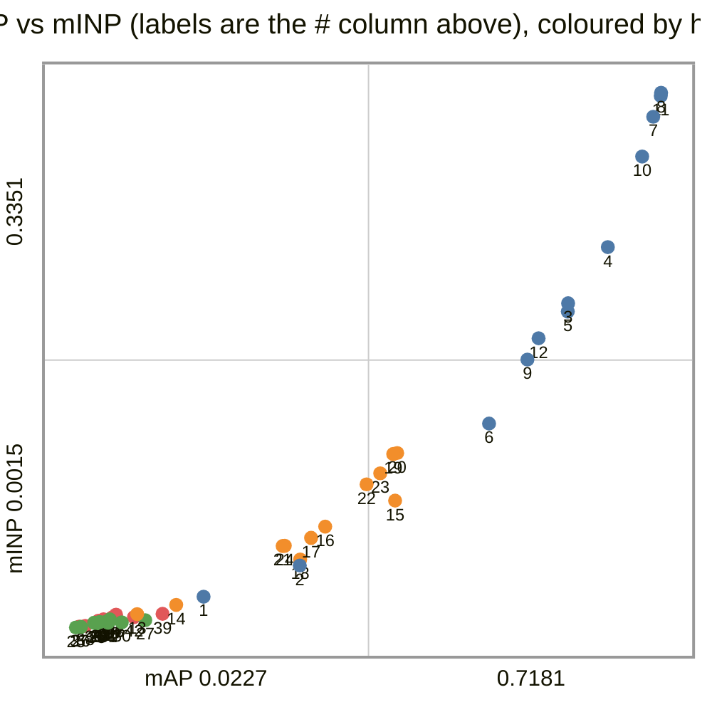
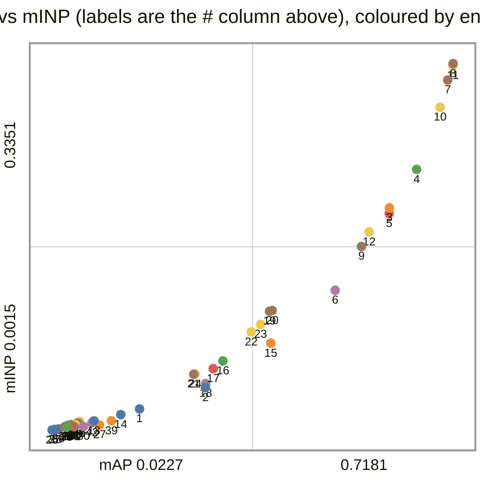
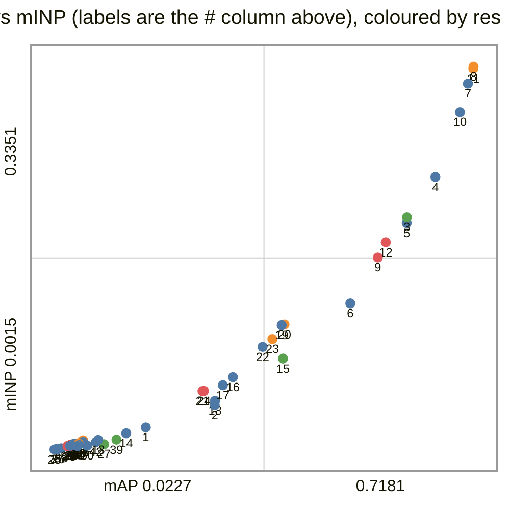
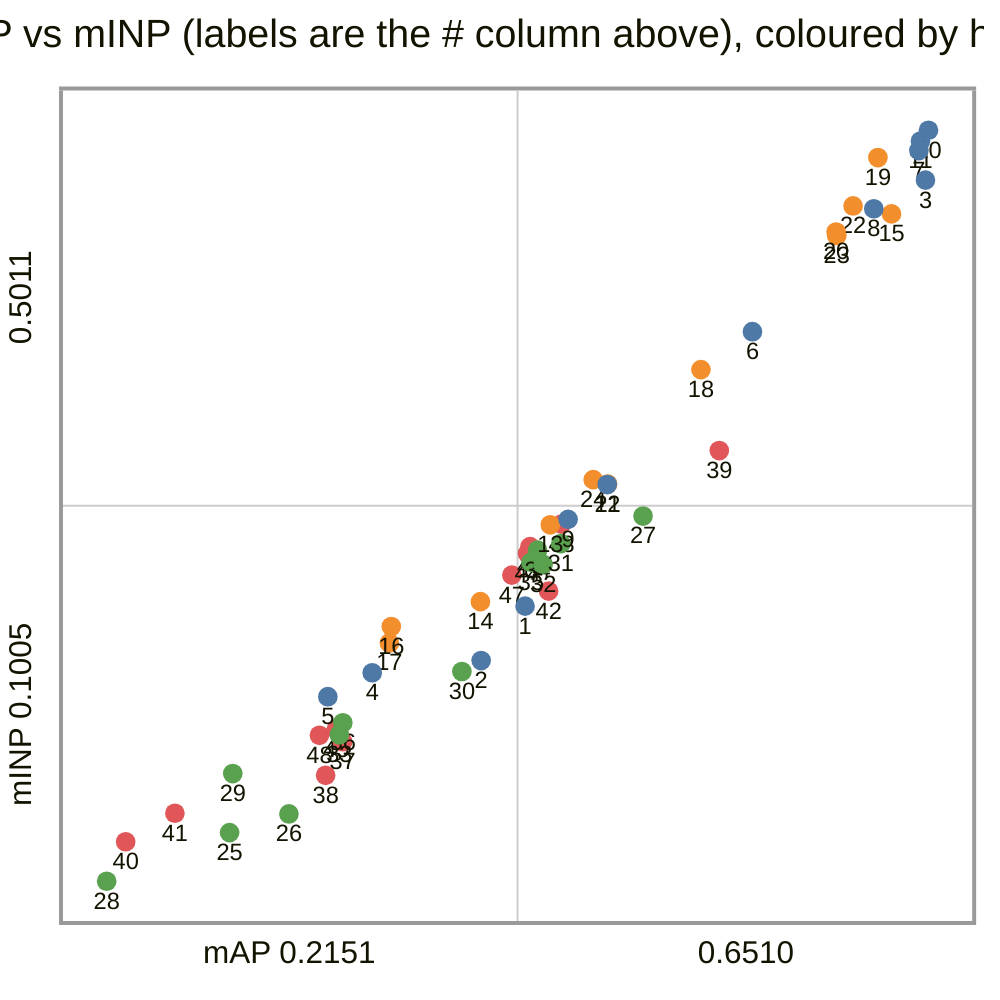
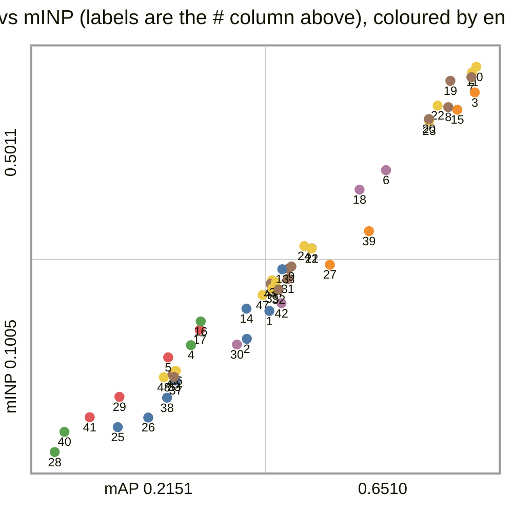
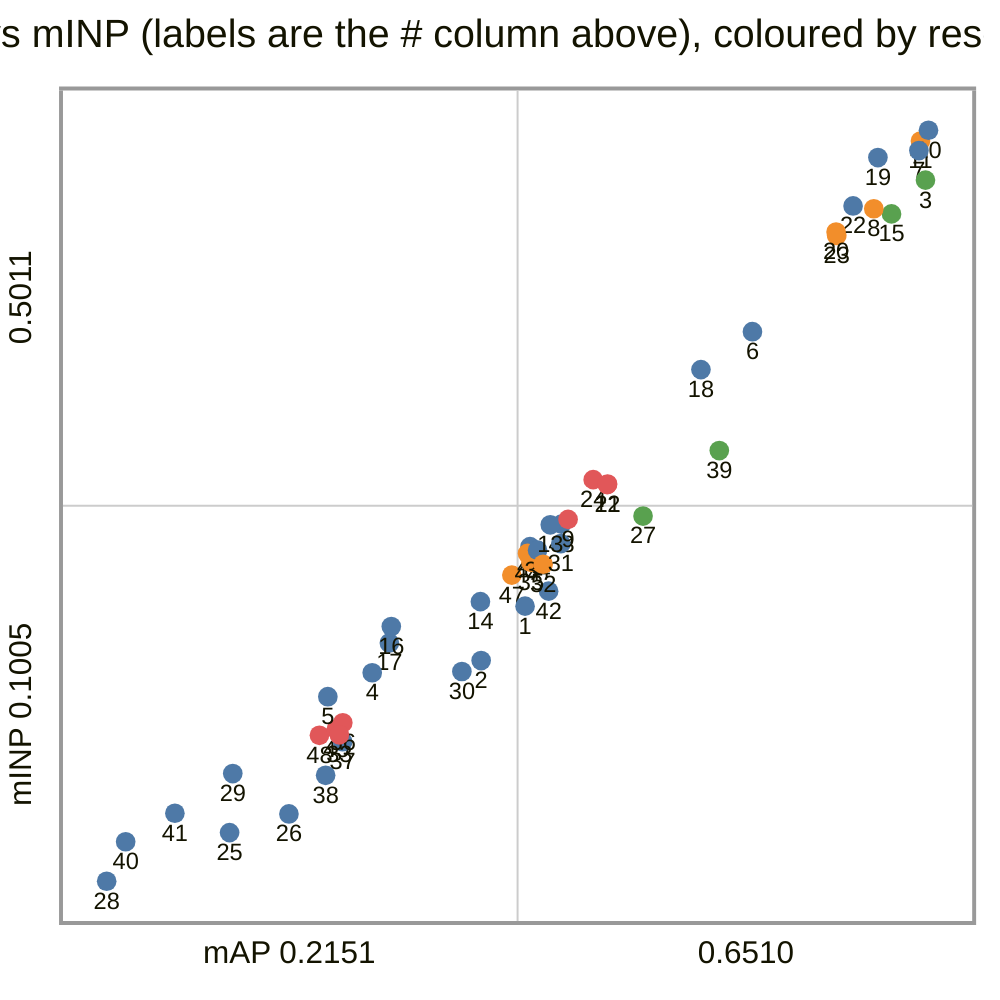

# Datasets

## market1501

*Every row below: protocol `market1501/official@1`.*

### 🟦 arcface

|  # | encoder                                       | resolution | resize |        mAP |         R1 |         R5 |        R10 |       mINP |
|---:|-----------------------------------------------|------------|--------|-----------:|-----------:|-----------:|-----------:|-----------:|
|  1 | timm:vit_base_patch16_clip_224.openai         | 224x224    | crop   |     0.1744 |     0.3560 |     0.5903 |     0.6850 |     0.0207 |
|  2 | timm:vit_base_patch16_clip_224.openai         | 224x224    | squash |     0.2887 |     0.5389 |     0.7589 |     0.8260 |     0.0401 |
|  3 | timm:vit_giantopt_patch16_siglip_256.v2_webli | 256x256    | squash |     0.6077 |     0.8257 |     0.9267 |     0.9483 |     0.2038 |
|  4 | timm:vit_huge_plus_patch16_dinov3.lvd1689m    | 224x224    | squash |     0.6548 |     0.8584 |     0.9525 |     0.9712 |     0.2388 |
|  5 | timm:vit_large_patch16_dinov3.lvd1689m        | 224x224    | squash |     0.6072 |     0.8287 |     0.9397 |     0.9629 |     0.1986 |
|  6 | timm:vit_so400m_patch14_siglip_224.v2_webli   | 224x224    | squash |     0.5137 |     0.7559 |     0.8943 |     0.9281 |     0.1287 |
|  7 | torchhub:NVlabs/RADIO/c-radio_v4-h            | 224x224    | squash |     0.7087 |     0.8789 |     0.9569 |     0.9736 |     0.3202 |
|  8 | torchhub:NVlabs/RADIO/c-radio_v4-h            | 256x128    | squash | **0.7181** | **0.8872** | **0.9650** | **0.9786** | **0.3351** |
|  9 | torchhub:NVlabs/RADIO/c-radio_v4-h            | native     | squash |     0.5593 |     0.8014 |     0.9255 |     0.9519 |     0.1686 |
| 10 | torchhub:NVlabs/RADIO/c-radio_v4-so400m       | 224x224    | squash |     0.6957 |     0.8723 |     0.9575 |     0.9715 |     0.2953 |
| 11 | torchhub:NVlabs/RADIO/c-radio_v4-so400m       | 256x128    | squash |     0.7177 |     0.8854 |     0.9638 |     0.9774 |     0.3331 |
| 12 | torchhub:NVlabs/RADIO/c-radio_v4-so400m       | native     | squash |     0.5726 |     0.8070 |     0.9210 |     0.9507 |     0.1819 |

### 🟧 linear

|  # | encoder                                       | resolution | resize |        mAP |         R1 |         R5 |        R10 |       mINP |
|---:|-----------------------------------------------|------------|--------|-----------:|-----------:|-----------:|-----------:|-----------:|
| 13 | timm:vit_base_patch16_clip_224.openai         | 224x224    | crop   |     0.0954 |     0.2185 |     0.4077 |     0.5050 |     0.0098 |
| 14 | timm:vit_base_patch16_clip_224.openai         | 224x224    | squash |     0.1419 |     0.3118 |     0.5291 |     0.6378 |     0.0156 |
| 15 | timm:vit_giantopt_patch16_siglip_256.v2_webli | 256x256    | squash |     0.4020 | **0.6437** | **0.8257** |     0.8759 |     0.0806 |
| 16 | timm:vit_huge_plus_patch16_dinov3.lvd1689m    | 224x224    | squash |     0.3189 |     0.5356 |     0.7556 |     0.8216 |     0.0644 |
| 17 | timm:vit_large_patch16_dinov3.lvd1689m        | 224x224    | squash |     0.3022 |     0.5163 |     0.7512 |     0.8269 |     0.0574 |
| 18 | timm:vit_so400m_patch14_siglip_224.v2_webli   | 224x224    | squash |     0.2892 |     0.5181 |     0.7340 |     0.8031 |     0.0439 |
| 19 | torchhub:NVlabs/RADIO/c-radio_v4-h            | 224x224    | squash |     0.3998 |     0.5929 |     0.8094 |     0.8747 |     0.1097 |
| 20 | torchhub:NVlabs/RADIO/c-radio_v4-h            | 256x128    | squash | **0.4045** |     0.6107 |     0.8138 | **0.8800** | **0.1103** |
| 21 | torchhub:NVlabs/RADIO/c-radio_v4-h            | native     | squash |     0.2684 |     0.4641 |     0.7078 |     0.7892 |     0.0523 |
| 22 | torchhub:NVlabs/RADIO/c-radio_v4-so400m       | 224x224    | squash |     0.3681 |     0.5793 |     0.7800 |     0.8486 |     0.0908 |
| 23 | torchhub:NVlabs/RADIO/c-radio_v4-so400m       | 256x128    | squash |     0.3844 |     0.5843 |     0.8043 |     0.8726 |     0.0977 |
| 24 | torchhub:NVlabs/RADIO/c-radio_v4-so400m       | native     | squash |     0.2709 |     0.4626 |     0.7007 |     0.7925 |     0.0525 |

### 🟩 none

|  # | encoder                                       | resolution | resize |        mAP |         R1 |         R5 |        R10 |       mINP |
|---:|-----------------------------------------------|------------|--------|-----------:|-----------:|-----------:|-----------:|-----------:|
| 25 | timm:vit_base_patch16_clip_224.openai         | 224x224    | crop   |     0.0227 |     0.0879 |     0.1829 |     0.2381 |     0.0015 |
| 26 | timm:vit_base_patch16_clip_224.openai         | 224x224    | squash |     0.0287 |     0.1072 |     0.2203 |     0.2886 |     0.0018 |
| 27 | timm:vit_giantopt_patch16_siglip_256.v2_webli | 256x256    | squash | **0.1051** | **0.3150** | **0.4834** | **0.5659** |     0.0060 |
| 28 | timm:vit_huge_plus_patch16_dinov3.lvd1689m    | 224x224    | squash |     0.0487 |     0.1565 |     0.2812 |     0.3483 |     0.0046 |
| 29 | timm:vit_large_patch16_dinov3.lvd1689m        | 224x224    | squash |     0.0512 |     0.1553 |     0.2836 |     0.3560 |     0.0049 |
| 30 | timm:vit_so400m_patch14_siglip_224.v2_webli   | 224x224    | squash |     0.0772 |     0.2292 |     0.3988 |     0.4715 |     0.0047 |
| 31 | torchhub:NVlabs/RADIO/c-radio_v4-h            | 224x224    | squash |     0.0610 |     0.1838 |     0.3207 |     0.3955 |     0.0044 |
| 32 | torchhub:NVlabs/RADIO/c-radio_v4-h            | 256x128    | squash |     0.0592 |     0.1799 |     0.3224 |     0.3955 |     0.0052 |
| 33 | torchhub:NVlabs/RADIO/c-radio_v4-h            | native     | squash |     0.0443 |     0.1393 |     0.2672 |     0.3305 |     0.0044 |
| 34 | torchhub:NVlabs/RADIO/c-radio_v4-so400m       | 224x224    | squash |     0.0628 |     0.1832 |     0.3180 |     0.3869 |     0.0055 |
| 35 | torchhub:NVlabs/RADIO/c-radio_v4-so400m       | 256x128    | squash |     0.0631 |     0.1817 |     0.3219 |     0.3893 | **0.0066** |
| 36 | torchhub:NVlabs/RADIO/c-radio_v4-so400m       | native     | squash |     0.0472 |     0.1369 |     0.2746 |     0.3453 |     0.0040 |

### 🟥 pca

|  # | encoder                                       | resolution | resize |        mAP |         R1 |         R5 |        R10 |       mINP |
|---:|-----------------------------------------------|------------|--------|-----------:|-----------:|-----------:|-----------:|-----------:|
| 37 | timm:vit_base_patch16_clip_224.openai         | 224x224    | crop   |     0.0266 |     0.0971 |     0.1891 |     0.2497 |     0.0020 |
| 38 | timm:vit_base_patch16_clip_224.openai         | 224x224    | squash |     0.0339 |     0.1161 |     0.2260 |     0.2895 |     0.0025 |
| 39 | timm:vit_giantopt_patch16_siglip_256.v2_webli | 256x256    | squash | **0.1257** | **0.3337** | **0.5107** | **0.5894** | **0.0100** |
| 40 | timm:vit_huge_plus_patch16_dinov3.lvd1689m    | 224x224    | squash |     0.0555 |     0.1681 |     0.2874 |     0.3548 |     0.0065 |
| 41 | timm:vit_large_patch16_dinov3.lvd1689m        | 224x224    | squash |     0.0555 |     0.1630 |     0.2841 |     0.3441 |     0.0063 |
| 42 | timm:vit_so400m_patch14_siglip_224.v2_webli   | 224x224    | squash |     0.0917 |     0.2423 |     0.4121 |     0.4822 |     0.0079 |
| 43 | torchhub:NVlabs/RADIO/c-radio_v4-h            | 224x224    | squash |     0.0690 |     0.1912 |     0.3201 |     0.3916 |     0.0076 |
| 44 | torchhub:NVlabs/RADIO/c-radio_v4-h            | 256x128    | squash |     0.0660 |     0.1876 |     0.3174 |     0.3866 |     0.0078 |
| 45 | torchhub:NVlabs/RADIO/c-radio_v4-h            | native     | squash |     0.0493 |     0.1434 |     0.2675 |     0.3325 |     0.0057 |
| 46 | torchhub:NVlabs/RADIO/c-radio_v4-so400m       | 224x224    | squash |     0.0704 |     0.1879 |     0.3204 |     0.3839 |     0.0080 |
| 47 | torchhub:NVlabs/RADIO/c-radio_v4-so400m       | 256x128    | squash |     0.0704 |     0.1826 |     0.3189 |     0.3872 |     0.0095 |
| 48 | torchhub:NVlabs/RADIO/c-radio_v4-so400m       | native     | squash |     0.0531 |     0.1437 |     0.2770 |     0.3456 |     0.0052 |

### Every row, by encoder and resolution

```mermaid
%%{init: {"themeVariables": {"quadrant1Fill": "transparent", "quadrant2Fill": "transparent", "quadrant3Fill": "transparent", "quadrant4Fill": "transparent", "quadrantExternalBorderStrokeFill": "#999999", "quadrantInternalBorderStrokeFill": "#cccccc", "quadrantPointFill": "#4e79a7"}}}%%
quadrantChart
    title mAP vs mINP (labels are the # column above), coloured by head
    x-axis "mAP 0.0227" --> "0.7181"
    y-axis "mINP 0.0015" --> "0.3351"
    quadrant-1 " "
    quadrant-2 " "
    quadrant-3 " "
    quadrant-4 " "
    1:::sarcface: [0.2463, 0.1018]
    2:::sarcface: [0.3943, 0.1543]
    3:::sarcface: [0.8070, 0.5957]
    4:::sarcface: [0.8681, 0.6902]
    5:::sarcface: [0.8065, 0.5817]
    6:::sarcface: [0.6854, 0.3932]
    7:::sarcface: [0.9379, 0.9096]
    8:::sarcface: [0.9500, 0.9500]
    9:::sarcface: [0.7444, 0.5009]
    10:::sarcface: [0.9209, 0.8427]
    11:::sarcface: [0.9495, 0.9446]
    12:::sarcface: [0.7616, 0.5367]
    13:::slinear: [0.1441, 0.0725]
    14:::slinear: [0.2042, 0.0880]
    15:::slinear: [0.5409, 0.2635]
    16:::slinear: [0.4334, 0.2198]
    17:::slinear: [0.4117, 0.2008]
    18:::slinear: [0.3949, 0.1644]
    19:::slinear: [0.5380, 0.3419]
    20:::slinear: [0.5441, 0.3436]
    21:::slinear: [0.3679, 0.1871]
    22:::slinear: [0.4970, 0.2909]
    23:::slinear: [0.5180, 0.3095]
    24:::slinear: [0.3712, 0.1875]
    25:::snone: [0.0500, 0.0500]
    26:::snone: [0.0578, 0.0510]
    27:::snone: [0.1566, 0.0623]
    28:::snone: [0.0836, 0.0584]
    29:::snone: [0.0868, 0.0593]
    30:::snone: [0.1205, 0.0587]
    31:::snone: [0.0995, 0.0580]
    32:::snone: [0.0972, 0.0601]
    33:::snone: [0.0779, 0.0579]
    34:::snone: [0.1019, 0.0610]
    35:::snone: [0.1022, 0.0637]
    36:::snone: [0.0817, 0.0568]
    37:::spca: [0.0551, 0.0514]
    38:::spca: [0.0644, 0.0527]
    39:::spca: [0.1832, 0.0729]
    40:::spca: [0.0924, 0.0636]
    41:::spca: [0.0924, 0.0630]
    42:::spca: [0.1393, 0.0674]
    43:::spca: [0.1099, 0.0666]
    44:::spca: [0.1059, 0.0670]
    45:::spca: [0.0844, 0.0613]
    46:::spca: [0.1117, 0.0676]
    47:::spca: [0.1117, 0.0716]
    48:::spca: [0.0892, 0.0600]
    classDef sarcface color: #4e79a7
    classDef slinear color: #f28e2b
    classDef snone color: #59a14f
    classDef spca color: #e15759
```

```mermaid
%%{init: {"themeVariables": {"xyChart": {"backgroundColor": "transparent", "plotColorPalette": "#4e79a7,#f28e2b,#59a14f,#e15759"}}, "xyChart": {"height": 1384, "width": 1215, "yAxis": {"showLabel": false}}}}%%
xychart-beta horizontal
    title "mAP, coloured by head"
    x-axis ["vit_base_patch16_clip_224.openai 224x224 arcface crop · 17.44%", "vit_base_patch16_clip_224.openai 224x224 arcface squash · 28.87%", "vit_base_patch16_clip_224.openai 224x224 linear crop · 9.54%", "vit_base_patch16_clip_224.openai 224x224 linear squash · 14.19%", "vit_base_patch16_clip_224.openai 224x224 none crop · 2.27%", "vit_base_patch16_clip_224.openai 224x224 none squash · 2.87%", "vit_base_patch16_clip_224.openai 224x224 pca crop · 2.66%", "vit_base_patch16_clip_224.openai 224x224 pca squash · 3.39%", "vit_giantopt_patch16_siglip_256.v2_webli 256x256 arcface squash · 60.77%", "vit_giantopt_patch16_siglip_256.v2_webli 256x256 linear squash · 40.20%", "vit_giantopt_patch16_siglip_256.v2_webli 256x256 none squash · 10.51%", "vit_giantopt_patch16_siglip_256.v2_webli 256x256 pca squash · 12.57%", "vit_huge_plus_patch16_dinov3.lvd1689m 224x224 arcface squash · 65.48%", "vit_huge_plus_patch16_dinov3.lvd1689m 224x224 linear squash · 31.89%", "vit_huge_plus_patch16_dinov3.lvd1689m 224x224 none squash · 4.87%", "vit_huge_plus_patch16_dinov3.lvd1689m 224x224 pca squash · 5.55%", "vit_large_patch16_dinov3.lvd1689m 224x224 arcface squash · 60.72%", "vit_large_patch16_dinov3.lvd1689m 224x224 linear squash · 30.22%", "vit_large_patch16_dinov3.lvd1689m 224x224 none squash · 5.12%", "vit_large_patch16_dinov3.lvd1689m 224x224 pca squash · 5.55%", "vit_so400m_patch14_siglip_224.v2_webli 224x224 arcface squash · 51.37%", "vit_so400m_patch14_siglip_224.v2_webli 224x224 linear squash · 28.92%", "vit_so400m_patch14_siglip_224.v2_webli 224x224 none squash · 7.72%", "vit_so400m_patch14_siglip_224.v2_webli 224x224 pca squash · 9.17%", "c-radio_v4-h 224x224 arcface squash · 70.87%", "c-radio_v4-h 224x224 linear squash · 39.98%", "c-radio_v4-h 224x224 none squash · 6.10%", "c-radio_v4-h 224x224 pca squash · 6.90%", "c-radio_v4-h 256x128 arcface squash · 71.81%", "c-radio_v4-h 256x128 linear squash · 40.45%", "c-radio_v4-h 256x128 none squash · 5.92%", "c-radio_v4-h 256x128 pca squash · 6.60%", "c-radio_v4-h native arcface squash · 55.93%", "c-radio_v4-h native linear squash · 26.84%", "c-radio_v4-h native none squash · 4.43%", "c-radio_v4-h native pca squash · 4.93%", "c-radio_v4-so400m 224x224 arcface squash · 69.57%", "c-radio_v4-so400m 224x224 linear squash · 36.81%", "c-radio_v4-so400m 224x224 none squash · 6.28%", "c-radio_v4-so400m 224x224 pca squash · 7.04%", "c-radio_v4-so400m 256x128 arcface squash · 71.77%", "c-radio_v4-so400m 256x128 linear squash · 38.44%", "c-radio_v4-so400m 256x128 none squash · 6.31%", "c-radio_v4-so400m 256x128 pca squash · 7.04%", "c-radio_v4-so400m native arcface squash · 57.26%", "c-radio_v4-so400m native linear squash · 27.09%", "c-radio_v4-so400m native none squash · 4.72%", "c-radio_v4-so400m native pca squash · 5.31%"]
    y-axis "mAP (%)" 0 --> 75.40
    bar [17.44, 28.87, 0.00, 0.00, 0.00, 0.00, 0.00, 0.00, 60.77, 0.00, 0.00, 0.00, 65.48, 0.00, 0.00, 0.00, 60.72, 0.00, 0.00, 0.00, 51.37, 0.00, 0.00, 0.00, 70.87, 0.00, 0.00, 0.00, 71.81, 0.00, 0.00, 0.00, 55.93, 0.00, 0.00, 0.00, 69.57, 0.00, 0.00, 0.00, 71.77, 0.00, 0.00, 0.00, 57.26, 0.00, 0.00, 0.00]
    bar [0.00, 0.00, 9.54, 14.19, 0.00, 0.00, 0.00, 0.00, 0.00, 40.20, 0.00, 0.00, 0.00, 31.89, 0.00, 0.00, 0.00, 30.22, 0.00, 0.00, 0.00, 28.92, 0.00, 0.00, 0.00, 39.98, 0.00, 0.00, 0.00, 40.45, 0.00, 0.00, 0.00, 26.84, 0.00, 0.00, 0.00, 36.81, 0.00, 0.00, 0.00, 38.44, 0.00, 0.00, 0.00, 27.09, 0.00, 0.00]
    bar [0.00, 0.00, 0.00, 0.00, 2.27, 2.87, 0.00, 0.00, 0.00, 0.00, 10.51, 0.00, 0.00, 0.00, 4.87, 0.00, 0.00, 0.00, 5.12, 0.00, 0.00, 0.00, 7.72, 0.00, 0.00, 0.00, 6.10, 0.00, 0.00, 0.00, 5.92, 0.00, 0.00, 0.00, 4.43, 0.00, 0.00, 0.00, 6.28, 0.00, 0.00, 0.00, 6.31, 0.00, 0.00, 0.00, 4.72, 0.00]
    bar [0.00, 0.00, 0.00, 0.00, 0.00, 0.00, 2.66, 3.39, 0.00, 0.00, 0.00, 12.57, 0.00, 0.00, 0.00, 5.55, 0.00, 0.00, 0.00, 5.55, 0.00, 0.00, 0.00, 9.17, 0.00, 0.00, 0.00, 6.90, 0.00, 0.00, 0.00, 6.60, 0.00, 0.00, 0.00, 4.93, 0.00, 0.00, 0.00, 7.04, 0.00, 0.00, 0.00, 7.04, 0.00, 0.00, 0.00, 5.31]
```

### By head — does the probe carry it?

```mermaid
%%{init: {"themeVariables": {"xyChart": {"backgroundColor": "transparent", "plotColorPalette": "#4e79a7,#f28e2b,#59a14f,#e15759"}}, "xyChart": {"height": 1384, "width": 1215, "yAxis": {"showLabel": false}}}}%%
xychart-beta horizontal
    title "mAP, coloured by head"
    x-axis ["arcface vit_base_patch16_clip_224.openai 224x224 crop · 17.44%", "arcface vit_base_patch16_clip_224.openai 224x224 squash · 28.87%", "arcface vit_giantopt_patch16_siglip_256.v2_webli 256x256 squash · 60.77%", "arcface vit_huge_plus_patch16_dinov3.lvd1689m 224x224 squash · 65.48%", "arcface vit_large_patch16_dinov3.lvd1689m 224x224 squash · 60.72%", "arcface vit_so400m_patch14_siglip_224.v2_webli 224x224 squash · 51.37%", "arcface c-radio_v4-h 224x224 squash · 70.87%", "arcface c-radio_v4-h 256x128 squash · 71.81%", "arcface c-radio_v4-h native squash · 55.93%", "arcface c-radio_v4-so400m 224x224 squash · 69.57%", "arcface c-radio_v4-so400m 256x128 squash · 71.77%", "arcface c-radio_v4-so400m native squash · 57.26%", "linear vit_base_patch16_clip_224.openai 224x224 crop · 9.54%", "linear vit_base_patch16_clip_224.openai 224x224 squash · 14.19%", "linear vit_giantopt_patch16_siglip_256.v2_webli 256x256 squash · 40.20%", "linear vit_huge_plus_patch16_dinov3.lvd1689m 224x224 squash · 31.89%", "linear vit_large_patch16_dinov3.lvd1689m 224x224 squash · 30.22%", "linear vit_so400m_patch14_siglip_224.v2_webli 224x224 squash · 28.92%", "linear c-radio_v4-h 224x224 squash · 39.98%", "linear c-radio_v4-h 256x128 squash · 40.45%", "linear c-radio_v4-h native squash · 26.84%", "linear c-radio_v4-so400m 224x224 squash · 36.81%", "linear c-radio_v4-so400m 256x128 squash · 38.44%", "linear c-radio_v4-so400m native squash · 27.09%", "none vit_base_patch16_clip_224.openai 224x224 crop · 2.27%", "none vit_base_patch16_clip_224.openai 224x224 squash · 2.87%", "none vit_giantopt_patch16_siglip_256.v2_webli 256x256 squash · 10.51%", "none vit_huge_plus_patch16_dinov3.lvd1689m 224x224 squash · 4.87%", "none vit_large_patch16_dinov3.lvd1689m 224x224 squash · 5.12%", "none vit_so400m_patch14_siglip_224.v2_webli 224x224 squash · 7.72%", "none c-radio_v4-h 224x224 squash · 6.10%", "none c-radio_v4-h 256x128 squash · 5.92%", "none c-radio_v4-h native squash · 4.43%", "none c-radio_v4-so400m 224x224 squash · 6.28%", "none c-radio_v4-so400m 256x128 squash · 6.31%", "none c-radio_v4-so400m native squash · 4.72%", "pca vit_base_patch16_clip_224.openai 224x224 crop · 2.66%", "pca vit_base_patch16_clip_224.openai 224x224 squash · 3.39%", "pca vit_giantopt_patch16_siglip_256.v2_webli 256x256 squash · 12.57%", "pca vit_huge_plus_patch16_dinov3.lvd1689m 224x224 squash · 5.55%", "pca vit_large_patch16_dinov3.lvd1689m 224x224 squash · 5.55%", "pca vit_so400m_patch14_siglip_224.v2_webli 224x224 squash · 9.17%", "pca c-radio_v4-h 224x224 squash · 6.90%", "pca c-radio_v4-h 256x128 squash · 6.60%", "pca c-radio_v4-h native squash · 4.93%", "pca c-radio_v4-so400m 224x224 squash · 7.04%", "pca c-radio_v4-so400m 256x128 squash · 7.04%", "pca c-radio_v4-so400m native squash · 5.31%"]
    y-axis "mAP (%)" 0 --> 75.40
    bar [17.44, 28.87, 60.77, 65.48, 60.72, 51.37, 70.87, 71.81, 55.93, 69.57, 71.77, 57.26, 0.00, 0.00, 0.00, 0.00, 0.00, 0.00, 0.00, 0.00, 0.00, 0.00, 0.00, 0.00, 0.00, 0.00, 0.00, 0.00, 0.00, 0.00, 0.00, 0.00, 0.00, 0.00, 0.00, 0.00, 0.00, 0.00, 0.00, 0.00, 0.00, 0.00, 0.00, 0.00, 0.00, 0.00, 0.00, 0.00]
    bar [0.00, 0.00, 0.00, 0.00, 0.00, 0.00, 0.00, 0.00, 0.00, 0.00, 0.00, 0.00, 9.54, 14.19, 40.20, 31.89, 30.22, 28.92, 39.98, 40.45, 26.84, 36.81, 38.44, 27.09, 0.00, 0.00, 0.00, 0.00, 0.00, 0.00, 0.00, 0.00, 0.00, 0.00, 0.00, 0.00, 0.00, 0.00, 0.00, 0.00, 0.00, 0.00, 0.00, 0.00, 0.00, 0.00, 0.00, 0.00]
    bar [0.00, 0.00, 0.00, 0.00, 0.00, 0.00, 0.00, 0.00, 0.00, 0.00, 0.00, 0.00, 0.00, 0.00, 0.00, 0.00, 0.00, 0.00, 0.00, 0.00, 0.00, 0.00, 0.00, 0.00, 2.27, 2.87, 10.51, 4.87, 5.12, 7.72, 6.10, 5.92, 4.43, 6.28, 6.31, 4.72, 0.00, 0.00, 0.00, 0.00, 0.00, 0.00, 0.00, 0.00, 0.00, 0.00, 0.00, 0.00]
    bar [0.00, 0.00, 0.00, 0.00, 0.00, 0.00, 0.00, 0.00, 0.00, 0.00, 0.00, 0.00, 0.00, 0.00, 0.00, 0.00, 0.00, 0.00, 0.00, 0.00, 0.00, 0.00, 0.00, 0.00, 0.00, 0.00, 0.00, 0.00, 0.00, 0.00, 0.00, 0.00, 0.00, 0.00, 0.00, 0.00, 2.66, 3.39, 12.57, 5.55, 5.55, 9.17, 6.90, 6.60, 4.93, 7.04, 7.04, 5.31]
```

### By encoder — does the checkpoint carry it?

*Colour — encoder:* 🟦 timm:vit_base_patch16_clip_224.openai · 🟧 timm:vit_giantopt_patch16_siglip_256.v2_webli · 🟩 timm:vit_huge_plus_patch16_dinov3.lvd1689m · 🟥 timm:vit_large_patch16_dinov3.lvd1689m · 🟪 timm:vit_so400m_patch14_siglip_224.v2_webli · 🟫 torchhub:NVlabs/RADIO/c-radio_v4-h · 🟨 torchhub:NVlabs/RADIO/c-radio_v4-so400m

```mermaid
%%{init: {"themeVariables": {"quadrant1Fill": "transparent", "quadrant2Fill": "transparent", "quadrant3Fill": "transparent", "quadrant4Fill": "transparent", "quadrantExternalBorderStrokeFill": "#999999", "quadrantInternalBorderStrokeFill": "#cccccc", "quadrantPointFill": "#4e79a7"}}}%%
quadrantChart
    title mAP vs mINP (labels are the # column above), coloured by encoder
    x-axis "mAP 0.0227" --> "0.7181"
    y-axis "mINP 0.0015" --> "0.3351"
    quadrant-1 " "
    quadrant-2 " "
    quadrant-3 " "
    quadrant-4 " "
    1:::stimmvitbasepatch16clip224openai: [0.2463, 0.1018]
    2:::stimmvitbasepatch16clip224openai: [0.3943, 0.1543]
    3:::stimmvitgiantoptpatch16siglip256v2webli: [0.8070, 0.5957]
    4:::stimmvithugepluspatch16dinov3lvd1689m: [0.8681, 0.6902]
    5:::stimmvitlargepatch16dinov3lvd1689m: [0.8065, 0.5817]
    6:::stimmvitso400mpatch14siglip224v2webli: [0.6854, 0.3932]
    7:::storchhubNVlabsRADIOcradiov4h: [0.9379, 0.9096]
    8:::storchhubNVlabsRADIOcradiov4h: [0.9500, 0.9500]
    9:::storchhubNVlabsRADIOcradiov4h: [0.7444, 0.5009]
    10:::storchhubNVlabsRADIOcradiov4so400m: [0.9209, 0.8427]
    11:::storchhubNVlabsRADIOcradiov4so400m: [0.9495, 0.9446]
    12:::storchhubNVlabsRADIOcradiov4so400m: [0.7616, 0.5367]
    13:::stimmvitbasepatch16clip224openai: [0.1441, 0.0725]
    14:::stimmvitbasepatch16clip224openai: [0.2042, 0.0880]
    15:::stimmvitgiantoptpatch16siglip256v2webli: [0.5409, 0.2635]
    16:::stimmvithugepluspatch16dinov3lvd1689m: [0.4334, 0.2198]
    17:::stimmvitlargepatch16dinov3lvd1689m: [0.4117, 0.2008]
    18:::stimmvitso400mpatch14siglip224v2webli: [0.3949, 0.1644]
    19:::storchhubNVlabsRADIOcradiov4h: [0.5380, 0.3419]
    20:::storchhubNVlabsRADIOcradiov4h: [0.5441, 0.3436]
    21:::storchhubNVlabsRADIOcradiov4h: [0.3679, 0.1871]
    22:::storchhubNVlabsRADIOcradiov4so400m: [0.4970, 0.2909]
    23:::storchhubNVlabsRADIOcradiov4so400m: [0.5180, 0.3095]
    24:::storchhubNVlabsRADIOcradiov4so400m: [0.3712, 0.1875]
    25:::stimmvitbasepatch16clip224openai: [0.0500, 0.0500]
    26:::stimmvitbasepatch16clip224openai: [0.0578, 0.0510]
    27:::stimmvitgiantoptpatch16siglip256v2webli: [0.1566, 0.0623]
    28:::stimmvithugepluspatch16dinov3lvd1689m: [0.0836, 0.0584]
    29:::stimmvitlargepatch16dinov3lvd1689m: [0.0868, 0.0593]
    30:::stimmvitso400mpatch14siglip224v2webli: [0.1205, 0.0587]
    31:::storchhubNVlabsRADIOcradiov4h: [0.0995, 0.0580]
    32:::storchhubNVlabsRADIOcradiov4h: [0.0972, 0.0601]
    33:::storchhubNVlabsRADIOcradiov4h: [0.0779, 0.0579]
    34:::storchhubNVlabsRADIOcradiov4so400m: [0.1019, 0.0610]
    35:::storchhubNVlabsRADIOcradiov4so400m: [0.1022, 0.0637]
    36:::storchhubNVlabsRADIOcradiov4so400m: [0.0817, 0.0568]
    37:::stimmvitbasepatch16clip224openai: [0.0551, 0.0514]
    38:::stimmvitbasepatch16clip224openai: [0.0644, 0.0527]
    39:::stimmvitgiantoptpatch16siglip256v2webli: [0.1832, 0.0729]
    40:::stimmvithugepluspatch16dinov3lvd1689m: [0.0924, 0.0636]
    41:::stimmvitlargepatch16dinov3lvd1689m: [0.0924, 0.0630]
    42:::stimmvitso400mpatch14siglip224v2webli: [0.1393, 0.0674]
    43:::storchhubNVlabsRADIOcradiov4h: [0.1099, 0.0666]
    44:::storchhubNVlabsRADIOcradiov4h: [0.1059, 0.0670]
    45:::storchhubNVlabsRADIOcradiov4h: [0.0844, 0.0613]
    46:::storchhubNVlabsRADIOcradiov4so400m: [0.1117, 0.0676]
    47:::storchhubNVlabsRADIOcradiov4so400m: [0.1117, 0.0716]
    48:::storchhubNVlabsRADIOcradiov4so400m: [0.0892, 0.0600]
    classDef stimmvitbasepatch16clip224openai color: #4e79a7
    classDef stimmvitgiantoptpatch16siglip256v2webli color: #f28e2b
    classDef stimmvithugepluspatch16dinov3lvd1689m color: #59a14f
    classDef stimmvitlargepatch16dinov3lvd1689m color: #e15759
    classDef stimmvitso400mpatch14siglip224v2webli color: #b07aa1
    classDef storchhubNVlabsRADIOcradiov4h color: #9c755f
    classDef storchhubNVlabsRADIOcradiov4so400m color: #edc948
```

```mermaid
%%{init: {"themeVariables": {"xyChart": {"backgroundColor": "transparent", "plotColorPalette": "#4e79a7,#f28e2b,#59a14f,#e15759,#b07aa1,#9c755f,#edc948"}}, "xyChart": {"height": 1384, "width": 1215, "yAxis": {"showLabel": false}}}}%%
xychart-beta horizontal
    title "mAP, coloured by encoder"
    x-axis ["vit_base_patch16_clip_224.openai arcface 224x224 crop · 17.44%", "vit_base_patch16_clip_224.openai arcface 224x224 squash · 28.87%", "vit_base_patch16_clip_224.openai linear 224x224 crop · 9.54%", "vit_base_patch16_clip_224.openai linear 224x224 squash · 14.19%", "vit_base_patch16_clip_224.openai none 224x224 crop · 2.27%", "vit_base_patch16_clip_224.openai none 224x224 squash · 2.87%", "vit_base_patch16_clip_224.openai pca 224x224 crop · 2.66%", "vit_base_patch16_clip_224.openai pca 224x224 squash · 3.39%", "vit_giantopt_patch16_siglip_256.v2_webli arcface 256x256 squash · 60.77%", "vit_giantopt_patch16_siglip_256.v2_webli linear 256x256 squash · 40.20%", "vit_giantopt_patch16_siglip_256.v2_webli none 256x256 squash · 10.51%", "vit_giantopt_patch16_siglip_256.v2_webli pca 256x256 squash · 12.57%", "vit_huge_plus_patch16_dinov3.lvd1689m arcface 224x224 squash · 65.48%", "vit_huge_plus_patch16_dinov3.lvd1689m linear 224x224 squash · 31.89%", "vit_huge_plus_patch16_dinov3.lvd1689m none 224x224 squash · 4.87%", "vit_huge_plus_patch16_dinov3.lvd1689m pca 224x224 squash · 5.55%", "vit_large_patch16_dinov3.lvd1689m arcface 224x224 squash · 60.72%", "vit_large_patch16_dinov3.lvd1689m linear 224x224 squash · 30.22%", "vit_large_patch16_dinov3.lvd1689m none 224x224 squash · 5.12%", "vit_large_patch16_dinov3.lvd1689m pca 224x224 squash · 5.55%", "vit_so400m_patch14_siglip_224.v2_webli arcface 224x224 squash · 51.37%", "vit_so400m_patch14_siglip_224.v2_webli linear 224x224 squash · 28.92%", "vit_so400m_patch14_siglip_224.v2_webli none 224x224 squash · 7.72%", "vit_so400m_patch14_siglip_224.v2_webli pca 224x224 squash · 9.17%", "c-radio_v4-h arcface 224x224 squash · 70.87%", "c-radio_v4-h arcface 256x128 squash · 71.81%", "c-radio_v4-h arcface native squash · 55.93%", "c-radio_v4-h linear 224x224 squash · 39.98%", "c-radio_v4-h linear 256x128 squash · 40.45%", "c-radio_v4-h linear native squash · 26.84%", "c-radio_v4-h none 224x224 squash · 6.10%", "c-radio_v4-h none 256x128 squash · 5.92%", "c-radio_v4-h none native squash · 4.43%", "c-radio_v4-h pca 224x224 squash · 6.90%", "c-radio_v4-h pca 256x128 squash · 6.60%", "c-radio_v4-h pca native squash · 4.93%", "c-radio_v4-so400m arcface 224x224 squash · 69.57%", "c-radio_v4-so400m arcface 256x128 squash · 71.77%", "c-radio_v4-so400m arcface native squash · 57.26%", "c-radio_v4-so400m linear 224x224 squash · 36.81%", "c-radio_v4-so400m linear 256x128 squash · 38.44%", "c-radio_v4-so400m linear native squash · 27.09%", "c-radio_v4-so400m none 224x224 squash · 6.28%", "c-radio_v4-so400m none 256x128 squash · 6.31%", "c-radio_v4-so400m none native squash · 4.72%", "c-radio_v4-so400m pca 224x224 squash · 7.04%", "c-radio_v4-so400m pca 256x128 squash · 7.04%", "c-radio_v4-so400m pca native squash · 5.31%"]
    y-axis "mAP (%)" 0 --> 75.40
    bar [17.44, 28.87, 9.54, 14.19, 2.27, 2.87, 2.66, 3.39, 0.00, 0.00, 0.00, 0.00, 0.00, 0.00, 0.00, 0.00, 0.00, 0.00, 0.00, 0.00, 0.00, 0.00, 0.00, 0.00, 0.00, 0.00, 0.00, 0.00, 0.00, 0.00, 0.00, 0.00, 0.00, 0.00, 0.00, 0.00, 0.00, 0.00, 0.00, 0.00, 0.00, 0.00, 0.00, 0.00, 0.00, 0.00, 0.00, 0.00]
    bar [0.00, 0.00, 0.00, 0.00, 0.00, 0.00, 0.00, 0.00, 60.77, 40.20, 10.51, 12.57, 0.00, 0.00, 0.00, 0.00, 0.00, 0.00, 0.00, 0.00, 0.00, 0.00, 0.00, 0.00, 0.00, 0.00, 0.00, 0.00, 0.00, 0.00, 0.00, 0.00, 0.00, 0.00, 0.00, 0.00, 0.00, 0.00, 0.00, 0.00, 0.00, 0.00, 0.00, 0.00, 0.00, 0.00, 0.00, 0.00]
    bar [0.00, 0.00, 0.00, 0.00, 0.00, 0.00, 0.00, 0.00, 0.00, 0.00, 0.00, 0.00, 65.48, 31.89, 4.87, 5.55, 0.00, 0.00, 0.00, 0.00, 0.00, 0.00, 0.00, 0.00, 0.00, 0.00, 0.00, 0.00, 0.00, 0.00, 0.00, 0.00, 0.00, 0.00, 0.00, 0.00, 0.00, 0.00, 0.00, 0.00, 0.00, 0.00, 0.00, 0.00, 0.00, 0.00, 0.00, 0.00]
    bar [0.00, 0.00, 0.00, 0.00, 0.00, 0.00, 0.00, 0.00, 0.00, 0.00, 0.00, 0.00, 0.00, 0.00, 0.00, 0.00, 60.72, 30.22, 5.12, 5.55, 0.00, 0.00, 0.00, 0.00, 0.00, 0.00, 0.00, 0.00, 0.00, 0.00, 0.00, 0.00, 0.00, 0.00, 0.00, 0.00, 0.00, 0.00, 0.00, 0.00, 0.00, 0.00, 0.00, 0.00, 0.00, 0.00, 0.00, 0.00]
    bar [0.00, 0.00, 0.00, 0.00, 0.00, 0.00, 0.00, 0.00, 0.00, 0.00, 0.00, 0.00, 0.00, 0.00, 0.00, 0.00, 0.00, 0.00, 0.00, 0.00, 51.37, 28.92, 7.72, 9.17, 0.00, 0.00, 0.00, 0.00, 0.00, 0.00, 0.00, 0.00, 0.00, 0.00, 0.00, 0.00, 0.00, 0.00, 0.00, 0.00, 0.00, 0.00, 0.00, 0.00, 0.00, 0.00, 0.00, 0.00]
    bar [0.00, 0.00, 0.00, 0.00, 0.00, 0.00, 0.00, 0.00, 0.00, 0.00, 0.00, 0.00, 0.00, 0.00, 0.00, 0.00, 0.00, 0.00, 0.00, 0.00, 0.00, 0.00, 0.00, 0.00, 70.87, 71.81, 55.93, 39.98, 40.45, 26.84, 6.10, 5.92, 4.43, 6.90, 6.60, 4.93, 0.00, 0.00, 0.00, 0.00, 0.00, 0.00, 0.00, 0.00, 0.00, 0.00, 0.00, 0.00]
    bar [0.00, 0.00, 0.00, 0.00, 0.00, 0.00, 0.00, 0.00, 0.00, 0.00, 0.00, 0.00, 0.00, 0.00, 0.00, 0.00, 0.00, 0.00, 0.00, 0.00, 0.00, 0.00, 0.00, 0.00, 0.00, 0.00, 0.00, 0.00, 0.00, 0.00, 0.00, 0.00, 0.00, 0.00, 0.00, 0.00, 69.57, 71.77, 57.26, 36.81, 38.44, 27.09, 6.28, 6.31, 4.72, 7.04, 7.04, 5.31]
```

### By resolution — does the input size carry it?

*Colour — resolution:* 🟦 224x224 · 🟧 256x128 · 🟩 256x256 · 🟥 native

```mermaid
%%{init: {"themeVariables": {"quadrant1Fill": "transparent", "quadrant2Fill": "transparent", "quadrant3Fill": "transparent", "quadrant4Fill": "transparent", "quadrantExternalBorderStrokeFill": "#999999", "quadrantInternalBorderStrokeFill": "#cccccc", "quadrantPointFill": "#4e79a7"}}}%%
quadrantChart
    title mAP vs mINP (labels are the # column above), coloured by resolution
    x-axis "mAP 0.0227" --> "0.7181"
    y-axis "mINP 0.0015" --> "0.3351"
    quadrant-1 " "
    quadrant-2 " "
    quadrant-3 " "
    quadrant-4 " "
    1:::s224x224: [0.2463, 0.1018]
    2:::s224x224: [0.3943, 0.1543]
    3:::s256x256: [0.8070, 0.5957]
    4:::s224x224: [0.8681, 0.6902]
    5:::s224x224: [0.8065, 0.5817]
    6:::s224x224: [0.6854, 0.3932]
    7:::s224x224: [0.9379, 0.9096]
    8:::s256x128: [0.9500, 0.9500]
    9:::snative: [0.7444, 0.5009]
    10:::s224x224: [0.9209, 0.8427]
    11:::s256x128: [0.9495, 0.9446]
    12:::snative: [0.7616, 0.5367]
    13:::s224x224: [0.1441, 0.0725]
    14:::s224x224: [0.2042, 0.0880]
    15:::s256x256: [0.5409, 0.2635]
    16:::s224x224: [0.4334, 0.2198]
    17:::s224x224: [0.4117, 0.2008]
    18:::s224x224: [0.3949, 0.1644]
    19:::s224x224: [0.5380, 0.3419]
    20:::s256x128: [0.5441, 0.3436]
    21:::snative: [0.3679, 0.1871]
    22:::s224x224: [0.4970, 0.2909]
    23:::s256x128: [0.5180, 0.3095]
    24:::snative: [0.3712, 0.1875]
    25:::s224x224: [0.0500, 0.0500]
    26:::s224x224: [0.0578, 0.0510]
    27:::s256x256: [0.1566, 0.0623]
    28:::s224x224: [0.0836, 0.0584]
    29:::s224x224: [0.0868, 0.0593]
    30:::s224x224: [0.1205, 0.0587]
    31:::s224x224: [0.0995, 0.0580]
    32:::s256x128: [0.0972, 0.0601]
    33:::snative: [0.0779, 0.0579]
    34:::s224x224: [0.1019, 0.0610]
    35:::s256x128: [0.1022, 0.0637]
    36:::snative: [0.0817, 0.0568]
    37:::s224x224: [0.0551, 0.0514]
    38:::s224x224: [0.0644, 0.0527]
    39:::s256x256: [0.1832, 0.0729]
    40:::s224x224: [0.0924, 0.0636]
    41:::s224x224: [0.0924, 0.0630]
    42:::s224x224: [0.1393, 0.0674]
    43:::s224x224: [0.1099, 0.0666]
    44:::s256x128: [0.1059, 0.0670]
    45:::snative: [0.0844, 0.0613]
    46:::s224x224: [0.1117, 0.0676]
    47:::s256x128: [0.1117, 0.0716]
    48:::snative: [0.0892, 0.0600]
    classDef s224x224 color: #4e79a7
    classDef s256x128 color: #f28e2b
    classDef s256x256 color: #59a14f
    classDef snative color: #e15759
```

```mermaid
%%{init: {"themeVariables": {"xyChart": {"backgroundColor": "transparent", "plotColorPalette": "#4e79a7,#f28e2b,#59a14f,#e15759"}}, "xyChart": {"height": 1384, "width": 1215, "yAxis": {"showLabel": false}}}}%%
xychart-beta horizontal
    title "mAP, coloured by resolution"
    x-axis ["224x224 vit_base_patch16_clip_224.openai arcface crop · 17.44%", "224x224 vit_base_patch16_clip_224.openai arcface squash · 28.87%", "224x224 vit_base_patch16_clip_224.openai linear crop · 9.54%", "224x224 vit_base_patch16_clip_224.openai linear squash · 14.19%", "224x224 vit_base_patch16_clip_224.openai none crop · 2.27%", "224x224 vit_base_patch16_clip_224.openai none squash · 2.87%", "224x224 vit_base_patch16_clip_224.openai pca crop · 2.66%", "224x224 vit_base_patch16_clip_224.openai pca squash · 3.39%", "224x224 vit_huge_plus_patch16_dinov3.lvd1689m arcface squash · 65.48%", "224x224 vit_huge_plus_patch16_dinov3.lvd1689m linear squash · 31.89%", "224x224 vit_huge_plus_patch16_dinov3.lvd1689m none squash · 4.87%", "224x224 vit_huge_plus_patch16_dinov3.lvd1689m pca squash · 5.55%", "224x224 vit_large_patch16_dinov3.lvd1689m arcface squash · 60.72%", "224x224 vit_large_patch16_dinov3.lvd1689m linear squash · 30.22%", "224x224 vit_large_patch16_dinov3.lvd1689m none squash · 5.12%", "224x224 vit_large_patch16_dinov3.lvd1689m pca squash · 5.55%", "224x224 vit_so400m_patch14_siglip_224.v2_webli arcface squash · 51.37%", "224x224 vit_so400m_patch14_siglip_224.v2_webli linear squash · 28.92%", "224x224 vit_so400m_patch14_siglip_224.v2_webli none squash · 7.72%", "224x224 vit_so400m_patch14_siglip_224.v2_webli pca squash · 9.17%", "224x224 c-radio_v4-h arcface squash · 70.87%", "224x224 c-radio_v4-h linear squash · 39.98%", "224x224 c-radio_v4-h none squash · 6.10%", "224x224 c-radio_v4-h pca squash · 6.90%", "224x224 c-radio_v4-so400m arcface squash · 69.57%", "224x224 c-radio_v4-so400m linear squash · 36.81%", "224x224 c-radio_v4-so400m none squash · 6.28%", "224x224 c-radio_v4-so400m pca squash · 7.04%", "256x128 c-radio_v4-h arcface squash · 71.81%", "256x128 c-radio_v4-h linear squash · 40.45%", "256x128 c-radio_v4-h none squash · 5.92%", "256x128 c-radio_v4-h pca squash · 6.60%", "256x128 c-radio_v4-so400m arcface squash · 71.77%", "256x128 c-radio_v4-so400m linear squash · 38.44%", "256x128 c-radio_v4-so400m none squash · 6.31%", "256x128 c-radio_v4-so400m pca squash · 7.04%", "256x256 vit_giantopt_patch16_siglip_256.v2_webli arcface squash · 60.77%", "256x256 vit_giantopt_patch16_siglip_256.v2_webli linear squash · 40.20%", "256x256 vit_giantopt_patch16_siglip_256.v2_webli none squash · 10.51%", "256x256 vit_giantopt_patch16_siglip_256.v2_webli pca squash · 12.57%", "native c-radio_v4-h arcface squash · 55.93%", "native c-radio_v4-h linear squash · 26.84%", "native c-radio_v4-h none squash · 4.43%", "native c-radio_v4-h pca squash · 4.93%", "native c-radio_v4-so400m arcface squash · 57.26%", "native c-radio_v4-so400m linear squash · 27.09%", "native c-radio_v4-so400m none squash · 4.72%", "native c-radio_v4-so400m pca squash · 5.31%"]
    y-axis "mAP (%)" 0 --> 75.40
    bar [17.44, 28.87, 9.54, 14.19, 2.27, 2.87, 2.66, 3.39, 65.48, 31.89, 4.87, 5.55, 60.72, 30.22, 5.12, 5.55, 51.37, 28.92, 7.72, 9.17, 70.87, 39.98, 6.10, 6.90, 69.57, 36.81, 6.28, 7.04, 0.00, 0.00, 0.00, 0.00, 0.00, 0.00, 0.00, 0.00, 0.00, 0.00, 0.00, 0.00, 0.00, 0.00, 0.00, 0.00, 0.00, 0.00, 0.00, 0.00]
    bar [0.00, 0.00, 0.00, 0.00, 0.00, 0.00, 0.00, 0.00, 0.00, 0.00, 0.00, 0.00, 0.00, 0.00, 0.00, 0.00, 0.00, 0.00, 0.00, 0.00, 0.00, 0.00, 0.00, 0.00, 0.00, 0.00, 0.00, 0.00, 71.81, 40.45, 5.92, 6.60, 71.77, 38.44, 6.31, 7.04, 0.00, 0.00, 0.00, 0.00, 0.00, 0.00, 0.00, 0.00, 0.00, 0.00, 0.00, 0.00]
    bar [0.00, 0.00, 0.00, 0.00, 0.00, 0.00, 0.00, 0.00, 0.00, 0.00, 0.00, 0.00, 0.00, 0.00, 0.00, 0.00, 0.00, 0.00, 0.00, 0.00, 0.00, 0.00, 0.00, 0.00, 0.00, 0.00, 0.00, 0.00, 0.00, 0.00, 0.00, 0.00, 0.00, 0.00, 0.00, 0.00, 60.77, 40.20, 10.51, 12.57, 0.00, 0.00, 0.00, 0.00, 0.00, 0.00, 0.00, 0.00]
    bar [0.00, 0.00, 0.00, 0.00, 0.00, 0.00, 0.00, 0.00, 0.00, 0.00, 0.00, 0.00, 0.00, 0.00, 0.00, 0.00, 0.00, 0.00, 0.00, 0.00, 0.00, 0.00, 0.00, 0.00, 0.00, 0.00, 0.00, 0.00, 0.00, 0.00, 0.00, 0.00, 0.00, 0.00, 0.00, 0.00, 0.00, 0.00, 0.00, 0.00, 55.93, 26.84, 4.43, 4.93, 57.26, 27.09, 4.72, 5.31]
```

### Resolution, within one encoder and head

*Colour — resolution:* 🟦 224x224 · 🟧 256x128 · 🟩 256x256 · 🟥 native

```mermaid
%%{init: {"themeVariables": {"xyChart": {"backgroundColor": "transparent", "plotColorPalette": "#4e79a7,#f28e2b,#59a14f,#e15759"}}, "xyChart": {"height": 1384, "width": 1215, "yAxis": {"showLabel": false}}}}%%
xychart-beta horizontal
    title "mAP, coloured by resolution"
    x-axis ["vit_base_patch16_clip_224.openai arcface 224x224 crop · 17.44%", "vit_base_patch16_clip_224.openai arcface 224x224 squash · 28.87%", "vit_base_patch16_clip_224.openai linear 224x224 crop · 9.54%", "vit_base_patch16_clip_224.openai linear 224x224 squash · 14.19%", "vit_base_patch16_clip_224.openai none 224x224 crop · 2.27%", "vit_base_patch16_clip_224.openai none 224x224 squash · 2.87%", "vit_base_patch16_clip_224.openai pca 224x224 crop · 2.66%", "vit_base_patch16_clip_224.openai pca 224x224 squash · 3.39%", "vit_giantopt_patch16_siglip_256.v2_webli arcface 256x256 squash · 60.77%", "vit_giantopt_patch16_siglip_256.v2_webli linear 256x256 squash · 40.20%", "vit_giantopt_patch16_siglip_256.v2_webli none 256x256 squash · 10.51%", "vit_giantopt_patch16_siglip_256.v2_webli pca 256x256 squash · 12.57%", "vit_huge_plus_patch16_dinov3.lvd1689m arcface 224x224 squash · 65.48%", "vit_huge_plus_patch16_dinov3.lvd1689m linear 224x224 squash · 31.89%", "vit_huge_plus_patch16_dinov3.lvd1689m none 224x224 squash · 4.87%", "vit_huge_plus_patch16_dinov3.lvd1689m pca 224x224 squash · 5.55%", "vit_large_patch16_dinov3.lvd1689m arcface 224x224 squash · 60.72%", "vit_large_patch16_dinov3.lvd1689m linear 224x224 squash · 30.22%", "vit_large_patch16_dinov3.lvd1689m none 224x224 squash · 5.12%", "vit_large_patch16_dinov3.lvd1689m pca 224x224 squash · 5.55%", "vit_so400m_patch14_siglip_224.v2_webli arcface 224x224 squash · 51.37%", "vit_so400m_patch14_siglip_224.v2_webli linear 224x224 squash · 28.92%", "vit_so400m_patch14_siglip_224.v2_webli none 224x224 squash · 7.72%", "vit_so400m_patch14_siglip_224.v2_webli pca 224x224 squash · 9.17%", "c-radio_v4-h arcface 224x224 squash · 70.87%", "c-radio_v4-h arcface 256x128 squash · 71.81%", "c-radio_v4-h arcface native squash · 55.93%", "c-radio_v4-h linear 224x224 squash · 39.98%", "c-radio_v4-h linear 256x128 squash · 40.45%", "c-radio_v4-h linear native squash · 26.84%", "c-radio_v4-h none 224x224 squash · 6.10%", "c-radio_v4-h none 256x128 squash · 5.92%", "c-radio_v4-h none native squash · 4.43%", "c-radio_v4-h pca 224x224 squash · 6.90%", "c-radio_v4-h pca 256x128 squash · 6.60%", "c-radio_v4-h pca native squash · 4.93%", "c-radio_v4-so400m arcface 224x224 squash · 69.57%", "c-radio_v4-so400m arcface 256x128 squash · 71.77%", "c-radio_v4-so400m arcface native squash · 57.26%", "c-radio_v4-so400m linear 224x224 squash · 36.81%", "c-radio_v4-so400m linear 256x128 squash · 38.44%", "c-radio_v4-so400m linear native squash · 27.09%", "c-radio_v4-so400m none 224x224 squash · 6.28%", "c-radio_v4-so400m none 256x128 squash · 6.31%", "c-radio_v4-so400m none native squash · 4.72%", "c-radio_v4-so400m pca 224x224 squash · 7.04%", "c-radio_v4-so400m pca 256x128 squash · 7.04%", "c-radio_v4-so400m pca native squash · 5.31%"]
    y-axis "mAP (%)" 0 --> 75.40
    bar [17.44, 28.87, 9.54, 14.19, 2.27, 2.87, 2.66, 3.39, 0.00, 0.00, 0.00, 0.00, 65.48, 31.89, 4.87, 5.55, 60.72, 30.22, 5.12, 5.55, 51.37, 28.92, 7.72, 9.17, 70.87, 0.00, 0.00, 39.98, 0.00, 0.00, 6.10, 0.00, 0.00, 6.90, 0.00, 0.00, 69.57, 0.00, 0.00, 36.81, 0.00, 0.00, 6.28, 0.00, 0.00, 7.04, 0.00, 0.00]
    bar [0.00, 0.00, 0.00, 0.00, 0.00, 0.00, 0.00, 0.00, 0.00, 0.00, 0.00, 0.00, 0.00, 0.00, 0.00, 0.00, 0.00, 0.00, 0.00, 0.00, 0.00, 0.00, 0.00, 0.00, 0.00, 71.81, 0.00, 0.00, 40.45, 0.00, 0.00, 5.92, 0.00, 0.00, 6.60, 0.00, 0.00, 71.77, 0.00, 0.00, 38.44, 0.00, 0.00, 6.31, 0.00, 0.00, 7.04, 0.00]
    bar [0.00, 0.00, 0.00, 0.00, 0.00, 0.00, 0.00, 0.00, 60.77, 40.20, 10.51, 12.57, 0.00, 0.00, 0.00, 0.00, 0.00, 0.00, 0.00, 0.00, 0.00, 0.00, 0.00, 0.00, 0.00, 0.00, 0.00, 0.00, 0.00, 0.00, 0.00, 0.00, 0.00, 0.00, 0.00, 0.00, 0.00, 0.00, 0.00, 0.00, 0.00, 0.00, 0.00, 0.00, 0.00, 0.00, 0.00, 0.00]
    bar [0.00, 0.00, 0.00, 0.00, 0.00, 0.00, 0.00, 0.00, 0.00, 0.00, 0.00, 0.00, 0.00, 0.00, 0.00, 0.00, 0.00, 0.00, 0.00, 0.00, 0.00, 0.00, 0.00, 0.00, 0.00, 0.00, 55.93, 0.00, 0.00, 26.84, 0.00, 0.00, 4.43, 0.00, 0.00, 4.93, 0.00, 0.00, 57.26, 0.00, 0.00, 27.09, 0.00, 0.00, 4.72, 0.00, 0.00, 5.31]
```

### Head, within one encoder and resolution

```mermaid
%%{init: {"themeVariables": {"xyChart": {"backgroundColor": "transparent", "plotColorPalette": "#4e79a7,#f28e2b,#59a14f,#e15759"}}, "xyChart": {"height": 1384, "width": 1215, "yAxis": {"showLabel": false}}}}%%
xychart-beta horizontal
    title "mAP, coloured by head"
    x-axis ["vit_base_patch16_clip_224.openai 224x224 arcface crop · 17.44%", "vit_base_patch16_clip_224.openai 224x224 arcface squash · 28.87%", "vit_base_patch16_clip_224.openai 224x224 linear crop · 9.54%", "vit_base_patch16_clip_224.openai 224x224 linear squash · 14.19%", "vit_base_patch16_clip_224.openai 224x224 none crop · 2.27%", "vit_base_patch16_clip_224.openai 224x224 none squash · 2.87%", "vit_base_patch16_clip_224.openai 224x224 pca crop · 2.66%", "vit_base_patch16_clip_224.openai 224x224 pca squash · 3.39%", "vit_giantopt_patch16_siglip_256.v2_webli 256x256 arcface squash · 60.77%", "vit_giantopt_patch16_siglip_256.v2_webli 256x256 linear squash · 40.20%", "vit_giantopt_patch16_siglip_256.v2_webli 256x256 none squash · 10.51%", "vit_giantopt_patch16_siglip_256.v2_webli 256x256 pca squash · 12.57%", "vit_huge_plus_patch16_dinov3.lvd1689m 224x224 arcface squash · 65.48%", "vit_huge_plus_patch16_dinov3.lvd1689m 224x224 linear squash · 31.89%", "vit_huge_plus_patch16_dinov3.lvd1689m 224x224 none squash · 4.87%", "vit_huge_plus_patch16_dinov3.lvd1689m 224x224 pca squash · 5.55%", "vit_large_patch16_dinov3.lvd1689m 224x224 arcface squash · 60.72%", "vit_large_patch16_dinov3.lvd1689m 224x224 linear squash · 30.22%", "vit_large_patch16_dinov3.lvd1689m 224x224 none squash · 5.12%", "vit_large_patch16_dinov3.lvd1689m 224x224 pca squash · 5.55%", "vit_so400m_patch14_siglip_224.v2_webli 224x224 arcface squash · 51.37%", "vit_so400m_patch14_siglip_224.v2_webli 224x224 linear squash · 28.92%", "vit_so400m_patch14_siglip_224.v2_webli 224x224 none squash · 7.72%", "vit_so400m_patch14_siglip_224.v2_webli 224x224 pca squash · 9.17%", "c-radio_v4-h 224x224 arcface squash · 70.87%", "c-radio_v4-h 224x224 linear squash · 39.98%", "c-radio_v4-h 224x224 none squash · 6.10%", "c-radio_v4-h 224x224 pca squash · 6.90%", "c-radio_v4-h 256x128 arcface squash · 71.81%", "c-radio_v4-h 256x128 linear squash · 40.45%", "c-radio_v4-h 256x128 none squash · 5.92%", "c-radio_v4-h 256x128 pca squash · 6.60%", "c-radio_v4-h native arcface squash · 55.93%", "c-radio_v4-h native linear squash · 26.84%", "c-radio_v4-h native none squash · 4.43%", "c-radio_v4-h native pca squash · 4.93%", "c-radio_v4-so400m 224x224 arcface squash · 69.57%", "c-radio_v4-so400m 224x224 linear squash · 36.81%", "c-radio_v4-so400m 224x224 none squash · 6.28%", "c-radio_v4-so400m 224x224 pca squash · 7.04%", "c-radio_v4-so400m 256x128 arcface squash · 71.77%", "c-radio_v4-so400m 256x128 linear squash · 38.44%", "c-radio_v4-so400m 256x128 none squash · 6.31%", "c-radio_v4-so400m 256x128 pca squash · 7.04%", "c-radio_v4-so400m native arcface squash · 57.26%", "c-radio_v4-so400m native linear squash · 27.09%", "c-radio_v4-so400m native none squash · 4.72%", "c-radio_v4-so400m native pca squash · 5.31%"]
    y-axis "mAP (%)" 0 --> 75.40
    bar [17.44, 28.87, 0.00, 0.00, 0.00, 0.00, 0.00, 0.00, 60.77, 0.00, 0.00, 0.00, 65.48, 0.00, 0.00, 0.00, 60.72, 0.00, 0.00, 0.00, 51.37, 0.00, 0.00, 0.00, 70.87, 0.00, 0.00, 0.00, 71.81, 0.00, 0.00, 0.00, 55.93, 0.00, 0.00, 0.00, 69.57, 0.00, 0.00, 0.00, 71.77, 0.00, 0.00, 0.00, 57.26, 0.00, 0.00, 0.00]
    bar [0.00, 0.00, 9.54, 14.19, 0.00, 0.00, 0.00, 0.00, 0.00, 40.20, 0.00, 0.00, 0.00, 31.89, 0.00, 0.00, 0.00, 30.22, 0.00, 0.00, 0.00, 28.92, 0.00, 0.00, 0.00, 39.98, 0.00, 0.00, 0.00, 40.45, 0.00, 0.00, 0.00, 26.84, 0.00, 0.00, 0.00, 36.81, 0.00, 0.00, 0.00, 38.44, 0.00, 0.00, 0.00, 27.09, 0.00, 0.00]
    bar [0.00, 0.00, 0.00, 0.00, 2.27, 2.87, 0.00, 0.00, 0.00, 0.00, 10.51, 0.00, 0.00, 0.00, 4.87, 0.00, 0.00, 0.00, 5.12, 0.00, 0.00, 0.00, 7.72, 0.00, 0.00, 0.00, 6.10, 0.00, 0.00, 0.00, 5.92, 0.00, 0.00, 0.00, 4.43, 0.00, 0.00, 0.00, 6.28, 0.00, 0.00, 0.00, 6.31, 0.00, 0.00, 0.00, 4.72, 0.00]
    bar [0.00, 0.00, 0.00, 0.00, 0.00, 0.00, 2.66, 3.39, 0.00, 0.00, 0.00, 12.57, 0.00, 0.00, 0.00, 5.55, 0.00, 0.00, 0.00, 5.55, 0.00, 0.00, 0.00, 9.17, 0.00, 0.00, 0.00, 6.90, 0.00, 0.00, 0.00, 6.60, 0.00, 0.00, 0.00, 4.93, 0.00, 0.00, 0.00, 7.04, 0.00, 0.00, 0.00, 7.04, 0.00, 0.00, 0.00, 5.31]
```

### Encoder, within one resolution and head

*Colour — encoder:* 🟦 timm:vit_base_patch16_clip_224.openai · 🟧 timm:vit_giantopt_patch16_siglip_256.v2_webli · 🟩 timm:vit_huge_plus_patch16_dinov3.lvd1689m · 🟥 timm:vit_large_patch16_dinov3.lvd1689m · 🟪 timm:vit_so400m_patch14_siglip_224.v2_webli · 🟫 torchhub:NVlabs/RADIO/c-radio_v4-h · 🟨 torchhub:NVlabs/RADIO/c-radio_v4-so400m

```mermaid
%%{init: {"themeVariables": {"xyChart": {"backgroundColor": "transparent", "plotColorPalette": "#4e79a7,#f28e2b,#59a14f,#e15759,#b07aa1,#9c755f,#edc948"}}, "xyChart": {"height": 1384, "width": 1215, "yAxis": {"showLabel": false}}}}%%
xychart-beta horizontal
    title "mAP, coloured by encoder"
    x-axis ["224x224 arcface vit_base_patch16_clip_224.openai crop · 17.44%", "224x224 arcface vit_base_patch16_clip_224.openai squash · 28.87%", "224x224 arcface vit_huge_plus_patch16_dinov3.lvd1689m squash · 65.48%", "224x224 arcface vit_large_patch16_dinov3.lvd1689m squash · 60.72%", "224x224 arcface vit_so400m_patch14_siglip_224.v2_webli squash · 51.37%", "224x224 arcface c-radio_v4-h squash · 70.87%", "224x224 arcface c-radio_v4-so400m squash · 69.57%", "224x224 linear vit_base_patch16_clip_224.openai crop · 9.54%", "224x224 linear vit_base_patch16_clip_224.openai squash · 14.19%", "224x224 linear vit_huge_plus_patch16_dinov3.lvd1689m squash · 31.89%", "224x224 linear vit_large_patch16_dinov3.lvd1689m squash · 30.22%", "224x224 linear vit_so400m_patch14_siglip_224.v2_webli squash · 28.92%", "224x224 linear c-radio_v4-h squash · 39.98%", "224x224 linear c-radio_v4-so400m squash · 36.81%", "224x224 none vit_base_patch16_clip_224.openai crop · 2.27%", "224x224 none vit_base_patch16_clip_224.openai squash · 2.87%", "224x224 none vit_huge_plus_patch16_dinov3.lvd1689m squash · 4.87%", "224x224 none vit_large_patch16_dinov3.lvd1689m squash · 5.12%", "224x224 none vit_so400m_patch14_siglip_224.v2_webli squash · 7.72%", "224x224 none c-radio_v4-h squash · 6.10%", "224x224 none c-radio_v4-so400m squash · 6.28%", "224x224 pca vit_base_patch16_clip_224.openai crop · 2.66%", "224x224 pca vit_base_patch16_clip_224.openai squash · 3.39%", "224x224 pca vit_huge_plus_patch16_dinov3.lvd1689m squash · 5.55%", "224x224 pca vit_large_patch16_dinov3.lvd1689m squash · 5.55%", "224x224 pca vit_so400m_patch14_siglip_224.v2_webli squash · 9.17%", "224x224 pca c-radio_v4-h squash · 6.90%", "224x224 pca c-radio_v4-so400m squash · 7.04%", "256x128 arcface c-radio_v4-h squash · 71.81%", "256x128 arcface c-radio_v4-so400m squash · 71.77%", "256x128 linear c-radio_v4-h squash · 40.45%", "256x128 linear c-radio_v4-so400m squash · 38.44%", "256x128 none c-radio_v4-h squash · 5.92%", "256x128 none c-radio_v4-so400m squash · 6.31%", "256x128 pca c-radio_v4-h squash · 6.60%", "256x128 pca c-radio_v4-so400m squash · 7.04%", "256x256 arcface vit_giantopt_patch16_siglip_256.v2_webli squash · 60.77%", "256x256 linear vit_giantopt_patch16_siglip_256.v2_webli squash · 40.20%", "256x256 none vit_giantopt_patch16_siglip_256.v2_webli squash · 10.51%", "256x256 pca vit_giantopt_patch16_siglip_256.v2_webli squash · 12.57%", "native arcface c-radio_v4-h squash · 55.93%", "native arcface c-radio_v4-so400m squash · 57.26%", "native linear c-radio_v4-h squash · 26.84%", "native linear c-radio_v4-so400m squash · 27.09%", "native none c-radio_v4-h squash · 4.43%", "native none c-radio_v4-so400m squash · 4.72%", "native pca c-radio_v4-h squash · 4.93%", "native pca c-radio_v4-so400m squash · 5.31%"]
    y-axis "mAP (%)" 0 --> 75.40
    bar [17.44, 28.87, 0.00, 0.00, 0.00, 0.00, 0.00, 9.54, 14.19, 0.00, 0.00, 0.00, 0.00, 0.00, 2.27, 2.87, 0.00, 0.00, 0.00, 0.00, 0.00, 2.66, 3.39, 0.00, 0.00, 0.00, 0.00, 0.00, 0.00, 0.00, 0.00, 0.00, 0.00, 0.00, 0.00, 0.00, 0.00, 0.00, 0.00, 0.00, 0.00, 0.00, 0.00, 0.00, 0.00, 0.00, 0.00, 0.00]
    bar [0.00, 0.00, 0.00, 0.00, 0.00, 0.00, 0.00, 0.00, 0.00, 0.00, 0.00, 0.00, 0.00, 0.00, 0.00, 0.00, 0.00, 0.00, 0.00, 0.00, 0.00, 0.00, 0.00, 0.00, 0.00, 0.00, 0.00, 0.00, 0.00, 0.00, 0.00, 0.00, 0.00, 0.00, 0.00, 0.00, 60.77, 40.20, 10.51, 12.57, 0.00, 0.00, 0.00, 0.00, 0.00, 0.00, 0.00, 0.00]
    bar [0.00, 0.00, 65.48, 0.00, 0.00, 0.00, 0.00, 0.00, 0.00, 31.89, 0.00, 0.00, 0.00, 0.00, 0.00, 0.00, 4.87, 0.00, 0.00, 0.00, 0.00, 0.00, 0.00, 5.55, 0.00, 0.00, 0.00, 0.00, 0.00, 0.00, 0.00, 0.00, 0.00, 0.00, 0.00, 0.00, 0.00, 0.00, 0.00, 0.00, 0.00, 0.00, 0.00, 0.00, 0.00, 0.00, 0.00, 0.00]
    bar [0.00, 0.00, 0.00, 60.72, 0.00, 0.00, 0.00, 0.00, 0.00, 0.00, 30.22, 0.00, 0.00, 0.00, 0.00, 0.00, 0.00, 5.12, 0.00, 0.00, 0.00, 0.00, 0.00, 0.00, 5.55, 0.00, 0.00, 0.00, 0.00, 0.00, 0.00, 0.00, 0.00, 0.00, 0.00, 0.00, 0.00, 0.00, 0.00, 0.00, 0.00, 0.00, 0.00, 0.00, 0.00, 0.00, 0.00, 0.00]
    bar [0.00, 0.00, 0.00, 0.00, 51.37, 0.00, 0.00, 0.00, 0.00, 0.00, 0.00, 28.92, 0.00, 0.00, 0.00, 0.00, 0.00, 0.00, 7.72, 0.00, 0.00, 0.00, 0.00, 0.00, 0.00, 9.17, 0.00, 0.00, 0.00, 0.00, 0.00, 0.00, 0.00, 0.00, 0.00, 0.00, 0.00, 0.00, 0.00, 0.00, 0.00, 0.00, 0.00, 0.00, 0.00, 0.00, 0.00, 0.00]
    bar [0.00, 0.00, 0.00, 0.00, 0.00, 70.87, 0.00, 0.00, 0.00, 0.00, 0.00, 0.00, 39.98, 0.00, 0.00, 0.00, 0.00, 0.00, 0.00, 6.10, 0.00, 0.00, 0.00, 0.00, 0.00, 0.00, 6.90, 0.00, 71.81, 0.00, 40.45, 0.00, 5.92, 0.00, 6.60, 0.00, 0.00, 0.00, 0.00, 0.00, 55.93, 0.00, 26.84, 0.00, 4.43, 0.00, 4.93, 0.00]
    bar [0.00, 0.00, 0.00, 0.00, 0.00, 0.00, 69.57, 0.00, 0.00, 0.00, 0.00, 0.00, 0.00, 36.81, 0.00, 0.00, 0.00, 0.00, 0.00, 0.00, 6.28, 0.00, 0.00, 0.00, 0.00, 0.00, 0.00, 7.04, 0.00, 71.77, 0.00, 38.44, 0.00, 6.31, 0.00, 7.04, 0.00, 0.00, 0.00, 0.00, 0.00, 57.26, 0.00, 27.09, 0.00, 4.72, 0.00, 5.31]
```

## occluded-reid

*Every row below: protocol `occluded-reid/occluded-vs-whole@1`.*

### 🟦 arcface

|  # | encoder                                       | resolution | resize |        mAP |         R1 |         R5 |        R10 |       mINP |
|---:|-----------------------------------------------|------------|--------|-----------:|-----------:|-----------:|-----------:|-----------:|
|  1 | timm:vit_base_patch16_clip_224.openai         | 224x224    | crop   |     0.4370 |     0.5230 |     0.7200 |     0.7970 |     0.2473 |
|  2 | timm:vit_base_patch16_clip_224.openai         | 224x224    | squash |     0.4137 |     0.5200 |     0.7240 |     0.7800 |     0.2182 |
|  3 | timm:vit_giantopt_patch16_siglip_256.v2_webli | 256x256    | squash |     0.6494 | **0.7490** | **0.8550** | **0.8960** |     0.4745 |
|  4 | timm:vit_huge_plus_patch16_dinov3.lvd1689m    | 224x224    | squash |     0.3560 |     0.4010 |     0.5940 |     0.6890 |     0.2117 |
|  5 | timm:vit_large_patch16_dinov3.lvd1689m        | 224x224    | squash |     0.3324 |     0.3720 |     0.5630 |     0.6550 |     0.1990 |
|  6 | timm:vit_so400m_patch14_siglip_224.v2_webli   | 224x224    | squash |     0.5576 |     0.6310 |     0.7680 |     0.8200 |     0.3937 |
|  7 | torchhub:NVlabs/RADIO/c-radio_v4-h            | 224x224    | squash |     0.6459 |     0.7160 |     0.8390 |     0.8740 |     0.4903 |
|  8 | torchhub:NVlabs/RADIO/c-radio_v4-h            | 256x128    | squash |     0.6220 |     0.7020 |     0.8280 |     0.8710 |     0.4593 |
|  9 | torchhub:NVlabs/RADIO/c-radio_v4-h            | native     | squash |     0.4598 |     0.5390 |     0.7040 |     0.7810 |     0.2936 |
| 10 | torchhub:NVlabs/RADIO/c-radio_v4-so400m       | 224x224    | squash | **0.6510** |     0.7060 |     0.8430 |     0.8870 | **0.5011** |
| 11 | torchhub:NVlabs/RADIO/c-radio_v4-so400m       | 256x128    | squash |     0.6467 |     0.7230 |     0.8370 |     0.8870 |     0.4953 |
| 12 | torchhub:NVlabs/RADIO/c-radio_v4-so400m       | native     | squash |     0.4806 |     0.5670 |     0.7420 |     0.7950 |     0.3121 |

### 🟧 linear

|  # | encoder                                       | resolution | resize |        mAP |         R1 |         R5 |        R10 |       mINP |
|---:|-----------------------------------------------|------------|--------|-----------:|-----------:|-----------:|-----------:|-----------:|
| 13 | timm:vit_base_patch16_clip_224.openai         | 224x224    | crop   |     0.4504 |     0.5210 |     0.7150 |     0.7960 |     0.2906 |
| 14 | timm:vit_base_patch16_clip_224.openai         | 224x224    | squash |     0.4134 |     0.4840 |     0.6920 |     0.7780 |     0.2497 |
| 15 | timm:vit_giantopt_patch16_siglip_256.v2_webli | 256x256    | squash | **0.6313** | **0.7260** | **0.8470** | **0.8850** |     0.4565 |
| 16 | timm:vit_huge_plus_patch16_dinov3.lvd1689m    | 224x224    | squash |     0.3661 |     0.4090 |     0.5850 |     0.6830 |     0.2364 |
| 17 | timm:vit_large_patch16_dinov3.lvd1689m        | 224x224    | squash |     0.3651 |     0.4210 |     0.6050 |     0.6880 |     0.2276 |
| 18 | timm:vit_so400m_patch14_siglip_224.v2_webli   | 224x224    | squash |     0.5303 |     0.5940 |     0.7530 |     0.8260 |     0.3734 |
| 19 | torchhub:NVlabs/RADIO/c-radio_v4-h            | 224x224    | squash |     0.6241 |     0.6900 |     0.8150 |     0.8750 | **0.4866** |
| 20 | torchhub:NVlabs/RADIO/c-radio_v4-h            | 256x128    | squash |     0.6020 |     0.6520 |     0.8230 |     0.8710 |     0.4469 |
| 21 | torchhub:NVlabs/RADIO/c-radio_v4-h            | native     | squash |     0.4808 |     0.5560 |     0.7260 |     0.8110 |     0.3124 |
| 22 | torchhub:NVlabs/RADIO/c-radio_v4-so400m       | 224x224    | squash |     0.6110 |     0.6690 |     0.8270 |     0.8670 |     0.4607 |
| 23 | torchhub:NVlabs/RADIO/c-radio_v4-so400m       | 256x128    | squash |     0.6023 |     0.6720 |     0.8230 |     0.8740 |     0.4450 |
| 24 | torchhub:NVlabs/RADIO/c-radio_v4-so400m       | native     | squash |     0.4731 |     0.5510 |     0.7360 |     0.8020 |     0.3147 |

### 🟩 none

|  # | encoder                                       | resolution | resize |        mAP |         R1 |         R5 |        R10 |       mINP |
|---:|-----------------------------------------------|------------|--------|-----------:|-----------:|-----------:|-----------:|-----------:|
| 25 | timm:vit_base_patch16_clip_224.openai         | 224x224    | crop   |     0.2803 |     0.3540 |     0.5640 |     0.6490 |     0.1264 |
| 26 | timm:vit_base_patch16_clip_224.openai         | 224x224    | squash |     0.3118 |     0.4090 |     0.6530 |     0.7300 |     0.1364 |
| 27 | timm:vit_giantopt_patch16_siglip_256.v2_webli | 256x256    | squash | **0.4996** | **0.6280** | **0.7800** | **0.8500** | **0.2953** |
| 28 | timm:vit_huge_plus_patch16_dinov3.lvd1689m    | 224x224    | squash |     0.2151 |     0.2680 |     0.4340 |     0.5200 |     0.1005 |
| 29 | timm:vit_large_patch16_dinov3.lvd1689m        | 224x224    | squash |     0.2820 |     0.3130 |     0.5360 |     0.6340 |     0.1580 |
| 30 | timm:vit_so400m_patch14_siglip_224.v2_webli   | 224x224    | squash |     0.4035 |     0.5090 |     0.6880 |     0.7500 |     0.2124 |
| 31 | torchhub:NVlabs/RADIO/c-radio_v4-h            | 224x224    | squash |     0.4560 |     0.5240 |     0.7190 |     0.7940 |     0.2806 |
| 32 | torchhub:NVlabs/RADIO/c-radio_v4-h            | 256x128    | squash |     0.4466 |     0.5230 |     0.7160 |     0.7930 |     0.2696 |
| 33 | torchhub:NVlabs/RADIO/c-radio_v4-h            | native     | squash |     0.3385 |     0.4170 |     0.6350 |     0.7270 |     0.1786 |
| 34 | torchhub:NVlabs/RADIO/c-radio_v4-so400m       | 224x224    | squash |     0.4436 |     0.5100 |     0.6990 |     0.7780 |     0.2771 |
| 35 | torchhub:NVlabs/RADIO/c-radio_v4-so400m       | 256x128    | squash |     0.4401 |     0.5200 |     0.7020 |     0.7720 |     0.2706 |
| 36 | torchhub:NVlabs/RADIO/c-radio_v4-so400m       | native     | squash |     0.3404 |     0.4140 |     0.6240 |     0.7120 |     0.1850 |

### 🟥 pca

|  # | encoder                                       | resolution | resize |        mAP |         R1 |         R5 |        R10 |       mINP |
|---:|-----------------------------------------------|------------|--------|-----------:|-----------:|-----------:|-----------:|-----------:|
| 37 | timm:vit_base_patch16_clip_224.openai         | 224x224    | crop   |     0.3403 |     0.4200 |     0.6280 |     0.7120 |     0.1749 |
| 38 | timm:vit_base_patch16_clip_224.openai         | 224x224    | squash |     0.3313 |     0.4340 |     0.6460 |     0.7240 |     0.1570 |
| 39 | timm:vit_giantopt_patch16_siglip_256.v2_webli | 256x256    | squash | **0.5400** | **0.6590** | **0.8070** | **0.8620** | **0.3303** |
| 40 | timm:vit_huge_plus_patch16_dinov3.lvd1689m    | 224x224    | squash |     0.2252 |     0.2620 |     0.4340 |     0.5070 |     0.1216 |
| 41 | timm:vit_large_patch16_dinov3.lvd1689m        | 224x224    | squash |     0.2513 |     0.2700 |     0.4810 |     0.5860 |     0.1368 |
| 42 | timm:vit_so400m_patch14_siglip_224.v2_webli   | 224x224    | squash |     0.4495 |     0.5590 |     0.7110 |     0.7780 |     0.2553 |
| 43 | torchhub:NVlabs/RADIO/c-radio_v4-h            | 224x224    | squash |     0.4563 |     0.5280 |     0.7280 |     0.7980 |     0.2910 |
| 44 | torchhub:NVlabs/RADIO/c-radio_v4-h            | 256x128    | squash |     0.4383 |     0.5050 |     0.7080 |     0.7800 |     0.2754 |
| 45 | torchhub:NVlabs/RADIO/c-radio_v4-h            | native     | squash |     0.3369 |     0.4060 |     0.6150 |     0.7050 |     0.1815 |
| 46 | torchhub:NVlabs/RADIO/c-radio_v4-so400m       | 224x224    | squash |     0.4396 |     0.5200 |     0.6940 |     0.7720 |     0.2790 |
| 47 | torchhub:NVlabs/RADIO/c-radio_v4-so400m       | 256x128    | squash |     0.4300 |     0.5070 |     0.6980 |     0.7700 |     0.2638 |
| 48 | torchhub:NVlabs/RADIO/c-radio_v4-so400m       | native     | squash |     0.3279 |     0.4060 |     0.6080 |     0.6880 |     0.1784 |

### Every row, by encoder and resolution

```mermaid
%%{init: {"themeVariables": {"quadrant1Fill": "transparent", "quadrant2Fill": "transparent", "quadrant3Fill": "transparent", "quadrant4Fill": "transparent", "quadrantExternalBorderStrokeFill": "#999999", "quadrantInternalBorderStrokeFill": "#cccccc", "quadrantPointFill": "#4e79a7"}}}%%
quadrantChart
    title mAP vs mINP (labels are the # column above), coloured by head
    x-axis "mAP 0.2151" --> "0.6510"
    y-axis "mINP 0.1005" --> "0.5011"
    quadrant-1 " "
    quadrant-2 " "
    quadrant-3 " "
    quadrant-4 " "
    1:::sarcface: [0.5082, 0.3797]
    2:::sarcface: [0.4601, 0.3145]
    3:::sarcface: [0.9467, 0.8903]
    4:::sarcface: [0.3408, 0.2999]
    5:::sarcface: [0.2922, 0.2712]
    6:::sarcface: [0.7572, 0.7086]
    7:::sarcface: [0.9395, 0.9257]
    8:::sarcface: [0.8901, 0.8560]
    9:::sarcface: [0.5553, 0.4837]
    10:::sarcface: [0.9500, 0.9500]
    11:::sarcface: [0.9412, 0.9371]
    12:::sarcface: [0.5982, 0.5254]
    13:::slinear: [0.5358, 0.4772]
    14:::slinear: [0.4593, 0.3851]
    15:::slinear: [0.9095, 0.8498]
    16:::slinear: [0.3617, 0.3553]
    17:::slinear: [0.3596, 0.3356]
    18:::slinear: [0.7008, 0.6632]
    19:::slinear: [0.8946, 0.9173]
    20:::slinear: [0.8488, 0.8281]
    21:::slinear: [0.5986, 0.5260]
    22:::slinear: [0.8674, 0.8593]
    23:::slinear: [0.8495, 0.8239]
    24:::slinear: [0.5828, 0.5313]
    25:::snone: [0.1846, 0.1083]
    26:::snone: [0.2496, 0.1307]
    27:::snone: [0.6374, 0.4877]
    28:::snone: [0.0500, 0.0500]
    29:::snone: [0.1881, 0.1791]
    30:::snone: [0.4390, 0.3014]
    31:::snone: [0.5474, 0.4546]
    32:::snone: [0.5280, 0.4299]
    33:::snone: [0.3048, 0.2255]
    34:::snone: [0.5219, 0.4468]
    35:::snone: [0.5146, 0.4322]
    36:::snone: [0.3086, 0.2399]
    37:::spca: [0.3084, 0.2172]
    38:::spca: [0.2898, 0.1770]
    39:::spca: [0.7209, 0.5662]
    40:::spca: [0.0708, 0.0974]
    41:::spca: [0.1247, 0.1315]
    42:::spca: [0.5340, 0.3977]
    43:::spca: [0.5481, 0.4780]
    44:::spca: [0.5109, 0.4429]
    45:::spca: [0.3015, 0.2321]
    46:::spca: [0.5136, 0.4510]
    47:::spca: [0.4937, 0.4169]
    48:::spca: [0.2830, 0.2249]
    classDef sarcface color: #4e79a7
    classDef slinear color: #f28e2b
    classDef snone color: #59a14f
    classDef spca color: #e15759
```

```mermaid
%%{init: {"themeVariables": {"xyChart": {"backgroundColor": "transparent", "plotColorPalette": "#4e79a7,#f28e2b,#59a14f,#e15759"}}, "xyChart": {"height": 1384, "width": 1215, "yAxis": {"showLabel": false}}}}%%
xychart-beta horizontal
    title "mAP, coloured by head"
    x-axis ["vit_base_patch16_clip_224.openai 224x224 arcface crop · 43.70%", "vit_base_patch16_clip_224.openai 224x224 arcface squash · 41.37%", "vit_base_patch16_clip_224.openai 224x224 linear crop · 45.04%", "vit_base_patch16_clip_224.openai 224x224 linear squash · 41.34%", "vit_base_patch16_clip_224.openai 224x224 none crop · 28.03%", "vit_base_patch16_clip_224.openai 224x224 none squash · 31.18%", "vit_base_patch16_clip_224.openai 224x224 pca crop · 34.03%", "vit_base_patch16_clip_224.openai 224x224 pca squash · 33.13%", "vit_giantopt_patch16_siglip_256.v2_webli 256x256 arcface squash · 64.94%", "vit_giantopt_patch16_siglip_256.v2_webli 256x256 linear squash · 63.13%", "vit_giantopt_patch16_siglip_256.v2_webli 256x256 none squash · 49.96%", "vit_giantopt_patch16_siglip_256.v2_webli 256x256 pca squash · 54.00%", "vit_huge_plus_patch16_dinov3.lvd1689m 224x224 arcface squash · 35.60%", "vit_huge_plus_patch16_dinov3.lvd1689m 224x224 linear squash · 36.61%", "vit_huge_plus_patch16_dinov3.lvd1689m 224x224 none squash · 21.51%", "vit_huge_plus_patch16_dinov3.lvd1689m 224x224 pca squash · 22.52%", "vit_large_patch16_dinov3.lvd1689m 224x224 arcface squash · 33.24%", "vit_large_patch16_dinov3.lvd1689m 224x224 linear squash · 36.51%", "vit_large_patch16_dinov3.lvd1689m 224x224 none squash · 28.20%", "vit_large_patch16_dinov3.lvd1689m 224x224 pca squash · 25.13%", "vit_so400m_patch14_siglip_224.v2_webli 224x224 arcface squash · 55.76%", "vit_so400m_patch14_siglip_224.v2_webli 224x224 linear squash · 53.03%", "vit_so400m_patch14_siglip_224.v2_webli 224x224 none squash · 40.35%", "vit_so400m_patch14_siglip_224.v2_webli 224x224 pca squash · 44.95%", "c-radio_v4-h 224x224 arcface squash · 64.59%", "c-radio_v4-h 224x224 linear squash · 62.41%", "c-radio_v4-h 224x224 none squash · 45.60%", "c-radio_v4-h 224x224 pca squash · 45.63%", "c-radio_v4-h 256x128 arcface squash · 62.20%", "c-radio_v4-h 256x128 linear squash · 60.20%", "c-radio_v4-h 256x128 none squash · 44.66%", "c-radio_v4-h 256x128 pca squash · 43.83%", "c-radio_v4-h native arcface squash · 45.98%", "c-radio_v4-h native linear squash · 48.08%", "c-radio_v4-h native none squash · 33.85%", "c-radio_v4-h native pca squash · 33.69%", "c-radio_v4-so400m 224x224 arcface squash · 65.10%", "c-radio_v4-so400m 224x224 linear squash · 61.10%", "c-radio_v4-so400m 224x224 none squash · 44.36%", "c-radio_v4-so400m 224x224 pca squash · 43.96%", "c-radio_v4-so400m 256x128 arcface squash · 64.67%", "c-radio_v4-so400m 256x128 linear squash · 60.23%", "c-radio_v4-so400m 256x128 none squash · 44.01%", "c-radio_v4-so400m 256x128 pca squash · 43.00%", "c-radio_v4-so400m native arcface squash · 48.06%", "c-radio_v4-so400m native linear squash · 47.31%", "c-radio_v4-so400m native none squash · 34.04%", "c-radio_v4-so400m native pca squash · 32.79%"]
    y-axis "mAP (%)" 0 --> 68.35
    bar [43.70, 41.37, 0.00, 0.00, 0.00, 0.00, 0.00, 0.00, 64.94, 0.00, 0.00, 0.00, 35.60, 0.00, 0.00, 0.00, 33.24, 0.00, 0.00, 0.00, 55.76, 0.00, 0.00, 0.00, 64.59, 0.00, 0.00, 0.00, 62.20, 0.00, 0.00, 0.00, 45.98, 0.00, 0.00, 0.00, 65.10, 0.00, 0.00, 0.00, 64.67, 0.00, 0.00, 0.00, 48.06, 0.00, 0.00, 0.00]
    bar [0.00, 0.00, 45.04, 41.34, 0.00, 0.00, 0.00, 0.00, 0.00, 63.13, 0.00, 0.00, 0.00, 36.61, 0.00, 0.00, 0.00, 36.51, 0.00, 0.00, 0.00, 53.03, 0.00, 0.00, 0.00, 62.41, 0.00, 0.00, 0.00, 60.20, 0.00, 0.00, 0.00, 48.08, 0.00, 0.00, 0.00, 61.10, 0.00, 0.00, 0.00, 60.23, 0.00, 0.00, 0.00, 47.31, 0.00, 0.00]
    bar [0.00, 0.00, 0.00, 0.00, 28.03, 31.18, 0.00, 0.00, 0.00, 0.00, 49.96, 0.00, 0.00, 0.00, 21.51, 0.00, 0.00, 0.00, 28.20, 0.00, 0.00, 0.00, 40.35, 0.00, 0.00, 0.00, 45.60, 0.00, 0.00, 0.00, 44.66, 0.00, 0.00, 0.00, 33.85, 0.00, 0.00, 0.00, 44.36, 0.00, 0.00, 0.00, 44.01, 0.00, 0.00, 0.00, 34.04, 0.00]
    bar [0.00, 0.00, 0.00, 0.00, 0.00, 0.00, 34.03, 33.13, 0.00, 0.00, 0.00, 54.00, 0.00, 0.00, 0.00, 22.52, 0.00, 0.00, 0.00, 25.13, 0.00, 0.00, 0.00, 44.95, 0.00, 0.00, 0.00, 45.63, 0.00, 0.00, 0.00, 43.83, 0.00, 0.00, 0.00, 33.69, 0.00, 0.00, 0.00, 43.96, 0.00, 0.00, 0.00, 43.00, 0.00, 0.00, 0.00, 32.79]
```

### By head — does the probe carry it?

```mermaid
%%{init: {"themeVariables": {"xyChart": {"backgroundColor": "transparent", "plotColorPalette": "#4e79a7,#f28e2b,#59a14f,#e15759"}}, "xyChart": {"height": 1384, "width": 1215, "yAxis": {"showLabel": false}}}}%%
xychart-beta horizontal
    title "mAP, coloured by head"
    x-axis ["arcface vit_base_patch16_clip_224.openai 224x224 crop · 43.70%", "arcface vit_base_patch16_clip_224.openai 224x224 squash · 41.37%", "arcface vit_giantopt_patch16_siglip_256.v2_webli 256x256 squash · 64.94%", "arcface vit_huge_plus_patch16_dinov3.lvd1689m 224x224 squash · 35.60%", "arcface vit_large_patch16_dinov3.lvd1689m 224x224 squash · 33.24%", "arcface vit_so400m_patch14_siglip_224.v2_webli 224x224 squash · 55.76%", "arcface c-radio_v4-h 224x224 squash · 64.59%", "arcface c-radio_v4-h 256x128 squash · 62.20%", "arcface c-radio_v4-h native squash · 45.98%", "arcface c-radio_v4-so400m 224x224 squash · 65.10%", "arcface c-radio_v4-so400m 256x128 squash · 64.67%", "arcface c-radio_v4-so400m native squash · 48.06%", "linear vit_base_patch16_clip_224.openai 224x224 crop · 45.04%", "linear vit_base_patch16_clip_224.openai 224x224 squash · 41.34%", "linear vit_giantopt_patch16_siglip_256.v2_webli 256x256 squash · 63.13%", "linear vit_huge_plus_patch16_dinov3.lvd1689m 224x224 squash · 36.61%", "linear vit_large_patch16_dinov3.lvd1689m 224x224 squash · 36.51%", "linear vit_so400m_patch14_siglip_224.v2_webli 224x224 squash · 53.03%", "linear c-radio_v4-h 224x224 squash · 62.41%", "linear c-radio_v4-h 256x128 squash · 60.20%", "linear c-radio_v4-h native squash · 48.08%", "linear c-radio_v4-so400m 224x224 squash · 61.10%", "linear c-radio_v4-so400m 256x128 squash · 60.23%", "linear c-radio_v4-so400m native squash · 47.31%", "none vit_base_patch16_clip_224.openai 224x224 crop · 28.03%", "none vit_base_patch16_clip_224.openai 224x224 squash · 31.18%", "none vit_giantopt_patch16_siglip_256.v2_webli 256x256 squash · 49.96%", "none vit_huge_plus_patch16_dinov3.lvd1689m 224x224 squash · 21.51%", "none vit_large_patch16_dinov3.lvd1689m 224x224 squash · 28.20%", "none vit_so400m_patch14_siglip_224.v2_webli 224x224 squash · 40.35%", "none c-radio_v4-h 224x224 squash · 45.60%", "none c-radio_v4-h 256x128 squash · 44.66%", "none c-radio_v4-h native squash · 33.85%", "none c-radio_v4-so400m 224x224 squash · 44.36%", "none c-radio_v4-so400m 256x128 squash · 44.01%", "none c-radio_v4-so400m native squash · 34.04%", "pca vit_base_patch16_clip_224.openai 224x224 crop · 34.03%", "pca vit_base_patch16_clip_224.openai 224x224 squash · 33.13%", "pca vit_giantopt_patch16_siglip_256.v2_webli 256x256 squash · 54.00%", "pca vit_huge_plus_patch16_dinov3.lvd1689m 224x224 squash · 22.52%", "pca vit_large_patch16_dinov3.lvd1689m 224x224 squash · 25.13%", "pca vit_so400m_patch14_siglip_224.v2_webli 224x224 squash · 44.95%", "pca c-radio_v4-h 224x224 squash · 45.63%", "pca c-radio_v4-h 256x128 squash · 43.83%", "pca c-radio_v4-h native squash · 33.69%", "pca c-radio_v4-so400m 224x224 squash · 43.96%", "pca c-radio_v4-so400m 256x128 squash · 43.00%", "pca c-radio_v4-so400m native squash · 32.79%"]
    y-axis "mAP (%)" 0 --> 68.35
    bar [43.70, 41.37, 64.94, 35.60, 33.24, 55.76, 64.59, 62.20, 45.98, 65.10, 64.67, 48.06, 0.00, 0.00, 0.00, 0.00, 0.00, 0.00, 0.00, 0.00, 0.00, 0.00, 0.00, 0.00, 0.00, 0.00, 0.00, 0.00, 0.00, 0.00, 0.00, 0.00, 0.00, 0.00, 0.00, 0.00, 0.00, 0.00, 0.00, 0.00, 0.00, 0.00, 0.00, 0.00, 0.00, 0.00, 0.00, 0.00]
    bar [0.00, 0.00, 0.00, 0.00, 0.00, 0.00, 0.00, 0.00, 0.00, 0.00, 0.00, 0.00, 45.04, 41.34, 63.13, 36.61, 36.51, 53.03, 62.41, 60.20, 48.08, 61.10, 60.23, 47.31, 0.00, 0.00, 0.00, 0.00, 0.00, 0.00, 0.00, 0.00, 0.00, 0.00, 0.00, 0.00, 0.00, 0.00, 0.00, 0.00, 0.00, 0.00, 0.00, 0.00, 0.00, 0.00, 0.00, 0.00]
    bar [0.00, 0.00, 0.00, 0.00, 0.00, 0.00, 0.00, 0.00, 0.00, 0.00, 0.00, 0.00, 0.00, 0.00, 0.00, 0.00, 0.00, 0.00, 0.00, 0.00, 0.00, 0.00, 0.00, 0.00, 28.03, 31.18, 49.96, 21.51, 28.20, 40.35, 45.60, 44.66, 33.85, 44.36, 44.01, 34.04, 0.00, 0.00, 0.00, 0.00, 0.00, 0.00, 0.00, 0.00, 0.00, 0.00, 0.00, 0.00]
    bar [0.00, 0.00, 0.00, 0.00, 0.00, 0.00, 0.00, 0.00, 0.00, 0.00, 0.00, 0.00, 0.00, 0.00, 0.00, 0.00, 0.00, 0.00, 0.00, 0.00, 0.00, 0.00, 0.00, 0.00, 0.00, 0.00, 0.00, 0.00, 0.00, 0.00, 0.00, 0.00, 0.00, 0.00, 0.00, 0.00, 34.03, 33.13, 54.00, 22.52, 25.13, 44.95, 45.63, 43.83, 33.69, 43.96, 43.00, 32.79]
```

### By encoder — does the checkpoint carry it?

*Colour — encoder:* 🟦 timm:vit_base_patch16_clip_224.openai · 🟧 timm:vit_giantopt_patch16_siglip_256.v2_webli · 🟩 timm:vit_huge_plus_patch16_dinov3.lvd1689m · 🟥 timm:vit_large_patch16_dinov3.lvd1689m · 🟪 timm:vit_so400m_patch14_siglip_224.v2_webli · 🟫 torchhub:NVlabs/RADIO/c-radio_v4-h · 🟨 torchhub:NVlabs/RADIO/c-radio_v4-so400m

```mermaid
%%{init: {"themeVariables": {"quadrant1Fill": "transparent", "quadrant2Fill": "transparent", "quadrant3Fill": "transparent", "quadrant4Fill": "transparent", "quadrantExternalBorderStrokeFill": "#999999", "quadrantInternalBorderStrokeFill": "#cccccc", "quadrantPointFill": "#4e79a7"}}}%%
quadrantChart
    title mAP vs mINP (labels are the # column above), coloured by encoder
    x-axis "mAP 0.2151" --> "0.6510"
    y-axis "mINP 0.1005" --> "0.5011"
    quadrant-1 " "
    quadrant-2 " "
    quadrant-3 " "
    quadrant-4 " "
    1:::stimmvitbasepatch16clip224openai: [0.5082, 0.3797]
    2:::stimmvitbasepatch16clip224openai: [0.4601, 0.3145]
    3:::stimmvitgiantoptpatch16siglip256v2webli: [0.9467, 0.8903]
    4:::stimmvithugepluspatch16dinov3lvd1689m: [0.3408, 0.2999]
    5:::stimmvitlargepatch16dinov3lvd1689m: [0.2922, 0.2712]
    6:::stimmvitso400mpatch14siglip224v2webli: [0.7572, 0.7086]
    7:::storchhubNVlabsRADIOcradiov4h: [0.9395, 0.9257]
    8:::storchhubNVlabsRADIOcradiov4h: [0.8901, 0.8560]
    9:::storchhubNVlabsRADIOcradiov4h: [0.5553, 0.4837]
    10:::storchhubNVlabsRADIOcradiov4so400m: [0.9500, 0.9500]
    11:::storchhubNVlabsRADIOcradiov4so400m: [0.9412, 0.9371]
    12:::storchhubNVlabsRADIOcradiov4so400m: [0.5982, 0.5254]
    13:::stimmvitbasepatch16clip224openai: [0.5358, 0.4772]
    14:::stimmvitbasepatch16clip224openai: [0.4593, 0.3851]
    15:::stimmvitgiantoptpatch16siglip256v2webli: [0.9095, 0.8498]
    16:::stimmvithugepluspatch16dinov3lvd1689m: [0.3617, 0.3553]
    17:::stimmvitlargepatch16dinov3lvd1689m: [0.3596, 0.3356]
    18:::stimmvitso400mpatch14siglip224v2webli: [0.7008, 0.6632]
    19:::storchhubNVlabsRADIOcradiov4h: [0.8946, 0.9173]
    20:::storchhubNVlabsRADIOcradiov4h: [0.8488, 0.8281]
    21:::storchhubNVlabsRADIOcradiov4h: [0.5986, 0.5260]
    22:::storchhubNVlabsRADIOcradiov4so400m: [0.8674, 0.8593]
    23:::storchhubNVlabsRADIOcradiov4so400m: [0.8495, 0.8239]
    24:::storchhubNVlabsRADIOcradiov4so400m: [0.5828, 0.5313]
    25:::stimmvitbasepatch16clip224openai: [0.1846, 0.1083]
    26:::stimmvitbasepatch16clip224openai: [0.2496, 0.1307]
    27:::stimmvitgiantoptpatch16siglip256v2webli: [0.6374, 0.4877]
    28:::stimmvithugepluspatch16dinov3lvd1689m: [0.0500, 0.0500]
    29:::stimmvitlargepatch16dinov3lvd1689m: [0.1881, 0.1791]
    30:::stimmvitso400mpatch14siglip224v2webli: [0.4390, 0.3014]
    31:::storchhubNVlabsRADIOcradiov4h: [0.5474, 0.4546]
    32:::storchhubNVlabsRADIOcradiov4h: [0.5280, 0.4299]
    33:::storchhubNVlabsRADIOcradiov4h: [0.3048, 0.2255]
    34:::storchhubNVlabsRADIOcradiov4so400m: [0.5219, 0.4468]
    35:::storchhubNVlabsRADIOcradiov4so400m: [0.5146, 0.4322]
    36:::storchhubNVlabsRADIOcradiov4so400m: [0.3086, 0.2399]
    37:::stimmvitbasepatch16clip224openai: [0.3084, 0.2172]
    38:::stimmvitbasepatch16clip224openai: [0.2898, 0.1770]
    39:::stimmvitgiantoptpatch16siglip256v2webli: [0.7209, 0.5662]
    40:::stimmvithugepluspatch16dinov3lvd1689m: [0.0708, 0.0974]
    41:::stimmvitlargepatch16dinov3lvd1689m: [0.1247, 0.1315]
    42:::stimmvitso400mpatch14siglip224v2webli: [0.5340, 0.3977]
    43:::storchhubNVlabsRADIOcradiov4h: [0.5481, 0.4780]
    44:::storchhubNVlabsRADIOcradiov4h: [0.5109, 0.4429]
    45:::storchhubNVlabsRADIOcradiov4h: [0.3015, 0.2321]
    46:::storchhubNVlabsRADIOcradiov4so400m: [0.5136, 0.4510]
    47:::storchhubNVlabsRADIOcradiov4so400m: [0.4937, 0.4169]
    48:::storchhubNVlabsRADIOcradiov4so400m: [0.2830, 0.2249]
    classDef stimmvitbasepatch16clip224openai color: #4e79a7
    classDef stimmvitgiantoptpatch16siglip256v2webli color: #f28e2b
    classDef stimmvithugepluspatch16dinov3lvd1689m color: #59a14f
    classDef stimmvitlargepatch16dinov3lvd1689m color: #e15759
    classDef stimmvitso400mpatch14siglip224v2webli color: #b07aa1
    classDef storchhubNVlabsRADIOcradiov4h color: #9c755f
    classDef storchhubNVlabsRADIOcradiov4so400m color: #edc948
```

```mermaid
%%{init: {"themeVariables": {"xyChart": {"backgroundColor": "transparent", "plotColorPalette": "#4e79a7,#f28e2b,#59a14f,#e15759,#b07aa1,#9c755f,#edc948"}}, "xyChart": {"height": 1384, "width": 1215, "yAxis": {"showLabel": false}}}}%%
xychart-beta horizontal
    title "mAP, coloured by encoder"
    x-axis ["vit_base_patch16_clip_224.openai arcface 224x224 crop · 43.70%", "vit_base_patch16_clip_224.openai arcface 224x224 squash · 41.37%", "vit_base_patch16_clip_224.openai linear 224x224 crop · 45.04%", "vit_base_patch16_clip_224.openai linear 224x224 squash · 41.34%", "vit_base_patch16_clip_224.openai none 224x224 crop · 28.03%", "vit_base_patch16_clip_224.openai none 224x224 squash · 31.18%", "vit_base_patch16_clip_224.openai pca 224x224 crop · 34.03%", "vit_base_patch16_clip_224.openai pca 224x224 squash · 33.13%", "vit_giantopt_patch16_siglip_256.v2_webli arcface 256x256 squash · 64.94%", "vit_giantopt_patch16_siglip_256.v2_webli linear 256x256 squash · 63.13%", "vit_giantopt_patch16_siglip_256.v2_webli none 256x256 squash · 49.96%", "vit_giantopt_patch16_siglip_256.v2_webli pca 256x256 squash · 54.00%", "vit_huge_plus_patch16_dinov3.lvd1689m arcface 224x224 squash · 35.60%", "vit_huge_plus_patch16_dinov3.lvd1689m linear 224x224 squash · 36.61%", "vit_huge_plus_patch16_dinov3.lvd1689m none 224x224 squash · 21.51%", "vit_huge_plus_patch16_dinov3.lvd1689m pca 224x224 squash · 22.52%", "vit_large_patch16_dinov3.lvd1689m arcface 224x224 squash · 33.24%", "vit_large_patch16_dinov3.lvd1689m linear 224x224 squash · 36.51%", "vit_large_patch16_dinov3.lvd1689m none 224x224 squash · 28.20%", "vit_large_patch16_dinov3.lvd1689m pca 224x224 squash · 25.13%", "vit_so400m_patch14_siglip_224.v2_webli arcface 224x224 squash · 55.76%", "vit_so400m_patch14_siglip_224.v2_webli linear 224x224 squash · 53.03%", "vit_so400m_patch14_siglip_224.v2_webli none 224x224 squash · 40.35%", "vit_so400m_patch14_siglip_224.v2_webli pca 224x224 squash · 44.95%", "c-radio_v4-h arcface 224x224 squash · 64.59%", "c-radio_v4-h arcface 256x128 squash · 62.20%", "c-radio_v4-h arcface native squash · 45.98%", "c-radio_v4-h linear 224x224 squash · 62.41%", "c-radio_v4-h linear 256x128 squash · 60.20%", "c-radio_v4-h linear native squash · 48.08%", "c-radio_v4-h none 224x224 squash · 45.60%", "c-radio_v4-h none 256x128 squash · 44.66%", "c-radio_v4-h none native squash · 33.85%", "c-radio_v4-h pca 224x224 squash · 45.63%", "c-radio_v4-h pca 256x128 squash · 43.83%", "c-radio_v4-h pca native squash · 33.69%", "c-radio_v4-so400m arcface 224x224 squash · 65.10%", "c-radio_v4-so400m arcface 256x128 squash · 64.67%", "c-radio_v4-so400m arcface native squash · 48.06%", "c-radio_v4-so400m linear 224x224 squash · 61.10%", "c-radio_v4-so400m linear 256x128 squash · 60.23%", "c-radio_v4-so400m linear native squash · 47.31%", "c-radio_v4-so400m none 224x224 squash · 44.36%", "c-radio_v4-so400m none 256x128 squash · 44.01%", "c-radio_v4-so400m none native squash · 34.04%", "c-radio_v4-so400m pca 224x224 squash · 43.96%", "c-radio_v4-so400m pca 256x128 squash · 43.00%", "c-radio_v4-so400m pca native squash · 32.79%"]
    y-axis "mAP (%)" 0 --> 68.35
    bar [43.70, 41.37, 45.04, 41.34, 28.03, 31.18, 34.03, 33.13, 0.00, 0.00, 0.00, 0.00, 0.00, 0.00, 0.00, 0.00, 0.00, 0.00, 0.00, 0.00, 0.00, 0.00, 0.00, 0.00, 0.00, 0.00, 0.00, 0.00, 0.00, 0.00, 0.00, 0.00, 0.00, 0.00, 0.00, 0.00, 0.00, 0.00, 0.00, 0.00, 0.00, 0.00, 0.00, 0.00, 0.00, 0.00, 0.00, 0.00]
    bar [0.00, 0.00, 0.00, 0.00, 0.00, 0.00, 0.00, 0.00, 64.94, 63.13, 49.96, 54.00, 0.00, 0.00, 0.00, 0.00, 0.00, 0.00, 0.00, 0.00, 0.00, 0.00, 0.00, 0.00, 0.00, 0.00, 0.00, 0.00, 0.00, 0.00, 0.00, 0.00, 0.00, 0.00, 0.00, 0.00, 0.00, 0.00, 0.00, 0.00, 0.00, 0.00, 0.00, 0.00, 0.00, 0.00, 0.00, 0.00]
    bar [0.00, 0.00, 0.00, 0.00, 0.00, 0.00, 0.00, 0.00, 0.00, 0.00, 0.00, 0.00, 35.60, 36.61, 21.51, 22.52, 0.00, 0.00, 0.00, 0.00, 0.00, 0.00, 0.00, 0.00, 0.00, 0.00, 0.00, 0.00, 0.00, 0.00, 0.00, 0.00, 0.00, 0.00, 0.00, 0.00, 0.00, 0.00, 0.00, 0.00, 0.00, 0.00, 0.00, 0.00, 0.00, 0.00, 0.00, 0.00]
    bar [0.00, 0.00, 0.00, 0.00, 0.00, 0.00, 0.00, 0.00, 0.00, 0.00, 0.00, 0.00, 0.00, 0.00, 0.00, 0.00, 33.24, 36.51, 28.20, 25.13, 0.00, 0.00, 0.00, 0.00, 0.00, 0.00, 0.00, 0.00, 0.00, 0.00, 0.00, 0.00, 0.00, 0.00, 0.00, 0.00, 0.00, 0.00, 0.00, 0.00, 0.00, 0.00, 0.00, 0.00, 0.00, 0.00, 0.00, 0.00]
    bar [0.00, 0.00, 0.00, 0.00, 0.00, 0.00, 0.00, 0.00, 0.00, 0.00, 0.00, 0.00, 0.00, 0.00, 0.00, 0.00, 0.00, 0.00, 0.00, 0.00, 55.76, 53.03, 40.35, 44.95, 0.00, 0.00, 0.00, 0.00, 0.00, 0.00, 0.00, 0.00, 0.00, 0.00, 0.00, 0.00, 0.00, 0.00, 0.00, 0.00, 0.00, 0.00, 0.00, 0.00, 0.00, 0.00, 0.00, 0.00]
    bar [0.00, 0.00, 0.00, 0.00, 0.00, 0.00, 0.00, 0.00, 0.00, 0.00, 0.00, 0.00, 0.00, 0.00, 0.00, 0.00, 0.00, 0.00, 0.00, 0.00, 0.00, 0.00, 0.00, 0.00, 64.59, 62.20, 45.98, 62.41, 60.20, 48.08, 45.60, 44.66, 33.85, 45.63, 43.83, 33.69, 0.00, 0.00, 0.00, 0.00, 0.00, 0.00, 0.00, 0.00, 0.00, 0.00, 0.00, 0.00]
    bar [0.00, 0.00, 0.00, 0.00, 0.00, 0.00, 0.00, 0.00, 0.00, 0.00, 0.00, 0.00, 0.00, 0.00, 0.00, 0.00, 0.00, 0.00, 0.00, 0.00, 0.00, 0.00, 0.00, 0.00, 0.00, 0.00, 0.00, 0.00, 0.00, 0.00, 0.00, 0.00, 0.00, 0.00, 0.00, 0.00, 65.10, 64.67, 48.06, 61.10, 60.23, 47.31, 44.36, 44.01, 34.04, 43.96, 43.00, 32.79]
```

### By resolution — does the input size carry it?

*Colour — resolution:* 🟦 224x224 · 🟧 256x128 · 🟩 256x256 · 🟥 native

```mermaid
%%{init: {"themeVariables": {"quadrant1Fill": "transparent", "quadrant2Fill": "transparent", "quadrant3Fill": "transparent", "quadrant4Fill": "transparent", "quadrantExternalBorderStrokeFill": "#999999", "quadrantInternalBorderStrokeFill": "#cccccc", "quadrantPointFill": "#4e79a7"}}}%%
quadrantChart
    title mAP vs mINP (labels are the # column above), coloured by resolution
    x-axis "mAP 0.2151" --> "0.6510"
    y-axis "mINP 0.1005" --> "0.5011"
    quadrant-1 " "
    quadrant-2 " "
    quadrant-3 " "
    quadrant-4 " "
    1:::s224x224: [0.5082, 0.3797]
    2:::s224x224: [0.4601, 0.3145]
    3:::s256x256: [0.9467, 0.8903]
    4:::s224x224: [0.3408, 0.2999]
    5:::s224x224: [0.2922, 0.2712]
    6:::s224x224: [0.7572, 0.7086]
    7:::s224x224: [0.9395, 0.9257]
    8:::s256x128: [0.8901, 0.8560]
    9:::snative: [0.5553, 0.4837]
    10:::s224x224: [0.9500, 0.9500]
    11:::s256x128: [0.9412, 0.9371]
    12:::snative: [0.5982, 0.5254]
    13:::s224x224: [0.5358, 0.4772]
    14:::s224x224: [0.4593, 0.3851]
    15:::s256x256: [0.9095, 0.8498]
    16:::s224x224: [0.3617, 0.3553]
    17:::s224x224: [0.3596, 0.3356]
    18:::s224x224: [0.7008, 0.6632]
    19:::s224x224: [0.8946, 0.9173]
    20:::s256x128: [0.8488, 0.8281]
    21:::snative: [0.5986, 0.5260]
    22:::s224x224: [0.8674, 0.8593]
    23:::s256x128: [0.8495, 0.8239]
    24:::snative: [0.5828, 0.5313]
    25:::s224x224: [0.1846, 0.1083]
    26:::s224x224: [0.2496, 0.1307]
    27:::s256x256: [0.6374, 0.4877]
    28:::s224x224: [0.0500, 0.0500]
    29:::s224x224: [0.1881, 0.1791]
    30:::s224x224: [0.4390, 0.3014]
    31:::s224x224: [0.5474, 0.4546]
    32:::s256x128: [0.5280, 0.4299]
    33:::snative: [0.3048, 0.2255]
    34:::s224x224: [0.5219, 0.4468]
    35:::s256x128: [0.5146, 0.4322]
    36:::snative: [0.3086, 0.2399]
    37:::s224x224: [0.3084, 0.2172]
    38:::s224x224: [0.2898, 0.1770]
    39:::s256x256: [0.7209, 0.5662]
    40:::s224x224: [0.0708, 0.0974]
    41:::s224x224: [0.1247, 0.1315]
    42:::s224x224: [0.5340, 0.3977]
    43:::s224x224: [0.5481, 0.4780]
    44:::s256x128: [0.5109, 0.4429]
    45:::snative: [0.3015, 0.2321]
    46:::s224x224: [0.5136, 0.4510]
    47:::s256x128: [0.4937, 0.4169]
    48:::snative: [0.2830, 0.2249]
    classDef s224x224 color: #4e79a7
    classDef s256x128 color: #f28e2b
    classDef s256x256 color: #59a14f
    classDef snative color: #e15759
```

```mermaid
%%{init: {"themeVariables": {"xyChart": {"backgroundColor": "transparent", "plotColorPalette": "#4e79a7,#f28e2b,#59a14f,#e15759"}}, "xyChart": {"height": 1384, "width": 1215, "yAxis": {"showLabel": false}}}}%%
xychart-beta horizontal
    title "mAP, coloured by resolution"
    x-axis ["224x224 vit_base_patch16_clip_224.openai arcface crop · 43.70%", "224x224 vit_base_patch16_clip_224.openai arcface squash · 41.37%", "224x224 vit_base_patch16_clip_224.openai linear crop · 45.04%", "224x224 vit_base_patch16_clip_224.openai linear squash · 41.34%", "224x224 vit_base_patch16_clip_224.openai none crop · 28.03%", "224x224 vit_base_patch16_clip_224.openai none squash · 31.18%", "224x224 vit_base_patch16_clip_224.openai pca crop · 34.03%", "224x224 vit_base_patch16_clip_224.openai pca squash · 33.13%", "224x224 vit_huge_plus_patch16_dinov3.lvd1689m arcface squash · 35.60%", "224x224 vit_huge_plus_patch16_dinov3.lvd1689m linear squash · 36.61%", "224x224 vit_huge_plus_patch16_dinov3.lvd1689m none squash · 21.51%", "224x224 vit_huge_plus_patch16_dinov3.lvd1689m pca squash · 22.52%", "224x224 vit_large_patch16_dinov3.lvd1689m arcface squash · 33.24%", "224x224 vit_large_patch16_dinov3.lvd1689m linear squash · 36.51%", "224x224 vit_large_patch16_dinov3.lvd1689m none squash · 28.20%", "224x224 vit_large_patch16_dinov3.lvd1689m pca squash · 25.13%", "224x224 vit_so400m_patch14_siglip_224.v2_webli arcface squash · 55.76%", "224x224 vit_so400m_patch14_siglip_224.v2_webli linear squash · 53.03%", "224x224 vit_so400m_patch14_siglip_224.v2_webli none squash · 40.35%", "224x224 vit_so400m_patch14_siglip_224.v2_webli pca squash · 44.95%", "224x224 c-radio_v4-h arcface squash · 64.59%", "224x224 c-radio_v4-h linear squash · 62.41%", "224x224 c-radio_v4-h none squash · 45.60%", "224x224 c-radio_v4-h pca squash · 45.63%", "224x224 c-radio_v4-so400m arcface squash · 65.10%", "224x224 c-radio_v4-so400m linear squash · 61.10%", "224x224 c-radio_v4-so400m none squash · 44.36%", "224x224 c-radio_v4-so400m pca squash · 43.96%", "256x128 c-radio_v4-h arcface squash · 62.20%", "256x128 c-radio_v4-h linear squash · 60.20%", "256x128 c-radio_v4-h none squash · 44.66%", "256x128 c-radio_v4-h pca squash · 43.83%", "256x128 c-radio_v4-so400m arcface squash · 64.67%", "256x128 c-radio_v4-so400m linear squash · 60.23%", "256x128 c-radio_v4-so400m none squash · 44.01%", "256x128 c-radio_v4-so400m pca squash · 43.00%", "256x256 vit_giantopt_patch16_siglip_256.v2_webli arcface squash · 64.94%", "256x256 vit_giantopt_patch16_siglip_256.v2_webli linear squash · 63.13%", "256x256 vit_giantopt_patch16_siglip_256.v2_webli none squash · 49.96%", "256x256 vit_giantopt_patch16_siglip_256.v2_webli pca squash · 54.00%", "native c-radio_v4-h arcface squash · 45.98%", "native c-radio_v4-h linear squash · 48.08%", "native c-radio_v4-h none squash · 33.85%", "native c-radio_v4-h pca squash · 33.69%", "native c-radio_v4-so400m arcface squash · 48.06%", "native c-radio_v4-so400m linear squash · 47.31%", "native c-radio_v4-so400m none squash · 34.04%", "native c-radio_v4-so400m pca squash · 32.79%"]
    y-axis "mAP (%)" 0 --> 68.35
    bar [43.70, 41.37, 45.04, 41.34, 28.03, 31.18, 34.03, 33.13, 35.60, 36.61, 21.51, 22.52, 33.24, 36.51, 28.20, 25.13, 55.76, 53.03, 40.35, 44.95, 64.59, 62.41, 45.60, 45.63, 65.10, 61.10, 44.36, 43.96, 0.00, 0.00, 0.00, 0.00, 0.00, 0.00, 0.00, 0.00, 0.00, 0.00, 0.00, 0.00, 0.00, 0.00, 0.00, 0.00, 0.00, 0.00, 0.00, 0.00]
    bar [0.00, 0.00, 0.00, 0.00, 0.00, 0.00, 0.00, 0.00, 0.00, 0.00, 0.00, 0.00, 0.00, 0.00, 0.00, 0.00, 0.00, 0.00, 0.00, 0.00, 0.00, 0.00, 0.00, 0.00, 0.00, 0.00, 0.00, 0.00, 62.20, 60.20, 44.66, 43.83, 64.67, 60.23, 44.01, 43.00, 0.00, 0.00, 0.00, 0.00, 0.00, 0.00, 0.00, 0.00, 0.00, 0.00, 0.00, 0.00]
    bar [0.00, 0.00, 0.00, 0.00, 0.00, 0.00, 0.00, 0.00, 0.00, 0.00, 0.00, 0.00, 0.00, 0.00, 0.00, 0.00, 0.00, 0.00, 0.00, 0.00, 0.00, 0.00, 0.00, 0.00, 0.00, 0.00, 0.00, 0.00, 0.00, 0.00, 0.00, 0.00, 0.00, 0.00, 0.00, 0.00, 64.94, 63.13, 49.96, 54.00, 0.00, 0.00, 0.00, 0.00, 0.00, 0.00, 0.00, 0.00]
    bar [0.00, 0.00, 0.00, 0.00, 0.00, 0.00, 0.00, 0.00, 0.00, 0.00, 0.00, 0.00, 0.00, 0.00, 0.00, 0.00, 0.00, 0.00, 0.00, 0.00, 0.00, 0.00, 0.00, 0.00, 0.00, 0.00, 0.00, 0.00, 0.00, 0.00, 0.00, 0.00, 0.00, 0.00, 0.00, 0.00, 0.00, 0.00, 0.00, 0.00, 45.98, 48.08, 33.85, 33.69, 48.06, 47.31, 34.04, 32.79]
```

### Resolution, within one encoder and head

*Colour — resolution:* 🟦 224x224 · 🟧 256x128 · 🟩 256x256 · 🟥 native

```mermaid
%%{init: {"themeVariables": {"xyChart": {"backgroundColor": "transparent", "plotColorPalette": "#4e79a7,#f28e2b,#59a14f,#e15759"}}, "xyChart": {"height": 1384, "width": 1215, "yAxis": {"showLabel": false}}}}%%
xychart-beta horizontal
    title "mAP, coloured by resolution"
    x-axis ["vit_base_patch16_clip_224.openai arcface 224x224 crop · 43.70%", "vit_base_patch16_clip_224.openai arcface 224x224 squash · 41.37%", "vit_base_patch16_clip_224.openai linear 224x224 crop · 45.04%", "vit_base_patch16_clip_224.openai linear 224x224 squash · 41.34%", "vit_base_patch16_clip_224.openai none 224x224 crop · 28.03%", "vit_base_patch16_clip_224.openai none 224x224 squash · 31.18%", "vit_base_patch16_clip_224.openai pca 224x224 crop · 34.03%", "vit_base_patch16_clip_224.openai pca 224x224 squash · 33.13%", "vit_giantopt_patch16_siglip_256.v2_webli arcface 256x256 squash · 64.94%", "vit_giantopt_patch16_siglip_256.v2_webli linear 256x256 squash · 63.13%", "vit_giantopt_patch16_siglip_256.v2_webli none 256x256 squash · 49.96%", "vit_giantopt_patch16_siglip_256.v2_webli pca 256x256 squash · 54.00%", "vit_huge_plus_patch16_dinov3.lvd1689m arcface 224x224 squash · 35.60%", "vit_huge_plus_patch16_dinov3.lvd1689m linear 224x224 squash · 36.61%", "vit_huge_plus_patch16_dinov3.lvd1689m none 224x224 squash · 21.51%", "vit_huge_plus_patch16_dinov3.lvd1689m pca 224x224 squash · 22.52%", "vit_large_patch16_dinov3.lvd1689m arcface 224x224 squash · 33.24%", "vit_large_patch16_dinov3.lvd1689m linear 224x224 squash · 36.51%", "vit_large_patch16_dinov3.lvd1689m none 224x224 squash · 28.20%", "vit_large_patch16_dinov3.lvd1689m pca 224x224 squash · 25.13%", "vit_so400m_patch14_siglip_224.v2_webli arcface 224x224 squash · 55.76%", "vit_so400m_patch14_siglip_224.v2_webli linear 224x224 squash · 53.03%", "vit_so400m_patch14_siglip_224.v2_webli none 224x224 squash · 40.35%", "vit_so400m_patch14_siglip_224.v2_webli pca 224x224 squash · 44.95%", "c-radio_v4-h arcface 224x224 squash · 64.59%", "c-radio_v4-h arcface 256x128 squash · 62.20%", "c-radio_v4-h arcface native squash · 45.98%", "c-radio_v4-h linear 224x224 squash · 62.41%", "c-radio_v4-h linear 256x128 squash · 60.20%", "c-radio_v4-h linear native squash · 48.08%", "c-radio_v4-h none 224x224 squash · 45.60%", "c-radio_v4-h none 256x128 squash · 44.66%", "c-radio_v4-h none native squash · 33.85%", "c-radio_v4-h pca 224x224 squash · 45.63%", "c-radio_v4-h pca 256x128 squash · 43.83%", "c-radio_v4-h pca native squash · 33.69%", "c-radio_v4-so400m arcface 224x224 squash · 65.10%", "c-radio_v4-so400m arcface 256x128 squash · 64.67%", "c-radio_v4-so400m arcface native squash · 48.06%", "c-radio_v4-so400m linear 224x224 squash · 61.10%", "c-radio_v4-so400m linear 256x128 squash · 60.23%", "c-radio_v4-so400m linear native squash · 47.31%", "c-radio_v4-so400m none 224x224 squash · 44.36%", "c-radio_v4-so400m none 256x128 squash · 44.01%", "c-radio_v4-so400m none native squash · 34.04%", "c-radio_v4-so400m pca 224x224 squash · 43.96%", "c-radio_v4-so400m pca 256x128 squash · 43.00%", "c-radio_v4-so400m pca native squash · 32.79%"]
    y-axis "mAP (%)" 0 --> 68.35
    bar [43.70, 41.37, 45.04, 41.34, 28.03, 31.18, 34.03, 33.13, 0.00, 0.00, 0.00, 0.00, 35.60, 36.61, 21.51, 22.52, 33.24, 36.51, 28.20, 25.13, 55.76, 53.03, 40.35, 44.95, 64.59, 0.00, 0.00, 62.41, 0.00, 0.00, 45.60, 0.00, 0.00, 45.63, 0.00, 0.00, 65.10, 0.00, 0.00, 61.10, 0.00, 0.00, 44.36, 0.00, 0.00, 43.96, 0.00, 0.00]
    bar [0.00, 0.00, 0.00, 0.00, 0.00, 0.00, 0.00, 0.00, 0.00, 0.00, 0.00, 0.00, 0.00, 0.00, 0.00, 0.00, 0.00, 0.00, 0.00, 0.00, 0.00, 0.00, 0.00, 0.00, 0.00, 62.20, 0.00, 0.00, 60.20, 0.00, 0.00, 44.66, 0.00, 0.00, 43.83, 0.00, 0.00, 64.67, 0.00, 0.00, 60.23, 0.00, 0.00, 44.01, 0.00, 0.00, 43.00, 0.00]
    bar [0.00, 0.00, 0.00, 0.00, 0.00, 0.00, 0.00, 0.00, 64.94, 63.13, 49.96, 54.00, 0.00, 0.00, 0.00, 0.00, 0.00, 0.00, 0.00, 0.00, 0.00, 0.00, 0.00, 0.00, 0.00, 0.00, 0.00, 0.00, 0.00, 0.00, 0.00, 0.00, 0.00, 0.00, 0.00, 0.00, 0.00, 0.00, 0.00, 0.00, 0.00, 0.00, 0.00, 0.00, 0.00, 0.00, 0.00, 0.00]
    bar [0.00, 0.00, 0.00, 0.00, 0.00, 0.00, 0.00, 0.00, 0.00, 0.00, 0.00, 0.00, 0.00, 0.00, 0.00, 0.00, 0.00, 0.00, 0.00, 0.00, 0.00, 0.00, 0.00, 0.00, 0.00, 0.00, 45.98, 0.00, 0.00, 48.08, 0.00, 0.00, 33.85, 0.00, 0.00, 33.69, 0.00, 0.00, 48.06, 0.00, 0.00, 47.31, 0.00, 0.00, 34.04, 0.00, 0.00, 32.79]
```

### Head, within one encoder and resolution

```mermaid
%%{init: {"themeVariables": {"xyChart": {"backgroundColor": "transparent", "plotColorPalette": "#4e79a7,#f28e2b,#59a14f,#e15759"}}, "xyChart": {"height": 1384, "width": 1215, "yAxis": {"showLabel": false}}}}%%
xychart-beta horizontal
    title "mAP, coloured by head"
    x-axis ["vit_base_patch16_clip_224.openai 224x224 arcface crop · 43.70%", "vit_base_patch16_clip_224.openai 224x224 arcface squash · 41.37%", "vit_base_patch16_clip_224.openai 224x224 linear crop · 45.04%", "vit_base_patch16_clip_224.openai 224x224 linear squash · 41.34%", "vit_base_patch16_clip_224.openai 224x224 none crop · 28.03%", "vit_base_patch16_clip_224.openai 224x224 none squash · 31.18%", "vit_base_patch16_clip_224.openai 224x224 pca crop · 34.03%", "vit_base_patch16_clip_224.openai 224x224 pca squash · 33.13%", "vit_giantopt_patch16_siglip_256.v2_webli 256x256 arcface squash · 64.94%", "vit_giantopt_patch16_siglip_256.v2_webli 256x256 linear squash · 63.13%", "vit_giantopt_patch16_siglip_256.v2_webli 256x256 none squash · 49.96%", "vit_giantopt_patch16_siglip_256.v2_webli 256x256 pca squash · 54.00%", "vit_huge_plus_patch16_dinov3.lvd1689m 224x224 arcface squash · 35.60%", "vit_huge_plus_patch16_dinov3.lvd1689m 224x224 linear squash · 36.61%", "vit_huge_plus_patch16_dinov3.lvd1689m 224x224 none squash · 21.51%", "vit_huge_plus_patch16_dinov3.lvd1689m 224x224 pca squash · 22.52%", "vit_large_patch16_dinov3.lvd1689m 224x224 arcface squash · 33.24%", "vit_large_patch16_dinov3.lvd1689m 224x224 linear squash · 36.51%", "vit_large_patch16_dinov3.lvd1689m 224x224 none squash · 28.20%", "vit_large_patch16_dinov3.lvd1689m 224x224 pca squash · 25.13%", "vit_so400m_patch14_siglip_224.v2_webli 224x224 arcface squash · 55.76%", "vit_so400m_patch14_siglip_224.v2_webli 224x224 linear squash · 53.03%", "vit_so400m_patch14_siglip_224.v2_webli 224x224 none squash · 40.35%", "vit_so400m_patch14_siglip_224.v2_webli 224x224 pca squash · 44.95%", "c-radio_v4-h 224x224 arcface squash · 64.59%", "c-radio_v4-h 224x224 linear squash · 62.41%", "c-radio_v4-h 224x224 none squash · 45.60%", "c-radio_v4-h 224x224 pca squash · 45.63%", "c-radio_v4-h 256x128 arcface squash · 62.20%", "c-radio_v4-h 256x128 linear squash · 60.20%", "c-radio_v4-h 256x128 none squash · 44.66%", "c-radio_v4-h 256x128 pca squash · 43.83%", "c-radio_v4-h native arcface squash · 45.98%", "c-radio_v4-h native linear squash · 48.08%", "c-radio_v4-h native none squash · 33.85%", "c-radio_v4-h native pca squash · 33.69%", "c-radio_v4-so400m 224x224 arcface squash · 65.10%", "c-radio_v4-so400m 224x224 linear squash · 61.10%", "c-radio_v4-so400m 224x224 none squash · 44.36%", "c-radio_v4-so400m 224x224 pca squash · 43.96%", "c-radio_v4-so400m 256x128 arcface squash · 64.67%", "c-radio_v4-so400m 256x128 linear squash · 60.23%", "c-radio_v4-so400m 256x128 none squash · 44.01%", "c-radio_v4-so400m 256x128 pca squash · 43.00%", "c-radio_v4-so400m native arcface squash · 48.06%", "c-radio_v4-so400m native linear squash · 47.31%", "c-radio_v4-so400m native none squash · 34.04%", "c-radio_v4-so400m native pca squash · 32.79%"]
    y-axis "mAP (%)" 0 --> 68.35
    bar [43.70, 41.37, 0.00, 0.00, 0.00, 0.00, 0.00, 0.00, 64.94, 0.00, 0.00, 0.00, 35.60, 0.00, 0.00, 0.00, 33.24, 0.00, 0.00, 0.00, 55.76, 0.00, 0.00, 0.00, 64.59, 0.00, 0.00, 0.00, 62.20, 0.00, 0.00, 0.00, 45.98, 0.00, 0.00, 0.00, 65.10, 0.00, 0.00, 0.00, 64.67, 0.00, 0.00, 0.00, 48.06, 0.00, 0.00, 0.00]
    bar [0.00, 0.00, 45.04, 41.34, 0.00, 0.00, 0.00, 0.00, 0.00, 63.13, 0.00, 0.00, 0.00, 36.61, 0.00, 0.00, 0.00, 36.51, 0.00, 0.00, 0.00, 53.03, 0.00, 0.00, 0.00, 62.41, 0.00, 0.00, 0.00, 60.20, 0.00, 0.00, 0.00, 48.08, 0.00, 0.00, 0.00, 61.10, 0.00, 0.00, 0.00, 60.23, 0.00, 0.00, 0.00, 47.31, 0.00, 0.00]
    bar [0.00, 0.00, 0.00, 0.00, 28.03, 31.18, 0.00, 0.00, 0.00, 0.00, 49.96, 0.00, 0.00, 0.00, 21.51, 0.00, 0.00, 0.00, 28.20, 0.00, 0.00, 0.00, 40.35, 0.00, 0.00, 0.00, 45.60, 0.00, 0.00, 0.00, 44.66, 0.00, 0.00, 0.00, 33.85, 0.00, 0.00, 0.00, 44.36, 0.00, 0.00, 0.00, 44.01, 0.00, 0.00, 0.00, 34.04, 0.00]
    bar [0.00, 0.00, 0.00, 0.00, 0.00, 0.00, 34.03, 33.13, 0.00, 0.00, 0.00, 54.00, 0.00, 0.00, 0.00, 22.52, 0.00, 0.00, 0.00, 25.13, 0.00, 0.00, 0.00, 44.95, 0.00, 0.00, 0.00, 45.63, 0.00, 0.00, 0.00, 43.83, 0.00, 0.00, 0.00, 33.69, 0.00, 0.00, 0.00, 43.96, 0.00, 0.00, 0.00, 43.00, 0.00, 0.00, 0.00, 32.79]
```

### Encoder, within one resolution and head

*Colour — encoder:* 🟦 timm:vit_base_patch16_clip_224.openai · 🟧 timm:vit_giantopt_patch16_siglip_256.v2_webli · 🟩 timm:vit_huge_plus_patch16_dinov3.lvd1689m · 🟥 timm:vit_large_patch16_dinov3.lvd1689m · 🟪 timm:vit_so400m_patch14_siglip_224.v2_webli · 🟫 torchhub:NVlabs/RADIO/c-radio_v4-h · 🟨 torchhub:NVlabs/RADIO/c-radio_v4-so400m

```mermaid
%%{init: {"themeVariables": {"xyChart": {"backgroundColor": "transparent", "plotColorPalette": "#4e79a7,#f28e2b,#59a14f,#e15759,#b07aa1,#9c755f,#edc948"}}, "xyChart": {"height": 1384, "width": 1215, "yAxis": {"showLabel": false}}}}%%
xychart-beta horizontal
    title "mAP, coloured by encoder"
    x-axis ["224x224 arcface vit_base_patch16_clip_224.openai crop · 43.70%", "224x224 arcface vit_base_patch16_clip_224.openai squash · 41.37%", "224x224 arcface vit_huge_plus_patch16_dinov3.lvd1689m squash · 35.60%", "224x224 arcface vit_large_patch16_dinov3.lvd1689m squash · 33.24%", "224x224 arcface vit_so400m_patch14_siglip_224.v2_webli squash · 55.76%", "224x224 arcface c-radio_v4-h squash · 64.59%", "224x224 arcface c-radio_v4-so400m squash · 65.10%", "224x224 linear vit_base_patch16_clip_224.openai crop · 45.04%", "224x224 linear vit_base_patch16_clip_224.openai squash · 41.34%", "224x224 linear vit_huge_plus_patch16_dinov3.lvd1689m squash · 36.61%", "224x224 linear vit_large_patch16_dinov3.lvd1689m squash · 36.51%", "224x224 linear vit_so400m_patch14_siglip_224.v2_webli squash · 53.03%", "224x224 linear c-radio_v4-h squash · 62.41%", "224x224 linear c-radio_v4-so400m squash · 61.10%", "224x224 none vit_base_patch16_clip_224.openai crop · 28.03%", "224x224 none vit_base_patch16_clip_224.openai squash · 31.18%", "224x224 none vit_huge_plus_patch16_dinov3.lvd1689m squash · 21.51%", "224x224 none vit_large_patch16_dinov3.lvd1689m squash · 28.20%", "224x224 none vit_so400m_patch14_siglip_224.v2_webli squash · 40.35%", "224x224 none c-radio_v4-h squash · 45.60%", "224x224 none c-radio_v4-so400m squash · 44.36%", "224x224 pca vit_base_patch16_clip_224.openai crop · 34.03%", "224x224 pca vit_base_patch16_clip_224.openai squash · 33.13%", "224x224 pca vit_huge_plus_patch16_dinov3.lvd1689m squash · 22.52%", "224x224 pca vit_large_patch16_dinov3.lvd1689m squash · 25.13%", "224x224 pca vit_so400m_patch14_siglip_224.v2_webli squash · 44.95%", "224x224 pca c-radio_v4-h squash · 45.63%", "224x224 pca c-radio_v4-so400m squash · 43.96%", "256x128 arcface c-radio_v4-h squash · 62.20%", "256x128 arcface c-radio_v4-so400m squash · 64.67%", "256x128 linear c-radio_v4-h squash · 60.20%", "256x128 linear c-radio_v4-so400m squash · 60.23%", "256x128 none c-radio_v4-h squash · 44.66%", "256x128 none c-radio_v4-so400m squash · 44.01%", "256x128 pca c-radio_v4-h squash · 43.83%", "256x128 pca c-radio_v4-so400m squash · 43.00%", "256x256 arcface vit_giantopt_patch16_siglip_256.v2_webli squash · 64.94%", "256x256 linear vit_giantopt_patch16_siglip_256.v2_webli squash · 63.13%", "256x256 none vit_giantopt_patch16_siglip_256.v2_webli squash · 49.96%", "256x256 pca vit_giantopt_patch16_siglip_256.v2_webli squash · 54.00%", "native arcface c-radio_v4-h squash · 45.98%", "native arcface c-radio_v4-so400m squash · 48.06%", "native linear c-radio_v4-h squash · 48.08%", "native linear c-radio_v4-so400m squash · 47.31%", "native none c-radio_v4-h squash · 33.85%", "native none c-radio_v4-so400m squash · 34.04%", "native pca c-radio_v4-h squash · 33.69%", "native pca c-radio_v4-so400m squash · 32.79%"]
    y-axis "mAP (%)" 0 --> 68.35
    bar [43.70, 41.37, 0.00, 0.00, 0.00, 0.00, 0.00, 45.04, 41.34, 0.00, 0.00, 0.00, 0.00, 0.00, 28.03, 31.18, 0.00, 0.00, 0.00, 0.00, 0.00, 34.03, 33.13, 0.00, 0.00, 0.00, 0.00, 0.00, 0.00, 0.00, 0.00, 0.00, 0.00, 0.00, 0.00, 0.00, 0.00, 0.00, 0.00, 0.00, 0.00, 0.00, 0.00, 0.00, 0.00, 0.00, 0.00, 0.00]
    bar [0.00, 0.00, 0.00, 0.00, 0.00, 0.00, 0.00, 0.00, 0.00, 0.00, 0.00, 0.00, 0.00, 0.00, 0.00, 0.00, 0.00, 0.00, 0.00, 0.00, 0.00, 0.00, 0.00, 0.00, 0.00, 0.00, 0.00, 0.00, 0.00, 0.00, 0.00, 0.00, 0.00, 0.00, 0.00, 0.00, 64.94, 63.13, 49.96, 54.00, 0.00, 0.00, 0.00, 0.00, 0.00, 0.00, 0.00, 0.00]
    bar [0.00, 0.00, 35.60, 0.00, 0.00, 0.00, 0.00, 0.00, 0.00, 36.61, 0.00, 0.00, 0.00, 0.00, 0.00, 0.00, 21.51, 0.00, 0.00, 0.00, 0.00, 0.00, 0.00, 22.52, 0.00, 0.00, 0.00, 0.00, 0.00, 0.00, 0.00, 0.00, 0.00, 0.00, 0.00, 0.00, 0.00, 0.00, 0.00, 0.00, 0.00, 0.00, 0.00, 0.00, 0.00, 0.00, 0.00, 0.00]
    bar [0.00, 0.00, 0.00, 33.24, 0.00, 0.00, 0.00, 0.00, 0.00, 0.00, 36.51, 0.00, 0.00, 0.00, 0.00, 0.00, 0.00, 28.20, 0.00, 0.00, 0.00, 0.00, 0.00, 0.00, 25.13, 0.00, 0.00, 0.00, 0.00, 0.00, 0.00, 0.00, 0.00, 0.00, 0.00, 0.00, 0.00, 0.00, 0.00, 0.00, 0.00, 0.00, 0.00, 0.00, 0.00, 0.00, 0.00, 0.00]
    bar [0.00, 0.00, 0.00, 0.00, 55.76, 0.00, 0.00, 0.00, 0.00, 0.00, 0.00, 53.03, 0.00, 0.00, 0.00, 0.00, 0.00, 0.00, 40.35, 0.00, 0.00, 0.00, 0.00, 0.00, 0.00, 44.95, 0.00, 0.00, 0.00, 0.00, 0.00, 0.00, 0.00, 0.00, 0.00, 0.00, 0.00, 0.00, 0.00, 0.00, 0.00, 0.00, 0.00, 0.00, 0.00, 0.00, 0.00, 0.00]
    bar [0.00, 0.00, 0.00, 0.00, 0.00, 64.59, 0.00, 0.00, 0.00, 0.00, 0.00, 0.00, 62.41, 0.00, 0.00, 0.00, 0.00, 0.00, 0.00, 45.60, 0.00, 0.00, 0.00, 0.00, 0.00, 0.00, 45.63, 0.00, 62.20, 0.00, 60.20, 0.00, 44.66, 0.00, 43.83, 0.00, 0.00, 0.00, 0.00, 0.00, 45.98, 0.00, 48.08, 0.00, 33.85, 0.00, 33.69, 0.00]
    bar [0.00, 0.00, 0.00, 0.00, 0.00, 0.00, 65.10, 0.00, 0.00, 0.00, 0.00, 0.00, 0.00, 61.10, 0.00, 0.00, 0.00, 0.00, 0.00, 0.00, 44.36, 0.00, 0.00, 0.00, 0.00, 0.00, 0.00, 43.96, 0.00, 64.67, 0.00, 60.23, 0.00, 44.01, 0.00, 43.00, 0.00, 0.00, 0.00, 0.00, 0.00, 48.06, 0.00, 47.31, 0.00, 34.04, 0.00, 32.79]
```

## vrai

*Every row below: protocol `vrai/train-cross-camera@1`.*

### 🟦 arcface

|  # | encoder                                       | resolution | resize |        mAP |         R1 |         R5 |        R10 |       mINP |
|---:|-----------------------------------------------|------------|--------|-----------:|-----------:|-----------:|-----------:|-----------:|
|  1 | timm:vit_base_patch16_clip_224.openai         | 224x224    | crop   |     0.0346 |     0.0473 |     0.0925 |     0.1204 |     0.0125 |
|  2 | timm:vit_base_patch16_clip_224.openai         | 224x224    | squash |     0.0394 |     0.0520 |     0.1065 |     0.1425 |     0.0129 |
|  3 | timm:vit_giantopt_patch16_siglip_256.v2_webli | 256x256    | squash |     0.2290 |     0.2705 |     0.4321 |     0.5054 |     0.1211 |
|  4 | timm:vit_huge_plus_patch16_dinov3.lvd1689m    | 224x224    | squash | **0.2467** | **0.3072** | **0.4573** | **0.5259** |     0.1275 |
|  5 | timm:vit_large_patch16_dinov3.lvd1689m        | 224x224    | squash |     0.1599 |     0.2087 |     0.3177 |     0.3734 |     0.0728 |
|  6 | timm:vit_so400m_patch14_siglip_224.v2_webli   | 224x224    | squash |     0.1772 |     0.2155 |     0.3562 |     0.4156 |     0.0871 |
|  7 | torchhub:NVlabs/RADIO/c-radio_v4-h            | 224x224    | squash |     0.2276 |     0.2685 |     0.4083 |     0.4813 |     0.1211 |
|  8 | torchhub:NVlabs/RADIO/c-radio_v4-h            | 256x128    | squash |     0.1873 |     0.2204 |     0.3502 |     0.4184 |     0.1004 |
|  9 | torchhub:NVlabs/RADIO/c-radio_v4-h            | native     | squash |     0.2441 |     0.2828 |     0.4294 |     0.5005 | **0.1398** |
| 10 | torchhub:NVlabs/RADIO/c-radio_v4-so400m       | 224x224    | squash |     0.2068 |     0.2442 |     0.3808 |     0.4519 |     0.1077 |
| 11 | torchhub:NVlabs/RADIO/c-radio_v4-so400m       | 256x128    | squash |     0.1793 |     0.2129 |     0.3426 |     0.4099 |     0.0940 |
| 12 | torchhub:NVlabs/RADIO/c-radio_v4-so400m       | native     | squash |     0.2254 |     0.2663 |     0.4081 |     0.4746 |     0.1216 |

### 🟧 linear

|  # | encoder                                       | resolution | resize |        mAP |         R1 |         R5 |        R10 |       mINP |
|---:|-----------------------------------------------|------------|--------|-----------:|-----------:|-----------:|-----------:|-----------:|
| 13 | timm:vit_base_patch16_clip_224.openai         | 224x224    | crop   |     0.0272 |     0.0322 |     0.0797 |     0.1028 |     0.0094 |
| 14 | timm:vit_base_patch16_clip_224.openai         | 224x224    | squash |     0.0354 |     0.0473 |     0.0955 |     0.1333 |     0.0115 |
| 15 | timm:vit_giantopt_patch16_siglip_256.v2_webli | 256x256    | squash |     0.1662 |     0.2137 |     0.3520 |     0.4199 |     0.0755 |
| 16 | timm:vit_huge_plus_patch16_dinov3.lvd1689m    | 224x224    | squash | **0.1871** | **0.2355** | **0.3718** | **0.4411** | **0.0890** |
| 17 | timm:vit_large_patch16_dinov3.lvd1689m        | 224x224    | squash |     0.1363 |     0.1788 |     0.2840 |     0.3394 |     0.0620 |
| 18 | timm:vit_so400m_patch14_siglip_224.v2_webli   | 224x224    | squash |     0.1303 |     0.1725 |     0.2910 |     0.3481 |     0.0550 |
| 19 | torchhub:NVlabs/RADIO/c-radio_v4-h            | 224x224    | squash |     0.1711 |     0.2093 |     0.3375 |     0.4067 |     0.0841 |
| 20 | torchhub:NVlabs/RADIO/c-radio_v4-h            | 256x128    | squash |     0.1450 |     0.1779 |     0.2936 |     0.3535 |     0.0694 |
| 21 | torchhub:NVlabs/RADIO/c-radio_v4-h            | native     | squash |     0.1808 |     0.2272 |     0.3585 |     0.4254 |     0.0865 |
| 22 | torchhub:NVlabs/RADIO/c-radio_v4-so400m       | 224x224    | squash |     0.1464 |     0.1847 |     0.3078 |     0.3651 |     0.0666 |
| 23 | torchhub:NVlabs/RADIO/c-radio_v4-so400m       | 256x128    | squash |     0.1308 |     0.1615 |     0.2747 |     0.3351 |     0.0597 |
| 24 | torchhub:NVlabs/RADIO/c-radio_v4-so400m       | native     | squash |     0.1651 |     0.2074 |     0.3350 |     0.3999 |     0.0778 |

### 🟩 none

|  # | encoder                                       | resolution | resize |        mAP |         R1 |         R5 |        R10 |       mINP |
|---:|-----------------------------------------------|------------|--------|-----------:|-----------:|-----------:|-----------:|-----------:|
| 25 | timm:vit_base_patch16_clip_224.openai         | 224x224    | crop   |     0.0251 |     0.0349 |     0.0778 |     0.1043 |     0.0077 |
| 26 | timm:vit_base_patch16_clip_224.openai         | 224x224    | squash |     0.0308 |     0.0422 |     0.0897 |     0.1176 |     0.0097 |
| 27 | timm:vit_giantopt_patch16_siglip_256.v2_webli | 256x256    | squash |     0.1642 |     0.2168 |     0.3561 |     0.4308 |     0.0693 |
| 28 | timm:vit_huge_plus_patch16_dinov3.lvd1689m    | 224x224    | squash | **0.2346** | **0.2967** | **0.4348** | **0.5043** | **0.1193** |
| 29 | timm:vit_large_patch16_dinov3.lvd1689m        | 224x224    | squash |     0.1492 |     0.1990 |     0.3061 |     0.3556 |     0.0669 |
| 30 | timm:vit_so400m_patch14_siglip_224.v2_webli   | 224x224    | squash |     0.1269 |     0.1669 |     0.2815 |     0.3464 |     0.0518 |
| 31 | torchhub:NVlabs/RADIO/c-radio_v4-h            | 224x224    | squash |     0.1739 |     0.2152 |     0.3510 |     0.4213 |     0.0805 |
| 32 | torchhub:NVlabs/RADIO/c-radio_v4-h            | 256x128    | squash |     0.1376 |     0.1709 |     0.2850 |     0.3440 |     0.0621 |
| 33 | torchhub:NVlabs/RADIO/c-radio_v4-h            | native     | squash |     0.1936 |     0.2421 |     0.3778 |     0.4434 |     0.0936 |
| 34 | torchhub:NVlabs/RADIO/c-radio_v4-so400m       | 224x224    | squash |     0.1489 |     0.1945 |     0.3077 |     0.3712 |     0.0661 |
| 35 | torchhub:NVlabs/RADIO/c-radio_v4-so400m       | 256x128    | squash |     0.1268 |     0.1611 |     0.2745 |     0.3364 |     0.0550 |
| 36 | torchhub:NVlabs/RADIO/c-radio_v4-so400m       | native     | squash |     0.1603 |     0.2050 |     0.3304 |     0.3937 |     0.0716 |

### 🟥 pca

|  # | encoder                                       | resolution | resize |        mAP |         R1 |         R5 |        R10 |       mINP |
|---:|-----------------------------------------------|------------|--------|-----------:|-----------:|-----------:|-----------:|-----------:|
| 37 | timm:vit_base_patch16_clip_224.openai         | 224x224    | crop   |     0.0261 |     0.0348 |     0.0754 |     0.1052 |     0.0083 |
| 38 | timm:vit_base_patch16_clip_224.openai         | 224x224    | squash |     0.0306 |     0.0408 |     0.0874 |     0.1157 |     0.0100 |
| 39 | timm:vit_giantopt_patch16_siglip_256.v2_webli | 256x256    | squash |     0.1725 |     0.2199 |     0.3646 |     0.4384 |     0.0761 |
| 40 | timm:vit_huge_plus_patch16_dinov3.lvd1689m    | 224x224    | squash | **0.2144** | **0.2755** | **0.4126** | **0.4816** | **0.1037** |
| 41 | timm:vit_large_patch16_dinov3.lvd1689m        | 224x224    | squash |     0.1468 |     0.1947 |     0.3005 |     0.3524 |     0.0649 |
| 42 | timm:vit_so400m_patch14_siglip_224.v2_webli   | 224x224    | squash |     0.1383 |     0.1806 |     0.2951 |     0.3662 |     0.0589 |
| 43 | torchhub:NVlabs/RADIO/c-radio_v4-h            | 224x224    | squash |     0.1625 |     0.2063 |     0.3286 |     0.3950 |     0.0729 |
| 44 | torchhub:NVlabs/RADIO/c-radio_v4-h            | 256x128    | squash |     0.1297 |     0.1634 |     0.2755 |     0.3305 |     0.0559 |
| 45 | torchhub:NVlabs/RADIO/c-radio_v4-h            | native     | squash |     0.1730 |     0.2236 |     0.3551 |     0.4207 |     0.0771 |
| 46 | torchhub:NVlabs/RADIO/c-radio_v4-so400m       | 224x224    | squash |     0.1378 |     0.1798 |     0.2934 |     0.3542 |     0.0586 |
| 47 | torchhub:NVlabs/RADIO/c-radio_v4-so400m       | 256x128    | squash |     0.1205 |     0.1533 |     0.2604 |     0.3202 |     0.0512 |
| 48 | torchhub:NVlabs/RADIO/c-radio_v4-so400m       | native     | squash |     0.1462 |     0.1928 |     0.3167 |     0.3743 |     0.0606 |

### Every row, by encoder and resolution

```mermaid
%%{init: {"themeVariables": {"quadrant1Fill": "transparent", "quadrant2Fill": "transparent", "quadrant3Fill": "transparent", "quadrant4Fill": "transparent", "quadrantExternalBorderStrokeFill": "#999999", "quadrantInternalBorderStrokeFill": "#cccccc", "quadrantPointFill": "#4e79a7"}}}%%
quadrantChart
    title mAP vs mINP (labels are the # column above), coloured by head
    x-axis "mAP 0.0251" --> "0.2467"
    y-axis "mINP 0.0077" --> "0.1398"
    quadrant-1 " "
    quadrant-2 " "
    quadrant-3 " "
    quadrant-4 " "
    1:::sarcface: [0.0884, 0.0829]
    2:::sarcface: [0.1080, 0.0852]
    3:::sarcface: [0.8781, 0.8227]
    4:::sarcface: [0.9500, 0.8659]
    5:::sarcface: [0.5974, 0.4935]
    6:::sarcface: [0.6677, 0.5906]
    7:::sarcface: [0.8724, 0.8223]
    8:::sarcface: [0.7088, 0.6813]
    9:::sarcface: [0.9392, 0.9500]
    10:::sarcface: [0.7879, 0.7314]
    11:::sarcface: [0.6762, 0.6377]
    12:::sarcface: [0.8632, 0.8258]
    13:::slinear: [0.0583, 0.0614]
    14:::slinear: [0.0918, 0.0759]
    15:::slinear: [0.6231, 0.5119]
    16:::slinear: [0.7080, 0.6037]
    17:::slinear: [0.5017, 0.4200]
    18:::slinear: [0.4769, 0.3720]
    19:::slinear: [0.6429, 0.5702]
    20:::slinear: [0.5367, 0.4706]
    21:::slinear: [0.6824, 0.5866]
    22:::slinear: [0.5425, 0.4510]
    23:::slinear: [0.4791, 0.4043]
    24:::slinear: [0.6183, 0.5273]
    25:::snone: [0.0500, 0.0500]
    26:::snone: [0.0731, 0.0635]
    27:::snone: [0.6149, 0.4699]
    28:::snone: [0.9005, 0.8104]
    29:::snone: [0.5540, 0.4531]
    30:::snone: [0.4633, 0.3503]
    31:::snone: [0.6544, 0.5461]
    32:::snone: [0.5069, 0.4205]
    33:::snone: [0.7341, 0.6353]
    34:::snone: [0.5525, 0.4477]
    35:::snone: [0.4631, 0.3719]
    36:::snone: [0.5992, 0.4854]
    37:::spca: [0.0540, 0.0541]
    38:::spca: [0.0724, 0.0658]
    39:::spca: [0.6486, 0.5161]
    40:::spca: [0.8188, 0.7042]
    41:::spca: [0.5442, 0.4395]
    42:::spca: [0.5096, 0.3985]
    43:::spca: [0.6081, 0.4943]
    44:::spca: [0.4745, 0.3782]
    45:::spca: [0.6505, 0.5231]
    46:::spca: [0.5075, 0.3965]
    47:::spca: [0.4372, 0.3466]
    48:::spca: [0.5419, 0.4106]
    classDef sarcface color: #4e79a7
    classDef slinear color: #f28e2b
    classDef snone color: #59a14f
    classDef spca color: #e15759
```

```mermaid
%%{init: {"themeVariables": {"xyChart": {"backgroundColor": "transparent", "plotColorPalette": "#4e79a7,#f28e2b,#59a14f,#e15759"}}, "xyChart": {"height": 1384, "width": 1215, "yAxis": {"showLabel": false}}}}%%
xychart-beta horizontal
    title "mAP, coloured by head"
    x-axis ["vit_base_patch16_clip_224.openai 224x224 arcface crop · 3.46%", "vit_base_patch16_clip_224.openai 224x224 arcface squash · 3.94%", "vit_base_patch16_clip_224.openai 224x224 linear crop · 2.72%", "vit_base_patch16_clip_224.openai 224x224 linear squash · 3.54%", "vit_base_patch16_clip_224.openai 224x224 none crop · 2.51%", "vit_base_patch16_clip_224.openai 224x224 none squash · 3.08%", "vit_base_patch16_clip_224.openai 224x224 pca crop · 2.61%", "vit_base_patch16_clip_224.openai 224x224 pca squash · 3.06%", "vit_giantopt_patch16_siglip_256.v2_webli 256x256 arcface squash · 22.90%", "vit_giantopt_patch16_siglip_256.v2_webli 256x256 linear squash · 16.62%", "vit_giantopt_patch16_siglip_256.v2_webli 256x256 none squash · 16.42%", "vit_giantopt_patch16_siglip_256.v2_webli 256x256 pca squash · 17.25%", "vit_huge_plus_patch16_dinov3.lvd1689m 224x224 arcface squash · 24.67%", "vit_huge_plus_patch16_dinov3.lvd1689m 224x224 linear squash · 18.71%", "vit_huge_plus_patch16_dinov3.lvd1689m 224x224 none squash · 23.46%", "vit_huge_plus_patch16_dinov3.lvd1689m 224x224 pca squash · 21.44%", "vit_large_patch16_dinov3.lvd1689m 224x224 arcface squash · 15.99%", "vit_large_patch16_dinov3.lvd1689m 224x224 linear squash · 13.63%", "vit_large_patch16_dinov3.lvd1689m 224x224 none squash · 14.92%", "vit_large_patch16_dinov3.lvd1689m 224x224 pca squash · 14.68%", "vit_so400m_patch14_siglip_224.v2_webli 224x224 arcface squash · 17.72%", "vit_so400m_patch14_siglip_224.v2_webli 224x224 linear squash · 13.03%", "vit_so400m_patch14_siglip_224.v2_webli 224x224 none squash · 12.69%", "vit_so400m_patch14_siglip_224.v2_webli 224x224 pca squash · 13.83%", "c-radio_v4-h 224x224 arcface squash · 22.76%", "c-radio_v4-h 224x224 linear squash · 17.11%", "c-radio_v4-h 224x224 none squash · 17.39%", "c-radio_v4-h 224x224 pca squash · 16.25%", "c-radio_v4-h 256x128 arcface squash · 18.73%", "c-radio_v4-h 256x128 linear squash · 14.50%", "c-radio_v4-h 256x128 none squash · 13.76%", "c-radio_v4-h 256x128 pca squash · 12.97%", "c-radio_v4-h native arcface squash · 24.41%", "c-radio_v4-h native linear squash · 18.08%", "c-radio_v4-h native none squash · 19.36%", "c-radio_v4-h native pca squash · 17.30%", "c-radio_v4-so400m 224x224 arcface squash · 20.68%", "c-radio_v4-so400m 224x224 linear squash · 14.64%", "c-radio_v4-so400m 224x224 none squash · 14.89%", "c-radio_v4-so400m 224x224 pca squash · 13.78%", "c-radio_v4-so400m 256x128 arcface squash · 17.93%", "c-radio_v4-so400m 256x128 linear squash · 13.08%", "c-radio_v4-so400m 256x128 none squash · 12.68%", "c-radio_v4-so400m 256x128 pca squash · 12.05%", "c-radio_v4-so400m native arcface squash · 22.54%", "c-radio_v4-so400m native linear squash · 16.51%", "c-radio_v4-so400m native none squash · 16.03%", "c-radio_v4-so400m native pca squash · 14.62%"]
    y-axis "mAP (%)" 0 --> 25.91
    bar [3.46, 3.94, 0.00, 0.00, 0.00, 0.00, 0.00, 0.00, 22.90, 0.00, 0.00, 0.00, 24.67, 0.00, 0.00, 0.00, 15.99, 0.00, 0.00, 0.00, 17.72, 0.00, 0.00, 0.00, 22.76, 0.00, 0.00, 0.00, 18.73, 0.00, 0.00, 0.00, 24.41, 0.00, 0.00, 0.00, 20.68, 0.00, 0.00, 0.00, 17.93, 0.00, 0.00, 0.00, 22.54, 0.00, 0.00, 0.00]
    bar [0.00, 0.00, 2.72, 3.54, 0.00, 0.00, 0.00, 0.00, 0.00, 16.62, 0.00, 0.00, 0.00, 18.71, 0.00, 0.00, 0.00, 13.63, 0.00, 0.00, 0.00, 13.03, 0.00, 0.00, 0.00, 17.11, 0.00, 0.00, 0.00, 14.50, 0.00, 0.00, 0.00, 18.08, 0.00, 0.00, 0.00, 14.64, 0.00, 0.00, 0.00, 13.08, 0.00, 0.00, 0.00, 16.51, 0.00, 0.00]
    bar [0.00, 0.00, 0.00, 0.00, 2.51, 3.08, 0.00, 0.00, 0.00, 0.00, 16.42, 0.00, 0.00, 0.00, 23.46, 0.00, 0.00, 0.00, 14.92, 0.00, 0.00, 0.00, 12.69, 0.00, 0.00, 0.00, 17.39, 0.00, 0.00, 0.00, 13.76, 0.00, 0.00, 0.00, 19.36, 0.00, 0.00, 0.00, 14.89, 0.00, 0.00, 0.00, 12.68, 0.00, 0.00, 0.00, 16.03, 0.00]
    bar [0.00, 0.00, 0.00, 0.00, 0.00, 0.00, 2.61, 3.06, 0.00, 0.00, 0.00, 17.25, 0.00, 0.00, 0.00, 21.44, 0.00, 0.00, 0.00, 14.68, 0.00, 0.00, 0.00, 13.83, 0.00, 0.00, 0.00, 16.25, 0.00, 0.00, 0.00, 12.97, 0.00, 0.00, 0.00, 17.30, 0.00, 0.00, 0.00, 13.78, 0.00, 0.00, 0.00, 12.05, 0.00, 0.00, 0.00, 14.62]
```

### By head — does the probe carry it?

```mermaid
%%{init: {"themeVariables": {"xyChart": {"backgroundColor": "transparent", "plotColorPalette": "#4e79a7,#f28e2b,#59a14f,#e15759"}}, "xyChart": {"height": 1384, "width": 1215, "yAxis": {"showLabel": false}}}}%%
xychart-beta horizontal
    title "mAP, coloured by head"
    x-axis ["arcface vit_base_patch16_clip_224.openai 224x224 crop · 3.46%", "arcface vit_base_patch16_clip_224.openai 224x224 squash · 3.94%", "arcface vit_giantopt_patch16_siglip_256.v2_webli 256x256 squash · 22.90%", "arcface vit_huge_plus_patch16_dinov3.lvd1689m 224x224 squash · 24.67%", "arcface vit_large_patch16_dinov3.lvd1689m 224x224 squash · 15.99%", "arcface vit_so400m_patch14_siglip_224.v2_webli 224x224 squash · 17.72%", "arcface c-radio_v4-h 224x224 squash · 22.76%", "arcface c-radio_v4-h 256x128 squash · 18.73%", "arcface c-radio_v4-h native squash · 24.41%", "arcface c-radio_v4-so400m 224x224 squash · 20.68%", "arcface c-radio_v4-so400m 256x128 squash · 17.93%", "arcface c-radio_v4-so400m native squash · 22.54%", "linear vit_base_patch16_clip_224.openai 224x224 crop · 2.72%", "linear vit_base_patch16_clip_224.openai 224x224 squash · 3.54%", "linear vit_giantopt_patch16_siglip_256.v2_webli 256x256 squash · 16.62%", "linear vit_huge_plus_patch16_dinov3.lvd1689m 224x224 squash · 18.71%", "linear vit_large_patch16_dinov3.lvd1689m 224x224 squash · 13.63%", "linear vit_so400m_patch14_siglip_224.v2_webli 224x224 squash · 13.03%", "linear c-radio_v4-h 224x224 squash · 17.11%", "linear c-radio_v4-h 256x128 squash · 14.50%", "linear c-radio_v4-h native squash · 18.08%", "linear c-radio_v4-so400m 224x224 squash · 14.64%", "linear c-radio_v4-so400m 256x128 squash · 13.08%", "linear c-radio_v4-so400m native squash · 16.51%", "none vit_base_patch16_clip_224.openai 224x224 crop · 2.51%", "none vit_base_patch16_clip_224.openai 224x224 squash · 3.08%", "none vit_giantopt_patch16_siglip_256.v2_webli 256x256 squash · 16.42%", "none vit_huge_plus_patch16_dinov3.lvd1689m 224x224 squash · 23.46%", "none vit_large_patch16_dinov3.lvd1689m 224x224 squash · 14.92%", "none vit_so400m_patch14_siglip_224.v2_webli 224x224 squash · 12.69%", "none c-radio_v4-h 224x224 squash · 17.39%", "none c-radio_v4-h 256x128 squash · 13.76%", "none c-radio_v4-h native squash · 19.36%", "none c-radio_v4-so400m 224x224 squash · 14.89%", "none c-radio_v4-so400m 256x128 squash · 12.68%", "none c-radio_v4-so400m native squash · 16.03%", "pca vit_base_patch16_clip_224.openai 224x224 crop · 2.61%", "pca vit_base_patch16_clip_224.openai 224x224 squash · 3.06%", "pca vit_giantopt_patch16_siglip_256.v2_webli 256x256 squash · 17.25%", "pca vit_huge_plus_patch16_dinov3.lvd1689m 224x224 squash · 21.44%", "pca vit_large_patch16_dinov3.lvd1689m 224x224 squash · 14.68%", "pca vit_so400m_patch14_siglip_224.v2_webli 224x224 squash · 13.83%", "pca c-radio_v4-h 224x224 squash · 16.25%", "pca c-radio_v4-h 256x128 squash · 12.97%", "pca c-radio_v4-h native squash · 17.30%", "pca c-radio_v4-so400m 224x224 squash · 13.78%", "pca c-radio_v4-so400m 256x128 squash · 12.05%", "pca c-radio_v4-so400m native squash · 14.62%"]
    y-axis "mAP (%)" 0 --> 25.91
    bar [3.46, 3.94, 22.90, 24.67, 15.99, 17.72, 22.76, 18.73, 24.41, 20.68, 17.93, 22.54, 0.00, 0.00, 0.00, 0.00, 0.00, 0.00, 0.00, 0.00, 0.00, 0.00, 0.00, 0.00, 0.00, 0.00, 0.00, 0.00, 0.00, 0.00, 0.00, 0.00, 0.00, 0.00, 0.00, 0.00, 0.00, 0.00, 0.00, 0.00, 0.00, 0.00, 0.00, 0.00, 0.00, 0.00, 0.00, 0.00]
    bar [0.00, 0.00, 0.00, 0.00, 0.00, 0.00, 0.00, 0.00, 0.00, 0.00, 0.00, 0.00, 2.72, 3.54, 16.62, 18.71, 13.63, 13.03, 17.11, 14.50, 18.08, 14.64, 13.08, 16.51, 0.00, 0.00, 0.00, 0.00, 0.00, 0.00, 0.00, 0.00, 0.00, 0.00, 0.00, 0.00, 0.00, 0.00, 0.00, 0.00, 0.00, 0.00, 0.00, 0.00, 0.00, 0.00, 0.00, 0.00]
    bar [0.00, 0.00, 0.00, 0.00, 0.00, 0.00, 0.00, 0.00, 0.00, 0.00, 0.00, 0.00, 0.00, 0.00, 0.00, 0.00, 0.00, 0.00, 0.00, 0.00, 0.00, 0.00, 0.00, 0.00, 2.51, 3.08, 16.42, 23.46, 14.92, 12.69, 17.39, 13.76, 19.36, 14.89, 12.68, 16.03, 0.00, 0.00, 0.00, 0.00, 0.00, 0.00, 0.00, 0.00, 0.00, 0.00, 0.00, 0.00]
    bar [0.00, 0.00, 0.00, 0.00, 0.00, 0.00, 0.00, 0.00, 0.00, 0.00, 0.00, 0.00, 0.00, 0.00, 0.00, 0.00, 0.00, 0.00, 0.00, 0.00, 0.00, 0.00, 0.00, 0.00, 0.00, 0.00, 0.00, 0.00, 0.00, 0.00, 0.00, 0.00, 0.00, 0.00, 0.00, 0.00, 2.61, 3.06, 17.25, 21.44, 14.68, 13.83, 16.25, 12.97, 17.30, 13.78, 12.05, 14.62]
```

### By encoder — does the checkpoint carry it?

*Colour — encoder:* 🟦 timm:vit_base_patch16_clip_224.openai · 🟧 timm:vit_giantopt_patch16_siglip_256.v2_webli · 🟩 timm:vit_huge_plus_patch16_dinov3.lvd1689m · 🟥 timm:vit_large_patch16_dinov3.lvd1689m · 🟪 timm:vit_so400m_patch14_siglip_224.v2_webli · 🟫 torchhub:NVlabs/RADIO/c-radio_v4-h · 🟨 torchhub:NVlabs/RADIO/c-radio_v4-so400m

```mermaid
%%{init: {"themeVariables": {"quadrant1Fill": "transparent", "quadrant2Fill": "transparent", "quadrant3Fill": "transparent", "quadrant4Fill": "transparent", "quadrantExternalBorderStrokeFill": "#999999", "quadrantInternalBorderStrokeFill": "#cccccc", "quadrantPointFill": "#4e79a7"}}}%%
quadrantChart
    title mAP vs mINP (labels are the # column above), coloured by encoder
    x-axis "mAP 0.0251" --> "0.2467"
    y-axis "mINP 0.0077" --> "0.1398"
    quadrant-1 " "
    quadrant-2 " "
    quadrant-3 " "
    quadrant-4 " "
    1:::stimmvitbasepatch16clip224openai: [0.0884, 0.0829]
    2:::stimmvitbasepatch16clip224openai: [0.1080, 0.0852]
    3:::stimmvitgiantoptpatch16siglip256v2webli: [0.8781, 0.8227]
    4:::stimmvithugepluspatch16dinov3lvd1689m: [0.9500, 0.8659]
    5:::stimmvitlargepatch16dinov3lvd1689m: [0.5974, 0.4935]
    6:::stimmvitso400mpatch14siglip224v2webli: [0.6677, 0.5906]
    7:::storchhubNVlabsRADIOcradiov4h: [0.8724, 0.8223]
    8:::storchhubNVlabsRADIOcradiov4h: [0.7088, 0.6813]
    9:::storchhubNVlabsRADIOcradiov4h: [0.9392, 0.9500]
    10:::storchhubNVlabsRADIOcradiov4so400m: [0.7879, 0.7314]
    11:::storchhubNVlabsRADIOcradiov4so400m: [0.6762, 0.6377]
    12:::storchhubNVlabsRADIOcradiov4so400m: [0.8632, 0.8258]
    13:::stimmvitbasepatch16clip224openai: [0.0583, 0.0614]
    14:::stimmvitbasepatch16clip224openai: [0.0918, 0.0759]
    15:::stimmvitgiantoptpatch16siglip256v2webli: [0.6231, 0.5119]
    16:::stimmvithugepluspatch16dinov3lvd1689m: [0.7080, 0.6037]
    17:::stimmvitlargepatch16dinov3lvd1689m: [0.5017, 0.4200]
    18:::stimmvitso400mpatch14siglip224v2webli: [0.4769, 0.3720]
    19:::storchhubNVlabsRADIOcradiov4h: [0.6429, 0.5702]
    20:::storchhubNVlabsRADIOcradiov4h: [0.5367, 0.4706]
    21:::storchhubNVlabsRADIOcradiov4h: [0.6824, 0.5866]
    22:::storchhubNVlabsRADIOcradiov4so400m: [0.5425, 0.4510]
    23:::storchhubNVlabsRADIOcradiov4so400m: [0.4791, 0.4043]
    24:::storchhubNVlabsRADIOcradiov4so400m: [0.6183, 0.5273]
    25:::stimmvitbasepatch16clip224openai: [0.0500, 0.0500]
    26:::stimmvitbasepatch16clip224openai: [0.0731, 0.0635]
    27:::stimmvitgiantoptpatch16siglip256v2webli: [0.6149, 0.4699]
    28:::stimmvithugepluspatch16dinov3lvd1689m: [0.9005, 0.8104]
    29:::stimmvitlargepatch16dinov3lvd1689m: [0.5540, 0.4531]
    30:::stimmvitso400mpatch14siglip224v2webli: [0.4633, 0.3503]
    31:::storchhubNVlabsRADIOcradiov4h: [0.6544, 0.5461]
    32:::storchhubNVlabsRADIOcradiov4h: [0.5069, 0.4205]
    33:::storchhubNVlabsRADIOcradiov4h: [0.7341, 0.6353]
    34:::storchhubNVlabsRADIOcradiov4so400m: [0.5525, 0.4477]
    35:::storchhubNVlabsRADIOcradiov4so400m: [0.4631, 0.3719]
    36:::storchhubNVlabsRADIOcradiov4so400m: [0.5992, 0.4854]
    37:::stimmvitbasepatch16clip224openai: [0.0540, 0.0541]
    38:::stimmvitbasepatch16clip224openai: [0.0724, 0.0658]
    39:::stimmvitgiantoptpatch16siglip256v2webli: [0.6486, 0.5161]
    40:::stimmvithugepluspatch16dinov3lvd1689m: [0.8188, 0.7042]
    41:::stimmvitlargepatch16dinov3lvd1689m: [0.5442, 0.4395]
    42:::stimmvitso400mpatch14siglip224v2webli: [0.5096, 0.3985]
    43:::storchhubNVlabsRADIOcradiov4h: [0.6081, 0.4943]
    44:::storchhubNVlabsRADIOcradiov4h: [0.4745, 0.3782]
    45:::storchhubNVlabsRADIOcradiov4h: [0.6505, 0.5231]
    46:::storchhubNVlabsRADIOcradiov4so400m: [0.5075, 0.3965]
    47:::storchhubNVlabsRADIOcradiov4so400m: [0.4372, 0.3466]
    48:::storchhubNVlabsRADIOcradiov4so400m: [0.5419, 0.4106]
    classDef stimmvitbasepatch16clip224openai color: #4e79a7
    classDef stimmvitgiantoptpatch16siglip256v2webli color: #f28e2b
    classDef stimmvithugepluspatch16dinov3lvd1689m color: #59a14f
    classDef stimmvitlargepatch16dinov3lvd1689m color: #e15759
    classDef stimmvitso400mpatch14siglip224v2webli color: #b07aa1
    classDef storchhubNVlabsRADIOcradiov4h color: #9c755f
    classDef storchhubNVlabsRADIOcradiov4so400m color: #edc948
```

```mermaid
%%{init: {"themeVariables": {"xyChart": {"backgroundColor": "transparent", "plotColorPalette": "#4e79a7,#f28e2b,#59a14f,#e15759,#b07aa1,#9c755f,#edc948"}}, "xyChart": {"height": 1384, "width": 1215, "yAxis": {"showLabel": false}}}}%%
xychart-beta horizontal
    title "mAP, coloured by encoder"
    x-axis ["vit_base_patch16_clip_224.openai arcface 224x224 crop · 3.46%", "vit_base_patch16_clip_224.openai arcface 224x224 squash · 3.94%", "vit_base_patch16_clip_224.openai linear 224x224 crop · 2.72%", "vit_base_patch16_clip_224.openai linear 224x224 squash · 3.54%", "vit_base_patch16_clip_224.openai none 224x224 crop · 2.51%", "vit_base_patch16_clip_224.openai none 224x224 squash · 3.08%", "vit_base_patch16_clip_224.openai pca 224x224 crop · 2.61%", "vit_base_patch16_clip_224.openai pca 224x224 squash · 3.06%", "vit_giantopt_patch16_siglip_256.v2_webli arcface 256x256 squash · 22.90%", "vit_giantopt_patch16_siglip_256.v2_webli linear 256x256 squash · 16.62%", "vit_giantopt_patch16_siglip_256.v2_webli none 256x256 squash · 16.42%", "vit_giantopt_patch16_siglip_256.v2_webli pca 256x256 squash · 17.25%", "vit_huge_plus_patch16_dinov3.lvd1689m arcface 224x224 squash · 24.67%", "vit_huge_plus_patch16_dinov3.lvd1689m linear 224x224 squash · 18.71%", "vit_huge_plus_patch16_dinov3.lvd1689m none 224x224 squash · 23.46%", "vit_huge_plus_patch16_dinov3.lvd1689m pca 224x224 squash · 21.44%", "vit_large_patch16_dinov3.lvd1689m arcface 224x224 squash · 15.99%", "vit_large_patch16_dinov3.lvd1689m linear 224x224 squash · 13.63%", "vit_large_patch16_dinov3.lvd1689m none 224x224 squash · 14.92%", "vit_large_patch16_dinov3.lvd1689m pca 224x224 squash · 14.68%", "vit_so400m_patch14_siglip_224.v2_webli arcface 224x224 squash · 17.72%", "vit_so400m_patch14_siglip_224.v2_webli linear 224x224 squash · 13.03%", "vit_so400m_patch14_siglip_224.v2_webli none 224x224 squash · 12.69%", "vit_so400m_patch14_siglip_224.v2_webli pca 224x224 squash · 13.83%", "c-radio_v4-h arcface 224x224 squash · 22.76%", "c-radio_v4-h arcface 256x128 squash · 18.73%", "c-radio_v4-h arcface native squash · 24.41%", "c-radio_v4-h linear 224x224 squash · 17.11%", "c-radio_v4-h linear 256x128 squash · 14.50%", "c-radio_v4-h linear native squash · 18.08%", "c-radio_v4-h none 224x224 squash · 17.39%", "c-radio_v4-h none 256x128 squash · 13.76%", "c-radio_v4-h none native squash · 19.36%", "c-radio_v4-h pca 224x224 squash · 16.25%", "c-radio_v4-h pca 256x128 squash · 12.97%", "c-radio_v4-h pca native squash · 17.30%", "c-radio_v4-so400m arcface 224x224 squash · 20.68%", "c-radio_v4-so400m arcface 256x128 squash · 17.93%", "c-radio_v4-so400m arcface native squash · 22.54%", "c-radio_v4-so400m linear 224x224 squash · 14.64%", "c-radio_v4-so400m linear 256x128 squash · 13.08%", "c-radio_v4-so400m linear native squash · 16.51%", "c-radio_v4-so400m none 224x224 squash · 14.89%", "c-radio_v4-so400m none 256x128 squash · 12.68%", "c-radio_v4-so400m none native squash · 16.03%", "c-radio_v4-so400m pca 224x224 squash · 13.78%", "c-radio_v4-so400m pca 256x128 squash · 12.05%", "c-radio_v4-so400m pca native squash · 14.62%"]
    y-axis "mAP (%)" 0 --> 25.91
    bar [3.46, 3.94, 2.72, 3.54, 2.51, 3.08, 2.61, 3.06, 0.00, 0.00, 0.00, 0.00, 0.00, 0.00, 0.00, 0.00, 0.00, 0.00, 0.00, 0.00, 0.00, 0.00, 0.00, 0.00, 0.00, 0.00, 0.00, 0.00, 0.00, 0.00, 0.00, 0.00, 0.00, 0.00, 0.00, 0.00, 0.00, 0.00, 0.00, 0.00, 0.00, 0.00, 0.00, 0.00, 0.00, 0.00, 0.00, 0.00]
    bar [0.00, 0.00, 0.00, 0.00, 0.00, 0.00, 0.00, 0.00, 22.90, 16.62, 16.42, 17.25, 0.00, 0.00, 0.00, 0.00, 0.00, 0.00, 0.00, 0.00, 0.00, 0.00, 0.00, 0.00, 0.00, 0.00, 0.00, 0.00, 0.00, 0.00, 0.00, 0.00, 0.00, 0.00, 0.00, 0.00, 0.00, 0.00, 0.00, 0.00, 0.00, 0.00, 0.00, 0.00, 0.00, 0.00, 0.00, 0.00]
    bar [0.00, 0.00, 0.00, 0.00, 0.00, 0.00, 0.00, 0.00, 0.00, 0.00, 0.00, 0.00, 24.67, 18.71, 23.46, 21.44, 0.00, 0.00, 0.00, 0.00, 0.00, 0.00, 0.00, 0.00, 0.00, 0.00, 0.00, 0.00, 0.00, 0.00, 0.00, 0.00, 0.00, 0.00, 0.00, 0.00, 0.00, 0.00, 0.00, 0.00, 0.00, 0.00, 0.00, 0.00, 0.00, 0.00, 0.00, 0.00]
    bar [0.00, 0.00, 0.00, 0.00, 0.00, 0.00, 0.00, 0.00, 0.00, 0.00, 0.00, 0.00, 0.00, 0.00, 0.00, 0.00, 15.99, 13.63, 14.92, 14.68, 0.00, 0.00, 0.00, 0.00, 0.00, 0.00, 0.00, 0.00, 0.00, 0.00, 0.00, 0.00, 0.00, 0.00, 0.00, 0.00, 0.00, 0.00, 0.00, 0.00, 0.00, 0.00, 0.00, 0.00, 0.00, 0.00, 0.00, 0.00]
    bar [0.00, 0.00, 0.00, 0.00, 0.00, 0.00, 0.00, 0.00, 0.00, 0.00, 0.00, 0.00, 0.00, 0.00, 0.00, 0.00, 0.00, 0.00, 0.00, 0.00, 17.72, 13.03, 12.69, 13.83, 0.00, 0.00, 0.00, 0.00, 0.00, 0.00, 0.00, 0.00, 0.00, 0.00, 0.00, 0.00, 0.00, 0.00, 0.00, 0.00, 0.00, 0.00, 0.00, 0.00, 0.00, 0.00, 0.00, 0.00]
    bar [0.00, 0.00, 0.00, 0.00, 0.00, 0.00, 0.00, 0.00, 0.00, 0.00, 0.00, 0.00, 0.00, 0.00, 0.00, 0.00, 0.00, 0.00, 0.00, 0.00, 0.00, 0.00, 0.00, 0.00, 22.76, 18.73, 24.41, 17.11, 14.50, 18.08, 17.39, 13.76, 19.36, 16.25, 12.97, 17.30, 0.00, 0.00, 0.00, 0.00, 0.00, 0.00, 0.00, 0.00, 0.00, 0.00, 0.00, 0.00]
    bar [0.00, 0.00, 0.00, 0.00, 0.00, 0.00, 0.00, 0.00, 0.00, 0.00, 0.00, 0.00, 0.00, 0.00, 0.00, 0.00, 0.00, 0.00, 0.00, 0.00, 0.00, 0.00, 0.00, 0.00, 0.00, 0.00, 0.00, 0.00, 0.00, 0.00, 0.00, 0.00, 0.00, 0.00, 0.00, 0.00, 20.68, 17.93, 22.54, 14.64, 13.08, 16.51, 14.89, 12.68, 16.03, 13.78, 12.05, 14.62]
```

### By resolution — does the input size carry it?

*Colour — resolution:* 🟦 224x224 · 🟧 256x128 · 🟩 256x256 · 🟥 native

```mermaid
%%{init: {"themeVariables": {"quadrant1Fill": "transparent", "quadrant2Fill": "transparent", "quadrant3Fill": "transparent", "quadrant4Fill": "transparent", "quadrantExternalBorderStrokeFill": "#999999", "quadrantInternalBorderStrokeFill": "#cccccc", "quadrantPointFill": "#4e79a7"}}}%%
quadrantChart
    title mAP vs mINP (labels are the # column above), coloured by resolution
    x-axis "mAP 0.0251" --> "0.2467"
    y-axis "mINP 0.0077" --> "0.1398"
    quadrant-1 " "
    quadrant-2 " "
    quadrant-3 " "
    quadrant-4 " "
    1:::s224x224: [0.0884, 0.0829]
    2:::s224x224: [0.1080, 0.0852]
    3:::s256x256: [0.8781, 0.8227]
    4:::s224x224: [0.9500, 0.8659]
    5:::s224x224: [0.5974, 0.4935]
    6:::s224x224: [0.6677, 0.5906]
    7:::s224x224: [0.8724, 0.8223]
    8:::s256x128: [0.7088, 0.6813]
    9:::snative: [0.9392, 0.9500]
    10:::s224x224: [0.7879, 0.7314]
    11:::s256x128: [0.6762, 0.6377]
    12:::snative: [0.8632, 0.8258]
    13:::s224x224: [0.0583, 0.0614]
    14:::s224x224: [0.0918, 0.0759]
    15:::s256x256: [0.6231, 0.5119]
    16:::s224x224: [0.7080, 0.6037]
    17:::s224x224: [0.5017, 0.4200]
    18:::s224x224: [0.4769, 0.3720]
    19:::s224x224: [0.6429, 0.5702]
    20:::s256x128: [0.5367, 0.4706]
    21:::snative: [0.6824, 0.5866]
    22:::s224x224: [0.5425, 0.4510]
    23:::s256x128: [0.4791, 0.4043]
    24:::snative: [0.6183, 0.5273]
    25:::s224x224: [0.0500, 0.0500]
    26:::s224x224: [0.0731, 0.0635]
    27:::s256x256: [0.6149, 0.4699]
    28:::s224x224: [0.9005, 0.8104]
    29:::s224x224: [0.5540, 0.4531]
    30:::s224x224: [0.4633, 0.3503]
    31:::s224x224: [0.6544, 0.5461]
    32:::s256x128: [0.5069, 0.4205]
    33:::snative: [0.7341, 0.6353]
    34:::s224x224: [0.5525, 0.4477]
    35:::s256x128: [0.4631, 0.3719]
    36:::snative: [0.5992, 0.4854]
    37:::s224x224: [0.0540, 0.0541]
    38:::s224x224: [0.0724, 0.0658]
    39:::s256x256: [0.6486, 0.5161]
    40:::s224x224: [0.8188, 0.7042]
    41:::s224x224: [0.5442, 0.4395]
    42:::s224x224: [0.5096, 0.3985]
    43:::s224x224: [0.6081, 0.4943]
    44:::s256x128: [0.4745, 0.3782]
    45:::snative: [0.6505, 0.5231]
    46:::s224x224: [0.5075, 0.3965]
    47:::s256x128: [0.4372, 0.3466]
    48:::snative: [0.5419, 0.4106]
    classDef s224x224 color: #4e79a7
    classDef s256x128 color: #f28e2b
    classDef s256x256 color: #59a14f
    classDef snative color: #e15759
```

```mermaid
%%{init: {"themeVariables": {"xyChart": {"backgroundColor": "transparent", "plotColorPalette": "#4e79a7,#f28e2b,#59a14f,#e15759"}}, "xyChart": {"height": 1384, "width": 1215, "yAxis": {"showLabel": false}}}}%%
xychart-beta horizontal
    title "mAP, coloured by resolution"
    x-axis ["224x224 vit_base_patch16_clip_224.openai arcface crop · 3.46%", "224x224 vit_base_patch16_clip_224.openai arcface squash · 3.94%", "224x224 vit_base_patch16_clip_224.openai linear crop · 2.72%", "224x224 vit_base_patch16_clip_224.openai linear squash · 3.54%", "224x224 vit_base_patch16_clip_224.openai none crop · 2.51%", "224x224 vit_base_patch16_clip_224.openai none squash · 3.08%", "224x224 vit_base_patch16_clip_224.openai pca crop · 2.61%", "224x224 vit_base_patch16_clip_224.openai pca squash · 3.06%", "224x224 vit_huge_plus_patch16_dinov3.lvd1689m arcface squash · 24.67%", "224x224 vit_huge_plus_patch16_dinov3.lvd1689m linear squash · 18.71%", "224x224 vit_huge_plus_patch16_dinov3.lvd1689m none squash · 23.46%", "224x224 vit_huge_plus_patch16_dinov3.lvd1689m pca squash · 21.44%", "224x224 vit_large_patch16_dinov3.lvd1689m arcface squash · 15.99%", "224x224 vit_large_patch16_dinov3.lvd1689m linear squash · 13.63%", "224x224 vit_large_patch16_dinov3.lvd1689m none squash · 14.92%", "224x224 vit_large_patch16_dinov3.lvd1689m pca squash · 14.68%", "224x224 vit_so400m_patch14_siglip_224.v2_webli arcface squash · 17.72%", "224x224 vit_so400m_patch14_siglip_224.v2_webli linear squash · 13.03%", "224x224 vit_so400m_patch14_siglip_224.v2_webli none squash · 12.69%", "224x224 vit_so400m_patch14_siglip_224.v2_webli pca squash · 13.83%", "224x224 c-radio_v4-h arcface squash · 22.76%", "224x224 c-radio_v4-h linear squash · 17.11%", "224x224 c-radio_v4-h none squash · 17.39%", "224x224 c-radio_v4-h pca squash · 16.25%", "224x224 c-radio_v4-so400m arcface squash · 20.68%", "224x224 c-radio_v4-so400m linear squash · 14.64%", "224x224 c-radio_v4-so400m none squash · 14.89%", "224x224 c-radio_v4-so400m pca squash · 13.78%", "256x128 c-radio_v4-h arcface squash · 18.73%", "256x128 c-radio_v4-h linear squash · 14.50%", "256x128 c-radio_v4-h none squash · 13.76%", "256x128 c-radio_v4-h pca squash · 12.97%", "256x128 c-radio_v4-so400m arcface squash · 17.93%", "256x128 c-radio_v4-so400m linear squash · 13.08%", "256x128 c-radio_v4-so400m none squash · 12.68%", "256x128 c-radio_v4-so400m pca squash · 12.05%", "256x256 vit_giantopt_patch16_siglip_256.v2_webli arcface squash · 22.90%", "256x256 vit_giantopt_patch16_siglip_256.v2_webli linear squash · 16.62%", "256x256 vit_giantopt_patch16_siglip_256.v2_webli none squash · 16.42%", "256x256 vit_giantopt_patch16_siglip_256.v2_webli pca squash · 17.25%", "native c-radio_v4-h arcface squash · 24.41%", "native c-radio_v4-h linear squash · 18.08%", "native c-radio_v4-h none squash · 19.36%", "native c-radio_v4-h pca squash · 17.30%", "native c-radio_v4-so400m arcface squash · 22.54%", "native c-radio_v4-so400m linear squash · 16.51%", "native c-radio_v4-so400m none squash · 16.03%", "native c-radio_v4-so400m pca squash · 14.62%"]
    y-axis "mAP (%)" 0 --> 25.91
    bar [3.46, 3.94, 2.72, 3.54, 2.51, 3.08, 2.61, 3.06, 24.67, 18.71, 23.46, 21.44, 15.99, 13.63, 14.92, 14.68, 17.72, 13.03, 12.69, 13.83, 22.76, 17.11, 17.39, 16.25, 20.68, 14.64, 14.89, 13.78, 0.00, 0.00, 0.00, 0.00, 0.00, 0.00, 0.00, 0.00, 0.00, 0.00, 0.00, 0.00, 0.00, 0.00, 0.00, 0.00, 0.00, 0.00, 0.00, 0.00]
    bar [0.00, 0.00, 0.00, 0.00, 0.00, 0.00, 0.00, 0.00, 0.00, 0.00, 0.00, 0.00, 0.00, 0.00, 0.00, 0.00, 0.00, 0.00, 0.00, 0.00, 0.00, 0.00, 0.00, 0.00, 0.00, 0.00, 0.00, 0.00, 18.73, 14.50, 13.76, 12.97, 17.93, 13.08, 12.68, 12.05, 0.00, 0.00, 0.00, 0.00, 0.00, 0.00, 0.00, 0.00, 0.00, 0.00, 0.00, 0.00]
    bar [0.00, 0.00, 0.00, 0.00, 0.00, 0.00, 0.00, 0.00, 0.00, 0.00, 0.00, 0.00, 0.00, 0.00, 0.00, 0.00, 0.00, 0.00, 0.00, 0.00, 0.00, 0.00, 0.00, 0.00, 0.00, 0.00, 0.00, 0.00, 0.00, 0.00, 0.00, 0.00, 0.00, 0.00, 0.00, 0.00, 22.90, 16.62, 16.42, 17.25, 0.00, 0.00, 0.00, 0.00, 0.00, 0.00, 0.00, 0.00]
    bar [0.00, 0.00, 0.00, 0.00, 0.00, 0.00, 0.00, 0.00, 0.00, 0.00, 0.00, 0.00, 0.00, 0.00, 0.00, 0.00, 0.00, 0.00, 0.00, 0.00, 0.00, 0.00, 0.00, 0.00, 0.00, 0.00, 0.00, 0.00, 0.00, 0.00, 0.00, 0.00, 0.00, 0.00, 0.00, 0.00, 0.00, 0.00, 0.00, 0.00, 24.41, 18.08, 19.36, 17.30, 22.54, 16.51, 16.03, 14.62]
```

### Resolution, within one encoder and head

*Colour — resolution:* 🟦 224x224 · 🟧 256x128 · 🟩 256x256 · 🟥 native

```mermaid
%%{init: {"themeVariables": {"xyChart": {"backgroundColor": "transparent", "plotColorPalette": "#4e79a7,#f28e2b,#59a14f,#e15759"}}, "xyChart": {"height": 1384, "width": 1215, "yAxis": {"showLabel": false}}}}%%
xychart-beta horizontal
    title "mAP, coloured by resolution"
    x-axis ["vit_base_patch16_clip_224.openai arcface 224x224 crop · 3.46%", "vit_base_patch16_clip_224.openai arcface 224x224 squash · 3.94%", "vit_base_patch16_clip_224.openai linear 224x224 crop · 2.72%", "vit_base_patch16_clip_224.openai linear 224x224 squash · 3.54%", "vit_base_patch16_clip_224.openai none 224x224 crop · 2.51%", "vit_base_patch16_clip_224.openai none 224x224 squash · 3.08%", "vit_base_patch16_clip_224.openai pca 224x224 crop · 2.61%", "vit_base_patch16_clip_224.openai pca 224x224 squash · 3.06%", "vit_giantopt_patch16_siglip_256.v2_webli arcface 256x256 squash · 22.90%", "vit_giantopt_patch16_siglip_256.v2_webli linear 256x256 squash · 16.62%", "vit_giantopt_patch16_siglip_256.v2_webli none 256x256 squash · 16.42%", "vit_giantopt_patch16_siglip_256.v2_webli pca 256x256 squash · 17.25%", "vit_huge_plus_patch16_dinov3.lvd1689m arcface 224x224 squash · 24.67%", "vit_huge_plus_patch16_dinov3.lvd1689m linear 224x224 squash · 18.71%", "vit_huge_plus_patch16_dinov3.lvd1689m none 224x224 squash · 23.46%", "vit_huge_plus_patch16_dinov3.lvd1689m pca 224x224 squash · 21.44%", "vit_large_patch16_dinov3.lvd1689m arcface 224x224 squash · 15.99%", "vit_large_patch16_dinov3.lvd1689m linear 224x224 squash · 13.63%", "vit_large_patch16_dinov3.lvd1689m none 224x224 squash · 14.92%", "vit_large_patch16_dinov3.lvd1689m pca 224x224 squash · 14.68%", "vit_so400m_patch14_siglip_224.v2_webli arcface 224x224 squash · 17.72%", "vit_so400m_patch14_siglip_224.v2_webli linear 224x224 squash · 13.03%", "vit_so400m_patch14_siglip_224.v2_webli none 224x224 squash · 12.69%", "vit_so400m_patch14_siglip_224.v2_webli pca 224x224 squash · 13.83%", "c-radio_v4-h arcface 224x224 squash · 22.76%", "c-radio_v4-h arcface 256x128 squash · 18.73%", "c-radio_v4-h arcface native squash · 24.41%", "c-radio_v4-h linear 224x224 squash · 17.11%", "c-radio_v4-h linear 256x128 squash · 14.50%", "c-radio_v4-h linear native squash · 18.08%", "c-radio_v4-h none 224x224 squash · 17.39%", "c-radio_v4-h none 256x128 squash · 13.76%", "c-radio_v4-h none native squash · 19.36%", "c-radio_v4-h pca 224x224 squash · 16.25%", "c-radio_v4-h pca 256x128 squash · 12.97%", "c-radio_v4-h pca native squash · 17.30%", "c-radio_v4-so400m arcface 224x224 squash · 20.68%", "c-radio_v4-so400m arcface 256x128 squash · 17.93%", "c-radio_v4-so400m arcface native squash · 22.54%", "c-radio_v4-so400m linear 224x224 squash · 14.64%", "c-radio_v4-so400m linear 256x128 squash · 13.08%", "c-radio_v4-so400m linear native squash · 16.51%", "c-radio_v4-so400m none 224x224 squash · 14.89%", "c-radio_v4-so400m none 256x128 squash · 12.68%", "c-radio_v4-so400m none native squash · 16.03%", "c-radio_v4-so400m pca 224x224 squash · 13.78%", "c-radio_v4-so400m pca 256x128 squash · 12.05%", "c-radio_v4-so400m pca native squash · 14.62%"]
    y-axis "mAP (%)" 0 --> 25.91
    bar [3.46, 3.94, 2.72, 3.54, 2.51, 3.08, 2.61, 3.06, 0.00, 0.00, 0.00, 0.00, 24.67, 18.71, 23.46, 21.44, 15.99, 13.63, 14.92, 14.68, 17.72, 13.03, 12.69, 13.83, 22.76, 0.00, 0.00, 17.11, 0.00, 0.00, 17.39, 0.00, 0.00, 16.25, 0.00, 0.00, 20.68, 0.00, 0.00, 14.64, 0.00, 0.00, 14.89, 0.00, 0.00, 13.78, 0.00, 0.00]
    bar [0.00, 0.00, 0.00, 0.00, 0.00, 0.00, 0.00, 0.00, 0.00, 0.00, 0.00, 0.00, 0.00, 0.00, 0.00, 0.00, 0.00, 0.00, 0.00, 0.00, 0.00, 0.00, 0.00, 0.00, 0.00, 18.73, 0.00, 0.00, 14.50, 0.00, 0.00, 13.76, 0.00, 0.00, 12.97, 0.00, 0.00, 17.93, 0.00, 0.00, 13.08, 0.00, 0.00, 12.68, 0.00, 0.00, 12.05, 0.00]
    bar [0.00, 0.00, 0.00, 0.00, 0.00, 0.00, 0.00, 0.00, 22.90, 16.62, 16.42, 17.25, 0.00, 0.00, 0.00, 0.00, 0.00, 0.00, 0.00, 0.00, 0.00, 0.00, 0.00, 0.00, 0.00, 0.00, 0.00, 0.00, 0.00, 0.00, 0.00, 0.00, 0.00, 0.00, 0.00, 0.00, 0.00, 0.00, 0.00, 0.00, 0.00, 0.00, 0.00, 0.00, 0.00, 0.00, 0.00, 0.00]
    bar [0.00, 0.00, 0.00, 0.00, 0.00, 0.00, 0.00, 0.00, 0.00, 0.00, 0.00, 0.00, 0.00, 0.00, 0.00, 0.00, 0.00, 0.00, 0.00, 0.00, 0.00, 0.00, 0.00, 0.00, 0.00, 0.00, 24.41, 0.00, 0.00, 18.08, 0.00, 0.00, 19.36, 0.00, 0.00, 17.30, 0.00, 0.00, 22.54, 0.00, 0.00, 16.51, 0.00, 0.00, 16.03, 0.00, 0.00, 14.62]
```

### Head, within one encoder and resolution

```mermaid
%%{init: {"themeVariables": {"xyChart": {"backgroundColor": "transparent", "plotColorPalette": "#4e79a7,#f28e2b,#59a14f,#e15759"}}, "xyChart": {"height": 1384, "width": 1215, "yAxis": {"showLabel": false}}}}%%
xychart-beta horizontal
    title "mAP, coloured by head"
    x-axis ["vit_base_patch16_clip_224.openai 224x224 arcface crop · 3.46%", "vit_base_patch16_clip_224.openai 224x224 arcface squash · 3.94%", "vit_base_patch16_clip_224.openai 224x224 linear crop · 2.72%", "vit_base_patch16_clip_224.openai 224x224 linear squash · 3.54%", "vit_base_patch16_clip_224.openai 224x224 none crop · 2.51%", "vit_base_patch16_clip_224.openai 224x224 none squash · 3.08%", "vit_base_patch16_clip_224.openai 224x224 pca crop · 2.61%", "vit_base_patch16_clip_224.openai 224x224 pca squash · 3.06%", "vit_giantopt_patch16_siglip_256.v2_webli 256x256 arcface squash · 22.90%", "vit_giantopt_patch16_siglip_256.v2_webli 256x256 linear squash · 16.62%", "vit_giantopt_patch16_siglip_256.v2_webli 256x256 none squash · 16.42%", "vit_giantopt_patch16_siglip_256.v2_webli 256x256 pca squash · 17.25%", "vit_huge_plus_patch16_dinov3.lvd1689m 224x224 arcface squash · 24.67%", "vit_huge_plus_patch16_dinov3.lvd1689m 224x224 linear squash · 18.71%", "vit_huge_plus_patch16_dinov3.lvd1689m 224x224 none squash · 23.46%", "vit_huge_plus_patch16_dinov3.lvd1689m 224x224 pca squash · 21.44%", "vit_large_patch16_dinov3.lvd1689m 224x224 arcface squash · 15.99%", "vit_large_patch16_dinov3.lvd1689m 224x224 linear squash · 13.63%", "vit_large_patch16_dinov3.lvd1689m 224x224 none squash · 14.92%", "vit_large_patch16_dinov3.lvd1689m 224x224 pca squash · 14.68%", "vit_so400m_patch14_siglip_224.v2_webli 224x224 arcface squash · 17.72%", "vit_so400m_patch14_siglip_224.v2_webli 224x224 linear squash · 13.03%", "vit_so400m_patch14_siglip_224.v2_webli 224x224 none squash · 12.69%", "vit_so400m_patch14_siglip_224.v2_webli 224x224 pca squash · 13.83%", "c-radio_v4-h 224x224 arcface squash · 22.76%", "c-radio_v4-h 224x224 linear squash · 17.11%", "c-radio_v4-h 224x224 none squash · 17.39%", "c-radio_v4-h 224x224 pca squash · 16.25%", "c-radio_v4-h 256x128 arcface squash · 18.73%", "c-radio_v4-h 256x128 linear squash · 14.50%", "c-radio_v4-h 256x128 none squash · 13.76%", "c-radio_v4-h 256x128 pca squash · 12.97%", "c-radio_v4-h native arcface squash · 24.41%", "c-radio_v4-h native linear squash · 18.08%", "c-radio_v4-h native none squash · 19.36%", "c-radio_v4-h native pca squash · 17.30%", "c-radio_v4-so400m 224x224 arcface squash · 20.68%", "c-radio_v4-so400m 224x224 linear squash · 14.64%", "c-radio_v4-so400m 224x224 none squash · 14.89%", "c-radio_v4-so400m 224x224 pca squash · 13.78%", "c-radio_v4-so400m 256x128 arcface squash · 17.93%", "c-radio_v4-so400m 256x128 linear squash · 13.08%", "c-radio_v4-so400m 256x128 none squash · 12.68%", "c-radio_v4-so400m 256x128 pca squash · 12.05%", "c-radio_v4-so400m native arcface squash · 22.54%", "c-radio_v4-so400m native linear squash · 16.51%", "c-radio_v4-so400m native none squash · 16.03%", "c-radio_v4-so400m native pca squash · 14.62%"]
    y-axis "mAP (%)" 0 --> 25.91
    bar [3.46, 3.94, 0.00, 0.00, 0.00, 0.00, 0.00, 0.00, 22.90, 0.00, 0.00, 0.00, 24.67, 0.00, 0.00, 0.00, 15.99, 0.00, 0.00, 0.00, 17.72, 0.00, 0.00, 0.00, 22.76, 0.00, 0.00, 0.00, 18.73, 0.00, 0.00, 0.00, 24.41, 0.00, 0.00, 0.00, 20.68, 0.00, 0.00, 0.00, 17.93, 0.00, 0.00, 0.00, 22.54, 0.00, 0.00, 0.00]
    bar [0.00, 0.00, 2.72, 3.54, 0.00, 0.00, 0.00, 0.00, 0.00, 16.62, 0.00, 0.00, 0.00, 18.71, 0.00, 0.00, 0.00, 13.63, 0.00, 0.00, 0.00, 13.03, 0.00, 0.00, 0.00, 17.11, 0.00, 0.00, 0.00, 14.50, 0.00, 0.00, 0.00, 18.08, 0.00, 0.00, 0.00, 14.64, 0.00, 0.00, 0.00, 13.08, 0.00, 0.00, 0.00, 16.51, 0.00, 0.00]
    bar [0.00, 0.00, 0.00, 0.00, 2.51, 3.08, 0.00, 0.00, 0.00, 0.00, 16.42, 0.00, 0.00, 0.00, 23.46, 0.00, 0.00, 0.00, 14.92, 0.00, 0.00, 0.00, 12.69, 0.00, 0.00, 0.00, 17.39, 0.00, 0.00, 0.00, 13.76, 0.00, 0.00, 0.00, 19.36, 0.00, 0.00, 0.00, 14.89, 0.00, 0.00, 0.00, 12.68, 0.00, 0.00, 0.00, 16.03, 0.00]
    bar [0.00, 0.00, 0.00, 0.00, 0.00, 0.00, 2.61, 3.06, 0.00, 0.00, 0.00, 17.25, 0.00, 0.00, 0.00, 21.44, 0.00, 0.00, 0.00, 14.68, 0.00, 0.00, 0.00, 13.83, 0.00, 0.00, 0.00, 16.25, 0.00, 0.00, 0.00, 12.97, 0.00, 0.00, 0.00, 17.30, 0.00, 0.00, 0.00, 13.78, 0.00, 0.00, 0.00, 12.05, 0.00, 0.00, 0.00, 14.62]
```

### Encoder, within one resolution and head

*Colour — encoder:* 🟦 timm:vit_base_patch16_clip_224.openai · 🟧 timm:vit_giantopt_patch16_siglip_256.v2_webli · 🟩 timm:vit_huge_plus_patch16_dinov3.lvd1689m · 🟥 timm:vit_large_patch16_dinov3.lvd1689m · 🟪 timm:vit_so400m_patch14_siglip_224.v2_webli · 🟫 torchhub:NVlabs/RADIO/c-radio_v4-h · 🟨 torchhub:NVlabs/RADIO/c-radio_v4-so400m

```mermaid
%%{init: {"themeVariables": {"xyChart": {"backgroundColor": "transparent", "plotColorPalette": "#4e79a7,#f28e2b,#59a14f,#e15759,#b07aa1,#9c755f,#edc948"}}, "xyChart": {"height": 1384, "width": 1215, "yAxis": {"showLabel": false}}}}%%
xychart-beta horizontal
    title "mAP, coloured by encoder"
    x-axis ["224x224 arcface vit_base_patch16_clip_224.openai crop · 3.46%", "224x224 arcface vit_base_patch16_clip_224.openai squash · 3.94%", "224x224 arcface vit_huge_plus_patch16_dinov3.lvd1689m squash · 24.67%", "224x224 arcface vit_large_patch16_dinov3.lvd1689m squash · 15.99%", "224x224 arcface vit_so400m_patch14_siglip_224.v2_webli squash · 17.72%", "224x224 arcface c-radio_v4-h squash · 22.76%", "224x224 arcface c-radio_v4-so400m squash · 20.68%", "224x224 linear vit_base_patch16_clip_224.openai crop · 2.72%", "224x224 linear vit_base_patch16_clip_224.openai squash · 3.54%", "224x224 linear vit_huge_plus_patch16_dinov3.lvd1689m squash · 18.71%", "224x224 linear vit_large_patch16_dinov3.lvd1689m squash · 13.63%", "224x224 linear vit_so400m_patch14_siglip_224.v2_webli squash · 13.03%", "224x224 linear c-radio_v4-h squash · 17.11%", "224x224 linear c-radio_v4-so400m squash · 14.64%", "224x224 none vit_base_patch16_clip_224.openai crop · 2.51%", "224x224 none vit_base_patch16_clip_224.openai squash · 3.08%", "224x224 none vit_huge_plus_patch16_dinov3.lvd1689m squash · 23.46%", "224x224 none vit_large_patch16_dinov3.lvd1689m squash · 14.92%", "224x224 none vit_so400m_patch14_siglip_224.v2_webli squash · 12.69%", "224x224 none c-radio_v4-h squash · 17.39%", "224x224 none c-radio_v4-so400m squash · 14.89%", "224x224 pca vit_base_patch16_clip_224.openai crop · 2.61%", "224x224 pca vit_base_patch16_clip_224.openai squash · 3.06%", "224x224 pca vit_huge_plus_patch16_dinov3.lvd1689m squash · 21.44%", "224x224 pca vit_large_patch16_dinov3.lvd1689m squash · 14.68%", "224x224 pca vit_so400m_patch14_siglip_224.v2_webli squash · 13.83%", "224x224 pca c-radio_v4-h squash · 16.25%", "224x224 pca c-radio_v4-so400m squash · 13.78%", "256x128 arcface c-radio_v4-h squash · 18.73%", "256x128 arcface c-radio_v4-so400m squash · 17.93%", "256x128 linear c-radio_v4-h squash · 14.50%", "256x128 linear c-radio_v4-so400m squash · 13.08%", "256x128 none c-radio_v4-h squash · 13.76%", "256x128 none c-radio_v4-so400m squash · 12.68%", "256x128 pca c-radio_v4-h squash · 12.97%", "256x128 pca c-radio_v4-so400m squash · 12.05%", "256x256 arcface vit_giantopt_patch16_siglip_256.v2_webli squash · 22.90%", "256x256 linear vit_giantopt_patch16_siglip_256.v2_webli squash · 16.62%", "256x256 none vit_giantopt_patch16_siglip_256.v2_webli squash · 16.42%", "256x256 pca vit_giantopt_patch16_siglip_256.v2_webli squash · 17.25%", "native arcface c-radio_v4-h squash · 24.41%", "native arcface c-radio_v4-so400m squash · 22.54%", "native linear c-radio_v4-h squash · 18.08%", "native linear c-radio_v4-so400m squash · 16.51%", "native none c-radio_v4-h squash · 19.36%", "native none c-radio_v4-so400m squash · 16.03%", "native pca c-radio_v4-h squash · 17.30%", "native pca c-radio_v4-so400m squash · 14.62%"]
    y-axis "mAP (%)" 0 --> 25.91
    bar [3.46, 3.94, 0.00, 0.00, 0.00, 0.00, 0.00, 2.72, 3.54, 0.00, 0.00, 0.00, 0.00, 0.00, 2.51, 3.08, 0.00, 0.00, 0.00, 0.00, 0.00, 2.61, 3.06, 0.00, 0.00, 0.00, 0.00, 0.00, 0.00, 0.00, 0.00, 0.00, 0.00, 0.00, 0.00, 0.00, 0.00, 0.00, 0.00, 0.00, 0.00, 0.00, 0.00, 0.00, 0.00, 0.00, 0.00, 0.00]
    bar [0.00, 0.00, 0.00, 0.00, 0.00, 0.00, 0.00, 0.00, 0.00, 0.00, 0.00, 0.00, 0.00, 0.00, 0.00, 0.00, 0.00, 0.00, 0.00, 0.00, 0.00, 0.00, 0.00, 0.00, 0.00, 0.00, 0.00, 0.00, 0.00, 0.00, 0.00, 0.00, 0.00, 0.00, 0.00, 0.00, 22.90, 16.62, 16.42, 17.25, 0.00, 0.00, 0.00, 0.00, 0.00, 0.00, 0.00, 0.00]
    bar [0.00, 0.00, 24.67, 0.00, 0.00, 0.00, 0.00, 0.00, 0.00, 18.71, 0.00, 0.00, 0.00, 0.00, 0.00, 0.00, 23.46, 0.00, 0.00, 0.00, 0.00, 0.00, 0.00, 21.44, 0.00, 0.00, 0.00, 0.00, 0.00, 0.00, 0.00, 0.00, 0.00, 0.00, 0.00, 0.00, 0.00, 0.00, 0.00, 0.00, 0.00, 0.00, 0.00, 0.00, 0.00, 0.00, 0.00, 0.00]
    bar [0.00, 0.00, 0.00, 15.99, 0.00, 0.00, 0.00, 0.00, 0.00, 0.00, 13.63, 0.00, 0.00, 0.00, 0.00, 0.00, 0.00, 14.92, 0.00, 0.00, 0.00, 0.00, 0.00, 0.00, 14.68, 0.00, 0.00, 0.00, 0.00, 0.00, 0.00, 0.00, 0.00, 0.00, 0.00, 0.00, 0.00, 0.00, 0.00, 0.00, 0.00, 0.00, 0.00, 0.00, 0.00, 0.00, 0.00, 0.00]
    bar [0.00, 0.00, 0.00, 0.00, 17.72, 0.00, 0.00, 0.00, 0.00, 0.00, 0.00, 13.03, 0.00, 0.00, 0.00, 0.00, 0.00, 0.00, 12.69, 0.00, 0.00, 0.00, 0.00, 0.00, 0.00, 13.83, 0.00, 0.00, 0.00, 0.00, 0.00, 0.00, 0.00, 0.00, 0.00, 0.00, 0.00, 0.00, 0.00, 0.00, 0.00, 0.00, 0.00, 0.00, 0.00, 0.00, 0.00, 0.00]
    bar [0.00, 0.00, 0.00, 0.00, 0.00, 22.76, 0.00, 0.00, 0.00, 0.00, 0.00, 0.00, 17.11, 0.00, 0.00, 0.00, 0.00, 0.00, 0.00, 17.39, 0.00, 0.00, 0.00, 0.00, 0.00, 0.00, 16.25, 0.00, 18.73, 0.00, 14.50, 0.00, 13.76, 0.00, 12.97, 0.00, 0.00, 0.00, 0.00, 0.00, 24.41, 0.00, 18.08, 0.00, 19.36, 0.00, 17.30, 0.00]
    bar [0.00, 0.00, 0.00, 0.00, 0.00, 0.00, 20.68, 0.00, 0.00, 0.00, 0.00, 0.00, 0.00, 14.64, 0.00, 0.00, 0.00, 0.00, 0.00, 0.00, 14.89, 0.00, 0.00, 0.00, 0.00, 0.00, 0.00, 13.78, 0.00, 17.93, 0.00, 13.08, 0.00, 12.68, 0.00, 12.05, 0.00, 0.00, 0.00, 0.00, 0.00, 22.54, 0.00, 16.51, 0.00, 16.03, 0.00, 14.62]
```

# Licenses

## Datasets

| id            | licence                                                  | commercial_ok | gate |
|---------------|----------------------------------------------------------|---------------|------|
| market1501    | research-only                                            | False         | none |
| occluded-reid | academic or educational use only                         | False         | none |
| vrai          | research only — the release prohibits any commercial use | False         | none |

```mermaid
pie showData
    title Commercial use — 3 datasets
    "research / non-commercial only" : 3
```

## Models

| id                                            | licence                   | commercial_ok | gate |
|-----------------------------------------------|---------------------------|---------------|------|
| timm:vit_base_patch16_clip_224.openai         | unknown                   | ?             | ?    |
| timm:vit_giantopt_patch16_siglip_256.v2_webli | unknown                   | ?             | ?    |
| timm:vit_huge_plus_patch16_dinov3.lvd1689m    | unknown                   | ?             | ?    |
| timm:vit_large_patch16_dinov3.lvd1689m        | unknown                   | ?             | ?    |
| timm:vit_so400m_patch14_siglip_224.v2_webli   | unknown                   | ?             | ?    |
| torchhub:NVlabs/RADIO/c-radio_v4-h            | NVIDIA Open Model License | True          | none |
| torchhub:NVlabs/RADIO/c-radio_v4-so400m       | NVIDIA Open Model License | True          | none |

```mermaid
pie showData
    title Commercial use — 7 models
    "commercial use permitted" : 2
    "licence unknown" : 5
```
