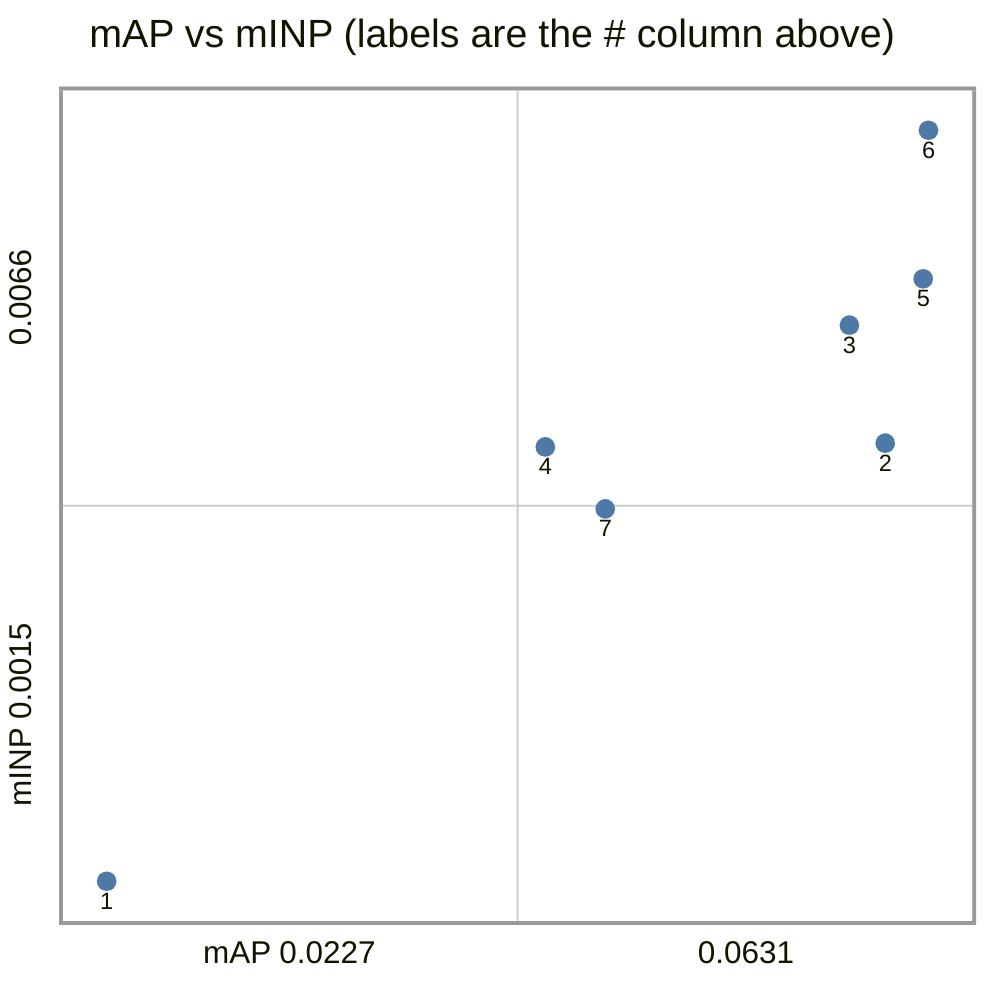
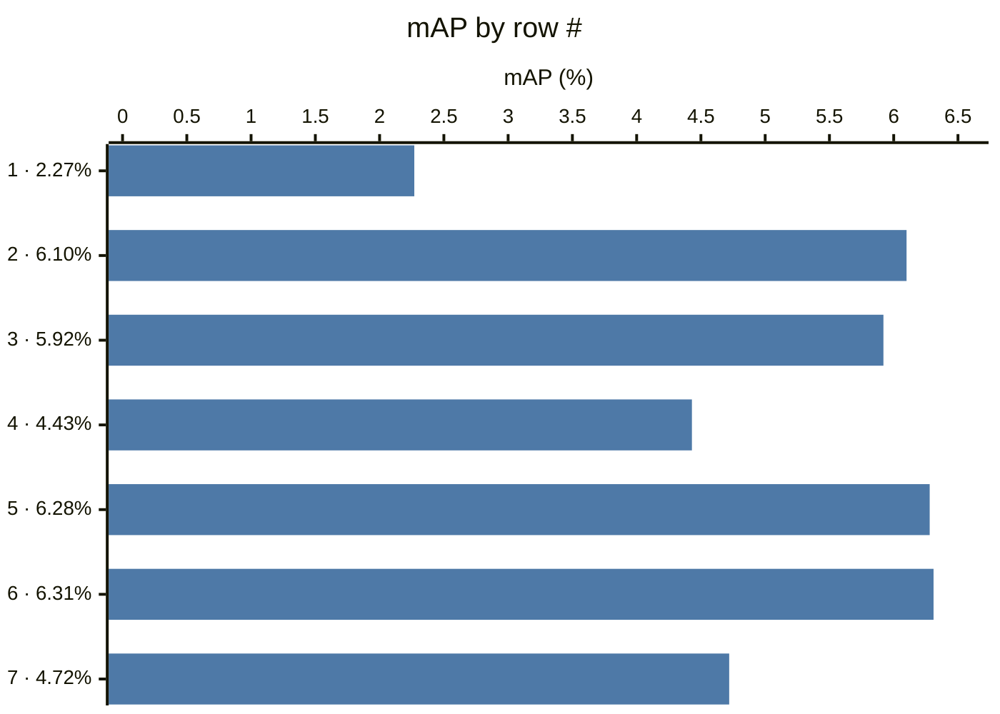
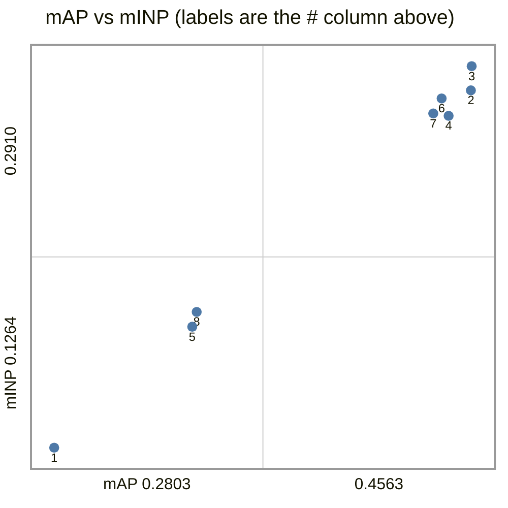
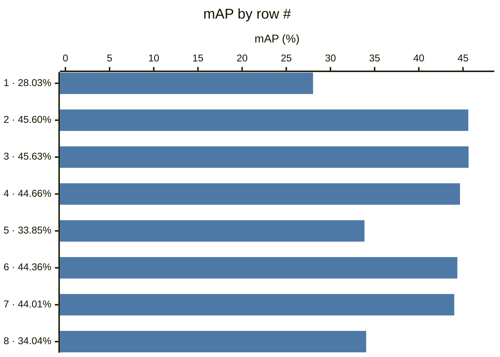
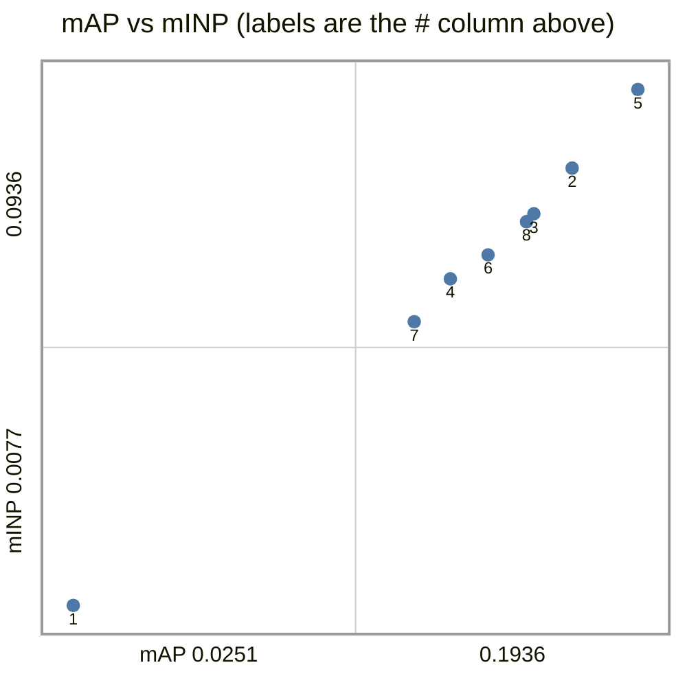
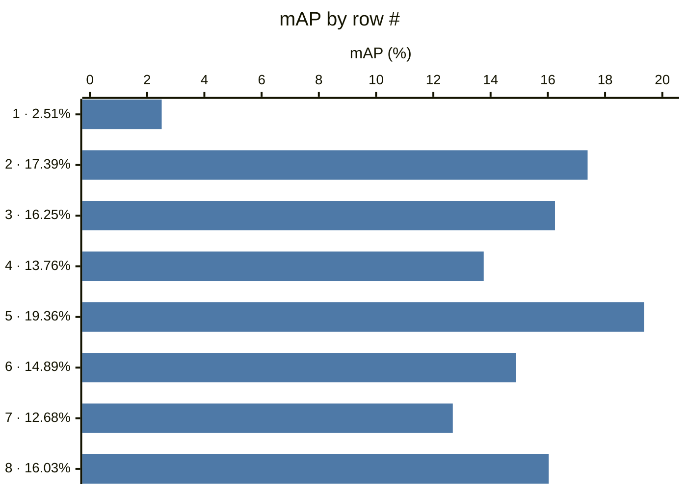
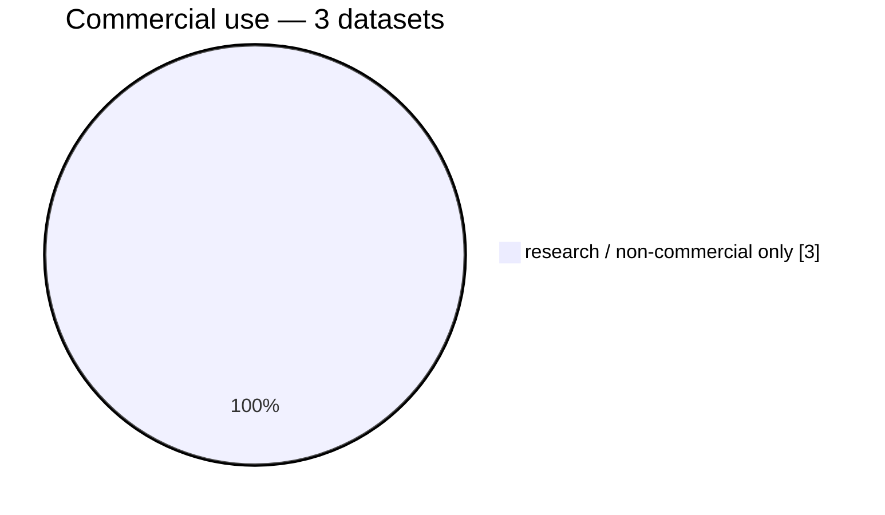
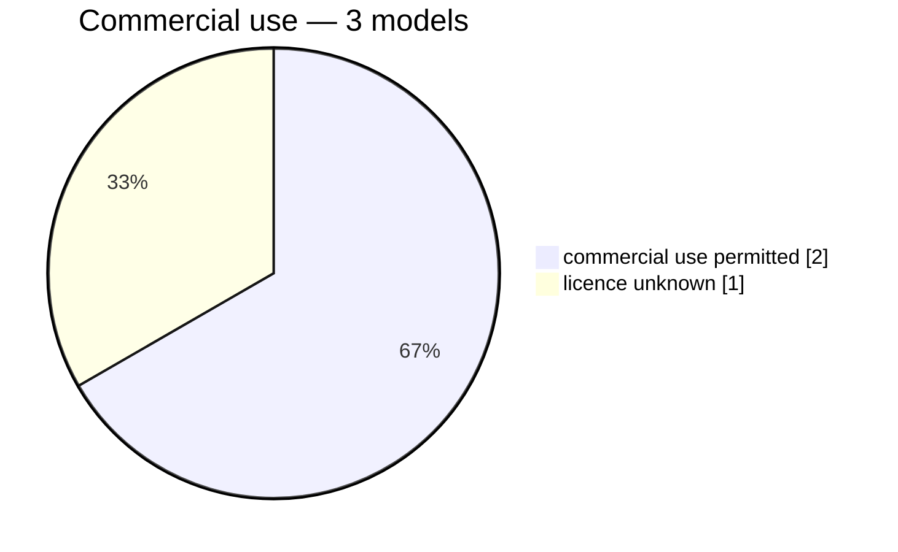

# Datasets

## market1501

| # | encoder                                 | resolution | head | protocol              | mAP    | R1     | R5     | R10    | mINP   |
|---|-----------------------------------------|------------|------|-----------------------|--------|--------|--------|--------|--------|
| 1 | timm:vit_base_patch16_clip_224.openai   | 224x224    | none | market1501/official@1 | 0.0227 | 0.0879 | 0.1829 | 0.2381 | 0.0015 |
| 2 | torchhub:NVlabs/RADIO/c-radio_v4-h      | 224x224    | none | market1501/official@1 | 0.0610 | 0.1838 | 0.3207 | 0.3955 | 0.0044 |
| 3 | torchhub:NVlabs/RADIO/c-radio_v4-h      | 256x128    | none | market1501/official@1 | 0.0592 | 0.1799 | 0.3224 | 0.3955 | 0.0052 |
| 4 | torchhub:NVlabs/RADIO/c-radio_v4-h      | native     | none | market1501/official@1 | 0.0443 | 0.1393 | 0.2672 | 0.3305 | 0.0044 |
| 5 | torchhub:NVlabs/RADIO/c-radio_v4-so400m | 224x224    | none | market1501/official@1 | 0.0628 | 0.1832 | 0.3180 | 0.3869 | 0.0055 |
| 6 | torchhub:NVlabs/RADIO/c-radio_v4-so400m | 256x128    | none | market1501/official@1 | 0.0631 | 0.1817 | 0.3219 | 0.3893 | 0.0066 |
| 7 | torchhub:NVlabs/RADIO/c-radio_v4-so400m | native     | none | market1501/official@1 | 0.0472 | 0.1369 | 0.2746 | 0.3453 | 0.0040 |

## occluded-reid

| # | encoder                                 | resolution | head | protocol                          | mAP    | R1     | R5     | R10    | mINP   |
|---|-----------------------------------------|------------|------|-----------------------------------|--------|--------|--------|--------|--------|
| 1 | timm:vit_base_patch16_clip_224.openai   | 224x224    | none | occluded-reid/occluded-vs-whole@1 | 0.2803 | 0.3540 | 0.5640 | 0.6490 | 0.1264 |
| 2 | torchhub:NVlabs/RADIO/c-radio_v4-h      | 224x224    | none | occluded-reid/occluded-vs-whole@1 | 0.4560 | 0.5240 | 0.7190 | 0.7940 | 0.2806 |
| 3 | torchhub:NVlabs/RADIO/c-radio_v4-h      | 224x224    | pca  | occluded-reid/occluded-vs-whole@1 | 0.4563 | 0.5280 | 0.7280 | 0.7980 | 0.2910 |
| 4 | torchhub:NVlabs/RADIO/c-radio_v4-h      | 256x128    | none | occluded-reid/occluded-vs-whole@1 | 0.4466 | 0.5230 | 0.7160 | 0.7930 | 0.2696 |
| 5 | torchhub:NVlabs/RADIO/c-radio_v4-h      | native     | none | occluded-reid/occluded-vs-whole@1 | 0.3385 | 0.4170 | 0.6350 | 0.7270 | 0.1786 |
| 6 | torchhub:NVlabs/RADIO/c-radio_v4-so400m | 224x224    | none | occluded-reid/occluded-vs-whole@1 | 0.4436 | 0.5100 | 0.6990 | 0.7780 | 0.2771 |
| 7 | torchhub:NVlabs/RADIO/c-radio_v4-so400m | 256x128    | none | occluded-reid/occluded-vs-whole@1 | 0.4401 | 0.5200 | 0.7020 | 0.7720 | 0.2706 |
| 8 | torchhub:NVlabs/RADIO/c-radio_v4-so400m | native     | none | occluded-reid/occluded-vs-whole@1 | 0.3404 | 0.4140 | 0.6240 | 0.7120 | 0.1850 |

## vrai

| # | encoder                                 | resolution | head | protocol                  | mAP    | R1     | R5     | R10    | mINP   |
|---|-----------------------------------------|------------|------|---------------------------|--------|--------|--------|--------|--------|
| 1 | timm:vit_base_patch16_clip_224.openai   | 224x224    | none | vrai/train-cross-camera@1 | 0.0251 | 0.0349 | 0.0778 | 0.1043 | 0.0077 |
| 2 | torchhub:NVlabs/RADIO/c-radio_v4-h      | 224x224    | none | vrai/train-cross-camera@1 | 0.1739 | 0.2152 | 0.3510 | 0.4213 | 0.0805 |
| 3 | torchhub:NVlabs/RADIO/c-radio_v4-h      | 224x224    | pca  | vrai/train-cross-camera@1 | 0.1625 | 0.2063 | 0.3286 | 0.3950 | 0.0729 |
| 4 | torchhub:NVlabs/RADIO/c-radio_v4-h      | 256x128    | none | vrai/train-cross-camera@1 | 0.1376 | 0.1709 | 0.2850 | 0.3440 | 0.0621 |
| 5 | torchhub:NVlabs/RADIO/c-radio_v4-h      | native     | none | vrai/train-cross-camera@1 | 0.1936 | 0.2421 | 0.3778 | 0.4434 | 0.0936 |
| 6 | torchhub:NVlabs/RADIO/c-radio_v4-so400m | 224x224    | none | vrai/train-cross-camera@1 | 0.1489 | 0.1945 | 0.3077 | 0.3712 | 0.0661 |
| 7 | torchhub:NVlabs/RADIO/c-radio_v4-so400m | 256x128    | none | vrai/train-cross-camera@1 | 0.1268 | 0.1611 | 0.2745 | 0.3364 | 0.0550 |
| 8 | torchhub:NVlabs/RADIO/c-radio_v4-so400m | native     | none | vrai/train-cross-camera@1 | 0.1603 | 0.2050 | 0.3304 | 0.3937 | 0.0716 |

# Licenses

## Datasets

| id            | licence                                                  | commercial_ok | gate |
|---------------|----------------------------------------------------------|---------------|------|
| market1501    | research-only                                            | False         | none |
| occluded-reid | academic or educational use only                         | False         | none |
| vrai          | research only — the release prohibits any commercial use | False         | none |

## Models

| id                                      | licence                   | commercial_ok | gate |
|-----------------------------------------|---------------------------|---------------|------|
| timm:vit_base_patch16_clip_224.openai   | unknown                   | ?             | ?    |
| torchhub:NVlabs/RADIO/c-radio_v4-h      | NVIDIA Open Model License | True          | none |
| torchhub:NVlabs/RADIO/c-radio_v4-so400m | NVIDIA Open Model License | True          | none |

