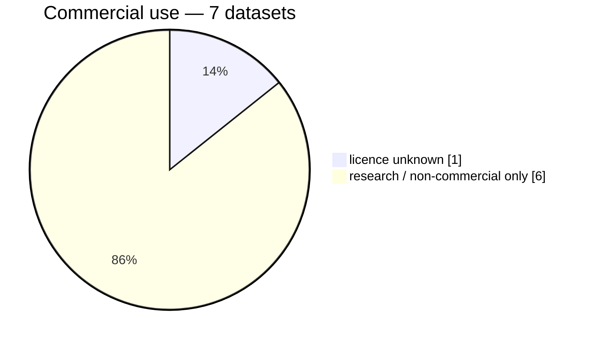
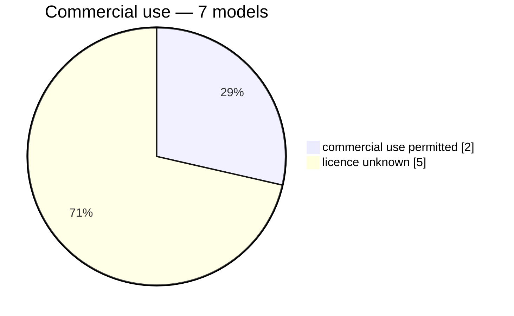

# Summary

*14 encoders x 4 heads (`none` is one of them) x 9 datasets: **356 of 560** combinations measured. 145.2 h of encoding over 77 feature stores. Records written 2026-08-22 to 2026-08-30 by reidbench 0.1.dev6+g0e6ee2a. **356 of 356 from a dirty working tree**. 5 more dataset pages cannot run here.*

One cell is *measured / in the matrix*, counting every head and protocol for that pair. The encoder is named by its spec's file stem, which is also what `run.py all <pattern>` matches.

| encoder                                  |  ccvid | cuhk03-np | market1501 | market1501-500k | mars | msmt17 | occluded-reid |  vrai |  vric |    runs |
|------------------------------------------|-------:|----------:|-----------:|----------------:|-----:|-------:|--------------:|------:|------:|--------:|
| `timm-vit-base-patch16-clip-224`         |    8/8 |       4/4 |        4/4 |             0/4 |  0/4 |    4/4 |           4/4 |   4/4 |   4/4 |   32/40 |
| `timm-vit-base-patch16-clip-224-squash`  |    8/8 |       4/4 |        4/4 |             0/4 |  0/4 |    4/4 |           4/4 |   4/4 |   4/4 |   32/40 |
| `timm-vit-giant-patch14-reg1-tipsv2-448` |    0/8 |       0/4 |        0/4 |             0/4 |  0/4 |    0/4 |           0/4 |   0/4 |   0/4 |    0/40 |
| `timm-vit-giantopt-patch16-siglip2-256`  |    8/8 |       4/4 |        4/4 |             0/4 |  0/4 |    4/4 |           4/4 |   4/4 |   4/4 |   32/40 |
| `timm-vit-giantopt-patch16-siglip2-384`  |    0/8 |       0/4 |        0/4 |             0/4 |  0/4 |    0/4 |           0/4 |   0/4 |   0/4 |    0/40 |
| `timm-vit-huge-plus-patch16-dinov3-224`  |    8/8 |       4/4 |        4/4 |             0/4 |  0/4 |    4/4 |           4/4 |   4/4 |   4/4 |   32/40 |
| `timm-vit-large-patch16-dinov3-224`      |    8/8 |       4/4 |        4/4 |             0/4 |  0/4 |    4/4 |           4/4 |   4/4 |   4/4 |   32/40 |
| `timm-vit-so400m-patch14-siglip2-224`    |    8/8 |       4/4 |        4/4 |             0/4 |  0/4 |    0/4 |           4/4 |   4/4 |   4/4 |   28/40 |
| `torchhub-c-radio-v4-h-224`              |    8/8 |       4/4 |        4/4 |             0/4 |  0/4 |    0/4 |           4/4 |   4/4 |   4/4 |   28/40 |
| `torchhub-c-radio-v4-h-256x128`          |    8/8 |       4/4 |        4/4 |             0/4 |  0/4 |    0/4 |           4/4 |   4/4 |   4/4 |   28/40 |
| `torchhub-c-radio-v4-h-native`           |    8/8 |       4/4 |        4/4 |             0/4 |  0/4 |    0/4 |           4/4 |   4/4 |   4/4 |   28/40 |
| `torchhub-c-radio-v4-so400m-224`         |    8/8 |       4/4 |        4/4 |             0/4 |  0/4 |    0/4 |           4/4 |   4/4 |   4/4 |   28/40 |
| `torchhub-c-radio-v4-so400m-256x128`     |    8/8 |       4/4 |        4/4 |             0/4 |  0/4 |    0/4 |           4/4 |   4/4 |   4/4 |   28/40 |
| `torchhub-c-radio-v4-so400m-native`      |    8/8 |       4/4 |        4/4 |             0/4 |  0/4 |    0/4 |           4/4 |   4/4 |   4/4 |   28/40 |
| **all**                                  | 96/112 |     48/56 |      48/56 |            0/56 | 0/56 |  20/56 |         48/56 | 48/56 | 48/56 | 356/560 |

| head      | is                                 |  ccvid | cuhk03-np | market1501 | market1501-500k | mars | msmt17 | occluded-reid |  vrai |  vric |    runs |
|-----------|------------------------------------|-------:|----------:|-----------:|----------------:|-----:|-------:|--------------:|------:|------:|--------:|
| `arcface` | arcface 512d on `market1501/train` |  24/28 |     12/14 |      12/14 |            0/14 | 0/14 |   5/14 |         12/14 | 12/14 | 12/14 |  89/140 |
| `linear`  | linear 512d on `market1501/train`  |  24/28 |     12/14 |      12/14 |            0/14 | 0/14 |   5/14 |         12/14 | 12/14 | 12/14 |  89/140 |
| `none`    | the frozen encoder                 |  24/28 |     12/14 |      12/14 |            0/14 | 0/14 |   5/14 |         12/14 | 12/14 | 12/14 |  89/140 |
| `pca`     | pca 512d on `market1501/train`     |  24/28 |     12/14 |      12/14 |            0/14 | 0/14 |   5/14 |         12/14 | 12/14 | 12/14 |  89/140 |
| **all**   |                                    | 96/112 |     48/56 |      48/56 |            0/56 | 0/56 |  20/56 |         48/56 | 48/56 | 48/56 | 356/560 |

## Not measured

| what                                                                                                   | why                                 |
|--------------------------------------------------------------------------------------------------------|-------------------------------------|
| `timm-vit-base-patch16-clip-224-squash` x `none` x `market1501-500k` x `market1501/official+500k@1`    | not run — `run.py all` would run it |
| `timm-vit-base-patch16-clip-224-squash` x `none` x `mars` x `mars/official@1`                          | not run — `run.py all` would run it |
| `timm-vit-base-patch16-clip-224-squash` x `arcface` x `market1501-500k` x `market1501/official+500k@1` | not run — `run.py all` would run it |
| `timm-vit-base-patch16-clip-224-squash` x `arcface` x `mars` x `mars/official@1`                       | not run — `run.py all` would run it |
| `timm-vit-base-patch16-clip-224-squash` x `linear` x `market1501-500k` x `market1501/official+500k@1`  | not run — `run.py all` would run it |
| `timm-vit-base-patch16-clip-224-squash` x `linear` x `mars` x `mars/official@1`                        | not run — `run.py all` would run it |
| `timm-vit-base-patch16-clip-224-squash` x `pca` x `market1501-500k` x `market1501/official+500k@1`     | not run — `run.py all` would run it |
| `timm-vit-base-patch16-clip-224-squash` x `pca` x `mars` x `mars/official@1`                           | not run — `run.py all` would run it |
| `timm-vit-base-patch16-clip-224` x `none` x `market1501-500k` x `market1501/official+500k@1`           | not run — `run.py all` would run it |
| `timm-vit-base-patch16-clip-224` x `none` x `mars` x `mars/official@1`                                 | not run — `run.py all` would run it |
| `timm-vit-base-patch16-clip-224` x `arcface` x `market1501-500k` x `market1501/official+500k@1`        | not run — `run.py all` would run it |
| `timm-vit-base-patch16-clip-224` x `arcface` x `mars` x `mars/official@1`                              | not run — `run.py all` would run it |
| … and 192 more combinations                                                                            | not run                             |
| dataset `market1501-attribute`                                                                         | no reidbench adapter                |
| dataset `soma`                                                                                         | not on disk: soma                   |
| dataset `vehicleid`                                                                                    | no reidbench adapter                |
| dataset `veri-wild`                                                                                    | no reidbench adapter                |
| dataset `veri776`                                                                                      | not on disk: veri776/VeRi           |

# Datasets

| dataset                                  | protocols                                          | rows |
|------------------------------------------|----------------------------------------------------|-----:|
| [ccvid](tables/ccvid.md)                 | ccvid/tracklet-cloth-changing@1 · ccvid/tracklet@1 |   96 |
| [cuhk03-np](tables/cuhk03-np.md)         | cuhk03/detected-767@1                              |   48 |
| [market1501](tables/market1501.md)       | market1501/official@1                              |   48 |
| [msmt17](tables/msmt17.md)               | msmt17/official@1                                  |   20 |
| [occluded-reid](tables/occluded-reid.md) | occluded-reid/occluded-vs-whole@1                  |   48 |
| [vrai](tables/vrai.md)                   | vrai/train-cross-camera@1                          |   48 |
| [vric](tables/vric.md)                   | vric/official@1                                    |   48 |

# Licenses

## Datasets

| id            | licence                                                                                                          | commercial_ok | gate         |
|---------------|------------------------------------------------------------------------------------------------------------------|---------------|--------------|
| ccvid         | CC BY-NC-SA 4.0                                                                                                  | False         | none         |
| cuhk03-np     | unknown                                                                                                          | ?             | ?            |
| market1501    | research-only                                                                                                    | False         | none         |
| msmt17        | research-only, by agreement with the authors                                                                     | False         | request-form |
| occluded-reid | academic or educational use only                                                                                 | False         | none         |
| vrai          | research only — the release prohibits any commercial use                                                         | False         | none         |
| vric          | research only — the release forbids redistribution and commercial use, and the underlying imagery is UA-DETRAC's | False         | none         |

## Models

| id                                            | licence                   | commercial_ok | gate |
|-----------------------------------------------|---------------------------|---------------|------|
| timm:vit_base_patch16_clip_224.openai         | unknown                   | ?             | ?    |
| timm:vit_giantopt_patch16_siglip_256.v2_webli | unknown                   | ?             | ?    |
| timm:vit_huge_plus_patch16_dinov3.lvd1689m    | unknown                   | ?             | ?    |
| timm:vit_large_patch16_dinov3.lvd1689m        | unknown                   | ?             | ?    |
| timm:vit_so400m_patch14_siglip_224.v2_webli   | unknown                   | ?             | ?    |
| torchhub:NVlabs/RADIO/c-radio_v4-h            | NVIDIA Open Model License | True          | none |
| torchhub:NVlabs/RADIO/c-radio_v4-so400m       | NVIDIA Open Model License | True          | none |

