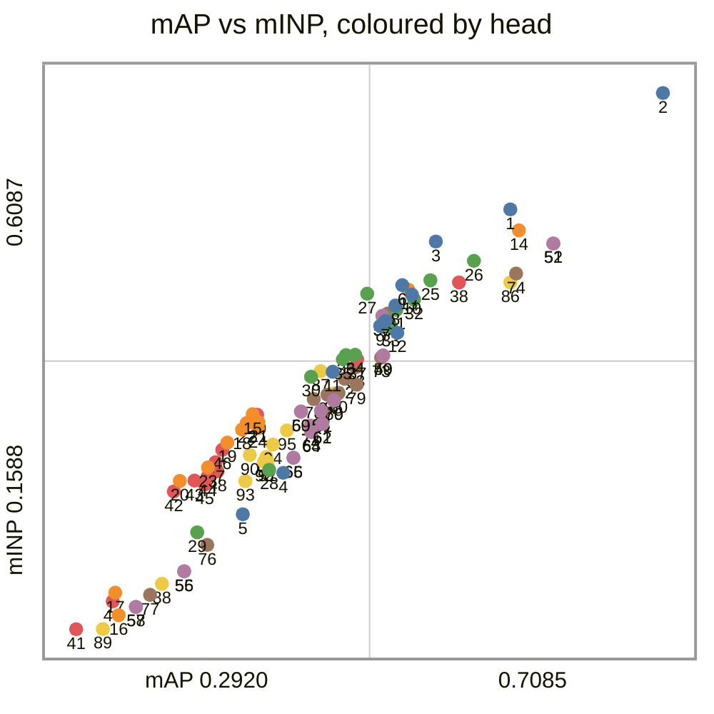
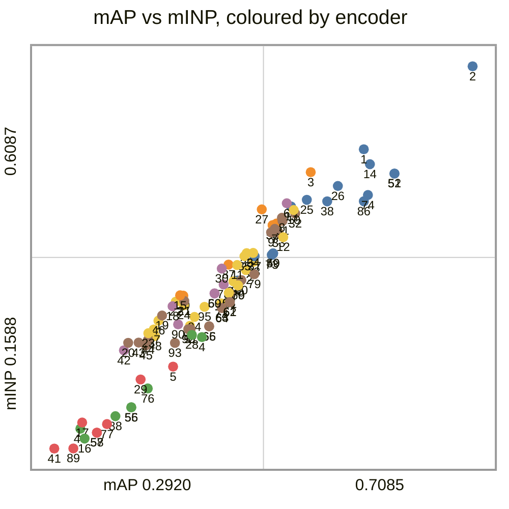
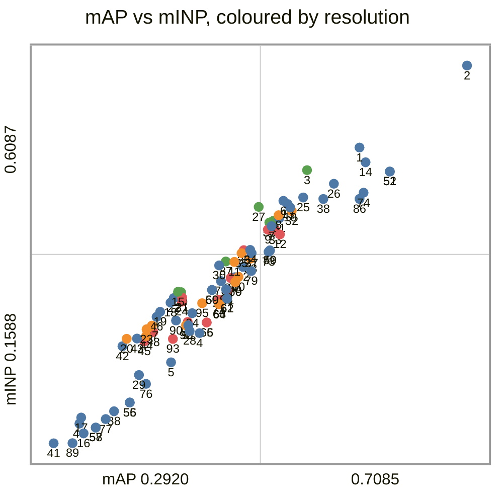
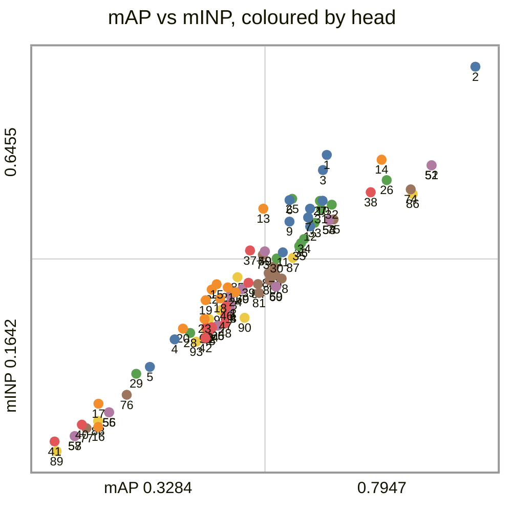
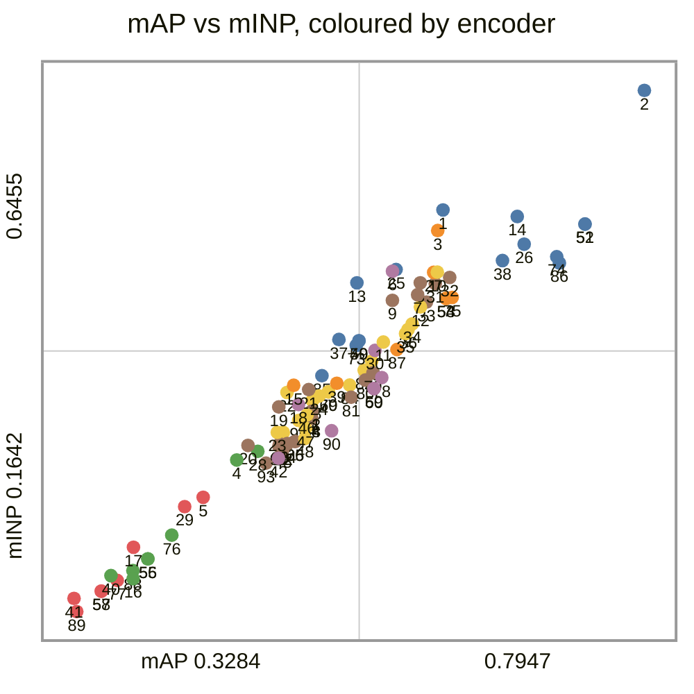
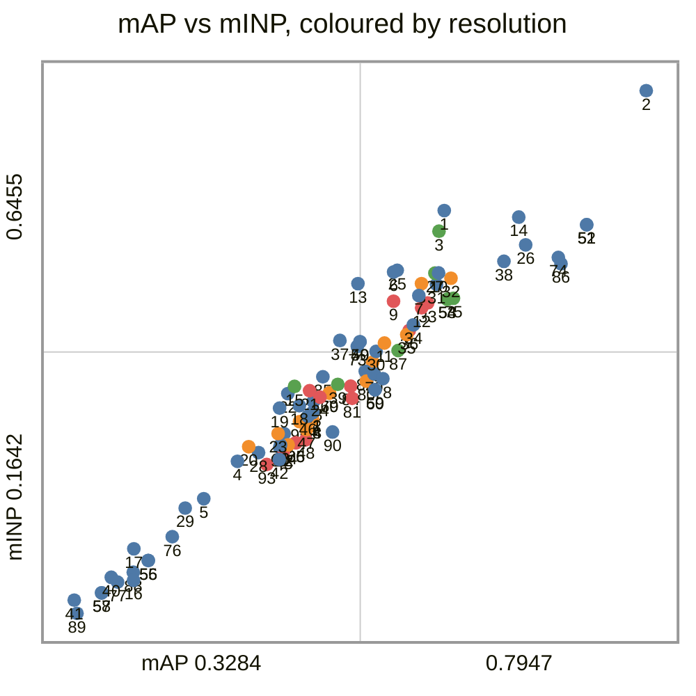

<!-- generated by `reidbench render`; edit the runs, not this file -->

# ccvid

[← table.md](../table.md)

## ccvid/tracklet-cloth-changing@1

### 🟦 arcface

|  # | encoder                                       | resolution | resize |        mAP |         R1 |         R5 |        R10 |       mINP |
|---:|-----------------------------------------------|------------|--------|-----------:|-----------:|-----------:|-----------:|-----------:|
|  1 | timm:vit_base_patch16_clip_224.openai         | 224x224    | crop   |     0.6002 |     0.6511 |     0.7242 |     0.7698 |     0.5111 |
|  2 | timm:vit_base_patch16_clip_224.openai         | 224x224    | squash | **0.7085** | **0.7638** | **0.8585** | **0.8957** | **0.6087** |
|  3 | timm:vit_giantopt_patch16_siglip_256.v2_webli | 256x256    | squash |     0.5473 |     0.5576 |     0.6559 |     0.7158 |     0.4841 |
|  4 | timm:vit_huge_plus_patch16_dinov3.lvd1689m    | 224x224    | squash |     0.4390 |     0.6211 |     0.7182 |     0.7758 |     0.2900 |
|  5 | timm:vit_large_patch16_dinov3.lvd1689m        | 224x224    | squash |     0.4103 |     0.5971 |     0.6990 |     0.7422 |     0.2553 |
|  6 | timm:vit_so400m_patch14_siglip_224.v2_webli   | 224x224    | squash |     0.5235 |     0.5312 |     0.6559 |     0.7254 |     0.4475 |
|  7 | torchhub:NVlabs/RADIO/c-radio_v4-h            | 224x224    | squash |     0.5115 |     0.5803 |     0.6918 |     0.7542 |     0.4174 |
|  8 | torchhub:NVlabs/RADIO/c-radio_v4-h            | 256x128    | squash |     0.5186 |     0.5779 |     0.6871 |     0.7494 |     0.4304 |
|  9 | torchhub:NVlabs/RADIO/c-radio_v4-h            | native     | squash |     0.5078 |     0.5875 |     0.6679 |     0.7326 |     0.4132 |
| 10 | torchhub:NVlabs/RADIO/c-radio_v4-so400m       | 224x224    | squash |     0.5303 |     0.5815 |     0.6978 |     0.7686 |     0.4395 |
| 11 | torchhub:NVlabs/RADIO/c-radio_v4-so400m       | 256x128    | squash |     0.4741 |     0.5408 |     0.6415 |     0.7062 |     0.3748 |
| 12 | torchhub:NVlabs/RADIO/c-radio_v4-so400m       | native     | squash |     0.5200 |     0.6199 |     0.6942 |     0.7506 |     0.4075 |

### 🟧 arcface-msmt17

|  # | encoder                                       | resolution | resize |        mAP |         R1 |         R5 |        R10 |       mINP |
|---:|-----------------------------------------------|------------|--------|-----------:|-----------:|-----------:|-----------:|-----------:|
| 13 | timm:vit_base_patch16_clip_224.openai         | 224x224    | crop   |     0.5276 |     0.5731 |     0.6523 |     0.7026 |     0.4438 |
| 14 | timm:vit_base_patch16_clip_224.openai         | 224x224    | squash | **0.6063** | **0.6667** | **0.7674** | **0.8477** | **0.4934** |
| 15 | timm:vit_giantopt_patch16_siglip_256.v2_webli | 256x256    | squash |     0.4173 |     0.4520 |     0.5252 |     0.5683 |     0.3392 |
| 16 | timm:vit_huge_plus_patch16_dinov3.lvd1689m    | 224x224    | squash |     0.3222 |     0.4724 |     0.5671 |     0.6103 |     0.1706 |
| 17 | timm:vit_large_patch16_dinov3.lvd1689m        | 224x224    | squash |     0.3197 |     0.4676 |     0.5540 |     0.5875 |     0.1895 |
| 18 | timm:vit_so400m_patch14_siglip_224.v2_webli   | 224x224    | squash |     0.4098 |     0.4281 |     0.5204 |     0.5863 |     0.3263 |
| 19 | torchhub:NVlabs/RADIO/c-radio_v4-h            | 224x224    | squash |     0.3993 |     0.4544 |     0.5276 |     0.5791 |     0.3154 |
| 20 | torchhub:NVlabs/RADIO/c-radio_v4-h            | 256x128    | squash |     0.3655 |     0.4125 |     0.5084 |     0.5588 |     0.2833 |
| 21 | torchhub:NVlabs/RADIO/c-radio_v4-h            | native     | squash |     0.4214 |     0.4688 |     0.5767 |     0.6199 |     0.3325 |
| 22 | torchhub:NVlabs/RADIO/c-radio_v4-so400m       | 224x224    | squash |     0.4131 |     0.4532 |     0.5348 |     0.5803 |     0.3318 |
| 23 | torchhub:NVlabs/RADIO/c-radio_v4-so400m       | 256x128    | squash |     0.3856 |     0.4353 |     0.5288 |     0.5731 |     0.2946 |
| 24 | torchhub:NVlabs/RADIO/c-radio_v4-so400m       | native     | squash |     0.4210 |     0.4700 |     0.5683 |     0.6187 |     0.3275 |

### 🟩 linear

|  # | encoder                                       | resolution | resize |        mAP |         R1 |         R5 |        R10 |       mINP |
|---:|-----------------------------------------------|------------|--------|-----------:|-----------:|-----------:|-----------:|-----------:|
| 25 | timm:vit_base_patch16_clip_224.openai         | 224x224    | crop   |     0.5434 |     0.5863 |     0.6763 |     0.7386 |     0.4516 |
| 26 | timm:vit_base_patch16_clip_224.openai         | 224x224    | squash | **0.5743** | **0.6151** | **0.7518** | **0.8046** | **0.4679** |
| 27 | timm:vit_giantopt_patch16_siglip_256.v2_webli | 256x256    | squash |     0.4986 |     0.4808 |     0.6211 |     0.7050 |     0.4403 |
| 28 | timm:vit_huge_plus_patch16_dinov3.lvd1689m    | 224x224    | squash |     0.4290 |     0.5552 |     0.7122 |     0.7758 |     0.2926 |
| 29 | timm:vit_large_patch16_dinov3.lvd1689m        | 224x224    | squash |     0.3779 |     0.5156 |     0.6463 |     0.7386 |     0.2402 |
| 30 | timm:vit_so400m_patch14_siglip_224.v2_webli   | 224x224    | squash |     0.4587 |     0.4856 |     0.5875 |     0.6607 |     0.3707 |
| 31 | torchhub:NVlabs/RADIO/c-radio_v4-h            | 224x224    | squash |     0.5192 |     0.5624 |     0.6990 |     0.7542 |     0.4268 |
| 32 | torchhub:NVlabs/RADIO/c-radio_v4-h            | 256x128    | squash |     0.5319 |     0.5695 |     0.6894 |     0.7506 |     0.4354 |
| 33 | torchhub:NVlabs/RADIO/c-radio_v4-h            | native     | squash |     0.5153 |     0.5612 |     0.6847 |     0.7446 |     0.4128 |
| 34 | torchhub:NVlabs/RADIO/c-radio_v4-so400m       | 224x224    | squash |     0.4900 |     0.5240 |     0.6727 |     0.7350 |     0.3891 |
| 35 | torchhub:NVlabs/RADIO/c-radio_v4-so400m       | 256x128    | squash |     0.4813 |     0.5072 |     0.6559 |     0.7122 |     0.3852 |
| 36 | torchhub:NVlabs/RADIO/c-radio_v4-so400m       | native     | squash |     0.4836 |     0.5228 |     0.6607 |     0.7218 |     0.3888 |

### 🟥 linear-msmt17

|  # | encoder                                       | resolution | resize |        mAP |         R1 |         R5 |        R10 |       mINP |
|---:|-----------------------------------------------|------------|--------|-----------:|-----------:|-----------:|-----------:|-----------:|
| 37 | timm:vit_base_patch16_clip_224.openai         | 224x224    | crop   |     0.4915 |     0.5576 |     0.6499 |     0.6823 |     0.3851 |
| 38 | timm:vit_base_patch16_clip_224.openai         | 224x224    | squash | **0.5637** | **0.6115** | **0.7506** | **0.8201** | **0.4498** |
| 39 | timm:vit_giantopt_patch16_siglip_256.v2_webli | 256x256    | squash |     0.4204 |     0.4353 |     0.5683 |     0.6367 |     0.3388 |
| 40 | timm:vit_huge_plus_patch16_dinov3.lvd1689m    | 224x224    | squash |     0.3180 |     0.4556 |     0.5827 |     0.6295 |     0.1822 |
| 41 | timm:vit_large_patch16_dinov3.lvd1689m        | 224x224    | squash |     0.2920 |     0.4436 |     0.5312 |     0.5755 |     0.1588 |
| 42 | timm:vit_so400m_patch14_siglip_224.v2_webli   | 224x224    | squash |     0.3613 |     0.3873 |     0.4892 |     0.5396 |     0.2744 |
| 43 | torchhub:NVlabs/RADIO/c-radio_v4-h            | 224x224    | squash |     0.3760 |     0.4257 |     0.5444 |     0.6055 |     0.2835 |
| 44 | torchhub:NVlabs/RADIO/c-radio_v4-h            | 256x128    | squash |     0.3852 |     0.4400 |     0.5588 |     0.6235 |     0.2867 |
| 45 | torchhub:NVlabs/RADIO/c-radio_v4-h            | native     | squash |     0.3833 |     0.4365 |     0.5635 |     0.6307 |     0.2803 |
| 46 | torchhub:NVlabs/RADIO/c-radio_v4-so400m       | 224x224    | squash |     0.3957 |     0.4400 |     0.5456 |     0.6067 |     0.3094 |
| 47 | torchhub:NVlabs/RADIO/c-radio_v4-so400m       | 256x128    | squash |     0.3910 |     0.4412 |     0.5420 |     0.5911 |     0.2990 |
| 48 | torchhub:NVlabs/RADIO/c-radio_v4-so400m       | native     | squash |     0.3923 |     0.4508 |     0.5552 |     0.6055 |     0.2913 |

### 🟪 none

|  # | encoder                                       | resolution | resize |        mAP |         R1 |         R5 |        R10 |       mINP |
|---:|-----------------------------------------------|------------|--------|-----------:|-----------:|-----------:|-----------:|-----------:|
| 49 | timm:vit_base_patch16_clip_224.openai         | 224x224    | crop   |     0.5098 |     0.5983 |     0.7098 |     0.7458 |     0.3885 |
| 50 | timm:vit_base_patch16_clip_224.openai         | 224x224    | crop   |     0.5098 |     0.5983 |     0.7098 |     0.7458 |     0.3885 |
| 51 | timm:vit_base_patch16_clip_224.openai         | 224x224    | squash | **0.6307** | **0.7386** | **0.8297** | **0.8585** |     0.4825 |
| 52 | timm:vit_base_patch16_clip_224.openai         | 224x224    | squash |     0.6307 | **0.7386** | **0.8297** | **0.8585** | **0.4825** |
| 53 | timm:vit_giantopt_patch16_siglip_256.v2_webli | 256x256    | squash |     0.5094 |     0.5600 |     0.6511 |     0.7146 |     0.4217 |
| 54 | timm:vit_giantopt_patch16_siglip_256.v2_webli | 256x256    | squash |     0.5094 |     0.5600 |     0.6511 |     0.7146 |     0.4217 |
| 55 | timm:vit_huge_plus_patch16_dinov3.lvd1689m    | 224x224    | squash |     0.3686 |     0.5432 |     0.6966 |     0.7578 |     0.2074 |
| 56 | timm:vit_huge_plus_patch16_dinov3.lvd1689m    | 224x224    | squash |     0.3686 |     0.5432 |     0.6966 |     0.7578 |     0.2074 |
| 57 | timm:vit_large_patch16_dinov3.lvd1689m        | 224x224    | squash |     0.3344 |     0.5144 |     0.6499 |     0.7182 |     0.1775 |
| 58 | timm:vit_large_patch16_dinov3.lvd1689m        | 224x224    | squash |     0.3344 |     0.5144 |     0.6499 |     0.7182 |     0.1775 |
| 59 | timm:vit_so400m_patch14_siglip_224.v2_webli   | 224x224    | squash |     0.4516 |     0.5156 |     0.6079 |     0.6918 |     0.3415 |
| 60 | timm:vit_so400m_patch14_siglip_224.v2_webli   | 224x224    | squash |     0.4515 |     0.5156 |     0.6079 |     0.6918 |     0.3414 |
| 61 | torchhub:NVlabs/RADIO/c-radio_v4-h            | 224x224    | squash |     0.4667 |     0.6103 |     0.7122 |     0.7494 |     0.3311 |
| 62 | torchhub:NVlabs/RADIO/c-radio_v4-h            | 224x224    | squash |     0.4667 |     0.6103 |     0.7122 |     0.7494 |     0.3311 |
| 63 | torchhub:NVlabs/RADIO/c-radio_v4-h            | 256x128    | squash |     0.4589 |     0.5827 |     0.7002 |     0.7542 |     0.3243 |
| 64 | torchhub:NVlabs/RADIO/c-radio_v4-h            | 256x128    | squash |     0.4589 |     0.5827 |     0.7002 |     0.7542 |     0.3243 |
| 65 | torchhub:NVlabs/RADIO/c-radio_v4-h            | native     | squash |     0.4462 |     0.5815 |     0.6918 |     0.7506 |     0.3027 |
| 66 | torchhub:NVlabs/RADIO/c-radio_v4-h            | native     | squash |     0.4462 |     0.5815 |     0.6918 |     0.7506 |     0.3027 |
| 67 | torchhub:NVlabs/RADIO/c-radio_v4-so400m       | 224x224    | squash |     0.4658 |     0.5863 |     0.7002 |     0.7542 |     0.3420 |
| 68 | torchhub:NVlabs/RADIO/c-radio_v4-so400m       | 224x224    | squash |     0.4658 |     0.5863 |     0.7002 |     0.7542 |     0.3420 |
| 69 | torchhub:NVlabs/RADIO/c-radio_v4-so400m       | 256x128    | squash |     0.4749 |     0.5887 |     0.7074 |     0.7470 |     0.3509 |
| 70 | torchhub:NVlabs/RADIO/c-radio_v4-so400m       | 256x128    | squash |     0.4749 |     0.5887 |     0.7074 |     0.7470 |     0.3509 |
| 71 | torchhub:NVlabs/RADIO/c-radio_v4-so400m       | native     | squash |     0.4583 |     0.5731 |     0.6882 |     0.7398 |     0.3296 |
| 72 | torchhub:NVlabs/RADIO/c-radio_v4-so400m       | native     | squash |     0.4583 |     0.5731 |     0.6882 |     0.7398 |     0.3296 |

### 🟫 pca

|  # | encoder                                       | resolution | resize |        mAP |         R1 |         R5 |        R10 |       mINP |
|---:|-----------------------------------------------|------------|--------|-----------:|-----------:|-----------:|-----------:|-----------:|
| 73 | timm:vit_base_patch16_clip_224.openai         | 224x224    | crop   |     0.5085 |     0.6067 |     0.6942 |     0.7314 |     0.3868 |
| 74 | timm:vit_base_patch16_clip_224.openai         | 224x224    | squash | **0.6043** | **0.7050** | **0.8118** | **0.8417** | **0.4572** |
| 75 | timm:vit_giantopt_patch16_siglip_256.v2_webli | 256x256    | squash |     0.5132 |     0.5600 |     0.6595 |     0.7134 |     0.4237 |
| 76 | timm:vit_huge_plus_patch16_dinov3.lvd1689m    | 224x224    | squash |     0.3850 |     0.5456 |     0.6871 |     0.7626 |     0.2295 |
| 77 | timm:vit_large_patch16_dinov3.lvd1689m        | 224x224    | squash |     0.3445 |     0.5168 |     0.6511 |     0.7182 |     0.1876 |
| 78 | timm:vit_so400m_patch14_siglip_224.v2_webli   | 224x224    | squash |     0.4606 |     0.5048 |     0.6319 |     0.7050 |     0.3519 |
| 79 | torchhub:NVlabs/RADIO/c-radio_v4-h            | 224x224    | squash |     0.4911 |     0.6115 |     0.7134 |     0.7614 |     0.3640 |
| 80 | torchhub:NVlabs/RADIO/c-radio_v4-h            | 256x128    | squash |     0.4782 |     0.5695 |     0.6978 |     0.7530 |     0.3570 |
| 81 | torchhub:NVlabs/RADIO/c-radio_v4-h            | native     | squash |     0.4671 |     0.5659 |     0.6894 |     0.7506 |     0.3410 |
| 82 | torchhub:NVlabs/RADIO/c-radio_v4-so400m       | 224x224    | squash |     0.4827 |     0.5731 |     0.7002 |     0.7602 |     0.3689 |
| 83 | torchhub:NVlabs/RADIO/c-radio_v4-so400m       | 256x128    | squash |     0.4905 |     0.5767 |     0.6990 |     0.7422 |     0.3786 |
| 84 | torchhub:NVlabs/RADIO/c-radio_v4-so400m       | native     | squash |     0.4704 |     0.5540 |     0.6930 |     0.7338 |     0.3556 |

### 🟨 pca-msmt17

|  # | encoder                                       | resolution | resize |        mAP |         R1 |         R5 |        R10 |       mINP |
|---:|-----------------------------------------------|------------|--------|-----------:|-----------:|-----------:|-----------:|-----------:|
| 85 | timm:vit_base_patch16_clip_224.openai         | 224x224    | crop   |     0.4746 |     0.5588 |     0.6631 |     0.7086 |     0.3566 |
| 86 | timm:vit_base_patch16_clip_224.openai         | 224x224    | squash | **0.6002** | **0.7026** | **0.8022** | **0.8489** | **0.4498** |
| 87 | timm:vit_giantopt_patch16_siglip_256.v2_webli | 256x256    | squash |     0.4655 |     0.5180 |     0.6043 |     0.6619 |     0.3753 |
| 88 | timm:vit_huge_plus_patch16_dinov3.lvd1689m    | 224x224    | squash |     0.3528 |     0.5168 |     0.6619 |     0.7290 |     0.1970 |
| 89 | timm:vit_large_patch16_dinov3.lvd1689m        | 224x224    | squash |     0.3110 |     0.4844 |     0.6127 |     0.6954 |     0.1590 |
| 90 | timm:vit_so400m_patch14_siglip_224.v2_webli   | 224x224    | squash |     0.4153 |     0.4712 |     0.5815 |     0.6523 |     0.3050 |
| 91 | torchhub:NVlabs/RADIO/c-radio_v4-h            | 224x224    | squash |     0.4277 |     0.5432 |     0.6631 |     0.7098 |     0.2993 |
| 92 | torchhub:NVlabs/RADIO/c-radio_v4-h            | 256x128    | squash |     0.4254 |     0.5300 |     0.6451 |     0.7146 |     0.2993 |
| 93 | torchhub:NVlabs/RADIO/c-radio_v4-h            | native     | squash |     0.4121 |     0.5276 |     0.6487 |     0.7122 |     0.2832 |
| 94 | torchhub:NVlabs/RADIO/c-radio_v4-so400m       | 224x224    | squash |     0.4316 |     0.5288 |     0.6571 |     0.7266 |     0.3138 |
| 95 | torchhub:NVlabs/RADIO/c-radio_v4-so400m       | 256x128    | squash |     0.4416 |     0.5264 |     0.6607 |     0.7206 |     0.3257 |
| 96 | torchhub:NVlabs/RADIO/c-radio_v4-so400m       | native     | squash |     0.4271 |     0.5264 |     0.6475 |     0.7038 |     0.3033 |

### Every row, by encoder and resolution

```mermaid
%%{init: {"themeVariables": {"quadrant1Fill": "transparent", "quadrant2Fill": "transparent", "quadrant3Fill": "transparent", "quadrant4Fill": "transparent", "quadrantExternalBorderStrokeFill": "#999999", "quadrantInternalBorderStrokeFill": "#cccccc", "quadrantPointFill": "#4e79a7"}}}%%
quadrantChart
    title mAP vs mINP, coloured by head
    x-axis "mAP 0.2920" --> "0.7085"
    y-axis "mINP 0.1588" --> "0.6087"
    quadrant-1 " "
    quadrant-2 " "
    quadrant-3 " "
    quadrant-4 " "
    1:::sarcface: [0.7159, 0.7547]
    2:::sarcface: [0.9500, 0.9500]
    3:::sarcface: [0.6017, 0.7008]
    4:::sarcface: [0.3677, 0.3125]
    5:::sarcface: [0.3056, 0.2429]
    6:::sarcface: [0.5502, 0.6275]
    7:::sarcface: [0.5244, 0.5673]
    8:::sarcface: [0.5397, 0.5933]
    9:::sarcface: [0.5164, 0.5590]
    10:::sarcface: [0.5650, 0.6116]
    11:::sarcface: [0.4435, 0.4821]
    12:::sarcface: [0.5426, 0.5476]
    13:::sarcfacemsmt17: [0.5592, 0.6201]
    14:::sarcfacemsmt17: [0.7291, 0.7195]
    15:::sarcfacemsmt17: [0.3207, 0.4108]
    16:::sarcfacemsmt17: [0.1152, 0.0736]
    17:::sarcfacemsmt17: [0.1100, 0.1113]
    18:::sarcfacemsmt17: [0.3045, 0.3851]
    19:::sarcfacemsmt17: [0.2819, 0.3633]
    20:::sarcfacemsmt17: [0.2090, 0.2990]
    21:::sarcfacemsmt17: [0.3297, 0.3974]
    22:::sarcfacemsmt17: [0.3116, 0.3960]
    23:::sarcfacemsmt17: [0.2523, 0.3216]
    24:::sarcfacemsmt17: [0.3289, 0.3875]
    25:::slinear: [0.5933, 0.6357]
    26:::slinear: [0.6601, 0.6683]
    27:::slinear: [0.4964, 0.6131]
    28:::slinear: [0.3461, 0.3176]
    29:::slinear: [0.2357, 0.2127]
    30:::slinear: [0.4103, 0.4738]
    31:::slinear: [0.5410, 0.5861]
    32:::slinear: [0.5683, 0.6034]
    33:::slinear: [0.5326, 0.5581]
    34:::slinear: [0.4779, 0.5106]
    35:::slinear: [0.4591, 0.5029]
    36:::slinear: [0.4639, 0.5100]
    37:::slinearmsmt17: [0.4810, 0.5027]
    38:::slinearmsmt17: [0.6372, 0.6321]
    39:::slinearmsmt17: [0.3276, 0.4100]
    40:::slinearmsmt17: [0.1061, 0.0967]
    41:::slinearmsmt17: [0.0500, 0.0500]
    42:::slinearmsmt17: [0.1998, 0.2813]
    43:::slinearmsmt17: [0.2315, 0.2995]
    44:::slinearmsmt17: [0.2515, 0.3058]
    45:::slinearmsmt17: [0.2472, 0.2929]
    46:::slinearmsmt17: [0.2741, 0.3512]
    47:::slinearmsmt17: [0.2640, 0.3304]
    48:::slinearmsmt17: [0.2669, 0.3150]
    49:::snone: [0.5208, 0.5094]
    50:::snone: [0.5208, 0.5094]
    51:::snone: [0.7820, 0.6975]
    52:::snone: [0.7818, 0.6975]
    53:::snone: [0.5198, 0.5758]
    54:::snone: [0.5198, 0.5759]
    55:::snone: [0.2157, 0.1472]
    56:::snone: [0.2156, 0.1471]
    57:::snone: [0.1416, 0.0874]
    58:::snone: [0.1417, 0.0874]
    59:::snone: [0.3949, 0.4154]
    60:::snone: [0.3948, 0.4152]
    61:::snone: [0.4276, 0.3947]
    62:::snone: [0.4276, 0.3947]
    63:::snone: [0.4107, 0.3811]
    64:::snone: [0.4107, 0.3810]
    65:::snone: [0.3832, 0.3378]
    66:::snone: [0.3832, 0.3378]
    67:::snone: [0.4256, 0.4166]
    68:::snone: [0.4256, 0.4166]
    69:::snone: [0.4453, 0.4342]
    70:::snone: [0.4453, 0.4342]
    71:::snone: [0.4094, 0.3916]
    72:::snone: [0.4094, 0.3916]
    73:::spca: [0.5179, 0.5060]
    74:::spca: [0.7248, 0.6470]
    75:::spca: [0.5281, 0.5798]
    76:::spca: [0.2511, 0.1915]
    77:::spca: [0.1634, 0.1076]
    78:::spca: [0.4144, 0.4363]
    79:::spca: [0.4802, 0.4605]
    80:::spca: [0.4524, 0.4465]
    81:::spca: [0.4284, 0.4145]
    82:::spca: [0.4621, 0.4704]
    83:::spca: [0.4789, 0.4898]
    84:::spca: [0.4354, 0.4437]
    85:::spcamsmt17: [0.4447, 0.4457]
    86:::spcamsmt17: [0.7160, 0.6322]
    87:::spcamsmt17: [0.4249, 0.4832]
    88:::spcamsmt17: [0.1815, 0.1263]
    89:::spcamsmt17: [0.0910, 0.0503]
    90:::spcamsmt17: [0.3164, 0.3424]
    91:::spcamsmt17: [0.3433, 0.3311]
    92:::spcamsmt17: [0.3382, 0.3310]
    93:::spcamsmt17: [0.3096, 0.2987]
    94:::spcamsmt17: [0.3517, 0.3600]
    95:::spcamsmt17: [0.3733, 0.3838]
    96:::spcamsmt17: [0.3419, 0.3391]
    classDef sarcface color: #4e79a7
    classDef sarcfacemsmt17 color: #f28e2b
    classDef slinear color: #59a14f
    classDef slinearmsmt17 color: #e15759
    classDef snone color: #b07aa1
    classDef spca color: #9c755f
    classDef spcamsmt17 color: #edc948
```

```mermaid
%%{init: {"themeVariables": {"xyChart": {"backgroundColor": "transparent", "plotColorPalette": "#4e79a7,#f28e2b,#59a14f,#e15759,#b07aa1,#9c755f,#edc948"}}, "xyChart": {"height": 1600, "width": 1320, "yAxis": {"showLabel": false}}}}%%
xychart-beta horizontal
    title "mAP, coloured by head"
    x-axis ["vit_base_patch16_clip_224.openai 224x224 arcface crop · 60.02%", "vit_base_patch16_clip_224.openai 224x224 arcface squash · 70.85%", "vit_base_patch16_clip_224.openai 224x224 arcface-msmt17 crop · 52.76%", "vit_base_patch16_clip_224.openai 224x224 arcface-msmt17 squash · 60.63%", "vit_base_patch16_clip_224.openai 224x224 linear crop · 54.34%", "vit_base_patch16_clip_224.openai 224x224 linear squash · 57.43%", "vit_base_patch16_clip_224.openai 224x224 linear-msmt17 crop · 49.15%", "vit_base_patch16_clip_224.openai 224x224 linear-msmt17 squash · 56.37%", "vit_base_patch16_clip_224.openai 224x224 none crop · 50.98%", "vit_base_patch16_clip_224.openai 224x224 none crop · 50.98%", "vit_base_patch16_clip_224.openai 224x224 none squash · 63.07%", "vit_base_patch16_clip_224.openai 224x224 none squash · 63.07%", "vit_base_patch16_clip_224.openai 224x224 pca crop · 50.85%", "vit_base_patch16_clip_224.openai 224x224 pca squash · 60.43%", "vit_base_patch16_clip_224.openai 224x224 pca-msmt17 crop · 47.46%", "vit_base_patch16_clip_224.openai 224x224 pca-msmt17 squash · 60.02%", "vit_giantopt_patch16_siglip_256.v2_webli 256x256 arcface squash · 54.73%", "vit_giantopt_patch16_siglip_256.v2_webli 256x256 arcface-msmt17 squash · 41.73%", "vit_giantopt_patch16_siglip_256.v2_webli 256x256 linear squash · 49.86%", "vit_giantopt_patch16_siglip_256.v2_webli 256x256 linear-msmt17 squash · 42.04%", "vit_giantopt_patch16_siglip_256.v2_webli 256x256 none squash · 50.94%", "vit_giantopt_patch16_siglip_256.v2_webli 256x256 none squash · 50.94%", "vit_giantopt_patch16_siglip_256.v2_webli 256x256 pca squash · 51.32%", "vit_giantopt_patch16_siglip_256.v2_webli 256x256 pca-msmt17 squash · 46.55%", "vit_huge_plus_patch16_dinov3.lvd1689m 224x224 arcface squash · 43.90%", "vit_huge_plus_patch16_dinov3.lvd1689m 224x224 arcface-msmt17 squash · 32.22%", "vit_huge_plus_patch16_dinov3.lvd1689m 224x224 linear squash · 42.90%", "vit_huge_plus_patch16_dinov3.lvd1689m 224x224 linear-msmt17 squash · 31.80%", "vit_huge_plus_patch16_dinov3.lvd1689m 224x224 none squash · 36.86%", "vit_huge_plus_patch16_dinov3.lvd1689m 224x224 none squash · 36.86%", "vit_huge_plus_patch16_dinov3.lvd1689m 224x224 pca squash · 38.50%", "vit_huge_plus_patch16_dinov3.lvd1689m 224x224 pca-msmt17 squash · 35.28%", "vit_large_patch16_dinov3.lvd1689m 224x224 arcface squash · 41.03%", "vit_large_patch16_dinov3.lvd1689m 224x224 arcface-msmt17 squash · 31.97%", "vit_large_patch16_dinov3.lvd1689m 224x224 linear squash · 37.79%", "vit_large_patch16_dinov3.lvd1689m 224x224 linear-msmt17 squash · 29.20%", "vit_large_patch16_dinov3.lvd1689m 224x224 none squash · 33.44%", "vit_large_patch16_dinov3.lvd1689m 224x224 none squash · 33.44%", "vit_large_patch16_dinov3.lvd1689m 224x224 pca squash · 34.45%", "vit_large_patch16_dinov3.lvd1689m 224x224 pca-msmt17 squash · 31.10%", "vit_so400m_patch14_siglip_224.v2_webli 224x224 arcface squash · 52.35%", "vit_so400m_patch14_siglip_224.v2_webli 224x224 arcface-msmt17 squash · 40.98%", "vit_so400m_patch14_siglip_224.v2_webli 224x224 linear squash · 45.87%", "vit_so400m_patch14_siglip_224.v2_webli 224x224 linear-msmt17 squash · 36.13%", "vit_so400m_patch14_siglip_224.v2_webli 224x224 none squash · 45.16%", "vit_so400m_patch14_siglip_224.v2_webli 224x224 none squash · 45.15%", "vit_so400m_patch14_siglip_224.v2_webli 224x224 pca squash · 46.06%", "vit_so400m_patch14_siglip_224.v2_webli 224x224 pca-msmt17 squash · 41.53%", "c-radio_v4-h 224x224 arcface squash · 51.15%", "c-radio_v4-h 224x224 arcface-msmt17 squash · 39.93%", "c-radio_v4-h 224x224 linear squash · 51.92%", "c-radio_v4-h 224x224 linear-msmt17 squash · 37.60%", "c-radio_v4-h 224x224 none squash · 46.67%", "c-radio_v4-h 224x224 none squash · 46.67%", "c-radio_v4-h 224x224 pca squash · 49.11%", "c-radio_v4-h 224x224 pca-msmt17 squash · 42.77%", "c-radio_v4-h 256x128 arcface squash · 51.86%", "c-radio_v4-h 256x128 arcface-msmt17 squash · 36.55%", "c-radio_v4-h 256x128 linear squash · 53.19%", "c-radio_v4-h 256x128 linear-msmt17 squash · 38.52%", "c-radio_v4-h 256x128 none squash · 45.89%", "c-radio_v4-h 256x128 none squash · 45.89%", "c-radio_v4-h 256x128 pca squash · 47.82%", "c-radio_v4-h 256x128 pca-msmt17 squash · 42.54%", "c-radio_v4-h native arcface squash · 50.78%", "c-radio_v4-h native arcface-msmt17 squash · 42.14%", "c-radio_v4-h native linear squash · 51.53%", "c-radio_v4-h native linear-msmt17 squash · 38.33%", "c-radio_v4-h native none squash · 44.62%", "c-radio_v4-h native none squash · 44.62%", "c-radio_v4-h native pca squash · 46.71%", "c-radio_v4-h native pca-msmt17 squash · 41.21%", "c-radio_v4-so400m 224x224 arcface squash · 53.03%", "c-radio_v4-so400m 224x224 arcface-msmt17 squash · 41.31%", "c-radio_v4-so400m 224x224 linear squash · 49.00%", "c-radio_v4-so400m 224x224 linear-msmt17 squash · 39.57%", "c-radio_v4-so400m 224x224 none squash · 46.58%", "c-radio_v4-so400m 224x224 none squash · 46.58%", "c-radio_v4-so400m 224x224 pca squash · 48.27%", "c-radio_v4-so400m 224x224 pca-msmt17 squash · 43.16%", "c-radio_v4-so400m 256x128 arcface squash · 47.41%", "c-radio_v4-so400m 256x128 arcface-msmt17 squash · 38.56%", "c-radio_v4-so400m 256x128 linear squash · 48.13%", "c-radio_v4-so400m 256x128 linear-msmt17 squash · 39.10%", "c-radio_v4-so400m 256x128 none squash · 47.49%", "c-radio_v4-so400m 256x128 none squash · 47.49%", "c-radio_v4-so400m 256x128 pca squash · 49.05%", "c-radio_v4-so400m 256x128 pca-msmt17 squash · 44.16%", "c-radio_v4-so400m native arcface squash · 52.00%", "c-radio_v4-so400m native arcface-msmt17 squash · 42.10%", "c-radio_v4-so400m native linear squash · 48.36%", "c-radio_v4-so400m native linear-msmt17 squash · 39.23%", "c-radio_v4-so400m native none squash · 45.83%", "c-radio_v4-so400m native none squash · 45.83%", "c-radio_v4-so400m native pca squash · 47.04%", "c-radio_v4-so400m native pca-msmt17 squash · 42.71%"]
    y-axis "mAP (%)" 0 --> 74.39
    bar [60.02, 70.85, 0.00, 0.00, 0.00, 0.00, 0.00, 0.00, 0.00, 0.00, 0.00, 0.00, 0.00, 0.00, 0.00, 0.00, 54.73, 0.00, 0.00, 0.00, 0.00, 0.00, 0.00, 0.00, 43.90, 0.00, 0.00, 0.00, 0.00, 0.00, 0.00, 0.00, 41.03, 0.00, 0.00, 0.00, 0.00, 0.00, 0.00, 0.00, 52.35, 0.00, 0.00, 0.00, 0.00, 0.00, 0.00, 0.00, 51.15, 0.00, 0.00, 0.00, 0.00, 0.00, 0.00, 0.00, 51.86, 0.00, 0.00, 0.00, 0.00, 0.00, 0.00, 0.00, 50.78, 0.00, 0.00, 0.00, 0.00, 0.00, 0.00, 0.00, 53.03, 0.00, 0.00, 0.00, 0.00, 0.00, 0.00, 0.00, 47.41, 0.00, 0.00, 0.00, 0.00, 0.00, 0.00, 0.00, 52.00, 0.00, 0.00, 0.00, 0.00, 0.00, 0.00, 0.00]
    bar [0.00, 0.00, 52.76, 60.63, 0.00, 0.00, 0.00, 0.00, 0.00, 0.00, 0.00, 0.00, 0.00, 0.00, 0.00, 0.00, 0.00, 41.73, 0.00, 0.00, 0.00, 0.00, 0.00, 0.00, 0.00, 32.22, 0.00, 0.00, 0.00, 0.00, 0.00, 0.00, 0.00, 31.97, 0.00, 0.00, 0.00, 0.00, 0.00, 0.00, 0.00, 40.98, 0.00, 0.00, 0.00, 0.00, 0.00, 0.00, 0.00, 39.93, 0.00, 0.00, 0.00, 0.00, 0.00, 0.00, 0.00, 36.55, 0.00, 0.00, 0.00, 0.00, 0.00, 0.00, 0.00, 42.14, 0.00, 0.00, 0.00, 0.00, 0.00, 0.00, 0.00, 41.31, 0.00, 0.00, 0.00, 0.00, 0.00, 0.00, 0.00, 38.56, 0.00, 0.00, 0.00, 0.00, 0.00, 0.00, 0.00, 42.10, 0.00, 0.00, 0.00, 0.00, 0.00, 0.00]
    bar [0.00, 0.00, 0.00, 0.00, 54.34, 57.43, 0.00, 0.00, 0.00, 0.00, 0.00, 0.00, 0.00, 0.00, 0.00, 0.00, 0.00, 0.00, 49.86, 0.00, 0.00, 0.00, 0.00, 0.00, 0.00, 0.00, 42.90, 0.00, 0.00, 0.00, 0.00, 0.00, 0.00, 0.00, 37.79, 0.00, 0.00, 0.00, 0.00, 0.00, 0.00, 0.00, 45.87, 0.00, 0.00, 0.00, 0.00, 0.00, 0.00, 0.00, 51.92, 0.00, 0.00, 0.00, 0.00, 0.00, 0.00, 0.00, 53.19, 0.00, 0.00, 0.00, 0.00, 0.00, 0.00, 0.00, 51.53, 0.00, 0.00, 0.00, 0.00, 0.00, 0.00, 0.00, 49.00, 0.00, 0.00, 0.00, 0.00, 0.00, 0.00, 0.00, 48.13, 0.00, 0.00, 0.00, 0.00, 0.00, 0.00, 0.00, 48.36, 0.00, 0.00, 0.00, 0.00, 0.00]
    bar [0.00, 0.00, 0.00, 0.00, 0.00, 0.00, 49.15, 56.37, 0.00, 0.00, 0.00, 0.00, 0.00, 0.00, 0.00, 0.00, 0.00, 0.00, 0.00, 42.04, 0.00, 0.00, 0.00, 0.00, 0.00, 0.00, 0.00, 31.80, 0.00, 0.00, 0.00, 0.00, 0.00, 0.00, 0.00, 29.20, 0.00, 0.00, 0.00, 0.00, 0.00, 0.00, 0.00, 36.13, 0.00, 0.00, 0.00, 0.00, 0.00, 0.00, 0.00, 37.60, 0.00, 0.00, 0.00, 0.00, 0.00, 0.00, 0.00, 38.52, 0.00, 0.00, 0.00, 0.00, 0.00, 0.00, 0.00, 38.33, 0.00, 0.00, 0.00, 0.00, 0.00, 0.00, 0.00, 39.57, 0.00, 0.00, 0.00, 0.00, 0.00, 0.00, 0.00, 39.10, 0.00, 0.00, 0.00, 0.00, 0.00, 0.00, 0.00, 39.23, 0.00, 0.00, 0.00, 0.00]
    bar [0.00, 0.00, 0.00, 0.00, 0.00, 0.00, 0.00, 0.00, 50.98, 50.98, 63.07, 63.07, 0.00, 0.00, 0.00, 0.00, 0.00, 0.00, 0.00, 0.00, 50.94, 50.94, 0.00, 0.00, 0.00, 0.00, 0.00, 0.00, 36.86, 36.86, 0.00, 0.00, 0.00, 0.00, 0.00, 0.00, 33.44, 33.44, 0.00, 0.00, 0.00, 0.00, 0.00, 0.00, 45.16, 45.15, 0.00, 0.00, 0.00, 0.00, 0.00, 0.00, 46.67, 46.67, 0.00, 0.00, 0.00, 0.00, 0.00, 0.00, 45.89, 45.89, 0.00, 0.00, 0.00, 0.00, 0.00, 0.00, 44.62, 44.62, 0.00, 0.00, 0.00, 0.00, 0.00, 0.00, 46.58, 46.58, 0.00, 0.00, 0.00, 0.00, 0.00, 0.00, 47.49, 47.49, 0.00, 0.00, 0.00, 0.00, 0.00, 0.00, 45.83, 45.83, 0.00, 0.00]
    bar [0.00, 0.00, 0.00, 0.00, 0.00, 0.00, 0.00, 0.00, 0.00, 0.00, 0.00, 0.00, 50.85, 60.43, 0.00, 0.00, 0.00, 0.00, 0.00, 0.00, 0.00, 0.00, 51.32, 0.00, 0.00, 0.00, 0.00, 0.00, 0.00, 0.00, 38.50, 0.00, 0.00, 0.00, 0.00, 0.00, 0.00, 0.00, 34.45, 0.00, 0.00, 0.00, 0.00, 0.00, 0.00, 0.00, 46.06, 0.00, 0.00, 0.00, 0.00, 0.00, 0.00, 0.00, 49.11, 0.00, 0.00, 0.00, 0.00, 0.00, 0.00, 0.00, 47.82, 0.00, 0.00, 0.00, 0.00, 0.00, 0.00, 0.00, 46.71, 0.00, 0.00, 0.00, 0.00, 0.00, 0.00, 0.00, 48.27, 0.00, 0.00, 0.00, 0.00, 0.00, 0.00, 0.00, 49.05, 0.00, 0.00, 0.00, 0.00, 0.00, 0.00, 0.00, 47.04, 0.00]
    bar [0.00, 0.00, 0.00, 0.00, 0.00, 0.00, 0.00, 0.00, 0.00, 0.00, 0.00, 0.00, 0.00, 0.00, 47.46, 60.02, 0.00, 0.00, 0.00, 0.00, 0.00, 0.00, 0.00, 46.55, 0.00, 0.00, 0.00, 0.00, 0.00, 0.00, 0.00, 35.28, 0.00, 0.00, 0.00, 0.00, 0.00, 0.00, 0.00, 31.10, 0.00, 0.00, 0.00, 0.00, 0.00, 0.00, 0.00, 41.53, 0.00, 0.00, 0.00, 0.00, 0.00, 0.00, 0.00, 42.77, 0.00, 0.00, 0.00, 0.00, 0.00, 0.00, 0.00, 42.54, 0.00, 0.00, 0.00, 0.00, 0.00, 0.00, 0.00, 41.21, 0.00, 0.00, 0.00, 0.00, 0.00, 0.00, 0.00, 43.16, 0.00, 0.00, 0.00, 0.00, 0.00, 0.00, 0.00, 44.16, 0.00, 0.00, 0.00, 0.00, 0.00, 0.00, 0.00, 42.71]
```

### By head — does the probe carry it?

```mermaid
%%{init: {"themeVariables": {"xyChart": {"backgroundColor": "transparent", "plotColorPalette": "#4e79a7,#f28e2b,#59a14f,#e15759,#b07aa1,#9c755f,#edc948"}}, "xyChart": {"height": 1600, "width": 1320, "yAxis": {"showLabel": false}}}}%%
xychart-beta horizontal
    title "mAP, coloured by head"
    x-axis ["arcface vit_base_patch16_clip_224.openai 224x224 crop · 60.02%", "arcface vit_base_patch16_clip_224.openai 224x224 squash · 70.85%", "arcface vit_giantopt_patch16_siglip_256.v2_webli 256x256 squash · 54.73%", "arcface vit_huge_plus_patch16_dinov3.lvd1689m 224x224 squash · 43.90%", "arcface vit_large_patch16_dinov3.lvd1689m 224x224 squash · 41.03%", "arcface vit_so400m_patch14_siglip_224.v2_webli 224x224 squash · 52.35%", "arcface c-radio_v4-h 224x224 squash · 51.15%", "arcface c-radio_v4-h 256x128 squash · 51.86%", "arcface c-radio_v4-h native squash · 50.78%", "arcface c-radio_v4-so400m 224x224 squash · 53.03%", "arcface c-radio_v4-so400m 256x128 squash · 47.41%", "arcface c-radio_v4-so400m native squash · 52.00%", "arcface-msmt17 vit_base_patch16_clip_224.openai 224x224 crop · 52.76%", "arcface-msmt17 vit_base_patch16_clip_224.openai 224x224 squash · 60.63%", "arcface-msmt17 vit_giantopt_patch16_siglip_256.v2_webli 256x256 squash · 41.73%", "arcface-msmt17 vit_huge_plus_patch16_dinov3.lvd1689m 224x224 squash · 32.22%", "arcface-msmt17 vit_large_patch16_dinov3.lvd1689m 224x224 squash · 31.97%", "arcface-msmt17 vit_so400m_patch14_siglip_224.v2_webli 224x224 squash · 40.98%", "arcface-msmt17 c-radio_v4-h 224x224 squash · 39.93%", "arcface-msmt17 c-radio_v4-h 256x128 squash · 36.55%", "arcface-msmt17 c-radio_v4-h native squash · 42.14%", "arcface-msmt17 c-radio_v4-so400m 224x224 squash · 41.31%", "arcface-msmt17 c-radio_v4-so400m 256x128 squash · 38.56%", "arcface-msmt17 c-radio_v4-so400m native squash · 42.10%", "linear vit_base_patch16_clip_224.openai 224x224 crop · 54.34%", "linear vit_base_patch16_clip_224.openai 224x224 squash · 57.43%", "linear vit_giantopt_patch16_siglip_256.v2_webli 256x256 squash · 49.86%", "linear vit_huge_plus_patch16_dinov3.lvd1689m 224x224 squash · 42.90%", "linear vit_large_patch16_dinov3.lvd1689m 224x224 squash · 37.79%", "linear vit_so400m_patch14_siglip_224.v2_webli 224x224 squash · 45.87%", "linear c-radio_v4-h 224x224 squash · 51.92%", "linear c-radio_v4-h 256x128 squash · 53.19%", "linear c-radio_v4-h native squash · 51.53%", "linear c-radio_v4-so400m 224x224 squash · 49.00%", "linear c-radio_v4-so400m 256x128 squash · 48.13%", "linear c-radio_v4-so400m native squash · 48.36%", "linear-msmt17 vit_base_patch16_clip_224.openai 224x224 crop · 49.15%", "linear-msmt17 vit_base_patch16_clip_224.openai 224x224 squash · 56.37%", "linear-msmt17 vit_giantopt_patch16_siglip_256.v2_webli 256x256 squash · 42.04%", "linear-msmt17 vit_huge_plus_patch16_dinov3.lvd1689m 224x224 squash · 31.80%", "linear-msmt17 vit_large_patch16_dinov3.lvd1689m 224x224 squash · 29.20%", "linear-msmt17 vit_so400m_patch14_siglip_224.v2_webli 224x224 squash · 36.13%", "linear-msmt17 c-radio_v4-h 224x224 squash · 37.60%", "linear-msmt17 c-radio_v4-h 256x128 squash · 38.52%", "linear-msmt17 c-radio_v4-h native squash · 38.33%", "linear-msmt17 c-radio_v4-so400m 224x224 squash · 39.57%", "linear-msmt17 c-radio_v4-so400m 256x128 squash · 39.10%", "linear-msmt17 c-radio_v4-so400m native squash · 39.23%", "none vit_base_patch16_clip_224.openai 224x224 crop · 50.98%", "none vit_base_patch16_clip_224.openai 224x224 crop · 50.98%", "none vit_base_patch16_clip_224.openai 224x224 squash · 63.07%", "none vit_base_patch16_clip_224.openai 224x224 squash · 63.07%", "none vit_giantopt_patch16_siglip_256.v2_webli 256x256 squash · 50.94%", "none vit_giantopt_patch16_siglip_256.v2_webli 256x256 squash · 50.94%", "none vit_huge_plus_patch16_dinov3.lvd1689m 224x224 squash · 36.86%", "none vit_huge_plus_patch16_dinov3.lvd1689m 224x224 squash · 36.86%", "none vit_large_patch16_dinov3.lvd1689m 224x224 squash · 33.44%", "none vit_large_patch16_dinov3.lvd1689m 224x224 squash · 33.44%", "none vit_so400m_patch14_siglip_224.v2_webli 224x224 squash · 45.16%", "none vit_so400m_patch14_siglip_224.v2_webli 224x224 squash · 45.15%", "none c-radio_v4-h 224x224 squash · 46.67%", "none c-radio_v4-h 224x224 squash · 46.67%", "none c-radio_v4-h 256x128 squash · 45.89%", "none c-radio_v4-h 256x128 squash · 45.89%", "none c-radio_v4-h native squash · 44.62%", "none c-radio_v4-h native squash · 44.62%", "none c-radio_v4-so400m 224x224 squash · 46.58%", "none c-radio_v4-so400m 224x224 squash · 46.58%", "none c-radio_v4-so400m 256x128 squash · 47.49%", "none c-radio_v4-so400m 256x128 squash · 47.49%", "none c-radio_v4-so400m native squash · 45.83%", "none c-radio_v4-so400m native squash · 45.83%", "pca vit_base_patch16_clip_224.openai 224x224 crop · 50.85%", "pca vit_base_patch16_clip_224.openai 224x224 squash · 60.43%", "pca vit_giantopt_patch16_siglip_256.v2_webli 256x256 squash · 51.32%", "pca vit_huge_plus_patch16_dinov3.lvd1689m 224x224 squash · 38.50%", "pca vit_large_patch16_dinov3.lvd1689m 224x224 squash · 34.45%", "pca vit_so400m_patch14_siglip_224.v2_webli 224x224 squash · 46.06%", "pca c-radio_v4-h 224x224 squash · 49.11%", "pca c-radio_v4-h 256x128 squash · 47.82%", "pca c-radio_v4-h native squash · 46.71%", "pca c-radio_v4-so400m 224x224 squash · 48.27%", "pca c-radio_v4-so400m 256x128 squash · 49.05%", "pca c-radio_v4-so400m native squash · 47.04%", "pca-msmt17 vit_base_patch16_clip_224.openai 224x224 crop · 47.46%", "pca-msmt17 vit_base_patch16_clip_224.openai 224x224 squash · 60.02%", "pca-msmt17 vit_giantopt_patch16_siglip_256.v2_webli 256x256 squash · 46.55%", "pca-msmt17 vit_huge_plus_patch16_dinov3.lvd1689m 224x224 squash · 35.28%", "pca-msmt17 vit_large_patch16_dinov3.lvd1689m 224x224 squash · 31.10%", "pca-msmt17 vit_so400m_patch14_siglip_224.v2_webli 224x224 squash · 41.53%", "pca-msmt17 c-radio_v4-h 224x224 squash · 42.77%", "pca-msmt17 c-radio_v4-h 256x128 squash · 42.54%", "pca-msmt17 c-radio_v4-h native squash · 41.21%", "pca-msmt17 c-radio_v4-so400m 224x224 squash · 43.16%", "pca-msmt17 c-radio_v4-so400m 256x128 squash · 44.16%", "pca-msmt17 c-radio_v4-so400m native squash · 42.71%"]
    y-axis "mAP (%)" 0 --> 74.39
    bar [60.02, 70.85, 54.73, 43.90, 41.03, 52.35, 51.15, 51.86, 50.78, 53.03, 47.41, 52.00, 0.00, 0.00, 0.00, 0.00, 0.00, 0.00, 0.00, 0.00, 0.00, 0.00, 0.00, 0.00, 0.00, 0.00, 0.00, 0.00, 0.00, 0.00, 0.00, 0.00, 0.00, 0.00, 0.00, 0.00, 0.00, 0.00, 0.00, 0.00, 0.00, 0.00, 0.00, 0.00, 0.00, 0.00, 0.00, 0.00, 0.00, 0.00, 0.00, 0.00, 0.00, 0.00, 0.00, 0.00, 0.00, 0.00, 0.00, 0.00, 0.00, 0.00, 0.00, 0.00, 0.00, 0.00, 0.00, 0.00, 0.00, 0.00, 0.00, 0.00, 0.00, 0.00, 0.00, 0.00, 0.00, 0.00, 0.00, 0.00, 0.00, 0.00, 0.00, 0.00, 0.00, 0.00, 0.00, 0.00, 0.00, 0.00, 0.00, 0.00, 0.00, 0.00, 0.00, 0.00]
    bar [0.00, 0.00, 0.00, 0.00, 0.00, 0.00, 0.00, 0.00, 0.00, 0.00, 0.00, 0.00, 52.76, 60.63, 41.73, 32.22, 31.97, 40.98, 39.93, 36.55, 42.14, 41.31, 38.56, 42.10, 0.00, 0.00, 0.00, 0.00, 0.00, 0.00, 0.00, 0.00, 0.00, 0.00, 0.00, 0.00, 0.00, 0.00, 0.00, 0.00, 0.00, 0.00, 0.00, 0.00, 0.00, 0.00, 0.00, 0.00, 0.00, 0.00, 0.00, 0.00, 0.00, 0.00, 0.00, 0.00, 0.00, 0.00, 0.00, 0.00, 0.00, 0.00, 0.00, 0.00, 0.00, 0.00, 0.00, 0.00, 0.00, 0.00, 0.00, 0.00, 0.00, 0.00, 0.00, 0.00, 0.00, 0.00, 0.00, 0.00, 0.00, 0.00, 0.00, 0.00, 0.00, 0.00, 0.00, 0.00, 0.00, 0.00, 0.00, 0.00, 0.00, 0.00, 0.00, 0.00]
    bar [0.00, 0.00, 0.00, 0.00, 0.00, 0.00, 0.00, 0.00, 0.00, 0.00, 0.00, 0.00, 0.00, 0.00, 0.00, 0.00, 0.00, 0.00, 0.00, 0.00, 0.00, 0.00, 0.00, 0.00, 54.34, 57.43, 49.86, 42.90, 37.79, 45.87, 51.92, 53.19, 51.53, 49.00, 48.13, 48.36, 0.00, 0.00, 0.00, 0.00, 0.00, 0.00, 0.00, 0.00, 0.00, 0.00, 0.00, 0.00, 0.00, 0.00, 0.00, 0.00, 0.00, 0.00, 0.00, 0.00, 0.00, 0.00, 0.00, 0.00, 0.00, 0.00, 0.00, 0.00, 0.00, 0.00, 0.00, 0.00, 0.00, 0.00, 0.00, 0.00, 0.00, 0.00, 0.00, 0.00, 0.00, 0.00, 0.00, 0.00, 0.00, 0.00, 0.00, 0.00, 0.00, 0.00, 0.00, 0.00, 0.00, 0.00, 0.00, 0.00, 0.00, 0.00, 0.00, 0.00]
    bar [0.00, 0.00, 0.00, 0.00, 0.00, 0.00, 0.00, 0.00, 0.00, 0.00, 0.00, 0.00, 0.00, 0.00, 0.00, 0.00, 0.00, 0.00, 0.00, 0.00, 0.00, 0.00, 0.00, 0.00, 0.00, 0.00, 0.00, 0.00, 0.00, 0.00, 0.00, 0.00, 0.00, 0.00, 0.00, 0.00, 49.15, 56.37, 42.04, 31.80, 29.20, 36.13, 37.60, 38.52, 38.33, 39.57, 39.10, 39.23, 0.00, 0.00, 0.00, 0.00, 0.00, 0.00, 0.00, 0.00, 0.00, 0.00, 0.00, 0.00, 0.00, 0.00, 0.00, 0.00, 0.00, 0.00, 0.00, 0.00, 0.00, 0.00, 0.00, 0.00, 0.00, 0.00, 0.00, 0.00, 0.00, 0.00, 0.00, 0.00, 0.00, 0.00, 0.00, 0.00, 0.00, 0.00, 0.00, 0.00, 0.00, 0.00, 0.00, 0.00, 0.00, 0.00, 0.00, 0.00]
    bar [0.00, 0.00, 0.00, 0.00, 0.00, 0.00, 0.00, 0.00, 0.00, 0.00, 0.00, 0.00, 0.00, 0.00, 0.00, 0.00, 0.00, 0.00, 0.00, 0.00, 0.00, 0.00, 0.00, 0.00, 0.00, 0.00, 0.00, 0.00, 0.00, 0.00, 0.00, 0.00, 0.00, 0.00, 0.00, 0.00, 0.00, 0.00, 0.00, 0.00, 0.00, 0.00, 0.00, 0.00, 0.00, 0.00, 0.00, 0.00, 50.98, 50.98, 63.07, 63.07, 50.94, 50.94, 36.86, 36.86, 33.44, 33.44, 45.16, 45.15, 46.67, 46.67, 45.89, 45.89, 44.62, 44.62, 46.58, 46.58, 47.49, 47.49, 45.83, 45.83, 0.00, 0.00, 0.00, 0.00, 0.00, 0.00, 0.00, 0.00, 0.00, 0.00, 0.00, 0.00, 0.00, 0.00, 0.00, 0.00, 0.00, 0.00, 0.00, 0.00, 0.00, 0.00, 0.00, 0.00]
    bar [0.00, 0.00, 0.00, 0.00, 0.00, 0.00, 0.00, 0.00, 0.00, 0.00, 0.00, 0.00, 0.00, 0.00, 0.00, 0.00, 0.00, 0.00, 0.00, 0.00, 0.00, 0.00, 0.00, 0.00, 0.00, 0.00, 0.00, 0.00, 0.00, 0.00, 0.00, 0.00, 0.00, 0.00, 0.00, 0.00, 0.00, 0.00, 0.00, 0.00, 0.00, 0.00, 0.00, 0.00, 0.00, 0.00, 0.00, 0.00, 0.00, 0.00, 0.00, 0.00, 0.00, 0.00, 0.00, 0.00, 0.00, 0.00, 0.00, 0.00, 0.00, 0.00, 0.00, 0.00, 0.00, 0.00, 0.00, 0.00, 0.00, 0.00, 0.00, 0.00, 50.85, 60.43, 51.32, 38.50, 34.45, 46.06, 49.11, 47.82, 46.71, 48.27, 49.05, 47.04, 0.00, 0.00, 0.00, 0.00, 0.00, 0.00, 0.00, 0.00, 0.00, 0.00, 0.00, 0.00]
    bar [0.00, 0.00, 0.00, 0.00, 0.00, 0.00, 0.00, 0.00, 0.00, 0.00, 0.00, 0.00, 0.00, 0.00, 0.00, 0.00, 0.00, 0.00, 0.00, 0.00, 0.00, 0.00, 0.00, 0.00, 0.00, 0.00, 0.00, 0.00, 0.00, 0.00, 0.00, 0.00, 0.00, 0.00, 0.00, 0.00, 0.00, 0.00, 0.00, 0.00, 0.00, 0.00, 0.00, 0.00, 0.00, 0.00, 0.00, 0.00, 0.00, 0.00, 0.00, 0.00, 0.00, 0.00, 0.00, 0.00, 0.00, 0.00, 0.00, 0.00, 0.00, 0.00, 0.00, 0.00, 0.00, 0.00, 0.00, 0.00, 0.00, 0.00, 0.00, 0.00, 0.00, 0.00, 0.00, 0.00, 0.00, 0.00, 0.00, 0.00, 0.00, 0.00, 0.00, 0.00, 47.46, 60.02, 46.55, 35.28, 31.10, 41.53, 42.77, 42.54, 41.21, 43.16, 44.16, 42.71]
```

### By encoder — does the checkpoint carry it?

*Colour — encoder:* 🟦 timm:vit_base_patch16_clip_224.openai · 🟧 timm:vit_giantopt_patch16_siglip_256.v2_webli · 🟩 timm:vit_huge_plus_patch16_dinov3.lvd1689m · 🟥 timm:vit_large_patch16_dinov3.lvd1689m · 🟪 timm:vit_so400m_patch14_siglip_224.v2_webli · 🟫 torchhub:NVlabs/RADIO/c-radio_v4-h · 🟨 torchhub:NVlabs/RADIO/c-radio_v4-so400m

```mermaid
%%{init: {"themeVariables": {"quadrant1Fill": "transparent", "quadrant2Fill": "transparent", "quadrant3Fill": "transparent", "quadrant4Fill": "transparent", "quadrantExternalBorderStrokeFill": "#999999", "quadrantInternalBorderStrokeFill": "#cccccc", "quadrantPointFill": "#4e79a7"}}}%%
quadrantChart
    title mAP vs mINP, coloured by encoder
    x-axis "mAP 0.2920" --> "0.7085"
    y-axis "mINP 0.1588" --> "0.6087"
    quadrant-1 " "
    quadrant-2 " "
    quadrant-3 " "
    quadrant-4 " "
    1:::stimmvitbasepatch16clip224openai: [0.7159, 0.7547]
    2:::stimmvitbasepatch16clip224openai: [0.9500, 0.9500]
    3:::stimmvitgiantoptpatch16siglip256v2webli: [0.6017, 0.7008]
    4:::stimmvithugepluspatch16dinov3lvd1689m: [0.3677, 0.3125]
    5:::stimmvitlargepatch16dinov3lvd1689m: [0.3056, 0.2429]
    6:::stimmvitso400mpatch14siglip224v2webli: [0.5502, 0.6275]
    7:::storchhubNVlabsRADIOcradiov4h: [0.5244, 0.5673]
    8:::storchhubNVlabsRADIOcradiov4h: [0.5397, 0.5933]
    9:::storchhubNVlabsRADIOcradiov4h: [0.5164, 0.5590]
    10:::storchhubNVlabsRADIOcradiov4so400m: [0.5650, 0.6116]
    11:::storchhubNVlabsRADIOcradiov4so400m: [0.4435, 0.4821]
    12:::storchhubNVlabsRADIOcradiov4so400m: [0.5426, 0.5476]
    13:::stimmvitbasepatch16clip224openai: [0.5592, 0.6201]
    14:::stimmvitbasepatch16clip224openai: [0.7291, 0.7195]
    15:::stimmvitgiantoptpatch16siglip256v2webli: [0.3207, 0.4108]
    16:::stimmvithugepluspatch16dinov3lvd1689m: [0.1152, 0.0736]
    17:::stimmvitlargepatch16dinov3lvd1689m: [0.1100, 0.1113]
    18:::stimmvitso400mpatch14siglip224v2webli: [0.3045, 0.3851]
    19:::storchhubNVlabsRADIOcradiov4h: [0.2819, 0.3633]
    20:::storchhubNVlabsRADIOcradiov4h: [0.2090, 0.2990]
    21:::storchhubNVlabsRADIOcradiov4h: [0.3297, 0.3974]
    22:::storchhubNVlabsRADIOcradiov4so400m: [0.3116, 0.3960]
    23:::storchhubNVlabsRADIOcradiov4so400m: [0.2523, 0.3216]
    24:::storchhubNVlabsRADIOcradiov4so400m: [0.3289, 0.3875]
    25:::stimmvitbasepatch16clip224openai: [0.5933, 0.6357]
    26:::stimmvitbasepatch16clip224openai: [0.6601, 0.6683]
    27:::stimmvitgiantoptpatch16siglip256v2webli: [0.4964, 0.6131]
    28:::stimmvithugepluspatch16dinov3lvd1689m: [0.3461, 0.3176]
    29:::stimmvitlargepatch16dinov3lvd1689m: [0.2357, 0.2127]
    30:::stimmvitso400mpatch14siglip224v2webli: [0.4103, 0.4738]
    31:::storchhubNVlabsRADIOcradiov4h: [0.5410, 0.5861]
    32:::storchhubNVlabsRADIOcradiov4h: [0.5683, 0.6034]
    33:::storchhubNVlabsRADIOcradiov4h: [0.5326, 0.5581]
    34:::storchhubNVlabsRADIOcradiov4so400m: [0.4779, 0.5106]
    35:::storchhubNVlabsRADIOcradiov4so400m: [0.4591, 0.5029]
    36:::storchhubNVlabsRADIOcradiov4so400m: [0.4639, 0.5100]
    37:::stimmvitbasepatch16clip224openai: [0.4810, 0.5027]
    38:::stimmvitbasepatch16clip224openai: [0.6372, 0.6321]
    39:::stimmvitgiantoptpatch16siglip256v2webli: [0.3276, 0.4100]
    40:::stimmvithugepluspatch16dinov3lvd1689m: [0.1061, 0.0967]
    41:::stimmvitlargepatch16dinov3lvd1689m: [0.0500, 0.0500]
    42:::stimmvitso400mpatch14siglip224v2webli: [0.1998, 0.2813]
    43:::storchhubNVlabsRADIOcradiov4h: [0.2315, 0.2995]
    44:::storchhubNVlabsRADIOcradiov4h: [0.2515, 0.3058]
    45:::storchhubNVlabsRADIOcradiov4h: [0.2472, 0.2929]
    46:::storchhubNVlabsRADIOcradiov4so400m: [0.2741, 0.3512]
    47:::storchhubNVlabsRADIOcradiov4so400m: [0.2640, 0.3304]
    48:::storchhubNVlabsRADIOcradiov4so400m: [0.2669, 0.3150]
    49:::stimmvitbasepatch16clip224openai: [0.5208, 0.5094]
    50:::stimmvitbasepatch16clip224openai: [0.5208, 0.5094]
    51:::stimmvitbasepatch16clip224openai: [0.7820, 0.6975]
    52:::stimmvitbasepatch16clip224openai: [0.7818, 0.6975]
    53:::stimmvitgiantoptpatch16siglip256v2webli: [0.5198, 0.5758]
    54:::stimmvitgiantoptpatch16siglip256v2webli: [0.5198, 0.5759]
    55:::stimmvithugepluspatch16dinov3lvd1689m: [0.2157, 0.1472]
    56:::stimmvithugepluspatch16dinov3lvd1689m: [0.2156, 0.1471]
    57:::stimmvitlargepatch16dinov3lvd1689m: [0.1416, 0.0874]
    58:::stimmvitlargepatch16dinov3lvd1689m: [0.1417, 0.0874]
    59:::stimmvitso400mpatch14siglip224v2webli: [0.3949, 0.4154]
    60:::stimmvitso400mpatch14siglip224v2webli: [0.3948, 0.4152]
    61:::storchhubNVlabsRADIOcradiov4h: [0.4276, 0.3947]
    62:::storchhubNVlabsRADIOcradiov4h: [0.4276, 0.3947]
    63:::storchhubNVlabsRADIOcradiov4h: [0.4107, 0.3811]
    64:::storchhubNVlabsRADIOcradiov4h: [0.4107, 0.3810]
    65:::storchhubNVlabsRADIOcradiov4h: [0.3832, 0.3378]
    66:::storchhubNVlabsRADIOcradiov4h: [0.3832, 0.3378]
    67:::storchhubNVlabsRADIOcradiov4so400m: [0.4256, 0.4166]
    68:::storchhubNVlabsRADIOcradiov4so400m: [0.4256, 0.4166]
    69:::storchhubNVlabsRADIOcradiov4so400m: [0.4453, 0.4342]
    70:::storchhubNVlabsRADIOcradiov4so400m: [0.4453, 0.4342]
    71:::storchhubNVlabsRADIOcradiov4so400m: [0.4094, 0.3916]
    72:::storchhubNVlabsRADIOcradiov4so400m: [0.4094, 0.3916]
    73:::stimmvitbasepatch16clip224openai: [0.5179, 0.5060]
    74:::stimmvitbasepatch16clip224openai: [0.7248, 0.6470]
    75:::stimmvitgiantoptpatch16siglip256v2webli: [0.5281, 0.5798]
    76:::stimmvithugepluspatch16dinov3lvd1689m: [0.2511, 0.1915]
    77:::stimmvitlargepatch16dinov3lvd1689m: [0.1634, 0.1076]
    78:::stimmvitso400mpatch14siglip224v2webli: [0.4144, 0.4363]
    79:::storchhubNVlabsRADIOcradiov4h: [0.4802, 0.4605]
    80:::storchhubNVlabsRADIOcradiov4h: [0.4524, 0.4465]
    81:::storchhubNVlabsRADIOcradiov4h: [0.4284, 0.4145]
    82:::storchhubNVlabsRADIOcradiov4so400m: [0.4621, 0.4704]
    83:::storchhubNVlabsRADIOcradiov4so400m: [0.4789, 0.4898]
    84:::storchhubNVlabsRADIOcradiov4so400m: [0.4354, 0.4437]
    85:::stimmvitbasepatch16clip224openai: [0.4447, 0.4457]
    86:::stimmvitbasepatch16clip224openai: [0.7160, 0.6322]
    87:::stimmvitgiantoptpatch16siglip256v2webli: [0.4249, 0.4832]
    88:::stimmvithugepluspatch16dinov3lvd1689m: [0.1815, 0.1263]
    89:::stimmvitlargepatch16dinov3lvd1689m: [0.0910, 0.0503]
    90:::stimmvitso400mpatch14siglip224v2webli: [0.3164, 0.3424]
    91:::storchhubNVlabsRADIOcradiov4h: [0.3433, 0.3311]
    92:::storchhubNVlabsRADIOcradiov4h: [0.3382, 0.3310]
    93:::storchhubNVlabsRADIOcradiov4h: [0.3096, 0.2987]
    94:::storchhubNVlabsRADIOcradiov4so400m: [0.3517, 0.3600]
    95:::storchhubNVlabsRADIOcradiov4so400m: [0.3733, 0.3838]
    96:::storchhubNVlabsRADIOcradiov4so400m: [0.3419, 0.3391]
    classDef stimmvitbasepatch16clip224openai color: #4e79a7
    classDef stimmvitgiantoptpatch16siglip256v2webli color: #f28e2b
    classDef stimmvithugepluspatch16dinov3lvd1689m color: #59a14f
    classDef stimmvitlargepatch16dinov3lvd1689m color: #e15759
    classDef stimmvitso400mpatch14siglip224v2webli color: #b07aa1
    classDef storchhubNVlabsRADIOcradiov4h color: #9c755f
    classDef storchhubNVlabsRADIOcradiov4so400m color: #edc948
```

```mermaid
%%{init: {"themeVariables": {"xyChart": {"backgroundColor": "transparent", "plotColorPalette": "#4e79a7,#f28e2b,#59a14f,#e15759,#b07aa1,#9c755f,#edc948"}}, "xyChart": {"height": 1600, "width": 1320, "yAxis": {"showLabel": false}}}}%%
xychart-beta horizontal
    title "mAP, coloured by encoder"
    x-axis ["vit_base_patch16_clip_224.openai arcface 224x224 crop · 60.02%", "vit_base_patch16_clip_224.openai arcface 224x224 squash · 70.85%", "vit_base_patch16_clip_224.openai arcface-msmt17 224x224 crop · 52.76%", "vit_base_patch16_clip_224.openai arcface-msmt17 224x224 squash · 60.63%", "vit_base_patch16_clip_224.openai linear 224x224 crop · 54.34%", "vit_base_patch16_clip_224.openai linear 224x224 squash · 57.43%", "vit_base_patch16_clip_224.openai linear-msmt17 224x224 crop · 49.15%", "vit_base_patch16_clip_224.openai linear-msmt17 224x224 squash · 56.37%", "vit_base_patch16_clip_224.openai none 224x224 crop · 50.98%", "vit_base_patch16_clip_224.openai none 224x224 crop · 50.98%", "vit_base_patch16_clip_224.openai none 224x224 squash · 63.07%", "vit_base_patch16_clip_224.openai none 224x224 squash · 63.07%", "vit_base_patch16_clip_224.openai pca 224x224 crop · 50.85%", "vit_base_patch16_clip_224.openai pca 224x224 squash · 60.43%", "vit_base_patch16_clip_224.openai pca-msmt17 224x224 crop · 47.46%", "vit_base_patch16_clip_224.openai pca-msmt17 224x224 squash · 60.02%", "vit_giantopt_patch16_siglip_256.v2_webli arcface 256x256 squash · 54.73%", "vit_giantopt_patch16_siglip_256.v2_webli arcface-msmt17 256x256 squash · 41.73%", "vit_giantopt_patch16_siglip_256.v2_webli linear 256x256 squash · 49.86%", "vit_giantopt_patch16_siglip_256.v2_webli linear-msmt17 256x256 squash · 42.04%", "vit_giantopt_patch16_siglip_256.v2_webli none 256x256 squash · 50.94%", "vit_giantopt_patch16_siglip_256.v2_webli none 256x256 squash · 50.94%", "vit_giantopt_patch16_siglip_256.v2_webli pca 256x256 squash · 51.32%", "vit_giantopt_patch16_siglip_256.v2_webli pca-msmt17 256x256 squash · 46.55%", "vit_huge_plus_patch16_dinov3.lvd1689m arcface 224x224 squash · 43.90%", "vit_huge_plus_patch16_dinov3.lvd1689m arcface-msmt17 224x224 squash · 32.22%", "vit_huge_plus_patch16_dinov3.lvd1689m linear 224x224 squash · 42.90%", "vit_huge_plus_patch16_dinov3.lvd1689m linear-msmt17 224x224 squash · 31.80%", "vit_huge_plus_patch16_dinov3.lvd1689m none 224x224 squash · 36.86%", "vit_huge_plus_patch16_dinov3.lvd1689m none 224x224 squash · 36.86%", "vit_huge_plus_patch16_dinov3.lvd1689m pca 224x224 squash · 38.50%", "vit_huge_plus_patch16_dinov3.lvd1689m pca-msmt17 224x224 squash · 35.28%", "vit_large_patch16_dinov3.lvd1689m arcface 224x224 squash · 41.03%", "vit_large_patch16_dinov3.lvd1689m arcface-msmt17 224x224 squash · 31.97%", "vit_large_patch16_dinov3.lvd1689m linear 224x224 squash · 37.79%", "vit_large_patch16_dinov3.lvd1689m linear-msmt17 224x224 squash · 29.20%", "vit_large_patch16_dinov3.lvd1689m none 224x224 squash · 33.44%", "vit_large_patch16_dinov3.lvd1689m none 224x224 squash · 33.44%", "vit_large_patch16_dinov3.lvd1689m pca 224x224 squash · 34.45%", "vit_large_patch16_dinov3.lvd1689m pca-msmt17 224x224 squash · 31.10%", "vit_so400m_patch14_siglip_224.v2_webli arcface 224x224 squash · 52.35%", "vit_so400m_patch14_siglip_224.v2_webli arcface-msmt17 224x224 squash · 40.98%", "vit_so400m_patch14_siglip_224.v2_webli linear 224x224 squash · 45.87%", "vit_so400m_patch14_siglip_224.v2_webli linear-msmt17 224x224 squash · 36.13%", "vit_so400m_patch14_siglip_224.v2_webli none 224x224 squash · 45.16%", "vit_so400m_patch14_siglip_224.v2_webli none 224x224 squash · 45.15%", "vit_so400m_patch14_siglip_224.v2_webli pca 224x224 squash · 46.06%", "vit_so400m_patch14_siglip_224.v2_webli pca-msmt17 224x224 squash · 41.53%", "c-radio_v4-h arcface 224x224 squash · 51.15%", "c-radio_v4-h arcface 256x128 squash · 51.86%", "c-radio_v4-h arcface native squash · 50.78%", "c-radio_v4-h arcface-msmt17 224x224 squash · 39.93%", "c-radio_v4-h arcface-msmt17 256x128 squash · 36.55%", "c-radio_v4-h arcface-msmt17 native squash · 42.14%", "c-radio_v4-h linear 224x224 squash · 51.92%", "c-radio_v4-h linear 256x128 squash · 53.19%", "c-radio_v4-h linear native squash · 51.53%", "c-radio_v4-h linear-msmt17 224x224 squash · 37.60%", "c-radio_v4-h linear-msmt17 256x128 squash · 38.52%", "c-radio_v4-h linear-msmt17 native squash · 38.33%", "c-radio_v4-h none 224x224 squash · 46.67%", "c-radio_v4-h none 224x224 squash · 46.67%", "c-radio_v4-h none 256x128 squash · 45.89%", "c-radio_v4-h none 256x128 squash · 45.89%", "c-radio_v4-h none native squash · 44.62%", "c-radio_v4-h none native squash · 44.62%", "c-radio_v4-h pca 224x224 squash · 49.11%", "c-radio_v4-h pca 256x128 squash · 47.82%", "c-radio_v4-h pca native squash · 46.71%", "c-radio_v4-h pca-msmt17 224x224 squash · 42.77%", "c-radio_v4-h pca-msmt17 256x128 squash · 42.54%", "c-radio_v4-h pca-msmt17 native squash · 41.21%", "c-radio_v4-so400m arcface 224x224 squash · 53.03%", "c-radio_v4-so400m arcface 256x128 squash · 47.41%", "c-radio_v4-so400m arcface native squash · 52.00%", "c-radio_v4-so400m arcface-msmt17 224x224 squash · 41.31%", "c-radio_v4-so400m arcface-msmt17 256x128 squash · 38.56%", "c-radio_v4-so400m arcface-msmt17 native squash · 42.10%", "c-radio_v4-so400m linear 224x224 squash · 49.00%", "c-radio_v4-so400m linear 256x128 squash · 48.13%", "c-radio_v4-so400m linear native squash · 48.36%", "c-radio_v4-so400m linear-msmt17 224x224 squash · 39.57%", "c-radio_v4-so400m linear-msmt17 256x128 squash · 39.10%", "c-radio_v4-so400m linear-msmt17 native squash · 39.23%", "c-radio_v4-so400m none 224x224 squash · 46.58%", "c-radio_v4-so400m none 224x224 squash · 46.58%", "c-radio_v4-so400m none 256x128 squash · 47.49%", "c-radio_v4-so400m none 256x128 squash · 47.49%", "c-radio_v4-so400m none native squash · 45.83%", "c-radio_v4-so400m none native squash · 45.83%", "c-radio_v4-so400m pca 224x224 squash · 48.27%", "c-radio_v4-so400m pca 256x128 squash · 49.05%", "c-radio_v4-so400m pca native squash · 47.04%", "c-radio_v4-so400m pca-msmt17 224x224 squash · 43.16%", "c-radio_v4-so400m pca-msmt17 256x128 squash · 44.16%", "c-radio_v4-so400m pca-msmt17 native squash · 42.71%"]
    y-axis "mAP (%)" 0 --> 74.39
    bar [60.02, 70.85, 52.76, 60.63, 54.34, 57.43, 49.15, 56.37, 50.98, 50.98, 63.07, 63.07, 50.85, 60.43, 47.46, 60.02, 0.00, 0.00, 0.00, 0.00, 0.00, 0.00, 0.00, 0.00, 0.00, 0.00, 0.00, 0.00, 0.00, 0.00, 0.00, 0.00, 0.00, 0.00, 0.00, 0.00, 0.00, 0.00, 0.00, 0.00, 0.00, 0.00, 0.00, 0.00, 0.00, 0.00, 0.00, 0.00, 0.00, 0.00, 0.00, 0.00, 0.00, 0.00, 0.00, 0.00, 0.00, 0.00, 0.00, 0.00, 0.00, 0.00, 0.00, 0.00, 0.00, 0.00, 0.00, 0.00, 0.00, 0.00, 0.00, 0.00, 0.00, 0.00, 0.00, 0.00, 0.00, 0.00, 0.00, 0.00, 0.00, 0.00, 0.00, 0.00, 0.00, 0.00, 0.00, 0.00, 0.00, 0.00, 0.00, 0.00, 0.00, 0.00, 0.00, 0.00]
    bar [0.00, 0.00, 0.00, 0.00, 0.00, 0.00, 0.00, 0.00, 0.00, 0.00, 0.00, 0.00, 0.00, 0.00, 0.00, 0.00, 54.73, 41.73, 49.86, 42.04, 50.94, 50.94, 51.32, 46.55, 0.00, 0.00, 0.00, 0.00, 0.00, 0.00, 0.00, 0.00, 0.00, 0.00, 0.00, 0.00, 0.00, 0.00, 0.00, 0.00, 0.00, 0.00, 0.00, 0.00, 0.00, 0.00, 0.00, 0.00, 0.00, 0.00, 0.00, 0.00, 0.00, 0.00, 0.00, 0.00, 0.00, 0.00, 0.00, 0.00, 0.00, 0.00, 0.00, 0.00, 0.00, 0.00, 0.00, 0.00, 0.00, 0.00, 0.00, 0.00, 0.00, 0.00, 0.00, 0.00, 0.00, 0.00, 0.00, 0.00, 0.00, 0.00, 0.00, 0.00, 0.00, 0.00, 0.00, 0.00, 0.00, 0.00, 0.00, 0.00, 0.00, 0.00, 0.00, 0.00]
    bar [0.00, 0.00, 0.00, 0.00, 0.00, 0.00, 0.00, 0.00, 0.00, 0.00, 0.00, 0.00, 0.00, 0.00, 0.00, 0.00, 0.00, 0.00, 0.00, 0.00, 0.00, 0.00, 0.00, 0.00, 43.90, 32.22, 42.90, 31.80, 36.86, 36.86, 38.50, 35.28, 0.00, 0.00, 0.00, 0.00, 0.00, 0.00, 0.00, 0.00, 0.00, 0.00, 0.00, 0.00, 0.00, 0.00, 0.00, 0.00, 0.00, 0.00, 0.00, 0.00, 0.00, 0.00, 0.00, 0.00, 0.00, 0.00, 0.00, 0.00, 0.00, 0.00, 0.00, 0.00, 0.00, 0.00, 0.00, 0.00, 0.00, 0.00, 0.00, 0.00, 0.00, 0.00, 0.00, 0.00, 0.00, 0.00, 0.00, 0.00, 0.00, 0.00, 0.00, 0.00, 0.00, 0.00, 0.00, 0.00, 0.00, 0.00, 0.00, 0.00, 0.00, 0.00, 0.00, 0.00]
    bar [0.00, 0.00, 0.00, 0.00, 0.00, 0.00, 0.00, 0.00, 0.00, 0.00, 0.00, 0.00, 0.00, 0.00, 0.00, 0.00, 0.00, 0.00, 0.00, 0.00, 0.00, 0.00, 0.00, 0.00, 0.00, 0.00, 0.00, 0.00, 0.00, 0.00, 0.00, 0.00, 41.03, 31.97, 37.79, 29.20, 33.44, 33.44, 34.45, 31.10, 0.00, 0.00, 0.00, 0.00, 0.00, 0.00, 0.00, 0.00, 0.00, 0.00, 0.00, 0.00, 0.00, 0.00, 0.00, 0.00, 0.00, 0.00, 0.00, 0.00, 0.00, 0.00, 0.00, 0.00, 0.00, 0.00, 0.00, 0.00, 0.00, 0.00, 0.00, 0.00, 0.00, 0.00, 0.00, 0.00, 0.00, 0.00, 0.00, 0.00, 0.00, 0.00, 0.00, 0.00, 0.00, 0.00, 0.00, 0.00, 0.00, 0.00, 0.00, 0.00, 0.00, 0.00, 0.00, 0.00]
    bar [0.00, 0.00, 0.00, 0.00, 0.00, 0.00, 0.00, 0.00, 0.00, 0.00, 0.00, 0.00, 0.00, 0.00, 0.00, 0.00, 0.00, 0.00, 0.00, 0.00, 0.00, 0.00, 0.00, 0.00, 0.00, 0.00, 0.00, 0.00, 0.00, 0.00, 0.00, 0.00, 0.00, 0.00, 0.00, 0.00, 0.00, 0.00, 0.00, 0.00, 52.35, 40.98, 45.87, 36.13, 45.16, 45.15, 46.06, 41.53, 0.00, 0.00, 0.00, 0.00, 0.00, 0.00, 0.00, 0.00, 0.00, 0.00, 0.00, 0.00, 0.00, 0.00, 0.00, 0.00, 0.00, 0.00, 0.00, 0.00, 0.00, 0.00, 0.00, 0.00, 0.00, 0.00, 0.00, 0.00, 0.00, 0.00, 0.00, 0.00, 0.00, 0.00, 0.00, 0.00, 0.00, 0.00, 0.00, 0.00, 0.00, 0.00, 0.00, 0.00, 0.00, 0.00, 0.00, 0.00]
    bar [0.00, 0.00, 0.00, 0.00, 0.00, 0.00, 0.00, 0.00, 0.00, 0.00, 0.00, 0.00, 0.00, 0.00, 0.00, 0.00, 0.00, 0.00, 0.00, 0.00, 0.00, 0.00, 0.00, 0.00, 0.00, 0.00, 0.00, 0.00, 0.00, 0.00, 0.00, 0.00, 0.00, 0.00, 0.00, 0.00, 0.00, 0.00, 0.00, 0.00, 0.00, 0.00, 0.00, 0.00, 0.00, 0.00, 0.00, 0.00, 51.15, 51.86, 50.78, 39.93, 36.55, 42.14, 51.92, 53.19, 51.53, 37.60, 38.52, 38.33, 46.67, 46.67, 45.89, 45.89, 44.62, 44.62, 49.11, 47.82, 46.71, 42.77, 42.54, 41.21, 0.00, 0.00, 0.00, 0.00, 0.00, 0.00, 0.00, 0.00, 0.00, 0.00, 0.00, 0.00, 0.00, 0.00, 0.00, 0.00, 0.00, 0.00, 0.00, 0.00, 0.00, 0.00, 0.00, 0.00]
    bar [0.00, 0.00, 0.00, 0.00, 0.00, 0.00, 0.00, 0.00, 0.00, 0.00, 0.00, 0.00, 0.00, 0.00, 0.00, 0.00, 0.00, 0.00, 0.00, 0.00, 0.00, 0.00, 0.00, 0.00, 0.00, 0.00, 0.00, 0.00, 0.00, 0.00, 0.00, 0.00, 0.00, 0.00, 0.00, 0.00, 0.00, 0.00, 0.00, 0.00, 0.00, 0.00, 0.00, 0.00, 0.00, 0.00, 0.00, 0.00, 0.00, 0.00, 0.00, 0.00, 0.00, 0.00, 0.00, 0.00, 0.00, 0.00, 0.00, 0.00, 0.00, 0.00, 0.00, 0.00, 0.00, 0.00, 0.00, 0.00, 0.00, 0.00, 0.00, 0.00, 53.03, 47.41, 52.00, 41.31, 38.56, 42.10, 49.00, 48.13, 48.36, 39.57, 39.10, 39.23, 46.58, 46.58, 47.49, 47.49, 45.83, 45.83, 48.27, 49.05, 47.04, 43.16, 44.16, 42.71]
```

### By resolution — does the input size carry it?

*Colour — resolution:* 🟦 224x224 · 🟧 256x128 · 🟩 256x256 · 🟥 native

```mermaid
%%{init: {"themeVariables": {"quadrant1Fill": "transparent", "quadrant2Fill": "transparent", "quadrant3Fill": "transparent", "quadrant4Fill": "transparent", "quadrantExternalBorderStrokeFill": "#999999", "quadrantInternalBorderStrokeFill": "#cccccc", "quadrantPointFill": "#4e79a7"}}}%%
quadrantChart
    title mAP vs mINP, coloured by resolution
    x-axis "mAP 0.2920" --> "0.7085"
    y-axis "mINP 0.1588" --> "0.6087"
    quadrant-1 " "
    quadrant-2 " "
    quadrant-3 " "
    quadrant-4 " "
    1:::s224x224: [0.7159, 0.7547]
    2:::s224x224: [0.9500, 0.9500]
    3:::s256x256: [0.6017, 0.7008]
    4:::s224x224: [0.3677, 0.3125]
    5:::s224x224: [0.3056, 0.2429]
    6:::s224x224: [0.5502, 0.6275]
    7:::s224x224: [0.5244, 0.5673]
    8:::s256x128: [0.5397, 0.5933]
    9:::snative: [0.5164, 0.5590]
    10:::s224x224: [0.5650, 0.6116]
    11:::s256x128: [0.4435, 0.4821]
    12:::snative: [0.5426, 0.5476]
    13:::s224x224: [0.5592, 0.6201]
    14:::s224x224: [0.7291, 0.7195]
    15:::s256x256: [0.3207, 0.4108]
    16:::s224x224: [0.1152, 0.0736]
    17:::s224x224: [0.1100, 0.1113]
    18:::s224x224: [0.3045, 0.3851]
    19:::s224x224: [0.2819, 0.3633]
    20:::s256x128: [0.2090, 0.2990]
    21:::snative: [0.3297, 0.3974]
    22:::s224x224: [0.3116, 0.3960]
    23:::s256x128: [0.2523, 0.3216]
    24:::snative: [0.3289, 0.3875]
    25:::s224x224: [0.5933, 0.6357]
    26:::s224x224: [0.6601, 0.6683]
    27:::s256x256: [0.4964, 0.6131]
    28:::s224x224: [0.3461, 0.3176]
    29:::s224x224: [0.2357, 0.2127]
    30:::s224x224: [0.4103, 0.4738]
    31:::s224x224: [0.5410, 0.5861]
    32:::s256x128: [0.5683, 0.6034]
    33:::snative: [0.5326, 0.5581]
    34:::s224x224: [0.4779, 0.5106]
    35:::s256x128: [0.4591, 0.5029]
    36:::snative: [0.4639, 0.5100]
    37:::s224x224: [0.4810, 0.5027]
    38:::s224x224: [0.6372, 0.6321]
    39:::s256x256: [0.3276, 0.4100]
    40:::s224x224: [0.1061, 0.0967]
    41:::s224x224: [0.0500, 0.0500]
    42:::s224x224: [0.1998, 0.2813]
    43:::s224x224: [0.2315, 0.2995]
    44:::s256x128: [0.2515, 0.3058]
    45:::snative: [0.2472, 0.2929]
    46:::s224x224: [0.2741, 0.3512]
    47:::s256x128: [0.2640, 0.3304]
    48:::snative: [0.2669, 0.3150]
    49:::s224x224: [0.5208, 0.5094]
    50:::s224x224: [0.5208, 0.5094]
    51:::s224x224: [0.7820, 0.6975]
    52:::s224x224: [0.7818, 0.6975]
    53:::s256x256: [0.5198, 0.5758]
    54:::s256x256: [0.5198, 0.5759]
    55:::s224x224: [0.2157, 0.1472]
    56:::s224x224: [0.2156, 0.1471]
    57:::s224x224: [0.1416, 0.0874]
    58:::s224x224: [0.1417, 0.0874]
    59:::s224x224: [0.3949, 0.4154]
    60:::s224x224: [0.3948, 0.4152]
    61:::s224x224: [0.4276, 0.3947]
    62:::s224x224: [0.4276, 0.3947]
    63:::s256x128: [0.4107, 0.3811]
    64:::s256x128: [0.4107, 0.3810]
    65:::snative: [0.3832, 0.3378]
    66:::snative: [0.3832, 0.3378]
    67:::s224x224: [0.4256, 0.4166]
    68:::s224x224: [0.4256, 0.4166]
    69:::s256x128: [0.4453, 0.4342]
    70:::s256x128: [0.4453, 0.4342]
    71:::snative: [0.4094, 0.3916]
    72:::snative: [0.4094, 0.3916]
    73:::s224x224: [0.5179, 0.5060]
    74:::s224x224: [0.7248, 0.6470]
    75:::s256x256: [0.5281, 0.5798]
    76:::s224x224: [0.2511, 0.1915]
    77:::s224x224: [0.1634, 0.1076]
    78:::s224x224: [0.4144, 0.4363]
    79:::s224x224: [0.4802, 0.4605]
    80:::s256x128: [0.4524, 0.4465]
    81:::snative: [0.4284, 0.4145]
    82:::s224x224: [0.4621, 0.4704]
    83:::s256x128: [0.4789, 0.4898]
    84:::snative: [0.4354, 0.4437]
    85:::s224x224: [0.4447, 0.4457]
    86:::s224x224: [0.7160, 0.6322]
    87:::s256x256: [0.4249, 0.4832]
    88:::s224x224: [0.1815, 0.1263]
    89:::s224x224: [0.0910, 0.0503]
    90:::s224x224: [0.3164, 0.3424]
    91:::s224x224: [0.3433, 0.3311]
    92:::s256x128: [0.3382, 0.3310]
    93:::snative: [0.3096, 0.2987]
    94:::s224x224: [0.3517, 0.3600]
    95:::s256x128: [0.3733, 0.3838]
    96:::snative: [0.3419, 0.3391]
    classDef s224x224 color: #4e79a7
    classDef s256x128 color: #f28e2b
    classDef s256x256 color: #59a14f
    classDef snative color: #e15759
```

```mermaid
%%{init: {"themeVariables": {"xyChart": {"backgroundColor": "transparent", "plotColorPalette": "#4e79a7,#f28e2b,#59a14f,#e15759"}}, "xyChart": {"height": 1600, "width": 1320, "yAxis": {"showLabel": false}}}}%%
xychart-beta horizontal
    title "mAP, coloured by resolution"
    x-axis ["224x224 vit_base_patch16_clip_224.openai arcface crop · 60.02%", "224x224 vit_base_patch16_clip_224.openai arcface squash · 70.85%", "224x224 vit_base_patch16_clip_224.openai arcface-msmt17 crop · 52.76%", "224x224 vit_base_patch16_clip_224.openai arcface-msmt17 squash · 60.63%", "224x224 vit_base_patch16_clip_224.openai linear crop · 54.34%", "224x224 vit_base_patch16_clip_224.openai linear squash · 57.43%", "224x224 vit_base_patch16_clip_224.openai linear-msmt17 crop · 49.15%", "224x224 vit_base_patch16_clip_224.openai linear-msmt17 squash · 56.37%", "224x224 vit_base_patch16_clip_224.openai none crop · 50.98%", "224x224 vit_base_patch16_clip_224.openai none crop · 50.98%", "224x224 vit_base_patch16_clip_224.openai none squash · 63.07%", "224x224 vit_base_patch16_clip_224.openai none squash · 63.07%", "224x224 vit_base_patch16_clip_224.openai pca crop · 50.85%", "224x224 vit_base_patch16_clip_224.openai pca squash · 60.43%", "224x224 vit_base_patch16_clip_224.openai pca-msmt17 crop · 47.46%", "224x224 vit_base_patch16_clip_224.openai pca-msmt17 squash · 60.02%", "224x224 vit_huge_plus_patch16_dinov3.lvd1689m arcface squash · 43.90%", "224x224 vit_huge_plus_patch16_dinov3.lvd1689m arcface-msmt17 squash · 32.22%", "224x224 vit_huge_plus_patch16_dinov3.lvd1689m linear squash · 42.90%", "224x224 vit_huge_plus_patch16_dinov3.lvd1689m linear-msmt17 squash · 31.80%", "224x224 vit_huge_plus_patch16_dinov3.lvd1689m none squash · 36.86%", "224x224 vit_huge_plus_patch16_dinov3.lvd1689m none squash · 36.86%", "224x224 vit_huge_plus_patch16_dinov3.lvd1689m pca squash · 38.50%", "224x224 vit_huge_plus_patch16_dinov3.lvd1689m pca-msmt17 squash · 35.28%", "224x224 vit_large_patch16_dinov3.lvd1689m arcface squash · 41.03%", "224x224 vit_large_patch16_dinov3.lvd1689m arcface-msmt17 squash · 31.97%", "224x224 vit_large_patch16_dinov3.lvd1689m linear squash · 37.79%", "224x224 vit_large_patch16_dinov3.lvd1689m linear-msmt17 squash · 29.20%", "224x224 vit_large_patch16_dinov3.lvd1689m none squash · 33.44%", "224x224 vit_large_patch16_dinov3.lvd1689m none squash · 33.44%", "224x224 vit_large_patch16_dinov3.lvd1689m pca squash · 34.45%", "224x224 vit_large_patch16_dinov3.lvd1689m pca-msmt17 squash · 31.10%", "224x224 vit_so400m_patch14_siglip_224.v2_webli arcface squash · 52.35%", "224x224 vit_so400m_patch14_siglip_224.v2_webli arcface-msmt17 squash · 40.98%", "224x224 vit_so400m_patch14_siglip_224.v2_webli linear squash · 45.87%", "224x224 vit_so400m_patch14_siglip_224.v2_webli linear-msmt17 squash · 36.13%", "224x224 vit_so400m_patch14_siglip_224.v2_webli none squash · 45.16%", "224x224 vit_so400m_patch14_siglip_224.v2_webli none squash · 45.15%", "224x224 vit_so400m_patch14_siglip_224.v2_webli pca squash · 46.06%", "224x224 vit_so400m_patch14_siglip_224.v2_webli pca-msmt17 squash · 41.53%", "224x224 c-radio_v4-h arcface squash · 51.15%", "224x224 c-radio_v4-h arcface-msmt17 squash · 39.93%", "224x224 c-radio_v4-h linear squash · 51.92%", "224x224 c-radio_v4-h linear-msmt17 squash · 37.60%", "224x224 c-radio_v4-h none squash · 46.67%", "224x224 c-radio_v4-h none squash · 46.67%", "224x224 c-radio_v4-h pca squash · 49.11%", "224x224 c-radio_v4-h pca-msmt17 squash · 42.77%", "224x224 c-radio_v4-so400m arcface squash · 53.03%", "224x224 c-radio_v4-so400m arcface-msmt17 squash · 41.31%", "224x224 c-radio_v4-so400m linear squash · 49.00%", "224x224 c-radio_v4-so400m linear-msmt17 squash · 39.57%", "224x224 c-radio_v4-so400m none squash · 46.58%", "224x224 c-radio_v4-so400m none squash · 46.58%", "224x224 c-radio_v4-so400m pca squash · 48.27%", "224x224 c-radio_v4-so400m pca-msmt17 squash · 43.16%", "256x128 c-radio_v4-h arcface squash · 51.86%", "256x128 c-radio_v4-h arcface-msmt17 squash · 36.55%", "256x128 c-radio_v4-h linear squash · 53.19%", "256x128 c-radio_v4-h linear-msmt17 squash · 38.52%", "256x128 c-radio_v4-h none squash · 45.89%", "256x128 c-radio_v4-h none squash · 45.89%", "256x128 c-radio_v4-h pca squash · 47.82%", "256x128 c-radio_v4-h pca-msmt17 squash · 42.54%", "256x128 c-radio_v4-so400m arcface squash · 47.41%", "256x128 c-radio_v4-so400m arcface-msmt17 squash · 38.56%", "256x128 c-radio_v4-so400m linear squash · 48.13%", "256x128 c-radio_v4-so400m linear-msmt17 squash · 39.10%", "256x128 c-radio_v4-so400m none squash · 47.49%", "256x128 c-radio_v4-so400m none squash · 47.49%", "256x128 c-radio_v4-so400m pca squash · 49.05%", "256x128 c-radio_v4-so400m pca-msmt17 squash · 44.16%", "256x256 vit_giantopt_patch16_siglip_256.v2_webli arcface squash · 54.73%", "256x256 vit_giantopt_patch16_siglip_256.v2_webli arcface-msmt17 squash · 41.73%", "256x256 vit_giantopt_patch16_siglip_256.v2_webli linear squash · 49.86%", "256x256 vit_giantopt_patch16_siglip_256.v2_webli linear-msmt17 squash · 42.04%", "256x256 vit_giantopt_patch16_siglip_256.v2_webli none squash · 50.94%", "256x256 vit_giantopt_patch16_siglip_256.v2_webli none squash · 50.94%", "256x256 vit_giantopt_patch16_siglip_256.v2_webli pca squash · 51.32%", "256x256 vit_giantopt_patch16_siglip_256.v2_webli pca-msmt17 squash · 46.55%", "native c-radio_v4-h arcface squash · 50.78%", "native c-radio_v4-h arcface-msmt17 squash · 42.14%", "native c-radio_v4-h linear squash · 51.53%", "native c-radio_v4-h linear-msmt17 squash · 38.33%", "native c-radio_v4-h none squash · 44.62%", "native c-radio_v4-h none squash · 44.62%", "native c-radio_v4-h pca squash · 46.71%", "native c-radio_v4-h pca-msmt17 squash · 41.21%", "native c-radio_v4-so400m arcface squash · 52.00%", "native c-radio_v4-so400m arcface-msmt17 squash · 42.10%", "native c-radio_v4-so400m linear squash · 48.36%", "native c-radio_v4-so400m linear-msmt17 squash · 39.23%", "native c-radio_v4-so400m none squash · 45.83%", "native c-radio_v4-so400m none squash · 45.83%", "native c-radio_v4-so400m pca squash · 47.04%", "native c-radio_v4-so400m pca-msmt17 squash · 42.71%"]
    y-axis "mAP (%)" 0 --> 74.39
    bar [60.02, 70.85, 52.76, 60.63, 54.34, 57.43, 49.15, 56.37, 50.98, 50.98, 63.07, 63.07, 50.85, 60.43, 47.46, 60.02, 43.90, 32.22, 42.90, 31.80, 36.86, 36.86, 38.50, 35.28, 41.03, 31.97, 37.79, 29.20, 33.44, 33.44, 34.45, 31.10, 52.35, 40.98, 45.87, 36.13, 45.16, 45.15, 46.06, 41.53, 51.15, 39.93, 51.92, 37.60, 46.67, 46.67, 49.11, 42.77, 53.03, 41.31, 49.00, 39.57, 46.58, 46.58, 48.27, 43.16, 0.00, 0.00, 0.00, 0.00, 0.00, 0.00, 0.00, 0.00, 0.00, 0.00, 0.00, 0.00, 0.00, 0.00, 0.00, 0.00, 0.00, 0.00, 0.00, 0.00, 0.00, 0.00, 0.00, 0.00, 0.00, 0.00, 0.00, 0.00, 0.00, 0.00, 0.00, 0.00, 0.00, 0.00, 0.00, 0.00, 0.00, 0.00, 0.00, 0.00]
    bar [0.00, 0.00, 0.00, 0.00, 0.00, 0.00, 0.00, 0.00, 0.00, 0.00, 0.00, 0.00, 0.00, 0.00, 0.00, 0.00, 0.00, 0.00, 0.00, 0.00, 0.00, 0.00, 0.00, 0.00, 0.00, 0.00, 0.00, 0.00, 0.00, 0.00, 0.00, 0.00, 0.00, 0.00, 0.00, 0.00, 0.00, 0.00, 0.00, 0.00, 0.00, 0.00, 0.00, 0.00, 0.00, 0.00, 0.00, 0.00, 0.00, 0.00, 0.00, 0.00, 0.00, 0.00, 0.00, 0.00, 51.86, 36.55, 53.19, 38.52, 45.89, 45.89, 47.82, 42.54, 47.41, 38.56, 48.13, 39.10, 47.49, 47.49, 49.05, 44.16, 0.00, 0.00, 0.00, 0.00, 0.00, 0.00, 0.00, 0.00, 0.00, 0.00, 0.00, 0.00, 0.00, 0.00, 0.00, 0.00, 0.00, 0.00, 0.00, 0.00, 0.00, 0.00, 0.00, 0.00]
    bar [0.00, 0.00, 0.00, 0.00, 0.00, 0.00, 0.00, 0.00, 0.00, 0.00, 0.00, 0.00, 0.00, 0.00, 0.00, 0.00, 0.00, 0.00, 0.00, 0.00, 0.00, 0.00, 0.00, 0.00, 0.00, 0.00, 0.00, 0.00, 0.00, 0.00, 0.00, 0.00, 0.00, 0.00, 0.00, 0.00, 0.00, 0.00, 0.00, 0.00, 0.00, 0.00, 0.00, 0.00, 0.00, 0.00, 0.00, 0.00, 0.00, 0.00, 0.00, 0.00, 0.00, 0.00, 0.00, 0.00, 0.00, 0.00, 0.00, 0.00, 0.00, 0.00, 0.00, 0.00, 0.00, 0.00, 0.00, 0.00, 0.00, 0.00, 0.00, 0.00, 54.73, 41.73, 49.86, 42.04, 50.94, 50.94, 51.32, 46.55, 0.00, 0.00, 0.00, 0.00, 0.00, 0.00, 0.00, 0.00, 0.00, 0.00, 0.00, 0.00, 0.00, 0.00, 0.00, 0.00]
    bar [0.00, 0.00, 0.00, 0.00, 0.00, 0.00, 0.00, 0.00, 0.00, 0.00, 0.00, 0.00, 0.00, 0.00, 0.00, 0.00, 0.00, 0.00, 0.00, 0.00, 0.00, 0.00, 0.00, 0.00, 0.00, 0.00, 0.00, 0.00, 0.00, 0.00, 0.00, 0.00, 0.00, 0.00, 0.00, 0.00, 0.00, 0.00, 0.00, 0.00, 0.00, 0.00, 0.00, 0.00, 0.00, 0.00, 0.00, 0.00, 0.00, 0.00, 0.00, 0.00, 0.00, 0.00, 0.00, 0.00, 0.00, 0.00, 0.00, 0.00, 0.00, 0.00, 0.00, 0.00, 0.00, 0.00, 0.00, 0.00, 0.00, 0.00, 0.00, 0.00, 0.00, 0.00, 0.00, 0.00, 0.00, 0.00, 0.00, 0.00, 50.78, 42.14, 51.53, 38.33, 44.62, 44.62, 46.71, 41.21, 52.00, 42.10, 48.36, 39.23, 45.83, 45.83, 47.04, 42.71]
```

### Resolution, within one encoder and head

*Colour — resolution:* 🟦 224x224 · 🟧 256x128 · 🟩 256x256 · 🟥 native

```mermaid
%%{init: {"themeVariables": {"xyChart": {"backgroundColor": "transparent", "plotColorPalette": "#4e79a7,#f28e2b,#59a14f,#e15759"}}, "xyChart": {"height": 1600, "width": 1320, "yAxis": {"showLabel": false}}}}%%
xychart-beta horizontal
    title "mAP, coloured by resolution"
    x-axis ["vit_base_patch16_clip_224.openai arcface 224x224 crop · 60.02%", "vit_base_patch16_clip_224.openai arcface 224x224 squash · 70.85%", "vit_base_patch16_clip_224.openai arcface-msmt17 224x224 crop · 52.76%", "vit_base_patch16_clip_224.openai arcface-msmt17 224x224 squash · 60.63%", "vit_base_patch16_clip_224.openai linear 224x224 crop · 54.34%", "vit_base_patch16_clip_224.openai linear 224x224 squash · 57.43%", "vit_base_patch16_clip_224.openai linear-msmt17 224x224 crop · 49.15%", "vit_base_patch16_clip_224.openai linear-msmt17 224x224 squash · 56.37%", "vit_base_patch16_clip_224.openai none 224x224 crop · 50.98%", "vit_base_patch16_clip_224.openai none 224x224 crop · 50.98%", "vit_base_patch16_clip_224.openai none 224x224 squash · 63.07%", "vit_base_patch16_clip_224.openai none 224x224 squash · 63.07%", "vit_base_patch16_clip_224.openai pca 224x224 crop · 50.85%", "vit_base_patch16_clip_224.openai pca 224x224 squash · 60.43%", "vit_base_patch16_clip_224.openai pca-msmt17 224x224 crop · 47.46%", "vit_base_patch16_clip_224.openai pca-msmt17 224x224 squash · 60.02%", "vit_giantopt_patch16_siglip_256.v2_webli arcface 256x256 squash · 54.73%", "vit_giantopt_patch16_siglip_256.v2_webli arcface-msmt17 256x256 squash · 41.73%", "vit_giantopt_patch16_siglip_256.v2_webli linear 256x256 squash · 49.86%", "vit_giantopt_patch16_siglip_256.v2_webli linear-msmt17 256x256 squash · 42.04%", "vit_giantopt_patch16_siglip_256.v2_webli none 256x256 squash · 50.94%", "vit_giantopt_patch16_siglip_256.v2_webli none 256x256 squash · 50.94%", "vit_giantopt_patch16_siglip_256.v2_webli pca 256x256 squash · 51.32%", "vit_giantopt_patch16_siglip_256.v2_webli pca-msmt17 256x256 squash · 46.55%", "vit_huge_plus_patch16_dinov3.lvd1689m arcface 224x224 squash · 43.90%", "vit_huge_plus_patch16_dinov3.lvd1689m arcface-msmt17 224x224 squash · 32.22%", "vit_huge_plus_patch16_dinov3.lvd1689m linear 224x224 squash · 42.90%", "vit_huge_plus_patch16_dinov3.lvd1689m linear-msmt17 224x224 squash · 31.80%", "vit_huge_plus_patch16_dinov3.lvd1689m none 224x224 squash · 36.86%", "vit_huge_plus_patch16_dinov3.lvd1689m none 224x224 squash · 36.86%", "vit_huge_plus_patch16_dinov3.lvd1689m pca 224x224 squash · 38.50%", "vit_huge_plus_patch16_dinov3.lvd1689m pca-msmt17 224x224 squash · 35.28%", "vit_large_patch16_dinov3.lvd1689m arcface 224x224 squash · 41.03%", "vit_large_patch16_dinov3.lvd1689m arcface-msmt17 224x224 squash · 31.97%", "vit_large_patch16_dinov3.lvd1689m linear 224x224 squash · 37.79%", "vit_large_patch16_dinov3.lvd1689m linear-msmt17 224x224 squash · 29.20%", "vit_large_patch16_dinov3.lvd1689m none 224x224 squash · 33.44%", "vit_large_patch16_dinov3.lvd1689m none 224x224 squash · 33.44%", "vit_large_patch16_dinov3.lvd1689m pca 224x224 squash · 34.45%", "vit_large_patch16_dinov3.lvd1689m pca-msmt17 224x224 squash · 31.10%", "vit_so400m_patch14_siglip_224.v2_webli arcface 224x224 squash · 52.35%", "vit_so400m_patch14_siglip_224.v2_webli arcface-msmt17 224x224 squash · 40.98%", "vit_so400m_patch14_siglip_224.v2_webli linear 224x224 squash · 45.87%", "vit_so400m_patch14_siglip_224.v2_webli linear-msmt17 224x224 squash · 36.13%", "vit_so400m_patch14_siglip_224.v2_webli none 224x224 squash · 45.16%", "vit_so400m_patch14_siglip_224.v2_webli none 224x224 squash · 45.15%", "vit_so400m_patch14_siglip_224.v2_webli pca 224x224 squash · 46.06%", "vit_so400m_patch14_siglip_224.v2_webli pca-msmt17 224x224 squash · 41.53%", "c-radio_v4-h arcface 224x224 squash · 51.15%", "c-radio_v4-h arcface 256x128 squash · 51.86%", "c-radio_v4-h arcface native squash · 50.78%", "c-radio_v4-h arcface-msmt17 224x224 squash · 39.93%", "c-radio_v4-h arcface-msmt17 256x128 squash · 36.55%", "c-radio_v4-h arcface-msmt17 native squash · 42.14%", "c-radio_v4-h linear 224x224 squash · 51.92%", "c-radio_v4-h linear 256x128 squash · 53.19%", "c-radio_v4-h linear native squash · 51.53%", "c-radio_v4-h linear-msmt17 224x224 squash · 37.60%", "c-radio_v4-h linear-msmt17 256x128 squash · 38.52%", "c-radio_v4-h linear-msmt17 native squash · 38.33%", "c-radio_v4-h none 224x224 squash · 46.67%", "c-radio_v4-h none 224x224 squash · 46.67%", "c-radio_v4-h none 256x128 squash · 45.89%", "c-radio_v4-h none 256x128 squash · 45.89%", "c-radio_v4-h none native squash · 44.62%", "c-radio_v4-h none native squash · 44.62%", "c-radio_v4-h pca 224x224 squash · 49.11%", "c-radio_v4-h pca 256x128 squash · 47.82%", "c-radio_v4-h pca native squash · 46.71%", "c-radio_v4-h pca-msmt17 224x224 squash · 42.77%", "c-radio_v4-h pca-msmt17 256x128 squash · 42.54%", "c-radio_v4-h pca-msmt17 native squash · 41.21%", "c-radio_v4-so400m arcface 224x224 squash · 53.03%", "c-radio_v4-so400m arcface 256x128 squash · 47.41%", "c-radio_v4-so400m arcface native squash · 52.00%", "c-radio_v4-so400m arcface-msmt17 224x224 squash · 41.31%", "c-radio_v4-so400m arcface-msmt17 256x128 squash · 38.56%", "c-radio_v4-so400m arcface-msmt17 native squash · 42.10%", "c-radio_v4-so400m linear 224x224 squash · 49.00%", "c-radio_v4-so400m linear 256x128 squash · 48.13%", "c-radio_v4-so400m linear native squash · 48.36%", "c-radio_v4-so400m linear-msmt17 224x224 squash · 39.57%", "c-radio_v4-so400m linear-msmt17 256x128 squash · 39.10%", "c-radio_v4-so400m linear-msmt17 native squash · 39.23%", "c-radio_v4-so400m none 224x224 squash · 46.58%", "c-radio_v4-so400m none 224x224 squash · 46.58%", "c-radio_v4-so400m none 256x128 squash · 47.49%", "c-radio_v4-so400m none 256x128 squash · 47.49%", "c-radio_v4-so400m none native squash · 45.83%", "c-radio_v4-so400m none native squash · 45.83%", "c-radio_v4-so400m pca 224x224 squash · 48.27%", "c-radio_v4-so400m pca 256x128 squash · 49.05%", "c-radio_v4-so400m pca native squash · 47.04%", "c-radio_v4-so400m pca-msmt17 224x224 squash · 43.16%", "c-radio_v4-so400m pca-msmt17 256x128 squash · 44.16%", "c-radio_v4-so400m pca-msmt17 native squash · 42.71%"]
    y-axis "mAP (%)" 0 --> 74.39
    bar [60.02, 70.85, 52.76, 60.63, 54.34, 57.43, 49.15, 56.37, 50.98, 50.98, 63.07, 63.07, 50.85, 60.43, 47.46, 60.02, 0.00, 0.00, 0.00, 0.00, 0.00, 0.00, 0.00, 0.00, 43.90, 32.22, 42.90, 31.80, 36.86, 36.86, 38.50, 35.28, 41.03, 31.97, 37.79, 29.20, 33.44, 33.44, 34.45, 31.10, 52.35, 40.98, 45.87, 36.13, 45.16, 45.15, 46.06, 41.53, 51.15, 0.00, 0.00, 39.93, 0.00, 0.00, 51.92, 0.00, 0.00, 37.60, 0.00, 0.00, 46.67, 46.67, 0.00, 0.00, 0.00, 0.00, 49.11, 0.00, 0.00, 42.77, 0.00, 0.00, 53.03, 0.00, 0.00, 41.31, 0.00, 0.00, 49.00, 0.00, 0.00, 39.57, 0.00, 0.00, 46.58, 46.58, 0.00, 0.00, 0.00, 0.00, 48.27, 0.00, 0.00, 43.16, 0.00, 0.00]
    bar [0.00, 0.00, 0.00, 0.00, 0.00, 0.00, 0.00, 0.00, 0.00, 0.00, 0.00, 0.00, 0.00, 0.00, 0.00, 0.00, 0.00, 0.00, 0.00, 0.00, 0.00, 0.00, 0.00, 0.00, 0.00, 0.00, 0.00, 0.00, 0.00, 0.00, 0.00, 0.00, 0.00, 0.00, 0.00, 0.00, 0.00, 0.00, 0.00, 0.00, 0.00, 0.00, 0.00, 0.00, 0.00, 0.00, 0.00, 0.00, 0.00, 51.86, 0.00, 0.00, 36.55, 0.00, 0.00, 53.19, 0.00, 0.00, 38.52, 0.00, 0.00, 0.00, 45.89, 45.89, 0.00, 0.00, 0.00, 47.82, 0.00, 0.00, 42.54, 0.00, 0.00, 47.41, 0.00, 0.00, 38.56, 0.00, 0.00, 48.13, 0.00, 0.00, 39.10, 0.00, 0.00, 0.00, 47.49, 47.49, 0.00, 0.00, 0.00, 49.05, 0.00, 0.00, 44.16, 0.00]
    bar [0.00, 0.00, 0.00, 0.00, 0.00, 0.00, 0.00, 0.00, 0.00, 0.00, 0.00, 0.00, 0.00, 0.00, 0.00, 0.00, 54.73, 41.73, 49.86, 42.04, 50.94, 50.94, 51.32, 46.55, 0.00, 0.00, 0.00, 0.00, 0.00, 0.00, 0.00, 0.00, 0.00, 0.00, 0.00, 0.00, 0.00, 0.00, 0.00, 0.00, 0.00, 0.00, 0.00, 0.00, 0.00, 0.00, 0.00, 0.00, 0.00, 0.00, 0.00, 0.00, 0.00, 0.00, 0.00, 0.00, 0.00, 0.00, 0.00, 0.00, 0.00, 0.00, 0.00, 0.00, 0.00, 0.00, 0.00, 0.00, 0.00, 0.00, 0.00, 0.00, 0.00, 0.00, 0.00, 0.00, 0.00, 0.00, 0.00, 0.00, 0.00, 0.00, 0.00, 0.00, 0.00, 0.00, 0.00, 0.00, 0.00, 0.00, 0.00, 0.00, 0.00, 0.00, 0.00, 0.00]
    bar [0.00, 0.00, 0.00, 0.00, 0.00, 0.00, 0.00, 0.00, 0.00, 0.00, 0.00, 0.00, 0.00, 0.00, 0.00, 0.00, 0.00, 0.00, 0.00, 0.00, 0.00, 0.00, 0.00, 0.00, 0.00, 0.00, 0.00, 0.00, 0.00, 0.00, 0.00, 0.00, 0.00, 0.00, 0.00, 0.00, 0.00, 0.00, 0.00, 0.00, 0.00, 0.00, 0.00, 0.00, 0.00, 0.00, 0.00, 0.00, 0.00, 0.00, 50.78, 0.00, 0.00, 42.14, 0.00, 0.00, 51.53, 0.00, 0.00, 38.33, 0.00, 0.00, 0.00, 0.00, 44.62, 44.62, 0.00, 0.00, 46.71, 0.00, 0.00, 41.21, 0.00, 0.00, 52.00, 0.00, 0.00, 42.10, 0.00, 0.00, 48.36, 0.00, 0.00, 39.23, 0.00, 0.00, 0.00, 0.00, 45.83, 45.83, 0.00, 0.00, 47.04, 0.00, 0.00, 42.71]
```

### Head, within one encoder and resolution

```mermaid
%%{init: {"themeVariables": {"xyChart": {"backgroundColor": "transparent", "plotColorPalette": "#4e79a7,#f28e2b,#59a14f,#e15759,#b07aa1,#9c755f,#edc948"}}, "xyChart": {"height": 1600, "width": 1320, "yAxis": {"showLabel": false}}}}%%
xychart-beta horizontal
    title "mAP, coloured by head"
    x-axis ["vit_base_patch16_clip_224.openai 224x224 arcface crop · 60.02%", "vit_base_patch16_clip_224.openai 224x224 arcface squash · 70.85%", "vit_base_patch16_clip_224.openai 224x224 arcface-msmt17 crop · 52.76%", "vit_base_patch16_clip_224.openai 224x224 arcface-msmt17 squash · 60.63%", "vit_base_patch16_clip_224.openai 224x224 linear crop · 54.34%", "vit_base_patch16_clip_224.openai 224x224 linear squash · 57.43%", "vit_base_patch16_clip_224.openai 224x224 linear-msmt17 crop · 49.15%", "vit_base_patch16_clip_224.openai 224x224 linear-msmt17 squash · 56.37%", "vit_base_patch16_clip_224.openai 224x224 none crop · 50.98%", "vit_base_patch16_clip_224.openai 224x224 none crop · 50.98%", "vit_base_patch16_clip_224.openai 224x224 none squash · 63.07%", "vit_base_patch16_clip_224.openai 224x224 none squash · 63.07%", "vit_base_patch16_clip_224.openai 224x224 pca crop · 50.85%", "vit_base_patch16_clip_224.openai 224x224 pca squash · 60.43%", "vit_base_patch16_clip_224.openai 224x224 pca-msmt17 crop · 47.46%", "vit_base_patch16_clip_224.openai 224x224 pca-msmt17 squash · 60.02%", "vit_giantopt_patch16_siglip_256.v2_webli 256x256 arcface squash · 54.73%", "vit_giantopt_patch16_siglip_256.v2_webli 256x256 arcface-msmt17 squash · 41.73%", "vit_giantopt_patch16_siglip_256.v2_webli 256x256 linear squash · 49.86%", "vit_giantopt_patch16_siglip_256.v2_webli 256x256 linear-msmt17 squash · 42.04%", "vit_giantopt_patch16_siglip_256.v2_webli 256x256 none squash · 50.94%", "vit_giantopt_patch16_siglip_256.v2_webli 256x256 none squash · 50.94%", "vit_giantopt_patch16_siglip_256.v2_webli 256x256 pca squash · 51.32%", "vit_giantopt_patch16_siglip_256.v2_webli 256x256 pca-msmt17 squash · 46.55%", "vit_huge_plus_patch16_dinov3.lvd1689m 224x224 arcface squash · 43.90%", "vit_huge_plus_patch16_dinov3.lvd1689m 224x224 arcface-msmt17 squash · 32.22%", "vit_huge_plus_patch16_dinov3.lvd1689m 224x224 linear squash · 42.90%", "vit_huge_plus_patch16_dinov3.lvd1689m 224x224 linear-msmt17 squash · 31.80%", "vit_huge_plus_patch16_dinov3.lvd1689m 224x224 none squash · 36.86%", "vit_huge_plus_patch16_dinov3.lvd1689m 224x224 none squash · 36.86%", "vit_huge_plus_patch16_dinov3.lvd1689m 224x224 pca squash · 38.50%", "vit_huge_plus_patch16_dinov3.lvd1689m 224x224 pca-msmt17 squash · 35.28%", "vit_large_patch16_dinov3.lvd1689m 224x224 arcface squash · 41.03%", "vit_large_patch16_dinov3.lvd1689m 224x224 arcface-msmt17 squash · 31.97%", "vit_large_patch16_dinov3.lvd1689m 224x224 linear squash · 37.79%", "vit_large_patch16_dinov3.lvd1689m 224x224 linear-msmt17 squash · 29.20%", "vit_large_patch16_dinov3.lvd1689m 224x224 none squash · 33.44%", "vit_large_patch16_dinov3.lvd1689m 224x224 none squash · 33.44%", "vit_large_patch16_dinov3.lvd1689m 224x224 pca squash · 34.45%", "vit_large_patch16_dinov3.lvd1689m 224x224 pca-msmt17 squash · 31.10%", "vit_so400m_patch14_siglip_224.v2_webli 224x224 arcface squash · 52.35%", "vit_so400m_patch14_siglip_224.v2_webli 224x224 arcface-msmt17 squash · 40.98%", "vit_so400m_patch14_siglip_224.v2_webli 224x224 linear squash · 45.87%", "vit_so400m_patch14_siglip_224.v2_webli 224x224 linear-msmt17 squash · 36.13%", "vit_so400m_patch14_siglip_224.v2_webli 224x224 none squash · 45.16%", "vit_so400m_patch14_siglip_224.v2_webli 224x224 none squash · 45.15%", "vit_so400m_patch14_siglip_224.v2_webli 224x224 pca squash · 46.06%", "vit_so400m_patch14_siglip_224.v2_webli 224x224 pca-msmt17 squash · 41.53%", "c-radio_v4-h 224x224 arcface squash · 51.15%", "c-radio_v4-h 224x224 arcface-msmt17 squash · 39.93%", "c-radio_v4-h 224x224 linear squash · 51.92%", "c-radio_v4-h 224x224 linear-msmt17 squash · 37.60%", "c-radio_v4-h 224x224 none squash · 46.67%", "c-radio_v4-h 224x224 none squash · 46.67%", "c-radio_v4-h 224x224 pca squash · 49.11%", "c-radio_v4-h 224x224 pca-msmt17 squash · 42.77%", "c-radio_v4-h 256x128 arcface squash · 51.86%", "c-radio_v4-h 256x128 arcface-msmt17 squash · 36.55%", "c-radio_v4-h 256x128 linear squash · 53.19%", "c-radio_v4-h 256x128 linear-msmt17 squash · 38.52%", "c-radio_v4-h 256x128 none squash · 45.89%", "c-radio_v4-h 256x128 none squash · 45.89%", "c-radio_v4-h 256x128 pca squash · 47.82%", "c-radio_v4-h 256x128 pca-msmt17 squash · 42.54%", "c-radio_v4-h native arcface squash · 50.78%", "c-radio_v4-h native arcface-msmt17 squash · 42.14%", "c-radio_v4-h native linear squash · 51.53%", "c-radio_v4-h native linear-msmt17 squash · 38.33%", "c-radio_v4-h native none squash · 44.62%", "c-radio_v4-h native none squash · 44.62%", "c-radio_v4-h native pca squash · 46.71%", "c-radio_v4-h native pca-msmt17 squash · 41.21%", "c-radio_v4-so400m 224x224 arcface squash · 53.03%", "c-radio_v4-so400m 224x224 arcface-msmt17 squash · 41.31%", "c-radio_v4-so400m 224x224 linear squash · 49.00%", "c-radio_v4-so400m 224x224 linear-msmt17 squash · 39.57%", "c-radio_v4-so400m 224x224 none squash · 46.58%", "c-radio_v4-so400m 224x224 none squash · 46.58%", "c-radio_v4-so400m 224x224 pca squash · 48.27%", "c-radio_v4-so400m 224x224 pca-msmt17 squash · 43.16%", "c-radio_v4-so400m 256x128 arcface squash · 47.41%", "c-radio_v4-so400m 256x128 arcface-msmt17 squash · 38.56%", "c-radio_v4-so400m 256x128 linear squash · 48.13%", "c-radio_v4-so400m 256x128 linear-msmt17 squash · 39.10%", "c-radio_v4-so400m 256x128 none squash · 47.49%", "c-radio_v4-so400m 256x128 none squash · 47.49%", "c-radio_v4-so400m 256x128 pca squash · 49.05%", "c-radio_v4-so400m 256x128 pca-msmt17 squash · 44.16%", "c-radio_v4-so400m native arcface squash · 52.00%", "c-radio_v4-so400m native arcface-msmt17 squash · 42.10%", "c-radio_v4-so400m native linear squash · 48.36%", "c-radio_v4-so400m native linear-msmt17 squash · 39.23%", "c-radio_v4-so400m native none squash · 45.83%", "c-radio_v4-so400m native none squash · 45.83%", "c-radio_v4-so400m native pca squash · 47.04%", "c-radio_v4-so400m native pca-msmt17 squash · 42.71%"]
    y-axis "mAP (%)" 0 --> 74.39
    bar [60.02, 70.85, 0.00, 0.00, 0.00, 0.00, 0.00, 0.00, 0.00, 0.00, 0.00, 0.00, 0.00, 0.00, 0.00, 0.00, 54.73, 0.00, 0.00, 0.00, 0.00, 0.00, 0.00, 0.00, 43.90, 0.00, 0.00, 0.00, 0.00, 0.00, 0.00, 0.00, 41.03, 0.00, 0.00, 0.00, 0.00, 0.00, 0.00, 0.00, 52.35, 0.00, 0.00, 0.00, 0.00, 0.00, 0.00, 0.00, 51.15, 0.00, 0.00, 0.00, 0.00, 0.00, 0.00, 0.00, 51.86, 0.00, 0.00, 0.00, 0.00, 0.00, 0.00, 0.00, 50.78, 0.00, 0.00, 0.00, 0.00, 0.00, 0.00, 0.00, 53.03, 0.00, 0.00, 0.00, 0.00, 0.00, 0.00, 0.00, 47.41, 0.00, 0.00, 0.00, 0.00, 0.00, 0.00, 0.00, 52.00, 0.00, 0.00, 0.00, 0.00, 0.00, 0.00, 0.00]
    bar [0.00, 0.00, 52.76, 60.63, 0.00, 0.00, 0.00, 0.00, 0.00, 0.00, 0.00, 0.00, 0.00, 0.00, 0.00, 0.00, 0.00, 41.73, 0.00, 0.00, 0.00, 0.00, 0.00, 0.00, 0.00, 32.22, 0.00, 0.00, 0.00, 0.00, 0.00, 0.00, 0.00, 31.97, 0.00, 0.00, 0.00, 0.00, 0.00, 0.00, 0.00, 40.98, 0.00, 0.00, 0.00, 0.00, 0.00, 0.00, 0.00, 39.93, 0.00, 0.00, 0.00, 0.00, 0.00, 0.00, 0.00, 36.55, 0.00, 0.00, 0.00, 0.00, 0.00, 0.00, 0.00, 42.14, 0.00, 0.00, 0.00, 0.00, 0.00, 0.00, 0.00, 41.31, 0.00, 0.00, 0.00, 0.00, 0.00, 0.00, 0.00, 38.56, 0.00, 0.00, 0.00, 0.00, 0.00, 0.00, 0.00, 42.10, 0.00, 0.00, 0.00, 0.00, 0.00, 0.00]
    bar [0.00, 0.00, 0.00, 0.00, 54.34, 57.43, 0.00, 0.00, 0.00, 0.00, 0.00, 0.00, 0.00, 0.00, 0.00, 0.00, 0.00, 0.00, 49.86, 0.00, 0.00, 0.00, 0.00, 0.00, 0.00, 0.00, 42.90, 0.00, 0.00, 0.00, 0.00, 0.00, 0.00, 0.00, 37.79, 0.00, 0.00, 0.00, 0.00, 0.00, 0.00, 0.00, 45.87, 0.00, 0.00, 0.00, 0.00, 0.00, 0.00, 0.00, 51.92, 0.00, 0.00, 0.00, 0.00, 0.00, 0.00, 0.00, 53.19, 0.00, 0.00, 0.00, 0.00, 0.00, 0.00, 0.00, 51.53, 0.00, 0.00, 0.00, 0.00, 0.00, 0.00, 0.00, 49.00, 0.00, 0.00, 0.00, 0.00, 0.00, 0.00, 0.00, 48.13, 0.00, 0.00, 0.00, 0.00, 0.00, 0.00, 0.00, 48.36, 0.00, 0.00, 0.00, 0.00, 0.00]
    bar [0.00, 0.00, 0.00, 0.00, 0.00, 0.00, 49.15, 56.37, 0.00, 0.00, 0.00, 0.00, 0.00, 0.00, 0.00, 0.00, 0.00, 0.00, 0.00, 42.04, 0.00, 0.00, 0.00, 0.00, 0.00, 0.00, 0.00, 31.80, 0.00, 0.00, 0.00, 0.00, 0.00, 0.00, 0.00, 29.20, 0.00, 0.00, 0.00, 0.00, 0.00, 0.00, 0.00, 36.13, 0.00, 0.00, 0.00, 0.00, 0.00, 0.00, 0.00, 37.60, 0.00, 0.00, 0.00, 0.00, 0.00, 0.00, 0.00, 38.52, 0.00, 0.00, 0.00, 0.00, 0.00, 0.00, 0.00, 38.33, 0.00, 0.00, 0.00, 0.00, 0.00, 0.00, 0.00, 39.57, 0.00, 0.00, 0.00, 0.00, 0.00, 0.00, 0.00, 39.10, 0.00, 0.00, 0.00, 0.00, 0.00, 0.00, 0.00, 39.23, 0.00, 0.00, 0.00, 0.00]
    bar [0.00, 0.00, 0.00, 0.00, 0.00, 0.00, 0.00, 0.00, 50.98, 50.98, 63.07, 63.07, 0.00, 0.00, 0.00, 0.00, 0.00, 0.00, 0.00, 0.00, 50.94, 50.94, 0.00, 0.00, 0.00, 0.00, 0.00, 0.00, 36.86, 36.86, 0.00, 0.00, 0.00, 0.00, 0.00, 0.00, 33.44, 33.44, 0.00, 0.00, 0.00, 0.00, 0.00, 0.00, 45.16, 45.15, 0.00, 0.00, 0.00, 0.00, 0.00, 0.00, 46.67, 46.67, 0.00, 0.00, 0.00, 0.00, 0.00, 0.00, 45.89, 45.89, 0.00, 0.00, 0.00, 0.00, 0.00, 0.00, 44.62, 44.62, 0.00, 0.00, 0.00, 0.00, 0.00, 0.00, 46.58, 46.58, 0.00, 0.00, 0.00, 0.00, 0.00, 0.00, 47.49, 47.49, 0.00, 0.00, 0.00, 0.00, 0.00, 0.00, 45.83, 45.83, 0.00, 0.00]
    bar [0.00, 0.00, 0.00, 0.00, 0.00, 0.00, 0.00, 0.00, 0.00, 0.00, 0.00, 0.00, 50.85, 60.43, 0.00, 0.00, 0.00, 0.00, 0.00, 0.00, 0.00, 0.00, 51.32, 0.00, 0.00, 0.00, 0.00, 0.00, 0.00, 0.00, 38.50, 0.00, 0.00, 0.00, 0.00, 0.00, 0.00, 0.00, 34.45, 0.00, 0.00, 0.00, 0.00, 0.00, 0.00, 0.00, 46.06, 0.00, 0.00, 0.00, 0.00, 0.00, 0.00, 0.00, 49.11, 0.00, 0.00, 0.00, 0.00, 0.00, 0.00, 0.00, 47.82, 0.00, 0.00, 0.00, 0.00, 0.00, 0.00, 0.00, 46.71, 0.00, 0.00, 0.00, 0.00, 0.00, 0.00, 0.00, 48.27, 0.00, 0.00, 0.00, 0.00, 0.00, 0.00, 0.00, 49.05, 0.00, 0.00, 0.00, 0.00, 0.00, 0.00, 0.00, 47.04, 0.00]
    bar [0.00, 0.00, 0.00, 0.00, 0.00, 0.00, 0.00, 0.00, 0.00, 0.00, 0.00, 0.00, 0.00, 0.00, 47.46, 60.02, 0.00, 0.00, 0.00, 0.00, 0.00, 0.00, 0.00, 46.55, 0.00, 0.00, 0.00, 0.00, 0.00, 0.00, 0.00, 35.28, 0.00, 0.00, 0.00, 0.00, 0.00, 0.00, 0.00, 31.10, 0.00, 0.00, 0.00, 0.00, 0.00, 0.00, 0.00, 41.53, 0.00, 0.00, 0.00, 0.00, 0.00, 0.00, 0.00, 42.77, 0.00, 0.00, 0.00, 0.00, 0.00, 0.00, 0.00, 42.54, 0.00, 0.00, 0.00, 0.00, 0.00, 0.00, 0.00, 41.21, 0.00, 0.00, 0.00, 0.00, 0.00, 0.00, 0.00, 43.16, 0.00, 0.00, 0.00, 0.00, 0.00, 0.00, 0.00, 44.16, 0.00, 0.00, 0.00, 0.00, 0.00, 0.00, 0.00, 42.71]
```

### Encoder, within one resolution and head

*Colour — encoder:* 🟦 timm:vit_base_patch16_clip_224.openai · 🟧 timm:vit_giantopt_patch16_siglip_256.v2_webli · 🟩 timm:vit_huge_plus_patch16_dinov3.lvd1689m · 🟥 timm:vit_large_patch16_dinov3.lvd1689m · 🟪 timm:vit_so400m_patch14_siglip_224.v2_webli · 🟫 torchhub:NVlabs/RADIO/c-radio_v4-h · 🟨 torchhub:NVlabs/RADIO/c-radio_v4-so400m

```mermaid
%%{init: {"themeVariables": {"xyChart": {"backgroundColor": "transparent", "plotColorPalette": "#4e79a7,#f28e2b,#59a14f,#e15759,#b07aa1,#9c755f,#edc948"}}, "xyChart": {"height": 1600, "width": 1320, "yAxis": {"showLabel": false}}}}%%
xychart-beta horizontal
    title "mAP, coloured by encoder"
    x-axis ["224x224 arcface vit_base_patch16_clip_224.openai crop · 60.02%", "224x224 arcface vit_base_patch16_clip_224.openai squash · 70.85%", "224x224 arcface vit_huge_plus_patch16_dinov3.lvd1689m squash · 43.90%", "224x224 arcface vit_large_patch16_dinov3.lvd1689m squash · 41.03%", "224x224 arcface vit_so400m_patch14_siglip_224.v2_webli squash · 52.35%", "224x224 arcface c-radio_v4-h squash · 51.15%", "224x224 arcface c-radio_v4-so400m squash · 53.03%", "224x224 arcface-msmt17 vit_base_patch16_clip_224.openai crop · 52.76%", "224x224 arcface-msmt17 vit_base_patch16_clip_224.openai squash · 60.63%", "224x224 arcface-msmt17 vit_huge_plus_patch16_dinov3.lvd1689m squash · 32.22%", "224x224 arcface-msmt17 vit_large_patch16_dinov3.lvd1689m squash · 31.97%", "224x224 arcface-msmt17 vit_so400m_patch14_siglip_224.v2_webli squash · 40.98%", "224x224 arcface-msmt17 c-radio_v4-h squash · 39.93%", "224x224 arcface-msmt17 c-radio_v4-so400m squash · 41.31%", "224x224 linear vit_base_patch16_clip_224.openai crop · 54.34%", "224x224 linear vit_base_patch16_clip_224.openai squash · 57.43%", "224x224 linear vit_huge_plus_patch16_dinov3.lvd1689m squash · 42.90%", "224x224 linear vit_large_patch16_dinov3.lvd1689m squash · 37.79%", "224x224 linear vit_so400m_patch14_siglip_224.v2_webli squash · 45.87%", "224x224 linear c-radio_v4-h squash · 51.92%", "224x224 linear c-radio_v4-so400m squash · 49.00%", "224x224 linear-msmt17 vit_base_patch16_clip_224.openai crop · 49.15%", "224x224 linear-msmt17 vit_base_patch16_clip_224.openai squash · 56.37%", "224x224 linear-msmt17 vit_huge_plus_patch16_dinov3.lvd1689m squash · 31.80%", "224x224 linear-msmt17 vit_large_patch16_dinov3.lvd1689m squash · 29.20%", "224x224 linear-msmt17 vit_so400m_patch14_siglip_224.v2_webli squash · 36.13%", "224x224 linear-msmt17 c-radio_v4-h squash · 37.60%", "224x224 linear-msmt17 c-radio_v4-so400m squash · 39.57%", "224x224 none vit_base_patch16_clip_224.openai crop · 50.98%", "224x224 none vit_base_patch16_clip_224.openai crop · 50.98%", "224x224 none vit_base_patch16_clip_224.openai squash · 63.07%", "224x224 none vit_base_patch16_clip_224.openai squash · 63.07%", "224x224 none vit_huge_plus_patch16_dinov3.lvd1689m squash · 36.86%", "224x224 none vit_huge_plus_patch16_dinov3.lvd1689m squash · 36.86%", "224x224 none vit_large_patch16_dinov3.lvd1689m squash · 33.44%", "224x224 none vit_large_patch16_dinov3.lvd1689m squash · 33.44%", "224x224 none vit_so400m_patch14_siglip_224.v2_webli squash · 45.16%", "224x224 none vit_so400m_patch14_siglip_224.v2_webli squash · 45.15%", "224x224 none c-radio_v4-h squash · 46.67%", "224x224 none c-radio_v4-h squash · 46.67%", "224x224 none c-radio_v4-so400m squash · 46.58%", "224x224 none c-radio_v4-so400m squash · 46.58%", "224x224 pca vit_base_patch16_clip_224.openai crop · 50.85%", "224x224 pca vit_base_patch16_clip_224.openai squash · 60.43%", "224x224 pca vit_huge_plus_patch16_dinov3.lvd1689m squash · 38.50%", "224x224 pca vit_large_patch16_dinov3.lvd1689m squash · 34.45%", "224x224 pca vit_so400m_patch14_siglip_224.v2_webli squash · 46.06%", "224x224 pca c-radio_v4-h squash · 49.11%", "224x224 pca c-radio_v4-so400m squash · 48.27%", "224x224 pca-msmt17 vit_base_patch16_clip_224.openai crop · 47.46%", "224x224 pca-msmt17 vit_base_patch16_clip_224.openai squash · 60.02%", "224x224 pca-msmt17 vit_huge_plus_patch16_dinov3.lvd1689m squash · 35.28%", "224x224 pca-msmt17 vit_large_patch16_dinov3.lvd1689m squash · 31.10%", "224x224 pca-msmt17 vit_so400m_patch14_siglip_224.v2_webli squash · 41.53%", "224x224 pca-msmt17 c-radio_v4-h squash · 42.77%", "224x224 pca-msmt17 c-radio_v4-so400m squash · 43.16%", "256x128 arcface c-radio_v4-h squash · 51.86%", "256x128 arcface c-radio_v4-so400m squash · 47.41%", "256x128 arcface-msmt17 c-radio_v4-h squash · 36.55%", "256x128 arcface-msmt17 c-radio_v4-so400m squash · 38.56%", "256x128 linear c-radio_v4-h squash · 53.19%", "256x128 linear c-radio_v4-so400m squash · 48.13%", "256x128 linear-msmt17 c-radio_v4-h squash · 38.52%", "256x128 linear-msmt17 c-radio_v4-so400m squash · 39.10%", "256x128 none c-radio_v4-h squash · 45.89%", "256x128 none c-radio_v4-h squash · 45.89%", "256x128 none c-radio_v4-so400m squash · 47.49%", "256x128 none c-radio_v4-so400m squash · 47.49%", "256x128 pca c-radio_v4-h squash · 47.82%", "256x128 pca c-radio_v4-so400m squash · 49.05%", "256x128 pca-msmt17 c-radio_v4-h squash · 42.54%", "256x128 pca-msmt17 c-radio_v4-so400m squash · 44.16%", "256x256 arcface vit_giantopt_patch16_siglip_256.v2_webli squash · 54.73%", "256x256 arcface-msmt17 vit_giantopt_patch16_siglip_256.v2_webli squash · 41.73%", "256x256 linear vit_giantopt_patch16_siglip_256.v2_webli squash · 49.86%", "256x256 linear-msmt17 vit_giantopt_patch16_siglip_256.v2_webli squash · 42.04%", "256x256 none vit_giantopt_patch16_siglip_256.v2_webli squash · 50.94%", "256x256 none vit_giantopt_patch16_siglip_256.v2_webli squash · 50.94%", "256x256 pca vit_giantopt_patch16_siglip_256.v2_webli squash · 51.32%", "256x256 pca-msmt17 vit_giantopt_patch16_siglip_256.v2_webli squash · 46.55%", "native arcface c-radio_v4-h squash · 50.78%", "native arcface c-radio_v4-so400m squash · 52.00%", "native arcface-msmt17 c-radio_v4-h squash · 42.14%", "native arcface-msmt17 c-radio_v4-so400m squash · 42.10%", "native linear c-radio_v4-h squash · 51.53%", "native linear c-radio_v4-so400m squash · 48.36%", "native linear-msmt17 c-radio_v4-h squash · 38.33%", "native linear-msmt17 c-radio_v4-so400m squash · 39.23%", "native none c-radio_v4-h squash · 44.62%", "native none c-radio_v4-h squash · 44.62%", "native none c-radio_v4-so400m squash · 45.83%", "native none c-radio_v4-so400m squash · 45.83%", "native pca c-radio_v4-h squash · 46.71%", "native pca c-radio_v4-so400m squash · 47.04%", "native pca-msmt17 c-radio_v4-h squash · 41.21%", "native pca-msmt17 c-radio_v4-so400m squash · 42.71%"]
    y-axis "mAP (%)" 0 --> 74.39
    bar [60.02, 70.85, 0.00, 0.00, 0.00, 0.00, 0.00, 52.76, 60.63, 0.00, 0.00, 0.00, 0.00, 0.00, 54.34, 57.43, 0.00, 0.00, 0.00, 0.00, 0.00, 49.15, 56.37, 0.00, 0.00, 0.00, 0.00, 0.00, 50.98, 50.98, 63.07, 63.07, 0.00, 0.00, 0.00, 0.00, 0.00, 0.00, 0.00, 0.00, 0.00, 0.00, 50.85, 60.43, 0.00, 0.00, 0.00, 0.00, 0.00, 47.46, 60.02, 0.00, 0.00, 0.00, 0.00, 0.00, 0.00, 0.00, 0.00, 0.00, 0.00, 0.00, 0.00, 0.00, 0.00, 0.00, 0.00, 0.00, 0.00, 0.00, 0.00, 0.00, 0.00, 0.00, 0.00, 0.00, 0.00, 0.00, 0.00, 0.00, 0.00, 0.00, 0.00, 0.00, 0.00, 0.00, 0.00, 0.00, 0.00, 0.00, 0.00, 0.00, 0.00, 0.00, 0.00, 0.00]
    bar [0.00, 0.00, 0.00, 0.00, 0.00, 0.00, 0.00, 0.00, 0.00, 0.00, 0.00, 0.00, 0.00, 0.00, 0.00, 0.00, 0.00, 0.00, 0.00, 0.00, 0.00, 0.00, 0.00, 0.00, 0.00, 0.00, 0.00, 0.00, 0.00, 0.00, 0.00, 0.00, 0.00, 0.00, 0.00, 0.00, 0.00, 0.00, 0.00, 0.00, 0.00, 0.00, 0.00, 0.00, 0.00, 0.00, 0.00, 0.00, 0.00, 0.00, 0.00, 0.00, 0.00, 0.00, 0.00, 0.00, 0.00, 0.00, 0.00, 0.00, 0.00, 0.00, 0.00, 0.00, 0.00, 0.00, 0.00, 0.00, 0.00, 0.00, 0.00, 0.00, 54.73, 41.73, 49.86, 42.04, 50.94, 50.94, 51.32, 46.55, 0.00, 0.00, 0.00, 0.00, 0.00, 0.00, 0.00, 0.00, 0.00, 0.00, 0.00, 0.00, 0.00, 0.00, 0.00, 0.00]
    bar [0.00, 0.00, 43.90, 0.00, 0.00, 0.00, 0.00, 0.00, 0.00, 32.22, 0.00, 0.00, 0.00, 0.00, 0.00, 0.00, 42.90, 0.00, 0.00, 0.00, 0.00, 0.00, 0.00, 31.80, 0.00, 0.00, 0.00, 0.00, 0.00, 0.00, 0.00, 0.00, 36.86, 36.86, 0.00, 0.00, 0.00, 0.00, 0.00, 0.00, 0.00, 0.00, 0.00, 0.00, 38.50, 0.00, 0.00, 0.00, 0.00, 0.00, 0.00, 35.28, 0.00, 0.00, 0.00, 0.00, 0.00, 0.00, 0.00, 0.00, 0.00, 0.00, 0.00, 0.00, 0.00, 0.00, 0.00, 0.00, 0.00, 0.00, 0.00, 0.00, 0.00, 0.00, 0.00, 0.00, 0.00, 0.00, 0.00, 0.00, 0.00, 0.00, 0.00, 0.00, 0.00, 0.00, 0.00, 0.00, 0.00, 0.00, 0.00, 0.00, 0.00, 0.00, 0.00, 0.00]
    bar [0.00, 0.00, 0.00, 41.03, 0.00, 0.00, 0.00, 0.00, 0.00, 0.00, 31.97, 0.00, 0.00, 0.00, 0.00, 0.00, 0.00, 37.79, 0.00, 0.00, 0.00, 0.00, 0.00, 0.00, 29.20, 0.00, 0.00, 0.00, 0.00, 0.00, 0.00, 0.00, 0.00, 0.00, 33.44, 33.44, 0.00, 0.00, 0.00, 0.00, 0.00, 0.00, 0.00, 0.00, 0.00, 34.45, 0.00, 0.00, 0.00, 0.00, 0.00, 0.00, 31.10, 0.00, 0.00, 0.00, 0.00, 0.00, 0.00, 0.00, 0.00, 0.00, 0.00, 0.00, 0.00, 0.00, 0.00, 0.00, 0.00, 0.00, 0.00, 0.00, 0.00, 0.00, 0.00, 0.00, 0.00, 0.00, 0.00, 0.00, 0.00, 0.00, 0.00, 0.00, 0.00, 0.00, 0.00, 0.00, 0.00, 0.00, 0.00, 0.00, 0.00, 0.00, 0.00, 0.00]
    bar [0.00, 0.00, 0.00, 0.00, 52.35, 0.00, 0.00, 0.00, 0.00, 0.00, 0.00, 40.98, 0.00, 0.00, 0.00, 0.00, 0.00, 0.00, 45.87, 0.00, 0.00, 0.00, 0.00, 0.00, 0.00, 36.13, 0.00, 0.00, 0.00, 0.00, 0.00, 0.00, 0.00, 0.00, 0.00, 0.00, 45.16, 45.15, 0.00, 0.00, 0.00, 0.00, 0.00, 0.00, 0.00, 0.00, 46.06, 0.00, 0.00, 0.00, 0.00, 0.00, 0.00, 41.53, 0.00, 0.00, 0.00, 0.00, 0.00, 0.00, 0.00, 0.00, 0.00, 0.00, 0.00, 0.00, 0.00, 0.00, 0.00, 0.00, 0.00, 0.00, 0.00, 0.00, 0.00, 0.00, 0.00, 0.00, 0.00, 0.00, 0.00, 0.00, 0.00, 0.00, 0.00, 0.00, 0.00, 0.00, 0.00, 0.00, 0.00, 0.00, 0.00, 0.00, 0.00, 0.00]
    bar [0.00, 0.00, 0.00, 0.00, 0.00, 51.15, 0.00, 0.00, 0.00, 0.00, 0.00, 0.00, 39.93, 0.00, 0.00, 0.00, 0.00, 0.00, 0.00, 51.92, 0.00, 0.00, 0.00, 0.00, 0.00, 0.00, 37.60, 0.00, 0.00, 0.00, 0.00, 0.00, 0.00, 0.00, 0.00, 0.00, 0.00, 0.00, 46.67, 46.67, 0.00, 0.00, 0.00, 0.00, 0.00, 0.00, 0.00, 49.11, 0.00, 0.00, 0.00, 0.00, 0.00, 0.00, 42.77, 0.00, 51.86, 0.00, 36.55, 0.00, 53.19, 0.00, 38.52, 0.00, 45.89, 45.89, 0.00, 0.00, 47.82, 0.00, 42.54, 0.00, 0.00, 0.00, 0.00, 0.00, 0.00, 0.00, 0.00, 0.00, 50.78, 0.00, 42.14, 0.00, 51.53, 0.00, 38.33, 0.00, 44.62, 44.62, 0.00, 0.00, 46.71, 0.00, 41.21, 0.00]
    bar [0.00, 0.00, 0.00, 0.00, 0.00, 0.00, 53.03, 0.00, 0.00, 0.00, 0.00, 0.00, 0.00, 41.31, 0.00, 0.00, 0.00, 0.00, 0.00, 0.00, 49.00, 0.00, 0.00, 0.00, 0.00, 0.00, 0.00, 39.57, 0.00, 0.00, 0.00, 0.00, 0.00, 0.00, 0.00, 0.00, 0.00, 0.00, 0.00, 0.00, 46.58, 46.58, 0.00, 0.00, 0.00, 0.00, 0.00, 0.00, 48.27, 0.00, 0.00, 0.00, 0.00, 0.00, 0.00, 43.16, 0.00, 47.41, 0.00, 38.56, 0.00, 48.13, 0.00, 39.10, 0.00, 0.00, 47.49, 47.49, 0.00, 49.05, 0.00, 44.16, 0.00, 0.00, 0.00, 0.00, 0.00, 0.00, 0.00, 0.00, 0.00, 52.00, 0.00, 42.10, 0.00, 48.36, 0.00, 39.23, 0.00, 0.00, 45.83, 45.83, 0.00, 47.04, 0.00, 42.71]
```

## ccvid/tracklet@1

### 🟦 arcface

|  # | encoder                                       | resolution | resize |        mAP |         R1 |         R5 |        R10 |       mINP |
|---:|-----------------------------------------------|------------|--------|-----------:|-----------:|-----------:|-----------:|-----------:|
|  1 | timm:vit_base_patch16_clip_224.openai         | 224x224    | crop   |     0.6301 |     0.6631 |     0.7314 |     0.7746 |     0.5351 |
|  2 | timm:vit_base_patch16_clip_224.openai         | 224x224    | squash | **0.7947** | **0.8381** | **0.8933** | **0.9197** | **0.6455** |
|  3 | timm:vit_giantopt_patch16_siglip_256.v2_webli | 256x256    | squash |     0.6257 |     0.6427 |     0.7038 |     0.7434 |     0.5161 |
|  4 | timm:vit_huge_plus_patch16_dinov3.lvd1689m    | 224x224    | squash |     0.4615 |     0.6499 |     0.7254 |     0.7794 |     0.3042 |
|  5 | timm:vit_large_patch16_dinov3.lvd1689m        | 224x224    | squash |     0.4340 |     0.6151 |     0.7062 |     0.7458 |     0.2698 |
|  6 | timm:vit_so400m_patch14_siglip_224.v2_webli   | 224x224    | squash |     0.5888 |     0.5983 |     0.6859 |     0.7422 |     0.4785 |
|  7 | torchhub:NVlabs/RADIO/c-radio_v4-h            | 224x224    | squash |     0.6093 |     0.6499 |     0.7134 |     0.7686 |     0.4568 |
|  8 | torchhub:NVlabs/RADIO/c-radio_v4-h            | 256x128    | squash |     0.6115 |     0.6463 |     0.7122 |     0.7674 |     0.4678 |
|  9 | torchhub:NVlabs/RADIO/c-radio_v4-h            | native     | squash |     0.5887 |     0.6355 |     0.6906 |     0.7398 |     0.4516 |
| 10 | torchhub:NVlabs/RADIO/c-radio_v4-so400m       | 224x224    | squash |     0.6254 |     0.6583 |     0.7278 |     0.7866 |     0.4777 |
| 11 | torchhub:NVlabs/RADIO/c-radio_v4-so400m       | 256x128    | squash |     0.5813 |     0.6367 |     0.6882 |     0.7338 |     0.4132 |
| 12 | torchhub:NVlabs/RADIO/c-radio_v4-so400m       | native     | squash |     0.6116 |     0.6823 |     0.7266 |     0.7734 |     0.4456 |

### 🟧 arcface-msmt17

|  # | encoder                                       | resolution | resize |        mAP |         R1 |         R5 |        R10 |       mINP |
|---:|-----------------------------------------------|------------|--------|-----------:|-----------:|-----------:|-----------:|-----------:|
| 13 | timm:vit_base_patch16_clip_224.openai         | 224x224    | crop   |     0.5597 |     0.5863 |     0.6607 |     0.7098 |     0.4679 |
| 14 | timm:vit_base_patch16_clip_224.openai         | 224x224    | squash | **0.6908** | **0.7470** | **0.8213** | **0.8729** | **0.5291** |
| 15 | timm:vit_giantopt_patch16_siglip_256.v2_webli | 256x256    | squash |     0.5080 |     0.5540 |     0.5971 |     0.6235 |     0.3732 |
| 16 | timm:vit_huge_plus_patch16_dinov3.lvd1689m    | 224x224    | squash |     0.3768 |     0.5108 |     0.5767 |     0.6139 |     0.1946 |
| 17 | timm:vit_large_patch16_dinov3.lvd1689m        | 224x224    | squash |     0.3770 |     0.5012 |     0.5671 |     0.5947 |     0.2237 |
| 18 | timm:vit_so400m_patch14_siglip_224.v2_webli   | 224x224    | squash |     0.5120 |     0.5612 |     0.6139 |     0.6619 |     0.3554 |
| 19 | torchhub:NVlabs/RADIO/c-radio_v4-h            | 224x224    | squash |     0.4958 |     0.5444 |     0.5767 |     0.6019 |     0.3532 |
| 20 | torchhub:NVlabs/RADIO/c-radio_v4-h            | 256x128    | squash |     0.4707 |     0.5252 |     0.5635 |     0.5983 |     0.3177 |
| 21 | torchhub:NVlabs/RADIO/c-radio_v4-h            | native     | squash |     0.5202 |     0.5588 |     0.6259 |     0.6511 |     0.3693 |
| 22 | torchhub:NVlabs/RADIO/c-radio_v4-so400m       | 224x224    | squash |     0.5025 |     0.5408 |     0.5815 |     0.6115 |     0.3666 |
| 23 | torchhub:NVlabs/RADIO/c-radio_v4-so400m       | 256x128    | squash |     0.4946 |     0.5492 |     0.5899 |     0.6187 |     0.3297 |
| 24 | torchhub:NVlabs/RADIO/c-radio_v4-so400m       | native     | squash |     0.5288 |     0.5815 |     0.6319 |     0.6571 |     0.3633 |

### 🟩 linear

|  # | encoder                                       | resolution | resize |        mAP |         R1 |         R5 |        R10 |       mINP |
|---:|-----------------------------------------------|------------|--------|-----------:|-----------:|-----------:|-----------:|-----------:|
| 25 | timm:vit_base_patch16_clip_224.openai         | 224x224    | crop   |     0.5917 |     0.6259 |     0.6954 |     0.7494 |     0.4801 |
| 26 | timm:vit_base_patch16_clip_224.openai         | 224x224    | squash | **0.6964** | **0.7650** | **0.8393** | **0.8669** | **0.5035** |
| 27 | timm:vit_giantopt_patch16_siglip_256.v2_webli | 256x256    | squash |     0.6224 |     0.6463 |     0.7290 |     0.7926 |     0.4775 |
| 28 | timm:vit_huge_plus_patch16_dinov3.lvd1689m    | 224x224    | squash |     0.4787 |     0.6463 |     0.7398 |     0.7878 |     0.3123 |
| 29 | timm:vit_large_patch16_dinov3.lvd1689m        | 224x224    | squash |     0.4189 |     0.5815 |     0.6703 |     0.7494 |     0.2612 |
| 30 | timm:vit_so400m_patch14_siglip_224.v2_webli   | 224x224    | squash |     0.5745 |     0.6247 |     0.6906 |     0.7446 |     0.4054 |
| 31 | torchhub:NVlabs/RADIO/c-radio_v4-h            | 224x224    | squash |     0.6237 |     0.6631 |     0.7614 |     0.7998 |     0.4671 |
| 32 | torchhub:NVlabs/RADIO/c-radio_v4-h            | 256x128    | squash |     0.6356 |     0.6799 |     0.7590 |     0.7938 |     0.4728 |
| 33 | torchhub:NVlabs/RADIO/c-radio_v4-h            | native     | squash |     0.6165 |     0.6631 |     0.7530 |     0.7890 |     0.4500 |
| 34 | torchhub:NVlabs/RADIO/c-radio_v4-so400m       | 224x224    | squash |     0.6049 |     0.6391 |     0.7458 |     0.7818 |     0.4299 |
| 35 | torchhub:NVlabs/RADIO/c-radio_v4-so400m       | 256x128    | squash |     0.5995 |     0.6391 |     0.7434 |     0.7746 |     0.4209 |
| 36 | torchhub:NVlabs/RADIO/c-radio_v4-so400m       | native     | squash |     0.6015 |     0.6547 |     0.7458 |     0.7782 |     0.4247 |

### 🟥 linear-msmt17

|  # | encoder                                       | resolution | resize |        mAP |         R1 |         R5 |        R10 |       mINP |
|---:|-----------------------------------------------|------------|--------|-----------:|-----------:|-----------:|-----------:|-----------:|
| 37 | timm:vit_base_patch16_clip_224.openai         | 224x224    | crop   |     0.5450 |     0.5959 |     0.6655 |     0.6930 |     0.4155 |
| 38 | timm:vit_base_patch16_clip_224.openai         | 224x224    | squash | **0.6787** | **0.7350** | **0.8189** | **0.8669** | **0.4884** |
| 39 | timm:vit_giantopt_patch16_siglip_256.v2_webli | 256x256    | squash |     0.5433 |     0.5803 |     0.6691 |     0.7218 |     0.3751 |
| 40 | timm:vit_huge_plus_patch16_dinov3.lvd1689m    | 224x224    | squash |     0.3586 |     0.5348 |     0.6115 |     0.6451 |     0.1974 |
| 41 | timm:vit_large_patch16_dinov3.lvd1689m        | 224x224    | squash |     0.3284 |     0.5144 |     0.5504 |     0.5887 |     0.1764 |
| 42 | timm:vit_so400m_patch14_siglip_224.v2_webli   | 224x224    | squash |     0.4956 |     0.5576 |     0.6187 |     0.6523 |     0.3059 |
| 43 | torchhub:NVlabs/RADIO/c-radio_v4-h            | 224x224    | squash |     0.4966 |     0.5516 |     0.6235 |     0.6667 |     0.3191 |
| 44 | torchhub:NVlabs/RADIO/c-radio_v4-h            | 256x128    | squash |     0.5028 |     0.5731 |     0.6487 |     0.6894 |     0.3193 |
| 45 | torchhub:NVlabs/RADIO/c-radio_v4-h            | native     | squash |     0.4993 |     0.5707 |     0.6475 |     0.6835 |     0.3144 |
| 46 | torchhub:NVlabs/RADIO/c-radio_v4-so400m       | 224x224    | squash |     0.5189 |     0.5659 |     0.6343 |     0.6583 |     0.3458 |
| 47 | torchhub:NVlabs/RADIO/c-radio_v4-so400m       | 256x128    | squash |     0.5178 |     0.5839 |     0.6391 |     0.6679 |     0.3335 |
| 48 | torchhub:NVlabs/RADIO/c-radio_v4-so400m       | native     | squash |     0.5172 |     0.5959 |     0.6523 |     0.6811 |     0.3240 |

### 🟪 none

|  # | encoder                                       | resolution | resize |        mAP |         R1 |         R5 |        R10 |       mINP |
|---:|-----------------------------------------------|------------|--------|-----------:|-----------:|-----------:|-----------:|-----------:|
| 49 | timm:vit_base_patch16_clip_224.openai         | 224x224    | crop   |     0.5613 |     0.6367 |     0.7218 |     0.7542 |     0.4143 |
| 50 | timm:vit_base_patch16_clip_224.openai         | 224x224    | crop   |     0.5613 |     0.6367 |     0.7218 |     0.7542 |     0.4143 |
| 51 | timm:vit_base_patch16_clip_224.openai         | 224x224    | squash | **0.7462** | **0.8489** | **0.8765** | **0.8861** |     0.5221 |
| 52 | timm:vit_base_patch16_clip_224.openai         | 224x224    | squash |     0.7461 | **0.8489** | **0.8765** | **0.8861** | **0.5221** |
| 53 | timm:vit_giantopt_patch16_siglip_256.v2_webli | 256x256    | squash |     0.6326 |     0.7074 |     0.7590 |     0.8058 |     0.4534 |
| 54 | timm:vit_giantopt_patch16_siglip_256.v2_webli | 256x256    | squash |     0.6326 |     0.7074 |     0.7590 |     0.8058 |     0.4535 |
| 55 | timm:vit_huge_plus_patch16_dinov3.lvd1689m    | 224x224    | squash |     0.3888 |     0.6223 |     0.7206 |     0.7722 |     0.2129 |
| 56 | timm:vit_huge_plus_patch16_dinov3.lvd1689m    | 224x224    | squash |     0.3888 |     0.6223 |     0.7206 |     0.7722 |     0.2129 |
| 57 | timm:vit_large_patch16_dinov3.lvd1689m        | 224x224    | squash |     0.3507 |     0.5719 |     0.6643 |     0.7266 |     0.1831 |
| 58 | timm:vit_large_patch16_dinov3.lvd1689m        | 224x224    | squash |     0.3508 |     0.5719 |     0.6643 |     0.7266 |     0.1831 |
| 59 | timm:vit_so400m_patch14_siglip_224.v2_webli   | 224x224    | squash |     0.5736 |     0.6727 |     0.7278 |     0.7902 |     0.3702 |
| 60 | timm:vit_so400m_patch14_siglip_224.v2_webli   | 224x224    | squash |     0.5736 |     0.6727 |     0.7278 |     0.7902 |     0.3701 |
| 61 | torchhub:NVlabs/RADIO/c-radio_v4-h            | 224x224    | squash |     0.5227 |     0.7170 |     0.7890 |     0.8129 |     0.3491 |
| 62 | torchhub:NVlabs/RADIO/c-radio_v4-h            | 224x224    | squash |     0.5227 |     0.7170 |     0.7890 |     0.8129 |     0.3491 |
| 63 | torchhub:NVlabs/RADIO/c-radio_v4-h            | 256x128    | squash |     0.5226 |     0.7098 |     0.7842 |     0.8225 |     0.3428 |
| 64 | torchhub:NVlabs/RADIO/c-radio_v4-h            | 256x128    | squash |     0.5226 |     0.7098 |     0.7842 |     0.8225 |     0.3428 |
| 65 | torchhub:NVlabs/RADIO/c-radio_v4-h            | native     | squash |     0.5091 |     0.7074 |     0.7758 |     0.8177 |     0.3212 |
| 66 | torchhub:NVlabs/RADIO/c-radio_v4-h            | native     | squash |     0.5091 |     0.7074 |     0.7758 |     0.8177 |     0.3212 |
| 67 | torchhub:NVlabs/RADIO/c-radio_v4-so400m       | 224x224    | squash |     0.5233 |     0.7098 |     0.7818 |     0.8201 |     0.3592 |
| 68 | torchhub:NVlabs/RADIO/c-radio_v4-so400m       | 224x224    | squash |     0.5233 |     0.7098 |     0.7818 |     0.8201 |     0.3592 |
| 69 | torchhub:NVlabs/RADIO/c-radio_v4-so400m       | 256x128    | squash |     0.5365 |     0.7278 |     0.7950 |     0.8249 |     0.3671 |
| 70 | torchhub:NVlabs/RADIO/c-radio_v4-so400m       | 256x128    | squash |     0.5364 |     0.7278 |     0.7950 |     0.8249 |     0.3671 |
| 71 | torchhub:NVlabs/RADIO/c-radio_v4-so400m       | native     | squash |     0.5197 |     0.7098 |     0.7758 |     0.8153 |     0.3461 |
| 72 | torchhub:NVlabs/RADIO/c-radio_v4-so400m       | native     | squash |     0.5197 |     0.7098 |     0.7758 |     0.8153 |     0.3461 |

### 🟫 pca

|  # | encoder                                       | resolution | resize |        mAP |         R1 |         R5 |        R10 |       mINP |
|---:|-----------------------------------------------|------------|--------|-----------:|-----------:|-----------:|-----------:|-----------:|
| 73 | timm:vit_base_patch16_clip_224.openai         | 224x224    | crop   |     0.5592 |     0.6427 |     0.7086 |     0.7410 |     0.4100 |
| 74 | timm:vit_base_patch16_clip_224.openai         | 224x224    | squash | **0.7230** | **0.8273** | **0.8669** | **0.8801** | **0.4920** |
| 75 | timm:vit_giantopt_patch16_siglip_256.v2_webli | 256x256    | squash |     0.6375 |     0.7134 |     0.7686 |     0.8034 |     0.4544 |
| 76 | timm:vit_huge_plus_patch16_dinov3.lvd1689m    | 224x224    | squash |     0.4084 |     0.6367 |     0.7242 |     0.7794 |     0.2348 |
| 77 | timm:vit_large_patch16_dinov3.lvd1689m        | 224x224    | squash |     0.3638 |     0.5851 |     0.6715 |     0.7266 |     0.1930 |
| 78 | timm:vit_so400m_patch14_siglip_224.v2_webli   | 224x224    | squash |     0.5800 |     0.6655 |     0.7422 |     0.8034 |     0.3803 |
| 79 | torchhub:NVlabs/RADIO/c-radio_v4-h            | 224x224    | squash |     0.5728 |     0.7374 |     0.8010 |     0.8393 |     0.3846 |
| 80 | torchhub:NVlabs/RADIO/c-radio_v4-h            | 256x128    | squash |     0.5666 |     0.7206 |     0.7974 |     0.8357 |     0.3780 |
| 81 | torchhub:NVlabs/RADIO/c-radio_v4-h            | native     | squash |     0.5550 |     0.7134 |     0.7890 |     0.8345 |     0.3622 |
| 82 | torchhub:NVlabs/RADIO/c-radio_v4-so400m       | 224x224    | squash |     0.5656 |     0.7206 |     0.7950 |     0.8345 |     0.3871 |
| 83 | torchhub:NVlabs/RADIO/c-radio_v4-so400m       | 256x128    | squash |     0.5717 |     0.7338 |     0.8034 |     0.8297 |     0.3956 |
| 84 | torchhub:NVlabs/RADIO/c-radio_v4-so400m       | native     | squash |     0.5538 |     0.7098 |     0.7938 |     0.8213 |     0.3734 |

### 🟨 pca-msmt17

|  # | encoder                                       | resolution | resize |        mAP |         R1 |         R5 |        R10 |       mINP |
|---:|-----------------------------------------------|------------|--------|-----------:|-----------:|-----------:|-----------:|-----------:|
| 85 | timm:vit_base_patch16_clip_224.openai         | 224x224    | crop   |     0.5311 |     0.6067 |     0.6799 |     0.7206 |     0.3820 |
| 86 | timm:vit_base_patch16_clip_224.openai         | 224x224    | squash | **0.7252** | **0.8321** | **0.8765** | **0.8921** | **0.4861** |
| 87 | timm:vit_giantopt_patch16_siglip_256.v2_webli | 256x256    | squash |     0.5924 |     0.6727 |     0.7146 |     0.7554 |     0.4062 |
| 88 | timm:vit_huge_plus_patch16_dinov3.lvd1689m    | 224x224    | squash |     0.3766 |     0.6127 |     0.7026 |     0.7458 |     0.2021 |
| 89 | timm:vit_large_patch16_dinov3.lvd1689m        | 224x224    | squash |     0.3307 |     0.5552 |     0.6331 |     0.7050 |     0.1642 |
| 90 | timm:vit_so400m_patch14_siglip_224.v2_webli   | 224x224    | squash |     0.5390 |     0.6403 |     0.7014 |     0.7566 |     0.3312 |
| 91 | torchhub:NVlabs/RADIO/c-radio_v4-h            | 224x224    | squash |     0.4959 |     0.6727 |     0.7518 |     0.7878 |     0.3170 |
| 92 | torchhub:NVlabs/RADIO/c-radio_v4-h            | 256x128    | squash |     0.4998 |     0.6787 |     0.7482 |     0.7998 |     0.3173 |
| 93 | torchhub:NVlabs/RADIO/c-radio_v4-h            | native     | squash |     0.4853 |     0.6727 |     0.7518 |     0.7950 |     0.3013 |
| 94 | torchhub:NVlabs/RADIO/c-radio_v4-so400m       | 224x224    | squash |     0.4995 |     0.6751 |     0.7566 |     0.8046 |     0.3296 |
| 95 | torchhub:NVlabs/RADIO/c-radio_v4-so400m       | 256x128    | squash |     0.5121 |     0.6859 |     0.7734 |     0.8094 |     0.3408 |
| 96 | torchhub:NVlabs/RADIO/c-radio_v4-so400m       | native     | squash |     0.4967 |     0.6823 |     0.7554 |     0.7926 |     0.3185 |

### Every row, by encoder and resolution

```mermaid
%%{init: {"themeVariables": {"quadrant1Fill": "transparent", "quadrant2Fill": "transparent", "quadrant3Fill": "transparent", "quadrant4Fill": "transparent", "quadrantExternalBorderStrokeFill": "#999999", "quadrantInternalBorderStrokeFill": "#cccccc", "quadrantPointFill": "#4e79a7"}}}%%
quadrantChart
    title mAP vs mINP, coloured by head
    x-axis "mAP 0.3284" --> "0.7947"
    y-axis "mINP 0.1642" --> "0.6455"
    quadrant-1 " "
    quadrant-2 " "
    quadrant-3 " "
    quadrant-4 " "
    1:::sarcface: [0.6322, 0.7436]
    2:::sarcface: [0.9500, 0.9500]
    3:::sarcface: [0.6239, 0.7080]
    4:::sarcface: [0.3068, 0.3118]
    5:::sarcface: [0.2538, 0.2474]
    6:::sarcface: [0.5525, 0.6378]
    7:::sarcface: [0.5922, 0.5972]
    8:::sarcface: [0.5964, 0.6177]
    9:::sarcface: [0.5524, 0.5875]
    10:::sarcface: [0.6233, 0.6362]
    11:::sarcface: [0.5381, 0.5155]
    12:::sarcface: [0.5966, 0.5762]
    13:::sarcfacemsmt17: [0.4964, 0.6178]
    14:::sarcfacemsmt17: [0.7494, 0.7323]
    15:::sarcfacemsmt17: [0.3966, 0.4408]
    16:::sarcfacemsmt17: [0.1433, 0.1068]
    17:::sarcfacemsmt17: [0.1438, 0.1612]
    18:::sarcfacemsmt17: [0.4042, 0.4076]
    19:::sarcfacemsmt17: [0.3731, 0.4034]
    20:::sarcfacemsmt17: [0.3245, 0.3370]
    21:::sarcfacemsmt17: [0.4203, 0.4334]
    22:::sarcfacemsmt17: [0.3861, 0.4284]
    23:::sarcfacemsmt17: [0.3708, 0.3595]
    24:::sarcfacemsmt17: [0.4367, 0.4223]
    25:::slinear: [0.5582, 0.6407]
    26:::slinear: [0.7603, 0.6845]
    27:::slinear: [0.6175, 0.6358]
    28:::slinear: [0.3400, 0.3268]
    29:::slinear: [0.2246, 0.2313]
    30:::slinear: [0.5249, 0.5011]
    31:::slinear: [0.6200, 0.6164]
    32:::slinear: [0.6428, 0.6271]
    33:::slinear: [0.6061, 0.5845]
    34:::slinear: [0.5836, 0.5468]
    35:::slinear: [0.5732, 0.5300]
    36:::slinear: [0.5771, 0.5371]
    37:::slinearmsmt17: [0.4680, 0.5199]
    38:::slinearmsmt17: [0.7261, 0.6562]
    39:::slinearmsmt17: [0.4647, 0.4443]
    40:::slinearmsmt17: [0.1083, 0.1121]
    41:::slinearmsmt17: [0.0500, 0.0728]
    42:::slinearmsmt17: [0.3726, 0.3149]
    43:::slinearmsmt17: [0.3746, 0.3397]
    44:::slinearmsmt17: [0.3866, 0.3401]
    45:::slinearmsmt17: [0.3798, 0.3309]
    46:::slinearmsmt17: [0.4176, 0.3895]
    47:::slinearmsmt17: [0.4154, 0.3665]
    48:::slinearmsmt17: [0.4143, 0.3489]
    49:::snone: [0.4996, 0.5177]
    50:::snone: [0.4996, 0.5177]
    51:::snone: [0.8564, 0.7192]
    52:::snone: [0.8562, 0.7192]
    53:::snone: [0.6370, 0.5908]
    54:::snone: [0.6371, 0.5909]
    55:::snone: [0.1665, 0.1411]
    56:::snone: [0.1665, 0.1410]
    57:::snone: [0.0931, 0.0853]
    58:::snone: [0.0931, 0.0853]
    59:::snone: [0.5233, 0.4352]
    60:::snone: [0.5233, 0.4349]
    61:::snone: [0.4250, 0.3958]
    62:::snone: [0.4250, 0.3958]
    63:::snone: [0.4248, 0.3840]
    64:::snone: [0.4247, 0.3839]
    65:::snone: [0.3988, 0.3436]
    66:::snone: [0.3987, 0.3436]
    67:::snone: [0.4262, 0.4147]
    68:::snone: [0.4262, 0.4147]
    69:::snone: [0.4515, 0.4295]
    70:::snone: [0.4515, 0.4295]
    71:::snone: [0.4193, 0.3901]
    72:::snone: [0.4193, 0.3901]
    73:::spca: [0.4954, 0.5096]
    74:::spca: [0.8117, 0.6629]
    75:::spca: [0.6467, 0.5926]
    76:::spca: [0.2043, 0.1820]
    77:::spca: [0.1182, 0.1038]
    78:::spca: [0.5356, 0.4541]
    79:::spca: [0.5217, 0.4621]
    80:::spca: [0.5096, 0.4498]
    81:::spca: [0.4873, 0.4202]
    82:::spca: [0.5079, 0.4668]
    83:::spca: [0.5196, 0.4826]
    84:::spca: [0.4850, 0.4412]
    85:::spcamsmt17: [0.4412, 0.4573]
    86:::spcamsmt17: [0.8159, 0.6520]
    87:::spcamsmt17: [0.5596, 0.5026]
    88:::spcamsmt17: [0.1429, 0.1208]
    89:::spcamsmt17: [0.0543, 0.0500]
    90:::spcamsmt17: [0.4564, 0.3623]
    91:::spcamsmt17: [0.3733, 0.3357]
    92:::spcamsmt17: [0.3807, 0.3364]
    93:::spcamsmt17: [0.3529, 0.3063]
    94:::spcamsmt17: [0.3803, 0.3593]
    95:::spcamsmt17: [0.4045, 0.3802]
    96:::spcamsmt17: [0.3748, 0.3384]
    classDef sarcface color: #4e79a7
    classDef sarcfacemsmt17 color: #f28e2b
    classDef slinear color: #59a14f
    classDef slinearmsmt17 color: #e15759
    classDef snone color: #b07aa1
    classDef spca color: #9c755f
    classDef spcamsmt17 color: #edc948
```

```mermaid
%%{init: {"themeVariables": {"xyChart": {"backgroundColor": "transparent", "plotColorPalette": "#4e79a7,#f28e2b,#59a14f,#e15759,#b07aa1,#9c755f,#edc948"}}, "xyChart": {"height": 1600, "width": 1320, "yAxis": {"showLabel": false}}}}%%
xychart-beta horizontal
    title "mAP, coloured by head"
    x-axis ["vit_base_patch16_clip_224.openai 224x224 arcface crop · 63.01%", "vit_base_patch16_clip_224.openai 224x224 arcface squash · 79.47%", "vit_base_patch16_clip_224.openai 224x224 arcface-msmt17 crop · 55.97%", "vit_base_patch16_clip_224.openai 224x224 arcface-msmt17 squash · 69.08%", "vit_base_patch16_clip_224.openai 224x224 linear crop · 59.17%", "vit_base_patch16_clip_224.openai 224x224 linear squash · 69.64%", "vit_base_patch16_clip_224.openai 224x224 linear-msmt17 crop · 54.50%", "vit_base_patch16_clip_224.openai 224x224 linear-msmt17 squash · 67.87%", "vit_base_patch16_clip_224.openai 224x224 none crop · 56.13%", "vit_base_patch16_clip_224.openai 224x224 none crop · 56.13%", "vit_base_patch16_clip_224.openai 224x224 none squash · 74.62%", "vit_base_patch16_clip_224.openai 224x224 none squash · 74.61%", "vit_base_patch16_clip_224.openai 224x224 pca crop · 55.92%", "vit_base_patch16_clip_224.openai 224x224 pca squash · 72.30%", "vit_base_patch16_clip_224.openai 224x224 pca-msmt17 crop · 53.11%", "vit_base_patch16_clip_224.openai 224x224 pca-msmt17 squash · 72.52%", "vit_giantopt_patch16_siglip_256.v2_webli 256x256 arcface squash · 62.57%", "vit_giantopt_patch16_siglip_256.v2_webli 256x256 arcface-msmt17 squash · 50.80%", "vit_giantopt_patch16_siglip_256.v2_webli 256x256 linear squash · 62.24%", "vit_giantopt_patch16_siglip_256.v2_webli 256x256 linear-msmt17 squash · 54.33%", "vit_giantopt_patch16_siglip_256.v2_webli 256x256 none squash · 63.26%", "vit_giantopt_patch16_siglip_256.v2_webli 256x256 none squash · 63.26%", "vit_giantopt_patch16_siglip_256.v2_webli 256x256 pca squash · 63.75%", "vit_giantopt_patch16_siglip_256.v2_webli 256x256 pca-msmt17 squash · 59.24%", "vit_huge_plus_patch16_dinov3.lvd1689m 224x224 arcface squash · 46.15%", "vit_huge_plus_patch16_dinov3.lvd1689m 224x224 arcface-msmt17 squash · 37.68%", "vit_huge_plus_patch16_dinov3.lvd1689m 224x224 linear squash · 47.87%", "vit_huge_plus_patch16_dinov3.lvd1689m 224x224 linear-msmt17 squash · 35.86%", "vit_huge_plus_patch16_dinov3.lvd1689m 224x224 none squash · 38.88%", "vit_huge_plus_patch16_dinov3.lvd1689m 224x224 none squash · 38.88%", "vit_huge_plus_patch16_dinov3.lvd1689m 224x224 pca squash · 40.84%", "vit_huge_plus_patch16_dinov3.lvd1689m 224x224 pca-msmt17 squash · 37.66%", "vit_large_patch16_dinov3.lvd1689m 224x224 arcface squash · 43.40%", "vit_large_patch16_dinov3.lvd1689m 224x224 arcface-msmt17 squash · 37.70%", "vit_large_patch16_dinov3.lvd1689m 224x224 linear squash · 41.89%", "vit_large_patch16_dinov3.lvd1689m 224x224 linear-msmt17 squash · 32.84%", "vit_large_patch16_dinov3.lvd1689m 224x224 none squash · 35.07%", "vit_large_patch16_dinov3.lvd1689m 224x224 none squash · 35.08%", "vit_large_patch16_dinov3.lvd1689m 224x224 pca squash · 36.38%", "vit_large_patch16_dinov3.lvd1689m 224x224 pca-msmt17 squash · 33.07%", "vit_so400m_patch14_siglip_224.v2_webli 224x224 arcface squash · 58.88%", "vit_so400m_patch14_siglip_224.v2_webli 224x224 arcface-msmt17 squash · 51.20%", "vit_so400m_patch14_siglip_224.v2_webli 224x224 linear squash · 57.45%", "vit_so400m_patch14_siglip_224.v2_webli 224x224 linear-msmt17 squash · 49.56%", "vit_so400m_patch14_siglip_224.v2_webli 224x224 none squash · 57.36%", "vit_so400m_patch14_siglip_224.v2_webli 224x224 none squash · 57.36%", "vit_so400m_patch14_siglip_224.v2_webli 224x224 pca squash · 58.00%", "vit_so400m_patch14_siglip_224.v2_webli 224x224 pca-msmt17 squash · 53.90%", "c-radio_v4-h 224x224 arcface squash · 60.93%", "c-radio_v4-h 224x224 arcface-msmt17 squash · 49.58%", "c-radio_v4-h 224x224 linear squash · 62.37%", "c-radio_v4-h 224x224 linear-msmt17 squash · 49.66%", "c-radio_v4-h 224x224 none squash · 52.27%", "c-radio_v4-h 224x224 none squash · 52.27%", "c-radio_v4-h 224x224 pca squash · 57.28%", "c-radio_v4-h 224x224 pca-msmt17 squash · 49.59%", "c-radio_v4-h 256x128 arcface squash · 61.15%", "c-radio_v4-h 256x128 arcface-msmt17 squash · 47.07%", "c-radio_v4-h 256x128 linear squash · 63.56%", "c-radio_v4-h 256x128 linear-msmt17 squash · 50.28%", "c-radio_v4-h 256x128 none squash · 52.26%", "c-radio_v4-h 256x128 none squash · 52.26%", "c-radio_v4-h 256x128 pca squash · 56.66%", "c-radio_v4-h 256x128 pca-msmt17 squash · 49.98%", "c-radio_v4-h native arcface squash · 58.87%", "c-radio_v4-h native arcface-msmt17 squash · 52.02%", "c-radio_v4-h native linear squash · 61.65%", "c-radio_v4-h native linear-msmt17 squash · 49.93%", "c-radio_v4-h native none squash · 50.91%", "c-radio_v4-h native none squash · 50.91%", "c-radio_v4-h native pca squash · 55.50%", "c-radio_v4-h native pca-msmt17 squash · 48.53%", "c-radio_v4-so400m 224x224 arcface squash · 62.54%", "c-radio_v4-so400m 224x224 arcface-msmt17 squash · 50.25%", "c-radio_v4-so400m 224x224 linear squash · 60.49%", "c-radio_v4-so400m 224x224 linear-msmt17 squash · 51.89%", "c-radio_v4-so400m 224x224 none squash · 52.33%", "c-radio_v4-so400m 224x224 none squash · 52.33%", "c-radio_v4-so400m 224x224 pca squash · 56.56%", "c-radio_v4-so400m 224x224 pca-msmt17 squash · 49.95%", "c-radio_v4-so400m 256x128 arcface squash · 58.13%", "c-radio_v4-so400m 256x128 arcface-msmt17 squash · 49.46%", "c-radio_v4-so400m 256x128 linear squash · 59.95%", "c-radio_v4-so400m 256x128 linear-msmt17 squash · 51.78%", "c-radio_v4-so400m 256x128 none squash · 53.65%", "c-radio_v4-so400m 256x128 none squash · 53.64%", "c-radio_v4-so400m 256x128 pca squash · 57.17%", "c-radio_v4-so400m 256x128 pca-msmt17 squash · 51.21%", "c-radio_v4-so400m native arcface squash · 61.16%", "c-radio_v4-so400m native arcface-msmt17 squash · 52.88%", "c-radio_v4-so400m native linear squash · 60.15%", "c-radio_v4-so400m native linear-msmt17 squash · 51.72%", "c-radio_v4-so400m native none squash · 51.97%", "c-radio_v4-so400m native none squash · 51.97%", "c-radio_v4-so400m native pca squash · 55.38%", "c-radio_v4-so400m native pca-msmt17 squash · 49.67%"]
    y-axis "mAP (%)" 0 --> 83.44
    bar [63.01, 79.47, 0.00, 0.00, 0.00, 0.00, 0.00, 0.00, 0.00, 0.00, 0.00, 0.00, 0.00, 0.00, 0.00, 0.00, 62.57, 0.00, 0.00, 0.00, 0.00, 0.00, 0.00, 0.00, 46.15, 0.00, 0.00, 0.00, 0.00, 0.00, 0.00, 0.00, 43.40, 0.00, 0.00, 0.00, 0.00, 0.00, 0.00, 0.00, 58.88, 0.00, 0.00, 0.00, 0.00, 0.00, 0.00, 0.00, 60.93, 0.00, 0.00, 0.00, 0.00, 0.00, 0.00, 0.00, 61.15, 0.00, 0.00, 0.00, 0.00, 0.00, 0.00, 0.00, 58.87, 0.00, 0.00, 0.00, 0.00, 0.00, 0.00, 0.00, 62.54, 0.00, 0.00, 0.00, 0.00, 0.00, 0.00, 0.00, 58.13, 0.00, 0.00, 0.00, 0.00, 0.00, 0.00, 0.00, 61.16, 0.00, 0.00, 0.00, 0.00, 0.00, 0.00, 0.00]
    bar [0.00, 0.00, 55.97, 69.08, 0.00, 0.00, 0.00, 0.00, 0.00, 0.00, 0.00, 0.00, 0.00, 0.00, 0.00, 0.00, 0.00, 50.80, 0.00, 0.00, 0.00, 0.00, 0.00, 0.00, 0.00, 37.68, 0.00, 0.00, 0.00, 0.00, 0.00, 0.00, 0.00, 37.70, 0.00, 0.00, 0.00, 0.00, 0.00, 0.00, 0.00, 51.20, 0.00, 0.00, 0.00, 0.00, 0.00, 0.00, 0.00, 49.58, 0.00, 0.00, 0.00, 0.00, 0.00, 0.00, 0.00, 47.07, 0.00, 0.00, 0.00, 0.00, 0.00, 0.00, 0.00, 52.02, 0.00, 0.00, 0.00, 0.00, 0.00, 0.00, 0.00, 50.25, 0.00, 0.00, 0.00, 0.00, 0.00, 0.00, 0.00, 49.46, 0.00, 0.00, 0.00, 0.00, 0.00, 0.00, 0.00, 52.88, 0.00, 0.00, 0.00, 0.00, 0.00, 0.00]
    bar [0.00, 0.00, 0.00, 0.00, 59.17, 69.64, 0.00, 0.00, 0.00, 0.00, 0.00, 0.00, 0.00, 0.00, 0.00, 0.00, 0.00, 0.00, 62.24, 0.00, 0.00, 0.00, 0.00, 0.00, 0.00, 0.00, 47.87, 0.00, 0.00, 0.00, 0.00, 0.00, 0.00, 0.00, 41.89, 0.00, 0.00, 0.00, 0.00, 0.00, 0.00, 0.00, 57.45, 0.00, 0.00, 0.00, 0.00, 0.00, 0.00, 0.00, 62.37, 0.00, 0.00, 0.00, 0.00, 0.00, 0.00, 0.00, 63.56, 0.00, 0.00, 0.00, 0.00, 0.00, 0.00, 0.00, 61.65, 0.00, 0.00, 0.00, 0.00, 0.00, 0.00, 0.00, 60.49, 0.00, 0.00, 0.00, 0.00, 0.00, 0.00, 0.00, 59.95, 0.00, 0.00, 0.00, 0.00, 0.00, 0.00, 0.00, 60.15, 0.00, 0.00, 0.00, 0.00, 0.00]
    bar [0.00, 0.00, 0.00, 0.00, 0.00, 0.00, 54.50, 67.87, 0.00, 0.00, 0.00, 0.00, 0.00, 0.00, 0.00, 0.00, 0.00, 0.00, 0.00, 54.33, 0.00, 0.00, 0.00, 0.00, 0.00, 0.00, 0.00, 35.86, 0.00, 0.00, 0.00, 0.00, 0.00, 0.00, 0.00, 32.84, 0.00, 0.00, 0.00, 0.00, 0.00, 0.00, 0.00, 49.56, 0.00, 0.00, 0.00, 0.00, 0.00, 0.00, 0.00, 49.66, 0.00, 0.00, 0.00, 0.00, 0.00, 0.00, 0.00, 50.28, 0.00, 0.00, 0.00, 0.00, 0.00, 0.00, 0.00, 49.93, 0.00, 0.00, 0.00, 0.00, 0.00, 0.00, 0.00, 51.89, 0.00, 0.00, 0.00, 0.00, 0.00, 0.00, 0.00, 51.78, 0.00, 0.00, 0.00, 0.00, 0.00, 0.00, 0.00, 51.72, 0.00, 0.00, 0.00, 0.00]
    bar [0.00, 0.00, 0.00, 0.00, 0.00, 0.00, 0.00, 0.00, 56.13, 56.13, 74.62, 74.61, 0.00, 0.00, 0.00, 0.00, 0.00, 0.00, 0.00, 0.00, 63.26, 63.26, 0.00, 0.00, 0.00, 0.00, 0.00, 0.00, 38.88, 38.88, 0.00, 0.00, 0.00, 0.00, 0.00, 0.00, 35.07, 35.08, 0.00, 0.00, 0.00, 0.00, 0.00, 0.00, 57.36, 57.36, 0.00, 0.00, 0.00, 0.00, 0.00, 0.00, 52.27, 52.27, 0.00, 0.00, 0.00, 0.00, 0.00, 0.00, 52.26, 52.26, 0.00, 0.00, 0.00, 0.00, 0.00, 0.00, 50.91, 50.91, 0.00, 0.00, 0.00, 0.00, 0.00, 0.00, 52.33, 52.33, 0.00, 0.00, 0.00, 0.00, 0.00, 0.00, 53.65, 53.64, 0.00, 0.00, 0.00, 0.00, 0.00, 0.00, 51.97, 51.97, 0.00, 0.00]
    bar [0.00, 0.00, 0.00, 0.00, 0.00, 0.00, 0.00, 0.00, 0.00, 0.00, 0.00, 0.00, 55.92, 72.30, 0.00, 0.00, 0.00, 0.00, 0.00, 0.00, 0.00, 0.00, 63.75, 0.00, 0.00, 0.00, 0.00, 0.00, 0.00, 0.00, 40.84, 0.00, 0.00, 0.00, 0.00, 0.00, 0.00, 0.00, 36.38, 0.00, 0.00, 0.00, 0.00, 0.00, 0.00, 0.00, 58.00, 0.00, 0.00, 0.00, 0.00, 0.00, 0.00, 0.00, 57.28, 0.00, 0.00, 0.00, 0.00, 0.00, 0.00, 0.00, 56.66, 0.00, 0.00, 0.00, 0.00, 0.00, 0.00, 0.00, 55.50, 0.00, 0.00, 0.00, 0.00, 0.00, 0.00, 0.00, 56.56, 0.00, 0.00, 0.00, 0.00, 0.00, 0.00, 0.00, 57.17, 0.00, 0.00, 0.00, 0.00, 0.00, 0.00, 0.00, 55.38, 0.00]
    bar [0.00, 0.00, 0.00, 0.00, 0.00, 0.00, 0.00, 0.00, 0.00, 0.00, 0.00, 0.00, 0.00, 0.00, 53.11, 72.52, 0.00, 0.00, 0.00, 0.00, 0.00, 0.00, 0.00, 59.24, 0.00, 0.00, 0.00, 0.00, 0.00, 0.00, 0.00, 37.66, 0.00, 0.00, 0.00, 0.00, 0.00, 0.00, 0.00, 33.07, 0.00, 0.00, 0.00, 0.00, 0.00, 0.00, 0.00, 53.90, 0.00, 0.00, 0.00, 0.00, 0.00, 0.00, 0.00, 49.59, 0.00, 0.00, 0.00, 0.00, 0.00, 0.00, 0.00, 49.98, 0.00, 0.00, 0.00, 0.00, 0.00, 0.00, 0.00, 48.53, 0.00, 0.00, 0.00, 0.00, 0.00, 0.00, 0.00, 49.95, 0.00, 0.00, 0.00, 0.00, 0.00, 0.00, 0.00, 51.21, 0.00, 0.00, 0.00, 0.00, 0.00, 0.00, 0.00, 49.67]
```

### By head — does the probe carry it?

```mermaid
%%{init: {"themeVariables": {"xyChart": {"backgroundColor": "transparent", "plotColorPalette": "#4e79a7,#f28e2b,#59a14f,#e15759,#b07aa1,#9c755f,#edc948"}}, "xyChart": {"height": 1600, "width": 1320, "yAxis": {"showLabel": false}}}}%%
xychart-beta horizontal
    title "mAP, coloured by head"
    x-axis ["arcface vit_base_patch16_clip_224.openai 224x224 crop · 63.01%", "arcface vit_base_patch16_clip_224.openai 224x224 squash · 79.47%", "arcface vit_giantopt_patch16_siglip_256.v2_webli 256x256 squash · 62.57%", "arcface vit_huge_plus_patch16_dinov3.lvd1689m 224x224 squash · 46.15%", "arcface vit_large_patch16_dinov3.lvd1689m 224x224 squash · 43.40%", "arcface vit_so400m_patch14_siglip_224.v2_webli 224x224 squash · 58.88%", "arcface c-radio_v4-h 224x224 squash · 60.93%", "arcface c-radio_v4-h 256x128 squash · 61.15%", "arcface c-radio_v4-h native squash · 58.87%", "arcface c-radio_v4-so400m 224x224 squash · 62.54%", "arcface c-radio_v4-so400m 256x128 squash · 58.13%", "arcface c-radio_v4-so400m native squash · 61.16%", "arcface-msmt17 vit_base_patch16_clip_224.openai 224x224 crop · 55.97%", "arcface-msmt17 vit_base_patch16_clip_224.openai 224x224 squash · 69.08%", "arcface-msmt17 vit_giantopt_patch16_siglip_256.v2_webli 256x256 squash · 50.80%", "arcface-msmt17 vit_huge_plus_patch16_dinov3.lvd1689m 224x224 squash · 37.68%", "arcface-msmt17 vit_large_patch16_dinov3.lvd1689m 224x224 squash · 37.70%", "arcface-msmt17 vit_so400m_patch14_siglip_224.v2_webli 224x224 squash · 51.20%", "arcface-msmt17 c-radio_v4-h 224x224 squash · 49.58%", "arcface-msmt17 c-radio_v4-h 256x128 squash · 47.07%", "arcface-msmt17 c-radio_v4-h native squash · 52.02%", "arcface-msmt17 c-radio_v4-so400m 224x224 squash · 50.25%", "arcface-msmt17 c-radio_v4-so400m 256x128 squash · 49.46%", "arcface-msmt17 c-radio_v4-so400m native squash · 52.88%", "linear vit_base_patch16_clip_224.openai 224x224 crop · 59.17%", "linear vit_base_patch16_clip_224.openai 224x224 squash · 69.64%", "linear vit_giantopt_patch16_siglip_256.v2_webli 256x256 squash · 62.24%", "linear vit_huge_plus_patch16_dinov3.lvd1689m 224x224 squash · 47.87%", "linear vit_large_patch16_dinov3.lvd1689m 224x224 squash · 41.89%", "linear vit_so400m_patch14_siglip_224.v2_webli 224x224 squash · 57.45%", "linear c-radio_v4-h 224x224 squash · 62.37%", "linear c-radio_v4-h 256x128 squash · 63.56%", "linear c-radio_v4-h native squash · 61.65%", "linear c-radio_v4-so400m 224x224 squash · 60.49%", "linear c-radio_v4-so400m 256x128 squash · 59.95%", "linear c-radio_v4-so400m native squash · 60.15%", "linear-msmt17 vit_base_patch16_clip_224.openai 224x224 crop · 54.50%", "linear-msmt17 vit_base_patch16_clip_224.openai 224x224 squash · 67.87%", "linear-msmt17 vit_giantopt_patch16_siglip_256.v2_webli 256x256 squash · 54.33%", "linear-msmt17 vit_huge_plus_patch16_dinov3.lvd1689m 224x224 squash · 35.86%", "linear-msmt17 vit_large_patch16_dinov3.lvd1689m 224x224 squash · 32.84%", "linear-msmt17 vit_so400m_patch14_siglip_224.v2_webli 224x224 squash · 49.56%", "linear-msmt17 c-radio_v4-h 224x224 squash · 49.66%", "linear-msmt17 c-radio_v4-h 256x128 squash · 50.28%", "linear-msmt17 c-radio_v4-h native squash · 49.93%", "linear-msmt17 c-radio_v4-so400m 224x224 squash · 51.89%", "linear-msmt17 c-radio_v4-so400m 256x128 squash · 51.78%", "linear-msmt17 c-radio_v4-so400m native squash · 51.72%", "none vit_base_patch16_clip_224.openai 224x224 crop · 56.13%", "none vit_base_patch16_clip_224.openai 224x224 crop · 56.13%", "none vit_base_patch16_clip_224.openai 224x224 squash · 74.62%", "none vit_base_patch16_clip_224.openai 224x224 squash · 74.61%", "none vit_giantopt_patch16_siglip_256.v2_webli 256x256 squash · 63.26%", "none vit_giantopt_patch16_siglip_256.v2_webli 256x256 squash · 63.26%", "none vit_huge_plus_patch16_dinov3.lvd1689m 224x224 squash · 38.88%", "none vit_huge_plus_patch16_dinov3.lvd1689m 224x224 squash · 38.88%", "none vit_large_patch16_dinov3.lvd1689m 224x224 squash · 35.07%", "none vit_large_patch16_dinov3.lvd1689m 224x224 squash · 35.08%", "none vit_so400m_patch14_siglip_224.v2_webli 224x224 squash · 57.36%", "none vit_so400m_patch14_siglip_224.v2_webli 224x224 squash · 57.36%", "none c-radio_v4-h 224x224 squash · 52.27%", "none c-radio_v4-h 224x224 squash · 52.27%", "none c-radio_v4-h 256x128 squash · 52.26%", "none c-radio_v4-h 256x128 squash · 52.26%", "none c-radio_v4-h native squash · 50.91%", "none c-radio_v4-h native squash · 50.91%", "none c-radio_v4-so400m 224x224 squash · 52.33%", "none c-radio_v4-so400m 224x224 squash · 52.33%", "none c-radio_v4-so400m 256x128 squash · 53.65%", "none c-radio_v4-so400m 256x128 squash · 53.64%", "none c-radio_v4-so400m native squash · 51.97%", "none c-radio_v4-so400m native squash · 51.97%", "pca vit_base_patch16_clip_224.openai 224x224 crop · 55.92%", "pca vit_base_patch16_clip_224.openai 224x224 squash · 72.30%", "pca vit_giantopt_patch16_siglip_256.v2_webli 256x256 squash · 63.75%", "pca vit_huge_plus_patch16_dinov3.lvd1689m 224x224 squash · 40.84%", "pca vit_large_patch16_dinov3.lvd1689m 224x224 squash · 36.38%", "pca vit_so400m_patch14_siglip_224.v2_webli 224x224 squash · 58.00%", "pca c-radio_v4-h 224x224 squash · 57.28%", "pca c-radio_v4-h 256x128 squash · 56.66%", "pca c-radio_v4-h native squash · 55.50%", "pca c-radio_v4-so400m 224x224 squash · 56.56%", "pca c-radio_v4-so400m 256x128 squash · 57.17%", "pca c-radio_v4-so400m native squash · 55.38%", "pca-msmt17 vit_base_patch16_clip_224.openai 224x224 crop · 53.11%", "pca-msmt17 vit_base_patch16_clip_224.openai 224x224 squash · 72.52%", "pca-msmt17 vit_giantopt_patch16_siglip_256.v2_webli 256x256 squash · 59.24%", "pca-msmt17 vit_huge_plus_patch16_dinov3.lvd1689m 224x224 squash · 37.66%", "pca-msmt17 vit_large_patch16_dinov3.lvd1689m 224x224 squash · 33.07%", "pca-msmt17 vit_so400m_patch14_siglip_224.v2_webli 224x224 squash · 53.90%", "pca-msmt17 c-radio_v4-h 224x224 squash · 49.59%", "pca-msmt17 c-radio_v4-h 256x128 squash · 49.98%", "pca-msmt17 c-radio_v4-h native squash · 48.53%", "pca-msmt17 c-radio_v4-so400m 224x224 squash · 49.95%", "pca-msmt17 c-radio_v4-so400m 256x128 squash · 51.21%", "pca-msmt17 c-radio_v4-so400m native squash · 49.67%"]
    y-axis "mAP (%)" 0 --> 83.44
    bar [63.01, 79.47, 62.57, 46.15, 43.40, 58.88, 60.93, 61.15, 58.87, 62.54, 58.13, 61.16, 0.00, 0.00, 0.00, 0.00, 0.00, 0.00, 0.00, 0.00, 0.00, 0.00, 0.00, 0.00, 0.00, 0.00, 0.00, 0.00, 0.00, 0.00, 0.00, 0.00, 0.00, 0.00, 0.00, 0.00, 0.00, 0.00, 0.00, 0.00, 0.00, 0.00, 0.00, 0.00, 0.00, 0.00, 0.00, 0.00, 0.00, 0.00, 0.00, 0.00, 0.00, 0.00, 0.00, 0.00, 0.00, 0.00, 0.00, 0.00, 0.00, 0.00, 0.00, 0.00, 0.00, 0.00, 0.00, 0.00, 0.00, 0.00, 0.00, 0.00, 0.00, 0.00, 0.00, 0.00, 0.00, 0.00, 0.00, 0.00, 0.00, 0.00, 0.00, 0.00, 0.00, 0.00, 0.00, 0.00, 0.00, 0.00, 0.00, 0.00, 0.00, 0.00, 0.00, 0.00]
    bar [0.00, 0.00, 0.00, 0.00, 0.00, 0.00, 0.00, 0.00, 0.00, 0.00, 0.00, 0.00, 55.97, 69.08, 50.80, 37.68, 37.70, 51.20, 49.58, 47.07, 52.02, 50.25, 49.46, 52.88, 0.00, 0.00, 0.00, 0.00, 0.00, 0.00, 0.00, 0.00, 0.00, 0.00, 0.00, 0.00, 0.00, 0.00, 0.00, 0.00, 0.00, 0.00, 0.00, 0.00, 0.00, 0.00, 0.00, 0.00, 0.00, 0.00, 0.00, 0.00, 0.00, 0.00, 0.00, 0.00, 0.00, 0.00, 0.00, 0.00, 0.00, 0.00, 0.00, 0.00, 0.00, 0.00, 0.00, 0.00, 0.00, 0.00, 0.00, 0.00, 0.00, 0.00, 0.00, 0.00, 0.00, 0.00, 0.00, 0.00, 0.00, 0.00, 0.00, 0.00, 0.00, 0.00, 0.00, 0.00, 0.00, 0.00, 0.00, 0.00, 0.00, 0.00, 0.00, 0.00]
    bar [0.00, 0.00, 0.00, 0.00, 0.00, 0.00, 0.00, 0.00, 0.00, 0.00, 0.00, 0.00, 0.00, 0.00, 0.00, 0.00, 0.00, 0.00, 0.00, 0.00, 0.00, 0.00, 0.00, 0.00, 59.17, 69.64, 62.24, 47.87, 41.89, 57.45, 62.37, 63.56, 61.65, 60.49, 59.95, 60.15, 0.00, 0.00, 0.00, 0.00, 0.00, 0.00, 0.00, 0.00, 0.00, 0.00, 0.00, 0.00, 0.00, 0.00, 0.00, 0.00, 0.00, 0.00, 0.00, 0.00, 0.00, 0.00, 0.00, 0.00, 0.00, 0.00, 0.00, 0.00, 0.00, 0.00, 0.00, 0.00, 0.00, 0.00, 0.00, 0.00, 0.00, 0.00, 0.00, 0.00, 0.00, 0.00, 0.00, 0.00, 0.00, 0.00, 0.00, 0.00, 0.00, 0.00, 0.00, 0.00, 0.00, 0.00, 0.00, 0.00, 0.00, 0.00, 0.00, 0.00]
    bar [0.00, 0.00, 0.00, 0.00, 0.00, 0.00, 0.00, 0.00, 0.00, 0.00, 0.00, 0.00, 0.00, 0.00, 0.00, 0.00, 0.00, 0.00, 0.00, 0.00, 0.00, 0.00, 0.00, 0.00, 0.00, 0.00, 0.00, 0.00, 0.00, 0.00, 0.00, 0.00, 0.00, 0.00, 0.00, 0.00, 54.50, 67.87, 54.33, 35.86, 32.84, 49.56, 49.66, 50.28, 49.93, 51.89, 51.78, 51.72, 0.00, 0.00, 0.00, 0.00, 0.00, 0.00, 0.00, 0.00, 0.00, 0.00, 0.00, 0.00, 0.00, 0.00, 0.00, 0.00, 0.00, 0.00, 0.00, 0.00, 0.00, 0.00, 0.00, 0.00, 0.00, 0.00, 0.00, 0.00, 0.00, 0.00, 0.00, 0.00, 0.00, 0.00, 0.00, 0.00, 0.00, 0.00, 0.00, 0.00, 0.00, 0.00, 0.00, 0.00, 0.00, 0.00, 0.00, 0.00]
    bar [0.00, 0.00, 0.00, 0.00, 0.00, 0.00, 0.00, 0.00, 0.00, 0.00, 0.00, 0.00, 0.00, 0.00, 0.00, 0.00, 0.00, 0.00, 0.00, 0.00, 0.00, 0.00, 0.00, 0.00, 0.00, 0.00, 0.00, 0.00, 0.00, 0.00, 0.00, 0.00, 0.00, 0.00, 0.00, 0.00, 0.00, 0.00, 0.00, 0.00, 0.00, 0.00, 0.00, 0.00, 0.00, 0.00, 0.00, 0.00, 56.13, 56.13, 74.62, 74.61, 63.26, 63.26, 38.88, 38.88, 35.07, 35.08, 57.36, 57.36, 52.27, 52.27, 52.26, 52.26, 50.91, 50.91, 52.33, 52.33, 53.65, 53.64, 51.97, 51.97, 0.00, 0.00, 0.00, 0.00, 0.00, 0.00, 0.00, 0.00, 0.00, 0.00, 0.00, 0.00, 0.00, 0.00, 0.00, 0.00, 0.00, 0.00, 0.00, 0.00, 0.00, 0.00, 0.00, 0.00]
    bar [0.00, 0.00, 0.00, 0.00, 0.00, 0.00, 0.00, 0.00, 0.00, 0.00, 0.00, 0.00, 0.00, 0.00, 0.00, 0.00, 0.00, 0.00, 0.00, 0.00, 0.00, 0.00, 0.00, 0.00, 0.00, 0.00, 0.00, 0.00, 0.00, 0.00, 0.00, 0.00, 0.00, 0.00, 0.00, 0.00, 0.00, 0.00, 0.00, 0.00, 0.00, 0.00, 0.00, 0.00, 0.00, 0.00, 0.00, 0.00, 0.00, 0.00, 0.00, 0.00, 0.00, 0.00, 0.00, 0.00, 0.00, 0.00, 0.00, 0.00, 0.00, 0.00, 0.00, 0.00, 0.00, 0.00, 0.00, 0.00, 0.00, 0.00, 0.00, 0.00, 55.92, 72.30, 63.75, 40.84, 36.38, 58.00, 57.28, 56.66, 55.50, 56.56, 57.17, 55.38, 0.00, 0.00, 0.00, 0.00, 0.00, 0.00, 0.00, 0.00, 0.00, 0.00, 0.00, 0.00]
    bar [0.00, 0.00, 0.00, 0.00, 0.00, 0.00, 0.00, 0.00, 0.00, 0.00, 0.00, 0.00, 0.00, 0.00, 0.00, 0.00, 0.00, 0.00, 0.00, 0.00, 0.00, 0.00, 0.00, 0.00, 0.00, 0.00, 0.00, 0.00, 0.00, 0.00, 0.00, 0.00, 0.00, 0.00, 0.00, 0.00, 0.00, 0.00, 0.00, 0.00, 0.00, 0.00, 0.00, 0.00, 0.00, 0.00, 0.00, 0.00, 0.00, 0.00, 0.00, 0.00, 0.00, 0.00, 0.00, 0.00, 0.00, 0.00, 0.00, 0.00, 0.00, 0.00, 0.00, 0.00, 0.00, 0.00, 0.00, 0.00, 0.00, 0.00, 0.00, 0.00, 0.00, 0.00, 0.00, 0.00, 0.00, 0.00, 0.00, 0.00, 0.00, 0.00, 0.00, 0.00, 53.11, 72.52, 59.24, 37.66, 33.07, 53.90, 49.59, 49.98, 48.53, 49.95, 51.21, 49.67]
```

### By encoder — does the checkpoint carry it?

*Colour — encoder:* 🟦 timm:vit_base_patch16_clip_224.openai · 🟧 timm:vit_giantopt_patch16_siglip_256.v2_webli · 🟩 timm:vit_huge_plus_patch16_dinov3.lvd1689m · 🟥 timm:vit_large_patch16_dinov3.lvd1689m · 🟪 timm:vit_so400m_patch14_siglip_224.v2_webli · 🟫 torchhub:NVlabs/RADIO/c-radio_v4-h · 🟨 torchhub:NVlabs/RADIO/c-radio_v4-so400m

```mermaid
%%{init: {"themeVariables": {"quadrant1Fill": "transparent", "quadrant2Fill": "transparent", "quadrant3Fill": "transparent", "quadrant4Fill": "transparent", "quadrantExternalBorderStrokeFill": "#999999", "quadrantInternalBorderStrokeFill": "#cccccc", "quadrantPointFill": "#4e79a7"}}}%%
quadrantChart
    title mAP vs mINP, coloured by encoder
    x-axis "mAP 0.3284" --> "0.7947"
    y-axis "mINP 0.1642" --> "0.6455"
    quadrant-1 " "
    quadrant-2 " "
    quadrant-3 " "
    quadrant-4 " "
    1:::stimmvitbasepatch16clip224openai: [0.6322, 0.7436]
    2:::stimmvitbasepatch16clip224openai: [0.9500, 0.9500]
    3:::stimmvitgiantoptpatch16siglip256v2webli: [0.6239, 0.7080]
    4:::stimmvithugepluspatch16dinov3lvd1689m: [0.3068, 0.3118]
    5:::stimmvitlargepatch16dinov3lvd1689m: [0.2538, 0.2474]
    6:::stimmvitso400mpatch14siglip224v2webli: [0.5525, 0.6378]
    7:::storchhubNVlabsRADIOcradiov4h: [0.5922, 0.5972]
    8:::storchhubNVlabsRADIOcradiov4h: [0.5964, 0.6177]
    9:::storchhubNVlabsRADIOcradiov4h: [0.5524, 0.5875]
    10:::storchhubNVlabsRADIOcradiov4so400m: [0.6233, 0.6362]
    11:::storchhubNVlabsRADIOcradiov4so400m: [0.5381, 0.5155]
    12:::storchhubNVlabsRADIOcradiov4so400m: [0.5966, 0.5762]
    13:::stimmvitbasepatch16clip224openai: [0.4964, 0.6178]
    14:::stimmvitbasepatch16clip224openai: [0.7494, 0.7323]
    15:::stimmvitgiantoptpatch16siglip256v2webli: [0.3966, 0.4408]
    16:::stimmvithugepluspatch16dinov3lvd1689m: [0.1433, 0.1068]
    17:::stimmvitlargepatch16dinov3lvd1689m: [0.1438, 0.1612]
    18:::stimmvitso400mpatch14siglip224v2webli: [0.4042, 0.4076]
    19:::storchhubNVlabsRADIOcradiov4h: [0.3731, 0.4034]
    20:::storchhubNVlabsRADIOcradiov4h: [0.3245, 0.3370]
    21:::storchhubNVlabsRADIOcradiov4h: [0.4203, 0.4334]
    22:::storchhubNVlabsRADIOcradiov4so400m: [0.3861, 0.4284]
    23:::storchhubNVlabsRADIOcradiov4so400m: [0.3708, 0.3595]
    24:::storchhubNVlabsRADIOcradiov4so400m: [0.4367, 0.4223]
    25:::stimmvitbasepatch16clip224openai: [0.5582, 0.6407]
    26:::stimmvitbasepatch16clip224openai: [0.7603, 0.6845]
    27:::stimmvitgiantoptpatch16siglip256v2webli: [0.6175, 0.6358]
    28:::stimmvithugepluspatch16dinov3lvd1689m: [0.3400, 0.3268]
    29:::stimmvitlargepatch16dinov3lvd1689m: [0.2246, 0.2313]
    30:::stimmvitso400mpatch14siglip224v2webli: [0.5249, 0.5011]
    31:::storchhubNVlabsRADIOcradiov4h: [0.6200, 0.6164]
    32:::storchhubNVlabsRADIOcradiov4h: [0.6428, 0.6271]
    33:::storchhubNVlabsRADIOcradiov4h: [0.6061, 0.5845]
    34:::storchhubNVlabsRADIOcradiov4so400m: [0.5836, 0.5468]
    35:::storchhubNVlabsRADIOcradiov4so400m: [0.5732, 0.5300]
    36:::storchhubNVlabsRADIOcradiov4so400m: [0.5771, 0.5371]
    37:::stimmvitbasepatch16clip224openai: [0.4680, 0.5199]
    38:::stimmvitbasepatch16clip224openai: [0.7261, 0.6562]
    39:::stimmvitgiantoptpatch16siglip256v2webli: [0.4647, 0.4443]
    40:::stimmvithugepluspatch16dinov3lvd1689m: [0.1083, 0.1121]
    41:::stimmvitlargepatch16dinov3lvd1689m: [0.0500, 0.0728]
    42:::stimmvitso400mpatch14siglip224v2webli: [0.3726, 0.3149]
    43:::storchhubNVlabsRADIOcradiov4h: [0.3746, 0.3397]
    44:::storchhubNVlabsRADIOcradiov4h: [0.3866, 0.3401]
    45:::storchhubNVlabsRADIOcradiov4h: [0.3798, 0.3309]
    46:::storchhubNVlabsRADIOcradiov4so400m: [0.4176, 0.3895]
    47:::storchhubNVlabsRADIOcradiov4so400m: [0.4154, 0.3665]
    48:::storchhubNVlabsRADIOcradiov4so400m: [0.4143, 0.3489]
    49:::stimmvitbasepatch16clip224openai: [0.4996, 0.5177]
    50:::stimmvitbasepatch16clip224openai: [0.4996, 0.5177]
    51:::stimmvitbasepatch16clip224openai: [0.8564, 0.7192]
    52:::stimmvitbasepatch16clip224openai: [0.8562, 0.7192]
    53:::stimmvitgiantoptpatch16siglip256v2webli: [0.6370, 0.5908]
    54:::stimmvitgiantoptpatch16siglip256v2webli: [0.6371, 0.5909]
    55:::stimmvithugepluspatch16dinov3lvd1689m: [0.1665, 0.1411]
    56:::stimmvithugepluspatch16dinov3lvd1689m: [0.1665, 0.1410]
    57:::stimmvitlargepatch16dinov3lvd1689m: [0.0931, 0.0853]
    58:::stimmvitlargepatch16dinov3lvd1689m: [0.0931, 0.0853]
    59:::stimmvitso400mpatch14siglip224v2webli: [0.5233, 0.4352]
    60:::stimmvitso400mpatch14siglip224v2webli: [0.5233, 0.4349]
    61:::storchhubNVlabsRADIOcradiov4h: [0.4250, 0.3958]
    62:::storchhubNVlabsRADIOcradiov4h: [0.4250, 0.3958]
    63:::storchhubNVlabsRADIOcradiov4h: [0.4248, 0.3840]
    64:::storchhubNVlabsRADIOcradiov4h: [0.4247, 0.3839]
    65:::storchhubNVlabsRADIOcradiov4h: [0.3988, 0.3436]
    66:::storchhubNVlabsRADIOcradiov4h: [0.3987, 0.3436]
    67:::storchhubNVlabsRADIOcradiov4so400m: [0.4262, 0.4147]
    68:::storchhubNVlabsRADIOcradiov4so400m: [0.4262, 0.4147]
    69:::storchhubNVlabsRADIOcradiov4so400m: [0.4515, 0.4295]
    70:::storchhubNVlabsRADIOcradiov4so400m: [0.4515, 0.4295]
    71:::storchhubNVlabsRADIOcradiov4so400m: [0.4193, 0.3901]
    72:::storchhubNVlabsRADIOcradiov4so400m: [0.4193, 0.3901]
    73:::stimmvitbasepatch16clip224openai: [0.4954, 0.5096]
    74:::stimmvitbasepatch16clip224openai: [0.8117, 0.6629]
    75:::stimmvitgiantoptpatch16siglip256v2webli: [0.6467, 0.5926]
    76:::stimmvithugepluspatch16dinov3lvd1689m: [0.2043, 0.1820]
    77:::stimmvitlargepatch16dinov3lvd1689m: [0.1182, 0.1038]
    78:::stimmvitso400mpatch14siglip224v2webli: [0.5356, 0.4541]
    79:::storchhubNVlabsRADIOcradiov4h: [0.5217, 0.4621]
    80:::storchhubNVlabsRADIOcradiov4h: [0.5096, 0.4498]
    81:::storchhubNVlabsRADIOcradiov4h: [0.4873, 0.4202]
    82:::storchhubNVlabsRADIOcradiov4so400m: [0.5079, 0.4668]
    83:::storchhubNVlabsRADIOcradiov4so400m: [0.5196, 0.4826]
    84:::storchhubNVlabsRADIOcradiov4so400m: [0.4850, 0.4412]
    85:::stimmvitbasepatch16clip224openai: [0.4412, 0.4573]
    86:::stimmvitbasepatch16clip224openai: [0.8159, 0.6520]
    87:::stimmvitgiantoptpatch16siglip256v2webli: [0.5596, 0.5026]
    88:::stimmvithugepluspatch16dinov3lvd1689m: [0.1429, 0.1208]
    89:::stimmvitlargepatch16dinov3lvd1689m: [0.0543, 0.0500]
    90:::stimmvitso400mpatch14siglip224v2webli: [0.4564, 0.3623]
    91:::storchhubNVlabsRADIOcradiov4h: [0.3733, 0.3357]
    92:::storchhubNVlabsRADIOcradiov4h: [0.3807, 0.3364]
    93:::storchhubNVlabsRADIOcradiov4h: [0.3529, 0.3063]
    94:::storchhubNVlabsRADIOcradiov4so400m: [0.3803, 0.3593]
    95:::storchhubNVlabsRADIOcradiov4so400m: [0.4045, 0.3802]
    96:::storchhubNVlabsRADIOcradiov4so400m: [0.3748, 0.3384]
    classDef stimmvitbasepatch16clip224openai color: #4e79a7
    classDef stimmvitgiantoptpatch16siglip256v2webli color: #f28e2b
    classDef stimmvithugepluspatch16dinov3lvd1689m color: #59a14f
    classDef stimmvitlargepatch16dinov3lvd1689m color: #e15759
    classDef stimmvitso400mpatch14siglip224v2webli color: #b07aa1
    classDef storchhubNVlabsRADIOcradiov4h color: #9c755f
    classDef storchhubNVlabsRADIOcradiov4so400m color: #edc948
```

```mermaid
%%{init: {"themeVariables": {"xyChart": {"backgroundColor": "transparent", "plotColorPalette": "#4e79a7,#f28e2b,#59a14f,#e15759,#b07aa1,#9c755f,#edc948"}}, "xyChart": {"height": 1600, "width": 1320, "yAxis": {"showLabel": false}}}}%%
xychart-beta horizontal
    title "mAP, coloured by encoder"
    x-axis ["vit_base_patch16_clip_224.openai arcface 224x224 crop · 63.01%", "vit_base_patch16_clip_224.openai arcface 224x224 squash · 79.47%", "vit_base_patch16_clip_224.openai arcface-msmt17 224x224 crop · 55.97%", "vit_base_patch16_clip_224.openai arcface-msmt17 224x224 squash · 69.08%", "vit_base_patch16_clip_224.openai linear 224x224 crop · 59.17%", "vit_base_patch16_clip_224.openai linear 224x224 squash · 69.64%", "vit_base_patch16_clip_224.openai linear-msmt17 224x224 crop · 54.50%", "vit_base_patch16_clip_224.openai linear-msmt17 224x224 squash · 67.87%", "vit_base_patch16_clip_224.openai none 224x224 crop · 56.13%", "vit_base_patch16_clip_224.openai none 224x224 crop · 56.13%", "vit_base_patch16_clip_224.openai none 224x224 squash · 74.62%", "vit_base_patch16_clip_224.openai none 224x224 squash · 74.61%", "vit_base_patch16_clip_224.openai pca 224x224 crop · 55.92%", "vit_base_patch16_clip_224.openai pca 224x224 squash · 72.30%", "vit_base_patch16_clip_224.openai pca-msmt17 224x224 crop · 53.11%", "vit_base_patch16_clip_224.openai pca-msmt17 224x224 squash · 72.52%", "vit_giantopt_patch16_siglip_256.v2_webli arcface 256x256 squash · 62.57%", "vit_giantopt_patch16_siglip_256.v2_webli arcface-msmt17 256x256 squash · 50.80%", "vit_giantopt_patch16_siglip_256.v2_webli linear 256x256 squash · 62.24%", "vit_giantopt_patch16_siglip_256.v2_webli linear-msmt17 256x256 squash · 54.33%", "vit_giantopt_patch16_siglip_256.v2_webli none 256x256 squash · 63.26%", "vit_giantopt_patch16_siglip_256.v2_webli none 256x256 squash · 63.26%", "vit_giantopt_patch16_siglip_256.v2_webli pca 256x256 squash · 63.75%", "vit_giantopt_patch16_siglip_256.v2_webli pca-msmt17 256x256 squash · 59.24%", "vit_huge_plus_patch16_dinov3.lvd1689m arcface 224x224 squash · 46.15%", "vit_huge_plus_patch16_dinov3.lvd1689m arcface-msmt17 224x224 squash · 37.68%", "vit_huge_plus_patch16_dinov3.lvd1689m linear 224x224 squash · 47.87%", "vit_huge_plus_patch16_dinov3.lvd1689m linear-msmt17 224x224 squash · 35.86%", "vit_huge_plus_patch16_dinov3.lvd1689m none 224x224 squash · 38.88%", "vit_huge_plus_patch16_dinov3.lvd1689m none 224x224 squash · 38.88%", "vit_huge_plus_patch16_dinov3.lvd1689m pca 224x224 squash · 40.84%", "vit_huge_plus_patch16_dinov3.lvd1689m pca-msmt17 224x224 squash · 37.66%", "vit_large_patch16_dinov3.lvd1689m arcface 224x224 squash · 43.40%", "vit_large_patch16_dinov3.lvd1689m arcface-msmt17 224x224 squash · 37.70%", "vit_large_patch16_dinov3.lvd1689m linear 224x224 squash · 41.89%", "vit_large_patch16_dinov3.lvd1689m linear-msmt17 224x224 squash · 32.84%", "vit_large_patch16_dinov3.lvd1689m none 224x224 squash · 35.07%", "vit_large_patch16_dinov3.lvd1689m none 224x224 squash · 35.08%", "vit_large_patch16_dinov3.lvd1689m pca 224x224 squash · 36.38%", "vit_large_patch16_dinov3.lvd1689m pca-msmt17 224x224 squash · 33.07%", "vit_so400m_patch14_siglip_224.v2_webli arcface 224x224 squash · 58.88%", "vit_so400m_patch14_siglip_224.v2_webli arcface-msmt17 224x224 squash · 51.20%", "vit_so400m_patch14_siglip_224.v2_webli linear 224x224 squash · 57.45%", "vit_so400m_patch14_siglip_224.v2_webli linear-msmt17 224x224 squash · 49.56%", "vit_so400m_patch14_siglip_224.v2_webli none 224x224 squash · 57.36%", "vit_so400m_patch14_siglip_224.v2_webli none 224x224 squash · 57.36%", "vit_so400m_patch14_siglip_224.v2_webli pca 224x224 squash · 58.00%", "vit_so400m_patch14_siglip_224.v2_webli pca-msmt17 224x224 squash · 53.90%", "c-radio_v4-h arcface 224x224 squash · 60.93%", "c-radio_v4-h arcface 256x128 squash · 61.15%", "c-radio_v4-h arcface native squash · 58.87%", "c-radio_v4-h arcface-msmt17 224x224 squash · 49.58%", "c-radio_v4-h arcface-msmt17 256x128 squash · 47.07%", "c-radio_v4-h arcface-msmt17 native squash · 52.02%", "c-radio_v4-h linear 224x224 squash · 62.37%", "c-radio_v4-h linear 256x128 squash · 63.56%", "c-radio_v4-h linear native squash · 61.65%", "c-radio_v4-h linear-msmt17 224x224 squash · 49.66%", "c-radio_v4-h linear-msmt17 256x128 squash · 50.28%", "c-radio_v4-h linear-msmt17 native squash · 49.93%", "c-radio_v4-h none 224x224 squash · 52.27%", "c-radio_v4-h none 224x224 squash · 52.27%", "c-radio_v4-h none 256x128 squash · 52.26%", "c-radio_v4-h none 256x128 squash · 52.26%", "c-radio_v4-h none native squash · 50.91%", "c-radio_v4-h none native squash · 50.91%", "c-radio_v4-h pca 224x224 squash · 57.28%", "c-radio_v4-h pca 256x128 squash · 56.66%", "c-radio_v4-h pca native squash · 55.50%", "c-radio_v4-h pca-msmt17 224x224 squash · 49.59%", "c-radio_v4-h pca-msmt17 256x128 squash · 49.98%", "c-radio_v4-h pca-msmt17 native squash · 48.53%", "c-radio_v4-so400m arcface 224x224 squash · 62.54%", "c-radio_v4-so400m arcface 256x128 squash · 58.13%", "c-radio_v4-so400m arcface native squash · 61.16%", "c-radio_v4-so400m arcface-msmt17 224x224 squash · 50.25%", "c-radio_v4-so400m arcface-msmt17 256x128 squash · 49.46%", "c-radio_v4-so400m arcface-msmt17 native squash · 52.88%", "c-radio_v4-so400m linear 224x224 squash · 60.49%", "c-radio_v4-so400m linear 256x128 squash · 59.95%", "c-radio_v4-so400m linear native squash · 60.15%", "c-radio_v4-so400m linear-msmt17 224x224 squash · 51.89%", "c-radio_v4-so400m linear-msmt17 256x128 squash · 51.78%", "c-radio_v4-so400m linear-msmt17 native squash · 51.72%", "c-radio_v4-so400m none 224x224 squash · 52.33%", "c-radio_v4-so400m none 224x224 squash · 52.33%", "c-radio_v4-so400m none 256x128 squash · 53.65%", "c-radio_v4-so400m none 256x128 squash · 53.64%", "c-radio_v4-so400m none native squash · 51.97%", "c-radio_v4-so400m none native squash · 51.97%", "c-radio_v4-so400m pca 224x224 squash · 56.56%", "c-radio_v4-so400m pca 256x128 squash · 57.17%", "c-radio_v4-so400m pca native squash · 55.38%", "c-radio_v4-so400m pca-msmt17 224x224 squash · 49.95%", "c-radio_v4-so400m pca-msmt17 256x128 squash · 51.21%", "c-radio_v4-so400m pca-msmt17 native squash · 49.67%"]
    y-axis "mAP (%)" 0 --> 83.44
    bar [63.01, 79.47, 55.97, 69.08, 59.17, 69.64, 54.50, 67.87, 56.13, 56.13, 74.62, 74.61, 55.92, 72.30, 53.11, 72.52, 0.00, 0.00, 0.00, 0.00, 0.00, 0.00, 0.00, 0.00, 0.00, 0.00, 0.00, 0.00, 0.00, 0.00, 0.00, 0.00, 0.00, 0.00, 0.00, 0.00, 0.00, 0.00, 0.00, 0.00, 0.00, 0.00, 0.00, 0.00, 0.00, 0.00, 0.00, 0.00, 0.00, 0.00, 0.00, 0.00, 0.00, 0.00, 0.00, 0.00, 0.00, 0.00, 0.00, 0.00, 0.00, 0.00, 0.00, 0.00, 0.00, 0.00, 0.00, 0.00, 0.00, 0.00, 0.00, 0.00, 0.00, 0.00, 0.00, 0.00, 0.00, 0.00, 0.00, 0.00, 0.00, 0.00, 0.00, 0.00, 0.00, 0.00, 0.00, 0.00, 0.00, 0.00, 0.00, 0.00, 0.00, 0.00, 0.00, 0.00]
    bar [0.00, 0.00, 0.00, 0.00, 0.00, 0.00, 0.00, 0.00, 0.00, 0.00, 0.00, 0.00, 0.00, 0.00, 0.00, 0.00, 62.57, 50.80, 62.24, 54.33, 63.26, 63.26, 63.75, 59.24, 0.00, 0.00, 0.00, 0.00, 0.00, 0.00, 0.00, 0.00, 0.00, 0.00, 0.00, 0.00, 0.00, 0.00, 0.00, 0.00, 0.00, 0.00, 0.00, 0.00, 0.00, 0.00, 0.00, 0.00, 0.00, 0.00, 0.00, 0.00, 0.00, 0.00, 0.00, 0.00, 0.00, 0.00, 0.00, 0.00, 0.00, 0.00, 0.00, 0.00, 0.00, 0.00, 0.00, 0.00, 0.00, 0.00, 0.00, 0.00, 0.00, 0.00, 0.00, 0.00, 0.00, 0.00, 0.00, 0.00, 0.00, 0.00, 0.00, 0.00, 0.00, 0.00, 0.00, 0.00, 0.00, 0.00, 0.00, 0.00, 0.00, 0.00, 0.00, 0.00]
    bar [0.00, 0.00, 0.00, 0.00, 0.00, 0.00, 0.00, 0.00, 0.00, 0.00, 0.00, 0.00, 0.00, 0.00, 0.00, 0.00, 0.00, 0.00, 0.00, 0.00, 0.00, 0.00, 0.00, 0.00, 46.15, 37.68, 47.87, 35.86, 38.88, 38.88, 40.84, 37.66, 0.00, 0.00, 0.00, 0.00, 0.00, 0.00, 0.00, 0.00, 0.00, 0.00, 0.00, 0.00, 0.00, 0.00, 0.00, 0.00, 0.00, 0.00, 0.00, 0.00, 0.00, 0.00, 0.00, 0.00, 0.00, 0.00, 0.00, 0.00, 0.00, 0.00, 0.00, 0.00, 0.00, 0.00, 0.00, 0.00, 0.00, 0.00, 0.00, 0.00, 0.00, 0.00, 0.00, 0.00, 0.00, 0.00, 0.00, 0.00, 0.00, 0.00, 0.00, 0.00, 0.00, 0.00, 0.00, 0.00, 0.00, 0.00, 0.00, 0.00, 0.00, 0.00, 0.00, 0.00]
    bar [0.00, 0.00, 0.00, 0.00, 0.00, 0.00, 0.00, 0.00, 0.00, 0.00, 0.00, 0.00, 0.00, 0.00, 0.00, 0.00, 0.00, 0.00, 0.00, 0.00, 0.00, 0.00, 0.00, 0.00, 0.00, 0.00, 0.00, 0.00, 0.00, 0.00, 0.00, 0.00, 43.40, 37.70, 41.89, 32.84, 35.07, 35.08, 36.38, 33.07, 0.00, 0.00, 0.00, 0.00, 0.00, 0.00, 0.00, 0.00, 0.00, 0.00, 0.00, 0.00, 0.00, 0.00, 0.00, 0.00, 0.00, 0.00, 0.00, 0.00, 0.00, 0.00, 0.00, 0.00, 0.00, 0.00, 0.00, 0.00, 0.00, 0.00, 0.00, 0.00, 0.00, 0.00, 0.00, 0.00, 0.00, 0.00, 0.00, 0.00, 0.00, 0.00, 0.00, 0.00, 0.00, 0.00, 0.00, 0.00, 0.00, 0.00, 0.00, 0.00, 0.00, 0.00, 0.00, 0.00]
    bar [0.00, 0.00, 0.00, 0.00, 0.00, 0.00, 0.00, 0.00, 0.00, 0.00, 0.00, 0.00, 0.00, 0.00, 0.00, 0.00, 0.00, 0.00, 0.00, 0.00, 0.00, 0.00, 0.00, 0.00, 0.00, 0.00, 0.00, 0.00, 0.00, 0.00, 0.00, 0.00, 0.00, 0.00, 0.00, 0.00, 0.00, 0.00, 0.00, 0.00, 58.88, 51.20, 57.45, 49.56, 57.36, 57.36, 58.00, 53.90, 0.00, 0.00, 0.00, 0.00, 0.00, 0.00, 0.00, 0.00, 0.00, 0.00, 0.00, 0.00, 0.00, 0.00, 0.00, 0.00, 0.00, 0.00, 0.00, 0.00, 0.00, 0.00, 0.00, 0.00, 0.00, 0.00, 0.00, 0.00, 0.00, 0.00, 0.00, 0.00, 0.00, 0.00, 0.00, 0.00, 0.00, 0.00, 0.00, 0.00, 0.00, 0.00, 0.00, 0.00, 0.00, 0.00, 0.00, 0.00]
    bar [0.00, 0.00, 0.00, 0.00, 0.00, 0.00, 0.00, 0.00, 0.00, 0.00, 0.00, 0.00, 0.00, 0.00, 0.00, 0.00, 0.00, 0.00, 0.00, 0.00, 0.00, 0.00, 0.00, 0.00, 0.00, 0.00, 0.00, 0.00, 0.00, 0.00, 0.00, 0.00, 0.00, 0.00, 0.00, 0.00, 0.00, 0.00, 0.00, 0.00, 0.00, 0.00, 0.00, 0.00, 0.00, 0.00, 0.00, 0.00, 60.93, 61.15, 58.87, 49.58, 47.07, 52.02, 62.37, 63.56, 61.65, 49.66, 50.28, 49.93, 52.27, 52.27, 52.26, 52.26, 50.91, 50.91, 57.28, 56.66, 55.50, 49.59, 49.98, 48.53, 0.00, 0.00, 0.00, 0.00, 0.00, 0.00, 0.00, 0.00, 0.00, 0.00, 0.00, 0.00, 0.00, 0.00, 0.00, 0.00, 0.00, 0.00, 0.00, 0.00, 0.00, 0.00, 0.00, 0.00]
    bar [0.00, 0.00, 0.00, 0.00, 0.00, 0.00, 0.00, 0.00, 0.00, 0.00, 0.00, 0.00, 0.00, 0.00, 0.00, 0.00, 0.00, 0.00, 0.00, 0.00, 0.00, 0.00, 0.00, 0.00, 0.00, 0.00, 0.00, 0.00, 0.00, 0.00, 0.00, 0.00, 0.00, 0.00, 0.00, 0.00, 0.00, 0.00, 0.00, 0.00, 0.00, 0.00, 0.00, 0.00, 0.00, 0.00, 0.00, 0.00, 0.00, 0.00, 0.00, 0.00, 0.00, 0.00, 0.00, 0.00, 0.00, 0.00, 0.00, 0.00, 0.00, 0.00, 0.00, 0.00, 0.00, 0.00, 0.00, 0.00, 0.00, 0.00, 0.00, 0.00, 62.54, 58.13, 61.16, 50.25, 49.46, 52.88, 60.49, 59.95, 60.15, 51.89, 51.78, 51.72, 52.33, 52.33, 53.65, 53.64, 51.97, 51.97, 56.56, 57.17, 55.38, 49.95, 51.21, 49.67]
```

### By resolution — does the input size carry it?

*Colour — resolution:* 🟦 224x224 · 🟧 256x128 · 🟩 256x256 · 🟥 native

```mermaid
%%{init: {"themeVariables": {"quadrant1Fill": "transparent", "quadrant2Fill": "transparent", "quadrant3Fill": "transparent", "quadrant4Fill": "transparent", "quadrantExternalBorderStrokeFill": "#999999", "quadrantInternalBorderStrokeFill": "#cccccc", "quadrantPointFill": "#4e79a7"}}}%%
quadrantChart
    title mAP vs mINP, coloured by resolution
    x-axis "mAP 0.3284" --> "0.7947"
    y-axis "mINP 0.1642" --> "0.6455"
    quadrant-1 " "
    quadrant-2 " "
    quadrant-3 " "
    quadrant-4 " "
    1:::s224x224: [0.6322, 0.7436]
    2:::s224x224: [0.9500, 0.9500]
    3:::s256x256: [0.6239, 0.7080]
    4:::s224x224: [0.3068, 0.3118]
    5:::s224x224: [0.2538, 0.2474]
    6:::s224x224: [0.5525, 0.6378]
    7:::s224x224: [0.5922, 0.5972]
    8:::s256x128: [0.5964, 0.6177]
    9:::snative: [0.5524, 0.5875]
    10:::s224x224: [0.6233, 0.6362]
    11:::s256x128: [0.5381, 0.5155]
    12:::snative: [0.5966, 0.5762]
    13:::s224x224: [0.4964, 0.6178]
    14:::s224x224: [0.7494, 0.7323]
    15:::s256x256: [0.3966, 0.4408]
    16:::s224x224: [0.1433, 0.1068]
    17:::s224x224: [0.1438, 0.1612]
    18:::s224x224: [0.4042, 0.4076]
    19:::s224x224: [0.3731, 0.4034]
    20:::s256x128: [0.3245, 0.3370]
    21:::snative: [0.4203, 0.4334]
    22:::s224x224: [0.3861, 0.4284]
    23:::s256x128: [0.3708, 0.3595]
    24:::snative: [0.4367, 0.4223]
    25:::s224x224: [0.5582, 0.6407]
    26:::s224x224: [0.7603, 0.6845]
    27:::s256x256: [0.6175, 0.6358]
    28:::s224x224: [0.3400, 0.3268]
    29:::s224x224: [0.2246, 0.2313]
    30:::s224x224: [0.5249, 0.5011]
    31:::s224x224: [0.6200, 0.6164]
    32:::s256x128: [0.6428, 0.6271]
    33:::snative: [0.6061, 0.5845]
    34:::s224x224: [0.5836, 0.5468]
    35:::s256x128: [0.5732, 0.5300]
    36:::snative: [0.5771, 0.5371]
    37:::s224x224: [0.4680, 0.5199]
    38:::s224x224: [0.7261, 0.6562]
    39:::s256x256: [0.4647, 0.4443]
    40:::s224x224: [0.1083, 0.1121]
    41:::s224x224: [0.0500, 0.0728]
    42:::s224x224: [0.3726, 0.3149]
    43:::s224x224: [0.3746, 0.3397]
    44:::s256x128: [0.3866, 0.3401]
    45:::snative: [0.3798, 0.3309]
    46:::s224x224: [0.4176, 0.3895]
    47:::s256x128: [0.4154, 0.3665]
    48:::snative: [0.4143, 0.3489]
    49:::s224x224: [0.4996, 0.5177]
    50:::s224x224: [0.4996, 0.5177]
    51:::s224x224: [0.8564, 0.7192]
    52:::s224x224: [0.8562, 0.7192]
    53:::s256x256: [0.6370, 0.5908]
    54:::s256x256: [0.6371, 0.5909]
    55:::s224x224: [0.1665, 0.1411]
    56:::s224x224: [0.1665, 0.1410]
    57:::s224x224: [0.0931, 0.0853]
    58:::s224x224: [0.0931, 0.0853]
    59:::s224x224: [0.5233, 0.4352]
    60:::s224x224: [0.5233, 0.4349]
    61:::s224x224: [0.4250, 0.3958]
    62:::s224x224: [0.4250, 0.3958]
    63:::s256x128: [0.4248, 0.3840]
    64:::s256x128: [0.4247, 0.3839]
    65:::snative: [0.3988, 0.3436]
    66:::snative: [0.3987, 0.3436]
    67:::s224x224: [0.4262, 0.4147]
    68:::s224x224: [0.4262, 0.4147]
    69:::s256x128: [0.4515, 0.4295]
    70:::s256x128: [0.4515, 0.4295]
    71:::snative: [0.4193, 0.3901]
    72:::snative: [0.4193, 0.3901]
    73:::s224x224: [0.4954, 0.5096]
    74:::s224x224: [0.8117, 0.6629]
    75:::s256x256: [0.6467, 0.5926]
    76:::s224x224: [0.2043, 0.1820]
    77:::s224x224: [0.1182, 0.1038]
    78:::s224x224: [0.5356, 0.4541]
    79:::s224x224: [0.5217, 0.4621]
    80:::s256x128: [0.5096, 0.4498]
    81:::snative: [0.4873, 0.4202]
    82:::s224x224: [0.5079, 0.4668]
    83:::s256x128: [0.5196, 0.4826]
    84:::snative: [0.4850, 0.4412]
    85:::s224x224: [0.4412, 0.4573]
    86:::s224x224: [0.8159, 0.6520]
    87:::s256x256: [0.5596, 0.5026]
    88:::s224x224: [0.1429, 0.1208]
    89:::s224x224: [0.0543, 0.0500]
    90:::s224x224: [0.4564, 0.3623]
    91:::s224x224: [0.3733, 0.3357]
    92:::s256x128: [0.3807, 0.3364]
    93:::snative: [0.3529, 0.3063]
    94:::s224x224: [0.3803, 0.3593]
    95:::s256x128: [0.4045, 0.3802]
    96:::snative: [0.3748, 0.3384]
    classDef s224x224 color: #4e79a7
    classDef s256x128 color: #f28e2b
    classDef s256x256 color: #59a14f
    classDef snative color: #e15759
```

```mermaid
%%{init: {"themeVariables": {"xyChart": {"backgroundColor": "transparent", "plotColorPalette": "#4e79a7,#f28e2b,#59a14f,#e15759"}}, "xyChart": {"height": 1600, "width": 1320, "yAxis": {"showLabel": false}}}}%%
xychart-beta horizontal
    title "mAP, coloured by resolution"
    x-axis ["224x224 vit_base_patch16_clip_224.openai arcface crop · 63.01%", "224x224 vit_base_patch16_clip_224.openai arcface squash · 79.47%", "224x224 vit_base_patch16_clip_224.openai arcface-msmt17 crop · 55.97%", "224x224 vit_base_patch16_clip_224.openai arcface-msmt17 squash · 69.08%", "224x224 vit_base_patch16_clip_224.openai linear crop · 59.17%", "224x224 vit_base_patch16_clip_224.openai linear squash · 69.64%", "224x224 vit_base_patch16_clip_224.openai linear-msmt17 crop · 54.50%", "224x224 vit_base_patch16_clip_224.openai linear-msmt17 squash · 67.87%", "224x224 vit_base_patch16_clip_224.openai none crop · 56.13%", "224x224 vit_base_patch16_clip_224.openai none crop · 56.13%", "224x224 vit_base_patch16_clip_224.openai none squash · 74.62%", "224x224 vit_base_patch16_clip_224.openai none squash · 74.61%", "224x224 vit_base_patch16_clip_224.openai pca crop · 55.92%", "224x224 vit_base_patch16_clip_224.openai pca squash · 72.30%", "224x224 vit_base_patch16_clip_224.openai pca-msmt17 crop · 53.11%", "224x224 vit_base_patch16_clip_224.openai pca-msmt17 squash · 72.52%", "224x224 vit_huge_plus_patch16_dinov3.lvd1689m arcface squash · 46.15%", "224x224 vit_huge_plus_patch16_dinov3.lvd1689m arcface-msmt17 squash · 37.68%", "224x224 vit_huge_plus_patch16_dinov3.lvd1689m linear squash · 47.87%", "224x224 vit_huge_plus_patch16_dinov3.lvd1689m linear-msmt17 squash · 35.86%", "224x224 vit_huge_plus_patch16_dinov3.lvd1689m none squash · 38.88%", "224x224 vit_huge_plus_patch16_dinov3.lvd1689m none squash · 38.88%", "224x224 vit_huge_plus_patch16_dinov3.lvd1689m pca squash · 40.84%", "224x224 vit_huge_plus_patch16_dinov3.lvd1689m pca-msmt17 squash · 37.66%", "224x224 vit_large_patch16_dinov3.lvd1689m arcface squash · 43.40%", "224x224 vit_large_patch16_dinov3.lvd1689m arcface-msmt17 squash · 37.70%", "224x224 vit_large_patch16_dinov3.lvd1689m linear squash · 41.89%", "224x224 vit_large_patch16_dinov3.lvd1689m linear-msmt17 squash · 32.84%", "224x224 vit_large_patch16_dinov3.lvd1689m none squash · 35.07%", "224x224 vit_large_patch16_dinov3.lvd1689m none squash · 35.08%", "224x224 vit_large_patch16_dinov3.lvd1689m pca squash · 36.38%", "224x224 vit_large_patch16_dinov3.lvd1689m pca-msmt17 squash · 33.07%", "224x224 vit_so400m_patch14_siglip_224.v2_webli arcface squash · 58.88%", "224x224 vit_so400m_patch14_siglip_224.v2_webli arcface-msmt17 squash · 51.20%", "224x224 vit_so400m_patch14_siglip_224.v2_webli linear squash · 57.45%", "224x224 vit_so400m_patch14_siglip_224.v2_webli linear-msmt17 squash · 49.56%", "224x224 vit_so400m_patch14_siglip_224.v2_webli none squash · 57.36%", "224x224 vit_so400m_patch14_siglip_224.v2_webli none squash · 57.36%", "224x224 vit_so400m_patch14_siglip_224.v2_webli pca squash · 58.00%", "224x224 vit_so400m_patch14_siglip_224.v2_webli pca-msmt17 squash · 53.90%", "224x224 c-radio_v4-h arcface squash · 60.93%", "224x224 c-radio_v4-h arcface-msmt17 squash · 49.58%", "224x224 c-radio_v4-h linear squash · 62.37%", "224x224 c-radio_v4-h linear-msmt17 squash · 49.66%", "224x224 c-radio_v4-h none squash · 52.27%", "224x224 c-radio_v4-h none squash · 52.27%", "224x224 c-radio_v4-h pca squash · 57.28%", "224x224 c-radio_v4-h pca-msmt17 squash · 49.59%", "224x224 c-radio_v4-so400m arcface squash · 62.54%", "224x224 c-radio_v4-so400m arcface-msmt17 squash · 50.25%", "224x224 c-radio_v4-so400m linear squash · 60.49%", "224x224 c-radio_v4-so400m linear-msmt17 squash · 51.89%", "224x224 c-radio_v4-so400m none squash · 52.33%", "224x224 c-radio_v4-so400m none squash · 52.33%", "224x224 c-radio_v4-so400m pca squash · 56.56%", "224x224 c-radio_v4-so400m pca-msmt17 squash · 49.95%", "256x128 c-radio_v4-h arcface squash · 61.15%", "256x128 c-radio_v4-h arcface-msmt17 squash · 47.07%", "256x128 c-radio_v4-h linear squash · 63.56%", "256x128 c-radio_v4-h linear-msmt17 squash · 50.28%", "256x128 c-radio_v4-h none squash · 52.26%", "256x128 c-radio_v4-h none squash · 52.26%", "256x128 c-radio_v4-h pca squash · 56.66%", "256x128 c-radio_v4-h pca-msmt17 squash · 49.98%", "256x128 c-radio_v4-so400m arcface squash · 58.13%", "256x128 c-radio_v4-so400m arcface-msmt17 squash · 49.46%", "256x128 c-radio_v4-so400m linear squash · 59.95%", "256x128 c-radio_v4-so400m linear-msmt17 squash · 51.78%", "256x128 c-radio_v4-so400m none squash · 53.65%", "256x128 c-radio_v4-so400m none squash · 53.64%", "256x128 c-radio_v4-so400m pca squash · 57.17%", "256x128 c-radio_v4-so400m pca-msmt17 squash · 51.21%", "256x256 vit_giantopt_patch16_siglip_256.v2_webli arcface squash · 62.57%", "256x256 vit_giantopt_patch16_siglip_256.v2_webli arcface-msmt17 squash · 50.80%", "256x256 vit_giantopt_patch16_siglip_256.v2_webli linear squash · 62.24%", "256x256 vit_giantopt_patch16_siglip_256.v2_webli linear-msmt17 squash · 54.33%", "256x256 vit_giantopt_patch16_siglip_256.v2_webli none squash · 63.26%", "256x256 vit_giantopt_patch16_siglip_256.v2_webli none squash · 63.26%", "256x256 vit_giantopt_patch16_siglip_256.v2_webli pca squash · 63.75%", "256x256 vit_giantopt_patch16_siglip_256.v2_webli pca-msmt17 squash · 59.24%", "native c-radio_v4-h arcface squash · 58.87%", "native c-radio_v4-h arcface-msmt17 squash · 52.02%", "native c-radio_v4-h linear squash · 61.65%", "native c-radio_v4-h linear-msmt17 squash · 49.93%", "native c-radio_v4-h none squash · 50.91%", "native c-radio_v4-h none squash · 50.91%", "native c-radio_v4-h pca squash · 55.50%", "native c-radio_v4-h pca-msmt17 squash · 48.53%", "native c-radio_v4-so400m arcface squash · 61.16%", "native c-radio_v4-so400m arcface-msmt17 squash · 52.88%", "native c-radio_v4-so400m linear squash · 60.15%", "native c-radio_v4-so400m linear-msmt17 squash · 51.72%", "native c-radio_v4-so400m none squash · 51.97%", "native c-radio_v4-so400m none squash · 51.97%", "native c-radio_v4-so400m pca squash · 55.38%", "native c-radio_v4-so400m pca-msmt17 squash · 49.67%"]
    y-axis "mAP (%)" 0 --> 83.44
    bar [63.01, 79.47, 55.97, 69.08, 59.17, 69.64, 54.50, 67.87, 56.13, 56.13, 74.62, 74.61, 55.92, 72.30, 53.11, 72.52, 46.15, 37.68, 47.87, 35.86, 38.88, 38.88, 40.84, 37.66, 43.40, 37.70, 41.89, 32.84, 35.07, 35.08, 36.38, 33.07, 58.88, 51.20, 57.45, 49.56, 57.36, 57.36, 58.00, 53.90, 60.93, 49.58, 62.37, 49.66, 52.27, 52.27, 57.28, 49.59, 62.54, 50.25, 60.49, 51.89, 52.33, 52.33, 56.56, 49.95, 0.00, 0.00, 0.00, 0.00, 0.00, 0.00, 0.00, 0.00, 0.00, 0.00, 0.00, 0.00, 0.00, 0.00, 0.00, 0.00, 0.00, 0.00, 0.00, 0.00, 0.00, 0.00, 0.00, 0.00, 0.00, 0.00, 0.00, 0.00, 0.00, 0.00, 0.00, 0.00, 0.00, 0.00, 0.00, 0.00, 0.00, 0.00, 0.00, 0.00]
    bar [0.00, 0.00, 0.00, 0.00, 0.00, 0.00, 0.00, 0.00, 0.00, 0.00, 0.00, 0.00, 0.00, 0.00, 0.00, 0.00, 0.00, 0.00, 0.00, 0.00, 0.00, 0.00, 0.00, 0.00, 0.00, 0.00, 0.00, 0.00, 0.00, 0.00, 0.00, 0.00, 0.00, 0.00, 0.00, 0.00, 0.00, 0.00, 0.00, 0.00, 0.00, 0.00, 0.00, 0.00, 0.00, 0.00, 0.00, 0.00, 0.00, 0.00, 0.00, 0.00, 0.00, 0.00, 0.00, 0.00, 61.15, 47.07, 63.56, 50.28, 52.26, 52.26, 56.66, 49.98, 58.13, 49.46, 59.95, 51.78, 53.65, 53.64, 57.17, 51.21, 0.00, 0.00, 0.00, 0.00, 0.00, 0.00, 0.00, 0.00, 0.00, 0.00, 0.00, 0.00, 0.00, 0.00, 0.00, 0.00, 0.00, 0.00, 0.00, 0.00, 0.00, 0.00, 0.00, 0.00]
    bar [0.00, 0.00, 0.00, 0.00, 0.00, 0.00, 0.00, 0.00, 0.00, 0.00, 0.00, 0.00, 0.00, 0.00, 0.00, 0.00, 0.00, 0.00, 0.00, 0.00, 0.00, 0.00, 0.00, 0.00, 0.00, 0.00, 0.00, 0.00, 0.00, 0.00, 0.00, 0.00, 0.00, 0.00, 0.00, 0.00, 0.00, 0.00, 0.00, 0.00, 0.00, 0.00, 0.00, 0.00, 0.00, 0.00, 0.00, 0.00, 0.00, 0.00, 0.00, 0.00, 0.00, 0.00, 0.00, 0.00, 0.00, 0.00, 0.00, 0.00, 0.00, 0.00, 0.00, 0.00, 0.00, 0.00, 0.00, 0.00, 0.00, 0.00, 0.00, 0.00, 62.57, 50.80, 62.24, 54.33, 63.26, 63.26, 63.75, 59.24, 0.00, 0.00, 0.00, 0.00, 0.00, 0.00, 0.00, 0.00, 0.00, 0.00, 0.00, 0.00, 0.00, 0.00, 0.00, 0.00]
    bar [0.00, 0.00, 0.00, 0.00, 0.00, 0.00, 0.00, 0.00, 0.00, 0.00, 0.00, 0.00, 0.00, 0.00, 0.00, 0.00, 0.00, 0.00, 0.00, 0.00, 0.00, 0.00, 0.00, 0.00, 0.00, 0.00, 0.00, 0.00, 0.00, 0.00, 0.00, 0.00, 0.00, 0.00, 0.00, 0.00, 0.00, 0.00, 0.00, 0.00, 0.00, 0.00, 0.00, 0.00, 0.00, 0.00, 0.00, 0.00, 0.00, 0.00, 0.00, 0.00, 0.00, 0.00, 0.00, 0.00, 0.00, 0.00, 0.00, 0.00, 0.00, 0.00, 0.00, 0.00, 0.00, 0.00, 0.00, 0.00, 0.00, 0.00, 0.00, 0.00, 0.00, 0.00, 0.00, 0.00, 0.00, 0.00, 0.00, 0.00, 58.87, 52.02, 61.65, 49.93, 50.91, 50.91, 55.50, 48.53, 61.16, 52.88, 60.15, 51.72, 51.97, 51.97, 55.38, 49.67]
```

### Resolution, within one encoder and head

*Colour — resolution:* 🟦 224x224 · 🟧 256x128 · 🟩 256x256 · 🟥 native

```mermaid
%%{init: {"themeVariables": {"xyChart": {"backgroundColor": "transparent", "plotColorPalette": "#4e79a7,#f28e2b,#59a14f,#e15759"}}, "xyChart": {"height": 1600, "width": 1320, "yAxis": {"showLabel": false}}}}%%
xychart-beta horizontal
    title "mAP, coloured by resolution"
    x-axis ["vit_base_patch16_clip_224.openai arcface 224x224 crop · 63.01%", "vit_base_patch16_clip_224.openai arcface 224x224 squash · 79.47%", "vit_base_patch16_clip_224.openai arcface-msmt17 224x224 crop · 55.97%", "vit_base_patch16_clip_224.openai arcface-msmt17 224x224 squash · 69.08%", "vit_base_patch16_clip_224.openai linear 224x224 crop · 59.17%", "vit_base_patch16_clip_224.openai linear 224x224 squash · 69.64%", "vit_base_patch16_clip_224.openai linear-msmt17 224x224 crop · 54.50%", "vit_base_patch16_clip_224.openai linear-msmt17 224x224 squash · 67.87%", "vit_base_patch16_clip_224.openai none 224x224 crop · 56.13%", "vit_base_patch16_clip_224.openai none 224x224 crop · 56.13%", "vit_base_patch16_clip_224.openai none 224x224 squash · 74.62%", "vit_base_patch16_clip_224.openai none 224x224 squash · 74.61%", "vit_base_patch16_clip_224.openai pca 224x224 crop · 55.92%", "vit_base_patch16_clip_224.openai pca 224x224 squash · 72.30%", "vit_base_patch16_clip_224.openai pca-msmt17 224x224 crop · 53.11%", "vit_base_patch16_clip_224.openai pca-msmt17 224x224 squash · 72.52%", "vit_giantopt_patch16_siglip_256.v2_webli arcface 256x256 squash · 62.57%", "vit_giantopt_patch16_siglip_256.v2_webli arcface-msmt17 256x256 squash · 50.80%", "vit_giantopt_patch16_siglip_256.v2_webli linear 256x256 squash · 62.24%", "vit_giantopt_patch16_siglip_256.v2_webli linear-msmt17 256x256 squash · 54.33%", "vit_giantopt_patch16_siglip_256.v2_webli none 256x256 squash · 63.26%", "vit_giantopt_patch16_siglip_256.v2_webli none 256x256 squash · 63.26%", "vit_giantopt_patch16_siglip_256.v2_webli pca 256x256 squash · 63.75%", "vit_giantopt_patch16_siglip_256.v2_webli pca-msmt17 256x256 squash · 59.24%", "vit_huge_plus_patch16_dinov3.lvd1689m arcface 224x224 squash · 46.15%", "vit_huge_plus_patch16_dinov3.lvd1689m arcface-msmt17 224x224 squash · 37.68%", "vit_huge_plus_patch16_dinov3.lvd1689m linear 224x224 squash · 47.87%", "vit_huge_plus_patch16_dinov3.lvd1689m linear-msmt17 224x224 squash · 35.86%", "vit_huge_plus_patch16_dinov3.lvd1689m none 224x224 squash · 38.88%", "vit_huge_plus_patch16_dinov3.lvd1689m none 224x224 squash · 38.88%", "vit_huge_plus_patch16_dinov3.lvd1689m pca 224x224 squash · 40.84%", "vit_huge_plus_patch16_dinov3.lvd1689m pca-msmt17 224x224 squash · 37.66%", "vit_large_patch16_dinov3.lvd1689m arcface 224x224 squash · 43.40%", "vit_large_patch16_dinov3.lvd1689m arcface-msmt17 224x224 squash · 37.70%", "vit_large_patch16_dinov3.lvd1689m linear 224x224 squash · 41.89%", "vit_large_patch16_dinov3.lvd1689m linear-msmt17 224x224 squash · 32.84%", "vit_large_patch16_dinov3.lvd1689m none 224x224 squash · 35.07%", "vit_large_patch16_dinov3.lvd1689m none 224x224 squash · 35.08%", "vit_large_patch16_dinov3.lvd1689m pca 224x224 squash · 36.38%", "vit_large_patch16_dinov3.lvd1689m pca-msmt17 224x224 squash · 33.07%", "vit_so400m_patch14_siglip_224.v2_webli arcface 224x224 squash · 58.88%", "vit_so400m_patch14_siglip_224.v2_webli arcface-msmt17 224x224 squash · 51.20%", "vit_so400m_patch14_siglip_224.v2_webli linear 224x224 squash · 57.45%", "vit_so400m_patch14_siglip_224.v2_webli linear-msmt17 224x224 squash · 49.56%", "vit_so400m_patch14_siglip_224.v2_webli none 224x224 squash · 57.36%", "vit_so400m_patch14_siglip_224.v2_webli none 224x224 squash · 57.36%", "vit_so400m_patch14_siglip_224.v2_webli pca 224x224 squash · 58.00%", "vit_so400m_patch14_siglip_224.v2_webli pca-msmt17 224x224 squash · 53.90%", "c-radio_v4-h arcface 224x224 squash · 60.93%", "c-radio_v4-h arcface 256x128 squash · 61.15%", "c-radio_v4-h arcface native squash · 58.87%", "c-radio_v4-h arcface-msmt17 224x224 squash · 49.58%", "c-radio_v4-h arcface-msmt17 256x128 squash · 47.07%", "c-radio_v4-h arcface-msmt17 native squash · 52.02%", "c-radio_v4-h linear 224x224 squash · 62.37%", "c-radio_v4-h linear 256x128 squash · 63.56%", "c-radio_v4-h linear native squash · 61.65%", "c-radio_v4-h linear-msmt17 224x224 squash · 49.66%", "c-radio_v4-h linear-msmt17 256x128 squash · 50.28%", "c-radio_v4-h linear-msmt17 native squash · 49.93%", "c-radio_v4-h none 224x224 squash · 52.27%", "c-radio_v4-h none 224x224 squash · 52.27%", "c-radio_v4-h none 256x128 squash · 52.26%", "c-radio_v4-h none 256x128 squash · 52.26%", "c-radio_v4-h none native squash · 50.91%", "c-radio_v4-h none native squash · 50.91%", "c-radio_v4-h pca 224x224 squash · 57.28%", "c-radio_v4-h pca 256x128 squash · 56.66%", "c-radio_v4-h pca native squash · 55.50%", "c-radio_v4-h pca-msmt17 224x224 squash · 49.59%", "c-radio_v4-h pca-msmt17 256x128 squash · 49.98%", "c-radio_v4-h pca-msmt17 native squash · 48.53%", "c-radio_v4-so400m arcface 224x224 squash · 62.54%", "c-radio_v4-so400m arcface 256x128 squash · 58.13%", "c-radio_v4-so400m arcface native squash · 61.16%", "c-radio_v4-so400m arcface-msmt17 224x224 squash · 50.25%", "c-radio_v4-so400m arcface-msmt17 256x128 squash · 49.46%", "c-radio_v4-so400m arcface-msmt17 native squash · 52.88%", "c-radio_v4-so400m linear 224x224 squash · 60.49%", "c-radio_v4-so400m linear 256x128 squash · 59.95%", "c-radio_v4-so400m linear native squash · 60.15%", "c-radio_v4-so400m linear-msmt17 224x224 squash · 51.89%", "c-radio_v4-so400m linear-msmt17 256x128 squash · 51.78%", "c-radio_v4-so400m linear-msmt17 native squash · 51.72%", "c-radio_v4-so400m none 224x224 squash · 52.33%", "c-radio_v4-so400m none 224x224 squash · 52.33%", "c-radio_v4-so400m none 256x128 squash · 53.65%", "c-radio_v4-so400m none 256x128 squash · 53.64%", "c-radio_v4-so400m none native squash · 51.97%", "c-radio_v4-so400m none native squash · 51.97%", "c-radio_v4-so400m pca 224x224 squash · 56.56%", "c-radio_v4-so400m pca 256x128 squash · 57.17%", "c-radio_v4-so400m pca native squash · 55.38%", "c-radio_v4-so400m pca-msmt17 224x224 squash · 49.95%", "c-radio_v4-so400m pca-msmt17 256x128 squash · 51.21%", "c-radio_v4-so400m pca-msmt17 native squash · 49.67%"]
    y-axis "mAP (%)" 0 --> 83.44
    bar [63.01, 79.47, 55.97, 69.08, 59.17, 69.64, 54.50, 67.87, 56.13, 56.13, 74.62, 74.61, 55.92, 72.30, 53.11, 72.52, 0.00, 0.00, 0.00, 0.00, 0.00, 0.00, 0.00, 0.00, 46.15, 37.68, 47.87, 35.86, 38.88, 38.88, 40.84, 37.66, 43.40, 37.70, 41.89, 32.84, 35.07, 35.08, 36.38, 33.07, 58.88, 51.20, 57.45, 49.56, 57.36, 57.36, 58.00, 53.90, 60.93, 0.00, 0.00, 49.58, 0.00, 0.00, 62.37, 0.00, 0.00, 49.66, 0.00, 0.00, 52.27, 52.27, 0.00, 0.00, 0.00, 0.00, 57.28, 0.00, 0.00, 49.59, 0.00, 0.00, 62.54, 0.00, 0.00, 50.25, 0.00, 0.00, 60.49, 0.00, 0.00, 51.89, 0.00, 0.00, 52.33, 52.33, 0.00, 0.00, 0.00, 0.00, 56.56, 0.00, 0.00, 49.95, 0.00, 0.00]
    bar [0.00, 0.00, 0.00, 0.00, 0.00, 0.00, 0.00, 0.00, 0.00, 0.00, 0.00, 0.00, 0.00, 0.00, 0.00, 0.00, 0.00, 0.00, 0.00, 0.00, 0.00, 0.00, 0.00, 0.00, 0.00, 0.00, 0.00, 0.00, 0.00, 0.00, 0.00, 0.00, 0.00, 0.00, 0.00, 0.00, 0.00, 0.00, 0.00, 0.00, 0.00, 0.00, 0.00, 0.00, 0.00, 0.00, 0.00, 0.00, 0.00, 61.15, 0.00, 0.00, 47.07, 0.00, 0.00, 63.56, 0.00, 0.00, 50.28, 0.00, 0.00, 0.00, 52.26, 52.26, 0.00, 0.00, 0.00, 56.66, 0.00, 0.00, 49.98, 0.00, 0.00, 58.13, 0.00, 0.00, 49.46, 0.00, 0.00, 59.95, 0.00, 0.00, 51.78, 0.00, 0.00, 0.00, 53.65, 53.64, 0.00, 0.00, 0.00, 57.17, 0.00, 0.00, 51.21, 0.00]
    bar [0.00, 0.00, 0.00, 0.00, 0.00, 0.00, 0.00, 0.00, 0.00, 0.00, 0.00, 0.00, 0.00, 0.00, 0.00, 0.00, 62.57, 50.80, 62.24, 54.33, 63.26, 63.26, 63.75, 59.24, 0.00, 0.00, 0.00, 0.00, 0.00, 0.00, 0.00, 0.00, 0.00, 0.00, 0.00, 0.00, 0.00, 0.00, 0.00, 0.00, 0.00, 0.00, 0.00, 0.00, 0.00, 0.00, 0.00, 0.00, 0.00, 0.00, 0.00, 0.00, 0.00, 0.00, 0.00, 0.00, 0.00, 0.00, 0.00, 0.00, 0.00, 0.00, 0.00, 0.00, 0.00, 0.00, 0.00, 0.00, 0.00, 0.00, 0.00, 0.00, 0.00, 0.00, 0.00, 0.00, 0.00, 0.00, 0.00, 0.00, 0.00, 0.00, 0.00, 0.00, 0.00, 0.00, 0.00, 0.00, 0.00, 0.00, 0.00, 0.00, 0.00, 0.00, 0.00, 0.00]
    bar [0.00, 0.00, 0.00, 0.00, 0.00, 0.00, 0.00, 0.00, 0.00, 0.00, 0.00, 0.00, 0.00, 0.00, 0.00, 0.00, 0.00, 0.00, 0.00, 0.00, 0.00, 0.00, 0.00, 0.00, 0.00, 0.00, 0.00, 0.00, 0.00, 0.00, 0.00, 0.00, 0.00, 0.00, 0.00, 0.00, 0.00, 0.00, 0.00, 0.00, 0.00, 0.00, 0.00, 0.00, 0.00, 0.00, 0.00, 0.00, 0.00, 0.00, 58.87, 0.00, 0.00, 52.02, 0.00, 0.00, 61.65, 0.00, 0.00, 49.93, 0.00, 0.00, 0.00, 0.00, 50.91, 50.91, 0.00, 0.00, 55.50, 0.00, 0.00, 48.53, 0.00, 0.00, 61.16, 0.00, 0.00, 52.88, 0.00, 0.00, 60.15, 0.00, 0.00, 51.72, 0.00, 0.00, 0.00, 0.00, 51.97, 51.97, 0.00, 0.00, 55.38, 0.00, 0.00, 49.67]
```

### Head, within one encoder and resolution

```mermaid
%%{init: {"themeVariables": {"xyChart": {"backgroundColor": "transparent", "plotColorPalette": "#4e79a7,#f28e2b,#59a14f,#e15759,#b07aa1,#9c755f,#edc948"}}, "xyChart": {"height": 1600, "width": 1320, "yAxis": {"showLabel": false}}}}%%
xychart-beta horizontal
    title "mAP, coloured by head"
    x-axis ["vit_base_patch16_clip_224.openai 224x224 arcface crop · 63.01%", "vit_base_patch16_clip_224.openai 224x224 arcface squash · 79.47%", "vit_base_patch16_clip_224.openai 224x224 arcface-msmt17 crop · 55.97%", "vit_base_patch16_clip_224.openai 224x224 arcface-msmt17 squash · 69.08%", "vit_base_patch16_clip_224.openai 224x224 linear crop · 59.17%", "vit_base_patch16_clip_224.openai 224x224 linear squash · 69.64%", "vit_base_patch16_clip_224.openai 224x224 linear-msmt17 crop · 54.50%", "vit_base_patch16_clip_224.openai 224x224 linear-msmt17 squash · 67.87%", "vit_base_patch16_clip_224.openai 224x224 none crop · 56.13%", "vit_base_patch16_clip_224.openai 224x224 none crop · 56.13%", "vit_base_patch16_clip_224.openai 224x224 none squash · 74.62%", "vit_base_patch16_clip_224.openai 224x224 none squash · 74.61%", "vit_base_patch16_clip_224.openai 224x224 pca crop · 55.92%", "vit_base_patch16_clip_224.openai 224x224 pca squash · 72.30%", "vit_base_patch16_clip_224.openai 224x224 pca-msmt17 crop · 53.11%", "vit_base_patch16_clip_224.openai 224x224 pca-msmt17 squash · 72.52%", "vit_giantopt_patch16_siglip_256.v2_webli 256x256 arcface squash · 62.57%", "vit_giantopt_patch16_siglip_256.v2_webli 256x256 arcface-msmt17 squash · 50.80%", "vit_giantopt_patch16_siglip_256.v2_webli 256x256 linear squash · 62.24%", "vit_giantopt_patch16_siglip_256.v2_webli 256x256 linear-msmt17 squash · 54.33%", "vit_giantopt_patch16_siglip_256.v2_webli 256x256 none squash · 63.26%", "vit_giantopt_patch16_siglip_256.v2_webli 256x256 none squash · 63.26%", "vit_giantopt_patch16_siglip_256.v2_webli 256x256 pca squash · 63.75%", "vit_giantopt_patch16_siglip_256.v2_webli 256x256 pca-msmt17 squash · 59.24%", "vit_huge_plus_patch16_dinov3.lvd1689m 224x224 arcface squash · 46.15%", "vit_huge_plus_patch16_dinov3.lvd1689m 224x224 arcface-msmt17 squash · 37.68%", "vit_huge_plus_patch16_dinov3.lvd1689m 224x224 linear squash · 47.87%", "vit_huge_plus_patch16_dinov3.lvd1689m 224x224 linear-msmt17 squash · 35.86%", "vit_huge_plus_patch16_dinov3.lvd1689m 224x224 none squash · 38.88%", "vit_huge_plus_patch16_dinov3.lvd1689m 224x224 none squash · 38.88%", "vit_huge_plus_patch16_dinov3.lvd1689m 224x224 pca squash · 40.84%", "vit_huge_plus_patch16_dinov3.lvd1689m 224x224 pca-msmt17 squash · 37.66%", "vit_large_patch16_dinov3.lvd1689m 224x224 arcface squash · 43.40%", "vit_large_patch16_dinov3.lvd1689m 224x224 arcface-msmt17 squash · 37.70%", "vit_large_patch16_dinov3.lvd1689m 224x224 linear squash · 41.89%", "vit_large_patch16_dinov3.lvd1689m 224x224 linear-msmt17 squash · 32.84%", "vit_large_patch16_dinov3.lvd1689m 224x224 none squash · 35.07%", "vit_large_patch16_dinov3.lvd1689m 224x224 none squash · 35.08%", "vit_large_patch16_dinov3.lvd1689m 224x224 pca squash · 36.38%", "vit_large_patch16_dinov3.lvd1689m 224x224 pca-msmt17 squash · 33.07%", "vit_so400m_patch14_siglip_224.v2_webli 224x224 arcface squash · 58.88%", "vit_so400m_patch14_siglip_224.v2_webli 224x224 arcface-msmt17 squash · 51.20%", "vit_so400m_patch14_siglip_224.v2_webli 224x224 linear squash · 57.45%", "vit_so400m_patch14_siglip_224.v2_webli 224x224 linear-msmt17 squash · 49.56%", "vit_so400m_patch14_siglip_224.v2_webli 224x224 none squash · 57.36%", "vit_so400m_patch14_siglip_224.v2_webli 224x224 none squash · 57.36%", "vit_so400m_patch14_siglip_224.v2_webli 224x224 pca squash · 58.00%", "vit_so400m_patch14_siglip_224.v2_webli 224x224 pca-msmt17 squash · 53.90%", "c-radio_v4-h 224x224 arcface squash · 60.93%", "c-radio_v4-h 224x224 arcface-msmt17 squash · 49.58%", "c-radio_v4-h 224x224 linear squash · 62.37%", "c-radio_v4-h 224x224 linear-msmt17 squash · 49.66%", "c-radio_v4-h 224x224 none squash · 52.27%", "c-radio_v4-h 224x224 none squash · 52.27%", "c-radio_v4-h 224x224 pca squash · 57.28%", "c-radio_v4-h 224x224 pca-msmt17 squash · 49.59%", "c-radio_v4-h 256x128 arcface squash · 61.15%", "c-radio_v4-h 256x128 arcface-msmt17 squash · 47.07%", "c-radio_v4-h 256x128 linear squash · 63.56%", "c-radio_v4-h 256x128 linear-msmt17 squash · 50.28%", "c-radio_v4-h 256x128 none squash · 52.26%", "c-radio_v4-h 256x128 none squash · 52.26%", "c-radio_v4-h 256x128 pca squash · 56.66%", "c-radio_v4-h 256x128 pca-msmt17 squash · 49.98%", "c-radio_v4-h native arcface squash · 58.87%", "c-radio_v4-h native arcface-msmt17 squash · 52.02%", "c-radio_v4-h native linear squash · 61.65%", "c-radio_v4-h native linear-msmt17 squash · 49.93%", "c-radio_v4-h native none squash · 50.91%", "c-radio_v4-h native none squash · 50.91%", "c-radio_v4-h native pca squash · 55.50%", "c-radio_v4-h native pca-msmt17 squash · 48.53%", "c-radio_v4-so400m 224x224 arcface squash · 62.54%", "c-radio_v4-so400m 224x224 arcface-msmt17 squash · 50.25%", "c-radio_v4-so400m 224x224 linear squash · 60.49%", "c-radio_v4-so400m 224x224 linear-msmt17 squash · 51.89%", "c-radio_v4-so400m 224x224 none squash · 52.33%", "c-radio_v4-so400m 224x224 none squash · 52.33%", "c-radio_v4-so400m 224x224 pca squash · 56.56%", "c-radio_v4-so400m 224x224 pca-msmt17 squash · 49.95%", "c-radio_v4-so400m 256x128 arcface squash · 58.13%", "c-radio_v4-so400m 256x128 arcface-msmt17 squash · 49.46%", "c-radio_v4-so400m 256x128 linear squash · 59.95%", "c-radio_v4-so400m 256x128 linear-msmt17 squash · 51.78%", "c-radio_v4-so400m 256x128 none squash · 53.65%", "c-radio_v4-so400m 256x128 none squash · 53.64%", "c-radio_v4-so400m 256x128 pca squash · 57.17%", "c-radio_v4-so400m 256x128 pca-msmt17 squash · 51.21%", "c-radio_v4-so400m native arcface squash · 61.16%", "c-radio_v4-so400m native arcface-msmt17 squash · 52.88%", "c-radio_v4-so400m native linear squash · 60.15%", "c-radio_v4-so400m native linear-msmt17 squash · 51.72%", "c-radio_v4-so400m native none squash · 51.97%", "c-radio_v4-so400m native none squash · 51.97%", "c-radio_v4-so400m native pca squash · 55.38%", "c-radio_v4-so400m native pca-msmt17 squash · 49.67%"]
    y-axis "mAP (%)" 0 --> 83.44
    bar [63.01, 79.47, 0.00, 0.00, 0.00, 0.00, 0.00, 0.00, 0.00, 0.00, 0.00, 0.00, 0.00, 0.00, 0.00, 0.00, 62.57, 0.00, 0.00, 0.00, 0.00, 0.00, 0.00, 0.00, 46.15, 0.00, 0.00, 0.00, 0.00, 0.00, 0.00, 0.00, 43.40, 0.00, 0.00, 0.00, 0.00, 0.00, 0.00, 0.00, 58.88, 0.00, 0.00, 0.00, 0.00, 0.00, 0.00, 0.00, 60.93, 0.00, 0.00, 0.00, 0.00, 0.00, 0.00, 0.00, 61.15, 0.00, 0.00, 0.00, 0.00, 0.00, 0.00, 0.00, 58.87, 0.00, 0.00, 0.00, 0.00, 0.00, 0.00, 0.00, 62.54, 0.00, 0.00, 0.00, 0.00, 0.00, 0.00, 0.00, 58.13, 0.00, 0.00, 0.00, 0.00, 0.00, 0.00, 0.00, 61.16, 0.00, 0.00, 0.00, 0.00, 0.00, 0.00, 0.00]
    bar [0.00, 0.00, 55.97, 69.08, 0.00, 0.00, 0.00, 0.00, 0.00, 0.00, 0.00, 0.00, 0.00, 0.00, 0.00, 0.00, 0.00, 50.80, 0.00, 0.00, 0.00, 0.00, 0.00, 0.00, 0.00, 37.68, 0.00, 0.00, 0.00, 0.00, 0.00, 0.00, 0.00, 37.70, 0.00, 0.00, 0.00, 0.00, 0.00, 0.00, 0.00, 51.20, 0.00, 0.00, 0.00, 0.00, 0.00, 0.00, 0.00, 49.58, 0.00, 0.00, 0.00, 0.00, 0.00, 0.00, 0.00, 47.07, 0.00, 0.00, 0.00, 0.00, 0.00, 0.00, 0.00, 52.02, 0.00, 0.00, 0.00, 0.00, 0.00, 0.00, 0.00, 50.25, 0.00, 0.00, 0.00, 0.00, 0.00, 0.00, 0.00, 49.46, 0.00, 0.00, 0.00, 0.00, 0.00, 0.00, 0.00, 52.88, 0.00, 0.00, 0.00, 0.00, 0.00, 0.00]
    bar [0.00, 0.00, 0.00, 0.00, 59.17, 69.64, 0.00, 0.00, 0.00, 0.00, 0.00, 0.00, 0.00, 0.00, 0.00, 0.00, 0.00, 0.00, 62.24, 0.00, 0.00, 0.00, 0.00, 0.00, 0.00, 0.00, 47.87, 0.00, 0.00, 0.00, 0.00, 0.00, 0.00, 0.00, 41.89, 0.00, 0.00, 0.00, 0.00, 0.00, 0.00, 0.00, 57.45, 0.00, 0.00, 0.00, 0.00, 0.00, 0.00, 0.00, 62.37, 0.00, 0.00, 0.00, 0.00, 0.00, 0.00, 0.00, 63.56, 0.00, 0.00, 0.00, 0.00, 0.00, 0.00, 0.00, 61.65, 0.00, 0.00, 0.00, 0.00, 0.00, 0.00, 0.00, 60.49, 0.00, 0.00, 0.00, 0.00, 0.00, 0.00, 0.00, 59.95, 0.00, 0.00, 0.00, 0.00, 0.00, 0.00, 0.00, 60.15, 0.00, 0.00, 0.00, 0.00, 0.00]
    bar [0.00, 0.00, 0.00, 0.00, 0.00, 0.00, 54.50, 67.87, 0.00, 0.00, 0.00, 0.00, 0.00, 0.00, 0.00, 0.00, 0.00, 0.00, 0.00, 54.33, 0.00, 0.00, 0.00, 0.00, 0.00, 0.00, 0.00, 35.86, 0.00, 0.00, 0.00, 0.00, 0.00, 0.00, 0.00, 32.84, 0.00, 0.00, 0.00, 0.00, 0.00, 0.00, 0.00, 49.56, 0.00, 0.00, 0.00, 0.00, 0.00, 0.00, 0.00, 49.66, 0.00, 0.00, 0.00, 0.00, 0.00, 0.00, 0.00, 50.28, 0.00, 0.00, 0.00, 0.00, 0.00, 0.00, 0.00, 49.93, 0.00, 0.00, 0.00, 0.00, 0.00, 0.00, 0.00, 51.89, 0.00, 0.00, 0.00, 0.00, 0.00, 0.00, 0.00, 51.78, 0.00, 0.00, 0.00, 0.00, 0.00, 0.00, 0.00, 51.72, 0.00, 0.00, 0.00, 0.00]
    bar [0.00, 0.00, 0.00, 0.00, 0.00, 0.00, 0.00, 0.00, 56.13, 56.13, 74.62, 74.61, 0.00, 0.00, 0.00, 0.00, 0.00, 0.00, 0.00, 0.00, 63.26, 63.26, 0.00, 0.00, 0.00, 0.00, 0.00, 0.00, 38.88, 38.88, 0.00, 0.00, 0.00, 0.00, 0.00, 0.00, 35.07, 35.08, 0.00, 0.00, 0.00, 0.00, 0.00, 0.00, 57.36, 57.36, 0.00, 0.00, 0.00, 0.00, 0.00, 0.00, 52.27, 52.27, 0.00, 0.00, 0.00, 0.00, 0.00, 0.00, 52.26, 52.26, 0.00, 0.00, 0.00, 0.00, 0.00, 0.00, 50.91, 50.91, 0.00, 0.00, 0.00, 0.00, 0.00, 0.00, 52.33, 52.33, 0.00, 0.00, 0.00, 0.00, 0.00, 0.00, 53.65, 53.64, 0.00, 0.00, 0.00, 0.00, 0.00, 0.00, 51.97, 51.97, 0.00, 0.00]
    bar [0.00, 0.00, 0.00, 0.00, 0.00, 0.00, 0.00, 0.00, 0.00, 0.00, 0.00, 0.00, 55.92, 72.30, 0.00, 0.00, 0.00, 0.00, 0.00, 0.00, 0.00, 0.00, 63.75, 0.00, 0.00, 0.00, 0.00, 0.00, 0.00, 0.00, 40.84, 0.00, 0.00, 0.00, 0.00, 0.00, 0.00, 0.00, 36.38, 0.00, 0.00, 0.00, 0.00, 0.00, 0.00, 0.00, 58.00, 0.00, 0.00, 0.00, 0.00, 0.00, 0.00, 0.00, 57.28, 0.00, 0.00, 0.00, 0.00, 0.00, 0.00, 0.00, 56.66, 0.00, 0.00, 0.00, 0.00, 0.00, 0.00, 0.00, 55.50, 0.00, 0.00, 0.00, 0.00, 0.00, 0.00, 0.00, 56.56, 0.00, 0.00, 0.00, 0.00, 0.00, 0.00, 0.00, 57.17, 0.00, 0.00, 0.00, 0.00, 0.00, 0.00, 0.00, 55.38, 0.00]
    bar [0.00, 0.00, 0.00, 0.00, 0.00, 0.00, 0.00, 0.00, 0.00, 0.00, 0.00, 0.00, 0.00, 0.00, 53.11, 72.52, 0.00, 0.00, 0.00, 0.00, 0.00, 0.00, 0.00, 59.24, 0.00, 0.00, 0.00, 0.00, 0.00, 0.00, 0.00, 37.66, 0.00, 0.00, 0.00, 0.00, 0.00, 0.00, 0.00, 33.07, 0.00, 0.00, 0.00, 0.00, 0.00, 0.00, 0.00, 53.90, 0.00, 0.00, 0.00, 0.00, 0.00, 0.00, 0.00, 49.59, 0.00, 0.00, 0.00, 0.00, 0.00, 0.00, 0.00, 49.98, 0.00, 0.00, 0.00, 0.00, 0.00, 0.00, 0.00, 48.53, 0.00, 0.00, 0.00, 0.00, 0.00, 0.00, 0.00, 49.95, 0.00, 0.00, 0.00, 0.00, 0.00, 0.00, 0.00, 51.21, 0.00, 0.00, 0.00, 0.00, 0.00, 0.00, 0.00, 49.67]
```

### Encoder, within one resolution and head

*Colour — encoder:* 🟦 timm:vit_base_patch16_clip_224.openai · 🟧 timm:vit_giantopt_patch16_siglip_256.v2_webli · 🟩 timm:vit_huge_plus_patch16_dinov3.lvd1689m · 🟥 timm:vit_large_patch16_dinov3.lvd1689m · 🟪 timm:vit_so400m_patch14_siglip_224.v2_webli · 🟫 torchhub:NVlabs/RADIO/c-radio_v4-h · 🟨 torchhub:NVlabs/RADIO/c-radio_v4-so400m

```mermaid
%%{init: {"themeVariables": {"xyChart": {"backgroundColor": "transparent", "plotColorPalette": "#4e79a7,#f28e2b,#59a14f,#e15759,#b07aa1,#9c755f,#edc948"}}, "xyChart": {"height": 1600, "width": 1320, "yAxis": {"showLabel": false}}}}%%
xychart-beta horizontal
    title "mAP, coloured by encoder"
    x-axis ["224x224 arcface vit_base_patch16_clip_224.openai crop · 63.01%", "224x224 arcface vit_base_patch16_clip_224.openai squash · 79.47%", "224x224 arcface vit_huge_plus_patch16_dinov3.lvd1689m squash · 46.15%", "224x224 arcface vit_large_patch16_dinov3.lvd1689m squash · 43.40%", "224x224 arcface vit_so400m_patch14_siglip_224.v2_webli squash · 58.88%", "224x224 arcface c-radio_v4-h squash · 60.93%", "224x224 arcface c-radio_v4-so400m squash · 62.54%", "224x224 arcface-msmt17 vit_base_patch16_clip_224.openai crop · 55.97%", "224x224 arcface-msmt17 vit_base_patch16_clip_224.openai squash · 69.08%", "224x224 arcface-msmt17 vit_huge_plus_patch16_dinov3.lvd1689m squash · 37.68%", "224x224 arcface-msmt17 vit_large_patch16_dinov3.lvd1689m squash · 37.70%", "224x224 arcface-msmt17 vit_so400m_patch14_siglip_224.v2_webli squash · 51.20%", "224x224 arcface-msmt17 c-radio_v4-h squash · 49.58%", "224x224 arcface-msmt17 c-radio_v4-so400m squash · 50.25%", "224x224 linear vit_base_patch16_clip_224.openai crop · 59.17%", "224x224 linear vit_base_patch16_clip_224.openai squash · 69.64%", "224x224 linear vit_huge_plus_patch16_dinov3.lvd1689m squash · 47.87%", "224x224 linear vit_large_patch16_dinov3.lvd1689m squash · 41.89%", "224x224 linear vit_so400m_patch14_siglip_224.v2_webli squash · 57.45%", "224x224 linear c-radio_v4-h squash · 62.37%", "224x224 linear c-radio_v4-so400m squash · 60.49%", "224x224 linear-msmt17 vit_base_patch16_clip_224.openai crop · 54.50%", "224x224 linear-msmt17 vit_base_patch16_clip_224.openai squash · 67.87%", "224x224 linear-msmt17 vit_huge_plus_patch16_dinov3.lvd1689m squash · 35.86%", "224x224 linear-msmt17 vit_large_patch16_dinov3.lvd1689m squash · 32.84%", "224x224 linear-msmt17 vit_so400m_patch14_siglip_224.v2_webli squash · 49.56%", "224x224 linear-msmt17 c-radio_v4-h squash · 49.66%", "224x224 linear-msmt17 c-radio_v4-so400m squash · 51.89%", "224x224 none vit_base_patch16_clip_224.openai crop · 56.13%", "224x224 none vit_base_patch16_clip_224.openai crop · 56.13%", "224x224 none vit_base_patch16_clip_224.openai squash · 74.62%", "224x224 none vit_base_patch16_clip_224.openai squash · 74.61%", "224x224 none vit_huge_plus_patch16_dinov3.lvd1689m squash · 38.88%", "224x224 none vit_huge_plus_patch16_dinov3.lvd1689m squash · 38.88%", "224x224 none vit_large_patch16_dinov3.lvd1689m squash · 35.07%", "224x224 none vit_large_patch16_dinov3.lvd1689m squash · 35.08%", "224x224 none vit_so400m_patch14_siglip_224.v2_webli squash · 57.36%", "224x224 none vit_so400m_patch14_siglip_224.v2_webli squash · 57.36%", "224x224 none c-radio_v4-h squash · 52.27%", "224x224 none c-radio_v4-h squash · 52.27%", "224x224 none c-radio_v4-so400m squash · 52.33%", "224x224 none c-radio_v4-so400m squash · 52.33%", "224x224 pca vit_base_patch16_clip_224.openai crop · 55.92%", "224x224 pca vit_base_patch16_clip_224.openai squash · 72.30%", "224x224 pca vit_huge_plus_patch16_dinov3.lvd1689m squash · 40.84%", "224x224 pca vit_large_patch16_dinov3.lvd1689m squash · 36.38%", "224x224 pca vit_so400m_patch14_siglip_224.v2_webli squash · 58.00%", "224x224 pca c-radio_v4-h squash · 57.28%", "224x224 pca c-radio_v4-so400m squash · 56.56%", "224x224 pca-msmt17 vit_base_patch16_clip_224.openai crop · 53.11%", "224x224 pca-msmt17 vit_base_patch16_clip_224.openai squash · 72.52%", "224x224 pca-msmt17 vit_huge_plus_patch16_dinov3.lvd1689m squash · 37.66%", "224x224 pca-msmt17 vit_large_patch16_dinov3.lvd1689m squash · 33.07%", "224x224 pca-msmt17 vit_so400m_patch14_siglip_224.v2_webli squash · 53.90%", "224x224 pca-msmt17 c-radio_v4-h squash · 49.59%", "224x224 pca-msmt17 c-radio_v4-so400m squash · 49.95%", "256x128 arcface c-radio_v4-h squash · 61.15%", "256x128 arcface c-radio_v4-so400m squash · 58.13%", "256x128 arcface-msmt17 c-radio_v4-h squash · 47.07%", "256x128 arcface-msmt17 c-radio_v4-so400m squash · 49.46%", "256x128 linear c-radio_v4-h squash · 63.56%", "256x128 linear c-radio_v4-so400m squash · 59.95%", "256x128 linear-msmt17 c-radio_v4-h squash · 50.28%", "256x128 linear-msmt17 c-radio_v4-so400m squash · 51.78%", "256x128 none c-radio_v4-h squash · 52.26%", "256x128 none c-radio_v4-h squash · 52.26%", "256x128 none c-radio_v4-so400m squash · 53.65%", "256x128 none c-radio_v4-so400m squash · 53.64%", "256x128 pca c-radio_v4-h squash · 56.66%", "256x128 pca c-radio_v4-so400m squash · 57.17%", "256x128 pca-msmt17 c-radio_v4-h squash · 49.98%", "256x128 pca-msmt17 c-radio_v4-so400m squash · 51.21%", "256x256 arcface vit_giantopt_patch16_siglip_256.v2_webli squash · 62.57%", "256x256 arcface-msmt17 vit_giantopt_patch16_siglip_256.v2_webli squash · 50.80%", "256x256 linear vit_giantopt_patch16_siglip_256.v2_webli squash · 62.24%", "256x256 linear-msmt17 vit_giantopt_patch16_siglip_256.v2_webli squash · 54.33%", "256x256 none vit_giantopt_patch16_siglip_256.v2_webli squash · 63.26%", "256x256 none vit_giantopt_patch16_siglip_256.v2_webli squash · 63.26%", "256x256 pca vit_giantopt_patch16_siglip_256.v2_webli squash · 63.75%", "256x256 pca-msmt17 vit_giantopt_patch16_siglip_256.v2_webli squash · 59.24%", "native arcface c-radio_v4-h squash · 58.87%", "native arcface c-radio_v4-so400m squash · 61.16%", "native arcface-msmt17 c-radio_v4-h squash · 52.02%", "native arcface-msmt17 c-radio_v4-so400m squash · 52.88%", "native linear c-radio_v4-h squash · 61.65%", "native linear c-radio_v4-so400m squash · 60.15%", "native linear-msmt17 c-radio_v4-h squash · 49.93%", "native linear-msmt17 c-radio_v4-so400m squash · 51.72%", "native none c-radio_v4-h squash · 50.91%", "native none c-radio_v4-h squash · 50.91%", "native none c-radio_v4-so400m squash · 51.97%", "native none c-radio_v4-so400m squash · 51.97%", "native pca c-radio_v4-h squash · 55.50%", "native pca c-radio_v4-so400m squash · 55.38%", "native pca-msmt17 c-radio_v4-h squash · 48.53%", "native pca-msmt17 c-radio_v4-so400m squash · 49.67%"]
    y-axis "mAP (%)" 0 --> 83.44
    bar [63.01, 79.47, 0.00, 0.00, 0.00, 0.00, 0.00, 55.97, 69.08, 0.00, 0.00, 0.00, 0.00, 0.00, 59.17, 69.64, 0.00, 0.00, 0.00, 0.00, 0.00, 54.50, 67.87, 0.00, 0.00, 0.00, 0.00, 0.00, 56.13, 56.13, 74.62, 74.61, 0.00, 0.00, 0.00, 0.00, 0.00, 0.00, 0.00, 0.00, 0.00, 0.00, 55.92, 72.30, 0.00, 0.00, 0.00, 0.00, 0.00, 53.11, 72.52, 0.00, 0.00, 0.00, 0.00, 0.00, 0.00, 0.00, 0.00, 0.00, 0.00, 0.00, 0.00, 0.00, 0.00, 0.00, 0.00, 0.00, 0.00, 0.00, 0.00, 0.00, 0.00, 0.00, 0.00, 0.00, 0.00, 0.00, 0.00, 0.00, 0.00, 0.00, 0.00, 0.00, 0.00, 0.00, 0.00, 0.00, 0.00, 0.00, 0.00, 0.00, 0.00, 0.00, 0.00, 0.00]
    bar [0.00, 0.00, 0.00, 0.00, 0.00, 0.00, 0.00, 0.00, 0.00, 0.00, 0.00, 0.00, 0.00, 0.00, 0.00, 0.00, 0.00, 0.00, 0.00, 0.00, 0.00, 0.00, 0.00, 0.00, 0.00, 0.00, 0.00, 0.00, 0.00, 0.00, 0.00, 0.00, 0.00, 0.00, 0.00, 0.00, 0.00, 0.00, 0.00, 0.00, 0.00, 0.00, 0.00, 0.00, 0.00, 0.00, 0.00, 0.00, 0.00, 0.00, 0.00, 0.00, 0.00, 0.00, 0.00, 0.00, 0.00, 0.00, 0.00, 0.00, 0.00, 0.00, 0.00, 0.00, 0.00, 0.00, 0.00, 0.00, 0.00, 0.00, 0.00, 0.00, 62.57, 50.80, 62.24, 54.33, 63.26, 63.26, 63.75, 59.24, 0.00, 0.00, 0.00, 0.00, 0.00, 0.00, 0.00, 0.00, 0.00, 0.00, 0.00, 0.00, 0.00, 0.00, 0.00, 0.00]
    bar [0.00, 0.00, 46.15, 0.00, 0.00, 0.00, 0.00, 0.00, 0.00, 37.68, 0.00, 0.00, 0.00, 0.00, 0.00, 0.00, 47.87, 0.00, 0.00, 0.00, 0.00, 0.00, 0.00, 35.86, 0.00, 0.00, 0.00, 0.00, 0.00, 0.00, 0.00, 0.00, 38.88, 38.88, 0.00, 0.00, 0.00, 0.00, 0.00, 0.00, 0.00, 0.00, 0.00, 0.00, 40.84, 0.00, 0.00, 0.00, 0.00, 0.00, 0.00, 37.66, 0.00, 0.00, 0.00, 0.00, 0.00, 0.00, 0.00, 0.00, 0.00, 0.00, 0.00, 0.00, 0.00, 0.00, 0.00, 0.00, 0.00, 0.00, 0.00, 0.00, 0.00, 0.00, 0.00, 0.00, 0.00, 0.00, 0.00, 0.00, 0.00, 0.00, 0.00, 0.00, 0.00, 0.00, 0.00, 0.00, 0.00, 0.00, 0.00, 0.00, 0.00, 0.00, 0.00, 0.00]
    bar [0.00, 0.00, 0.00, 43.40, 0.00, 0.00, 0.00, 0.00, 0.00, 0.00, 37.70, 0.00, 0.00, 0.00, 0.00, 0.00, 0.00, 41.89, 0.00, 0.00, 0.00, 0.00, 0.00, 0.00, 32.84, 0.00, 0.00, 0.00, 0.00, 0.00, 0.00, 0.00, 0.00, 0.00, 35.07, 35.08, 0.00, 0.00, 0.00, 0.00, 0.00, 0.00, 0.00, 0.00, 0.00, 36.38, 0.00, 0.00, 0.00, 0.00, 0.00, 0.00, 33.07, 0.00, 0.00, 0.00, 0.00, 0.00, 0.00, 0.00, 0.00, 0.00, 0.00, 0.00, 0.00, 0.00, 0.00, 0.00, 0.00, 0.00, 0.00, 0.00, 0.00, 0.00, 0.00, 0.00, 0.00, 0.00, 0.00, 0.00, 0.00, 0.00, 0.00, 0.00, 0.00, 0.00, 0.00, 0.00, 0.00, 0.00, 0.00, 0.00, 0.00, 0.00, 0.00, 0.00]
    bar [0.00, 0.00, 0.00, 0.00, 58.88, 0.00, 0.00, 0.00, 0.00, 0.00, 0.00, 51.20, 0.00, 0.00, 0.00, 0.00, 0.00, 0.00, 57.45, 0.00, 0.00, 0.00, 0.00, 0.00, 0.00, 49.56, 0.00, 0.00, 0.00, 0.00, 0.00, 0.00, 0.00, 0.00, 0.00, 0.00, 57.36, 57.36, 0.00, 0.00, 0.00, 0.00, 0.00, 0.00, 0.00, 0.00, 58.00, 0.00, 0.00, 0.00, 0.00, 0.00, 0.00, 53.90, 0.00, 0.00, 0.00, 0.00, 0.00, 0.00, 0.00, 0.00, 0.00, 0.00, 0.00, 0.00, 0.00, 0.00, 0.00, 0.00, 0.00, 0.00, 0.00, 0.00, 0.00, 0.00, 0.00, 0.00, 0.00, 0.00, 0.00, 0.00, 0.00, 0.00, 0.00, 0.00, 0.00, 0.00, 0.00, 0.00, 0.00, 0.00, 0.00, 0.00, 0.00, 0.00]
    bar [0.00, 0.00, 0.00, 0.00, 0.00, 60.93, 0.00, 0.00, 0.00, 0.00, 0.00, 0.00, 49.58, 0.00, 0.00, 0.00, 0.00, 0.00, 0.00, 62.37, 0.00, 0.00, 0.00, 0.00, 0.00, 0.00, 49.66, 0.00, 0.00, 0.00, 0.00, 0.00, 0.00, 0.00, 0.00, 0.00, 0.00, 0.00, 52.27, 52.27, 0.00, 0.00, 0.00, 0.00, 0.00, 0.00, 0.00, 57.28, 0.00, 0.00, 0.00, 0.00, 0.00, 0.00, 49.59, 0.00, 61.15, 0.00, 47.07, 0.00, 63.56, 0.00, 50.28, 0.00, 52.26, 52.26, 0.00, 0.00, 56.66, 0.00, 49.98, 0.00, 0.00, 0.00, 0.00, 0.00, 0.00, 0.00, 0.00, 0.00, 58.87, 0.00, 52.02, 0.00, 61.65, 0.00, 49.93, 0.00, 50.91, 50.91, 0.00, 0.00, 55.50, 0.00, 48.53, 0.00]
    bar [0.00, 0.00, 0.00, 0.00, 0.00, 0.00, 62.54, 0.00, 0.00, 0.00, 0.00, 0.00, 0.00, 50.25, 0.00, 0.00, 0.00, 0.00, 0.00, 0.00, 60.49, 0.00, 0.00, 0.00, 0.00, 0.00, 0.00, 51.89, 0.00, 0.00, 0.00, 0.00, 0.00, 0.00, 0.00, 0.00, 0.00, 0.00, 0.00, 0.00, 52.33, 52.33, 0.00, 0.00, 0.00, 0.00, 0.00, 0.00, 56.56, 0.00, 0.00, 0.00, 0.00, 0.00, 0.00, 49.95, 0.00, 58.13, 0.00, 49.46, 0.00, 59.95, 0.00, 51.78, 0.00, 0.00, 53.65, 53.64, 0.00, 57.17, 0.00, 51.21, 0.00, 0.00, 0.00, 0.00, 0.00, 0.00, 0.00, 0.00, 0.00, 61.16, 0.00, 52.88, 0.00, 60.15, 0.00, 51.72, 0.00, 0.00, 51.97, 51.97, 0.00, 55.38, 0.00, 49.67]
```
