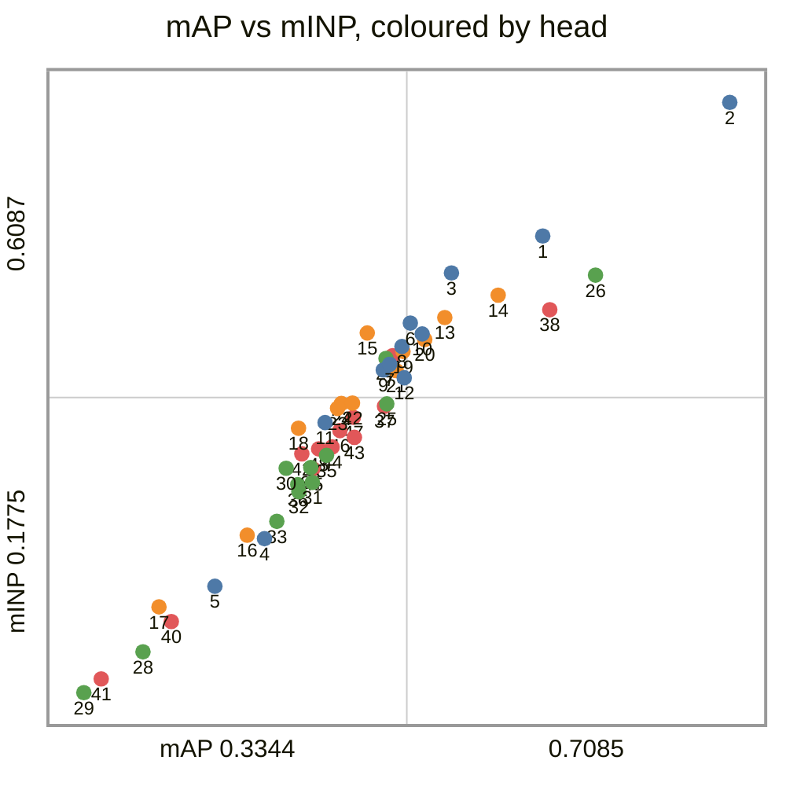
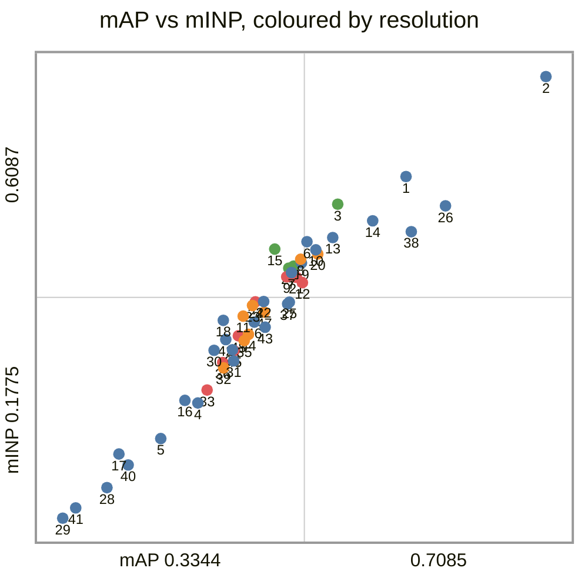
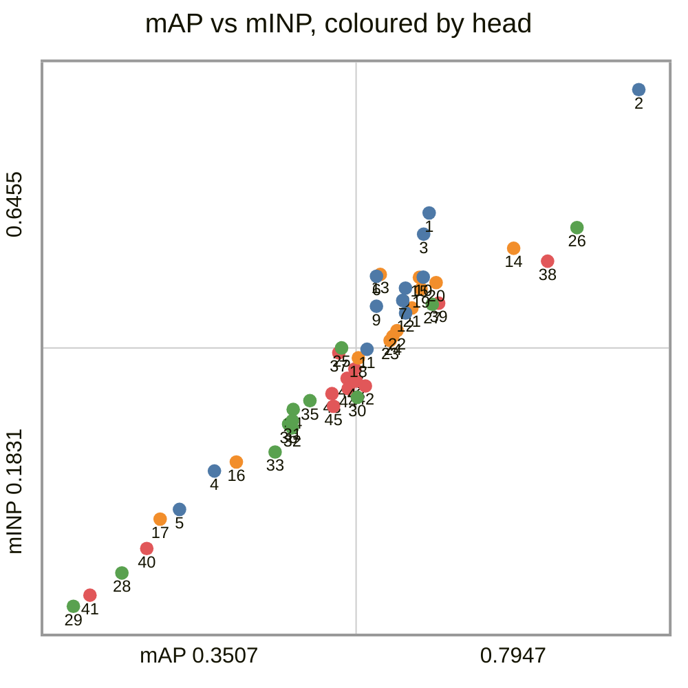
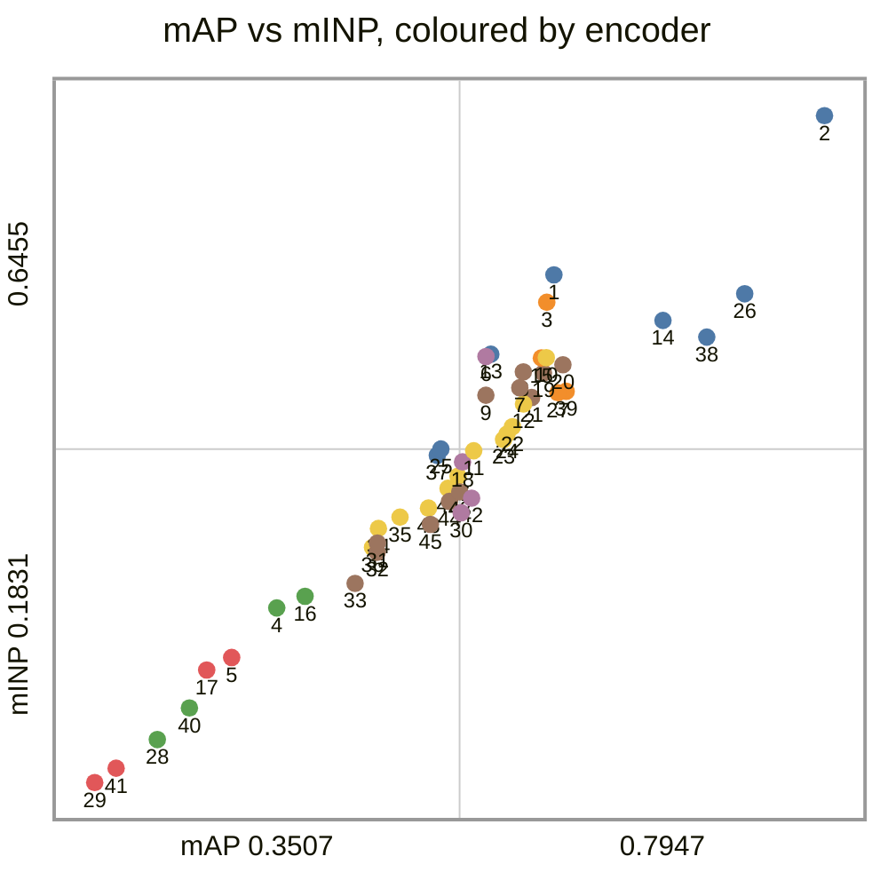
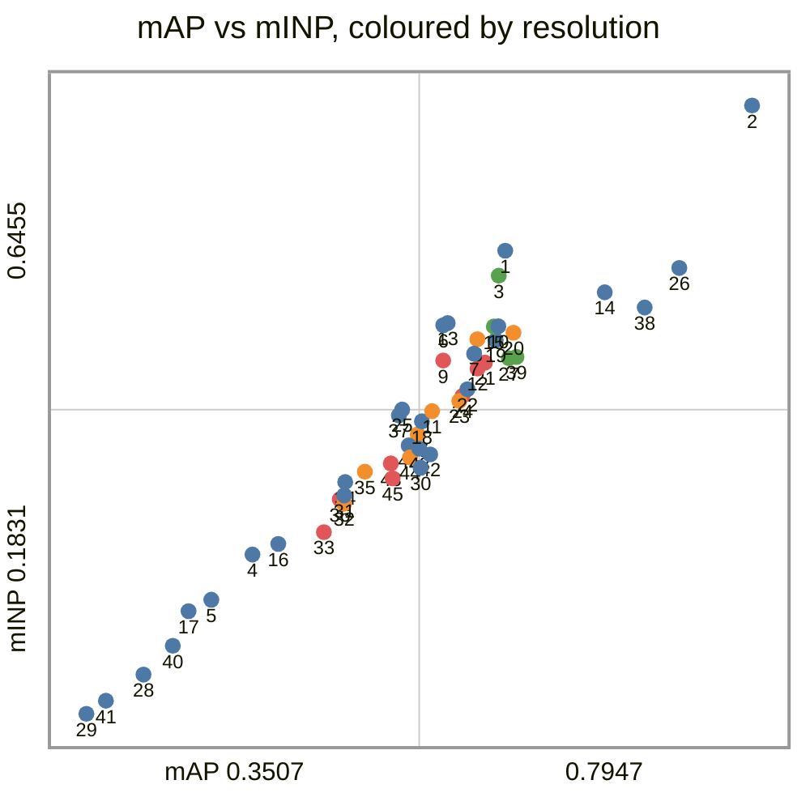

<!-- generated by `reidbench render`; edit the runs, not this file -->

# ccvid

[← table.md](../table.md)

## ccvid/tracklet-cloth-changing@1

### 🟦 arcface

|  # | encoder                                       | resolution | resize |        mAP |         R1 |         R5 |        R10 |       mINP |
|---:|-----------------------------------------------|------------|--------|-----------:|-----------:|-----------:|-----------:|-----------:|
|  1 | timm:vit_base_patch16_clip_224.openai         | 224x224    | crop   |     0.6002 |     0.6511 |     0.7242 |     0.7698 |     0.5111 |
|  2 | timm:vit_base_patch16_clip_224.openai         | 224x224    | squash | **0.7085** | **0.7638** | **0.8585** | **0.8957** | **0.6087** |
|  3 | timm:vit_giantopt_patch16_siglip_256.v2_webli | 256x256    | squash |     0.5473 |     0.5576 |     0.6559 |     0.7158 |     0.4841 |
|  4 | timm:vit_huge_plus_patch16_dinov3.lvd1689m    | 224x224    | squash |     0.4390 |     0.6211 |     0.7182 |     0.7758 |     0.2900 |
|  5 | timm:vit_large_patch16_dinov3.lvd1689m        | 224x224    | squash |     0.4103 |     0.5971 |     0.6990 |     0.7422 |     0.2553 |
|  6 | timm:vit_so400m_patch14_siglip_224.v2_webli   | 224x224    | squash |     0.5235 |     0.5312 |     0.6559 |     0.7254 |     0.4475 |
|  7 | torchhub:NVlabs/RADIO/c-radio_v4-h            | 224x224    | squash |     0.5115 |     0.5803 |     0.6918 |     0.7542 |     0.4174 |
|  8 | torchhub:NVlabs/RADIO/c-radio_v4-h            | 256x128    | squash |     0.5186 |     0.5779 |     0.6871 |     0.7494 |     0.4304 |
|  9 | torchhub:NVlabs/RADIO/c-radio_v4-h            | native     | squash |     0.5078 |     0.5875 |     0.6679 |     0.7326 |     0.4132 |
| 10 | torchhub:NVlabs/RADIO/c-radio_v4-so400m       | 224x224    | squash |     0.5303 |     0.5815 |     0.6978 |     0.7686 |     0.4395 |
| 11 | torchhub:NVlabs/RADIO/c-radio_v4-so400m       | 256x128    | squash |     0.4741 |     0.5408 |     0.6415 |     0.7062 |     0.3748 |
| 12 | torchhub:NVlabs/RADIO/c-radio_v4-so400m       | native     | squash |     0.5200 |     0.6199 |     0.6942 |     0.7506 |     0.4075 |

### 🟧 linear

|  # | encoder                                       | resolution | resize |        mAP |         R1 |         R5 |        R10 |       mINP |
|---:|-----------------------------------------------|------------|--------|-----------:|-----------:|-----------:|-----------:|-----------:|
| 13 | timm:vit_base_patch16_clip_224.openai         | 224x224    | crop   |     0.5434 |     0.5863 |     0.6763 |     0.7386 |     0.4516 |
| 14 | timm:vit_base_patch16_clip_224.openai         | 224x224    | squash | **0.5743** | **0.6151** | **0.7518** | **0.8046** | **0.4679** |
| 15 | timm:vit_giantopt_patch16_siglip_256.v2_webli | 256x256    | squash |     0.4986 |     0.4808 |     0.6211 |     0.7050 |     0.4403 |
| 16 | timm:vit_huge_plus_patch16_dinov3.lvd1689m    | 224x224    | squash |     0.4290 |     0.5552 |     0.7122 |     0.7758 |     0.2926 |
| 17 | timm:vit_large_patch16_dinov3.lvd1689m        | 224x224    | squash |     0.3779 |     0.5156 |     0.6463 |     0.7386 |     0.2402 |
| 18 | timm:vit_so400m_patch14_siglip_224.v2_webli   | 224x224    | squash |     0.4587 |     0.4856 |     0.5875 |     0.6607 |     0.3707 |
| 19 | torchhub:NVlabs/RADIO/c-radio_v4-h            | 224x224    | squash |     0.5192 |     0.5624 |     0.6990 |     0.7542 |     0.4268 |
| 20 | torchhub:NVlabs/RADIO/c-radio_v4-h            | 256x128    | squash |     0.5319 |     0.5695 |     0.6894 |     0.7506 |     0.4354 |
| 21 | torchhub:NVlabs/RADIO/c-radio_v4-h            | native     | squash |     0.5153 |     0.5612 |     0.6847 |     0.7446 |     0.4128 |
| 22 | torchhub:NVlabs/RADIO/c-radio_v4-so400m       | 224x224    | squash |     0.4900 |     0.5240 |     0.6727 |     0.7350 |     0.3891 |
| 23 | torchhub:NVlabs/RADIO/c-radio_v4-so400m       | 256x128    | squash |     0.4813 |     0.5072 |     0.6559 |     0.7122 |     0.3852 |
| 24 | torchhub:NVlabs/RADIO/c-radio_v4-so400m       | native     | squash |     0.4836 |     0.5228 |     0.6607 |     0.7218 |     0.3888 |

### 🟩 none

|  # | encoder                                       | resolution | resize |        mAP |         R1 |         R5 |        R10 |       mINP |
|---:|-----------------------------------------------|------------|--------|-----------:|-----------:|-----------:|-----------:|-----------:|
| 25 | timm:vit_base_patch16_clip_224.openai         | 224x224    | crop   |     0.5098 |     0.5983 |     0.7098 |     0.7458 |     0.3885 |
| 26 | timm:vit_base_patch16_clip_224.openai         | 224x224    | squash | **0.6307** | **0.7386** | **0.8297** | **0.8585** | **0.4825** |
| 27 | timm:vit_giantopt_patch16_siglip_256.v2_webli | 256x256    | squash |     0.5094 |     0.5600 |     0.6511 |     0.7146 |     0.4217 |
| 28 | timm:vit_huge_plus_patch16_dinov3.lvd1689m    | 224x224    | squash |     0.3686 |     0.5432 |     0.6966 |     0.7578 |     0.2074 |
| 29 | timm:vit_large_patch16_dinov3.lvd1689m        | 224x224    | squash |     0.3344 |     0.5144 |     0.6499 |     0.7182 |     0.1775 |
| 30 | timm:vit_so400m_patch14_siglip_224.v2_webli   | 224x224    | squash |     0.4516 |     0.5156 |     0.6079 |     0.6918 |     0.3415 |
| 31 | torchhub:NVlabs/RADIO/c-radio_v4-h            | 224x224    | squash |     0.4667 |     0.6103 |     0.7122 |     0.7494 |     0.3311 |
| 32 | torchhub:NVlabs/RADIO/c-radio_v4-h            | 256x128    | squash |     0.4589 |     0.5827 |     0.7002 |     0.7542 |     0.3243 |
| 33 | torchhub:NVlabs/RADIO/c-radio_v4-h            | native     | squash |     0.4462 |     0.5815 |     0.6918 |     0.7506 |     0.3027 |
| 34 | torchhub:NVlabs/RADIO/c-radio_v4-so400m       | 224x224    | squash |     0.4658 |     0.5863 |     0.7002 |     0.7542 |     0.3420 |
| 35 | torchhub:NVlabs/RADIO/c-radio_v4-so400m       | 256x128    | squash |     0.4749 |     0.5887 |     0.7074 |     0.7470 |     0.3509 |
| 36 | torchhub:NVlabs/RADIO/c-radio_v4-so400m       | native     | squash |     0.4583 |     0.5731 |     0.6882 |     0.7398 |     0.3296 |

### 🟥 pca

|  # | encoder                                       | resolution | resize |        mAP |         R1 |         R5 |        R10 |       mINP |
|---:|-----------------------------------------------|------------|--------|-----------:|-----------:|-----------:|-----------:|-----------:|
| 37 | timm:vit_base_patch16_clip_224.openai         | 224x224    | crop   |     0.5085 |     0.6067 |     0.6942 |     0.7314 |     0.3868 |
| 38 | timm:vit_base_patch16_clip_224.openai         | 224x224    | squash | **0.6043** | **0.7050** | **0.8118** | **0.8417** | **0.4572** |
| 39 | timm:vit_giantopt_patch16_siglip_256.v2_webli | 256x256    | squash |     0.5132 |     0.5600 |     0.6595 |     0.7134 |     0.4237 |
| 40 | timm:vit_huge_plus_patch16_dinov3.lvd1689m    | 224x224    | squash |     0.3850 |     0.5456 |     0.6871 |     0.7626 |     0.2295 |
| 41 | timm:vit_large_patch16_dinov3.lvd1689m        | 224x224    | squash |     0.3445 |     0.5168 |     0.6511 |     0.7182 |     0.1876 |
| 42 | timm:vit_so400m_patch14_siglip_224.v2_webli   | 224x224    | squash |     0.4606 |     0.5048 |     0.6319 |     0.7050 |     0.3519 |
| 43 | torchhub:NVlabs/RADIO/c-radio_v4-h            | 224x224    | squash |     0.4911 |     0.6115 |     0.7134 |     0.7614 |     0.3640 |
| 44 | torchhub:NVlabs/RADIO/c-radio_v4-h            | 256x128    | squash |     0.4782 |     0.5695 |     0.6978 |     0.7530 |     0.3570 |
| 45 | torchhub:NVlabs/RADIO/c-radio_v4-h            | native     | squash |     0.4671 |     0.5659 |     0.6894 |     0.7506 |     0.3410 |
| 46 | torchhub:NVlabs/RADIO/c-radio_v4-so400m       | 224x224    | squash |     0.4827 |     0.5731 |     0.7002 |     0.7602 |     0.3689 |
| 47 | torchhub:NVlabs/RADIO/c-radio_v4-so400m       | 256x128    | squash |     0.4905 |     0.5767 |     0.6990 |     0.7422 |     0.3786 |
| 48 | torchhub:NVlabs/RADIO/c-radio_v4-so400m       | native     | squash |     0.4704 |     0.5540 |     0.6930 |     0.7338 |     0.3556 |

### Every row, by encoder and resolution

```mermaid
%%{init: {"themeVariables": {"quadrant1Fill": "transparent", "quadrant2Fill": "transparent", "quadrant3Fill": "transparent", "quadrant4Fill": "transparent", "quadrantExternalBorderStrokeFill": "#999999", "quadrantInternalBorderStrokeFill": "#cccccc", "quadrantPointFill": "#4e79a7"}}}%%
quadrantChart
    title mAP vs mINP, coloured by head
    x-axis "mAP 0.3344" --> "0.7085"
    y-axis "mINP 0.1775" --> "0.6087"
    quadrant-1 " "
    quadrant-2 " "
    quadrant-3 " "
    quadrant-4 " "
    1:::sarcface: [0.6894, 0.7463]
    2:::sarcface: [0.9500, 0.9500]
    3:::sarcface: [0.5622, 0.6900]
    4:::sarcface: [0.3017, 0.2848]
    5:::sarcface: [0.2326, 0.2123]
    6:::sarcface: [0.5049, 0.6135]
    7:::sarcface: [0.4761, 0.5507]
    8:::sarcface: [0.4932, 0.5778]
    9:::sarcface: [0.4672, 0.5420]
    10:::sarcface: [0.5214, 0.5970]
    11:::sarcface: [0.3861, 0.4618]
    12:::sarcface: [0.4964, 0.5301]
    13:::slinear: [0.5529, 0.6220]
    14:::slinear: [0.6273, 0.6561]
    15:::slinear: [0.4449, 0.5985]
    16:::slinear: [0.2776, 0.2901]
    17:::slinear: [0.1547, 0.1808]
    18:::slinear: [0.3491, 0.4532]
    19:::slinear: [0.4947, 0.5703]
    20:::slinear: [0.5250, 0.5884]
    21:::slinear: [0.4852, 0.5411]
    22:::slinear: [0.4243, 0.4916]
    23:::slinear: [0.4035, 0.4835]
    24:::slinear: [0.4088, 0.4909]
    25:::snone: [0.4721, 0.4903]
    26:::snone: [0.7629, 0.6866]
    27:::snone: [0.4710, 0.5596]
    28:::snone: [0.1324, 0.1123]
    29:::snone: [0.0500, 0.0500]
    30:::snone: [0.3319, 0.3922]
    31:::snone: [0.3684, 0.3706]
    32:::snone: [0.3496, 0.3564]
    33:::snone: [0.3189, 0.3112]
    34:::snone: [0.3662, 0.3934]
    35:::snone: [0.3881, 0.4118]
    36:::snone: [0.3481, 0.3673]
    37:::spca: [0.4689, 0.4868]
    38:::spca: [0.6992, 0.6339]
    39:::spca: [0.4802, 0.5638]
    40:::spca: [0.1719, 0.1585]
    41:::spca: [0.0742, 0.0710]
    42:::spca: [0.3537, 0.4141]
    43:::spca: [0.4270, 0.4393]
    44:::spca: [0.3959, 0.4246]
    45:::spca: [0.3692, 0.3912]
    46:::spca: [0.4068, 0.4496]
    47:::spca: [0.4255, 0.4698]
    48:::spca: [0.3771, 0.4217]
    classDef sarcface color: #4e79a7
    classDef slinear color: #f28e2b
    classDef snone color: #59a14f
    classDef spca color: #e15759
```

```mermaid
%%{init: {"themeVariables": {"xyChart": {"backgroundColor": "transparent", "plotColorPalette": "#4e79a7,#f28e2b,#59a14f,#e15759"}}, "xyChart": {"height": 1384, "width": 1215, "yAxis": {"showLabel": false}}}}%%
xychart-beta horizontal
    title "mAP, coloured by head"
    x-axis ["vit_base_patch16_clip_224.openai 224x224 arcface crop · 60.02%", "vit_base_patch16_clip_224.openai 224x224 arcface squash · 70.85%", "vit_base_patch16_clip_224.openai 224x224 linear crop · 54.34%", "vit_base_patch16_clip_224.openai 224x224 linear squash · 57.43%", "vit_base_patch16_clip_224.openai 224x224 none crop · 50.98%", "vit_base_patch16_clip_224.openai 224x224 none squash · 63.07%", "vit_base_patch16_clip_224.openai 224x224 pca crop · 50.85%", "vit_base_patch16_clip_224.openai 224x224 pca squash · 60.43%", "vit_giantopt_patch16_siglip_256.v2_webli 256x256 arcface squash · 54.73%", "vit_giantopt_patch16_siglip_256.v2_webli 256x256 linear squash · 49.86%", "vit_giantopt_patch16_siglip_256.v2_webli 256x256 none squash · 50.94%", "vit_giantopt_patch16_siglip_256.v2_webli 256x256 pca squash · 51.32%", "vit_huge_plus_patch16_dinov3.lvd1689m 224x224 arcface squash · 43.90%", "vit_huge_plus_patch16_dinov3.lvd1689m 224x224 linear squash · 42.90%", "vit_huge_plus_patch16_dinov3.lvd1689m 224x224 none squash · 36.86%", "vit_huge_plus_patch16_dinov3.lvd1689m 224x224 pca squash · 38.50%", "vit_large_patch16_dinov3.lvd1689m 224x224 arcface squash · 41.03%", "vit_large_patch16_dinov3.lvd1689m 224x224 linear squash · 37.79%", "vit_large_patch16_dinov3.lvd1689m 224x224 none squash · 33.44%", "vit_large_patch16_dinov3.lvd1689m 224x224 pca squash · 34.45%", "vit_so400m_patch14_siglip_224.v2_webli 224x224 arcface squash · 52.35%", "vit_so400m_patch14_siglip_224.v2_webli 224x224 linear squash · 45.87%", "vit_so400m_patch14_siglip_224.v2_webli 224x224 none squash · 45.16%", "vit_so400m_patch14_siglip_224.v2_webli 224x224 pca squash · 46.06%", "c-radio_v4-h 224x224 arcface squash · 51.15%", "c-radio_v4-h 224x224 linear squash · 51.92%", "c-radio_v4-h 224x224 none squash · 46.67%", "c-radio_v4-h 224x224 pca squash · 49.11%", "c-radio_v4-h 256x128 arcface squash · 51.86%", "c-radio_v4-h 256x128 linear squash · 53.19%", "c-radio_v4-h 256x128 none squash · 45.89%", "c-radio_v4-h 256x128 pca squash · 47.82%", "c-radio_v4-h native arcface squash · 50.78%", "c-radio_v4-h native linear squash · 51.53%", "c-radio_v4-h native none squash · 44.62%", "c-radio_v4-h native pca squash · 46.71%", "c-radio_v4-so400m 224x224 arcface squash · 53.03%", "c-radio_v4-so400m 224x224 linear squash · 49.00%", "c-radio_v4-so400m 224x224 none squash · 46.58%", "c-radio_v4-so400m 224x224 pca squash · 48.27%", "c-radio_v4-so400m 256x128 arcface squash · 47.41%", "c-radio_v4-so400m 256x128 linear squash · 48.13%", "c-radio_v4-so400m 256x128 none squash · 47.49%", "c-radio_v4-so400m 256x128 pca squash · 49.05%", "c-radio_v4-so400m native arcface squash · 52.00%", "c-radio_v4-so400m native linear squash · 48.36%", "c-radio_v4-so400m native none squash · 45.83%", "c-radio_v4-so400m native pca squash · 47.04%"]
    y-axis "mAP (%)" 0 --> 74.39
    bar [60.02, 70.85, 0.00, 0.00, 0.00, 0.00, 0.00, 0.00, 54.73, 0.00, 0.00, 0.00, 43.90, 0.00, 0.00, 0.00, 41.03, 0.00, 0.00, 0.00, 52.35, 0.00, 0.00, 0.00, 51.15, 0.00, 0.00, 0.00, 51.86, 0.00, 0.00, 0.00, 50.78, 0.00, 0.00, 0.00, 53.03, 0.00, 0.00, 0.00, 47.41, 0.00, 0.00, 0.00, 52.00, 0.00, 0.00, 0.00]
    bar [0.00, 0.00, 54.34, 57.43, 0.00, 0.00, 0.00, 0.00, 0.00, 49.86, 0.00, 0.00, 0.00, 42.90, 0.00, 0.00, 0.00, 37.79, 0.00, 0.00, 0.00, 45.87, 0.00, 0.00, 0.00, 51.92, 0.00, 0.00, 0.00, 53.19, 0.00, 0.00, 0.00, 51.53, 0.00, 0.00, 0.00, 49.00, 0.00, 0.00, 0.00, 48.13, 0.00, 0.00, 0.00, 48.36, 0.00, 0.00]
    bar [0.00, 0.00, 0.00, 0.00, 50.98, 63.07, 0.00, 0.00, 0.00, 0.00, 50.94, 0.00, 0.00, 0.00, 36.86, 0.00, 0.00, 0.00, 33.44, 0.00, 0.00, 0.00, 45.16, 0.00, 0.00, 0.00, 46.67, 0.00, 0.00, 0.00, 45.89, 0.00, 0.00, 0.00, 44.62, 0.00, 0.00, 0.00, 46.58, 0.00, 0.00, 0.00, 47.49, 0.00, 0.00, 0.00, 45.83, 0.00]
    bar [0.00, 0.00, 0.00, 0.00, 0.00, 0.00, 50.85, 60.43, 0.00, 0.00, 0.00, 51.32, 0.00, 0.00, 0.00, 38.50, 0.00, 0.00, 0.00, 34.45, 0.00, 0.00, 0.00, 46.06, 0.00, 0.00, 0.00, 49.11, 0.00, 0.00, 0.00, 47.82, 0.00, 0.00, 0.00, 46.71, 0.00, 0.00, 0.00, 48.27, 0.00, 0.00, 0.00, 49.05, 0.00, 0.00, 0.00, 47.04]
```

### By head — does the probe carry it?

```mermaid
%%{init: {"themeVariables": {"xyChart": {"backgroundColor": "transparent", "plotColorPalette": "#4e79a7,#f28e2b,#59a14f,#e15759"}}, "xyChart": {"height": 1384, "width": 1215, "yAxis": {"showLabel": false}}}}%%
xychart-beta horizontal
    title "mAP, coloured by head"
    x-axis ["arcface vit_base_patch16_clip_224.openai 224x224 crop · 60.02%", "arcface vit_base_patch16_clip_224.openai 224x224 squash · 70.85%", "arcface vit_giantopt_patch16_siglip_256.v2_webli 256x256 squash · 54.73%", "arcface vit_huge_plus_patch16_dinov3.lvd1689m 224x224 squash · 43.90%", "arcface vit_large_patch16_dinov3.lvd1689m 224x224 squash · 41.03%", "arcface vit_so400m_patch14_siglip_224.v2_webli 224x224 squash · 52.35%", "arcface c-radio_v4-h 224x224 squash · 51.15%", "arcface c-radio_v4-h 256x128 squash · 51.86%", "arcface c-radio_v4-h native squash · 50.78%", "arcface c-radio_v4-so400m 224x224 squash · 53.03%", "arcface c-radio_v4-so400m 256x128 squash · 47.41%", "arcface c-radio_v4-so400m native squash · 52.00%", "linear vit_base_patch16_clip_224.openai 224x224 crop · 54.34%", "linear vit_base_patch16_clip_224.openai 224x224 squash · 57.43%", "linear vit_giantopt_patch16_siglip_256.v2_webli 256x256 squash · 49.86%", "linear vit_huge_plus_patch16_dinov3.lvd1689m 224x224 squash · 42.90%", "linear vit_large_patch16_dinov3.lvd1689m 224x224 squash · 37.79%", "linear vit_so400m_patch14_siglip_224.v2_webli 224x224 squash · 45.87%", "linear c-radio_v4-h 224x224 squash · 51.92%", "linear c-radio_v4-h 256x128 squash · 53.19%", "linear c-radio_v4-h native squash · 51.53%", "linear c-radio_v4-so400m 224x224 squash · 49.00%", "linear c-radio_v4-so400m 256x128 squash · 48.13%", "linear c-radio_v4-so400m native squash · 48.36%", "none vit_base_patch16_clip_224.openai 224x224 crop · 50.98%", "none vit_base_patch16_clip_224.openai 224x224 squash · 63.07%", "none vit_giantopt_patch16_siglip_256.v2_webli 256x256 squash · 50.94%", "none vit_huge_plus_patch16_dinov3.lvd1689m 224x224 squash · 36.86%", "none vit_large_patch16_dinov3.lvd1689m 224x224 squash · 33.44%", "none vit_so400m_patch14_siglip_224.v2_webli 224x224 squash · 45.16%", "none c-radio_v4-h 224x224 squash · 46.67%", "none c-radio_v4-h 256x128 squash · 45.89%", "none c-radio_v4-h native squash · 44.62%", "none c-radio_v4-so400m 224x224 squash · 46.58%", "none c-radio_v4-so400m 256x128 squash · 47.49%", "none c-radio_v4-so400m native squash · 45.83%", "pca vit_base_patch16_clip_224.openai 224x224 crop · 50.85%", "pca vit_base_patch16_clip_224.openai 224x224 squash · 60.43%", "pca vit_giantopt_patch16_siglip_256.v2_webli 256x256 squash · 51.32%", "pca vit_huge_plus_patch16_dinov3.lvd1689m 224x224 squash · 38.50%", "pca vit_large_patch16_dinov3.lvd1689m 224x224 squash · 34.45%", "pca vit_so400m_patch14_siglip_224.v2_webli 224x224 squash · 46.06%", "pca c-radio_v4-h 224x224 squash · 49.11%", "pca c-radio_v4-h 256x128 squash · 47.82%", "pca c-radio_v4-h native squash · 46.71%", "pca c-radio_v4-so400m 224x224 squash · 48.27%", "pca c-radio_v4-so400m 256x128 squash · 49.05%", "pca c-radio_v4-so400m native squash · 47.04%"]
    y-axis "mAP (%)" 0 --> 74.39
    bar [60.02, 70.85, 54.73, 43.90, 41.03, 52.35, 51.15, 51.86, 50.78, 53.03, 47.41, 52.00, 0.00, 0.00, 0.00, 0.00, 0.00, 0.00, 0.00, 0.00, 0.00, 0.00, 0.00, 0.00, 0.00, 0.00, 0.00, 0.00, 0.00, 0.00, 0.00, 0.00, 0.00, 0.00, 0.00, 0.00, 0.00, 0.00, 0.00, 0.00, 0.00, 0.00, 0.00, 0.00, 0.00, 0.00, 0.00, 0.00]
    bar [0.00, 0.00, 0.00, 0.00, 0.00, 0.00, 0.00, 0.00, 0.00, 0.00, 0.00, 0.00, 54.34, 57.43, 49.86, 42.90, 37.79, 45.87, 51.92, 53.19, 51.53, 49.00, 48.13, 48.36, 0.00, 0.00, 0.00, 0.00, 0.00, 0.00, 0.00, 0.00, 0.00, 0.00, 0.00, 0.00, 0.00, 0.00, 0.00, 0.00, 0.00, 0.00, 0.00, 0.00, 0.00, 0.00, 0.00, 0.00]
    bar [0.00, 0.00, 0.00, 0.00, 0.00, 0.00, 0.00, 0.00, 0.00, 0.00, 0.00, 0.00, 0.00, 0.00, 0.00, 0.00, 0.00, 0.00, 0.00, 0.00, 0.00, 0.00, 0.00, 0.00, 50.98, 63.07, 50.94, 36.86, 33.44, 45.16, 46.67, 45.89, 44.62, 46.58, 47.49, 45.83, 0.00, 0.00, 0.00, 0.00, 0.00, 0.00, 0.00, 0.00, 0.00, 0.00, 0.00, 0.00]
    bar [0.00, 0.00, 0.00, 0.00, 0.00, 0.00, 0.00, 0.00, 0.00, 0.00, 0.00, 0.00, 0.00, 0.00, 0.00, 0.00, 0.00, 0.00, 0.00, 0.00, 0.00, 0.00, 0.00, 0.00, 0.00, 0.00, 0.00, 0.00, 0.00, 0.00, 0.00, 0.00, 0.00, 0.00, 0.00, 0.00, 50.85, 60.43, 51.32, 38.50, 34.45, 46.06, 49.11, 47.82, 46.71, 48.27, 49.05, 47.04]
```

### By encoder — does the checkpoint carry it?

*Colour — encoder:* 🟦 timm:vit_base_patch16_clip_224.openai · 🟧 timm:vit_giantopt_patch16_siglip_256.v2_webli · 🟩 timm:vit_huge_plus_patch16_dinov3.lvd1689m · 🟥 timm:vit_large_patch16_dinov3.lvd1689m · 🟪 timm:vit_so400m_patch14_siglip_224.v2_webli · 🟫 torchhub:NVlabs/RADIO/c-radio_v4-h · 🟨 torchhub:NVlabs/RADIO/c-radio_v4-so400m

```mermaid
%%{init: {"themeVariables": {"quadrant1Fill": "transparent", "quadrant2Fill": "transparent", "quadrant3Fill": "transparent", "quadrant4Fill": "transparent", "quadrantExternalBorderStrokeFill": "#999999", "quadrantInternalBorderStrokeFill": "#cccccc", "quadrantPointFill": "#4e79a7"}}}%%
quadrantChart
    title mAP vs mINP, coloured by encoder
    x-axis "mAP 0.3344" --> "0.7085"
    y-axis "mINP 0.1775" --> "0.6087"
    quadrant-1 " "
    quadrant-2 " "
    quadrant-3 " "
    quadrant-4 " "
    1:::stimmvitbasepatch16clip224openai: [0.6894, 0.7463]
    2:::stimmvitbasepatch16clip224openai: [0.9500, 0.9500]
    3:::stimmvitgiantoptpatch16siglip256v2webli: [0.5622, 0.6900]
    4:::stimmvithugepluspatch16dinov3lvd1689m: [0.3017, 0.2848]
    5:::stimmvitlargepatch16dinov3lvd1689m: [0.2326, 0.2123]
    6:::stimmvitso400mpatch14siglip224v2webli: [0.5049, 0.6135]
    7:::storchhubNVlabsRADIOcradiov4h: [0.4761, 0.5507]
    8:::storchhubNVlabsRADIOcradiov4h: [0.4932, 0.5778]
    9:::storchhubNVlabsRADIOcradiov4h: [0.4672, 0.5420]
    10:::storchhubNVlabsRADIOcradiov4so400m: [0.5214, 0.5970]
    11:::storchhubNVlabsRADIOcradiov4so400m: [0.3861, 0.4618]
    12:::storchhubNVlabsRADIOcradiov4so400m: [0.4964, 0.5301]
    13:::stimmvitbasepatch16clip224openai: [0.5529, 0.6220]
    14:::stimmvitbasepatch16clip224openai: [0.6273, 0.6561]
    15:::stimmvitgiantoptpatch16siglip256v2webli: [0.4449, 0.5985]
    16:::stimmvithugepluspatch16dinov3lvd1689m: [0.2776, 0.2901]
    17:::stimmvitlargepatch16dinov3lvd1689m: [0.1547, 0.1808]
    18:::stimmvitso400mpatch14siglip224v2webli: [0.3491, 0.4532]
    19:::storchhubNVlabsRADIOcradiov4h: [0.4947, 0.5703]
    20:::storchhubNVlabsRADIOcradiov4h: [0.5250, 0.5884]
    21:::storchhubNVlabsRADIOcradiov4h: [0.4852, 0.5411]
    22:::storchhubNVlabsRADIOcradiov4so400m: [0.4243, 0.4916]
    23:::storchhubNVlabsRADIOcradiov4so400m: [0.4035, 0.4835]
    24:::storchhubNVlabsRADIOcradiov4so400m: [0.4088, 0.4909]
    25:::stimmvitbasepatch16clip224openai: [0.4721, 0.4903]
    26:::stimmvitbasepatch16clip224openai: [0.7629, 0.6866]
    27:::stimmvitgiantoptpatch16siglip256v2webli: [0.4710, 0.5596]
    28:::stimmvithugepluspatch16dinov3lvd1689m: [0.1324, 0.1123]
    29:::stimmvitlargepatch16dinov3lvd1689m: [0.0500, 0.0500]
    30:::stimmvitso400mpatch14siglip224v2webli: [0.3319, 0.3922]
    31:::storchhubNVlabsRADIOcradiov4h: [0.3684, 0.3706]
    32:::storchhubNVlabsRADIOcradiov4h: [0.3496, 0.3564]
    33:::storchhubNVlabsRADIOcradiov4h: [0.3189, 0.3112]
    34:::storchhubNVlabsRADIOcradiov4so400m: [0.3662, 0.3934]
    35:::storchhubNVlabsRADIOcradiov4so400m: [0.3881, 0.4118]
    36:::storchhubNVlabsRADIOcradiov4so400m: [0.3481, 0.3673]
    37:::stimmvitbasepatch16clip224openai: [0.4689, 0.4868]
    38:::stimmvitbasepatch16clip224openai: [0.6992, 0.6339]
    39:::stimmvitgiantoptpatch16siglip256v2webli: [0.4802, 0.5638]
    40:::stimmvithugepluspatch16dinov3lvd1689m: [0.1719, 0.1585]
    41:::stimmvitlargepatch16dinov3lvd1689m: [0.0742, 0.0710]
    42:::stimmvitso400mpatch14siglip224v2webli: [0.3537, 0.4141]
    43:::storchhubNVlabsRADIOcradiov4h: [0.4270, 0.4393]
    44:::storchhubNVlabsRADIOcradiov4h: [0.3959, 0.4246]
    45:::storchhubNVlabsRADIOcradiov4h: [0.3692, 0.3912]
    46:::storchhubNVlabsRADIOcradiov4so400m: [0.4068, 0.4496]
    47:::storchhubNVlabsRADIOcradiov4so400m: [0.4255, 0.4698]
    48:::storchhubNVlabsRADIOcradiov4so400m: [0.3771, 0.4217]
    classDef stimmvitbasepatch16clip224openai color: #4e79a7
    classDef stimmvitgiantoptpatch16siglip256v2webli color: #f28e2b
    classDef stimmvithugepluspatch16dinov3lvd1689m color: #59a14f
    classDef stimmvitlargepatch16dinov3lvd1689m color: #e15759
    classDef stimmvitso400mpatch14siglip224v2webli color: #b07aa1
    classDef storchhubNVlabsRADIOcradiov4h color: #9c755f
    classDef storchhubNVlabsRADIOcradiov4so400m color: #edc948
```

```mermaid
%%{init: {"themeVariables": {"xyChart": {"backgroundColor": "transparent", "plotColorPalette": "#4e79a7,#f28e2b,#59a14f,#e15759,#b07aa1,#9c755f,#edc948"}}, "xyChart": {"height": 1384, "width": 1215, "yAxis": {"showLabel": false}}}}%%
xychart-beta horizontal
    title "mAP, coloured by encoder"
    x-axis ["vit_base_patch16_clip_224.openai arcface 224x224 crop · 60.02%", "vit_base_patch16_clip_224.openai arcface 224x224 squash · 70.85%", "vit_base_patch16_clip_224.openai linear 224x224 crop · 54.34%", "vit_base_patch16_clip_224.openai linear 224x224 squash · 57.43%", "vit_base_patch16_clip_224.openai none 224x224 crop · 50.98%", "vit_base_patch16_clip_224.openai none 224x224 squash · 63.07%", "vit_base_patch16_clip_224.openai pca 224x224 crop · 50.85%", "vit_base_patch16_clip_224.openai pca 224x224 squash · 60.43%", "vit_giantopt_patch16_siglip_256.v2_webli arcface 256x256 squash · 54.73%", "vit_giantopt_patch16_siglip_256.v2_webli linear 256x256 squash · 49.86%", "vit_giantopt_patch16_siglip_256.v2_webli none 256x256 squash · 50.94%", "vit_giantopt_patch16_siglip_256.v2_webli pca 256x256 squash · 51.32%", "vit_huge_plus_patch16_dinov3.lvd1689m arcface 224x224 squash · 43.90%", "vit_huge_plus_patch16_dinov3.lvd1689m linear 224x224 squash · 42.90%", "vit_huge_plus_patch16_dinov3.lvd1689m none 224x224 squash · 36.86%", "vit_huge_plus_patch16_dinov3.lvd1689m pca 224x224 squash · 38.50%", "vit_large_patch16_dinov3.lvd1689m arcface 224x224 squash · 41.03%", "vit_large_patch16_dinov3.lvd1689m linear 224x224 squash · 37.79%", "vit_large_patch16_dinov3.lvd1689m none 224x224 squash · 33.44%", "vit_large_patch16_dinov3.lvd1689m pca 224x224 squash · 34.45%", "vit_so400m_patch14_siglip_224.v2_webli arcface 224x224 squash · 52.35%", "vit_so400m_patch14_siglip_224.v2_webli linear 224x224 squash · 45.87%", "vit_so400m_patch14_siglip_224.v2_webli none 224x224 squash · 45.16%", "vit_so400m_patch14_siglip_224.v2_webli pca 224x224 squash · 46.06%", "c-radio_v4-h arcface 224x224 squash · 51.15%", "c-radio_v4-h arcface 256x128 squash · 51.86%", "c-radio_v4-h arcface native squash · 50.78%", "c-radio_v4-h linear 224x224 squash · 51.92%", "c-radio_v4-h linear 256x128 squash · 53.19%", "c-radio_v4-h linear native squash · 51.53%", "c-radio_v4-h none 224x224 squash · 46.67%", "c-radio_v4-h none 256x128 squash · 45.89%", "c-radio_v4-h none native squash · 44.62%", "c-radio_v4-h pca 224x224 squash · 49.11%", "c-radio_v4-h pca 256x128 squash · 47.82%", "c-radio_v4-h pca native squash · 46.71%", "c-radio_v4-so400m arcface 224x224 squash · 53.03%", "c-radio_v4-so400m arcface 256x128 squash · 47.41%", "c-radio_v4-so400m arcface native squash · 52.00%", "c-radio_v4-so400m linear 224x224 squash · 49.00%", "c-radio_v4-so400m linear 256x128 squash · 48.13%", "c-radio_v4-so400m linear native squash · 48.36%", "c-radio_v4-so400m none 224x224 squash · 46.58%", "c-radio_v4-so400m none 256x128 squash · 47.49%", "c-radio_v4-so400m none native squash · 45.83%", "c-radio_v4-so400m pca 224x224 squash · 48.27%", "c-radio_v4-so400m pca 256x128 squash · 49.05%", "c-radio_v4-so400m pca native squash · 47.04%"]
    y-axis "mAP (%)" 0 --> 74.39
    bar [60.02, 70.85, 54.34, 57.43, 50.98, 63.07, 50.85, 60.43, 0.00, 0.00, 0.00, 0.00, 0.00, 0.00, 0.00, 0.00, 0.00, 0.00, 0.00, 0.00, 0.00, 0.00, 0.00, 0.00, 0.00, 0.00, 0.00, 0.00, 0.00, 0.00, 0.00, 0.00, 0.00, 0.00, 0.00, 0.00, 0.00, 0.00, 0.00, 0.00, 0.00, 0.00, 0.00, 0.00, 0.00, 0.00, 0.00, 0.00]
    bar [0.00, 0.00, 0.00, 0.00, 0.00, 0.00, 0.00, 0.00, 54.73, 49.86, 50.94, 51.32, 0.00, 0.00, 0.00, 0.00, 0.00, 0.00, 0.00, 0.00, 0.00, 0.00, 0.00, 0.00, 0.00, 0.00, 0.00, 0.00, 0.00, 0.00, 0.00, 0.00, 0.00, 0.00, 0.00, 0.00, 0.00, 0.00, 0.00, 0.00, 0.00, 0.00, 0.00, 0.00, 0.00, 0.00, 0.00, 0.00]
    bar [0.00, 0.00, 0.00, 0.00, 0.00, 0.00, 0.00, 0.00, 0.00, 0.00, 0.00, 0.00, 43.90, 42.90, 36.86, 38.50, 0.00, 0.00, 0.00, 0.00, 0.00, 0.00, 0.00, 0.00, 0.00, 0.00, 0.00, 0.00, 0.00, 0.00, 0.00, 0.00, 0.00, 0.00, 0.00, 0.00, 0.00, 0.00, 0.00, 0.00, 0.00, 0.00, 0.00, 0.00, 0.00, 0.00, 0.00, 0.00]
    bar [0.00, 0.00, 0.00, 0.00, 0.00, 0.00, 0.00, 0.00, 0.00, 0.00, 0.00, 0.00, 0.00, 0.00, 0.00, 0.00, 41.03, 37.79, 33.44, 34.45, 0.00, 0.00, 0.00, 0.00, 0.00, 0.00, 0.00, 0.00, 0.00, 0.00, 0.00, 0.00, 0.00, 0.00, 0.00, 0.00, 0.00, 0.00, 0.00, 0.00, 0.00, 0.00, 0.00, 0.00, 0.00, 0.00, 0.00, 0.00]
    bar [0.00, 0.00, 0.00, 0.00, 0.00, 0.00, 0.00, 0.00, 0.00, 0.00, 0.00, 0.00, 0.00, 0.00, 0.00, 0.00, 0.00, 0.00, 0.00, 0.00, 52.35, 45.87, 45.16, 46.06, 0.00, 0.00, 0.00, 0.00, 0.00, 0.00, 0.00, 0.00, 0.00, 0.00, 0.00, 0.00, 0.00, 0.00, 0.00, 0.00, 0.00, 0.00, 0.00, 0.00, 0.00, 0.00, 0.00, 0.00]
    bar [0.00, 0.00, 0.00, 0.00, 0.00, 0.00, 0.00, 0.00, 0.00, 0.00, 0.00, 0.00, 0.00, 0.00, 0.00, 0.00, 0.00, 0.00, 0.00, 0.00, 0.00, 0.00, 0.00, 0.00, 51.15, 51.86, 50.78, 51.92, 53.19, 51.53, 46.67, 45.89, 44.62, 49.11, 47.82, 46.71, 0.00, 0.00, 0.00, 0.00, 0.00, 0.00, 0.00, 0.00, 0.00, 0.00, 0.00, 0.00]
    bar [0.00, 0.00, 0.00, 0.00, 0.00, 0.00, 0.00, 0.00, 0.00, 0.00, 0.00, 0.00, 0.00, 0.00, 0.00, 0.00, 0.00, 0.00, 0.00, 0.00, 0.00, 0.00, 0.00, 0.00, 0.00, 0.00, 0.00, 0.00, 0.00, 0.00, 0.00, 0.00, 0.00, 0.00, 0.00, 0.00, 53.03, 47.41, 52.00, 49.00, 48.13, 48.36, 46.58, 47.49, 45.83, 48.27, 49.05, 47.04]
```

### By resolution — does the input size carry it?

*Colour — resolution:* 🟦 224x224 · 🟧 256x128 · 🟩 256x256 · 🟥 native

```mermaid
%%{init: {"themeVariables": {"quadrant1Fill": "transparent", "quadrant2Fill": "transparent", "quadrant3Fill": "transparent", "quadrant4Fill": "transparent", "quadrantExternalBorderStrokeFill": "#999999", "quadrantInternalBorderStrokeFill": "#cccccc", "quadrantPointFill": "#4e79a7"}}}%%
quadrantChart
    title mAP vs mINP, coloured by resolution
    x-axis "mAP 0.3344" --> "0.7085"
    y-axis "mINP 0.1775" --> "0.6087"
    quadrant-1 " "
    quadrant-2 " "
    quadrant-3 " "
    quadrant-4 " "
    1:::s224x224: [0.6894, 0.7463]
    2:::s224x224: [0.9500, 0.9500]
    3:::s256x256: [0.5622, 0.6900]
    4:::s224x224: [0.3017, 0.2848]
    5:::s224x224: [0.2326, 0.2123]
    6:::s224x224: [0.5049, 0.6135]
    7:::s224x224: [0.4761, 0.5507]
    8:::s256x128: [0.4932, 0.5778]
    9:::snative: [0.4672, 0.5420]
    10:::s224x224: [0.5214, 0.5970]
    11:::s256x128: [0.3861, 0.4618]
    12:::snative: [0.4964, 0.5301]
    13:::s224x224: [0.5529, 0.6220]
    14:::s224x224: [0.6273, 0.6561]
    15:::s256x256: [0.4449, 0.5985]
    16:::s224x224: [0.2776, 0.2901]
    17:::s224x224: [0.1547, 0.1808]
    18:::s224x224: [0.3491, 0.4532]
    19:::s224x224: [0.4947, 0.5703]
    20:::s256x128: [0.5250, 0.5884]
    21:::snative: [0.4852, 0.5411]
    22:::s224x224: [0.4243, 0.4916]
    23:::s256x128: [0.4035, 0.4835]
    24:::snative: [0.4088, 0.4909]
    25:::s224x224: [0.4721, 0.4903]
    26:::s224x224: [0.7629, 0.6866]
    27:::s256x256: [0.4710, 0.5596]
    28:::s224x224: [0.1324, 0.1123]
    29:::s224x224: [0.0500, 0.0500]
    30:::s224x224: [0.3319, 0.3922]
    31:::s224x224: [0.3684, 0.3706]
    32:::s256x128: [0.3496, 0.3564]
    33:::snative: [0.3189, 0.3112]
    34:::s224x224: [0.3662, 0.3934]
    35:::s256x128: [0.3881, 0.4118]
    36:::snative: [0.3481, 0.3673]
    37:::s224x224: [0.4689, 0.4868]
    38:::s224x224: [0.6992, 0.6339]
    39:::s256x256: [0.4802, 0.5638]
    40:::s224x224: [0.1719, 0.1585]
    41:::s224x224: [0.0742, 0.0710]
    42:::s224x224: [0.3537, 0.4141]
    43:::s224x224: [0.4270, 0.4393]
    44:::s256x128: [0.3959, 0.4246]
    45:::snative: [0.3692, 0.3912]
    46:::s224x224: [0.4068, 0.4496]
    47:::s256x128: [0.4255, 0.4698]
    48:::snative: [0.3771, 0.4217]
    classDef s224x224 color: #4e79a7
    classDef s256x128 color: #f28e2b
    classDef s256x256 color: #59a14f
    classDef snative color: #e15759
```

```mermaid
%%{init: {"themeVariables": {"xyChart": {"backgroundColor": "transparent", "plotColorPalette": "#4e79a7,#f28e2b,#59a14f,#e15759"}}, "xyChart": {"height": 1384, "width": 1215, "yAxis": {"showLabel": false}}}}%%
xychart-beta horizontal
    title "mAP, coloured by resolution"
    x-axis ["224x224 vit_base_patch16_clip_224.openai arcface crop · 60.02%", "224x224 vit_base_patch16_clip_224.openai arcface squash · 70.85%", "224x224 vit_base_patch16_clip_224.openai linear crop · 54.34%", "224x224 vit_base_patch16_clip_224.openai linear squash · 57.43%", "224x224 vit_base_patch16_clip_224.openai none crop · 50.98%", "224x224 vit_base_patch16_clip_224.openai none squash · 63.07%", "224x224 vit_base_patch16_clip_224.openai pca crop · 50.85%", "224x224 vit_base_patch16_clip_224.openai pca squash · 60.43%", "224x224 vit_huge_plus_patch16_dinov3.lvd1689m arcface squash · 43.90%", "224x224 vit_huge_plus_patch16_dinov3.lvd1689m linear squash · 42.90%", "224x224 vit_huge_plus_patch16_dinov3.lvd1689m none squash · 36.86%", "224x224 vit_huge_plus_patch16_dinov3.lvd1689m pca squash · 38.50%", "224x224 vit_large_patch16_dinov3.lvd1689m arcface squash · 41.03%", "224x224 vit_large_patch16_dinov3.lvd1689m linear squash · 37.79%", "224x224 vit_large_patch16_dinov3.lvd1689m none squash · 33.44%", "224x224 vit_large_patch16_dinov3.lvd1689m pca squash · 34.45%", "224x224 vit_so400m_patch14_siglip_224.v2_webli arcface squash · 52.35%", "224x224 vit_so400m_patch14_siglip_224.v2_webli linear squash · 45.87%", "224x224 vit_so400m_patch14_siglip_224.v2_webli none squash · 45.16%", "224x224 vit_so400m_patch14_siglip_224.v2_webli pca squash · 46.06%", "224x224 c-radio_v4-h arcface squash · 51.15%", "224x224 c-radio_v4-h linear squash · 51.92%", "224x224 c-radio_v4-h none squash · 46.67%", "224x224 c-radio_v4-h pca squash · 49.11%", "224x224 c-radio_v4-so400m arcface squash · 53.03%", "224x224 c-radio_v4-so400m linear squash · 49.00%", "224x224 c-radio_v4-so400m none squash · 46.58%", "224x224 c-radio_v4-so400m pca squash · 48.27%", "256x128 c-radio_v4-h arcface squash · 51.86%", "256x128 c-radio_v4-h linear squash · 53.19%", "256x128 c-radio_v4-h none squash · 45.89%", "256x128 c-radio_v4-h pca squash · 47.82%", "256x128 c-radio_v4-so400m arcface squash · 47.41%", "256x128 c-radio_v4-so400m linear squash · 48.13%", "256x128 c-radio_v4-so400m none squash · 47.49%", "256x128 c-radio_v4-so400m pca squash · 49.05%", "256x256 vit_giantopt_patch16_siglip_256.v2_webli arcface squash · 54.73%", "256x256 vit_giantopt_patch16_siglip_256.v2_webli linear squash · 49.86%", "256x256 vit_giantopt_patch16_siglip_256.v2_webli none squash · 50.94%", "256x256 vit_giantopt_patch16_siglip_256.v2_webli pca squash · 51.32%", "native c-radio_v4-h arcface squash · 50.78%", "native c-radio_v4-h linear squash · 51.53%", "native c-radio_v4-h none squash · 44.62%", "native c-radio_v4-h pca squash · 46.71%", "native c-radio_v4-so400m arcface squash · 52.00%", "native c-radio_v4-so400m linear squash · 48.36%", "native c-radio_v4-so400m none squash · 45.83%", "native c-radio_v4-so400m pca squash · 47.04%"]
    y-axis "mAP (%)" 0 --> 74.39
    bar [60.02, 70.85, 54.34, 57.43, 50.98, 63.07, 50.85, 60.43, 43.90, 42.90, 36.86, 38.50, 41.03, 37.79, 33.44, 34.45, 52.35, 45.87, 45.16, 46.06, 51.15, 51.92, 46.67, 49.11, 53.03, 49.00, 46.58, 48.27, 0.00, 0.00, 0.00, 0.00, 0.00, 0.00, 0.00, 0.00, 0.00, 0.00, 0.00, 0.00, 0.00, 0.00, 0.00, 0.00, 0.00, 0.00, 0.00, 0.00]
    bar [0.00, 0.00, 0.00, 0.00, 0.00, 0.00, 0.00, 0.00, 0.00, 0.00, 0.00, 0.00, 0.00, 0.00, 0.00, 0.00, 0.00, 0.00, 0.00, 0.00, 0.00, 0.00, 0.00, 0.00, 0.00, 0.00, 0.00, 0.00, 51.86, 53.19, 45.89, 47.82, 47.41, 48.13, 47.49, 49.05, 0.00, 0.00, 0.00, 0.00, 0.00, 0.00, 0.00, 0.00, 0.00, 0.00, 0.00, 0.00]
    bar [0.00, 0.00, 0.00, 0.00, 0.00, 0.00, 0.00, 0.00, 0.00, 0.00, 0.00, 0.00, 0.00, 0.00, 0.00, 0.00, 0.00, 0.00, 0.00, 0.00, 0.00, 0.00, 0.00, 0.00, 0.00, 0.00, 0.00, 0.00, 0.00, 0.00, 0.00, 0.00, 0.00, 0.00, 0.00, 0.00, 54.73, 49.86, 50.94, 51.32, 0.00, 0.00, 0.00, 0.00, 0.00, 0.00, 0.00, 0.00]
    bar [0.00, 0.00, 0.00, 0.00, 0.00, 0.00, 0.00, 0.00, 0.00, 0.00, 0.00, 0.00, 0.00, 0.00, 0.00, 0.00, 0.00, 0.00, 0.00, 0.00, 0.00, 0.00, 0.00, 0.00, 0.00, 0.00, 0.00, 0.00, 0.00, 0.00, 0.00, 0.00, 0.00, 0.00, 0.00, 0.00, 0.00, 0.00, 0.00, 0.00, 50.78, 51.53, 44.62, 46.71, 52.00, 48.36, 45.83, 47.04]
```

### Resolution, within one encoder and head

*Colour — resolution:* 🟦 224x224 · 🟧 256x128 · 🟩 256x256 · 🟥 native

```mermaid
%%{init: {"themeVariables": {"xyChart": {"backgroundColor": "transparent", "plotColorPalette": "#4e79a7,#f28e2b,#59a14f,#e15759"}}, "xyChart": {"height": 1384, "width": 1215, "yAxis": {"showLabel": false}}}}%%
xychart-beta horizontal
    title "mAP, coloured by resolution"
    x-axis ["vit_base_patch16_clip_224.openai arcface 224x224 crop · 60.02%", "vit_base_patch16_clip_224.openai arcface 224x224 squash · 70.85%", "vit_base_patch16_clip_224.openai linear 224x224 crop · 54.34%", "vit_base_patch16_clip_224.openai linear 224x224 squash · 57.43%", "vit_base_patch16_clip_224.openai none 224x224 crop · 50.98%", "vit_base_patch16_clip_224.openai none 224x224 squash · 63.07%", "vit_base_patch16_clip_224.openai pca 224x224 crop · 50.85%", "vit_base_patch16_clip_224.openai pca 224x224 squash · 60.43%", "vit_giantopt_patch16_siglip_256.v2_webli arcface 256x256 squash · 54.73%", "vit_giantopt_patch16_siglip_256.v2_webli linear 256x256 squash · 49.86%", "vit_giantopt_patch16_siglip_256.v2_webli none 256x256 squash · 50.94%", "vit_giantopt_patch16_siglip_256.v2_webli pca 256x256 squash · 51.32%", "vit_huge_plus_patch16_dinov3.lvd1689m arcface 224x224 squash · 43.90%", "vit_huge_plus_patch16_dinov3.lvd1689m linear 224x224 squash · 42.90%", "vit_huge_plus_patch16_dinov3.lvd1689m none 224x224 squash · 36.86%", "vit_huge_plus_patch16_dinov3.lvd1689m pca 224x224 squash · 38.50%", "vit_large_patch16_dinov3.lvd1689m arcface 224x224 squash · 41.03%", "vit_large_patch16_dinov3.lvd1689m linear 224x224 squash · 37.79%", "vit_large_patch16_dinov3.lvd1689m none 224x224 squash · 33.44%", "vit_large_patch16_dinov3.lvd1689m pca 224x224 squash · 34.45%", "vit_so400m_patch14_siglip_224.v2_webli arcface 224x224 squash · 52.35%", "vit_so400m_patch14_siglip_224.v2_webli linear 224x224 squash · 45.87%", "vit_so400m_patch14_siglip_224.v2_webli none 224x224 squash · 45.16%", "vit_so400m_patch14_siglip_224.v2_webli pca 224x224 squash · 46.06%", "c-radio_v4-h arcface 224x224 squash · 51.15%", "c-radio_v4-h arcface 256x128 squash · 51.86%", "c-radio_v4-h arcface native squash · 50.78%", "c-radio_v4-h linear 224x224 squash · 51.92%", "c-radio_v4-h linear 256x128 squash · 53.19%", "c-radio_v4-h linear native squash · 51.53%", "c-radio_v4-h none 224x224 squash · 46.67%", "c-radio_v4-h none 256x128 squash · 45.89%", "c-radio_v4-h none native squash · 44.62%", "c-radio_v4-h pca 224x224 squash · 49.11%", "c-radio_v4-h pca 256x128 squash · 47.82%", "c-radio_v4-h pca native squash · 46.71%", "c-radio_v4-so400m arcface 224x224 squash · 53.03%", "c-radio_v4-so400m arcface 256x128 squash · 47.41%", "c-radio_v4-so400m arcface native squash · 52.00%", "c-radio_v4-so400m linear 224x224 squash · 49.00%", "c-radio_v4-so400m linear 256x128 squash · 48.13%", "c-radio_v4-so400m linear native squash · 48.36%", "c-radio_v4-so400m none 224x224 squash · 46.58%", "c-radio_v4-so400m none 256x128 squash · 47.49%", "c-radio_v4-so400m none native squash · 45.83%", "c-radio_v4-so400m pca 224x224 squash · 48.27%", "c-radio_v4-so400m pca 256x128 squash · 49.05%", "c-radio_v4-so400m pca native squash · 47.04%"]
    y-axis "mAP (%)" 0 --> 74.39
    bar [60.02, 70.85, 54.34, 57.43, 50.98, 63.07, 50.85, 60.43, 0.00, 0.00, 0.00, 0.00, 43.90, 42.90, 36.86, 38.50, 41.03, 37.79, 33.44, 34.45, 52.35, 45.87, 45.16, 46.06, 51.15, 0.00, 0.00, 51.92, 0.00, 0.00, 46.67, 0.00, 0.00, 49.11, 0.00, 0.00, 53.03, 0.00, 0.00, 49.00, 0.00, 0.00, 46.58, 0.00, 0.00, 48.27, 0.00, 0.00]
    bar [0.00, 0.00, 0.00, 0.00, 0.00, 0.00, 0.00, 0.00, 0.00, 0.00, 0.00, 0.00, 0.00, 0.00, 0.00, 0.00, 0.00, 0.00, 0.00, 0.00, 0.00, 0.00, 0.00, 0.00, 0.00, 51.86, 0.00, 0.00, 53.19, 0.00, 0.00, 45.89, 0.00, 0.00, 47.82, 0.00, 0.00, 47.41, 0.00, 0.00, 48.13, 0.00, 0.00, 47.49, 0.00, 0.00, 49.05, 0.00]
    bar [0.00, 0.00, 0.00, 0.00, 0.00, 0.00, 0.00, 0.00, 54.73, 49.86, 50.94, 51.32, 0.00, 0.00, 0.00, 0.00, 0.00, 0.00, 0.00, 0.00, 0.00, 0.00, 0.00, 0.00, 0.00, 0.00, 0.00, 0.00, 0.00, 0.00, 0.00, 0.00, 0.00, 0.00, 0.00, 0.00, 0.00, 0.00, 0.00, 0.00, 0.00, 0.00, 0.00, 0.00, 0.00, 0.00, 0.00, 0.00]
    bar [0.00, 0.00, 0.00, 0.00, 0.00, 0.00, 0.00, 0.00, 0.00, 0.00, 0.00, 0.00, 0.00, 0.00, 0.00, 0.00, 0.00, 0.00, 0.00, 0.00, 0.00, 0.00, 0.00, 0.00, 0.00, 0.00, 50.78, 0.00, 0.00, 51.53, 0.00, 0.00, 44.62, 0.00, 0.00, 46.71, 0.00, 0.00, 52.00, 0.00, 0.00, 48.36, 0.00, 0.00, 45.83, 0.00, 0.00, 47.04]
```

### Head, within one encoder and resolution

```mermaid
%%{init: {"themeVariables": {"xyChart": {"backgroundColor": "transparent", "plotColorPalette": "#4e79a7,#f28e2b,#59a14f,#e15759"}}, "xyChart": {"height": 1384, "width": 1215, "yAxis": {"showLabel": false}}}}%%
xychart-beta horizontal
    title "mAP, coloured by head"
    x-axis ["vit_base_patch16_clip_224.openai 224x224 arcface crop · 60.02%", "vit_base_patch16_clip_224.openai 224x224 arcface squash · 70.85%", "vit_base_patch16_clip_224.openai 224x224 linear crop · 54.34%", "vit_base_patch16_clip_224.openai 224x224 linear squash · 57.43%", "vit_base_patch16_clip_224.openai 224x224 none crop · 50.98%", "vit_base_patch16_clip_224.openai 224x224 none squash · 63.07%", "vit_base_patch16_clip_224.openai 224x224 pca crop · 50.85%", "vit_base_patch16_clip_224.openai 224x224 pca squash · 60.43%", "vit_giantopt_patch16_siglip_256.v2_webli 256x256 arcface squash · 54.73%", "vit_giantopt_patch16_siglip_256.v2_webli 256x256 linear squash · 49.86%", "vit_giantopt_patch16_siglip_256.v2_webli 256x256 none squash · 50.94%", "vit_giantopt_patch16_siglip_256.v2_webli 256x256 pca squash · 51.32%", "vit_huge_plus_patch16_dinov3.lvd1689m 224x224 arcface squash · 43.90%", "vit_huge_plus_patch16_dinov3.lvd1689m 224x224 linear squash · 42.90%", "vit_huge_plus_patch16_dinov3.lvd1689m 224x224 none squash · 36.86%", "vit_huge_plus_patch16_dinov3.lvd1689m 224x224 pca squash · 38.50%", "vit_large_patch16_dinov3.lvd1689m 224x224 arcface squash · 41.03%", "vit_large_patch16_dinov3.lvd1689m 224x224 linear squash · 37.79%", "vit_large_patch16_dinov3.lvd1689m 224x224 none squash · 33.44%", "vit_large_patch16_dinov3.lvd1689m 224x224 pca squash · 34.45%", "vit_so400m_patch14_siglip_224.v2_webli 224x224 arcface squash · 52.35%", "vit_so400m_patch14_siglip_224.v2_webli 224x224 linear squash · 45.87%", "vit_so400m_patch14_siglip_224.v2_webli 224x224 none squash · 45.16%", "vit_so400m_patch14_siglip_224.v2_webli 224x224 pca squash · 46.06%", "c-radio_v4-h 224x224 arcface squash · 51.15%", "c-radio_v4-h 224x224 linear squash · 51.92%", "c-radio_v4-h 224x224 none squash · 46.67%", "c-radio_v4-h 224x224 pca squash · 49.11%", "c-radio_v4-h 256x128 arcface squash · 51.86%", "c-radio_v4-h 256x128 linear squash · 53.19%", "c-radio_v4-h 256x128 none squash · 45.89%", "c-radio_v4-h 256x128 pca squash · 47.82%", "c-radio_v4-h native arcface squash · 50.78%", "c-radio_v4-h native linear squash · 51.53%", "c-radio_v4-h native none squash · 44.62%", "c-radio_v4-h native pca squash · 46.71%", "c-radio_v4-so400m 224x224 arcface squash · 53.03%", "c-radio_v4-so400m 224x224 linear squash · 49.00%", "c-radio_v4-so400m 224x224 none squash · 46.58%", "c-radio_v4-so400m 224x224 pca squash · 48.27%", "c-radio_v4-so400m 256x128 arcface squash · 47.41%", "c-radio_v4-so400m 256x128 linear squash · 48.13%", "c-radio_v4-so400m 256x128 none squash · 47.49%", "c-radio_v4-so400m 256x128 pca squash · 49.05%", "c-radio_v4-so400m native arcface squash · 52.00%", "c-radio_v4-so400m native linear squash · 48.36%", "c-radio_v4-so400m native none squash · 45.83%", "c-radio_v4-so400m native pca squash · 47.04%"]
    y-axis "mAP (%)" 0 --> 74.39
    bar [60.02, 70.85, 0.00, 0.00, 0.00, 0.00, 0.00, 0.00, 54.73, 0.00, 0.00, 0.00, 43.90, 0.00, 0.00, 0.00, 41.03, 0.00, 0.00, 0.00, 52.35, 0.00, 0.00, 0.00, 51.15, 0.00, 0.00, 0.00, 51.86, 0.00, 0.00, 0.00, 50.78, 0.00, 0.00, 0.00, 53.03, 0.00, 0.00, 0.00, 47.41, 0.00, 0.00, 0.00, 52.00, 0.00, 0.00, 0.00]
    bar [0.00, 0.00, 54.34, 57.43, 0.00, 0.00, 0.00, 0.00, 0.00, 49.86, 0.00, 0.00, 0.00, 42.90, 0.00, 0.00, 0.00, 37.79, 0.00, 0.00, 0.00, 45.87, 0.00, 0.00, 0.00, 51.92, 0.00, 0.00, 0.00, 53.19, 0.00, 0.00, 0.00, 51.53, 0.00, 0.00, 0.00, 49.00, 0.00, 0.00, 0.00, 48.13, 0.00, 0.00, 0.00, 48.36, 0.00, 0.00]
    bar [0.00, 0.00, 0.00, 0.00, 50.98, 63.07, 0.00, 0.00, 0.00, 0.00, 50.94, 0.00, 0.00, 0.00, 36.86, 0.00, 0.00, 0.00, 33.44, 0.00, 0.00, 0.00, 45.16, 0.00, 0.00, 0.00, 46.67, 0.00, 0.00, 0.00, 45.89, 0.00, 0.00, 0.00, 44.62, 0.00, 0.00, 0.00, 46.58, 0.00, 0.00, 0.00, 47.49, 0.00, 0.00, 0.00, 45.83, 0.00]
    bar [0.00, 0.00, 0.00, 0.00, 0.00, 0.00, 50.85, 60.43, 0.00, 0.00, 0.00, 51.32, 0.00, 0.00, 0.00, 38.50, 0.00, 0.00, 0.00, 34.45, 0.00, 0.00, 0.00, 46.06, 0.00, 0.00, 0.00, 49.11, 0.00, 0.00, 0.00, 47.82, 0.00, 0.00, 0.00, 46.71, 0.00, 0.00, 0.00, 48.27, 0.00, 0.00, 0.00, 49.05, 0.00, 0.00, 0.00, 47.04]
```

### Encoder, within one resolution and head

*Colour — encoder:* 🟦 timm:vit_base_patch16_clip_224.openai · 🟧 timm:vit_giantopt_patch16_siglip_256.v2_webli · 🟩 timm:vit_huge_plus_patch16_dinov3.lvd1689m · 🟥 timm:vit_large_patch16_dinov3.lvd1689m · 🟪 timm:vit_so400m_patch14_siglip_224.v2_webli · 🟫 torchhub:NVlabs/RADIO/c-radio_v4-h · 🟨 torchhub:NVlabs/RADIO/c-radio_v4-so400m

```mermaid
%%{init: {"themeVariables": {"xyChart": {"backgroundColor": "transparent", "plotColorPalette": "#4e79a7,#f28e2b,#59a14f,#e15759,#b07aa1,#9c755f,#edc948"}}, "xyChart": {"height": 1384, "width": 1215, "yAxis": {"showLabel": false}}}}%%
xychart-beta horizontal
    title "mAP, coloured by encoder"
    x-axis ["224x224 arcface vit_base_patch16_clip_224.openai crop · 60.02%", "224x224 arcface vit_base_patch16_clip_224.openai squash · 70.85%", "224x224 arcface vit_huge_plus_patch16_dinov3.lvd1689m squash · 43.90%", "224x224 arcface vit_large_patch16_dinov3.lvd1689m squash · 41.03%", "224x224 arcface vit_so400m_patch14_siglip_224.v2_webli squash · 52.35%", "224x224 arcface c-radio_v4-h squash · 51.15%", "224x224 arcface c-radio_v4-so400m squash · 53.03%", "224x224 linear vit_base_patch16_clip_224.openai crop · 54.34%", "224x224 linear vit_base_patch16_clip_224.openai squash · 57.43%", "224x224 linear vit_huge_plus_patch16_dinov3.lvd1689m squash · 42.90%", "224x224 linear vit_large_patch16_dinov3.lvd1689m squash · 37.79%", "224x224 linear vit_so400m_patch14_siglip_224.v2_webli squash · 45.87%", "224x224 linear c-radio_v4-h squash · 51.92%", "224x224 linear c-radio_v4-so400m squash · 49.00%", "224x224 none vit_base_patch16_clip_224.openai crop · 50.98%", "224x224 none vit_base_patch16_clip_224.openai squash · 63.07%", "224x224 none vit_huge_plus_patch16_dinov3.lvd1689m squash · 36.86%", "224x224 none vit_large_patch16_dinov3.lvd1689m squash · 33.44%", "224x224 none vit_so400m_patch14_siglip_224.v2_webli squash · 45.16%", "224x224 none c-radio_v4-h squash · 46.67%", "224x224 none c-radio_v4-so400m squash · 46.58%", "224x224 pca vit_base_patch16_clip_224.openai crop · 50.85%", "224x224 pca vit_base_patch16_clip_224.openai squash · 60.43%", "224x224 pca vit_huge_plus_patch16_dinov3.lvd1689m squash · 38.50%", "224x224 pca vit_large_patch16_dinov3.lvd1689m squash · 34.45%", "224x224 pca vit_so400m_patch14_siglip_224.v2_webli squash · 46.06%", "224x224 pca c-radio_v4-h squash · 49.11%", "224x224 pca c-radio_v4-so400m squash · 48.27%", "256x128 arcface c-radio_v4-h squash · 51.86%", "256x128 arcface c-radio_v4-so400m squash · 47.41%", "256x128 linear c-radio_v4-h squash · 53.19%", "256x128 linear c-radio_v4-so400m squash · 48.13%", "256x128 none c-radio_v4-h squash · 45.89%", "256x128 none c-radio_v4-so400m squash · 47.49%", "256x128 pca c-radio_v4-h squash · 47.82%", "256x128 pca c-radio_v4-so400m squash · 49.05%", "256x256 arcface vit_giantopt_patch16_siglip_256.v2_webli squash · 54.73%", "256x256 linear vit_giantopt_patch16_siglip_256.v2_webli squash · 49.86%", "256x256 none vit_giantopt_patch16_siglip_256.v2_webli squash · 50.94%", "256x256 pca vit_giantopt_patch16_siglip_256.v2_webli squash · 51.32%", "native arcface c-radio_v4-h squash · 50.78%", "native arcface c-radio_v4-so400m squash · 52.00%", "native linear c-radio_v4-h squash · 51.53%", "native linear c-radio_v4-so400m squash · 48.36%", "native none c-radio_v4-h squash · 44.62%", "native none c-radio_v4-so400m squash · 45.83%", "native pca c-radio_v4-h squash · 46.71%", "native pca c-radio_v4-so400m squash · 47.04%"]
    y-axis "mAP (%)" 0 --> 74.39
    bar [60.02, 70.85, 0.00, 0.00, 0.00, 0.00, 0.00, 54.34, 57.43, 0.00, 0.00, 0.00, 0.00, 0.00, 50.98, 63.07, 0.00, 0.00, 0.00, 0.00, 0.00, 50.85, 60.43, 0.00, 0.00, 0.00, 0.00, 0.00, 0.00, 0.00, 0.00, 0.00, 0.00, 0.00, 0.00, 0.00, 0.00, 0.00, 0.00, 0.00, 0.00, 0.00, 0.00, 0.00, 0.00, 0.00, 0.00, 0.00]
    bar [0.00, 0.00, 0.00, 0.00, 0.00, 0.00, 0.00, 0.00, 0.00, 0.00, 0.00, 0.00, 0.00, 0.00, 0.00, 0.00, 0.00, 0.00, 0.00, 0.00, 0.00, 0.00, 0.00, 0.00, 0.00, 0.00, 0.00, 0.00, 0.00, 0.00, 0.00, 0.00, 0.00, 0.00, 0.00, 0.00, 54.73, 49.86, 50.94, 51.32, 0.00, 0.00, 0.00, 0.00, 0.00, 0.00, 0.00, 0.00]
    bar [0.00, 0.00, 43.90, 0.00, 0.00, 0.00, 0.00, 0.00, 0.00, 42.90, 0.00, 0.00, 0.00, 0.00, 0.00, 0.00, 36.86, 0.00, 0.00, 0.00, 0.00, 0.00, 0.00, 38.50, 0.00, 0.00, 0.00, 0.00, 0.00, 0.00, 0.00, 0.00, 0.00, 0.00, 0.00, 0.00, 0.00, 0.00, 0.00, 0.00, 0.00, 0.00, 0.00, 0.00, 0.00, 0.00, 0.00, 0.00]
    bar [0.00, 0.00, 0.00, 41.03, 0.00, 0.00, 0.00, 0.00, 0.00, 0.00, 37.79, 0.00, 0.00, 0.00, 0.00, 0.00, 0.00, 33.44, 0.00, 0.00, 0.00, 0.00, 0.00, 0.00, 34.45, 0.00, 0.00, 0.00, 0.00, 0.00, 0.00, 0.00, 0.00, 0.00, 0.00, 0.00, 0.00, 0.00, 0.00, 0.00, 0.00, 0.00, 0.00, 0.00, 0.00, 0.00, 0.00, 0.00]
    bar [0.00, 0.00, 0.00, 0.00, 52.35, 0.00, 0.00, 0.00, 0.00, 0.00, 0.00, 45.87, 0.00, 0.00, 0.00, 0.00, 0.00, 0.00, 45.16, 0.00, 0.00, 0.00, 0.00, 0.00, 0.00, 46.06, 0.00, 0.00, 0.00, 0.00, 0.00, 0.00, 0.00, 0.00, 0.00, 0.00, 0.00, 0.00, 0.00, 0.00, 0.00, 0.00, 0.00, 0.00, 0.00, 0.00, 0.00, 0.00]
    bar [0.00, 0.00, 0.00, 0.00, 0.00, 51.15, 0.00, 0.00, 0.00, 0.00, 0.00, 0.00, 51.92, 0.00, 0.00, 0.00, 0.00, 0.00, 0.00, 46.67, 0.00, 0.00, 0.00, 0.00, 0.00, 0.00, 49.11, 0.00, 51.86, 0.00, 53.19, 0.00, 45.89, 0.00, 47.82, 0.00, 0.00, 0.00, 0.00, 0.00, 50.78, 0.00, 51.53, 0.00, 44.62, 0.00, 46.71, 0.00]
    bar [0.00, 0.00, 0.00, 0.00, 0.00, 0.00, 53.03, 0.00, 0.00, 0.00, 0.00, 0.00, 0.00, 49.00, 0.00, 0.00, 0.00, 0.00, 0.00, 0.00, 46.58, 0.00, 0.00, 0.00, 0.00, 0.00, 0.00, 48.27, 0.00, 47.41, 0.00, 48.13, 0.00, 47.49, 0.00, 49.05, 0.00, 0.00, 0.00, 0.00, 0.00, 52.00, 0.00, 48.36, 0.00, 45.83, 0.00, 47.04]
```

## ccvid/tracklet@1

### 🟦 arcface

|  # | encoder                                       | resolution | resize |        mAP |         R1 |         R5 |        R10 |       mINP |
|---:|-----------------------------------------------|------------|--------|-----------:|-----------:|-----------:|-----------:|-----------:|
|  1 | timm:vit_base_patch16_clip_224.openai         | 224x224    | crop   |     0.6301 |     0.6631 |     0.7314 |     0.7746 |     0.5351 |
|  2 | timm:vit_base_patch16_clip_224.openai         | 224x224    | squash | **0.7947** | **0.8381** | **0.8933** | **0.9197** | **0.6455** |
|  3 | timm:vit_giantopt_patch16_siglip_256.v2_webli | 256x256    | squash |     0.6257 |     0.6427 |     0.7038 |     0.7434 |     0.5161 |
|  4 | timm:vit_huge_plus_patch16_dinov3.lvd1689m    | 224x224    | squash |     0.4615 |     0.6499 |     0.7254 |     0.7794 |     0.3042 |
|  5 | timm:vit_large_patch16_dinov3.lvd1689m        | 224x224    | squash |     0.4340 |     0.6151 |     0.7062 |     0.7458 |     0.2698 |
|  6 | timm:vit_so400m_patch14_siglip_224.v2_webli   | 224x224    | squash |     0.5888 |     0.5983 |     0.6859 |     0.7422 |     0.4785 |
|  7 | torchhub:NVlabs/RADIO/c-radio_v4-h            | 224x224    | squash |     0.6093 |     0.6499 |     0.7134 |     0.7686 |     0.4568 |
|  8 | torchhub:NVlabs/RADIO/c-radio_v4-h            | 256x128    | squash |     0.6115 |     0.6463 |     0.7122 |     0.7674 |     0.4678 |
|  9 | torchhub:NVlabs/RADIO/c-radio_v4-h            | native     | squash |     0.5887 |     0.6355 |     0.6906 |     0.7398 |     0.4516 |
| 10 | torchhub:NVlabs/RADIO/c-radio_v4-so400m       | 224x224    | squash |     0.6254 |     0.6583 |     0.7278 |     0.7866 |     0.4777 |
| 11 | torchhub:NVlabs/RADIO/c-radio_v4-so400m       | 256x128    | squash |     0.5813 |     0.6367 |     0.6882 |     0.7338 |     0.4132 |
| 12 | torchhub:NVlabs/RADIO/c-radio_v4-so400m       | native     | squash |     0.6116 |     0.6823 |     0.7266 |     0.7734 |     0.4456 |

### 🟧 linear

|  # | encoder                                       | resolution | resize |        mAP |         R1 |         R5 |        R10 |       mINP |
|---:|-----------------------------------------------|------------|--------|-----------:|-----------:|-----------:|-----------:|-----------:|
| 13 | timm:vit_base_patch16_clip_224.openai         | 224x224    | crop   |     0.5917 |     0.6259 |     0.6954 |     0.7494 |     0.4801 |
| 14 | timm:vit_base_patch16_clip_224.openai         | 224x224    | squash | **0.6964** | **0.7650** | **0.8393** | **0.8669** | **0.5035** |
| 15 | timm:vit_giantopt_patch16_siglip_256.v2_webli | 256x256    | squash |     0.6224 |     0.6463 |     0.7290 |     0.7926 |     0.4775 |
| 16 | timm:vit_huge_plus_patch16_dinov3.lvd1689m    | 224x224    | squash |     0.4787 |     0.6463 |     0.7398 |     0.7878 |     0.3123 |
| 17 | timm:vit_large_patch16_dinov3.lvd1689m        | 224x224    | squash |     0.4189 |     0.5815 |     0.6703 |     0.7494 |     0.2612 |
| 18 | timm:vit_so400m_patch14_siglip_224.v2_webli   | 224x224    | squash |     0.5745 |     0.6247 |     0.6906 |     0.7446 |     0.4054 |
| 19 | torchhub:NVlabs/RADIO/c-radio_v4-h            | 224x224    | squash |     0.6237 |     0.6631 |     0.7614 |     0.7998 |     0.4671 |
| 20 | torchhub:NVlabs/RADIO/c-radio_v4-h            | 256x128    | squash |     0.6356 |     0.6799 |     0.7590 |     0.7938 |     0.4728 |
| 21 | torchhub:NVlabs/RADIO/c-radio_v4-h            | native     | squash |     0.6165 |     0.6631 |     0.7530 |     0.7890 |     0.4500 |
| 22 | torchhub:NVlabs/RADIO/c-radio_v4-so400m       | 224x224    | squash |     0.6049 |     0.6391 |     0.7458 |     0.7818 |     0.4299 |
| 23 | torchhub:NVlabs/RADIO/c-radio_v4-so400m       | 256x128    | squash |     0.5995 |     0.6391 |     0.7434 |     0.7746 |     0.4209 |
| 24 | torchhub:NVlabs/RADIO/c-radio_v4-so400m       | native     | squash |     0.6015 |     0.6547 |     0.7458 |     0.7782 |     0.4247 |

### 🟩 none

|  # | encoder                                       | resolution | resize |        mAP |         R1 |         R5 |        R10 |       mINP |
|---:|-----------------------------------------------|------------|--------|-----------:|-----------:|-----------:|-----------:|-----------:|
| 25 | timm:vit_base_patch16_clip_224.openai         | 224x224    | crop   |     0.5613 |     0.6367 |     0.7218 |     0.7542 |     0.4143 |
| 26 | timm:vit_base_patch16_clip_224.openai         | 224x224    | squash | **0.7462** | **0.8489** | **0.8765** | **0.8861** | **0.5221** |
| 27 | timm:vit_giantopt_patch16_siglip_256.v2_webli | 256x256    | squash |     0.6326 |     0.7074 |     0.7590 |     0.8058 |     0.4534 |
| 28 | timm:vit_huge_plus_patch16_dinov3.lvd1689m    | 224x224    | squash |     0.3888 |     0.6223 |     0.7206 |     0.7722 |     0.2129 |
| 29 | timm:vit_large_patch16_dinov3.lvd1689m        | 224x224    | squash |     0.3507 |     0.5719 |     0.6643 |     0.7266 |     0.1831 |
| 30 | timm:vit_so400m_patch14_siglip_224.v2_webli   | 224x224    | squash |     0.5736 |     0.6727 |     0.7278 |     0.7902 |     0.3702 |
| 31 | torchhub:NVlabs/RADIO/c-radio_v4-h            | 224x224    | squash |     0.5227 |     0.7170 |     0.7890 |     0.8129 |     0.3491 |
| 32 | torchhub:NVlabs/RADIO/c-radio_v4-h            | 256x128    | squash |     0.5226 |     0.7098 |     0.7842 |     0.8225 |     0.3428 |
| 33 | torchhub:NVlabs/RADIO/c-radio_v4-h            | native     | squash |     0.5091 |     0.7074 |     0.7758 |     0.8177 |     0.3212 |
| 34 | torchhub:NVlabs/RADIO/c-radio_v4-so400m       | 224x224    | squash |     0.5233 |     0.7098 |     0.7818 |     0.8201 |     0.3592 |
| 35 | torchhub:NVlabs/RADIO/c-radio_v4-so400m       | 256x128    | squash |     0.5365 |     0.7278 |     0.7950 |     0.8249 |     0.3671 |
| 36 | torchhub:NVlabs/RADIO/c-radio_v4-so400m       | native     | squash |     0.5197 |     0.7098 |     0.7758 |     0.8153 |     0.3461 |

### 🟥 pca

|  # | encoder                                       | resolution | resize |        mAP |         R1 |         R5 |        R10 |       mINP |
|---:|-----------------------------------------------|------------|--------|-----------:|-----------:|-----------:|-----------:|-----------:|
| 37 | timm:vit_base_patch16_clip_224.openai         | 224x224    | crop   |     0.5592 |     0.6427 |     0.7086 |     0.7410 |     0.4100 |
| 38 | timm:vit_base_patch16_clip_224.openai         | 224x224    | squash | **0.7230** | **0.8273** | **0.8669** | **0.8801** | **0.4920** |
| 39 | timm:vit_giantopt_patch16_siglip_256.v2_webli | 256x256    | squash |     0.6375 |     0.7134 |     0.7686 |     0.8034 |     0.4544 |
| 40 | timm:vit_huge_plus_patch16_dinov3.lvd1689m    | 224x224    | squash |     0.4084 |     0.6367 |     0.7242 |     0.7794 |     0.2348 |
| 41 | timm:vit_large_patch16_dinov3.lvd1689m        | 224x224    | squash |     0.3638 |     0.5851 |     0.6715 |     0.7266 |     0.1930 |
| 42 | timm:vit_so400m_patch14_siglip_224.v2_webli   | 224x224    | squash |     0.5800 |     0.6655 |     0.7422 |     0.8034 |     0.3803 |
| 43 | torchhub:NVlabs/RADIO/c-radio_v4-h            | 224x224    | squash |     0.5728 |     0.7374 |     0.8010 |     0.8393 |     0.3846 |
| 44 | torchhub:NVlabs/RADIO/c-radio_v4-h            | 256x128    | squash |     0.5666 |     0.7206 |     0.7974 |     0.8357 |     0.3780 |
| 45 | torchhub:NVlabs/RADIO/c-radio_v4-h            | native     | squash |     0.5550 |     0.7134 |     0.7890 |     0.8345 |     0.3622 |
| 46 | torchhub:NVlabs/RADIO/c-radio_v4-so400m       | 224x224    | squash |     0.5656 |     0.7206 |     0.7950 |     0.8345 |     0.3871 |
| 47 | torchhub:NVlabs/RADIO/c-radio_v4-so400m       | 256x128    | squash |     0.5717 |     0.7338 |     0.8034 |     0.8297 |     0.3956 |
| 48 | torchhub:NVlabs/RADIO/c-radio_v4-so400m       | native     | squash |     0.5538 |     0.7098 |     0.7938 |     0.8213 |     0.3734 |

### Every row, by encoder and resolution

```mermaid
%%{init: {"themeVariables": {"quadrant1Fill": "transparent", "quadrant2Fill": "transparent", "quadrant3Fill": "transparent", "quadrant4Fill": "transparent", "quadrantExternalBorderStrokeFill": "#999999", "quadrantInternalBorderStrokeFill": "#cccccc", "quadrantPointFill": "#4e79a7"}}}%%
quadrantChart
    title mAP vs mINP, coloured by head
    x-axis "mAP 0.3507" --> "0.7947"
    y-axis "mINP 0.1831" --> "0.6455"
    quadrant-1 " "
    quadrant-2 " "
    quadrant-3 " "
    quadrant-4 " "
    1:::sarcface: [0.6163, 0.7352]
    2:::sarcface: [0.9500, 0.9500]
    3:::sarcface: [0.6075, 0.6982]
    4:::sarcface: [0.2745, 0.2857]
    5:::sarcface: [0.2189, 0.2188]
    6:::sarcface: [0.5325, 0.6250]
    7:::sarcface: [0.5742, 0.5828]
    8:::sarcface: [0.5786, 0.6042]
    9:::sarcface: [0.5324, 0.5727]
    10:::sarcface: [0.6069, 0.6234]
    11:::sarcface: [0.5174, 0.4978]
    12:::sarcface: [0.5788, 0.5609]
    13:::slinear: [0.5385, 0.6281]
    14:::slinear: [0.7508, 0.6737]
    15:::slinear: [0.6008, 0.6230]
    16:::slinear: [0.3094, 0.3014]
    17:::slinear: [0.1881, 0.2019]
    18:::slinear: [0.5036, 0.4827]
    19:::slinear: [0.6034, 0.6028]
    20:::slinear: [0.6274, 0.6139]
    21:::slinear: [0.5888, 0.5696]
    22:::slinear: [0.5652, 0.5303]
    23:::slinear: [0.5542, 0.5129]
    24:::slinear: [0.5584, 0.5203]
    25:::snone: [0.4769, 0.5001]
    26:::snone: [0.8516, 0.7097]
    27:::snone: [0.6213, 0.5761]
    28:::snone: [0.1272, 0.1081]
    29:::snone: [0.0500, 0.0500]
    30:::snone: [0.5019, 0.4141]
    31:::snone: [0.3986, 0.3732]
    32:::snone: [0.3984, 0.3609]
    33:::snone: [0.3711, 0.3188]
    34:::snone: [0.3999, 0.3929]
    35:::snone: [0.4265, 0.4082]
    36:::snone: [0.3926, 0.3673]
    37:::spca: [0.4725, 0.4916]
    38:::spca: [0.8048, 0.6512]
    39:::spca: [0.6314, 0.5780]
    40:::spca: [0.1668, 0.1507]
    41:::spca: [0.0764, 0.0693]
    42:::spca: [0.5148, 0.4338]
    43:::spca: [0.5002, 0.4422]
    44:::spca: [0.4875, 0.4294]
    45:::spca: [0.4640, 0.3985]
    46:::spca: [0.4857, 0.4471]
    47:::spca: [0.4980, 0.4635]
    48:::spca: [0.4616, 0.4204]
    classDef sarcface color: #4e79a7
    classDef slinear color: #f28e2b
    classDef snone color: #59a14f
    classDef spca color: #e15759
```

```mermaid
%%{init: {"themeVariables": {"xyChart": {"backgroundColor": "transparent", "plotColorPalette": "#4e79a7,#f28e2b,#59a14f,#e15759"}}, "xyChart": {"height": 1384, "width": 1215, "yAxis": {"showLabel": false}}}}%%
xychart-beta horizontal
    title "mAP, coloured by head"
    x-axis ["vit_base_patch16_clip_224.openai 224x224 arcface crop · 63.01%", "vit_base_patch16_clip_224.openai 224x224 arcface squash · 79.47%", "vit_base_patch16_clip_224.openai 224x224 linear crop · 59.17%", "vit_base_patch16_clip_224.openai 224x224 linear squash · 69.64%", "vit_base_patch16_clip_224.openai 224x224 none crop · 56.13%", "vit_base_patch16_clip_224.openai 224x224 none squash · 74.62%", "vit_base_patch16_clip_224.openai 224x224 pca crop · 55.92%", "vit_base_patch16_clip_224.openai 224x224 pca squash · 72.30%", "vit_giantopt_patch16_siglip_256.v2_webli 256x256 arcface squash · 62.57%", "vit_giantopt_patch16_siglip_256.v2_webli 256x256 linear squash · 62.24%", "vit_giantopt_patch16_siglip_256.v2_webli 256x256 none squash · 63.26%", "vit_giantopt_patch16_siglip_256.v2_webli 256x256 pca squash · 63.75%", "vit_huge_plus_patch16_dinov3.lvd1689m 224x224 arcface squash · 46.15%", "vit_huge_plus_patch16_dinov3.lvd1689m 224x224 linear squash · 47.87%", "vit_huge_plus_patch16_dinov3.lvd1689m 224x224 none squash · 38.88%", "vit_huge_plus_patch16_dinov3.lvd1689m 224x224 pca squash · 40.84%", "vit_large_patch16_dinov3.lvd1689m 224x224 arcface squash · 43.40%", "vit_large_patch16_dinov3.lvd1689m 224x224 linear squash · 41.89%", "vit_large_patch16_dinov3.lvd1689m 224x224 none squash · 35.07%", "vit_large_patch16_dinov3.lvd1689m 224x224 pca squash · 36.38%", "vit_so400m_patch14_siglip_224.v2_webli 224x224 arcface squash · 58.88%", "vit_so400m_patch14_siglip_224.v2_webli 224x224 linear squash · 57.45%", "vit_so400m_patch14_siglip_224.v2_webli 224x224 none squash · 57.36%", "vit_so400m_patch14_siglip_224.v2_webli 224x224 pca squash · 58.00%", "c-radio_v4-h 224x224 arcface squash · 60.93%", "c-radio_v4-h 224x224 linear squash · 62.37%", "c-radio_v4-h 224x224 none squash · 52.27%", "c-radio_v4-h 224x224 pca squash · 57.28%", "c-radio_v4-h 256x128 arcface squash · 61.15%", "c-radio_v4-h 256x128 linear squash · 63.56%", "c-radio_v4-h 256x128 none squash · 52.26%", "c-radio_v4-h 256x128 pca squash · 56.66%", "c-radio_v4-h native arcface squash · 58.87%", "c-radio_v4-h native linear squash · 61.65%", "c-radio_v4-h native none squash · 50.91%", "c-radio_v4-h native pca squash · 55.50%", "c-radio_v4-so400m 224x224 arcface squash · 62.54%", "c-radio_v4-so400m 224x224 linear squash · 60.49%", "c-radio_v4-so400m 224x224 none squash · 52.33%", "c-radio_v4-so400m 224x224 pca squash · 56.56%", "c-radio_v4-so400m 256x128 arcface squash · 58.13%", "c-radio_v4-so400m 256x128 linear squash · 59.95%", "c-radio_v4-so400m 256x128 none squash · 53.65%", "c-radio_v4-so400m 256x128 pca squash · 57.17%", "c-radio_v4-so400m native arcface squash · 61.16%", "c-radio_v4-so400m native linear squash · 60.15%", "c-radio_v4-so400m native none squash · 51.97%", "c-radio_v4-so400m native pca squash · 55.38%"]
    y-axis "mAP (%)" 0 --> 83.44
    bar [63.01, 79.47, 0.00, 0.00, 0.00, 0.00, 0.00, 0.00, 62.57, 0.00, 0.00, 0.00, 46.15, 0.00, 0.00, 0.00, 43.40, 0.00, 0.00, 0.00, 58.88, 0.00, 0.00, 0.00, 60.93, 0.00, 0.00, 0.00, 61.15, 0.00, 0.00, 0.00, 58.87, 0.00, 0.00, 0.00, 62.54, 0.00, 0.00, 0.00, 58.13, 0.00, 0.00, 0.00, 61.16, 0.00, 0.00, 0.00]
    bar [0.00, 0.00, 59.17, 69.64, 0.00, 0.00, 0.00, 0.00, 0.00, 62.24, 0.00, 0.00, 0.00, 47.87, 0.00, 0.00, 0.00, 41.89, 0.00, 0.00, 0.00, 57.45, 0.00, 0.00, 0.00, 62.37, 0.00, 0.00, 0.00, 63.56, 0.00, 0.00, 0.00, 61.65, 0.00, 0.00, 0.00, 60.49, 0.00, 0.00, 0.00, 59.95, 0.00, 0.00, 0.00, 60.15, 0.00, 0.00]
    bar [0.00, 0.00, 0.00, 0.00, 56.13, 74.62, 0.00, 0.00, 0.00, 0.00, 63.26, 0.00, 0.00, 0.00, 38.88, 0.00, 0.00, 0.00, 35.07, 0.00, 0.00, 0.00, 57.36, 0.00, 0.00, 0.00, 52.27, 0.00, 0.00, 0.00, 52.26, 0.00, 0.00, 0.00, 50.91, 0.00, 0.00, 0.00, 52.33, 0.00, 0.00, 0.00, 53.65, 0.00, 0.00, 0.00, 51.97, 0.00]
    bar [0.00, 0.00, 0.00, 0.00, 0.00, 0.00, 55.92, 72.30, 0.00, 0.00, 0.00, 63.75, 0.00, 0.00, 0.00, 40.84, 0.00, 0.00, 0.00, 36.38, 0.00, 0.00, 0.00, 58.00, 0.00, 0.00, 0.00, 57.28, 0.00, 0.00, 0.00, 56.66, 0.00, 0.00, 0.00, 55.50, 0.00, 0.00, 0.00, 56.56, 0.00, 0.00, 0.00, 57.17, 0.00, 0.00, 0.00, 55.38]
```

### By head — does the probe carry it?

```mermaid
%%{init: {"themeVariables": {"xyChart": {"backgroundColor": "transparent", "plotColorPalette": "#4e79a7,#f28e2b,#59a14f,#e15759"}}, "xyChart": {"height": 1384, "width": 1215, "yAxis": {"showLabel": false}}}}%%
xychart-beta horizontal
    title "mAP, coloured by head"
    x-axis ["arcface vit_base_patch16_clip_224.openai 224x224 crop · 63.01%", "arcface vit_base_patch16_clip_224.openai 224x224 squash · 79.47%", "arcface vit_giantopt_patch16_siglip_256.v2_webli 256x256 squash · 62.57%", "arcface vit_huge_plus_patch16_dinov3.lvd1689m 224x224 squash · 46.15%", "arcface vit_large_patch16_dinov3.lvd1689m 224x224 squash · 43.40%", "arcface vit_so400m_patch14_siglip_224.v2_webli 224x224 squash · 58.88%", "arcface c-radio_v4-h 224x224 squash · 60.93%", "arcface c-radio_v4-h 256x128 squash · 61.15%", "arcface c-radio_v4-h native squash · 58.87%", "arcface c-radio_v4-so400m 224x224 squash · 62.54%", "arcface c-radio_v4-so400m 256x128 squash · 58.13%", "arcface c-radio_v4-so400m native squash · 61.16%", "linear vit_base_patch16_clip_224.openai 224x224 crop · 59.17%", "linear vit_base_patch16_clip_224.openai 224x224 squash · 69.64%", "linear vit_giantopt_patch16_siglip_256.v2_webli 256x256 squash · 62.24%", "linear vit_huge_plus_patch16_dinov3.lvd1689m 224x224 squash · 47.87%", "linear vit_large_patch16_dinov3.lvd1689m 224x224 squash · 41.89%", "linear vit_so400m_patch14_siglip_224.v2_webli 224x224 squash · 57.45%", "linear c-radio_v4-h 224x224 squash · 62.37%", "linear c-radio_v4-h 256x128 squash · 63.56%", "linear c-radio_v4-h native squash · 61.65%", "linear c-radio_v4-so400m 224x224 squash · 60.49%", "linear c-radio_v4-so400m 256x128 squash · 59.95%", "linear c-radio_v4-so400m native squash · 60.15%", "none vit_base_patch16_clip_224.openai 224x224 crop · 56.13%", "none vit_base_patch16_clip_224.openai 224x224 squash · 74.62%", "none vit_giantopt_patch16_siglip_256.v2_webli 256x256 squash · 63.26%", "none vit_huge_plus_patch16_dinov3.lvd1689m 224x224 squash · 38.88%", "none vit_large_patch16_dinov3.lvd1689m 224x224 squash · 35.07%", "none vit_so400m_patch14_siglip_224.v2_webli 224x224 squash · 57.36%", "none c-radio_v4-h 224x224 squash · 52.27%", "none c-radio_v4-h 256x128 squash · 52.26%", "none c-radio_v4-h native squash · 50.91%", "none c-radio_v4-so400m 224x224 squash · 52.33%", "none c-radio_v4-so400m 256x128 squash · 53.65%", "none c-radio_v4-so400m native squash · 51.97%", "pca vit_base_patch16_clip_224.openai 224x224 crop · 55.92%", "pca vit_base_patch16_clip_224.openai 224x224 squash · 72.30%", "pca vit_giantopt_patch16_siglip_256.v2_webli 256x256 squash · 63.75%", "pca vit_huge_plus_patch16_dinov3.lvd1689m 224x224 squash · 40.84%", "pca vit_large_patch16_dinov3.lvd1689m 224x224 squash · 36.38%", "pca vit_so400m_patch14_siglip_224.v2_webli 224x224 squash · 58.00%", "pca c-radio_v4-h 224x224 squash · 57.28%", "pca c-radio_v4-h 256x128 squash · 56.66%", "pca c-radio_v4-h native squash · 55.50%", "pca c-radio_v4-so400m 224x224 squash · 56.56%", "pca c-radio_v4-so400m 256x128 squash · 57.17%", "pca c-radio_v4-so400m native squash · 55.38%"]
    y-axis "mAP (%)" 0 --> 83.44
    bar [63.01, 79.47, 62.57, 46.15, 43.40, 58.88, 60.93, 61.15, 58.87, 62.54, 58.13, 61.16, 0.00, 0.00, 0.00, 0.00, 0.00, 0.00, 0.00, 0.00, 0.00, 0.00, 0.00, 0.00, 0.00, 0.00, 0.00, 0.00, 0.00, 0.00, 0.00, 0.00, 0.00, 0.00, 0.00, 0.00, 0.00, 0.00, 0.00, 0.00, 0.00, 0.00, 0.00, 0.00, 0.00, 0.00, 0.00, 0.00]
    bar [0.00, 0.00, 0.00, 0.00, 0.00, 0.00, 0.00, 0.00, 0.00, 0.00, 0.00, 0.00, 59.17, 69.64, 62.24, 47.87, 41.89, 57.45, 62.37, 63.56, 61.65, 60.49, 59.95, 60.15, 0.00, 0.00, 0.00, 0.00, 0.00, 0.00, 0.00, 0.00, 0.00, 0.00, 0.00, 0.00, 0.00, 0.00, 0.00, 0.00, 0.00, 0.00, 0.00, 0.00, 0.00, 0.00, 0.00, 0.00]
    bar [0.00, 0.00, 0.00, 0.00, 0.00, 0.00, 0.00, 0.00, 0.00, 0.00, 0.00, 0.00, 0.00, 0.00, 0.00, 0.00, 0.00, 0.00, 0.00, 0.00, 0.00, 0.00, 0.00, 0.00, 56.13, 74.62, 63.26, 38.88, 35.07, 57.36, 52.27, 52.26, 50.91, 52.33, 53.65, 51.97, 0.00, 0.00, 0.00, 0.00, 0.00, 0.00, 0.00, 0.00, 0.00, 0.00, 0.00, 0.00]
    bar [0.00, 0.00, 0.00, 0.00, 0.00, 0.00, 0.00, 0.00, 0.00, 0.00, 0.00, 0.00, 0.00, 0.00, 0.00, 0.00, 0.00, 0.00, 0.00, 0.00, 0.00, 0.00, 0.00, 0.00, 0.00, 0.00, 0.00, 0.00, 0.00, 0.00, 0.00, 0.00, 0.00, 0.00, 0.00, 0.00, 55.92, 72.30, 63.75, 40.84, 36.38, 58.00, 57.28, 56.66, 55.50, 56.56, 57.17, 55.38]
```

### By encoder — does the checkpoint carry it?

*Colour — encoder:* 🟦 timm:vit_base_patch16_clip_224.openai · 🟧 timm:vit_giantopt_patch16_siglip_256.v2_webli · 🟩 timm:vit_huge_plus_patch16_dinov3.lvd1689m · 🟥 timm:vit_large_patch16_dinov3.lvd1689m · 🟪 timm:vit_so400m_patch14_siglip_224.v2_webli · 🟫 torchhub:NVlabs/RADIO/c-radio_v4-h · 🟨 torchhub:NVlabs/RADIO/c-radio_v4-so400m

```mermaid
%%{init: {"themeVariables": {"quadrant1Fill": "transparent", "quadrant2Fill": "transparent", "quadrant3Fill": "transparent", "quadrant4Fill": "transparent", "quadrantExternalBorderStrokeFill": "#999999", "quadrantInternalBorderStrokeFill": "#cccccc", "quadrantPointFill": "#4e79a7"}}}%%
quadrantChart
    title mAP vs mINP, coloured by encoder
    x-axis "mAP 0.3507" --> "0.7947"
    y-axis "mINP 0.1831" --> "0.6455"
    quadrant-1 " "
    quadrant-2 " "
    quadrant-3 " "
    quadrant-4 " "
    1:::stimmvitbasepatch16clip224openai: [0.6163, 0.7352]
    2:::stimmvitbasepatch16clip224openai: [0.9500, 0.9500]
    3:::stimmvitgiantoptpatch16siglip256v2webli: [0.6075, 0.6982]
    4:::stimmvithugepluspatch16dinov3lvd1689m: [0.2745, 0.2857]
    5:::stimmvitlargepatch16dinov3lvd1689m: [0.2189, 0.2188]
    6:::stimmvitso400mpatch14siglip224v2webli: [0.5325, 0.6250]
    7:::storchhubNVlabsRADIOcradiov4h: [0.5742, 0.5828]
    8:::storchhubNVlabsRADIOcradiov4h: [0.5786, 0.6042]
    9:::storchhubNVlabsRADIOcradiov4h: [0.5324, 0.5727]
    10:::storchhubNVlabsRADIOcradiov4so400m: [0.6069, 0.6234]
    11:::storchhubNVlabsRADIOcradiov4so400m: [0.5174, 0.4978]
    12:::storchhubNVlabsRADIOcradiov4so400m: [0.5788, 0.5609]
    13:::stimmvitbasepatch16clip224openai: [0.5385, 0.6281]
    14:::stimmvitbasepatch16clip224openai: [0.7508, 0.6737]
    15:::stimmvitgiantoptpatch16siglip256v2webli: [0.6008, 0.6230]
    16:::stimmvithugepluspatch16dinov3lvd1689m: [0.3094, 0.3014]
    17:::stimmvitlargepatch16dinov3lvd1689m: [0.1881, 0.2019]
    18:::stimmvitso400mpatch14siglip224v2webli: [0.5036, 0.4827]
    19:::storchhubNVlabsRADIOcradiov4h: [0.6034, 0.6028]
    20:::storchhubNVlabsRADIOcradiov4h: [0.6274, 0.6139]
    21:::storchhubNVlabsRADIOcradiov4h: [0.5888, 0.5696]
    22:::storchhubNVlabsRADIOcradiov4so400m: [0.5652, 0.5303]
    23:::storchhubNVlabsRADIOcradiov4so400m: [0.5542, 0.5129]
    24:::storchhubNVlabsRADIOcradiov4so400m: [0.5584, 0.5203]
    25:::stimmvitbasepatch16clip224openai: [0.4769, 0.5001]
    26:::stimmvitbasepatch16clip224openai: [0.8516, 0.7097]
    27:::stimmvitgiantoptpatch16siglip256v2webli: [0.6213, 0.5761]
    28:::stimmvithugepluspatch16dinov3lvd1689m: [0.1272, 0.1081]
    29:::stimmvitlargepatch16dinov3lvd1689m: [0.0500, 0.0500]
    30:::stimmvitso400mpatch14siglip224v2webli: [0.5019, 0.4141]
    31:::storchhubNVlabsRADIOcradiov4h: [0.3986, 0.3732]
    32:::storchhubNVlabsRADIOcradiov4h: [0.3984, 0.3609]
    33:::storchhubNVlabsRADIOcradiov4h: [0.3711, 0.3188]
    34:::storchhubNVlabsRADIOcradiov4so400m: [0.3999, 0.3929]
    35:::storchhubNVlabsRADIOcradiov4so400m: [0.4265, 0.4082]
    36:::storchhubNVlabsRADIOcradiov4so400m: [0.3926, 0.3673]
    37:::stimmvitbasepatch16clip224openai: [0.4725, 0.4916]
    38:::stimmvitbasepatch16clip224openai: [0.8048, 0.6512]
    39:::stimmvitgiantoptpatch16siglip256v2webli: [0.6314, 0.5780]
    40:::stimmvithugepluspatch16dinov3lvd1689m: [0.1668, 0.1507]
    41:::stimmvitlargepatch16dinov3lvd1689m: [0.0764, 0.0693]
    42:::stimmvitso400mpatch14siglip224v2webli: [0.5148, 0.4338]
    43:::storchhubNVlabsRADIOcradiov4h: [0.5002, 0.4422]
    44:::storchhubNVlabsRADIOcradiov4h: [0.4875, 0.4294]
    45:::storchhubNVlabsRADIOcradiov4h: [0.4640, 0.3985]
    46:::storchhubNVlabsRADIOcradiov4so400m: [0.4857, 0.4471]
    47:::storchhubNVlabsRADIOcradiov4so400m: [0.4980, 0.4635]
    48:::storchhubNVlabsRADIOcradiov4so400m: [0.4616, 0.4204]
    classDef stimmvitbasepatch16clip224openai color: #4e79a7
    classDef stimmvitgiantoptpatch16siglip256v2webli color: #f28e2b
    classDef stimmvithugepluspatch16dinov3lvd1689m color: #59a14f
    classDef stimmvitlargepatch16dinov3lvd1689m color: #e15759
    classDef stimmvitso400mpatch14siglip224v2webli color: #b07aa1
    classDef storchhubNVlabsRADIOcradiov4h color: #9c755f
    classDef storchhubNVlabsRADIOcradiov4so400m color: #edc948
```

```mermaid
%%{init: {"themeVariables": {"xyChart": {"backgroundColor": "transparent", "plotColorPalette": "#4e79a7,#f28e2b,#59a14f,#e15759,#b07aa1,#9c755f,#edc948"}}, "xyChart": {"height": 1384, "width": 1215, "yAxis": {"showLabel": false}}}}%%
xychart-beta horizontal
    title "mAP, coloured by encoder"
    x-axis ["vit_base_patch16_clip_224.openai arcface 224x224 crop · 63.01%", "vit_base_patch16_clip_224.openai arcface 224x224 squash · 79.47%", "vit_base_patch16_clip_224.openai linear 224x224 crop · 59.17%", "vit_base_patch16_clip_224.openai linear 224x224 squash · 69.64%", "vit_base_patch16_clip_224.openai none 224x224 crop · 56.13%", "vit_base_patch16_clip_224.openai none 224x224 squash · 74.62%", "vit_base_patch16_clip_224.openai pca 224x224 crop · 55.92%", "vit_base_patch16_clip_224.openai pca 224x224 squash · 72.30%", "vit_giantopt_patch16_siglip_256.v2_webli arcface 256x256 squash · 62.57%", "vit_giantopt_patch16_siglip_256.v2_webli linear 256x256 squash · 62.24%", "vit_giantopt_patch16_siglip_256.v2_webli none 256x256 squash · 63.26%", "vit_giantopt_patch16_siglip_256.v2_webli pca 256x256 squash · 63.75%", "vit_huge_plus_patch16_dinov3.lvd1689m arcface 224x224 squash · 46.15%", "vit_huge_plus_patch16_dinov3.lvd1689m linear 224x224 squash · 47.87%", "vit_huge_plus_patch16_dinov3.lvd1689m none 224x224 squash · 38.88%", "vit_huge_plus_patch16_dinov3.lvd1689m pca 224x224 squash · 40.84%", "vit_large_patch16_dinov3.lvd1689m arcface 224x224 squash · 43.40%", "vit_large_patch16_dinov3.lvd1689m linear 224x224 squash · 41.89%", "vit_large_patch16_dinov3.lvd1689m none 224x224 squash · 35.07%", "vit_large_patch16_dinov3.lvd1689m pca 224x224 squash · 36.38%", "vit_so400m_patch14_siglip_224.v2_webli arcface 224x224 squash · 58.88%", "vit_so400m_patch14_siglip_224.v2_webli linear 224x224 squash · 57.45%", "vit_so400m_patch14_siglip_224.v2_webli none 224x224 squash · 57.36%", "vit_so400m_patch14_siglip_224.v2_webli pca 224x224 squash · 58.00%", "c-radio_v4-h arcface 224x224 squash · 60.93%", "c-radio_v4-h arcface 256x128 squash · 61.15%", "c-radio_v4-h arcface native squash · 58.87%", "c-radio_v4-h linear 224x224 squash · 62.37%", "c-radio_v4-h linear 256x128 squash · 63.56%", "c-radio_v4-h linear native squash · 61.65%", "c-radio_v4-h none 224x224 squash · 52.27%", "c-radio_v4-h none 256x128 squash · 52.26%", "c-radio_v4-h none native squash · 50.91%", "c-radio_v4-h pca 224x224 squash · 57.28%", "c-radio_v4-h pca 256x128 squash · 56.66%", "c-radio_v4-h pca native squash · 55.50%", "c-radio_v4-so400m arcface 224x224 squash · 62.54%", "c-radio_v4-so400m arcface 256x128 squash · 58.13%", "c-radio_v4-so400m arcface native squash · 61.16%", "c-radio_v4-so400m linear 224x224 squash · 60.49%", "c-radio_v4-so400m linear 256x128 squash · 59.95%", "c-radio_v4-so400m linear native squash · 60.15%", "c-radio_v4-so400m none 224x224 squash · 52.33%", "c-radio_v4-so400m none 256x128 squash · 53.65%", "c-radio_v4-so400m none native squash · 51.97%", "c-radio_v4-so400m pca 224x224 squash · 56.56%", "c-radio_v4-so400m pca 256x128 squash · 57.17%", "c-radio_v4-so400m pca native squash · 55.38%"]
    y-axis "mAP (%)" 0 --> 83.44
    bar [63.01, 79.47, 59.17, 69.64, 56.13, 74.62, 55.92, 72.30, 0.00, 0.00, 0.00, 0.00, 0.00, 0.00, 0.00, 0.00, 0.00, 0.00, 0.00, 0.00, 0.00, 0.00, 0.00, 0.00, 0.00, 0.00, 0.00, 0.00, 0.00, 0.00, 0.00, 0.00, 0.00, 0.00, 0.00, 0.00, 0.00, 0.00, 0.00, 0.00, 0.00, 0.00, 0.00, 0.00, 0.00, 0.00, 0.00, 0.00]
    bar [0.00, 0.00, 0.00, 0.00, 0.00, 0.00, 0.00, 0.00, 62.57, 62.24, 63.26, 63.75, 0.00, 0.00, 0.00, 0.00, 0.00, 0.00, 0.00, 0.00, 0.00, 0.00, 0.00, 0.00, 0.00, 0.00, 0.00, 0.00, 0.00, 0.00, 0.00, 0.00, 0.00, 0.00, 0.00, 0.00, 0.00, 0.00, 0.00, 0.00, 0.00, 0.00, 0.00, 0.00, 0.00, 0.00, 0.00, 0.00]
    bar [0.00, 0.00, 0.00, 0.00, 0.00, 0.00, 0.00, 0.00, 0.00, 0.00, 0.00, 0.00, 46.15, 47.87, 38.88, 40.84, 0.00, 0.00, 0.00, 0.00, 0.00, 0.00, 0.00, 0.00, 0.00, 0.00, 0.00, 0.00, 0.00, 0.00, 0.00, 0.00, 0.00, 0.00, 0.00, 0.00, 0.00, 0.00, 0.00, 0.00, 0.00, 0.00, 0.00, 0.00, 0.00, 0.00, 0.00, 0.00]
    bar [0.00, 0.00, 0.00, 0.00, 0.00, 0.00, 0.00, 0.00, 0.00, 0.00, 0.00, 0.00, 0.00, 0.00, 0.00, 0.00, 43.40, 41.89, 35.07, 36.38, 0.00, 0.00, 0.00, 0.00, 0.00, 0.00, 0.00, 0.00, 0.00, 0.00, 0.00, 0.00, 0.00, 0.00, 0.00, 0.00, 0.00, 0.00, 0.00, 0.00, 0.00, 0.00, 0.00, 0.00, 0.00, 0.00, 0.00, 0.00]
    bar [0.00, 0.00, 0.00, 0.00, 0.00, 0.00, 0.00, 0.00, 0.00, 0.00, 0.00, 0.00, 0.00, 0.00, 0.00, 0.00, 0.00, 0.00, 0.00, 0.00, 58.88, 57.45, 57.36, 58.00, 0.00, 0.00, 0.00, 0.00, 0.00, 0.00, 0.00, 0.00, 0.00, 0.00, 0.00, 0.00, 0.00, 0.00, 0.00, 0.00, 0.00, 0.00, 0.00, 0.00, 0.00, 0.00, 0.00, 0.00]
    bar [0.00, 0.00, 0.00, 0.00, 0.00, 0.00, 0.00, 0.00, 0.00, 0.00, 0.00, 0.00, 0.00, 0.00, 0.00, 0.00, 0.00, 0.00, 0.00, 0.00, 0.00, 0.00, 0.00, 0.00, 60.93, 61.15, 58.87, 62.37, 63.56, 61.65, 52.27, 52.26, 50.91, 57.28, 56.66, 55.50, 0.00, 0.00, 0.00, 0.00, 0.00, 0.00, 0.00, 0.00, 0.00, 0.00, 0.00, 0.00]
    bar [0.00, 0.00, 0.00, 0.00, 0.00, 0.00, 0.00, 0.00, 0.00, 0.00, 0.00, 0.00, 0.00, 0.00, 0.00, 0.00, 0.00, 0.00, 0.00, 0.00, 0.00, 0.00, 0.00, 0.00, 0.00, 0.00, 0.00, 0.00, 0.00, 0.00, 0.00, 0.00, 0.00, 0.00, 0.00, 0.00, 62.54, 58.13, 61.16, 60.49, 59.95, 60.15, 52.33, 53.65, 51.97, 56.56, 57.17, 55.38]
```

### By resolution — does the input size carry it?

*Colour — resolution:* 🟦 224x224 · 🟧 256x128 · 🟩 256x256 · 🟥 native

```mermaid
%%{init: {"themeVariables": {"quadrant1Fill": "transparent", "quadrant2Fill": "transparent", "quadrant3Fill": "transparent", "quadrant4Fill": "transparent", "quadrantExternalBorderStrokeFill": "#999999", "quadrantInternalBorderStrokeFill": "#cccccc", "quadrantPointFill": "#4e79a7"}}}%%
quadrantChart
    title mAP vs mINP, coloured by resolution
    x-axis "mAP 0.3507" --> "0.7947"
    y-axis "mINP 0.1831" --> "0.6455"
    quadrant-1 " "
    quadrant-2 " "
    quadrant-3 " "
    quadrant-4 " "
    1:::s224x224: [0.6163, 0.7352]
    2:::s224x224: [0.9500, 0.9500]
    3:::s256x256: [0.6075, 0.6982]
    4:::s224x224: [0.2745, 0.2857]
    5:::s224x224: [0.2189, 0.2188]
    6:::s224x224: [0.5325, 0.6250]
    7:::s224x224: [0.5742, 0.5828]
    8:::s256x128: [0.5786, 0.6042]
    9:::snative: [0.5324, 0.5727]
    10:::s224x224: [0.6069, 0.6234]
    11:::s256x128: [0.5174, 0.4978]
    12:::snative: [0.5788, 0.5609]
    13:::s224x224: [0.5385, 0.6281]
    14:::s224x224: [0.7508, 0.6737]
    15:::s256x256: [0.6008, 0.6230]
    16:::s224x224: [0.3094, 0.3014]
    17:::s224x224: [0.1881, 0.2019]
    18:::s224x224: [0.5036, 0.4827]
    19:::s224x224: [0.6034, 0.6028]
    20:::s256x128: [0.6274, 0.6139]
    21:::snative: [0.5888, 0.5696]
    22:::s224x224: [0.5652, 0.5303]
    23:::s256x128: [0.5542, 0.5129]
    24:::snative: [0.5584, 0.5203]
    25:::s224x224: [0.4769, 0.5001]
    26:::s224x224: [0.8516, 0.7097]
    27:::s256x256: [0.6213, 0.5761]
    28:::s224x224: [0.1272, 0.1081]
    29:::s224x224: [0.0500, 0.0500]
    30:::s224x224: [0.5019, 0.4141]
    31:::s224x224: [0.3986, 0.3732]
    32:::s256x128: [0.3984, 0.3609]
    33:::snative: [0.3711, 0.3188]
    34:::s224x224: [0.3999, 0.3929]
    35:::s256x128: [0.4265, 0.4082]
    36:::snative: [0.3926, 0.3673]
    37:::s224x224: [0.4725, 0.4916]
    38:::s224x224: [0.8048, 0.6512]
    39:::s256x256: [0.6314, 0.5780]
    40:::s224x224: [0.1668, 0.1507]
    41:::s224x224: [0.0764, 0.0693]
    42:::s224x224: [0.5148, 0.4338]
    43:::s224x224: [0.5002, 0.4422]
    44:::s256x128: [0.4875, 0.4294]
    45:::snative: [0.4640, 0.3985]
    46:::s224x224: [0.4857, 0.4471]
    47:::s256x128: [0.4980, 0.4635]
    48:::snative: [0.4616, 0.4204]
    classDef s224x224 color: #4e79a7
    classDef s256x128 color: #f28e2b
    classDef s256x256 color: #59a14f
    classDef snative color: #e15759
```

```mermaid
%%{init: {"themeVariables": {"xyChart": {"backgroundColor": "transparent", "plotColorPalette": "#4e79a7,#f28e2b,#59a14f,#e15759"}}, "xyChart": {"height": 1384, "width": 1215, "yAxis": {"showLabel": false}}}}%%
xychart-beta horizontal
    title "mAP, coloured by resolution"
    x-axis ["224x224 vit_base_patch16_clip_224.openai arcface crop · 63.01%", "224x224 vit_base_patch16_clip_224.openai arcface squash · 79.47%", "224x224 vit_base_patch16_clip_224.openai linear crop · 59.17%", "224x224 vit_base_patch16_clip_224.openai linear squash · 69.64%", "224x224 vit_base_patch16_clip_224.openai none crop · 56.13%", "224x224 vit_base_patch16_clip_224.openai none squash · 74.62%", "224x224 vit_base_patch16_clip_224.openai pca crop · 55.92%", "224x224 vit_base_patch16_clip_224.openai pca squash · 72.30%", "224x224 vit_huge_plus_patch16_dinov3.lvd1689m arcface squash · 46.15%", "224x224 vit_huge_plus_patch16_dinov3.lvd1689m linear squash · 47.87%", "224x224 vit_huge_plus_patch16_dinov3.lvd1689m none squash · 38.88%", "224x224 vit_huge_plus_patch16_dinov3.lvd1689m pca squash · 40.84%", "224x224 vit_large_patch16_dinov3.lvd1689m arcface squash · 43.40%", "224x224 vit_large_patch16_dinov3.lvd1689m linear squash · 41.89%", "224x224 vit_large_patch16_dinov3.lvd1689m none squash · 35.07%", "224x224 vit_large_patch16_dinov3.lvd1689m pca squash · 36.38%", "224x224 vit_so400m_patch14_siglip_224.v2_webli arcface squash · 58.88%", "224x224 vit_so400m_patch14_siglip_224.v2_webli linear squash · 57.45%", "224x224 vit_so400m_patch14_siglip_224.v2_webli none squash · 57.36%", "224x224 vit_so400m_patch14_siglip_224.v2_webli pca squash · 58.00%", "224x224 c-radio_v4-h arcface squash · 60.93%", "224x224 c-radio_v4-h linear squash · 62.37%", "224x224 c-radio_v4-h none squash · 52.27%", "224x224 c-radio_v4-h pca squash · 57.28%", "224x224 c-radio_v4-so400m arcface squash · 62.54%", "224x224 c-radio_v4-so400m linear squash · 60.49%", "224x224 c-radio_v4-so400m none squash · 52.33%", "224x224 c-radio_v4-so400m pca squash · 56.56%", "256x128 c-radio_v4-h arcface squash · 61.15%", "256x128 c-radio_v4-h linear squash · 63.56%", "256x128 c-radio_v4-h none squash · 52.26%", "256x128 c-radio_v4-h pca squash · 56.66%", "256x128 c-radio_v4-so400m arcface squash · 58.13%", "256x128 c-radio_v4-so400m linear squash · 59.95%", "256x128 c-radio_v4-so400m none squash · 53.65%", "256x128 c-radio_v4-so400m pca squash · 57.17%", "256x256 vit_giantopt_patch16_siglip_256.v2_webli arcface squash · 62.57%", "256x256 vit_giantopt_patch16_siglip_256.v2_webli linear squash · 62.24%", "256x256 vit_giantopt_patch16_siglip_256.v2_webli none squash · 63.26%", "256x256 vit_giantopt_patch16_siglip_256.v2_webli pca squash · 63.75%", "native c-radio_v4-h arcface squash · 58.87%", "native c-radio_v4-h linear squash · 61.65%", "native c-radio_v4-h none squash · 50.91%", "native c-radio_v4-h pca squash · 55.50%", "native c-radio_v4-so400m arcface squash · 61.16%", "native c-radio_v4-so400m linear squash · 60.15%", "native c-radio_v4-so400m none squash · 51.97%", "native c-radio_v4-so400m pca squash · 55.38%"]
    y-axis "mAP (%)" 0 --> 83.44
    bar [63.01, 79.47, 59.17, 69.64, 56.13, 74.62, 55.92, 72.30, 46.15, 47.87, 38.88, 40.84, 43.40, 41.89, 35.07, 36.38, 58.88, 57.45, 57.36, 58.00, 60.93, 62.37, 52.27, 57.28, 62.54, 60.49, 52.33, 56.56, 0.00, 0.00, 0.00, 0.00, 0.00, 0.00, 0.00, 0.00, 0.00, 0.00, 0.00, 0.00, 0.00, 0.00, 0.00, 0.00, 0.00, 0.00, 0.00, 0.00]
    bar [0.00, 0.00, 0.00, 0.00, 0.00, 0.00, 0.00, 0.00, 0.00, 0.00, 0.00, 0.00, 0.00, 0.00, 0.00, 0.00, 0.00, 0.00, 0.00, 0.00, 0.00, 0.00, 0.00, 0.00, 0.00, 0.00, 0.00, 0.00, 61.15, 63.56, 52.26, 56.66, 58.13, 59.95, 53.65, 57.17, 0.00, 0.00, 0.00, 0.00, 0.00, 0.00, 0.00, 0.00, 0.00, 0.00, 0.00, 0.00]
    bar [0.00, 0.00, 0.00, 0.00, 0.00, 0.00, 0.00, 0.00, 0.00, 0.00, 0.00, 0.00, 0.00, 0.00, 0.00, 0.00, 0.00, 0.00, 0.00, 0.00, 0.00, 0.00, 0.00, 0.00, 0.00, 0.00, 0.00, 0.00, 0.00, 0.00, 0.00, 0.00, 0.00, 0.00, 0.00, 0.00, 62.57, 62.24, 63.26, 63.75, 0.00, 0.00, 0.00, 0.00, 0.00, 0.00, 0.00, 0.00]
    bar [0.00, 0.00, 0.00, 0.00, 0.00, 0.00, 0.00, 0.00, 0.00, 0.00, 0.00, 0.00, 0.00, 0.00, 0.00, 0.00, 0.00, 0.00, 0.00, 0.00, 0.00, 0.00, 0.00, 0.00, 0.00, 0.00, 0.00, 0.00, 0.00, 0.00, 0.00, 0.00, 0.00, 0.00, 0.00, 0.00, 0.00, 0.00, 0.00, 0.00, 58.87, 61.65, 50.91, 55.50, 61.16, 60.15, 51.97, 55.38]
```

### Resolution, within one encoder and head

*Colour — resolution:* 🟦 224x224 · 🟧 256x128 · 🟩 256x256 · 🟥 native

```mermaid
%%{init: {"themeVariables": {"xyChart": {"backgroundColor": "transparent", "plotColorPalette": "#4e79a7,#f28e2b,#59a14f,#e15759"}}, "xyChart": {"height": 1384, "width": 1215, "yAxis": {"showLabel": false}}}}%%
xychart-beta horizontal
    title "mAP, coloured by resolution"
    x-axis ["vit_base_patch16_clip_224.openai arcface 224x224 crop · 63.01%", "vit_base_patch16_clip_224.openai arcface 224x224 squash · 79.47%", "vit_base_patch16_clip_224.openai linear 224x224 crop · 59.17%", "vit_base_patch16_clip_224.openai linear 224x224 squash · 69.64%", "vit_base_patch16_clip_224.openai none 224x224 crop · 56.13%", "vit_base_patch16_clip_224.openai none 224x224 squash · 74.62%", "vit_base_patch16_clip_224.openai pca 224x224 crop · 55.92%", "vit_base_patch16_clip_224.openai pca 224x224 squash · 72.30%", "vit_giantopt_patch16_siglip_256.v2_webli arcface 256x256 squash · 62.57%", "vit_giantopt_patch16_siglip_256.v2_webli linear 256x256 squash · 62.24%", "vit_giantopt_patch16_siglip_256.v2_webli none 256x256 squash · 63.26%", "vit_giantopt_patch16_siglip_256.v2_webli pca 256x256 squash · 63.75%", "vit_huge_plus_patch16_dinov3.lvd1689m arcface 224x224 squash · 46.15%", "vit_huge_plus_patch16_dinov3.lvd1689m linear 224x224 squash · 47.87%", "vit_huge_plus_patch16_dinov3.lvd1689m none 224x224 squash · 38.88%", "vit_huge_plus_patch16_dinov3.lvd1689m pca 224x224 squash · 40.84%", "vit_large_patch16_dinov3.lvd1689m arcface 224x224 squash · 43.40%", "vit_large_patch16_dinov3.lvd1689m linear 224x224 squash · 41.89%", "vit_large_patch16_dinov3.lvd1689m none 224x224 squash · 35.07%", "vit_large_patch16_dinov3.lvd1689m pca 224x224 squash · 36.38%", "vit_so400m_patch14_siglip_224.v2_webli arcface 224x224 squash · 58.88%", "vit_so400m_patch14_siglip_224.v2_webli linear 224x224 squash · 57.45%", "vit_so400m_patch14_siglip_224.v2_webli none 224x224 squash · 57.36%", "vit_so400m_patch14_siglip_224.v2_webli pca 224x224 squash · 58.00%", "c-radio_v4-h arcface 224x224 squash · 60.93%", "c-radio_v4-h arcface 256x128 squash · 61.15%", "c-radio_v4-h arcface native squash · 58.87%", "c-radio_v4-h linear 224x224 squash · 62.37%", "c-radio_v4-h linear 256x128 squash · 63.56%", "c-radio_v4-h linear native squash · 61.65%", "c-radio_v4-h none 224x224 squash · 52.27%", "c-radio_v4-h none 256x128 squash · 52.26%", "c-radio_v4-h none native squash · 50.91%", "c-radio_v4-h pca 224x224 squash · 57.28%", "c-radio_v4-h pca 256x128 squash · 56.66%", "c-radio_v4-h pca native squash · 55.50%", "c-radio_v4-so400m arcface 224x224 squash · 62.54%", "c-radio_v4-so400m arcface 256x128 squash · 58.13%", "c-radio_v4-so400m arcface native squash · 61.16%", "c-radio_v4-so400m linear 224x224 squash · 60.49%", "c-radio_v4-so400m linear 256x128 squash · 59.95%", "c-radio_v4-so400m linear native squash · 60.15%", "c-radio_v4-so400m none 224x224 squash · 52.33%", "c-radio_v4-so400m none 256x128 squash · 53.65%", "c-radio_v4-so400m none native squash · 51.97%", "c-radio_v4-so400m pca 224x224 squash · 56.56%", "c-radio_v4-so400m pca 256x128 squash · 57.17%", "c-radio_v4-so400m pca native squash · 55.38%"]
    y-axis "mAP (%)" 0 --> 83.44
    bar [63.01, 79.47, 59.17, 69.64, 56.13, 74.62, 55.92, 72.30, 0.00, 0.00, 0.00, 0.00, 46.15, 47.87, 38.88, 40.84, 43.40, 41.89, 35.07, 36.38, 58.88, 57.45, 57.36, 58.00, 60.93, 0.00, 0.00, 62.37, 0.00, 0.00, 52.27, 0.00, 0.00, 57.28, 0.00, 0.00, 62.54, 0.00, 0.00, 60.49, 0.00, 0.00, 52.33, 0.00, 0.00, 56.56, 0.00, 0.00]
    bar [0.00, 0.00, 0.00, 0.00, 0.00, 0.00, 0.00, 0.00, 0.00, 0.00, 0.00, 0.00, 0.00, 0.00, 0.00, 0.00, 0.00, 0.00, 0.00, 0.00, 0.00, 0.00, 0.00, 0.00, 0.00, 61.15, 0.00, 0.00, 63.56, 0.00, 0.00, 52.26, 0.00, 0.00, 56.66, 0.00, 0.00, 58.13, 0.00, 0.00, 59.95, 0.00, 0.00, 53.65, 0.00, 0.00, 57.17, 0.00]
    bar [0.00, 0.00, 0.00, 0.00, 0.00, 0.00, 0.00, 0.00, 62.57, 62.24, 63.26, 63.75, 0.00, 0.00, 0.00, 0.00, 0.00, 0.00, 0.00, 0.00, 0.00, 0.00, 0.00, 0.00, 0.00, 0.00, 0.00, 0.00, 0.00, 0.00, 0.00, 0.00, 0.00, 0.00, 0.00, 0.00, 0.00, 0.00, 0.00, 0.00, 0.00, 0.00, 0.00, 0.00, 0.00, 0.00, 0.00, 0.00]
    bar [0.00, 0.00, 0.00, 0.00, 0.00, 0.00, 0.00, 0.00, 0.00, 0.00, 0.00, 0.00, 0.00, 0.00, 0.00, 0.00, 0.00, 0.00, 0.00, 0.00, 0.00, 0.00, 0.00, 0.00, 0.00, 0.00, 58.87, 0.00, 0.00, 61.65, 0.00, 0.00, 50.91, 0.00, 0.00, 55.50, 0.00, 0.00, 61.16, 0.00, 0.00, 60.15, 0.00, 0.00, 51.97, 0.00, 0.00, 55.38]
```

### Head, within one encoder and resolution

```mermaid
%%{init: {"themeVariables": {"xyChart": {"backgroundColor": "transparent", "plotColorPalette": "#4e79a7,#f28e2b,#59a14f,#e15759"}}, "xyChart": {"height": 1384, "width": 1215, "yAxis": {"showLabel": false}}}}%%
xychart-beta horizontal
    title "mAP, coloured by head"
    x-axis ["vit_base_patch16_clip_224.openai 224x224 arcface crop · 63.01%", "vit_base_patch16_clip_224.openai 224x224 arcface squash · 79.47%", "vit_base_patch16_clip_224.openai 224x224 linear crop · 59.17%", "vit_base_patch16_clip_224.openai 224x224 linear squash · 69.64%", "vit_base_patch16_clip_224.openai 224x224 none crop · 56.13%", "vit_base_patch16_clip_224.openai 224x224 none squash · 74.62%", "vit_base_patch16_clip_224.openai 224x224 pca crop · 55.92%", "vit_base_patch16_clip_224.openai 224x224 pca squash · 72.30%", "vit_giantopt_patch16_siglip_256.v2_webli 256x256 arcface squash · 62.57%", "vit_giantopt_patch16_siglip_256.v2_webli 256x256 linear squash · 62.24%", "vit_giantopt_patch16_siglip_256.v2_webli 256x256 none squash · 63.26%", "vit_giantopt_patch16_siglip_256.v2_webli 256x256 pca squash · 63.75%", "vit_huge_plus_patch16_dinov3.lvd1689m 224x224 arcface squash · 46.15%", "vit_huge_plus_patch16_dinov3.lvd1689m 224x224 linear squash · 47.87%", "vit_huge_plus_patch16_dinov3.lvd1689m 224x224 none squash · 38.88%", "vit_huge_plus_patch16_dinov3.lvd1689m 224x224 pca squash · 40.84%", "vit_large_patch16_dinov3.lvd1689m 224x224 arcface squash · 43.40%", "vit_large_patch16_dinov3.lvd1689m 224x224 linear squash · 41.89%", "vit_large_patch16_dinov3.lvd1689m 224x224 none squash · 35.07%", "vit_large_patch16_dinov3.lvd1689m 224x224 pca squash · 36.38%", "vit_so400m_patch14_siglip_224.v2_webli 224x224 arcface squash · 58.88%", "vit_so400m_patch14_siglip_224.v2_webli 224x224 linear squash · 57.45%", "vit_so400m_patch14_siglip_224.v2_webli 224x224 none squash · 57.36%", "vit_so400m_patch14_siglip_224.v2_webli 224x224 pca squash · 58.00%", "c-radio_v4-h 224x224 arcface squash · 60.93%", "c-radio_v4-h 224x224 linear squash · 62.37%", "c-radio_v4-h 224x224 none squash · 52.27%", "c-radio_v4-h 224x224 pca squash · 57.28%", "c-radio_v4-h 256x128 arcface squash · 61.15%", "c-radio_v4-h 256x128 linear squash · 63.56%", "c-radio_v4-h 256x128 none squash · 52.26%", "c-radio_v4-h 256x128 pca squash · 56.66%", "c-radio_v4-h native arcface squash · 58.87%", "c-radio_v4-h native linear squash · 61.65%", "c-radio_v4-h native none squash · 50.91%", "c-radio_v4-h native pca squash · 55.50%", "c-radio_v4-so400m 224x224 arcface squash · 62.54%", "c-radio_v4-so400m 224x224 linear squash · 60.49%", "c-radio_v4-so400m 224x224 none squash · 52.33%", "c-radio_v4-so400m 224x224 pca squash · 56.56%", "c-radio_v4-so400m 256x128 arcface squash · 58.13%", "c-radio_v4-so400m 256x128 linear squash · 59.95%", "c-radio_v4-so400m 256x128 none squash · 53.65%", "c-radio_v4-so400m 256x128 pca squash · 57.17%", "c-radio_v4-so400m native arcface squash · 61.16%", "c-radio_v4-so400m native linear squash · 60.15%", "c-radio_v4-so400m native none squash · 51.97%", "c-radio_v4-so400m native pca squash · 55.38%"]
    y-axis "mAP (%)" 0 --> 83.44
    bar [63.01, 79.47, 0.00, 0.00, 0.00, 0.00, 0.00, 0.00, 62.57, 0.00, 0.00, 0.00, 46.15, 0.00, 0.00, 0.00, 43.40, 0.00, 0.00, 0.00, 58.88, 0.00, 0.00, 0.00, 60.93, 0.00, 0.00, 0.00, 61.15, 0.00, 0.00, 0.00, 58.87, 0.00, 0.00, 0.00, 62.54, 0.00, 0.00, 0.00, 58.13, 0.00, 0.00, 0.00, 61.16, 0.00, 0.00, 0.00]
    bar [0.00, 0.00, 59.17, 69.64, 0.00, 0.00, 0.00, 0.00, 0.00, 62.24, 0.00, 0.00, 0.00, 47.87, 0.00, 0.00, 0.00, 41.89, 0.00, 0.00, 0.00, 57.45, 0.00, 0.00, 0.00, 62.37, 0.00, 0.00, 0.00, 63.56, 0.00, 0.00, 0.00, 61.65, 0.00, 0.00, 0.00, 60.49, 0.00, 0.00, 0.00, 59.95, 0.00, 0.00, 0.00, 60.15, 0.00, 0.00]
    bar [0.00, 0.00, 0.00, 0.00, 56.13, 74.62, 0.00, 0.00, 0.00, 0.00, 63.26, 0.00, 0.00, 0.00, 38.88, 0.00, 0.00, 0.00, 35.07, 0.00, 0.00, 0.00, 57.36, 0.00, 0.00, 0.00, 52.27, 0.00, 0.00, 0.00, 52.26, 0.00, 0.00, 0.00, 50.91, 0.00, 0.00, 0.00, 52.33, 0.00, 0.00, 0.00, 53.65, 0.00, 0.00, 0.00, 51.97, 0.00]
    bar [0.00, 0.00, 0.00, 0.00, 0.00, 0.00, 55.92, 72.30, 0.00, 0.00, 0.00, 63.75, 0.00, 0.00, 0.00, 40.84, 0.00, 0.00, 0.00, 36.38, 0.00, 0.00, 0.00, 58.00, 0.00, 0.00, 0.00, 57.28, 0.00, 0.00, 0.00, 56.66, 0.00, 0.00, 0.00, 55.50, 0.00, 0.00, 0.00, 56.56, 0.00, 0.00, 0.00, 57.17, 0.00, 0.00, 0.00, 55.38]
```

### Encoder, within one resolution and head

*Colour — encoder:* 🟦 timm:vit_base_patch16_clip_224.openai · 🟧 timm:vit_giantopt_patch16_siglip_256.v2_webli · 🟩 timm:vit_huge_plus_patch16_dinov3.lvd1689m · 🟥 timm:vit_large_patch16_dinov3.lvd1689m · 🟪 timm:vit_so400m_patch14_siglip_224.v2_webli · 🟫 torchhub:NVlabs/RADIO/c-radio_v4-h · 🟨 torchhub:NVlabs/RADIO/c-radio_v4-so400m

```mermaid
%%{init: {"themeVariables": {"xyChart": {"backgroundColor": "transparent", "plotColorPalette": "#4e79a7,#f28e2b,#59a14f,#e15759,#b07aa1,#9c755f,#edc948"}}, "xyChart": {"height": 1384, "width": 1215, "yAxis": {"showLabel": false}}}}%%
xychart-beta horizontal
    title "mAP, coloured by encoder"
    x-axis ["224x224 arcface vit_base_patch16_clip_224.openai crop · 63.01%", "224x224 arcface vit_base_patch16_clip_224.openai squash · 79.47%", "224x224 arcface vit_huge_plus_patch16_dinov3.lvd1689m squash · 46.15%", "224x224 arcface vit_large_patch16_dinov3.lvd1689m squash · 43.40%", "224x224 arcface vit_so400m_patch14_siglip_224.v2_webli squash · 58.88%", "224x224 arcface c-radio_v4-h squash · 60.93%", "224x224 arcface c-radio_v4-so400m squash · 62.54%", "224x224 linear vit_base_patch16_clip_224.openai crop · 59.17%", "224x224 linear vit_base_patch16_clip_224.openai squash · 69.64%", "224x224 linear vit_huge_plus_patch16_dinov3.lvd1689m squash · 47.87%", "224x224 linear vit_large_patch16_dinov3.lvd1689m squash · 41.89%", "224x224 linear vit_so400m_patch14_siglip_224.v2_webli squash · 57.45%", "224x224 linear c-radio_v4-h squash · 62.37%", "224x224 linear c-radio_v4-so400m squash · 60.49%", "224x224 none vit_base_patch16_clip_224.openai crop · 56.13%", "224x224 none vit_base_patch16_clip_224.openai squash · 74.62%", "224x224 none vit_huge_plus_patch16_dinov3.lvd1689m squash · 38.88%", "224x224 none vit_large_patch16_dinov3.lvd1689m squash · 35.07%", "224x224 none vit_so400m_patch14_siglip_224.v2_webli squash · 57.36%", "224x224 none c-radio_v4-h squash · 52.27%", "224x224 none c-radio_v4-so400m squash · 52.33%", "224x224 pca vit_base_patch16_clip_224.openai crop · 55.92%", "224x224 pca vit_base_patch16_clip_224.openai squash · 72.30%", "224x224 pca vit_huge_plus_patch16_dinov3.lvd1689m squash · 40.84%", "224x224 pca vit_large_patch16_dinov3.lvd1689m squash · 36.38%", "224x224 pca vit_so400m_patch14_siglip_224.v2_webli squash · 58.00%", "224x224 pca c-radio_v4-h squash · 57.28%", "224x224 pca c-radio_v4-so400m squash · 56.56%", "256x128 arcface c-radio_v4-h squash · 61.15%", "256x128 arcface c-radio_v4-so400m squash · 58.13%", "256x128 linear c-radio_v4-h squash · 63.56%", "256x128 linear c-radio_v4-so400m squash · 59.95%", "256x128 none c-radio_v4-h squash · 52.26%", "256x128 none c-radio_v4-so400m squash · 53.65%", "256x128 pca c-radio_v4-h squash · 56.66%", "256x128 pca c-radio_v4-so400m squash · 57.17%", "256x256 arcface vit_giantopt_patch16_siglip_256.v2_webli squash · 62.57%", "256x256 linear vit_giantopt_patch16_siglip_256.v2_webli squash · 62.24%", "256x256 none vit_giantopt_patch16_siglip_256.v2_webli squash · 63.26%", "256x256 pca vit_giantopt_patch16_siglip_256.v2_webli squash · 63.75%", "native arcface c-radio_v4-h squash · 58.87%", "native arcface c-radio_v4-so400m squash · 61.16%", "native linear c-radio_v4-h squash · 61.65%", "native linear c-radio_v4-so400m squash · 60.15%", "native none c-radio_v4-h squash · 50.91%", "native none c-radio_v4-so400m squash · 51.97%", "native pca c-radio_v4-h squash · 55.50%", "native pca c-radio_v4-so400m squash · 55.38%"]
    y-axis "mAP (%)" 0 --> 83.44
    bar [63.01, 79.47, 0.00, 0.00, 0.00, 0.00, 0.00, 59.17, 69.64, 0.00, 0.00, 0.00, 0.00, 0.00, 56.13, 74.62, 0.00, 0.00, 0.00, 0.00, 0.00, 55.92, 72.30, 0.00, 0.00, 0.00, 0.00, 0.00, 0.00, 0.00, 0.00, 0.00, 0.00, 0.00, 0.00, 0.00, 0.00, 0.00, 0.00, 0.00, 0.00, 0.00, 0.00, 0.00, 0.00, 0.00, 0.00, 0.00]
    bar [0.00, 0.00, 0.00, 0.00, 0.00, 0.00, 0.00, 0.00, 0.00, 0.00, 0.00, 0.00, 0.00, 0.00, 0.00, 0.00, 0.00, 0.00, 0.00, 0.00, 0.00, 0.00, 0.00, 0.00, 0.00, 0.00, 0.00, 0.00, 0.00, 0.00, 0.00, 0.00, 0.00, 0.00, 0.00, 0.00, 62.57, 62.24, 63.26, 63.75, 0.00, 0.00, 0.00, 0.00, 0.00, 0.00, 0.00, 0.00]
    bar [0.00, 0.00, 46.15, 0.00, 0.00, 0.00, 0.00, 0.00, 0.00, 47.87, 0.00, 0.00, 0.00, 0.00, 0.00, 0.00, 38.88, 0.00, 0.00, 0.00, 0.00, 0.00, 0.00, 40.84, 0.00, 0.00, 0.00, 0.00, 0.00, 0.00, 0.00, 0.00, 0.00, 0.00, 0.00, 0.00, 0.00, 0.00, 0.00, 0.00, 0.00, 0.00, 0.00, 0.00, 0.00, 0.00, 0.00, 0.00]
    bar [0.00, 0.00, 0.00, 43.40, 0.00, 0.00, 0.00, 0.00, 0.00, 0.00, 41.89, 0.00, 0.00, 0.00, 0.00, 0.00, 0.00, 35.07, 0.00, 0.00, 0.00, 0.00, 0.00, 0.00, 36.38, 0.00, 0.00, 0.00, 0.00, 0.00, 0.00, 0.00, 0.00, 0.00, 0.00, 0.00, 0.00, 0.00, 0.00, 0.00, 0.00, 0.00, 0.00, 0.00, 0.00, 0.00, 0.00, 0.00]
    bar [0.00, 0.00, 0.00, 0.00, 58.88, 0.00, 0.00, 0.00, 0.00, 0.00, 0.00, 57.45, 0.00, 0.00, 0.00, 0.00, 0.00, 0.00, 57.36, 0.00, 0.00, 0.00, 0.00, 0.00, 0.00, 58.00, 0.00, 0.00, 0.00, 0.00, 0.00, 0.00, 0.00, 0.00, 0.00, 0.00, 0.00, 0.00, 0.00, 0.00, 0.00, 0.00, 0.00, 0.00, 0.00, 0.00, 0.00, 0.00]
    bar [0.00, 0.00, 0.00, 0.00, 0.00, 60.93, 0.00, 0.00, 0.00, 0.00, 0.00, 0.00, 62.37, 0.00, 0.00, 0.00, 0.00, 0.00, 0.00, 52.27, 0.00, 0.00, 0.00, 0.00, 0.00, 0.00, 57.28, 0.00, 61.15, 0.00, 63.56, 0.00, 52.26, 0.00, 56.66, 0.00, 0.00, 0.00, 0.00, 0.00, 58.87, 0.00, 61.65, 0.00, 50.91, 0.00, 55.50, 0.00]
    bar [0.00, 0.00, 0.00, 0.00, 0.00, 0.00, 62.54, 0.00, 0.00, 0.00, 0.00, 0.00, 0.00, 60.49, 0.00, 0.00, 0.00, 0.00, 0.00, 0.00, 52.33, 0.00, 0.00, 0.00, 0.00, 0.00, 0.00, 56.56, 0.00, 58.13, 0.00, 59.95, 0.00, 53.65, 0.00, 57.17, 0.00, 0.00, 0.00, 0.00, 0.00, 61.16, 0.00, 60.15, 0.00, 51.97, 0.00, 55.38]
```
