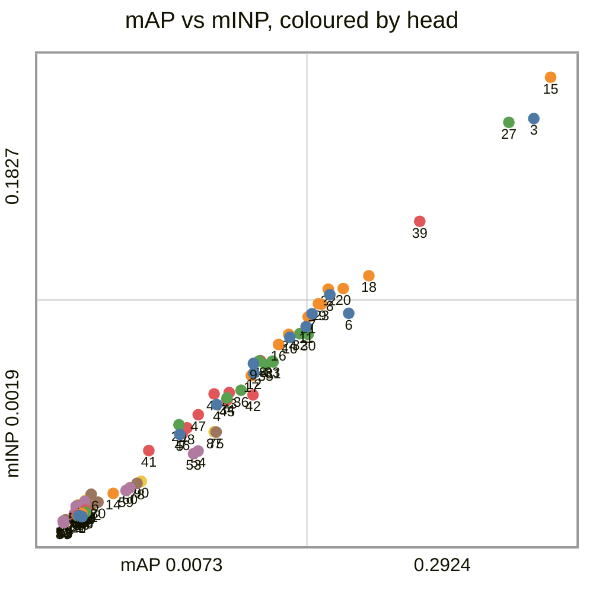
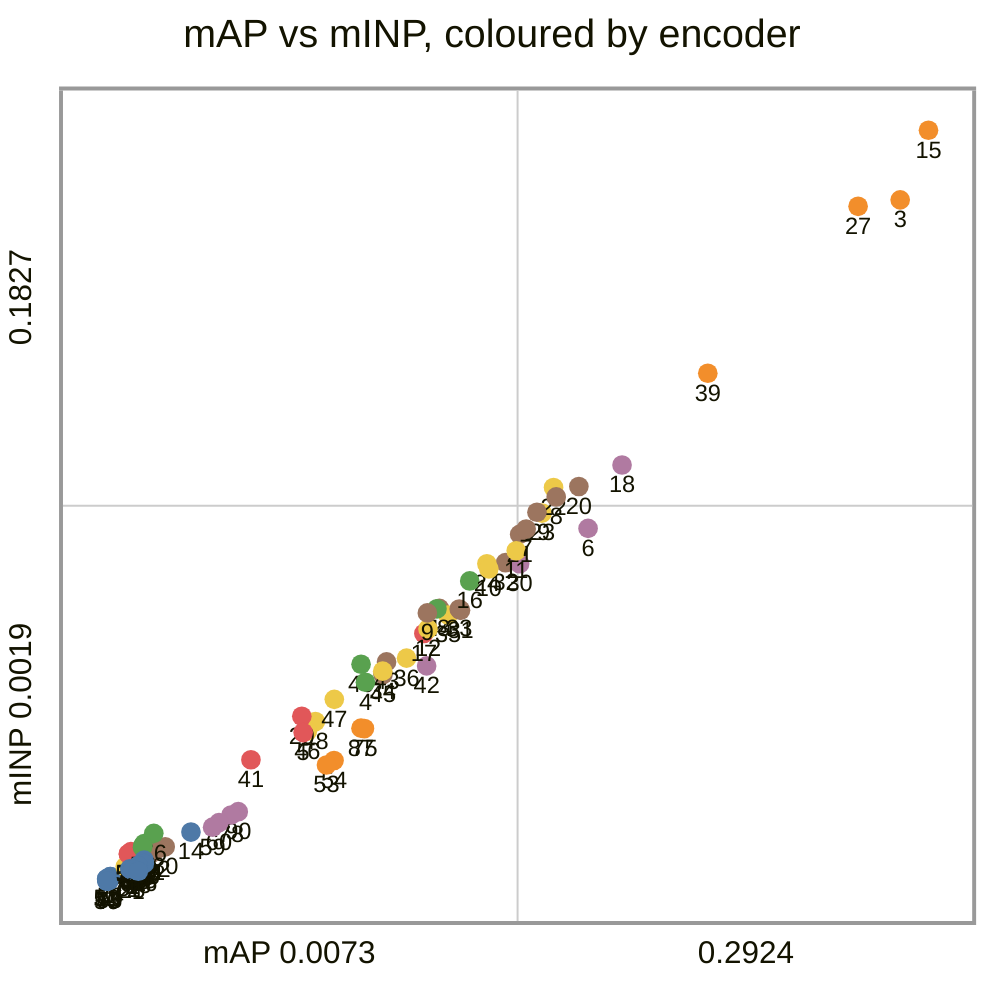
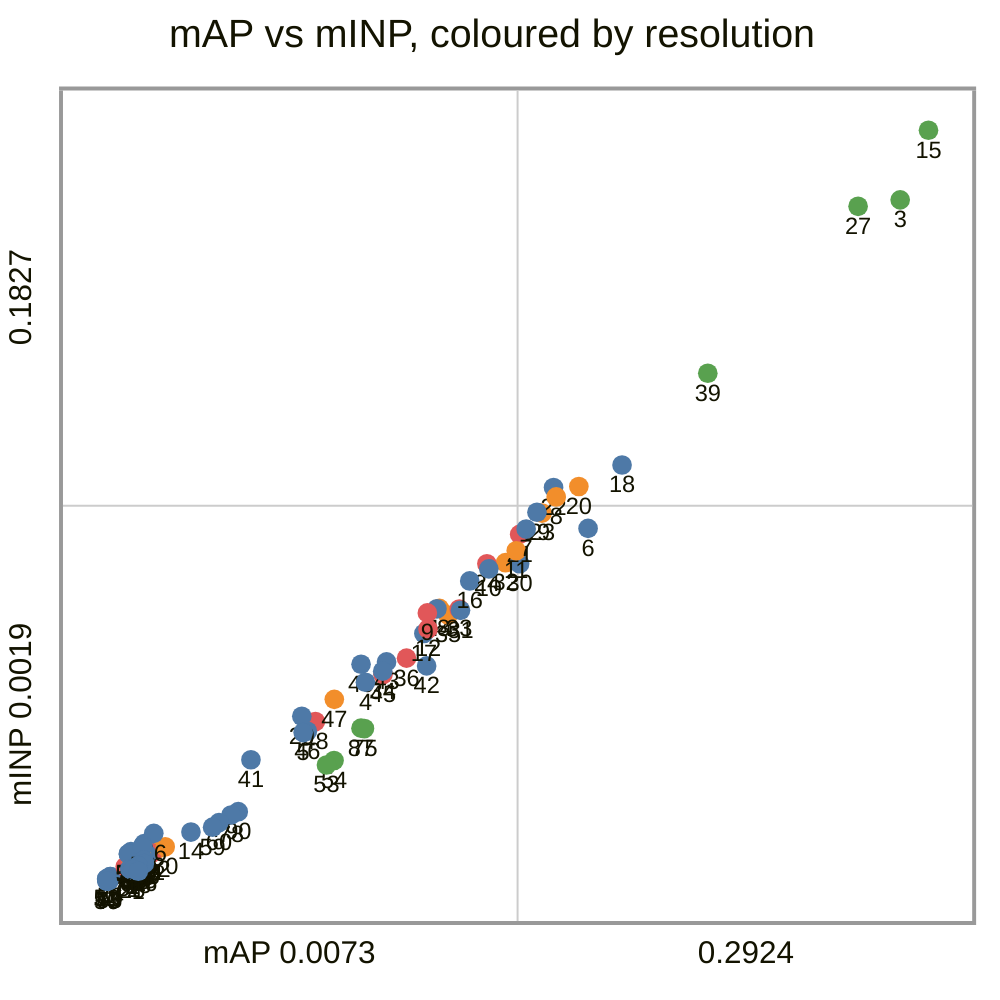

```mermaid
%%{init: {"themeVariables": {"xyChart": {"backgroundColor": "transparent", "plotColorPalette": "#4e79a7,#f28e2b,#59a14f,#e15759,#b07aa1,#9c755f,#edc948"}}, "xyChart": {"height": 1600, "width": 1320, "yAxis": {"showLabel": false}}}}%%
xychart-beta horizontal
    title "mAP, coloured by encoder"
    x-axis ["224x224 arcface vit_base_patch16_clip_224.openai crop · 1.83%", "224x224 arcface vit_base_patch16_clip_224.openai squash · 1.65%", "224x224 arcface vit_huge_plus_patch16_dinov3.lvd1689m squash · 9.71%", "224x224 arcface vit_large_patch16_dinov3.lvd1689m squash · 7.55%", "224x224 arcface vit_so400m_patch14_siglip_224.v2_webli squash · 17.43%", "224x224 arcface c-radio_v4-h squash · 15.28%", "224x224 arcface c-radio_v4-so400m squash · 13.99%", "224x224 arcface-msmt17 vit_base_patch16_clip_224.openai crop · 1.83%", "224x224 arcface-msmt17 vit_base_patch16_clip_224.openai squash · 3.66%", "224x224 arcface-msmt17 vit_huge_plus_patch16_dinov3.lvd1689m squash · 13.32%", "224x224 arcface-msmt17 vit_large_patch16_dinov3.lvd1689m squash · 11.73%", "224x224 arcface-msmt17 vit_so400m_patch14_siglip_224.v2_webli squash · 18.61%", "224x224 arcface-msmt17 c-radio_v4-h squash · 15.66%", "224x224 arcface-msmt17 c-radio_v4-so400m squash · 16.23%", "224x224 linear vit_base_patch16_clip_224.openai crop · 1.62%", "224x224 linear vit_base_patch16_clip_224.openai squash · 2.04%", "224x224 linear vit_huge_plus_patch16_dinov3.lvd1689m squash · 12.19%", "224x224 linear vit_large_patch16_dinov3.lvd1689m squash · 7.50%", "224x224 linear vit_so400m_patch14_siglip_224.v2_webli squash · 15.06%", "224x224 linear c-radio_v4-h squash · 13.01%", "224x224 linear c-radio_v4-so400m squash · 10.31%", "224x224 linear-msmt17 vit_base_patch16_clip_224.openai crop · 1.53%", "224x224 linear-msmt17 vit_base_patch16_clip_224.openai squash · 2.03%", "224x224 linear-msmt17 vit_huge_plus_patch16_dinov3.lvd1689m squash · 9.56%", "224x224 linear-msmt17 vit_large_patch16_dinov3.lvd1689m squash · 5.74%", "224x224 linear-msmt17 vit_so400m_patch14_siglip_224.v2_webli squash · 11.83%", "224x224 linear-msmt17 c-radio_v4-h squash · 10.44%", "224x224 linear-msmt17 c-radio_v4-so400m squash · 7.69%", "224x224 none vit_base_patch16_clip_224.openai crop · 0.75%", "224x224 none vit_base_patch16_clip_224.openai crop · 0.74%", "224x224 none vit_base_patch16_clip_224.openai squash · 0.73%", "224x224 none vit_base_patch16_clip_224.openai squash · 0.73%", "224x224 none vit_huge_plus_patch16_dinov3.lvd1689m squash · 1.97%", "224x224 none vit_huge_plus_patch16_dinov3.lvd1689m squash · 1.99%", "224x224 none vit_large_patch16_dinov3.lvd1689m squash · 1.49%", "224x224 none vit_large_patch16_dinov3.lvd1689m squash · 1.49%", "224x224 none vit_so400m_patch14_siglip_224.v2_webli squash · 4.41%", "224x224 none vit_so400m_patch14_siglip_224.v2_webli squash · 4.63%", "224x224 none c-radio_v4-h squash · 1.65%", "224x224 none c-radio_v4-h squash · 1.63%", "224x224 none c-radio_v4-so400m squash · 1.65%", "224x224 none c-radio_v4-so400m squash · 1.62%", "224x224 pca vit_base_patch16_clip_224.openai crop · 0.78%", "224x224 pca vit_base_patch16_clip_224.openai squash · 0.87%", "224x224 pca vit_huge_plus_patch16_dinov3.lvd1689m squash · 2.37%", "224x224 pca vit_large_patch16_dinov3.lvd1689m squash · 1.58%", "224x224 pca vit_so400m_patch14_siglip_224.v2_webli squash · 5.05%", "224x224 pca c-radio_v4-h squash · 2.13%", "224x224 pca c-radio_v4-so400m squash · 1.95%", "224x224 pca-msmt17 vit_base_patch16_clip_224.openai crop · 0.83%", "224x224 pca-msmt17 vit_base_patch16_clip_224.openai squash · 0.85%", "224x224 pca-msmt17 vit_huge_plus_patch16_dinov3.lvd1689m squash · 2.04%", "224x224 pca-msmt17 vit_large_patch16_dinov3.lvd1689m squash · 1.57%", "224x224 pca-msmt17 vit_so400m_patch14_siglip_224.v2_webli squash · 5.30%", "224x224 pca-msmt17 c-radio_v4-h squash · 2.04%", "224x224 pca-msmt17 c-radio_v4-so400m squash · 1.91%", "256x128 arcface c-radio_v4-h squash · 16.32%", "256x128 arcface c-radio_v4-so400m squash · 14.94%", "256x128 arcface-msmt17 c-radio_v4-h squash · 17.11%", "256x128 arcface-msmt17 c-radio_v4-so400m squash · 15.83%", "256x128 linear c-radio_v4-h squash · 14.57%", "256x128 linear c-radio_v4-so400m squash · 12.57%", "256x128 linear-msmt17 c-radio_v4-h squash · 12.27%", "256x128 linear-msmt17 c-radio_v4-so400m squash · 8.63%", "256x128 none c-radio_v4-h squash · 1.94%", "256x128 none c-radio_v4-h squash · 1.90%", "256x128 none c-radio_v4-so400m squash · 1.62%", "256x128 none c-radio_v4-so400m squash · 1.59%", "256x128 pca c-radio_v4-h squash · 2.76%", "256x128 pca c-radio_v4-so400m squash · 2.13%", "256x128 pca-msmt17 c-radio_v4-h squash · 2.50%", "256x128 pca-msmt17 c-radio_v4-so400m squash · 1.95%", "256x256 arcface vit_giantopt_patch16_siglip_256.v2_webli squash · 28.26%", "256x256 arcface-msmt17 vit_giantopt_patch16_siglip_256.v2_webli squash · 29.24%", "256x256 linear vit_giantopt_patch16_siglip_256.v2_webli squash · 26.79%", "256x256 linear-msmt17 vit_giantopt_patch16_siglip_256.v2_webli squash · 21.58%", "256x256 none vit_giantopt_patch16_siglip_256.v2_webli squash · 8.36%", "256x256 none vit_giantopt_patch16_siglip_256.v2_webli squash · 8.62%", "256x256 pca vit_giantopt_patch16_siglip_256.v2_webli squash · 9.67%", "256x256 pca-msmt17 vit_giantopt_patch16_siglip_256.v2_webli squash · 9.55%", "native arcface c-radio_v4-h squash · 11.86%", "native arcface c-radio_v4-so400m squash · 11.88%", "native arcface-msmt17 c-radio_v4-h squash · 15.06%", "native arcface-msmt17 c-radio_v4-so400m squash · 13.92%", "native linear c-radio_v4-h squash · 12.96%", "native linear c-radio_v4-so400m squash · 11.13%", "native linear-msmt17 c-radio_v4-h squash · 10.32%", "native linear-msmt17 c-radio_v4-so400m squash · 7.97%", "native none c-radio_v4-h squash · 1.71%", "native none c-radio_v4-h squash · 1.66%", "native none c-radio_v4-so400m squash · 1.42%", "native none c-radio_v4-so400m squash · 1.38%", "native pca c-radio_v4-h squash · 2.31%", "native pca c-radio_v4-so400m squash · 1.88%", "native pca-msmt17 c-radio_v4-h squash · 2.12%", "native pca-msmt17 c-radio_v4-so400m squash · 1.79%"]
    y-axis "mAP (%)" 0 --> 30.70
    bar [1.83, 1.65, 0.00, 0.00, 0.00, 0.00, 0.00, 1.83, 3.66, 0.00, 0.00, 0.00, 0.00, 0.00, 1.62, 2.04, 0.00, 0.00, 0.00, 0.00, 0.00, 1.53, 2.03, 0.00, 0.00, 0.00, 0.00, 0.00, 0.75, 0.74, 0.73, 0.73, 0.00, 0.00, 0.00, 0.00, 0.00, 0.00, 0.00, 0.00, 0.00, 0.00, 0.78, 0.87, 0.00, 0.00, 0.00, 0.00, 0.00, 0.83, 0.85, 0.00, 0.00, 0.00, 0.00, 0.00, 0.00, 0.00, 0.00, 0.00, 0.00, 0.00, 0.00, 0.00, 0.00, 0.00, 0.00, 0.00, 0.00, 0.00, 0.00, 0.00, 0.00, 0.00, 0.00, 0.00, 0.00, 0.00, 0.00, 0.00, 0.00, 0.00, 0.00, 0.00, 0.00, 0.00, 0.00, 0.00, 0.00, 0.00, 0.00, 0.00, 0.00, 0.00, 0.00, 0.00]
    bar [0.00, 0.00, 0.00, 0.00, 0.00, 0.00, 0.00, 0.00, 0.00, 0.00, 0.00, 0.00, 0.00, 0.00, 0.00, 0.00, 0.00, 0.00, 0.00, 0.00, 0.00, 0.00, 0.00, 0.00, 0.00, 0.00, 0.00, 0.00, 0.00, 0.00, 0.00, 0.00, 0.00, 0.00, 0.00, 0.00, 0.00, 0.00, 0.00, 0.00, 0.00, 0.00, 0.00, 0.00, 0.00, 0.00, 0.00, 0.00, 0.00, 0.00, 0.00, 0.00, 0.00, 0.00, 0.00, 0.00, 0.00, 0.00, 0.00, 0.00, 0.00, 0.00, 0.00, 0.00, 0.00, 0.00, 0.00, 0.00, 0.00, 0.00, 0.00, 0.00, 28.26, 29.24, 26.79, 21.58, 8.36, 8.62, 9.67, 9.55, 0.00, 0.00, 0.00, 0.00, 0.00, 0.00, 0.00, 0.00, 0.00, 0.00, 0.00, 0.00, 0.00, 0.00, 0.00, 0.00]
    bar [0.00, 0.00, 9.71, 0.00, 0.00, 0.00, 0.00, 0.00, 0.00, 13.32, 0.00, 0.00, 0.00, 0.00, 0.00, 0.00, 12.19, 0.00, 0.00, 0.00, 0.00, 0.00, 0.00, 9.56, 0.00, 0.00, 0.00, 0.00, 0.00, 0.00, 0.00, 0.00, 1.97, 1.99, 0.00, 0.00, 0.00, 0.00, 0.00, 0.00, 0.00, 0.00, 0.00, 0.00, 2.37, 0.00, 0.00, 0.00, 0.00, 0.00, 0.00, 2.04, 0.00, 0.00, 0.00, 0.00, 0.00, 0.00, 0.00, 0.00, 0.00, 0.00, 0.00, 0.00, 0.00, 0.00, 0.00, 0.00, 0.00, 0.00, 0.00, 0.00, 0.00, 0.00, 0.00, 0.00, 0.00, 0.00, 0.00, 0.00, 0.00, 0.00, 0.00, 0.00, 0.00, 0.00, 0.00, 0.00, 0.00, 0.00, 0.00, 0.00, 0.00, 0.00, 0.00, 0.00]
    bar [0.00, 0.00, 0.00, 7.55, 0.00, 0.00, 0.00, 0.00, 0.00, 0.00, 11.73, 0.00, 0.00, 0.00, 0.00, 0.00, 0.00, 7.50, 0.00, 0.00, 0.00, 0.00, 0.00, 0.00, 5.74, 0.00, 0.00, 0.00, 0.00, 0.00, 0.00, 0.00, 0.00, 0.00, 1.49, 1.49, 0.00, 0.00, 0.00, 0.00, 0.00, 0.00, 0.00, 0.00, 0.00, 1.58, 0.00, 0.00, 0.00, 0.00, 0.00, 0.00, 1.57, 0.00, 0.00, 0.00, 0.00, 0.00, 0.00, 0.00, 0.00, 0.00, 0.00, 0.00, 0.00, 0.00, 0.00, 0.00, 0.00, 0.00, 0.00, 0.00, 0.00, 0.00, 0.00, 0.00, 0.00, 0.00, 0.00, 0.00, 0.00, 0.00, 0.00, 0.00, 0.00, 0.00, 0.00, 0.00, 0.00, 0.00, 0.00, 0.00, 0.00, 0.00, 0.00, 0.00]
    bar [0.00, 0.00, 0.00, 0.00, 17.43, 0.00, 0.00, 0.00, 0.00, 0.00, 0.00, 18.61, 0.00, 0.00, 0.00, 0.00, 0.00, 0.00, 15.06, 0.00, 0.00, 0.00, 0.00, 0.00, 0.00, 11.83, 0.00, 0.00, 0.00, 0.00, 0.00, 0.00, 0.00, 0.00, 0.00, 0.00, 4.41, 4.63, 0.00, 0.00, 0.00, 0.00, 0.00, 0.00, 0.00, 0.00, 5.05, 0.00, 0.00, 0.00, 0.00, 0.00, 0.00, 5.30, 0.00, 0.00, 0.00, 0.00, 0.00, 0.00, 0.00, 0.00, 0.00, 0.00, 0.00, 0.00, 0.00, 0.00, 0.00, 0.00, 0.00, 0.00, 0.00, 0.00, 0.00, 0.00, 0.00, 0.00, 0.00, 0.00, 0.00, 0.00, 0.00, 0.00, 0.00, 0.00, 0.00, 0.00, 0.00, 0.00, 0.00, 0.00, 0.00, 0.00, 0.00, 0.00]
    bar [0.00, 0.00, 0.00, 0.00, 0.00, 15.28, 0.00, 0.00, 0.00, 0.00, 0.00, 0.00, 15.66, 0.00, 0.00, 0.00, 0.00, 0.00, 0.00, 13.01, 0.00, 0.00, 0.00, 0.00, 0.00, 0.00, 10.44, 0.00, 0.00, 0.00, 0.00, 0.00, 0.00, 0.00, 0.00, 0.00, 0.00, 0.00, 1.65, 1.63, 0.00, 0.00, 0.00, 0.00, 0.00, 0.00, 0.00, 2.13, 0.00, 0.00, 0.00, 0.00, 0.00, 0.00, 2.04, 0.00, 16.32, 0.00, 17.11, 0.00, 14.57, 0.00, 12.27, 0.00, 1.94, 1.90, 0.00, 0.00, 2.76, 0.00, 2.50, 0.00, 0.00, 0.00, 0.00, 0.00, 0.00, 0.00, 0.00, 0.00, 11.86, 0.00, 15.06, 0.00, 12.96, 0.00, 10.32, 0.00, 1.71, 1.66, 0.00, 0.00, 2.31, 0.00, 2.12, 0.00]
    bar [0.00, 0.00, 0.00, 0.00, 0.00, 0.00, 13.99, 0.00, 0.00, 0.00, 0.00, 0.00, 0.00, 16.23, 0.00, 0.00, 0.00, 0.00, 0.00, 0.00, 10.31, 0.00, 0.00, 0.00, 0.00, 0.00, 0.00, 7.69, 0.00, 0.00, 0.00, 0.00, 0.00, 0.00, 0.00, 0.00, 0.00, 0.00, 0.00, 0.00, 1.65, 1.62, 0.00, 0.00, 0.00, 0.00, 0.00, 0.00, 1.95, 0.00, 0.00, 0.00, 0.00, 0.00, 0.00, 1.91, 0.00, 14.94, 0.00, 15.83, 0.00, 12.57, 0.00, 8.63, 0.00, 0.00, 1.62, 1.59, 0.00, 2.13, 0.00, 1.95, 0.00, 0.00, 0.00, 0.00, 0.00, 0.00, 0.00, 0.00, 0.00, 11.88, 0.00, 13.92, 0.00, 11.13, 0.00, 7.97, 0.00, 0.00, 1.42, 1.38, 0.00, 1.88, 0.00, 1.79]
```

<!-- generated by `reidbench render`; edit the runs, not this file -->

# cuhk03-np

[← table.md](../table.md)

## cuhk03/detected-767@1

### 🟦 arcface

|  # | encoder                                       | resolution | resize |        mAP |         R1 |         R5 |        R10 |       mINP |
|---:|-----------------------------------------------|------------|--------|-----------:|-----------:|-----------:|-----------:|-----------:|
|  1 | timm:vit_base_patch16_clip_224.openai         | 224x224    | crop   |     0.0183 |     0.0193 |     0.0493 |     0.0700 |     0.0043 |
|  2 | timm:vit_base_patch16_clip_224.openai         | 224x224    | squash |     0.0165 |     0.0157 |     0.0414 |     0.0621 |     0.0047 |
|  3 | timm:vit_giantopt_patch16_siglip_256.v2_webli | 256x256    | squash | **0.2826** | **0.3129** | **0.5043** | **0.5843** | **0.1660** |
|  4 | timm:vit_huge_plus_patch16_dinov3.lvd1689m    | 224x224    | squash |     0.0971 |     0.0850 |     0.1950 |     0.2671 |     0.0498 |
|  5 | timm:vit_large_patch16_dinov3.lvd1689m        | 224x224    | squash |     0.0755 |     0.0771 |     0.1464 |     0.1986 |     0.0377 |
|  6 | timm:vit_so400m_patch14_siglip_224.v2_webli   | 224x224    | squash |     0.1743 |     0.2000 |     0.3557 |     0.4550 |     0.0869 |
|  7 | torchhub:NVlabs/RADIO/c-radio_v4-h            | 224x224    | squash |     0.1528 |     0.1507 |     0.3021 |     0.3879 |     0.0867 |
|  8 | torchhub:NVlabs/RADIO/c-radio_v4-h            | 256x128    | squash |     0.1632 |     0.1579 |     0.3214 |     0.4107 |     0.0945 |
|  9 | torchhub:NVlabs/RADIO/c-radio_v4-h            | native     | squash |     0.1186 |     0.1079 |     0.2457 |     0.3250 |     0.0665 |
| 10 | torchhub:NVlabs/RADIO/c-radio_v4-so400m       | 224x224    | squash |     0.1399 |     0.1350 |     0.2664 |     0.3557 |     0.0771 |
| 11 | torchhub:NVlabs/RADIO/c-radio_v4-so400m       | 256x128    | squash |     0.1494 |     0.1500 |     0.3029 |     0.3936 |     0.0815 |
| 12 | torchhub:NVlabs/RADIO/c-radio_v4-so400m       | native     | squash |     0.1188 |     0.1164 |     0.2329 |     0.2957 |     0.0626 |

### 🟧 arcface-msmt17

|  # | encoder                                       | resolution | resize |        mAP |         R1 |         R5 |        R10 |       mINP |
|---:|-----------------------------------------------|------------|--------|-----------:|-----------:|-----------:|-----------:|-----------:|
| 13 | timm:vit_base_patch16_clip_224.openai         | 224x224    | crop   |     0.0183 |     0.0157 |     0.0500 |     0.0786 |     0.0056 |
| 14 | timm:vit_base_patch16_clip_224.openai         | 224x224    | squash |     0.0366 |     0.0343 |     0.0921 |     0.1293 |     0.0137 |
| 15 | timm:vit_giantopt_patch16_siglip_256.v2_webli | 256x256    | squash | **0.2924** | **0.3086** | **0.5007** | **0.6000** | **0.1827** |
| 16 | timm:vit_huge_plus_patch16_dinov3.lvd1689m    | 224x224    | squash |     0.1332 |     0.1264 |     0.2564 |     0.3386 |     0.0742 |
| 17 | timm:vit_large_patch16_dinov3.lvd1689m        | 224x224    | squash |     0.1173 |     0.1114 |     0.2336 |     0.3229 |     0.0615 |
| 18 | timm:vit_so400m_patch14_siglip_224.v2_webli   | 224x224    | squash |     0.1861 |     0.1936 |     0.3629 |     0.4600 |     0.1021 |
| 19 | torchhub:NVlabs/RADIO/c-radio_v4-h            | 224x224    | squash |     0.1566 |     0.1471 |     0.2900 |     0.3900 |     0.0907 |
| 20 | torchhub:NVlabs/RADIO/c-radio_v4-h            | 256x128    | squash |     0.1711 |     0.1729 |     0.3171 |     0.4136 |     0.0970 |
| 21 | torchhub:NVlabs/RADIO/c-radio_v4-h            | native     | squash |     0.1506 |     0.1493 |     0.2929 |     0.3793 |     0.0854 |
| 22 | torchhub:NVlabs/RADIO/c-radio_v4-so400m       | 224x224    | squash |     0.1623 |     0.1536 |     0.3107 |     0.3993 |     0.0967 |
| 23 | torchhub:NVlabs/RADIO/c-radio_v4-so400m       | 256x128    | squash |     0.1583 |     0.1579 |     0.3000 |     0.3843 |     0.0906 |
| 24 | torchhub:NVlabs/RADIO/c-radio_v4-so400m       | native     | squash |     0.1392 |     0.1257 |     0.2821 |     0.3771 |     0.0784 |

### 🟩 linear

|  # | encoder                                       | resolution | resize |        mAP |         R1 |         R5 |        R10 |       mINP |
|---:|-----------------------------------------------|------------|--------|-----------:|-----------:|-----------:|-----------:|-----------:|
| 25 | timm:vit_base_patch16_clip_224.openai         | 224x224    | crop   |     0.0162 |     0.0150 |     0.0486 |     0.0771 |     0.0045 |
| 26 | timm:vit_base_patch16_clip_224.openai         | 224x224    | squash |     0.0204 |     0.0193 |     0.0543 |     0.0800 |     0.0061 |
| 27 | timm:vit_giantopt_patch16_siglip_256.v2_webli | 256x256    | squash | **0.2679** | **0.2814** | **0.4700** | **0.5807** | **0.1644** |
| 28 | timm:vit_huge_plus_patch16_dinov3.lvd1689m    | 224x224    | squash |     0.1219 |     0.1071 |     0.2521 |     0.3279 |     0.0675 |
| 29 | timm:vit_large_patch16_dinov3.lvd1689m        | 224x224    | squash |     0.0750 |     0.0636 |     0.1479 |     0.2129 |     0.0416 |
| 30 | timm:vit_so400m_patch14_siglip_224.v2_webli   | 224x224    | squash |     0.1506 |     0.1593 |     0.3029 |     0.4043 |     0.0784 |
| 31 | torchhub:NVlabs/RADIO/c-radio_v4-h            | 224x224    | squash |     0.1301 |     0.1293 |     0.2707 |     0.3600 |     0.0671 |
| 32 | torchhub:NVlabs/RADIO/c-radio_v4-h            | 256x128    | squash |     0.1457 |     0.1450 |     0.3029 |     0.3671 |     0.0786 |
| 33 | torchhub:NVlabs/RADIO/c-radio_v4-h            | native     | squash |     0.1296 |     0.1364 |     0.2529 |     0.3471 |     0.0675 |
| 34 | torchhub:NVlabs/RADIO/c-radio_v4-so400m       | 224x224    | squash |     0.1031 |     0.0979 |     0.2171 |     0.2907 |     0.0525 |
| 35 | torchhub:NVlabs/RADIO/c-radio_v4-so400m       | 256x128    | squash |     0.1257 |     0.1236 |     0.2557 |     0.3329 |     0.0660 |
| 36 | torchhub:NVlabs/RADIO/c-radio_v4-so400m       | native     | squash |     0.1113 |     0.1129 |     0.2257 |     0.2993 |     0.0556 |

### 🟥 linear-msmt17

|  # | encoder                                       | resolution | resize |        mAP |         R1 |         R5 |        R10 |       mINP |
|---:|-----------------------------------------------|------------|--------|-----------:|-----------:|-----------:|-----------:|-----------:|
| 37 | timm:vit_base_patch16_clip_224.openai         | 224x224    | crop   |     0.0153 |     0.0114 |     0.0379 |     0.0657 |     0.0049 |
| 38 | timm:vit_base_patch16_clip_224.openai         | 224x224    | squash |     0.0203 |     0.0200 |     0.0464 |     0.0757 |     0.0070 |
| 39 | timm:vit_giantopt_patch16_siglip_256.v2_webli | 256x256    | squash | **0.2158** | **0.2250** | **0.4121** | **0.5050** | **0.1242** |
| 40 | timm:vit_huge_plus_patch16_dinov3.lvd1689m    | 224x224    | squash |     0.0956 |     0.0800 |     0.1843 |     0.2543 |     0.0541 |
| 41 | timm:vit_large_patch16_dinov3.lvd1689m        | 224x224    | squash |     0.0574 |     0.0436 |     0.1157 |     0.1664 |     0.0311 |
| 42 | timm:vit_so400m_patch14_siglip_224.v2_webli   | 224x224    | squash |     0.1183 |     0.1200 |     0.2571 |     0.3429 |     0.0537 |
| 43 | torchhub:NVlabs/RADIO/c-radio_v4-h            | 224x224    | squash |     0.1044 |     0.0964 |     0.2214 |     0.2900 |     0.0547 |
| 44 | torchhub:NVlabs/RADIO/c-radio_v4-h            | 256x128    | squash |     0.1227 |     0.1143 |     0.2521 |     0.3271 |     0.0676 |
| 45 | torchhub:NVlabs/RADIO/c-radio_v4-h            | native     | squash |     0.1032 |     0.0993 |     0.2150 |     0.2979 |     0.0517 |
| 46 | torchhub:NVlabs/RADIO/c-radio_v4-so400m       | 224x224    | squash |     0.0769 |     0.0743 |     0.1564 |     0.2157 |     0.0380 |
| 47 | torchhub:NVlabs/RADIO/c-radio_v4-so400m       | 256x128    | squash |     0.0863 |     0.0807 |     0.1757 |     0.2421 |     0.0457 |
| 48 | torchhub:NVlabs/RADIO/c-radio_v4-so400m       | native     | squash |     0.0797 |     0.0750 |     0.1679 |     0.2236 |     0.0403 |

### 🟪 none

|  # | encoder                                       | resolution | resize |        mAP |         R1 |         R5 |        R10 |       mINP |
|---:|-----------------------------------------------|------------|--------|-----------:|-----------:|-----------:|-----------:|-----------:|
| 49 | timm:vit_base_patch16_clip_224.openai         | 224x224    | crop   |     0.0075 |     0.0064 |     0.0200 |     0.0321 |     0.0019 |
| 50 | timm:vit_base_patch16_clip_224.openai         | 224x224    | crop   |     0.0074 |     0.0064 |     0.0186 |     0.0336 |     0.0019 |
| 51 | timm:vit_base_patch16_clip_224.openai         | 224x224    | squash |     0.0073 |     0.0064 |     0.0143 |     0.0271 |     0.0024 |
| 52 | timm:vit_base_patch16_clip_224.openai         | 224x224    | squash |     0.0073 |     0.0064 |     0.0150 |     0.0264 |     0.0025 |
| 53 | timm:vit_giantopt_patch16_siglip_256.v2_webli | 256x256    | squash |     0.0836 |     0.0929 |     0.1964 |     0.2643 |     0.0299 |
| 54 | timm:vit_giantopt_patch16_siglip_256.v2_webli | 256x256    | squash | **0.0862** | **0.0964** | **0.2007** | **0.2679** | **0.0310** |
| 55 | timm:vit_huge_plus_patch16_dinov3.lvd1689m    | 224x224    | squash |     0.0197 |     0.0129 |     0.0371 |     0.0543 |     0.0101 |
| 56 | timm:vit_huge_plus_patch16_dinov3.lvd1689m    | 224x224    | squash |     0.0199 |     0.0136 |     0.0336 |     0.0543 |     0.0105 |
| 57 | timm:vit_large_patch16_dinov3.lvd1689m        | 224x224    | squash |     0.0149 |     0.0136 |     0.0250 |     0.0343 |     0.0084 |
| 58 | timm:vit_large_patch16_dinov3.lvd1689m        | 224x224    | squash |     0.0149 |     0.0129 |     0.0243 |     0.0336 |     0.0085 |
| 59 | timm:vit_so400m_patch14_siglip_224.v2_webli   | 224x224    | squash |     0.0441 |     0.0479 |     0.1129 |     0.1579 |     0.0149 |
| 60 | timm:vit_so400m_patch14_siglip_224.v2_webli   | 224x224    | squash |     0.0463 |     0.0550 |     0.1136 |     0.1600 |     0.0160 |
| 61 | torchhub:NVlabs/RADIO/c-radio_v4-h            | 224x224    | squash |     0.0165 |     0.0107 |     0.0343 |     0.0543 |     0.0062 |
| 62 | torchhub:NVlabs/RADIO/c-radio_v4-h            | 224x224    | squash |     0.0163 |     0.0107 |     0.0343 |     0.0543 |     0.0062 |
| 63 | torchhub:NVlabs/RADIO/c-radio_v4-h            | 256x128    | squash |     0.0194 |     0.0114 |     0.0421 |     0.0586 |     0.0083 |
| 64 | torchhub:NVlabs/RADIO/c-radio_v4-h            | 256x128    | squash |     0.0190 |     0.0114 |     0.0393 |     0.0529 |     0.0086 |
| 65 | torchhub:NVlabs/RADIO/c-radio_v4-h            | native     | squash |     0.0171 |     0.0136 |     0.0329 |     0.0486 |     0.0068 |
| 66 | torchhub:NVlabs/RADIO/c-radio_v4-h            | native     | squash |     0.0166 |     0.0121 |     0.0314 |     0.0486 |     0.0067 |
| 67 | torchhub:NVlabs/RADIO/c-radio_v4-so400m       | 224x224    | squash |     0.0165 |     0.0136 |     0.0293 |     0.0471 |     0.0069 |
| 68 | torchhub:NVlabs/RADIO/c-radio_v4-so400m       | 224x224    | squash |     0.0162 |     0.0136 |     0.0293 |     0.0493 |     0.0071 |
| 69 | torchhub:NVlabs/RADIO/c-radio_v4-so400m       | 256x128    | squash |     0.0162 |     0.0121 |     0.0336 |     0.0514 |     0.0065 |
| 70 | torchhub:NVlabs/RADIO/c-radio_v4-so400m       | 256x128    | squash |     0.0159 |     0.0100 |     0.0343 |     0.0507 |     0.0068 |
| 71 | torchhub:NVlabs/RADIO/c-radio_v4-so400m       | native     | squash |     0.0142 |     0.0114 |     0.0329 |     0.0450 |     0.0055 |
| 72 | torchhub:NVlabs/RADIO/c-radio_v4-so400m       | native     | squash |     0.0138 |     0.0114 |     0.0314 |     0.0436 |     0.0054 |

### 🟫 pca

|  # | encoder                                       | resolution | resize |        mAP |         R1 |         R5 |        R10 |       mINP |
|---:|-----------------------------------------------|------------|--------|-----------:|-----------:|-----------:|-----------:|-----------:|
| 73 | timm:vit_base_patch16_clip_224.openai         | 224x224    | crop   |     0.0078 |     0.0050 |     0.0243 |     0.0379 |     0.0020 |
| 74 | timm:vit_base_patch16_clip_224.openai         | 224x224    | squash |     0.0087 |     0.0079 |     0.0200 |     0.0286 |     0.0030 |
| 75 | timm:vit_giantopt_patch16_siglip_256.v2_webli | 256x256    | squash | **0.0967** | **0.1136** | **0.2143** | **0.2729** | **0.0387** |
| 76 | timm:vit_huge_plus_patch16_dinov3.lvd1689m    | 224x224    | squash |     0.0237 |     0.0179 |     0.0393 |     0.0586 |     0.0134 |
| 77 | timm:vit_large_patch16_dinov3.lvd1689m        | 224x224    | squash |     0.0158 |     0.0136 |     0.0279 |     0.0414 |     0.0088 |
| 78 | timm:vit_so400m_patch14_siglip_224.v2_webli   | 224x224    | squash |     0.0505 |     0.0557 |     0.1257 |     0.1729 |     0.0178 |
| 79 | torchhub:NVlabs/RADIO/c-radio_v4-h            | 224x224    | squash |     0.0213 |     0.0150 |     0.0529 |     0.0729 |     0.0084 |
| 80 | torchhub:NVlabs/RADIO/c-radio_v4-h            | 256x128    | squash |     0.0276 |     0.0243 |     0.0536 |     0.0829 |     0.0102 |
| 81 | torchhub:NVlabs/RADIO/c-radio_v4-h            | native     | squash |     0.0231 |     0.0193 |     0.0464 |     0.0700 |     0.0087 |
| 82 | torchhub:NVlabs/RADIO/c-radio_v4-so400m       | 224x224    | squash |     0.0195 |     0.0179 |     0.0429 |     0.0543 |     0.0080 |
| 83 | torchhub:NVlabs/RADIO/c-radio_v4-so400m       | 256x128    | squash |     0.0213 |     0.0164 |     0.0471 |     0.0621 |     0.0087 |
| 84 | torchhub:NVlabs/RADIO/c-radio_v4-so400m       | native     | squash |     0.0188 |     0.0171 |     0.0421 |     0.0579 |     0.0073 |

### 🟨 pca-msmt17

|  # | encoder                                       | resolution | resize |        mAP |         R1 |         R5 |        R10 |       mINP |
|---:|-----------------------------------------------|------------|--------|-----------:|-----------:|-----------:|-----------:|-----------:|
| 85 | timm:vit_base_patch16_clip_224.openai         | 224x224    | crop   |     0.0083 |     0.0086 |     0.0207 |     0.0343 |     0.0020 |
| 86 | timm:vit_base_patch16_clip_224.openai         | 224x224    | squash |     0.0085 |     0.0079 |     0.0179 |     0.0279 |     0.0030 |
| 87 | timm:vit_giantopt_patch16_siglip_256.v2_webli | 256x256    | squash | **0.0955** | **0.1057** | **0.2257** | **0.2800** | **0.0388** |
| 88 | timm:vit_huge_plus_patch16_dinov3.lvd1689m    | 224x224    | squash |     0.0204 |     0.0136 |     0.0350 |     0.0557 |     0.0110 |
| 89 | timm:vit_large_patch16_dinov3.lvd1689m        | 224x224    | squash |     0.0157 |     0.0136 |     0.0271 |     0.0379 |     0.0090 |
| 90 | timm:vit_so400m_patch14_siglip_224.v2_webli   | 224x224    | squash |     0.0530 |     0.0650 |     0.1243 |     0.1779 |     0.0186 |
| 91 | torchhub:NVlabs/RADIO/c-radio_v4-h            | 224x224    | squash |     0.0204 |     0.0157 |     0.0450 |     0.0621 |     0.0078 |
| 92 | torchhub:NVlabs/RADIO/c-radio_v4-h            | 256x128    | squash |     0.0250 |     0.0186 |     0.0529 |     0.0771 |     0.0096 |
| 93 | torchhub:NVlabs/RADIO/c-radio_v4-h            | native     | squash |     0.0212 |     0.0171 |     0.0436 |     0.0643 |     0.0078 |
| 94 | torchhub:NVlabs/RADIO/c-radio_v4-so400m       | 224x224    | squash |     0.0191 |     0.0164 |     0.0371 |     0.0571 |     0.0080 |
| 95 | torchhub:NVlabs/RADIO/c-radio_v4-so400m       | 256x128    | squash |     0.0195 |     0.0150 |     0.0400 |     0.0586 |     0.0076 |
| 96 | torchhub:NVlabs/RADIO/c-radio_v4-so400m       | native     | squash |     0.0179 |     0.0186 |     0.0371 |     0.0543 |     0.0065 |

### Every row, by encoder and resolution

```mermaid
%%{init: {"themeVariables": {"xyChart": {"backgroundColor": "transparent", "plotColorPalette": "#4e79a7,#f28e2b,#59a14f,#e15759,#b07aa1,#9c755f,#edc948"}}, "xyChart": {"height": 1600, "width": 1320, "yAxis": {"showLabel": false}}}}%%
xychart-beta horizontal
    title "mAP, coloured by head"
    x-axis ["vit_base_patch16_clip_224.openai 224x224 arcface crop · 1.83%", "vit_base_patch16_clip_224.openai 224x224 arcface squash · 1.65%", "vit_base_patch16_clip_224.openai 224x224 arcface-msmt17 crop · 1.83%", "vit_base_patch16_clip_224.openai 224x224 arcface-msmt17 squash · 3.66%", "vit_base_patch16_clip_224.openai 224x224 linear crop · 1.62%", "vit_base_patch16_clip_224.openai 224x224 linear squash · 2.04%", "vit_base_patch16_clip_224.openai 224x224 linear-msmt17 crop · 1.53%", "vit_base_patch16_clip_224.openai 224x224 linear-msmt17 squash · 2.03%", "vit_base_patch16_clip_224.openai 224x224 none crop · 0.75%", "vit_base_patch16_clip_224.openai 224x224 none crop · 0.74%", "vit_base_patch16_clip_224.openai 224x224 none squash · 0.73%", "vit_base_patch16_clip_224.openai 224x224 none squash · 0.73%", "vit_base_patch16_clip_224.openai 224x224 pca crop · 0.78%", "vit_base_patch16_clip_224.openai 224x224 pca squash · 0.87%", "vit_base_patch16_clip_224.openai 224x224 pca-msmt17 crop · 0.83%", "vit_base_patch16_clip_224.openai 224x224 pca-msmt17 squash · 0.85%", "vit_giantopt_patch16_siglip_256.v2_webli 256x256 arcface squash · 28.26%", "vit_giantopt_patch16_siglip_256.v2_webli 256x256 arcface-msmt17 squash · 29.24%", "vit_giantopt_patch16_siglip_256.v2_webli 256x256 linear squash · 26.79%", "vit_giantopt_patch16_siglip_256.v2_webli 256x256 linear-msmt17 squash · 21.58%", "vit_giantopt_patch16_siglip_256.v2_webli 256x256 none squash · 8.36%", "vit_giantopt_patch16_siglip_256.v2_webli 256x256 none squash · 8.62%", "vit_giantopt_patch16_siglip_256.v2_webli 256x256 pca squash · 9.67%", "vit_giantopt_patch16_siglip_256.v2_webli 256x256 pca-msmt17 squash · 9.55%", "vit_huge_plus_patch16_dinov3.lvd1689m 224x224 arcface squash · 9.71%", "vit_huge_plus_patch16_dinov3.lvd1689m 224x224 arcface-msmt17 squash · 13.32%", "vit_huge_plus_patch16_dinov3.lvd1689m 224x224 linear squash · 12.19%", "vit_huge_plus_patch16_dinov3.lvd1689m 224x224 linear-msmt17 squash · 9.56%", "vit_huge_plus_patch16_dinov3.lvd1689m 224x224 none squash · 1.97%", "vit_huge_plus_patch16_dinov3.lvd1689m 224x224 none squash · 1.99%", "vit_huge_plus_patch16_dinov3.lvd1689m 224x224 pca squash · 2.37%", "vit_huge_plus_patch16_dinov3.lvd1689m 224x224 pca-msmt17 squash · 2.04%", "vit_large_patch16_dinov3.lvd1689m 224x224 arcface squash · 7.55%", "vit_large_patch16_dinov3.lvd1689m 224x224 arcface-msmt17 squash · 11.73%", "vit_large_patch16_dinov3.lvd1689m 224x224 linear squash · 7.50%", "vit_large_patch16_dinov3.lvd1689m 224x224 linear-msmt17 squash · 5.74%", "vit_large_patch16_dinov3.lvd1689m 224x224 none squash · 1.49%", "vit_large_patch16_dinov3.lvd1689m 224x224 none squash · 1.49%", "vit_large_patch16_dinov3.lvd1689m 224x224 pca squash · 1.58%", "vit_large_patch16_dinov3.lvd1689m 224x224 pca-msmt17 squash · 1.57%", "vit_so400m_patch14_siglip_224.v2_webli 224x224 arcface squash · 17.43%", "vit_so400m_patch14_siglip_224.v2_webli 224x224 arcface-msmt17 squash · 18.61%", "vit_so400m_patch14_siglip_224.v2_webli 224x224 linear squash · 15.06%", "vit_so400m_patch14_siglip_224.v2_webli 224x224 linear-msmt17 squash · 11.83%", "vit_so400m_patch14_siglip_224.v2_webli 224x224 none squash · 4.41%", "vit_so400m_patch14_siglip_224.v2_webli 224x224 none squash · 4.63%", "vit_so400m_patch14_siglip_224.v2_webli 224x224 pca squash · 5.05%", "vit_so400m_patch14_siglip_224.v2_webli 224x224 pca-msmt17 squash · 5.30%", "c-radio_v4-h 224x224 arcface squash · 15.28%", "c-radio_v4-h 224x224 arcface-msmt17 squash · 15.66%", "c-radio_v4-h 224x224 linear squash · 13.01%", "c-radio_v4-h 224x224 linear-msmt17 squash · 10.44%", "c-radio_v4-h 224x224 none squash · 1.65%", "c-radio_v4-h 224x224 none squash · 1.63%", "c-radio_v4-h 224x224 pca squash · 2.13%", "c-radio_v4-h 224x224 pca-msmt17 squash · 2.04%", "c-radio_v4-h 256x128 arcface squash · 16.32%", "c-radio_v4-h 256x128 arcface-msmt17 squash · 17.11%", "c-radio_v4-h 256x128 linear squash · 14.57%", "c-radio_v4-h 256x128 linear-msmt17 squash · 12.27%", "c-radio_v4-h 256x128 none squash · 1.94%", "c-radio_v4-h 256x128 none squash · 1.90%", "c-radio_v4-h 256x128 pca squash · 2.76%", "c-radio_v4-h 256x128 pca-msmt17 squash · 2.50%", "c-radio_v4-h native arcface squash · 11.86%", "c-radio_v4-h native arcface-msmt17 squash · 15.06%", "c-radio_v4-h native linear squash · 12.96%", "c-radio_v4-h native linear-msmt17 squash · 10.32%", "c-radio_v4-h native none squash · 1.71%", "c-radio_v4-h native none squash · 1.66%", "c-radio_v4-h native pca squash · 2.31%", "c-radio_v4-h native pca-msmt17 squash · 2.12%", "c-radio_v4-so400m 224x224 arcface squash · 13.99%", "c-radio_v4-so400m 224x224 arcface-msmt17 squash · 16.23%", "c-radio_v4-so400m 224x224 linear squash · 10.31%", "c-radio_v4-so400m 224x224 linear-msmt17 squash · 7.69%", "c-radio_v4-so400m 224x224 none squash · 1.65%", "c-radio_v4-so400m 224x224 none squash · 1.62%", "c-radio_v4-so400m 224x224 pca squash · 1.95%", "c-radio_v4-so400m 224x224 pca-msmt17 squash · 1.91%", "c-radio_v4-so400m 256x128 arcface squash · 14.94%", "c-radio_v4-so400m 256x128 arcface-msmt17 squash · 15.83%", "c-radio_v4-so400m 256x128 linear squash · 12.57%", "c-radio_v4-so400m 256x128 linear-msmt17 squash · 8.63%", "c-radio_v4-so400m 256x128 none squash · 1.62%", "c-radio_v4-so400m 256x128 none squash · 1.59%", "c-radio_v4-so400m 256x128 pca squash · 2.13%", "c-radio_v4-so400m 256x128 pca-msmt17 squash · 1.95%", "c-radio_v4-so400m native arcface squash · 11.88%", "c-radio_v4-so400m native arcface-msmt17 squash · 13.92%", "c-radio_v4-so400m native linear squash · 11.13%", "c-radio_v4-so400m native linear-msmt17 squash · 7.97%", "c-radio_v4-so400m native none squash · 1.42%", "c-radio_v4-so400m native none squash · 1.38%", "c-radio_v4-so400m native pca squash · 1.88%", "c-radio_v4-so400m native pca-msmt17 squash · 1.79%"]
    y-axis "mAP (%)" 0 --> 30.70
    bar [1.83, 1.65, 0.00, 0.00, 0.00, 0.00, 0.00, 0.00, 0.00, 0.00, 0.00, 0.00, 0.00, 0.00, 0.00, 0.00, 28.26, 0.00, 0.00, 0.00, 0.00, 0.00, 0.00, 0.00, 9.71, 0.00, 0.00, 0.00, 0.00, 0.00, 0.00, 0.00, 7.55, 0.00, 0.00, 0.00, 0.00, 0.00, 0.00, 0.00, 17.43, 0.00, 0.00, 0.00, 0.00, 0.00, 0.00, 0.00, 15.28, 0.00, 0.00, 0.00, 0.00, 0.00, 0.00, 0.00, 16.32, 0.00, 0.00, 0.00, 0.00, 0.00, 0.00, 0.00, 11.86, 0.00, 0.00, 0.00, 0.00, 0.00, 0.00, 0.00, 13.99, 0.00, 0.00, 0.00, 0.00, 0.00, 0.00, 0.00, 14.94, 0.00, 0.00, 0.00, 0.00, 0.00, 0.00, 0.00, 11.88, 0.00, 0.00, 0.00, 0.00, 0.00, 0.00, 0.00]
    bar [0.00, 0.00, 1.83, 3.66, 0.00, 0.00, 0.00, 0.00, 0.00, 0.00, 0.00, 0.00, 0.00, 0.00, 0.00, 0.00, 0.00, 29.24, 0.00, 0.00, 0.00, 0.00, 0.00, 0.00, 0.00, 13.32, 0.00, 0.00, 0.00, 0.00, 0.00, 0.00, 0.00, 11.73, 0.00, 0.00, 0.00, 0.00, 0.00, 0.00, 0.00, 18.61, 0.00, 0.00, 0.00, 0.00, 0.00, 0.00, 0.00, 15.66, 0.00, 0.00, 0.00, 0.00, 0.00, 0.00, 0.00, 17.11, 0.00, 0.00, 0.00, 0.00, 0.00, 0.00, 0.00, 15.06, 0.00, 0.00, 0.00, 0.00, 0.00, 0.00, 0.00, 16.23, 0.00, 0.00, 0.00, 0.00, 0.00, 0.00, 0.00, 15.83, 0.00, 0.00, 0.00, 0.00, 0.00, 0.00, 0.00, 13.92, 0.00, 0.00, 0.00, 0.00, 0.00, 0.00]
    bar [0.00, 0.00, 0.00, 0.00, 1.62, 2.04, 0.00, 0.00, 0.00, 0.00, 0.00, 0.00, 0.00, 0.00, 0.00, 0.00, 0.00, 0.00, 26.79, 0.00, 0.00, 0.00, 0.00, 0.00, 0.00, 0.00, 12.19, 0.00, 0.00, 0.00, 0.00, 0.00, 0.00, 0.00, 7.50, 0.00, 0.00, 0.00, 0.00, 0.00, 0.00, 0.00, 15.06, 0.00, 0.00, 0.00, 0.00, 0.00, 0.00, 0.00, 13.01, 0.00, 0.00, 0.00, 0.00, 0.00, 0.00, 0.00, 14.57, 0.00, 0.00, 0.00, 0.00, 0.00, 0.00, 0.00, 12.96, 0.00, 0.00, 0.00, 0.00, 0.00, 0.00, 0.00, 10.31, 0.00, 0.00, 0.00, 0.00, 0.00, 0.00, 0.00, 12.57, 0.00, 0.00, 0.00, 0.00, 0.00, 0.00, 0.00, 11.13, 0.00, 0.00, 0.00, 0.00, 0.00]
    bar [0.00, 0.00, 0.00, 0.00, 0.00, 0.00, 1.53, 2.03, 0.00, 0.00, 0.00, 0.00, 0.00, 0.00, 0.00, 0.00, 0.00, 0.00, 0.00, 21.58, 0.00, 0.00, 0.00, 0.00, 0.00, 0.00, 0.00, 9.56, 0.00, 0.00, 0.00, 0.00, 0.00, 0.00, 0.00, 5.74, 0.00, 0.00, 0.00, 0.00, 0.00, 0.00, 0.00, 11.83, 0.00, 0.00, 0.00, 0.00, 0.00, 0.00, 0.00, 10.44, 0.00, 0.00, 0.00, 0.00, 0.00, 0.00, 0.00, 12.27, 0.00, 0.00, 0.00, 0.00, 0.00, 0.00, 0.00, 10.32, 0.00, 0.00, 0.00, 0.00, 0.00, 0.00, 0.00, 7.69, 0.00, 0.00, 0.00, 0.00, 0.00, 0.00, 0.00, 8.63, 0.00, 0.00, 0.00, 0.00, 0.00, 0.00, 0.00, 7.97, 0.00, 0.00, 0.00, 0.00]
    bar [0.00, 0.00, 0.00, 0.00, 0.00, 0.00, 0.00, 0.00, 0.75, 0.74, 0.73, 0.73, 0.00, 0.00, 0.00, 0.00, 0.00, 0.00, 0.00, 0.00, 8.36, 8.62, 0.00, 0.00, 0.00, 0.00, 0.00, 0.00, 1.97, 1.99, 0.00, 0.00, 0.00, 0.00, 0.00, 0.00, 1.49, 1.49, 0.00, 0.00, 0.00, 0.00, 0.00, 0.00, 4.41, 4.63, 0.00, 0.00, 0.00, 0.00, 0.00, 0.00, 1.65, 1.63, 0.00, 0.00, 0.00, 0.00, 0.00, 0.00, 1.94, 1.90, 0.00, 0.00, 0.00, 0.00, 0.00, 0.00, 1.71, 1.66, 0.00, 0.00, 0.00, 0.00, 0.00, 0.00, 1.65, 1.62, 0.00, 0.00, 0.00, 0.00, 0.00, 0.00, 1.62, 1.59, 0.00, 0.00, 0.00, 0.00, 0.00, 0.00, 1.42, 1.38, 0.00, 0.00]
    bar [0.00, 0.00, 0.00, 0.00, 0.00, 0.00, 0.00, 0.00, 0.00, 0.00, 0.00, 0.00, 0.78, 0.87, 0.00, 0.00, 0.00, 0.00, 0.00, 0.00, 0.00, 0.00, 9.67, 0.00, 0.00, 0.00, 0.00, 0.00, 0.00, 0.00, 2.37, 0.00, 0.00, 0.00, 0.00, 0.00, 0.00, 0.00, 1.58, 0.00, 0.00, 0.00, 0.00, 0.00, 0.00, 0.00, 5.05, 0.00, 0.00, 0.00, 0.00, 0.00, 0.00, 0.00, 2.13, 0.00, 0.00, 0.00, 0.00, 0.00, 0.00, 0.00, 2.76, 0.00, 0.00, 0.00, 0.00, 0.00, 0.00, 0.00, 2.31, 0.00, 0.00, 0.00, 0.00, 0.00, 0.00, 0.00, 1.95, 0.00, 0.00, 0.00, 0.00, 0.00, 0.00, 0.00, 2.13, 0.00, 0.00, 0.00, 0.00, 0.00, 0.00, 0.00, 1.88, 0.00]
    bar [0.00, 0.00, 0.00, 0.00, 0.00, 0.00, 0.00, 0.00, 0.00, 0.00, 0.00, 0.00, 0.00, 0.00, 0.83, 0.85, 0.00, 0.00, 0.00, 0.00, 0.00, 0.00, 0.00, 9.55, 0.00, 0.00, 0.00, 0.00, 0.00, 0.00, 0.00, 2.04, 0.00, 0.00, 0.00, 0.00, 0.00, 0.00, 0.00, 1.57, 0.00, 0.00, 0.00, 0.00, 0.00, 0.00, 0.00, 5.30, 0.00, 0.00, 0.00, 0.00, 0.00, 0.00, 0.00, 2.04, 0.00, 0.00, 0.00, 0.00, 0.00, 0.00, 0.00, 2.50, 0.00, 0.00, 0.00, 0.00, 0.00, 0.00, 0.00, 2.12, 0.00, 0.00, 0.00, 0.00, 0.00, 0.00, 0.00, 1.91, 0.00, 0.00, 0.00, 0.00, 0.00, 0.00, 0.00, 1.95, 0.00, 0.00, 0.00, 0.00, 0.00, 0.00, 0.00, 1.79]
```

### By head — does the probe carry it?

```mermaid
%%{init: {"themeVariables": {"xyChart": {"backgroundColor": "transparent", "plotColorPalette": "#4e79a7,#f28e2b,#59a14f,#e15759,#b07aa1,#9c755f,#edc948"}}, "xyChart": {"height": 1600, "width": 1320, "yAxis": {"showLabel": false}}}}%%
xychart-beta horizontal
    title "mAP, coloured by head"
    x-axis ["arcface vit_base_patch16_clip_224.openai 224x224 crop · 1.83%", "arcface vit_base_patch16_clip_224.openai 224x224 squash · 1.65%", "arcface vit_giantopt_patch16_siglip_256.v2_webli 256x256 squash · 28.26%", "arcface vit_huge_plus_patch16_dinov3.lvd1689m 224x224 squash · 9.71%", "arcface vit_large_patch16_dinov3.lvd1689m 224x224 squash · 7.55%", "arcface vit_so400m_patch14_siglip_224.v2_webli 224x224 squash · 17.43%", "arcface c-radio_v4-h 224x224 squash · 15.28%", "arcface c-radio_v4-h 256x128 squash · 16.32%", "arcface c-radio_v4-h native squash · 11.86%", "arcface c-radio_v4-so400m 224x224 squash · 13.99%", "arcface c-radio_v4-so400m 256x128 squash · 14.94%", "arcface c-radio_v4-so400m native squash · 11.88%", "arcface-msmt17 vit_base_patch16_clip_224.openai 224x224 crop · 1.83%", "arcface-msmt17 vit_base_patch16_clip_224.openai 224x224 squash · 3.66%", "arcface-msmt17 vit_giantopt_patch16_siglip_256.v2_webli 256x256 squash · 29.24%", "arcface-msmt17 vit_huge_plus_patch16_dinov3.lvd1689m 224x224 squash · 13.32%", "arcface-msmt17 vit_large_patch16_dinov3.lvd1689m 224x224 squash · 11.73%", "arcface-msmt17 vit_so400m_patch14_siglip_224.v2_webli 224x224 squash · 18.61%", "arcface-msmt17 c-radio_v4-h 224x224 squash · 15.66%", "arcface-msmt17 c-radio_v4-h 256x128 squash · 17.11%", "arcface-msmt17 c-radio_v4-h native squash · 15.06%", "arcface-msmt17 c-radio_v4-so400m 224x224 squash · 16.23%", "arcface-msmt17 c-radio_v4-so400m 256x128 squash · 15.83%", "arcface-msmt17 c-radio_v4-so400m native squash · 13.92%", "linear vit_base_patch16_clip_224.openai 224x224 crop · 1.62%", "linear vit_base_patch16_clip_224.openai 224x224 squash · 2.04%", "linear vit_giantopt_patch16_siglip_256.v2_webli 256x256 squash · 26.79%", "linear vit_huge_plus_patch16_dinov3.lvd1689m 224x224 squash · 12.19%", "linear vit_large_patch16_dinov3.lvd1689m 224x224 squash · 7.50%", "linear vit_so400m_patch14_siglip_224.v2_webli 224x224 squash · 15.06%", "linear c-radio_v4-h 224x224 squash · 13.01%", "linear c-radio_v4-h 256x128 squash · 14.57%", "linear c-radio_v4-h native squash · 12.96%", "linear c-radio_v4-so400m 224x224 squash · 10.31%", "linear c-radio_v4-so400m 256x128 squash · 12.57%", "linear c-radio_v4-so400m native squash · 11.13%", "linear-msmt17 vit_base_patch16_clip_224.openai 224x224 crop · 1.53%", "linear-msmt17 vit_base_patch16_clip_224.openai 224x224 squash · 2.03%", "linear-msmt17 vit_giantopt_patch16_siglip_256.v2_webli 256x256 squash · 21.58%", "linear-msmt17 vit_huge_plus_patch16_dinov3.lvd1689m 224x224 squash · 9.56%", "linear-msmt17 vit_large_patch16_dinov3.lvd1689m 224x224 squash · 5.74%", "linear-msmt17 vit_so400m_patch14_siglip_224.v2_webli 224x224 squash · 11.83%", "linear-msmt17 c-radio_v4-h 224x224 squash · 10.44%", "linear-msmt17 c-radio_v4-h 256x128 squash · 12.27%", "linear-msmt17 c-radio_v4-h native squash · 10.32%", "linear-msmt17 c-radio_v4-so400m 224x224 squash · 7.69%", "linear-msmt17 c-radio_v4-so400m 256x128 squash · 8.63%", "linear-msmt17 c-radio_v4-so400m native squash · 7.97%", "none vit_base_patch16_clip_224.openai 224x224 crop · 0.75%", "none vit_base_patch16_clip_224.openai 224x224 crop · 0.74%", "none vit_base_patch16_clip_224.openai 224x224 squash · 0.73%", "none vit_base_patch16_clip_224.openai 224x224 squash · 0.73%", "none vit_giantopt_patch16_siglip_256.v2_webli 256x256 squash · 8.36%", "none vit_giantopt_patch16_siglip_256.v2_webli 256x256 squash · 8.62%", "none vit_huge_plus_patch16_dinov3.lvd1689m 224x224 squash · 1.97%", "none vit_huge_plus_patch16_dinov3.lvd1689m 224x224 squash · 1.99%", "none vit_large_patch16_dinov3.lvd1689m 224x224 squash · 1.49%", "none vit_large_patch16_dinov3.lvd1689m 224x224 squash · 1.49%", "none vit_so400m_patch14_siglip_224.v2_webli 224x224 squash · 4.41%", "none vit_so400m_patch14_siglip_224.v2_webli 224x224 squash · 4.63%", "none c-radio_v4-h 224x224 squash · 1.65%", "none c-radio_v4-h 224x224 squash · 1.63%", "none c-radio_v4-h 256x128 squash · 1.94%", "none c-radio_v4-h 256x128 squash · 1.90%", "none c-radio_v4-h native squash · 1.71%", "none c-radio_v4-h native squash · 1.66%", "none c-radio_v4-so400m 224x224 squash · 1.65%", "none c-radio_v4-so400m 224x224 squash · 1.62%", "none c-radio_v4-so400m 256x128 squash · 1.62%", "none c-radio_v4-so400m 256x128 squash · 1.59%", "none c-radio_v4-so400m native squash · 1.42%", "none c-radio_v4-so400m native squash · 1.38%", "pca vit_base_patch16_clip_224.openai 224x224 crop · 0.78%", "pca vit_base_patch16_clip_224.openai 224x224 squash · 0.87%", "pca vit_giantopt_patch16_siglip_256.v2_webli 256x256 squash · 9.67%", "pca vit_huge_plus_patch16_dinov3.lvd1689m 224x224 squash · 2.37%", "pca vit_large_patch16_dinov3.lvd1689m 224x224 squash · 1.58%", "pca vit_so400m_patch14_siglip_224.v2_webli 224x224 squash · 5.05%", "pca c-radio_v4-h 224x224 squash · 2.13%", "pca c-radio_v4-h 256x128 squash · 2.76%", "pca c-radio_v4-h native squash · 2.31%", "pca c-radio_v4-so400m 224x224 squash · 1.95%", "pca c-radio_v4-so400m 256x128 squash · 2.13%", "pca c-radio_v4-so400m native squash · 1.88%", "pca-msmt17 vit_base_patch16_clip_224.openai 224x224 crop · 0.83%", "pca-msmt17 vit_base_patch16_clip_224.openai 224x224 squash · 0.85%", "pca-msmt17 vit_giantopt_patch16_siglip_256.v2_webli 256x256 squash · 9.55%", "pca-msmt17 vit_huge_plus_patch16_dinov3.lvd1689m 224x224 squash · 2.04%", "pca-msmt17 vit_large_patch16_dinov3.lvd1689m 224x224 squash · 1.57%", "pca-msmt17 vit_so400m_patch14_siglip_224.v2_webli 224x224 squash · 5.30%", "pca-msmt17 c-radio_v4-h 224x224 squash · 2.04%", "pca-msmt17 c-radio_v4-h 256x128 squash · 2.50%", "pca-msmt17 c-radio_v4-h native squash · 2.12%", "pca-msmt17 c-radio_v4-so400m 224x224 squash · 1.91%", "pca-msmt17 c-radio_v4-so400m 256x128 squash · 1.95%", "pca-msmt17 c-radio_v4-so400m native squash · 1.79%"]
    y-axis "mAP (%)" 0 --> 30.70
    bar [1.83, 1.65, 28.26, 9.71, 7.55, 17.43, 15.28, 16.32, 11.86, 13.99, 14.94, 11.88, 0.00, 0.00, 0.00, 0.00, 0.00, 0.00, 0.00, 0.00, 0.00, 0.00, 0.00, 0.00, 0.00, 0.00, 0.00, 0.00, 0.00, 0.00, 0.00, 0.00, 0.00, 0.00, 0.00, 0.00, 0.00, 0.00, 0.00, 0.00, 0.00, 0.00, 0.00, 0.00, 0.00, 0.00, 0.00, 0.00, 0.00, 0.00, 0.00, 0.00, 0.00, 0.00, 0.00, 0.00, 0.00, 0.00, 0.00, 0.00, 0.00, 0.00, 0.00, 0.00, 0.00, 0.00, 0.00, 0.00, 0.00, 0.00, 0.00, 0.00, 0.00, 0.00, 0.00, 0.00, 0.00, 0.00, 0.00, 0.00, 0.00, 0.00, 0.00, 0.00, 0.00, 0.00, 0.00, 0.00, 0.00, 0.00, 0.00, 0.00, 0.00, 0.00, 0.00, 0.00]
    bar [0.00, 0.00, 0.00, 0.00, 0.00, 0.00, 0.00, 0.00, 0.00, 0.00, 0.00, 0.00, 1.83, 3.66, 29.24, 13.32, 11.73, 18.61, 15.66, 17.11, 15.06, 16.23, 15.83, 13.92, 0.00, 0.00, 0.00, 0.00, 0.00, 0.00, 0.00, 0.00, 0.00, 0.00, 0.00, 0.00, 0.00, 0.00, 0.00, 0.00, 0.00, 0.00, 0.00, 0.00, 0.00, 0.00, 0.00, 0.00, 0.00, 0.00, 0.00, 0.00, 0.00, 0.00, 0.00, 0.00, 0.00, 0.00, 0.00, 0.00, 0.00, 0.00, 0.00, 0.00, 0.00, 0.00, 0.00, 0.00, 0.00, 0.00, 0.00, 0.00, 0.00, 0.00, 0.00, 0.00, 0.00, 0.00, 0.00, 0.00, 0.00, 0.00, 0.00, 0.00, 0.00, 0.00, 0.00, 0.00, 0.00, 0.00, 0.00, 0.00, 0.00, 0.00, 0.00, 0.00]
    bar [0.00, 0.00, 0.00, 0.00, 0.00, 0.00, 0.00, 0.00, 0.00, 0.00, 0.00, 0.00, 0.00, 0.00, 0.00, 0.00, 0.00, 0.00, 0.00, 0.00, 0.00, 0.00, 0.00, 0.00, 1.62, 2.04, 26.79, 12.19, 7.50, 15.06, 13.01, 14.57, 12.96, 10.31, 12.57, 11.13, 0.00, 0.00, 0.00, 0.00, 0.00, 0.00, 0.00, 0.00, 0.00, 0.00, 0.00, 0.00, 0.00, 0.00, 0.00, 0.00, 0.00, 0.00, 0.00, 0.00, 0.00, 0.00, 0.00, 0.00, 0.00, 0.00, 0.00, 0.00, 0.00, 0.00, 0.00, 0.00, 0.00, 0.00, 0.00, 0.00, 0.00, 0.00, 0.00, 0.00, 0.00, 0.00, 0.00, 0.00, 0.00, 0.00, 0.00, 0.00, 0.00, 0.00, 0.00, 0.00, 0.00, 0.00, 0.00, 0.00, 0.00, 0.00, 0.00, 0.00]
    bar [0.00, 0.00, 0.00, 0.00, 0.00, 0.00, 0.00, 0.00, 0.00, 0.00, 0.00, 0.00, 0.00, 0.00, 0.00, 0.00, 0.00, 0.00, 0.00, 0.00, 0.00, 0.00, 0.00, 0.00, 0.00, 0.00, 0.00, 0.00, 0.00, 0.00, 0.00, 0.00, 0.00, 0.00, 0.00, 0.00, 1.53, 2.03, 21.58, 9.56, 5.74, 11.83, 10.44, 12.27, 10.32, 7.69, 8.63, 7.97, 0.00, 0.00, 0.00, 0.00, 0.00, 0.00, 0.00, 0.00, 0.00, 0.00, 0.00, 0.00, 0.00, 0.00, 0.00, 0.00, 0.00, 0.00, 0.00, 0.00, 0.00, 0.00, 0.00, 0.00, 0.00, 0.00, 0.00, 0.00, 0.00, 0.00, 0.00, 0.00, 0.00, 0.00, 0.00, 0.00, 0.00, 0.00, 0.00, 0.00, 0.00, 0.00, 0.00, 0.00, 0.00, 0.00, 0.00, 0.00]
    bar [0.00, 0.00, 0.00, 0.00, 0.00, 0.00, 0.00, 0.00, 0.00, 0.00, 0.00, 0.00, 0.00, 0.00, 0.00, 0.00, 0.00, 0.00, 0.00, 0.00, 0.00, 0.00, 0.00, 0.00, 0.00, 0.00, 0.00, 0.00, 0.00, 0.00, 0.00, 0.00, 0.00, 0.00, 0.00, 0.00, 0.00, 0.00, 0.00, 0.00, 0.00, 0.00, 0.00, 0.00, 0.00, 0.00, 0.00, 0.00, 0.75, 0.74, 0.73, 0.73, 8.36, 8.62, 1.97, 1.99, 1.49, 1.49, 4.41, 4.63, 1.65, 1.63, 1.94, 1.90, 1.71, 1.66, 1.65, 1.62, 1.62, 1.59, 1.42, 1.38, 0.00, 0.00, 0.00, 0.00, 0.00, 0.00, 0.00, 0.00, 0.00, 0.00, 0.00, 0.00, 0.00, 0.00, 0.00, 0.00, 0.00, 0.00, 0.00, 0.00, 0.00, 0.00, 0.00, 0.00]
    bar [0.00, 0.00, 0.00, 0.00, 0.00, 0.00, 0.00, 0.00, 0.00, 0.00, 0.00, 0.00, 0.00, 0.00, 0.00, 0.00, 0.00, 0.00, 0.00, 0.00, 0.00, 0.00, 0.00, 0.00, 0.00, 0.00, 0.00, 0.00, 0.00, 0.00, 0.00, 0.00, 0.00, 0.00, 0.00, 0.00, 0.00, 0.00, 0.00, 0.00, 0.00, 0.00, 0.00, 0.00, 0.00, 0.00, 0.00, 0.00, 0.00, 0.00, 0.00, 0.00, 0.00, 0.00, 0.00, 0.00, 0.00, 0.00, 0.00, 0.00, 0.00, 0.00, 0.00, 0.00, 0.00, 0.00, 0.00, 0.00, 0.00, 0.00, 0.00, 0.00, 0.78, 0.87, 9.67, 2.37, 1.58, 5.05, 2.13, 2.76, 2.31, 1.95, 2.13, 1.88, 0.00, 0.00, 0.00, 0.00, 0.00, 0.00, 0.00, 0.00, 0.00, 0.00, 0.00, 0.00]
    bar [0.00, 0.00, 0.00, 0.00, 0.00, 0.00, 0.00, 0.00, 0.00, 0.00, 0.00, 0.00, 0.00, 0.00, 0.00, 0.00, 0.00, 0.00, 0.00, 0.00, 0.00, 0.00, 0.00, 0.00, 0.00, 0.00, 0.00, 0.00, 0.00, 0.00, 0.00, 0.00, 0.00, 0.00, 0.00, 0.00, 0.00, 0.00, 0.00, 0.00, 0.00, 0.00, 0.00, 0.00, 0.00, 0.00, 0.00, 0.00, 0.00, 0.00, 0.00, 0.00, 0.00, 0.00, 0.00, 0.00, 0.00, 0.00, 0.00, 0.00, 0.00, 0.00, 0.00, 0.00, 0.00, 0.00, 0.00, 0.00, 0.00, 0.00, 0.00, 0.00, 0.00, 0.00, 0.00, 0.00, 0.00, 0.00, 0.00, 0.00, 0.00, 0.00, 0.00, 0.00, 0.83, 0.85, 9.55, 2.04, 1.57, 5.30, 2.04, 2.50, 2.12, 1.91, 1.95, 1.79]
```

### By encoder — does the checkpoint carry it?

*Colour — encoder:* 🟦 timm:vit_base_patch16_clip_224.openai · 🟧 timm:vit_giantopt_patch16_siglip_256.v2_webli · 🟩 timm:vit_huge_plus_patch16_dinov3.lvd1689m · 🟥 timm:vit_large_patch16_dinov3.lvd1689m · 🟪 timm:vit_so400m_patch14_siglip_224.v2_webli · 🟫 torchhub:NVlabs/RADIO/c-radio_v4-h · 🟨 torchhub:NVlabs/RADIO/c-radio_v4-so400m

```mermaid
%%{init: {"themeVariables": {"xyChart": {"backgroundColor": "transparent", "plotColorPalette": "#4e79a7,#f28e2b,#59a14f,#e15759,#b07aa1,#9c755f,#edc948"}}, "xyChart": {"height": 1600, "width": 1320, "yAxis": {"showLabel": false}}}}%%
xychart-beta horizontal
    title "mAP, coloured by encoder"
    x-axis ["vit_base_patch16_clip_224.openai arcface 224x224 crop · 1.83%", "vit_base_patch16_clip_224.openai arcface 224x224 squash · 1.65%", "vit_base_patch16_clip_224.openai arcface-msmt17 224x224 crop · 1.83%", "vit_base_patch16_clip_224.openai arcface-msmt17 224x224 squash · 3.66%", "vit_base_patch16_clip_224.openai linear 224x224 crop · 1.62%", "vit_base_patch16_clip_224.openai linear 224x224 squash · 2.04%", "vit_base_patch16_clip_224.openai linear-msmt17 224x224 crop · 1.53%", "vit_base_patch16_clip_224.openai linear-msmt17 224x224 squash · 2.03%", "vit_base_patch16_clip_224.openai none 224x224 crop · 0.75%", "vit_base_patch16_clip_224.openai none 224x224 crop · 0.74%", "vit_base_patch16_clip_224.openai none 224x224 squash · 0.73%", "vit_base_patch16_clip_224.openai none 224x224 squash · 0.73%", "vit_base_patch16_clip_224.openai pca 224x224 crop · 0.78%", "vit_base_patch16_clip_224.openai pca 224x224 squash · 0.87%", "vit_base_patch16_clip_224.openai pca-msmt17 224x224 crop · 0.83%", "vit_base_patch16_clip_224.openai pca-msmt17 224x224 squash · 0.85%", "vit_giantopt_patch16_siglip_256.v2_webli arcface 256x256 squash · 28.26%", "vit_giantopt_patch16_siglip_256.v2_webli arcface-msmt17 256x256 squash · 29.24%", "vit_giantopt_patch16_siglip_256.v2_webli linear 256x256 squash · 26.79%", "vit_giantopt_patch16_siglip_256.v2_webli linear-msmt17 256x256 squash · 21.58%", "vit_giantopt_patch16_siglip_256.v2_webli none 256x256 squash · 8.36%", "vit_giantopt_patch16_siglip_256.v2_webli none 256x256 squash · 8.62%", "vit_giantopt_patch16_siglip_256.v2_webli pca 256x256 squash · 9.67%", "vit_giantopt_patch16_siglip_256.v2_webli pca-msmt17 256x256 squash · 9.55%", "vit_huge_plus_patch16_dinov3.lvd1689m arcface 224x224 squash · 9.71%", "vit_huge_plus_patch16_dinov3.lvd1689m arcface-msmt17 224x224 squash · 13.32%", "vit_huge_plus_patch16_dinov3.lvd1689m linear 224x224 squash · 12.19%", "vit_huge_plus_patch16_dinov3.lvd1689m linear-msmt17 224x224 squash · 9.56%", "vit_huge_plus_patch16_dinov3.lvd1689m none 224x224 squash · 1.97%", "vit_huge_plus_patch16_dinov3.lvd1689m none 224x224 squash · 1.99%", "vit_huge_plus_patch16_dinov3.lvd1689m pca 224x224 squash · 2.37%", "vit_huge_plus_patch16_dinov3.lvd1689m pca-msmt17 224x224 squash · 2.04%", "vit_large_patch16_dinov3.lvd1689m arcface 224x224 squash · 7.55%", "vit_large_patch16_dinov3.lvd1689m arcface-msmt17 224x224 squash · 11.73%", "vit_large_patch16_dinov3.lvd1689m linear 224x224 squash · 7.50%", "vit_large_patch16_dinov3.lvd1689m linear-msmt17 224x224 squash · 5.74%", "vit_large_patch16_dinov3.lvd1689m none 224x224 squash · 1.49%", "vit_large_patch16_dinov3.lvd1689m none 224x224 squash · 1.49%", "vit_large_patch16_dinov3.lvd1689m pca 224x224 squash · 1.58%", "vit_large_patch16_dinov3.lvd1689m pca-msmt17 224x224 squash · 1.57%", "vit_so400m_patch14_siglip_224.v2_webli arcface 224x224 squash · 17.43%", "vit_so400m_patch14_siglip_224.v2_webli arcface-msmt17 224x224 squash · 18.61%", "vit_so400m_patch14_siglip_224.v2_webli linear 224x224 squash · 15.06%", "vit_so400m_patch14_siglip_224.v2_webli linear-msmt17 224x224 squash · 11.83%", "vit_so400m_patch14_siglip_224.v2_webli none 224x224 squash · 4.41%", "vit_so400m_patch14_siglip_224.v2_webli none 224x224 squash · 4.63%", "vit_so400m_patch14_siglip_224.v2_webli pca 224x224 squash · 5.05%", "vit_so400m_patch14_siglip_224.v2_webli pca-msmt17 224x224 squash · 5.30%", "c-radio_v4-h arcface 224x224 squash · 15.28%", "c-radio_v4-h arcface 256x128 squash · 16.32%", "c-radio_v4-h arcface native squash · 11.86%", "c-radio_v4-h arcface-msmt17 224x224 squash · 15.66%", "c-radio_v4-h arcface-msmt17 256x128 squash · 17.11%", "c-radio_v4-h arcface-msmt17 native squash · 15.06%", "c-radio_v4-h linear 224x224 squash · 13.01%", "c-radio_v4-h linear 256x128 squash · 14.57%", "c-radio_v4-h linear native squash · 12.96%", "c-radio_v4-h linear-msmt17 224x224 squash · 10.44%", "c-radio_v4-h linear-msmt17 256x128 squash · 12.27%", "c-radio_v4-h linear-msmt17 native squash · 10.32%", "c-radio_v4-h none 224x224 squash · 1.65%", "c-radio_v4-h none 224x224 squash · 1.63%", "c-radio_v4-h none 256x128 squash · 1.94%", "c-radio_v4-h none 256x128 squash · 1.90%", "c-radio_v4-h none native squash · 1.71%", "c-radio_v4-h none native squash · 1.66%", "c-radio_v4-h pca 224x224 squash · 2.13%", "c-radio_v4-h pca 256x128 squash · 2.76%", "c-radio_v4-h pca native squash · 2.31%", "c-radio_v4-h pca-msmt17 224x224 squash · 2.04%", "c-radio_v4-h pca-msmt17 256x128 squash · 2.50%", "c-radio_v4-h pca-msmt17 native squash · 2.12%", "c-radio_v4-so400m arcface 224x224 squash · 13.99%", "c-radio_v4-so400m arcface 256x128 squash · 14.94%", "c-radio_v4-so400m arcface native squash · 11.88%", "c-radio_v4-so400m arcface-msmt17 224x224 squash · 16.23%", "c-radio_v4-so400m arcface-msmt17 256x128 squash · 15.83%", "c-radio_v4-so400m arcface-msmt17 native squash · 13.92%", "c-radio_v4-so400m linear 224x224 squash · 10.31%", "c-radio_v4-so400m linear 256x128 squash · 12.57%", "c-radio_v4-so400m linear native squash · 11.13%", "c-radio_v4-so400m linear-msmt17 224x224 squash · 7.69%", "c-radio_v4-so400m linear-msmt17 256x128 squash · 8.63%", "c-radio_v4-so400m linear-msmt17 native squash · 7.97%", "c-radio_v4-so400m none 224x224 squash · 1.65%", "c-radio_v4-so400m none 224x224 squash · 1.62%", "c-radio_v4-so400m none 256x128 squash · 1.62%", "c-radio_v4-so400m none 256x128 squash · 1.59%", "c-radio_v4-so400m none native squash · 1.42%", "c-radio_v4-so400m none native squash · 1.38%", "c-radio_v4-so400m pca 224x224 squash · 1.95%", "c-radio_v4-so400m pca 256x128 squash · 2.13%", "c-radio_v4-so400m pca native squash · 1.88%", "c-radio_v4-so400m pca-msmt17 224x224 squash · 1.91%", "c-radio_v4-so400m pca-msmt17 256x128 squash · 1.95%", "c-radio_v4-so400m pca-msmt17 native squash · 1.79%"]
    y-axis "mAP (%)" 0 --> 30.70
    bar [1.83, 1.65, 1.83, 3.66, 1.62, 2.04, 1.53, 2.03, 0.75, 0.74, 0.73, 0.73, 0.78, 0.87, 0.83, 0.85, 0.00, 0.00, 0.00, 0.00, 0.00, 0.00, 0.00, 0.00, 0.00, 0.00, 0.00, 0.00, 0.00, 0.00, 0.00, 0.00, 0.00, 0.00, 0.00, 0.00, 0.00, 0.00, 0.00, 0.00, 0.00, 0.00, 0.00, 0.00, 0.00, 0.00, 0.00, 0.00, 0.00, 0.00, 0.00, 0.00, 0.00, 0.00, 0.00, 0.00, 0.00, 0.00, 0.00, 0.00, 0.00, 0.00, 0.00, 0.00, 0.00, 0.00, 0.00, 0.00, 0.00, 0.00, 0.00, 0.00, 0.00, 0.00, 0.00, 0.00, 0.00, 0.00, 0.00, 0.00, 0.00, 0.00, 0.00, 0.00, 0.00, 0.00, 0.00, 0.00, 0.00, 0.00, 0.00, 0.00, 0.00, 0.00, 0.00, 0.00]
    bar [0.00, 0.00, 0.00, 0.00, 0.00, 0.00, 0.00, 0.00, 0.00, 0.00, 0.00, 0.00, 0.00, 0.00, 0.00, 0.00, 28.26, 29.24, 26.79, 21.58, 8.36, 8.62, 9.67, 9.55, 0.00, 0.00, 0.00, 0.00, 0.00, 0.00, 0.00, 0.00, 0.00, 0.00, 0.00, 0.00, 0.00, 0.00, 0.00, 0.00, 0.00, 0.00, 0.00, 0.00, 0.00, 0.00, 0.00, 0.00, 0.00, 0.00, 0.00, 0.00, 0.00, 0.00, 0.00, 0.00, 0.00, 0.00, 0.00, 0.00, 0.00, 0.00, 0.00, 0.00, 0.00, 0.00, 0.00, 0.00, 0.00, 0.00, 0.00, 0.00, 0.00, 0.00, 0.00, 0.00, 0.00, 0.00, 0.00, 0.00, 0.00, 0.00, 0.00, 0.00, 0.00, 0.00, 0.00, 0.00, 0.00, 0.00, 0.00, 0.00, 0.00, 0.00, 0.00, 0.00]
    bar [0.00, 0.00, 0.00, 0.00, 0.00, 0.00, 0.00, 0.00, 0.00, 0.00, 0.00, 0.00, 0.00, 0.00, 0.00, 0.00, 0.00, 0.00, 0.00, 0.00, 0.00, 0.00, 0.00, 0.00, 9.71, 13.32, 12.19, 9.56, 1.97, 1.99, 2.37, 2.04, 0.00, 0.00, 0.00, 0.00, 0.00, 0.00, 0.00, 0.00, 0.00, 0.00, 0.00, 0.00, 0.00, 0.00, 0.00, 0.00, 0.00, 0.00, 0.00, 0.00, 0.00, 0.00, 0.00, 0.00, 0.00, 0.00, 0.00, 0.00, 0.00, 0.00, 0.00, 0.00, 0.00, 0.00, 0.00, 0.00, 0.00, 0.00, 0.00, 0.00, 0.00, 0.00, 0.00, 0.00, 0.00, 0.00, 0.00, 0.00, 0.00, 0.00, 0.00, 0.00, 0.00, 0.00, 0.00, 0.00, 0.00, 0.00, 0.00, 0.00, 0.00, 0.00, 0.00, 0.00]
    bar [0.00, 0.00, 0.00, 0.00, 0.00, 0.00, 0.00, 0.00, 0.00, 0.00, 0.00, 0.00, 0.00, 0.00, 0.00, 0.00, 0.00, 0.00, 0.00, 0.00, 0.00, 0.00, 0.00, 0.00, 0.00, 0.00, 0.00, 0.00, 0.00, 0.00, 0.00, 0.00, 7.55, 11.73, 7.50, 5.74, 1.49, 1.49, 1.58, 1.57, 0.00, 0.00, 0.00, 0.00, 0.00, 0.00, 0.00, 0.00, 0.00, 0.00, 0.00, 0.00, 0.00, 0.00, 0.00, 0.00, 0.00, 0.00, 0.00, 0.00, 0.00, 0.00, 0.00, 0.00, 0.00, 0.00, 0.00, 0.00, 0.00, 0.00, 0.00, 0.00, 0.00, 0.00, 0.00, 0.00, 0.00, 0.00, 0.00, 0.00, 0.00, 0.00, 0.00, 0.00, 0.00, 0.00, 0.00, 0.00, 0.00, 0.00, 0.00, 0.00, 0.00, 0.00, 0.00, 0.00]
    bar [0.00, 0.00, 0.00, 0.00, 0.00, 0.00, 0.00, 0.00, 0.00, 0.00, 0.00, 0.00, 0.00, 0.00, 0.00, 0.00, 0.00, 0.00, 0.00, 0.00, 0.00, 0.00, 0.00, 0.00, 0.00, 0.00, 0.00, 0.00, 0.00, 0.00, 0.00, 0.00, 0.00, 0.00, 0.00, 0.00, 0.00, 0.00, 0.00, 0.00, 17.43, 18.61, 15.06, 11.83, 4.41, 4.63, 5.05, 5.30, 0.00, 0.00, 0.00, 0.00, 0.00, 0.00, 0.00, 0.00, 0.00, 0.00, 0.00, 0.00, 0.00, 0.00, 0.00, 0.00, 0.00, 0.00, 0.00, 0.00, 0.00, 0.00, 0.00, 0.00, 0.00, 0.00, 0.00, 0.00, 0.00, 0.00, 0.00, 0.00, 0.00, 0.00, 0.00, 0.00, 0.00, 0.00, 0.00, 0.00, 0.00, 0.00, 0.00, 0.00, 0.00, 0.00, 0.00, 0.00]
    bar [0.00, 0.00, 0.00, 0.00, 0.00, 0.00, 0.00, 0.00, 0.00, 0.00, 0.00, 0.00, 0.00, 0.00, 0.00, 0.00, 0.00, 0.00, 0.00, 0.00, 0.00, 0.00, 0.00, 0.00, 0.00, 0.00, 0.00, 0.00, 0.00, 0.00, 0.00, 0.00, 0.00, 0.00, 0.00, 0.00, 0.00, 0.00, 0.00, 0.00, 0.00, 0.00, 0.00, 0.00, 0.00, 0.00, 0.00, 0.00, 15.28, 16.32, 11.86, 15.66, 17.11, 15.06, 13.01, 14.57, 12.96, 10.44, 12.27, 10.32, 1.65, 1.63, 1.94, 1.90, 1.71, 1.66, 2.13, 2.76, 2.31, 2.04, 2.50, 2.12, 0.00, 0.00, 0.00, 0.00, 0.00, 0.00, 0.00, 0.00, 0.00, 0.00, 0.00, 0.00, 0.00, 0.00, 0.00, 0.00, 0.00, 0.00, 0.00, 0.00, 0.00, 0.00, 0.00, 0.00]
    bar [0.00, 0.00, 0.00, 0.00, 0.00, 0.00, 0.00, 0.00, 0.00, 0.00, 0.00, 0.00, 0.00, 0.00, 0.00, 0.00, 0.00, 0.00, 0.00, 0.00, 0.00, 0.00, 0.00, 0.00, 0.00, 0.00, 0.00, 0.00, 0.00, 0.00, 0.00, 0.00, 0.00, 0.00, 0.00, 0.00, 0.00, 0.00, 0.00, 0.00, 0.00, 0.00, 0.00, 0.00, 0.00, 0.00, 0.00, 0.00, 0.00, 0.00, 0.00, 0.00, 0.00, 0.00, 0.00, 0.00, 0.00, 0.00, 0.00, 0.00, 0.00, 0.00, 0.00, 0.00, 0.00, 0.00, 0.00, 0.00, 0.00, 0.00, 0.00, 0.00, 13.99, 14.94, 11.88, 16.23, 15.83, 13.92, 10.31, 12.57, 11.13, 7.69, 8.63, 7.97, 1.65, 1.62, 1.62, 1.59, 1.42, 1.38, 1.95, 2.13, 1.88, 1.91, 1.95, 1.79]
```

### By resolution — does the input size carry it?

*Colour — resolution:* 🟦 224x224 · 🟧 256x128 · 🟩 256x256 · 🟥 native

```mermaid
%%{init: {"themeVariables": {"xyChart": {"backgroundColor": "transparent", "plotColorPalette": "#4e79a7,#f28e2b,#59a14f,#e15759"}}, "xyChart": {"height": 1600, "width": 1320, "yAxis": {"showLabel": false}}}}%%
xychart-beta horizontal
    title "mAP, coloured by resolution"
    x-axis ["224x224 vit_base_patch16_clip_224.openai arcface crop · 1.83%", "224x224 vit_base_patch16_clip_224.openai arcface squash · 1.65%", "224x224 vit_base_patch16_clip_224.openai arcface-msmt17 crop · 1.83%", "224x224 vit_base_patch16_clip_224.openai arcface-msmt17 squash · 3.66%", "224x224 vit_base_patch16_clip_224.openai linear crop · 1.62%", "224x224 vit_base_patch16_clip_224.openai linear squash · 2.04%", "224x224 vit_base_patch16_clip_224.openai linear-msmt17 crop · 1.53%", "224x224 vit_base_patch16_clip_224.openai linear-msmt17 squash · 2.03%", "224x224 vit_base_patch16_clip_224.openai none crop · 0.75%", "224x224 vit_base_patch16_clip_224.openai none crop · 0.74%", "224x224 vit_base_patch16_clip_224.openai none squash · 0.73%", "224x224 vit_base_patch16_clip_224.openai none squash · 0.73%", "224x224 vit_base_patch16_clip_224.openai pca crop · 0.78%", "224x224 vit_base_patch16_clip_224.openai pca squash · 0.87%", "224x224 vit_base_patch16_clip_224.openai pca-msmt17 crop · 0.83%", "224x224 vit_base_patch16_clip_224.openai pca-msmt17 squash · 0.85%", "224x224 vit_huge_plus_patch16_dinov3.lvd1689m arcface squash · 9.71%", "224x224 vit_huge_plus_patch16_dinov3.lvd1689m arcface-msmt17 squash · 13.32%", "224x224 vit_huge_plus_patch16_dinov3.lvd1689m linear squash · 12.19%", "224x224 vit_huge_plus_patch16_dinov3.lvd1689m linear-msmt17 squash · 9.56%", "224x224 vit_huge_plus_patch16_dinov3.lvd1689m none squash · 1.97%", "224x224 vit_huge_plus_patch16_dinov3.lvd1689m none squash · 1.99%", "224x224 vit_huge_plus_patch16_dinov3.lvd1689m pca squash · 2.37%", "224x224 vit_huge_plus_patch16_dinov3.lvd1689m pca-msmt17 squash · 2.04%", "224x224 vit_large_patch16_dinov3.lvd1689m arcface squash · 7.55%", "224x224 vit_large_patch16_dinov3.lvd1689m arcface-msmt17 squash · 11.73%", "224x224 vit_large_patch16_dinov3.lvd1689m linear squash · 7.50%", "224x224 vit_large_patch16_dinov3.lvd1689m linear-msmt17 squash · 5.74%", "224x224 vit_large_patch16_dinov3.lvd1689m none squash · 1.49%", "224x224 vit_large_patch16_dinov3.lvd1689m none squash · 1.49%", "224x224 vit_large_patch16_dinov3.lvd1689m pca squash · 1.58%", "224x224 vit_large_patch16_dinov3.lvd1689m pca-msmt17 squash · 1.57%", "224x224 vit_so400m_patch14_siglip_224.v2_webli arcface squash · 17.43%", "224x224 vit_so400m_patch14_siglip_224.v2_webli arcface-msmt17 squash · 18.61%", "224x224 vit_so400m_patch14_siglip_224.v2_webli linear squash · 15.06%", "224x224 vit_so400m_patch14_siglip_224.v2_webli linear-msmt17 squash · 11.83%", "224x224 vit_so400m_patch14_siglip_224.v2_webli none squash · 4.41%", "224x224 vit_so400m_patch14_siglip_224.v2_webli none squash · 4.63%", "224x224 vit_so400m_patch14_siglip_224.v2_webli pca squash · 5.05%", "224x224 vit_so400m_patch14_siglip_224.v2_webli pca-msmt17 squash · 5.30%", "224x224 c-radio_v4-h arcface squash · 15.28%", "224x224 c-radio_v4-h arcface-msmt17 squash · 15.66%", "224x224 c-radio_v4-h linear squash · 13.01%", "224x224 c-radio_v4-h linear-msmt17 squash · 10.44%", "224x224 c-radio_v4-h none squash · 1.65%", "224x224 c-radio_v4-h none squash · 1.63%", "224x224 c-radio_v4-h pca squash · 2.13%", "224x224 c-radio_v4-h pca-msmt17 squash · 2.04%", "224x224 c-radio_v4-so400m arcface squash · 13.99%", "224x224 c-radio_v4-so400m arcface-msmt17 squash · 16.23%", "224x224 c-radio_v4-so400m linear squash · 10.31%", "224x224 c-radio_v4-so400m linear-msmt17 squash · 7.69%", "224x224 c-radio_v4-so400m none squash · 1.65%", "224x224 c-radio_v4-so400m none squash · 1.62%", "224x224 c-radio_v4-so400m pca squash · 1.95%", "224x224 c-radio_v4-so400m pca-msmt17 squash · 1.91%", "256x128 c-radio_v4-h arcface squash · 16.32%", "256x128 c-radio_v4-h arcface-msmt17 squash · 17.11%", "256x128 c-radio_v4-h linear squash · 14.57%", "256x128 c-radio_v4-h linear-msmt17 squash · 12.27%", "256x128 c-radio_v4-h none squash · 1.94%", "256x128 c-radio_v4-h none squash · 1.90%", "256x128 c-radio_v4-h pca squash · 2.76%", "256x128 c-radio_v4-h pca-msmt17 squash · 2.50%", "256x128 c-radio_v4-so400m arcface squash · 14.94%", "256x128 c-radio_v4-so400m arcface-msmt17 squash · 15.83%", "256x128 c-radio_v4-so400m linear squash · 12.57%", "256x128 c-radio_v4-so400m linear-msmt17 squash · 8.63%", "256x128 c-radio_v4-so400m none squash · 1.62%", "256x128 c-radio_v4-so400m none squash · 1.59%", "256x128 c-radio_v4-so400m pca squash · 2.13%", "256x128 c-radio_v4-so400m pca-msmt17 squash · 1.95%", "256x256 vit_giantopt_patch16_siglip_256.v2_webli arcface squash · 28.26%", "256x256 vit_giantopt_patch16_siglip_256.v2_webli arcface-msmt17 squash · 29.24%", "256x256 vit_giantopt_patch16_siglip_256.v2_webli linear squash · 26.79%", "256x256 vit_giantopt_patch16_siglip_256.v2_webli linear-msmt17 squash · 21.58%", "256x256 vit_giantopt_patch16_siglip_256.v2_webli none squash · 8.36%", "256x256 vit_giantopt_patch16_siglip_256.v2_webli none squash · 8.62%", "256x256 vit_giantopt_patch16_siglip_256.v2_webli pca squash · 9.67%", "256x256 vit_giantopt_patch16_siglip_256.v2_webli pca-msmt17 squash · 9.55%", "native c-radio_v4-h arcface squash · 11.86%", "native c-radio_v4-h arcface-msmt17 squash · 15.06%", "native c-radio_v4-h linear squash · 12.96%", "native c-radio_v4-h linear-msmt17 squash · 10.32%", "native c-radio_v4-h none squash · 1.71%", "native c-radio_v4-h none squash · 1.66%", "native c-radio_v4-h pca squash · 2.31%", "native c-radio_v4-h pca-msmt17 squash · 2.12%", "native c-radio_v4-so400m arcface squash · 11.88%", "native c-radio_v4-so400m arcface-msmt17 squash · 13.92%", "native c-radio_v4-so400m linear squash · 11.13%", "native c-radio_v4-so400m linear-msmt17 squash · 7.97%", "native c-radio_v4-so400m none squash · 1.42%", "native c-radio_v4-so400m none squash · 1.38%", "native c-radio_v4-so400m pca squash · 1.88%", "native c-radio_v4-so400m pca-msmt17 squash · 1.79%"]
    y-axis "mAP (%)" 0 --> 30.70
    bar [1.83, 1.65, 1.83, 3.66, 1.62, 2.04, 1.53, 2.03, 0.75, 0.74, 0.73, 0.73, 0.78, 0.87, 0.83, 0.85, 9.71, 13.32, 12.19, 9.56, 1.97, 1.99, 2.37, 2.04, 7.55, 11.73, 7.50, 5.74, 1.49, 1.49, 1.58, 1.57, 17.43, 18.61, 15.06, 11.83, 4.41, 4.63, 5.05, 5.30, 15.28, 15.66, 13.01, 10.44, 1.65, 1.63, 2.13, 2.04, 13.99, 16.23, 10.31, 7.69, 1.65, 1.62, 1.95, 1.91, 0.00, 0.00, 0.00, 0.00, 0.00, 0.00, 0.00, 0.00, 0.00, 0.00, 0.00, 0.00, 0.00, 0.00, 0.00, 0.00, 0.00, 0.00, 0.00, 0.00, 0.00, 0.00, 0.00, 0.00, 0.00, 0.00, 0.00, 0.00, 0.00, 0.00, 0.00, 0.00, 0.00, 0.00, 0.00, 0.00, 0.00, 0.00, 0.00, 0.00]
    bar [0.00, 0.00, 0.00, 0.00, 0.00, 0.00, 0.00, 0.00, 0.00, 0.00, 0.00, 0.00, 0.00, 0.00, 0.00, 0.00, 0.00, 0.00, 0.00, 0.00, 0.00, 0.00, 0.00, 0.00, 0.00, 0.00, 0.00, 0.00, 0.00, 0.00, 0.00, 0.00, 0.00, 0.00, 0.00, 0.00, 0.00, 0.00, 0.00, 0.00, 0.00, 0.00, 0.00, 0.00, 0.00, 0.00, 0.00, 0.00, 0.00, 0.00, 0.00, 0.00, 0.00, 0.00, 0.00, 0.00, 16.32, 17.11, 14.57, 12.27, 1.94, 1.90, 2.76, 2.50, 14.94, 15.83, 12.57, 8.63, 1.62, 1.59, 2.13, 1.95, 0.00, 0.00, 0.00, 0.00, 0.00, 0.00, 0.00, 0.00, 0.00, 0.00, 0.00, 0.00, 0.00, 0.00, 0.00, 0.00, 0.00, 0.00, 0.00, 0.00, 0.00, 0.00, 0.00, 0.00]
    bar [0.00, 0.00, 0.00, 0.00, 0.00, 0.00, 0.00, 0.00, 0.00, 0.00, 0.00, 0.00, 0.00, 0.00, 0.00, 0.00, 0.00, 0.00, 0.00, 0.00, 0.00, 0.00, 0.00, 0.00, 0.00, 0.00, 0.00, 0.00, 0.00, 0.00, 0.00, 0.00, 0.00, 0.00, 0.00, 0.00, 0.00, 0.00, 0.00, 0.00, 0.00, 0.00, 0.00, 0.00, 0.00, 0.00, 0.00, 0.00, 0.00, 0.00, 0.00, 0.00, 0.00, 0.00, 0.00, 0.00, 0.00, 0.00, 0.00, 0.00, 0.00, 0.00, 0.00, 0.00, 0.00, 0.00, 0.00, 0.00, 0.00, 0.00, 0.00, 0.00, 28.26, 29.24, 26.79, 21.58, 8.36, 8.62, 9.67, 9.55, 0.00, 0.00, 0.00, 0.00, 0.00, 0.00, 0.00, 0.00, 0.00, 0.00, 0.00, 0.00, 0.00, 0.00, 0.00, 0.00]
    bar [0.00, 0.00, 0.00, 0.00, 0.00, 0.00, 0.00, 0.00, 0.00, 0.00, 0.00, 0.00, 0.00, 0.00, 0.00, 0.00, 0.00, 0.00, 0.00, 0.00, 0.00, 0.00, 0.00, 0.00, 0.00, 0.00, 0.00, 0.00, 0.00, 0.00, 0.00, 0.00, 0.00, 0.00, 0.00, 0.00, 0.00, 0.00, 0.00, 0.00, 0.00, 0.00, 0.00, 0.00, 0.00, 0.00, 0.00, 0.00, 0.00, 0.00, 0.00, 0.00, 0.00, 0.00, 0.00, 0.00, 0.00, 0.00, 0.00, 0.00, 0.00, 0.00, 0.00, 0.00, 0.00, 0.00, 0.00, 0.00, 0.00, 0.00, 0.00, 0.00, 0.00, 0.00, 0.00, 0.00, 0.00, 0.00, 0.00, 0.00, 11.86, 15.06, 12.96, 10.32, 1.71, 1.66, 2.31, 2.12, 11.88, 13.92, 11.13, 7.97, 1.42, 1.38, 1.88, 1.79]
```

### Resolution, within one encoder and head

*Colour — resolution:* 🟦 224x224 · 🟧 256x128 · 🟩 256x256 · 🟥 native

```mermaid
%%{init: {"themeVariables": {"xyChart": {"backgroundColor": "transparent", "plotColorPalette": "#4e79a7,#f28e2b,#59a14f,#e15759"}}, "xyChart": {"height": 1600, "width": 1320, "yAxis": {"showLabel": false}}}}%%
xychart-beta horizontal
    title "mAP, coloured by resolution"
    x-axis ["vit_base_patch16_clip_224.openai arcface 224x224 crop · 1.83%", "vit_base_patch16_clip_224.openai arcface 224x224 squash · 1.65%", "vit_base_patch16_clip_224.openai arcface-msmt17 224x224 crop · 1.83%", "vit_base_patch16_clip_224.openai arcface-msmt17 224x224 squash · 3.66%", "vit_base_patch16_clip_224.openai linear 224x224 crop · 1.62%", "vit_base_patch16_clip_224.openai linear 224x224 squash · 2.04%", "vit_base_patch16_clip_224.openai linear-msmt17 224x224 crop · 1.53%", "vit_base_patch16_clip_224.openai linear-msmt17 224x224 squash · 2.03%", "vit_base_patch16_clip_224.openai none 224x224 crop · 0.75%", "vit_base_patch16_clip_224.openai none 224x224 crop · 0.74%", "vit_base_patch16_clip_224.openai none 224x224 squash · 0.73%", "vit_base_patch16_clip_224.openai none 224x224 squash · 0.73%", "vit_base_patch16_clip_224.openai pca 224x224 crop · 0.78%", "vit_base_patch16_clip_224.openai pca 224x224 squash · 0.87%", "vit_base_patch16_clip_224.openai pca-msmt17 224x224 crop · 0.83%", "vit_base_patch16_clip_224.openai pca-msmt17 224x224 squash · 0.85%", "vit_giantopt_patch16_siglip_256.v2_webli arcface 256x256 squash · 28.26%", "vit_giantopt_patch16_siglip_256.v2_webli arcface-msmt17 256x256 squash · 29.24%", "vit_giantopt_patch16_siglip_256.v2_webli linear 256x256 squash · 26.79%", "vit_giantopt_patch16_siglip_256.v2_webli linear-msmt17 256x256 squash · 21.58%", "vit_giantopt_patch16_siglip_256.v2_webli none 256x256 squash · 8.36%", "vit_giantopt_patch16_siglip_256.v2_webli none 256x256 squash · 8.62%", "vit_giantopt_patch16_siglip_256.v2_webli pca 256x256 squash · 9.67%", "vit_giantopt_patch16_siglip_256.v2_webli pca-msmt17 256x256 squash · 9.55%", "vit_huge_plus_patch16_dinov3.lvd1689m arcface 224x224 squash · 9.71%", "vit_huge_plus_patch16_dinov3.lvd1689m arcface-msmt17 224x224 squash · 13.32%", "vit_huge_plus_patch16_dinov3.lvd1689m linear 224x224 squash · 12.19%", "vit_huge_plus_patch16_dinov3.lvd1689m linear-msmt17 224x224 squash · 9.56%", "vit_huge_plus_patch16_dinov3.lvd1689m none 224x224 squash · 1.97%", "vit_huge_plus_patch16_dinov3.lvd1689m none 224x224 squash · 1.99%", "vit_huge_plus_patch16_dinov3.lvd1689m pca 224x224 squash · 2.37%", "vit_huge_plus_patch16_dinov3.lvd1689m pca-msmt17 224x224 squash · 2.04%", "vit_large_patch16_dinov3.lvd1689m arcface 224x224 squash · 7.55%", "vit_large_patch16_dinov3.lvd1689m arcface-msmt17 224x224 squash · 11.73%", "vit_large_patch16_dinov3.lvd1689m linear 224x224 squash · 7.50%", "vit_large_patch16_dinov3.lvd1689m linear-msmt17 224x224 squash · 5.74%", "vit_large_patch16_dinov3.lvd1689m none 224x224 squash · 1.49%", "vit_large_patch16_dinov3.lvd1689m none 224x224 squash · 1.49%", "vit_large_patch16_dinov3.lvd1689m pca 224x224 squash · 1.58%", "vit_large_patch16_dinov3.lvd1689m pca-msmt17 224x224 squash · 1.57%", "vit_so400m_patch14_siglip_224.v2_webli arcface 224x224 squash · 17.43%", "vit_so400m_patch14_siglip_224.v2_webli arcface-msmt17 224x224 squash · 18.61%", "vit_so400m_patch14_siglip_224.v2_webli linear 224x224 squash · 15.06%", "vit_so400m_patch14_siglip_224.v2_webli linear-msmt17 224x224 squash · 11.83%", "vit_so400m_patch14_siglip_224.v2_webli none 224x224 squash · 4.41%", "vit_so400m_patch14_siglip_224.v2_webli none 224x224 squash · 4.63%", "vit_so400m_patch14_siglip_224.v2_webli pca 224x224 squash · 5.05%", "vit_so400m_patch14_siglip_224.v2_webli pca-msmt17 224x224 squash · 5.30%", "c-radio_v4-h arcface 224x224 squash · 15.28%", "c-radio_v4-h arcface 256x128 squash · 16.32%", "c-radio_v4-h arcface native squash · 11.86%", "c-radio_v4-h arcface-msmt17 224x224 squash · 15.66%", "c-radio_v4-h arcface-msmt17 256x128 squash · 17.11%", "c-radio_v4-h arcface-msmt17 native squash · 15.06%", "c-radio_v4-h linear 224x224 squash · 13.01%", "c-radio_v4-h linear 256x128 squash · 14.57%", "c-radio_v4-h linear native squash · 12.96%", "c-radio_v4-h linear-msmt17 224x224 squash · 10.44%", "c-radio_v4-h linear-msmt17 256x128 squash · 12.27%", "c-radio_v4-h linear-msmt17 native squash · 10.32%", "c-radio_v4-h none 224x224 squash · 1.65%", "c-radio_v4-h none 224x224 squash · 1.63%", "c-radio_v4-h none 256x128 squash · 1.94%", "c-radio_v4-h none 256x128 squash · 1.90%", "c-radio_v4-h none native squash · 1.71%", "c-radio_v4-h none native squash · 1.66%", "c-radio_v4-h pca 224x224 squash · 2.13%", "c-radio_v4-h pca 256x128 squash · 2.76%", "c-radio_v4-h pca native squash · 2.31%", "c-radio_v4-h pca-msmt17 224x224 squash · 2.04%", "c-radio_v4-h pca-msmt17 256x128 squash · 2.50%", "c-radio_v4-h pca-msmt17 native squash · 2.12%", "c-radio_v4-so400m arcface 224x224 squash · 13.99%", "c-radio_v4-so400m arcface 256x128 squash · 14.94%", "c-radio_v4-so400m arcface native squash · 11.88%", "c-radio_v4-so400m arcface-msmt17 224x224 squash · 16.23%", "c-radio_v4-so400m arcface-msmt17 256x128 squash · 15.83%", "c-radio_v4-so400m arcface-msmt17 native squash · 13.92%", "c-radio_v4-so400m linear 224x224 squash · 10.31%", "c-radio_v4-so400m linear 256x128 squash · 12.57%", "c-radio_v4-so400m linear native squash · 11.13%", "c-radio_v4-so400m linear-msmt17 224x224 squash · 7.69%", "c-radio_v4-so400m linear-msmt17 256x128 squash · 8.63%", "c-radio_v4-so400m linear-msmt17 native squash · 7.97%", "c-radio_v4-so400m none 224x224 squash · 1.65%", "c-radio_v4-so400m none 224x224 squash · 1.62%", "c-radio_v4-so400m none 256x128 squash · 1.62%", "c-radio_v4-so400m none 256x128 squash · 1.59%", "c-radio_v4-so400m none native squash · 1.42%", "c-radio_v4-so400m none native squash · 1.38%", "c-radio_v4-so400m pca 224x224 squash · 1.95%", "c-radio_v4-so400m pca 256x128 squash · 2.13%", "c-radio_v4-so400m pca native squash · 1.88%", "c-radio_v4-so400m pca-msmt17 224x224 squash · 1.91%", "c-radio_v4-so400m pca-msmt17 256x128 squash · 1.95%", "c-radio_v4-so400m pca-msmt17 native squash · 1.79%"]
    y-axis "mAP (%)" 0 --> 30.70
    bar [1.83, 1.65, 1.83, 3.66, 1.62, 2.04, 1.53, 2.03, 0.75, 0.74, 0.73, 0.73, 0.78, 0.87, 0.83, 0.85, 0.00, 0.00, 0.00, 0.00, 0.00, 0.00, 0.00, 0.00, 9.71, 13.32, 12.19, 9.56, 1.97, 1.99, 2.37, 2.04, 7.55, 11.73, 7.50, 5.74, 1.49, 1.49, 1.58, 1.57, 17.43, 18.61, 15.06, 11.83, 4.41, 4.63, 5.05, 5.30, 15.28, 0.00, 0.00, 15.66, 0.00, 0.00, 13.01, 0.00, 0.00, 10.44, 0.00, 0.00, 1.65, 1.63, 0.00, 0.00, 0.00, 0.00, 2.13, 0.00, 0.00, 2.04, 0.00, 0.00, 13.99, 0.00, 0.00, 16.23, 0.00, 0.00, 10.31, 0.00, 0.00, 7.69, 0.00, 0.00, 1.65, 1.62, 0.00, 0.00, 0.00, 0.00, 1.95, 0.00, 0.00, 1.91, 0.00, 0.00]
    bar [0.00, 0.00, 0.00, 0.00, 0.00, 0.00, 0.00, 0.00, 0.00, 0.00, 0.00, 0.00, 0.00, 0.00, 0.00, 0.00, 0.00, 0.00, 0.00, 0.00, 0.00, 0.00, 0.00, 0.00, 0.00, 0.00, 0.00, 0.00, 0.00, 0.00, 0.00, 0.00, 0.00, 0.00, 0.00, 0.00, 0.00, 0.00, 0.00, 0.00, 0.00, 0.00, 0.00, 0.00, 0.00, 0.00, 0.00, 0.00, 0.00, 16.32, 0.00, 0.00, 17.11, 0.00, 0.00, 14.57, 0.00, 0.00, 12.27, 0.00, 0.00, 0.00, 1.94, 1.90, 0.00, 0.00, 0.00, 2.76, 0.00, 0.00, 2.50, 0.00, 0.00, 14.94, 0.00, 0.00, 15.83, 0.00, 0.00, 12.57, 0.00, 0.00, 8.63, 0.00, 0.00, 0.00, 1.62, 1.59, 0.00, 0.00, 0.00, 2.13, 0.00, 0.00, 1.95, 0.00]
    bar [0.00, 0.00, 0.00, 0.00, 0.00, 0.00, 0.00, 0.00, 0.00, 0.00, 0.00, 0.00, 0.00, 0.00, 0.00, 0.00, 28.26, 29.24, 26.79, 21.58, 8.36, 8.62, 9.67, 9.55, 0.00, 0.00, 0.00, 0.00, 0.00, 0.00, 0.00, 0.00, 0.00, 0.00, 0.00, 0.00, 0.00, 0.00, 0.00, 0.00, 0.00, 0.00, 0.00, 0.00, 0.00, 0.00, 0.00, 0.00, 0.00, 0.00, 0.00, 0.00, 0.00, 0.00, 0.00, 0.00, 0.00, 0.00, 0.00, 0.00, 0.00, 0.00, 0.00, 0.00, 0.00, 0.00, 0.00, 0.00, 0.00, 0.00, 0.00, 0.00, 0.00, 0.00, 0.00, 0.00, 0.00, 0.00, 0.00, 0.00, 0.00, 0.00, 0.00, 0.00, 0.00, 0.00, 0.00, 0.00, 0.00, 0.00, 0.00, 0.00, 0.00, 0.00, 0.00, 0.00]
    bar [0.00, 0.00, 0.00, 0.00, 0.00, 0.00, 0.00, 0.00, 0.00, 0.00, 0.00, 0.00, 0.00, 0.00, 0.00, 0.00, 0.00, 0.00, 0.00, 0.00, 0.00, 0.00, 0.00, 0.00, 0.00, 0.00, 0.00, 0.00, 0.00, 0.00, 0.00, 0.00, 0.00, 0.00, 0.00, 0.00, 0.00, 0.00, 0.00, 0.00, 0.00, 0.00, 0.00, 0.00, 0.00, 0.00, 0.00, 0.00, 0.00, 0.00, 11.86, 0.00, 0.00, 15.06, 0.00, 0.00, 12.96, 0.00, 0.00, 10.32, 0.00, 0.00, 0.00, 0.00, 1.71, 1.66, 0.00, 0.00, 2.31, 0.00, 0.00, 2.12, 0.00, 0.00, 11.88, 0.00, 0.00, 13.92, 0.00, 0.00, 11.13, 0.00, 0.00, 7.97, 0.00, 0.00, 0.00, 0.00, 1.42, 1.38, 0.00, 0.00, 1.88, 0.00, 0.00, 1.79]
```

### Head, within one encoder and resolution

### Encoder, within one resolution and head

*Colour — encoder:* 🟦 timm:vit_base_patch16_clip_224.openai · 🟧 timm:vit_giantopt_patch16_siglip_256.v2_webli · 🟩 timm:vit_huge_plus_patch16_dinov3.lvd1689m · 🟥 timm:vit_large_patch16_dinov3.lvd1689m · 🟪 timm:vit_so400m_patch14_siglip_224.v2_webli · 🟫 torchhub:NVlabs/RADIO/c-radio_v4-h · 🟨 torchhub:NVlabs/RADIO/c-radio_v4-so400m

