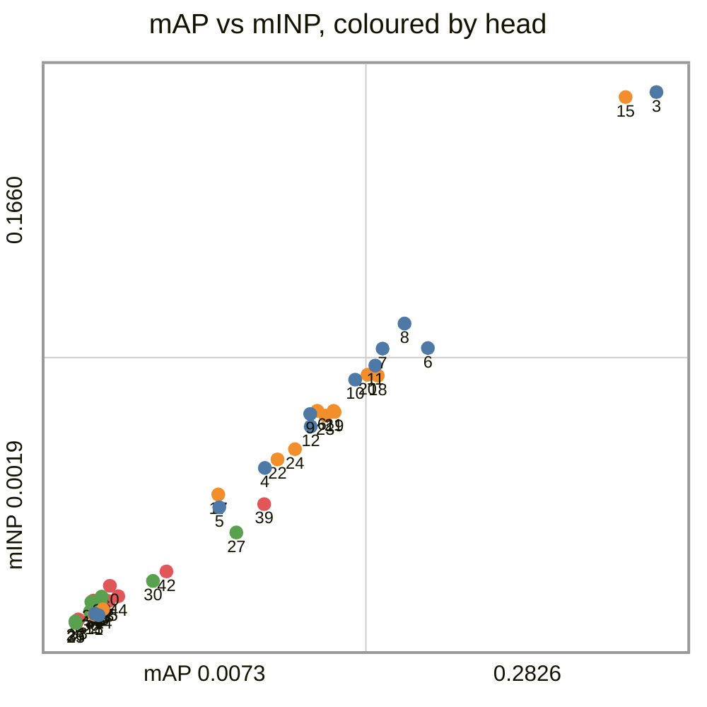
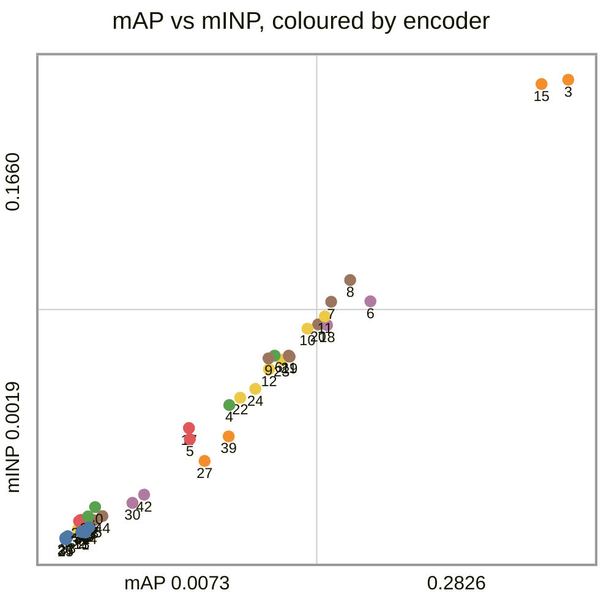
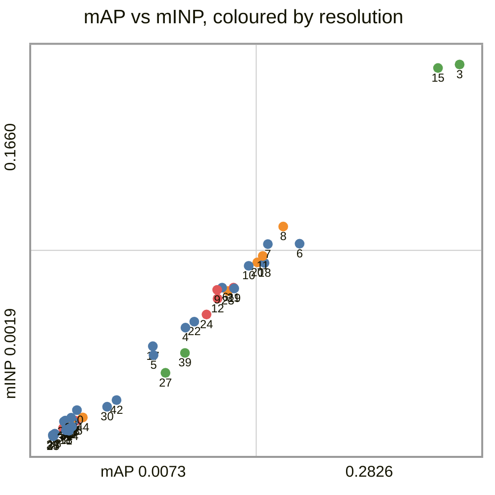

```mermaid
%%{init: {"themeVariables": {"xyChart": {"backgroundColor": "transparent", "plotColorPalette": "#4e79a7,#f28e2b,#59a14f,#e15759,#b07aa1,#9c755f,#edc948"}}, "xyChart": {"height": 1384, "width": 1215, "yAxis": {"showLabel": false}}}}%%
xychart-beta horizontal
    title "mAP, coloured by encoder"
    x-axis ["224x224 arcface vit_base_patch16_clip_224.openai crop · 1.83%", "224x224 arcface vit_base_patch16_clip_224.openai squash · 1.65%", "224x224 arcface vit_huge_plus_patch16_dinov3.lvd1689m squash · 9.71%", "224x224 arcface vit_large_patch16_dinov3.lvd1689m squash · 7.55%", "224x224 arcface vit_so400m_patch14_siglip_224.v2_webli squash · 17.43%", "224x224 arcface c-radio_v4-h squash · 15.28%", "224x224 arcface c-radio_v4-so400m squash · 13.99%", "224x224 linear vit_base_patch16_clip_224.openai crop · 1.62%", "224x224 linear vit_base_patch16_clip_224.openai squash · 2.04%", "224x224 linear vit_huge_plus_patch16_dinov3.lvd1689m squash · 12.19%", "224x224 linear vit_large_patch16_dinov3.lvd1689m squash · 7.50%", "224x224 linear vit_so400m_patch14_siglip_224.v2_webli squash · 15.06%", "224x224 linear c-radio_v4-h squash · 13.01%", "224x224 linear c-radio_v4-so400m squash · 10.31%", "224x224 none vit_base_patch16_clip_224.openai crop · 0.75%", "224x224 none vit_base_patch16_clip_224.openai squash · 0.73%", "224x224 none vit_huge_plus_patch16_dinov3.lvd1689m squash · 1.97%", "224x224 none vit_large_patch16_dinov3.lvd1689m squash · 1.49%", "224x224 none vit_so400m_patch14_siglip_224.v2_webli squash · 4.41%", "224x224 none c-radio_v4-h squash · 1.65%", "224x224 none c-radio_v4-so400m squash · 1.65%", "224x224 pca vit_base_patch16_clip_224.openai crop · 0.78%", "224x224 pca vit_base_patch16_clip_224.openai squash · 0.87%", "224x224 pca vit_huge_plus_patch16_dinov3.lvd1689m squash · 2.37%", "224x224 pca vit_large_patch16_dinov3.lvd1689m squash · 1.58%", "224x224 pca vit_so400m_patch14_siglip_224.v2_webli squash · 5.05%", "224x224 pca c-radio_v4-h squash · 2.13%", "224x224 pca c-radio_v4-so400m squash · 1.95%", "256x128 arcface c-radio_v4-h squash · 16.32%", "256x128 arcface c-radio_v4-so400m squash · 14.94%", "256x128 linear c-radio_v4-h squash · 14.57%", "256x128 linear c-radio_v4-so400m squash · 12.57%", "256x128 none c-radio_v4-h squash · 1.94%", "256x128 none c-radio_v4-so400m squash · 1.62%", "256x128 pca c-radio_v4-h squash · 2.76%", "256x128 pca c-radio_v4-so400m squash · 2.13%", "256x256 arcface vit_giantopt_patch16_siglip_256.v2_webli squash · 28.26%", "256x256 linear vit_giantopt_patch16_siglip_256.v2_webli squash · 26.79%", "256x256 none vit_giantopt_patch16_siglip_256.v2_webli squash · 8.36%", "256x256 pca vit_giantopt_patch16_siglip_256.v2_webli squash · 9.67%", "native arcface c-radio_v4-h squash · 11.86%", "native arcface c-radio_v4-so400m squash · 11.88%", "native linear c-radio_v4-h squash · 12.96%", "native linear c-radio_v4-so400m squash · 11.13%", "native none c-radio_v4-h squash · 1.71%", "native none c-radio_v4-so400m squash · 1.42%", "native pca c-radio_v4-h squash · 2.31%", "native pca c-radio_v4-so400m squash · 1.88%"]
    y-axis "mAP (%)" 0 --> 29.67
    bar [1.83, 1.65, 0.00, 0.00, 0.00, 0.00, 0.00, 1.62, 2.04, 0.00, 0.00, 0.00, 0.00, 0.00, 0.75, 0.73, 0.00, 0.00, 0.00, 0.00, 0.00, 0.78, 0.87, 0.00, 0.00, 0.00, 0.00, 0.00, 0.00, 0.00, 0.00, 0.00, 0.00, 0.00, 0.00, 0.00, 0.00, 0.00, 0.00, 0.00, 0.00, 0.00, 0.00, 0.00, 0.00, 0.00, 0.00, 0.00]
    bar [0.00, 0.00, 0.00, 0.00, 0.00, 0.00, 0.00, 0.00, 0.00, 0.00, 0.00, 0.00, 0.00, 0.00, 0.00, 0.00, 0.00, 0.00, 0.00, 0.00, 0.00, 0.00, 0.00, 0.00, 0.00, 0.00, 0.00, 0.00, 0.00, 0.00, 0.00, 0.00, 0.00, 0.00, 0.00, 0.00, 28.26, 26.79, 8.36, 9.67, 0.00, 0.00, 0.00, 0.00, 0.00, 0.00, 0.00, 0.00]
    bar [0.00, 0.00, 9.71, 0.00, 0.00, 0.00, 0.00, 0.00, 0.00, 12.19, 0.00, 0.00, 0.00, 0.00, 0.00, 0.00, 1.97, 0.00, 0.00, 0.00, 0.00, 0.00, 0.00, 2.37, 0.00, 0.00, 0.00, 0.00, 0.00, 0.00, 0.00, 0.00, 0.00, 0.00, 0.00, 0.00, 0.00, 0.00, 0.00, 0.00, 0.00, 0.00, 0.00, 0.00, 0.00, 0.00, 0.00, 0.00]
    bar [0.00, 0.00, 0.00, 7.55, 0.00, 0.00, 0.00, 0.00, 0.00, 0.00, 7.50, 0.00, 0.00, 0.00, 0.00, 0.00, 0.00, 1.49, 0.00, 0.00, 0.00, 0.00, 0.00, 0.00, 1.58, 0.00, 0.00, 0.00, 0.00, 0.00, 0.00, 0.00, 0.00, 0.00, 0.00, 0.00, 0.00, 0.00, 0.00, 0.00, 0.00, 0.00, 0.00, 0.00, 0.00, 0.00, 0.00, 0.00]
    bar [0.00, 0.00, 0.00, 0.00, 17.43, 0.00, 0.00, 0.00, 0.00, 0.00, 0.00, 15.06, 0.00, 0.00, 0.00, 0.00, 0.00, 0.00, 4.41, 0.00, 0.00, 0.00, 0.00, 0.00, 0.00, 5.05, 0.00, 0.00, 0.00, 0.00, 0.00, 0.00, 0.00, 0.00, 0.00, 0.00, 0.00, 0.00, 0.00, 0.00, 0.00, 0.00, 0.00, 0.00, 0.00, 0.00, 0.00, 0.00]
    bar [0.00, 0.00, 0.00, 0.00, 0.00, 15.28, 0.00, 0.00, 0.00, 0.00, 0.00, 0.00, 13.01, 0.00, 0.00, 0.00, 0.00, 0.00, 0.00, 1.65, 0.00, 0.00, 0.00, 0.00, 0.00, 0.00, 2.13, 0.00, 16.32, 0.00, 14.57, 0.00, 1.94, 0.00, 2.76, 0.00, 0.00, 0.00, 0.00, 0.00, 11.86, 0.00, 12.96, 0.00, 1.71, 0.00, 2.31, 0.00]
    bar [0.00, 0.00, 0.00, 0.00, 0.00, 0.00, 13.99, 0.00, 0.00, 0.00, 0.00, 0.00, 0.00, 10.31, 0.00, 0.00, 0.00, 0.00, 0.00, 0.00, 1.65, 0.00, 0.00, 0.00, 0.00, 0.00, 0.00, 1.95, 0.00, 14.94, 0.00, 12.57, 0.00, 1.62, 0.00, 2.13, 0.00, 0.00, 0.00, 0.00, 0.00, 11.88, 0.00, 11.13, 0.00, 1.42, 0.00, 1.88]
```

<!-- generated by `reidbench render`; edit the runs, not this file -->

# cuhk03-np

[← table.md](../table.md)

## cuhk03/detected-767@1

### 🟦 arcface

|  # | encoder                                       | resolution | resize |        mAP |         R1 |         R5 |        R10 |       mINP |
|---:|-----------------------------------------------|------------|--------|-----------:|-----------:|-----------:|-----------:|-----------:|
|  1 | timm:vit_base_patch16_clip_224.openai         | 224x224    | crop   |     0.0183 |     0.0193 |     0.0493 |     0.0700 |     0.0043 |
|  2 | timm:vit_base_patch16_clip_224.openai         | 224x224    | squash |     0.0165 |     0.0157 |     0.0414 |     0.0621 |     0.0047 |
|  3 | timm:vit_giantopt_patch16_siglip_256.v2_webli | 256x256    | squash | **0.2826** | **0.3129** | **0.5043** | **0.5843** | **0.1660** |
|  4 | timm:vit_huge_plus_patch16_dinov3.lvd1689m    | 224x224    | squash |     0.0971 |     0.0850 |     0.1950 |     0.2671 |     0.0498 |
|  5 | timm:vit_large_patch16_dinov3.lvd1689m        | 224x224    | squash |     0.0755 |     0.0771 |     0.1464 |     0.1986 |     0.0377 |
|  6 | timm:vit_so400m_patch14_siglip_224.v2_webli   | 224x224    | squash |     0.1743 |     0.2000 |     0.3557 |     0.4550 |     0.0869 |
|  7 | torchhub:NVlabs/RADIO/c-radio_v4-h            | 224x224    | squash |     0.1528 |     0.1507 |     0.3021 |     0.3879 |     0.0867 |
|  8 | torchhub:NVlabs/RADIO/c-radio_v4-h            | 256x128    | squash |     0.1632 |     0.1579 |     0.3214 |     0.4107 |     0.0945 |
|  9 | torchhub:NVlabs/RADIO/c-radio_v4-h            | native     | squash |     0.1186 |     0.1079 |     0.2457 |     0.3250 |     0.0665 |
| 10 | torchhub:NVlabs/RADIO/c-radio_v4-so400m       | 224x224    | squash |     0.1399 |     0.1350 |     0.2664 |     0.3557 |     0.0771 |
| 11 | torchhub:NVlabs/RADIO/c-radio_v4-so400m       | 256x128    | squash |     0.1494 |     0.1500 |     0.3029 |     0.3936 |     0.0815 |
| 12 | torchhub:NVlabs/RADIO/c-radio_v4-so400m       | native     | squash |     0.1188 |     0.1164 |     0.2329 |     0.2957 |     0.0626 |

### 🟧 linear

|  # | encoder                                       | resolution | resize |        mAP |         R1 |         R5 |        R10 |       mINP |
|---:|-----------------------------------------------|------------|--------|-----------:|-----------:|-----------:|-----------:|-----------:|
| 13 | timm:vit_base_patch16_clip_224.openai         | 224x224    | crop   |     0.0162 |     0.0150 |     0.0486 |     0.0771 |     0.0045 |
| 14 | timm:vit_base_patch16_clip_224.openai         | 224x224    | squash |     0.0204 |     0.0193 |     0.0543 |     0.0800 |     0.0061 |
| 15 | timm:vit_giantopt_patch16_siglip_256.v2_webli | 256x256    | squash | **0.2679** | **0.2814** | **0.4700** | **0.5807** | **0.1644** |
| 16 | timm:vit_huge_plus_patch16_dinov3.lvd1689m    | 224x224    | squash |     0.1219 |     0.1071 |     0.2521 |     0.3279 |     0.0675 |
| 17 | timm:vit_large_patch16_dinov3.lvd1689m        | 224x224    | squash |     0.0750 |     0.0636 |     0.1479 |     0.2129 |     0.0416 |
| 18 | timm:vit_so400m_patch14_siglip_224.v2_webli   | 224x224    | squash |     0.1506 |     0.1593 |     0.3029 |     0.4043 |     0.0784 |
| 19 | torchhub:NVlabs/RADIO/c-radio_v4-h            | 224x224    | squash |     0.1301 |     0.1293 |     0.2707 |     0.3600 |     0.0671 |
| 20 | torchhub:NVlabs/RADIO/c-radio_v4-h            | 256x128    | squash |     0.1457 |     0.1450 |     0.3029 |     0.3671 |     0.0786 |
| 21 | torchhub:NVlabs/RADIO/c-radio_v4-h            | native     | squash |     0.1296 |     0.1364 |     0.2529 |     0.3471 |     0.0675 |
| 22 | torchhub:NVlabs/RADIO/c-radio_v4-so400m       | 224x224    | squash |     0.1031 |     0.0979 |     0.2171 |     0.2907 |     0.0525 |
| 23 | torchhub:NVlabs/RADIO/c-radio_v4-so400m       | 256x128    | squash |     0.1257 |     0.1236 |     0.2557 |     0.3329 |     0.0660 |
| 24 | torchhub:NVlabs/RADIO/c-radio_v4-so400m       | native     | squash |     0.1113 |     0.1129 |     0.2257 |     0.2993 |     0.0556 |

### 🟩 none

|  # | encoder                                       | resolution | resize |        mAP |         R1 |         R5 |        R10 |       mINP |
|---:|-----------------------------------------------|------------|--------|-----------:|-----------:|-----------:|-----------:|-----------:|
| 25 | timm:vit_base_patch16_clip_224.openai         | 224x224    | crop   |     0.0075 |     0.0064 |     0.0200 |     0.0321 |     0.0019 |
| 26 | timm:vit_base_patch16_clip_224.openai         | 224x224    | squash |     0.0073 |     0.0064 |     0.0143 |     0.0271 |     0.0024 |
| 27 | timm:vit_giantopt_patch16_siglip_256.v2_webli | 256x256    | squash | **0.0836** | **0.0929** | **0.1964** | **0.2643** | **0.0299** |
| 28 | timm:vit_huge_plus_patch16_dinov3.lvd1689m    | 224x224    | squash |     0.0197 |     0.0129 |     0.0371 |     0.0543 |     0.0101 |
| 29 | timm:vit_large_patch16_dinov3.lvd1689m        | 224x224    | squash |     0.0149 |     0.0136 |     0.0250 |     0.0343 |     0.0084 |
| 30 | timm:vit_so400m_patch14_siglip_224.v2_webli   | 224x224    | squash |     0.0441 |     0.0479 |     0.1129 |     0.1579 |     0.0149 |
| 31 | torchhub:NVlabs/RADIO/c-radio_v4-h            | 224x224    | squash |     0.0165 |     0.0107 |     0.0343 |     0.0543 |     0.0062 |
| 32 | torchhub:NVlabs/RADIO/c-radio_v4-h            | 256x128    | squash |     0.0194 |     0.0114 |     0.0421 |     0.0586 |     0.0083 |
| 33 | torchhub:NVlabs/RADIO/c-radio_v4-h            | native     | squash |     0.0171 |     0.0136 |     0.0329 |     0.0486 |     0.0068 |
| 34 | torchhub:NVlabs/RADIO/c-radio_v4-so400m       | 224x224    | squash |     0.0165 |     0.0136 |     0.0293 |     0.0471 |     0.0069 |
| 35 | torchhub:NVlabs/RADIO/c-radio_v4-so400m       | 256x128    | squash |     0.0162 |     0.0121 |     0.0336 |     0.0514 |     0.0065 |
| 36 | torchhub:NVlabs/RADIO/c-radio_v4-so400m       | native     | squash |     0.0142 |     0.0114 |     0.0329 |     0.0450 |     0.0055 |

### 🟥 pca

|  # | encoder                                       | resolution | resize |        mAP |         R1 |         R5 |        R10 |       mINP |
|---:|-----------------------------------------------|------------|--------|-----------:|-----------:|-----------:|-----------:|-----------:|
| 37 | timm:vit_base_patch16_clip_224.openai         | 224x224    | crop   |     0.0078 |     0.0050 |     0.0243 |     0.0379 |     0.0020 |
| 38 | timm:vit_base_patch16_clip_224.openai         | 224x224    | squash |     0.0087 |     0.0079 |     0.0200 |     0.0286 |     0.0030 |
| 39 | timm:vit_giantopt_patch16_siglip_256.v2_webli | 256x256    | squash | **0.0967** | **0.1136** | **0.2143** | **0.2729** | **0.0387** |
| 40 | timm:vit_huge_plus_patch16_dinov3.lvd1689m    | 224x224    | squash |     0.0237 |     0.0179 |     0.0393 |     0.0586 |     0.0134 |
| 41 | timm:vit_large_patch16_dinov3.lvd1689m        | 224x224    | squash |     0.0158 |     0.0136 |     0.0279 |     0.0414 |     0.0088 |
| 42 | timm:vit_so400m_patch14_siglip_224.v2_webli   | 224x224    | squash |     0.0505 |     0.0557 |     0.1257 |     0.1729 |     0.0178 |
| 43 | torchhub:NVlabs/RADIO/c-radio_v4-h            | 224x224    | squash |     0.0213 |     0.0150 |     0.0529 |     0.0729 |     0.0084 |
| 44 | torchhub:NVlabs/RADIO/c-radio_v4-h            | 256x128    | squash |     0.0276 |     0.0243 |     0.0536 |     0.0829 |     0.0102 |
| 45 | torchhub:NVlabs/RADIO/c-radio_v4-h            | native     | squash |     0.0231 |     0.0193 |     0.0464 |     0.0700 |     0.0087 |
| 46 | torchhub:NVlabs/RADIO/c-radio_v4-so400m       | 224x224    | squash |     0.0195 |     0.0179 |     0.0429 |     0.0543 |     0.0080 |
| 47 | torchhub:NVlabs/RADIO/c-radio_v4-so400m       | 256x128    | squash |     0.0213 |     0.0164 |     0.0471 |     0.0621 |     0.0087 |
| 48 | torchhub:NVlabs/RADIO/c-radio_v4-so400m       | native     | squash |     0.0188 |     0.0171 |     0.0421 |     0.0579 |     0.0073 |

### Every row, by encoder and resolution

```mermaid
%%{init: {"themeVariables": {"xyChart": {"backgroundColor": "transparent", "plotColorPalette": "#4e79a7,#f28e2b,#59a14f,#e15759"}}, "xyChart": {"height": 1384, "width": 1215, "yAxis": {"showLabel": false}}}}%%
xychart-beta horizontal
    title "mAP, coloured by head"
    x-axis ["vit_base_patch16_clip_224.openai 224x224 arcface crop · 1.83%", "vit_base_patch16_clip_224.openai 224x224 arcface squash · 1.65%", "vit_base_patch16_clip_224.openai 224x224 linear crop · 1.62%", "vit_base_patch16_clip_224.openai 224x224 linear squash · 2.04%", "vit_base_patch16_clip_224.openai 224x224 none crop · 0.75%", "vit_base_patch16_clip_224.openai 224x224 none squash · 0.73%", "vit_base_patch16_clip_224.openai 224x224 pca crop · 0.78%", "vit_base_patch16_clip_224.openai 224x224 pca squash · 0.87%", "vit_giantopt_patch16_siglip_256.v2_webli 256x256 arcface squash · 28.26%", "vit_giantopt_patch16_siglip_256.v2_webli 256x256 linear squash · 26.79%", "vit_giantopt_patch16_siglip_256.v2_webli 256x256 none squash · 8.36%", "vit_giantopt_patch16_siglip_256.v2_webli 256x256 pca squash · 9.67%", "vit_huge_plus_patch16_dinov3.lvd1689m 224x224 arcface squash · 9.71%", "vit_huge_plus_patch16_dinov3.lvd1689m 224x224 linear squash · 12.19%", "vit_huge_plus_patch16_dinov3.lvd1689m 224x224 none squash · 1.97%", "vit_huge_plus_patch16_dinov3.lvd1689m 224x224 pca squash · 2.37%", "vit_large_patch16_dinov3.lvd1689m 224x224 arcface squash · 7.55%", "vit_large_patch16_dinov3.lvd1689m 224x224 linear squash · 7.50%", "vit_large_patch16_dinov3.lvd1689m 224x224 none squash · 1.49%", "vit_large_patch16_dinov3.lvd1689m 224x224 pca squash · 1.58%", "vit_so400m_patch14_siglip_224.v2_webli 224x224 arcface squash · 17.43%", "vit_so400m_patch14_siglip_224.v2_webli 224x224 linear squash · 15.06%", "vit_so400m_patch14_siglip_224.v2_webli 224x224 none squash · 4.41%", "vit_so400m_patch14_siglip_224.v2_webli 224x224 pca squash · 5.05%", "c-radio_v4-h 224x224 arcface squash · 15.28%", "c-radio_v4-h 224x224 linear squash · 13.01%", "c-radio_v4-h 224x224 none squash · 1.65%", "c-radio_v4-h 224x224 pca squash · 2.13%", "c-radio_v4-h 256x128 arcface squash · 16.32%", "c-radio_v4-h 256x128 linear squash · 14.57%", "c-radio_v4-h 256x128 none squash · 1.94%", "c-radio_v4-h 256x128 pca squash · 2.76%", "c-radio_v4-h native arcface squash · 11.86%", "c-radio_v4-h native linear squash · 12.96%", "c-radio_v4-h native none squash · 1.71%", "c-radio_v4-h native pca squash · 2.31%", "c-radio_v4-so400m 224x224 arcface squash · 13.99%", "c-radio_v4-so400m 224x224 linear squash · 10.31%", "c-radio_v4-so400m 224x224 none squash · 1.65%", "c-radio_v4-so400m 224x224 pca squash · 1.95%", "c-radio_v4-so400m 256x128 arcface squash · 14.94%", "c-radio_v4-so400m 256x128 linear squash · 12.57%", "c-radio_v4-so400m 256x128 none squash · 1.62%", "c-radio_v4-so400m 256x128 pca squash · 2.13%", "c-radio_v4-so400m native arcface squash · 11.88%", "c-radio_v4-so400m native linear squash · 11.13%", "c-radio_v4-so400m native none squash · 1.42%", "c-radio_v4-so400m native pca squash · 1.88%"]
    y-axis "mAP (%)" 0 --> 29.67
    bar [1.83, 1.65, 0.00, 0.00, 0.00, 0.00, 0.00, 0.00, 28.26, 0.00, 0.00, 0.00, 9.71, 0.00, 0.00, 0.00, 7.55, 0.00, 0.00, 0.00, 17.43, 0.00, 0.00, 0.00, 15.28, 0.00, 0.00, 0.00, 16.32, 0.00, 0.00, 0.00, 11.86, 0.00, 0.00, 0.00, 13.99, 0.00, 0.00, 0.00, 14.94, 0.00, 0.00, 0.00, 11.88, 0.00, 0.00, 0.00]
    bar [0.00, 0.00, 1.62, 2.04, 0.00, 0.00, 0.00, 0.00, 0.00, 26.79, 0.00, 0.00, 0.00, 12.19, 0.00, 0.00, 0.00, 7.50, 0.00, 0.00, 0.00, 15.06, 0.00, 0.00, 0.00, 13.01, 0.00, 0.00, 0.00, 14.57, 0.00, 0.00, 0.00, 12.96, 0.00, 0.00, 0.00, 10.31, 0.00, 0.00, 0.00, 12.57, 0.00, 0.00, 0.00, 11.13, 0.00, 0.00]
    bar [0.00, 0.00, 0.00, 0.00, 0.75, 0.73, 0.00, 0.00, 0.00, 0.00, 8.36, 0.00, 0.00, 0.00, 1.97, 0.00, 0.00, 0.00, 1.49, 0.00, 0.00, 0.00, 4.41, 0.00, 0.00, 0.00, 1.65, 0.00, 0.00, 0.00, 1.94, 0.00, 0.00, 0.00, 1.71, 0.00, 0.00, 0.00, 1.65, 0.00, 0.00, 0.00, 1.62, 0.00, 0.00, 0.00, 1.42, 0.00]
    bar [0.00, 0.00, 0.00, 0.00, 0.00, 0.00, 0.78, 0.87, 0.00, 0.00, 0.00, 9.67, 0.00, 0.00, 0.00, 2.37, 0.00, 0.00, 0.00, 1.58, 0.00, 0.00, 0.00, 5.05, 0.00, 0.00, 0.00, 2.13, 0.00, 0.00, 0.00, 2.76, 0.00, 0.00, 0.00, 2.31, 0.00, 0.00, 0.00, 1.95, 0.00, 0.00, 0.00, 2.13, 0.00, 0.00, 0.00, 1.88]
```

### By head — does the probe carry it?

```mermaid
%%{init: {"themeVariables": {"xyChart": {"backgroundColor": "transparent", "plotColorPalette": "#4e79a7,#f28e2b,#59a14f,#e15759"}}, "xyChart": {"height": 1384, "width": 1215, "yAxis": {"showLabel": false}}}}%%
xychart-beta horizontal
    title "mAP, coloured by head"
    x-axis ["arcface vit_base_patch16_clip_224.openai 224x224 crop · 1.83%", "arcface vit_base_patch16_clip_224.openai 224x224 squash · 1.65%", "arcface vit_giantopt_patch16_siglip_256.v2_webli 256x256 squash · 28.26%", "arcface vit_huge_plus_patch16_dinov3.lvd1689m 224x224 squash · 9.71%", "arcface vit_large_patch16_dinov3.lvd1689m 224x224 squash · 7.55%", "arcface vit_so400m_patch14_siglip_224.v2_webli 224x224 squash · 17.43%", "arcface c-radio_v4-h 224x224 squash · 15.28%", "arcface c-radio_v4-h 256x128 squash · 16.32%", "arcface c-radio_v4-h native squash · 11.86%", "arcface c-radio_v4-so400m 224x224 squash · 13.99%", "arcface c-radio_v4-so400m 256x128 squash · 14.94%", "arcface c-radio_v4-so400m native squash · 11.88%", "linear vit_base_patch16_clip_224.openai 224x224 crop · 1.62%", "linear vit_base_patch16_clip_224.openai 224x224 squash · 2.04%", "linear vit_giantopt_patch16_siglip_256.v2_webli 256x256 squash · 26.79%", "linear vit_huge_plus_patch16_dinov3.lvd1689m 224x224 squash · 12.19%", "linear vit_large_patch16_dinov3.lvd1689m 224x224 squash · 7.50%", "linear vit_so400m_patch14_siglip_224.v2_webli 224x224 squash · 15.06%", "linear c-radio_v4-h 224x224 squash · 13.01%", "linear c-radio_v4-h 256x128 squash · 14.57%", "linear c-radio_v4-h native squash · 12.96%", "linear c-radio_v4-so400m 224x224 squash · 10.31%", "linear c-radio_v4-so400m 256x128 squash · 12.57%", "linear c-radio_v4-so400m native squash · 11.13%", "none vit_base_patch16_clip_224.openai 224x224 crop · 0.75%", "none vit_base_patch16_clip_224.openai 224x224 squash · 0.73%", "none vit_giantopt_patch16_siglip_256.v2_webli 256x256 squash · 8.36%", "none vit_huge_plus_patch16_dinov3.lvd1689m 224x224 squash · 1.97%", "none vit_large_patch16_dinov3.lvd1689m 224x224 squash · 1.49%", "none vit_so400m_patch14_siglip_224.v2_webli 224x224 squash · 4.41%", "none c-radio_v4-h 224x224 squash · 1.65%", "none c-radio_v4-h 256x128 squash · 1.94%", "none c-radio_v4-h native squash · 1.71%", "none c-radio_v4-so400m 224x224 squash · 1.65%", "none c-radio_v4-so400m 256x128 squash · 1.62%", "none c-radio_v4-so400m native squash · 1.42%", "pca vit_base_patch16_clip_224.openai 224x224 crop · 0.78%", "pca vit_base_patch16_clip_224.openai 224x224 squash · 0.87%", "pca vit_giantopt_patch16_siglip_256.v2_webli 256x256 squash · 9.67%", "pca vit_huge_plus_patch16_dinov3.lvd1689m 224x224 squash · 2.37%", "pca vit_large_patch16_dinov3.lvd1689m 224x224 squash · 1.58%", "pca vit_so400m_patch14_siglip_224.v2_webli 224x224 squash · 5.05%", "pca c-radio_v4-h 224x224 squash · 2.13%", "pca c-radio_v4-h 256x128 squash · 2.76%", "pca c-radio_v4-h native squash · 2.31%", "pca c-radio_v4-so400m 224x224 squash · 1.95%", "pca c-radio_v4-so400m 256x128 squash · 2.13%", "pca c-radio_v4-so400m native squash · 1.88%"]
    y-axis "mAP (%)" 0 --> 29.67
    bar [1.83, 1.65, 28.26, 9.71, 7.55, 17.43, 15.28, 16.32, 11.86, 13.99, 14.94, 11.88, 0.00, 0.00, 0.00, 0.00, 0.00, 0.00, 0.00, 0.00, 0.00, 0.00, 0.00, 0.00, 0.00, 0.00, 0.00, 0.00, 0.00, 0.00, 0.00, 0.00, 0.00, 0.00, 0.00, 0.00, 0.00, 0.00, 0.00, 0.00, 0.00, 0.00, 0.00, 0.00, 0.00, 0.00, 0.00, 0.00]
    bar [0.00, 0.00, 0.00, 0.00, 0.00, 0.00, 0.00, 0.00, 0.00, 0.00, 0.00, 0.00, 1.62, 2.04, 26.79, 12.19, 7.50, 15.06, 13.01, 14.57, 12.96, 10.31, 12.57, 11.13, 0.00, 0.00, 0.00, 0.00, 0.00, 0.00, 0.00, 0.00, 0.00, 0.00, 0.00, 0.00, 0.00, 0.00, 0.00, 0.00, 0.00, 0.00, 0.00, 0.00, 0.00, 0.00, 0.00, 0.00]
    bar [0.00, 0.00, 0.00, 0.00, 0.00, 0.00, 0.00, 0.00, 0.00, 0.00, 0.00, 0.00, 0.00, 0.00, 0.00, 0.00, 0.00, 0.00, 0.00, 0.00, 0.00, 0.00, 0.00, 0.00, 0.75, 0.73, 8.36, 1.97, 1.49, 4.41, 1.65, 1.94, 1.71, 1.65, 1.62, 1.42, 0.00, 0.00, 0.00, 0.00, 0.00, 0.00, 0.00, 0.00, 0.00, 0.00, 0.00, 0.00]
    bar [0.00, 0.00, 0.00, 0.00, 0.00, 0.00, 0.00, 0.00, 0.00, 0.00, 0.00, 0.00, 0.00, 0.00, 0.00, 0.00, 0.00, 0.00, 0.00, 0.00, 0.00, 0.00, 0.00, 0.00, 0.00, 0.00, 0.00, 0.00, 0.00, 0.00, 0.00, 0.00, 0.00, 0.00, 0.00, 0.00, 0.78, 0.87, 9.67, 2.37, 1.58, 5.05, 2.13, 2.76, 2.31, 1.95, 2.13, 1.88]
```

### By encoder — does the checkpoint carry it?

*Colour — encoder:* 🟦 timm:vit_base_patch16_clip_224.openai · 🟧 timm:vit_giantopt_patch16_siglip_256.v2_webli · 🟩 timm:vit_huge_plus_patch16_dinov3.lvd1689m · 🟥 timm:vit_large_patch16_dinov3.lvd1689m · 🟪 timm:vit_so400m_patch14_siglip_224.v2_webli · 🟫 torchhub:NVlabs/RADIO/c-radio_v4-h · 🟨 torchhub:NVlabs/RADIO/c-radio_v4-so400m

```mermaid
%%{init: {"themeVariables": {"xyChart": {"backgroundColor": "transparent", "plotColorPalette": "#4e79a7,#f28e2b,#59a14f,#e15759,#b07aa1,#9c755f,#edc948"}}, "xyChart": {"height": 1384, "width": 1215, "yAxis": {"showLabel": false}}}}%%
xychart-beta horizontal
    title "mAP, coloured by encoder"
    x-axis ["vit_base_patch16_clip_224.openai arcface 224x224 crop · 1.83%", "vit_base_patch16_clip_224.openai arcface 224x224 squash · 1.65%", "vit_base_patch16_clip_224.openai linear 224x224 crop · 1.62%", "vit_base_patch16_clip_224.openai linear 224x224 squash · 2.04%", "vit_base_patch16_clip_224.openai none 224x224 crop · 0.75%", "vit_base_patch16_clip_224.openai none 224x224 squash · 0.73%", "vit_base_patch16_clip_224.openai pca 224x224 crop · 0.78%", "vit_base_patch16_clip_224.openai pca 224x224 squash · 0.87%", "vit_giantopt_patch16_siglip_256.v2_webli arcface 256x256 squash · 28.26%", "vit_giantopt_patch16_siglip_256.v2_webli linear 256x256 squash · 26.79%", "vit_giantopt_patch16_siglip_256.v2_webli none 256x256 squash · 8.36%", "vit_giantopt_patch16_siglip_256.v2_webli pca 256x256 squash · 9.67%", "vit_huge_plus_patch16_dinov3.lvd1689m arcface 224x224 squash · 9.71%", "vit_huge_plus_patch16_dinov3.lvd1689m linear 224x224 squash · 12.19%", "vit_huge_plus_patch16_dinov3.lvd1689m none 224x224 squash · 1.97%", "vit_huge_plus_patch16_dinov3.lvd1689m pca 224x224 squash · 2.37%", "vit_large_patch16_dinov3.lvd1689m arcface 224x224 squash · 7.55%", "vit_large_patch16_dinov3.lvd1689m linear 224x224 squash · 7.50%", "vit_large_patch16_dinov3.lvd1689m none 224x224 squash · 1.49%", "vit_large_patch16_dinov3.lvd1689m pca 224x224 squash · 1.58%", "vit_so400m_patch14_siglip_224.v2_webli arcface 224x224 squash · 17.43%", "vit_so400m_patch14_siglip_224.v2_webli linear 224x224 squash · 15.06%", "vit_so400m_patch14_siglip_224.v2_webli none 224x224 squash · 4.41%", "vit_so400m_patch14_siglip_224.v2_webli pca 224x224 squash · 5.05%", "c-radio_v4-h arcface 224x224 squash · 15.28%", "c-radio_v4-h arcface 256x128 squash · 16.32%", "c-radio_v4-h arcface native squash · 11.86%", "c-radio_v4-h linear 224x224 squash · 13.01%", "c-radio_v4-h linear 256x128 squash · 14.57%", "c-radio_v4-h linear native squash · 12.96%", "c-radio_v4-h none 224x224 squash · 1.65%", "c-radio_v4-h none 256x128 squash · 1.94%", "c-radio_v4-h none native squash · 1.71%", "c-radio_v4-h pca 224x224 squash · 2.13%", "c-radio_v4-h pca 256x128 squash · 2.76%", "c-radio_v4-h pca native squash · 2.31%", "c-radio_v4-so400m arcface 224x224 squash · 13.99%", "c-radio_v4-so400m arcface 256x128 squash · 14.94%", "c-radio_v4-so400m arcface native squash · 11.88%", "c-radio_v4-so400m linear 224x224 squash · 10.31%", "c-radio_v4-so400m linear 256x128 squash · 12.57%", "c-radio_v4-so400m linear native squash · 11.13%", "c-radio_v4-so400m none 224x224 squash · 1.65%", "c-radio_v4-so400m none 256x128 squash · 1.62%", "c-radio_v4-so400m none native squash · 1.42%", "c-radio_v4-so400m pca 224x224 squash · 1.95%", "c-radio_v4-so400m pca 256x128 squash · 2.13%", "c-radio_v4-so400m pca native squash · 1.88%"]
    y-axis "mAP (%)" 0 --> 29.67
    bar [1.83, 1.65, 1.62, 2.04, 0.75, 0.73, 0.78, 0.87, 0.00, 0.00, 0.00, 0.00, 0.00, 0.00, 0.00, 0.00, 0.00, 0.00, 0.00, 0.00, 0.00, 0.00, 0.00, 0.00, 0.00, 0.00, 0.00, 0.00, 0.00, 0.00, 0.00, 0.00, 0.00, 0.00, 0.00, 0.00, 0.00, 0.00, 0.00, 0.00, 0.00, 0.00, 0.00, 0.00, 0.00, 0.00, 0.00, 0.00]
    bar [0.00, 0.00, 0.00, 0.00, 0.00, 0.00, 0.00, 0.00, 28.26, 26.79, 8.36, 9.67, 0.00, 0.00, 0.00, 0.00, 0.00, 0.00, 0.00, 0.00, 0.00, 0.00, 0.00, 0.00, 0.00, 0.00, 0.00, 0.00, 0.00, 0.00, 0.00, 0.00, 0.00, 0.00, 0.00, 0.00, 0.00, 0.00, 0.00, 0.00, 0.00, 0.00, 0.00, 0.00, 0.00, 0.00, 0.00, 0.00]
    bar [0.00, 0.00, 0.00, 0.00, 0.00, 0.00, 0.00, 0.00, 0.00, 0.00, 0.00, 0.00, 9.71, 12.19, 1.97, 2.37, 0.00, 0.00, 0.00, 0.00, 0.00, 0.00, 0.00, 0.00, 0.00, 0.00, 0.00, 0.00, 0.00, 0.00, 0.00, 0.00, 0.00, 0.00, 0.00, 0.00, 0.00, 0.00, 0.00, 0.00, 0.00, 0.00, 0.00, 0.00, 0.00, 0.00, 0.00, 0.00]
    bar [0.00, 0.00, 0.00, 0.00, 0.00, 0.00, 0.00, 0.00, 0.00, 0.00, 0.00, 0.00, 0.00, 0.00, 0.00, 0.00, 7.55, 7.50, 1.49, 1.58, 0.00, 0.00, 0.00, 0.00, 0.00, 0.00, 0.00, 0.00, 0.00, 0.00, 0.00, 0.00, 0.00, 0.00, 0.00, 0.00, 0.00, 0.00, 0.00, 0.00, 0.00, 0.00, 0.00, 0.00, 0.00, 0.00, 0.00, 0.00]
    bar [0.00, 0.00, 0.00, 0.00, 0.00, 0.00, 0.00, 0.00, 0.00, 0.00, 0.00, 0.00, 0.00, 0.00, 0.00, 0.00, 0.00, 0.00, 0.00, 0.00, 17.43, 15.06, 4.41, 5.05, 0.00, 0.00, 0.00, 0.00, 0.00, 0.00, 0.00, 0.00, 0.00, 0.00, 0.00, 0.00, 0.00, 0.00, 0.00, 0.00, 0.00, 0.00, 0.00, 0.00, 0.00, 0.00, 0.00, 0.00]
    bar [0.00, 0.00, 0.00, 0.00, 0.00, 0.00, 0.00, 0.00, 0.00, 0.00, 0.00, 0.00, 0.00, 0.00, 0.00, 0.00, 0.00, 0.00, 0.00, 0.00, 0.00, 0.00, 0.00, 0.00, 15.28, 16.32, 11.86, 13.01, 14.57, 12.96, 1.65, 1.94, 1.71, 2.13, 2.76, 2.31, 0.00, 0.00, 0.00, 0.00, 0.00, 0.00, 0.00, 0.00, 0.00, 0.00, 0.00, 0.00]
    bar [0.00, 0.00, 0.00, 0.00, 0.00, 0.00, 0.00, 0.00, 0.00, 0.00, 0.00, 0.00, 0.00, 0.00, 0.00, 0.00, 0.00, 0.00, 0.00, 0.00, 0.00, 0.00, 0.00, 0.00, 0.00, 0.00, 0.00, 0.00, 0.00, 0.00, 0.00, 0.00, 0.00, 0.00, 0.00, 0.00, 13.99, 14.94, 11.88, 10.31, 12.57, 11.13, 1.65, 1.62, 1.42, 1.95, 2.13, 1.88]
```

### By resolution — does the input size carry it?

*Colour — resolution:* 🟦 224x224 · 🟧 256x128 · 🟩 256x256 · 🟥 native

```mermaid
%%{init: {"themeVariables": {"xyChart": {"backgroundColor": "transparent", "plotColorPalette": "#4e79a7,#f28e2b,#59a14f,#e15759"}}, "xyChart": {"height": 1384, "width": 1215, "yAxis": {"showLabel": false}}}}%%
xychart-beta horizontal
    title "mAP, coloured by resolution"
    x-axis ["224x224 vit_base_patch16_clip_224.openai arcface crop · 1.83%", "224x224 vit_base_patch16_clip_224.openai arcface squash · 1.65%", "224x224 vit_base_patch16_clip_224.openai linear crop · 1.62%", "224x224 vit_base_patch16_clip_224.openai linear squash · 2.04%", "224x224 vit_base_patch16_clip_224.openai none crop · 0.75%", "224x224 vit_base_patch16_clip_224.openai none squash · 0.73%", "224x224 vit_base_patch16_clip_224.openai pca crop · 0.78%", "224x224 vit_base_patch16_clip_224.openai pca squash · 0.87%", "224x224 vit_huge_plus_patch16_dinov3.lvd1689m arcface squash · 9.71%", "224x224 vit_huge_plus_patch16_dinov3.lvd1689m linear squash · 12.19%", "224x224 vit_huge_plus_patch16_dinov3.lvd1689m none squash · 1.97%", "224x224 vit_huge_plus_patch16_dinov3.lvd1689m pca squash · 2.37%", "224x224 vit_large_patch16_dinov3.lvd1689m arcface squash · 7.55%", "224x224 vit_large_patch16_dinov3.lvd1689m linear squash · 7.50%", "224x224 vit_large_patch16_dinov3.lvd1689m none squash · 1.49%", "224x224 vit_large_patch16_dinov3.lvd1689m pca squash · 1.58%", "224x224 vit_so400m_patch14_siglip_224.v2_webli arcface squash · 17.43%", "224x224 vit_so400m_patch14_siglip_224.v2_webli linear squash · 15.06%", "224x224 vit_so400m_patch14_siglip_224.v2_webli none squash · 4.41%", "224x224 vit_so400m_patch14_siglip_224.v2_webli pca squash · 5.05%", "224x224 c-radio_v4-h arcface squash · 15.28%", "224x224 c-radio_v4-h linear squash · 13.01%", "224x224 c-radio_v4-h none squash · 1.65%", "224x224 c-radio_v4-h pca squash · 2.13%", "224x224 c-radio_v4-so400m arcface squash · 13.99%", "224x224 c-radio_v4-so400m linear squash · 10.31%", "224x224 c-radio_v4-so400m none squash · 1.65%", "224x224 c-radio_v4-so400m pca squash · 1.95%", "256x128 c-radio_v4-h arcface squash · 16.32%", "256x128 c-radio_v4-h linear squash · 14.57%", "256x128 c-radio_v4-h none squash · 1.94%", "256x128 c-radio_v4-h pca squash · 2.76%", "256x128 c-radio_v4-so400m arcface squash · 14.94%", "256x128 c-radio_v4-so400m linear squash · 12.57%", "256x128 c-radio_v4-so400m none squash · 1.62%", "256x128 c-radio_v4-so400m pca squash · 2.13%", "256x256 vit_giantopt_patch16_siglip_256.v2_webli arcface squash · 28.26%", "256x256 vit_giantopt_patch16_siglip_256.v2_webli linear squash · 26.79%", "256x256 vit_giantopt_patch16_siglip_256.v2_webli none squash · 8.36%", "256x256 vit_giantopt_patch16_siglip_256.v2_webli pca squash · 9.67%", "native c-radio_v4-h arcface squash · 11.86%", "native c-radio_v4-h linear squash · 12.96%", "native c-radio_v4-h none squash · 1.71%", "native c-radio_v4-h pca squash · 2.31%", "native c-radio_v4-so400m arcface squash · 11.88%", "native c-radio_v4-so400m linear squash · 11.13%", "native c-radio_v4-so400m none squash · 1.42%", "native c-radio_v4-so400m pca squash · 1.88%"]
    y-axis "mAP (%)" 0 --> 29.67
    bar [1.83, 1.65, 1.62, 2.04, 0.75, 0.73, 0.78, 0.87, 9.71, 12.19, 1.97, 2.37, 7.55, 7.50, 1.49, 1.58, 17.43, 15.06, 4.41, 5.05, 15.28, 13.01, 1.65, 2.13, 13.99, 10.31, 1.65, 1.95, 0.00, 0.00, 0.00, 0.00, 0.00, 0.00, 0.00, 0.00, 0.00, 0.00, 0.00, 0.00, 0.00, 0.00, 0.00, 0.00, 0.00, 0.00, 0.00, 0.00]
    bar [0.00, 0.00, 0.00, 0.00, 0.00, 0.00, 0.00, 0.00, 0.00, 0.00, 0.00, 0.00, 0.00, 0.00, 0.00, 0.00, 0.00, 0.00, 0.00, 0.00, 0.00, 0.00, 0.00, 0.00, 0.00, 0.00, 0.00, 0.00, 16.32, 14.57, 1.94, 2.76, 14.94, 12.57, 1.62, 2.13, 0.00, 0.00, 0.00, 0.00, 0.00, 0.00, 0.00, 0.00, 0.00, 0.00, 0.00, 0.00]
    bar [0.00, 0.00, 0.00, 0.00, 0.00, 0.00, 0.00, 0.00, 0.00, 0.00, 0.00, 0.00, 0.00, 0.00, 0.00, 0.00, 0.00, 0.00, 0.00, 0.00, 0.00, 0.00, 0.00, 0.00, 0.00, 0.00, 0.00, 0.00, 0.00, 0.00, 0.00, 0.00, 0.00, 0.00, 0.00, 0.00, 28.26, 26.79, 8.36, 9.67, 0.00, 0.00, 0.00, 0.00, 0.00, 0.00, 0.00, 0.00]
    bar [0.00, 0.00, 0.00, 0.00, 0.00, 0.00, 0.00, 0.00, 0.00, 0.00, 0.00, 0.00, 0.00, 0.00, 0.00, 0.00, 0.00, 0.00, 0.00, 0.00, 0.00, 0.00, 0.00, 0.00, 0.00, 0.00, 0.00, 0.00, 0.00, 0.00, 0.00, 0.00, 0.00, 0.00, 0.00, 0.00, 0.00, 0.00, 0.00, 0.00, 11.86, 12.96, 1.71, 2.31, 11.88, 11.13, 1.42, 1.88]
```

### Resolution, within one encoder and head

*Colour — resolution:* 🟦 224x224 · 🟧 256x128 · 🟩 256x256 · 🟥 native

```mermaid
%%{init: {"themeVariables": {"xyChart": {"backgroundColor": "transparent", "plotColorPalette": "#4e79a7,#f28e2b,#59a14f,#e15759"}}, "xyChart": {"height": 1384, "width": 1215, "yAxis": {"showLabel": false}}}}%%
xychart-beta horizontal
    title "mAP, coloured by resolution"
    x-axis ["vit_base_patch16_clip_224.openai arcface 224x224 crop · 1.83%", "vit_base_patch16_clip_224.openai arcface 224x224 squash · 1.65%", "vit_base_patch16_clip_224.openai linear 224x224 crop · 1.62%", "vit_base_patch16_clip_224.openai linear 224x224 squash · 2.04%", "vit_base_patch16_clip_224.openai none 224x224 crop · 0.75%", "vit_base_patch16_clip_224.openai none 224x224 squash · 0.73%", "vit_base_patch16_clip_224.openai pca 224x224 crop · 0.78%", "vit_base_patch16_clip_224.openai pca 224x224 squash · 0.87%", "vit_giantopt_patch16_siglip_256.v2_webli arcface 256x256 squash · 28.26%", "vit_giantopt_patch16_siglip_256.v2_webli linear 256x256 squash · 26.79%", "vit_giantopt_patch16_siglip_256.v2_webli none 256x256 squash · 8.36%", "vit_giantopt_patch16_siglip_256.v2_webli pca 256x256 squash · 9.67%", "vit_huge_plus_patch16_dinov3.lvd1689m arcface 224x224 squash · 9.71%", "vit_huge_plus_patch16_dinov3.lvd1689m linear 224x224 squash · 12.19%", "vit_huge_plus_patch16_dinov3.lvd1689m none 224x224 squash · 1.97%", "vit_huge_plus_patch16_dinov3.lvd1689m pca 224x224 squash · 2.37%", "vit_large_patch16_dinov3.lvd1689m arcface 224x224 squash · 7.55%", "vit_large_patch16_dinov3.lvd1689m linear 224x224 squash · 7.50%", "vit_large_patch16_dinov3.lvd1689m none 224x224 squash · 1.49%", "vit_large_patch16_dinov3.lvd1689m pca 224x224 squash · 1.58%", "vit_so400m_patch14_siglip_224.v2_webli arcface 224x224 squash · 17.43%", "vit_so400m_patch14_siglip_224.v2_webli linear 224x224 squash · 15.06%", "vit_so400m_patch14_siglip_224.v2_webli none 224x224 squash · 4.41%", "vit_so400m_patch14_siglip_224.v2_webli pca 224x224 squash · 5.05%", "c-radio_v4-h arcface 224x224 squash · 15.28%", "c-radio_v4-h arcface 256x128 squash · 16.32%", "c-radio_v4-h arcface native squash · 11.86%", "c-radio_v4-h linear 224x224 squash · 13.01%", "c-radio_v4-h linear 256x128 squash · 14.57%", "c-radio_v4-h linear native squash · 12.96%", "c-radio_v4-h none 224x224 squash · 1.65%", "c-radio_v4-h none 256x128 squash · 1.94%", "c-radio_v4-h none native squash · 1.71%", "c-radio_v4-h pca 224x224 squash · 2.13%", "c-radio_v4-h pca 256x128 squash · 2.76%", "c-radio_v4-h pca native squash · 2.31%", "c-radio_v4-so400m arcface 224x224 squash · 13.99%", "c-radio_v4-so400m arcface 256x128 squash · 14.94%", "c-radio_v4-so400m arcface native squash · 11.88%", "c-radio_v4-so400m linear 224x224 squash · 10.31%", "c-radio_v4-so400m linear 256x128 squash · 12.57%", "c-radio_v4-so400m linear native squash · 11.13%", "c-radio_v4-so400m none 224x224 squash · 1.65%", "c-radio_v4-so400m none 256x128 squash · 1.62%", "c-radio_v4-so400m none native squash · 1.42%", "c-radio_v4-so400m pca 224x224 squash · 1.95%", "c-radio_v4-so400m pca 256x128 squash · 2.13%", "c-radio_v4-so400m pca native squash · 1.88%"]
    y-axis "mAP (%)" 0 --> 29.67
    bar [1.83, 1.65, 1.62, 2.04, 0.75, 0.73, 0.78, 0.87, 0.00, 0.00, 0.00, 0.00, 9.71, 12.19, 1.97, 2.37, 7.55, 7.50, 1.49, 1.58, 17.43, 15.06, 4.41, 5.05, 15.28, 0.00, 0.00, 13.01, 0.00, 0.00, 1.65, 0.00, 0.00, 2.13, 0.00, 0.00, 13.99, 0.00, 0.00, 10.31, 0.00, 0.00, 1.65, 0.00, 0.00, 1.95, 0.00, 0.00]
    bar [0.00, 0.00, 0.00, 0.00, 0.00, 0.00, 0.00, 0.00, 0.00, 0.00, 0.00, 0.00, 0.00, 0.00, 0.00, 0.00, 0.00, 0.00, 0.00, 0.00, 0.00, 0.00, 0.00, 0.00, 0.00, 16.32, 0.00, 0.00, 14.57, 0.00, 0.00, 1.94, 0.00, 0.00, 2.76, 0.00, 0.00, 14.94, 0.00, 0.00, 12.57, 0.00, 0.00, 1.62, 0.00, 0.00, 2.13, 0.00]
    bar [0.00, 0.00, 0.00, 0.00, 0.00, 0.00, 0.00, 0.00, 28.26, 26.79, 8.36, 9.67, 0.00, 0.00, 0.00, 0.00, 0.00, 0.00, 0.00, 0.00, 0.00, 0.00, 0.00, 0.00, 0.00, 0.00, 0.00, 0.00, 0.00, 0.00, 0.00, 0.00, 0.00, 0.00, 0.00, 0.00, 0.00, 0.00, 0.00, 0.00, 0.00, 0.00, 0.00, 0.00, 0.00, 0.00, 0.00, 0.00]
    bar [0.00, 0.00, 0.00, 0.00, 0.00, 0.00, 0.00, 0.00, 0.00, 0.00, 0.00, 0.00, 0.00, 0.00, 0.00, 0.00, 0.00, 0.00, 0.00, 0.00, 0.00, 0.00, 0.00, 0.00, 0.00, 0.00, 11.86, 0.00, 0.00, 12.96, 0.00, 0.00, 1.71, 0.00, 0.00, 2.31, 0.00, 0.00, 11.88, 0.00, 0.00, 11.13, 0.00, 0.00, 1.42, 0.00, 0.00, 1.88]
```

### Head, within one encoder and resolution

### Encoder, within one resolution and head

*Colour — encoder:* 🟦 timm:vit_base_patch16_clip_224.openai · 🟧 timm:vit_giantopt_patch16_siglip_256.v2_webli · 🟩 timm:vit_huge_plus_patch16_dinov3.lvd1689m · 🟥 timm:vit_large_patch16_dinov3.lvd1689m · 🟪 timm:vit_so400m_patch14_siglip_224.v2_webli · 🟫 torchhub:NVlabs/RADIO/c-radio_v4-h · 🟨 torchhub:NVlabs/RADIO/c-radio_v4-so400m

