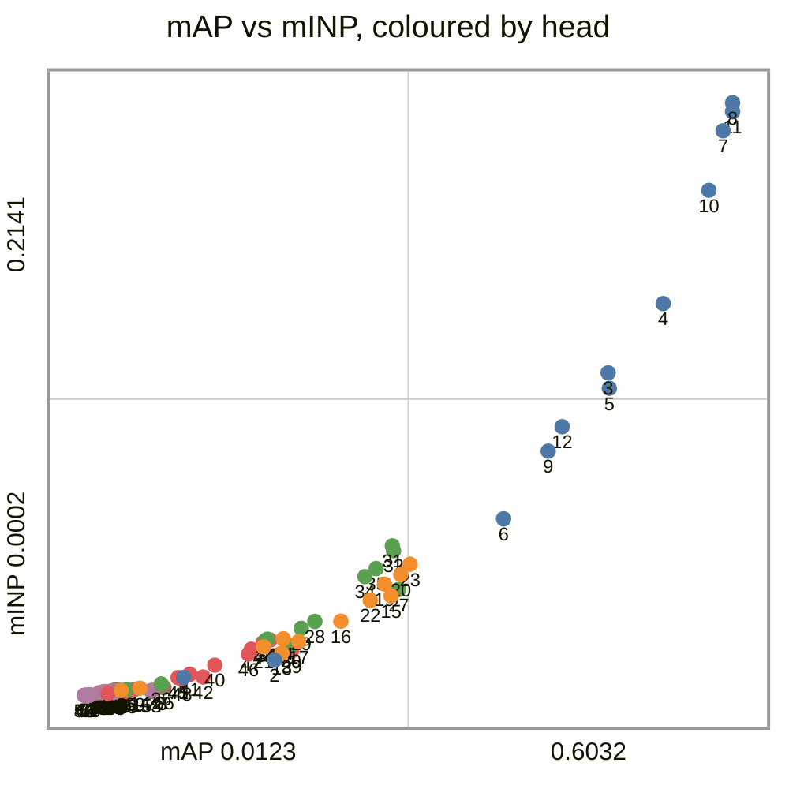
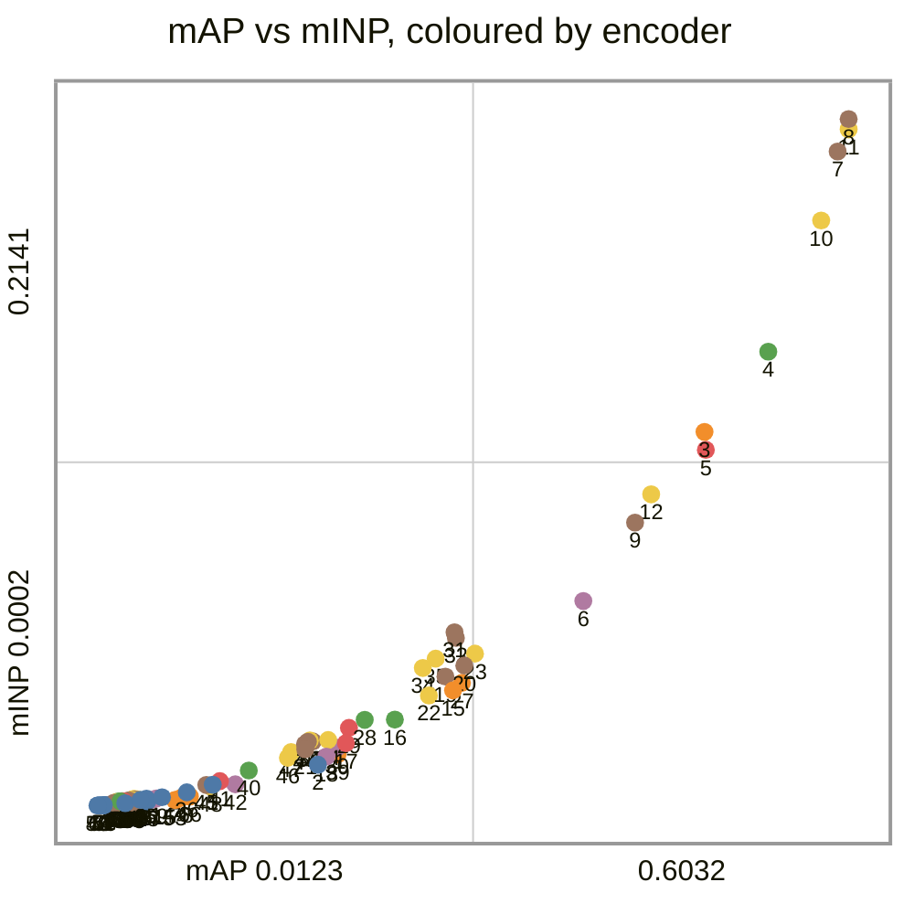
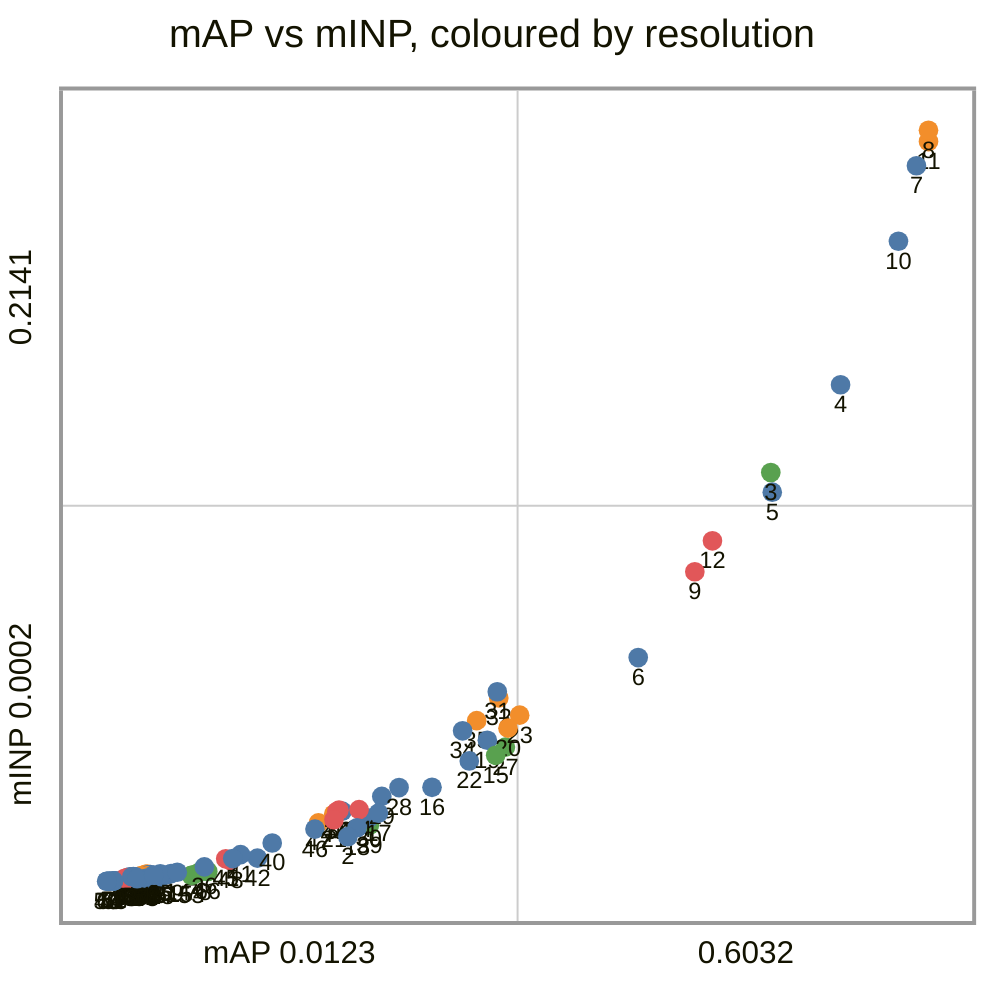

```mermaid
%%{init: {"themeVariables": {"xyChart": {"backgroundColor": "transparent", "plotColorPalette": "#4e79a7,#f28e2b,#59a14f,#e15759,#b07aa1,#9c755f,#edc948"}}, "xyChart": {"height": 1600, "width": 1320, "yAxis": {"showLabel": false}}}}%%
xychart-beta horizontal
    title "mAP, coloured by encoder"
    x-axis ["224x224 arcface vit_base_patch16_clip_224.openai crop · 10.30%", "224x224 arcface vit_base_patch16_clip_224.openai squash · 18.56%", "224x224 arcface vit_huge_plus_patch16_dinov3.lvd1689m squash · 53.99%", "224x224 arcface vit_large_patch16_dinov3.lvd1689m squash · 49.09%", "224x224 arcface vit_so400m_patch14_siglip_224.v2_webli squash · 39.45%", "224x224 arcface c-radio_v4-h squash · 59.45%", "224x224 arcface c-radio_v4-so400m squash · 58.16%", "224x224 arcface-msmt17 vit_base_patch16_clip_224.openai crop · 4.61%", "224x224 arcface-msmt17 vit_base_patch16_clip_224.openai squash · 6.30%", "224x224 arcface-msmt17 vit_huge_plus_patch16_dinov3.lvd1689m squash · 24.62%", "224x224 arcface-msmt17 vit_large_patch16_dinov3.lvd1689m squash · 20.77%", "224x224 arcface-msmt17 vit_so400m_patch14_siglip_224.v2_webli squash · 19.23%", "224x224 arcface-msmt17 c-radio_v4-h squash · 28.60%", "224x224 arcface-msmt17 c-radio_v4-so400m squash · 27.30%", "224x224 linear vit_base_patch16_clip_224.openai crop · 5.08%", "224x224 linear vit_base_patch16_clip_224.openai squash · 8.25%", "224x224 linear vit_huge_plus_patch16_dinov3.lvd1689m squash · 22.25%", "224x224 linear vit_large_patch16_dinov3.lvd1689m squash · 21.01%", "224x224 linear vit_so400m_patch14_siglip_224.v2_webli squash · 20.07%", "224x224 linear c-radio_v4-h squash · 29.32%", "224x224 linear c-radio_v4-so400m squash · 26.82%", "224x224 linear-msmt17 vit_base_patch16_clip_224.openai crop · 3.41%", "224x224 linear-msmt17 vit_base_patch16_clip_224.openai squash · 5.14%", "224x224 linear-msmt17 vit_huge_plus_patch16_dinov3.lvd1689m squash · 13.13%", "224x224 linear-msmt17 vit_large_patch16_dinov3.lvd1689m squash · 10.86%", "224x224 linear-msmt17 vit_so400m_patch14_siglip_224.v2_webli squash · 12.07%", "224x224 linear-msmt17 c-radio_v4-h squash · 18.16%", "224x224 linear-msmt17 c-radio_v4-so400m squash · 16.20%", "224x224 none vit_base_patch16_clip_224.openai crop · 1.25%", "224x224 none vit_base_patch16_clip_224.openai crop · 1.23%", "224x224 none vit_base_patch16_clip_224.openai squash · 1.72%", "224x224 none vit_base_patch16_clip_224.openai squash · 1.69%", "224x224 none vit_huge_plus_patch16_dinov3.lvd1689m squash · 3.04%", "224x224 none vit_large_patch16_dinov3.lvd1689m squash · 3.31%", "224x224 none vit_so400m_patch14_siglip_224.v2_webli squash · 5.25%", "224x224 none c-radio_v4-h squash · 4.04%", "224x224 none c-radio_v4-so400m squash · 4.21%", "224x224 pca vit_base_patch16_clip_224.openai crop · 1.41%", "224x224 pca vit_base_patch16_clip_224.openai squash · 1.79%", "224x224 pca vit_huge_plus_patch16_dinov3.lvd1689m squash · 3.14%", "224x224 pca vit_large_patch16_dinov3.lvd1689m squash · 3.28%", "224x224 pca vit_so400m_patch14_siglip_224.v2_webli squash · 5.85%", "224x224 pca c-radio_v4-h squash · 4.21%", "224x224 pca c-radio_v4-so400m squash · 4.36%", "224x224 pca-msmt17 vit_base_patch16_clip_224.openai crop · 1.40%", "224x224 pca-msmt17 vit_base_patch16_clip_224.openai squash · 1.86%", "224x224 pca-msmt17 vit_huge_plus_patch16_dinov3.lvd1689m squash · 2.89%", "224x224 pca-msmt17 vit_large_patch16_dinov3.lvd1689m squash · 3.28%", "224x224 pca-msmt17 vit_so400m_patch14_siglip_224.v2_webli squash · 5.56%", "224x224 pca-msmt17 c-radio_v4-h squash · 4.00%", "224x224 pca-msmt17 c-radio_v4-so400m squash · 4.17%", "256x128 arcface c-radio_v4-h squash · 60.32%", "256x128 arcface c-radio_v4-so400m squash · 60.32%", "256x128 arcface-msmt17 c-radio_v4-h squash · 30.08%", "256x128 arcface-msmt17 c-radio_v4-so400m squash · 30.92%", "256x128 linear c-radio_v4-h squash · 29.42%", "256x128 linear c-radio_v4-so400m squash · 27.83%", "256x128 linear-msmt17 c-radio_v4-h squash · 17.55%", "256x128 linear-msmt17 c-radio_v4-so400m squash · 16.45%", "256x128 none c-radio_v4-h squash · 3.83%", "256x128 none c-radio_v4-so400m squash · 4.11%", "256x128 pca c-radio_v4-h squash · 3.80%", "256x128 pca c-radio_v4-so400m squash · 4.14%", "256x128 pca-msmt17 c-radio_v4-h squash · 3.72%", "256x128 pca-msmt17 c-radio_v4-so400m squash · 4.02%", "256x256 arcface vit_giantopt_patch16_siglip_256.v2_webli squash · 48.98%", "256x256 arcface-msmt17 vit_giantopt_patch16_siglip_256.v2_webli squash · 29.19%", "256x256 linear vit_giantopt_patch16_siglip_256.v2_webli squash · 29.90%", "256x256 linear-msmt17 vit_giantopt_patch16_siglip_256.v2_webli squash · 20.11%", "256x256 none vit_giantopt_patch16_siglip_256.v2_webli squash · 7.30%", "256x256 none vit_giantopt_patch16_siglip_256.v2_webli squash · 7.43%", "256x256 pca vit_giantopt_patch16_siglip_256.v2_webli squash · 8.49%", "256x256 pca-msmt17 vit_giantopt_patch16_siglip_256.v2_webli squash · 7.83%", "native arcface c-radio_v4-h squash · 43.52%", "native arcface c-radio_v4-so400m squash · 44.78%", "native arcface-msmt17 c-radio_v4-h squash · 17.57%", "native arcface-msmt17 c-radio_v4-so400m squash · 19.37%", "native linear c-radio_v4-h squash · 17.78%", "native linear c-radio_v4-so400m squash · 17.93%", "native linear-msmt17 c-radio_v4-h squash · 9.78%", "native linear-msmt17 c-radio_v4-so400m squash · 10.13%", "native none c-radio_v4-h squash · 2.60%", "native none c-radio_v4-so400m squash · 2.79%", "native pca c-radio_v4-h squash · 2.63%", "native pca c-radio_v4-so400m squash · 2.89%", "native pca-msmt17 c-radio_v4-h squash · 2.48%", "native pca-msmt17 c-radio_v4-so400m squash · 2.69%"]
    y-axis "mAP (%)" 0 --> 63.33
    bar [10.30, 18.56, 0.00, 0.00, 0.00, 0.00, 0.00, 4.61, 6.30, 0.00, 0.00, 0.00, 0.00, 0.00, 5.08, 8.25, 0.00, 0.00, 0.00, 0.00, 0.00, 3.41, 5.14, 0.00, 0.00, 0.00, 0.00, 0.00, 1.25, 1.23, 1.72, 1.69, 0.00, 0.00, 0.00, 0.00, 0.00, 1.41, 1.79, 0.00, 0.00, 0.00, 0.00, 0.00, 1.40, 1.86, 0.00, 0.00, 0.00, 0.00, 0.00, 0.00, 0.00, 0.00, 0.00, 0.00, 0.00, 0.00, 0.00, 0.00, 0.00, 0.00, 0.00, 0.00, 0.00, 0.00, 0.00, 0.00, 0.00, 0.00, 0.00, 0.00, 0.00, 0.00, 0.00, 0.00, 0.00, 0.00, 0.00, 0.00, 0.00, 0.00, 0.00, 0.00, 0.00, 0.00, 0.00]
    bar [0.00, 0.00, 0.00, 0.00, 0.00, 0.00, 0.00, 0.00, 0.00, 0.00, 0.00, 0.00, 0.00, 0.00, 0.00, 0.00, 0.00, 0.00, 0.00, 0.00, 0.00, 0.00, 0.00, 0.00, 0.00, 0.00, 0.00, 0.00, 0.00, 0.00, 0.00, 0.00, 0.00, 0.00, 0.00, 0.00, 0.00, 0.00, 0.00, 0.00, 0.00, 0.00, 0.00, 0.00, 0.00, 0.00, 0.00, 0.00, 0.00, 0.00, 0.00, 0.00, 0.00, 0.00, 0.00, 0.00, 0.00, 0.00, 0.00, 0.00, 0.00, 0.00, 0.00, 0.00, 0.00, 48.98, 29.19, 29.90, 20.11, 7.30, 7.43, 8.49, 7.83, 0.00, 0.00, 0.00, 0.00, 0.00, 0.00, 0.00, 0.00, 0.00, 0.00, 0.00, 0.00, 0.00, 0.00]
    bar [0.00, 0.00, 53.99, 0.00, 0.00, 0.00, 0.00, 0.00, 0.00, 24.62, 0.00, 0.00, 0.00, 0.00, 0.00, 0.00, 22.25, 0.00, 0.00, 0.00, 0.00, 0.00, 0.00, 13.13, 0.00, 0.00, 0.00, 0.00, 0.00, 0.00, 0.00, 0.00, 3.04, 0.00, 0.00, 0.00, 0.00, 0.00, 0.00, 3.14, 0.00, 0.00, 0.00, 0.00, 0.00, 0.00, 2.89, 0.00, 0.00, 0.00, 0.00, 0.00, 0.00, 0.00, 0.00, 0.00, 0.00, 0.00, 0.00, 0.00, 0.00, 0.00, 0.00, 0.00, 0.00, 0.00, 0.00, 0.00, 0.00, 0.00, 0.00, 0.00, 0.00, 0.00, 0.00, 0.00, 0.00, 0.00, 0.00, 0.00, 0.00, 0.00, 0.00, 0.00, 0.00, 0.00, 0.00]
    bar [0.00, 0.00, 0.00, 49.09, 0.00, 0.00, 0.00, 0.00, 0.00, 0.00, 20.77, 0.00, 0.00, 0.00, 0.00, 0.00, 0.00, 21.01, 0.00, 0.00, 0.00, 0.00, 0.00, 0.00, 10.86, 0.00, 0.00, 0.00, 0.00, 0.00, 0.00, 0.00, 0.00, 3.31, 0.00, 0.00, 0.00, 0.00, 0.00, 0.00, 3.28, 0.00, 0.00, 0.00, 0.00, 0.00, 0.00, 3.28, 0.00, 0.00, 0.00, 0.00, 0.00, 0.00, 0.00, 0.00, 0.00, 0.00, 0.00, 0.00, 0.00, 0.00, 0.00, 0.00, 0.00, 0.00, 0.00, 0.00, 0.00, 0.00, 0.00, 0.00, 0.00, 0.00, 0.00, 0.00, 0.00, 0.00, 0.00, 0.00, 0.00, 0.00, 0.00, 0.00, 0.00, 0.00, 0.00]
    bar [0.00, 0.00, 0.00, 0.00, 39.45, 0.00, 0.00, 0.00, 0.00, 0.00, 0.00, 19.23, 0.00, 0.00, 0.00, 0.00, 0.00, 0.00, 20.07, 0.00, 0.00, 0.00, 0.00, 0.00, 0.00, 12.07, 0.00, 0.00, 0.00, 0.00, 0.00, 0.00, 0.00, 0.00, 5.25, 0.00, 0.00, 0.00, 0.00, 0.00, 0.00, 5.85, 0.00, 0.00, 0.00, 0.00, 0.00, 0.00, 5.56, 0.00, 0.00, 0.00, 0.00, 0.00, 0.00, 0.00, 0.00, 0.00, 0.00, 0.00, 0.00, 0.00, 0.00, 0.00, 0.00, 0.00, 0.00, 0.00, 0.00, 0.00, 0.00, 0.00, 0.00, 0.00, 0.00, 0.00, 0.00, 0.00, 0.00, 0.00, 0.00, 0.00, 0.00, 0.00, 0.00, 0.00, 0.00]
    bar [0.00, 0.00, 0.00, 0.00, 0.00, 59.45, 0.00, 0.00, 0.00, 0.00, 0.00, 0.00, 28.60, 0.00, 0.00, 0.00, 0.00, 0.00, 0.00, 29.32, 0.00, 0.00, 0.00, 0.00, 0.00, 0.00, 18.16, 0.00, 0.00, 0.00, 0.00, 0.00, 0.00, 0.00, 0.00, 4.04, 0.00, 0.00, 0.00, 0.00, 0.00, 0.00, 4.21, 0.00, 0.00, 0.00, 0.00, 0.00, 0.00, 4.00, 0.00, 60.32, 0.00, 30.08, 0.00, 29.42, 0.00, 17.55, 0.00, 3.83, 0.00, 3.80, 0.00, 3.72, 0.00, 0.00, 0.00, 0.00, 0.00, 0.00, 0.00, 0.00, 0.00, 43.52, 0.00, 17.57, 0.00, 17.78, 0.00, 9.78, 0.00, 2.60, 0.00, 2.63, 0.00, 2.48, 0.00]
    bar [0.00, 0.00, 0.00, 0.00, 0.00, 0.00, 58.16, 0.00, 0.00, 0.00, 0.00, 0.00, 0.00, 27.30, 0.00, 0.00, 0.00, 0.00, 0.00, 0.00, 26.82, 0.00, 0.00, 0.00, 0.00, 0.00, 0.00, 16.20, 0.00, 0.00, 0.00, 0.00, 0.00, 0.00, 0.00, 0.00, 4.21, 0.00, 0.00, 0.00, 0.00, 0.00, 0.00, 4.36, 0.00, 0.00, 0.00, 0.00, 0.00, 0.00, 4.17, 0.00, 60.32, 0.00, 30.92, 0.00, 27.83, 0.00, 16.45, 0.00, 4.11, 0.00, 4.14, 0.00, 4.02, 0.00, 0.00, 0.00, 0.00, 0.00, 0.00, 0.00, 0.00, 0.00, 44.78, 0.00, 19.37, 0.00, 17.93, 0.00, 10.13, 0.00, 2.79, 0.00, 2.89, 0.00, 2.69]
```

<!-- generated by `reidbench render`; edit the runs, not this file -->

# market1501-500k

[← table.md](../table.md)

## market1501/official+500k@1

### 🟦 arcface

|  # | encoder                                       | resolution | resize |        mAP |         R1 |         R5 |        R10 |       mINP |
|---:|-----------------------------------------------|------------|--------|-----------:|-----------:|-----------:|-----------:|-----------:|
|  1 | timm:vit_base_patch16_clip_224.openai         | 224x224    | crop   |     0.1030 |     0.2607 |     0.4403 |     0.5223 |     0.0066 |
|  2 | timm:vit_base_patch16_clip_224.openai         | 224x224    | squash |     0.1856 |     0.4255 |     0.6336 |     0.7046 |     0.0129 |
|  3 | timm:vit_giantopt_patch16_siglip_256.v2_webli | 256x256    | squash |     0.4898 |     0.7328 |     0.8578 |     0.8955 |     0.1166 |
|  4 | timm:vit_huge_plus_patch16_dinov3.lvd1689m    | 224x224    | squash |     0.5399 |     0.7880 |     0.9094 |     0.9347 |     0.1416 |
|  5 | timm:vit_large_patch16_dinov3.lvd1689m        | 224x224    | squash |     0.4909 |     0.7559 |     0.8845 |     0.9201 |     0.1110 |
|  6 | timm:vit_so400m_patch14_siglip_224.v2_webli   | 224x224    | squash |     0.3945 |     0.6657 |     0.8135 |     0.8622 |     0.0639 |
|  7 | torchhub:NVlabs/RADIO/c-radio_v4-h            | 224x224    | squash |     0.5945 |     0.8135 |     0.9097 |     0.9382 |     0.2040 |
|  8 | torchhub:NVlabs/RADIO/c-radio_v4-h            | 256x128    | squash |     0.6032 |     0.8165 | **0.9192** | **0.9454** | **0.2141** |
|  9 | torchhub:NVlabs/RADIO/c-radio_v4-h            | native     | squash |     0.4352 |     0.7022 |     0.8610 |     0.8982 |     0.0883 |
| 10 | torchhub:NVlabs/RADIO/c-radio_v4-so400m       | 224x224    | squash |     0.5816 |     0.8076 |     0.9074 |     0.9385 |     0.1825 |
| 11 | torchhub:NVlabs/RADIO/c-radio_v4-so400m       | 256x128    | squash | **0.6032** | **0.8174** |     0.9181 |     0.9439 |     0.2109 |
| 12 | torchhub:NVlabs/RADIO/c-radio_v4-so400m       | native     | squash |     0.4478 |     0.7197 |     0.8512 |     0.8925 |     0.0971 |

### 🟧 arcface-msmt17

|  # | encoder                                       | resolution | resize |        mAP |         R1 |         R5 |        R10 |       mINP |
|---:|-----------------------------------------------|------------|--------|-----------:|-----------:|-----------:|-----------:|-----------:|
| 13 | timm:vit_base_patch16_clip_224.openai         | 224x224    | crop   |     0.0461 |     0.1520 |     0.2738 |     0.3355 |     0.0019 |
| 14 | timm:vit_base_patch16_clip_224.openai         | 224x224    | squash |     0.0630 |     0.2049 |     0.3569 |     0.4237 |     0.0027 |
| 15 | timm:vit_giantopt_patch16_siglip_256.v2_webli | 256x256    | squash |     0.2919 | **0.5635** |     0.7340 |     0.7951 |     0.0360 |
| 16 | timm:vit_huge_plus_patch16_dinov3.lvd1689m    | 224x224    | squash |     0.2462 |     0.4911 |     0.6977 |     0.7732 |     0.0269 |
| 17 | timm:vit_large_patch16_dinov3.lvd1689m        | 224x224    | squash |     0.2077 |     0.4522 |     0.6568 |     0.7295 |     0.0196 |
| 18 | timm:vit_so400m_patch14_siglip_224.v2_webli   | 224x224    | squash |     0.1923 |     0.4347 |     0.6060 |     0.6743 |     0.0154 |
| 19 | torchhub:NVlabs/RADIO/c-radio_v4-h            | 224x224    | squash |     0.2860 |     0.5362 |     0.7052 |     0.7735 |     0.0403 |
| 20 | torchhub:NVlabs/RADIO/c-radio_v4-h            | 256x128    | squash |     0.3008 |     0.5606 | **0.7399** | **0.8052** |     0.0438 |
| 21 | torchhub:NVlabs/RADIO/c-radio_v4-h            | native     | squash |     0.1757 |     0.3890 |     0.5894 |     0.6642 |     0.0177 |
| 22 | torchhub:NVlabs/RADIO/c-radio_v4-so400m       | 224x224    | squash |     0.2730 |     0.5232 |     0.7055 |     0.7699 |     0.0345 |
| 23 | torchhub:NVlabs/RADIO/c-radio_v4-so400m       | 256x128    | squash | **0.3092** |     0.5606 |     0.7372 |     0.8020 | **0.0475** |
| 24 | torchhub:NVlabs/RADIO/c-radio_v4-so400m       | native     | squash |     0.1937 |     0.4166 |     0.6063 |     0.6951 |     0.0206 |

### 🟩 linear

|  # | encoder                                       | resolution | resize |        mAP |         R1 |         R5 |        R10 |       mINP |
|---:|-----------------------------------------------|------------|--------|-----------:|-----------:|-----------:|-----------:|-----------:|
| 25 | timm:vit_base_patch16_clip_224.openai         | 224x224    | crop   |     0.0508 |     0.1464 |     0.2803 |     0.3572 |     0.0023 |
| 26 | timm:vit_base_patch16_clip_224.openai         | 224x224    | squash |     0.0825 |     0.2271 |     0.3893 |     0.4724 |     0.0043 |
| 27 | timm:vit_giantopt_patch16_siglip_256.v2_webli | 256x256    | squash | **0.2990** | **0.5537** | **0.7295** | **0.7904** |     0.0384 |
| 28 | timm:vit_huge_plus_patch16_dinov3.lvd1689m    | 224x224    | squash |     0.2225 |     0.4409 |     0.6568 |     0.7313 |     0.0269 |
| 29 | timm:vit_large_patch16_dinov3.lvd1689m        | 224x224    | squash |     0.2101 |     0.4192 |     0.6351 |     0.7230 |     0.0243 |
| 30 | timm:vit_so400m_patch14_siglip_224.v2_webli   | 224x224    | squash |     0.2007 |     0.4273 |     0.6161 |     0.6948 |     0.0182 |
| 31 | torchhub:NVlabs/RADIO/c-radio_v4-h            | 224x224    | squash |     0.2932 |     0.4970 |     0.7123 |     0.7827 | **0.0542** |
| 32 | torchhub:NVlabs/RADIO/c-radio_v4-h            | 256x128    | squash |     0.2942 |     0.5083 |     0.7129 |     0.7886 |     0.0524 |
| 33 | torchhub:NVlabs/RADIO/c-radio_v4-h            | native     | squash |     0.1778 |     0.3545 |     0.5778 |     0.6612 |     0.0200 |
| 34 | torchhub:NVlabs/RADIO/c-radio_v4-so400m       | 224x224    | squash |     0.2682 |     0.4855 |     0.6862 |     0.7589 |     0.0430 |
| 35 | torchhub:NVlabs/RADIO/c-radio_v4-so400m       | 256x128    | squash |     0.2783 |     0.4923 |     0.7022 |     0.7776 |     0.0459 |
| 36 | torchhub:NVlabs/RADIO/c-radio_v4-so400m       | native     | squash |     0.1793 |     0.3664 |     0.5784 |     0.6621 |     0.0204 |

### 🟥 linear-msmt17

|  # | encoder                                       | resolution | resize |        mAP |         R1 |         R5 |        R10 |       mINP |
|---:|-----------------------------------------------|------------|--------|-----------:|-----------:|-----------:|-----------:|-----------:|
| 37 | timm:vit_base_patch16_clip_224.openai         | 224x224    | crop   |     0.0341 |     0.1173 |     0.2322 |     0.2847 |     0.0009 |
| 38 | timm:vit_base_patch16_clip_224.openai         | 224x224    | squash |     0.0514 |     0.1746 |     0.3073 |     0.3842 |     0.0014 |
| 39 | timm:vit_giantopt_patch16_siglip_256.v2_webli | 256x256    | squash | **0.2011** | **0.4477** | **0.6330** | **0.7037** |     0.0161 |
| 40 | timm:vit_huge_plus_patch16_dinov3.lvd1689m    | 224x224    | squash |     0.1313 |     0.3254 |     0.5071 |     0.5808 |     0.0111 |
| 41 | timm:vit_large_patch16_dinov3.lvd1689m        | 224x224    | squash |     0.1086 |     0.2827 |     0.4543 |     0.5341 |     0.0077 |
| 42 | timm:vit_so400m_patch14_siglip_224.v2_webli   | 224x224    | squash |     0.1207 |     0.3156 |     0.4869 |     0.5641 |     0.0068 |
| 43 | torchhub:NVlabs/RADIO/c-radio_v4-h            | 224x224    | squash |     0.1816 |     0.3830 |     0.5677 |     0.6446 | **0.0201** |
| 44 | torchhub:NVlabs/RADIO/c-radio_v4-h            | 256x128    | squash |     0.1755 |     0.3795 |     0.5674 |     0.6505 |     0.0193 |
| 45 | torchhub:NVlabs/RADIO/c-radio_v4-h            | native     | squash |     0.0978 |     0.2491 |     0.4243 |     0.5048 |     0.0066 |
| 46 | torchhub:NVlabs/RADIO/c-radio_v4-so400m       | 224x224    | squash |     0.1620 |     0.3649 |     0.5442 |     0.6262 |     0.0150 |
| 47 | torchhub:NVlabs/RADIO/c-radio_v4-so400m       | 256x128    | squash |     0.1645 |     0.3646 |     0.5487 |     0.6324 |     0.0168 |
| 48 | torchhub:NVlabs/RADIO/c-radio_v4-so400m       | native     | squash |     0.1013 |     0.2604 |     0.4400 |     0.5202 |     0.0061 |

### 🟪 none

|  # | encoder                                       | resolution | resize |        mAP |         R1 |         R5 |        R10 |       mINP |
|---:|-----------------------------------------------|------------|--------|-----------:|-----------:|-----------:|-----------:|-----------:|
| 49 | timm:vit_base_patch16_clip_224.openai         | 224x224    | crop   |     0.0125 |     0.0582 |     0.1211 |     0.1565 |     0.0002 |
| 50 | timm:vit_base_patch16_clip_224.openai         | 224x224    | crop   |     0.0123 |     0.0567 |     0.1197 |     0.1544 |     0.0002 |
| 51 | timm:vit_base_patch16_clip_224.openai         | 224x224    | squash |     0.0172 |     0.0766 |     0.1594 |     0.2087 |     0.0003 |
| 52 | timm:vit_base_patch16_clip_224.openai         | 224x224    | squash |     0.0169 |     0.0760 |     0.1568 |     0.2081 |     0.0003 |
| 53 | timm:vit_giantopt_patch16_siglip_256.v2_webli | 256x256    | squash |     0.0730 |     0.2536 |     0.4044 |     0.4712 |     0.0019 |
| 54 | timm:vit_giantopt_patch16_siglip_256.v2_webli | 256x256    | squash | **0.0743** | **0.2574** | **0.4109** | **0.4730** | **0.0019** |
| 55 | timm:vit_huge_plus_patch16_dinov3.lvd1689m    | 224x224    | squash |     0.0304 |     0.1259 |     0.2144 |     0.2675 |     0.0015 |
| 56 | timm:vit_large_patch16_dinov3.lvd1689m        | 224x224    | squash |     0.0331 |     0.1244 |     0.2209 |     0.2738 |     0.0014 |
| 57 | timm:vit_so400m_patch14_siglip_224.v2_webli   | 224x224    | squash |     0.0525 |     0.1850 |     0.3230 |     0.3863 |     0.0017 |
| 58 | torchhub:NVlabs/RADIO/c-radio_v4-h            | 224x224    | squash |     0.0404 |     0.1470 |     0.2518 |     0.3150 |     0.0010 |
| 59 | torchhub:NVlabs/RADIO/c-radio_v4-h            | 256x128    | squash |     0.0383 |     0.1369 |     0.2506 |     0.3073 |     0.0015 |
| 60 | torchhub:NVlabs/RADIO/c-radio_v4-h            | native     | squash |     0.0260 |     0.1012 |     0.1930 |     0.2461 |     0.0009 |
| 61 | torchhub:NVlabs/RADIO/c-radio_v4-so400m       | 224x224    | squash |     0.0421 |     0.1476 |     0.2524 |     0.3058 |     0.0014 |
| 62 | torchhub:NVlabs/RADIO/c-radio_v4-so400m       | 256x128    | squash |     0.0411 |     0.1413 |     0.2485 |     0.3091 |     0.0017 |
| 63 | torchhub:NVlabs/RADIO/c-radio_v4-so400m       | native     | squash |     0.0279 |     0.0980 |     0.2001 |     0.2539 |     0.0012 |

### 🟫 pca

|  # | encoder                                       | resolution | resize |        mAP |         R1 |         R5 |        R10 |       mINP |
|---:|-----------------------------------------------|------------|--------|-----------:|-----------:|-----------:|-----------:|-----------:|
| 64 | timm:vit_base_patch16_clip_224.openai         | 224x224    | crop   |     0.0141 |     0.0632 |     0.1235 |     0.1666 |     0.0002 |
| 65 | timm:vit_base_patch16_clip_224.openai         | 224x224    | squash |     0.0179 |     0.0787 |     0.1482 |     0.1948 |     0.0002 |
| 66 | timm:vit_giantopt_patch16_siglip_256.v2_webli | 256x256    | squash | **0.0849** | **0.2723** | **0.4186** | **0.4855** | **0.0030** |
| 67 | timm:vit_huge_plus_patch16_dinov3.lvd1689m    | 224x224    | squash |     0.0314 |     0.1274 |     0.2126 |     0.2586 |     0.0015 |
| 68 | timm:vit_large_patch16_dinov3.lvd1689m        | 224x224    | squash |     0.0328 |     0.1238 |     0.2126 |     0.2586 |     0.0013 |
| 69 | timm:vit_so400m_patch14_siglip_224.v2_webli   | 224x224    | squash |     0.0585 |     0.1897 |     0.3195 |     0.3795 |     0.0024 |
| 70 | torchhub:NVlabs/RADIO/c-radio_v4-h            | 224x224    | squash |     0.0421 |     0.1449 |     0.2423 |     0.2963 |     0.0020 |
| 71 | torchhub:NVlabs/RADIO/c-radio_v4-h            | 256x128    | squash |     0.0380 |     0.1318 |     0.2304 |     0.2901 |     0.0017 |
| 72 | torchhub:NVlabs/RADIO/c-radio_v4-h            | native     | squash |     0.0263 |     0.0983 |     0.1897 |     0.2396 |     0.0010 |
| 73 | torchhub:NVlabs/RADIO/c-radio_v4-so400m       | 224x224    | squash |     0.0436 |     0.1467 |     0.2417 |     0.2951 |     0.0020 |
| 74 | torchhub:NVlabs/RADIO/c-radio_v4-so400m       | 256x128    | squash |     0.0414 |     0.1327 |     0.2369 |     0.2841 |     0.0022 |
| 75 | torchhub:NVlabs/RADIO/c-radio_v4-so400m       | native     | squash |     0.0289 |     0.1004 |     0.1885 |     0.2414 |     0.0012 |

### 🟨 pca-msmt17

|  # | encoder                                       | resolution | resize |        mAP |         R1 |         R5 |        R10 |       mINP |
|---:|-----------------------------------------------|------------|--------|-----------:|-----------:|-----------:|-----------:|-----------:|
| 76 | timm:vit_base_patch16_clip_224.openai         | 224x224    | crop   |     0.0140 |     0.0629 |     0.1259 |     0.1695 |     0.0002 |
| 77 | timm:vit_base_patch16_clip_224.openai         | 224x224    | squash |     0.0186 |     0.0825 |     0.1588 |     0.2075 |     0.0003 |
| 78 | timm:vit_giantopt_patch16_siglip_256.v2_webli | 256x256    | squash | **0.0783** | **0.2595** | **0.4065** | **0.4679** | **0.0026** |
| 79 | timm:vit_huge_plus_patch16_dinov3.lvd1689m    | 224x224    | squash |     0.0289 |     0.1185 |     0.2031 |     0.2512 |     0.0014 |
| 80 | timm:vit_large_patch16_dinov3.lvd1689m        | 224x224    | squash |     0.0328 |     0.1232 |     0.2117 |     0.2684 |     0.0014 |
| 81 | timm:vit_so400m_patch14_siglip_224.v2_webli   | 224x224    | squash |     0.0556 |     0.1865 |     0.3260 |     0.3893 |     0.0020 |
| 82 | torchhub:NVlabs/RADIO/c-radio_v4-h            | 224x224    | squash |     0.0400 |     0.1422 |     0.2426 |     0.3023 |     0.0013 |
| 83 | torchhub:NVlabs/RADIO/c-radio_v4-h            | 256x128    | squash |     0.0372 |     0.1295 |     0.2372 |     0.2954 |     0.0018 |
| 84 | torchhub:NVlabs/RADIO/c-radio_v4-h            | native     | squash |     0.0248 |     0.0926 |     0.1862 |     0.2346 |     0.0010 |
| 85 | torchhub:NVlabs/RADIO/c-radio_v4-so400m       | 224x224    | squash |     0.0417 |     0.1422 |     0.2470 |     0.2969 |     0.0017 |
| 86 | torchhub:NVlabs/RADIO/c-radio_v4-so400m       | 256x128    | squash |     0.0402 |     0.1366 |     0.2396 |     0.2963 |     0.0021 |
| 87 | torchhub:NVlabs/RADIO/c-radio_v4-so400m       | native     | squash |     0.0269 |     0.0944 |     0.1885 |     0.2444 |     0.0012 |

### Every row, by encoder and resolution

```mermaid
%%{init: {"themeVariables": {"xyChart": {"backgroundColor": "transparent", "plotColorPalette": "#4e79a7,#f28e2b,#59a14f,#e15759,#b07aa1,#9c755f,#edc948"}}, "xyChart": {"height": 1600, "width": 1320, "yAxis": {"showLabel": false}}}}%%
xychart-beta horizontal
    title "mAP, coloured by head"
    x-axis ["vit_base_patch16_clip_224.openai 224x224 arcface crop · 10.30%", "vit_base_patch16_clip_224.openai 224x224 arcface squash · 18.56%", "vit_base_patch16_clip_224.openai 224x224 arcface-msmt17 crop · 4.61%", "vit_base_patch16_clip_224.openai 224x224 arcface-msmt17 squash · 6.30%", "vit_base_patch16_clip_224.openai 224x224 linear crop · 5.08%", "vit_base_patch16_clip_224.openai 224x224 linear squash · 8.25%", "vit_base_patch16_clip_224.openai 224x224 linear-msmt17 crop · 3.41%", "vit_base_patch16_clip_224.openai 224x224 linear-msmt17 squash · 5.14%", "vit_base_patch16_clip_224.openai 224x224 none crop · 1.25%", "vit_base_patch16_clip_224.openai 224x224 none crop · 1.23%", "vit_base_patch16_clip_224.openai 224x224 none squash · 1.72%", "vit_base_patch16_clip_224.openai 224x224 none squash · 1.69%", "vit_base_patch16_clip_224.openai 224x224 pca crop · 1.41%", "vit_base_patch16_clip_224.openai 224x224 pca squash · 1.79%", "vit_base_patch16_clip_224.openai 224x224 pca-msmt17 crop · 1.40%", "vit_base_patch16_clip_224.openai 224x224 pca-msmt17 squash · 1.86%", "vit_giantopt_patch16_siglip_256.v2_webli 256x256 arcface squash · 48.98%", "vit_giantopt_patch16_siglip_256.v2_webli 256x256 arcface-msmt17 squash · 29.19%", "vit_giantopt_patch16_siglip_256.v2_webli 256x256 linear squash · 29.90%", "vit_giantopt_patch16_siglip_256.v2_webli 256x256 linear-msmt17 squash · 20.11%", "vit_giantopt_patch16_siglip_256.v2_webli 256x256 none squash · 7.30%", "vit_giantopt_patch16_siglip_256.v2_webli 256x256 none squash · 7.43%", "vit_giantopt_patch16_siglip_256.v2_webli 256x256 pca squash · 8.49%", "vit_giantopt_patch16_siglip_256.v2_webli 256x256 pca-msmt17 squash · 7.83%", "vit_huge_plus_patch16_dinov3.lvd1689m 224x224 arcface squash · 53.99%", "vit_huge_plus_patch16_dinov3.lvd1689m 224x224 arcface-msmt17 squash · 24.62%", "vit_huge_plus_patch16_dinov3.lvd1689m 224x224 linear squash · 22.25%", "vit_huge_plus_patch16_dinov3.lvd1689m 224x224 linear-msmt17 squash · 13.13%", "vit_huge_plus_patch16_dinov3.lvd1689m 224x224 none squash · 3.04%", "vit_huge_plus_patch16_dinov3.lvd1689m 224x224 pca squash · 3.14%", "vit_huge_plus_patch16_dinov3.lvd1689m 224x224 pca-msmt17 squash · 2.89%", "vit_large_patch16_dinov3.lvd1689m 224x224 arcface squash · 49.09%", "vit_large_patch16_dinov3.lvd1689m 224x224 arcface-msmt17 squash · 20.77%", "vit_large_patch16_dinov3.lvd1689m 224x224 linear squash · 21.01%", "vit_large_patch16_dinov3.lvd1689m 224x224 linear-msmt17 squash · 10.86%", "vit_large_patch16_dinov3.lvd1689m 224x224 none squash · 3.31%", "vit_large_patch16_dinov3.lvd1689m 224x224 pca squash · 3.28%", "vit_large_patch16_dinov3.lvd1689m 224x224 pca-msmt17 squash · 3.28%", "vit_so400m_patch14_siglip_224.v2_webli 224x224 arcface squash · 39.45%", "vit_so400m_patch14_siglip_224.v2_webli 224x224 arcface-msmt17 squash · 19.23%", "vit_so400m_patch14_siglip_224.v2_webli 224x224 linear squash · 20.07%", "vit_so400m_patch14_siglip_224.v2_webli 224x224 linear-msmt17 squash · 12.07%", "vit_so400m_patch14_siglip_224.v2_webli 224x224 none squash · 5.25%", "vit_so400m_patch14_siglip_224.v2_webli 224x224 pca squash · 5.85%", "vit_so400m_patch14_siglip_224.v2_webli 224x224 pca-msmt17 squash · 5.56%", "c-radio_v4-h 224x224 arcface squash · 59.45%", "c-radio_v4-h 224x224 arcface-msmt17 squash · 28.60%", "c-radio_v4-h 224x224 linear squash · 29.32%", "c-radio_v4-h 224x224 linear-msmt17 squash · 18.16%", "c-radio_v4-h 224x224 none squash · 4.04%", "c-radio_v4-h 224x224 pca squash · 4.21%", "c-radio_v4-h 224x224 pca-msmt17 squash · 4.00%", "c-radio_v4-h 256x128 arcface squash · 60.32%", "c-radio_v4-h 256x128 arcface-msmt17 squash · 30.08%", "c-radio_v4-h 256x128 linear squash · 29.42%", "c-radio_v4-h 256x128 linear-msmt17 squash · 17.55%", "c-radio_v4-h 256x128 none squash · 3.83%", "c-radio_v4-h 256x128 pca squash · 3.80%", "c-radio_v4-h 256x128 pca-msmt17 squash · 3.72%", "c-radio_v4-h native arcface squash · 43.52%", "c-radio_v4-h native arcface-msmt17 squash · 17.57%", "c-radio_v4-h native linear squash · 17.78%", "c-radio_v4-h native linear-msmt17 squash · 9.78%", "c-radio_v4-h native none squash · 2.60%", "c-radio_v4-h native pca squash · 2.63%", "c-radio_v4-h native pca-msmt17 squash · 2.48%", "c-radio_v4-so400m 224x224 arcface squash · 58.16%", "c-radio_v4-so400m 224x224 arcface-msmt17 squash · 27.30%", "c-radio_v4-so400m 224x224 linear squash · 26.82%", "c-radio_v4-so400m 224x224 linear-msmt17 squash · 16.20%", "c-radio_v4-so400m 224x224 none squash · 4.21%", "c-radio_v4-so400m 224x224 pca squash · 4.36%", "c-radio_v4-so400m 224x224 pca-msmt17 squash · 4.17%", "c-radio_v4-so400m 256x128 arcface squash · 60.32%", "c-radio_v4-so400m 256x128 arcface-msmt17 squash · 30.92%", "c-radio_v4-so400m 256x128 linear squash · 27.83%", "c-radio_v4-so400m 256x128 linear-msmt17 squash · 16.45%", "c-radio_v4-so400m 256x128 none squash · 4.11%", "c-radio_v4-so400m 256x128 pca squash · 4.14%", "c-radio_v4-so400m 256x128 pca-msmt17 squash · 4.02%", "c-radio_v4-so400m native arcface squash · 44.78%", "c-radio_v4-so400m native arcface-msmt17 squash · 19.37%", "c-radio_v4-so400m native linear squash · 17.93%", "c-radio_v4-so400m native linear-msmt17 squash · 10.13%", "c-radio_v4-so400m native none squash · 2.79%", "c-radio_v4-so400m native pca squash · 2.89%", "c-radio_v4-so400m native pca-msmt17 squash · 2.69%"]
    y-axis "mAP (%)" 0 --> 63.33
    bar [10.30, 18.56, 0.00, 0.00, 0.00, 0.00, 0.00, 0.00, 0.00, 0.00, 0.00, 0.00, 0.00, 0.00, 0.00, 0.00, 48.98, 0.00, 0.00, 0.00, 0.00, 0.00, 0.00, 0.00, 53.99, 0.00, 0.00, 0.00, 0.00, 0.00, 0.00, 49.09, 0.00, 0.00, 0.00, 0.00, 0.00, 0.00, 39.45, 0.00, 0.00, 0.00, 0.00, 0.00, 0.00, 59.45, 0.00, 0.00, 0.00, 0.00, 0.00, 0.00, 60.32, 0.00, 0.00, 0.00, 0.00, 0.00, 0.00, 43.52, 0.00, 0.00, 0.00, 0.00, 0.00, 0.00, 58.16, 0.00, 0.00, 0.00, 0.00, 0.00, 0.00, 60.32, 0.00, 0.00, 0.00, 0.00, 0.00, 0.00, 44.78, 0.00, 0.00, 0.00, 0.00, 0.00, 0.00]
    bar [0.00, 0.00, 4.61, 6.30, 0.00, 0.00, 0.00, 0.00, 0.00, 0.00, 0.00, 0.00, 0.00, 0.00, 0.00, 0.00, 0.00, 29.19, 0.00, 0.00, 0.00, 0.00, 0.00, 0.00, 0.00, 24.62, 0.00, 0.00, 0.00, 0.00, 0.00, 0.00, 20.77, 0.00, 0.00, 0.00, 0.00, 0.00, 0.00, 19.23, 0.00, 0.00, 0.00, 0.00, 0.00, 0.00, 28.60, 0.00, 0.00, 0.00, 0.00, 0.00, 0.00, 30.08, 0.00, 0.00, 0.00, 0.00, 0.00, 0.00, 17.57, 0.00, 0.00, 0.00, 0.00, 0.00, 0.00, 27.30, 0.00, 0.00, 0.00, 0.00, 0.00, 0.00, 30.92, 0.00, 0.00, 0.00, 0.00, 0.00, 0.00, 19.37, 0.00, 0.00, 0.00, 0.00, 0.00]
    bar [0.00, 0.00, 0.00, 0.00, 5.08, 8.25, 0.00, 0.00, 0.00, 0.00, 0.00, 0.00, 0.00, 0.00, 0.00, 0.00, 0.00, 0.00, 29.90, 0.00, 0.00, 0.00, 0.00, 0.00, 0.00, 0.00, 22.25, 0.00, 0.00, 0.00, 0.00, 0.00, 0.00, 21.01, 0.00, 0.00, 0.00, 0.00, 0.00, 0.00, 20.07, 0.00, 0.00, 0.00, 0.00, 0.00, 0.00, 29.32, 0.00, 0.00, 0.00, 0.00, 0.00, 0.00, 29.42, 0.00, 0.00, 0.00, 0.00, 0.00, 0.00, 17.78, 0.00, 0.00, 0.00, 0.00, 0.00, 0.00, 26.82, 0.00, 0.00, 0.00, 0.00, 0.00, 0.00, 27.83, 0.00, 0.00, 0.00, 0.00, 0.00, 0.00, 17.93, 0.00, 0.00, 0.00, 0.00]
    bar [0.00, 0.00, 0.00, 0.00, 0.00, 0.00, 3.41, 5.14, 0.00, 0.00, 0.00, 0.00, 0.00, 0.00, 0.00, 0.00, 0.00, 0.00, 0.00, 20.11, 0.00, 0.00, 0.00, 0.00, 0.00, 0.00, 0.00, 13.13, 0.00, 0.00, 0.00, 0.00, 0.00, 0.00, 10.86, 0.00, 0.00, 0.00, 0.00, 0.00, 0.00, 12.07, 0.00, 0.00, 0.00, 0.00, 0.00, 0.00, 18.16, 0.00, 0.00, 0.00, 0.00, 0.00, 0.00, 17.55, 0.00, 0.00, 0.00, 0.00, 0.00, 0.00, 9.78, 0.00, 0.00, 0.00, 0.00, 0.00, 0.00, 16.20, 0.00, 0.00, 0.00, 0.00, 0.00, 0.00, 16.45, 0.00, 0.00, 0.00, 0.00, 0.00, 0.00, 10.13, 0.00, 0.00, 0.00]
    bar [0.00, 0.00, 0.00, 0.00, 0.00, 0.00, 0.00, 0.00, 1.25, 1.23, 1.72, 1.69, 0.00, 0.00, 0.00, 0.00, 0.00, 0.00, 0.00, 0.00, 7.30, 7.43, 0.00, 0.00, 0.00, 0.00, 0.00, 0.00, 3.04, 0.00, 0.00, 0.00, 0.00, 0.00, 0.00, 3.31, 0.00, 0.00, 0.00, 0.00, 0.00, 0.00, 5.25, 0.00, 0.00, 0.00, 0.00, 0.00, 0.00, 4.04, 0.00, 0.00, 0.00, 0.00, 0.00, 0.00, 3.83, 0.00, 0.00, 0.00, 0.00, 0.00, 0.00, 2.60, 0.00, 0.00, 0.00, 0.00, 0.00, 0.00, 4.21, 0.00, 0.00, 0.00, 0.00, 0.00, 0.00, 4.11, 0.00, 0.00, 0.00, 0.00, 0.00, 0.00, 2.79, 0.00, 0.00]
    bar [0.00, 0.00, 0.00, 0.00, 0.00, 0.00, 0.00, 0.00, 0.00, 0.00, 0.00, 0.00, 1.41, 1.79, 0.00, 0.00, 0.00, 0.00, 0.00, 0.00, 0.00, 0.00, 8.49, 0.00, 0.00, 0.00, 0.00, 0.00, 0.00, 3.14, 0.00, 0.00, 0.00, 0.00, 0.00, 0.00, 3.28, 0.00, 0.00, 0.00, 0.00, 0.00, 0.00, 5.85, 0.00, 0.00, 0.00, 0.00, 0.00, 0.00, 4.21, 0.00, 0.00, 0.00, 0.00, 0.00, 0.00, 3.80, 0.00, 0.00, 0.00, 0.00, 0.00, 0.00, 2.63, 0.00, 0.00, 0.00, 0.00, 0.00, 0.00, 4.36, 0.00, 0.00, 0.00, 0.00, 0.00, 0.00, 4.14, 0.00, 0.00, 0.00, 0.00, 0.00, 0.00, 2.89, 0.00]
    bar [0.00, 0.00, 0.00, 0.00, 0.00, 0.00, 0.00, 0.00, 0.00, 0.00, 0.00, 0.00, 0.00, 0.00, 1.40, 1.86, 0.00, 0.00, 0.00, 0.00, 0.00, 0.00, 0.00, 7.83, 0.00, 0.00, 0.00, 0.00, 0.00, 0.00, 2.89, 0.00, 0.00, 0.00, 0.00, 0.00, 0.00, 3.28, 0.00, 0.00, 0.00, 0.00, 0.00, 0.00, 5.56, 0.00, 0.00, 0.00, 0.00, 0.00, 0.00, 4.00, 0.00, 0.00, 0.00, 0.00, 0.00, 0.00, 3.72, 0.00, 0.00, 0.00, 0.00, 0.00, 0.00, 2.48, 0.00, 0.00, 0.00, 0.00, 0.00, 0.00, 4.17, 0.00, 0.00, 0.00, 0.00, 0.00, 0.00, 4.02, 0.00, 0.00, 0.00, 0.00, 0.00, 0.00, 2.69]
```

### By head — does the probe carry it?

```mermaid
%%{init: {"themeVariables": {"xyChart": {"backgroundColor": "transparent", "plotColorPalette": "#4e79a7,#f28e2b,#59a14f,#e15759,#b07aa1,#9c755f,#edc948"}}, "xyChart": {"height": 1600, "width": 1320, "yAxis": {"showLabel": false}}}}%%
xychart-beta horizontal
    title "mAP, coloured by head"
    x-axis ["arcface vit_base_patch16_clip_224.openai 224x224 crop · 10.30%", "arcface vit_base_patch16_clip_224.openai 224x224 squash · 18.56%", "arcface vit_giantopt_patch16_siglip_256.v2_webli 256x256 squash · 48.98%", "arcface vit_huge_plus_patch16_dinov3.lvd1689m 224x224 squash · 53.99%", "arcface vit_large_patch16_dinov3.lvd1689m 224x224 squash · 49.09%", "arcface vit_so400m_patch14_siglip_224.v2_webli 224x224 squash · 39.45%", "arcface c-radio_v4-h 224x224 squash · 59.45%", "arcface c-radio_v4-h 256x128 squash · 60.32%", "arcface c-radio_v4-h native squash · 43.52%", "arcface c-radio_v4-so400m 224x224 squash · 58.16%", "arcface c-radio_v4-so400m 256x128 squash · 60.32%", "arcface c-radio_v4-so400m native squash · 44.78%", "arcface-msmt17 vit_base_patch16_clip_224.openai 224x224 crop · 4.61%", "arcface-msmt17 vit_base_patch16_clip_224.openai 224x224 squash · 6.30%", "arcface-msmt17 vit_giantopt_patch16_siglip_256.v2_webli 256x256 squash · 29.19%", "arcface-msmt17 vit_huge_plus_patch16_dinov3.lvd1689m 224x224 squash · 24.62%", "arcface-msmt17 vit_large_patch16_dinov3.lvd1689m 224x224 squash · 20.77%", "arcface-msmt17 vit_so400m_patch14_siglip_224.v2_webli 224x224 squash · 19.23%", "arcface-msmt17 c-radio_v4-h 224x224 squash · 28.60%", "arcface-msmt17 c-radio_v4-h 256x128 squash · 30.08%", "arcface-msmt17 c-radio_v4-h native squash · 17.57%", "arcface-msmt17 c-radio_v4-so400m 224x224 squash · 27.30%", "arcface-msmt17 c-radio_v4-so400m 256x128 squash · 30.92%", "arcface-msmt17 c-radio_v4-so400m native squash · 19.37%", "linear vit_base_patch16_clip_224.openai 224x224 crop · 5.08%", "linear vit_base_patch16_clip_224.openai 224x224 squash · 8.25%", "linear vit_giantopt_patch16_siglip_256.v2_webli 256x256 squash · 29.90%", "linear vit_huge_plus_patch16_dinov3.lvd1689m 224x224 squash · 22.25%", "linear vit_large_patch16_dinov3.lvd1689m 224x224 squash · 21.01%", "linear vit_so400m_patch14_siglip_224.v2_webli 224x224 squash · 20.07%", "linear c-radio_v4-h 224x224 squash · 29.32%", "linear c-radio_v4-h 256x128 squash · 29.42%", "linear c-radio_v4-h native squash · 17.78%", "linear c-radio_v4-so400m 224x224 squash · 26.82%", "linear c-radio_v4-so400m 256x128 squash · 27.83%", "linear c-radio_v4-so400m native squash · 17.93%", "linear-msmt17 vit_base_patch16_clip_224.openai 224x224 crop · 3.41%", "linear-msmt17 vit_base_patch16_clip_224.openai 224x224 squash · 5.14%", "linear-msmt17 vit_giantopt_patch16_siglip_256.v2_webli 256x256 squash · 20.11%", "linear-msmt17 vit_huge_plus_patch16_dinov3.lvd1689m 224x224 squash · 13.13%", "linear-msmt17 vit_large_patch16_dinov3.lvd1689m 224x224 squash · 10.86%", "linear-msmt17 vit_so400m_patch14_siglip_224.v2_webli 224x224 squash · 12.07%", "linear-msmt17 c-radio_v4-h 224x224 squash · 18.16%", "linear-msmt17 c-radio_v4-h 256x128 squash · 17.55%", "linear-msmt17 c-radio_v4-h native squash · 9.78%", "linear-msmt17 c-radio_v4-so400m 224x224 squash · 16.20%", "linear-msmt17 c-radio_v4-so400m 256x128 squash · 16.45%", "linear-msmt17 c-radio_v4-so400m native squash · 10.13%", "none vit_base_patch16_clip_224.openai 224x224 crop · 1.25%", "none vit_base_patch16_clip_224.openai 224x224 crop · 1.23%", "none vit_base_patch16_clip_224.openai 224x224 squash · 1.72%", "none vit_base_patch16_clip_224.openai 224x224 squash · 1.69%", "none vit_giantopt_patch16_siglip_256.v2_webli 256x256 squash · 7.30%", "none vit_giantopt_patch16_siglip_256.v2_webli 256x256 squash · 7.43%", "none vit_huge_plus_patch16_dinov3.lvd1689m 224x224 squash · 3.04%", "none vit_large_patch16_dinov3.lvd1689m 224x224 squash · 3.31%", "none vit_so400m_patch14_siglip_224.v2_webli 224x224 squash · 5.25%", "none c-radio_v4-h 224x224 squash · 4.04%", "none c-radio_v4-h 256x128 squash · 3.83%", "none c-radio_v4-h native squash · 2.60%", "none c-radio_v4-so400m 224x224 squash · 4.21%", "none c-radio_v4-so400m 256x128 squash · 4.11%", "none c-radio_v4-so400m native squash · 2.79%", "pca vit_base_patch16_clip_224.openai 224x224 crop · 1.41%", "pca vit_base_patch16_clip_224.openai 224x224 squash · 1.79%", "pca vit_giantopt_patch16_siglip_256.v2_webli 256x256 squash · 8.49%", "pca vit_huge_plus_patch16_dinov3.lvd1689m 224x224 squash · 3.14%", "pca vit_large_patch16_dinov3.lvd1689m 224x224 squash · 3.28%", "pca vit_so400m_patch14_siglip_224.v2_webli 224x224 squash · 5.85%", "pca c-radio_v4-h 224x224 squash · 4.21%", "pca c-radio_v4-h 256x128 squash · 3.80%", "pca c-radio_v4-h native squash · 2.63%", "pca c-radio_v4-so400m 224x224 squash · 4.36%", "pca c-radio_v4-so400m 256x128 squash · 4.14%", "pca c-radio_v4-so400m native squash · 2.89%", "pca-msmt17 vit_base_patch16_clip_224.openai 224x224 crop · 1.40%", "pca-msmt17 vit_base_patch16_clip_224.openai 224x224 squash · 1.86%", "pca-msmt17 vit_giantopt_patch16_siglip_256.v2_webli 256x256 squash · 7.83%", "pca-msmt17 vit_huge_plus_patch16_dinov3.lvd1689m 224x224 squash · 2.89%", "pca-msmt17 vit_large_patch16_dinov3.lvd1689m 224x224 squash · 3.28%", "pca-msmt17 vit_so400m_patch14_siglip_224.v2_webli 224x224 squash · 5.56%", "pca-msmt17 c-radio_v4-h 224x224 squash · 4.00%", "pca-msmt17 c-radio_v4-h 256x128 squash · 3.72%", "pca-msmt17 c-radio_v4-h native squash · 2.48%", "pca-msmt17 c-radio_v4-so400m 224x224 squash · 4.17%", "pca-msmt17 c-radio_v4-so400m 256x128 squash · 4.02%", "pca-msmt17 c-radio_v4-so400m native squash · 2.69%"]
    y-axis "mAP (%)" 0 --> 63.33
    bar [10.30, 18.56, 48.98, 53.99, 49.09, 39.45, 59.45, 60.32, 43.52, 58.16, 60.32, 44.78, 0.00, 0.00, 0.00, 0.00, 0.00, 0.00, 0.00, 0.00, 0.00, 0.00, 0.00, 0.00, 0.00, 0.00, 0.00, 0.00, 0.00, 0.00, 0.00, 0.00, 0.00, 0.00, 0.00, 0.00, 0.00, 0.00, 0.00, 0.00, 0.00, 0.00, 0.00, 0.00, 0.00, 0.00, 0.00, 0.00, 0.00, 0.00, 0.00, 0.00, 0.00, 0.00, 0.00, 0.00, 0.00, 0.00, 0.00, 0.00, 0.00, 0.00, 0.00, 0.00, 0.00, 0.00, 0.00, 0.00, 0.00, 0.00, 0.00, 0.00, 0.00, 0.00, 0.00, 0.00, 0.00, 0.00, 0.00, 0.00, 0.00, 0.00, 0.00, 0.00, 0.00, 0.00, 0.00]
    bar [0.00, 0.00, 0.00, 0.00, 0.00, 0.00, 0.00, 0.00, 0.00, 0.00, 0.00, 0.00, 4.61, 6.30, 29.19, 24.62, 20.77, 19.23, 28.60, 30.08, 17.57, 27.30, 30.92, 19.37, 0.00, 0.00, 0.00, 0.00, 0.00, 0.00, 0.00, 0.00, 0.00, 0.00, 0.00, 0.00, 0.00, 0.00, 0.00, 0.00, 0.00, 0.00, 0.00, 0.00, 0.00, 0.00, 0.00, 0.00, 0.00, 0.00, 0.00, 0.00, 0.00, 0.00, 0.00, 0.00, 0.00, 0.00, 0.00, 0.00, 0.00, 0.00, 0.00, 0.00, 0.00, 0.00, 0.00, 0.00, 0.00, 0.00, 0.00, 0.00, 0.00, 0.00, 0.00, 0.00, 0.00, 0.00, 0.00, 0.00, 0.00, 0.00, 0.00, 0.00, 0.00, 0.00, 0.00]
    bar [0.00, 0.00, 0.00, 0.00, 0.00, 0.00, 0.00, 0.00, 0.00, 0.00, 0.00, 0.00, 0.00, 0.00, 0.00, 0.00, 0.00, 0.00, 0.00, 0.00, 0.00, 0.00, 0.00, 0.00, 5.08, 8.25, 29.90, 22.25, 21.01, 20.07, 29.32, 29.42, 17.78, 26.82, 27.83, 17.93, 0.00, 0.00, 0.00, 0.00, 0.00, 0.00, 0.00, 0.00, 0.00, 0.00, 0.00, 0.00, 0.00, 0.00, 0.00, 0.00, 0.00, 0.00, 0.00, 0.00, 0.00, 0.00, 0.00, 0.00, 0.00, 0.00, 0.00, 0.00, 0.00, 0.00, 0.00, 0.00, 0.00, 0.00, 0.00, 0.00, 0.00, 0.00, 0.00, 0.00, 0.00, 0.00, 0.00, 0.00, 0.00, 0.00, 0.00, 0.00, 0.00, 0.00, 0.00]
    bar [0.00, 0.00, 0.00, 0.00, 0.00, 0.00, 0.00, 0.00, 0.00, 0.00, 0.00, 0.00, 0.00, 0.00, 0.00, 0.00, 0.00, 0.00, 0.00, 0.00, 0.00, 0.00, 0.00, 0.00, 0.00, 0.00, 0.00, 0.00, 0.00, 0.00, 0.00, 0.00, 0.00, 0.00, 0.00, 0.00, 3.41, 5.14, 20.11, 13.13, 10.86, 12.07, 18.16, 17.55, 9.78, 16.20, 16.45, 10.13, 0.00, 0.00, 0.00, 0.00, 0.00, 0.00, 0.00, 0.00, 0.00, 0.00, 0.00, 0.00, 0.00, 0.00, 0.00, 0.00, 0.00, 0.00, 0.00, 0.00, 0.00, 0.00, 0.00, 0.00, 0.00, 0.00, 0.00, 0.00, 0.00, 0.00, 0.00, 0.00, 0.00, 0.00, 0.00, 0.00, 0.00, 0.00, 0.00]
    bar [0.00, 0.00, 0.00, 0.00, 0.00, 0.00, 0.00, 0.00, 0.00, 0.00, 0.00, 0.00, 0.00, 0.00, 0.00, 0.00, 0.00, 0.00, 0.00, 0.00, 0.00, 0.00, 0.00, 0.00, 0.00, 0.00, 0.00, 0.00, 0.00, 0.00, 0.00, 0.00, 0.00, 0.00, 0.00, 0.00, 0.00, 0.00, 0.00, 0.00, 0.00, 0.00, 0.00, 0.00, 0.00, 0.00, 0.00, 0.00, 1.25, 1.23, 1.72, 1.69, 7.30, 7.43, 3.04, 3.31, 5.25, 4.04, 3.83, 2.60, 4.21, 4.11, 2.79, 0.00, 0.00, 0.00, 0.00, 0.00, 0.00, 0.00, 0.00, 0.00, 0.00, 0.00, 0.00, 0.00, 0.00, 0.00, 0.00, 0.00, 0.00, 0.00, 0.00, 0.00, 0.00, 0.00, 0.00]
    bar [0.00, 0.00, 0.00, 0.00, 0.00, 0.00, 0.00, 0.00, 0.00, 0.00, 0.00, 0.00, 0.00, 0.00, 0.00, 0.00, 0.00, 0.00, 0.00, 0.00, 0.00, 0.00, 0.00, 0.00, 0.00, 0.00, 0.00, 0.00, 0.00, 0.00, 0.00, 0.00, 0.00, 0.00, 0.00, 0.00, 0.00, 0.00, 0.00, 0.00, 0.00, 0.00, 0.00, 0.00, 0.00, 0.00, 0.00, 0.00, 0.00, 0.00, 0.00, 0.00, 0.00, 0.00, 0.00, 0.00, 0.00, 0.00, 0.00, 0.00, 0.00, 0.00, 0.00, 1.41, 1.79, 8.49, 3.14, 3.28, 5.85, 4.21, 3.80, 2.63, 4.36, 4.14, 2.89, 0.00, 0.00, 0.00, 0.00, 0.00, 0.00, 0.00, 0.00, 0.00, 0.00, 0.00, 0.00]
    bar [0.00, 0.00, 0.00, 0.00, 0.00, 0.00, 0.00, 0.00, 0.00, 0.00, 0.00, 0.00, 0.00, 0.00, 0.00, 0.00, 0.00, 0.00, 0.00, 0.00, 0.00, 0.00, 0.00, 0.00, 0.00, 0.00, 0.00, 0.00, 0.00, 0.00, 0.00, 0.00, 0.00, 0.00, 0.00, 0.00, 0.00, 0.00, 0.00, 0.00, 0.00, 0.00, 0.00, 0.00, 0.00, 0.00, 0.00, 0.00, 0.00, 0.00, 0.00, 0.00, 0.00, 0.00, 0.00, 0.00, 0.00, 0.00, 0.00, 0.00, 0.00, 0.00, 0.00, 0.00, 0.00, 0.00, 0.00, 0.00, 0.00, 0.00, 0.00, 0.00, 0.00, 0.00, 0.00, 1.40, 1.86, 7.83, 2.89, 3.28, 5.56, 4.00, 3.72, 2.48, 4.17, 4.02, 2.69]
```

### By encoder — does the checkpoint carry it?

*Colour — encoder:* 🟦 timm:vit_base_patch16_clip_224.openai · 🟧 timm:vit_giantopt_patch16_siglip_256.v2_webli · 🟩 timm:vit_huge_plus_patch16_dinov3.lvd1689m · 🟥 timm:vit_large_patch16_dinov3.lvd1689m · 🟪 timm:vit_so400m_patch14_siglip_224.v2_webli · 🟫 torchhub:NVlabs/RADIO/c-radio_v4-h · 🟨 torchhub:NVlabs/RADIO/c-radio_v4-so400m

```mermaid
%%{init: {"themeVariables": {"xyChart": {"backgroundColor": "transparent", "plotColorPalette": "#4e79a7,#f28e2b,#59a14f,#e15759,#b07aa1,#9c755f,#edc948"}}, "xyChart": {"height": 1600, "width": 1320, "yAxis": {"showLabel": false}}}}%%
xychart-beta horizontal
    title "mAP, coloured by encoder"
    x-axis ["vit_base_patch16_clip_224.openai arcface 224x224 crop · 10.30%", "vit_base_patch16_clip_224.openai arcface 224x224 squash · 18.56%", "vit_base_patch16_clip_224.openai arcface-msmt17 224x224 crop · 4.61%", "vit_base_patch16_clip_224.openai arcface-msmt17 224x224 squash · 6.30%", "vit_base_patch16_clip_224.openai linear 224x224 crop · 5.08%", "vit_base_patch16_clip_224.openai linear 224x224 squash · 8.25%", "vit_base_patch16_clip_224.openai linear-msmt17 224x224 crop · 3.41%", "vit_base_patch16_clip_224.openai linear-msmt17 224x224 squash · 5.14%", "vit_base_patch16_clip_224.openai none 224x224 crop · 1.25%", "vit_base_patch16_clip_224.openai none 224x224 crop · 1.23%", "vit_base_patch16_clip_224.openai none 224x224 squash · 1.72%", "vit_base_patch16_clip_224.openai none 224x224 squash · 1.69%", "vit_base_patch16_clip_224.openai pca 224x224 crop · 1.41%", "vit_base_patch16_clip_224.openai pca 224x224 squash · 1.79%", "vit_base_patch16_clip_224.openai pca-msmt17 224x224 crop · 1.40%", "vit_base_patch16_clip_224.openai pca-msmt17 224x224 squash · 1.86%", "vit_giantopt_patch16_siglip_256.v2_webli arcface 256x256 squash · 48.98%", "vit_giantopt_patch16_siglip_256.v2_webli arcface-msmt17 256x256 squash · 29.19%", "vit_giantopt_patch16_siglip_256.v2_webli linear 256x256 squash · 29.90%", "vit_giantopt_patch16_siglip_256.v2_webli linear-msmt17 256x256 squash · 20.11%", "vit_giantopt_patch16_siglip_256.v2_webli none 256x256 squash · 7.30%", "vit_giantopt_patch16_siglip_256.v2_webli none 256x256 squash · 7.43%", "vit_giantopt_patch16_siglip_256.v2_webli pca 256x256 squash · 8.49%", "vit_giantopt_patch16_siglip_256.v2_webli pca-msmt17 256x256 squash · 7.83%", "vit_huge_plus_patch16_dinov3.lvd1689m arcface 224x224 squash · 53.99%", "vit_huge_plus_patch16_dinov3.lvd1689m arcface-msmt17 224x224 squash · 24.62%", "vit_huge_plus_patch16_dinov3.lvd1689m linear 224x224 squash · 22.25%", "vit_huge_plus_patch16_dinov3.lvd1689m linear-msmt17 224x224 squash · 13.13%", "vit_huge_plus_patch16_dinov3.lvd1689m none 224x224 squash · 3.04%", "vit_huge_plus_patch16_dinov3.lvd1689m pca 224x224 squash · 3.14%", "vit_huge_plus_patch16_dinov3.lvd1689m pca-msmt17 224x224 squash · 2.89%", "vit_large_patch16_dinov3.lvd1689m arcface 224x224 squash · 49.09%", "vit_large_patch16_dinov3.lvd1689m arcface-msmt17 224x224 squash · 20.77%", "vit_large_patch16_dinov3.lvd1689m linear 224x224 squash · 21.01%", "vit_large_patch16_dinov3.lvd1689m linear-msmt17 224x224 squash · 10.86%", "vit_large_patch16_dinov3.lvd1689m none 224x224 squash · 3.31%", "vit_large_patch16_dinov3.lvd1689m pca 224x224 squash · 3.28%", "vit_large_patch16_dinov3.lvd1689m pca-msmt17 224x224 squash · 3.28%", "vit_so400m_patch14_siglip_224.v2_webli arcface 224x224 squash · 39.45%", "vit_so400m_patch14_siglip_224.v2_webli arcface-msmt17 224x224 squash · 19.23%", "vit_so400m_patch14_siglip_224.v2_webli linear 224x224 squash · 20.07%", "vit_so400m_patch14_siglip_224.v2_webli linear-msmt17 224x224 squash · 12.07%", "vit_so400m_patch14_siglip_224.v2_webli none 224x224 squash · 5.25%", "vit_so400m_patch14_siglip_224.v2_webli pca 224x224 squash · 5.85%", "vit_so400m_patch14_siglip_224.v2_webli pca-msmt17 224x224 squash · 5.56%", "c-radio_v4-h arcface 224x224 squash · 59.45%", "c-radio_v4-h arcface 256x128 squash · 60.32%", "c-radio_v4-h arcface native squash · 43.52%", "c-radio_v4-h arcface-msmt17 224x224 squash · 28.60%", "c-radio_v4-h arcface-msmt17 256x128 squash · 30.08%", "c-radio_v4-h arcface-msmt17 native squash · 17.57%", "c-radio_v4-h linear 224x224 squash · 29.32%", "c-radio_v4-h linear 256x128 squash · 29.42%", "c-radio_v4-h linear native squash · 17.78%", "c-radio_v4-h linear-msmt17 224x224 squash · 18.16%", "c-radio_v4-h linear-msmt17 256x128 squash · 17.55%", "c-radio_v4-h linear-msmt17 native squash · 9.78%", "c-radio_v4-h none 224x224 squash · 4.04%", "c-radio_v4-h none 256x128 squash · 3.83%", "c-radio_v4-h none native squash · 2.60%", "c-radio_v4-h pca 224x224 squash · 4.21%", "c-radio_v4-h pca 256x128 squash · 3.80%", "c-radio_v4-h pca native squash · 2.63%", "c-radio_v4-h pca-msmt17 224x224 squash · 4.00%", "c-radio_v4-h pca-msmt17 256x128 squash · 3.72%", "c-radio_v4-h pca-msmt17 native squash · 2.48%", "c-radio_v4-so400m arcface 224x224 squash · 58.16%", "c-radio_v4-so400m arcface 256x128 squash · 60.32%", "c-radio_v4-so400m arcface native squash · 44.78%", "c-radio_v4-so400m arcface-msmt17 224x224 squash · 27.30%", "c-radio_v4-so400m arcface-msmt17 256x128 squash · 30.92%", "c-radio_v4-so400m arcface-msmt17 native squash · 19.37%", "c-radio_v4-so400m linear 224x224 squash · 26.82%", "c-radio_v4-so400m linear 256x128 squash · 27.83%", "c-radio_v4-so400m linear native squash · 17.93%", "c-radio_v4-so400m linear-msmt17 224x224 squash · 16.20%", "c-radio_v4-so400m linear-msmt17 256x128 squash · 16.45%", "c-radio_v4-so400m linear-msmt17 native squash · 10.13%", "c-radio_v4-so400m none 224x224 squash · 4.21%", "c-radio_v4-so400m none 256x128 squash · 4.11%", "c-radio_v4-so400m none native squash · 2.79%", "c-radio_v4-so400m pca 224x224 squash · 4.36%", "c-radio_v4-so400m pca 256x128 squash · 4.14%", "c-radio_v4-so400m pca native squash · 2.89%", "c-radio_v4-so400m pca-msmt17 224x224 squash · 4.17%", "c-radio_v4-so400m pca-msmt17 256x128 squash · 4.02%", "c-radio_v4-so400m pca-msmt17 native squash · 2.69%"]
    y-axis "mAP (%)" 0 --> 63.33
    bar [10.30, 18.56, 4.61, 6.30, 5.08, 8.25, 3.41, 5.14, 1.25, 1.23, 1.72, 1.69, 1.41, 1.79, 1.40, 1.86, 0.00, 0.00, 0.00, 0.00, 0.00, 0.00, 0.00, 0.00, 0.00, 0.00, 0.00, 0.00, 0.00, 0.00, 0.00, 0.00, 0.00, 0.00, 0.00, 0.00, 0.00, 0.00, 0.00, 0.00, 0.00, 0.00, 0.00, 0.00, 0.00, 0.00, 0.00, 0.00, 0.00, 0.00, 0.00, 0.00, 0.00, 0.00, 0.00, 0.00, 0.00, 0.00, 0.00, 0.00, 0.00, 0.00, 0.00, 0.00, 0.00, 0.00, 0.00, 0.00, 0.00, 0.00, 0.00, 0.00, 0.00, 0.00, 0.00, 0.00, 0.00, 0.00, 0.00, 0.00, 0.00, 0.00, 0.00, 0.00, 0.00, 0.00, 0.00]
    bar [0.00, 0.00, 0.00, 0.00, 0.00, 0.00, 0.00, 0.00, 0.00, 0.00, 0.00, 0.00, 0.00, 0.00, 0.00, 0.00, 48.98, 29.19, 29.90, 20.11, 7.30, 7.43, 8.49, 7.83, 0.00, 0.00, 0.00, 0.00, 0.00, 0.00, 0.00, 0.00, 0.00, 0.00, 0.00, 0.00, 0.00, 0.00, 0.00, 0.00, 0.00, 0.00, 0.00, 0.00, 0.00, 0.00, 0.00, 0.00, 0.00, 0.00, 0.00, 0.00, 0.00, 0.00, 0.00, 0.00, 0.00, 0.00, 0.00, 0.00, 0.00, 0.00, 0.00, 0.00, 0.00, 0.00, 0.00, 0.00, 0.00, 0.00, 0.00, 0.00, 0.00, 0.00, 0.00, 0.00, 0.00, 0.00, 0.00, 0.00, 0.00, 0.00, 0.00, 0.00, 0.00, 0.00, 0.00]
    bar [0.00, 0.00, 0.00, 0.00, 0.00, 0.00, 0.00, 0.00, 0.00, 0.00, 0.00, 0.00, 0.00, 0.00, 0.00, 0.00, 0.00, 0.00, 0.00, 0.00, 0.00, 0.00, 0.00, 0.00, 53.99, 24.62, 22.25, 13.13, 3.04, 3.14, 2.89, 0.00, 0.00, 0.00, 0.00, 0.00, 0.00, 0.00, 0.00, 0.00, 0.00, 0.00, 0.00, 0.00, 0.00, 0.00, 0.00, 0.00, 0.00, 0.00, 0.00, 0.00, 0.00, 0.00, 0.00, 0.00, 0.00, 0.00, 0.00, 0.00, 0.00, 0.00, 0.00, 0.00, 0.00, 0.00, 0.00, 0.00, 0.00, 0.00, 0.00, 0.00, 0.00, 0.00, 0.00, 0.00, 0.00, 0.00, 0.00, 0.00, 0.00, 0.00, 0.00, 0.00, 0.00, 0.00, 0.00]
    bar [0.00, 0.00, 0.00, 0.00, 0.00, 0.00, 0.00, 0.00, 0.00, 0.00, 0.00, 0.00, 0.00, 0.00, 0.00, 0.00, 0.00, 0.00, 0.00, 0.00, 0.00, 0.00, 0.00, 0.00, 0.00, 0.00, 0.00, 0.00, 0.00, 0.00, 0.00, 49.09, 20.77, 21.01, 10.86, 3.31, 3.28, 3.28, 0.00, 0.00, 0.00, 0.00, 0.00, 0.00, 0.00, 0.00, 0.00, 0.00, 0.00, 0.00, 0.00, 0.00, 0.00, 0.00, 0.00, 0.00, 0.00, 0.00, 0.00, 0.00, 0.00, 0.00, 0.00, 0.00, 0.00, 0.00, 0.00, 0.00, 0.00, 0.00, 0.00, 0.00, 0.00, 0.00, 0.00, 0.00, 0.00, 0.00, 0.00, 0.00, 0.00, 0.00, 0.00, 0.00, 0.00, 0.00, 0.00]
    bar [0.00, 0.00, 0.00, 0.00, 0.00, 0.00, 0.00, 0.00, 0.00, 0.00, 0.00, 0.00, 0.00, 0.00, 0.00, 0.00, 0.00, 0.00, 0.00, 0.00, 0.00, 0.00, 0.00, 0.00, 0.00, 0.00, 0.00, 0.00, 0.00, 0.00, 0.00, 0.00, 0.00, 0.00, 0.00, 0.00, 0.00, 0.00, 39.45, 19.23, 20.07, 12.07, 5.25, 5.85, 5.56, 0.00, 0.00, 0.00, 0.00, 0.00, 0.00, 0.00, 0.00, 0.00, 0.00, 0.00, 0.00, 0.00, 0.00, 0.00, 0.00, 0.00, 0.00, 0.00, 0.00, 0.00, 0.00, 0.00, 0.00, 0.00, 0.00, 0.00, 0.00, 0.00, 0.00, 0.00, 0.00, 0.00, 0.00, 0.00, 0.00, 0.00, 0.00, 0.00, 0.00, 0.00, 0.00]
    bar [0.00, 0.00, 0.00, 0.00, 0.00, 0.00, 0.00, 0.00, 0.00, 0.00, 0.00, 0.00, 0.00, 0.00, 0.00, 0.00, 0.00, 0.00, 0.00, 0.00, 0.00, 0.00, 0.00, 0.00, 0.00, 0.00, 0.00, 0.00, 0.00, 0.00, 0.00, 0.00, 0.00, 0.00, 0.00, 0.00, 0.00, 0.00, 0.00, 0.00, 0.00, 0.00, 0.00, 0.00, 0.00, 59.45, 60.32, 43.52, 28.60, 30.08, 17.57, 29.32, 29.42, 17.78, 18.16, 17.55, 9.78, 4.04, 3.83, 2.60, 4.21, 3.80, 2.63, 4.00, 3.72, 2.48, 0.00, 0.00, 0.00, 0.00, 0.00, 0.00, 0.00, 0.00, 0.00, 0.00, 0.00, 0.00, 0.00, 0.00, 0.00, 0.00, 0.00, 0.00, 0.00, 0.00, 0.00]
    bar [0.00, 0.00, 0.00, 0.00, 0.00, 0.00, 0.00, 0.00, 0.00, 0.00, 0.00, 0.00, 0.00, 0.00, 0.00, 0.00, 0.00, 0.00, 0.00, 0.00, 0.00, 0.00, 0.00, 0.00, 0.00, 0.00, 0.00, 0.00, 0.00, 0.00, 0.00, 0.00, 0.00, 0.00, 0.00, 0.00, 0.00, 0.00, 0.00, 0.00, 0.00, 0.00, 0.00, 0.00, 0.00, 0.00, 0.00, 0.00, 0.00, 0.00, 0.00, 0.00, 0.00, 0.00, 0.00, 0.00, 0.00, 0.00, 0.00, 0.00, 0.00, 0.00, 0.00, 0.00, 0.00, 0.00, 58.16, 60.32, 44.78, 27.30, 30.92, 19.37, 26.82, 27.83, 17.93, 16.20, 16.45, 10.13, 4.21, 4.11, 2.79, 4.36, 4.14, 2.89, 4.17, 4.02, 2.69]
```

### By resolution — does the input size carry it?

*Colour — resolution:* 🟦 224x224 · 🟧 256x128 · 🟩 256x256 · 🟥 native

```mermaid
%%{init: {"themeVariables": {"xyChart": {"backgroundColor": "transparent", "plotColorPalette": "#4e79a7,#f28e2b,#59a14f,#e15759"}}, "xyChart": {"height": 1600, "width": 1320, "yAxis": {"showLabel": false}}}}%%
xychart-beta horizontal
    title "mAP, coloured by resolution"
    x-axis ["224x224 vit_base_patch16_clip_224.openai arcface crop · 10.30%", "224x224 vit_base_patch16_clip_224.openai arcface squash · 18.56%", "224x224 vit_base_patch16_clip_224.openai arcface-msmt17 crop · 4.61%", "224x224 vit_base_patch16_clip_224.openai arcface-msmt17 squash · 6.30%", "224x224 vit_base_patch16_clip_224.openai linear crop · 5.08%", "224x224 vit_base_patch16_clip_224.openai linear squash · 8.25%", "224x224 vit_base_patch16_clip_224.openai linear-msmt17 crop · 3.41%", "224x224 vit_base_patch16_clip_224.openai linear-msmt17 squash · 5.14%", "224x224 vit_base_patch16_clip_224.openai none crop · 1.25%", "224x224 vit_base_patch16_clip_224.openai none crop · 1.23%", "224x224 vit_base_patch16_clip_224.openai none squash · 1.72%", "224x224 vit_base_patch16_clip_224.openai none squash · 1.69%", "224x224 vit_base_patch16_clip_224.openai pca crop · 1.41%", "224x224 vit_base_patch16_clip_224.openai pca squash · 1.79%", "224x224 vit_base_patch16_clip_224.openai pca-msmt17 crop · 1.40%", "224x224 vit_base_patch16_clip_224.openai pca-msmt17 squash · 1.86%", "224x224 vit_huge_plus_patch16_dinov3.lvd1689m arcface squash · 53.99%", "224x224 vit_huge_plus_patch16_dinov3.lvd1689m arcface-msmt17 squash · 24.62%", "224x224 vit_huge_plus_patch16_dinov3.lvd1689m linear squash · 22.25%", "224x224 vit_huge_plus_patch16_dinov3.lvd1689m linear-msmt17 squash · 13.13%", "224x224 vit_huge_plus_patch16_dinov3.lvd1689m none squash · 3.04%", "224x224 vit_huge_plus_patch16_dinov3.lvd1689m pca squash · 3.14%", "224x224 vit_huge_plus_patch16_dinov3.lvd1689m pca-msmt17 squash · 2.89%", "224x224 vit_large_patch16_dinov3.lvd1689m arcface squash · 49.09%", "224x224 vit_large_patch16_dinov3.lvd1689m arcface-msmt17 squash · 20.77%", "224x224 vit_large_patch16_dinov3.lvd1689m linear squash · 21.01%", "224x224 vit_large_patch16_dinov3.lvd1689m linear-msmt17 squash · 10.86%", "224x224 vit_large_patch16_dinov3.lvd1689m none squash · 3.31%", "224x224 vit_large_patch16_dinov3.lvd1689m pca squash · 3.28%", "224x224 vit_large_patch16_dinov3.lvd1689m pca-msmt17 squash · 3.28%", "224x224 vit_so400m_patch14_siglip_224.v2_webli arcface squash · 39.45%", "224x224 vit_so400m_patch14_siglip_224.v2_webli arcface-msmt17 squash · 19.23%", "224x224 vit_so400m_patch14_siglip_224.v2_webli linear squash · 20.07%", "224x224 vit_so400m_patch14_siglip_224.v2_webli linear-msmt17 squash · 12.07%", "224x224 vit_so400m_patch14_siglip_224.v2_webli none squash · 5.25%", "224x224 vit_so400m_patch14_siglip_224.v2_webli pca squash · 5.85%", "224x224 vit_so400m_patch14_siglip_224.v2_webli pca-msmt17 squash · 5.56%", "224x224 c-radio_v4-h arcface squash · 59.45%", "224x224 c-radio_v4-h arcface-msmt17 squash · 28.60%", "224x224 c-radio_v4-h linear squash · 29.32%", "224x224 c-radio_v4-h linear-msmt17 squash · 18.16%", "224x224 c-radio_v4-h none squash · 4.04%", "224x224 c-radio_v4-h pca squash · 4.21%", "224x224 c-radio_v4-h pca-msmt17 squash · 4.00%", "224x224 c-radio_v4-so400m arcface squash · 58.16%", "224x224 c-radio_v4-so400m arcface-msmt17 squash · 27.30%", "224x224 c-radio_v4-so400m linear squash · 26.82%", "224x224 c-radio_v4-so400m linear-msmt17 squash · 16.20%", "224x224 c-radio_v4-so400m none squash · 4.21%", "224x224 c-radio_v4-so400m pca squash · 4.36%", "224x224 c-radio_v4-so400m pca-msmt17 squash · 4.17%", "256x128 c-radio_v4-h arcface squash · 60.32%", "256x128 c-radio_v4-h arcface-msmt17 squash · 30.08%", "256x128 c-radio_v4-h linear squash · 29.42%", "256x128 c-radio_v4-h linear-msmt17 squash · 17.55%", "256x128 c-radio_v4-h none squash · 3.83%", "256x128 c-radio_v4-h pca squash · 3.80%", "256x128 c-radio_v4-h pca-msmt17 squash · 3.72%", "256x128 c-radio_v4-so400m arcface squash · 60.32%", "256x128 c-radio_v4-so400m arcface-msmt17 squash · 30.92%", "256x128 c-radio_v4-so400m linear squash · 27.83%", "256x128 c-radio_v4-so400m linear-msmt17 squash · 16.45%", "256x128 c-radio_v4-so400m none squash · 4.11%", "256x128 c-radio_v4-so400m pca squash · 4.14%", "256x128 c-radio_v4-so400m pca-msmt17 squash · 4.02%", "256x256 vit_giantopt_patch16_siglip_256.v2_webli arcface squash · 48.98%", "256x256 vit_giantopt_patch16_siglip_256.v2_webli arcface-msmt17 squash · 29.19%", "256x256 vit_giantopt_patch16_siglip_256.v2_webli linear squash · 29.90%", "256x256 vit_giantopt_patch16_siglip_256.v2_webli linear-msmt17 squash · 20.11%", "256x256 vit_giantopt_patch16_siglip_256.v2_webli none squash · 7.30%", "256x256 vit_giantopt_patch16_siglip_256.v2_webli none squash · 7.43%", "256x256 vit_giantopt_patch16_siglip_256.v2_webli pca squash · 8.49%", "256x256 vit_giantopt_patch16_siglip_256.v2_webli pca-msmt17 squash · 7.83%", "native c-radio_v4-h arcface squash · 43.52%", "native c-radio_v4-h arcface-msmt17 squash · 17.57%", "native c-radio_v4-h linear squash · 17.78%", "native c-radio_v4-h linear-msmt17 squash · 9.78%", "native c-radio_v4-h none squash · 2.60%", "native c-radio_v4-h pca squash · 2.63%", "native c-radio_v4-h pca-msmt17 squash · 2.48%", "native c-radio_v4-so400m arcface squash · 44.78%", "native c-radio_v4-so400m arcface-msmt17 squash · 19.37%", "native c-radio_v4-so400m linear squash · 17.93%", "native c-radio_v4-so400m linear-msmt17 squash · 10.13%", "native c-radio_v4-so400m none squash · 2.79%", "native c-radio_v4-so400m pca squash · 2.89%", "native c-radio_v4-so400m pca-msmt17 squash · 2.69%"]
    y-axis "mAP (%)" 0 --> 63.33
    bar [10.30, 18.56, 4.61, 6.30, 5.08, 8.25, 3.41, 5.14, 1.25, 1.23, 1.72, 1.69, 1.41, 1.79, 1.40, 1.86, 53.99, 24.62, 22.25, 13.13, 3.04, 3.14, 2.89, 49.09, 20.77, 21.01, 10.86, 3.31, 3.28, 3.28, 39.45, 19.23, 20.07, 12.07, 5.25, 5.85, 5.56, 59.45, 28.60, 29.32, 18.16, 4.04, 4.21, 4.00, 58.16, 27.30, 26.82, 16.20, 4.21, 4.36, 4.17, 0.00, 0.00, 0.00, 0.00, 0.00, 0.00, 0.00, 0.00, 0.00, 0.00, 0.00, 0.00, 0.00, 0.00, 0.00, 0.00, 0.00, 0.00, 0.00, 0.00, 0.00, 0.00, 0.00, 0.00, 0.00, 0.00, 0.00, 0.00, 0.00, 0.00, 0.00, 0.00, 0.00, 0.00, 0.00, 0.00]
    bar [0.00, 0.00, 0.00, 0.00, 0.00, 0.00, 0.00, 0.00, 0.00, 0.00, 0.00, 0.00, 0.00, 0.00, 0.00, 0.00, 0.00, 0.00, 0.00, 0.00, 0.00, 0.00, 0.00, 0.00, 0.00, 0.00, 0.00, 0.00, 0.00, 0.00, 0.00, 0.00, 0.00, 0.00, 0.00, 0.00, 0.00, 0.00, 0.00, 0.00, 0.00, 0.00, 0.00, 0.00, 0.00, 0.00, 0.00, 0.00, 0.00, 0.00, 0.00, 60.32, 30.08, 29.42, 17.55, 3.83, 3.80, 3.72, 60.32, 30.92, 27.83, 16.45, 4.11, 4.14, 4.02, 0.00, 0.00, 0.00, 0.00, 0.00, 0.00, 0.00, 0.00, 0.00, 0.00, 0.00, 0.00, 0.00, 0.00, 0.00, 0.00, 0.00, 0.00, 0.00, 0.00, 0.00, 0.00]
    bar [0.00, 0.00, 0.00, 0.00, 0.00, 0.00, 0.00, 0.00, 0.00, 0.00, 0.00, 0.00, 0.00, 0.00, 0.00, 0.00, 0.00, 0.00, 0.00, 0.00, 0.00, 0.00, 0.00, 0.00, 0.00, 0.00, 0.00, 0.00, 0.00, 0.00, 0.00, 0.00, 0.00, 0.00, 0.00, 0.00, 0.00, 0.00, 0.00, 0.00, 0.00, 0.00, 0.00, 0.00, 0.00, 0.00, 0.00, 0.00, 0.00, 0.00, 0.00, 0.00, 0.00, 0.00, 0.00, 0.00, 0.00, 0.00, 0.00, 0.00, 0.00, 0.00, 0.00, 0.00, 0.00, 48.98, 29.19, 29.90, 20.11, 7.30, 7.43, 8.49, 7.83, 0.00, 0.00, 0.00, 0.00, 0.00, 0.00, 0.00, 0.00, 0.00, 0.00, 0.00, 0.00, 0.00, 0.00]
    bar [0.00, 0.00, 0.00, 0.00, 0.00, 0.00, 0.00, 0.00, 0.00, 0.00, 0.00, 0.00, 0.00, 0.00, 0.00, 0.00, 0.00, 0.00, 0.00, 0.00, 0.00, 0.00, 0.00, 0.00, 0.00, 0.00, 0.00, 0.00, 0.00, 0.00, 0.00, 0.00, 0.00, 0.00, 0.00, 0.00, 0.00, 0.00, 0.00, 0.00, 0.00, 0.00, 0.00, 0.00, 0.00, 0.00, 0.00, 0.00, 0.00, 0.00, 0.00, 0.00, 0.00, 0.00, 0.00, 0.00, 0.00, 0.00, 0.00, 0.00, 0.00, 0.00, 0.00, 0.00, 0.00, 0.00, 0.00, 0.00, 0.00, 0.00, 0.00, 0.00, 0.00, 43.52, 17.57, 17.78, 9.78, 2.60, 2.63, 2.48, 44.78, 19.37, 17.93, 10.13, 2.79, 2.89, 2.69]
```

### Resolution, within one encoder and head

*Colour — resolution:* 🟦 224x224 · 🟧 256x128 · 🟩 256x256 · 🟥 native

```mermaid
%%{init: {"themeVariables": {"xyChart": {"backgroundColor": "transparent", "plotColorPalette": "#4e79a7,#f28e2b,#59a14f,#e15759"}}, "xyChart": {"height": 1600, "width": 1320, "yAxis": {"showLabel": false}}}}%%
xychart-beta horizontal
    title "mAP, coloured by resolution"
    x-axis ["vit_base_patch16_clip_224.openai arcface 224x224 crop · 10.30%", "vit_base_patch16_clip_224.openai arcface 224x224 squash · 18.56%", "vit_base_patch16_clip_224.openai arcface-msmt17 224x224 crop · 4.61%", "vit_base_patch16_clip_224.openai arcface-msmt17 224x224 squash · 6.30%", "vit_base_patch16_clip_224.openai linear 224x224 crop · 5.08%", "vit_base_patch16_clip_224.openai linear 224x224 squash · 8.25%", "vit_base_patch16_clip_224.openai linear-msmt17 224x224 crop · 3.41%", "vit_base_patch16_clip_224.openai linear-msmt17 224x224 squash · 5.14%", "vit_base_patch16_clip_224.openai none 224x224 crop · 1.25%", "vit_base_patch16_clip_224.openai none 224x224 crop · 1.23%", "vit_base_patch16_clip_224.openai none 224x224 squash · 1.72%", "vit_base_patch16_clip_224.openai none 224x224 squash · 1.69%", "vit_base_patch16_clip_224.openai pca 224x224 crop · 1.41%", "vit_base_patch16_clip_224.openai pca 224x224 squash · 1.79%", "vit_base_patch16_clip_224.openai pca-msmt17 224x224 crop · 1.40%", "vit_base_patch16_clip_224.openai pca-msmt17 224x224 squash · 1.86%", "vit_giantopt_patch16_siglip_256.v2_webli arcface 256x256 squash · 48.98%", "vit_giantopt_patch16_siglip_256.v2_webli arcface-msmt17 256x256 squash · 29.19%", "vit_giantopt_patch16_siglip_256.v2_webli linear 256x256 squash · 29.90%", "vit_giantopt_patch16_siglip_256.v2_webli linear-msmt17 256x256 squash · 20.11%", "vit_giantopt_patch16_siglip_256.v2_webli none 256x256 squash · 7.30%", "vit_giantopt_patch16_siglip_256.v2_webli none 256x256 squash · 7.43%", "vit_giantopt_patch16_siglip_256.v2_webli pca 256x256 squash · 8.49%", "vit_giantopt_patch16_siglip_256.v2_webli pca-msmt17 256x256 squash · 7.83%", "vit_huge_plus_patch16_dinov3.lvd1689m arcface 224x224 squash · 53.99%", "vit_huge_plus_patch16_dinov3.lvd1689m arcface-msmt17 224x224 squash · 24.62%", "vit_huge_plus_patch16_dinov3.lvd1689m linear 224x224 squash · 22.25%", "vit_huge_plus_patch16_dinov3.lvd1689m linear-msmt17 224x224 squash · 13.13%", "vit_huge_plus_patch16_dinov3.lvd1689m none 224x224 squash · 3.04%", "vit_huge_plus_patch16_dinov3.lvd1689m pca 224x224 squash · 3.14%", "vit_huge_plus_patch16_dinov3.lvd1689m pca-msmt17 224x224 squash · 2.89%", "vit_large_patch16_dinov3.lvd1689m arcface 224x224 squash · 49.09%", "vit_large_patch16_dinov3.lvd1689m arcface-msmt17 224x224 squash · 20.77%", "vit_large_patch16_dinov3.lvd1689m linear 224x224 squash · 21.01%", "vit_large_patch16_dinov3.lvd1689m linear-msmt17 224x224 squash · 10.86%", "vit_large_patch16_dinov3.lvd1689m none 224x224 squash · 3.31%", "vit_large_patch16_dinov3.lvd1689m pca 224x224 squash · 3.28%", "vit_large_patch16_dinov3.lvd1689m pca-msmt17 224x224 squash · 3.28%", "vit_so400m_patch14_siglip_224.v2_webli arcface 224x224 squash · 39.45%", "vit_so400m_patch14_siglip_224.v2_webli arcface-msmt17 224x224 squash · 19.23%", "vit_so400m_patch14_siglip_224.v2_webli linear 224x224 squash · 20.07%", "vit_so400m_patch14_siglip_224.v2_webli linear-msmt17 224x224 squash · 12.07%", "vit_so400m_patch14_siglip_224.v2_webli none 224x224 squash · 5.25%", "vit_so400m_patch14_siglip_224.v2_webli pca 224x224 squash · 5.85%", "vit_so400m_patch14_siglip_224.v2_webli pca-msmt17 224x224 squash · 5.56%", "c-radio_v4-h arcface 224x224 squash · 59.45%", "c-radio_v4-h arcface 256x128 squash · 60.32%", "c-radio_v4-h arcface native squash · 43.52%", "c-radio_v4-h arcface-msmt17 224x224 squash · 28.60%", "c-radio_v4-h arcface-msmt17 256x128 squash · 30.08%", "c-radio_v4-h arcface-msmt17 native squash · 17.57%", "c-radio_v4-h linear 224x224 squash · 29.32%", "c-radio_v4-h linear 256x128 squash · 29.42%", "c-radio_v4-h linear native squash · 17.78%", "c-radio_v4-h linear-msmt17 224x224 squash · 18.16%", "c-radio_v4-h linear-msmt17 256x128 squash · 17.55%", "c-radio_v4-h linear-msmt17 native squash · 9.78%", "c-radio_v4-h none 224x224 squash · 4.04%", "c-radio_v4-h none 256x128 squash · 3.83%", "c-radio_v4-h none native squash · 2.60%", "c-radio_v4-h pca 224x224 squash · 4.21%", "c-radio_v4-h pca 256x128 squash · 3.80%", "c-radio_v4-h pca native squash · 2.63%", "c-radio_v4-h pca-msmt17 224x224 squash · 4.00%", "c-radio_v4-h pca-msmt17 256x128 squash · 3.72%", "c-radio_v4-h pca-msmt17 native squash · 2.48%", "c-radio_v4-so400m arcface 224x224 squash · 58.16%", "c-radio_v4-so400m arcface 256x128 squash · 60.32%", "c-radio_v4-so400m arcface native squash · 44.78%", "c-radio_v4-so400m arcface-msmt17 224x224 squash · 27.30%", "c-radio_v4-so400m arcface-msmt17 256x128 squash · 30.92%", "c-radio_v4-so400m arcface-msmt17 native squash · 19.37%", "c-radio_v4-so400m linear 224x224 squash · 26.82%", "c-radio_v4-so400m linear 256x128 squash · 27.83%", "c-radio_v4-so400m linear native squash · 17.93%", "c-radio_v4-so400m linear-msmt17 224x224 squash · 16.20%", "c-radio_v4-so400m linear-msmt17 256x128 squash · 16.45%", "c-radio_v4-so400m linear-msmt17 native squash · 10.13%", "c-radio_v4-so400m none 224x224 squash · 4.21%", "c-radio_v4-so400m none 256x128 squash · 4.11%", "c-radio_v4-so400m none native squash · 2.79%", "c-radio_v4-so400m pca 224x224 squash · 4.36%", "c-radio_v4-so400m pca 256x128 squash · 4.14%", "c-radio_v4-so400m pca native squash · 2.89%", "c-radio_v4-so400m pca-msmt17 224x224 squash · 4.17%", "c-radio_v4-so400m pca-msmt17 256x128 squash · 4.02%", "c-radio_v4-so400m pca-msmt17 native squash · 2.69%"]
    y-axis "mAP (%)" 0 --> 63.33
    bar [10.30, 18.56, 4.61, 6.30, 5.08, 8.25, 3.41, 5.14, 1.25, 1.23, 1.72, 1.69, 1.41, 1.79, 1.40, 1.86, 0.00, 0.00, 0.00, 0.00, 0.00, 0.00, 0.00, 0.00, 53.99, 24.62, 22.25, 13.13, 3.04, 3.14, 2.89, 49.09, 20.77, 21.01, 10.86, 3.31, 3.28, 3.28, 39.45, 19.23, 20.07, 12.07, 5.25, 5.85, 5.56, 59.45, 0.00, 0.00, 28.60, 0.00, 0.00, 29.32, 0.00, 0.00, 18.16, 0.00, 0.00, 4.04, 0.00, 0.00, 4.21, 0.00, 0.00, 4.00, 0.00, 0.00, 58.16, 0.00, 0.00, 27.30, 0.00, 0.00, 26.82, 0.00, 0.00, 16.20, 0.00, 0.00, 4.21, 0.00, 0.00, 4.36, 0.00, 0.00, 4.17, 0.00, 0.00]
    bar [0.00, 0.00, 0.00, 0.00, 0.00, 0.00, 0.00, 0.00, 0.00, 0.00, 0.00, 0.00, 0.00, 0.00, 0.00, 0.00, 0.00, 0.00, 0.00, 0.00, 0.00, 0.00, 0.00, 0.00, 0.00, 0.00, 0.00, 0.00, 0.00, 0.00, 0.00, 0.00, 0.00, 0.00, 0.00, 0.00, 0.00, 0.00, 0.00, 0.00, 0.00, 0.00, 0.00, 0.00, 0.00, 0.00, 60.32, 0.00, 0.00, 30.08, 0.00, 0.00, 29.42, 0.00, 0.00, 17.55, 0.00, 0.00, 3.83, 0.00, 0.00, 3.80, 0.00, 0.00, 3.72, 0.00, 0.00, 60.32, 0.00, 0.00, 30.92, 0.00, 0.00, 27.83, 0.00, 0.00, 16.45, 0.00, 0.00, 4.11, 0.00, 0.00, 4.14, 0.00, 0.00, 4.02, 0.00]
    bar [0.00, 0.00, 0.00, 0.00, 0.00, 0.00, 0.00, 0.00, 0.00, 0.00, 0.00, 0.00, 0.00, 0.00, 0.00, 0.00, 48.98, 29.19, 29.90, 20.11, 7.30, 7.43, 8.49, 7.83, 0.00, 0.00, 0.00, 0.00, 0.00, 0.00, 0.00, 0.00, 0.00, 0.00, 0.00, 0.00, 0.00, 0.00, 0.00, 0.00, 0.00, 0.00, 0.00, 0.00, 0.00, 0.00, 0.00, 0.00, 0.00, 0.00, 0.00, 0.00, 0.00, 0.00, 0.00, 0.00, 0.00, 0.00, 0.00, 0.00, 0.00, 0.00, 0.00, 0.00, 0.00, 0.00, 0.00, 0.00, 0.00, 0.00, 0.00, 0.00, 0.00, 0.00, 0.00, 0.00, 0.00, 0.00, 0.00, 0.00, 0.00, 0.00, 0.00, 0.00, 0.00, 0.00, 0.00]
    bar [0.00, 0.00, 0.00, 0.00, 0.00, 0.00, 0.00, 0.00, 0.00, 0.00, 0.00, 0.00, 0.00, 0.00, 0.00, 0.00, 0.00, 0.00, 0.00, 0.00, 0.00, 0.00, 0.00, 0.00, 0.00, 0.00, 0.00, 0.00, 0.00, 0.00, 0.00, 0.00, 0.00, 0.00, 0.00, 0.00, 0.00, 0.00, 0.00, 0.00, 0.00, 0.00, 0.00, 0.00, 0.00, 0.00, 0.00, 43.52, 0.00, 0.00, 17.57, 0.00, 0.00, 17.78, 0.00, 0.00, 9.78, 0.00, 0.00, 2.60, 0.00, 0.00, 2.63, 0.00, 0.00, 2.48, 0.00, 0.00, 44.78, 0.00, 0.00, 19.37, 0.00, 0.00, 17.93, 0.00, 0.00, 10.13, 0.00, 0.00, 2.79, 0.00, 0.00, 2.89, 0.00, 0.00, 2.69]
```

### Head, within one encoder and resolution

### Encoder, within one resolution and head

*Colour — encoder:* 🟦 timm:vit_base_patch16_clip_224.openai · 🟧 timm:vit_giantopt_patch16_siglip_256.v2_webli · 🟩 timm:vit_huge_plus_patch16_dinov3.lvd1689m · 🟥 timm:vit_large_patch16_dinov3.lvd1689m · 🟪 timm:vit_so400m_patch14_siglip_224.v2_webli · 🟫 torchhub:NVlabs/RADIO/c-radio_v4-h · 🟨 torchhub:NVlabs/RADIO/c-radio_v4-so400m

