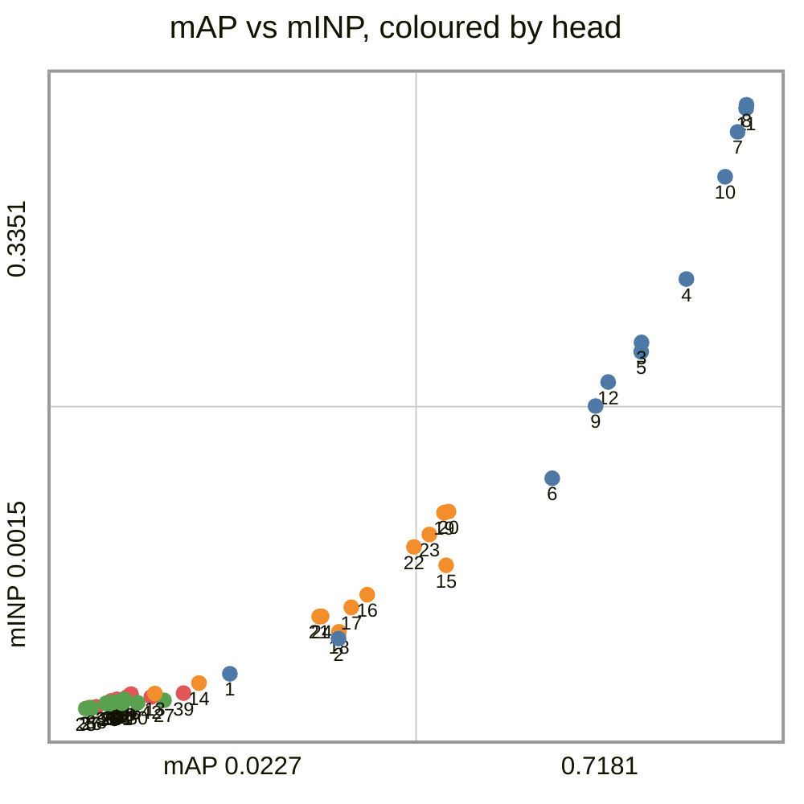
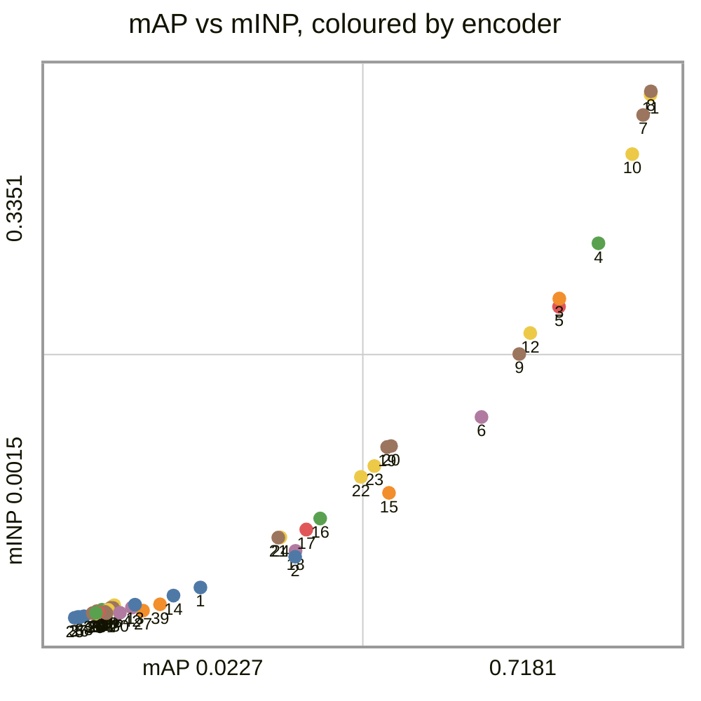
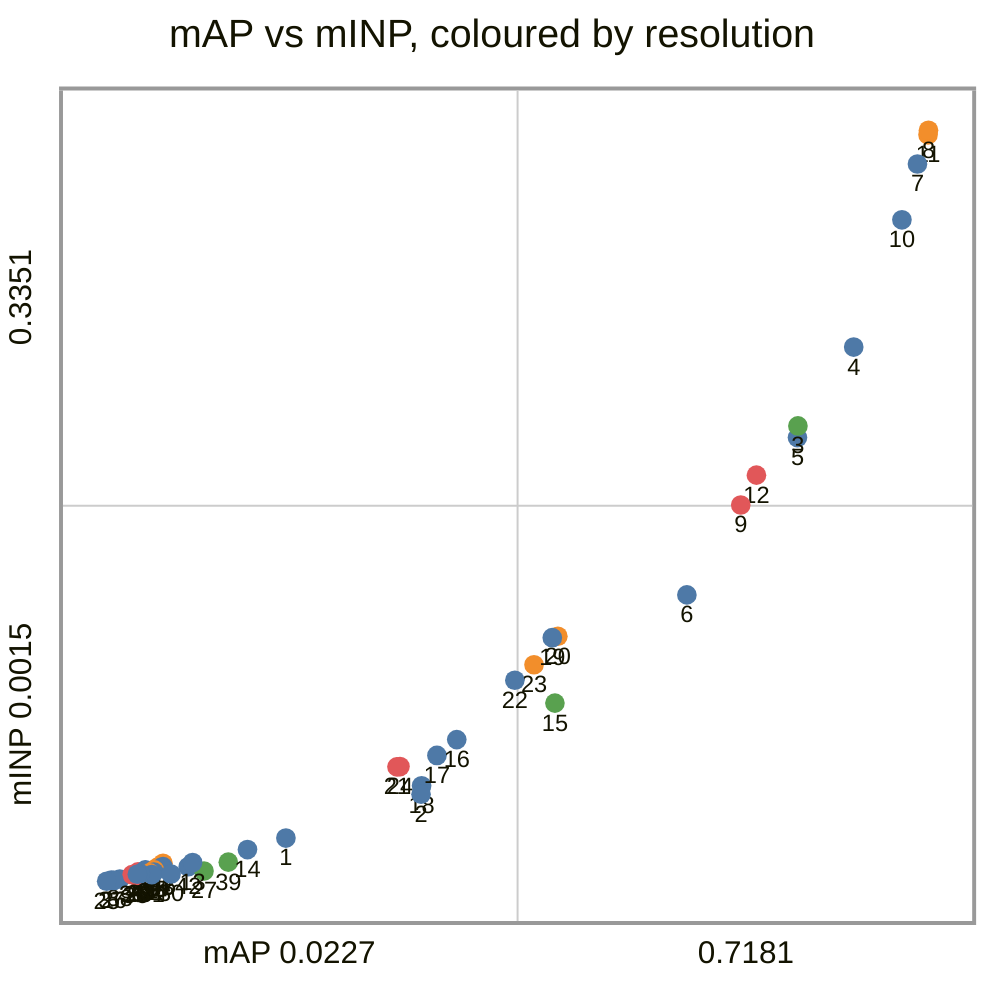

```mermaid
%%{init: {"themeVariables": {"xyChart": {"backgroundColor": "transparent", "plotColorPalette": "#4e79a7,#f28e2b,#59a14f,#e15759,#b07aa1,#9c755f,#edc948"}}, "xyChart": {"height": 1384, "width": 1215, "yAxis": {"showLabel": false}}}}%%
xychart-beta horizontal
    title "mAP, coloured by encoder"
    x-axis ["224x224 arcface vit_base_patch16_clip_224.openai crop · 17.44%", "224x224 arcface vit_base_patch16_clip_224.openai squash · 28.87%", "224x224 arcface vit_huge_plus_patch16_dinov3.lvd1689m squash · 65.48%", "224x224 arcface vit_large_patch16_dinov3.lvd1689m squash · 60.72%", "224x224 arcface vit_so400m_patch14_siglip_224.v2_webli squash · 51.37%", "224x224 arcface c-radio_v4-h squash · 70.87%", "224x224 arcface c-radio_v4-so400m squash · 69.57%", "224x224 linear vit_base_patch16_clip_224.openai crop · 9.54%", "224x224 linear vit_base_patch16_clip_224.openai squash · 14.19%", "224x224 linear vit_huge_plus_patch16_dinov3.lvd1689m squash · 31.89%", "224x224 linear vit_large_patch16_dinov3.lvd1689m squash · 30.22%", "224x224 linear vit_so400m_patch14_siglip_224.v2_webli squash · 28.92%", "224x224 linear c-radio_v4-h squash · 39.98%", "224x224 linear c-radio_v4-so400m squash · 36.81%", "224x224 none vit_base_patch16_clip_224.openai crop · 2.27%", "224x224 none vit_base_patch16_clip_224.openai squash · 2.87%", "224x224 none vit_huge_plus_patch16_dinov3.lvd1689m squash · 4.87%", "224x224 none vit_large_patch16_dinov3.lvd1689m squash · 5.12%", "224x224 none vit_so400m_patch14_siglip_224.v2_webli squash · 7.72%", "224x224 none c-radio_v4-h squash · 6.10%", "224x224 none c-radio_v4-so400m squash · 6.28%", "224x224 pca vit_base_patch16_clip_224.openai crop · 2.66%", "224x224 pca vit_base_patch16_clip_224.openai squash · 3.39%", "224x224 pca vit_huge_plus_patch16_dinov3.lvd1689m squash · 5.55%", "224x224 pca vit_large_patch16_dinov3.lvd1689m squash · 5.55%", "224x224 pca vit_so400m_patch14_siglip_224.v2_webli squash · 9.17%", "224x224 pca c-radio_v4-h squash · 6.90%", "224x224 pca c-radio_v4-so400m squash · 7.04%", "256x128 arcface c-radio_v4-h squash · 71.81%", "256x128 arcface c-radio_v4-so400m squash · 71.77%", "256x128 linear c-radio_v4-h squash · 40.45%", "256x128 linear c-radio_v4-so400m squash · 38.44%", "256x128 none c-radio_v4-h squash · 5.92%", "256x128 none c-radio_v4-so400m squash · 6.31%", "256x128 pca c-radio_v4-h squash · 6.60%", "256x128 pca c-radio_v4-so400m squash · 7.04%", "256x256 arcface vit_giantopt_patch16_siglip_256.v2_webli squash · 60.77%", "256x256 linear vit_giantopt_patch16_siglip_256.v2_webli squash · 40.20%", "256x256 none vit_giantopt_patch16_siglip_256.v2_webli squash · 10.51%", "256x256 pca vit_giantopt_patch16_siglip_256.v2_webli squash · 12.57%", "native arcface c-radio_v4-h squash · 55.93%", "native arcface c-radio_v4-so400m squash · 57.26%", "native linear c-radio_v4-h squash · 26.84%", "native linear c-radio_v4-so400m squash · 27.09%", "native none c-radio_v4-h squash · 4.43%", "native none c-radio_v4-so400m squash · 4.72%", "native pca c-radio_v4-h squash · 4.93%", "native pca c-radio_v4-so400m squash · 5.31%"]
    y-axis "mAP (%)" 0 --> 75.40
    bar [17.44, 28.87, 0.00, 0.00, 0.00, 0.00, 0.00, 9.54, 14.19, 0.00, 0.00, 0.00, 0.00, 0.00, 2.27, 2.87, 0.00, 0.00, 0.00, 0.00, 0.00, 2.66, 3.39, 0.00, 0.00, 0.00, 0.00, 0.00, 0.00, 0.00, 0.00, 0.00, 0.00, 0.00, 0.00, 0.00, 0.00, 0.00, 0.00, 0.00, 0.00, 0.00, 0.00, 0.00, 0.00, 0.00, 0.00, 0.00]
    bar [0.00, 0.00, 0.00, 0.00, 0.00, 0.00, 0.00, 0.00, 0.00, 0.00, 0.00, 0.00, 0.00, 0.00, 0.00, 0.00, 0.00, 0.00, 0.00, 0.00, 0.00, 0.00, 0.00, 0.00, 0.00, 0.00, 0.00, 0.00, 0.00, 0.00, 0.00, 0.00, 0.00, 0.00, 0.00, 0.00, 60.77, 40.20, 10.51, 12.57, 0.00, 0.00, 0.00, 0.00, 0.00, 0.00, 0.00, 0.00]
    bar [0.00, 0.00, 65.48, 0.00, 0.00, 0.00, 0.00, 0.00, 0.00, 31.89, 0.00, 0.00, 0.00, 0.00, 0.00, 0.00, 4.87, 0.00, 0.00, 0.00, 0.00, 0.00, 0.00, 5.55, 0.00, 0.00, 0.00, 0.00, 0.00, 0.00, 0.00, 0.00, 0.00, 0.00, 0.00, 0.00, 0.00, 0.00, 0.00, 0.00, 0.00, 0.00, 0.00, 0.00, 0.00, 0.00, 0.00, 0.00]
    bar [0.00, 0.00, 0.00, 60.72, 0.00, 0.00, 0.00, 0.00, 0.00, 0.00, 30.22, 0.00, 0.00, 0.00, 0.00, 0.00, 0.00, 5.12, 0.00, 0.00, 0.00, 0.00, 0.00, 0.00, 5.55, 0.00, 0.00, 0.00, 0.00, 0.00, 0.00, 0.00, 0.00, 0.00, 0.00, 0.00, 0.00, 0.00, 0.00, 0.00, 0.00, 0.00, 0.00, 0.00, 0.00, 0.00, 0.00, 0.00]
    bar [0.00, 0.00, 0.00, 0.00, 51.37, 0.00, 0.00, 0.00, 0.00, 0.00, 0.00, 28.92, 0.00, 0.00, 0.00, 0.00, 0.00, 0.00, 7.72, 0.00, 0.00, 0.00, 0.00, 0.00, 0.00, 9.17, 0.00, 0.00, 0.00, 0.00, 0.00, 0.00, 0.00, 0.00, 0.00, 0.00, 0.00, 0.00, 0.00, 0.00, 0.00, 0.00, 0.00, 0.00, 0.00, 0.00, 0.00, 0.00]
    bar [0.00, 0.00, 0.00, 0.00, 0.00, 70.87, 0.00, 0.00, 0.00, 0.00, 0.00, 0.00, 39.98, 0.00, 0.00, 0.00, 0.00, 0.00, 0.00, 6.10, 0.00, 0.00, 0.00, 0.00, 0.00, 0.00, 6.90, 0.00, 71.81, 0.00, 40.45, 0.00, 5.92, 0.00, 6.60, 0.00, 0.00, 0.00, 0.00, 0.00, 55.93, 0.00, 26.84, 0.00, 4.43, 0.00, 4.93, 0.00]
    bar [0.00, 0.00, 0.00, 0.00, 0.00, 0.00, 69.57, 0.00, 0.00, 0.00, 0.00, 0.00, 0.00, 36.81, 0.00, 0.00, 0.00, 0.00, 0.00, 0.00, 6.28, 0.00, 0.00, 0.00, 0.00, 0.00, 0.00, 7.04, 0.00, 71.77, 0.00, 38.44, 0.00, 6.31, 0.00, 7.04, 0.00, 0.00, 0.00, 0.00, 0.00, 57.26, 0.00, 27.09, 0.00, 4.72, 0.00, 5.31]
```

<!-- generated by `reidbench render`; edit the runs, not this file -->

# market1501

[← table.md](../table.md)

## market1501/official@1

### 🟦 arcface

|  # | encoder                                       | resolution | resize |        mAP |         R1 |         R5 |        R10 |       mINP |
|---:|-----------------------------------------------|------------|--------|-----------:|-----------:|-----------:|-----------:|-----------:|
|  1 | timm:vit_base_patch16_clip_224.openai         | 224x224    | crop   |     0.1744 |     0.3560 |     0.5903 |     0.6850 |     0.0207 |
|  2 | timm:vit_base_patch16_clip_224.openai         | 224x224    | squash |     0.2887 |     0.5389 |     0.7589 |     0.8260 |     0.0401 |
|  3 | timm:vit_giantopt_patch16_siglip_256.v2_webli | 256x256    | squash |     0.6077 |     0.8257 |     0.9267 |     0.9483 |     0.2038 |
|  4 | timm:vit_huge_plus_patch16_dinov3.lvd1689m    | 224x224    | squash |     0.6548 |     0.8584 |     0.9525 |     0.9712 |     0.2388 |
|  5 | timm:vit_large_patch16_dinov3.lvd1689m        | 224x224    | squash |     0.6072 |     0.8287 |     0.9397 |     0.9629 |     0.1986 |
|  6 | timm:vit_so400m_patch14_siglip_224.v2_webli   | 224x224    | squash |     0.5137 |     0.7559 |     0.8943 |     0.9281 |     0.1287 |
|  7 | torchhub:NVlabs/RADIO/c-radio_v4-h            | 224x224    | squash |     0.7087 |     0.8789 |     0.9569 |     0.9736 |     0.3202 |
|  8 | torchhub:NVlabs/RADIO/c-radio_v4-h            | 256x128    | squash | **0.7181** | **0.8872** | **0.9650** | **0.9786** | **0.3351** |
|  9 | torchhub:NVlabs/RADIO/c-radio_v4-h            | native     | squash |     0.5593 |     0.8014 |     0.9255 |     0.9519 |     0.1686 |
| 10 | torchhub:NVlabs/RADIO/c-radio_v4-so400m       | 224x224    | squash |     0.6957 |     0.8723 |     0.9575 |     0.9715 |     0.2953 |
| 11 | torchhub:NVlabs/RADIO/c-radio_v4-so400m       | 256x128    | squash |     0.7177 |     0.8854 |     0.9638 |     0.9774 |     0.3331 |
| 12 | torchhub:NVlabs/RADIO/c-radio_v4-so400m       | native     | squash |     0.5726 |     0.8070 |     0.9210 |     0.9507 |     0.1819 |

### 🟧 linear

|  # | encoder                                       | resolution | resize |        mAP |         R1 |         R5 |        R10 |       mINP |
|---:|-----------------------------------------------|------------|--------|-----------:|-----------:|-----------:|-----------:|-----------:|
| 13 | timm:vit_base_patch16_clip_224.openai         | 224x224    | crop   |     0.0954 |     0.2185 |     0.4077 |     0.5050 |     0.0098 |
| 14 | timm:vit_base_patch16_clip_224.openai         | 224x224    | squash |     0.1419 |     0.3118 |     0.5291 |     0.6378 |     0.0156 |
| 15 | timm:vit_giantopt_patch16_siglip_256.v2_webli | 256x256    | squash |     0.4020 | **0.6437** | **0.8257** |     0.8759 |     0.0806 |
| 16 | timm:vit_huge_plus_patch16_dinov3.lvd1689m    | 224x224    | squash |     0.3189 |     0.5356 |     0.7556 |     0.8216 |     0.0644 |
| 17 | timm:vit_large_patch16_dinov3.lvd1689m        | 224x224    | squash |     0.3022 |     0.5163 |     0.7512 |     0.8269 |     0.0574 |
| 18 | timm:vit_so400m_patch14_siglip_224.v2_webli   | 224x224    | squash |     0.2892 |     0.5181 |     0.7340 |     0.8031 |     0.0439 |
| 19 | torchhub:NVlabs/RADIO/c-radio_v4-h            | 224x224    | squash |     0.3998 |     0.5929 |     0.8094 |     0.8747 |     0.1097 |
| 20 | torchhub:NVlabs/RADIO/c-radio_v4-h            | 256x128    | squash | **0.4045** |     0.6107 |     0.8138 | **0.8800** | **0.1103** |
| 21 | torchhub:NVlabs/RADIO/c-radio_v4-h            | native     | squash |     0.2684 |     0.4641 |     0.7078 |     0.7892 |     0.0523 |
| 22 | torchhub:NVlabs/RADIO/c-radio_v4-so400m       | 224x224    | squash |     0.3681 |     0.5793 |     0.7800 |     0.8486 |     0.0908 |
| 23 | torchhub:NVlabs/RADIO/c-radio_v4-so400m       | 256x128    | squash |     0.3844 |     0.5843 |     0.8043 |     0.8726 |     0.0977 |
| 24 | torchhub:NVlabs/RADIO/c-radio_v4-so400m       | native     | squash |     0.2709 |     0.4626 |     0.7007 |     0.7925 |     0.0525 |

### 🟩 none

|  # | encoder                                       | resolution | resize |        mAP |         R1 |         R5 |        R10 |       mINP |
|---:|-----------------------------------------------|------------|--------|-----------:|-----------:|-----------:|-----------:|-----------:|
| 25 | timm:vit_base_patch16_clip_224.openai         | 224x224    | crop   |     0.0227 |     0.0879 |     0.1829 |     0.2381 |     0.0015 |
| 26 | timm:vit_base_patch16_clip_224.openai         | 224x224    | squash |     0.0287 |     0.1072 |     0.2203 |     0.2886 |     0.0018 |
| 27 | timm:vit_giantopt_patch16_siglip_256.v2_webli | 256x256    | squash | **0.1051** | **0.3150** | **0.4834** | **0.5659** |     0.0060 |
| 28 | timm:vit_huge_plus_patch16_dinov3.lvd1689m    | 224x224    | squash |     0.0487 |     0.1565 |     0.2812 |     0.3483 |     0.0046 |
| 29 | timm:vit_large_patch16_dinov3.lvd1689m        | 224x224    | squash |     0.0512 |     0.1553 |     0.2836 |     0.3560 |     0.0049 |
| 30 | timm:vit_so400m_patch14_siglip_224.v2_webli   | 224x224    | squash |     0.0772 |     0.2292 |     0.3988 |     0.4715 |     0.0047 |
| 31 | torchhub:NVlabs/RADIO/c-radio_v4-h            | 224x224    | squash |     0.0610 |     0.1838 |     0.3207 |     0.3955 |     0.0044 |
| 32 | torchhub:NVlabs/RADIO/c-radio_v4-h            | 256x128    | squash |     0.0592 |     0.1799 |     0.3224 |     0.3955 |     0.0052 |
| 33 | torchhub:NVlabs/RADIO/c-radio_v4-h            | native     | squash |     0.0443 |     0.1393 |     0.2672 |     0.3305 |     0.0044 |
| 34 | torchhub:NVlabs/RADIO/c-radio_v4-so400m       | 224x224    | squash |     0.0628 |     0.1832 |     0.3180 |     0.3869 |     0.0055 |
| 35 | torchhub:NVlabs/RADIO/c-radio_v4-so400m       | 256x128    | squash |     0.0631 |     0.1817 |     0.3219 |     0.3893 | **0.0066** |
| 36 | torchhub:NVlabs/RADIO/c-radio_v4-so400m       | native     | squash |     0.0472 |     0.1369 |     0.2746 |     0.3453 |     0.0040 |

### 🟥 pca

|  # | encoder                                       | resolution | resize |        mAP |         R1 |         R5 |        R10 |       mINP |
|---:|-----------------------------------------------|------------|--------|-----------:|-----------:|-----------:|-----------:|-----------:|
| 37 | timm:vit_base_patch16_clip_224.openai         | 224x224    | crop   |     0.0266 |     0.0971 |     0.1891 |     0.2497 |     0.0020 |
| 38 | timm:vit_base_patch16_clip_224.openai         | 224x224    | squash |     0.0339 |     0.1161 |     0.2260 |     0.2895 |     0.0025 |
| 39 | timm:vit_giantopt_patch16_siglip_256.v2_webli | 256x256    | squash | **0.1257** | **0.3337** | **0.5107** | **0.5894** | **0.0100** |
| 40 | timm:vit_huge_plus_patch16_dinov3.lvd1689m    | 224x224    | squash |     0.0555 |     0.1681 |     0.2874 |     0.3548 |     0.0065 |
| 41 | timm:vit_large_patch16_dinov3.lvd1689m        | 224x224    | squash |     0.0555 |     0.1630 |     0.2841 |     0.3441 |     0.0063 |
| 42 | timm:vit_so400m_patch14_siglip_224.v2_webli   | 224x224    | squash |     0.0917 |     0.2423 |     0.4121 |     0.4822 |     0.0079 |
| 43 | torchhub:NVlabs/RADIO/c-radio_v4-h            | 224x224    | squash |     0.0690 |     0.1912 |     0.3201 |     0.3916 |     0.0076 |
| 44 | torchhub:NVlabs/RADIO/c-radio_v4-h            | 256x128    | squash |     0.0660 |     0.1876 |     0.3174 |     0.3866 |     0.0078 |
| 45 | torchhub:NVlabs/RADIO/c-radio_v4-h            | native     | squash |     0.0493 |     0.1434 |     0.2675 |     0.3325 |     0.0057 |
| 46 | torchhub:NVlabs/RADIO/c-radio_v4-so400m       | 224x224    | squash |     0.0704 |     0.1879 |     0.3204 |     0.3839 |     0.0080 |
| 47 | torchhub:NVlabs/RADIO/c-radio_v4-so400m       | 256x128    | squash |     0.0704 |     0.1826 |     0.3189 |     0.3872 |     0.0095 |
| 48 | torchhub:NVlabs/RADIO/c-radio_v4-so400m       | native     | squash |     0.0531 |     0.1437 |     0.2770 |     0.3456 |     0.0052 |

### Every row, by encoder and resolution

```mermaid
%%{init: {"themeVariables": {"xyChart": {"backgroundColor": "transparent", "plotColorPalette": "#4e79a7,#f28e2b,#59a14f,#e15759"}}, "xyChart": {"height": 1384, "width": 1215, "yAxis": {"showLabel": false}}}}%%
xychart-beta horizontal
    title "mAP, coloured by head"
    x-axis ["vit_base_patch16_clip_224.openai 224x224 arcface crop · 17.44%", "vit_base_patch16_clip_224.openai 224x224 arcface squash · 28.87%", "vit_base_patch16_clip_224.openai 224x224 linear crop · 9.54%", "vit_base_patch16_clip_224.openai 224x224 linear squash · 14.19%", "vit_base_patch16_clip_224.openai 224x224 none crop · 2.27%", "vit_base_patch16_clip_224.openai 224x224 none squash · 2.87%", "vit_base_patch16_clip_224.openai 224x224 pca crop · 2.66%", "vit_base_patch16_clip_224.openai 224x224 pca squash · 3.39%", "vit_giantopt_patch16_siglip_256.v2_webli 256x256 arcface squash · 60.77%", "vit_giantopt_patch16_siglip_256.v2_webli 256x256 linear squash · 40.20%", "vit_giantopt_patch16_siglip_256.v2_webli 256x256 none squash · 10.51%", "vit_giantopt_patch16_siglip_256.v2_webli 256x256 pca squash · 12.57%", "vit_huge_plus_patch16_dinov3.lvd1689m 224x224 arcface squash · 65.48%", "vit_huge_plus_patch16_dinov3.lvd1689m 224x224 linear squash · 31.89%", "vit_huge_plus_patch16_dinov3.lvd1689m 224x224 none squash · 4.87%", "vit_huge_plus_patch16_dinov3.lvd1689m 224x224 pca squash · 5.55%", "vit_large_patch16_dinov3.lvd1689m 224x224 arcface squash · 60.72%", "vit_large_patch16_dinov3.lvd1689m 224x224 linear squash · 30.22%", "vit_large_patch16_dinov3.lvd1689m 224x224 none squash · 5.12%", "vit_large_patch16_dinov3.lvd1689m 224x224 pca squash · 5.55%", "vit_so400m_patch14_siglip_224.v2_webli 224x224 arcface squash · 51.37%", "vit_so400m_patch14_siglip_224.v2_webli 224x224 linear squash · 28.92%", "vit_so400m_patch14_siglip_224.v2_webli 224x224 none squash · 7.72%", "vit_so400m_patch14_siglip_224.v2_webli 224x224 pca squash · 9.17%", "c-radio_v4-h 224x224 arcface squash · 70.87%", "c-radio_v4-h 224x224 linear squash · 39.98%", "c-radio_v4-h 224x224 none squash · 6.10%", "c-radio_v4-h 224x224 pca squash · 6.90%", "c-radio_v4-h 256x128 arcface squash · 71.81%", "c-radio_v4-h 256x128 linear squash · 40.45%", "c-radio_v4-h 256x128 none squash · 5.92%", "c-radio_v4-h 256x128 pca squash · 6.60%", "c-radio_v4-h native arcface squash · 55.93%", "c-radio_v4-h native linear squash · 26.84%", "c-radio_v4-h native none squash · 4.43%", "c-radio_v4-h native pca squash · 4.93%", "c-radio_v4-so400m 224x224 arcface squash · 69.57%", "c-radio_v4-so400m 224x224 linear squash · 36.81%", "c-radio_v4-so400m 224x224 none squash · 6.28%", "c-radio_v4-so400m 224x224 pca squash · 7.04%", "c-radio_v4-so400m 256x128 arcface squash · 71.77%", "c-radio_v4-so400m 256x128 linear squash · 38.44%", "c-radio_v4-so400m 256x128 none squash · 6.31%", "c-radio_v4-so400m 256x128 pca squash · 7.04%", "c-radio_v4-so400m native arcface squash · 57.26%", "c-radio_v4-so400m native linear squash · 27.09%", "c-radio_v4-so400m native none squash · 4.72%", "c-radio_v4-so400m native pca squash · 5.31%"]
    y-axis "mAP (%)" 0 --> 75.40
    bar [17.44, 28.87, 0.00, 0.00, 0.00, 0.00, 0.00, 0.00, 60.77, 0.00, 0.00, 0.00, 65.48, 0.00, 0.00, 0.00, 60.72, 0.00, 0.00, 0.00, 51.37, 0.00, 0.00, 0.00, 70.87, 0.00, 0.00, 0.00, 71.81, 0.00, 0.00, 0.00, 55.93, 0.00, 0.00, 0.00, 69.57, 0.00, 0.00, 0.00, 71.77, 0.00, 0.00, 0.00, 57.26, 0.00, 0.00, 0.00]
    bar [0.00, 0.00, 9.54, 14.19, 0.00, 0.00, 0.00, 0.00, 0.00, 40.20, 0.00, 0.00, 0.00, 31.89, 0.00, 0.00, 0.00, 30.22, 0.00, 0.00, 0.00, 28.92, 0.00, 0.00, 0.00, 39.98, 0.00, 0.00, 0.00, 40.45, 0.00, 0.00, 0.00, 26.84, 0.00, 0.00, 0.00, 36.81, 0.00, 0.00, 0.00, 38.44, 0.00, 0.00, 0.00, 27.09, 0.00, 0.00]
    bar [0.00, 0.00, 0.00, 0.00, 2.27, 2.87, 0.00, 0.00, 0.00, 0.00, 10.51, 0.00, 0.00, 0.00, 4.87, 0.00, 0.00, 0.00, 5.12, 0.00, 0.00, 0.00, 7.72, 0.00, 0.00, 0.00, 6.10, 0.00, 0.00, 0.00, 5.92, 0.00, 0.00, 0.00, 4.43, 0.00, 0.00, 0.00, 6.28, 0.00, 0.00, 0.00, 6.31, 0.00, 0.00, 0.00, 4.72, 0.00]
    bar [0.00, 0.00, 0.00, 0.00, 0.00, 0.00, 2.66, 3.39, 0.00, 0.00, 0.00, 12.57, 0.00, 0.00, 0.00, 5.55, 0.00, 0.00, 0.00, 5.55, 0.00, 0.00, 0.00, 9.17, 0.00, 0.00, 0.00, 6.90, 0.00, 0.00, 0.00, 6.60, 0.00, 0.00, 0.00, 4.93, 0.00, 0.00, 0.00, 7.04, 0.00, 0.00, 0.00, 7.04, 0.00, 0.00, 0.00, 5.31]
```

### By head — does the probe carry it?

```mermaid
%%{init: {"themeVariables": {"xyChart": {"backgroundColor": "transparent", "plotColorPalette": "#4e79a7,#f28e2b,#59a14f,#e15759"}}, "xyChart": {"height": 1384, "width": 1215, "yAxis": {"showLabel": false}}}}%%
xychart-beta horizontal
    title "mAP, coloured by head"
    x-axis ["arcface vit_base_patch16_clip_224.openai 224x224 crop · 17.44%", "arcface vit_base_patch16_clip_224.openai 224x224 squash · 28.87%", "arcface vit_giantopt_patch16_siglip_256.v2_webli 256x256 squash · 60.77%", "arcface vit_huge_plus_patch16_dinov3.lvd1689m 224x224 squash · 65.48%", "arcface vit_large_patch16_dinov3.lvd1689m 224x224 squash · 60.72%", "arcface vit_so400m_patch14_siglip_224.v2_webli 224x224 squash · 51.37%", "arcface c-radio_v4-h 224x224 squash · 70.87%", "arcface c-radio_v4-h 256x128 squash · 71.81%", "arcface c-radio_v4-h native squash · 55.93%", "arcface c-radio_v4-so400m 224x224 squash · 69.57%", "arcface c-radio_v4-so400m 256x128 squash · 71.77%", "arcface c-radio_v4-so400m native squash · 57.26%", "linear vit_base_patch16_clip_224.openai 224x224 crop · 9.54%", "linear vit_base_patch16_clip_224.openai 224x224 squash · 14.19%", "linear vit_giantopt_patch16_siglip_256.v2_webli 256x256 squash · 40.20%", "linear vit_huge_plus_patch16_dinov3.lvd1689m 224x224 squash · 31.89%", "linear vit_large_patch16_dinov3.lvd1689m 224x224 squash · 30.22%", "linear vit_so400m_patch14_siglip_224.v2_webli 224x224 squash · 28.92%", "linear c-radio_v4-h 224x224 squash · 39.98%", "linear c-radio_v4-h 256x128 squash · 40.45%", "linear c-radio_v4-h native squash · 26.84%", "linear c-radio_v4-so400m 224x224 squash · 36.81%", "linear c-radio_v4-so400m 256x128 squash · 38.44%", "linear c-radio_v4-so400m native squash · 27.09%", "none vit_base_patch16_clip_224.openai 224x224 crop · 2.27%", "none vit_base_patch16_clip_224.openai 224x224 squash · 2.87%", "none vit_giantopt_patch16_siglip_256.v2_webli 256x256 squash · 10.51%", "none vit_huge_plus_patch16_dinov3.lvd1689m 224x224 squash · 4.87%", "none vit_large_patch16_dinov3.lvd1689m 224x224 squash · 5.12%", "none vit_so400m_patch14_siglip_224.v2_webli 224x224 squash · 7.72%", "none c-radio_v4-h 224x224 squash · 6.10%", "none c-radio_v4-h 256x128 squash · 5.92%", "none c-radio_v4-h native squash · 4.43%", "none c-radio_v4-so400m 224x224 squash · 6.28%", "none c-radio_v4-so400m 256x128 squash · 6.31%", "none c-radio_v4-so400m native squash · 4.72%", "pca vit_base_patch16_clip_224.openai 224x224 crop · 2.66%", "pca vit_base_patch16_clip_224.openai 224x224 squash · 3.39%", "pca vit_giantopt_patch16_siglip_256.v2_webli 256x256 squash · 12.57%", "pca vit_huge_plus_patch16_dinov3.lvd1689m 224x224 squash · 5.55%", "pca vit_large_patch16_dinov3.lvd1689m 224x224 squash · 5.55%", "pca vit_so400m_patch14_siglip_224.v2_webli 224x224 squash · 9.17%", "pca c-radio_v4-h 224x224 squash · 6.90%", "pca c-radio_v4-h 256x128 squash · 6.60%", "pca c-radio_v4-h native squash · 4.93%", "pca c-radio_v4-so400m 224x224 squash · 7.04%", "pca c-radio_v4-so400m 256x128 squash · 7.04%", "pca c-radio_v4-so400m native squash · 5.31%"]
    y-axis "mAP (%)" 0 --> 75.40
    bar [17.44, 28.87, 60.77, 65.48, 60.72, 51.37, 70.87, 71.81, 55.93, 69.57, 71.77, 57.26, 0.00, 0.00, 0.00, 0.00, 0.00, 0.00, 0.00, 0.00, 0.00, 0.00, 0.00, 0.00, 0.00, 0.00, 0.00, 0.00, 0.00, 0.00, 0.00, 0.00, 0.00, 0.00, 0.00, 0.00, 0.00, 0.00, 0.00, 0.00, 0.00, 0.00, 0.00, 0.00, 0.00, 0.00, 0.00, 0.00]
    bar [0.00, 0.00, 0.00, 0.00, 0.00, 0.00, 0.00, 0.00, 0.00, 0.00, 0.00, 0.00, 9.54, 14.19, 40.20, 31.89, 30.22, 28.92, 39.98, 40.45, 26.84, 36.81, 38.44, 27.09, 0.00, 0.00, 0.00, 0.00, 0.00, 0.00, 0.00, 0.00, 0.00, 0.00, 0.00, 0.00, 0.00, 0.00, 0.00, 0.00, 0.00, 0.00, 0.00, 0.00, 0.00, 0.00, 0.00, 0.00]
    bar [0.00, 0.00, 0.00, 0.00, 0.00, 0.00, 0.00, 0.00, 0.00, 0.00, 0.00, 0.00, 0.00, 0.00, 0.00, 0.00, 0.00, 0.00, 0.00, 0.00, 0.00, 0.00, 0.00, 0.00, 2.27, 2.87, 10.51, 4.87, 5.12, 7.72, 6.10, 5.92, 4.43, 6.28, 6.31, 4.72, 0.00, 0.00, 0.00, 0.00, 0.00, 0.00, 0.00, 0.00, 0.00, 0.00, 0.00, 0.00]
    bar [0.00, 0.00, 0.00, 0.00, 0.00, 0.00, 0.00, 0.00, 0.00, 0.00, 0.00, 0.00, 0.00, 0.00, 0.00, 0.00, 0.00, 0.00, 0.00, 0.00, 0.00, 0.00, 0.00, 0.00, 0.00, 0.00, 0.00, 0.00, 0.00, 0.00, 0.00, 0.00, 0.00, 0.00, 0.00, 0.00, 2.66, 3.39, 12.57, 5.55, 5.55, 9.17, 6.90, 6.60, 4.93, 7.04, 7.04, 5.31]
```

### By encoder — does the checkpoint carry it?

*Colour — encoder:* 🟦 timm:vit_base_patch16_clip_224.openai · 🟧 timm:vit_giantopt_patch16_siglip_256.v2_webli · 🟩 timm:vit_huge_plus_patch16_dinov3.lvd1689m · 🟥 timm:vit_large_patch16_dinov3.lvd1689m · 🟪 timm:vit_so400m_patch14_siglip_224.v2_webli · 🟫 torchhub:NVlabs/RADIO/c-radio_v4-h · 🟨 torchhub:NVlabs/RADIO/c-radio_v4-so400m

```mermaid
%%{init: {"themeVariables": {"xyChart": {"backgroundColor": "transparent", "plotColorPalette": "#4e79a7,#f28e2b,#59a14f,#e15759,#b07aa1,#9c755f,#edc948"}}, "xyChart": {"height": 1384, "width": 1215, "yAxis": {"showLabel": false}}}}%%
xychart-beta horizontal
    title "mAP, coloured by encoder"
    x-axis ["vit_base_patch16_clip_224.openai arcface 224x224 crop · 17.44%", "vit_base_patch16_clip_224.openai arcface 224x224 squash · 28.87%", "vit_base_patch16_clip_224.openai linear 224x224 crop · 9.54%", "vit_base_patch16_clip_224.openai linear 224x224 squash · 14.19%", "vit_base_patch16_clip_224.openai none 224x224 crop · 2.27%", "vit_base_patch16_clip_224.openai none 224x224 squash · 2.87%", "vit_base_patch16_clip_224.openai pca 224x224 crop · 2.66%", "vit_base_patch16_clip_224.openai pca 224x224 squash · 3.39%", "vit_giantopt_patch16_siglip_256.v2_webli arcface 256x256 squash · 60.77%", "vit_giantopt_patch16_siglip_256.v2_webli linear 256x256 squash · 40.20%", "vit_giantopt_patch16_siglip_256.v2_webli none 256x256 squash · 10.51%", "vit_giantopt_patch16_siglip_256.v2_webli pca 256x256 squash · 12.57%", "vit_huge_plus_patch16_dinov3.lvd1689m arcface 224x224 squash · 65.48%", "vit_huge_plus_patch16_dinov3.lvd1689m linear 224x224 squash · 31.89%", "vit_huge_plus_patch16_dinov3.lvd1689m none 224x224 squash · 4.87%", "vit_huge_plus_patch16_dinov3.lvd1689m pca 224x224 squash · 5.55%", "vit_large_patch16_dinov3.lvd1689m arcface 224x224 squash · 60.72%", "vit_large_patch16_dinov3.lvd1689m linear 224x224 squash · 30.22%", "vit_large_patch16_dinov3.lvd1689m none 224x224 squash · 5.12%", "vit_large_patch16_dinov3.lvd1689m pca 224x224 squash · 5.55%", "vit_so400m_patch14_siglip_224.v2_webli arcface 224x224 squash · 51.37%", "vit_so400m_patch14_siglip_224.v2_webli linear 224x224 squash · 28.92%", "vit_so400m_patch14_siglip_224.v2_webli none 224x224 squash · 7.72%", "vit_so400m_patch14_siglip_224.v2_webli pca 224x224 squash · 9.17%", "c-radio_v4-h arcface 224x224 squash · 70.87%", "c-radio_v4-h arcface 256x128 squash · 71.81%", "c-radio_v4-h arcface native squash · 55.93%", "c-radio_v4-h linear 224x224 squash · 39.98%", "c-radio_v4-h linear 256x128 squash · 40.45%", "c-radio_v4-h linear native squash · 26.84%", "c-radio_v4-h none 224x224 squash · 6.10%", "c-radio_v4-h none 256x128 squash · 5.92%", "c-radio_v4-h none native squash · 4.43%", "c-radio_v4-h pca 224x224 squash · 6.90%", "c-radio_v4-h pca 256x128 squash · 6.60%", "c-radio_v4-h pca native squash · 4.93%", "c-radio_v4-so400m arcface 224x224 squash · 69.57%", "c-radio_v4-so400m arcface 256x128 squash · 71.77%", "c-radio_v4-so400m arcface native squash · 57.26%", "c-radio_v4-so400m linear 224x224 squash · 36.81%", "c-radio_v4-so400m linear 256x128 squash · 38.44%", "c-radio_v4-so400m linear native squash · 27.09%", "c-radio_v4-so400m none 224x224 squash · 6.28%", "c-radio_v4-so400m none 256x128 squash · 6.31%", "c-radio_v4-so400m none native squash · 4.72%", "c-radio_v4-so400m pca 224x224 squash · 7.04%", "c-radio_v4-so400m pca 256x128 squash · 7.04%", "c-radio_v4-so400m pca native squash · 5.31%"]
    y-axis "mAP (%)" 0 --> 75.40
    bar [17.44, 28.87, 9.54, 14.19, 2.27, 2.87, 2.66, 3.39, 0.00, 0.00, 0.00, 0.00, 0.00, 0.00, 0.00, 0.00, 0.00, 0.00, 0.00, 0.00, 0.00, 0.00, 0.00, 0.00, 0.00, 0.00, 0.00, 0.00, 0.00, 0.00, 0.00, 0.00, 0.00, 0.00, 0.00, 0.00, 0.00, 0.00, 0.00, 0.00, 0.00, 0.00, 0.00, 0.00, 0.00, 0.00, 0.00, 0.00]
    bar [0.00, 0.00, 0.00, 0.00, 0.00, 0.00, 0.00, 0.00, 60.77, 40.20, 10.51, 12.57, 0.00, 0.00, 0.00, 0.00, 0.00, 0.00, 0.00, 0.00, 0.00, 0.00, 0.00, 0.00, 0.00, 0.00, 0.00, 0.00, 0.00, 0.00, 0.00, 0.00, 0.00, 0.00, 0.00, 0.00, 0.00, 0.00, 0.00, 0.00, 0.00, 0.00, 0.00, 0.00, 0.00, 0.00, 0.00, 0.00]
    bar [0.00, 0.00, 0.00, 0.00, 0.00, 0.00, 0.00, 0.00, 0.00, 0.00, 0.00, 0.00, 65.48, 31.89, 4.87, 5.55, 0.00, 0.00, 0.00, 0.00, 0.00, 0.00, 0.00, 0.00, 0.00, 0.00, 0.00, 0.00, 0.00, 0.00, 0.00, 0.00, 0.00, 0.00, 0.00, 0.00, 0.00, 0.00, 0.00, 0.00, 0.00, 0.00, 0.00, 0.00, 0.00, 0.00, 0.00, 0.00]
    bar [0.00, 0.00, 0.00, 0.00, 0.00, 0.00, 0.00, 0.00, 0.00, 0.00, 0.00, 0.00, 0.00, 0.00, 0.00, 0.00, 60.72, 30.22, 5.12, 5.55, 0.00, 0.00, 0.00, 0.00, 0.00, 0.00, 0.00, 0.00, 0.00, 0.00, 0.00, 0.00, 0.00, 0.00, 0.00, 0.00, 0.00, 0.00, 0.00, 0.00, 0.00, 0.00, 0.00, 0.00, 0.00, 0.00, 0.00, 0.00]
    bar [0.00, 0.00, 0.00, 0.00, 0.00, 0.00, 0.00, 0.00, 0.00, 0.00, 0.00, 0.00, 0.00, 0.00, 0.00, 0.00, 0.00, 0.00, 0.00, 0.00, 51.37, 28.92, 7.72, 9.17, 0.00, 0.00, 0.00, 0.00, 0.00, 0.00, 0.00, 0.00, 0.00, 0.00, 0.00, 0.00, 0.00, 0.00, 0.00, 0.00, 0.00, 0.00, 0.00, 0.00, 0.00, 0.00, 0.00, 0.00]
    bar [0.00, 0.00, 0.00, 0.00, 0.00, 0.00, 0.00, 0.00, 0.00, 0.00, 0.00, 0.00, 0.00, 0.00, 0.00, 0.00, 0.00, 0.00, 0.00, 0.00, 0.00, 0.00, 0.00, 0.00, 70.87, 71.81, 55.93, 39.98, 40.45, 26.84, 6.10, 5.92, 4.43, 6.90, 6.60, 4.93, 0.00, 0.00, 0.00, 0.00, 0.00, 0.00, 0.00, 0.00, 0.00, 0.00, 0.00, 0.00]
    bar [0.00, 0.00, 0.00, 0.00, 0.00, 0.00, 0.00, 0.00, 0.00, 0.00, 0.00, 0.00, 0.00, 0.00, 0.00, 0.00, 0.00, 0.00, 0.00, 0.00, 0.00, 0.00, 0.00, 0.00, 0.00, 0.00, 0.00, 0.00, 0.00, 0.00, 0.00, 0.00, 0.00, 0.00, 0.00, 0.00, 69.57, 71.77, 57.26, 36.81, 38.44, 27.09, 6.28, 6.31, 4.72, 7.04, 7.04, 5.31]
```

### By resolution — does the input size carry it?

*Colour — resolution:* 🟦 224x224 · 🟧 256x128 · 🟩 256x256 · 🟥 native

```mermaid
%%{init: {"themeVariables": {"xyChart": {"backgroundColor": "transparent", "plotColorPalette": "#4e79a7,#f28e2b,#59a14f,#e15759"}}, "xyChart": {"height": 1384, "width": 1215, "yAxis": {"showLabel": false}}}}%%
xychart-beta horizontal
    title "mAP, coloured by resolution"
    x-axis ["224x224 vit_base_patch16_clip_224.openai arcface crop · 17.44%", "224x224 vit_base_patch16_clip_224.openai arcface squash · 28.87%", "224x224 vit_base_patch16_clip_224.openai linear crop · 9.54%", "224x224 vit_base_patch16_clip_224.openai linear squash · 14.19%", "224x224 vit_base_patch16_clip_224.openai none crop · 2.27%", "224x224 vit_base_patch16_clip_224.openai none squash · 2.87%", "224x224 vit_base_patch16_clip_224.openai pca crop · 2.66%", "224x224 vit_base_patch16_clip_224.openai pca squash · 3.39%", "224x224 vit_huge_plus_patch16_dinov3.lvd1689m arcface squash · 65.48%", "224x224 vit_huge_plus_patch16_dinov3.lvd1689m linear squash · 31.89%", "224x224 vit_huge_plus_patch16_dinov3.lvd1689m none squash · 4.87%", "224x224 vit_huge_plus_patch16_dinov3.lvd1689m pca squash · 5.55%", "224x224 vit_large_patch16_dinov3.lvd1689m arcface squash · 60.72%", "224x224 vit_large_patch16_dinov3.lvd1689m linear squash · 30.22%", "224x224 vit_large_patch16_dinov3.lvd1689m none squash · 5.12%", "224x224 vit_large_patch16_dinov3.lvd1689m pca squash · 5.55%", "224x224 vit_so400m_patch14_siglip_224.v2_webli arcface squash · 51.37%", "224x224 vit_so400m_patch14_siglip_224.v2_webli linear squash · 28.92%", "224x224 vit_so400m_patch14_siglip_224.v2_webli none squash · 7.72%", "224x224 vit_so400m_patch14_siglip_224.v2_webli pca squash · 9.17%", "224x224 c-radio_v4-h arcface squash · 70.87%", "224x224 c-radio_v4-h linear squash · 39.98%", "224x224 c-radio_v4-h none squash · 6.10%", "224x224 c-radio_v4-h pca squash · 6.90%", "224x224 c-radio_v4-so400m arcface squash · 69.57%", "224x224 c-radio_v4-so400m linear squash · 36.81%", "224x224 c-radio_v4-so400m none squash · 6.28%", "224x224 c-radio_v4-so400m pca squash · 7.04%", "256x128 c-radio_v4-h arcface squash · 71.81%", "256x128 c-radio_v4-h linear squash · 40.45%", "256x128 c-radio_v4-h none squash · 5.92%", "256x128 c-radio_v4-h pca squash · 6.60%", "256x128 c-radio_v4-so400m arcface squash · 71.77%", "256x128 c-radio_v4-so400m linear squash · 38.44%", "256x128 c-radio_v4-so400m none squash · 6.31%", "256x128 c-radio_v4-so400m pca squash · 7.04%", "256x256 vit_giantopt_patch16_siglip_256.v2_webli arcface squash · 60.77%", "256x256 vit_giantopt_patch16_siglip_256.v2_webli linear squash · 40.20%", "256x256 vit_giantopt_patch16_siglip_256.v2_webli none squash · 10.51%", "256x256 vit_giantopt_patch16_siglip_256.v2_webli pca squash · 12.57%", "native c-radio_v4-h arcface squash · 55.93%", "native c-radio_v4-h linear squash · 26.84%", "native c-radio_v4-h none squash · 4.43%", "native c-radio_v4-h pca squash · 4.93%", "native c-radio_v4-so400m arcface squash · 57.26%", "native c-radio_v4-so400m linear squash · 27.09%", "native c-radio_v4-so400m none squash · 4.72%", "native c-radio_v4-so400m pca squash · 5.31%"]
    y-axis "mAP (%)" 0 --> 75.40
    bar [17.44, 28.87, 9.54, 14.19, 2.27, 2.87, 2.66, 3.39, 65.48, 31.89, 4.87, 5.55, 60.72, 30.22, 5.12, 5.55, 51.37, 28.92, 7.72, 9.17, 70.87, 39.98, 6.10, 6.90, 69.57, 36.81, 6.28, 7.04, 0.00, 0.00, 0.00, 0.00, 0.00, 0.00, 0.00, 0.00, 0.00, 0.00, 0.00, 0.00, 0.00, 0.00, 0.00, 0.00, 0.00, 0.00, 0.00, 0.00]
    bar [0.00, 0.00, 0.00, 0.00, 0.00, 0.00, 0.00, 0.00, 0.00, 0.00, 0.00, 0.00, 0.00, 0.00, 0.00, 0.00, 0.00, 0.00, 0.00, 0.00, 0.00, 0.00, 0.00, 0.00, 0.00, 0.00, 0.00, 0.00, 71.81, 40.45, 5.92, 6.60, 71.77, 38.44, 6.31, 7.04, 0.00, 0.00, 0.00, 0.00, 0.00, 0.00, 0.00, 0.00, 0.00, 0.00, 0.00, 0.00]
    bar [0.00, 0.00, 0.00, 0.00, 0.00, 0.00, 0.00, 0.00, 0.00, 0.00, 0.00, 0.00, 0.00, 0.00, 0.00, 0.00, 0.00, 0.00, 0.00, 0.00, 0.00, 0.00, 0.00, 0.00, 0.00, 0.00, 0.00, 0.00, 0.00, 0.00, 0.00, 0.00, 0.00, 0.00, 0.00, 0.00, 60.77, 40.20, 10.51, 12.57, 0.00, 0.00, 0.00, 0.00, 0.00, 0.00, 0.00, 0.00]
    bar [0.00, 0.00, 0.00, 0.00, 0.00, 0.00, 0.00, 0.00, 0.00, 0.00, 0.00, 0.00, 0.00, 0.00, 0.00, 0.00, 0.00, 0.00, 0.00, 0.00, 0.00, 0.00, 0.00, 0.00, 0.00, 0.00, 0.00, 0.00, 0.00, 0.00, 0.00, 0.00, 0.00, 0.00, 0.00, 0.00, 0.00, 0.00, 0.00, 0.00, 55.93, 26.84, 4.43, 4.93, 57.26, 27.09, 4.72, 5.31]
```

### Resolution, within one encoder and head

*Colour — resolution:* 🟦 224x224 · 🟧 256x128 · 🟩 256x256 · 🟥 native

```mermaid
%%{init: {"themeVariables": {"xyChart": {"backgroundColor": "transparent", "plotColorPalette": "#4e79a7,#f28e2b,#59a14f,#e15759"}}, "xyChart": {"height": 1384, "width": 1215, "yAxis": {"showLabel": false}}}}%%
xychart-beta horizontal
    title "mAP, coloured by resolution"
    x-axis ["vit_base_patch16_clip_224.openai arcface 224x224 crop · 17.44%", "vit_base_patch16_clip_224.openai arcface 224x224 squash · 28.87%", "vit_base_patch16_clip_224.openai linear 224x224 crop · 9.54%", "vit_base_patch16_clip_224.openai linear 224x224 squash · 14.19%", "vit_base_patch16_clip_224.openai none 224x224 crop · 2.27%", "vit_base_patch16_clip_224.openai none 224x224 squash · 2.87%", "vit_base_patch16_clip_224.openai pca 224x224 crop · 2.66%", "vit_base_patch16_clip_224.openai pca 224x224 squash · 3.39%", "vit_giantopt_patch16_siglip_256.v2_webli arcface 256x256 squash · 60.77%", "vit_giantopt_patch16_siglip_256.v2_webli linear 256x256 squash · 40.20%", "vit_giantopt_patch16_siglip_256.v2_webli none 256x256 squash · 10.51%", "vit_giantopt_patch16_siglip_256.v2_webli pca 256x256 squash · 12.57%", "vit_huge_plus_patch16_dinov3.lvd1689m arcface 224x224 squash · 65.48%", "vit_huge_plus_patch16_dinov3.lvd1689m linear 224x224 squash · 31.89%", "vit_huge_plus_patch16_dinov3.lvd1689m none 224x224 squash · 4.87%", "vit_huge_plus_patch16_dinov3.lvd1689m pca 224x224 squash · 5.55%", "vit_large_patch16_dinov3.lvd1689m arcface 224x224 squash · 60.72%", "vit_large_patch16_dinov3.lvd1689m linear 224x224 squash · 30.22%", "vit_large_patch16_dinov3.lvd1689m none 224x224 squash · 5.12%", "vit_large_patch16_dinov3.lvd1689m pca 224x224 squash · 5.55%", "vit_so400m_patch14_siglip_224.v2_webli arcface 224x224 squash · 51.37%", "vit_so400m_patch14_siglip_224.v2_webli linear 224x224 squash · 28.92%", "vit_so400m_patch14_siglip_224.v2_webli none 224x224 squash · 7.72%", "vit_so400m_patch14_siglip_224.v2_webli pca 224x224 squash · 9.17%", "c-radio_v4-h arcface 224x224 squash · 70.87%", "c-radio_v4-h arcface 256x128 squash · 71.81%", "c-radio_v4-h arcface native squash · 55.93%", "c-radio_v4-h linear 224x224 squash · 39.98%", "c-radio_v4-h linear 256x128 squash · 40.45%", "c-radio_v4-h linear native squash · 26.84%", "c-radio_v4-h none 224x224 squash · 6.10%", "c-radio_v4-h none 256x128 squash · 5.92%", "c-radio_v4-h none native squash · 4.43%", "c-radio_v4-h pca 224x224 squash · 6.90%", "c-radio_v4-h pca 256x128 squash · 6.60%", "c-radio_v4-h pca native squash · 4.93%", "c-radio_v4-so400m arcface 224x224 squash · 69.57%", "c-radio_v4-so400m arcface 256x128 squash · 71.77%", "c-radio_v4-so400m arcface native squash · 57.26%", "c-radio_v4-so400m linear 224x224 squash · 36.81%", "c-radio_v4-so400m linear 256x128 squash · 38.44%", "c-radio_v4-so400m linear native squash · 27.09%", "c-radio_v4-so400m none 224x224 squash · 6.28%", "c-radio_v4-so400m none 256x128 squash · 6.31%", "c-radio_v4-so400m none native squash · 4.72%", "c-radio_v4-so400m pca 224x224 squash · 7.04%", "c-radio_v4-so400m pca 256x128 squash · 7.04%", "c-radio_v4-so400m pca native squash · 5.31%"]
    y-axis "mAP (%)" 0 --> 75.40
    bar [17.44, 28.87, 9.54, 14.19, 2.27, 2.87, 2.66, 3.39, 0.00, 0.00, 0.00, 0.00, 65.48, 31.89, 4.87, 5.55, 60.72, 30.22, 5.12, 5.55, 51.37, 28.92, 7.72, 9.17, 70.87, 0.00, 0.00, 39.98, 0.00, 0.00, 6.10, 0.00, 0.00, 6.90, 0.00, 0.00, 69.57, 0.00, 0.00, 36.81, 0.00, 0.00, 6.28, 0.00, 0.00, 7.04, 0.00, 0.00]
    bar [0.00, 0.00, 0.00, 0.00, 0.00, 0.00, 0.00, 0.00, 0.00, 0.00, 0.00, 0.00, 0.00, 0.00, 0.00, 0.00, 0.00, 0.00, 0.00, 0.00, 0.00, 0.00, 0.00, 0.00, 0.00, 71.81, 0.00, 0.00, 40.45, 0.00, 0.00, 5.92, 0.00, 0.00, 6.60, 0.00, 0.00, 71.77, 0.00, 0.00, 38.44, 0.00, 0.00, 6.31, 0.00, 0.00, 7.04, 0.00]
    bar [0.00, 0.00, 0.00, 0.00, 0.00, 0.00, 0.00, 0.00, 60.77, 40.20, 10.51, 12.57, 0.00, 0.00, 0.00, 0.00, 0.00, 0.00, 0.00, 0.00, 0.00, 0.00, 0.00, 0.00, 0.00, 0.00, 0.00, 0.00, 0.00, 0.00, 0.00, 0.00, 0.00, 0.00, 0.00, 0.00, 0.00, 0.00, 0.00, 0.00, 0.00, 0.00, 0.00, 0.00, 0.00, 0.00, 0.00, 0.00]
    bar [0.00, 0.00, 0.00, 0.00, 0.00, 0.00, 0.00, 0.00, 0.00, 0.00, 0.00, 0.00, 0.00, 0.00, 0.00, 0.00, 0.00, 0.00, 0.00, 0.00, 0.00, 0.00, 0.00, 0.00, 0.00, 0.00, 55.93, 0.00, 0.00, 26.84, 0.00, 0.00, 4.43, 0.00, 0.00, 4.93, 0.00, 0.00, 57.26, 0.00, 0.00, 27.09, 0.00, 0.00, 4.72, 0.00, 0.00, 5.31]
```

### Head, within one encoder and resolution

### Encoder, within one resolution and head

*Colour — encoder:* 🟦 timm:vit_base_patch16_clip_224.openai · 🟧 timm:vit_giantopt_patch16_siglip_256.v2_webli · 🟩 timm:vit_huge_plus_patch16_dinov3.lvd1689m · 🟥 timm:vit_large_patch16_dinov3.lvd1689m · 🟪 timm:vit_so400m_patch14_siglip_224.v2_webli · 🟫 torchhub:NVlabs/RADIO/c-radio_v4-h · 🟨 torchhub:NVlabs/RADIO/c-radio_v4-so400m

