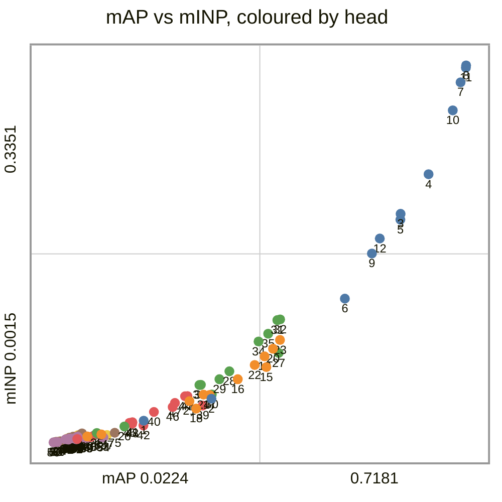
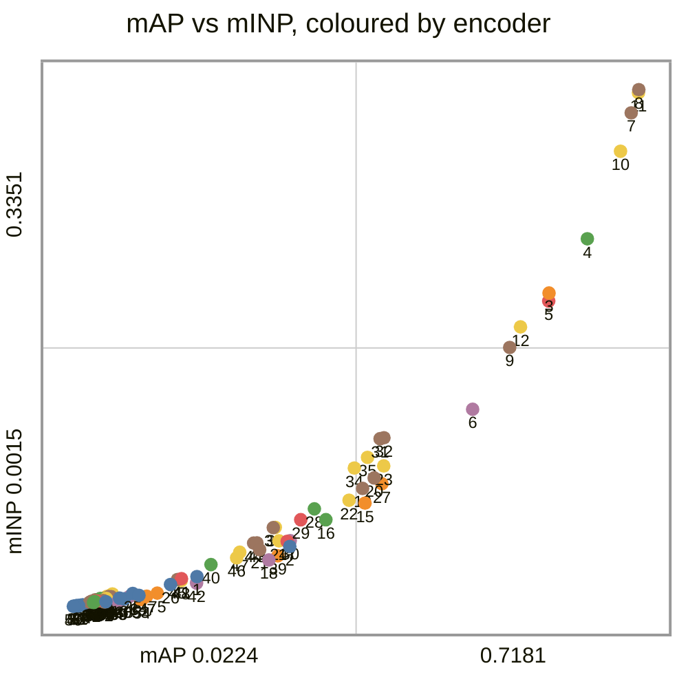
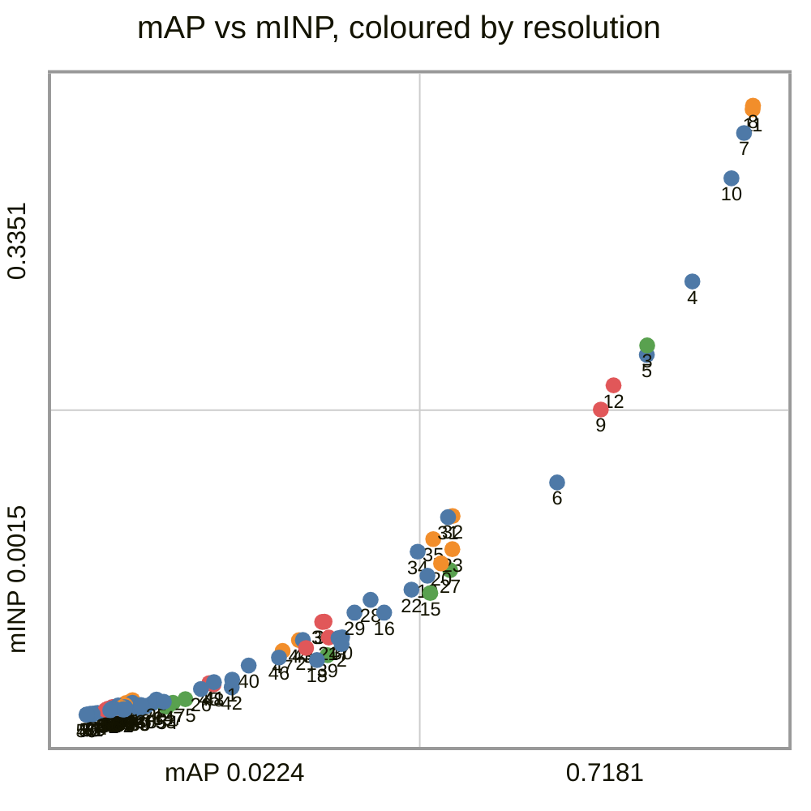

```mermaid
%%{init: {"themeVariables": {"xyChart": {"backgroundColor": "transparent", "plotColorPalette": "#4e79a7,#f28e2b,#59a14f,#e15759,#b07aa1,#9c755f,#edc948"}}, "xyChart": {"height": 1600, "width": 1320, "yAxis": {"showLabel": false}}}}%%
xychart-beta horizontal
    title "mAP, coloured by encoder"
    x-axis ["224x224 arcface vit_base_patch16_clip_224.openai crop · 17.44%", "224x224 arcface vit_base_patch16_clip_224.openai squash · 28.87%", "224x224 arcface vit_huge_plus_patch16_dinov3.lvd1689m squash · 65.48%", "224x224 arcface vit_large_patch16_dinov3.lvd1689m squash · 60.72%", "224x224 arcface vit_so400m_patch14_siglip_224.v2_webli squash · 51.37%", "224x224 arcface c-radio_v4-h squash · 70.87%", "224x224 arcface c-radio_v4-so400m squash · 69.57%", "224x224 arcface-msmt17 vit_base_patch16_clip_224.openai crop · 7.93%", "224x224 arcface-msmt17 vit_base_patch16_clip_224.openai squash · 10.31%", "224x224 arcface-msmt17 vit_huge_plus_patch16_dinov3.lvd1689m squash · 33.31%", "224x224 arcface-msmt17 vit_large_patch16_dinov3.lvd1689m squash · 28.55%", "224x224 arcface-msmt17 vit_so400m_patch14_siglip_224.v2_webli squash · 26.29%", "224x224 arcface-msmt17 c-radio_v4-h squash · 37.83%", "224x224 arcface-msmt17 c-radio_v4-so400m squash · 36.16%", "224x224 linear vit_base_patch16_clip_224.openai crop · 9.54%", "224x224 linear vit_base_patch16_clip_224.openai squash · 14.19%", "224x224 linear vit_huge_plus_patch16_dinov3.lvd1689m squash · 31.89%", "224x224 linear vit_large_patch16_dinov3.lvd1689m squash · 30.22%", "224x224 linear vit_so400m_patch14_siglip_224.v2_webli squash · 28.92%", "224x224 linear c-radio_v4-h squash · 39.98%", "224x224 linear c-radio_v4-so400m squash · 36.81%", "224x224 linear-msmt17 vit_base_patch16_clip_224.openai crop · 6.25%", "224x224 linear-msmt17 vit_base_patch16_clip_224.openai squash · 8.49%", "224x224 linear-msmt17 vit_huge_plus_patch16_dinov3.lvd1689m squash · 19.17%", "224x224 linear-msmt17 vit_large_patch16_dinov3.lvd1689m squash · 15.55%", "224x224 linear-msmt17 vit_so400m_patch14_siglip_224.v2_webli squash · 17.40%", "224x224 linear-msmt17 c-radio_v4-h squash · 24.83%", "224x224 linear-msmt17 c-radio_v4-so400m squash · 22.33%", "224x224 none vit_base_patch16_clip_224.openai crop · 2.27%", "224x224 none vit_base_patch16_clip_224.openai crop · 2.24%", "224x224 none vit_base_patch16_clip_224.openai squash · 2.87%", "224x224 none vit_base_patch16_clip_224.openai squash · 2.85%", "224x224 none vit_huge_plus_patch16_dinov3.lvd1689m squash · 4.87%", "224x224 none vit_huge_plus_patch16_dinov3.lvd1689m squash · 4.72%", "224x224 none vit_large_patch16_dinov3.lvd1689m squash · 5.12%", "224x224 none vit_large_patch16_dinov3.lvd1689m squash · 4.98%", "224x224 none vit_so400m_patch14_siglip_224.v2_webli squash · 7.72%", "224x224 none vit_so400m_patch14_siglip_224.v2_webli squash · 7.84%", "224x224 none c-radio_v4-h squash · 6.10%", "224x224 none c-radio_v4-h squash · 6.05%", "224x224 none c-radio_v4-so400m squash · 6.28%", "224x224 none c-radio_v4-so400m squash · 6.18%", "224x224 pca vit_base_patch16_clip_224.openai crop · 2.66%", "224x224 pca vit_base_patch16_clip_224.openai squash · 3.39%", "224x224 pca vit_huge_plus_patch16_dinov3.lvd1689m squash · 5.55%", "224x224 pca vit_large_patch16_dinov3.lvd1689m squash · 5.55%", "224x224 pca vit_so400m_patch14_siglip_224.v2_webli squash · 9.17%", "224x224 pca c-radio_v4-h squash · 6.90%", "224x224 pca c-radio_v4-so400m squash · 7.04%", "224x224 pca-msmt17 vit_base_patch16_clip_224.openai crop · 2.56%", "224x224 pca-msmt17 vit_base_patch16_clip_224.openai squash · 3.13%", "224x224 pca-msmt17 vit_huge_plus_patch16_dinov3.lvd1689m squash · 4.83%", "224x224 pca-msmt17 vit_large_patch16_dinov3.lvd1689m squash · 5.18%", "224x224 pca-msmt17 vit_so400m_patch14_siglip_224.v2_webli squash · 8.32%", "224x224 pca-msmt17 c-radio_v4-h squash · 6.27%", "224x224 pca-msmt17 c-radio_v4-so400m squash · 6.39%", "256x128 arcface c-radio_v4-h squash · 71.81%", "256x128 arcface c-radio_v4-so400m squash · 71.77%", "256x128 arcface-msmt17 c-radio_v4-h squash · 39.25%", "256x128 arcface-msmt17 c-radio_v4-so400m squash · 40.43%", "256x128 linear c-radio_v4-h squash · 40.45%", "256x128 linear c-radio_v4-so400m squash · 38.44%", "256x128 linear-msmt17 c-radio_v4-h squash · 24.42%", "256x128 linear-msmt17 c-radio_v4-so400m squash · 22.71%", "256x128 none c-radio_v4-h squash · 5.92%", "256x128 none c-radio_v4-h squash · 5.77%", "256x128 none c-radio_v4-so400m squash · 6.31%", "256x128 none c-radio_v4-so400m squash · 6.18%", "256x128 pca c-radio_v4-h squash · 6.60%", "256x128 pca c-radio_v4-so400m squash · 7.04%", "256x128 pca-msmt17 c-radio_v4-h squash · 6.07%", "256x128 pca-msmt17 c-radio_v4-so400m squash · 6.37%", "256x256 arcface vit_giantopt_patch16_siglip_256.v2_webli squash · 60.77%", "256x256 arcface-msmt17 vit_giantopt_patch16_siglip_256.v2_webli squash · 38.12%", "256x256 linear vit_giantopt_patch16_siglip_256.v2_webli squash · 40.20%", "256x256 linear-msmt17 vit_giantopt_patch16_siglip_256.v2_webli squash · 27.40%", "256x256 none vit_giantopt_patch16_siglip_256.v2_webli squash · 10.51%", "256x256 none vit_giantopt_patch16_siglip_256.v2_webli squash · 10.66%", "256x256 pca vit_giantopt_patch16_siglip_256.v2_webli squash · 12.57%", "256x256 pca-msmt17 vit_giantopt_patch16_siglip_256.v2_webli squash · 11.27%", "native arcface c-radio_v4-h squash · 55.93%", "native arcface c-radio_v4-so400m squash · 57.26%", "native arcface-msmt17 c-radio_v4-h squash · 25.16%", "native arcface-msmt17 c-radio_v4-so400m squash · 27.53%", "native linear c-radio_v4-h squash · 26.84%", "native linear c-radio_v4-so400m squash · 27.09%", "native linear-msmt17 c-radio_v4-h squash · 15.06%", "native linear-msmt17 c-radio_v4-so400m squash · 15.50%", "native none c-radio_v4-h squash · 4.43%", "native none c-radio_v4-h squash · 4.24%", "native none c-radio_v4-so400m squash · 4.72%", "native none c-radio_v4-so400m squash · 4.53%", "native pca c-radio_v4-h squash · 4.93%", "native pca c-radio_v4-so400m squash · 5.31%", "native pca-msmt17 c-radio_v4-h squash · 4.50%", "native pca-msmt17 c-radio_v4-so400m squash · 4.76%"]
    y-axis "mAP (%)" 0 --> 75.40
    bar [17.44, 28.87, 0.00, 0.00, 0.00, 0.00, 0.00, 7.93, 10.31, 0.00, 0.00, 0.00, 0.00, 0.00, 9.54, 14.19, 0.00, 0.00, 0.00, 0.00, 0.00, 6.25, 8.49, 0.00, 0.00, 0.00, 0.00, 0.00, 2.27, 2.24, 2.87, 2.85, 0.00, 0.00, 0.00, 0.00, 0.00, 0.00, 0.00, 0.00, 0.00, 0.00, 2.66, 3.39, 0.00, 0.00, 0.00, 0.00, 0.00, 2.56, 3.13, 0.00, 0.00, 0.00, 0.00, 0.00, 0.00, 0.00, 0.00, 0.00, 0.00, 0.00, 0.00, 0.00, 0.00, 0.00, 0.00, 0.00, 0.00, 0.00, 0.00, 0.00, 0.00, 0.00, 0.00, 0.00, 0.00, 0.00, 0.00, 0.00, 0.00, 0.00, 0.00, 0.00, 0.00, 0.00, 0.00, 0.00, 0.00, 0.00, 0.00, 0.00, 0.00, 0.00, 0.00, 0.00]
    bar [0.00, 0.00, 0.00, 0.00, 0.00, 0.00, 0.00, 0.00, 0.00, 0.00, 0.00, 0.00, 0.00, 0.00, 0.00, 0.00, 0.00, 0.00, 0.00, 0.00, 0.00, 0.00, 0.00, 0.00, 0.00, 0.00, 0.00, 0.00, 0.00, 0.00, 0.00, 0.00, 0.00, 0.00, 0.00, 0.00, 0.00, 0.00, 0.00, 0.00, 0.00, 0.00, 0.00, 0.00, 0.00, 0.00, 0.00, 0.00, 0.00, 0.00, 0.00, 0.00, 0.00, 0.00, 0.00, 0.00, 0.00, 0.00, 0.00, 0.00, 0.00, 0.00, 0.00, 0.00, 0.00, 0.00, 0.00, 0.00, 0.00, 0.00, 0.00, 0.00, 60.77, 38.12, 40.20, 27.40, 10.51, 10.66, 12.57, 11.27, 0.00, 0.00, 0.00, 0.00, 0.00, 0.00, 0.00, 0.00, 0.00, 0.00, 0.00, 0.00, 0.00, 0.00, 0.00, 0.00]
    bar [0.00, 0.00, 65.48, 0.00, 0.00, 0.00, 0.00, 0.00, 0.00, 33.31, 0.00, 0.00, 0.00, 0.00, 0.00, 0.00, 31.89, 0.00, 0.00, 0.00, 0.00, 0.00, 0.00, 19.17, 0.00, 0.00, 0.00, 0.00, 0.00, 0.00, 0.00, 0.00, 4.87, 4.72, 0.00, 0.00, 0.00, 0.00, 0.00, 0.00, 0.00, 0.00, 0.00, 0.00, 5.55, 0.00, 0.00, 0.00, 0.00, 0.00, 0.00, 4.83, 0.00, 0.00, 0.00, 0.00, 0.00, 0.00, 0.00, 0.00, 0.00, 0.00, 0.00, 0.00, 0.00, 0.00, 0.00, 0.00, 0.00, 0.00, 0.00, 0.00, 0.00, 0.00, 0.00, 0.00, 0.00, 0.00, 0.00, 0.00, 0.00, 0.00, 0.00, 0.00, 0.00, 0.00, 0.00, 0.00, 0.00, 0.00, 0.00, 0.00, 0.00, 0.00, 0.00, 0.00]
    bar [0.00, 0.00, 0.00, 60.72, 0.00, 0.00, 0.00, 0.00, 0.00, 0.00, 28.55, 0.00, 0.00, 0.00, 0.00, 0.00, 0.00, 30.22, 0.00, 0.00, 0.00, 0.00, 0.00, 0.00, 15.55, 0.00, 0.00, 0.00, 0.00, 0.00, 0.00, 0.00, 0.00, 0.00, 5.12, 4.98, 0.00, 0.00, 0.00, 0.00, 0.00, 0.00, 0.00, 0.00, 0.00, 5.55, 0.00, 0.00, 0.00, 0.00, 0.00, 0.00, 5.18, 0.00, 0.00, 0.00, 0.00, 0.00, 0.00, 0.00, 0.00, 0.00, 0.00, 0.00, 0.00, 0.00, 0.00, 0.00, 0.00, 0.00, 0.00, 0.00, 0.00, 0.00, 0.00, 0.00, 0.00, 0.00, 0.00, 0.00, 0.00, 0.00, 0.00, 0.00, 0.00, 0.00, 0.00, 0.00, 0.00, 0.00, 0.00, 0.00, 0.00, 0.00, 0.00, 0.00]
    bar [0.00, 0.00, 0.00, 0.00, 51.37, 0.00, 0.00, 0.00, 0.00, 0.00, 0.00, 26.29, 0.00, 0.00, 0.00, 0.00, 0.00, 0.00, 28.92, 0.00, 0.00, 0.00, 0.00, 0.00, 0.00, 17.40, 0.00, 0.00, 0.00, 0.00, 0.00, 0.00, 0.00, 0.00, 0.00, 0.00, 7.72, 7.84, 0.00, 0.00, 0.00, 0.00, 0.00, 0.00, 0.00, 0.00, 9.17, 0.00, 0.00, 0.00, 0.00, 0.00, 0.00, 8.32, 0.00, 0.00, 0.00, 0.00, 0.00, 0.00, 0.00, 0.00, 0.00, 0.00, 0.00, 0.00, 0.00, 0.00, 0.00, 0.00, 0.00, 0.00, 0.00, 0.00, 0.00, 0.00, 0.00, 0.00, 0.00, 0.00, 0.00, 0.00, 0.00, 0.00, 0.00, 0.00, 0.00, 0.00, 0.00, 0.00, 0.00, 0.00, 0.00, 0.00, 0.00, 0.00]
    bar [0.00, 0.00, 0.00, 0.00, 0.00, 70.87, 0.00, 0.00, 0.00, 0.00, 0.00, 0.00, 37.83, 0.00, 0.00, 0.00, 0.00, 0.00, 0.00, 39.98, 0.00, 0.00, 0.00, 0.00, 0.00, 0.00, 24.83, 0.00, 0.00, 0.00, 0.00, 0.00, 0.00, 0.00, 0.00, 0.00, 0.00, 0.00, 6.10, 6.05, 0.00, 0.00, 0.00, 0.00, 0.00, 0.00, 0.00, 6.90, 0.00, 0.00, 0.00, 0.00, 0.00, 0.00, 6.27, 0.00, 71.81, 0.00, 39.25, 0.00, 40.45, 0.00, 24.42, 0.00, 5.92, 5.77, 0.00, 0.00, 6.60, 0.00, 6.07, 0.00, 0.00, 0.00, 0.00, 0.00, 0.00, 0.00, 0.00, 0.00, 55.93, 0.00, 25.16, 0.00, 26.84, 0.00, 15.06, 0.00, 4.43, 4.24, 0.00, 0.00, 4.93, 0.00, 4.50, 0.00]
    bar [0.00, 0.00, 0.00, 0.00, 0.00, 0.00, 69.57, 0.00, 0.00, 0.00, 0.00, 0.00, 0.00, 36.16, 0.00, 0.00, 0.00, 0.00, 0.00, 0.00, 36.81, 0.00, 0.00, 0.00, 0.00, 0.00, 0.00, 22.33, 0.00, 0.00, 0.00, 0.00, 0.00, 0.00, 0.00, 0.00, 0.00, 0.00, 0.00, 0.00, 6.28, 6.18, 0.00, 0.00, 0.00, 0.00, 0.00, 0.00, 7.04, 0.00, 0.00, 0.00, 0.00, 0.00, 0.00, 6.39, 0.00, 71.77, 0.00, 40.43, 0.00, 38.44, 0.00, 22.71, 0.00, 0.00, 6.31, 6.18, 0.00, 7.04, 0.00, 6.37, 0.00, 0.00, 0.00, 0.00, 0.00, 0.00, 0.00, 0.00, 0.00, 57.26, 0.00, 27.53, 0.00, 27.09, 0.00, 15.50, 0.00, 0.00, 4.72, 4.53, 0.00, 5.31, 0.00, 4.76]
```

<!-- generated by `reidbench render`; edit the runs, not this file -->

# market1501

[← table.md](../table.md)

## market1501/official@1

### 🟦 arcface

|  # | encoder                                       | resolution | resize |        mAP |         R1 |         R5 |        R10 |       mINP |
|---:|-----------------------------------------------|------------|--------|-----------:|-----------:|-----------:|-----------:|-----------:|
|  1 | timm:vit_base_patch16_clip_224.openai         | 224x224    | crop   |     0.1744 |     0.3560 |     0.5903 |     0.6850 |     0.0207 |
|  2 | timm:vit_base_patch16_clip_224.openai         | 224x224    | squash |     0.2887 |     0.5389 |     0.7589 |     0.8260 |     0.0401 |
|  3 | timm:vit_giantopt_patch16_siglip_256.v2_webli | 256x256    | squash |     0.6077 |     0.8257 |     0.9267 |     0.9483 |     0.2038 |
|  4 | timm:vit_huge_plus_patch16_dinov3.lvd1689m    | 224x224    | squash |     0.6548 |     0.8584 |     0.9525 |     0.9712 |     0.2388 |
|  5 | timm:vit_large_patch16_dinov3.lvd1689m        | 224x224    | squash |     0.6072 |     0.8287 |     0.9397 |     0.9629 |     0.1986 |
|  6 | timm:vit_so400m_patch14_siglip_224.v2_webli   | 224x224    | squash |     0.5137 |     0.7559 |     0.8943 |     0.9281 |     0.1287 |
|  7 | torchhub:NVlabs/RADIO/c-radio_v4-h            | 224x224    | squash |     0.7087 |     0.8789 |     0.9569 |     0.9736 |     0.3202 |
|  8 | torchhub:NVlabs/RADIO/c-radio_v4-h            | 256x128    | squash | **0.7181** | **0.8872** | **0.9650** | **0.9786** | **0.3351** |
|  9 | torchhub:NVlabs/RADIO/c-radio_v4-h            | native     | squash |     0.5593 |     0.8014 |     0.9255 |     0.9519 |     0.1686 |
| 10 | torchhub:NVlabs/RADIO/c-radio_v4-so400m       | 224x224    | squash |     0.6957 |     0.8723 |     0.9575 |     0.9715 |     0.2953 |
| 11 | torchhub:NVlabs/RADIO/c-radio_v4-so400m       | 256x128    | squash |     0.7177 |     0.8854 |     0.9638 |     0.9774 |     0.3331 |
| 12 | torchhub:NVlabs/RADIO/c-radio_v4-so400m       | native     | squash |     0.5726 |     0.8070 |     0.9210 |     0.9507 |     0.1819 |

### 🟧 arcface-msmt17

|  # | encoder                                       | resolution | resize |        mAP |         R1 |         R5 |        R10 |       mINP |
|---:|-----------------------------------------------|------------|--------|-----------:|-----------:|-----------:|-----------:|-----------:|
| 13 | timm:vit_base_patch16_clip_224.openai         | 224x224    | crop   |     0.0793 |     0.2120 |     0.3708 |     0.4552 |     0.0067 |
| 14 | timm:vit_base_patch16_clip_224.openai         | 224x224    | squash |     0.1031 |     0.2705 |     0.4599 |     0.5588 |     0.0086 |
| 15 | timm:vit_giantopt_patch16_siglip_256.v2_webli | 256x256    | squash |     0.3812 | **0.6467** | **0.8245** |     0.8729 |     0.0681 |
| 16 | timm:vit_huge_plus_patch16_dinov3.lvd1689m    | 224x224    | squash |     0.3331 |     0.5784 |     0.7836 |     0.8474 |     0.0574 |
| 17 | timm:vit_large_patch16_dinov3.lvd1689m        | 224x224    | squash |     0.2855 |     0.5353 |     0.7452 |     0.8177 |     0.0434 |
| 18 | timm:vit_so400m_patch14_siglip_224.v2_webli   | 224x224    | squash |     0.2629 |     0.5181 |     0.7090 |     0.7788 |     0.0314 |
| 19 | torchhub:NVlabs/RADIO/c-radio_v4-h            | 224x224    | squash |     0.3783 |     0.6191 |     0.7951 |     0.8569 |     0.0776 |
| 20 | torchhub:NVlabs/RADIO/c-radio_v4-h            | 256x128    | squash |     0.3925 |     0.6393 |     0.8236 | **0.8806** |     0.0844 |
| 21 | torchhub:NVlabs/RADIO/c-radio_v4-h            | native     | squash |     0.2516 |     0.4825 |     0.7007 |     0.7794 |     0.0380 |
| 22 | torchhub:NVlabs/RADIO/c-radio_v4-so400m       | 224x224    | squash |     0.3616 |     0.5995 |     0.7898 |     0.8551 |     0.0700 |
| 23 | torchhub:NVlabs/RADIO/c-radio_v4-so400m       | 256x128    | squash | **0.4043** |     0.6452 |     0.8195 |     0.8732 | **0.0922** |
| 24 | torchhub:NVlabs/RADIO/c-radio_v4-so400m       | native     | squash |     0.2753 |     0.5119 |     0.7173 |     0.7954 |     0.0437 |

### 🟩 linear

|  # | encoder                                       | resolution | resize |        mAP |         R1 |         R5 |        R10 |       mINP |
|---:|-----------------------------------------------|------------|--------|-----------:|-----------:|-----------:|-----------:|-----------:|
| 25 | timm:vit_base_patch16_clip_224.openai         | 224x224    | crop   |     0.0954 |     0.2185 |     0.4077 |     0.5050 |     0.0098 |
| 26 | timm:vit_base_patch16_clip_224.openai         | 224x224    | squash |     0.1419 |     0.3118 |     0.5291 |     0.6378 |     0.0156 |
| 27 | timm:vit_giantopt_patch16_siglip_256.v2_webli | 256x256    | squash |     0.4020 | **0.6437** | **0.8257** |     0.8759 |     0.0806 |
| 28 | timm:vit_huge_plus_patch16_dinov3.lvd1689m    | 224x224    | squash |     0.3189 |     0.5356 |     0.7556 |     0.8216 |     0.0644 |
| 29 | timm:vit_large_patch16_dinov3.lvd1689m        | 224x224    | squash |     0.3022 |     0.5163 |     0.7512 |     0.8269 |     0.0574 |
| 30 | timm:vit_so400m_patch14_siglip_224.v2_webli   | 224x224    | squash |     0.2892 |     0.5181 |     0.7340 |     0.8031 |     0.0439 |
| 31 | torchhub:NVlabs/RADIO/c-radio_v4-h            | 224x224    | squash |     0.3998 |     0.5929 |     0.8094 |     0.8747 |     0.1097 |
| 32 | torchhub:NVlabs/RADIO/c-radio_v4-h            | 256x128    | squash | **0.4045** |     0.6107 |     0.8138 | **0.8800** | **0.1103** |
| 33 | torchhub:NVlabs/RADIO/c-radio_v4-h            | native     | squash |     0.2684 |     0.4641 |     0.7078 |     0.7892 |     0.0523 |
| 34 | torchhub:NVlabs/RADIO/c-radio_v4-so400m       | 224x224    | squash |     0.3681 |     0.5793 |     0.7800 |     0.8486 |     0.0908 |
| 35 | torchhub:NVlabs/RADIO/c-radio_v4-so400m       | 256x128    | squash |     0.3844 |     0.5843 |     0.8043 |     0.8726 |     0.0977 |
| 36 | torchhub:NVlabs/RADIO/c-radio_v4-so400m       | native     | squash |     0.2709 |     0.4626 |     0.7007 |     0.7925 |     0.0525 |

### 🟥 linear-msmt17

|  # | encoder                                       | resolution | resize |        mAP |         R1 |         R5 |        R10 |       mINP |
|---:|-----------------------------------------------|------------|--------|-----------:|-----------:|-----------:|-----------:|-----------:|
| 37 | timm:vit_base_patch16_clip_224.openai         | 224x224    | crop   |     0.0625 |     0.1701 |     0.3219 |     0.4091 |     0.0045 |
| 38 | timm:vit_base_patch16_clip_224.openai         | 224x224    | squash |     0.0849 |     0.2346 |     0.4133 |     0.4923 |     0.0063 |
| 39 | timm:vit_giantopt_patch16_siglip_256.v2_webli | 256x256    | squash | **0.2740** | **0.5321** | **0.7295** | **0.7987** |     0.0341 |
| 40 | timm:vit_huge_plus_patch16_dinov3.lvd1689m    | 224x224    | squash |     0.1917 |     0.3964 |     0.5995 |     0.6817 |     0.0284 |
| 41 | timm:vit_large_patch16_dinov3.lvd1689m        | 224x224    | squash |     0.1555 |     0.3373 |     0.5368 |     0.6295 |     0.0193 |
| 42 | timm:vit_so400m_patch14_siglip_224.v2_webli   | 224x224    | squash |     0.1740 |     0.3872 |     0.5876 |     0.6716 |     0.0164 |
| 43 | torchhub:NVlabs/RADIO/c-radio_v4-h            | 224x224    | squash |     0.2483 |     0.4569 |     0.6559 |     0.7393 | **0.0424** |
| 44 | torchhub:NVlabs/RADIO/c-radio_v4-h            | 256x128    | squash |     0.2442 |     0.4543 |     0.6639 |     0.7488 |     0.0423 |
| 45 | torchhub:NVlabs/RADIO/c-radio_v4-h            | native     | squash |     0.1506 |     0.3287 |     0.5300 |     0.6250 |     0.0188 |
| 46 | torchhub:NVlabs/RADIO/c-radio_v4-so400m       | 224x224    | squash |     0.2233 |     0.4335 |     0.6375 |     0.7144 |     0.0328 |
| 47 | torchhub:NVlabs/RADIO/c-radio_v4-so400m       | 256x128    | squash |     0.2271 |     0.4394 |     0.6440 |     0.7239 |     0.0364 |
| 48 | torchhub:NVlabs/RADIO/c-radio_v4-so400m       | native     | squash |     0.1550 |     0.3385 |     0.5531 |     0.6431 |     0.0180 |

### 🟪 none

|  # | encoder                                       | resolution | resize |        mAP |         R1 |         R5 |        R10 |       mINP |
|---:|-----------------------------------------------|------------|--------|-----------:|-----------:|-----------:|-----------:|-----------:|
| 49 | timm:vit_base_patch16_clip_224.openai         | 224x224    | crop   |     0.0227 |     0.0879 |     0.1829 |     0.2381 |     0.0015 |
| 50 | timm:vit_base_patch16_clip_224.openai         | 224x224    | crop   |     0.0224 |     0.0867 |     0.1805 |     0.2369 |     0.0015 |
| 51 | timm:vit_base_patch16_clip_224.openai         | 224x224    | squash |     0.0287 |     0.1072 |     0.2203 |     0.2886 |     0.0018 |
| 52 | timm:vit_base_patch16_clip_224.openai         | 224x224    | squash |     0.0285 |     0.1069 |     0.2164 |     0.2859 |     0.0018 |
| 53 | timm:vit_giantopt_patch16_siglip_256.v2_webli | 256x256    | squash |     0.1051 |     0.3150 |     0.4834 |     0.5659 |     0.0060 |
| 54 | timm:vit_giantopt_patch16_siglip_256.v2_webli | 256x256    | squash | **0.1066** | **0.3219** | **0.4917** | **0.5689** |     0.0059 |
| 55 | timm:vit_huge_plus_patch16_dinov3.lvd1689m    | 224x224    | squash |     0.0487 |     0.1565 |     0.2812 |     0.3483 |     0.0046 |
| 56 | timm:vit_huge_plus_patch16_dinov3.lvd1689m    | 224x224    | squash |     0.0472 |     0.1568 |     0.2942 |     0.3607 |     0.0039 |
| 57 | timm:vit_large_patch16_dinov3.lvd1689m        | 224x224    | squash |     0.0512 |     0.1553 |     0.2836 |     0.3560 |     0.0049 |
| 58 | timm:vit_large_patch16_dinov3.lvd1689m        | 224x224    | squash |     0.0498 |     0.1580 |     0.2856 |     0.3557 |     0.0049 |
| 59 | timm:vit_so400m_patch14_siglip_224.v2_webli   | 224x224    | squash |     0.0772 |     0.2292 |     0.3988 |     0.4715 |     0.0047 |
| 60 | timm:vit_so400m_patch14_siglip_224.v2_webli   | 224x224    | squash |     0.0784 |     0.2334 |     0.3982 |     0.4751 |     0.0048 |
| 61 | torchhub:NVlabs/RADIO/c-radio_v4-h            | 224x224    | squash |     0.0610 |     0.1838 |     0.3207 |     0.3955 |     0.0044 |
| 62 | torchhub:NVlabs/RADIO/c-radio_v4-h            | 224x224    | squash |     0.0605 |     0.1859 |     0.3236 |     0.3946 |     0.0042 |
| 63 | torchhub:NVlabs/RADIO/c-radio_v4-h            | 256x128    | squash |     0.0592 |     0.1799 |     0.3224 |     0.3955 |     0.0052 |
| 64 | torchhub:NVlabs/RADIO/c-radio_v4-h            | 256x128    | squash |     0.0577 |     0.1773 |     0.3213 |     0.3875 |     0.0049 |
| 65 | torchhub:NVlabs/RADIO/c-radio_v4-h            | native     | squash |     0.0443 |     0.1393 |     0.2672 |     0.3305 |     0.0044 |
| 66 | torchhub:NVlabs/RADIO/c-radio_v4-h            | native     | squash |     0.0424 |     0.1372 |     0.2592 |     0.3257 |     0.0041 |
| 67 | torchhub:NVlabs/RADIO/c-radio_v4-so400m       | 224x224    | squash |     0.0628 |     0.1832 |     0.3180 |     0.3869 |     0.0055 |
| 68 | torchhub:NVlabs/RADIO/c-radio_v4-so400m       | 224x224    | squash |     0.0618 |     0.1829 |     0.3144 |     0.3881 |     0.0055 |
| 69 | torchhub:NVlabs/RADIO/c-radio_v4-so400m       | 256x128    | squash |     0.0631 |     0.1817 |     0.3219 |     0.3893 | **0.0066** |
| 70 | torchhub:NVlabs/RADIO/c-radio_v4-so400m       | 256x128    | squash |     0.0618 |     0.1796 |     0.3230 |     0.3869 |     0.0062 |
| 71 | torchhub:NVlabs/RADIO/c-radio_v4-so400m       | native     | squash |     0.0472 |     0.1369 |     0.2746 |     0.3453 |     0.0040 |
| 72 | torchhub:NVlabs/RADIO/c-radio_v4-so400m       | native     | squash |     0.0453 |     0.1363 |     0.2720 |     0.3504 |     0.0036 |

### 🟫 pca

|  # | encoder                                       | resolution | resize |        mAP |         R1 |         R5 |        R10 |       mINP |
|---:|-----------------------------------------------|------------|--------|-----------:|-----------:|-----------:|-----------:|-----------:|
| 73 | timm:vit_base_patch16_clip_224.openai         | 224x224    | crop   |     0.0266 |     0.0971 |     0.1891 |     0.2497 |     0.0020 |
| 74 | timm:vit_base_patch16_clip_224.openai         | 224x224    | squash |     0.0339 |     0.1161 |     0.2260 |     0.2895 |     0.0025 |
| 75 | timm:vit_giantopt_patch16_siglip_256.v2_webli | 256x256    | squash | **0.1257** | **0.3337** | **0.5107** | **0.5894** | **0.0100** |
| 76 | timm:vit_huge_plus_patch16_dinov3.lvd1689m    | 224x224    | squash |     0.0555 |     0.1681 |     0.2874 |     0.3548 |     0.0065 |
| 77 | timm:vit_large_patch16_dinov3.lvd1689m        | 224x224    | squash |     0.0555 |     0.1630 |     0.2841 |     0.3441 |     0.0063 |
| 78 | timm:vit_so400m_patch14_siglip_224.v2_webli   | 224x224    | squash |     0.0917 |     0.2423 |     0.4121 |     0.4822 |     0.0079 |
| 79 | torchhub:NVlabs/RADIO/c-radio_v4-h            | 224x224    | squash |     0.0690 |     0.1912 |     0.3201 |     0.3916 |     0.0076 |
| 80 | torchhub:NVlabs/RADIO/c-radio_v4-h            | 256x128    | squash |     0.0660 |     0.1876 |     0.3174 |     0.3866 |     0.0078 |
| 81 | torchhub:NVlabs/RADIO/c-radio_v4-h            | native     | squash |     0.0493 |     0.1434 |     0.2675 |     0.3325 |     0.0057 |
| 82 | torchhub:NVlabs/RADIO/c-radio_v4-so400m       | 224x224    | squash |     0.0704 |     0.1879 |     0.3204 |     0.3839 |     0.0080 |
| 83 | torchhub:NVlabs/RADIO/c-radio_v4-so400m       | 256x128    | squash |     0.0704 |     0.1826 |     0.3189 |     0.3872 |     0.0095 |
| 84 | torchhub:NVlabs/RADIO/c-radio_v4-so400m       | native     | squash |     0.0531 |     0.1437 |     0.2770 |     0.3456 |     0.0052 |

### 🟨 pca-msmt17

|  # | encoder                                       | resolution | resize |        mAP |         R1 |         R5 |        R10 |       mINP |
|---:|-----------------------------------------------|------------|--------|-----------:|-----------:|-----------:|-----------:|-----------:|
| 85 | timm:vit_base_patch16_clip_224.openai         | 224x224    | crop   |     0.0256 |     0.0956 |     0.1974 |     0.2518 |     0.0017 |
| 86 | timm:vit_base_patch16_clip_224.openai         | 224x224    | squash |     0.0313 |     0.1131 |     0.2242 |     0.2892 |     0.0022 |
| 87 | timm:vit_giantopt_patch16_siglip_256.v2_webli | 256x256    | squash | **0.1127** | **0.3174** | **0.4884** | **0.5754** | **0.0080** |
| 88 | timm:vit_huge_plus_patch16_dinov3.lvd1689m    | 224x224    | squash |     0.0483 |     0.1485 |     0.2708 |     0.3331 |     0.0052 |
| 89 | timm:vit_large_patch16_dinov3.lvd1689m        | 224x224    | squash |     0.0518 |     0.1532 |     0.2812 |     0.3432 |     0.0057 |
| 90 | timm:vit_so400m_patch14_siglip_224.v2_webli   | 224x224    | squash |     0.0832 |     0.2334 |     0.4011 |     0.4816 |     0.0060 |
| 91 | torchhub:NVlabs/RADIO/c-radio_v4-h            | 224x224    | squash |     0.0627 |     0.1850 |     0.3147 |     0.3857 |     0.0056 |
| 92 | torchhub:NVlabs/RADIO/c-radio_v4-h            | 256x128    | squash |     0.0607 |     0.1787 |     0.3135 |     0.3857 |     0.0066 |
| 93 | torchhub:NVlabs/RADIO/c-radio_v4-h            | native     | squash |     0.0450 |     0.1351 |     0.2568 |     0.3216 |     0.0048 |
| 94 | torchhub:NVlabs/RADIO/c-radio_v4-so400m       | 224x224    | squash |     0.0639 |     0.1799 |     0.3100 |     0.3786 |     0.0064 |
| 95 | torchhub:NVlabs/RADIO/c-radio_v4-so400m       | 256x128    | squash |     0.0637 |     0.1764 |     0.3132 |     0.3750 |     0.0079 |
| 96 | torchhub:NVlabs/RADIO/c-radio_v4-so400m       | native     | squash |     0.0476 |     0.1351 |     0.2711 |     0.3400 |     0.0045 |

### Every row, by encoder and resolution

```mermaid
%%{init: {"themeVariables": {"xyChart": {"backgroundColor": "transparent", "plotColorPalette": "#4e79a7,#f28e2b,#59a14f,#e15759,#b07aa1,#9c755f,#edc948"}}, "xyChart": {"height": 1600, "width": 1320, "yAxis": {"showLabel": false}}}}%%
xychart-beta horizontal
    title "mAP, coloured by head"
    x-axis ["vit_base_patch16_clip_224.openai 224x224 arcface crop · 17.44%", "vit_base_patch16_clip_224.openai 224x224 arcface squash · 28.87%", "vit_base_patch16_clip_224.openai 224x224 arcface-msmt17 crop · 7.93%", "vit_base_patch16_clip_224.openai 224x224 arcface-msmt17 squash · 10.31%", "vit_base_patch16_clip_224.openai 224x224 linear crop · 9.54%", "vit_base_patch16_clip_224.openai 224x224 linear squash · 14.19%", "vit_base_patch16_clip_224.openai 224x224 linear-msmt17 crop · 6.25%", "vit_base_patch16_clip_224.openai 224x224 linear-msmt17 squash · 8.49%", "vit_base_patch16_clip_224.openai 224x224 none crop · 2.27%", "vit_base_patch16_clip_224.openai 224x224 none crop · 2.24%", "vit_base_patch16_clip_224.openai 224x224 none squash · 2.87%", "vit_base_patch16_clip_224.openai 224x224 none squash · 2.85%", "vit_base_patch16_clip_224.openai 224x224 pca crop · 2.66%", "vit_base_patch16_clip_224.openai 224x224 pca squash · 3.39%", "vit_base_patch16_clip_224.openai 224x224 pca-msmt17 crop · 2.56%", "vit_base_patch16_clip_224.openai 224x224 pca-msmt17 squash · 3.13%", "vit_giantopt_patch16_siglip_256.v2_webli 256x256 arcface squash · 60.77%", "vit_giantopt_patch16_siglip_256.v2_webli 256x256 arcface-msmt17 squash · 38.12%", "vit_giantopt_patch16_siglip_256.v2_webli 256x256 linear squash · 40.20%", "vit_giantopt_patch16_siglip_256.v2_webli 256x256 linear-msmt17 squash · 27.40%", "vit_giantopt_patch16_siglip_256.v2_webli 256x256 none squash · 10.51%", "vit_giantopt_patch16_siglip_256.v2_webli 256x256 none squash · 10.66%", "vit_giantopt_patch16_siglip_256.v2_webli 256x256 pca squash · 12.57%", "vit_giantopt_patch16_siglip_256.v2_webli 256x256 pca-msmt17 squash · 11.27%", "vit_huge_plus_patch16_dinov3.lvd1689m 224x224 arcface squash · 65.48%", "vit_huge_plus_patch16_dinov3.lvd1689m 224x224 arcface-msmt17 squash · 33.31%", "vit_huge_plus_patch16_dinov3.lvd1689m 224x224 linear squash · 31.89%", "vit_huge_plus_patch16_dinov3.lvd1689m 224x224 linear-msmt17 squash · 19.17%", "vit_huge_plus_patch16_dinov3.lvd1689m 224x224 none squash · 4.87%", "vit_huge_plus_patch16_dinov3.lvd1689m 224x224 none squash · 4.72%", "vit_huge_plus_patch16_dinov3.lvd1689m 224x224 pca squash · 5.55%", "vit_huge_plus_patch16_dinov3.lvd1689m 224x224 pca-msmt17 squash · 4.83%", "vit_large_patch16_dinov3.lvd1689m 224x224 arcface squash · 60.72%", "vit_large_patch16_dinov3.lvd1689m 224x224 arcface-msmt17 squash · 28.55%", "vit_large_patch16_dinov3.lvd1689m 224x224 linear squash · 30.22%", "vit_large_patch16_dinov3.lvd1689m 224x224 linear-msmt17 squash · 15.55%", "vit_large_patch16_dinov3.lvd1689m 224x224 none squash · 5.12%", "vit_large_patch16_dinov3.lvd1689m 224x224 none squash · 4.98%", "vit_large_patch16_dinov3.lvd1689m 224x224 pca squash · 5.55%", "vit_large_patch16_dinov3.lvd1689m 224x224 pca-msmt17 squash · 5.18%", "vit_so400m_patch14_siglip_224.v2_webli 224x224 arcface squash · 51.37%", "vit_so400m_patch14_siglip_224.v2_webli 224x224 arcface-msmt17 squash · 26.29%", "vit_so400m_patch14_siglip_224.v2_webli 224x224 linear squash · 28.92%", "vit_so400m_patch14_siglip_224.v2_webli 224x224 linear-msmt17 squash · 17.40%", "vit_so400m_patch14_siglip_224.v2_webli 224x224 none squash · 7.72%", "vit_so400m_patch14_siglip_224.v2_webli 224x224 none squash · 7.84%", "vit_so400m_patch14_siglip_224.v2_webli 224x224 pca squash · 9.17%", "vit_so400m_patch14_siglip_224.v2_webli 224x224 pca-msmt17 squash · 8.32%", "c-radio_v4-h 224x224 arcface squash · 70.87%", "c-radio_v4-h 224x224 arcface-msmt17 squash · 37.83%", "c-radio_v4-h 224x224 linear squash · 39.98%", "c-radio_v4-h 224x224 linear-msmt17 squash · 24.83%", "c-radio_v4-h 224x224 none squash · 6.10%", "c-radio_v4-h 224x224 none squash · 6.05%", "c-radio_v4-h 224x224 pca squash · 6.90%", "c-radio_v4-h 224x224 pca-msmt17 squash · 6.27%", "c-radio_v4-h 256x128 arcface squash · 71.81%", "c-radio_v4-h 256x128 arcface-msmt17 squash · 39.25%", "c-radio_v4-h 256x128 linear squash · 40.45%", "c-radio_v4-h 256x128 linear-msmt17 squash · 24.42%", "c-radio_v4-h 256x128 none squash · 5.92%", "c-radio_v4-h 256x128 none squash · 5.77%", "c-radio_v4-h 256x128 pca squash · 6.60%", "c-radio_v4-h 256x128 pca-msmt17 squash · 6.07%", "c-radio_v4-h native arcface squash · 55.93%", "c-radio_v4-h native arcface-msmt17 squash · 25.16%", "c-radio_v4-h native linear squash · 26.84%", "c-radio_v4-h native linear-msmt17 squash · 15.06%", "c-radio_v4-h native none squash · 4.43%", "c-radio_v4-h native none squash · 4.24%", "c-radio_v4-h native pca squash · 4.93%", "c-radio_v4-h native pca-msmt17 squash · 4.50%", "c-radio_v4-so400m 224x224 arcface squash · 69.57%", "c-radio_v4-so400m 224x224 arcface-msmt17 squash · 36.16%", "c-radio_v4-so400m 224x224 linear squash · 36.81%", "c-radio_v4-so400m 224x224 linear-msmt17 squash · 22.33%", "c-radio_v4-so400m 224x224 none squash · 6.28%", "c-radio_v4-so400m 224x224 none squash · 6.18%", "c-radio_v4-so400m 224x224 pca squash · 7.04%", "c-radio_v4-so400m 224x224 pca-msmt17 squash · 6.39%", "c-radio_v4-so400m 256x128 arcface squash · 71.77%", "c-radio_v4-so400m 256x128 arcface-msmt17 squash · 40.43%", "c-radio_v4-so400m 256x128 linear squash · 38.44%", "c-radio_v4-so400m 256x128 linear-msmt17 squash · 22.71%", "c-radio_v4-so400m 256x128 none squash · 6.31%", "c-radio_v4-so400m 256x128 none squash · 6.18%", "c-radio_v4-so400m 256x128 pca squash · 7.04%", "c-radio_v4-so400m 256x128 pca-msmt17 squash · 6.37%", "c-radio_v4-so400m native arcface squash · 57.26%", "c-radio_v4-so400m native arcface-msmt17 squash · 27.53%", "c-radio_v4-so400m native linear squash · 27.09%", "c-radio_v4-so400m native linear-msmt17 squash · 15.50%", "c-radio_v4-so400m native none squash · 4.72%", "c-radio_v4-so400m native none squash · 4.53%", "c-radio_v4-so400m native pca squash · 5.31%", "c-radio_v4-so400m native pca-msmt17 squash · 4.76%"]
    y-axis "mAP (%)" 0 --> 75.40
    bar [17.44, 28.87, 0.00, 0.00, 0.00, 0.00, 0.00, 0.00, 0.00, 0.00, 0.00, 0.00, 0.00, 0.00, 0.00, 0.00, 60.77, 0.00, 0.00, 0.00, 0.00, 0.00, 0.00, 0.00, 65.48, 0.00, 0.00, 0.00, 0.00, 0.00, 0.00, 0.00, 60.72, 0.00, 0.00, 0.00, 0.00, 0.00, 0.00, 0.00, 51.37, 0.00, 0.00, 0.00, 0.00, 0.00, 0.00, 0.00, 70.87, 0.00, 0.00, 0.00, 0.00, 0.00, 0.00, 0.00, 71.81, 0.00, 0.00, 0.00, 0.00, 0.00, 0.00, 0.00, 55.93, 0.00, 0.00, 0.00, 0.00, 0.00, 0.00, 0.00, 69.57, 0.00, 0.00, 0.00, 0.00, 0.00, 0.00, 0.00, 71.77, 0.00, 0.00, 0.00, 0.00, 0.00, 0.00, 0.00, 57.26, 0.00, 0.00, 0.00, 0.00, 0.00, 0.00, 0.00]
    bar [0.00, 0.00, 7.93, 10.31, 0.00, 0.00, 0.00, 0.00, 0.00, 0.00, 0.00, 0.00, 0.00, 0.00, 0.00, 0.00, 0.00, 38.12, 0.00, 0.00, 0.00, 0.00, 0.00, 0.00, 0.00, 33.31, 0.00, 0.00, 0.00, 0.00, 0.00, 0.00, 0.00, 28.55, 0.00, 0.00, 0.00, 0.00, 0.00, 0.00, 0.00, 26.29, 0.00, 0.00, 0.00, 0.00, 0.00, 0.00, 0.00, 37.83, 0.00, 0.00, 0.00, 0.00, 0.00, 0.00, 0.00, 39.25, 0.00, 0.00, 0.00, 0.00, 0.00, 0.00, 0.00, 25.16, 0.00, 0.00, 0.00, 0.00, 0.00, 0.00, 0.00, 36.16, 0.00, 0.00, 0.00, 0.00, 0.00, 0.00, 0.00, 40.43, 0.00, 0.00, 0.00, 0.00, 0.00, 0.00, 0.00, 27.53, 0.00, 0.00, 0.00, 0.00, 0.00, 0.00]
    bar [0.00, 0.00, 0.00, 0.00, 9.54, 14.19, 0.00, 0.00, 0.00, 0.00, 0.00, 0.00, 0.00, 0.00, 0.00, 0.00, 0.00, 0.00, 40.20, 0.00, 0.00, 0.00, 0.00, 0.00, 0.00, 0.00, 31.89, 0.00, 0.00, 0.00, 0.00, 0.00, 0.00, 0.00, 30.22, 0.00, 0.00, 0.00, 0.00, 0.00, 0.00, 0.00, 28.92, 0.00, 0.00, 0.00, 0.00, 0.00, 0.00, 0.00, 39.98, 0.00, 0.00, 0.00, 0.00, 0.00, 0.00, 0.00, 40.45, 0.00, 0.00, 0.00, 0.00, 0.00, 0.00, 0.00, 26.84, 0.00, 0.00, 0.00, 0.00, 0.00, 0.00, 0.00, 36.81, 0.00, 0.00, 0.00, 0.00, 0.00, 0.00, 0.00, 38.44, 0.00, 0.00, 0.00, 0.00, 0.00, 0.00, 0.00, 27.09, 0.00, 0.00, 0.00, 0.00, 0.00]
    bar [0.00, 0.00, 0.00, 0.00, 0.00, 0.00, 6.25, 8.49, 0.00, 0.00, 0.00, 0.00, 0.00, 0.00, 0.00, 0.00, 0.00, 0.00, 0.00, 27.40, 0.00, 0.00, 0.00, 0.00, 0.00, 0.00, 0.00, 19.17, 0.00, 0.00, 0.00, 0.00, 0.00, 0.00, 0.00, 15.55, 0.00, 0.00, 0.00, 0.00, 0.00, 0.00, 0.00, 17.40, 0.00, 0.00, 0.00, 0.00, 0.00, 0.00, 0.00, 24.83, 0.00, 0.00, 0.00, 0.00, 0.00, 0.00, 0.00, 24.42, 0.00, 0.00, 0.00, 0.00, 0.00, 0.00, 0.00, 15.06, 0.00, 0.00, 0.00, 0.00, 0.00, 0.00, 0.00, 22.33, 0.00, 0.00, 0.00, 0.00, 0.00, 0.00, 0.00, 22.71, 0.00, 0.00, 0.00, 0.00, 0.00, 0.00, 0.00, 15.50, 0.00, 0.00, 0.00, 0.00]
    bar [0.00, 0.00, 0.00, 0.00, 0.00, 0.00, 0.00, 0.00, 2.27, 2.24, 2.87, 2.85, 0.00, 0.00, 0.00, 0.00, 0.00, 0.00, 0.00, 0.00, 10.51, 10.66, 0.00, 0.00, 0.00, 0.00, 0.00, 0.00, 4.87, 4.72, 0.00, 0.00, 0.00, 0.00, 0.00, 0.00, 5.12, 4.98, 0.00, 0.00, 0.00, 0.00, 0.00, 0.00, 7.72, 7.84, 0.00, 0.00, 0.00, 0.00, 0.00, 0.00, 6.10, 6.05, 0.00, 0.00, 0.00, 0.00, 0.00, 0.00, 5.92, 5.77, 0.00, 0.00, 0.00, 0.00, 0.00, 0.00, 4.43, 4.24, 0.00, 0.00, 0.00, 0.00, 0.00, 0.00, 6.28, 6.18, 0.00, 0.00, 0.00, 0.00, 0.00, 0.00, 6.31, 6.18, 0.00, 0.00, 0.00, 0.00, 0.00, 0.00, 4.72, 4.53, 0.00, 0.00]
    bar [0.00, 0.00, 0.00, 0.00, 0.00, 0.00, 0.00, 0.00, 0.00, 0.00, 0.00, 0.00, 2.66, 3.39, 0.00, 0.00, 0.00, 0.00, 0.00, 0.00, 0.00, 0.00, 12.57, 0.00, 0.00, 0.00, 0.00, 0.00, 0.00, 0.00, 5.55, 0.00, 0.00, 0.00, 0.00, 0.00, 0.00, 0.00, 5.55, 0.00, 0.00, 0.00, 0.00, 0.00, 0.00, 0.00, 9.17, 0.00, 0.00, 0.00, 0.00, 0.00, 0.00, 0.00, 6.90, 0.00, 0.00, 0.00, 0.00, 0.00, 0.00, 0.00, 6.60, 0.00, 0.00, 0.00, 0.00, 0.00, 0.00, 0.00, 4.93, 0.00, 0.00, 0.00, 0.00, 0.00, 0.00, 0.00, 7.04, 0.00, 0.00, 0.00, 0.00, 0.00, 0.00, 0.00, 7.04, 0.00, 0.00, 0.00, 0.00, 0.00, 0.00, 0.00, 5.31, 0.00]
    bar [0.00, 0.00, 0.00, 0.00, 0.00, 0.00, 0.00, 0.00, 0.00, 0.00, 0.00, 0.00, 0.00, 0.00, 2.56, 3.13, 0.00, 0.00, 0.00, 0.00, 0.00, 0.00, 0.00, 11.27, 0.00, 0.00, 0.00, 0.00, 0.00, 0.00, 0.00, 4.83, 0.00, 0.00, 0.00, 0.00, 0.00, 0.00, 0.00, 5.18, 0.00, 0.00, 0.00, 0.00, 0.00, 0.00, 0.00, 8.32, 0.00, 0.00, 0.00, 0.00, 0.00, 0.00, 0.00, 6.27, 0.00, 0.00, 0.00, 0.00, 0.00, 0.00, 0.00, 6.07, 0.00, 0.00, 0.00, 0.00, 0.00, 0.00, 0.00, 4.50, 0.00, 0.00, 0.00, 0.00, 0.00, 0.00, 0.00, 6.39, 0.00, 0.00, 0.00, 0.00, 0.00, 0.00, 0.00, 6.37, 0.00, 0.00, 0.00, 0.00, 0.00, 0.00, 0.00, 4.76]
```

### By head — does the probe carry it?

```mermaid
%%{init: {"themeVariables": {"xyChart": {"backgroundColor": "transparent", "plotColorPalette": "#4e79a7,#f28e2b,#59a14f,#e15759,#b07aa1,#9c755f,#edc948"}}, "xyChart": {"height": 1600, "width": 1320, "yAxis": {"showLabel": false}}}}%%
xychart-beta horizontal
    title "mAP, coloured by head"
    x-axis ["arcface vit_base_patch16_clip_224.openai 224x224 crop · 17.44%", "arcface vit_base_patch16_clip_224.openai 224x224 squash · 28.87%", "arcface vit_giantopt_patch16_siglip_256.v2_webli 256x256 squash · 60.77%", "arcface vit_huge_plus_patch16_dinov3.lvd1689m 224x224 squash · 65.48%", "arcface vit_large_patch16_dinov3.lvd1689m 224x224 squash · 60.72%", "arcface vit_so400m_patch14_siglip_224.v2_webli 224x224 squash · 51.37%", "arcface c-radio_v4-h 224x224 squash · 70.87%", "arcface c-radio_v4-h 256x128 squash · 71.81%", "arcface c-radio_v4-h native squash · 55.93%", "arcface c-radio_v4-so400m 224x224 squash · 69.57%", "arcface c-radio_v4-so400m 256x128 squash · 71.77%", "arcface c-radio_v4-so400m native squash · 57.26%", "arcface-msmt17 vit_base_patch16_clip_224.openai 224x224 crop · 7.93%", "arcface-msmt17 vit_base_patch16_clip_224.openai 224x224 squash · 10.31%", "arcface-msmt17 vit_giantopt_patch16_siglip_256.v2_webli 256x256 squash · 38.12%", "arcface-msmt17 vit_huge_plus_patch16_dinov3.lvd1689m 224x224 squash · 33.31%", "arcface-msmt17 vit_large_patch16_dinov3.lvd1689m 224x224 squash · 28.55%", "arcface-msmt17 vit_so400m_patch14_siglip_224.v2_webli 224x224 squash · 26.29%", "arcface-msmt17 c-radio_v4-h 224x224 squash · 37.83%", "arcface-msmt17 c-radio_v4-h 256x128 squash · 39.25%", "arcface-msmt17 c-radio_v4-h native squash · 25.16%", "arcface-msmt17 c-radio_v4-so400m 224x224 squash · 36.16%", "arcface-msmt17 c-radio_v4-so400m 256x128 squash · 40.43%", "arcface-msmt17 c-radio_v4-so400m native squash · 27.53%", "linear vit_base_patch16_clip_224.openai 224x224 crop · 9.54%", "linear vit_base_patch16_clip_224.openai 224x224 squash · 14.19%", "linear vit_giantopt_patch16_siglip_256.v2_webli 256x256 squash · 40.20%", "linear vit_huge_plus_patch16_dinov3.lvd1689m 224x224 squash · 31.89%", "linear vit_large_patch16_dinov3.lvd1689m 224x224 squash · 30.22%", "linear vit_so400m_patch14_siglip_224.v2_webli 224x224 squash · 28.92%", "linear c-radio_v4-h 224x224 squash · 39.98%", "linear c-radio_v4-h 256x128 squash · 40.45%", "linear c-radio_v4-h native squash · 26.84%", "linear c-radio_v4-so400m 224x224 squash · 36.81%", "linear c-radio_v4-so400m 256x128 squash · 38.44%", "linear c-radio_v4-so400m native squash · 27.09%", "linear-msmt17 vit_base_patch16_clip_224.openai 224x224 crop · 6.25%", "linear-msmt17 vit_base_patch16_clip_224.openai 224x224 squash · 8.49%", "linear-msmt17 vit_giantopt_patch16_siglip_256.v2_webli 256x256 squash · 27.40%", "linear-msmt17 vit_huge_plus_patch16_dinov3.lvd1689m 224x224 squash · 19.17%", "linear-msmt17 vit_large_patch16_dinov3.lvd1689m 224x224 squash · 15.55%", "linear-msmt17 vit_so400m_patch14_siglip_224.v2_webli 224x224 squash · 17.40%", "linear-msmt17 c-radio_v4-h 224x224 squash · 24.83%", "linear-msmt17 c-radio_v4-h 256x128 squash · 24.42%", "linear-msmt17 c-radio_v4-h native squash · 15.06%", "linear-msmt17 c-radio_v4-so400m 224x224 squash · 22.33%", "linear-msmt17 c-radio_v4-so400m 256x128 squash · 22.71%", "linear-msmt17 c-radio_v4-so400m native squash · 15.50%", "none vit_base_patch16_clip_224.openai 224x224 crop · 2.27%", "none vit_base_patch16_clip_224.openai 224x224 crop · 2.24%", "none vit_base_patch16_clip_224.openai 224x224 squash · 2.87%", "none vit_base_patch16_clip_224.openai 224x224 squash · 2.85%", "none vit_giantopt_patch16_siglip_256.v2_webli 256x256 squash · 10.51%", "none vit_giantopt_patch16_siglip_256.v2_webli 256x256 squash · 10.66%", "none vit_huge_plus_patch16_dinov3.lvd1689m 224x224 squash · 4.87%", "none vit_huge_plus_patch16_dinov3.lvd1689m 224x224 squash · 4.72%", "none vit_large_patch16_dinov3.lvd1689m 224x224 squash · 5.12%", "none vit_large_patch16_dinov3.lvd1689m 224x224 squash · 4.98%", "none vit_so400m_patch14_siglip_224.v2_webli 224x224 squash · 7.72%", "none vit_so400m_patch14_siglip_224.v2_webli 224x224 squash · 7.84%", "none c-radio_v4-h 224x224 squash · 6.10%", "none c-radio_v4-h 224x224 squash · 6.05%", "none c-radio_v4-h 256x128 squash · 5.92%", "none c-radio_v4-h 256x128 squash · 5.77%", "none c-radio_v4-h native squash · 4.43%", "none c-radio_v4-h native squash · 4.24%", "none c-radio_v4-so400m 224x224 squash · 6.28%", "none c-radio_v4-so400m 224x224 squash · 6.18%", "none c-radio_v4-so400m 256x128 squash · 6.31%", "none c-radio_v4-so400m 256x128 squash · 6.18%", "none c-radio_v4-so400m native squash · 4.72%", "none c-radio_v4-so400m native squash · 4.53%", "pca vit_base_patch16_clip_224.openai 224x224 crop · 2.66%", "pca vit_base_patch16_clip_224.openai 224x224 squash · 3.39%", "pca vit_giantopt_patch16_siglip_256.v2_webli 256x256 squash · 12.57%", "pca vit_huge_plus_patch16_dinov3.lvd1689m 224x224 squash · 5.55%", "pca vit_large_patch16_dinov3.lvd1689m 224x224 squash · 5.55%", "pca vit_so400m_patch14_siglip_224.v2_webli 224x224 squash · 9.17%", "pca c-radio_v4-h 224x224 squash · 6.90%", "pca c-radio_v4-h 256x128 squash · 6.60%", "pca c-radio_v4-h native squash · 4.93%", "pca c-radio_v4-so400m 224x224 squash · 7.04%", "pca c-radio_v4-so400m 256x128 squash · 7.04%", "pca c-radio_v4-so400m native squash · 5.31%", "pca-msmt17 vit_base_patch16_clip_224.openai 224x224 crop · 2.56%", "pca-msmt17 vit_base_patch16_clip_224.openai 224x224 squash · 3.13%", "pca-msmt17 vit_giantopt_patch16_siglip_256.v2_webli 256x256 squash · 11.27%", "pca-msmt17 vit_huge_plus_patch16_dinov3.lvd1689m 224x224 squash · 4.83%", "pca-msmt17 vit_large_patch16_dinov3.lvd1689m 224x224 squash · 5.18%", "pca-msmt17 vit_so400m_patch14_siglip_224.v2_webli 224x224 squash · 8.32%", "pca-msmt17 c-radio_v4-h 224x224 squash · 6.27%", "pca-msmt17 c-radio_v4-h 256x128 squash · 6.07%", "pca-msmt17 c-radio_v4-h native squash · 4.50%", "pca-msmt17 c-radio_v4-so400m 224x224 squash · 6.39%", "pca-msmt17 c-radio_v4-so400m 256x128 squash · 6.37%", "pca-msmt17 c-radio_v4-so400m native squash · 4.76%"]
    y-axis "mAP (%)" 0 --> 75.40
    bar [17.44, 28.87, 60.77, 65.48, 60.72, 51.37, 70.87, 71.81, 55.93, 69.57, 71.77, 57.26, 0.00, 0.00, 0.00, 0.00, 0.00, 0.00, 0.00, 0.00, 0.00, 0.00, 0.00, 0.00, 0.00, 0.00, 0.00, 0.00, 0.00, 0.00, 0.00, 0.00, 0.00, 0.00, 0.00, 0.00, 0.00, 0.00, 0.00, 0.00, 0.00, 0.00, 0.00, 0.00, 0.00, 0.00, 0.00, 0.00, 0.00, 0.00, 0.00, 0.00, 0.00, 0.00, 0.00, 0.00, 0.00, 0.00, 0.00, 0.00, 0.00, 0.00, 0.00, 0.00, 0.00, 0.00, 0.00, 0.00, 0.00, 0.00, 0.00, 0.00, 0.00, 0.00, 0.00, 0.00, 0.00, 0.00, 0.00, 0.00, 0.00, 0.00, 0.00, 0.00, 0.00, 0.00, 0.00, 0.00, 0.00, 0.00, 0.00, 0.00, 0.00, 0.00, 0.00, 0.00]
    bar [0.00, 0.00, 0.00, 0.00, 0.00, 0.00, 0.00, 0.00, 0.00, 0.00, 0.00, 0.00, 7.93, 10.31, 38.12, 33.31, 28.55, 26.29, 37.83, 39.25, 25.16, 36.16, 40.43, 27.53, 0.00, 0.00, 0.00, 0.00, 0.00, 0.00, 0.00, 0.00, 0.00, 0.00, 0.00, 0.00, 0.00, 0.00, 0.00, 0.00, 0.00, 0.00, 0.00, 0.00, 0.00, 0.00, 0.00, 0.00, 0.00, 0.00, 0.00, 0.00, 0.00, 0.00, 0.00, 0.00, 0.00, 0.00, 0.00, 0.00, 0.00, 0.00, 0.00, 0.00, 0.00, 0.00, 0.00, 0.00, 0.00, 0.00, 0.00, 0.00, 0.00, 0.00, 0.00, 0.00, 0.00, 0.00, 0.00, 0.00, 0.00, 0.00, 0.00, 0.00, 0.00, 0.00, 0.00, 0.00, 0.00, 0.00, 0.00, 0.00, 0.00, 0.00, 0.00, 0.00]
    bar [0.00, 0.00, 0.00, 0.00, 0.00, 0.00, 0.00, 0.00, 0.00, 0.00, 0.00, 0.00, 0.00, 0.00, 0.00, 0.00, 0.00, 0.00, 0.00, 0.00, 0.00, 0.00, 0.00, 0.00, 9.54, 14.19, 40.20, 31.89, 30.22, 28.92, 39.98, 40.45, 26.84, 36.81, 38.44, 27.09, 0.00, 0.00, 0.00, 0.00, 0.00, 0.00, 0.00, 0.00, 0.00, 0.00, 0.00, 0.00, 0.00, 0.00, 0.00, 0.00, 0.00, 0.00, 0.00, 0.00, 0.00, 0.00, 0.00, 0.00, 0.00, 0.00, 0.00, 0.00, 0.00, 0.00, 0.00, 0.00, 0.00, 0.00, 0.00, 0.00, 0.00, 0.00, 0.00, 0.00, 0.00, 0.00, 0.00, 0.00, 0.00, 0.00, 0.00, 0.00, 0.00, 0.00, 0.00, 0.00, 0.00, 0.00, 0.00, 0.00, 0.00, 0.00, 0.00, 0.00]
    bar [0.00, 0.00, 0.00, 0.00, 0.00, 0.00, 0.00, 0.00, 0.00, 0.00, 0.00, 0.00, 0.00, 0.00, 0.00, 0.00, 0.00, 0.00, 0.00, 0.00, 0.00, 0.00, 0.00, 0.00, 0.00, 0.00, 0.00, 0.00, 0.00, 0.00, 0.00, 0.00, 0.00, 0.00, 0.00, 0.00, 6.25, 8.49, 27.40, 19.17, 15.55, 17.40, 24.83, 24.42, 15.06, 22.33, 22.71, 15.50, 0.00, 0.00, 0.00, 0.00, 0.00, 0.00, 0.00, 0.00, 0.00, 0.00, 0.00, 0.00, 0.00, 0.00, 0.00, 0.00, 0.00, 0.00, 0.00, 0.00, 0.00, 0.00, 0.00, 0.00, 0.00, 0.00, 0.00, 0.00, 0.00, 0.00, 0.00, 0.00, 0.00, 0.00, 0.00, 0.00, 0.00, 0.00, 0.00, 0.00, 0.00, 0.00, 0.00, 0.00, 0.00, 0.00, 0.00, 0.00]
    bar [0.00, 0.00, 0.00, 0.00, 0.00, 0.00, 0.00, 0.00, 0.00, 0.00, 0.00, 0.00, 0.00, 0.00, 0.00, 0.00, 0.00, 0.00, 0.00, 0.00, 0.00, 0.00, 0.00, 0.00, 0.00, 0.00, 0.00, 0.00, 0.00, 0.00, 0.00, 0.00, 0.00, 0.00, 0.00, 0.00, 0.00, 0.00, 0.00, 0.00, 0.00, 0.00, 0.00, 0.00, 0.00, 0.00, 0.00, 0.00, 2.27, 2.24, 2.87, 2.85, 10.51, 10.66, 4.87, 4.72, 5.12, 4.98, 7.72, 7.84, 6.10, 6.05, 5.92, 5.77, 4.43, 4.24, 6.28, 6.18, 6.31, 6.18, 4.72, 4.53, 0.00, 0.00, 0.00, 0.00, 0.00, 0.00, 0.00, 0.00, 0.00, 0.00, 0.00, 0.00, 0.00, 0.00, 0.00, 0.00, 0.00, 0.00, 0.00, 0.00, 0.00, 0.00, 0.00, 0.00]
    bar [0.00, 0.00, 0.00, 0.00, 0.00, 0.00, 0.00, 0.00, 0.00, 0.00, 0.00, 0.00, 0.00, 0.00, 0.00, 0.00, 0.00, 0.00, 0.00, 0.00, 0.00, 0.00, 0.00, 0.00, 0.00, 0.00, 0.00, 0.00, 0.00, 0.00, 0.00, 0.00, 0.00, 0.00, 0.00, 0.00, 0.00, 0.00, 0.00, 0.00, 0.00, 0.00, 0.00, 0.00, 0.00, 0.00, 0.00, 0.00, 0.00, 0.00, 0.00, 0.00, 0.00, 0.00, 0.00, 0.00, 0.00, 0.00, 0.00, 0.00, 0.00, 0.00, 0.00, 0.00, 0.00, 0.00, 0.00, 0.00, 0.00, 0.00, 0.00, 0.00, 2.66, 3.39, 12.57, 5.55, 5.55, 9.17, 6.90, 6.60, 4.93, 7.04, 7.04, 5.31, 0.00, 0.00, 0.00, 0.00, 0.00, 0.00, 0.00, 0.00, 0.00, 0.00, 0.00, 0.00]
    bar [0.00, 0.00, 0.00, 0.00, 0.00, 0.00, 0.00, 0.00, 0.00, 0.00, 0.00, 0.00, 0.00, 0.00, 0.00, 0.00, 0.00, 0.00, 0.00, 0.00, 0.00, 0.00, 0.00, 0.00, 0.00, 0.00, 0.00, 0.00, 0.00, 0.00, 0.00, 0.00, 0.00, 0.00, 0.00, 0.00, 0.00, 0.00, 0.00, 0.00, 0.00, 0.00, 0.00, 0.00, 0.00, 0.00, 0.00, 0.00, 0.00, 0.00, 0.00, 0.00, 0.00, 0.00, 0.00, 0.00, 0.00, 0.00, 0.00, 0.00, 0.00, 0.00, 0.00, 0.00, 0.00, 0.00, 0.00, 0.00, 0.00, 0.00, 0.00, 0.00, 0.00, 0.00, 0.00, 0.00, 0.00, 0.00, 0.00, 0.00, 0.00, 0.00, 0.00, 0.00, 2.56, 3.13, 11.27, 4.83, 5.18, 8.32, 6.27, 6.07, 4.50, 6.39, 6.37, 4.76]
```

### By encoder — does the checkpoint carry it?

*Colour — encoder:* 🟦 timm:vit_base_patch16_clip_224.openai · 🟧 timm:vit_giantopt_patch16_siglip_256.v2_webli · 🟩 timm:vit_huge_plus_patch16_dinov3.lvd1689m · 🟥 timm:vit_large_patch16_dinov3.lvd1689m · 🟪 timm:vit_so400m_patch14_siglip_224.v2_webli · 🟫 torchhub:NVlabs/RADIO/c-radio_v4-h · 🟨 torchhub:NVlabs/RADIO/c-radio_v4-so400m

```mermaid
%%{init: {"themeVariables": {"xyChart": {"backgroundColor": "transparent", "plotColorPalette": "#4e79a7,#f28e2b,#59a14f,#e15759,#b07aa1,#9c755f,#edc948"}}, "xyChart": {"height": 1600, "width": 1320, "yAxis": {"showLabel": false}}}}%%
xychart-beta horizontal
    title "mAP, coloured by encoder"
    x-axis ["vit_base_patch16_clip_224.openai arcface 224x224 crop · 17.44%", "vit_base_patch16_clip_224.openai arcface 224x224 squash · 28.87%", "vit_base_patch16_clip_224.openai arcface-msmt17 224x224 crop · 7.93%", "vit_base_patch16_clip_224.openai arcface-msmt17 224x224 squash · 10.31%", "vit_base_patch16_clip_224.openai linear 224x224 crop · 9.54%", "vit_base_patch16_clip_224.openai linear 224x224 squash · 14.19%", "vit_base_patch16_clip_224.openai linear-msmt17 224x224 crop · 6.25%", "vit_base_patch16_clip_224.openai linear-msmt17 224x224 squash · 8.49%", "vit_base_patch16_clip_224.openai none 224x224 crop · 2.27%", "vit_base_patch16_clip_224.openai none 224x224 crop · 2.24%", "vit_base_patch16_clip_224.openai none 224x224 squash · 2.87%", "vit_base_patch16_clip_224.openai none 224x224 squash · 2.85%", "vit_base_patch16_clip_224.openai pca 224x224 crop · 2.66%", "vit_base_patch16_clip_224.openai pca 224x224 squash · 3.39%", "vit_base_patch16_clip_224.openai pca-msmt17 224x224 crop · 2.56%", "vit_base_patch16_clip_224.openai pca-msmt17 224x224 squash · 3.13%", "vit_giantopt_patch16_siglip_256.v2_webli arcface 256x256 squash · 60.77%", "vit_giantopt_patch16_siglip_256.v2_webli arcface-msmt17 256x256 squash · 38.12%", "vit_giantopt_patch16_siglip_256.v2_webli linear 256x256 squash · 40.20%", "vit_giantopt_patch16_siglip_256.v2_webli linear-msmt17 256x256 squash · 27.40%", "vit_giantopt_patch16_siglip_256.v2_webli none 256x256 squash · 10.51%", "vit_giantopt_patch16_siglip_256.v2_webli none 256x256 squash · 10.66%", "vit_giantopt_patch16_siglip_256.v2_webli pca 256x256 squash · 12.57%", "vit_giantopt_patch16_siglip_256.v2_webli pca-msmt17 256x256 squash · 11.27%", "vit_huge_plus_patch16_dinov3.lvd1689m arcface 224x224 squash · 65.48%", "vit_huge_plus_patch16_dinov3.lvd1689m arcface-msmt17 224x224 squash · 33.31%", "vit_huge_plus_patch16_dinov3.lvd1689m linear 224x224 squash · 31.89%", "vit_huge_plus_patch16_dinov3.lvd1689m linear-msmt17 224x224 squash · 19.17%", "vit_huge_plus_patch16_dinov3.lvd1689m none 224x224 squash · 4.87%", "vit_huge_plus_patch16_dinov3.lvd1689m none 224x224 squash · 4.72%", "vit_huge_plus_patch16_dinov3.lvd1689m pca 224x224 squash · 5.55%", "vit_huge_plus_patch16_dinov3.lvd1689m pca-msmt17 224x224 squash · 4.83%", "vit_large_patch16_dinov3.lvd1689m arcface 224x224 squash · 60.72%", "vit_large_patch16_dinov3.lvd1689m arcface-msmt17 224x224 squash · 28.55%", "vit_large_patch16_dinov3.lvd1689m linear 224x224 squash · 30.22%", "vit_large_patch16_dinov3.lvd1689m linear-msmt17 224x224 squash · 15.55%", "vit_large_patch16_dinov3.lvd1689m none 224x224 squash · 5.12%", "vit_large_patch16_dinov3.lvd1689m none 224x224 squash · 4.98%", "vit_large_patch16_dinov3.lvd1689m pca 224x224 squash · 5.55%", "vit_large_patch16_dinov3.lvd1689m pca-msmt17 224x224 squash · 5.18%", "vit_so400m_patch14_siglip_224.v2_webli arcface 224x224 squash · 51.37%", "vit_so400m_patch14_siglip_224.v2_webli arcface-msmt17 224x224 squash · 26.29%", "vit_so400m_patch14_siglip_224.v2_webli linear 224x224 squash · 28.92%", "vit_so400m_patch14_siglip_224.v2_webli linear-msmt17 224x224 squash · 17.40%", "vit_so400m_patch14_siglip_224.v2_webli none 224x224 squash · 7.72%", "vit_so400m_patch14_siglip_224.v2_webli none 224x224 squash · 7.84%", "vit_so400m_patch14_siglip_224.v2_webli pca 224x224 squash · 9.17%", "vit_so400m_patch14_siglip_224.v2_webli pca-msmt17 224x224 squash · 8.32%", "c-radio_v4-h arcface 224x224 squash · 70.87%", "c-radio_v4-h arcface 256x128 squash · 71.81%", "c-radio_v4-h arcface native squash · 55.93%", "c-radio_v4-h arcface-msmt17 224x224 squash · 37.83%", "c-radio_v4-h arcface-msmt17 256x128 squash · 39.25%", "c-radio_v4-h arcface-msmt17 native squash · 25.16%", "c-radio_v4-h linear 224x224 squash · 39.98%", "c-radio_v4-h linear 256x128 squash · 40.45%", "c-radio_v4-h linear native squash · 26.84%", "c-radio_v4-h linear-msmt17 224x224 squash · 24.83%", "c-radio_v4-h linear-msmt17 256x128 squash · 24.42%", "c-radio_v4-h linear-msmt17 native squash · 15.06%", "c-radio_v4-h none 224x224 squash · 6.10%", "c-radio_v4-h none 224x224 squash · 6.05%", "c-radio_v4-h none 256x128 squash · 5.92%", "c-radio_v4-h none 256x128 squash · 5.77%", "c-radio_v4-h none native squash · 4.43%", "c-radio_v4-h none native squash · 4.24%", "c-radio_v4-h pca 224x224 squash · 6.90%", "c-radio_v4-h pca 256x128 squash · 6.60%", "c-radio_v4-h pca native squash · 4.93%", "c-radio_v4-h pca-msmt17 224x224 squash · 6.27%", "c-radio_v4-h pca-msmt17 256x128 squash · 6.07%", "c-radio_v4-h pca-msmt17 native squash · 4.50%", "c-radio_v4-so400m arcface 224x224 squash · 69.57%", "c-radio_v4-so400m arcface 256x128 squash · 71.77%", "c-radio_v4-so400m arcface native squash · 57.26%", "c-radio_v4-so400m arcface-msmt17 224x224 squash · 36.16%", "c-radio_v4-so400m arcface-msmt17 256x128 squash · 40.43%", "c-radio_v4-so400m arcface-msmt17 native squash · 27.53%", "c-radio_v4-so400m linear 224x224 squash · 36.81%", "c-radio_v4-so400m linear 256x128 squash · 38.44%", "c-radio_v4-so400m linear native squash · 27.09%", "c-radio_v4-so400m linear-msmt17 224x224 squash · 22.33%", "c-radio_v4-so400m linear-msmt17 256x128 squash · 22.71%", "c-radio_v4-so400m linear-msmt17 native squash · 15.50%", "c-radio_v4-so400m none 224x224 squash · 6.28%", "c-radio_v4-so400m none 224x224 squash · 6.18%", "c-radio_v4-so400m none 256x128 squash · 6.31%", "c-radio_v4-so400m none 256x128 squash · 6.18%", "c-radio_v4-so400m none native squash · 4.72%", "c-radio_v4-so400m none native squash · 4.53%", "c-radio_v4-so400m pca 224x224 squash · 7.04%", "c-radio_v4-so400m pca 256x128 squash · 7.04%", "c-radio_v4-so400m pca native squash · 5.31%", "c-radio_v4-so400m pca-msmt17 224x224 squash · 6.39%", "c-radio_v4-so400m pca-msmt17 256x128 squash · 6.37%", "c-radio_v4-so400m pca-msmt17 native squash · 4.76%"]
    y-axis "mAP (%)" 0 --> 75.40
    bar [17.44, 28.87, 7.93, 10.31, 9.54, 14.19, 6.25, 8.49, 2.27, 2.24, 2.87, 2.85, 2.66, 3.39, 2.56, 3.13, 0.00, 0.00, 0.00, 0.00, 0.00, 0.00, 0.00, 0.00, 0.00, 0.00, 0.00, 0.00, 0.00, 0.00, 0.00, 0.00, 0.00, 0.00, 0.00, 0.00, 0.00, 0.00, 0.00, 0.00, 0.00, 0.00, 0.00, 0.00, 0.00, 0.00, 0.00, 0.00, 0.00, 0.00, 0.00, 0.00, 0.00, 0.00, 0.00, 0.00, 0.00, 0.00, 0.00, 0.00, 0.00, 0.00, 0.00, 0.00, 0.00, 0.00, 0.00, 0.00, 0.00, 0.00, 0.00, 0.00, 0.00, 0.00, 0.00, 0.00, 0.00, 0.00, 0.00, 0.00, 0.00, 0.00, 0.00, 0.00, 0.00, 0.00, 0.00, 0.00, 0.00, 0.00, 0.00, 0.00, 0.00, 0.00, 0.00, 0.00]
    bar [0.00, 0.00, 0.00, 0.00, 0.00, 0.00, 0.00, 0.00, 0.00, 0.00, 0.00, 0.00, 0.00, 0.00, 0.00, 0.00, 60.77, 38.12, 40.20, 27.40, 10.51, 10.66, 12.57, 11.27, 0.00, 0.00, 0.00, 0.00, 0.00, 0.00, 0.00, 0.00, 0.00, 0.00, 0.00, 0.00, 0.00, 0.00, 0.00, 0.00, 0.00, 0.00, 0.00, 0.00, 0.00, 0.00, 0.00, 0.00, 0.00, 0.00, 0.00, 0.00, 0.00, 0.00, 0.00, 0.00, 0.00, 0.00, 0.00, 0.00, 0.00, 0.00, 0.00, 0.00, 0.00, 0.00, 0.00, 0.00, 0.00, 0.00, 0.00, 0.00, 0.00, 0.00, 0.00, 0.00, 0.00, 0.00, 0.00, 0.00, 0.00, 0.00, 0.00, 0.00, 0.00, 0.00, 0.00, 0.00, 0.00, 0.00, 0.00, 0.00, 0.00, 0.00, 0.00, 0.00]
    bar [0.00, 0.00, 0.00, 0.00, 0.00, 0.00, 0.00, 0.00, 0.00, 0.00, 0.00, 0.00, 0.00, 0.00, 0.00, 0.00, 0.00, 0.00, 0.00, 0.00, 0.00, 0.00, 0.00, 0.00, 65.48, 33.31, 31.89, 19.17, 4.87, 4.72, 5.55, 4.83, 0.00, 0.00, 0.00, 0.00, 0.00, 0.00, 0.00, 0.00, 0.00, 0.00, 0.00, 0.00, 0.00, 0.00, 0.00, 0.00, 0.00, 0.00, 0.00, 0.00, 0.00, 0.00, 0.00, 0.00, 0.00, 0.00, 0.00, 0.00, 0.00, 0.00, 0.00, 0.00, 0.00, 0.00, 0.00, 0.00, 0.00, 0.00, 0.00, 0.00, 0.00, 0.00, 0.00, 0.00, 0.00, 0.00, 0.00, 0.00, 0.00, 0.00, 0.00, 0.00, 0.00, 0.00, 0.00, 0.00, 0.00, 0.00, 0.00, 0.00, 0.00, 0.00, 0.00, 0.00]
    bar [0.00, 0.00, 0.00, 0.00, 0.00, 0.00, 0.00, 0.00, 0.00, 0.00, 0.00, 0.00, 0.00, 0.00, 0.00, 0.00, 0.00, 0.00, 0.00, 0.00, 0.00, 0.00, 0.00, 0.00, 0.00, 0.00, 0.00, 0.00, 0.00, 0.00, 0.00, 0.00, 60.72, 28.55, 30.22, 15.55, 5.12, 4.98, 5.55, 5.18, 0.00, 0.00, 0.00, 0.00, 0.00, 0.00, 0.00, 0.00, 0.00, 0.00, 0.00, 0.00, 0.00, 0.00, 0.00, 0.00, 0.00, 0.00, 0.00, 0.00, 0.00, 0.00, 0.00, 0.00, 0.00, 0.00, 0.00, 0.00, 0.00, 0.00, 0.00, 0.00, 0.00, 0.00, 0.00, 0.00, 0.00, 0.00, 0.00, 0.00, 0.00, 0.00, 0.00, 0.00, 0.00, 0.00, 0.00, 0.00, 0.00, 0.00, 0.00, 0.00, 0.00, 0.00, 0.00, 0.00]
    bar [0.00, 0.00, 0.00, 0.00, 0.00, 0.00, 0.00, 0.00, 0.00, 0.00, 0.00, 0.00, 0.00, 0.00, 0.00, 0.00, 0.00, 0.00, 0.00, 0.00, 0.00, 0.00, 0.00, 0.00, 0.00, 0.00, 0.00, 0.00, 0.00, 0.00, 0.00, 0.00, 0.00, 0.00, 0.00, 0.00, 0.00, 0.00, 0.00, 0.00, 51.37, 26.29, 28.92, 17.40, 7.72, 7.84, 9.17, 8.32, 0.00, 0.00, 0.00, 0.00, 0.00, 0.00, 0.00, 0.00, 0.00, 0.00, 0.00, 0.00, 0.00, 0.00, 0.00, 0.00, 0.00, 0.00, 0.00, 0.00, 0.00, 0.00, 0.00, 0.00, 0.00, 0.00, 0.00, 0.00, 0.00, 0.00, 0.00, 0.00, 0.00, 0.00, 0.00, 0.00, 0.00, 0.00, 0.00, 0.00, 0.00, 0.00, 0.00, 0.00, 0.00, 0.00, 0.00, 0.00]
    bar [0.00, 0.00, 0.00, 0.00, 0.00, 0.00, 0.00, 0.00, 0.00, 0.00, 0.00, 0.00, 0.00, 0.00, 0.00, 0.00, 0.00, 0.00, 0.00, 0.00, 0.00, 0.00, 0.00, 0.00, 0.00, 0.00, 0.00, 0.00, 0.00, 0.00, 0.00, 0.00, 0.00, 0.00, 0.00, 0.00, 0.00, 0.00, 0.00, 0.00, 0.00, 0.00, 0.00, 0.00, 0.00, 0.00, 0.00, 0.00, 70.87, 71.81, 55.93, 37.83, 39.25, 25.16, 39.98, 40.45, 26.84, 24.83, 24.42, 15.06, 6.10, 6.05, 5.92, 5.77, 4.43, 4.24, 6.90, 6.60, 4.93, 6.27, 6.07, 4.50, 0.00, 0.00, 0.00, 0.00, 0.00, 0.00, 0.00, 0.00, 0.00, 0.00, 0.00, 0.00, 0.00, 0.00, 0.00, 0.00, 0.00, 0.00, 0.00, 0.00, 0.00, 0.00, 0.00, 0.00]
    bar [0.00, 0.00, 0.00, 0.00, 0.00, 0.00, 0.00, 0.00, 0.00, 0.00, 0.00, 0.00, 0.00, 0.00, 0.00, 0.00, 0.00, 0.00, 0.00, 0.00, 0.00, 0.00, 0.00, 0.00, 0.00, 0.00, 0.00, 0.00, 0.00, 0.00, 0.00, 0.00, 0.00, 0.00, 0.00, 0.00, 0.00, 0.00, 0.00, 0.00, 0.00, 0.00, 0.00, 0.00, 0.00, 0.00, 0.00, 0.00, 0.00, 0.00, 0.00, 0.00, 0.00, 0.00, 0.00, 0.00, 0.00, 0.00, 0.00, 0.00, 0.00, 0.00, 0.00, 0.00, 0.00, 0.00, 0.00, 0.00, 0.00, 0.00, 0.00, 0.00, 69.57, 71.77, 57.26, 36.16, 40.43, 27.53, 36.81, 38.44, 27.09, 22.33, 22.71, 15.50, 6.28, 6.18, 6.31, 6.18, 4.72, 4.53, 7.04, 7.04, 5.31, 6.39, 6.37, 4.76]
```

### By resolution — does the input size carry it?

*Colour — resolution:* 🟦 224x224 · 🟧 256x128 · 🟩 256x256 · 🟥 native

```mermaid
%%{init: {"themeVariables": {"xyChart": {"backgroundColor": "transparent", "plotColorPalette": "#4e79a7,#f28e2b,#59a14f,#e15759"}}, "xyChart": {"height": 1600, "width": 1320, "yAxis": {"showLabel": false}}}}%%
xychart-beta horizontal
    title "mAP, coloured by resolution"
    x-axis ["224x224 vit_base_patch16_clip_224.openai arcface crop · 17.44%", "224x224 vit_base_patch16_clip_224.openai arcface squash · 28.87%", "224x224 vit_base_patch16_clip_224.openai arcface-msmt17 crop · 7.93%", "224x224 vit_base_patch16_clip_224.openai arcface-msmt17 squash · 10.31%", "224x224 vit_base_patch16_clip_224.openai linear crop · 9.54%", "224x224 vit_base_patch16_clip_224.openai linear squash · 14.19%", "224x224 vit_base_patch16_clip_224.openai linear-msmt17 crop · 6.25%", "224x224 vit_base_patch16_clip_224.openai linear-msmt17 squash · 8.49%", "224x224 vit_base_patch16_clip_224.openai none crop · 2.27%", "224x224 vit_base_patch16_clip_224.openai none crop · 2.24%", "224x224 vit_base_patch16_clip_224.openai none squash · 2.87%", "224x224 vit_base_patch16_clip_224.openai none squash · 2.85%", "224x224 vit_base_patch16_clip_224.openai pca crop · 2.66%", "224x224 vit_base_patch16_clip_224.openai pca squash · 3.39%", "224x224 vit_base_patch16_clip_224.openai pca-msmt17 crop · 2.56%", "224x224 vit_base_patch16_clip_224.openai pca-msmt17 squash · 3.13%", "224x224 vit_huge_plus_patch16_dinov3.lvd1689m arcface squash · 65.48%", "224x224 vit_huge_plus_patch16_dinov3.lvd1689m arcface-msmt17 squash · 33.31%", "224x224 vit_huge_plus_patch16_dinov3.lvd1689m linear squash · 31.89%", "224x224 vit_huge_plus_patch16_dinov3.lvd1689m linear-msmt17 squash · 19.17%", "224x224 vit_huge_plus_patch16_dinov3.lvd1689m none squash · 4.87%", "224x224 vit_huge_plus_patch16_dinov3.lvd1689m none squash · 4.72%", "224x224 vit_huge_plus_patch16_dinov3.lvd1689m pca squash · 5.55%", "224x224 vit_huge_plus_patch16_dinov3.lvd1689m pca-msmt17 squash · 4.83%", "224x224 vit_large_patch16_dinov3.lvd1689m arcface squash · 60.72%", "224x224 vit_large_patch16_dinov3.lvd1689m arcface-msmt17 squash · 28.55%", "224x224 vit_large_patch16_dinov3.lvd1689m linear squash · 30.22%", "224x224 vit_large_patch16_dinov3.lvd1689m linear-msmt17 squash · 15.55%", "224x224 vit_large_patch16_dinov3.lvd1689m none squash · 5.12%", "224x224 vit_large_patch16_dinov3.lvd1689m none squash · 4.98%", "224x224 vit_large_patch16_dinov3.lvd1689m pca squash · 5.55%", "224x224 vit_large_patch16_dinov3.lvd1689m pca-msmt17 squash · 5.18%", "224x224 vit_so400m_patch14_siglip_224.v2_webli arcface squash · 51.37%", "224x224 vit_so400m_patch14_siglip_224.v2_webli arcface-msmt17 squash · 26.29%", "224x224 vit_so400m_patch14_siglip_224.v2_webli linear squash · 28.92%", "224x224 vit_so400m_patch14_siglip_224.v2_webli linear-msmt17 squash · 17.40%", "224x224 vit_so400m_patch14_siglip_224.v2_webli none squash · 7.72%", "224x224 vit_so400m_patch14_siglip_224.v2_webli none squash · 7.84%", "224x224 vit_so400m_patch14_siglip_224.v2_webli pca squash · 9.17%", "224x224 vit_so400m_patch14_siglip_224.v2_webli pca-msmt17 squash · 8.32%", "224x224 c-radio_v4-h arcface squash · 70.87%", "224x224 c-radio_v4-h arcface-msmt17 squash · 37.83%", "224x224 c-radio_v4-h linear squash · 39.98%", "224x224 c-radio_v4-h linear-msmt17 squash · 24.83%", "224x224 c-radio_v4-h none squash · 6.10%", "224x224 c-radio_v4-h none squash · 6.05%", "224x224 c-radio_v4-h pca squash · 6.90%", "224x224 c-radio_v4-h pca-msmt17 squash · 6.27%", "224x224 c-radio_v4-so400m arcface squash · 69.57%", "224x224 c-radio_v4-so400m arcface-msmt17 squash · 36.16%", "224x224 c-radio_v4-so400m linear squash · 36.81%", "224x224 c-radio_v4-so400m linear-msmt17 squash · 22.33%", "224x224 c-radio_v4-so400m none squash · 6.28%", "224x224 c-radio_v4-so400m none squash · 6.18%", "224x224 c-radio_v4-so400m pca squash · 7.04%", "224x224 c-radio_v4-so400m pca-msmt17 squash · 6.39%", "256x128 c-radio_v4-h arcface squash · 71.81%", "256x128 c-radio_v4-h arcface-msmt17 squash · 39.25%", "256x128 c-radio_v4-h linear squash · 40.45%", "256x128 c-radio_v4-h linear-msmt17 squash · 24.42%", "256x128 c-radio_v4-h none squash · 5.92%", "256x128 c-radio_v4-h none squash · 5.77%", "256x128 c-radio_v4-h pca squash · 6.60%", "256x128 c-radio_v4-h pca-msmt17 squash · 6.07%", "256x128 c-radio_v4-so400m arcface squash · 71.77%", "256x128 c-radio_v4-so400m arcface-msmt17 squash · 40.43%", "256x128 c-radio_v4-so400m linear squash · 38.44%", "256x128 c-radio_v4-so400m linear-msmt17 squash · 22.71%", "256x128 c-radio_v4-so400m none squash · 6.31%", "256x128 c-radio_v4-so400m none squash · 6.18%", "256x128 c-radio_v4-so400m pca squash · 7.04%", "256x128 c-radio_v4-so400m pca-msmt17 squash · 6.37%", "256x256 vit_giantopt_patch16_siglip_256.v2_webli arcface squash · 60.77%", "256x256 vit_giantopt_patch16_siglip_256.v2_webli arcface-msmt17 squash · 38.12%", "256x256 vit_giantopt_patch16_siglip_256.v2_webli linear squash · 40.20%", "256x256 vit_giantopt_patch16_siglip_256.v2_webli linear-msmt17 squash · 27.40%", "256x256 vit_giantopt_patch16_siglip_256.v2_webli none squash · 10.51%", "256x256 vit_giantopt_patch16_siglip_256.v2_webli none squash · 10.66%", "256x256 vit_giantopt_patch16_siglip_256.v2_webli pca squash · 12.57%", "256x256 vit_giantopt_patch16_siglip_256.v2_webli pca-msmt17 squash · 11.27%", "native c-radio_v4-h arcface squash · 55.93%", "native c-radio_v4-h arcface-msmt17 squash · 25.16%", "native c-radio_v4-h linear squash · 26.84%", "native c-radio_v4-h linear-msmt17 squash · 15.06%", "native c-radio_v4-h none squash · 4.43%", "native c-radio_v4-h none squash · 4.24%", "native c-radio_v4-h pca squash · 4.93%", "native c-radio_v4-h pca-msmt17 squash · 4.50%", "native c-radio_v4-so400m arcface squash · 57.26%", "native c-radio_v4-so400m arcface-msmt17 squash · 27.53%", "native c-radio_v4-so400m linear squash · 27.09%", "native c-radio_v4-so400m linear-msmt17 squash · 15.50%", "native c-radio_v4-so400m none squash · 4.72%", "native c-radio_v4-so400m none squash · 4.53%", "native c-radio_v4-so400m pca squash · 5.31%", "native c-radio_v4-so400m pca-msmt17 squash · 4.76%"]
    y-axis "mAP (%)" 0 --> 75.40
    bar [17.44, 28.87, 7.93, 10.31, 9.54, 14.19, 6.25, 8.49, 2.27, 2.24, 2.87, 2.85, 2.66, 3.39, 2.56, 3.13, 65.48, 33.31, 31.89, 19.17, 4.87, 4.72, 5.55, 4.83, 60.72, 28.55, 30.22, 15.55, 5.12, 4.98, 5.55, 5.18, 51.37, 26.29, 28.92, 17.40, 7.72, 7.84, 9.17, 8.32, 70.87, 37.83, 39.98, 24.83, 6.10, 6.05, 6.90, 6.27, 69.57, 36.16, 36.81, 22.33, 6.28, 6.18, 7.04, 6.39, 0.00, 0.00, 0.00, 0.00, 0.00, 0.00, 0.00, 0.00, 0.00, 0.00, 0.00, 0.00, 0.00, 0.00, 0.00, 0.00, 0.00, 0.00, 0.00, 0.00, 0.00, 0.00, 0.00, 0.00, 0.00, 0.00, 0.00, 0.00, 0.00, 0.00, 0.00, 0.00, 0.00, 0.00, 0.00, 0.00, 0.00, 0.00, 0.00, 0.00]
    bar [0.00, 0.00, 0.00, 0.00, 0.00, 0.00, 0.00, 0.00, 0.00, 0.00, 0.00, 0.00, 0.00, 0.00, 0.00, 0.00, 0.00, 0.00, 0.00, 0.00, 0.00, 0.00, 0.00, 0.00, 0.00, 0.00, 0.00, 0.00, 0.00, 0.00, 0.00, 0.00, 0.00, 0.00, 0.00, 0.00, 0.00, 0.00, 0.00, 0.00, 0.00, 0.00, 0.00, 0.00, 0.00, 0.00, 0.00, 0.00, 0.00, 0.00, 0.00, 0.00, 0.00, 0.00, 0.00, 0.00, 71.81, 39.25, 40.45, 24.42, 5.92, 5.77, 6.60, 6.07, 71.77, 40.43, 38.44, 22.71, 6.31, 6.18, 7.04, 6.37, 0.00, 0.00, 0.00, 0.00, 0.00, 0.00, 0.00, 0.00, 0.00, 0.00, 0.00, 0.00, 0.00, 0.00, 0.00, 0.00, 0.00, 0.00, 0.00, 0.00, 0.00, 0.00, 0.00, 0.00]
    bar [0.00, 0.00, 0.00, 0.00, 0.00, 0.00, 0.00, 0.00, 0.00, 0.00, 0.00, 0.00, 0.00, 0.00, 0.00, 0.00, 0.00, 0.00, 0.00, 0.00, 0.00, 0.00, 0.00, 0.00, 0.00, 0.00, 0.00, 0.00, 0.00, 0.00, 0.00, 0.00, 0.00, 0.00, 0.00, 0.00, 0.00, 0.00, 0.00, 0.00, 0.00, 0.00, 0.00, 0.00, 0.00, 0.00, 0.00, 0.00, 0.00, 0.00, 0.00, 0.00, 0.00, 0.00, 0.00, 0.00, 0.00, 0.00, 0.00, 0.00, 0.00, 0.00, 0.00, 0.00, 0.00, 0.00, 0.00, 0.00, 0.00, 0.00, 0.00, 0.00, 60.77, 38.12, 40.20, 27.40, 10.51, 10.66, 12.57, 11.27, 0.00, 0.00, 0.00, 0.00, 0.00, 0.00, 0.00, 0.00, 0.00, 0.00, 0.00, 0.00, 0.00, 0.00, 0.00, 0.00]
    bar [0.00, 0.00, 0.00, 0.00, 0.00, 0.00, 0.00, 0.00, 0.00, 0.00, 0.00, 0.00, 0.00, 0.00, 0.00, 0.00, 0.00, 0.00, 0.00, 0.00, 0.00, 0.00, 0.00, 0.00, 0.00, 0.00, 0.00, 0.00, 0.00, 0.00, 0.00, 0.00, 0.00, 0.00, 0.00, 0.00, 0.00, 0.00, 0.00, 0.00, 0.00, 0.00, 0.00, 0.00, 0.00, 0.00, 0.00, 0.00, 0.00, 0.00, 0.00, 0.00, 0.00, 0.00, 0.00, 0.00, 0.00, 0.00, 0.00, 0.00, 0.00, 0.00, 0.00, 0.00, 0.00, 0.00, 0.00, 0.00, 0.00, 0.00, 0.00, 0.00, 0.00, 0.00, 0.00, 0.00, 0.00, 0.00, 0.00, 0.00, 55.93, 25.16, 26.84, 15.06, 4.43, 4.24, 4.93, 4.50, 57.26, 27.53, 27.09, 15.50, 4.72, 4.53, 5.31, 4.76]
```

### Resolution, within one encoder and head

*Colour — resolution:* 🟦 224x224 · 🟧 256x128 · 🟩 256x256 · 🟥 native

```mermaid
%%{init: {"themeVariables": {"xyChart": {"backgroundColor": "transparent", "plotColorPalette": "#4e79a7,#f28e2b,#59a14f,#e15759"}}, "xyChart": {"height": 1600, "width": 1320, "yAxis": {"showLabel": false}}}}%%
xychart-beta horizontal
    title "mAP, coloured by resolution"
    x-axis ["vit_base_patch16_clip_224.openai arcface 224x224 crop · 17.44%", "vit_base_patch16_clip_224.openai arcface 224x224 squash · 28.87%", "vit_base_patch16_clip_224.openai arcface-msmt17 224x224 crop · 7.93%", "vit_base_patch16_clip_224.openai arcface-msmt17 224x224 squash · 10.31%", "vit_base_patch16_clip_224.openai linear 224x224 crop · 9.54%", "vit_base_patch16_clip_224.openai linear 224x224 squash · 14.19%", "vit_base_patch16_clip_224.openai linear-msmt17 224x224 crop · 6.25%", "vit_base_patch16_clip_224.openai linear-msmt17 224x224 squash · 8.49%", "vit_base_patch16_clip_224.openai none 224x224 crop · 2.27%", "vit_base_patch16_clip_224.openai none 224x224 crop · 2.24%", "vit_base_patch16_clip_224.openai none 224x224 squash · 2.87%", "vit_base_patch16_clip_224.openai none 224x224 squash · 2.85%", "vit_base_patch16_clip_224.openai pca 224x224 crop · 2.66%", "vit_base_patch16_clip_224.openai pca 224x224 squash · 3.39%", "vit_base_patch16_clip_224.openai pca-msmt17 224x224 crop · 2.56%", "vit_base_patch16_clip_224.openai pca-msmt17 224x224 squash · 3.13%", "vit_giantopt_patch16_siglip_256.v2_webli arcface 256x256 squash · 60.77%", "vit_giantopt_patch16_siglip_256.v2_webli arcface-msmt17 256x256 squash · 38.12%", "vit_giantopt_patch16_siglip_256.v2_webli linear 256x256 squash · 40.20%", "vit_giantopt_patch16_siglip_256.v2_webli linear-msmt17 256x256 squash · 27.40%", "vit_giantopt_patch16_siglip_256.v2_webli none 256x256 squash · 10.51%", "vit_giantopt_patch16_siglip_256.v2_webli none 256x256 squash · 10.66%", "vit_giantopt_patch16_siglip_256.v2_webli pca 256x256 squash · 12.57%", "vit_giantopt_patch16_siglip_256.v2_webli pca-msmt17 256x256 squash · 11.27%", "vit_huge_plus_patch16_dinov3.lvd1689m arcface 224x224 squash · 65.48%", "vit_huge_plus_patch16_dinov3.lvd1689m arcface-msmt17 224x224 squash · 33.31%", "vit_huge_plus_patch16_dinov3.lvd1689m linear 224x224 squash · 31.89%", "vit_huge_plus_patch16_dinov3.lvd1689m linear-msmt17 224x224 squash · 19.17%", "vit_huge_plus_patch16_dinov3.lvd1689m none 224x224 squash · 4.87%", "vit_huge_plus_patch16_dinov3.lvd1689m none 224x224 squash · 4.72%", "vit_huge_plus_patch16_dinov3.lvd1689m pca 224x224 squash · 5.55%", "vit_huge_plus_patch16_dinov3.lvd1689m pca-msmt17 224x224 squash · 4.83%", "vit_large_patch16_dinov3.lvd1689m arcface 224x224 squash · 60.72%", "vit_large_patch16_dinov3.lvd1689m arcface-msmt17 224x224 squash · 28.55%", "vit_large_patch16_dinov3.lvd1689m linear 224x224 squash · 30.22%", "vit_large_patch16_dinov3.lvd1689m linear-msmt17 224x224 squash · 15.55%", "vit_large_patch16_dinov3.lvd1689m none 224x224 squash · 5.12%", "vit_large_patch16_dinov3.lvd1689m none 224x224 squash · 4.98%", "vit_large_patch16_dinov3.lvd1689m pca 224x224 squash · 5.55%", "vit_large_patch16_dinov3.lvd1689m pca-msmt17 224x224 squash · 5.18%", "vit_so400m_patch14_siglip_224.v2_webli arcface 224x224 squash · 51.37%", "vit_so400m_patch14_siglip_224.v2_webli arcface-msmt17 224x224 squash · 26.29%", "vit_so400m_patch14_siglip_224.v2_webli linear 224x224 squash · 28.92%", "vit_so400m_patch14_siglip_224.v2_webli linear-msmt17 224x224 squash · 17.40%", "vit_so400m_patch14_siglip_224.v2_webli none 224x224 squash · 7.72%", "vit_so400m_patch14_siglip_224.v2_webli none 224x224 squash · 7.84%", "vit_so400m_patch14_siglip_224.v2_webli pca 224x224 squash · 9.17%", "vit_so400m_patch14_siglip_224.v2_webli pca-msmt17 224x224 squash · 8.32%", "c-radio_v4-h arcface 224x224 squash · 70.87%", "c-radio_v4-h arcface 256x128 squash · 71.81%", "c-radio_v4-h arcface native squash · 55.93%", "c-radio_v4-h arcface-msmt17 224x224 squash · 37.83%", "c-radio_v4-h arcface-msmt17 256x128 squash · 39.25%", "c-radio_v4-h arcface-msmt17 native squash · 25.16%", "c-radio_v4-h linear 224x224 squash · 39.98%", "c-radio_v4-h linear 256x128 squash · 40.45%", "c-radio_v4-h linear native squash · 26.84%", "c-radio_v4-h linear-msmt17 224x224 squash · 24.83%", "c-radio_v4-h linear-msmt17 256x128 squash · 24.42%", "c-radio_v4-h linear-msmt17 native squash · 15.06%", "c-radio_v4-h none 224x224 squash · 6.10%", "c-radio_v4-h none 224x224 squash · 6.05%", "c-radio_v4-h none 256x128 squash · 5.92%", "c-radio_v4-h none 256x128 squash · 5.77%", "c-radio_v4-h none native squash · 4.43%", "c-radio_v4-h none native squash · 4.24%", "c-radio_v4-h pca 224x224 squash · 6.90%", "c-radio_v4-h pca 256x128 squash · 6.60%", "c-radio_v4-h pca native squash · 4.93%", "c-radio_v4-h pca-msmt17 224x224 squash · 6.27%", "c-radio_v4-h pca-msmt17 256x128 squash · 6.07%", "c-radio_v4-h pca-msmt17 native squash · 4.50%", "c-radio_v4-so400m arcface 224x224 squash · 69.57%", "c-radio_v4-so400m arcface 256x128 squash · 71.77%", "c-radio_v4-so400m arcface native squash · 57.26%", "c-radio_v4-so400m arcface-msmt17 224x224 squash · 36.16%", "c-radio_v4-so400m arcface-msmt17 256x128 squash · 40.43%", "c-radio_v4-so400m arcface-msmt17 native squash · 27.53%", "c-radio_v4-so400m linear 224x224 squash · 36.81%", "c-radio_v4-so400m linear 256x128 squash · 38.44%", "c-radio_v4-so400m linear native squash · 27.09%", "c-radio_v4-so400m linear-msmt17 224x224 squash · 22.33%", "c-radio_v4-so400m linear-msmt17 256x128 squash · 22.71%", "c-radio_v4-so400m linear-msmt17 native squash · 15.50%", "c-radio_v4-so400m none 224x224 squash · 6.28%", "c-radio_v4-so400m none 224x224 squash · 6.18%", "c-radio_v4-so400m none 256x128 squash · 6.31%", "c-radio_v4-so400m none 256x128 squash · 6.18%", "c-radio_v4-so400m none native squash · 4.72%", "c-radio_v4-so400m none native squash · 4.53%", "c-radio_v4-so400m pca 224x224 squash · 7.04%", "c-radio_v4-so400m pca 256x128 squash · 7.04%", "c-radio_v4-so400m pca native squash · 5.31%", "c-radio_v4-so400m pca-msmt17 224x224 squash · 6.39%", "c-radio_v4-so400m pca-msmt17 256x128 squash · 6.37%", "c-radio_v4-so400m pca-msmt17 native squash · 4.76%"]
    y-axis "mAP (%)" 0 --> 75.40
    bar [17.44, 28.87, 7.93, 10.31, 9.54, 14.19, 6.25, 8.49, 2.27, 2.24, 2.87, 2.85, 2.66, 3.39, 2.56, 3.13, 0.00, 0.00, 0.00, 0.00, 0.00, 0.00, 0.00, 0.00, 65.48, 33.31, 31.89, 19.17, 4.87, 4.72, 5.55, 4.83, 60.72, 28.55, 30.22, 15.55, 5.12, 4.98, 5.55, 5.18, 51.37, 26.29, 28.92, 17.40, 7.72, 7.84, 9.17, 8.32, 70.87, 0.00, 0.00, 37.83, 0.00, 0.00, 39.98, 0.00, 0.00, 24.83, 0.00, 0.00, 6.10, 6.05, 0.00, 0.00, 0.00, 0.00, 6.90, 0.00, 0.00, 6.27, 0.00, 0.00, 69.57, 0.00, 0.00, 36.16, 0.00, 0.00, 36.81, 0.00, 0.00, 22.33, 0.00, 0.00, 6.28, 6.18, 0.00, 0.00, 0.00, 0.00, 7.04, 0.00, 0.00, 6.39, 0.00, 0.00]
    bar [0.00, 0.00, 0.00, 0.00, 0.00, 0.00, 0.00, 0.00, 0.00, 0.00, 0.00, 0.00, 0.00, 0.00, 0.00, 0.00, 0.00, 0.00, 0.00, 0.00, 0.00, 0.00, 0.00, 0.00, 0.00, 0.00, 0.00, 0.00, 0.00, 0.00, 0.00, 0.00, 0.00, 0.00, 0.00, 0.00, 0.00, 0.00, 0.00, 0.00, 0.00, 0.00, 0.00, 0.00, 0.00, 0.00, 0.00, 0.00, 0.00, 71.81, 0.00, 0.00, 39.25, 0.00, 0.00, 40.45, 0.00, 0.00, 24.42, 0.00, 0.00, 0.00, 5.92, 5.77, 0.00, 0.00, 0.00, 6.60, 0.00, 0.00, 6.07, 0.00, 0.00, 71.77, 0.00, 0.00, 40.43, 0.00, 0.00, 38.44, 0.00, 0.00, 22.71, 0.00, 0.00, 0.00, 6.31, 6.18, 0.00, 0.00, 0.00, 7.04, 0.00, 0.00, 6.37, 0.00]
    bar [0.00, 0.00, 0.00, 0.00, 0.00, 0.00, 0.00, 0.00, 0.00, 0.00, 0.00, 0.00, 0.00, 0.00, 0.00, 0.00, 60.77, 38.12, 40.20, 27.40, 10.51, 10.66, 12.57, 11.27, 0.00, 0.00, 0.00, 0.00, 0.00, 0.00, 0.00, 0.00, 0.00, 0.00, 0.00, 0.00, 0.00, 0.00, 0.00, 0.00, 0.00, 0.00, 0.00, 0.00, 0.00, 0.00, 0.00, 0.00, 0.00, 0.00, 0.00, 0.00, 0.00, 0.00, 0.00, 0.00, 0.00, 0.00, 0.00, 0.00, 0.00, 0.00, 0.00, 0.00, 0.00, 0.00, 0.00, 0.00, 0.00, 0.00, 0.00, 0.00, 0.00, 0.00, 0.00, 0.00, 0.00, 0.00, 0.00, 0.00, 0.00, 0.00, 0.00, 0.00, 0.00, 0.00, 0.00, 0.00, 0.00, 0.00, 0.00, 0.00, 0.00, 0.00, 0.00, 0.00]
    bar [0.00, 0.00, 0.00, 0.00, 0.00, 0.00, 0.00, 0.00, 0.00, 0.00, 0.00, 0.00, 0.00, 0.00, 0.00, 0.00, 0.00, 0.00, 0.00, 0.00, 0.00, 0.00, 0.00, 0.00, 0.00, 0.00, 0.00, 0.00, 0.00, 0.00, 0.00, 0.00, 0.00, 0.00, 0.00, 0.00, 0.00, 0.00, 0.00, 0.00, 0.00, 0.00, 0.00, 0.00, 0.00, 0.00, 0.00, 0.00, 0.00, 0.00, 55.93, 0.00, 0.00, 25.16, 0.00, 0.00, 26.84, 0.00, 0.00, 15.06, 0.00, 0.00, 0.00, 0.00, 4.43, 4.24, 0.00, 0.00, 4.93, 0.00, 0.00, 4.50, 0.00, 0.00, 57.26, 0.00, 0.00, 27.53, 0.00, 0.00, 27.09, 0.00, 0.00, 15.50, 0.00, 0.00, 0.00, 0.00, 4.72, 4.53, 0.00, 0.00, 5.31, 0.00, 0.00, 4.76]
```

### Head, within one encoder and resolution

### Encoder, within one resolution and head

*Colour — encoder:* 🟦 timm:vit_base_patch16_clip_224.openai · 🟧 timm:vit_giantopt_patch16_siglip_256.v2_webli · 🟩 timm:vit_huge_plus_patch16_dinov3.lvd1689m · 🟥 timm:vit_large_patch16_dinov3.lvd1689m · 🟪 timm:vit_so400m_patch14_siglip_224.v2_webli · 🟫 torchhub:NVlabs/RADIO/c-radio_v4-h · 🟨 torchhub:NVlabs/RADIO/c-radio_v4-so400m

