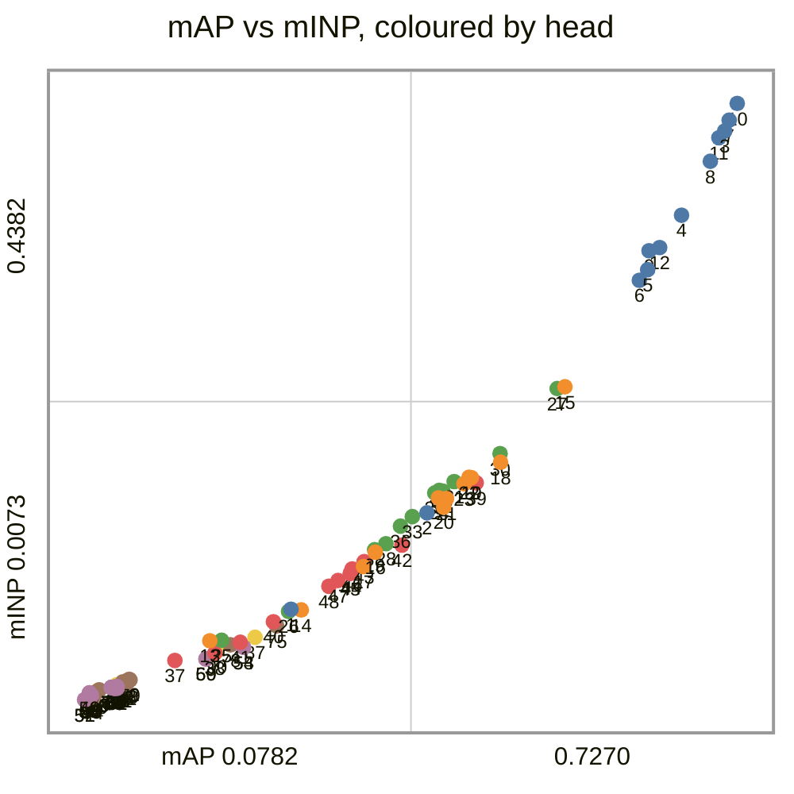
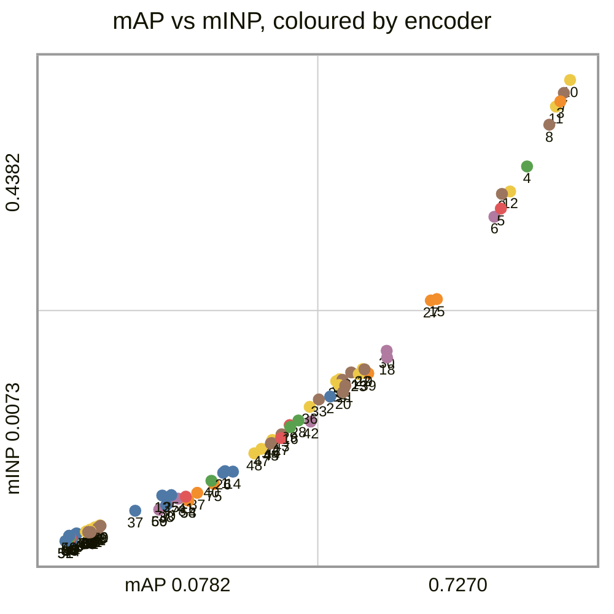
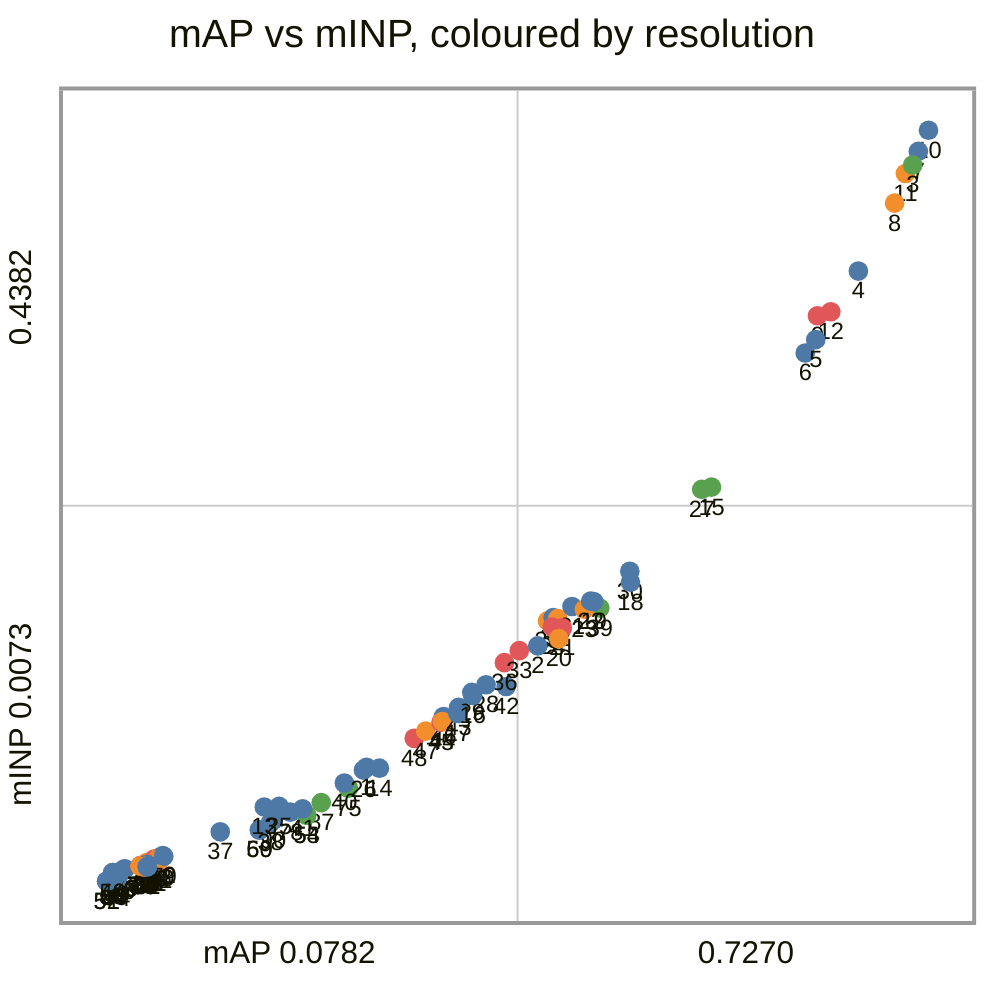

```mermaid
%%{init: {"themeVariables": {"xyChart": {"backgroundColor": "transparent", "plotColorPalette": "#4e79a7,#f28e2b,#59a14f,#e15759,#b07aa1,#9c755f,#edc948"}}, "xyChart": {"height": 1600, "width": 1320, "yAxis": {"showLabel": false}}}}%%
xychart-beta horizontal
    title "mAP, coloured by encoder"
    x-axis ["224x224 arcface vit_base_patch16_clip_224.openai crop · 28.34%", "224x224 arcface vit_base_patch16_clip_224.openai squash · 41.86%", "224x224 arcface vit_huge_plus_patch16_dinov3.lvd1689m squash · 67.17%", "224x224 arcface vit_large_patch16_dinov3.lvd1689m squash · 63.80%", "224x224 arcface vit_so400m_patch14_siglip_224.v2_webli squash · 62.97%", "224x224 arcface c-radio_v4-h squash · 71.90%", "224x224 arcface c-radio_v4-so400m squash · 72.70%", "224x224 arcface-msmt17 vit_base_patch16_clip_224.openai crop · 20.26%", "224x224 arcface-msmt17 vit_base_patch16_clip_224.openai squash · 29.35%", "224x224 arcface-msmt17 vit_huge_plus_patch16_dinov3.lvd1689m squash · 36.72%", "224x224 arcface-msmt17 vit_large_patch16_dinov3.lvd1689m squash · 35.55%", "224x224 arcface-msmt17 vit_so400m_patch14_siglip_224.v2_webli squash · 49.17%", "224x224 arcface-msmt17 c-radio_v4-h squash · 46.27%", "224x224 arcface-msmt17 c-radio_v4-so400m squash · 46.03%", "224x224 linear vit_base_patch16_clip_224.openai crop · 21.43%", "224x224 linear vit_base_patch16_clip_224.openai squash · 28.09%", "224x224 linear vit_huge_plus_patch16_dinov3.lvd1689m squash · 37.78%", "224x224 linear vit_large_patch16_dinov3.lvd1689m squash · 36.65%", "224x224 linear vit_so400m_patch14_siglip_224.v2_webli squash · 49.12%", "224x224 linear c-radio_v4-h squash · 44.56%", "224x224 linear c-radio_v4-so400m squash · 43.07%", "224x224 linear-msmt17 vit_base_patch16_clip_224.openai crop · 16.79%", "224x224 linear-msmt17 vit_base_patch16_clip_224.openai squash · 20.76%", "224x224 linear-msmt17 vit_huge_plus_patch16_dinov3.lvd1689m squash · 26.59%", "224x224 linear-msmt17 vit_large_patch16_dinov3.lvd1689m squash · 23.30%", "224x224 linear-msmt17 vit_so400m_patch14_siglip_224.v2_webli squash · 39.36%", "224x224 linear-msmt17 c-radio_v4-h squash · 35.61%", "224x224 linear-msmt17 c-radio_v4-so400m squash · 34.42%", "224x224 none vit_base_patch16_clip_224.openai crop · 8.30%", "224x224 none vit_base_patch16_clip_224.openai crop · 8.30%", "224x224 none vit_base_patch16_clip_224.openai squash · 7.82%", "224x224 none vit_base_patch16_clip_224.openai squash · 7.83%", "224x224 none vit_huge_plus_patch16_dinov3.lvd1689m squash · 8.28%", "224x224 none vit_huge_plus_patch16_dinov3.lvd1689m squash · 8.28%", "224x224 none vit_large_patch16_dinov3.lvd1689m squash · 8.50%", "224x224 none vit_large_patch16_dinov3.lvd1689m squash · 8.50%", "224x224 none vit_so400m_patch14_siglip_224.v2_webli squash · 19.88%", "224x224 none vit_so400m_patch14_siglip_224.v2_webli squash · 19.88%", "224x224 none c-radio_v4-h squash · 11.03%", "224x224 none c-radio_v4-h squash · 11.03%", "224x224 none c-radio_v4-so400m squash · 11.00%", "224x224 none c-radio_v4-so400m squash · 11.00%", "224x224 pca vit_base_patch16_clip_224.openai crop · 9.27%", "224x224 pca vit_base_patch16_clip_224.openai squash · 8.66%", "224x224 pca vit_huge_plus_patch16_dinov3.lvd1689m squash · 9.03%", "224x224 pca vit_large_patch16_dinov3.lvd1689m squash · 8.98%", "224x224 pca vit_so400m_patch14_siglip_224.v2_webli squash · 22.32%", "224x224 pca c-radio_v4-h squash · 12.33%", "224x224 pca c-radio_v4-so400m squash · 12.25%", "224x224 pca-msmt17 vit_base_patch16_clip_224.openai crop · 9.20%", "224x224 pca-msmt17 vit_base_patch16_clip_224.openai squash · 8.46%", "224x224 pca-msmt17 vit_huge_plus_patch16_dinov3.lvd1689m squash · 8.29%", "224x224 pca-msmt17 vit_large_patch16_dinov3.lvd1689m squash · 8.65%", "224x224 pca-msmt17 vit_so400m_patch14_siglip_224.v2_webli squash · 20.96%", "224x224 pca-msmt17 c-radio_v4-h squash · 11.52%", "224x224 pca-msmt17 c-radio_v4-so400m squash · 11.35%", "256x128 arcface c-radio_v4-h squash · 70.02%", "256x128 arcface c-radio_v4-so400m squash · 70.87%", "256x128 arcface-msmt17 c-radio_v4-h squash · 43.51%", "256x128 arcface-msmt17 c-radio_v4-so400m squash · 45.54%", "256x128 linear c-radio_v4-h squash · 43.43%", "256x128 linear c-radio_v4-so400m squash · 42.63%", "256x128 linear-msmt17 c-radio_v4-h squash · 34.33%", "256x128 linear-msmt17 c-radio_v4-so400m squash · 33.01%", "256x128 none c-radio_v4-h squash · 10.78%", "256x128 none c-radio_v4-h squash · 10.78%", "256x128 none c-radio_v4-so400m squash · 10.47%", "256x128 none c-radio_v4-so400m squash · 10.47%", "256x128 pca c-radio_v4-h squash · 12.14%", "256x128 pca c-radio_v4-so400m squash · 11.94%", "256x128 pca-msmt17 c-radio_v4-h squash · 11.39%", "256x128 pca-msmt17 c-radio_v4-so400m squash · 11.00%", "256x256 arcface vit_giantopt_patch16_siglip_256.v2_webli squash · 71.45%", "256x256 arcface-msmt17 vit_giantopt_patch16_siglip_256.v2_webli squash · 55.57%", "256x256 linear vit_giantopt_patch16_siglip_256.v2_webli squash · 54.80%", "256x256 linear-msmt17 vit_giantopt_patch16_siglip_256.v2_webli squash · 46.75%", "256x256 none vit_giantopt_patch16_siglip_256.v2_webli squash · 23.61%", "256x256 none vit_giantopt_patch16_siglip_256.v2_webli squash · 23.61%", "256x256 pca vit_giantopt_patch16_siglip_256.v2_webli squash · 26.91%", "256x256 pca-msmt17 vit_giantopt_patch16_siglip_256.v2_webli squash · 24.76%", "native arcface c-radio_v4-h squash · 63.93%", "native arcface c-radio_v4-so400m squash · 64.98%", "native arcface-msmt17 c-radio_v4-h squash · 43.80%", "native arcface-msmt17 c-radio_v4-so400m squash · 43.00%", "native linear c-radio_v4-h squash · 40.40%", "native linear c-radio_v4-so400m squash · 39.23%", "native linear-msmt17 c-radio_v4-h squash · 34.22%", "native linear-msmt17 c-radio_v4-so400m squash · 32.10%", "native none c-radio_v4-h squash · 10.78%", "native none c-radio_v4-h squash · 10.78%", "native none c-radio_v4-so400m squash · 10.47%", "native none c-radio_v4-so400m squash · 10.47%", "native pca c-radio_v4-h squash · 11.97%", "native pca c-radio_v4-so400m squash · 11.61%", "native pca-msmt17 c-radio_v4-h squash · 11.30%", "native pca-msmt17 c-radio_v4-so400m squash · 10.95%"]
    y-axis "mAP (%)" 0 --> 76.33
    bar [28.34, 41.86, 0.00, 0.00, 0.00, 0.00, 0.00, 20.26, 29.35, 0.00, 0.00, 0.00, 0.00, 0.00, 21.43, 28.09, 0.00, 0.00, 0.00, 0.00, 0.00, 16.79, 20.76, 0.00, 0.00, 0.00, 0.00, 0.00, 8.30, 8.30, 7.82, 7.83, 0.00, 0.00, 0.00, 0.00, 0.00, 0.00, 0.00, 0.00, 0.00, 0.00, 9.27, 8.66, 0.00, 0.00, 0.00, 0.00, 0.00, 9.20, 8.46, 0.00, 0.00, 0.00, 0.00, 0.00, 0.00, 0.00, 0.00, 0.00, 0.00, 0.00, 0.00, 0.00, 0.00, 0.00, 0.00, 0.00, 0.00, 0.00, 0.00, 0.00, 0.00, 0.00, 0.00, 0.00, 0.00, 0.00, 0.00, 0.00, 0.00, 0.00, 0.00, 0.00, 0.00, 0.00, 0.00, 0.00, 0.00, 0.00, 0.00, 0.00, 0.00, 0.00, 0.00, 0.00]
    bar [0.00, 0.00, 0.00, 0.00, 0.00, 0.00, 0.00, 0.00, 0.00, 0.00, 0.00, 0.00, 0.00, 0.00, 0.00, 0.00, 0.00, 0.00, 0.00, 0.00, 0.00, 0.00, 0.00, 0.00, 0.00, 0.00, 0.00, 0.00, 0.00, 0.00, 0.00, 0.00, 0.00, 0.00, 0.00, 0.00, 0.00, 0.00, 0.00, 0.00, 0.00, 0.00, 0.00, 0.00, 0.00, 0.00, 0.00, 0.00, 0.00, 0.00, 0.00, 0.00, 0.00, 0.00, 0.00, 0.00, 0.00, 0.00, 0.00, 0.00, 0.00, 0.00, 0.00, 0.00, 0.00, 0.00, 0.00, 0.00, 0.00, 0.00, 0.00, 0.00, 71.45, 55.57, 54.80, 46.75, 23.61, 23.61, 26.91, 24.76, 0.00, 0.00, 0.00, 0.00, 0.00, 0.00, 0.00, 0.00, 0.00, 0.00, 0.00, 0.00, 0.00, 0.00, 0.00, 0.00]
    bar [0.00, 0.00, 67.17, 0.00, 0.00, 0.00, 0.00, 0.00, 0.00, 36.72, 0.00, 0.00, 0.00, 0.00, 0.00, 0.00, 37.78, 0.00, 0.00, 0.00, 0.00, 0.00, 0.00, 26.59, 0.00, 0.00, 0.00, 0.00, 0.00, 0.00, 0.00, 0.00, 8.28, 8.28, 0.00, 0.00, 0.00, 0.00, 0.00, 0.00, 0.00, 0.00, 0.00, 0.00, 9.03, 0.00, 0.00, 0.00, 0.00, 0.00, 0.00, 8.29, 0.00, 0.00, 0.00, 0.00, 0.00, 0.00, 0.00, 0.00, 0.00, 0.00, 0.00, 0.00, 0.00, 0.00, 0.00, 0.00, 0.00, 0.00, 0.00, 0.00, 0.00, 0.00, 0.00, 0.00, 0.00, 0.00, 0.00, 0.00, 0.00, 0.00, 0.00, 0.00, 0.00, 0.00, 0.00, 0.00, 0.00, 0.00, 0.00, 0.00, 0.00, 0.00, 0.00, 0.00]
    bar [0.00, 0.00, 0.00, 63.80, 0.00, 0.00, 0.00, 0.00, 0.00, 0.00, 35.55, 0.00, 0.00, 0.00, 0.00, 0.00, 0.00, 36.65, 0.00, 0.00, 0.00, 0.00, 0.00, 0.00, 23.30, 0.00, 0.00, 0.00, 0.00, 0.00, 0.00, 0.00, 0.00, 0.00, 8.50, 8.50, 0.00, 0.00, 0.00, 0.00, 0.00, 0.00, 0.00, 0.00, 0.00, 8.98, 0.00, 0.00, 0.00, 0.00, 0.00, 0.00, 8.65, 0.00, 0.00, 0.00, 0.00, 0.00, 0.00, 0.00, 0.00, 0.00, 0.00, 0.00, 0.00, 0.00, 0.00, 0.00, 0.00, 0.00, 0.00, 0.00, 0.00, 0.00, 0.00, 0.00, 0.00, 0.00, 0.00, 0.00, 0.00, 0.00, 0.00, 0.00, 0.00, 0.00, 0.00, 0.00, 0.00, 0.00, 0.00, 0.00, 0.00, 0.00, 0.00, 0.00]
    bar [0.00, 0.00, 0.00, 0.00, 62.97, 0.00, 0.00, 0.00, 0.00, 0.00, 0.00, 49.17, 0.00, 0.00, 0.00, 0.00, 0.00, 0.00, 49.12, 0.00, 0.00, 0.00, 0.00, 0.00, 0.00, 39.36, 0.00, 0.00, 0.00, 0.00, 0.00, 0.00, 0.00, 0.00, 0.00, 0.00, 19.88, 19.88, 0.00, 0.00, 0.00, 0.00, 0.00, 0.00, 0.00, 0.00, 22.32, 0.00, 0.00, 0.00, 0.00, 0.00, 0.00, 20.96, 0.00, 0.00, 0.00, 0.00, 0.00, 0.00, 0.00, 0.00, 0.00, 0.00, 0.00, 0.00, 0.00, 0.00, 0.00, 0.00, 0.00, 0.00, 0.00, 0.00, 0.00, 0.00, 0.00, 0.00, 0.00, 0.00, 0.00, 0.00, 0.00, 0.00, 0.00, 0.00, 0.00, 0.00, 0.00, 0.00, 0.00, 0.00, 0.00, 0.00, 0.00, 0.00]
    bar [0.00, 0.00, 0.00, 0.00, 0.00, 71.90, 0.00, 0.00, 0.00, 0.00, 0.00, 0.00, 46.27, 0.00, 0.00, 0.00, 0.00, 0.00, 0.00, 44.56, 0.00, 0.00, 0.00, 0.00, 0.00, 0.00, 35.61, 0.00, 0.00, 0.00, 0.00, 0.00, 0.00, 0.00, 0.00, 0.00, 0.00, 0.00, 11.03, 11.03, 0.00, 0.00, 0.00, 0.00, 0.00, 0.00, 0.00, 12.33, 0.00, 0.00, 0.00, 0.00, 0.00, 0.00, 11.52, 0.00, 70.02, 0.00, 43.51, 0.00, 43.43, 0.00, 34.33, 0.00, 10.78, 10.78, 0.00, 0.00, 12.14, 0.00, 11.39, 0.00, 0.00, 0.00, 0.00, 0.00, 0.00, 0.00, 0.00, 0.00, 63.93, 0.00, 43.80, 0.00, 40.40, 0.00, 34.22, 0.00, 10.78, 10.78, 0.00, 0.00, 11.97, 0.00, 11.30, 0.00]
    bar [0.00, 0.00, 0.00, 0.00, 0.00, 0.00, 72.70, 0.00, 0.00, 0.00, 0.00, 0.00, 0.00, 46.03, 0.00, 0.00, 0.00, 0.00, 0.00, 0.00, 43.07, 0.00, 0.00, 0.00, 0.00, 0.00, 0.00, 34.42, 0.00, 0.00, 0.00, 0.00, 0.00, 0.00, 0.00, 0.00, 0.00, 0.00, 0.00, 0.00, 11.00, 11.00, 0.00, 0.00, 0.00, 0.00, 0.00, 0.00, 12.25, 0.00, 0.00, 0.00, 0.00, 0.00, 0.00, 11.35, 0.00, 70.87, 0.00, 45.54, 0.00, 42.63, 0.00, 33.01, 0.00, 0.00, 10.47, 10.47, 0.00, 11.94, 0.00, 11.00, 0.00, 0.00, 0.00, 0.00, 0.00, 0.00, 0.00, 0.00, 0.00, 64.98, 0.00, 43.00, 0.00, 39.23, 0.00, 32.10, 0.00, 0.00, 10.47, 10.47, 0.00, 11.61, 0.00, 10.95]
```

<!-- generated by `reidbench render`; edit the runs, not this file -->

# mars

[← table.md](../table.md)

## mars/official@1

### 🟦 arcface

|  # | encoder                                       | resolution | resize |        mAP |         R1 |         R5 |        R10 |       mINP |
|---:|-----------------------------------------------|------------|--------|-----------:|-----------:|-----------:|-----------:|-----------:|
|  1 | timm:vit_base_patch16_clip_224.openai         | 224x224    | crop   |     0.2834 |     0.4581 |     0.6303 |     0.6838 |     0.0727 |
|  2 | timm:vit_base_patch16_clip_224.openai         | 224x224    | squash |     0.4186 |     0.5934 |     0.7480 |     0.7965 |     0.1424 |
|  3 | timm:vit_giantopt_patch16_siglip_256.v2_webli | 256x256    | squash |     0.7145 |     0.8091 |     0.8970 |     0.9192 |     0.4183 |
|  4 | timm:vit_huge_plus_patch16_dinov3.lvd1689m    | 224x224    | squash |     0.6717 |     0.7641 |     0.8566 |     0.8768 |     0.3574 |
|  5 | timm:vit_large_patch16_dinov3.lvd1689m        | 224x224    | squash |     0.6380 |     0.7439 |     0.8328 |     0.8576 |     0.3181 |
|  6 | timm:vit_so400m_patch14_siglip_224.v2_webli   | 224x224    | squash |     0.6297 |     0.7495 |     0.8626 |     0.8934 |     0.3104 |
|  7 | torchhub:NVlabs/RADIO/c-radio_v4-h            | 224x224    | squash |     0.7190 | **0.8121** |     0.8949 |     0.9121 |     0.4261 |
|  8 | torchhub:NVlabs/RADIO/c-radio_v4-h            | 256x128    | squash |     0.7002 |     0.7995 |     0.8909 |     0.9091 |     0.3964 |
|  9 | torchhub:NVlabs/RADIO/c-radio_v4-h            | native     | squash |     0.6393 |     0.7530 |     0.8611 |     0.8864 |     0.3318 |
| 10 | torchhub:NVlabs/RADIO/c-radio_v4-so400m       | 224x224    | squash | **0.7270** |     0.8116 | **0.9071** | **0.9247** | **0.4382** |
| 11 | torchhub:NVlabs/RADIO/c-radio_v4-so400m       | 256x128    | squash |     0.7087 |     0.8000 |     0.8929 |     0.9146 |     0.4134 |
| 12 | torchhub:NVlabs/RADIO/c-radio_v4-so400m       | native     | squash |     0.6498 |     0.7667 |     0.8682 |     0.8899 |     0.3341 |

### 🟧 arcface-msmt17

|  # | encoder                                       | resolution | resize |        mAP |         R1 |         R5 |        R10 |       mINP |
|---:|-----------------------------------------------|------------|--------|-----------:|-----------:|-----------:|-----------:|-----------:|
| 13 | timm:vit_base_patch16_clip_224.openai         | 224x224    | crop   |     0.2026 |     0.3657 |     0.5419 |     0.6146 |     0.0500 |
| 14 | timm:vit_base_patch16_clip_224.openai         | 224x224    | squash |     0.2935 |     0.4929 |     0.6712 |     0.7348 |     0.0722 |
| 15 | timm:vit_giantopt_patch16_siglip_256.v2_webli | 256x256    | squash | **0.5557** | **0.7167** | **0.8348** | **0.8687** | **0.2335** |
| 16 | timm:vit_huge_plus_patch16_dinov3.lvd1689m    | 224x224    | squash |     0.3672 |     0.5379 |     0.6692 |     0.7131 |     0.1139 |
| 17 | timm:vit_large_patch16_dinov3.lvd1689m        | 224x224    | squash |     0.3555 |     0.5424 |     0.6702 |     0.7121 |     0.1036 |
| 18 | timm:vit_so400m_patch14_siglip_224.v2_webli   | 224x224    | squash |     0.4917 |     0.6758 |     0.8071 |     0.8449 |     0.1789 |
| 19 | torchhub:NVlabs/RADIO/c-radio_v4-h            | 224x224    | squash |     0.4627 |     0.6333 |     0.7783 |     0.8197 |     0.1678 |
| 20 | torchhub:NVlabs/RADIO/c-radio_v4-h            | 256x128    | squash |     0.4351 |     0.6237 |     0.7636 |     0.8086 |     0.1465 |
| 21 | torchhub:NVlabs/RADIO/c-radio_v4-h            | native     | squash |     0.4380 |     0.6152 |     0.7626 |     0.8111 |     0.1527 |
| 22 | torchhub:NVlabs/RADIO/c-radio_v4-so400m       | 224x224    | squash |     0.4603 |     0.6318 |     0.7798 |     0.8162 |     0.1681 |
| 23 | torchhub:NVlabs/RADIO/c-radio_v4-so400m       | 256x128    | squash |     0.4554 |     0.6394 |     0.7763 |     0.8146 |     0.1633 |
| 24 | torchhub:NVlabs/RADIO/c-radio_v4-so400m       | native     | squash |     0.4300 |     0.6015 |     0.7510 |     0.7929 |     0.1532 |

### 🟩 linear

|  # | encoder                                       | resolution | resize |        mAP |         R1 |         R5 |        R10 |       mINP |
|---:|-----------------------------------------------|------------|--------|-----------:|-----------:|-----------:|-----------:|-----------:|
| 25 | timm:vit_base_patch16_clip_224.openai         | 224x224    | crop   |     0.2143 |     0.3828 |     0.5596 |     0.6242 |     0.0503 |
| 26 | timm:vit_base_patch16_clip_224.openai         | 224x224    | squash |     0.2809 |     0.4631 |     0.6520 |     0.7293 |     0.0712 |
| 27 | timm:vit_giantopt_patch16_siglip_256.v2_webli | 256x256    | squash | **0.5480** | **0.7045** | **0.8369** | **0.8753** | **0.2322** |
| 28 | timm:vit_huge_plus_patch16_dinov3.lvd1689m    | 224x224    | squash |     0.3778 |     0.5520 |     0.7000 |     0.7394 |     0.1201 |
| 29 | timm:vit_large_patch16_dinov3.lvd1689m        | 224x224    | squash |     0.3665 |     0.5510 |     0.6914 |     0.7323 |     0.1157 |
| 30 | timm:vit_so400m_patch14_siglip_224.v2_webli   | 224x224    | squash |     0.4912 |     0.6581 |     0.8020 |     0.8495 |     0.1852 |
| 31 | torchhub:NVlabs/RADIO/c-radio_v4-h            | 224x224    | squash |     0.4456 |     0.6141 |     0.7652 |     0.8071 |     0.1650 |
| 32 | torchhub:NVlabs/RADIO/c-radio_v4-h            | 256x128    | squash |     0.4343 |     0.6101 |     0.7621 |     0.8015 |     0.1580 |
| 33 | torchhub:NVlabs/RADIO/c-radio_v4-h            | native     | squash |     0.4040 |     0.5848 |     0.7399 |     0.7909 |     0.1397 |
| 34 | torchhub:NVlabs/RADIO/c-radio_v4-so400m       | 224x224    | squash |     0.4307 |     0.6040 |     0.7621 |     0.8005 |     0.1586 |
| 35 | torchhub:NVlabs/RADIO/c-radio_v4-so400m       | 256x128    | squash |     0.4263 |     0.6081 |     0.7581 |     0.8005 |     0.1567 |
| 36 | torchhub:NVlabs/RADIO/c-radio_v4-so400m       | native     | squash |     0.3923 |     0.5742 |     0.7323 |     0.7823 |     0.1328 |

### 🟥 linear-msmt17

|  # | encoder                                       | resolution | resize |        mAP |         R1 |         R5 |        R10 |       mINP |
|---:|-----------------------------------------------|------------|--------|-----------:|-----------:|-----------:|-----------:|-----------:|
| 37 | timm:vit_base_patch16_clip_224.openai         | 224x224    | crop   |     0.1679 |     0.3308 |     0.4995 |     0.5621 |     0.0357 |
| 38 | timm:vit_base_patch16_clip_224.openai         | 224x224    | squash |     0.2076 |     0.3823 |     0.5707 |     0.6500 |     0.0410 |
| 39 | timm:vit_giantopt_patch16_siglip_256.v2_webli | 256x256    | squash | **0.4675** | **0.6636** | **0.7899** | **0.8298** | **0.1641** |
| 40 | timm:vit_huge_plus_patch16_dinov3.lvd1689m    | 224x224    | squash |     0.2659 |     0.4439 |     0.6121 |     0.6697 |     0.0637 |
| 41 | timm:vit_large_patch16_dinov3.lvd1689m        | 224x224    | squash |     0.2330 |     0.4081 |     0.5631 |     0.6278 |     0.0488 |
| 42 | timm:vit_so400m_patch14_siglip_224.v2_webli   | 224x224    | squash |     0.3936 |     0.5980 |     0.7444 |     0.7848 |     0.1191 |
| 43 | torchhub:NVlabs/RADIO/c-radio_v4-h            | 224x224    | squash |     0.3561 |     0.5384 |     0.7121 |     0.7631 |     0.1071 |
| 44 | torchhub:NVlabs/RADIO/c-radio_v4-h            | 256x128    | squash |     0.3433 |     0.5328 |     0.7081 |     0.7631 |     0.0990 |
| 45 | torchhub:NVlabs/RADIO/c-radio_v4-h            | native     | squash |     0.3422 |     0.5323 |     0.7000 |     0.7591 |     0.0985 |
| 46 | torchhub:NVlabs/RADIO/c-radio_v4-so400m       | 224x224    | squash |     0.3442 |     0.5379 |     0.6949 |     0.7475 |     0.1019 |
| 47 | torchhub:NVlabs/RADIO/c-radio_v4-so400m       | 256x128    | squash |     0.3301 |     0.5364 |     0.6990 |     0.7465 |     0.0935 |
| 48 | torchhub:NVlabs/RADIO/c-radio_v4-so400m       | native     | squash |     0.3210 |     0.5227 |     0.6864 |     0.7399 |     0.0894 |

### 🟪 none

|  # | encoder                                       | resolution | resize |        mAP |         R1 |         R5 |        R10 |       mINP |
|---:|-----------------------------------------------|------------|--------|-----------:|-----------:|-----------:|-----------:|-----------:|
| 49 | timm:vit_base_patch16_clip_224.openai         | 224x224    | crop   |     0.0830 |     0.2182 |     0.3389 |     0.3939 |     0.0123 |
| 50 | timm:vit_base_patch16_clip_224.openai         | 224x224    | crop   |     0.0830 |     0.2182 |     0.3389 |     0.3939 |     0.0123 |
| 51 | timm:vit_base_patch16_clip_224.openai         | 224x224    | squash |     0.0782 |     0.2015 |     0.3485 |     0.4136 |     0.0073 |
| 52 | timm:vit_base_patch16_clip_224.openai         | 224x224    | squash |     0.0783 |     0.2015 |     0.3485 |     0.4136 |     0.0073 |
| 53 | timm:vit_giantopt_patch16_siglip_256.v2_webli | 256x256    | squash | **0.2361** | **0.4732** | **0.6167** | **0.6707** | **0.0453** |
| 54 | timm:vit_giantopt_patch16_siglip_256.v2_webli | 256x256    | squash |     0.2361 | **0.4732** | **0.6167** | **0.6707** |     0.0453 |
| 55 | timm:vit_huge_plus_patch16_dinov3.lvd1689m    | 224x224    | squash |     0.0828 |     0.1944 |     0.3086 |     0.3596 |     0.0100 |
| 56 | timm:vit_huge_plus_patch16_dinov3.lvd1689m    | 224x224    | squash |     0.0828 |     0.1944 |     0.3086 |     0.3596 |     0.0100 |
| 57 | timm:vit_large_patch16_dinov3.lvd1689m        | 224x224    | squash |     0.0850 |     0.2025 |     0.3253 |     0.3843 |     0.0103 |
| 58 | timm:vit_large_patch16_dinov3.lvd1689m        | 224x224    | squash |     0.0850 |     0.2025 |     0.3253 |     0.3843 |     0.0103 |
| 59 | timm:vit_so400m_patch14_siglip_224.v2_webli   | 224x224    | squash |     0.1988 |     0.4096 |     0.5712 |     0.6202 |     0.0368 |
| 60 | timm:vit_so400m_patch14_siglip_224.v2_webli   | 224x224    | squash |     0.1988 |     0.4096 |     0.5712 |     0.6202 |     0.0368 |
| 61 | torchhub:NVlabs/RADIO/c-radio_v4-h            | 224x224    | squash |     0.1103 |     0.2475 |     0.3803 |     0.4515 |     0.0157 |
| 62 | torchhub:NVlabs/RADIO/c-radio_v4-h            | 224x224    | squash |     0.1103 |     0.2475 |     0.3803 |     0.4515 |     0.0157 |
| 63 | torchhub:NVlabs/RADIO/c-radio_v4-h            | 256x128    | squash |     0.1078 |     0.2394 |     0.3854 |     0.4535 |     0.0157 |
| 64 | torchhub:NVlabs/RADIO/c-radio_v4-h            | 256x128    | squash |     0.1078 |     0.2394 |     0.3854 |     0.4535 |     0.0157 |
| 65 | torchhub:NVlabs/RADIO/c-radio_v4-h            | native     | squash |     0.1078 |     0.2394 |     0.3854 |     0.4535 |     0.0157 |
| 66 | torchhub:NVlabs/RADIO/c-radio_v4-h            | native     | squash |     0.1078 |     0.2394 |     0.3854 |     0.4535 |     0.0157 |
| 67 | torchhub:NVlabs/RADIO/c-radio_v4-so400m       | 224x224    | squash |     0.1100 |     0.2439 |     0.3747 |     0.4455 |     0.0169 |
| 68 | torchhub:NVlabs/RADIO/c-radio_v4-so400m       | 224x224    | squash |     0.1100 |     0.2439 |     0.3753 |     0.4455 |     0.0169 |
| 69 | torchhub:NVlabs/RADIO/c-radio_v4-so400m       | 256x128    | squash |     0.1047 |     0.2354 |     0.3763 |     0.4419 |     0.0161 |
| 70 | torchhub:NVlabs/RADIO/c-radio_v4-so400m       | 256x128    | squash |     0.1047 |     0.2354 |     0.3763 |     0.4419 |     0.0161 |
| 71 | torchhub:NVlabs/RADIO/c-radio_v4-so400m       | native     | squash |     0.1047 |     0.2354 |     0.3763 |     0.4419 |     0.0161 |
| 72 | torchhub:NVlabs/RADIO/c-radio_v4-so400m       | native     | squash |     0.1047 |     0.2354 |     0.3763 |     0.4419 |     0.0161 |

### 🟫 pca

|  # | encoder                                       | resolution | resize |        mAP |         R1 |         R5 |        R10 |       mINP |
|---:|-----------------------------------------------|------------|--------|-----------:|-----------:|-----------:|-----------:|-----------:|
| 73 | timm:vit_base_patch16_clip_224.openai         | 224x224    | crop   |     0.0927 |     0.2253 |     0.3525 |     0.4111 |     0.0145 |
| 74 | timm:vit_base_patch16_clip_224.openai         | 224x224    | squash |     0.0866 |     0.2146 |     0.3520 |     0.4096 |     0.0090 |
| 75 | timm:vit_giantopt_patch16_siglip_256.v2_webli | 256x256    | squash | **0.2691** | **0.4944** | **0.6323** | **0.6823** | **0.0607** |
| 76 | timm:vit_huge_plus_patch16_dinov3.lvd1689m    | 224x224    | squash |     0.0903 |     0.1939 |     0.3162 |     0.3626 |     0.0128 |
| 77 | timm:vit_large_patch16_dinov3.lvd1689m        | 224x224    | squash |     0.0898 |     0.1970 |     0.3197 |     0.3712 |     0.0131 |
| 78 | timm:vit_so400m_patch14_siglip_224.v2_webli   | 224x224    | squash |     0.2232 |     0.4278 |     0.5848 |     0.6374 |     0.0470 |
| 79 | torchhub:NVlabs/RADIO/c-radio_v4-h            | 224x224    | squash |     0.1233 |     0.2460 |     0.3808 |     0.4520 |     0.0216 |
| 80 | torchhub:NVlabs/RADIO/c-radio_v4-h            | 256x128    | squash |     0.1214 |     0.2470 |     0.3864 |     0.4530 |     0.0204 |
| 81 | torchhub:NVlabs/RADIO/c-radio_v4-h            | native     | squash |     0.1197 |     0.2465 |     0.3838 |     0.4525 |     0.0192 |
| 82 | torchhub:NVlabs/RADIO/c-radio_v4-so400m       | 224x224    | squash |     0.1225 |     0.2500 |     0.3833 |     0.4455 |     0.0221 |
| 83 | torchhub:NVlabs/RADIO/c-radio_v4-so400m       | 256x128    | squash |     0.1194 |     0.2460 |     0.3793 |     0.4444 |     0.0208 |
| 84 | torchhub:NVlabs/RADIO/c-radio_v4-so400m       | native     | squash |     0.1161 |     0.2455 |     0.3747 |     0.4429 |     0.0203 |

### 🟨 pca-msmt17

|  # | encoder                                       | resolution | resize |        mAP |         R1 |         R5 |        R10 |       mINP |
|---:|-----------------------------------------------|------------|--------|-----------:|-----------:|-----------:|-----------:|-----------:|
| 85 | timm:vit_base_patch16_clip_224.openai         | 224x224    | crop   |     0.0920 |     0.2212 |     0.3475 |     0.4045 |     0.0144 |
| 86 | timm:vit_base_patch16_clip_224.openai         | 224x224    | squash |     0.0846 |     0.2020 |     0.3475 |     0.4086 |     0.0093 |
| 87 | timm:vit_giantopt_patch16_siglip_256.v2_webli | 256x256    | squash | **0.2476** | **0.4803** | **0.6177** | **0.6662** | **0.0525** |
| 88 | timm:vit_huge_plus_patch16_dinov3.lvd1689m    | 224x224    | squash |     0.0829 |     0.1869 |     0.3081 |     0.3611 |     0.0100 |
| 89 | timm:vit_large_patch16_dinov3.lvd1689m        | 224x224    | squash |     0.0865 |     0.2020 |     0.3192 |     0.3753 |     0.0111 |
| 90 | timm:vit_so400m_patch14_siglip_224.v2_webli   | 224x224    | squash |     0.2096 |     0.4167 |     0.5697 |     0.6167 |     0.0423 |
| 91 | torchhub:NVlabs/RADIO/c-radio_v4-h            | 224x224    | squash |     0.1152 |     0.2490 |     0.3848 |     0.4485 |     0.0173 |
| 92 | torchhub:NVlabs/RADIO/c-radio_v4-h            | 256x128    | squash |     0.1139 |     0.2455 |     0.3884 |     0.4510 |     0.0176 |
| 93 | torchhub:NVlabs/RADIO/c-radio_v4-h            | native     | squash |     0.1130 |     0.2439 |     0.3823 |     0.4530 |     0.0173 |
| 94 | torchhub:NVlabs/RADIO/c-radio_v4-so400m       | 224x224    | squash |     0.1135 |     0.2455 |     0.3879 |     0.4510 |     0.0179 |
| 95 | torchhub:NVlabs/RADIO/c-radio_v4-so400m       | 256x128    | squash |     0.1100 |     0.2409 |     0.3813 |     0.4520 |     0.0180 |
| 96 | torchhub:NVlabs/RADIO/c-radio_v4-so400m       | native     | squash |     0.1095 |     0.2394 |     0.3798 |     0.4505 |     0.0178 |

### Every row, by encoder and resolution

```mermaid
%%{init: {"themeVariables": {"xyChart": {"backgroundColor": "transparent", "plotColorPalette": "#4e79a7,#f28e2b,#59a14f,#e15759,#b07aa1,#9c755f,#edc948"}}, "xyChart": {"height": 1600, "width": 1320, "yAxis": {"showLabel": false}}}}%%
xychart-beta horizontal
    title "mAP, coloured by head"
    x-axis ["vit_base_patch16_clip_224.openai 224x224 arcface crop · 28.34%", "vit_base_patch16_clip_224.openai 224x224 arcface squash · 41.86%", "vit_base_patch16_clip_224.openai 224x224 arcface-msmt17 crop · 20.26%", "vit_base_patch16_clip_224.openai 224x224 arcface-msmt17 squash · 29.35%", "vit_base_patch16_clip_224.openai 224x224 linear crop · 21.43%", "vit_base_patch16_clip_224.openai 224x224 linear squash · 28.09%", "vit_base_patch16_clip_224.openai 224x224 linear-msmt17 crop · 16.79%", "vit_base_patch16_clip_224.openai 224x224 linear-msmt17 squash · 20.76%", "vit_base_patch16_clip_224.openai 224x224 none crop · 8.30%", "vit_base_patch16_clip_224.openai 224x224 none crop · 8.30%", "vit_base_patch16_clip_224.openai 224x224 none squash · 7.82%", "vit_base_patch16_clip_224.openai 224x224 none squash · 7.83%", "vit_base_patch16_clip_224.openai 224x224 pca crop · 9.27%", "vit_base_patch16_clip_224.openai 224x224 pca squash · 8.66%", "vit_base_patch16_clip_224.openai 224x224 pca-msmt17 crop · 9.20%", "vit_base_patch16_clip_224.openai 224x224 pca-msmt17 squash · 8.46%", "vit_giantopt_patch16_siglip_256.v2_webli 256x256 arcface squash · 71.45%", "vit_giantopt_patch16_siglip_256.v2_webli 256x256 arcface-msmt17 squash · 55.57%", "vit_giantopt_patch16_siglip_256.v2_webli 256x256 linear squash · 54.80%", "vit_giantopt_patch16_siglip_256.v2_webli 256x256 linear-msmt17 squash · 46.75%", "vit_giantopt_patch16_siglip_256.v2_webli 256x256 none squash · 23.61%", "vit_giantopt_patch16_siglip_256.v2_webli 256x256 none squash · 23.61%", "vit_giantopt_patch16_siglip_256.v2_webli 256x256 pca squash · 26.91%", "vit_giantopt_patch16_siglip_256.v2_webli 256x256 pca-msmt17 squash · 24.76%", "vit_huge_plus_patch16_dinov3.lvd1689m 224x224 arcface squash · 67.17%", "vit_huge_plus_patch16_dinov3.lvd1689m 224x224 arcface-msmt17 squash · 36.72%", "vit_huge_plus_patch16_dinov3.lvd1689m 224x224 linear squash · 37.78%", "vit_huge_plus_patch16_dinov3.lvd1689m 224x224 linear-msmt17 squash · 26.59%", "vit_huge_plus_patch16_dinov3.lvd1689m 224x224 none squash · 8.28%", "vit_huge_plus_patch16_dinov3.lvd1689m 224x224 none squash · 8.28%", "vit_huge_plus_patch16_dinov3.lvd1689m 224x224 pca squash · 9.03%", "vit_huge_plus_patch16_dinov3.lvd1689m 224x224 pca-msmt17 squash · 8.29%", "vit_large_patch16_dinov3.lvd1689m 224x224 arcface squash · 63.80%", "vit_large_patch16_dinov3.lvd1689m 224x224 arcface-msmt17 squash · 35.55%", "vit_large_patch16_dinov3.lvd1689m 224x224 linear squash · 36.65%", "vit_large_patch16_dinov3.lvd1689m 224x224 linear-msmt17 squash · 23.30%", "vit_large_patch16_dinov3.lvd1689m 224x224 none squash · 8.50%", "vit_large_patch16_dinov3.lvd1689m 224x224 none squash · 8.50%", "vit_large_patch16_dinov3.lvd1689m 224x224 pca squash · 8.98%", "vit_large_patch16_dinov3.lvd1689m 224x224 pca-msmt17 squash · 8.65%", "vit_so400m_patch14_siglip_224.v2_webli 224x224 arcface squash · 62.97%", "vit_so400m_patch14_siglip_224.v2_webli 224x224 arcface-msmt17 squash · 49.17%", "vit_so400m_patch14_siglip_224.v2_webli 224x224 linear squash · 49.12%", "vit_so400m_patch14_siglip_224.v2_webli 224x224 linear-msmt17 squash · 39.36%", "vit_so400m_patch14_siglip_224.v2_webli 224x224 none squash · 19.88%", "vit_so400m_patch14_siglip_224.v2_webli 224x224 none squash · 19.88%", "vit_so400m_patch14_siglip_224.v2_webli 224x224 pca squash · 22.32%", "vit_so400m_patch14_siglip_224.v2_webli 224x224 pca-msmt17 squash · 20.96%", "c-radio_v4-h 224x224 arcface squash · 71.90%", "c-radio_v4-h 224x224 arcface-msmt17 squash · 46.27%", "c-radio_v4-h 224x224 linear squash · 44.56%", "c-radio_v4-h 224x224 linear-msmt17 squash · 35.61%", "c-radio_v4-h 224x224 none squash · 11.03%", "c-radio_v4-h 224x224 none squash · 11.03%", "c-radio_v4-h 224x224 pca squash · 12.33%", "c-radio_v4-h 224x224 pca-msmt17 squash · 11.52%", "c-radio_v4-h 256x128 arcface squash · 70.02%", "c-radio_v4-h 256x128 arcface-msmt17 squash · 43.51%", "c-radio_v4-h 256x128 linear squash · 43.43%", "c-radio_v4-h 256x128 linear-msmt17 squash · 34.33%", "c-radio_v4-h 256x128 none squash · 10.78%", "c-radio_v4-h 256x128 none squash · 10.78%", "c-radio_v4-h 256x128 pca squash · 12.14%", "c-radio_v4-h 256x128 pca-msmt17 squash · 11.39%", "c-radio_v4-h native arcface squash · 63.93%", "c-radio_v4-h native arcface-msmt17 squash · 43.80%", "c-radio_v4-h native linear squash · 40.40%", "c-radio_v4-h native linear-msmt17 squash · 34.22%", "c-radio_v4-h native none squash · 10.78%", "c-radio_v4-h native none squash · 10.78%", "c-radio_v4-h native pca squash · 11.97%", "c-radio_v4-h native pca-msmt17 squash · 11.30%", "c-radio_v4-so400m 224x224 arcface squash · 72.70%", "c-radio_v4-so400m 224x224 arcface-msmt17 squash · 46.03%", "c-radio_v4-so400m 224x224 linear squash · 43.07%", "c-radio_v4-so400m 224x224 linear-msmt17 squash · 34.42%", "c-radio_v4-so400m 224x224 none squash · 11.00%", "c-radio_v4-so400m 224x224 none squash · 11.00%", "c-radio_v4-so400m 224x224 pca squash · 12.25%", "c-radio_v4-so400m 224x224 pca-msmt17 squash · 11.35%", "c-radio_v4-so400m 256x128 arcface squash · 70.87%", "c-radio_v4-so400m 256x128 arcface-msmt17 squash · 45.54%", "c-radio_v4-so400m 256x128 linear squash · 42.63%", "c-radio_v4-so400m 256x128 linear-msmt17 squash · 33.01%", "c-radio_v4-so400m 256x128 none squash · 10.47%", "c-radio_v4-so400m 256x128 none squash · 10.47%", "c-radio_v4-so400m 256x128 pca squash · 11.94%", "c-radio_v4-so400m 256x128 pca-msmt17 squash · 11.00%", "c-radio_v4-so400m native arcface squash · 64.98%", "c-radio_v4-so400m native arcface-msmt17 squash · 43.00%", "c-radio_v4-so400m native linear squash · 39.23%", "c-radio_v4-so400m native linear-msmt17 squash · 32.10%", "c-radio_v4-so400m native none squash · 10.47%", "c-radio_v4-so400m native none squash · 10.47%", "c-radio_v4-so400m native pca squash · 11.61%", "c-radio_v4-so400m native pca-msmt17 squash · 10.95%"]
    y-axis "mAP (%)" 0 --> 76.33
    bar [28.34, 41.86, 0.00, 0.00, 0.00, 0.00, 0.00, 0.00, 0.00, 0.00, 0.00, 0.00, 0.00, 0.00, 0.00, 0.00, 71.45, 0.00, 0.00, 0.00, 0.00, 0.00, 0.00, 0.00, 67.17, 0.00, 0.00, 0.00, 0.00, 0.00, 0.00, 0.00, 63.80, 0.00, 0.00, 0.00, 0.00, 0.00, 0.00, 0.00, 62.97, 0.00, 0.00, 0.00, 0.00, 0.00, 0.00, 0.00, 71.90, 0.00, 0.00, 0.00, 0.00, 0.00, 0.00, 0.00, 70.02, 0.00, 0.00, 0.00, 0.00, 0.00, 0.00, 0.00, 63.93, 0.00, 0.00, 0.00, 0.00, 0.00, 0.00, 0.00, 72.70, 0.00, 0.00, 0.00, 0.00, 0.00, 0.00, 0.00, 70.87, 0.00, 0.00, 0.00, 0.00, 0.00, 0.00, 0.00, 64.98, 0.00, 0.00, 0.00, 0.00, 0.00, 0.00, 0.00]
    bar [0.00, 0.00, 20.26, 29.35, 0.00, 0.00, 0.00, 0.00, 0.00, 0.00, 0.00, 0.00, 0.00, 0.00, 0.00, 0.00, 0.00, 55.57, 0.00, 0.00, 0.00, 0.00, 0.00, 0.00, 0.00, 36.72, 0.00, 0.00, 0.00, 0.00, 0.00, 0.00, 0.00, 35.55, 0.00, 0.00, 0.00, 0.00, 0.00, 0.00, 0.00, 49.17, 0.00, 0.00, 0.00, 0.00, 0.00, 0.00, 0.00, 46.27, 0.00, 0.00, 0.00, 0.00, 0.00, 0.00, 0.00, 43.51, 0.00, 0.00, 0.00, 0.00, 0.00, 0.00, 0.00, 43.80, 0.00, 0.00, 0.00, 0.00, 0.00, 0.00, 0.00, 46.03, 0.00, 0.00, 0.00, 0.00, 0.00, 0.00, 0.00, 45.54, 0.00, 0.00, 0.00, 0.00, 0.00, 0.00, 0.00, 43.00, 0.00, 0.00, 0.00, 0.00, 0.00, 0.00]
    bar [0.00, 0.00, 0.00, 0.00, 21.43, 28.09, 0.00, 0.00, 0.00, 0.00, 0.00, 0.00, 0.00, 0.00, 0.00, 0.00, 0.00, 0.00, 54.80, 0.00, 0.00, 0.00, 0.00, 0.00, 0.00, 0.00, 37.78, 0.00, 0.00, 0.00, 0.00, 0.00, 0.00, 0.00, 36.65, 0.00, 0.00, 0.00, 0.00, 0.00, 0.00, 0.00, 49.12, 0.00, 0.00, 0.00, 0.00, 0.00, 0.00, 0.00, 44.56, 0.00, 0.00, 0.00, 0.00, 0.00, 0.00, 0.00, 43.43, 0.00, 0.00, 0.00, 0.00, 0.00, 0.00, 0.00, 40.40, 0.00, 0.00, 0.00, 0.00, 0.00, 0.00, 0.00, 43.07, 0.00, 0.00, 0.00, 0.00, 0.00, 0.00, 0.00, 42.63, 0.00, 0.00, 0.00, 0.00, 0.00, 0.00, 0.00, 39.23, 0.00, 0.00, 0.00, 0.00, 0.00]
    bar [0.00, 0.00, 0.00, 0.00, 0.00, 0.00, 16.79, 20.76, 0.00, 0.00, 0.00, 0.00, 0.00, 0.00, 0.00, 0.00, 0.00, 0.00, 0.00, 46.75, 0.00, 0.00, 0.00, 0.00, 0.00, 0.00, 0.00, 26.59, 0.00, 0.00, 0.00, 0.00, 0.00, 0.00, 0.00, 23.30, 0.00, 0.00, 0.00, 0.00, 0.00, 0.00, 0.00, 39.36, 0.00, 0.00, 0.00, 0.00, 0.00, 0.00, 0.00, 35.61, 0.00, 0.00, 0.00, 0.00, 0.00, 0.00, 0.00, 34.33, 0.00, 0.00, 0.00, 0.00, 0.00, 0.00, 0.00, 34.22, 0.00, 0.00, 0.00, 0.00, 0.00, 0.00, 0.00, 34.42, 0.00, 0.00, 0.00, 0.00, 0.00, 0.00, 0.00, 33.01, 0.00, 0.00, 0.00, 0.00, 0.00, 0.00, 0.00, 32.10, 0.00, 0.00, 0.00, 0.00]
    bar [0.00, 0.00, 0.00, 0.00, 0.00, 0.00, 0.00, 0.00, 8.30, 8.30, 7.82, 7.83, 0.00, 0.00, 0.00, 0.00, 0.00, 0.00, 0.00, 0.00, 23.61, 23.61, 0.00, 0.00, 0.00, 0.00, 0.00, 0.00, 8.28, 8.28, 0.00, 0.00, 0.00, 0.00, 0.00, 0.00, 8.50, 8.50, 0.00, 0.00, 0.00, 0.00, 0.00, 0.00, 19.88, 19.88, 0.00, 0.00, 0.00, 0.00, 0.00, 0.00, 11.03, 11.03, 0.00, 0.00, 0.00, 0.00, 0.00, 0.00, 10.78, 10.78, 0.00, 0.00, 0.00, 0.00, 0.00, 0.00, 10.78, 10.78, 0.00, 0.00, 0.00, 0.00, 0.00, 0.00, 11.00, 11.00, 0.00, 0.00, 0.00, 0.00, 0.00, 0.00, 10.47, 10.47, 0.00, 0.00, 0.00, 0.00, 0.00, 0.00, 10.47, 10.47, 0.00, 0.00]
    bar [0.00, 0.00, 0.00, 0.00, 0.00, 0.00, 0.00, 0.00, 0.00, 0.00, 0.00, 0.00, 9.27, 8.66, 0.00, 0.00, 0.00, 0.00, 0.00, 0.00, 0.00, 0.00, 26.91, 0.00, 0.00, 0.00, 0.00, 0.00, 0.00, 0.00, 9.03, 0.00, 0.00, 0.00, 0.00, 0.00, 0.00, 0.00, 8.98, 0.00, 0.00, 0.00, 0.00, 0.00, 0.00, 0.00, 22.32, 0.00, 0.00, 0.00, 0.00, 0.00, 0.00, 0.00, 12.33, 0.00, 0.00, 0.00, 0.00, 0.00, 0.00, 0.00, 12.14, 0.00, 0.00, 0.00, 0.00, 0.00, 0.00, 0.00, 11.97, 0.00, 0.00, 0.00, 0.00, 0.00, 0.00, 0.00, 12.25, 0.00, 0.00, 0.00, 0.00, 0.00, 0.00, 0.00, 11.94, 0.00, 0.00, 0.00, 0.00, 0.00, 0.00, 0.00, 11.61, 0.00]
    bar [0.00, 0.00, 0.00, 0.00, 0.00, 0.00, 0.00, 0.00, 0.00, 0.00, 0.00, 0.00, 0.00, 0.00, 9.20, 8.46, 0.00, 0.00, 0.00, 0.00, 0.00, 0.00, 0.00, 24.76, 0.00, 0.00, 0.00, 0.00, 0.00, 0.00, 0.00, 8.29, 0.00, 0.00, 0.00, 0.00, 0.00, 0.00, 0.00, 8.65, 0.00, 0.00, 0.00, 0.00, 0.00, 0.00, 0.00, 20.96, 0.00, 0.00, 0.00, 0.00, 0.00, 0.00, 0.00, 11.52, 0.00, 0.00, 0.00, 0.00, 0.00, 0.00, 0.00, 11.39, 0.00, 0.00, 0.00, 0.00, 0.00, 0.00, 0.00, 11.30, 0.00, 0.00, 0.00, 0.00, 0.00, 0.00, 0.00, 11.35, 0.00, 0.00, 0.00, 0.00, 0.00, 0.00, 0.00, 11.00, 0.00, 0.00, 0.00, 0.00, 0.00, 0.00, 0.00, 10.95]
```

### By head — does the probe carry it?

```mermaid
%%{init: {"themeVariables": {"xyChart": {"backgroundColor": "transparent", "plotColorPalette": "#4e79a7,#f28e2b,#59a14f,#e15759,#b07aa1,#9c755f,#edc948"}}, "xyChart": {"height": 1600, "width": 1320, "yAxis": {"showLabel": false}}}}%%
xychart-beta horizontal
    title "mAP, coloured by head"
    x-axis ["arcface vit_base_patch16_clip_224.openai 224x224 crop · 28.34%", "arcface vit_base_patch16_clip_224.openai 224x224 squash · 41.86%", "arcface vit_giantopt_patch16_siglip_256.v2_webli 256x256 squash · 71.45%", "arcface vit_huge_plus_patch16_dinov3.lvd1689m 224x224 squash · 67.17%", "arcface vit_large_patch16_dinov3.lvd1689m 224x224 squash · 63.80%", "arcface vit_so400m_patch14_siglip_224.v2_webli 224x224 squash · 62.97%", "arcface c-radio_v4-h 224x224 squash · 71.90%", "arcface c-radio_v4-h 256x128 squash · 70.02%", "arcface c-radio_v4-h native squash · 63.93%", "arcface c-radio_v4-so400m 224x224 squash · 72.70%", "arcface c-radio_v4-so400m 256x128 squash · 70.87%", "arcface c-radio_v4-so400m native squash · 64.98%", "arcface-msmt17 vit_base_patch16_clip_224.openai 224x224 crop · 20.26%", "arcface-msmt17 vit_base_patch16_clip_224.openai 224x224 squash · 29.35%", "arcface-msmt17 vit_giantopt_patch16_siglip_256.v2_webli 256x256 squash · 55.57%", "arcface-msmt17 vit_huge_plus_patch16_dinov3.lvd1689m 224x224 squash · 36.72%", "arcface-msmt17 vit_large_patch16_dinov3.lvd1689m 224x224 squash · 35.55%", "arcface-msmt17 vit_so400m_patch14_siglip_224.v2_webli 224x224 squash · 49.17%", "arcface-msmt17 c-radio_v4-h 224x224 squash · 46.27%", "arcface-msmt17 c-radio_v4-h 256x128 squash · 43.51%", "arcface-msmt17 c-radio_v4-h native squash · 43.80%", "arcface-msmt17 c-radio_v4-so400m 224x224 squash · 46.03%", "arcface-msmt17 c-radio_v4-so400m 256x128 squash · 45.54%", "arcface-msmt17 c-radio_v4-so400m native squash · 43.00%", "linear vit_base_patch16_clip_224.openai 224x224 crop · 21.43%", "linear vit_base_patch16_clip_224.openai 224x224 squash · 28.09%", "linear vit_giantopt_patch16_siglip_256.v2_webli 256x256 squash · 54.80%", "linear vit_huge_plus_patch16_dinov3.lvd1689m 224x224 squash · 37.78%", "linear vit_large_patch16_dinov3.lvd1689m 224x224 squash · 36.65%", "linear vit_so400m_patch14_siglip_224.v2_webli 224x224 squash · 49.12%", "linear c-radio_v4-h 224x224 squash · 44.56%", "linear c-radio_v4-h 256x128 squash · 43.43%", "linear c-radio_v4-h native squash · 40.40%", "linear c-radio_v4-so400m 224x224 squash · 43.07%", "linear c-radio_v4-so400m 256x128 squash · 42.63%", "linear c-radio_v4-so400m native squash · 39.23%", "linear-msmt17 vit_base_patch16_clip_224.openai 224x224 crop · 16.79%", "linear-msmt17 vit_base_patch16_clip_224.openai 224x224 squash · 20.76%", "linear-msmt17 vit_giantopt_patch16_siglip_256.v2_webli 256x256 squash · 46.75%", "linear-msmt17 vit_huge_plus_patch16_dinov3.lvd1689m 224x224 squash · 26.59%", "linear-msmt17 vit_large_patch16_dinov3.lvd1689m 224x224 squash · 23.30%", "linear-msmt17 vit_so400m_patch14_siglip_224.v2_webli 224x224 squash · 39.36%", "linear-msmt17 c-radio_v4-h 224x224 squash · 35.61%", "linear-msmt17 c-radio_v4-h 256x128 squash · 34.33%", "linear-msmt17 c-radio_v4-h native squash · 34.22%", "linear-msmt17 c-radio_v4-so400m 224x224 squash · 34.42%", "linear-msmt17 c-radio_v4-so400m 256x128 squash · 33.01%", "linear-msmt17 c-radio_v4-so400m native squash · 32.10%", "none vit_base_patch16_clip_224.openai 224x224 crop · 8.30%", "none vit_base_patch16_clip_224.openai 224x224 crop · 8.30%", "none vit_base_patch16_clip_224.openai 224x224 squash · 7.82%", "none vit_base_patch16_clip_224.openai 224x224 squash · 7.83%", "none vit_giantopt_patch16_siglip_256.v2_webli 256x256 squash · 23.61%", "none vit_giantopt_patch16_siglip_256.v2_webli 256x256 squash · 23.61%", "none vit_huge_plus_patch16_dinov3.lvd1689m 224x224 squash · 8.28%", "none vit_huge_plus_patch16_dinov3.lvd1689m 224x224 squash · 8.28%", "none vit_large_patch16_dinov3.lvd1689m 224x224 squash · 8.50%", "none vit_large_patch16_dinov3.lvd1689m 224x224 squash · 8.50%", "none vit_so400m_patch14_siglip_224.v2_webli 224x224 squash · 19.88%", "none vit_so400m_patch14_siglip_224.v2_webli 224x224 squash · 19.88%", "none c-radio_v4-h 224x224 squash · 11.03%", "none c-radio_v4-h 224x224 squash · 11.03%", "none c-radio_v4-h 256x128 squash · 10.78%", "none c-radio_v4-h 256x128 squash · 10.78%", "none c-radio_v4-h native squash · 10.78%", "none c-radio_v4-h native squash · 10.78%", "none c-radio_v4-so400m 224x224 squash · 11.00%", "none c-radio_v4-so400m 224x224 squash · 11.00%", "none c-radio_v4-so400m 256x128 squash · 10.47%", "none c-radio_v4-so400m 256x128 squash · 10.47%", "none c-radio_v4-so400m native squash · 10.47%", "none c-radio_v4-so400m native squash · 10.47%", "pca vit_base_patch16_clip_224.openai 224x224 crop · 9.27%", "pca vit_base_patch16_clip_224.openai 224x224 squash · 8.66%", "pca vit_giantopt_patch16_siglip_256.v2_webli 256x256 squash · 26.91%", "pca vit_huge_plus_patch16_dinov3.lvd1689m 224x224 squash · 9.03%", "pca vit_large_patch16_dinov3.lvd1689m 224x224 squash · 8.98%", "pca vit_so400m_patch14_siglip_224.v2_webli 224x224 squash · 22.32%", "pca c-radio_v4-h 224x224 squash · 12.33%", "pca c-radio_v4-h 256x128 squash · 12.14%", "pca c-radio_v4-h native squash · 11.97%", "pca c-radio_v4-so400m 224x224 squash · 12.25%", "pca c-radio_v4-so400m 256x128 squash · 11.94%", "pca c-radio_v4-so400m native squash · 11.61%", "pca-msmt17 vit_base_patch16_clip_224.openai 224x224 crop · 9.20%", "pca-msmt17 vit_base_patch16_clip_224.openai 224x224 squash · 8.46%", "pca-msmt17 vit_giantopt_patch16_siglip_256.v2_webli 256x256 squash · 24.76%", "pca-msmt17 vit_huge_plus_patch16_dinov3.lvd1689m 224x224 squash · 8.29%", "pca-msmt17 vit_large_patch16_dinov3.lvd1689m 224x224 squash · 8.65%", "pca-msmt17 vit_so400m_patch14_siglip_224.v2_webli 224x224 squash · 20.96%", "pca-msmt17 c-radio_v4-h 224x224 squash · 11.52%", "pca-msmt17 c-radio_v4-h 256x128 squash · 11.39%", "pca-msmt17 c-radio_v4-h native squash · 11.30%", "pca-msmt17 c-radio_v4-so400m 224x224 squash · 11.35%", "pca-msmt17 c-radio_v4-so400m 256x128 squash · 11.00%", "pca-msmt17 c-radio_v4-so400m native squash · 10.95%"]
    y-axis "mAP (%)" 0 --> 76.33
    bar [28.34, 41.86, 71.45, 67.17, 63.80, 62.97, 71.90, 70.02, 63.93, 72.70, 70.87, 64.98, 0.00, 0.00, 0.00, 0.00, 0.00, 0.00, 0.00, 0.00, 0.00, 0.00, 0.00, 0.00, 0.00, 0.00, 0.00, 0.00, 0.00, 0.00, 0.00, 0.00, 0.00, 0.00, 0.00, 0.00, 0.00, 0.00, 0.00, 0.00, 0.00, 0.00, 0.00, 0.00, 0.00, 0.00, 0.00, 0.00, 0.00, 0.00, 0.00, 0.00, 0.00, 0.00, 0.00, 0.00, 0.00, 0.00, 0.00, 0.00, 0.00, 0.00, 0.00, 0.00, 0.00, 0.00, 0.00, 0.00, 0.00, 0.00, 0.00, 0.00, 0.00, 0.00, 0.00, 0.00, 0.00, 0.00, 0.00, 0.00, 0.00, 0.00, 0.00, 0.00, 0.00, 0.00, 0.00, 0.00, 0.00, 0.00, 0.00, 0.00, 0.00, 0.00, 0.00, 0.00]
    bar [0.00, 0.00, 0.00, 0.00, 0.00, 0.00, 0.00, 0.00, 0.00, 0.00, 0.00, 0.00, 20.26, 29.35, 55.57, 36.72, 35.55, 49.17, 46.27, 43.51, 43.80, 46.03, 45.54, 43.00, 0.00, 0.00, 0.00, 0.00, 0.00, 0.00, 0.00, 0.00, 0.00, 0.00, 0.00, 0.00, 0.00, 0.00, 0.00, 0.00, 0.00, 0.00, 0.00, 0.00, 0.00, 0.00, 0.00, 0.00, 0.00, 0.00, 0.00, 0.00, 0.00, 0.00, 0.00, 0.00, 0.00, 0.00, 0.00, 0.00, 0.00, 0.00, 0.00, 0.00, 0.00, 0.00, 0.00, 0.00, 0.00, 0.00, 0.00, 0.00, 0.00, 0.00, 0.00, 0.00, 0.00, 0.00, 0.00, 0.00, 0.00, 0.00, 0.00, 0.00, 0.00, 0.00, 0.00, 0.00, 0.00, 0.00, 0.00, 0.00, 0.00, 0.00, 0.00, 0.00]
    bar [0.00, 0.00, 0.00, 0.00, 0.00, 0.00, 0.00, 0.00, 0.00, 0.00, 0.00, 0.00, 0.00, 0.00, 0.00, 0.00, 0.00, 0.00, 0.00, 0.00, 0.00, 0.00, 0.00, 0.00, 21.43, 28.09, 54.80, 37.78, 36.65, 49.12, 44.56, 43.43, 40.40, 43.07, 42.63, 39.23, 0.00, 0.00, 0.00, 0.00, 0.00, 0.00, 0.00, 0.00, 0.00, 0.00, 0.00, 0.00, 0.00, 0.00, 0.00, 0.00, 0.00, 0.00, 0.00, 0.00, 0.00, 0.00, 0.00, 0.00, 0.00, 0.00, 0.00, 0.00, 0.00, 0.00, 0.00, 0.00, 0.00, 0.00, 0.00, 0.00, 0.00, 0.00, 0.00, 0.00, 0.00, 0.00, 0.00, 0.00, 0.00, 0.00, 0.00, 0.00, 0.00, 0.00, 0.00, 0.00, 0.00, 0.00, 0.00, 0.00, 0.00, 0.00, 0.00, 0.00]
    bar [0.00, 0.00, 0.00, 0.00, 0.00, 0.00, 0.00, 0.00, 0.00, 0.00, 0.00, 0.00, 0.00, 0.00, 0.00, 0.00, 0.00, 0.00, 0.00, 0.00, 0.00, 0.00, 0.00, 0.00, 0.00, 0.00, 0.00, 0.00, 0.00, 0.00, 0.00, 0.00, 0.00, 0.00, 0.00, 0.00, 16.79, 20.76, 46.75, 26.59, 23.30, 39.36, 35.61, 34.33, 34.22, 34.42, 33.01, 32.10, 0.00, 0.00, 0.00, 0.00, 0.00, 0.00, 0.00, 0.00, 0.00, 0.00, 0.00, 0.00, 0.00, 0.00, 0.00, 0.00, 0.00, 0.00, 0.00, 0.00, 0.00, 0.00, 0.00, 0.00, 0.00, 0.00, 0.00, 0.00, 0.00, 0.00, 0.00, 0.00, 0.00, 0.00, 0.00, 0.00, 0.00, 0.00, 0.00, 0.00, 0.00, 0.00, 0.00, 0.00, 0.00, 0.00, 0.00, 0.00]
    bar [0.00, 0.00, 0.00, 0.00, 0.00, 0.00, 0.00, 0.00, 0.00, 0.00, 0.00, 0.00, 0.00, 0.00, 0.00, 0.00, 0.00, 0.00, 0.00, 0.00, 0.00, 0.00, 0.00, 0.00, 0.00, 0.00, 0.00, 0.00, 0.00, 0.00, 0.00, 0.00, 0.00, 0.00, 0.00, 0.00, 0.00, 0.00, 0.00, 0.00, 0.00, 0.00, 0.00, 0.00, 0.00, 0.00, 0.00, 0.00, 8.30, 8.30, 7.82, 7.83, 23.61, 23.61, 8.28, 8.28, 8.50, 8.50, 19.88, 19.88, 11.03, 11.03, 10.78, 10.78, 10.78, 10.78, 11.00, 11.00, 10.47, 10.47, 10.47, 10.47, 0.00, 0.00, 0.00, 0.00, 0.00, 0.00, 0.00, 0.00, 0.00, 0.00, 0.00, 0.00, 0.00, 0.00, 0.00, 0.00, 0.00, 0.00, 0.00, 0.00, 0.00, 0.00, 0.00, 0.00]
    bar [0.00, 0.00, 0.00, 0.00, 0.00, 0.00, 0.00, 0.00, 0.00, 0.00, 0.00, 0.00, 0.00, 0.00, 0.00, 0.00, 0.00, 0.00, 0.00, 0.00, 0.00, 0.00, 0.00, 0.00, 0.00, 0.00, 0.00, 0.00, 0.00, 0.00, 0.00, 0.00, 0.00, 0.00, 0.00, 0.00, 0.00, 0.00, 0.00, 0.00, 0.00, 0.00, 0.00, 0.00, 0.00, 0.00, 0.00, 0.00, 0.00, 0.00, 0.00, 0.00, 0.00, 0.00, 0.00, 0.00, 0.00, 0.00, 0.00, 0.00, 0.00, 0.00, 0.00, 0.00, 0.00, 0.00, 0.00, 0.00, 0.00, 0.00, 0.00, 0.00, 9.27, 8.66, 26.91, 9.03, 8.98, 22.32, 12.33, 12.14, 11.97, 12.25, 11.94, 11.61, 0.00, 0.00, 0.00, 0.00, 0.00, 0.00, 0.00, 0.00, 0.00, 0.00, 0.00, 0.00]
    bar [0.00, 0.00, 0.00, 0.00, 0.00, 0.00, 0.00, 0.00, 0.00, 0.00, 0.00, 0.00, 0.00, 0.00, 0.00, 0.00, 0.00, 0.00, 0.00, 0.00, 0.00, 0.00, 0.00, 0.00, 0.00, 0.00, 0.00, 0.00, 0.00, 0.00, 0.00, 0.00, 0.00, 0.00, 0.00, 0.00, 0.00, 0.00, 0.00, 0.00, 0.00, 0.00, 0.00, 0.00, 0.00, 0.00, 0.00, 0.00, 0.00, 0.00, 0.00, 0.00, 0.00, 0.00, 0.00, 0.00, 0.00, 0.00, 0.00, 0.00, 0.00, 0.00, 0.00, 0.00, 0.00, 0.00, 0.00, 0.00, 0.00, 0.00, 0.00, 0.00, 0.00, 0.00, 0.00, 0.00, 0.00, 0.00, 0.00, 0.00, 0.00, 0.00, 0.00, 0.00, 9.20, 8.46, 24.76, 8.29, 8.65, 20.96, 11.52, 11.39, 11.30, 11.35, 11.00, 10.95]
```

### By encoder — does the checkpoint carry it?

*Colour — encoder:* 🟦 timm:vit_base_patch16_clip_224.openai · 🟧 timm:vit_giantopt_patch16_siglip_256.v2_webli · 🟩 timm:vit_huge_plus_patch16_dinov3.lvd1689m · 🟥 timm:vit_large_patch16_dinov3.lvd1689m · 🟪 timm:vit_so400m_patch14_siglip_224.v2_webli · 🟫 torchhub:NVlabs/RADIO/c-radio_v4-h · 🟨 torchhub:NVlabs/RADIO/c-radio_v4-so400m

```mermaid
%%{init: {"themeVariables": {"xyChart": {"backgroundColor": "transparent", "plotColorPalette": "#4e79a7,#f28e2b,#59a14f,#e15759,#b07aa1,#9c755f,#edc948"}}, "xyChart": {"height": 1600, "width": 1320, "yAxis": {"showLabel": false}}}}%%
xychart-beta horizontal
    title "mAP, coloured by encoder"
    x-axis ["vit_base_patch16_clip_224.openai arcface 224x224 crop · 28.34%", "vit_base_patch16_clip_224.openai arcface 224x224 squash · 41.86%", "vit_base_patch16_clip_224.openai arcface-msmt17 224x224 crop · 20.26%", "vit_base_patch16_clip_224.openai arcface-msmt17 224x224 squash · 29.35%", "vit_base_patch16_clip_224.openai linear 224x224 crop · 21.43%", "vit_base_patch16_clip_224.openai linear 224x224 squash · 28.09%", "vit_base_patch16_clip_224.openai linear-msmt17 224x224 crop · 16.79%", "vit_base_patch16_clip_224.openai linear-msmt17 224x224 squash · 20.76%", "vit_base_patch16_clip_224.openai none 224x224 crop · 8.30%", "vit_base_patch16_clip_224.openai none 224x224 crop · 8.30%", "vit_base_patch16_clip_224.openai none 224x224 squash · 7.82%", "vit_base_patch16_clip_224.openai none 224x224 squash · 7.83%", "vit_base_patch16_clip_224.openai pca 224x224 crop · 9.27%", "vit_base_patch16_clip_224.openai pca 224x224 squash · 8.66%", "vit_base_patch16_clip_224.openai pca-msmt17 224x224 crop · 9.20%", "vit_base_patch16_clip_224.openai pca-msmt17 224x224 squash · 8.46%", "vit_giantopt_patch16_siglip_256.v2_webli arcface 256x256 squash · 71.45%", "vit_giantopt_patch16_siglip_256.v2_webli arcface-msmt17 256x256 squash · 55.57%", "vit_giantopt_patch16_siglip_256.v2_webli linear 256x256 squash · 54.80%", "vit_giantopt_patch16_siglip_256.v2_webli linear-msmt17 256x256 squash · 46.75%", "vit_giantopt_patch16_siglip_256.v2_webli none 256x256 squash · 23.61%", "vit_giantopt_patch16_siglip_256.v2_webli none 256x256 squash · 23.61%", "vit_giantopt_patch16_siglip_256.v2_webli pca 256x256 squash · 26.91%", "vit_giantopt_patch16_siglip_256.v2_webli pca-msmt17 256x256 squash · 24.76%", "vit_huge_plus_patch16_dinov3.lvd1689m arcface 224x224 squash · 67.17%", "vit_huge_plus_patch16_dinov3.lvd1689m arcface-msmt17 224x224 squash · 36.72%", "vit_huge_plus_patch16_dinov3.lvd1689m linear 224x224 squash · 37.78%", "vit_huge_plus_patch16_dinov3.lvd1689m linear-msmt17 224x224 squash · 26.59%", "vit_huge_plus_patch16_dinov3.lvd1689m none 224x224 squash · 8.28%", "vit_huge_plus_patch16_dinov3.lvd1689m none 224x224 squash · 8.28%", "vit_huge_plus_patch16_dinov3.lvd1689m pca 224x224 squash · 9.03%", "vit_huge_plus_patch16_dinov3.lvd1689m pca-msmt17 224x224 squash · 8.29%", "vit_large_patch16_dinov3.lvd1689m arcface 224x224 squash · 63.80%", "vit_large_patch16_dinov3.lvd1689m arcface-msmt17 224x224 squash · 35.55%", "vit_large_patch16_dinov3.lvd1689m linear 224x224 squash · 36.65%", "vit_large_patch16_dinov3.lvd1689m linear-msmt17 224x224 squash · 23.30%", "vit_large_patch16_dinov3.lvd1689m none 224x224 squash · 8.50%", "vit_large_patch16_dinov3.lvd1689m none 224x224 squash · 8.50%", "vit_large_patch16_dinov3.lvd1689m pca 224x224 squash · 8.98%", "vit_large_patch16_dinov3.lvd1689m pca-msmt17 224x224 squash · 8.65%", "vit_so400m_patch14_siglip_224.v2_webli arcface 224x224 squash · 62.97%", "vit_so400m_patch14_siglip_224.v2_webli arcface-msmt17 224x224 squash · 49.17%", "vit_so400m_patch14_siglip_224.v2_webli linear 224x224 squash · 49.12%", "vit_so400m_patch14_siglip_224.v2_webli linear-msmt17 224x224 squash · 39.36%", "vit_so400m_patch14_siglip_224.v2_webli none 224x224 squash · 19.88%", "vit_so400m_patch14_siglip_224.v2_webli none 224x224 squash · 19.88%", "vit_so400m_patch14_siglip_224.v2_webli pca 224x224 squash · 22.32%", "vit_so400m_patch14_siglip_224.v2_webli pca-msmt17 224x224 squash · 20.96%", "c-radio_v4-h arcface 224x224 squash · 71.90%", "c-radio_v4-h arcface 256x128 squash · 70.02%", "c-radio_v4-h arcface native squash · 63.93%", "c-radio_v4-h arcface-msmt17 224x224 squash · 46.27%", "c-radio_v4-h arcface-msmt17 256x128 squash · 43.51%", "c-radio_v4-h arcface-msmt17 native squash · 43.80%", "c-radio_v4-h linear 224x224 squash · 44.56%", "c-radio_v4-h linear 256x128 squash · 43.43%", "c-radio_v4-h linear native squash · 40.40%", "c-radio_v4-h linear-msmt17 224x224 squash · 35.61%", "c-radio_v4-h linear-msmt17 256x128 squash · 34.33%", "c-radio_v4-h linear-msmt17 native squash · 34.22%", "c-radio_v4-h none 224x224 squash · 11.03%", "c-radio_v4-h none 224x224 squash · 11.03%", "c-radio_v4-h none 256x128 squash · 10.78%", "c-radio_v4-h none 256x128 squash · 10.78%", "c-radio_v4-h none native squash · 10.78%", "c-radio_v4-h none native squash · 10.78%", "c-radio_v4-h pca 224x224 squash · 12.33%", "c-radio_v4-h pca 256x128 squash · 12.14%", "c-radio_v4-h pca native squash · 11.97%", "c-radio_v4-h pca-msmt17 224x224 squash · 11.52%", "c-radio_v4-h pca-msmt17 256x128 squash · 11.39%", "c-radio_v4-h pca-msmt17 native squash · 11.30%", "c-radio_v4-so400m arcface 224x224 squash · 72.70%", "c-radio_v4-so400m arcface 256x128 squash · 70.87%", "c-radio_v4-so400m arcface native squash · 64.98%", "c-radio_v4-so400m arcface-msmt17 224x224 squash · 46.03%", "c-radio_v4-so400m arcface-msmt17 256x128 squash · 45.54%", "c-radio_v4-so400m arcface-msmt17 native squash · 43.00%", "c-radio_v4-so400m linear 224x224 squash · 43.07%", "c-radio_v4-so400m linear 256x128 squash · 42.63%", "c-radio_v4-so400m linear native squash · 39.23%", "c-radio_v4-so400m linear-msmt17 224x224 squash · 34.42%", "c-radio_v4-so400m linear-msmt17 256x128 squash · 33.01%", "c-radio_v4-so400m linear-msmt17 native squash · 32.10%", "c-radio_v4-so400m none 224x224 squash · 11.00%", "c-radio_v4-so400m none 224x224 squash · 11.00%", "c-radio_v4-so400m none 256x128 squash · 10.47%", "c-radio_v4-so400m none 256x128 squash · 10.47%", "c-radio_v4-so400m none native squash · 10.47%", "c-radio_v4-so400m none native squash · 10.47%", "c-radio_v4-so400m pca 224x224 squash · 12.25%", "c-radio_v4-so400m pca 256x128 squash · 11.94%", "c-radio_v4-so400m pca native squash · 11.61%", "c-radio_v4-so400m pca-msmt17 224x224 squash · 11.35%", "c-radio_v4-so400m pca-msmt17 256x128 squash · 11.00%", "c-radio_v4-so400m pca-msmt17 native squash · 10.95%"]
    y-axis "mAP (%)" 0 --> 76.33
    bar [28.34, 41.86, 20.26, 29.35, 21.43, 28.09, 16.79, 20.76, 8.30, 8.30, 7.82, 7.83, 9.27, 8.66, 9.20, 8.46, 0.00, 0.00, 0.00, 0.00, 0.00, 0.00, 0.00, 0.00, 0.00, 0.00, 0.00, 0.00, 0.00, 0.00, 0.00, 0.00, 0.00, 0.00, 0.00, 0.00, 0.00, 0.00, 0.00, 0.00, 0.00, 0.00, 0.00, 0.00, 0.00, 0.00, 0.00, 0.00, 0.00, 0.00, 0.00, 0.00, 0.00, 0.00, 0.00, 0.00, 0.00, 0.00, 0.00, 0.00, 0.00, 0.00, 0.00, 0.00, 0.00, 0.00, 0.00, 0.00, 0.00, 0.00, 0.00, 0.00, 0.00, 0.00, 0.00, 0.00, 0.00, 0.00, 0.00, 0.00, 0.00, 0.00, 0.00, 0.00, 0.00, 0.00, 0.00, 0.00, 0.00, 0.00, 0.00, 0.00, 0.00, 0.00, 0.00, 0.00]
    bar [0.00, 0.00, 0.00, 0.00, 0.00, 0.00, 0.00, 0.00, 0.00, 0.00, 0.00, 0.00, 0.00, 0.00, 0.00, 0.00, 71.45, 55.57, 54.80, 46.75, 23.61, 23.61, 26.91, 24.76, 0.00, 0.00, 0.00, 0.00, 0.00, 0.00, 0.00, 0.00, 0.00, 0.00, 0.00, 0.00, 0.00, 0.00, 0.00, 0.00, 0.00, 0.00, 0.00, 0.00, 0.00, 0.00, 0.00, 0.00, 0.00, 0.00, 0.00, 0.00, 0.00, 0.00, 0.00, 0.00, 0.00, 0.00, 0.00, 0.00, 0.00, 0.00, 0.00, 0.00, 0.00, 0.00, 0.00, 0.00, 0.00, 0.00, 0.00, 0.00, 0.00, 0.00, 0.00, 0.00, 0.00, 0.00, 0.00, 0.00, 0.00, 0.00, 0.00, 0.00, 0.00, 0.00, 0.00, 0.00, 0.00, 0.00, 0.00, 0.00, 0.00, 0.00, 0.00, 0.00]
    bar [0.00, 0.00, 0.00, 0.00, 0.00, 0.00, 0.00, 0.00, 0.00, 0.00, 0.00, 0.00, 0.00, 0.00, 0.00, 0.00, 0.00, 0.00, 0.00, 0.00, 0.00, 0.00, 0.00, 0.00, 67.17, 36.72, 37.78, 26.59, 8.28, 8.28, 9.03, 8.29, 0.00, 0.00, 0.00, 0.00, 0.00, 0.00, 0.00, 0.00, 0.00, 0.00, 0.00, 0.00, 0.00, 0.00, 0.00, 0.00, 0.00, 0.00, 0.00, 0.00, 0.00, 0.00, 0.00, 0.00, 0.00, 0.00, 0.00, 0.00, 0.00, 0.00, 0.00, 0.00, 0.00, 0.00, 0.00, 0.00, 0.00, 0.00, 0.00, 0.00, 0.00, 0.00, 0.00, 0.00, 0.00, 0.00, 0.00, 0.00, 0.00, 0.00, 0.00, 0.00, 0.00, 0.00, 0.00, 0.00, 0.00, 0.00, 0.00, 0.00, 0.00, 0.00, 0.00, 0.00]
    bar [0.00, 0.00, 0.00, 0.00, 0.00, 0.00, 0.00, 0.00, 0.00, 0.00, 0.00, 0.00, 0.00, 0.00, 0.00, 0.00, 0.00, 0.00, 0.00, 0.00, 0.00, 0.00, 0.00, 0.00, 0.00, 0.00, 0.00, 0.00, 0.00, 0.00, 0.00, 0.00, 63.80, 35.55, 36.65, 23.30, 8.50, 8.50, 8.98, 8.65, 0.00, 0.00, 0.00, 0.00, 0.00, 0.00, 0.00, 0.00, 0.00, 0.00, 0.00, 0.00, 0.00, 0.00, 0.00, 0.00, 0.00, 0.00, 0.00, 0.00, 0.00, 0.00, 0.00, 0.00, 0.00, 0.00, 0.00, 0.00, 0.00, 0.00, 0.00, 0.00, 0.00, 0.00, 0.00, 0.00, 0.00, 0.00, 0.00, 0.00, 0.00, 0.00, 0.00, 0.00, 0.00, 0.00, 0.00, 0.00, 0.00, 0.00, 0.00, 0.00, 0.00, 0.00, 0.00, 0.00]
    bar [0.00, 0.00, 0.00, 0.00, 0.00, 0.00, 0.00, 0.00, 0.00, 0.00, 0.00, 0.00, 0.00, 0.00, 0.00, 0.00, 0.00, 0.00, 0.00, 0.00, 0.00, 0.00, 0.00, 0.00, 0.00, 0.00, 0.00, 0.00, 0.00, 0.00, 0.00, 0.00, 0.00, 0.00, 0.00, 0.00, 0.00, 0.00, 0.00, 0.00, 62.97, 49.17, 49.12, 39.36, 19.88, 19.88, 22.32, 20.96, 0.00, 0.00, 0.00, 0.00, 0.00, 0.00, 0.00, 0.00, 0.00, 0.00, 0.00, 0.00, 0.00, 0.00, 0.00, 0.00, 0.00, 0.00, 0.00, 0.00, 0.00, 0.00, 0.00, 0.00, 0.00, 0.00, 0.00, 0.00, 0.00, 0.00, 0.00, 0.00, 0.00, 0.00, 0.00, 0.00, 0.00, 0.00, 0.00, 0.00, 0.00, 0.00, 0.00, 0.00, 0.00, 0.00, 0.00, 0.00]
    bar [0.00, 0.00, 0.00, 0.00, 0.00, 0.00, 0.00, 0.00, 0.00, 0.00, 0.00, 0.00, 0.00, 0.00, 0.00, 0.00, 0.00, 0.00, 0.00, 0.00, 0.00, 0.00, 0.00, 0.00, 0.00, 0.00, 0.00, 0.00, 0.00, 0.00, 0.00, 0.00, 0.00, 0.00, 0.00, 0.00, 0.00, 0.00, 0.00, 0.00, 0.00, 0.00, 0.00, 0.00, 0.00, 0.00, 0.00, 0.00, 71.90, 70.02, 63.93, 46.27, 43.51, 43.80, 44.56, 43.43, 40.40, 35.61, 34.33, 34.22, 11.03, 11.03, 10.78, 10.78, 10.78, 10.78, 12.33, 12.14, 11.97, 11.52, 11.39, 11.30, 0.00, 0.00, 0.00, 0.00, 0.00, 0.00, 0.00, 0.00, 0.00, 0.00, 0.00, 0.00, 0.00, 0.00, 0.00, 0.00, 0.00, 0.00, 0.00, 0.00, 0.00, 0.00, 0.00, 0.00]
    bar [0.00, 0.00, 0.00, 0.00, 0.00, 0.00, 0.00, 0.00, 0.00, 0.00, 0.00, 0.00, 0.00, 0.00, 0.00, 0.00, 0.00, 0.00, 0.00, 0.00, 0.00, 0.00, 0.00, 0.00, 0.00, 0.00, 0.00, 0.00, 0.00, 0.00, 0.00, 0.00, 0.00, 0.00, 0.00, 0.00, 0.00, 0.00, 0.00, 0.00, 0.00, 0.00, 0.00, 0.00, 0.00, 0.00, 0.00, 0.00, 0.00, 0.00, 0.00, 0.00, 0.00, 0.00, 0.00, 0.00, 0.00, 0.00, 0.00, 0.00, 0.00, 0.00, 0.00, 0.00, 0.00, 0.00, 0.00, 0.00, 0.00, 0.00, 0.00, 0.00, 72.70, 70.87, 64.98, 46.03, 45.54, 43.00, 43.07, 42.63, 39.23, 34.42, 33.01, 32.10, 11.00, 11.00, 10.47, 10.47, 10.47, 10.47, 12.25, 11.94, 11.61, 11.35, 11.00, 10.95]
```

### By resolution — does the input size carry it?

*Colour — resolution:* 🟦 224x224 · 🟧 256x128 · 🟩 256x256 · 🟥 native

```mermaid
%%{init: {"themeVariables": {"xyChart": {"backgroundColor": "transparent", "plotColorPalette": "#4e79a7,#f28e2b,#59a14f,#e15759"}}, "xyChart": {"height": 1600, "width": 1320, "yAxis": {"showLabel": false}}}}%%
xychart-beta horizontal
    title "mAP, coloured by resolution"
    x-axis ["224x224 vit_base_patch16_clip_224.openai arcface crop · 28.34%", "224x224 vit_base_patch16_clip_224.openai arcface squash · 41.86%", "224x224 vit_base_patch16_clip_224.openai arcface-msmt17 crop · 20.26%", "224x224 vit_base_patch16_clip_224.openai arcface-msmt17 squash · 29.35%", "224x224 vit_base_patch16_clip_224.openai linear crop · 21.43%", "224x224 vit_base_patch16_clip_224.openai linear squash · 28.09%", "224x224 vit_base_patch16_clip_224.openai linear-msmt17 crop · 16.79%", "224x224 vit_base_patch16_clip_224.openai linear-msmt17 squash · 20.76%", "224x224 vit_base_patch16_clip_224.openai none crop · 8.30%", "224x224 vit_base_patch16_clip_224.openai none crop · 8.30%", "224x224 vit_base_patch16_clip_224.openai none squash · 7.82%", "224x224 vit_base_patch16_clip_224.openai none squash · 7.83%", "224x224 vit_base_patch16_clip_224.openai pca crop · 9.27%", "224x224 vit_base_patch16_clip_224.openai pca squash · 8.66%", "224x224 vit_base_patch16_clip_224.openai pca-msmt17 crop · 9.20%", "224x224 vit_base_patch16_clip_224.openai pca-msmt17 squash · 8.46%", "224x224 vit_huge_plus_patch16_dinov3.lvd1689m arcface squash · 67.17%", "224x224 vit_huge_plus_patch16_dinov3.lvd1689m arcface-msmt17 squash · 36.72%", "224x224 vit_huge_plus_patch16_dinov3.lvd1689m linear squash · 37.78%", "224x224 vit_huge_plus_patch16_dinov3.lvd1689m linear-msmt17 squash · 26.59%", "224x224 vit_huge_plus_patch16_dinov3.lvd1689m none squash · 8.28%", "224x224 vit_huge_plus_patch16_dinov3.lvd1689m none squash · 8.28%", "224x224 vit_huge_plus_patch16_dinov3.lvd1689m pca squash · 9.03%", "224x224 vit_huge_plus_patch16_dinov3.lvd1689m pca-msmt17 squash · 8.29%", "224x224 vit_large_patch16_dinov3.lvd1689m arcface squash · 63.80%", "224x224 vit_large_patch16_dinov3.lvd1689m arcface-msmt17 squash · 35.55%", "224x224 vit_large_patch16_dinov3.lvd1689m linear squash · 36.65%", "224x224 vit_large_patch16_dinov3.lvd1689m linear-msmt17 squash · 23.30%", "224x224 vit_large_patch16_dinov3.lvd1689m none squash · 8.50%", "224x224 vit_large_patch16_dinov3.lvd1689m none squash · 8.50%", "224x224 vit_large_patch16_dinov3.lvd1689m pca squash · 8.98%", "224x224 vit_large_patch16_dinov3.lvd1689m pca-msmt17 squash · 8.65%", "224x224 vit_so400m_patch14_siglip_224.v2_webli arcface squash · 62.97%", "224x224 vit_so400m_patch14_siglip_224.v2_webli arcface-msmt17 squash · 49.17%", "224x224 vit_so400m_patch14_siglip_224.v2_webli linear squash · 49.12%", "224x224 vit_so400m_patch14_siglip_224.v2_webli linear-msmt17 squash · 39.36%", "224x224 vit_so400m_patch14_siglip_224.v2_webli none squash · 19.88%", "224x224 vit_so400m_patch14_siglip_224.v2_webli none squash · 19.88%", "224x224 vit_so400m_patch14_siglip_224.v2_webli pca squash · 22.32%", "224x224 vit_so400m_patch14_siglip_224.v2_webli pca-msmt17 squash · 20.96%", "224x224 c-radio_v4-h arcface squash · 71.90%", "224x224 c-radio_v4-h arcface-msmt17 squash · 46.27%", "224x224 c-radio_v4-h linear squash · 44.56%", "224x224 c-radio_v4-h linear-msmt17 squash · 35.61%", "224x224 c-radio_v4-h none squash · 11.03%", "224x224 c-radio_v4-h none squash · 11.03%", "224x224 c-radio_v4-h pca squash · 12.33%", "224x224 c-radio_v4-h pca-msmt17 squash · 11.52%", "224x224 c-radio_v4-so400m arcface squash · 72.70%", "224x224 c-radio_v4-so400m arcface-msmt17 squash · 46.03%", "224x224 c-radio_v4-so400m linear squash · 43.07%", "224x224 c-radio_v4-so400m linear-msmt17 squash · 34.42%", "224x224 c-radio_v4-so400m none squash · 11.00%", "224x224 c-radio_v4-so400m none squash · 11.00%", "224x224 c-radio_v4-so400m pca squash · 12.25%", "224x224 c-radio_v4-so400m pca-msmt17 squash · 11.35%", "256x128 c-radio_v4-h arcface squash · 70.02%", "256x128 c-radio_v4-h arcface-msmt17 squash · 43.51%", "256x128 c-radio_v4-h linear squash · 43.43%", "256x128 c-radio_v4-h linear-msmt17 squash · 34.33%", "256x128 c-radio_v4-h none squash · 10.78%", "256x128 c-radio_v4-h none squash · 10.78%", "256x128 c-radio_v4-h pca squash · 12.14%", "256x128 c-radio_v4-h pca-msmt17 squash · 11.39%", "256x128 c-radio_v4-so400m arcface squash · 70.87%", "256x128 c-radio_v4-so400m arcface-msmt17 squash · 45.54%", "256x128 c-radio_v4-so400m linear squash · 42.63%", "256x128 c-radio_v4-so400m linear-msmt17 squash · 33.01%", "256x128 c-radio_v4-so400m none squash · 10.47%", "256x128 c-radio_v4-so400m none squash · 10.47%", "256x128 c-radio_v4-so400m pca squash · 11.94%", "256x128 c-radio_v4-so400m pca-msmt17 squash · 11.00%", "256x256 vit_giantopt_patch16_siglip_256.v2_webli arcface squash · 71.45%", "256x256 vit_giantopt_patch16_siglip_256.v2_webli arcface-msmt17 squash · 55.57%", "256x256 vit_giantopt_patch16_siglip_256.v2_webli linear squash · 54.80%", "256x256 vit_giantopt_patch16_siglip_256.v2_webli linear-msmt17 squash · 46.75%", "256x256 vit_giantopt_patch16_siglip_256.v2_webli none squash · 23.61%", "256x256 vit_giantopt_patch16_siglip_256.v2_webli none squash · 23.61%", "256x256 vit_giantopt_patch16_siglip_256.v2_webli pca squash · 26.91%", "256x256 vit_giantopt_patch16_siglip_256.v2_webli pca-msmt17 squash · 24.76%", "native c-radio_v4-h arcface squash · 63.93%", "native c-radio_v4-h arcface-msmt17 squash · 43.80%", "native c-radio_v4-h linear squash · 40.40%", "native c-radio_v4-h linear-msmt17 squash · 34.22%", "native c-radio_v4-h none squash · 10.78%", "native c-radio_v4-h none squash · 10.78%", "native c-radio_v4-h pca squash · 11.97%", "native c-radio_v4-h pca-msmt17 squash · 11.30%", "native c-radio_v4-so400m arcface squash · 64.98%", "native c-radio_v4-so400m arcface-msmt17 squash · 43.00%", "native c-radio_v4-so400m linear squash · 39.23%", "native c-radio_v4-so400m linear-msmt17 squash · 32.10%", "native c-radio_v4-so400m none squash · 10.47%", "native c-radio_v4-so400m none squash · 10.47%", "native c-radio_v4-so400m pca squash · 11.61%", "native c-radio_v4-so400m pca-msmt17 squash · 10.95%"]
    y-axis "mAP (%)" 0 --> 76.33
    bar [28.34, 41.86, 20.26, 29.35, 21.43, 28.09, 16.79, 20.76, 8.30, 8.30, 7.82, 7.83, 9.27, 8.66, 9.20, 8.46, 67.17, 36.72, 37.78, 26.59, 8.28, 8.28, 9.03, 8.29, 63.80, 35.55, 36.65, 23.30, 8.50, 8.50, 8.98, 8.65, 62.97, 49.17, 49.12, 39.36, 19.88, 19.88, 22.32, 20.96, 71.90, 46.27, 44.56, 35.61, 11.03, 11.03, 12.33, 11.52, 72.70, 46.03, 43.07, 34.42, 11.00, 11.00, 12.25, 11.35, 0.00, 0.00, 0.00, 0.00, 0.00, 0.00, 0.00, 0.00, 0.00, 0.00, 0.00, 0.00, 0.00, 0.00, 0.00, 0.00, 0.00, 0.00, 0.00, 0.00, 0.00, 0.00, 0.00, 0.00, 0.00, 0.00, 0.00, 0.00, 0.00, 0.00, 0.00, 0.00, 0.00, 0.00, 0.00, 0.00, 0.00, 0.00, 0.00, 0.00]
    bar [0.00, 0.00, 0.00, 0.00, 0.00, 0.00, 0.00, 0.00, 0.00, 0.00, 0.00, 0.00, 0.00, 0.00, 0.00, 0.00, 0.00, 0.00, 0.00, 0.00, 0.00, 0.00, 0.00, 0.00, 0.00, 0.00, 0.00, 0.00, 0.00, 0.00, 0.00, 0.00, 0.00, 0.00, 0.00, 0.00, 0.00, 0.00, 0.00, 0.00, 0.00, 0.00, 0.00, 0.00, 0.00, 0.00, 0.00, 0.00, 0.00, 0.00, 0.00, 0.00, 0.00, 0.00, 0.00, 0.00, 70.02, 43.51, 43.43, 34.33, 10.78, 10.78, 12.14, 11.39, 70.87, 45.54, 42.63, 33.01, 10.47, 10.47, 11.94, 11.00, 0.00, 0.00, 0.00, 0.00, 0.00, 0.00, 0.00, 0.00, 0.00, 0.00, 0.00, 0.00, 0.00, 0.00, 0.00, 0.00, 0.00, 0.00, 0.00, 0.00, 0.00, 0.00, 0.00, 0.00]
    bar [0.00, 0.00, 0.00, 0.00, 0.00, 0.00, 0.00, 0.00, 0.00, 0.00, 0.00, 0.00, 0.00, 0.00, 0.00, 0.00, 0.00, 0.00, 0.00, 0.00, 0.00, 0.00, 0.00, 0.00, 0.00, 0.00, 0.00, 0.00, 0.00, 0.00, 0.00, 0.00, 0.00, 0.00, 0.00, 0.00, 0.00, 0.00, 0.00, 0.00, 0.00, 0.00, 0.00, 0.00, 0.00, 0.00, 0.00, 0.00, 0.00, 0.00, 0.00, 0.00, 0.00, 0.00, 0.00, 0.00, 0.00, 0.00, 0.00, 0.00, 0.00, 0.00, 0.00, 0.00, 0.00, 0.00, 0.00, 0.00, 0.00, 0.00, 0.00, 0.00, 71.45, 55.57, 54.80, 46.75, 23.61, 23.61, 26.91, 24.76, 0.00, 0.00, 0.00, 0.00, 0.00, 0.00, 0.00, 0.00, 0.00, 0.00, 0.00, 0.00, 0.00, 0.00, 0.00, 0.00]
    bar [0.00, 0.00, 0.00, 0.00, 0.00, 0.00, 0.00, 0.00, 0.00, 0.00, 0.00, 0.00, 0.00, 0.00, 0.00, 0.00, 0.00, 0.00, 0.00, 0.00, 0.00, 0.00, 0.00, 0.00, 0.00, 0.00, 0.00, 0.00, 0.00, 0.00, 0.00, 0.00, 0.00, 0.00, 0.00, 0.00, 0.00, 0.00, 0.00, 0.00, 0.00, 0.00, 0.00, 0.00, 0.00, 0.00, 0.00, 0.00, 0.00, 0.00, 0.00, 0.00, 0.00, 0.00, 0.00, 0.00, 0.00, 0.00, 0.00, 0.00, 0.00, 0.00, 0.00, 0.00, 0.00, 0.00, 0.00, 0.00, 0.00, 0.00, 0.00, 0.00, 0.00, 0.00, 0.00, 0.00, 0.00, 0.00, 0.00, 0.00, 63.93, 43.80, 40.40, 34.22, 10.78, 10.78, 11.97, 11.30, 64.98, 43.00, 39.23, 32.10, 10.47, 10.47, 11.61, 10.95]
```

### Resolution, within one encoder and head

*Colour — resolution:* 🟦 224x224 · 🟧 256x128 · 🟩 256x256 · 🟥 native

```mermaid
%%{init: {"themeVariables": {"xyChart": {"backgroundColor": "transparent", "plotColorPalette": "#4e79a7,#f28e2b,#59a14f,#e15759"}}, "xyChart": {"height": 1600, "width": 1320, "yAxis": {"showLabel": false}}}}%%
xychart-beta horizontal
    title "mAP, coloured by resolution"
    x-axis ["vit_base_patch16_clip_224.openai arcface 224x224 crop · 28.34%", "vit_base_patch16_clip_224.openai arcface 224x224 squash · 41.86%", "vit_base_patch16_clip_224.openai arcface-msmt17 224x224 crop · 20.26%", "vit_base_patch16_clip_224.openai arcface-msmt17 224x224 squash · 29.35%", "vit_base_patch16_clip_224.openai linear 224x224 crop · 21.43%", "vit_base_patch16_clip_224.openai linear 224x224 squash · 28.09%", "vit_base_patch16_clip_224.openai linear-msmt17 224x224 crop · 16.79%", "vit_base_patch16_clip_224.openai linear-msmt17 224x224 squash · 20.76%", "vit_base_patch16_clip_224.openai none 224x224 crop · 8.30%", "vit_base_patch16_clip_224.openai none 224x224 crop · 8.30%", "vit_base_patch16_clip_224.openai none 224x224 squash · 7.82%", "vit_base_patch16_clip_224.openai none 224x224 squash · 7.83%", "vit_base_patch16_clip_224.openai pca 224x224 crop · 9.27%", "vit_base_patch16_clip_224.openai pca 224x224 squash · 8.66%", "vit_base_patch16_clip_224.openai pca-msmt17 224x224 crop · 9.20%", "vit_base_patch16_clip_224.openai pca-msmt17 224x224 squash · 8.46%", "vit_giantopt_patch16_siglip_256.v2_webli arcface 256x256 squash · 71.45%", "vit_giantopt_patch16_siglip_256.v2_webli arcface-msmt17 256x256 squash · 55.57%", "vit_giantopt_patch16_siglip_256.v2_webli linear 256x256 squash · 54.80%", "vit_giantopt_patch16_siglip_256.v2_webli linear-msmt17 256x256 squash · 46.75%", "vit_giantopt_patch16_siglip_256.v2_webli none 256x256 squash · 23.61%", "vit_giantopt_patch16_siglip_256.v2_webli none 256x256 squash · 23.61%", "vit_giantopt_patch16_siglip_256.v2_webli pca 256x256 squash · 26.91%", "vit_giantopt_patch16_siglip_256.v2_webli pca-msmt17 256x256 squash · 24.76%", "vit_huge_plus_patch16_dinov3.lvd1689m arcface 224x224 squash · 67.17%", "vit_huge_plus_patch16_dinov3.lvd1689m arcface-msmt17 224x224 squash · 36.72%", "vit_huge_plus_patch16_dinov3.lvd1689m linear 224x224 squash · 37.78%", "vit_huge_plus_patch16_dinov3.lvd1689m linear-msmt17 224x224 squash · 26.59%", "vit_huge_plus_patch16_dinov3.lvd1689m none 224x224 squash · 8.28%", "vit_huge_plus_patch16_dinov3.lvd1689m none 224x224 squash · 8.28%", "vit_huge_plus_patch16_dinov3.lvd1689m pca 224x224 squash · 9.03%", "vit_huge_plus_patch16_dinov3.lvd1689m pca-msmt17 224x224 squash · 8.29%", "vit_large_patch16_dinov3.lvd1689m arcface 224x224 squash · 63.80%", "vit_large_patch16_dinov3.lvd1689m arcface-msmt17 224x224 squash · 35.55%", "vit_large_patch16_dinov3.lvd1689m linear 224x224 squash · 36.65%", "vit_large_patch16_dinov3.lvd1689m linear-msmt17 224x224 squash · 23.30%", "vit_large_patch16_dinov3.lvd1689m none 224x224 squash · 8.50%", "vit_large_patch16_dinov3.lvd1689m none 224x224 squash · 8.50%", "vit_large_patch16_dinov3.lvd1689m pca 224x224 squash · 8.98%", "vit_large_patch16_dinov3.lvd1689m pca-msmt17 224x224 squash · 8.65%", "vit_so400m_patch14_siglip_224.v2_webli arcface 224x224 squash · 62.97%", "vit_so400m_patch14_siglip_224.v2_webli arcface-msmt17 224x224 squash · 49.17%", "vit_so400m_patch14_siglip_224.v2_webli linear 224x224 squash · 49.12%", "vit_so400m_patch14_siglip_224.v2_webli linear-msmt17 224x224 squash · 39.36%", "vit_so400m_patch14_siglip_224.v2_webli none 224x224 squash · 19.88%", "vit_so400m_patch14_siglip_224.v2_webli none 224x224 squash · 19.88%", "vit_so400m_patch14_siglip_224.v2_webli pca 224x224 squash · 22.32%", "vit_so400m_patch14_siglip_224.v2_webli pca-msmt17 224x224 squash · 20.96%", "c-radio_v4-h arcface 224x224 squash · 71.90%", "c-radio_v4-h arcface 256x128 squash · 70.02%", "c-radio_v4-h arcface native squash · 63.93%", "c-radio_v4-h arcface-msmt17 224x224 squash · 46.27%", "c-radio_v4-h arcface-msmt17 256x128 squash · 43.51%", "c-radio_v4-h arcface-msmt17 native squash · 43.80%", "c-radio_v4-h linear 224x224 squash · 44.56%", "c-radio_v4-h linear 256x128 squash · 43.43%", "c-radio_v4-h linear native squash · 40.40%", "c-radio_v4-h linear-msmt17 224x224 squash · 35.61%", "c-radio_v4-h linear-msmt17 256x128 squash · 34.33%", "c-radio_v4-h linear-msmt17 native squash · 34.22%", "c-radio_v4-h none 224x224 squash · 11.03%", "c-radio_v4-h none 224x224 squash · 11.03%", "c-radio_v4-h none 256x128 squash · 10.78%", "c-radio_v4-h none 256x128 squash · 10.78%", "c-radio_v4-h none native squash · 10.78%", "c-radio_v4-h none native squash · 10.78%", "c-radio_v4-h pca 224x224 squash · 12.33%", "c-radio_v4-h pca 256x128 squash · 12.14%", "c-radio_v4-h pca native squash · 11.97%", "c-radio_v4-h pca-msmt17 224x224 squash · 11.52%", "c-radio_v4-h pca-msmt17 256x128 squash · 11.39%", "c-radio_v4-h pca-msmt17 native squash · 11.30%", "c-radio_v4-so400m arcface 224x224 squash · 72.70%", "c-radio_v4-so400m arcface 256x128 squash · 70.87%", "c-radio_v4-so400m arcface native squash · 64.98%", "c-radio_v4-so400m arcface-msmt17 224x224 squash · 46.03%", "c-radio_v4-so400m arcface-msmt17 256x128 squash · 45.54%", "c-radio_v4-so400m arcface-msmt17 native squash · 43.00%", "c-radio_v4-so400m linear 224x224 squash · 43.07%", "c-radio_v4-so400m linear 256x128 squash · 42.63%", "c-radio_v4-so400m linear native squash · 39.23%", "c-radio_v4-so400m linear-msmt17 224x224 squash · 34.42%", "c-radio_v4-so400m linear-msmt17 256x128 squash · 33.01%", "c-radio_v4-so400m linear-msmt17 native squash · 32.10%", "c-radio_v4-so400m none 224x224 squash · 11.00%", "c-radio_v4-so400m none 224x224 squash · 11.00%", "c-radio_v4-so400m none 256x128 squash · 10.47%", "c-radio_v4-so400m none 256x128 squash · 10.47%", "c-radio_v4-so400m none native squash · 10.47%", "c-radio_v4-so400m none native squash · 10.47%", "c-radio_v4-so400m pca 224x224 squash · 12.25%", "c-radio_v4-so400m pca 256x128 squash · 11.94%", "c-radio_v4-so400m pca native squash · 11.61%", "c-radio_v4-so400m pca-msmt17 224x224 squash · 11.35%", "c-radio_v4-so400m pca-msmt17 256x128 squash · 11.00%", "c-radio_v4-so400m pca-msmt17 native squash · 10.95%"]
    y-axis "mAP (%)" 0 --> 76.33
    bar [28.34, 41.86, 20.26, 29.35, 21.43, 28.09, 16.79, 20.76, 8.30, 8.30, 7.82, 7.83, 9.27, 8.66, 9.20, 8.46, 0.00, 0.00, 0.00, 0.00, 0.00, 0.00, 0.00, 0.00, 67.17, 36.72, 37.78, 26.59, 8.28, 8.28, 9.03, 8.29, 63.80, 35.55, 36.65, 23.30, 8.50, 8.50, 8.98, 8.65, 62.97, 49.17, 49.12, 39.36, 19.88, 19.88, 22.32, 20.96, 71.90, 0.00, 0.00, 46.27, 0.00, 0.00, 44.56, 0.00, 0.00, 35.61, 0.00, 0.00, 11.03, 11.03, 0.00, 0.00, 0.00, 0.00, 12.33, 0.00, 0.00, 11.52, 0.00, 0.00, 72.70, 0.00, 0.00, 46.03, 0.00, 0.00, 43.07, 0.00, 0.00, 34.42, 0.00, 0.00, 11.00, 11.00, 0.00, 0.00, 0.00, 0.00, 12.25, 0.00, 0.00, 11.35, 0.00, 0.00]
    bar [0.00, 0.00, 0.00, 0.00, 0.00, 0.00, 0.00, 0.00, 0.00, 0.00, 0.00, 0.00, 0.00, 0.00, 0.00, 0.00, 0.00, 0.00, 0.00, 0.00, 0.00, 0.00, 0.00, 0.00, 0.00, 0.00, 0.00, 0.00, 0.00, 0.00, 0.00, 0.00, 0.00, 0.00, 0.00, 0.00, 0.00, 0.00, 0.00, 0.00, 0.00, 0.00, 0.00, 0.00, 0.00, 0.00, 0.00, 0.00, 0.00, 70.02, 0.00, 0.00, 43.51, 0.00, 0.00, 43.43, 0.00, 0.00, 34.33, 0.00, 0.00, 0.00, 10.78, 10.78, 0.00, 0.00, 0.00, 12.14, 0.00, 0.00, 11.39, 0.00, 0.00, 70.87, 0.00, 0.00, 45.54, 0.00, 0.00, 42.63, 0.00, 0.00, 33.01, 0.00, 0.00, 0.00, 10.47, 10.47, 0.00, 0.00, 0.00, 11.94, 0.00, 0.00, 11.00, 0.00]
    bar [0.00, 0.00, 0.00, 0.00, 0.00, 0.00, 0.00, 0.00, 0.00, 0.00, 0.00, 0.00, 0.00, 0.00, 0.00, 0.00, 71.45, 55.57, 54.80, 46.75, 23.61, 23.61, 26.91, 24.76, 0.00, 0.00, 0.00, 0.00, 0.00, 0.00, 0.00, 0.00, 0.00, 0.00, 0.00, 0.00, 0.00, 0.00, 0.00, 0.00, 0.00, 0.00, 0.00, 0.00, 0.00, 0.00, 0.00, 0.00, 0.00, 0.00, 0.00, 0.00, 0.00, 0.00, 0.00, 0.00, 0.00, 0.00, 0.00, 0.00, 0.00, 0.00, 0.00, 0.00, 0.00, 0.00, 0.00, 0.00, 0.00, 0.00, 0.00, 0.00, 0.00, 0.00, 0.00, 0.00, 0.00, 0.00, 0.00, 0.00, 0.00, 0.00, 0.00, 0.00, 0.00, 0.00, 0.00, 0.00, 0.00, 0.00, 0.00, 0.00, 0.00, 0.00, 0.00, 0.00]
    bar [0.00, 0.00, 0.00, 0.00, 0.00, 0.00, 0.00, 0.00, 0.00, 0.00, 0.00, 0.00, 0.00, 0.00, 0.00, 0.00, 0.00, 0.00, 0.00, 0.00, 0.00, 0.00, 0.00, 0.00, 0.00, 0.00, 0.00, 0.00, 0.00, 0.00, 0.00, 0.00, 0.00, 0.00, 0.00, 0.00, 0.00, 0.00, 0.00, 0.00, 0.00, 0.00, 0.00, 0.00, 0.00, 0.00, 0.00, 0.00, 0.00, 0.00, 63.93, 0.00, 0.00, 43.80, 0.00, 0.00, 40.40, 0.00, 0.00, 34.22, 0.00, 0.00, 0.00, 0.00, 10.78, 10.78, 0.00, 0.00, 11.97, 0.00, 0.00, 11.30, 0.00, 0.00, 64.98, 0.00, 0.00, 43.00, 0.00, 0.00, 39.23, 0.00, 0.00, 32.10, 0.00, 0.00, 0.00, 0.00, 10.47, 10.47, 0.00, 0.00, 11.61, 0.00, 0.00, 10.95]
```

### Head, within one encoder and resolution

### Encoder, within one resolution and head

*Colour — encoder:* 🟦 timm:vit_base_patch16_clip_224.openai · 🟧 timm:vit_giantopt_patch16_siglip_256.v2_webli · 🟩 timm:vit_huge_plus_patch16_dinov3.lvd1689m · 🟥 timm:vit_large_patch16_dinov3.lvd1689m · 🟪 timm:vit_so400m_patch14_siglip_224.v2_webli · 🟫 torchhub:NVlabs/RADIO/c-radio_v4-h · 🟨 torchhub:NVlabs/RADIO/c-radio_v4-so400m

