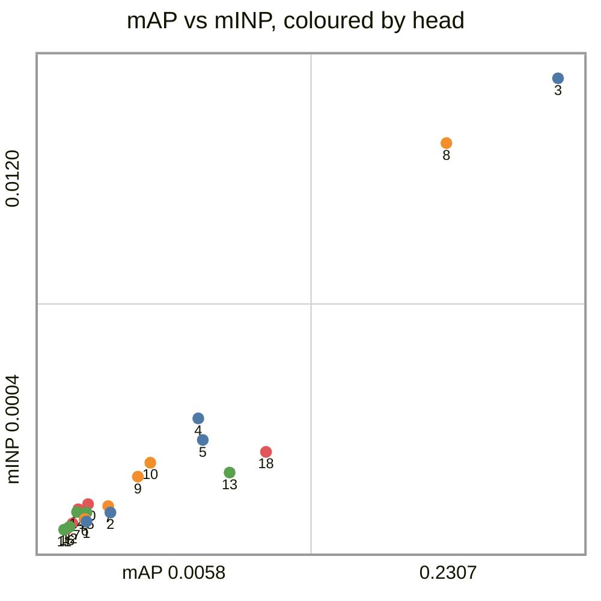
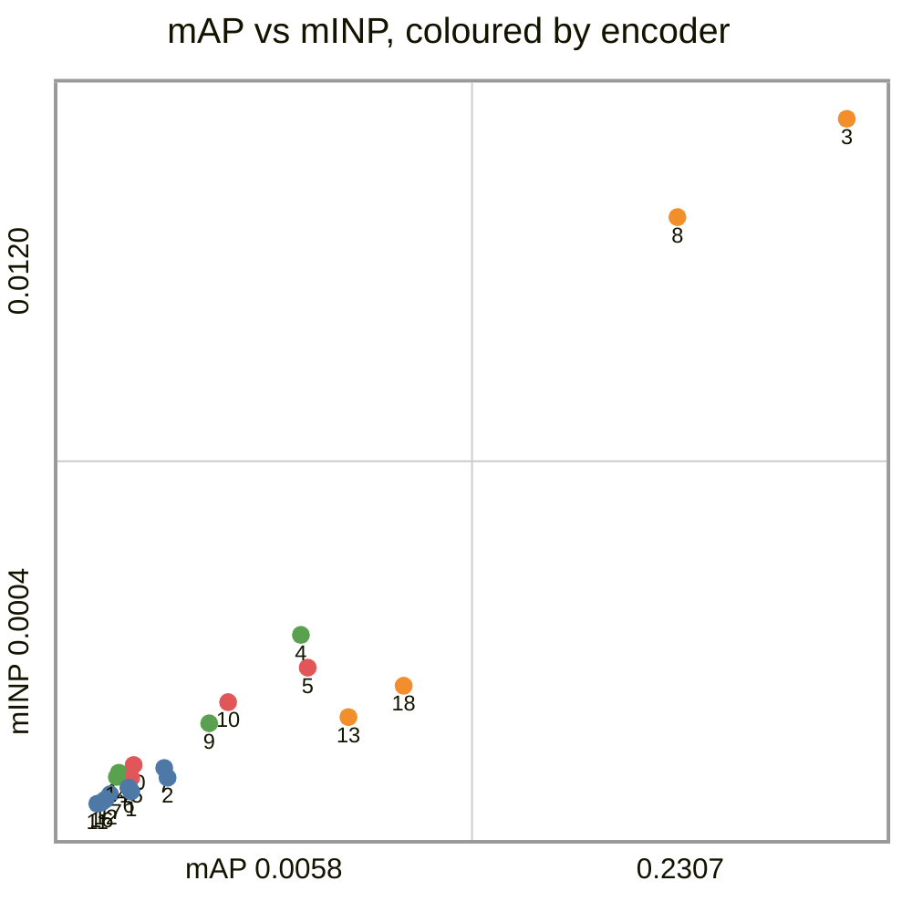
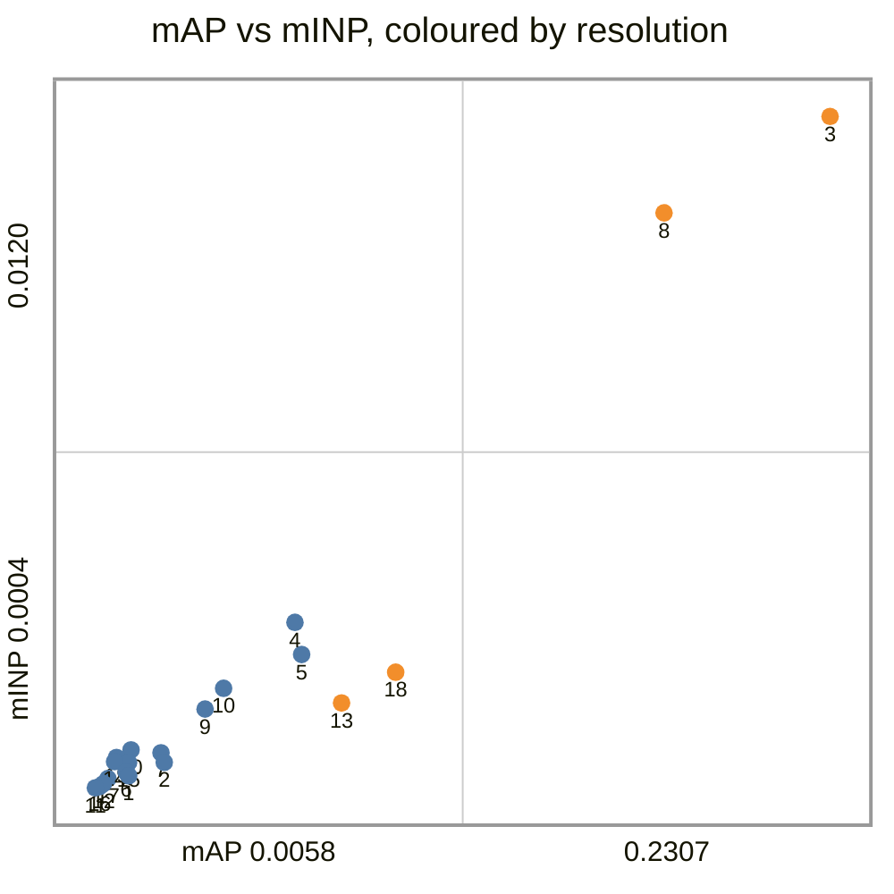

```mermaid
%%{init: {"themeVariables": {"xyChart": {"backgroundColor": "transparent", "plotColorPalette": "#4e79a7,#f28e2b,#59a14f,#e15759"}}, "xyChart": {"height": 600, "width": 1215, "yAxis": {"showLabel": false}}}}%%
xychart-beta horizontal
    title "mAP, coloured by encoder"
    x-axis ["224x224 arcface vit_base_patch16_clip_224.openai crop · 1.60%", "224x224 arcface vit_base_patch16_clip_224.openai squash · 2.69%", "224x224 arcface vit_huge_plus_patch16_dinov3.lvd1689m squash · 6.69%", "224x224 arcface vit_large_patch16_dinov3.lvd1689m squash · 6.89%", "224x224 linear vit_base_patch16_clip_224.openai crop · 1.52%", "224x224 linear vit_base_patch16_clip_224.openai squash · 2.59%", "224x224 linear vit_huge_plus_patch16_dinov3.lvd1689m squash · 3.94%", "224x224 linear vit_large_patch16_dinov3.lvd1689m squash · 4.50%", "224x224 none vit_base_patch16_clip_224.openai crop · 0.58%", "224x224 none vit_base_patch16_clip_224.openai squash · 0.83%", "224x224 none vit_huge_plus_patch16_dinov3.lvd1689m squash · 1.16%", "224x224 none vit_large_patch16_dinov3.lvd1689m squash · 1.60%", "224x224 pca vit_base_patch16_clip_224.openai crop · 0.70%", "224x224 pca vit_base_patch16_clip_224.openai squash · 0.96%", "224x224 pca vit_huge_plus_patch16_dinov3.lvd1689m squash · 1.23%", "224x224 pca vit_large_patch16_dinov3.lvd1689m squash · 1.67%", "256x256 arcface vit_giantopt_patch16_siglip_256.v2_webli squash · 23.07%", "256x256 linear vit_giantopt_patch16_siglip_256.v2_webli squash · 17.99%", "256x256 none vit_giantopt_patch16_siglip_256.v2_webli squash · 8.12%", "256x256 pca vit_giantopt_patch16_siglip_256.v2_webli squash · 9.77%"]
    y-axis "mAP (%)" 0 --> 24.22
    bar [1.60, 2.69, 0.00, 0.00, 1.52, 2.59, 0.00, 0.00, 0.58, 0.83, 0.00, 0.00, 0.70, 0.96, 0.00, 0.00, 0.00, 0.00, 0.00, 0.00]
    bar [0.00, 0.00, 0.00, 0.00, 0.00, 0.00, 0.00, 0.00, 0.00, 0.00, 0.00, 0.00, 0.00, 0.00, 0.00, 0.00, 23.07, 17.99, 8.12, 9.77]
    bar [0.00, 0.00, 6.69, 0.00, 0.00, 0.00, 3.94, 0.00, 0.00, 0.00, 1.16, 0.00, 0.00, 0.00, 1.23, 0.00, 0.00, 0.00, 0.00, 0.00]
    bar [0.00, 0.00, 0.00, 6.89, 0.00, 0.00, 0.00, 4.50, 0.00, 0.00, 0.00, 1.60, 0.00, 0.00, 0.00, 1.67, 0.00, 0.00, 0.00, 0.00]
```

<!-- generated by `reidbench render`; edit the runs, not this file -->

# msmt17

[← table.md](../table.md)

## msmt17/official@1

### 🟦 arcface

| # | encoder                                       | resolution | resize |        mAP |         R1 |         R5 |        R10 |       mINP |
|--:|-----------------------------------------------|------------|--------|-----------:|-----------:|-----------:|-----------:|-----------:|
| 1 | timm:vit_base_patch16_clip_224.openai         | 224x224    | crop   |     0.0160 |     0.0659 |     0.1366 |     0.1788 |     0.0006 |
| 2 | timm:vit_base_patch16_clip_224.openai         | 224x224    | squash |     0.0269 |     0.1047 |     0.1992 |     0.2553 |     0.0008 |
| 3 | timm:vit_giantopt_patch16_siglip_256.v2_webli | 256x256    | squash | **0.2307** | **0.5294** | **0.6796** | **0.7327** | **0.0120** |
| 4 | timm:vit_huge_plus_patch16_dinov3.lvd1689m    | 224x224    | squash |     0.0669 |     0.1998 |     0.3397 |     0.4096 |     0.0032 |
| 5 | timm:vit_large_patch16_dinov3.lvd1689m        | 224x224    | squash |     0.0689 |     0.2114 |     0.3510 |     0.4206 |     0.0027 |

### 🟧 linear

|  # | encoder                                       | resolution | resize |        mAP |         R1 |         R5 |        R10 |       mINP |
|---:|-----------------------------------------------|------------|--------|-----------:|-----------:|-----------:|-----------:|-----------:|
|  6 | timm:vit_base_patch16_clip_224.openai         | 224x224    | crop   |     0.0152 |     0.0604 |     0.1305 |     0.1750 |     0.0007 |
|  7 | timm:vit_base_patch16_clip_224.openai         | 224x224    | squash |     0.0259 |     0.0981 |     0.1983 |     0.2540 |     0.0010 |
|  8 | timm:vit_giantopt_patch16_siglip_256.v2_webli | 256x256    | squash | **0.1799** | **0.4505** | **0.6116** | **0.6728** | **0.0103** |
|  9 | timm:vit_huge_plus_patch16_dinov3.lvd1689m    | 224x224    | squash |     0.0394 |     0.1425 |     0.2613 |     0.3276 |     0.0018 |
| 10 | timm:vit_large_patch16_dinov3.lvd1689m        | 224x224    | squash |     0.0450 |     0.1513 |     0.2770 |     0.3418 |     0.0021 |

### 🟩 none

|  # | encoder                                       | resolution | resize |        mAP |         R1 |         R5 |        R10 |       mINP |
|---:|-----------------------------------------------|------------|--------|-----------:|-----------:|-----------:|-----------:|-----------:|
| 11 | timm:vit_base_patch16_clip_224.openai         | 224x224    | crop   |     0.0058 |     0.0313 |     0.0732 |     0.1016 |     0.0004 |
| 12 | timm:vit_base_patch16_clip_224.openai         | 224x224    | squash |     0.0083 |     0.0422 |     0.0927 |     0.1226 |     0.0005 |
| 13 | timm:vit_giantopt_patch16_siglip_256.v2_webli | 256x256    | squash | **0.0812** | **0.2952** | **0.4307** | **0.4941** | **0.0019** |
| 14 | timm:vit_huge_plus_patch16_dinov3.lvd1689m    | 224x224    | squash |     0.0116 |     0.0507 |     0.1006 |     0.1380 |     0.0009 |
| 15 | timm:vit_large_patch16_dinov3.lvd1689m        | 224x224    | squash |     0.0160 |     0.0592 |     0.1257 |     0.1636 |     0.0008 |

### 🟥 pca

|  # | encoder                                       | resolution | resize |        mAP |         R1 |         R5 |        R10 |       mINP |
|---:|-----------------------------------------------|------------|--------|-----------:|-----------:|-----------:|-----------:|-----------:|
| 16 | timm:vit_base_patch16_clip_224.openai         | 224x224    | crop   |     0.0070 |     0.0360 |     0.0820 |     0.1101 |     0.0004 |
| 17 | timm:vit_base_patch16_clip_224.openai         | 224x224    | squash |     0.0096 |     0.0468 |     0.1007 |     0.1346 |     0.0006 |
| 18 | timm:vit_giantopt_patch16_siglip_256.v2_webli | 256x256    | squash | **0.0977** | **0.3278** | **0.4706** | **0.5355** | **0.0024** |
| 19 | timm:vit_huge_plus_patch16_dinov3.lvd1689m    | 224x224    | squash |     0.0123 |     0.0519 |     0.1060 |     0.1415 |     0.0009 |
| 20 | timm:vit_large_patch16_dinov3.lvd1689m        | 224x224    | squash |     0.0167 |     0.0606 |     0.1239 |     0.1649 |     0.0011 |

### Every row, by encoder and resolution

```mermaid
%%{init: {"themeVariables": {"xyChart": {"backgroundColor": "transparent", "plotColorPalette": "#4e79a7,#f28e2b,#59a14f,#e15759"}}, "xyChart": {"height": 600, "width": 1215, "yAxis": {"showLabel": false}}}}%%
xychart-beta horizontal
    title "mAP, coloured by head"
    x-axis ["vit_base_patch16_clip_224.openai 224x224 arcface crop · 1.60%", "vit_base_patch16_clip_224.openai 224x224 arcface squash · 2.69%", "vit_base_patch16_clip_224.openai 224x224 linear crop · 1.52%", "vit_base_patch16_clip_224.openai 224x224 linear squash · 2.59%", "vit_base_patch16_clip_224.openai 224x224 none crop · 0.58%", "vit_base_patch16_clip_224.openai 224x224 none squash · 0.83%", "vit_base_patch16_clip_224.openai 224x224 pca crop · 0.70%", "vit_base_patch16_clip_224.openai 224x224 pca squash · 0.96%", "vit_giantopt_patch16_siglip_256.v2_webli 256x256 arcface squash · 23.07%", "vit_giantopt_patch16_siglip_256.v2_webli 256x256 linear squash · 17.99%", "vit_giantopt_patch16_siglip_256.v2_webli 256x256 none squash · 8.12%", "vit_giantopt_patch16_siglip_256.v2_webli 256x256 pca squash · 9.77%", "vit_huge_plus_patch16_dinov3.lvd1689m 224x224 arcface squash · 6.69%", "vit_huge_plus_patch16_dinov3.lvd1689m 224x224 linear squash · 3.94%", "vit_huge_plus_patch16_dinov3.lvd1689m 224x224 none squash · 1.16%", "vit_huge_plus_patch16_dinov3.lvd1689m 224x224 pca squash · 1.23%", "vit_large_patch16_dinov3.lvd1689m 224x224 arcface squash · 6.89%", "vit_large_patch16_dinov3.lvd1689m 224x224 linear squash · 4.50%", "vit_large_patch16_dinov3.lvd1689m 224x224 none squash · 1.60%", "vit_large_patch16_dinov3.lvd1689m 224x224 pca squash · 1.67%"]
    y-axis "mAP (%)" 0 --> 24.22
    bar [1.60, 2.69, 0.00, 0.00, 0.00, 0.00, 0.00, 0.00, 23.07, 0.00, 0.00, 0.00, 6.69, 0.00, 0.00, 0.00, 6.89, 0.00, 0.00, 0.00]
    bar [0.00, 0.00, 1.52, 2.59, 0.00, 0.00, 0.00, 0.00, 0.00, 17.99, 0.00, 0.00, 0.00, 3.94, 0.00, 0.00, 0.00, 4.50, 0.00, 0.00]
    bar [0.00, 0.00, 0.00, 0.00, 0.58, 0.83, 0.00, 0.00, 0.00, 0.00, 8.12, 0.00, 0.00, 0.00, 1.16, 0.00, 0.00, 0.00, 1.60, 0.00]
    bar [0.00, 0.00, 0.00, 0.00, 0.00, 0.00, 0.70, 0.96, 0.00, 0.00, 0.00, 9.77, 0.00, 0.00, 0.00, 1.23, 0.00, 0.00, 0.00, 1.67]
```

### By head — does the probe carry it?

```mermaid
%%{init: {"themeVariables": {"xyChart": {"backgroundColor": "transparent", "plotColorPalette": "#4e79a7,#f28e2b,#59a14f,#e15759"}}, "xyChart": {"height": 600, "width": 1215, "yAxis": {"showLabel": false}}}}%%
xychart-beta horizontal
    title "mAP, coloured by head"
    x-axis ["arcface vit_base_patch16_clip_224.openai 224x224 crop · 1.60%", "arcface vit_base_patch16_clip_224.openai 224x224 squash · 2.69%", "arcface vit_giantopt_patch16_siglip_256.v2_webli 256x256 squash · 23.07%", "arcface vit_huge_plus_patch16_dinov3.lvd1689m 224x224 squash · 6.69%", "arcface vit_large_patch16_dinov3.lvd1689m 224x224 squash · 6.89%", "linear vit_base_patch16_clip_224.openai 224x224 crop · 1.52%", "linear vit_base_patch16_clip_224.openai 224x224 squash · 2.59%", "linear vit_giantopt_patch16_siglip_256.v2_webli 256x256 squash · 17.99%", "linear vit_huge_plus_patch16_dinov3.lvd1689m 224x224 squash · 3.94%", "linear vit_large_patch16_dinov3.lvd1689m 224x224 squash · 4.50%", "none vit_base_patch16_clip_224.openai 224x224 crop · 0.58%", "none vit_base_patch16_clip_224.openai 224x224 squash · 0.83%", "none vit_giantopt_patch16_siglip_256.v2_webli 256x256 squash · 8.12%", "none vit_huge_plus_patch16_dinov3.lvd1689m 224x224 squash · 1.16%", "none vit_large_patch16_dinov3.lvd1689m 224x224 squash · 1.60%", "pca vit_base_patch16_clip_224.openai 224x224 crop · 0.70%", "pca vit_base_patch16_clip_224.openai 224x224 squash · 0.96%", "pca vit_giantopt_patch16_siglip_256.v2_webli 256x256 squash · 9.77%", "pca vit_huge_plus_patch16_dinov3.lvd1689m 224x224 squash · 1.23%", "pca vit_large_patch16_dinov3.lvd1689m 224x224 squash · 1.67%"]
    y-axis "mAP (%)" 0 --> 24.22
    bar [1.60, 2.69, 23.07, 6.69, 6.89, 0.00, 0.00, 0.00, 0.00, 0.00, 0.00, 0.00, 0.00, 0.00, 0.00, 0.00, 0.00, 0.00, 0.00, 0.00]
    bar [0.00, 0.00, 0.00, 0.00, 0.00, 1.52, 2.59, 17.99, 3.94, 4.50, 0.00, 0.00, 0.00, 0.00, 0.00, 0.00, 0.00, 0.00, 0.00, 0.00]
    bar [0.00, 0.00, 0.00, 0.00, 0.00, 0.00, 0.00, 0.00, 0.00, 0.00, 0.58, 0.83, 8.12, 1.16, 1.60, 0.00, 0.00, 0.00, 0.00, 0.00]
    bar [0.00, 0.00, 0.00, 0.00, 0.00, 0.00, 0.00, 0.00, 0.00, 0.00, 0.00, 0.00, 0.00, 0.00, 0.00, 0.70, 0.96, 9.77, 1.23, 1.67]
```

### By encoder — does the checkpoint carry it?

*Colour — encoder:* 🟦 timm:vit_base_patch16_clip_224.openai · 🟧 timm:vit_giantopt_patch16_siglip_256.v2_webli · 🟩 timm:vit_huge_plus_patch16_dinov3.lvd1689m · 🟥 timm:vit_large_patch16_dinov3.lvd1689m

```mermaid
%%{init: {"themeVariables": {"xyChart": {"backgroundColor": "transparent", "plotColorPalette": "#4e79a7,#f28e2b,#59a14f,#e15759"}}, "xyChart": {"height": 600, "width": 1215, "yAxis": {"showLabel": false}}}}%%
xychart-beta horizontal
    title "mAP, coloured by encoder"
    x-axis ["vit_base_patch16_clip_224.openai arcface 224x224 crop · 1.60%", "vit_base_patch16_clip_224.openai arcface 224x224 squash · 2.69%", "vit_base_patch16_clip_224.openai linear 224x224 crop · 1.52%", "vit_base_patch16_clip_224.openai linear 224x224 squash · 2.59%", "vit_base_patch16_clip_224.openai none 224x224 crop · 0.58%", "vit_base_patch16_clip_224.openai none 224x224 squash · 0.83%", "vit_base_patch16_clip_224.openai pca 224x224 crop · 0.70%", "vit_base_patch16_clip_224.openai pca 224x224 squash · 0.96%", "vit_giantopt_patch16_siglip_256.v2_webli arcface 256x256 squash · 23.07%", "vit_giantopt_patch16_siglip_256.v2_webli linear 256x256 squash · 17.99%", "vit_giantopt_patch16_siglip_256.v2_webli none 256x256 squash · 8.12%", "vit_giantopt_patch16_siglip_256.v2_webli pca 256x256 squash · 9.77%", "vit_huge_plus_patch16_dinov3.lvd1689m arcface 224x224 squash · 6.69%", "vit_huge_plus_patch16_dinov3.lvd1689m linear 224x224 squash · 3.94%", "vit_huge_plus_patch16_dinov3.lvd1689m none 224x224 squash · 1.16%", "vit_huge_plus_patch16_dinov3.lvd1689m pca 224x224 squash · 1.23%", "vit_large_patch16_dinov3.lvd1689m arcface 224x224 squash · 6.89%", "vit_large_patch16_dinov3.lvd1689m linear 224x224 squash · 4.50%", "vit_large_patch16_dinov3.lvd1689m none 224x224 squash · 1.60%", "vit_large_patch16_dinov3.lvd1689m pca 224x224 squash · 1.67%"]
    y-axis "mAP (%)" 0 --> 24.22
    bar [1.60, 2.69, 1.52, 2.59, 0.58, 0.83, 0.70, 0.96, 0.00, 0.00, 0.00, 0.00, 0.00, 0.00, 0.00, 0.00, 0.00, 0.00, 0.00, 0.00]
    bar [0.00, 0.00, 0.00, 0.00, 0.00, 0.00, 0.00, 0.00, 23.07, 17.99, 8.12, 9.77, 0.00, 0.00, 0.00, 0.00, 0.00, 0.00, 0.00, 0.00]
    bar [0.00, 0.00, 0.00, 0.00, 0.00, 0.00, 0.00, 0.00, 0.00, 0.00, 0.00, 0.00, 6.69, 3.94, 1.16, 1.23, 0.00, 0.00, 0.00, 0.00]
    bar [0.00, 0.00, 0.00, 0.00, 0.00, 0.00, 0.00, 0.00, 0.00, 0.00, 0.00, 0.00, 0.00, 0.00, 0.00, 0.00, 6.89, 4.50, 1.60, 1.67]
```

### By resolution — does the input size carry it?

*Colour — resolution:* 🟦 224x224 · 🟧 256x256

```mermaid
%%{init: {"themeVariables": {"xyChart": {"backgroundColor": "transparent", "plotColorPalette": "#4e79a7,#f28e2b"}}, "xyChart": {"height": 600, "width": 1215, "yAxis": {"showLabel": false}}}}%%
xychart-beta horizontal
    title "mAP, coloured by resolution"
    x-axis ["224x224 vit_base_patch16_clip_224.openai arcface crop · 1.60%", "224x224 vit_base_patch16_clip_224.openai arcface squash · 2.69%", "224x224 vit_base_patch16_clip_224.openai linear crop · 1.52%", "224x224 vit_base_patch16_clip_224.openai linear squash · 2.59%", "224x224 vit_base_patch16_clip_224.openai none crop · 0.58%", "224x224 vit_base_patch16_clip_224.openai none squash · 0.83%", "224x224 vit_base_patch16_clip_224.openai pca crop · 0.70%", "224x224 vit_base_patch16_clip_224.openai pca squash · 0.96%", "224x224 vit_huge_plus_patch16_dinov3.lvd1689m arcface squash · 6.69%", "224x224 vit_huge_plus_patch16_dinov3.lvd1689m linear squash · 3.94%", "224x224 vit_huge_plus_patch16_dinov3.lvd1689m none squash · 1.16%", "224x224 vit_huge_plus_patch16_dinov3.lvd1689m pca squash · 1.23%", "224x224 vit_large_patch16_dinov3.lvd1689m arcface squash · 6.89%", "224x224 vit_large_patch16_dinov3.lvd1689m linear squash · 4.50%", "224x224 vit_large_patch16_dinov3.lvd1689m none squash · 1.60%", "224x224 vit_large_patch16_dinov3.lvd1689m pca squash · 1.67%", "256x256 vit_giantopt_patch16_siglip_256.v2_webli arcface squash · 23.07%", "256x256 vit_giantopt_patch16_siglip_256.v2_webli linear squash · 17.99%", "256x256 vit_giantopt_patch16_siglip_256.v2_webli none squash · 8.12%", "256x256 vit_giantopt_patch16_siglip_256.v2_webli pca squash · 9.77%"]
    y-axis "mAP (%)" 0 --> 24.22
    bar [1.60, 2.69, 1.52, 2.59, 0.58, 0.83, 0.70, 0.96, 6.69, 3.94, 1.16, 1.23, 6.89, 4.50, 1.60, 1.67, 0.00, 0.00, 0.00, 0.00]
    bar [0.00, 0.00, 0.00, 0.00, 0.00, 0.00, 0.00, 0.00, 0.00, 0.00, 0.00, 0.00, 0.00, 0.00, 0.00, 0.00, 23.07, 17.99, 8.12, 9.77]
```

### Resolution, within one encoder and head

*Colour — resolution:* 🟦 224x224 · 🟧 256x256

```mermaid
%%{init: {"themeVariables": {"xyChart": {"backgroundColor": "transparent", "plotColorPalette": "#4e79a7,#f28e2b"}}, "xyChart": {"height": 600, "width": 1215, "yAxis": {"showLabel": false}}}}%%
xychart-beta horizontal
    title "mAP, coloured by resolution"
    x-axis ["vit_base_patch16_clip_224.openai arcface 224x224 crop · 1.60%", "vit_base_patch16_clip_224.openai arcface 224x224 squash · 2.69%", "vit_base_patch16_clip_224.openai linear 224x224 crop · 1.52%", "vit_base_patch16_clip_224.openai linear 224x224 squash · 2.59%", "vit_base_patch16_clip_224.openai none 224x224 crop · 0.58%", "vit_base_patch16_clip_224.openai none 224x224 squash · 0.83%", "vit_base_patch16_clip_224.openai pca 224x224 crop · 0.70%", "vit_base_patch16_clip_224.openai pca 224x224 squash · 0.96%", "vit_giantopt_patch16_siglip_256.v2_webli arcface 256x256 squash · 23.07%", "vit_giantopt_patch16_siglip_256.v2_webli linear 256x256 squash · 17.99%", "vit_giantopt_patch16_siglip_256.v2_webli none 256x256 squash · 8.12%", "vit_giantopt_patch16_siglip_256.v2_webli pca 256x256 squash · 9.77%", "vit_huge_plus_patch16_dinov3.lvd1689m arcface 224x224 squash · 6.69%", "vit_huge_plus_patch16_dinov3.lvd1689m linear 224x224 squash · 3.94%", "vit_huge_plus_patch16_dinov3.lvd1689m none 224x224 squash · 1.16%", "vit_huge_plus_patch16_dinov3.lvd1689m pca 224x224 squash · 1.23%", "vit_large_patch16_dinov3.lvd1689m arcface 224x224 squash · 6.89%", "vit_large_patch16_dinov3.lvd1689m linear 224x224 squash · 4.50%", "vit_large_patch16_dinov3.lvd1689m none 224x224 squash · 1.60%", "vit_large_patch16_dinov3.lvd1689m pca 224x224 squash · 1.67%"]
    y-axis "mAP (%)" 0 --> 24.22
    bar [1.60, 2.69, 1.52, 2.59, 0.58, 0.83, 0.70, 0.96, 0.00, 0.00, 0.00, 0.00, 6.69, 3.94, 1.16, 1.23, 6.89, 4.50, 1.60, 1.67]
    bar [0.00, 0.00, 0.00, 0.00, 0.00, 0.00, 0.00, 0.00, 23.07, 17.99, 8.12, 9.77, 0.00, 0.00, 0.00, 0.00, 0.00, 0.00, 0.00, 0.00]
```

### Head, within one encoder and resolution

### Encoder, within one resolution and head

*Colour — encoder:* 🟦 timm:vit_base_patch16_clip_224.openai · 🟧 timm:vit_giantopt_patch16_siglip_256.v2_webli · 🟩 timm:vit_huge_plus_patch16_dinov3.lvd1689m · 🟥 timm:vit_large_patch16_dinov3.lvd1689m

