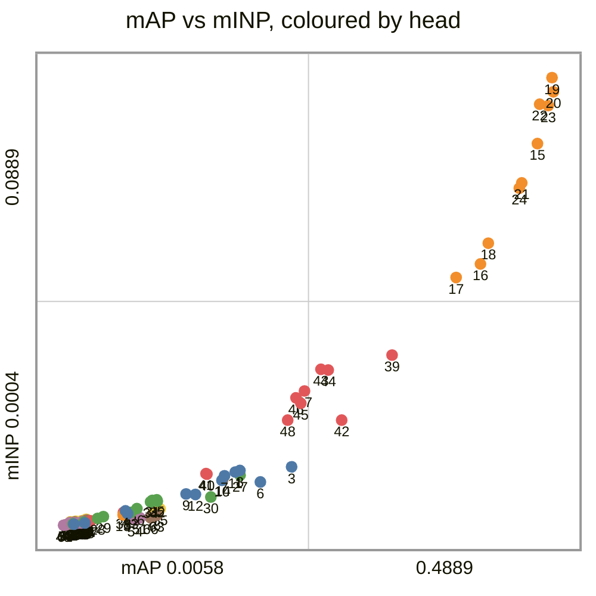
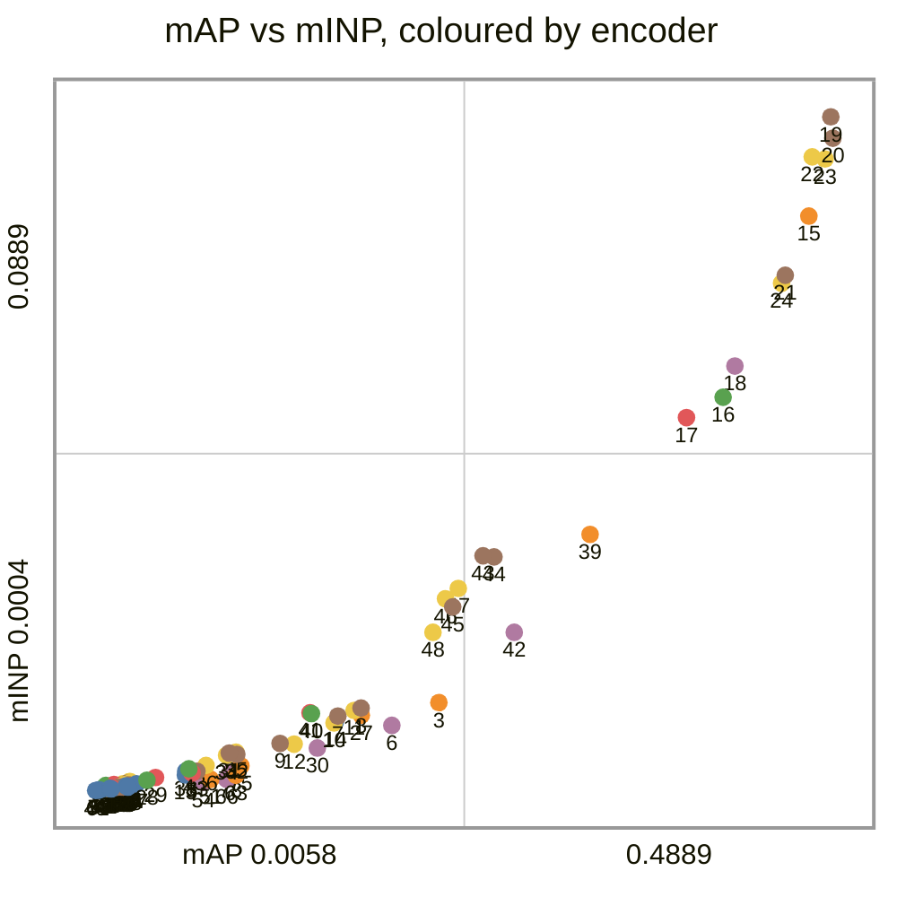
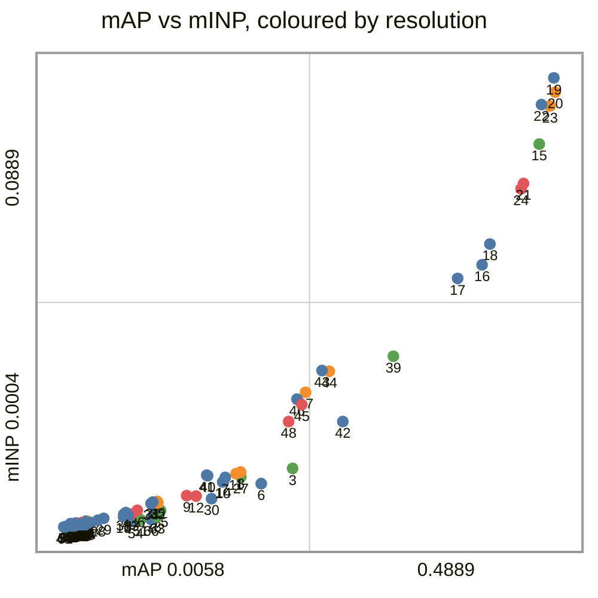

```mermaid
%%{init: {"themeVariables": {"xyChart": {"backgroundColor": "transparent", "plotColorPalette": "#4e79a7,#f28e2b,#59a14f,#e15759,#b07aa1,#9c755f,#edc948"}}, "xyChart": {"height": 1600, "width": 1320, "yAxis": {"showLabel": false}}}}%%
xychart-beta horizontal
    title "mAP, coloured by encoder"
    x-axis ["224x224 arcface vit_base_patch16_clip_224.openai crop · 1.60%", "224x224 arcface vit_base_patch16_clip_224.openai squash · 2.69%", "224x224 arcface vit_huge_plus_patch16_dinov3.lvd1689m squash · 6.69%", "224x224 arcface vit_large_patch16_dinov3.lvd1689m squash · 6.89%", "224x224 arcface vit_so400m_patch14_siglip_224.v2_webli squash · 19.99%", "224x224 arcface c-radio_v4-h squash · 16.45%", "224x224 arcface c-radio_v4-so400m squash · 16.20%", "224x224 arcface-msmt17 vit_base_patch16_clip_224.openai crop · 6.46%", "224x224 arcface-msmt17 vit_base_patch16_clip_224.openai squash · 16.28%", "224x224 arcface-msmt17 vit_huge_plus_patch16_dinov3.lvd1689m squash · 41.70%", "224x224 arcface-msmt17 vit_large_patch16_dinov3.lvd1689m squash · 39.30%", "224x224 arcface-msmt17 vit_so400m_patch14_siglip_224.v2_webli squash · 42.47%", "224x224 arcface-msmt17 c-radio_v4-h squash · 48.76%", "224x224 arcface-msmt17 c-radio_v4-so400m squash · 47.54%", "224x224 linear vit_base_patch16_clip_224.openai crop · 1.52%", "224x224 linear vit_base_patch16_clip_224.openai squash · 2.59%", "224x224 linear vit_huge_plus_patch16_dinov3.lvd1689m squash · 3.94%", "224x224 linear vit_large_patch16_dinov3.lvd1689m squash · 4.50%", "224x224 linear vit_so400m_patch14_siglip_224.v2_webli squash · 15.10%", "224x224 linear c-radio_v4-h squash · 9.33%", "224x224 linear c-radio_v4-so400m squash · 9.16%", "224x224 linear-msmt17 vit_base_patch16_clip_224.openai crop · 3.25%", "224x224 linear-msmt17 vit_base_patch16_clip_224.openai squash · 6.48%", "224x224 linear-msmt17 vit_huge_plus_patch16_dinov3.lvd1689m squash · 14.72%", "224x224 linear-msmt17 vit_large_patch16_dinov3.lvd1689m squash · 14.63%", "224x224 linear-msmt17 vit_so400m_patch14_siglip_224.v2_webli squash · 28.01%", "224x224 linear-msmt17 c-radio_v4-h squash · 25.97%", "224x224 linear-msmt17 c-radio_v4-so400m squash · 23.51%", "224x224 none vit_base_patch16_clip_224.openai crop · 0.58%", "224x224 none vit_base_patch16_clip_224.openai squash · 0.83%", "224x224 none vit_huge_plus_patch16_dinov3.lvd1689m squash · 1.16%", "224x224 none vit_large_patch16_dinov3.lvd1689m squash · 1.60%", "224x224 none vit_so400m_patch14_siglip_224.v2_webli squash · 7.64%", "224x224 none c-radio_v4-h squash · 2.26%", "224x224 none c-radio_v4-so400m squash · 2.38%", "224x224 pca vit_base_patch16_clip_224.openai crop · 0.70%", "224x224 pca vit_base_patch16_clip_224.openai squash · 0.96%", "224x224 pca vit_huge_plus_patch16_dinov3.lvd1689m squash · 1.23%", "224x224 pca vit_large_patch16_dinov3.lvd1689m squash · 1.67%", "224x224 pca vit_so400m_patch14_siglip_224.v2_webli squash · 9.17%", "224x224 pca c-radio_v4-h squash · 2.68%", "224x224 pca c-radio_v4-so400m squash · 2.80%", "224x224 pca-msmt17 vit_base_patch16_clip_224.openai crop · 0.80%", "224x224 pca-msmt17 vit_base_patch16_clip_224.openai squash · 1.07%", "224x224 pca-msmt17 vit_huge_plus_patch16_dinov3.lvd1689m squash · 1.25%", "224x224 pca-msmt17 vit_large_patch16_dinov3.lvd1689m squash · 1.78%", "224x224 pca-msmt17 vit_so400m_patch14_siglip_224.v2_webli squash · 9.41%", "224x224 pca-msmt17 c-radio_v4-h squash · 2.62%", "224x224 pca-msmt17 c-radio_v4-so400m squash · 2.76%", "256x128 arcface c-radio_v4-h squash · 17.97%", "256x128 arcface c-radio_v4-so400m squash · 17.52%", "256x128 arcface-msmt17 c-radio_v4-h squash · 48.89%", "256x128 arcface-msmt17 c-radio_v4-so400m squash · 48.38%", "256x128 linear c-radio_v4-h squash · 9.83%", "256x128 linear c-radio_v4-so400m squash · 9.78%", "256x128 linear-msmt17 c-radio_v4-h squash · 26.68%", "256x128 linear-msmt17 c-radio_v4-so400m squash · 24.34%", "256x128 none c-radio_v4-h squash · 2.39%", "256x128 none c-radio_v4-so400m squash · 2.45%", "256x128 pca c-radio_v4-h squash · 2.84%", "256x128 pca c-radio_v4-so400m squash · 2.90%", "256x128 pca-msmt17 c-radio_v4-h squash · 2.77%", "256x128 pca-msmt17 c-radio_v4-so400m squash · 2.83%", "256x256 arcface vit_giantopt_patch16_siglip_256.v2_webli squash · 23.07%", "256x256 arcface-msmt17 vit_giantopt_patch16_siglip_256.v2_webli squash · 47.32%", "256x256 linear vit_giantopt_patch16_siglip_256.v2_webli squash · 17.99%", "256x256 linear-msmt17 vit_giantopt_patch16_siglip_256.v2_webli squash · 32.98%", "256x256 none vit_giantopt_patch16_siglip_256.v2_webli squash · 8.12%", "256x256 pca vit_giantopt_patch16_siglip_256.v2_webli squash · 9.77%", "256x256 pca-msmt17 vit_giantopt_patch16_siglip_256.v2_webli squash · 10.09%", "native arcface c-radio_v4-h squash · 12.66%", "native arcface c-radio_v4-so400m squash · 13.58%", "native arcface-msmt17 c-radio_v4-h squash · 45.78%", "native arcface-msmt17 c-radio_v4-so400m squash · 45.53%", "native linear c-radio_v4-h squash · 7.21%", "native linear c-radio_v4-so400m squash · 7.81%", "native linear-msmt17 c-radio_v4-h squash · 23.98%", "native linear-msmt17 c-radio_v4-so400m squash · 22.69%", "native none c-radio_v4-h squash · 1.94%", "native none c-radio_v4-so400m squash · 2.03%", "native pca c-radio_v4-h squash · 2.28%", "native pca c-radio_v4-so400m squash · 2.45%", "native pca-msmt17 c-radio_v4-h squash · 2.22%", "native pca-msmt17 c-radio_v4-so400m squash · 2.37%"]
    y-axis "mAP (%)" 0 --> 51.34
    bar [1.60, 2.69, 0.00, 0.00, 0.00, 0.00, 0.00, 6.46, 16.28, 0.00, 0.00, 0.00, 0.00, 0.00, 1.52, 2.59, 0.00, 0.00, 0.00, 0.00, 0.00, 3.25, 6.48, 0.00, 0.00, 0.00, 0.00, 0.00, 0.58, 0.83, 0.00, 0.00, 0.00, 0.00, 0.00, 0.70, 0.96, 0.00, 0.00, 0.00, 0.00, 0.00, 0.80, 1.07, 0.00, 0.00, 0.00, 0.00, 0.00, 0.00, 0.00, 0.00, 0.00, 0.00, 0.00, 0.00, 0.00, 0.00, 0.00, 0.00, 0.00, 0.00, 0.00, 0.00, 0.00, 0.00, 0.00, 0.00, 0.00, 0.00, 0.00, 0.00, 0.00, 0.00, 0.00, 0.00, 0.00, 0.00, 0.00, 0.00, 0.00, 0.00, 0.00, 0.00]
    bar [0.00, 0.00, 0.00, 0.00, 0.00, 0.00, 0.00, 0.00, 0.00, 0.00, 0.00, 0.00, 0.00, 0.00, 0.00, 0.00, 0.00, 0.00, 0.00, 0.00, 0.00, 0.00, 0.00, 0.00, 0.00, 0.00, 0.00, 0.00, 0.00, 0.00, 0.00, 0.00, 0.00, 0.00, 0.00, 0.00, 0.00, 0.00, 0.00, 0.00, 0.00, 0.00, 0.00, 0.00, 0.00, 0.00, 0.00, 0.00, 0.00, 0.00, 0.00, 0.00, 0.00, 0.00, 0.00, 0.00, 0.00, 0.00, 0.00, 0.00, 0.00, 0.00, 0.00, 23.07, 47.32, 17.99, 32.98, 8.12, 9.77, 10.09, 0.00, 0.00, 0.00, 0.00, 0.00, 0.00, 0.00, 0.00, 0.00, 0.00, 0.00, 0.00, 0.00, 0.00]
    bar [0.00, 0.00, 6.69, 0.00, 0.00, 0.00, 0.00, 0.00, 0.00, 41.70, 0.00, 0.00, 0.00, 0.00, 0.00, 0.00, 3.94, 0.00, 0.00, 0.00, 0.00, 0.00, 0.00, 14.72, 0.00, 0.00, 0.00, 0.00, 0.00, 0.00, 1.16, 0.00, 0.00, 0.00, 0.00, 0.00, 0.00, 1.23, 0.00, 0.00, 0.00, 0.00, 0.00, 0.00, 1.25, 0.00, 0.00, 0.00, 0.00, 0.00, 0.00, 0.00, 0.00, 0.00, 0.00, 0.00, 0.00, 0.00, 0.00, 0.00, 0.00, 0.00, 0.00, 0.00, 0.00, 0.00, 0.00, 0.00, 0.00, 0.00, 0.00, 0.00, 0.00, 0.00, 0.00, 0.00, 0.00, 0.00, 0.00, 0.00, 0.00, 0.00, 0.00, 0.00]
    bar [0.00, 0.00, 0.00, 6.89, 0.00, 0.00, 0.00, 0.00, 0.00, 0.00, 39.30, 0.00, 0.00, 0.00, 0.00, 0.00, 0.00, 4.50, 0.00, 0.00, 0.00, 0.00, 0.00, 0.00, 14.63, 0.00, 0.00, 0.00, 0.00, 0.00, 0.00, 1.60, 0.00, 0.00, 0.00, 0.00, 0.00, 0.00, 1.67, 0.00, 0.00, 0.00, 0.00, 0.00, 0.00, 1.78, 0.00, 0.00, 0.00, 0.00, 0.00, 0.00, 0.00, 0.00, 0.00, 0.00, 0.00, 0.00, 0.00, 0.00, 0.00, 0.00, 0.00, 0.00, 0.00, 0.00, 0.00, 0.00, 0.00, 0.00, 0.00, 0.00, 0.00, 0.00, 0.00, 0.00, 0.00, 0.00, 0.00, 0.00, 0.00, 0.00, 0.00, 0.00]
    bar [0.00, 0.00, 0.00, 0.00, 19.99, 0.00, 0.00, 0.00, 0.00, 0.00, 0.00, 42.47, 0.00, 0.00, 0.00, 0.00, 0.00, 0.00, 15.10, 0.00, 0.00, 0.00, 0.00, 0.00, 0.00, 28.01, 0.00, 0.00, 0.00, 0.00, 0.00, 0.00, 7.64, 0.00, 0.00, 0.00, 0.00, 0.00, 0.00, 9.17, 0.00, 0.00, 0.00, 0.00, 0.00, 0.00, 9.41, 0.00, 0.00, 0.00, 0.00, 0.00, 0.00, 0.00, 0.00, 0.00, 0.00, 0.00, 0.00, 0.00, 0.00, 0.00, 0.00, 0.00, 0.00, 0.00, 0.00, 0.00, 0.00, 0.00, 0.00, 0.00, 0.00, 0.00, 0.00, 0.00, 0.00, 0.00, 0.00, 0.00, 0.00, 0.00, 0.00, 0.00]
    bar [0.00, 0.00, 0.00, 0.00, 0.00, 16.45, 0.00, 0.00, 0.00, 0.00, 0.00, 0.00, 48.76, 0.00, 0.00, 0.00, 0.00, 0.00, 0.00, 9.33, 0.00, 0.00, 0.00, 0.00, 0.00, 0.00, 25.97, 0.00, 0.00, 0.00, 0.00, 0.00, 0.00, 2.26, 0.00, 0.00, 0.00, 0.00, 0.00, 0.00, 2.68, 0.00, 0.00, 0.00, 0.00, 0.00, 0.00, 2.62, 0.00, 17.97, 0.00, 48.89, 0.00, 9.83, 0.00, 26.68, 0.00, 2.39, 0.00, 2.84, 0.00, 2.77, 0.00, 0.00, 0.00, 0.00, 0.00, 0.00, 0.00, 0.00, 12.66, 0.00, 45.78, 0.00, 7.21, 0.00, 23.98, 0.00, 1.94, 0.00, 2.28, 0.00, 2.22, 0.00]
    bar [0.00, 0.00, 0.00, 0.00, 0.00, 0.00, 16.20, 0.00, 0.00, 0.00, 0.00, 0.00, 0.00, 47.54, 0.00, 0.00, 0.00, 0.00, 0.00, 0.00, 9.16, 0.00, 0.00, 0.00, 0.00, 0.00, 0.00, 23.51, 0.00, 0.00, 0.00, 0.00, 0.00, 0.00, 2.38, 0.00, 0.00, 0.00, 0.00, 0.00, 0.00, 2.80, 0.00, 0.00, 0.00, 0.00, 0.00, 0.00, 2.76, 0.00, 17.52, 0.00, 48.38, 0.00, 9.78, 0.00, 24.34, 0.00, 2.45, 0.00, 2.90, 0.00, 2.83, 0.00, 0.00, 0.00, 0.00, 0.00, 0.00, 0.00, 0.00, 13.58, 0.00, 45.53, 0.00, 7.81, 0.00, 22.69, 0.00, 2.03, 0.00, 2.45, 0.00, 2.37]
```

<!-- generated by `reidbench render`; edit the runs, not this file -->

# msmt17

[← table.md](../table.md)

## msmt17/official@1

### 🟦 arcface

|  # | encoder                                       | resolution | resize |        mAP |         R1 |         R5 |        R10 |       mINP |
|---:|-----------------------------------------------|------------|--------|-----------:|-----------:|-----------:|-----------:|-----------:|
|  1 | timm:vit_base_patch16_clip_224.openai         | 224x224    | crop   |     0.0160 |     0.0659 |     0.1366 |     0.1788 |     0.0006 |
|  2 | timm:vit_base_patch16_clip_224.openai         | 224x224    | squash |     0.0269 |     0.1047 |     0.1992 |     0.2553 |     0.0008 |
|  3 | timm:vit_giantopt_patch16_siglip_256.v2_webli | 256x256    | squash | **0.2307** | **0.5294** | **0.6796** | **0.7327** | **0.0120** |
|  4 | timm:vit_huge_plus_patch16_dinov3.lvd1689m    | 224x224    | squash |     0.0669 |     0.1998 |     0.3397 |     0.4096 |     0.0032 |
|  5 | timm:vit_large_patch16_dinov3.lvd1689m        | 224x224    | squash |     0.0689 |     0.2114 |     0.3510 |     0.4206 |     0.0027 |
|  6 | timm:vit_so400m_patch14_siglip_224.v2_webli   | 224x224    | squash |     0.1999 |     0.4808 |     0.6336 |     0.6928 |     0.0090 |
|  7 | torchhub:NVlabs/RADIO/c-radio_v4-h            | 224x224    | squash |     0.1645 |     0.3902 |     0.5571 |     0.6228 |     0.0102 |
|  8 | torchhub:NVlabs/RADIO/c-radio_v4-h            | 256x128    | squash |     0.1797 |     0.4149 |     0.5781 |     0.6441 |     0.0112 |
|  9 | torchhub:NVlabs/RADIO/c-radio_v4-h            | native     | squash |     0.1266 |     0.3177 |     0.4789 |     0.5520 |     0.0066 |
| 10 | torchhub:NVlabs/RADIO/c-radio_v4-so400m       | 224x224    | squash |     0.1620 |     0.3826 |     0.5506 |     0.6278 |     0.0093 |
| 11 | torchhub:NVlabs/RADIO/c-radio_v4-so400m       | 256x128    | squash |     0.1752 |     0.4024 |     0.5663 |     0.6399 |     0.0109 |
| 12 | torchhub:NVlabs/RADIO/c-radio_v4-so400m       | native     | squash |     0.1358 |     0.3390 |     0.5053 |     0.5733 |     0.0065 |

### 🟧 arcface-msmt17

|  # | encoder                                       | resolution | resize |        mAP |         R1 |         R5 |        R10 |       mINP |
|---:|-----------------------------------------------|------------|--------|-----------:|-----------:|-----------:|-----------:|-----------:|
| 13 | timm:vit_base_patch16_clip_224.openai         | 224x224    | crop   |     0.0646 |     0.1869 |     0.3314 |     0.3997 |     0.0024 |
| 14 | timm:vit_base_patch16_clip_224.openai         | 224x224    | squash |     0.1628 |     0.3910 |     0.5808 |     0.6541 |     0.0094 |
| 15 | timm:vit_giantopt_patch16_siglip_256.v2_webli | 256x256    | squash |     0.4732 |     0.7477 |     0.8587 |     0.8912 |     0.0759 |
| 16 | timm:vit_huge_plus_patch16_dinov3.lvd1689m    | 224x224    | squash |     0.4170 |     0.7080 |     0.8490 |     0.8898 |     0.0521 |
| 17 | timm:vit_large_patch16_dinov3.lvd1689m        | 224x224    | squash |     0.3930 |     0.6804 |     0.8330 |     0.8772 |     0.0494 |
| 18 | timm:vit_so400m_patch14_siglip_224.v2_webli   | 224x224    | squash |     0.4247 |     0.7122 |     0.8353 |     0.8705 |     0.0562 |
| 19 | torchhub:NVlabs/RADIO/c-radio_v4-h            | 224x224    | squash |     0.4876 |     0.7556 |     0.8691 |     0.9025 | **0.0889** |
| 20 | torchhub:NVlabs/RADIO/c-radio_v4-h            | 256x128    | squash | **0.4889** | **0.7652** | **0.8763** | **0.9073** |     0.0861 |
| 21 | torchhub:NVlabs/RADIO/c-radio_v4-h            | native     | squash |     0.4578 |     0.7448 |     0.8583 |     0.8929 |     0.0681 |
| 22 | torchhub:NVlabs/RADIO/c-radio_v4-so400m       | 224x224    | squash |     0.4754 |     0.7556 |     0.8677 |     0.9010 |     0.0837 |
| 23 | torchhub:NVlabs/RADIO/c-radio_v4-so400m       | 256x128    | squash |     0.4838 |     0.7617 |     0.8718 |     0.9035 |     0.0834 |
| 24 | torchhub:NVlabs/RADIO/c-radio_v4-so400m       | native     | squash |     0.4553 |     0.7369 |     0.8523 |     0.8898 |     0.0671 |

### 🟩 linear

|  # | encoder                                       | resolution | resize |        mAP |         R1 |         R5 |        R10 |       mINP |
|---:|-----------------------------------------------|------------|--------|-----------:|-----------:|-----------:|-----------:|-----------:|
| 25 | timm:vit_base_patch16_clip_224.openai         | 224x224    | crop   |     0.0152 |     0.0604 |     0.1305 |     0.1750 |     0.0007 |
| 26 | timm:vit_base_patch16_clip_224.openai         | 224x224    | squash |     0.0259 |     0.0981 |     0.1983 |     0.2540 |     0.0010 |
| 27 | timm:vit_giantopt_patch16_siglip_256.v2_webli | 256x256    | squash | **0.1799** | **0.4505** | **0.6116** | **0.6728** | **0.0103** |
| 28 | timm:vit_huge_plus_patch16_dinov3.lvd1689m    | 224x224    | squash |     0.0394 |     0.1425 |     0.2613 |     0.3276 |     0.0018 |
| 29 | timm:vit_large_patch16_dinov3.lvd1689m        | 224x224    | squash |     0.0450 |     0.1513 |     0.2770 |     0.3418 |     0.0021 |
| 30 | timm:vit_so400m_patch14_siglip_224.v2_webli   | 224x224    | squash |     0.1510 |     0.4105 |     0.5676 |     0.6316 |     0.0060 |
| 31 | torchhub:NVlabs/RADIO/c-radio_v4-h            | 224x224    | squash |     0.0933 |     0.2547 |     0.4154 |     0.4849 |     0.0053 |
| 32 | torchhub:NVlabs/RADIO/c-radio_v4-h            | 256x128    | squash |     0.0983 |     0.2744 |     0.4316 |     0.5112 |     0.0052 |
| 33 | torchhub:NVlabs/RADIO/c-radio_v4-h            | native     | squash |     0.0721 |     0.2203 |     0.3632 |     0.4383 |     0.0029 |
| 34 | torchhub:NVlabs/RADIO/c-radio_v4-so400m       | 224x224    | squash |     0.0916 |     0.2545 |     0.4100 |     0.4877 |     0.0050 |
| 35 | torchhub:NVlabs/RADIO/c-radio_v4-so400m       | 256x128    | squash |     0.0978 |     0.2655 |     0.4257 |     0.5009 |     0.0054 |
| 36 | torchhub:NVlabs/RADIO/c-radio_v4-so400m       | native     | squash |     0.0781 |     0.2250 |     0.3773 |     0.4530 |     0.0037 |

### 🟥 linear-msmt17

|  # | encoder                                       | resolution | resize |        mAP |         R1 |         R5 |        R10 |       mINP |
|---:|-----------------------------------------------|------------|--------|-----------:|-----------:|-----------:|-----------:|-----------:|
| 37 | timm:vit_base_patch16_clip_224.openai         | 224x224    | crop   |     0.0325 |     0.1098 |     0.2082 |     0.2649 |     0.0013 |
| 38 | timm:vit_base_patch16_clip_224.openai         | 224x224    | squash |     0.0648 |     0.1847 |     0.3308 |     0.4061 |     0.0029 |
| 39 | timm:vit_giantopt_patch16_siglip_256.v2_webli | 256x256    | squash | **0.3298** | **0.5989** | **0.7468** | **0.7960** | **0.0341** |
| 40 | timm:vit_huge_plus_patch16_dinov3.lvd1689m    | 224x224    | squash |     0.1472 |     0.3215 |     0.5153 |     0.5998 |     0.0105 |
| 41 | timm:vit_large_patch16_dinov3.lvd1689m        | 224x224    | squash |     0.1463 |     0.3202 |     0.5038 |     0.5909 |     0.0106 |
| 42 | timm:vit_so400m_patch14_siglip_224.v2_webli   | 224x224    | squash |     0.2801 |     0.5557 |     0.7046 |     0.7585 |     0.0212 |
| 43 | torchhub:NVlabs/RADIO/c-radio_v4-h            | 224x224    | squash |     0.2597 |     0.4622 |     0.6490 |     0.7200 |     0.0312 |
| 44 | torchhub:NVlabs/RADIO/c-radio_v4-h            | 256x128    | squash |     0.2668 |     0.4827 |     0.6655 |     0.7340 |     0.0311 |
| 45 | torchhub:NVlabs/RADIO/c-radio_v4-h            | native     | squash |     0.2398 |     0.4444 |     0.6330 |     0.7037 |     0.0245 |
| 46 | torchhub:NVlabs/RADIO/c-radio_v4-so400m       | 224x224    | squash |     0.2351 |     0.4393 |     0.6224 |     0.6962 |     0.0256 |
| 47 | torchhub:NVlabs/RADIO/c-radio_v4-so400m       | 256x128    | squash |     0.2434 |     0.4513 |     0.6351 |     0.7051 |     0.0270 |
| 48 | torchhub:NVlabs/RADIO/c-radio_v4-so400m       | native     | squash |     0.2269 |     0.4305 |     0.6121 |     0.6857 |     0.0212 |

### 🟪 none

|  # | encoder                                       | resolution | resize |        mAP |         R1 |         R5 |        R10 |       mINP |
|---:|-----------------------------------------------|------------|--------|-----------:|-----------:|-----------:|-----------:|-----------:|
| 49 | timm:vit_base_patch16_clip_224.openai         | 224x224    | crop   |     0.0058 |     0.0313 |     0.0732 |     0.1016 |     0.0004 |
| 50 | timm:vit_base_patch16_clip_224.openai         | 224x224    | squash |     0.0083 |     0.0422 |     0.0927 |     0.1226 |     0.0005 |
| 51 | timm:vit_giantopt_patch16_siglip_256.v2_webli | 256x256    | squash | **0.0812** | **0.2952** | **0.4307** | **0.4941** | **0.0019** |
| 52 | timm:vit_huge_plus_patch16_dinov3.lvd1689m    | 224x224    | squash |     0.0116 |     0.0507 |     0.1006 |     0.1380 |     0.0009 |
| 53 | timm:vit_large_patch16_dinov3.lvd1689m        | 224x224    | squash |     0.0160 |     0.0592 |     0.1257 |     0.1636 |     0.0008 |
| 54 | timm:vit_so400m_patch14_siglip_224.v2_webli   | 224x224    | squash |     0.0764 |     0.2886 |     0.4227 |     0.4841 |     0.0015 |
| 55 | torchhub:NVlabs/RADIO/c-radio_v4-h            | 224x224    | squash |     0.0226 |     0.0924 |     0.1647 |     0.2113 |     0.0009 |
| 56 | torchhub:NVlabs/RADIO/c-radio_v4-h            | 256x128    | squash |     0.0239 |     0.0971 |     0.1799 |     0.2282 |     0.0009 |
| 57 | torchhub:NVlabs/RADIO/c-radio_v4-h            | native     | squash |     0.0194 |     0.0781 |     0.1504 |     0.1956 |     0.0008 |
| 58 | torchhub:NVlabs/RADIO/c-radio_v4-so400m       | 224x224    | squash |     0.0238 |     0.0937 |     0.1744 |     0.2203 |     0.0010 |
| 59 | torchhub:NVlabs/RADIO/c-radio_v4-so400m       | 256x128    | squash |     0.0245 |     0.0962 |     0.1772 |     0.2230 |     0.0010 |
| 60 | torchhub:NVlabs/RADIO/c-radio_v4-so400m       | native     | squash |     0.0203 |     0.0833 |     0.1571 |     0.1988 |     0.0008 |

### 🟫 pca

|  # | encoder                                       | resolution | resize |        mAP |         R1 |         R5 |        R10 |       mINP |
|---:|-----------------------------------------------|------------|--------|-----------:|-----------:|-----------:|-----------:|-----------:|
| 61 | timm:vit_base_patch16_clip_224.openai         | 224x224    | crop   |     0.0070 |     0.0360 |     0.0820 |     0.1101 |     0.0004 |
| 62 | timm:vit_base_patch16_clip_224.openai         | 224x224    | squash |     0.0096 |     0.0468 |     0.1007 |     0.1346 |     0.0006 |
| 63 | timm:vit_giantopt_patch16_siglip_256.v2_webli | 256x256    | squash | **0.0977** | **0.3278** | **0.4706** | **0.5355** | **0.0024** |
| 64 | timm:vit_huge_plus_patch16_dinov3.lvd1689m    | 224x224    | squash |     0.0123 |     0.0519 |     0.1060 |     0.1415 |     0.0009 |
| 65 | timm:vit_large_patch16_dinov3.lvd1689m        | 224x224    | squash |     0.0167 |     0.0606 |     0.1239 |     0.1649 |     0.0011 |
| 66 | timm:vit_so400m_patch14_siglip_224.v2_webli   | 224x224    | squash |     0.0917 |     0.3226 |     0.4615 |     0.5262 |     0.0019 |
| 67 | torchhub:NVlabs/RADIO/c-radio_v4-h            | 224x224    | squash |     0.0268 |     0.1008 |     0.1889 |     0.2365 |     0.0011 |
| 68 | torchhub:NVlabs/RADIO/c-radio_v4-h            | 256x128    | squash |     0.0284 |     0.1074 |     0.2010 |     0.2518 |     0.0011 |
| 69 | torchhub:NVlabs/RADIO/c-radio_v4-h            | native     | squash |     0.0228 |     0.0885 |     0.1692 |     0.2146 |     0.0009 |
| 70 | torchhub:NVlabs/RADIO/c-radio_v4-so400m       | 224x224    | squash |     0.0280 |     0.1047 |     0.1933 |     0.2400 |     0.0014 |
| 71 | torchhub:NVlabs/RADIO/c-radio_v4-so400m       | 256x128    | squash |     0.0290 |     0.1064 |     0.1913 |     0.2410 |     0.0014 |
| 72 | torchhub:NVlabs/RADIO/c-radio_v4-so400m       | native     | squash |     0.0245 |     0.0938 |     0.1768 |     0.2229 |     0.0011 |

### 🟨 pca-msmt17

|  # | encoder                                       | resolution | resize |        mAP |         R1 |         R5 |        R10 |       mINP |
|---:|-----------------------------------------------|------------|--------|-----------:|-----------:|-----------:|-----------:|-----------:|
| 73 | timm:vit_base_patch16_clip_224.openai         | 224x224    | crop   |     0.0080 |     0.0399 |     0.0839 |     0.1105 |     0.0005 |
| 74 | timm:vit_base_patch16_clip_224.openai         | 224x224    | squash |     0.0107 |     0.0491 |     0.1022 |     0.1364 |     0.0007 |
| 75 | timm:vit_giantopt_patch16_siglip_256.v2_webli | 256x256    | squash | **0.1009** | **0.3203** | **0.4575** | **0.5197** | **0.0036** |
| 76 | timm:vit_huge_plus_patch16_dinov3.lvd1689m    | 224x224    | squash |     0.0125 |     0.0516 |     0.1042 |     0.1383 |     0.0011 |
| 77 | timm:vit_large_patch16_dinov3.lvd1689m        | 224x224    | squash |     0.0178 |     0.0607 |     0.1259 |     0.1655 |     0.0012 |
| 78 | timm:vit_so400m_patch14_siglip_224.v2_webli   | 224x224    | squash |     0.0941 |     0.3107 |     0.4448 |     0.5044 |     0.0027 |
| 79 | torchhub:NVlabs/RADIO/c-radio_v4-h            | 224x224    | squash |     0.0262 |     0.0942 |     0.1730 |     0.2181 |     0.0013 |
| 80 | torchhub:NVlabs/RADIO/c-radio_v4-h            | 256x128    | squash |     0.0277 |     0.0994 |     0.1866 |     0.2346 |     0.0013 |
| 81 | torchhub:NVlabs/RADIO/c-radio_v4-h            | native     | squash |     0.0222 |     0.0810 |     0.1552 |     0.2003 |     0.0011 |
| 82 | torchhub:NVlabs/RADIO/c-radio_v4-so400m       | 224x224    | squash |     0.0276 |     0.0993 |     0.1829 |     0.2293 |     0.0015 |
| 83 | torchhub:NVlabs/RADIO/c-radio_v4-so400m       | 256x128    | squash |     0.0283 |     0.0988 |     0.1816 |     0.2294 |     0.0016 |
| 84 | torchhub:NVlabs/RADIO/c-radio_v4-so400m       | native     | squash |     0.0237 |     0.0884 |     0.1626 |     0.2064 |     0.0013 |

### Every row, by encoder and resolution

```mermaid
%%{init: {"themeVariables": {"xyChart": {"backgroundColor": "transparent", "plotColorPalette": "#4e79a7,#f28e2b,#59a14f,#e15759,#b07aa1,#9c755f,#edc948"}}, "xyChart": {"height": 1600, "width": 1320, "yAxis": {"showLabel": false}}}}%%
xychart-beta horizontal
    title "mAP, coloured by head"
    x-axis ["vit_base_patch16_clip_224.openai 224x224 arcface crop · 1.60%", "vit_base_patch16_clip_224.openai 224x224 arcface squash · 2.69%", "vit_base_patch16_clip_224.openai 224x224 arcface-msmt17 crop · 6.46%", "vit_base_patch16_clip_224.openai 224x224 arcface-msmt17 squash · 16.28%", "vit_base_patch16_clip_224.openai 224x224 linear crop · 1.52%", "vit_base_patch16_clip_224.openai 224x224 linear squash · 2.59%", "vit_base_patch16_clip_224.openai 224x224 linear-msmt17 crop · 3.25%", "vit_base_patch16_clip_224.openai 224x224 linear-msmt17 squash · 6.48%", "vit_base_patch16_clip_224.openai 224x224 none crop · 0.58%", "vit_base_patch16_clip_224.openai 224x224 none squash · 0.83%", "vit_base_patch16_clip_224.openai 224x224 pca crop · 0.70%", "vit_base_patch16_clip_224.openai 224x224 pca squash · 0.96%", "vit_base_patch16_clip_224.openai 224x224 pca-msmt17 crop · 0.80%", "vit_base_patch16_clip_224.openai 224x224 pca-msmt17 squash · 1.07%", "vit_giantopt_patch16_siglip_256.v2_webli 256x256 arcface squash · 23.07%", "vit_giantopt_patch16_siglip_256.v2_webli 256x256 arcface-msmt17 squash · 47.32%", "vit_giantopt_patch16_siglip_256.v2_webli 256x256 linear squash · 17.99%", "vit_giantopt_patch16_siglip_256.v2_webli 256x256 linear-msmt17 squash · 32.98%", "vit_giantopt_patch16_siglip_256.v2_webli 256x256 none squash · 8.12%", "vit_giantopt_patch16_siglip_256.v2_webli 256x256 pca squash · 9.77%", "vit_giantopt_patch16_siglip_256.v2_webli 256x256 pca-msmt17 squash · 10.09%", "vit_huge_plus_patch16_dinov3.lvd1689m 224x224 arcface squash · 6.69%", "vit_huge_plus_patch16_dinov3.lvd1689m 224x224 arcface-msmt17 squash · 41.70%", "vit_huge_plus_patch16_dinov3.lvd1689m 224x224 linear squash · 3.94%", "vit_huge_plus_patch16_dinov3.lvd1689m 224x224 linear-msmt17 squash · 14.72%", "vit_huge_plus_patch16_dinov3.lvd1689m 224x224 none squash · 1.16%", "vit_huge_plus_patch16_dinov3.lvd1689m 224x224 pca squash · 1.23%", "vit_huge_plus_patch16_dinov3.lvd1689m 224x224 pca-msmt17 squash · 1.25%", "vit_large_patch16_dinov3.lvd1689m 224x224 arcface squash · 6.89%", "vit_large_patch16_dinov3.lvd1689m 224x224 arcface-msmt17 squash · 39.30%", "vit_large_patch16_dinov3.lvd1689m 224x224 linear squash · 4.50%", "vit_large_patch16_dinov3.lvd1689m 224x224 linear-msmt17 squash · 14.63%", "vit_large_patch16_dinov3.lvd1689m 224x224 none squash · 1.60%", "vit_large_patch16_dinov3.lvd1689m 224x224 pca squash · 1.67%", "vit_large_patch16_dinov3.lvd1689m 224x224 pca-msmt17 squash · 1.78%", "vit_so400m_patch14_siglip_224.v2_webli 224x224 arcface squash · 19.99%", "vit_so400m_patch14_siglip_224.v2_webli 224x224 arcface-msmt17 squash · 42.47%", "vit_so400m_patch14_siglip_224.v2_webli 224x224 linear squash · 15.10%", "vit_so400m_patch14_siglip_224.v2_webli 224x224 linear-msmt17 squash · 28.01%", "vit_so400m_patch14_siglip_224.v2_webli 224x224 none squash · 7.64%", "vit_so400m_patch14_siglip_224.v2_webli 224x224 pca squash · 9.17%", "vit_so400m_patch14_siglip_224.v2_webli 224x224 pca-msmt17 squash · 9.41%", "c-radio_v4-h 224x224 arcface squash · 16.45%", "c-radio_v4-h 224x224 arcface-msmt17 squash · 48.76%", "c-radio_v4-h 224x224 linear squash · 9.33%", "c-radio_v4-h 224x224 linear-msmt17 squash · 25.97%", "c-radio_v4-h 224x224 none squash · 2.26%", "c-radio_v4-h 224x224 pca squash · 2.68%", "c-radio_v4-h 224x224 pca-msmt17 squash · 2.62%", "c-radio_v4-h 256x128 arcface squash · 17.97%", "c-radio_v4-h 256x128 arcface-msmt17 squash · 48.89%", "c-radio_v4-h 256x128 linear squash · 9.83%", "c-radio_v4-h 256x128 linear-msmt17 squash · 26.68%", "c-radio_v4-h 256x128 none squash · 2.39%", "c-radio_v4-h 256x128 pca squash · 2.84%", "c-radio_v4-h 256x128 pca-msmt17 squash · 2.77%", "c-radio_v4-h native arcface squash · 12.66%", "c-radio_v4-h native arcface-msmt17 squash · 45.78%", "c-radio_v4-h native linear squash · 7.21%", "c-radio_v4-h native linear-msmt17 squash · 23.98%", "c-radio_v4-h native none squash · 1.94%", "c-radio_v4-h native pca squash · 2.28%", "c-radio_v4-h native pca-msmt17 squash · 2.22%", "c-radio_v4-so400m 224x224 arcface squash · 16.20%", "c-radio_v4-so400m 224x224 arcface-msmt17 squash · 47.54%", "c-radio_v4-so400m 224x224 linear squash · 9.16%", "c-radio_v4-so400m 224x224 linear-msmt17 squash · 23.51%", "c-radio_v4-so400m 224x224 none squash · 2.38%", "c-radio_v4-so400m 224x224 pca squash · 2.80%", "c-radio_v4-so400m 224x224 pca-msmt17 squash · 2.76%", "c-radio_v4-so400m 256x128 arcface squash · 17.52%", "c-radio_v4-so400m 256x128 arcface-msmt17 squash · 48.38%", "c-radio_v4-so400m 256x128 linear squash · 9.78%", "c-radio_v4-so400m 256x128 linear-msmt17 squash · 24.34%", "c-radio_v4-so400m 256x128 none squash · 2.45%", "c-radio_v4-so400m 256x128 pca squash · 2.90%", "c-radio_v4-so400m 256x128 pca-msmt17 squash · 2.83%", "c-radio_v4-so400m native arcface squash · 13.58%", "c-radio_v4-so400m native arcface-msmt17 squash · 45.53%", "c-radio_v4-so400m native linear squash · 7.81%", "c-radio_v4-so400m native linear-msmt17 squash · 22.69%", "c-radio_v4-so400m native none squash · 2.03%", "c-radio_v4-so400m native pca squash · 2.45%", "c-radio_v4-so400m native pca-msmt17 squash · 2.37%"]
    y-axis "mAP (%)" 0 --> 51.34
    bar [1.60, 2.69, 0.00, 0.00, 0.00, 0.00, 0.00, 0.00, 0.00, 0.00, 0.00, 0.00, 0.00, 0.00, 23.07, 0.00, 0.00, 0.00, 0.00, 0.00, 0.00, 6.69, 0.00, 0.00, 0.00, 0.00, 0.00, 0.00, 6.89, 0.00, 0.00, 0.00, 0.00, 0.00, 0.00, 19.99, 0.00, 0.00, 0.00, 0.00, 0.00, 0.00, 16.45, 0.00, 0.00, 0.00, 0.00, 0.00, 0.00, 17.97, 0.00, 0.00, 0.00, 0.00, 0.00, 0.00, 12.66, 0.00, 0.00, 0.00, 0.00, 0.00, 0.00, 16.20, 0.00, 0.00, 0.00, 0.00, 0.00, 0.00, 17.52, 0.00, 0.00, 0.00, 0.00, 0.00, 0.00, 13.58, 0.00, 0.00, 0.00, 0.00, 0.00, 0.00]
    bar [0.00, 0.00, 6.46, 16.28, 0.00, 0.00, 0.00, 0.00, 0.00, 0.00, 0.00, 0.00, 0.00, 0.00, 0.00, 47.32, 0.00, 0.00, 0.00, 0.00, 0.00, 0.00, 41.70, 0.00, 0.00, 0.00, 0.00, 0.00, 0.00, 39.30, 0.00, 0.00, 0.00, 0.00, 0.00, 0.00, 42.47, 0.00, 0.00, 0.00, 0.00, 0.00, 0.00, 48.76, 0.00, 0.00, 0.00, 0.00, 0.00, 0.00, 48.89, 0.00, 0.00, 0.00, 0.00, 0.00, 0.00, 45.78, 0.00, 0.00, 0.00, 0.00, 0.00, 0.00, 47.54, 0.00, 0.00, 0.00, 0.00, 0.00, 0.00, 48.38, 0.00, 0.00, 0.00, 0.00, 0.00, 0.00, 45.53, 0.00, 0.00, 0.00, 0.00, 0.00]
    bar [0.00, 0.00, 0.00, 0.00, 1.52, 2.59, 0.00, 0.00, 0.00, 0.00, 0.00, 0.00, 0.00, 0.00, 0.00, 0.00, 17.99, 0.00, 0.00, 0.00, 0.00, 0.00, 0.00, 3.94, 0.00, 0.00, 0.00, 0.00, 0.00, 0.00, 4.50, 0.00, 0.00, 0.00, 0.00, 0.00, 0.00, 15.10, 0.00, 0.00, 0.00, 0.00, 0.00, 0.00, 9.33, 0.00, 0.00, 0.00, 0.00, 0.00, 0.00, 9.83, 0.00, 0.00, 0.00, 0.00, 0.00, 0.00, 7.21, 0.00, 0.00, 0.00, 0.00, 0.00, 0.00, 9.16, 0.00, 0.00, 0.00, 0.00, 0.00, 0.00, 9.78, 0.00, 0.00, 0.00, 0.00, 0.00, 0.00, 7.81, 0.00, 0.00, 0.00, 0.00]
    bar [0.00, 0.00, 0.00, 0.00, 0.00, 0.00, 3.25, 6.48, 0.00, 0.00, 0.00, 0.00, 0.00, 0.00, 0.00, 0.00, 0.00, 32.98, 0.00, 0.00, 0.00, 0.00, 0.00, 0.00, 14.72, 0.00, 0.00, 0.00, 0.00, 0.00, 0.00, 14.63, 0.00, 0.00, 0.00, 0.00, 0.00, 0.00, 28.01, 0.00, 0.00, 0.00, 0.00, 0.00, 0.00, 25.97, 0.00, 0.00, 0.00, 0.00, 0.00, 0.00, 26.68, 0.00, 0.00, 0.00, 0.00, 0.00, 0.00, 23.98, 0.00, 0.00, 0.00, 0.00, 0.00, 0.00, 23.51, 0.00, 0.00, 0.00, 0.00, 0.00, 0.00, 24.34, 0.00, 0.00, 0.00, 0.00, 0.00, 0.00, 22.69, 0.00, 0.00, 0.00]
    bar [0.00, 0.00, 0.00, 0.00, 0.00, 0.00, 0.00, 0.00, 0.58, 0.83, 0.00, 0.00, 0.00, 0.00, 0.00, 0.00, 0.00, 0.00, 8.12, 0.00, 0.00, 0.00, 0.00, 0.00, 0.00, 1.16, 0.00, 0.00, 0.00, 0.00, 0.00, 0.00, 1.60, 0.00, 0.00, 0.00, 0.00, 0.00, 0.00, 7.64, 0.00, 0.00, 0.00, 0.00, 0.00, 0.00, 2.26, 0.00, 0.00, 0.00, 0.00, 0.00, 0.00, 2.39, 0.00, 0.00, 0.00, 0.00, 0.00, 0.00, 1.94, 0.00, 0.00, 0.00, 0.00, 0.00, 0.00, 2.38, 0.00, 0.00, 0.00, 0.00, 0.00, 0.00, 2.45, 0.00, 0.00, 0.00, 0.00, 0.00, 0.00, 2.03, 0.00, 0.00]
    bar [0.00, 0.00, 0.00, 0.00, 0.00, 0.00, 0.00, 0.00, 0.00, 0.00, 0.70, 0.96, 0.00, 0.00, 0.00, 0.00, 0.00, 0.00, 0.00, 9.77, 0.00, 0.00, 0.00, 0.00, 0.00, 0.00, 1.23, 0.00, 0.00, 0.00, 0.00, 0.00, 0.00, 1.67, 0.00, 0.00, 0.00, 0.00, 0.00, 0.00, 9.17, 0.00, 0.00, 0.00, 0.00, 0.00, 0.00, 2.68, 0.00, 0.00, 0.00, 0.00, 0.00, 0.00, 2.84, 0.00, 0.00, 0.00, 0.00, 0.00, 0.00, 2.28, 0.00, 0.00, 0.00, 0.00, 0.00, 0.00, 2.80, 0.00, 0.00, 0.00, 0.00, 0.00, 0.00, 2.90, 0.00, 0.00, 0.00, 0.00, 0.00, 0.00, 2.45, 0.00]
    bar [0.00, 0.00, 0.00, 0.00, 0.00, 0.00, 0.00, 0.00, 0.00, 0.00, 0.00, 0.00, 0.80, 1.07, 0.00, 0.00, 0.00, 0.00, 0.00, 0.00, 10.09, 0.00, 0.00, 0.00, 0.00, 0.00, 0.00, 1.25, 0.00, 0.00, 0.00, 0.00, 0.00, 0.00, 1.78, 0.00, 0.00, 0.00, 0.00, 0.00, 0.00, 9.41, 0.00, 0.00, 0.00, 0.00, 0.00, 0.00, 2.62, 0.00, 0.00, 0.00, 0.00, 0.00, 0.00, 2.77, 0.00, 0.00, 0.00, 0.00, 0.00, 0.00, 2.22, 0.00, 0.00, 0.00, 0.00, 0.00, 0.00, 2.76, 0.00, 0.00, 0.00, 0.00, 0.00, 0.00, 2.83, 0.00, 0.00, 0.00, 0.00, 0.00, 0.00, 2.37]
```

### By head — does the probe carry it?

```mermaid
%%{init: {"themeVariables": {"xyChart": {"backgroundColor": "transparent", "plotColorPalette": "#4e79a7,#f28e2b,#59a14f,#e15759,#b07aa1,#9c755f,#edc948"}}, "xyChart": {"height": 1600, "width": 1320, "yAxis": {"showLabel": false}}}}%%
xychart-beta horizontal
    title "mAP, coloured by head"
    x-axis ["arcface vit_base_patch16_clip_224.openai 224x224 crop · 1.60%", "arcface vit_base_patch16_clip_224.openai 224x224 squash · 2.69%", "arcface vit_giantopt_patch16_siglip_256.v2_webli 256x256 squash · 23.07%", "arcface vit_huge_plus_patch16_dinov3.lvd1689m 224x224 squash · 6.69%", "arcface vit_large_patch16_dinov3.lvd1689m 224x224 squash · 6.89%", "arcface vit_so400m_patch14_siglip_224.v2_webli 224x224 squash · 19.99%", "arcface c-radio_v4-h 224x224 squash · 16.45%", "arcface c-radio_v4-h 256x128 squash · 17.97%", "arcface c-radio_v4-h native squash · 12.66%", "arcface c-radio_v4-so400m 224x224 squash · 16.20%", "arcface c-radio_v4-so400m 256x128 squash · 17.52%", "arcface c-radio_v4-so400m native squash · 13.58%", "arcface-msmt17 vit_base_patch16_clip_224.openai 224x224 crop · 6.46%", "arcface-msmt17 vit_base_patch16_clip_224.openai 224x224 squash · 16.28%", "arcface-msmt17 vit_giantopt_patch16_siglip_256.v2_webli 256x256 squash · 47.32%", "arcface-msmt17 vit_huge_plus_patch16_dinov3.lvd1689m 224x224 squash · 41.70%", "arcface-msmt17 vit_large_patch16_dinov3.lvd1689m 224x224 squash · 39.30%", "arcface-msmt17 vit_so400m_patch14_siglip_224.v2_webli 224x224 squash · 42.47%", "arcface-msmt17 c-radio_v4-h 224x224 squash · 48.76%", "arcface-msmt17 c-radio_v4-h 256x128 squash · 48.89%", "arcface-msmt17 c-radio_v4-h native squash · 45.78%", "arcface-msmt17 c-radio_v4-so400m 224x224 squash · 47.54%", "arcface-msmt17 c-radio_v4-so400m 256x128 squash · 48.38%", "arcface-msmt17 c-radio_v4-so400m native squash · 45.53%", "linear vit_base_patch16_clip_224.openai 224x224 crop · 1.52%", "linear vit_base_patch16_clip_224.openai 224x224 squash · 2.59%", "linear vit_giantopt_patch16_siglip_256.v2_webli 256x256 squash · 17.99%", "linear vit_huge_plus_patch16_dinov3.lvd1689m 224x224 squash · 3.94%", "linear vit_large_patch16_dinov3.lvd1689m 224x224 squash · 4.50%", "linear vit_so400m_patch14_siglip_224.v2_webli 224x224 squash · 15.10%", "linear c-radio_v4-h 224x224 squash · 9.33%", "linear c-radio_v4-h 256x128 squash · 9.83%", "linear c-radio_v4-h native squash · 7.21%", "linear c-radio_v4-so400m 224x224 squash · 9.16%", "linear c-radio_v4-so400m 256x128 squash · 9.78%", "linear c-radio_v4-so400m native squash · 7.81%", "linear-msmt17 vit_base_patch16_clip_224.openai 224x224 crop · 3.25%", "linear-msmt17 vit_base_patch16_clip_224.openai 224x224 squash · 6.48%", "linear-msmt17 vit_giantopt_patch16_siglip_256.v2_webli 256x256 squash · 32.98%", "linear-msmt17 vit_huge_plus_patch16_dinov3.lvd1689m 224x224 squash · 14.72%", "linear-msmt17 vit_large_patch16_dinov3.lvd1689m 224x224 squash · 14.63%", "linear-msmt17 vit_so400m_patch14_siglip_224.v2_webli 224x224 squash · 28.01%", "linear-msmt17 c-radio_v4-h 224x224 squash · 25.97%", "linear-msmt17 c-radio_v4-h 256x128 squash · 26.68%", "linear-msmt17 c-radio_v4-h native squash · 23.98%", "linear-msmt17 c-radio_v4-so400m 224x224 squash · 23.51%", "linear-msmt17 c-radio_v4-so400m 256x128 squash · 24.34%", "linear-msmt17 c-radio_v4-so400m native squash · 22.69%", "none vit_base_patch16_clip_224.openai 224x224 crop · 0.58%", "none vit_base_patch16_clip_224.openai 224x224 squash · 0.83%", "none vit_giantopt_patch16_siglip_256.v2_webli 256x256 squash · 8.12%", "none vit_huge_plus_patch16_dinov3.lvd1689m 224x224 squash · 1.16%", "none vit_large_patch16_dinov3.lvd1689m 224x224 squash · 1.60%", "none vit_so400m_patch14_siglip_224.v2_webli 224x224 squash · 7.64%", "none c-radio_v4-h 224x224 squash · 2.26%", "none c-radio_v4-h 256x128 squash · 2.39%", "none c-radio_v4-h native squash · 1.94%", "none c-radio_v4-so400m 224x224 squash · 2.38%", "none c-radio_v4-so400m 256x128 squash · 2.45%", "none c-radio_v4-so400m native squash · 2.03%", "pca vit_base_patch16_clip_224.openai 224x224 crop · 0.70%", "pca vit_base_patch16_clip_224.openai 224x224 squash · 0.96%", "pca vit_giantopt_patch16_siglip_256.v2_webli 256x256 squash · 9.77%", "pca vit_huge_plus_patch16_dinov3.lvd1689m 224x224 squash · 1.23%", "pca vit_large_patch16_dinov3.lvd1689m 224x224 squash · 1.67%", "pca vit_so400m_patch14_siglip_224.v2_webli 224x224 squash · 9.17%", "pca c-radio_v4-h 224x224 squash · 2.68%", "pca c-radio_v4-h 256x128 squash · 2.84%", "pca c-radio_v4-h native squash · 2.28%", "pca c-radio_v4-so400m 224x224 squash · 2.80%", "pca c-radio_v4-so400m 256x128 squash · 2.90%", "pca c-radio_v4-so400m native squash · 2.45%", "pca-msmt17 vit_base_patch16_clip_224.openai 224x224 crop · 0.80%", "pca-msmt17 vit_base_patch16_clip_224.openai 224x224 squash · 1.07%", "pca-msmt17 vit_giantopt_patch16_siglip_256.v2_webli 256x256 squash · 10.09%", "pca-msmt17 vit_huge_plus_patch16_dinov3.lvd1689m 224x224 squash · 1.25%", "pca-msmt17 vit_large_patch16_dinov3.lvd1689m 224x224 squash · 1.78%", "pca-msmt17 vit_so400m_patch14_siglip_224.v2_webli 224x224 squash · 9.41%", "pca-msmt17 c-radio_v4-h 224x224 squash · 2.62%", "pca-msmt17 c-radio_v4-h 256x128 squash · 2.77%", "pca-msmt17 c-radio_v4-h native squash · 2.22%", "pca-msmt17 c-radio_v4-so400m 224x224 squash · 2.76%", "pca-msmt17 c-radio_v4-so400m 256x128 squash · 2.83%", "pca-msmt17 c-radio_v4-so400m native squash · 2.37%"]
    y-axis "mAP (%)" 0 --> 51.34
    bar [1.60, 2.69, 23.07, 6.69, 6.89, 19.99, 16.45, 17.97, 12.66, 16.20, 17.52, 13.58, 0.00, 0.00, 0.00, 0.00, 0.00, 0.00, 0.00, 0.00, 0.00, 0.00, 0.00, 0.00, 0.00, 0.00, 0.00, 0.00, 0.00, 0.00, 0.00, 0.00, 0.00, 0.00, 0.00, 0.00, 0.00, 0.00, 0.00, 0.00, 0.00, 0.00, 0.00, 0.00, 0.00, 0.00, 0.00, 0.00, 0.00, 0.00, 0.00, 0.00, 0.00, 0.00, 0.00, 0.00, 0.00, 0.00, 0.00, 0.00, 0.00, 0.00, 0.00, 0.00, 0.00, 0.00, 0.00, 0.00, 0.00, 0.00, 0.00, 0.00, 0.00, 0.00, 0.00, 0.00, 0.00, 0.00, 0.00, 0.00, 0.00, 0.00, 0.00, 0.00]
    bar [0.00, 0.00, 0.00, 0.00, 0.00, 0.00, 0.00, 0.00, 0.00, 0.00, 0.00, 0.00, 6.46, 16.28, 47.32, 41.70, 39.30, 42.47, 48.76, 48.89, 45.78, 47.54, 48.38, 45.53, 0.00, 0.00, 0.00, 0.00, 0.00, 0.00, 0.00, 0.00, 0.00, 0.00, 0.00, 0.00, 0.00, 0.00, 0.00, 0.00, 0.00, 0.00, 0.00, 0.00, 0.00, 0.00, 0.00, 0.00, 0.00, 0.00, 0.00, 0.00, 0.00, 0.00, 0.00, 0.00, 0.00, 0.00, 0.00, 0.00, 0.00, 0.00, 0.00, 0.00, 0.00, 0.00, 0.00, 0.00, 0.00, 0.00, 0.00, 0.00, 0.00, 0.00, 0.00, 0.00, 0.00, 0.00, 0.00, 0.00, 0.00, 0.00, 0.00, 0.00]
    bar [0.00, 0.00, 0.00, 0.00, 0.00, 0.00, 0.00, 0.00, 0.00, 0.00, 0.00, 0.00, 0.00, 0.00, 0.00, 0.00, 0.00, 0.00, 0.00, 0.00, 0.00, 0.00, 0.00, 0.00, 1.52, 2.59, 17.99, 3.94, 4.50, 15.10, 9.33, 9.83, 7.21, 9.16, 9.78, 7.81, 0.00, 0.00, 0.00, 0.00, 0.00, 0.00, 0.00, 0.00, 0.00, 0.00, 0.00, 0.00, 0.00, 0.00, 0.00, 0.00, 0.00, 0.00, 0.00, 0.00, 0.00, 0.00, 0.00, 0.00, 0.00, 0.00, 0.00, 0.00, 0.00, 0.00, 0.00, 0.00, 0.00, 0.00, 0.00, 0.00, 0.00, 0.00, 0.00, 0.00, 0.00, 0.00, 0.00, 0.00, 0.00, 0.00, 0.00, 0.00]
    bar [0.00, 0.00, 0.00, 0.00, 0.00, 0.00, 0.00, 0.00, 0.00, 0.00, 0.00, 0.00, 0.00, 0.00, 0.00, 0.00, 0.00, 0.00, 0.00, 0.00, 0.00, 0.00, 0.00, 0.00, 0.00, 0.00, 0.00, 0.00, 0.00, 0.00, 0.00, 0.00, 0.00, 0.00, 0.00, 0.00, 3.25, 6.48, 32.98, 14.72, 14.63, 28.01, 25.97, 26.68, 23.98, 23.51, 24.34, 22.69, 0.00, 0.00, 0.00, 0.00, 0.00, 0.00, 0.00, 0.00, 0.00, 0.00, 0.00, 0.00, 0.00, 0.00, 0.00, 0.00, 0.00, 0.00, 0.00, 0.00, 0.00, 0.00, 0.00, 0.00, 0.00, 0.00, 0.00, 0.00, 0.00, 0.00, 0.00, 0.00, 0.00, 0.00, 0.00, 0.00]
    bar [0.00, 0.00, 0.00, 0.00, 0.00, 0.00, 0.00, 0.00, 0.00, 0.00, 0.00, 0.00, 0.00, 0.00, 0.00, 0.00, 0.00, 0.00, 0.00, 0.00, 0.00, 0.00, 0.00, 0.00, 0.00, 0.00, 0.00, 0.00, 0.00, 0.00, 0.00, 0.00, 0.00, 0.00, 0.00, 0.00, 0.00, 0.00, 0.00, 0.00, 0.00, 0.00, 0.00, 0.00, 0.00, 0.00, 0.00, 0.00, 0.58, 0.83, 8.12, 1.16, 1.60, 7.64, 2.26, 2.39, 1.94, 2.38, 2.45, 2.03, 0.00, 0.00, 0.00, 0.00, 0.00, 0.00, 0.00, 0.00, 0.00, 0.00, 0.00, 0.00, 0.00, 0.00, 0.00, 0.00, 0.00, 0.00, 0.00, 0.00, 0.00, 0.00, 0.00, 0.00]
    bar [0.00, 0.00, 0.00, 0.00, 0.00, 0.00, 0.00, 0.00, 0.00, 0.00, 0.00, 0.00, 0.00, 0.00, 0.00, 0.00, 0.00, 0.00, 0.00, 0.00, 0.00, 0.00, 0.00, 0.00, 0.00, 0.00, 0.00, 0.00, 0.00, 0.00, 0.00, 0.00, 0.00, 0.00, 0.00, 0.00, 0.00, 0.00, 0.00, 0.00, 0.00, 0.00, 0.00, 0.00, 0.00, 0.00, 0.00, 0.00, 0.00, 0.00, 0.00, 0.00, 0.00, 0.00, 0.00, 0.00, 0.00, 0.00, 0.00, 0.00, 0.70, 0.96, 9.77, 1.23, 1.67, 9.17, 2.68, 2.84, 2.28, 2.80, 2.90, 2.45, 0.00, 0.00, 0.00, 0.00, 0.00, 0.00, 0.00, 0.00, 0.00, 0.00, 0.00, 0.00]
    bar [0.00, 0.00, 0.00, 0.00, 0.00, 0.00, 0.00, 0.00, 0.00, 0.00, 0.00, 0.00, 0.00, 0.00, 0.00, 0.00, 0.00, 0.00, 0.00, 0.00, 0.00, 0.00, 0.00, 0.00, 0.00, 0.00, 0.00, 0.00, 0.00, 0.00, 0.00, 0.00, 0.00, 0.00, 0.00, 0.00, 0.00, 0.00, 0.00, 0.00, 0.00, 0.00, 0.00, 0.00, 0.00, 0.00, 0.00, 0.00, 0.00, 0.00, 0.00, 0.00, 0.00, 0.00, 0.00, 0.00, 0.00, 0.00, 0.00, 0.00, 0.00, 0.00, 0.00, 0.00, 0.00, 0.00, 0.00, 0.00, 0.00, 0.00, 0.00, 0.00, 0.80, 1.07, 10.09, 1.25, 1.78, 9.41, 2.62, 2.77, 2.22, 2.76, 2.83, 2.37]
```

### By encoder — does the checkpoint carry it?

*Colour — encoder:* 🟦 timm:vit_base_patch16_clip_224.openai · 🟧 timm:vit_giantopt_patch16_siglip_256.v2_webli · 🟩 timm:vit_huge_plus_patch16_dinov3.lvd1689m · 🟥 timm:vit_large_patch16_dinov3.lvd1689m · 🟪 timm:vit_so400m_patch14_siglip_224.v2_webli · 🟫 torchhub:NVlabs/RADIO/c-radio_v4-h · 🟨 torchhub:NVlabs/RADIO/c-radio_v4-so400m

```mermaid
%%{init: {"themeVariables": {"xyChart": {"backgroundColor": "transparent", "plotColorPalette": "#4e79a7,#f28e2b,#59a14f,#e15759,#b07aa1,#9c755f,#edc948"}}, "xyChart": {"height": 1600, "width": 1320, "yAxis": {"showLabel": false}}}}%%
xychart-beta horizontal
    title "mAP, coloured by encoder"
    x-axis ["vit_base_patch16_clip_224.openai arcface 224x224 crop · 1.60%", "vit_base_patch16_clip_224.openai arcface 224x224 squash · 2.69%", "vit_base_patch16_clip_224.openai arcface-msmt17 224x224 crop · 6.46%", "vit_base_patch16_clip_224.openai arcface-msmt17 224x224 squash · 16.28%", "vit_base_patch16_clip_224.openai linear 224x224 crop · 1.52%", "vit_base_patch16_clip_224.openai linear 224x224 squash · 2.59%", "vit_base_patch16_clip_224.openai linear-msmt17 224x224 crop · 3.25%", "vit_base_patch16_clip_224.openai linear-msmt17 224x224 squash · 6.48%", "vit_base_patch16_clip_224.openai none 224x224 crop · 0.58%", "vit_base_patch16_clip_224.openai none 224x224 squash · 0.83%", "vit_base_patch16_clip_224.openai pca 224x224 crop · 0.70%", "vit_base_patch16_clip_224.openai pca 224x224 squash · 0.96%", "vit_base_patch16_clip_224.openai pca-msmt17 224x224 crop · 0.80%", "vit_base_patch16_clip_224.openai pca-msmt17 224x224 squash · 1.07%", "vit_giantopt_patch16_siglip_256.v2_webli arcface 256x256 squash · 23.07%", "vit_giantopt_patch16_siglip_256.v2_webli arcface-msmt17 256x256 squash · 47.32%", "vit_giantopt_patch16_siglip_256.v2_webli linear 256x256 squash · 17.99%", "vit_giantopt_patch16_siglip_256.v2_webli linear-msmt17 256x256 squash · 32.98%", "vit_giantopt_patch16_siglip_256.v2_webli none 256x256 squash · 8.12%", "vit_giantopt_patch16_siglip_256.v2_webli pca 256x256 squash · 9.77%", "vit_giantopt_patch16_siglip_256.v2_webli pca-msmt17 256x256 squash · 10.09%", "vit_huge_plus_patch16_dinov3.lvd1689m arcface 224x224 squash · 6.69%", "vit_huge_plus_patch16_dinov3.lvd1689m arcface-msmt17 224x224 squash · 41.70%", "vit_huge_plus_patch16_dinov3.lvd1689m linear 224x224 squash · 3.94%", "vit_huge_plus_patch16_dinov3.lvd1689m linear-msmt17 224x224 squash · 14.72%", "vit_huge_plus_patch16_dinov3.lvd1689m none 224x224 squash · 1.16%", "vit_huge_plus_patch16_dinov3.lvd1689m pca 224x224 squash · 1.23%", "vit_huge_plus_patch16_dinov3.lvd1689m pca-msmt17 224x224 squash · 1.25%", "vit_large_patch16_dinov3.lvd1689m arcface 224x224 squash · 6.89%", "vit_large_patch16_dinov3.lvd1689m arcface-msmt17 224x224 squash · 39.30%", "vit_large_patch16_dinov3.lvd1689m linear 224x224 squash · 4.50%", "vit_large_patch16_dinov3.lvd1689m linear-msmt17 224x224 squash · 14.63%", "vit_large_patch16_dinov3.lvd1689m none 224x224 squash · 1.60%", "vit_large_patch16_dinov3.lvd1689m pca 224x224 squash · 1.67%", "vit_large_patch16_dinov3.lvd1689m pca-msmt17 224x224 squash · 1.78%", "vit_so400m_patch14_siglip_224.v2_webli arcface 224x224 squash · 19.99%", "vit_so400m_patch14_siglip_224.v2_webli arcface-msmt17 224x224 squash · 42.47%", "vit_so400m_patch14_siglip_224.v2_webli linear 224x224 squash · 15.10%", "vit_so400m_patch14_siglip_224.v2_webli linear-msmt17 224x224 squash · 28.01%", "vit_so400m_patch14_siglip_224.v2_webli none 224x224 squash · 7.64%", "vit_so400m_patch14_siglip_224.v2_webli pca 224x224 squash · 9.17%", "vit_so400m_patch14_siglip_224.v2_webli pca-msmt17 224x224 squash · 9.41%", "c-radio_v4-h arcface 224x224 squash · 16.45%", "c-radio_v4-h arcface 256x128 squash · 17.97%", "c-radio_v4-h arcface native squash · 12.66%", "c-radio_v4-h arcface-msmt17 224x224 squash · 48.76%", "c-radio_v4-h arcface-msmt17 256x128 squash · 48.89%", "c-radio_v4-h arcface-msmt17 native squash · 45.78%", "c-radio_v4-h linear 224x224 squash · 9.33%", "c-radio_v4-h linear 256x128 squash · 9.83%", "c-radio_v4-h linear native squash · 7.21%", "c-radio_v4-h linear-msmt17 224x224 squash · 25.97%", "c-radio_v4-h linear-msmt17 256x128 squash · 26.68%", "c-radio_v4-h linear-msmt17 native squash · 23.98%", "c-radio_v4-h none 224x224 squash · 2.26%", "c-radio_v4-h none 256x128 squash · 2.39%", "c-radio_v4-h none native squash · 1.94%", "c-radio_v4-h pca 224x224 squash · 2.68%", "c-radio_v4-h pca 256x128 squash · 2.84%", "c-radio_v4-h pca native squash · 2.28%", "c-radio_v4-h pca-msmt17 224x224 squash · 2.62%", "c-radio_v4-h pca-msmt17 256x128 squash · 2.77%", "c-radio_v4-h pca-msmt17 native squash · 2.22%", "c-radio_v4-so400m arcface 224x224 squash · 16.20%", "c-radio_v4-so400m arcface 256x128 squash · 17.52%", "c-radio_v4-so400m arcface native squash · 13.58%", "c-radio_v4-so400m arcface-msmt17 224x224 squash · 47.54%", "c-radio_v4-so400m arcface-msmt17 256x128 squash · 48.38%", "c-radio_v4-so400m arcface-msmt17 native squash · 45.53%", "c-radio_v4-so400m linear 224x224 squash · 9.16%", "c-radio_v4-so400m linear 256x128 squash · 9.78%", "c-radio_v4-so400m linear native squash · 7.81%", "c-radio_v4-so400m linear-msmt17 224x224 squash · 23.51%", "c-radio_v4-so400m linear-msmt17 256x128 squash · 24.34%", "c-radio_v4-so400m linear-msmt17 native squash · 22.69%", "c-radio_v4-so400m none 224x224 squash · 2.38%", "c-radio_v4-so400m none 256x128 squash · 2.45%", "c-radio_v4-so400m none native squash · 2.03%", "c-radio_v4-so400m pca 224x224 squash · 2.80%", "c-radio_v4-so400m pca 256x128 squash · 2.90%", "c-radio_v4-so400m pca native squash · 2.45%", "c-radio_v4-so400m pca-msmt17 224x224 squash · 2.76%", "c-radio_v4-so400m pca-msmt17 256x128 squash · 2.83%", "c-radio_v4-so400m pca-msmt17 native squash · 2.37%"]
    y-axis "mAP (%)" 0 --> 51.34
    bar [1.60, 2.69, 6.46, 16.28, 1.52, 2.59, 3.25, 6.48, 0.58, 0.83, 0.70, 0.96, 0.80, 1.07, 0.00, 0.00, 0.00, 0.00, 0.00, 0.00, 0.00, 0.00, 0.00, 0.00, 0.00, 0.00, 0.00, 0.00, 0.00, 0.00, 0.00, 0.00, 0.00, 0.00, 0.00, 0.00, 0.00, 0.00, 0.00, 0.00, 0.00, 0.00, 0.00, 0.00, 0.00, 0.00, 0.00, 0.00, 0.00, 0.00, 0.00, 0.00, 0.00, 0.00, 0.00, 0.00, 0.00, 0.00, 0.00, 0.00, 0.00, 0.00, 0.00, 0.00, 0.00, 0.00, 0.00, 0.00, 0.00, 0.00, 0.00, 0.00, 0.00, 0.00, 0.00, 0.00, 0.00, 0.00, 0.00, 0.00, 0.00, 0.00, 0.00, 0.00]
    bar [0.00, 0.00, 0.00, 0.00, 0.00, 0.00, 0.00, 0.00, 0.00, 0.00, 0.00, 0.00, 0.00, 0.00, 23.07, 47.32, 17.99, 32.98, 8.12, 9.77, 10.09, 0.00, 0.00, 0.00, 0.00, 0.00, 0.00, 0.00, 0.00, 0.00, 0.00, 0.00, 0.00, 0.00, 0.00, 0.00, 0.00, 0.00, 0.00, 0.00, 0.00, 0.00, 0.00, 0.00, 0.00, 0.00, 0.00, 0.00, 0.00, 0.00, 0.00, 0.00, 0.00, 0.00, 0.00, 0.00, 0.00, 0.00, 0.00, 0.00, 0.00, 0.00, 0.00, 0.00, 0.00, 0.00, 0.00, 0.00, 0.00, 0.00, 0.00, 0.00, 0.00, 0.00, 0.00, 0.00, 0.00, 0.00, 0.00, 0.00, 0.00, 0.00, 0.00, 0.00]
    bar [0.00, 0.00, 0.00, 0.00, 0.00, 0.00, 0.00, 0.00, 0.00, 0.00, 0.00, 0.00, 0.00, 0.00, 0.00, 0.00, 0.00, 0.00, 0.00, 0.00, 0.00, 6.69, 41.70, 3.94, 14.72, 1.16, 1.23, 1.25, 0.00, 0.00, 0.00, 0.00, 0.00, 0.00, 0.00, 0.00, 0.00, 0.00, 0.00, 0.00, 0.00, 0.00, 0.00, 0.00, 0.00, 0.00, 0.00, 0.00, 0.00, 0.00, 0.00, 0.00, 0.00, 0.00, 0.00, 0.00, 0.00, 0.00, 0.00, 0.00, 0.00, 0.00, 0.00, 0.00, 0.00, 0.00, 0.00, 0.00, 0.00, 0.00, 0.00, 0.00, 0.00, 0.00, 0.00, 0.00, 0.00, 0.00, 0.00, 0.00, 0.00, 0.00, 0.00, 0.00]
    bar [0.00, 0.00, 0.00, 0.00, 0.00, 0.00, 0.00, 0.00, 0.00, 0.00, 0.00, 0.00, 0.00, 0.00, 0.00, 0.00, 0.00, 0.00, 0.00, 0.00, 0.00, 0.00, 0.00, 0.00, 0.00, 0.00, 0.00, 0.00, 6.89, 39.30, 4.50, 14.63, 1.60, 1.67, 1.78, 0.00, 0.00, 0.00, 0.00, 0.00, 0.00, 0.00, 0.00, 0.00, 0.00, 0.00, 0.00, 0.00, 0.00, 0.00, 0.00, 0.00, 0.00, 0.00, 0.00, 0.00, 0.00, 0.00, 0.00, 0.00, 0.00, 0.00, 0.00, 0.00, 0.00, 0.00, 0.00, 0.00, 0.00, 0.00, 0.00, 0.00, 0.00, 0.00, 0.00, 0.00, 0.00, 0.00, 0.00, 0.00, 0.00, 0.00, 0.00, 0.00]
    bar [0.00, 0.00, 0.00, 0.00, 0.00, 0.00, 0.00, 0.00, 0.00, 0.00, 0.00, 0.00, 0.00, 0.00, 0.00, 0.00, 0.00, 0.00, 0.00, 0.00, 0.00, 0.00, 0.00, 0.00, 0.00, 0.00, 0.00, 0.00, 0.00, 0.00, 0.00, 0.00, 0.00, 0.00, 0.00, 19.99, 42.47, 15.10, 28.01, 7.64, 9.17, 9.41, 0.00, 0.00, 0.00, 0.00, 0.00, 0.00, 0.00, 0.00, 0.00, 0.00, 0.00, 0.00, 0.00, 0.00, 0.00, 0.00, 0.00, 0.00, 0.00, 0.00, 0.00, 0.00, 0.00, 0.00, 0.00, 0.00, 0.00, 0.00, 0.00, 0.00, 0.00, 0.00, 0.00, 0.00, 0.00, 0.00, 0.00, 0.00, 0.00, 0.00, 0.00, 0.00]
    bar [0.00, 0.00, 0.00, 0.00, 0.00, 0.00, 0.00, 0.00, 0.00, 0.00, 0.00, 0.00, 0.00, 0.00, 0.00, 0.00, 0.00, 0.00, 0.00, 0.00, 0.00, 0.00, 0.00, 0.00, 0.00, 0.00, 0.00, 0.00, 0.00, 0.00, 0.00, 0.00, 0.00, 0.00, 0.00, 0.00, 0.00, 0.00, 0.00, 0.00, 0.00, 0.00, 16.45, 17.97, 12.66, 48.76, 48.89, 45.78, 9.33, 9.83, 7.21, 25.97, 26.68, 23.98, 2.26, 2.39, 1.94, 2.68, 2.84, 2.28, 2.62, 2.77, 2.22, 0.00, 0.00, 0.00, 0.00, 0.00, 0.00, 0.00, 0.00, 0.00, 0.00, 0.00, 0.00, 0.00, 0.00, 0.00, 0.00, 0.00, 0.00, 0.00, 0.00, 0.00]
    bar [0.00, 0.00, 0.00, 0.00, 0.00, 0.00, 0.00, 0.00, 0.00, 0.00, 0.00, 0.00, 0.00, 0.00, 0.00, 0.00, 0.00, 0.00, 0.00, 0.00, 0.00, 0.00, 0.00, 0.00, 0.00, 0.00, 0.00, 0.00, 0.00, 0.00, 0.00, 0.00, 0.00, 0.00, 0.00, 0.00, 0.00, 0.00, 0.00, 0.00, 0.00, 0.00, 0.00, 0.00, 0.00, 0.00, 0.00, 0.00, 0.00, 0.00, 0.00, 0.00, 0.00, 0.00, 0.00, 0.00, 0.00, 0.00, 0.00, 0.00, 0.00, 0.00, 0.00, 16.20, 17.52, 13.58, 47.54, 48.38, 45.53, 9.16, 9.78, 7.81, 23.51, 24.34, 22.69, 2.38, 2.45, 2.03, 2.80, 2.90, 2.45, 2.76, 2.83, 2.37]
```

### By resolution — does the input size carry it?

*Colour — resolution:* 🟦 224x224 · 🟧 256x128 · 🟩 256x256 · 🟥 native

```mermaid
%%{init: {"themeVariables": {"xyChart": {"backgroundColor": "transparent", "plotColorPalette": "#4e79a7,#f28e2b,#59a14f,#e15759"}}, "xyChart": {"height": 1600, "width": 1320, "yAxis": {"showLabel": false}}}}%%
xychart-beta horizontal
    title "mAP, coloured by resolution"
    x-axis ["224x224 vit_base_patch16_clip_224.openai arcface crop · 1.60%", "224x224 vit_base_patch16_clip_224.openai arcface squash · 2.69%", "224x224 vit_base_patch16_clip_224.openai arcface-msmt17 crop · 6.46%", "224x224 vit_base_patch16_clip_224.openai arcface-msmt17 squash · 16.28%", "224x224 vit_base_patch16_clip_224.openai linear crop · 1.52%", "224x224 vit_base_patch16_clip_224.openai linear squash · 2.59%", "224x224 vit_base_patch16_clip_224.openai linear-msmt17 crop · 3.25%", "224x224 vit_base_patch16_clip_224.openai linear-msmt17 squash · 6.48%", "224x224 vit_base_patch16_clip_224.openai none crop · 0.58%", "224x224 vit_base_patch16_clip_224.openai none squash · 0.83%", "224x224 vit_base_patch16_clip_224.openai pca crop · 0.70%", "224x224 vit_base_patch16_clip_224.openai pca squash · 0.96%", "224x224 vit_base_patch16_clip_224.openai pca-msmt17 crop · 0.80%", "224x224 vit_base_patch16_clip_224.openai pca-msmt17 squash · 1.07%", "224x224 vit_huge_plus_patch16_dinov3.lvd1689m arcface squash · 6.69%", "224x224 vit_huge_plus_patch16_dinov3.lvd1689m arcface-msmt17 squash · 41.70%", "224x224 vit_huge_plus_patch16_dinov3.lvd1689m linear squash · 3.94%", "224x224 vit_huge_plus_patch16_dinov3.lvd1689m linear-msmt17 squash · 14.72%", "224x224 vit_huge_plus_patch16_dinov3.lvd1689m none squash · 1.16%", "224x224 vit_huge_plus_patch16_dinov3.lvd1689m pca squash · 1.23%", "224x224 vit_huge_plus_patch16_dinov3.lvd1689m pca-msmt17 squash · 1.25%", "224x224 vit_large_patch16_dinov3.lvd1689m arcface squash · 6.89%", "224x224 vit_large_patch16_dinov3.lvd1689m arcface-msmt17 squash · 39.30%", "224x224 vit_large_patch16_dinov3.lvd1689m linear squash · 4.50%", "224x224 vit_large_patch16_dinov3.lvd1689m linear-msmt17 squash · 14.63%", "224x224 vit_large_patch16_dinov3.lvd1689m none squash · 1.60%", "224x224 vit_large_patch16_dinov3.lvd1689m pca squash · 1.67%", "224x224 vit_large_patch16_dinov3.lvd1689m pca-msmt17 squash · 1.78%", "224x224 vit_so400m_patch14_siglip_224.v2_webli arcface squash · 19.99%", "224x224 vit_so400m_patch14_siglip_224.v2_webli arcface-msmt17 squash · 42.47%", "224x224 vit_so400m_patch14_siglip_224.v2_webli linear squash · 15.10%", "224x224 vit_so400m_patch14_siglip_224.v2_webli linear-msmt17 squash · 28.01%", "224x224 vit_so400m_patch14_siglip_224.v2_webli none squash · 7.64%", "224x224 vit_so400m_patch14_siglip_224.v2_webli pca squash · 9.17%", "224x224 vit_so400m_patch14_siglip_224.v2_webli pca-msmt17 squash · 9.41%", "224x224 c-radio_v4-h arcface squash · 16.45%", "224x224 c-radio_v4-h arcface-msmt17 squash · 48.76%", "224x224 c-radio_v4-h linear squash · 9.33%", "224x224 c-radio_v4-h linear-msmt17 squash · 25.97%", "224x224 c-radio_v4-h none squash · 2.26%", "224x224 c-radio_v4-h pca squash · 2.68%", "224x224 c-radio_v4-h pca-msmt17 squash · 2.62%", "224x224 c-radio_v4-so400m arcface squash · 16.20%", "224x224 c-radio_v4-so400m arcface-msmt17 squash · 47.54%", "224x224 c-radio_v4-so400m linear squash · 9.16%", "224x224 c-radio_v4-so400m linear-msmt17 squash · 23.51%", "224x224 c-radio_v4-so400m none squash · 2.38%", "224x224 c-radio_v4-so400m pca squash · 2.80%", "224x224 c-radio_v4-so400m pca-msmt17 squash · 2.76%", "256x128 c-radio_v4-h arcface squash · 17.97%", "256x128 c-radio_v4-h arcface-msmt17 squash · 48.89%", "256x128 c-radio_v4-h linear squash · 9.83%", "256x128 c-radio_v4-h linear-msmt17 squash · 26.68%", "256x128 c-radio_v4-h none squash · 2.39%", "256x128 c-radio_v4-h pca squash · 2.84%", "256x128 c-radio_v4-h pca-msmt17 squash · 2.77%", "256x128 c-radio_v4-so400m arcface squash · 17.52%", "256x128 c-radio_v4-so400m arcface-msmt17 squash · 48.38%", "256x128 c-radio_v4-so400m linear squash · 9.78%", "256x128 c-radio_v4-so400m linear-msmt17 squash · 24.34%", "256x128 c-radio_v4-so400m none squash · 2.45%", "256x128 c-radio_v4-so400m pca squash · 2.90%", "256x128 c-radio_v4-so400m pca-msmt17 squash · 2.83%", "256x256 vit_giantopt_patch16_siglip_256.v2_webli arcface squash · 23.07%", "256x256 vit_giantopt_patch16_siglip_256.v2_webli arcface-msmt17 squash · 47.32%", "256x256 vit_giantopt_patch16_siglip_256.v2_webli linear squash · 17.99%", "256x256 vit_giantopt_patch16_siglip_256.v2_webli linear-msmt17 squash · 32.98%", "256x256 vit_giantopt_patch16_siglip_256.v2_webli none squash · 8.12%", "256x256 vit_giantopt_patch16_siglip_256.v2_webli pca squash · 9.77%", "256x256 vit_giantopt_patch16_siglip_256.v2_webli pca-msmt17 squash · 10.09%", "native c-radio_v4-h arcface squash · 12.66%", "native c-radio_v4-h arcface-msmt17 squash · 45.78%", "native c-radio_v4-h linear squash · 7.21%", "native c-radio_v4-h linear-msmt17 squash · 23.98%", "native c-radio_v4-h none squash · 1.94%", "native c-radio_v4-h pca squash · 2.28%", "native c-radio_v4-h pca-msmt17 squash · 2.22%", "native c-radio_v4-so400m arcface squash · 13.58%", "native c-radio_v4-so400m arcface-msmt17 squash · 45.53%", "native c-radio_v4-so400m linear squash · 7.81%", "native c-radio_v4-so400m linear-msmt17 squash · 22.69%", "native c-radio_v4-so400m none squash · 2.03%", "native c-radio_v4-so400m pca squash · 2.45%", "native c-radio_v4-so400m pca-msmt17 squash · 2.37%"]
    y-axis "mAP (%)" 0 --> 51.34
    bar [1.60, 2.69, 6.46, 16.28, 1.52, 2.59, 3.25, 6.48, 0.58, 0.83, 0.70, 0.96, 0.80, 1.07, 6.69, 41.70, 3.94, 14.72, 1.16, 1.23, 1.25, 6.89, 39.30, 4.50, 14.63, 1.60, 1.67, 1.78, 19.99, 42.47, 15.10, 28.01, 7.64, 9.17, 9.41, 16.45, 48.76, 9.33, 25.97, 2.26, 2.68, 2.62, 16.20, 47.54, 9.16, 23.51, 2.38, 2.80, 2.76, 0.00, 0.00, 0.00, 0.00, 0.00, 0.00, 0.00, 0.00, 0.00, 0.00, 0.00, 0.00, 0.00, 0.00, 0.00, 0.00, 0.00, 0.00, 0.00, 0.00, 0.00, 0.00, 0.00, 0.00, 0.00, 0.00, 0.00, 0.00, 0.00, 0.00, 0.00, 0.00, 0.00, 0.00, 0.00]
    bar [0.00, 0.00, 0.00, 0.00, 0.00, 0.00, 0.00, 0.00, 0.00, 0.00, 0.00, 0.00, 0.00, 0.00, 0.00, 0.00, 0.00, 0.00, 0.00, 0.00, 0.00, 0.00, 0.00, 0.00, 0.00, 0.00, 0.00, 0.00, 0.00, 0.00, 0.00, 0.00, 0.00, 0.00, 0.00, 0.00, 0.00, 0.00, 0.00, 0.00, 0.00, 0.00, 0.00, 0.00, 0.00, 0.00, 0.00, 0.00, 0.00, 17.97, 48.89, 9.83, 26.68, 2.39, 2.84, 2.77, 17.52, 48.38, 9.78, 24.34, 2.45, 2.90, 2.83, 0.00, 0.00, 0.00, 0.00, 0.00, 0.00, 0.00, 0.00, 0.00, 0.00, 0.00, 0.00, 0.00, 0.00, 0.00, 0.00, 0.00, 0.00, 0.00, 0.00, 0.00]
    bar [0.00, 0.00, 0.00, 0.00, 0.00, 0.00, 0.00, 0.00, 0.00, 0.00, 0.00, 0.00, 0.00, 0.00, 0.00, 0.00, 0.00, 0.00, 0.00, 0.00, 0.00, 0.00, 0.00, 0.00, 0.00, 0.00, 0.00, 0.00, 0.00, 0.00, 0.00, 0.00, 0.00, 0.00, 0.00, 0.00, 0.00, 0.00, 0.00, 0.00, 0.00, 0.00, 0.00, 0.00, 0.00, 0.00, 0.00, 0.00, 0.00, 0.00, 0.00, 0.00, 0.00, 0.00, 0.00, 0.00, 0.00, 0.00, 0.00, 0.00, 0.00, 0.00, 0.00, 23.07, 47.32, 17.99, 32.98, 8.12, 9.77, 10.09, 0.00, 0.00, 0.00, 0.00, 0.00, 0.00, 0.00, 0.00, 0.00, 0.00, 0.00, 0.00, 0.00, 0.00]
    bar [0.00, 0.00, 0.00, 0.00, 0.00, 0.00, 0.00, 0.00, 0.00, 0.00, 0.00, 0.00, 0.00, 0.00, 0.00, 0.00, 0.00, 0.00, 0.00, 0.00, 0.00, 0.00, 0.00, 0.00, 0.00, 0.00, 0.00, 0.00, 0.00, 0.00, 0.00, 0.00, 0.00, 0.00, 0.00, 0.00, 0.00, 0.00, 0.00, 0.00, 0.00, 0.00, 0.00, 0.00, 0.00, 0.00, 0.00, 0.00, 0.00, 0.00, 0.00, 0.00, 0.00, 0.00, 0.00, 0.00, 0.00, 0.00, 0.00, 0.00, 0.00, 0.00, 0.00, 0.00, 0.00, 0.00, 0.00, 0.00, 0.00, 0.00, 12.66, 45.78, 7.21, 23.98, 1.94, 2.28, 2.22, 13.58, 45.53, 7.81, 22.69, 2.03, 2.45, 2.37]
```

### Resolution, within one encoder and head

*Colour — resolution:* 🟦 224x224 · 🟧 256x128 · 🟩 256x256 · 🟥 native

```mermaid
%%{init: {"themeVariables": {"xyChart": {"backgroundColor": "transparent", "plotColorPalette": "#4e79a7,#f28e2b,#59a14f,#e15759"}}, "xyChart": {"height": 1600, "width": 1320, "yAxis": {"showLabel": false}}}}%%
xychart-beta horizontal
    title "mAP, coloured by resolution"
    x-axis ["vit_base_patch16_clip_224.openai arcface 224x224 crop · 1.60%", "vit_base_patch16_clip_224.openai arcface 224x224 squash · 2.69%", "vit_base_patch16_clip_224.openai arcface-msmt17 224x224 crop · 6.46%", "vit_base_patch16_clip_224.openai arcface-msmt17 224x224 squash · 16.28%", "vit_base_patch16_clip_224.openai linear 224x224 crop · 1.52%", "vit_base_patch16_clip_224.openai linear 224x224 squash · 2.59%", "vit_base_patch16_clip_224.openai linear-msmt17 224x224 crop · 3.25%", "vit_base_patch16_clip_224.openai linear-msmt17 224x224 squash · 6.48%", "vit_base_patch16_clip_224.openai none 224x224 crop · 0.58%", "vit_base_patch16_clip_224.openai none 224x224 squash · 0.83%", "vit_base_patch16_clip_224.openai pca 224x224 crop · 0.70%", "vit_base_patch16_clip_224.openai pca 224x224 squash · 0.96%", "vit_base_patch16_clip_224.openai pca-msmt17 224x224 crop · 0.80%", "vit_base_patch16_clip_224.openai pca-msmt17 224x224 squash · 1.07%", "vit_giantopt_patch16_siglip_256.v2_webli arcface 256x256 squash · 23.07%", "vit_giantopt_patch16_siglip_256.v2_webli arcface-msmt17 256x256 squash · 47.32%", "vit_giantopt_patch16_siglip_256.v2_webli linear 256x256 squash · 17.99%", "vit_giantopt_patch16_siglip_256.v2_webli linear-msmt17 256x256 squash · 32.98%", "vit_giantopt_patch16_siglip_256.v2_webli none 256x256 squash · 8.12%", "vit_giantopt_patch16_siglip_256.v2_webli pca 256x256 squash · 9.77%", "vit_giantopt_patch16_siglip_256.v2_webli pca-msmt17 256x256 squash · 10.09%", "vit_huge_plus_patch16_dinov3.lvd1689m arcface 224x224 squash · 6.69%", "vit_huge_plus_patch16_dinov3.lvd1689m arcface-msmt17 224x224 squash · 41.70%", "vit_huge_plus_patch16_dinov3.lvd1689m linear 224x224 squash · 3.94%", "vit_huge_plus_patch16_dinov3.lvd1689m linear-msmt17 224x224 squash · 14.72%", "vit_huge_plus_patch16_dinov3.lvd1689m none 224x224 squash · 1.16%", "vit_huge_plus_patch16_dinov3.lvd1689m pca 224x224 squash · 1.23%", "vit_huge_plus_patch16_dinov3.lvd1689m pca-msmt17 224x224 squash · 1.25%", "vit_large_patch16_dinov3.lvd1689m arcface 224x224 squash · 6.89%", "vit_large_patch16_dinov3.lvd1689m arcface-msmt17 224x224 squash · 39.30%", "vit_large_patch16_dinov3.lvd1689m linear 224x224 squash · 4.50%", "vit_large_patch16_dinov3.lvd1689m linear-msmt17 224x224 squash · 14.63%", "vit_large_patch16_dinov3.lvd1689m none 224x224 squash · 1.60%", "vit_large_patch16_dinov3.lvd1689m pca 224x224 squash · 1.67%", "vit_large_patch16_dinov3.lvd1689m pca-msmt17 224x224 squash · 1.78%", "vit_so400m_patch14_siglip_224.v2_webli arcface 224x224 squash · 19.99%", "vit_so400m_patch14_siglip_224.v2_webli arcface-msmt17 224x224 squash · 42.47%", "vit_so400m_patch14_siglip_224.v2_webli linear 224x224 squash · 15.10%", "vit_so400m_patch14_siglip_224.v2_webli linear-msmt17 224x224 squash · 28.01%", "vit_so400m_patch14_siglip_224.v2_webli none 224x224 squash · 7.64%", "vit_so400m_patch14_siglip_224.v2_webli pca 224x224 squash · 9.17%", "vit_so400m_patch14_siglip_224.v2_webli pca-msmt17 224x224 squash · 9.41%", "c-radio_v4-h arcface 224x224 squash · 16.45%", "c-radio_v4-h arcface 256x128 squash · 17.97%", "c-radio_v4-h arcface native squash · 12.66%", "c-radio_v4-h arcface-msmt17 224x224 squash · 48.76%", "c-radio_v4-h arcface-msmt17 256x128 squash · 48.89%", "c-radio_v4-h arcface-msmt17 native squash · 45.78%", "c-radio_v4-h linear 224x224 squash · 9.33%", "c-radio_v4-h linear 256x128 squash · 9.83%", "c-radio_v4-h linear native squash · 7.21%", "c-radio_v4-h linear-msmt17 224x224 squash · 25.97%", "c-radio_v4-h linear-msmt17 256x128 squash · 26.68%", "c-radio_v4-h linear-msmt17 native squash · 23.98%", "c-radio_v4-h none 224x224 squash · 2.26%", "c-radio_v4-h none 256x128 squash · 2.39%", "c-radio_v4-h none native squash · 1.94%", "c-radio_v4-h pca 224x224 squash · 2.68%", "c-radio_v4-h pca 256x128 squash · 2.84%", "c-radio_v4-h pca native squash · 2.28%", "c-radio_v4-h pca-msmt17 224x224 squash · 2.62%", "c-radio_v4-h pca-msmt17 256x128 squash · 2.77%", "c-radio_v4-h pca-msmt17 native squash · 2.22%", "c-radio_v4-so400m arcface 224x224 squash · 16.20%", "c-radio_v4-so400m arcface 256x128 squash · 17.52%", "c-radio_v4-so400m arcface native squash · 13.58%", "c-radio_v4-so400m arcface-msmt17 224x224 squash · 47.54%", "c-radio_v4-so400m arcface-msmt17 256x128 squash · 48.38%", "c-radio_v4-so400m arcface-msmt17 native squash · 45.53%", "c-radio_v4-so400m linear 224x224 squash · 9.16%", "c-radio_v4-so400m linear 256x128 squash · 9.78%", "c-radio_v4-so400m linear native squash · 7.81%", "c-radio_v4-so400m linear-msmt17 224x224 squash · 23.51%", "c-radio_v4-so400m linear-msmt17 256x128 squash · 24.34%", "c-radio_v4-so400m linear-msmt17 native squash · 22.69%", "c-radio_v4-so400m none 224x224 squash · 2.38%", "c-radio_v4-so400m none 256x128 squash · 2.45%", "c-radio_v4-so400m none native squash · 2.03%", "c-radio_v4-so400m pca 224x224 squash · 2.80%", "c-radio_v4-so400m pca 256x128 squash · 2.90%", "c-radio_v4-so400m pca native squash · 2.45%", "c-radio_v4-so400m pca-msmt17 224x224 squash · 2.76%", "c-radio_v4-so400m pca-msmt17 256x128 squash · 2.83%", "c-radio_v4-so400m pca-msmt17 native squash · 2.37%"]
    y-axis "mAP (%)" 0 --> 51.34
    bar [1.60, 2.69, 6.46, 16.28, 1.52, 2.59, 3.25, 6.48, 0.58, 0.83, 0.70, 0.96, 0.80, 1.07, 0.00, 0.00, 0.00, 0.00, 0.00, 0.00, 0.00, 6.69, 41.70, 3.94, 14.72, 1.16, 1.23, 1.25, 6.89, 39.30, 4.50, 14.63, 1.60, 1.67, 1.78, 19.99, 42.47, 15.10, 28.01, 7.64, 9.17, 9.41, 16.45, 0.00, 0.00, 48.76, 0.00, 0.00, 9.33, 0.00, 0.00, 25.97, 0.00, 0.00, 2.26, 0.00, 0.00, 2.68, 0.00, 0.00, 2.62, 0.00, 0.00, 16.20, 0.00, 0.00, 47.54, 0.00, 0.00, 9.16, 0.00, 0.00, 23.51, 0.00, 0.00, 2.38, 0.00, 0.00, 2.80, 0.00, 0.00, 2.76, 0.00, 0.00]
    bar [0.00, 0.00, 0.00, 0.00, 0.00, 0.00, 0.00, 0.00, 0.00, 0.00, 0.00, 0.00, 0.00, 0.00, 0.00, 0.00, 0.00, 0.00, 0.00, 0.00, 0.00, 0.00, 0.00, 0.00, 0.00, 0.00, 0.00, 0.00, 0.00, 0.00, 0.00, 0.00, 0.00, 0.00, 0.00, 0.00, 0.00, 0.00, 0.00, 0.00, 0.00, 0.00, 0.00, 17.97, 0.00, 0.00, 48.89, 0.00, 0.00, 9.83, 0.00, 0.00, 26.68, 0.00, 0.00, 2.39, 0.00, 0.00, 2.84, 0.00, 0.00, 2.77, 0.00, 0.00, 17.52, 0.00, 0.00, 48.38, 0.00, 0.00, 9.78, 0.00, 0.00, 24.34, 0.00, 0.00, 2.45, 0.00, 0.00, 2.90, 0.00, 0.00, 2.83, 0.00]
    bar [0.00, 0.00, 0.00, 0.00, 0.00, 0.00, 0.00, 0.00, 0.00, 0.00, 0.00, 0.00, 0.00, 0.00, 23.07, 47.32, 17.99, 32.98, 8.12, 9.77, 10.09, 0.00, 0.00, 0.00, 0.00, 0.00, 0.00, 0.00, 0.00, 0.00, 0.00, 0.00, 0.00, 0.00, 0.00, 0.00, 0.00, 0.00, 0.00, 0.00, 0.00, 0.00, 0.00, 0.00, 0.00, 0.00, 0.00, 0.00, 0.00, 0.00, 0.00, 0.00, 0.00, 0.00, 0.00, 0.00, 0.00, 0.00, 0.00, 0.00, 0.00, 0.00, 0.00, 0.00, 0.00, 0.00, 0.00, 0.00, 0.00, 0.00, 0.00, 0.00, 0.00, 0.00, 0.00, 0.00, 0.00, 0.00, 0.00, 0.00, 0.00, 0.00, 0.00, 0.00]
    bar [0.00, 0.00, 0.00, 0.00, 0.00, 0.00, 0.00, 0.00, 0.00, 0.00, 0.00, 0.00, 0.00, 0.00, 0.00, 0.00, 0.00, 0.00, 0.00, 0.00, 0.00, 0.00, 0.00, 0.00, 0.00, 0.00, 0.00, 0.00, 0.00, 0.00, 0.00, 0.00, 0.00, 0.00, 0.00, 0.00, 0.00, 0.00, 0.00, 0.00, 0.00, 0.00, 0.00, 0.00, 12.66, 0.00, 0.00, 45.78, 0.00, 0.00, 7.21, 0.00, 0.00, 23.98, 0.00, 0.00, 1.94, 0.00, 0.00, 2.28, 0.00, 0.00, 2.22, 0.00, 0.00, 13.58, 0.00, 0.00, 45.53, 0.00, 0.00, 7.81, 0.00, 0.00, 22.69, 0.00, 0.00, 2.03, 0.00, 0.00, 2.45, 0.00, 0.00, 2.37]
```

### Head, within one encoder and resolution

### Encoder, within one resolution and head

*Colour — encoder:* 🟦 timm:vit_base_patch16_clip_224.openai · 🟧 timm:vit_giantopt_patch16_siglip_256.v2_webli · 🟩 timm:vit_huge_plus_patch16_dinov3.lvd1689m · 🟥 timm:vit_large_patch16_dinov3.lvd1689m · 🟪 timm:vit_so400m_patch14_siglip_224.v2_webli · 🟫 torchhub:NVlabs/RADIO/c-radio_v4-h · 🟨 torchhub:NVlabs/RADIO/c-radio_v4-so400m

