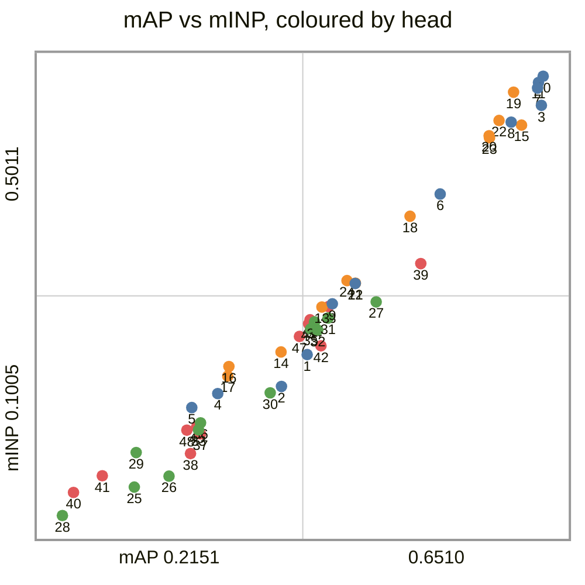
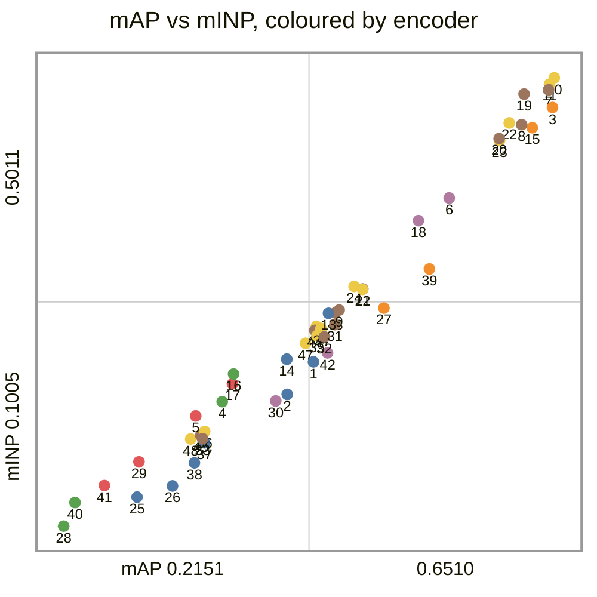
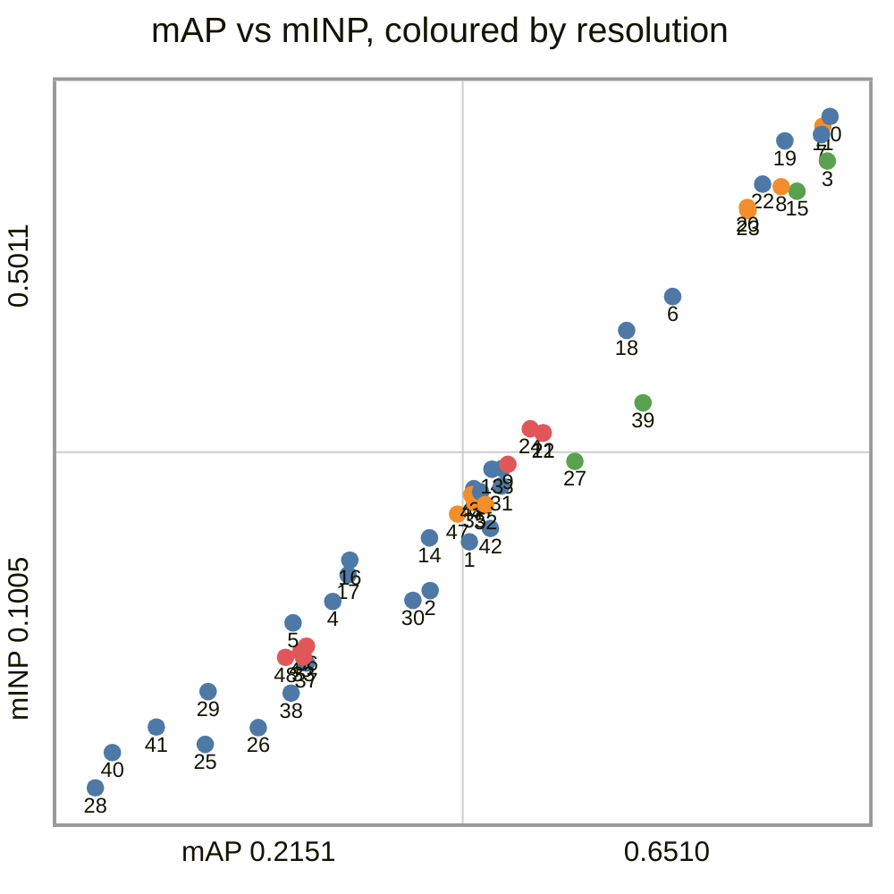

```mermaid
%%{init: {"themeVariables": {"xyChart": {"backgroundColor": "transparent", "plotColorPalette": "#4e79a7,#f28e2b,#59a14f,#e15759,#b07aa1,#9c755f,#edc948"}}, "xyChart": {"height": 1384, "width": 1215, "yAxis": {"showLabel": false}}}}%%
xychart-beta horizontal
    title "mAP, coloured by encoder"
    x-axis ["224x224 arcface vit_base_patch16_clip_224.openai crop · 43.70%", "224x224 arcface vit_base_patch16_clip_224.openai squash · 41.37%", "224x224 arcface vit_huge_plus_patch16_dinov3.lvd1689m squash · 35.60%", "224x224 arcface vit_large_patch16_dinov3.lvd1689m squash · 33.24%", "224x224 arcface vit_so400m_patch14_siglip_224.v2_webli squash · 55.76%", "224x224 arcface c-radio_v4-h squash · 64.59%", "224x224 arcface c-radio_v4-so400m squash · 65.10%", "224x224 linear vit_base_patch16_clip_224.openai crop · 45.04%", "224x224 linear vit_base_patch16_clip_224.openai squash · 41.34%", "224x224 linear vit_huge_plus_patch16_dinov3.lvd1689m squash · 36.61%", "224x224 linear vit_large_patch16_dinov3.lvd1689m squash · 36.51%", "224x224 linear vit_so400m_patch14_siglip_224.v2_webli squash · 53.03%", "224x224 linear c-radio_v4-h squash · 62.41%", "224x224 linear c-radio_v4-so400m squash · 61.10%", "224x224 none vit_base_patch16_clip_224.openai crop · 28.03%", "224x224 none vit_base_patch16_clip_224.openai squash · 31.18%", "224x224 none vit_huge_plus_patch16_dinov3.lvd1689m squash · 21.51%", "224x224 none vit_large_patch16_dinov3.lvd1689m squash · 28.20%", "224x224 none vit_so400m_patch14_siglip_224.v2_webli squash · 40.35%", "224x224 none c-radio_v4-h squash · 45.60%", "224x224 none c-radio_v4-so400m squash · 44.36%", "224x224 pca vit_base_patch16_clip_224.openai crop · 34.03%", "224x224 pca vit_base_patch16_clip_224.openai squash · 33.13%", "224x224 pca vit_huge_plus_patch16_dinov3.lvd1689m squash · 22.52%", "224x224 pca vit_large_patch16_dinov3.lvd1689m squash · 25.13%", "224x224 pca vit_so400m_patch14_siglip_224.v2_webli squash · 44.95%", "224x224 pca c-radio_v4-h squash · 45.63%", "224x224 pca c-radio_v4-so400m squash · 43.96%", "256x128 arcface c-radio_v4-h squash · 62.20%", "256x128 arcface c-radio_v4-so400m squash · 64.67%", "256x128 linear c-radio_v4-h squash · 60.20%", "256x128 linear c-radio_v4-so400m squash · 60.23%", "256x128 none c-radio_v4-h squash · 44.66%", "256x128 none c-radio_v4-so400m squash · 44.01%", "256x128 pca c-radio_v4-h squash · 43.83%", "256x128 pca c-radio_v4-so400m squash · 43.00%", "256x256 arcface vit_giantopt_patch16_siglip_256.v2_webli squash · 64.94%", "256x256 linear vit_giantopt_patch16_siglip_256.v2_webli squash · 63.13%", "256x256 none vit_giantopt_patch16_siglip_256.v2_webli squash · 49.96%", "256x256 pca vit_giantopt_patch16_siglip_256.v2_webli squash · 54.00%", "native arcface c-radio_v4-h squash · 45.98%", "native arcface c-radio_v4-so400m squash · 48.06%", "native linear c-radio_v4-h squash · 48.08%", "native linear c-radio_v4-so400m squash · 47.31%", "native none c-radio_v4-h squash · 33.85%", "native none c-radio_v4-so400m squash · 34.04%", "native pca c-radio_v4-h squash · 33.69%", "native pca c-radio_v4-so400m squash · 32.79%"]
    y-axis "mAP (%)" 0 --> 68.35
    bar [43.70, 41.37, 0.00, 0.00, 0.00, 0.00, 0.00, 45.04, 41.34, 0.00, 0.00, 0.00, 0.00, 0.00, 28.03, 31.18, 0.00, 0.00, 0.00, 0.00, 0.00, 34.03, 33.13, 0.00, 0.00, 0.00, 0.00, 0.00, 0.00, 0.00, 0.00, 0.00, 0.00, 0.00, 0.00, 0.00, 0.00, 0.00, 0.00, 0.00, 0.00, 0.00, 0.00, 0.00, 0.00, 0.00, 0.00, 0.00]
    bar [0.00, 0.00, 0.00, 0.00, 0.00, 0.00, 0.00, 0.00, 0.00, 0.00, 0.00, 0.00, 0.00, 0.00, 0.00, 0.00, 0.00, 0.00, 0.00, 0.00, 0.00, 0.00, 0.00, 0.00, 0.00, 0.00, 0.00, 0.00, 0.00, 0.00, 0.00, 0.00, 0.00, 0.00, 0.00, 0.00, 64.94, 63.13, 49.96, 54.00, 0.00, 0.00, 0.00, 0.00, 0.00, 0.00, 0.00, 0.00]
    bar [0.00, 0.00, 35.60, 0.00, 0.00, 0.00, 0.00, 0.00, 0.00, 36.61, 0.00, 0.00, 0.00, 0.00, 0.00, 0.00, 21.51, 0.00, 0.00, 0.00, 0.00, 0.00, 0.00, 22.52, 0.00, 0.00, 0.00, 0.00, 0.00, 0.00, 0.00, 0.00, 0.00, 0.00, 0.00, 0.00, 0.00, 0.00, 0.00, 0.00, 0.00, 0.00, 0.00, 0.00, 0.00, 0.00, 0.00, 0.00]
    bar [0.00, 0.00, 0.00, 33.24, 0.00, 0.00, 0.00, 0.00, 0.00, 0.00, 36.51, 0.00, 0.00, 0.00, 0.00, 0.00, 0.00, 28.20, 0.00, 0.00, 0.00, 0.00, 0.00, 0.00, 25.13, 0.00, 0.00, 0.00, 0.00, 0.00, 0.00, 0.00, 0.00, 0.00, 0.00, 0.00, 0.00, 0.00, 0.00, 0.00, 0.00, 0.00, 0.00, 0.00, 0.00, 0.00, 0.00, 0.00]
    bar [0.00, 0.00, 0.00, 0.00, 55.76, 0.00, 0.00, 0.00, 0.00, 0.00, 0.00, 53.03, 0.00, 0.00, 0.00, 0.00, 0.00, 0.00, 40.35, 0.00, 0.00, 0.00, 0.00, 0.00, 0.00, 44.95, 0.00, 0.00, 0.00, 0.00, 0.00, 0.00, 0.00, 0.00, 0.00, 0.00, 0.00, 0.00, 0.00, 0.00, 0.00, 0.00, 0.00, 0.00, 0.00, 0.00, 0.00, 0.00]
    bar [0.00, 0.00, 0.00, 0.00, 0.00, 64.59, 0.00, 0.00, 0.00, 0.00, 0.00, 0.00, 62.41, 0.00, 0.00, 0.00, 0.00, 0.00, 0.00, 45.60, 0.00, 0.00, 0.00, 0.00, 0.00, 0.00, 45.63, 0.00, 62.20, 0.00, 60.20, 0.00, 44.66, 0.00, 43.83, 0.00, 0.00, 0.00, 0.00, 0.00, 45.98, 0.00, 48.08, 0.00, 33.85, 0.00, 33.69, 0.00]
    bar [0.00, 0.00, 0.00, 0.00, 0.00, 0.00, 65.10, 0.00, 0.00, 0.00, 0.00, 0.00, 0.00, 61.10, 0.00, 0.00, 0.00, 0.00, 0.00, 0.00, 44.36, 0.00, 0.00, 0.00, 0.00, 0.00, 0.00, 43.96, 0.00, 64.67, 0.00, 60.23, 0.00, 44.01, 0.00, 43.00, 0.00, 0.00, 0.00, 0.00, 0.00, 48.06, 0.00, 47.31, 0.00, 34.04, 0.00, 32.79]
```

<!-- generated by `reidbench render`; edit the runs, not this file -->

# occluded-reid

[← table.md](../table.md)

## occluded-reid/occluded-vs-whole@1

### 🟦 arcface

|  # | encoder                                       | resolution | resize |        mAP |         R1 |         R5 |        R10 |       mINP |
|---:|-----------------------------------------------|------------|--------|-----------:|-----------:|-----------:|-----------:|-----------:|
|  1 | timm:vit_base_patch16_clip_224.openai         | 224x224    | crop   |     0.4370 |     0.5230 |     0.7200 |     0.7970 |     0.2473 |
|  2 | timm:vit_base_patch16_clip_224.openai         | 224x224    | squash |     0.4137 |     0.5200 |     0.7240 |     0.7800 |     0.2182 |
|  3 | timm:vit_giantopt_patch16_siglip_256.v2_webli | 256x256    | squash |     0.6494 | **0.7490** | **0.8550** | **0.8960** |     0.4745 |
|  4 | timm:vit_huge_plus_patch16_dinov3.lvd1689m    | 224x224    | squash |     0.3560 |     0.4010 |     0.5940 |     0.6890 |     0.2117 |
|  5 | timm:vit_large_patch16_dinov3.lvd1689m        | 224x224    | squash |     0.3324 |     0.3720 |     0.5630 |     0.6550 |     0.1990 |
|  6 | timm:vit_so400m_patch14_siglip_224.v2_webli   | 224x224    | squash |     0.5576 |     0.6310 |     0.7680 |     0.8200 |     0.3937 |
|  7 | torchhub:NVlabs/RADIO/c-radio_v4-h            | 224x224    | squash |     0.6459 |     0.7160 |     0.8390 |     0.8740 |     0.4903 |
|  8 | torchhub:NVlabs/RADIO/c-radio_v4-h            | 256x128    | squash |     0.6220 |     0.7020 |     0.8280 |     0.8710 |     0.4593 |
|  9 | torchhub:NVlabs/RADIO/c-radio_v4-h            | native     | squash |     0.4598 |     0.5390 |     0.7040 |     0.7810 |     0.2936 |
| 10 | torchhub:NVlabs/RADIO/c-radio_v4-so400m       | 224x224    | squash | **0.6510** |     0.7060 |     0.8430 |     0.8870 | **0.5011** |
| 11 | torchhub:NVlabs/RADIO/c-radio_v4-so400m       | 256x128    | squash |     0.6467 |     0.7230 |     0.8370 |     0.8870 |     0.4953 |
| 12 | torchhub:NVlabs/RADIO/c-radio_v4-so400m       | native     | squash |     0.4806 |     0.5670 |     0.7420 |     0.7950 |     0.3121 |

### 🟧 linear

|  # | encoder                                       | resolution | resize |        mAP |         R1 |         R5 |        R10 |       mINP |
|---:|-----------------------------------------------|------------|--------|-----------:|-----------:|-----------:|-----------:|-----------:|
| 13 | timm:vit_base_patch16_clip_224.openai         | 224x224    | crop   |     0.4504 |     0.5210 |     0.7150 |     0.7960 |     0.2906 |
| 14 | timm:vit_base_patch16_clip_224.openai         | 224x224    | squash |     0.4134 |     0.4840 |     0.6920 |     0.7780 |     0.2497 |
| 15 | timm:vit_giantopt_patch16_siglip_256.v2_webli | 256x256    | squash | **0.6313** | **0.7260** | **0.8470** | **0.8850** |     0.4565 |
| 16 | timm:vit_huge_plus_patch16_dinov3.lvd1689m    | 224x224    | squash |     0.3661 |     0.4090 |     0.5850 |     0.6830 |     0.2364 |
| 17 | timm:vit_large_patch16_dinov3.lvd1689m        | 224x224    | squash |     0.3651 |     0.4210 |     0.6050 |     0.6880 |     0.2276 |
| 18 | timm:vit_so400m_patch14_siglip_224.v2_webli   | 224x224    | squash |     0.5303 |     0.5940 |     0.7530 |     0.8260 |     0.3734 |
| 19 | torchhub:NVlabs/RADIO/c-radio_v4-h            | 224x224    | squash |     0.6241 |     0.6900 |     0.8150 |     0.8750 | **0.4866** |
| 20 | torchhub:NVlabs/RADIO/c-radio_v4-h            | 256x128    | squash |     0.6020 |     0.6520 |     0.8230 |     0.8710 |     0.4469 |
| 21 | torchhub:NVlabs/RADIO/c-radio_v4-h            | native     | squash |     0.4808 |     0.5560 |     0.7260 |     0.8110 |     0.3124 |
| 22 | torchhub:NVlabs/RADIO/c-radio_v4-so400m       | 224x224    | squash |     0.6110 |     0.6690 |     0.8270 |     0.8670 |     0.4607 |
| 23 | torchhub:NVlabs/RADIO/c-radio_v4-so400m       | 256x128    | squash |     0.6023 |     0.6720 |     0.8230 |     0.8740 |     0.4450 |
| 24 | torchhub:NVlabs/RADIO/c-radio_v4-so400m       | native     | squash |     0.4731 |     0.5510 |     0.7360 |     0.8020 |     0.3147 |

### 🟩 none

|  # | encoder                                       | resolution | resize |        mAP |         R1 |         R5 |        R10 |       mINP |
|---:|-----------------------------------------------|------------|--------|-----------:|-----------:|-----------:|-----------:|-----------:|
| 25 | timm:vit_base_patch16_clip_224.openai         | 224x224    | crop   |     0.2803 |     0.3540 |     0.5640 |     0.6490 |     0.1264 |
| 26 | timm:vit_base_patch16_clip_224.openai         | 224x224    | squash |     0.3118 |     0.4090 |     0.6530 |     0.7300 |     0.1364 |
| 27 | timm:vit_giantopt_patch16_siglip_256.v2_webli | 256x256    | squash | **0.4996** | **0.6280** | **0.7800** | **0.8500** | **0.2953** |
| 28 | timm:vit_huge_plus_patch16_dinov3.lvd1689m    | 224x224    | squash |     0.2151 |     0.2680 |     0.4340 |     0.5200 |     0.1005 |
| 29 | timm:vit_large_patch16_dinov3.lvd1689m        | 224x224    | squash |     0.2820 |     0.3130 |     0.5360 |     0.6340 |     0.1580 |
| 30 | timm:vit_so400m_patch14_siglip_224.v2_webli   | 224x224    | squash |     0.4035 |     0.5090 |     0.6880 |     0.7500 |     0.2124 |
| 31 | torchhub:NVlabs/RADIO/c-radio_v4-h            | 224x224    | squash |     0.4560 |     0.5240 |     0.7190 |     0.7940 |     0.2806 |
| 32 | torchhub:NVlabs/RADIO/c-radio_v4-h            | 256x128    | squash |     0.4466 |     0.5230 |     0.7160 |     0.7930 |     0.2696 |
| 33 | torchhub:NVlabs/RADIO/c-radio_v4-h            | native     | squash |     0.3385 |     0.4170 |     0.6350 |     0.7270 |     0.1786 |
| 34 | torchhub:NVlabs/RADIO/c-radio_v4-so400m       | 224x224    | squash |     0.4436 |     0.5100 |     0.6990 |     0.7780 |     0.2771 |
| 35 | torchhub:NVlabs/RADIO/c-radio_v4-so400m       | 256x128    | squash |     0.4401 |     0.5200 |     0.7020 |     0.7720 |     0.2706 |
| 36 | torchhub:NVlabs/RADIO/c-radio_v4-so400m       | native     | squash |     0.3404 |     0.4140 |     0.6240 |     0.7120 |     0.1850 |

### 🟥 pca

|  # | encoder                                       | resolution | resize |        mAP |         R1 |         R5 |        R10 |       mINP |
|---:|-----------------------------------------------|------------|--------|-----------:|-----------:|-----------:|-----------:|-----------:|
| 37 | timm:vit_base_patch16_clip_224.openai         | 224x224    | crop   |     0.3403 |     0.4200 |     0.6280 |     0.7120 |     0.1749 |
| 38 | timm:vit_base_patch16_clip_224.openai         | 224x224    | squash |     0.3313 |     0.4340 |     0.6460 |     0.7240 |     0.1570 |
| 39 | timm:vit_giantopt_patch16_siglip_256.v2_webli | 256x256    | squash | **0.5400** | **0.6590** | **0.8070** | **0.8620** | **0.3303** |
| 40 | timm:vit_huge_plus_patch16_dinov3.lvd1689m    | 224x224    | squash |     0.2252 |     0.2620 |     0.4340 |     0.5070 |     0.1216 |
| 41 | timm:vit_large_patch16_dinov3.lvd1689m        | 224x224    | squash |     0.2513 |     0.2700 |     0.4810 |     0.5860 |     0.1368 |
| 42 | timm:vit_so400m_patch14_siglip_224.v2_webli   | 224x224    | squash |     0.4495 |     0.5590 |     0.7110 |     0.7780 |     0.2553 |
| 43 | torchhub:NVlabs/RADIO/c-radio_v4-h            | 224x224    | squash |     0.4563 |     0.5280 |     0.7280 |     0.7980 |     0.2910 |
| 44 | torchhub:NVlabs/RADIO/c-radio_v4-h            | 256x128    | squash |     0.4383 |     0.5050 |     0.7080 |     0.7800 |     0.2754 |
| 45 | torchhub:NVlabs/RADIO/c-radio_v4-h            | native     | squash |     0.3369 |     0.4060 |     0.6150 |     0.7050 |     0.1815 |
| 46 | torchhub:NVlabs/RADIO/c-radio_v4-so400m       | 224x224    | squash |     0.4396 |     0.5200 |     0.6940 |     0.7720 |     0.2790 |
| 47 | torchhub:NVlabs/RADIO/c-radio_v4-so400m       | 256x128    | squash |     0.4300 |     0.5070 |     0.6980 |     0.7700 |     0.2638 |
| 48 | torchhub:NVlabs/RADIO/c-radio_v4-so400m       | native     | squash |     0.3279 |     0.4060 |     0.6080 |     0.6880 |     0.1784 |

### Every row, by encoder and resolution

```mermaid
%%{init: {"themeVariables": {"xyChart": {"backgroundColor": "transparent", "plotColorPalette": "#4e79a7,#f28e2b,#59a14f,#e15759"}}, "xyChart": {"height": 1384, "width": 1215, "yAxis": {"showLabel": false}}}}%%
xychart-beta horizontal
    title "mAP, coloured by head"
    x-axis ["vit_base_patch16_clip_224.openai 224x224 arcface crop · 43.70%", "vit_base_patch16_clip_224.openai 224x224 arcface squash · 41.37%", "vit_base_patch16_clip_224.openai 224x224 linear crop · 45.04%", "vit_base_patch16_clip_224.openai 224x224 linear squash · 41.34%", "vit_base_patch16_clip_224.openai 224x224 none crop · 28.03%", "vit_base_patch16_clip_224.openai 224x224 none squash · 31.18%", "vit_base_patch16_clip_224.openai 224x224 pca crop · 34.03%", "vit_base_patch16_clip_224.openai 224x224 pca squash · 33.13%", "vit_giantopt_patch16_siglip_256.v2_webli 256x256 arcface squash · 64.94%", "vit_giantopt_patch16_siglip_256.v2_webli 256x256 linear squash · 63.13%", "vit_giantopt_patch16_siglip_256.v2_webli 256x256 none squash · 49.96%", "vit_giantopt_patch16_siglip_256.v2_webli 256x256 pca squash · 54.00%", "vit_huge_plus_patch16_dinov3.lvd1689m 224x224 arcface squash · 35.60%", "vit_huge_plus_patch16_dinov3.lvd1689m 224x224 linear squash · 36.61%", "vit_huge_plus_patch16_dinov3.lvd1689m 224x224 none squash · 21.51%", "vit_huge_plus_patch16_dinov3.lvd1689m 224x224 pca squash · 22.52%", "vit_large_patch16_dinov3.lvd1689m 224x224 arcface squash · 33.24%", "vit_large_patch16_dinov3.lvd1689m 224x224 linear squash · 36.51%", "vit_large_patch16_dinov3.lvd1689m 224x224 none squash · 28.20%", "vit_large_patch16_dinov3.lvd1689m 224x224 pca squash · 25.13%", "vit_so400m_patch14_siglip_224.v2_webli 224x224 arcface squash · 55.76%", "vit_so400m_patch14_siglip_224.v2_webli 224x224 linear squash · 53.03%", "vit_so400m_patch14_siglip_224.v2_webli 224x224 none squash · 40.35%", "vit_so400m_patch14_siglip_224.v2_webli 224x224 pca squash · 44.95%", "c-radio_v4-h 224x224 arcface squash · 64.59%", "c-radio_v4-h 224x224 linear squash · 62.41%", "c-radio_v4-h 224x224 none squash · 45.60%", "c-radio_v4-h 224x224 pca squash · 45.63%", "c-radio_v4-h 256x128 arcface squash · 62.20%", "c-radio_v4-h 256x128 linear squash · 60.20%", "c-radio_v4-h 256x128 none squash · 44.66%", "c-radio_v4-h 256x128 pca squash · 43.83%", "c-radio_v4-h native arcface squash · 45.98%", "c-radio_v4-h native linear squash · 48.08%", "c-radio_v4-h native none squash · 33.85%", "c-radio_v4-h native pca squash · 33.69%", "c-radio_v4-so400m 224x224 arcface squash · 65.10%", "c-radio_v4-so400m 224x224 linear squash · 61.10%", "c-radio_v4-so400m 224x224 none squash · 44.36%", "c-radio_v4-so400m 224x224 pca squash · 43.96%", "c-radio_v4-so400m 256x128 arcface squash · 64.67%", "c-radio_v4-so400m 256x128 linear squash · 60.23%", "c-radio_v4-so400m 256x128 none squash · 44.01%", "c-radio_v4-so400m 256x128 pca squash · 43.00%", "c-radio_v4-so400m native arcface squash · 48.06%", "c-radio_v4-so400m native linear squash · 47.31%", "c-radio_v4-so400m native none squash · 34.04%", "c-radio_v4-so400m native pca squash · 32.79%"]
    y-axis "mAP (%)" 0 --> 68.35
    bar [43.70, 41.37, 0.00, 0.00, 0.00, 0.00, 0.00, 0.00, 64.94, 0.00, 0.00, 0.00, 35.60, 0.00, 0.00, 0.00, 33.24, 0.00, 0.00, 0.00, 55.76, 0.00, 0.00, 0.00, 64.59, 0.00, 0.00, 0.00, 62.20, 0.00, 0.00, 0.00, 45.98, 0.00, 0.00, 0.00, 65.10, 0.00, 0.00, 0.00, 64.67, 0.00, 0.00, 0.00, 48.06, 0.00, 0.00, 0.00]
    bar [0.00, 0.00, 45.04, 41.34, 0.00, 0.00, 0.00, 0.00, 0.00, 63.13, 0.00, 0.00, 0.00, 36.61, 0.00, 0.00, 0.00, 36.51, 0.00, 0.00, 0.00, 53.03, 0.00, 0.00, 0.00, 62.41, 0.00, 0.00, 0.00, 60.20, 0.00, 0.00, 0.00, 48.08, 0.00, 0.00, 0.00, 61.10, 0.00, 0.00, 0.00, 60.23, 0.00, 0.00, 0.00, 47.31, 0.00, 0.00]
    bar [0.00, 0.00, 0.00, 0.00, 28.03, 31.18, 0.00, 0.00, 0.00, 0.00, 49.96, 0.00, 0.00, 0.00, 21.51, 0.00, 0.00, 0.00, 28.20, 0.00, 0.00, 0.00, 40.35, 0.00, 0.00, 0.00, 45.60, 0.00, 0.00, 0.00, 44.66, 0.00, 0.00, 0.00, 33.85, 0.00, 0.00, 0.00, 44.36, 0.00, 0.00, 0.00, 44.01, 0.00, 0.00, 0.00, 34.04, 0.00]
    bar [0.00, 0.00, 0.00, 0.00, 0.00, 0.00, 34.03, 33.13, 0.00, 0.00, 0.00, 54.00, 0.00, 0.00, 0.00, 22.52, 0.00, 0.00, 0.00, 25.13, 0.00, 0.00, 0.00, 44.95, 0.00, 0.00, 0.00, 45.63, 0.00, 0.00, 0.00, 43.83, 0.00, 0.00, 0.00, 33.69, 0.00, 0.00, 0.00, 43.96, 0.00, 0.00, 0.00, 43.00, 0.00, 0.00, 0.00, 32.79]
```

### By head — does the probe carry it?

```mermaid
%%{init: {"themeVariables": {"xyChart": {"backgroundColor": "transparent", "plotColorPalette": "#4e79a7,#f28e2b,#59a14f,#e15759"}}, "xyChart": {"height": 1384, "width": 1215, "yAxis": {"showLabel": false}}}}%%
xychart-beta horizontal
    title "mAP, coloured by head"
    x-axis ["arcface vit_base_patch16_clip_224.openai 224x224 crop · 43.70%", "arcface vit_base_patch16_clip_224.openai 224x224 squash · 41.37%", "arcface vit_giantopt_patch16_siglip_256.v2_webli 256x256 squash · 64.94%", "arcface vit_huge_plus_patch16_dinov3.lvd1689m 224x224 squash · 35.60%", "arcface vit_large_patch16_dinov3.lvd1689m 224x224 squash · 33.24%", "arcface vit_so400m_patch14_siglip_224.v2_webli 224x224 squash · 55.76%", "arcface c-radio_v4-h 224x224 squash · 64.59%", "arcface c-radio_v4-h 256x128 squash · 62.20%", "arcface c-radio_v4-h native squash · 45.98%", "arcface c-radio_v4-so400m 224x224 squash · 65.10%", "arcface c-radio_v4-so400m 256x128 squash · 64.67%", "arcface c-radio_v4-so400m native squash · 48.06%", "linear vit_base_patch16_clip_224.openai 224x224 crop · 45.04%", "linear vit_base_patch16_clip_224.openai 224x224 squash · 41.34%", "linear vit_giantopt_patch16_siglip_256.v2_webli 256x256 squash · 63.13%", "linear vit_huge_plus_patch16_dinov3.lvd1689m 224x224 squash · 36.61%", "linear vit_large_patch16_dinov3.lvd1689m 224x224 squash · 36.51%", "linear vit_so400m_patch14_siglip_224.v2_webli 224x224 squash · 53.03%", "linear c-radio_v4-h 224x224 squash · 62.41%", "linear c-radio_v4-h 256x128 squash · 60.20%", "linear c-radio_v4-h native squash · 48.08%", "linear c-radio_v4-so400m 224x224 squash · 61.10%", "linear c-radio_v4-so400m 256x128 squash · 60.23%", "linear c-radio_v4-so400m native squash · 47.31%", "none vit_base_patch16_clip_224.openai 224x224 crop · 28.03%", "none vit_base_patch16_clip_224.openai 224x224 squash · 31.18%", "none vit_giantopt_patch16_siglip_256.v2_webli 256x256 squash · 49.96%", "none vit_huge_plus_patch16_dinov3.lvd1689m 224x224 squash · 21.51%", "none vit_large_patch16_dinov3.lvd1689m 224x224 squash · 28.20%", "none vit_so400m_patch14_siglip_224.v2_webli 224x224 squash · 40.35%", "none c-radio_v4-h 224x224 squash · 45.60%", "none c-radio_v4-h 256x128 squash · 44.66%", "none c-radio_v4-h native squash · 33.85%", "none c-radio_v4-so400m 224x224 squash · 44.36%", "none c-radio_v4-so400m 256x128 squash · 44.01%", "none c-radio_v4-so400m native squash · 34.04%", "pca vit_base_patch16_clip_224.openai 224x224 crop · 34.03%", "pca vit_base_patch16_clip_224.openai 224x224 squash · 33.13%", "pca vit_giantopt_patch16_siglip_256.v2_webli 256x256 squash · 54.00%", "pca vit_huge_plus_patch16_dinov3.lvd1689m 224x224 squash · 22.52%", "pca vit_large_patch16_dinov3.lvd1689m 224x224 squash · 25.13%", "pca vit_so400m_patch14_siglip_224.v2_webli 224x224 squash · 44.95%", "pca c-radio_v4-h 224x224 squash · 45.63%", "pca c-radio_v4-h 256x128 squash · 43.83%", "pca c-radio_v4-h native squash · 33.69%", "pca c-radio_v4-so400m 224x224 squash · 43.96%", "pca c-radio_v4-so400m 256x128 squash · 43.00%", "pca c-radio_v4-so400m native squash · 32.79%"]
    y-axis "mAP (%)" 0 --> 68.35
    bar [43.70, 41.37, 64.94, 35.60, 33.24, 55.76, 64.59, 62.20, 45.98, 65.10, 64.67, 48.06, 0.00, 0.00, 0.00, 0.00, 0.00, 0.00, 0.00, 0.00, 0.00, 0.00, 0.00, 0.00, 0.00, 0.00, 0.00, 0.00, 0.00, 0.00, 0.00, 0.00, 0.00, 0.00, 0.00, 0.00, 0.00, 0.00, 0.00, 0.00, 0.00, 0.00, 0.00, 0.00, 0.00, 0.00, 0.00, 0.00]
    bar [0.00, 0.00, 0.00, 0.00, 0.00, 0.00, 0.00, 0.00, 0.00, 0.00, 0.00, 0.00, 45.04, 41.34, 63.13, 36.61, 36.51, 53.03, 62.41, 60.20, 48.08, 61.10, 60.23, 47.31, 0.00, 0.00, 0.00, 0.00, 0.00, 0.00, 0.00, 0.00, 0.00, 0.00, 0.00, 0.00, 0.00, 0.00, 0.00, 0.00, 0.00, 0.00, 0.00, 0.00, 0.00, 0.00, 0.00, 0.00]
    bar [0.00, 0.00, 0.00, 0.00, 0.00, 0.00, 0.00, 0.00, 0.00, 0.00, 0.00, 0.00, 0.00, 0.00, 0.00, 0.00, 0.00, 0.00, 0.00, 0.00, 0.00, 0.00, 0.00, 0.00, 28.03, 31.18, 49.96, 21.51, 28.20, 40.35, 45.60, 44.66, 33.85, 44.36, 44.01, 34.04, 0.00, 0.00, 0.00, 0.00, 0.00, 0.00, 0.00, 0.00, 0.00, 0.00, 0.00, 0.00]
    bar [0.00, 0.00, 0.00, 0.00, 0.00, 0.00, 0.00, 0.00, 0.00, 0.00, 0.00, 0.00, 0.00, 0.00, 0.00, 0.00, 0.00, 0.00, 0.00, 0.00, 0.00, 0.00, 0.00, 0.00, 0.00, 0.00, 0.00, 0.00, 0.00, 0.00, 0.00, 0.00, 0.00, 0.00, 0.00, 0.00, 34.03, 33.13, 54.00, 22.52, 25.13, 44.95, 45.63, 43.83, 33.69, 43.96, 43.00, 32.79]
```

### By encoder — does the checkpoint carry it?

*Colour — encoder:* 🟦 timm:vit_base_patch16_clip_224.openai · 🟧 timm:vit_giantopt_patch16_siglip_256.v2_webli · 🟩 timm:vit_huge_plus_patch16_dinov3.lvd1689m · 🟥 timm:vit_large_patch16_dinov3.lvd1689m · 🟪 timm:vit_so400m_patch14_siglip_224.v2_webli · 🟫 torchhub:NVlabs/RADIO/c-radio_v4-h · 🟨 torchhub:NVlabs/RADIO/c-radio_v4-so400m

```mermaid
%%{init: {"themeVariables": {"xyChart": {"backgroundColor": "transparent", "plotColorPalette": "#4e79a7,#f28e2b,#59a14f,#e15759,#b07aa1,#9c755f,#edc948"}}, "xyChart": {"height": 1384, "width": 1215, "yAxis": {"showLabel": false}}}}%%
xychart-beta horizontal
    title "mAP, coloured by encoder"
    x-axis ["vit_base_patch16_clip_224.openai arcface 224x224 crop · 43.70%", "vit_base_patch16_clip_224.openai arcface 224x224 squash · 41.37%", "vit_base_patch16_clip_224.openai linear 224x224 crop · 45.04%", "vit_base_patch16_clip_224.openai linear 224x224 squash · 41.34%", "vit_base_patch16_clip_224.openai none 224x224 crop · 28.03%", "vit_base_patch16_clip_224.openai none 224x224 squash · 31.18%", "vit_base_patch16_clip_224.openai pca 224x224 crop · 34.03%", "vit_base_patch16_clip_224.openai pca 224x224 squash · 33.13%", "vit_giantopt_patch16_siglip_256.v2_webli arcface 256x256 squash · 64.94%", "vit_giantopt_patch16_siglip_256.v2_webli linear 256x256 squash · 63.13%", "vit_giantopt_patch16_siglip_256.v2_webli none 256x256 squash · 49.96%", "vit_giantopt_patch16_siglip_256.v2_webli pca 256x256 squash · 54.00%", "vit_huge_plus_patch16_dinov3.lvd1689m arcface 224x224 squash · 35.60%", "vit_huge_plus_patch16_dinov3.lvd1689m linear 224x224 squash · 36.61%", "vit_huge_plus_patch16_dinov3.lvd1689m none 224x224 squash · 21.51%", "vit_huge_plus_patch16_dinov3.lvd1689m pca 224x224 squash · 22.52%", "vit_large_patch16_dinov3.lvd1689m arcface 224x224 squash · 33.24%", "vit_large_patch16_dinov3.lvd1689m linear 224x224 squash · 36.51%", "vit_large_patch16_dinov3.lvd1689m none 224x224 squash · 28.20%", "vit_large_patch16_dinov3.lvd1689m pca 224x224 squash · 25.13%", "vit_so400m_patch14_siglip_224.v2_webli arcface 224x224 squash · 55.76%", "vit_so400m_patch14_siglip_224.v2_webli linear 224x224 squash · 53.03%", "vit_so400m_patch14_siglip_224.v2_webli none 224x224 squash · 40.35%", "vit_so400m_patch14_siglip_224.v2_webli pca 224x224 squash · 44.95%", "c-radio_v4-h arcface 224x224 squash · 64.59%", "c-radio_v4-h arcface 256x128 squash · 62.20%", "c-radio_v4-h arcface native squash · 45.98%", "c-radio_v4-h linear 224x224 squash · 62.41%", "c-radio_v4-h linear 256x128 squash · 60.20%", "c-radio_v4-h linear native squash · 48.08%", "c-radio_v4-h none 224x224 squash · 45.60%", "c-radio_v4-h none 256x128 squash · 44.66%", "c-radio_v4-h none native squash · 33.85%", "c-radio_v4-h pca 224x224 squash · 45.63%", "c-radio_v4-h pca 256x128 squash · 43.83%", "c-radio_v4-h pca native squash · 33.69%", "c-radio_v4-so400m arcface 224x224 squash · 65.10%", "c-radio_v4-so400m arcface 256x128 squash · 64.67%", "c-radio_v4-so400m arcface native squash · 48.06%", "c-radio_v4-so400m linear 224x224 squash · 61.10%", "c-radio_v4-so400m linear 256x128 squash · 60.23%", "c-radio_v4-so400m linear native squash · 47.31%", "c-radio_v4-so400m none 224x224 squash · 44.36%", "c-radio_v4-so400m none 256x128 squash · 44.01%", "c-radio_v4-so400m none native squash · 34.04%", "c-radio_v4-so400m pca 224x224 squash · 43.96%", "c-radio_v4-so400m pca 256x128 squash · 43.00%", "c-radio_v4-so400m pca native squash · 32.79%"]
    y-axis "mAP (%)" 0 --> 68.35
    bar [43.70, 41.37, 45.04, 41.34, 28.03, 31.18, 34.03, 33.13, 0.00, 0.00, 0.00, 0.00, 0.00, 0.00, 0.00, 0.00, 0.00, 0.00, 0.00, 0.00, 0.00, 0.00, 0.00, 0.00, 0.00, 0.00, 0.00, 0.00, 0.00, 0.00, 0.00, 0.00, 0.00, 0.00, 0.00, 0.00, 0.00, 0.00, 0.00, 0.00, 0.00, 0.00, 0.00, 0.00, 0.00, 0.00, 0.00, 0.00]
    bar [0.00, 0.00, 0.00, 0.00, 0.00, 0.00, 0.00, 0.00, 64.94, 63.13, 49.96, 54.00, 0.00, 0.00, 0.00, 0.00, 0.00, 0.00, 0.00, 0.00, 0.00, 0.00, 0.00, 0.00, 0.00, 0.00, 0.00, 0.00, 0.00, 0.00, 0.00, 0.00, 0.00, 0.00, 0.00, 0.00, 0.00, 0.00, 0.00, 0.00, 0.00, 0.00, 0.00, 0.00, 0.00, 0.00, 0.00, 0.00]
    bar [0.00, 0.00, 0.00, 0.00, 0.00, 0.00, 0.00, 0.00, 0.00, 0.00, 0.00, 0.00, 35.60, 36.61, 21.51, 22.52, 0.00, 0.00, 0.00, 0.00, 0.00, 0.00, 0.00, 0.00, 0.00, 0.00, 0.00, 0.00, 0.00, 0.00, 0.00, 0.00, 0.00, 0.00, 0.00, 0.00, 0.00, 0.00, 0.00, 0.00, 0.00, 0.00, 0.00, 0.00, 0.00, 0.00, 0.00, 0.00]
    bar [0.00, 0.00, 0.00, 0.00, 0.00, 0.00, 0.00, 0.00, 0.00, 0.00, 0.00, 0.00, 0.00, 0.00, 0.00, 0.00, 33.24, 36.51, 28.20, 25.13, 0.00, 0.00, 0.00, 0.00, 0.00, 0.00, 0.00, 0.00, 0.00, 0.00, 0.00, 0.00, 0.00, 0.00, 0.00, 0.00, 0.00, 0.00, 0.00, 0.00, 0.00, 0.00, 0.00, 0.00, 0.00, 0.00, 0.00, 0.00]
    bar [0.00, 0.00, 0.00, 0.00, 0.00, 0.00, 0.00, 0.00, 0.00, 0.00, 0.00, 0.00, 0.00, 0.00, 0.00, 0.00, 0.00, 0.00, 0.00, 0.00, 55.76, 53.03, 40.35, 44.95, 0.00, 0.00, 0.00, 0.00, 0.00, 0.00, 0.00, 0.00, 0.00, 0.00, 0.00, 0.00, 0.00, 0.00, 0.00, 0.00, 0.00, 0.00, 0.00, 0.00, 0.00, 0.00, 0.00, 0.00]
    bar [0.00, 0.00, 0.00, 0.00, 0.00, 0.00, 0.00, 0.00, 0.00, 0.00, 0.00, 0.00, 0.00, 0.00, 0.00, 0.00, 0.00, 0.00, 0.00, 0.00, 0.00, 0.00, 0.00, 0.00, 64.59, 62.20, 45.98, 62.41, 60.20, 48.08, 45.60, 44.66, 33.85, 45.63, 43.83, 33.69, 0.00, 0.00, 0.00, 0.00, 0.00, 0.00, 0.00, 0.00, 0.00, 0.00, 0.00, 0.00]
    bar [0.00, 0.00, 0.00, 0.00, 0.00, 0.00, 0.00, 0.00, 0.00, 0.00, 0.00, 0.00, 0.00, 0.00, 0.00, 0.00, 0.00, 0.00, 0.00, 0.00, 0.00, 0.00, 0.00, 0.00, 0.00, 0.00, 0.00, 0.00, 0.00, 0.00, 0.00, 0.00, 0.00, 0.00, 0.00, 0.00, 65.10, 64.67, 48.06, 61.10, 60.23, 47.31, 44.36, 44.01, 34.04, 43.96, 43.00, 32.79]
```

### By resolution — does the input size carry it?

*Colour — resolution:* 🟦 224x224 · 🟧 256x128 · 🟩 256x256 · 🟥 native

```mermaid
%%{init: {"themeVariables": {"xyChart": {"backgroundColor": "transparent", "plotColorPalette": "#4e79a7,#f28e2b,#59a14f,#e15759"}}, "xyChart": {"height": 1384, "width": 1215, "yAxis": {"showLabel": false}}}}%%
xychart-beta horizontal
    title "mAP, coloured by resolution"
    x-axis ["224x224 vit_base_patch16_clip_224.openai arcface crop · 43.70%", "224x224 vit_base_patch16_clip_224.openai arcface squash · 41.37%", "224x224 vit_base_patch16_clip_224.openai linear crop · 45.04%", "224x224 vit_base_patch16_clip_224.openai linear squash · 41.34%", "224x224 vit_base_patch16_clip_224.openai none crop · 28.03%", "224x224 vit_base_patch16_clip_224.openai none squash · 31.18%", "224x224 vit_base_patch16_clip_224.openai pca crop · 34.03%", "224x224 vit_base_patch16_clip_224.openai pca squash · 33.13%", "224x224 vit_huge_plus_patch16_dinov3.lvd1689m arcface squash · 35.60%", "224x224 vit_huge_plus_patch16_dinov3.lvd1689m linear squash · 36.61%", "224x224 vit_huge_plus_patch16_dinov3.lvd1689m none squash · 21.51%", "224x224 vit_huge_plus_patch16_dinov3.lvd1689m pca squash · 22.52%", "224x224 vit_large_patch16_dinov3.lvd1689m arcface squash · 33.24%", "224x224 vit_large_patch16_dinov3.lvd1689m linear squash · 36.51%", "224x224 vit_large_patch16_dinov3.lvd1689m none squash · 28.20%", "224x224 vit_large_patch16_dinov3.lvd1689m pca squash · 25.13%", "224x224 vit_so400m_patch14_siglip_224.v2_webli arcface squash · 55.76%", "224x224 vit_so400m_patch14_siglip_224.v2_webli linear squash · 53.03%", "224x224 vit_so400m_patch14_siglip_224.v2_webli none squash · 40.35%", "224x224 vit_so400m_patch14_siglip_224.v2_webli pca squash · 44.95%", "224x224 c-radio_v4-h arcface squash · 64.59%", "224x224 c-radio_v4-h linear squash · 62.41%", "224x224 c-radio_v4-h none squash · 45.60%", "224x224 c-radio_v4-h pca squash · 45.63%", "224x224 c-radio_v4-so400m arcface squash · 65.10%", "224x224 c-radio_v4-so400m linear squash · 61.10%", "224x224 c-radio_v4-so400m none squash · 44.36%", "224x224 c-radio_v4-so400m pca squash · 43.96%", "256x128 c-radio_v4-h arcface squash · 62.20%", "256x128 c-radio_v4-h linear squash · 60.20%", "256x128 c-radio_v4-h none squash · 44.66%", "256x128 c-radio_v4-h pca squash · 43.83%", "256x128 c-radio_v4-so400m arcface squash · 64.67%", "256x128 c-radio_v4-so400m linear squash · 60.23%", "256x128 c-radio_v4-so400m none squash · 44.01%", "256x128 c-radio_v4-so400m pca squash · 43.00%", "256x256 vit_giantopt_patch16_siglip_256.v2_webli arcface squash · 64.94%", "256x256 vit_giantopt_patch16_siglip_256.v2_webli linear squash · 63.13%", "256x256 vit_giantopt_patch16_siglip_256.v2_webli none squash · 49.96%", "256x256 vit_giantopt_patch16_siglip_256.v2_webli pca squash · 54.00%", "native c-radio_v4-h arcface squash · 45.98%", "native c-radio_v4-h linear squash · 48.08%", "native c-radio_v4-h none squash · 33.85%", "native c-radio_v4-h pca squash · 33.69%", "native c-radio_v4-so400m arcface squash · 48.06%", "native c-radio_v4-so400m linear squash · 47.31%", "native c-radio_v4-so400m none squash · 34.04%", "native c-radio_v4-so400m pca squash · 32.79%"]
    y-axis "mAP (%)" 0 --> 68.35
    bar [43.70, 41.37, 45.04, 41.34, 28.03, 31.18, 34.03, 33.13, 35.60, 36.61, 21.51, 22.52, 33.24, 36.51, 28.20, 25.13, 55.76, 53.03, 40.35, 44.95, 64.59, 62.41, 45.60, 45.63, 65.10, 61.10, 44.36, 43.96, 0.00, 0.00, 0.00, 0.00, 0.00, 0.00, 0.00, 0.00, 0.00, 0.00, 0.00, 0.00, 0.00, 0.00, 0.00, 0.00, 0.00, 0.00, 0.00, 0.00]
    bar [0.00, 0.00, 0.00, 0.00, 0.00, 0.00, 0.00, 0.00, 0.00, 0.00, 0.00, 0.00, 0.00, 0.00, 0.00, 0.00, 0.00, 0.00, 0.00, 0.00, 0.00, 0.00, 0.00, 0.00, 0.00, 0.00, 0.00, 0.00, 62.20, 60.20, 44.66, 43.83, 64.67, 60.23, 44.01, 43.00, 0.00, 0.00, 0.00, 0.00, 0.00, 0.00, 0.00, 0.00, 0.00, 0.00, 0.00, 0.00]
    bar [0.00, 0.00, 0.00, 0.00, 0.00, 0.00, 0.00, 0.00, 0.00, 0.00, 0.00, 0.00, 0.00, 0.00, 0.00, 0.00, 0.00, 0.00, 0.00, 0.00, 0.00, 0.00, 0.00, 0.00, 0.00, 0.00, 0.00, 0.00, 0.00, 0.00, 0.00, 0.00, 0.00, 0.00, 0.00, 0.00, 64.94, 63.13, 49.96, 54.00, 0.00, 0.00, 0.00, 0.00, 0.00, 0.00, 0.00, 0.00]
    bar [0.00, 0.00, 0.00, 0.00, 0.00, 0.00, 0.00, 0.00, 0.00, 0.00, 0.00, 0.00, 0.00, 0.00, 0.00, 0.00, 0.00, 0.00, 0.00, 0.00, 0.00, 0.00, 0.00, 0.00, 0.00, 0.00, 0.00, 0.00, 0.00, 0.00, 0.00, 0.00, 0.00, 0.00, 0.00, 0.00, 0.00, 0.00, 0.00, 0.00, 45.98, 48.08, 33.85, 33.69, 48.06, 47.31, 34.04, 32.79]
```

### Resolution, within one encoder and head

*Colour — resolution:* 🟦 224x224 · 🟧 256x128 · 🟩 256x256 · 🟥 native

```mermaid
%%{init: {"themeVariables": {"xyChart": {"backgroundColor": "transparent", "plotColorPalette": "#4e79a7,#f28e2b,#59a14f,#e15759"}}, "xyChart": {"height": 1384, "width": 1215, "yAxis": {"showLabel": false}}}}%%
xychart-beta horizontal
    title "mAP, coloured by resolution"
    x-axis ["vit_base_patch16_clip_224.openai arcface 224x224 crop · 43.70%", "vit_base_patch16_clip_224.openai arcface 224x224 squash · 41.37%", "vit_base_patch16_clip_224.openai linear 224x224 crop · 45.04%", "vit_base_patch16_clip_224.openai linear 224x224 squash · 41.34%", "vit_base_patch16_clip_224.openai none 224x224 crop · 28.03%", "vit_base_patch16_clip_224.openai none 224x224 squash · 31.18%", "vit_base_patch16_clip_224.openai pca 224x224 crop · 34.03%", "vit_base_patch16_clip_224.openai pca 224x224 squash · 33.13%", "vit_giantopt_patch16_siglip_256.v2_webli arcface 256x256 squash · 64.94%", "vit_giantopt_patch16_siglip_256.v2_webli linear 256x256 squash · 63.13%", "vit_giantopt_patch16_siglip_256.v2_webli none 256x256 squash · 49.96%", "vit_giantopt_patch16_siglip_256.v2_webli pca 256x256 squash · 54.00%", "vit_huge_plus_patch16_dinov3.lvd1689m arcface 224x224 squash · 35.60%", "vit_huge_plus_patch16_dinov3.lvd1689m linear 224x224 squash · 36.61%", "vit_huge_plus_patch16_dinov3.lvd1689m none 224x224 squash · 21.51%", "vit_huge_plus_patch16_dinov3.lvd1689m pca 224x224 squash · 22.52%", "vit_large_patch16_dinov3.lvd1689m arcface 224x224 squash · 33.24%", "vit_large_patch16_dinov3.lvd1689m linear 224x224 squash · 36.51%", "vit_large_patch16_dinov3.lvd1689m none 224x224 squash · 28.20%", "vit_large_patch16_dinov3.lvd1689m pca 224x224 squash · 25.13%", "vit_so400m_patch14_siglip_224.v2_webli arcface 224x224 squash · 55.76%", "vit_so400m_patch14_siglip_224.v2_webli linear 224x224 squash · 53.03%", "vit_so400m_patch14_siglip_224.v2_webli none 224x224 squash · 40.35%", "vit_so400m_patch14_siglip_224.v2_webli pca 224x224 squash · 44.95%", "c-radio_v4-h arcface 224x224 squash · 64.59%", "c-radio_v4-h arcface 256x128 squash · 62.20%", "c-radio_v4-h arcface native squash · 45.98%", "c-radio_v4-h linear 224x224 squash · 62.41%", "c-radio_v4-h linear 256x128 squash · 60.20%", "c-radio_v4-h linear native squash · 48.08%", "c-radio_v4-h none 224x224 squash · 45.60%", "c-radio_v4-h none 256x128 squash · 44.66%", "c-radio_v4-h none native squash · 33.85%", "c-radio_v4-h pca 224x224 squash · 45.63%", "c-radio_v4-h pca 256x128 squash · 43.83%", "c-radio_v4-h pca native squash · 33.69%", "c-radio_v4-so400m arcface 224x224 squash · 65.10%", "c-radio_v4-so400m arcface 256x128 squash · 64.67%", "c-radio_v4-so400m arcface native squash · 48.06%", "c-radio_v4-so400m linear 224x224 squash · 61.10%", "c-radio_v4-so400m linear 256x128 squash · 60.23%", "c-radio_v4-so400m linear native squash · 47.31%", "c-radio_v4-so400m none 224x224 squash · 44.36%", "c-radio_v4-so400m none 256x128 squash · 44.01%", "c-radio_v4-so400m none native squash · 34.04%", "c-radio_v4-so400m pca 224x224 squash · 43.96%", "c-radio_v4-so400m pca 256x128 squash · 43.00%", "c-radio_v4-so400m pca native squash · 32.79%"]
    y-axis "mAP (%)" 0 --> 68.35
    bar [43.70, 41.37, 45.04, 41.34, 28.03, 31.18, 34.03, 33.13, 0.00, 0.00, 0.00, 0.00, 35.60, 36.61, 21.51, 22.52, 33.24, 36.51, 28.20, 25.13, 55.76, 53.03, 40.35, 44.95, 64.59, 0.00, 0.00, 62.41, 0.00, 0.00, 45.60, 0.00, 0.00, 45.63, 0.00, 0.00, 65.10, 0.00, 0.00, 61.10, 0.00, 0.00, 44.36, 0.00, 0.00, 43.96, 0.00, 0.00]
    bar [0.00, 0.00, 0.00, 0.00, 0.00, 0.00, 0.00, 0.00, 0.00, 0.00, 0.00, 0.00, 0.00, 0.00, 0.00, 0.00, 0.00, 0.00, 0.00, 0.00, 0.00, 0.00, 0.00, 0.00, 0.00, 62.20, 0.00, 0.00, 60.20, 0.00, 0.00, 44.66, 0.00, 0.00, 43.83, 0.00, 0.00, 64.67, 0.00, 0.00, 60.23, 0.00, 0.00, 44.01, 0.00, 0.00, 43.00, 0.00]
    bar [0.00, 0.00, 0.00, 0.00, 0.00, 0.00, 0.00, 0.00, 64.94, 63.13, 49.96, 54.00, 0.00, 0.00, 0.00, 0.00, 0.00, 0.00, 0.00, 0.00, 0.00, 0.00, 0.00, 0.00, 0.00, 0.00, 0.00, 0.00, 0.00, 0.00, 0.00, 0.00, 0.00, 0.00, 0.00, 0.00, 0.00, 0.00, 0.00, 0.00, 0.00, 0.00, 0.00, 0.00, 0.00, 0.00, 0.00, 0.00]
    bar [0.00, 0.00, 0.00, 0.00, 0.00, 0.00, 0.00, 0.00, 0.00, 0.00, 0.00, 0.00, 0.00, 0.00, 0.00, 0.00, 0.00, 0.00, 0.00, 0.00, 0.00, 0.00, 0.00, 0.00, 0.00, 0.00, 45.98, 0.00, 0.00, 48.08, 0.00, 0.00, 33.85, 0.00, 0.00, 33.69, 0.00, 0.00, 48.06, 0.00, 0.00, 47.31, 0.00, 0.00, 34.04, 0.00, 0.00, 32.79]
```

### Head, within one encoder and resolution

### Encoder, within one resolution and head

*Colour — encoder:* 🟦 timm:vit_base_patch16_clip_224.openai · 🟧 timm:vit_giantopt_patch16_siglip_256.v2_webli · 🟩 timm:vit_huge_plus_patch16_dinov3.lvd1689m · 🟥 timm:vit_large_patch16_dinov3.lvd1689m · 🟪 timm:vit_so400m_patch14_siglip_224.v2_webli · 🟫 torchhub:NVlabs/RADIO/c-radio_v4-h · 🟨 torchhub:NVlabs/RADIO/c-radio_v4-so400m

