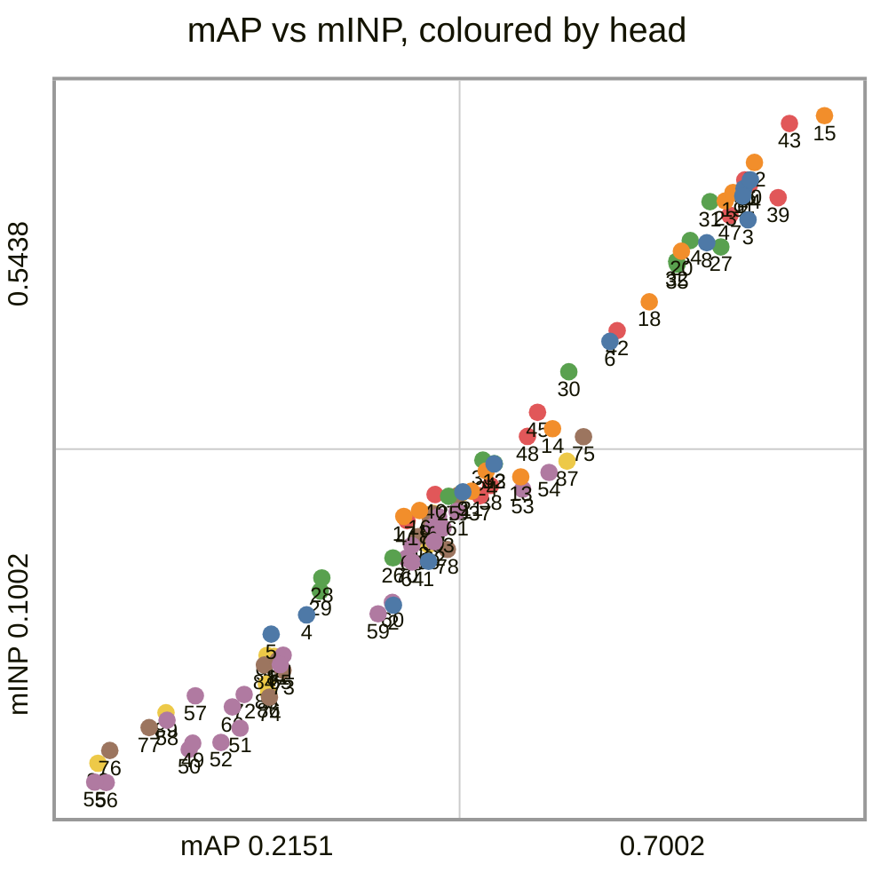
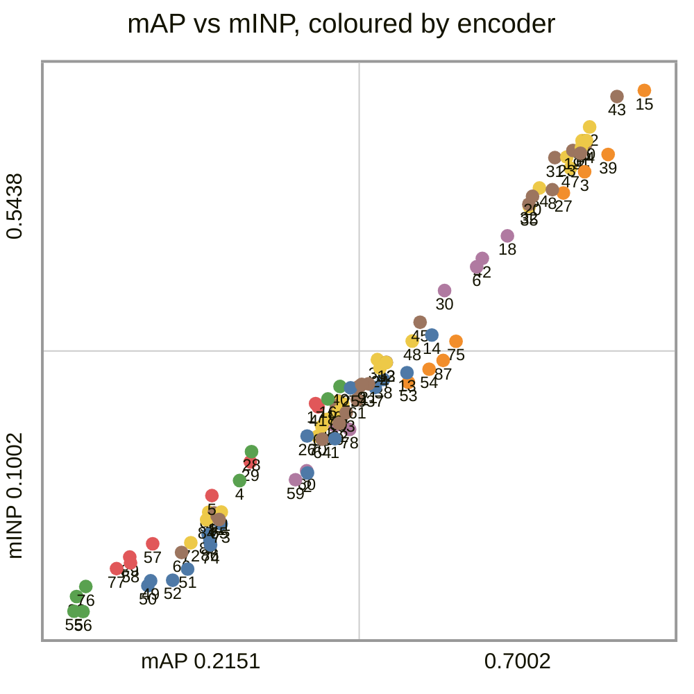
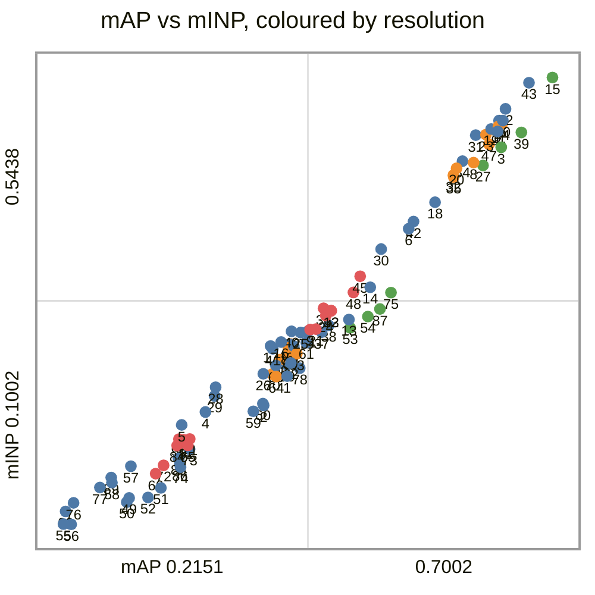

```mermaid
%%{init: {"themeVariables": {"xyChart": {"backgroundColor": "transparent", "plotColorPalette": "#4e79a7,#f28e2b,#59a14f,#e15759,#b07aa1,#9c755f,#edc948"}}, "xyChart": {"height": 1600, "width": 1320, "yAxis": {"showLabel": false}}}}%%
xychart-beta horizontal
    title "mAP, coloured by encoder"
    x-axis ["224x224 arcface vit_base_patch16_clip_224.openai crop · 43.70%", "224x224 arcface vit_base_patch16_clip_224.openai squash · 41.37%", "224x224 arcface vit_huge_plus_patch16_dinov3.lvd1689m squash · 35.60%", "224x224 arcface vit_large_patch16_dinov3.lvd1689m squash · 33.24%", "224x224 arcface vit_so400m_patch14_siglip_224.v2_webli squash · 55.76%", "224x224 arcface c-radio_v4-h squash · 64.59%", "224x224 arcface c-radio_v4-so400m squash · 65.10%", "224x224 arcface-msmt17 vit_base_patch16_clip_224.openai crop · 49.83%", "224x224 arcface-msmt17 vit_base_patch16_clip_224.openai squash · 51.94%", "224x224 arcface-msmt17 vit_huge_plus_patch16_dinov3.lvd1689m squash · 43.11%", "224x224 arcface-msmt17 vit_large_patch16_dinov3.lvd1689m squash · 42.06%", "224x224 arcface-msmt17 vit_so400m_patch14_siglip_224.v2_webli squash · 58.37%", "224x224 arcface-msmt17 c-radio_v4-h squash · 63.94%", "224x224 arcface-msmt17 c-radio_v4-so400m squash · 65.36%", "224x224 linear vit_base_patch16_clip_224.openai crop · 45.04%", "224x224 linear vit_base_patch16_clip_224.openai squash · 41.34%", "224x224 linear vit_huge_plus_patch16_dinov3.lvd1689m squash · 36.61%", "224x224 linear vit_large_patch16_dinov3.lvd1689m squash · 36.51%", "224x224 linear vit_so400m_patch14_siglip_224.v2_webli squash · 53.03%", "224x224 linear c-radio_v4-h squash · 62.41%", "224x224 linear c-radio_v4-so400m squash · 61.10%", "224x224 linear-msmt17 vit_base_patch16_clip_224.openai crop · 47.13%", "224x224 linear-msmt17 vit_base_patch16_clip_224.openai squash · 47.83%", "224x224 linear-msmt17 vit_huge_plus_patch16_dinov3.lvd1689m squash · 44.13%", "224x224 linear-msmt17 vit_large_patch16_dinov3.lvd1689m squash · 42.28%", "224x224 linear-msmt17 vit_so400m_patch14_siglip_224.v2_webli squash · 56.24%", "224x224 linear-msmt17 c-radio_v4-h squash · 67.69%", "224x224 linear-msmt17 c-radio_v4-so400m squash · 64.72%", "224x224 none vit_base_patch16_clip_224.openai crop · 28.03%", "224x224 none vit_base_patch16_clip_224.openai crop · 27.79%", "224x224 none vit_base_patch16_clip_224.openai squash · 31.18%", "224x224 none vit_base_patch16_clip_224.openai squash · 29.90%", "224x224 none vit_huge_plus_patch16_dinov3.lvd1689m squash · 21.51%", "224x224 none vit_huge_plus_patch16_dinov3.lvd1689m squash · 22.28%", "224x224 none vit_large_patch16_dinov3.lvd1689m squash · 28.20%", "224x224 none vit_large_patch16_dinov3.lvd1689m squash · 26.32%", "224x224 none vit_so400m_patch14_siglip_224.v2_webli squash · 40.35%", "224x224 none vit_so400m_patch14_siglip_224.v2_webli squash · 41.30%", "224x224 none c-radio_v4-h squash · 45.60%", "224x224 none c-radio_v4-h squash · 44.07%", "224x224 none c-radio_v4-so400m squash · 44.36%", "224x224 none c-radio_v4-so400m squash · 42.59%", "224x224 pca vit_base_patch16_clip_224.openai crop · 34.03%", "224x224 pca vit_base_patch16_clip_224.openai squash · 33.13%", "224x224 pca vit_huge_plus_patch16_dinov3.lvd1689m squash · 22.52%", "224x224 pca vit_large_patch16_dinov3.lvd1689m squash · 25.13%", "224x224 pca vit_so400m_patch14_siglip_224.v2_webli squash · 44.95%", "224x224 pca c-radio_v4-h squash · 45.63%", "224x224 pca c-radio_v4-so400m squash · 43.96%", "224x224 pca-msmt17 vit_base_patch16_clip_224.openai crop · 32.92%", "224x224 pca-msmt17 vit_base_patch16_clip_224.openai squash · 33.07%", "224x224 pca-msmt17 vit_huge_plus_patch16_dinov3.lvd1689m squash · 21.73%", "224x224 pca-msmt17 vit_large_patch16_dinov3.lvd1689m squash · 26.25%", "224x224 pca-msmt17 vit_so400m_patch14_siglip_224.v2_webli squash · 43.70%", "224x224 pca-msmt17 c-radio_v4-h squash · 45.81%", "224x224 pca-msmt17 c-radio_v4-so400m squash · 43.81%", "256x128 arcface c-radio_v4-h squash · 62.20%", "256x128 arcface c-radio_v4-so400m squash · 64.67%", "256x128 arcface-msmt17 c-radio_v4-h squash · 60.51%", "256x128 arcface-msmt17 c-radio_v4-so400m squash · 63.42%", "256x128 linear c-radio_v4-h squash · 60.20%", "256x128 linear c-radio_v4-so400m squash · 60.23%", "256x128 linear-msmt17 c-radio_v4-h squash · 65.04%", "256x128 linear-msmt17 c-radio_v4-so400m squash · 63.73%", "256x128 none c-radio_v4-h squash · 44.66%", "256x128 none c-radio_v4-h squash · 42.61%", "256x128 none c-radio_v4-so400m squash · 44.01%", "256x128 none c-radio_v4-so400m squash · 42.23%", "256x128 pca c-radio_v4-h squash · 43.83%", "256x128 pca c-radio_v4-so400m squash · 43.00%", "256x128 pca-msmt17 c-radio_v4-h squash · 44.01%", "256x128 pca-msmt17 c-radio_v4-so400m squash · 43.04%", "256x256 arcface vit_giantopt_patch16_siglip_256.v2_webli squash · 64.94%", "256x256 arcface-msmt17 vit_giantopt_patch16_siglip_256.v2_webli squash · 70.02%", "256x256 linear vit_giantopt_patch16_siglip_256.v2_webli squash · 63.13%", "256x256 linear-msmt17 vit_giantopt_patch16_siglip_256.v2_webli squash · 66.94%", "256x256 none vit_giantopt_patch16_siglip_256.v2_webli squash · 49.96%", "256x256 none vit_giantopt_patch16_siglip_256.v2_webli squash · 51.71%", "256x256 pca vit_giantopt_patch16_siglip_256.v2_webli squash · 54.00%", "256x256 pca-msmt17 vit_giantopt_patch16_siglip_256.v2_webli squash · 52.91%", "native arcface c-radio_v4-h squash · 45.98%", "native arcface c-radio_v4-so400m squash · 48.06%", "native arcface-msmt17 c-radio_v4-h squash · 46.56%", "native arcface-msmt17 c-radio_v4-so400m squash · 47.54%", "native linear c-radio_v4-h squash · 48.08%", "native linear c-radio_v4-so400m squash · 47.31%", "native linear-msmt17 c-radio_v4-h squash · 50.95%", "native linear-msmt17 c-radio_v4-so400m squash · 50.28%", "native none c-radio_v4-h squash · 33.85%", "native none c-radio_v4-h squash · 30.66%", "native none c-radio_v4-so400m squash · 34.04%", "native none c-radio_v4-so400m squash · 31.44%", "native pca c-radio_v4-h squash · 33.69%", "native pca c-radio_v4-so400m squash · 32.79%", "native pca-msmt17 c-radio_v4-h squash · 33.43%", "native pca-msmt17 c-radio_v4-so400m squash · 32.97%"]
    y-axis "mAP (%)" 0 --> 73.52
    bar [43.70, 41.37, 0.00, 0.00, 0.00, 0.00, 0.00, 49.83, 51.94, 0.00, 0.00, 0.00, 0.00, 0.00, 45.04, 41.34, 0.00, 0.00, 0.00, 0.00, 0.00, 47.13, 47.83, 0.00, 0.00, 0.00, 0.00, 0.00, 28.03, 27.79, 31.18, 29.90, 0.00, 0.00, 0.00, 0.00, 0.00, 0.00, 0.00, 0.00, 0.00, 0.00, 34.03, 33.13, 0.00, 0.00, 0.00, 0.00, 0.00, 32.92, 33.07, 0.00, 0.00, 0.00, 0.00, 0.00, 0.00, 0.00, 0.00, 0.00, 0.00, 0.00, 0.00, 0.00, 0.00, 0.00, 0.00, 0.00, 0.00, 0.00, 0.00, 0.00, 0.00, 0.00, 0.00, 0.00, 0.00, 0.00, 0.00, 0.00, 0.00, 0.00, 0.00, 0.00, 0.00, 0.00, 0.00, 0.00, 0.00, 0.00, 0.00, 0.00, 0.00, 0.00, 0.00, 0.00]
    bar [0.00, 0.00, 0.00, 0.00, 0.00, 0.00, 0.00, 0.00, 0.00, 0.00, 0.00, 0.00, 0.00, 0.00, 0.00, 0.00, 0.00, 0.00, 0.00, 0.00, 0.00, 0.00, 0.00, 0.00, 0.00, 0.00, 0.00, 0.00, 0.00, 0.00, 0.00, 0.00, 0.00, 0.00, 0.00, 0.00, 0.00, 0.00, 0.00, 0.00, 0.00, 0.00, 0.00, 0.00, 0.00, 0.00, 0.00, 0.00, 0.00, 0.00, 0.00, 0.00, 0.00, 0.00, 0.00, 0.00, 0.00, 0.00, 0.00, 0.00, 0.00, 0.00, 0.00, 0.00, 0.00, 0.00, 0.00, 0.00, 0.00, 0.00, 0.00, 0.00, 64.94, 70.02, 63.13, 66.94, 49.96, 51.71, 54.00, 52.91, 0.00, 0.00, 0.00, 0.00, 0.00, 0.00, 0.00, 0.00, 0.00, 0.00, 0.00, 0.00, 0.00, 0.00, 0.00, 0.00]
    bar [0.00, 0.00, 35.60, 0.00, 0.00, 0.00, 0.00, 0.00, 0.00, 43.11, 0.00, 0.00, 0.00, 0.00, 0.00, 0.00, 36.61, 0.00, 0.00, 0.00, 0.00, 0.00, 0.00, 44.13, 0.00, 0.00, 0.00, 0.00, 0.00, 0.00, 0.00, 0.00, 21.51, 22.28, 0.00, 0.00, 0.00, 0.00, 0.00, 0.00, 0.00, 0.00, 0.00, 0.00, 22.52, 0.00, 0.00, 0.00, 0.00, 0.00, 0.00, 21.73, 0.00, 0.00, 0.00, 0.00, 0.00, 0.00, 0.00, 0.00, 0.00, 0.00, 0.00, 0.00, 0.00, 0.00, 0.00, 0.00, 0.00, 0.00, 0.00, 0.00, 0.00, 0.00, 0.00, 0.00, 0.00, 0.00, 0.00, 0.00, 0.00, 0.00, 0.00, 0.00, 0.00, 0.00, 0.00, 0.00, 0.00, 0.00, 0.00, 0.00, 0.00, 0.00, 0.00, 0.00]
    bar [0.00, 0.00, 0.00, 33.24, 0.00, 0.00, 0.00, 0.00, 0.00, 0.00, 42.06, 0.00, 0.00, 0.00, 0.00, 0.00, 0.00, 36.51, 0.00, 0.00, 0.00, 0.00, 0.00, 0.00, 42.28, 0.00, 0.00, 0.00, 0.00, 0.00, 0.00, 0.00, 0.00, 0.00, 28.20, 26.32, 0.00, 0.00, 0.00, 0.00, 0.00, 0.00, 0.00, 0.00, 0.00, 25.13, 0.00, 0.00, 0.00, 0.00, 0.00, 0.00, 26.25, 0.00, 0.00, 0.00, 0.00, 0.00, 0.00, 0.00, 0.00, 0.00, 0.00, 0.00, 0.00, 0.00, 0.00, 0.00, 0.00, 0.00, 0.00, 0.00, 0.00, 0.00, 0.00, 0.00, 0.00, 0.00, 0.00, 0.00, 0.00, 0.00, 0.00, 0.00, 0.00, 0.00, 0.00, 0.00, 0.00, 0.00, 0.00, 0.00, 0.00, 0.00, 0.00, 0.00]
    bar [0.00, 0.00, 0.00, 0.00, 55.76, 0.00, 0.00, 0.00, 0.00, 0.00, 0.00, 58.37, 0.00, 0.00, 0.00, 0.00, 0.00, 0.00, 53.03, 0.00, 0.00, 0.00, 0.00, 0.00, 0.00, 56.24, 0.00, 0.00, 0.00, 0.00, 0.00, 0.00, 0.00, 0.00, 0.00, 0.00, 40.35, 41.30, 0.00, 0.00, 0.00, 0.00, 0.00, 0.00, 0.00, 0.00, 44.95, 0.00, 0.00, 0.00, 0.00, 0.00, 0.00, 43.70, 0.00, 0.00, 0.00, 0.00, 0.00, 0.00, 0.00, 0.00, 0.00, 0.00, 0.00, 0.00, 0.00, 0.00, 0.00, 0.00, 0.00, 0.00, 0.00, 0.00, 0.00, 0.00, 0.00, 0.00, 0.00, 0.00, 0.00, 0.00, 0.00, 0.00, 0.00, 0.00, 0.00, 0.00, 0.00, 0.00, 0.00, 0.00, 0.00, 0.00, 0.00, 0.00]
    bar [0.00, 0.00, 0.00, 0.00, 0.00, 64.59, 0.00, 0.00, 0.00, 0.00, 0.00, 0.00, 63.94, 0.00, 0.00, 0.00, 0.00, 0.00, 0.00, 62.41, 0.00, 0.00, 0.00, 0.00, 0.00, 0.00, 67.69, 0.00, 0.00, 0.00, 0.00, 0.00, 0.00, 0.00, 0.00, 0.00, 0.00, 0.00, 45.60, 44.07, 0.00, 0.00, 0.00, 0.00, 0.00, 0.00, 0.00, 45.63, 0.00, 0.00, 0.00, 0.00, 0.00, 0.00, 45.81, 0.00, 62.20, 0.00, 60.51, 0.00, 60.20, 0.00, 65.04, 0.00, 44.66, 42.61, 0.00, 0.00, 43.83, 0.00, 44.01, 0.00, 0.00, 0.00, 0.00, 0.00, 0.00, 0.00, 0.00, 0.00, 45.98, 0.00, 46.56, 0.00, 48.08, 0.00, 50.95, 0.00, 33.85, 30.66, 0.00, 0.00, 33.69, 0.00, 33.43, 0.00]
    bar [0.00, 0.00, 0.00, 0.00, 0.00, 0.00, 65.10, 0.00, 0.00, 0.00, 0.00, 0.00, 0.00, 65.36, 0.00, 0.00, 0.00, 0.00, 0.00, 0.00, 61.10, 0.00, 0.00, 0.00, 0.00, 0.00, 0.00, 64.72, 0.00, 0.00, 0.00, 0.00, 0.00, 0.00, 0.00, 0.00, 0.00, 0.00, 0.00, 0.00, 44.36, 42.59, 0.00, 0.00, 0.00, 0.00, 0.00, 0.00, 43.96, 0.00, 0.00, 0.00, 0.00, 0.00, 0.00, 43.81, 0.00, 64.67, 0.00, 63.42, 0.00, 60.23, 0.00, 63.73, 0.00, 0.00, 44.01, 42.23, 0.00, 43.00, 0.00, 43.04, 0.00, 0.00, 0.00, 0.00, 0.00, 0.00, 0.00, 0.00, 0.00, 48.06, 0.00, 47.54, 0.00, 47.31, 0.00, 50.28, 0.00, 0.00, 34.04, 31.44, 0.00, 32.79, 0.00, 32.97]
```

<!-- generated by `reidbench render`; edit the runs, not this file -->

# occluded-reid

[← table.md](../table.md)

## occluded-reid/occluded-vs-whole@1

### 🟦 arcface

|  # | encoder                                       | resolution | resize |        mAP |         R1 |         R5 |        R10 |       mINP |
|---:|-----------------------------------------------|------------|--------|-----------:|-----------:|-----------:|-----------:|-----------:|
|  1 | timm:vit_base_patch16_clip_224.openai         | 224x224    | crop   |     0.4370 |     0.5230 |     0.7200 |     0.7970 |     0.2473 |
|  2 | timm:vit_base_patch16_clip_224.openai         | 224x224    | squash |     0.4137 |     0.5200 |     0.7240 |     0.7800 |     0.2182 |
|  3 | timm:vit_giantopt_patch16_siglip_256.v2_webli | 256x256    | squash |     0.6494 | **0.7490** | **0.8550** | **0.8960** |     0.4745 |
|  4 | timm:vit_huge_plus_patch16_dinov3.lvd1689m    | 224x224    | squash |     0.3560 |     0.4010 |     0.5940 |     0.6890 |     0.2117 |
|  5 | timm:vit_large_patch16_dinov3.lvd1689m        | 224x224    | squash |     0.3324 |     0.3720 |     0.5630 |     0.6550 |     0.1990 |
|  6 | timm:vit_so400m_patch14_siglip_224.v2_webli   | 224x224    | squash |     0.5576 |     0.6310 |     0.7680 |     0.8200 |     0.3937 |
|  7 | torchhub:NVlabs/RADIO/c-radio_v4-h            | 224x224    | squash |     0.6459 |     0.7160 |     0.8390 |     0.8740 |     0.4903 |
|  8 | torchhub:NVlabs/RADIO/c-radio_v4-h            | 256x128    | squash |     0.6220 |     0.7020 |     0.8280 |     0.8710 |     0.4593 |
|  9 | torchhub:NVlabs/RADIO/c-radio_v4-h            | native     | squash |     0.4598 |     0.5390 |     0.7040 |     0.7810 |     0.2936 |
| 10 | torchhub:NVlabs/RADIO/c-radio_v4-so400m       | 224x224    | squash | **0.6510** |     0.7060 |     0.8430 |     0.8870 | **0.5011** |
| 11 | torchhub:NVlabs/RADIO/c-radio_v4-so400m       | 256x128    | squash |     0.6467 |     0.7230 |     0.8370 |     0.8870 |     0.4953 |
| 12 | torchhub:NVlabs/RADIO/c-radio_v4-so400m       | native     | squash |     0.4806 |     0.5670 |     0.7420 |     0.7950 |     0.3121 |

### 🟧 arcface-msmt17

|  # | encoder                                       | resolution | resize |        mAP |         R1 |         R5 |        R10 |       mINP |
|---:|-----------------------------------------------|------------|--------|-----------:|-----------:|-----------:|-----------:|-----------:|
| 13 | timm:vit_base_patch16_clip_224.openai         | 224x224    | crop   |     0.4983 |     0.5990 |     0.7680 |     0.8280 |     0.3036 |
| 14 | timm:vit_base_patch16_clip_224.openai         | 224x224    | squash |     0.5194 |     0.6010 |     0.7820 |     0.8450 |     0.3356 |
| 15 | timm:vit_giantopt_patch16_siglip_256.v2_webli | 256x256    | squash | **0.7002** | **0.7860** | **0.8780** | **0.9060** | **0.5438** |
| 16 | timm:vit_huge_plus_patch16_dinov3.lvd1689m    | 224x224    | squash |     0.4311 |     0.4790 |     0.6730 |     0.7570 |     0.2812 |
| 17 | timm:vit_large_patch16_dinov3.lvd1689m        | 224x224    | squash |     0.4206 |     0.4660 |     0.6490 |     0.7210 |     0.2772 |
| 18 | timm:vit_so400m_patch14_siglip_224.v2_webli   | 224x224    | squash |     0.5837 |     0.6660 |     0.7950 |     0.8450 |     0.4200 |
| 19 | torchhub:NVlabs/RADIO/c-radio_v4-h            | 224x224    | squash |     0.6394 |     0.6950 |     0.8240 |     0.8700 |     0.4927 |
| 20 | torchhub:NVlabs/RADIO/c-radio_v4-h            | 256x128    | squash |     0.6051 |     0.6820 |     0.8020 |     0.8530 |     0.4537 |
| 21 | torchhub:NVlabs/RADIO/c-radio_v4-h            | native     | squash |     0.4656 |     0.5360 |     0.7230 |     0.7940 |     0.2940 |
| 22 | torchhub:NVlabs/RADIO/c-radio_v4-so400m       | 224x224    | squash |     0.6536 |     0.7050 |     0.8300 |     0.8870 |     0.5127 |
| 23 | torchhub:NVlabs/RADIO/c-radio_v4-so400m       | 256x128    | squash |     0.6342 |     0.6920 |     0.8300 |     0.8790 |     0.4871 |
| 24 | torchhub:NVlabs/RADIO/c-radio_v4-so400m       | native     | squash |     0.4754 |     0.5450 |     0.7270 |     0.7920 |     0.3075 |

### 🟩 linear

|  # | encoder                                       | resolution | resize |        mAP |         R1 |         R5 |        R10 |       mINP |
|---:|-----------------------------------------------|------------|--------|-----------:|-----------:|-----------:|-----------:|-----------:|
| 25 | timm:vit_base_patch16_clip_224.openai         | 224x224    | crop   |     0.4504 |     0.5210 |     0.7150 |     0.7960 |     0.2906 |
| 26 | timm:vit_base_patch16_clip_224.openai         | 224x224    | squash |     0.4134 |     0.4840 |     0.6920 |     0.7780 |     0.2497 |
| 27 | timm:vit_giantopt_patch16_siglip_256.v2_webli | 256x256    | squash | **0.6313** | **0.7260** | **0.8470** | **0.8850** |     0.4565 |
| 28 | timm:vit_huge_plus_patch16_dinov3.lvd1689m    | 224x224    | squash |     0.3661 |     0.4090 |     0.5850 |     0.6830 |     0.2364 |
| 29 | timm:vit_large_patch16_dinov3.lvd1689m        | 224x224    | squash |     0.3651 |     0.4210 |     0.6050 |     0.6880 |     0.2276 |
| 30 | timm:vit_so400m_patch14_siglip_224.v2_webli   | 224x224    | squash |     0.5303 |     0.5940 |     0.7530 |     0.8260 |     0.3734 |
| 31 | torchhub:NVlabs/RADIO/c-radio_v4-h            | 224x224    | squash |     0.6241 |     0.6900 |     0.8150 |     0.8750 | **0.4866** |
| 32 | torchhub:NVlabs/RADIO/c-radio_v4-h            | 256x128    | squash |     0.6020 |     0.6520 |     0.8230 |     0.8710 |     0.4469 |
| 33 | torchhub:NVlabs/RADIO/c-radio_v4-h            | native     | squash |     0.4808 |     0.5560 |     0.7260 |     0.8110 |     0.3124 |
| 34 | torchhub:NVlabs/RADIO/c-radio_v4-so400m       | 224x224    | squash |     0.6110 |     0.6690 |     0.8270 |     0.8670 |     0.4607 |
| 35 | torchhub:NVlabs/RADIO/c-radio_v4-so400m       | 256x128    | squash |     0.6023 |     0.6720 |     0.8230 |     0.8740 |     0.4450 |
| 36 | torchhub:NVlabs/RADIO/c-radio_v4-so400m       | native     | squash |     0.4731 |     0.5510 |     0.7360 |     0.8020 |     0.3147 |

### 🟥 linear-msmt17

|  # | encoder                                       | resolution | resize |        mAP |         R1 |         R5 |        R10 |       mINP |
|---:|-----------------------------------------------|------------|--------|-----------:|-----------:|-----------:|-----------:|-----------:|
| 37 | timm:vit_base_patch16_clip_224.openai         | 224x224    | crop   |     0.4713 |     0.5540 |     0.7510 |     0.8240 |     0.2909 |
| 38 | timm:vit_base_patch16_clip_224.openai         | 224x224    | squash |     0.4783 |     0.5760 |     0.7720 |     0.8370 |     0.2978 |
| 39 | timm:vit_giantopt_patch16_siglip_256.v2_webli | 256x256    | squash |     0.6694 | **0.7680** | **0.8650** | **0.8990** |     0.4893 |
| 40 | timm:vit_huge_plus_patch16_dinov3.lvd1689m    | 224x224    | squash |     0.4413 |     0.5060 |     0.6880 |     0.7670 |     0.2919 |
| 41 | timm:vit_large_patch16_dinov3.lvd1689m        | 224x224    | squash |     0.4228 |     0.4850 |     0.6690 |     0.7490 |     0.2745 |
| 42 | timm:vit_so400m_patch14_siglip_224.v2_webli   | 224x224    | squash |     0.5624 |     0.6550 |     0.7780 |     0.8370 |     0.4008 |
| 43 | torchhub:NVlabs/RADIO/c-radio_v4-h            | 224x224    | squash | **0.6769** |     0.7330 |     0.8620 |     0.8960 | **0.5386** |
| 44 | torchhub:NVlabs/RADIO/c-radio_v4-h            | 256x128    | squash |     0.6504 |     0.7210 |     0.8490 |     0.8920 |     0.4980 |
| 45 | torchhub:NVlabs/RADIO/c-radio_v4-h            | native     | squash |     0.5095 |     0.5790 |     0.7680 |     0.8420 |     0.3465 |
| 46 | torchhub:NVlabs/RADIO/c-radio_v4-so400m       | 224x224    | squash |     0.6472 |     0.7080 |     0.8390 |     0.8890 |     0.5010 |
| 47 | torchhub:NVlabs/RADIO/c-radio_v4-so400m       | 256x128    | squash |     0.6373 |     0.7040 |     0.8260 |     0.8810 |     0.4775 |
| 48 | torchhub:NVlabs/RADIO/c-radio_v4-so400m       | native     | squash |     0.5028 |     0.5930 |     0.7630 |     0.8370 |     0.3305 |

### 🟪 none

|  # | encoder                                       | resolution | resize |        mAP |         R1 |         R5 |        R10 |       mINP |
|---:|-----------------------------------------------|------------|--------|-----------:|-----------:|-----------:|-----------:|-----------:|
| 49 | timm:vit_base_patch16_clip_224.openai         | 224x224    | crop   |     0.2803 |     0.3540 |     0.5640 |     0.6490 |     0.1264 |
| 50 | timm:vit_base_patch16_clip_224.openai         | 224x224    | crop   |     0.2779 |     0.3550 |     0.5730 |     0.6510 |     0.1223 |
| 51 | timm:vit_base_patch16_clip_224.openai         | 224x224    | squash |     0.3118 |     0.4090 |     0.6530 |     0.7300 |     0.1364 |
| 52 | timm:vit_base_patch16_clip_224.openai         | 224x224    | squash |     0.2990 |     0.3940 |     0.6470 |     0.7240 |     0.1269 |
| 53 | timm:vit_giantopt_patch16_siglip_256.v2_webli | 256x256    | squash |     0.4996 |     0.6280 |     0.7800 |     0.8500 |     0.2953 |
| 54 | timm:vit_giantopt_patch16_siglip_256.v2_webli | 256x256    | squash | **0.5171** | **0.6450** | **0.7970** | **0.8590** | **0.3065** |
| 55 | timm:vit_huge_plus_patch16_dinov3.lvd1689m    | 224x224    | squash |     0.2151 |     0.2680 |     0.4340 |     0.5200 |     0.1005 |
| 56 | timm:vit_huge_plus_patch16_dinov3.lvd1689m    | 224x224    | squash |     0.2228 |     0.2720 |     0.4550 |     0.5570 |     0.1002 |
| 57 | timm:vit_large_patch16_dinov3.lvd1689m        | 224x224    | squash |     0.2820 |     0.3130 |     0.5360 |     0.6340 |     0.1580 |
| 58 | timm:vit_large_patch16_dinov3.lvd1689m        | 224x224    | squash |     0.2632 |     0.3100 |     0.4990 |     0.6060 |     0.1417 |
| 59 | timm:vit_so400m_patch14_siglip_224.v2_webli   | 224x224    | squash |     0.4035 |     0.5090 |     0.6880 |     0.7500 |     0.2124 |
| 60 | timm:vit_so400m_patch14_siglip_224.v2_webli   | 224x224    | squash |     0.4130 |     0.5190 |     0.6900 |     0.7580 |     0.2200 |
| 61 | torchhub:NVlabs/RADIO/c-radio_v4-h            | 224x224    | squash |     0.4560 |     0.5240 |     0.7190 |     0.7940 |     0.2806 |
| 62 | torchhub:NVlabs/RADIO/c-radio_v4-h            | 224x224    | squash |     0.4407 |     0.5060 |     0.7090 |     0.7920 |     0.2604 |
| 63 | torchhub:NVlabs/RADIO/c-radio_v4-h            | 256x128    | squash |     0.4466 |     0.5230 |     0.7160 |     0.7930 |     0.2696 |
| 64 | torchhub:NVlabs/RADIO/c-radio_v4-h            | 256x128    | squash |     0.4261 |     0.5020 |     0.6990 |     0.7720 |     0.2469 |
| 65 | torchhub:NVlabs/RADIO/c-radio_v4-h            | native     | squash |     0.3385 |     0.4170 |     0.6350 |     0.7270 |     0.1786 |
| 66 | torchhub:NVlabs/RADIO/c-radio_v4-h            | native     | squash |     0.3066 |     0.3880 |     0.6080 |     0.7080 |     0.1505 |
| 67 | torchhub:NVlabs/RADIO/c-radio_v4-so400m       | 224x224    | squash |     0.4436 |     0.5100 |     0.6990 |     0.7780 |     0.2771 |
| 68 | torchhub:NVlabs/RADIO/c-radio_v4-so400m       | 224x224    | squash |     0.4259 |     0.4970 |     0.6780 |     0.7630 |     0.2579 |
| 69 | torchhub:NVlabs/RADIO/c-radio_v4-so400m       | 256x128    | squash |     0.4401 |     0.5200 |     0.7020 |     0.7720 |     0.2706 |
| 70 | torchhub:NVlabs/RADIO/c-radio_v4-so400m       | 256x128    | squash |     0.4223 |     0.5130 |     0.6820 |     0.7550 |     0.2494 |
| 71 | torchhub:NVlabs/RADIO/c-radio_v4-so400m       | native     | squash |     0.3404 |     0.4140 |     0.6240 |     0.7120 |     0.1850 |
| 72 | torchhub:NVlabs/RADIO/c-radio_v4-so400m       | native     | squash |     0.3144 |     0.3850 |     0.6010 |     0.6900 |     0.1588 |

### 🟫 pca

|  # | encoder                                       | resolution | resize |        mAP |         R1 |         R5 |        R10 |       mINP |
|---:|-----------------------------------------------|------------|--------|-----------:|-----------:|-----------:|-----------:|-----------:|
| 73 | timm:vit_base_patch16_clip_224.openai         | 224x224    | crop   |     0.3403 |     0.4200 |     0.6280 |     0.7120 |     0.1749 |
| 74 | timm:vit_base_patch16_clip_224.openai         | 224x224    | squash |     0.3313 |     0.4340 |     0.6460 |     0.7240 |     0.1570 |
| 75 | timm:vit_giantopt_patch16_siglip_256.v2_webli | 256x256    | squash | **0.5400** | **0.6590** | **0.8070** | **0.8620** | **0.3303** |
| 76 | timm:vit_huge_plus_patch16_dinov3.lvd1689m    | 224x224    | squash |     0.2252 |     0.2620 |     0.4340 |     0.5070 |     0.1216 |
| 77 | timm:vit_large_patch16_dinov3.lvd1689m        | 224x224    | squash |     0.2513 |     0.2700 |     0.4810 |     0.5860 |     0.1368 |
| 78 | timm:vit_so400m_patch14_siglip_224.v2_webli   | 224x224    | squash |     0.4495 |     0.5590 |     0.7110 |     0.7780 |     0.2553 |
| 79 | torchhub:NVlabs/RADIO/c-radio_v4-h            | 224x224    | squash |     0.4563 |     0.5280 |     0.7280 |     0.7980 |     0.2910 |
| 80 | torchhub:NVlabs/RADIO/c-radio_v4-h            | 256x128    | squash |     0.4383 |     0.5050 |     0.7080 |     0.7800 |     0.2754 |
| 81 | torchhub:NVlabs/RADIO/c-radio_v4-h            | native     | squash |     0.3369 |     0.4060 |     0.6150 |     0.7050 |     0.1815 |
| 82 | torchhub:NVlabs/RADIO/c-radio_v4-so400m       | 224x224    | squash |     0.4396 |     0.5200 |     0.6940 |     0.7720 |     0.2790 |
| 83 | torchhub:NVlabs/RADIO/c-radio_v4-so400m       | 256x128    | squash |     0.4300 |     0.5070 |     0.6980 |     0.7700 |     0.2638 |
| 84 | torchhub:NVlabs/RADIO/c-radio_v4-so400m       | native     | squash |     0.3279 |     0.4060 |     0.6080 |     0.6880 |     0.1784 |

### 🟨 pca-msmt17

|  # | encoder                                       | resolution | resize |        mAP |         R1 |         R5 |        R10 |       mINP |
|---:|-----------------------------------------------|------------|--------|-----------:|-----------:|-----------:|-----------:|-----------:|
| 85 | timm:vit_base_patch16_clip_224.openai         | 224x224    | crop   |     0.3292 |     0.4040 |     0.6130 |     0.6950 |     0.1657 |
| 86 | timm:vit_base_patch16_clip_224.openai         | 224x224    | squash |     0.3307 |     0.4270 |     0.6470 |     0.7240 |     0.1598 |
| 87 | timm:vit_giantopt_patch16_siglip_256.v2_webli | 256x256    | squash | **0.5291** | **0.6610** | **0.8100** | **0.8650** | **0.3140** |
| 88 | timm:vit_huge_plus_patch16_dinov3.lvd1689m    | 224x224    | squash |     0.2173 |     0.2610 |     0.4200 |     0.5020 |     0.1131 |
| 89 | timm:vit_large_patch16_dinov3.lvd1689m        | 224x224    | squash |     0.2625 |     0.2870 |     0.4880 |     0.5870 |     0.1467 |
| 90 | timm:vit_so400m_patch14_siglip_224.v2_webli   | 224x224    | squash |     0.4370 |     0.5310 |     0.6880 |     0.7630 |     0.2586 |
| 91 | torchhub:NVlabs/RADIO/c-radio_v4-h            | 224x224    | squash |     0.4581 |     0.5370 |     0.7190 |     0.7870 |     0.2922 |
| 92 | torchhub:NVlabs/RADIO/c-radio_v4-h            | 256x128    | squash |     0.4401 |     0.5090 |     0.7000 |     0.7720 |     0.2793 |
| 93 | torchhub:NVlabs/RADIO/c-radio_v4-h            | native     | squash |     0.3343 |     0.4160 |     0.6190 |     0.6860 |     0.1842 |
| 94 | torchhub:NVlabs/RADIO/c-radio_v4-so400m       | 224x224    | squash |     0.4381 |     0.5190 |     0.6920 |     0.7620 |     0.2785 |
| 95 | torchhub:NVlabs/RADIO/c-radio_v4-so400m       | 256x128    | squash |     0.4304 |     0.5130 |     0.6820 |     0.7610 |     0.2628 |
| 96 | torchhub:NVlabs/RADIO/c-radio_v4-so400m       | native     | squash |     0.3297 |     0.3990 |     0.6010 |     0.6790 |     0.1848 |

### Every row, by encoder and resolution

```mermaid
%%{init: {"themeVariables": {"xyChart": {"backgroundColor": "transparent", "plotColorPalette": "#4e79a7,#f28e2b,#59a14f,#e15759,#b07aa1,#9c755f,#edc948"}}, "xyChart": {"height": 1600, "width": 1320, "yAxis": {"showLabel": false}}}}%%
xychart-beta horizontal
    title "mAP, coloured by head"
    x-axis ["vit_base_patch16_clip_224.openai 224x224 arcface crop · 43.70%", "vit_base_patch16_clip_224.openai 224x224 arcface squash · 41.37%", "vit_base_patch16_clip_224.openai 224x224 arcface-msmt17 crop · 49.83%", "vit_base_patch16_clip_224.openai 224x224 arcface-msmt17 squash · 51.94%", "vit_base_patch16_clip_224.openai 224x224 linear crop · 45.04%", "vit_base_patch16_clip_224.openai 224x224 linear squash · 41.34%", "vit_base_patch16_clip_224.openai 224x224 linear-msmt17 crop · 47.13%", "vit_base_patch16_clip_224.openai 224x224 linear-msmt17 squash · 47.83%", "vit_base_patch16_clip_224.openai 224x224 none crop · 28.03%", "vit_base_patch16_clip_224.openai 224x224 none crop · 27.79%", "vit_base_patch16_clip_224.openai 224x224 none squash · 31.18%", "vit_base_patch16_clip_224.openai 224x224 none squash · 29.90%", "vit_base_patch16_clip_224.openai 224x224 pca crop · 34.03%", "vit_base_patch16_clip_224.openai 224x224 pca squash · 33.13%", "vit_base_patch16_clip_224.openai 224x224 pca-msmt17 crop · 32.92%", "vit_base_patch16_clip_224.openai 224x224 pca-msmt17 squash · 33.07%", "vit_giantopt_patch16_siglip_256.v2_webli 256x256 arcface squash · 64.94%", "vit_giantopt_patch16_siglip_256.v2_webli 256x256 arcface-msmt17 squash · 70.02%", "vit_giantopt_patch16_siglip_256.v2_webli 256x256 linear squash · 63.13%", "vit_giantopt_patch16_siglip_256.v2_webli 256x256 linear-msmt17 squash · 66.94%", "vit_giantopt_patch16_siglip_256.v2_webli 256x256 none squash · 49.96%", "vit_giantopt_patch16_siglip_256.v2_webli 256x256 none squash · 51.71%", "vit_giantopt_patch16_siglip_256.v2_webli 256x256 pca squash · 54.00%", "vit_giantopt_patch16_siglip_256.v2_webli 256x256 pca-msmt17 squash · 52.91%", "vit_huge_plus_patch16_dinov3.lvd1689m 224x224 arcface squash · 35.60%", "vit_huge_plus_patch16_dinov3.lvd1689m 224x224 arcface-msmt17 squash · 43.11%", "vit_huge_plus_patch16_dinov3.lvd1689m 224x224 linear squash · 36.61%", "vit_huge_plus_patch16_dinov3.lvd1689m 224x224 linear-msmt17 squash · 44.13%", "vit_huge_plus_patch16_dinov3.lvd1689m 224x224 none squash · 21.51%", "vit_huge_plus_patch16_dinov3.lvd1689m 224x224 none squash · 22.28%", "vit_huge_plus_patch16_dinov3.lvd1689m 224x224 pca squash · 22.52%", "vit_huge_plus_patch16_dinov3.lvd1689m 224x224 pca-msmt17 squash · 21.73%", "vit_large_patch16_dinov3.lvd1689m 224x224 arcface squash · 33.24%", "vit_large_patch16_dinov3.lvd1689m 224x224 arcface-msmt17 squash · 42.06%", "vit_large_patch16_dinov3.lvd1689m 224x224 linear squash · 36.51%", "vit_large_patch16_dinov3.lvd1689m 224x224 linear-msmt17 squash · 42.28%", "vit_large_patch16_dinov3.lvd1689m 224x224 none squash · 28.20%", "vit_large_patch16_dinov3.lvd1689m 224x224 none squash · 26.32%", "vit_large_patch16_dinov3.lvd1689m 224x224 pca squash · 25.13%", "vit_large_patch16_dinov3.lvd1689m 224x224 pca-msmt17 squash · 26.25%", "vit_so400m_patch14_siglip_224.v2_webli 224x224 arcface squash · 55.76%", "vit_so400m_patch14_siglip_224.v2_webli 224x224 arcface-msmt17 squash · 58.37%", "vit_so400m_patch14_siglip_224.v2_webli 224x224 linear squash · 53.03%", "vit_so400m_patch14_siglip_224.v2_webli 224x224 linear-msmt17 squash · 56.24%", "vit_so400m_patch14_siglip_224.v2_webli 224x224 none squash · 40.35%", "vit_so400m_patch14_siglip_224.v2_webli 224x224 none squash · 41.30%", "vit_so400m_patch14_siglip_224.v2_webli 224x224 pca squash · 44.95%", "vit_so400m_patch14_siglip_224.v2_webli 224x224 pca-msmt17 squash · 43.70%", "c-radio_v4-h 224x224 arcface squash · 64.59%", "c-radio_v4-h 224x224 arcface-msmt17 squash · 63.94%", "c-radio_v4-h 224x224 linear squash · 62.41%", "c-radio_v4-h 224x224 linear-msmt17 squash · 67.69%", "c-radio_v4-h 224x224 none squash · 45.60%", "c-radio_v4-h 224x224 none squash · 44.07%", "c-radio_v4-h 224x224 pca squash · 45.63%", "c-radio_v4-h 224x224 pca-msmt17 squash · 45.81%", "c-radio_v4-h 256x128 arcface squash · 62.20%", "c-radio_v4-h 256x128 arcface-msmt17 squash · 60.51%", "c-radio_v4-h 256x128 linear squash · 60.20%", "c-radio_v4-h 256x128 linear-msmt17 squash · 65.04%", "c-radio_v4-h 256x128 none squash · 44.66%", "c-radio_v4-h 256x128 none squash · 42.61%", "c-radio_v4-h 256x128 pca squash · 43.83%", "c-radio_v4-h 256x128 pca-msmt17 squash · 44.01%", "c-radio_v4-h native arcface squash · 45.98%", "c-radio_v4-h native arcface-msmt17 squash · 46.56%", "c-radio_v4-h native linear squash · 48.08%", "c-radio_v4-h native linear-msmt17 squash · 50.95%", "c-radio_v4-h native none squash · 33.85%", "c-radio_v4-h native none squash · 30.66%", "c-radio_v4-h native pca squash · 33.69%", "c-radio_v4-h native pca-msmt17 squash · 33.43%", "c-radio_v4-so400m 224x224 arcface squash · 65.10%", "c-radio_v4-so400m 224x224 arcface-msmt17 squash · 65.36%", "c-radio_v4-so400m 224x224 linear squash · 61.10%", "c-radio_v4-so400m 224x224 linear-msmt17 squash · 64.72%", "c-radio_v4-so400m 224x224 none squash · 44.36%", "c-radio_v4-so400m 224x224 none squash · 42.59%", "c-radio_v4-so400m 224x224 pca squash · 43.96%", "c-radio_v4-so400m 224x224 pca-msmt17 squash · 43.81%", "c-radio_v4-so400m 256x128 arcface squash · 64.67%", "c-radio_v4-so400m 256x128 arcface-msmt17 squash · 63.42%", "c-radio_v4-so400m 256x128 linear squash · 60.23%", "c-radio_v4-so400m 256x128 linear-msmt17 squash · 63.73%", "c-radio_v4-so400m 256x128 none squash · 44.01%", "c-radio_v4-so400m 256x128 none squash · 42.23%", "c-radio_v4-so400m 256x128 pca squash · 43.00%", "c-radio_v4-so400m 256x128 pca-msmt17 squash · 43.04%", "c-radio_v4-so400m native arcface squash · 48.06%", "c-radio_v4-so400m native arcface-msmt17 squash · 47.54%", "c-radio_v4-so400m native linear squash · 47.31%", "c-radio_v4-so400m native linear-msmt17 squash · 50.28%", "c-radio_v4-so400m native none squash · 34.04%", "c-radio_v4-so400m native none squash · 31.44%", "c-radio_v4-so400m native pca squash · 32.79%", "c-radio_v4-so400m native pca-msmt17 squash · 32.97%"]
    y-axis "mAP (%)" 0 --> 73.52
    bar [43.70, 41.37, 0.00, 0.00, 0.00, 0.00, 0.00, 0.00, 0.00, 0.00, 0.00, 0.00, 0.00, 0.00, 0.00, 0.00, 64.94, 0.00, 0.00, 0.00, 0.00, 0.00, 0.00, 0.00, 35.60, 0.00, 0.00, 0.00, 0.00, 0.00, 0.00, 0.00, 33.24, 0.00, 0.00, 0.00, 0.00, 0.00, 0.00, 0.00, 55.76, 0.00, 0.00, 0.00, 0.00, 0.00, 0.00, 0.00, 64.59, 0.00, 0.00, 0.00, 0.00, 0.00, 0.00, 0.00, 62.20, 0.00, 0.00, 0.00, 0.00, 0.00, 0.00, 0.00, 45.98, 0.00, 0.00, 0.00, 0.00, 0.00, 0.00, 0.00, 65.10, 0.00, 0.00, 0.00, 0.00, 0.00, 0.00, 0.00, 64.67, 0.00, 0.00, 0.00, 0.00, 0.00, 0.00, 0.00, 48.06, 0.00, 0.00, 0.00, 0.00, 0.00, 0.00, 0.00]
    bar [0.00, 0.00, 49.83, 51.94, 0.00, 0.00, 0.00, 0.00, 0.00, 0.00, 0.00, 0.00, 0.00, 0.00, 0.00, 0.00, 0.00, 70.02, 0.00, 0.00, 0.00, 0.00, 0.00, 0.00, 0.00, 43.11, 0.00, 0.00, 0.00, 0.00, 0.00, 0.00, 0.00, 42.06, 0.00, 0.00, 0.00, 0.00, 0.00, 0.00, 0.00, 58.37, 0.00, 0.00, 0.00, 0.00, 0.00, 0.00, 0.00, 63.94, 0.00, 0.00, 0.00, 0.00, 0.00, 0.00, 0.00, 60.51, 0.00, 0.00, 0.00, 0.00, 0.00, 0.00, 0.00, 46.56, 0.00, 0.00, 0.00, 0.00, 0.00, 0.00, 0.00, 65.36, 0.00, 0.00, 0.00, 0.00, 0.00, 0.00, 0.00, 63.42, 0.00, 0.00, 0.00, 0.00, 0.00, 0.00, 0.00, 47.54, 0.00, 0.00, 0.00, 0.00, 0.00, 0.00]
    bar [0.00, 0.00, 0.00, 0.00, 45.04, 41.34, 0.00, 0.00, 0.00, 0.00, 0.00, 0.00, 0.00, 0.00, 0.00, 0.00, 0.00, 0.00, 63.13, 0.00, 0.00, 0.00, 0.00, 0.00, 0.00, 0.00, 36.61, 0.00, 0.00, 0.00, 0.00, 0.00, 0.00, 0.00, 36.51, 0.00, 0.00, 0.00, 0.00, 0.00, 0.00, 0.00, 53.03, 0.00, 0.00, 0.00, 0.00, 0.00, 0.00, 0.00, 62.41, 0.00, 0.00, 0.00, 0.00, 0.00, 0.00, 0.00, 60.20, 0.00, 0.00, 0.00, 0.00, 0.00, 0.00, 0.00, 48.08, 0.00, 0.00, 0.00, 0.00, 0.00, 0.00, 0.00, 61.10, 0.00, 0.00, 0.00, 0.00, 0.00, 0.00, 0.00, 60.23, 0.00, 0.00, 0.00, 0.00, 0.00, 0.00, 0.00, 47.31, 0.00, 0.00, 0.00, 0.00, 0.00]
    bar [0.00, 0.00, 0.00, 0.00, 0.00, 0.00, 47.13, 47.83, 0.00, 0.00, 0.00, 0.00, 0.00, 0.00, 0.00, 0.00, 0.00, 0.00, 0.00, 66.94, 0.00, 0.00, 0.00, 0.00, 0.00, 0.00, 0.00, 44.13, 0.00, 0.00, 0.00, 0.00, 0.00, 0.00, 0.00, 42.28, 0.00, 0.00, 0.00, 0.00, 0.00, 0.00, 0.00, 56.24, 0.00, 0.00, 0.00, 0.00, 0.00, 0.00, 0.00, 67.69, 0.00, 0.00, 0.00, 0.00, 0.00, 0.00, 0.00, 65.04, 0.00, 0.00, 0.00, 0.00, 0.00, 0.00, 0.00, 50.95, 0.00, 0.00, 0.00, 0.00, 0.00, 0.00, 0.00, 64.72, 0.00, 0.00, 0.00, 0.00, 0.00, 0.00, 0.00, 63.73, 0.00, 0.00, 0.00, 0.00, 0.00, 0.00, 0.00, 50.28, 0.00, 0.00, 0.00, 0.00]
    bar [0.00, 0.00, 0.00, 0.00, 0.00, 0.00, 0.00, 0.00, 28.03, 27.79, 31.18, 29.90, 0.00, 0.00, 0.00, 0.00, 0.00, 0.00, 0.00, 0.00, 49.96, 51.71, 0.00, 0.00, 0.00, 0.00, 0.00, 0.00, 21.51, 22.28, 0.00, 0.00, 0.00, 0.00, 0.00, 0.00, 28.20, 26.32, 0.00, 0.00, 0.00, 0.00, 0.00, 0.00, 40.35, 41.30, 0.00, 0.00, 0.00, 0.00, 0.00, 0.00, 45.60, 44.07, 0.00, 0.00, 0.00, 0.00, 0.00, 0.00, 44.66, 42.61, 0.00, 0.00, 0.00, 0.00, 0.00, 0.00, 33.85, 30.66, 0.00, 0.00, 0.00, 0.00, 0.00, 0.00, 44.36, 42.59, 0.00, 0.00, 0.00, 0.00, 0.00, 0.00, 44.01, 42.23, 0.00, 0.00, 0.00, 0.00, 0.00, 0.00, 34.04, 31.44, 0.00, 0.00]
    bar [0.00, 0.00, 0.00, 0.00, 0.00, 0.00, 0.00, 0.00, 0.00, 0.00, 0.00, 0.00, 34.03, 33.13, 0.00, 0.00, 0.00, 0.00, 0.00, 0.00, 0.00, 0.00, 54.00, 0.00, 0.00, 0.00, 0.00, 0.00, 0.00, 0.00, 22.52, 0.00, 0.00, 0.00, 0.00, 0.00, 0.00, 0.00, 25.13, 0.00, 0.00, 0.00, 0.00, 0.00, 0.00, 0.00, 44.95, 0.00, 0.00, 0.00, 0.00, 0.00, 0.00, 0.00, 45.63, 0.00, 0.00, 0.00, 0.00, 0.00, 0.00, 0.00, 43.83, 0.00, 0.00, 0.00, 0.00, 0.00, 0.00, 0.00, 33.69, 0.00, 0.00, 0.00, 0.00, 0.00, 0.00, 0.00, 43.96, 0.00, 0.00, 0.00, 0.00, 0.00, 0.00, 0.00, 43.00, 0.00, 0.00, 0.00, 0.00, 0.00, 0.00, 0.00, 32.79, 0.00]
    bar [0.00, 0.00, 0.00, 0.00, 0.00, 0.00, 0.00, 0.00, 0.00, 0.00, 0.00, 0.00, 0.00, 0.00, 32.92, 33.07, 0.00, 0.00, 0.00, 0.00, 0.00, 0.00, 0.00, 52.91, 0.00, 0.00, 0.00, 0.00, 0.00, 0.00, 0.00, 21.73, 0.00, 0.00, 0.00, 0.00, 0.00, 0.00, 0.00, 26.25, 0.00, 0.00, 0.00, 0.00, 0.00, 0.00, 0.00, 43.70, 0.00, 0.00, 0.00, 0.00, 0.00, 0.00, 0.00, 45.81, 0.00, 0.00, 0.00, 0.00, 0.00, 0.00, 0.00, 44.01, 0.00, 0.00, 0.00, 0.00, 0.00, 0.00, 0.00, 33.43, 0.00, 0.00, 0.00, 0.00, 0.00, 0.00, 0.00, 43.81, 0.00, 0.00, 0.00, 0.00, 0.00, 0.00, 0.00, 43.04, 0.00, 0.00, 0.00, 0.00, 0.00, 0.00, 0.00, 32.97]
```

### By head — does the probe carry it?

```mermaid
%%{init: {"themeVariables": {"xyChart": {"backgroundColor": "transparent", "plotColorPalette": "#4e79a7,#f28e2b,#59a14f,#e15759,#b07aa1,#9c755f,#edc948"}}, "xyChart": {"height": 1600, "width": 1320, "yAxis": {"showLabel": false}}}}%%
xychart-beta horizontal
    title "mAP, coloured by head"
    x-axis ["arcface vit_base_patch16_clip_224.openai 224x224 crop · 43.70%", "arcface vit_base_patch16_clip_224.openai 224x224 squash · 41.37%", "arcface vit_giantopt_patch16_siglip_256.v2_webli 256x256 squash · 64.94%", "arcface vit_huge_plus_patch16_dinov3.lvd1689m 224x224 squash · 35.60%", "arcface vit_large_patch16_dinov3.lvd1689m 224x224 squash · 33.24%", "arcface vit_so400m_patch14_siglip_224.v2_webli 224x224 squash · 55.76%", "arcface c-radio_v4-h 224x224 squash · 64.59%", "arcface c-radio_v4-h 256x128 squash · 62.20%", "arcface c-radio_v4-h native squash · 45.98%", "arcface c-radio_v4-so400m 224x224 squash · 65.10%", "arcface c-radio_v4-so400m 256x128 squash · 64.67%", "arcface c-radio_v4-so400m native squash · 48.06%", "arcface-msmt17 vit_base_patch16_clip_224.openai 224x224 crop · 49.83%", "arcface-msmt17 vit_base_patch16_clip_224.openai 224x224 squash · 51.94%", "arcface-msmt17 vit_giantopt_patch16_siglip_256.v2_webli 256x256 squash · 70.02%", "arcface-msmt17 vit_huge_plus_patch16_dinov3.lvd1689m 224x224 squash · 43.11%", "arcface-msmt17 vit_large_patch16_dinov3.lvd1689m 224x224 squash · 42.06%", "arcface-msmt17 vit_so400m_patch14_siglip_224.v2_webli 224x224 squash · 58.37%", "arcface-msmt17 c-radio_v4-h 224x224 squash · 63.94%", "arcface-msmt17 c-radio_v4-h 256x128 squash · 60.51%", "arcface-msmt17 c-radio_v4-h native squash · 46.56%", "arcface-msmt17 c-radio_v4-so400m 224x224 squash · 65.36%", "arcface-msmt17 c-radio_v4-so400m 256x128 squash · 63.42%", "arcface-msmt17 c-radio_v4-so400m native squash · 47.54%", "linear vit_base_patch16_clip_224.openai 224x224 crop · 45.04%", "linear vit_base_patch16_clip_224.openai 224x224 squash · 41.34%", "linear vit_giantopt_patch16_siglip_256.v2_webli 256x256 squash · 63.13%", "linear vit_huge_plus_patch16_dinov3.lvd1689m 224x224 squash · 36.61%", "linear vit_large_patch16_dinov3.lvd1689m 224x224 squash · 36.51%", "linear vit_so400m_patch14_siglip_224.v2_webli 224x224 squash · 53.03%", "linear c-radio_v4-h 224x224 squash · 62.41%", "linear c-radio_v4-h 256x128 squash · 60.20%", "linear c-radio_v4-h native squash · 48.08%", "linear c-radio_v4-so400m 224x224 squash · 61.10%", "linear c-radio_v4-so400m 256x128 squash · 60.23%", "linear c-radio_v4-so400m native squash · 47.31%", "linear-msmt17 vit_base_patch16_clip_224.openai 224x224 crop · 47.13%", "linear-msmt17 vit_base_patch16_clip_224.openai 224x224 squash · 47.83%", "linear-msmt17 vit_giantopt_patch16_siglip_256.v2_webli 256x256 squash · 66.94%", "linear-msmt17 vit_huge_plus_patch16_dinov3.lvd1689m 224x224 squash · 44.13%", "linear-msmt17 vit_large_patch16_dinov3.lvd1689m 224x224 squash · 42.28%", "linear-msmt17 vit_so400m_patch14_siglip_224.v2_webli 224x224 squash · 56.24%", "linear-msmt17 c-radio_v4-h 224x224 squash · 67.69%", "linear-msmt17 c-radio_v4-h 256x128 squash · 65.04%", "linear-msmt17 c-radio_v4-h native squash · 50.95%", "linear-msmt17 c-radio_v4-so400m 224x224 squash · 64.72%", "linear-msmt17 c-radio_v4-so400m 256x128 squash · 63.73%", "linear-msmt17 c-radio_v4-so400m native squash · 50.28%", "none vit_base_patch16_clip_224.openai 224x224 crop · 28.03%", "none vit_base_patch16_clip_224.openai 224x224 crop · 27.79%", "none vit_base_patch16_clip_224.openai 224x224 squash · 31.18%", "none vit_base_patch16_clip_224.openai 224x224 squash · 29.90%", "none vit_giantopt_patch16_siglip_256.v2_webli 256x256 squash · 49.96%", "none vit_giantopt_patch16_siglip_256.v2_webli 256x256 squash · 51.71%", "none vit_huge_plus_patch16_dinov3.lvd1689m 224x224 squash · 21.51%", "none vit_huge_plus_patch16_dinov3.lvd1689m 224x224 squash · 22.28%", "none vit_large_patch16_dinov3.lvd1689m 224x224 squash · 28.20%", "none vit_large_patch16_dinov3.lvd1689m 224x224 squash · 26.32%", "none vit_so400m_patch14_siglip_224.v2_webli 224x224 squash · 40.35%", "none vit_so400m_patch14_siglip_224.v2_webli 224x224 squash · 41.30%", "none c-radio_v4-h 224x224 squash · 45.60%", "none c-radio_v4-h 224x224 squash · 44.07%", "none c-radio_v4-h 256x128 squash · 44.66%", "none c-radio_v4-h 256x128 squash · 42.61%", "none c-radio_v4-h native squash · 33.85%", "none c-radio_v4-h native squash · 30.66%", "none c-radio_v4-so400m 224x224 squash · 44.36%", "none c-radio_v4-so400m 224x224 squash · 42.59%", "none c-radio_v4-so400m 256x128 squash · 44.01%", "none c-radio_v4-so400m 256x128 squash · 42.23%", "none c-radio_v4-so400m native squash · 34.04%", "none c-radio_v4-so400m native squash · 31.44%", "pca vit_base_patch16_clip_224.openai 224x224 crop · 34.03%", "pca vit_base_patch16_clip_224.openai 224x224 squash · 33.13%", "pca vit_giantopt_patch16_siglip_256.v2_webli 256x256 squash · 54.00%", "pca vit_huge_plus_patch16_dinov3.lvd1689m 224x224 squash · 22.52%", "pca vit_large_patch16_dinov3.lvd1689m 224x224 squash · 25.13%", "pca vit_so400m_patch14_siglip_224.v2_webli 224x224 squash · 44.95%", "pca c-radio_v4-h 224x224 squash · 45.63%", "pca c-radio_v4-h 256x128 squash · 43.83%", "pca c-radio_v4-h native squash · 33.69%", "pca c-radio_v4-so400m 224x224 squash · 43.96%", "pca c-radio_v4-so400m 256x128 squash · 43.00%", "pca c-radio_v4-so400m native squash · 32.79%", "pca-msmt17 vit_base_patch16_clip_224.openai 224x224 crop · 32.92%", "pca-msmt17 vit_base_patch16_clip_224.openai 224x224 squash · 33.07%", "pca-msmt17 vit_giantopt_patch16_siglip_256.v2_webli 256x256 squash · 52.91%", "pca-msmt17 vit_huge_plus_patch16_dinov3.lvd1689m 224x224 squash · 21.73%", "pca-msmt17 vit_large_patch16_dinov3.lvd1689m 224x224 squash · 26.25%", "pca-msmt17 vit_so400m_patch14_siglip_224.v2_webli 224x224 squash · 43.70%", "pca-msmt17 c-radio_v4-h 224x224 squash · 45.81%", "pca-msmt17 c-radio_v4-h 256x128 squash · 44.01%", "pca-msmt17 c-radio_v4-h native squash · 33.43%", "pca-msmt17 c-radio_v4-so400m 224x224 squash · 43.81%", "pca-msmt17 c-radio_v4-so400m 256x128 squash · 43.04%", "pca-msmt17 c-radio_v4-so400m native squash · 32.97%"]
    y-axis "mAP (%)" 0 --> 73.52
    bar [43.70, 41.37, 64.94, 35.60, 33.24, 55.76, 64.59, 62.20, 45.98, 65.10, 64.67, 48.06, 0.00, 0.00, 0.00, 0.00, 0.00, 0.00, 0.00, 0.00, 0.00, 0.00, 0.00, 0.00, 0.00, 0.00, 0.00, 0.00, 0.00, 0.00, 0.00, 0.00, 0.00, 0.00, 0.00, 0.00, 0.00, 0.00, 0.00, 0.00, 0.00, 0.00, 0.00, 0.00, 0.00, 0.00, 0.00, 0.00, 0.00, 0.00, 0.00, 0.00, 0.00, 0.00, 0.00, 0.00, 0.00, 0.00, 0.00, 0.00, 0.00, 0.00, 0.00, 0.00, 0.00, 0.00, 0.00, 0.00, 0.00, 0.00, 0.00, 0.00, 0.00, 0.00, 0.00, 0.00, 0.00, 0.00, 0.00, 0.00, 0.00, 0.00, 0.00, 0.00, 0.00, 0.00, 0.00, 0.00, 0.00, 0.00, 0.00, 0.00, 0.00, 0.00, 0.00, 0.00]
    bar [0.00, 0.00, 0.00, 0.00, 0.00, 0.00, 0.00, 0.00, 0.00, 0.00, 0.00, 0.00, 49.83, 51.94, 70.02, 43.11, 42.06, 58.37, 63.94, 60.51, 46.56, 65.36, 63.42, 47.54, 0.00, 0.00, 0.00, 0.00, 0.00, 0.00, 0.00, 0.00, 0.00, 0.00, 0.00, 0.00, 0.00, 0.00, 0.00, 0.00, 0.00, 0.00, 0.00, 0.00, 0.00, 0.00, 0.00, 0.00, 0.00, 0.00, 0.00, 0.00, 0.00, 0.00, 0.00, 0.00, 0.00, 0.00, 0.00, 0.00, 0.00, 0.00, 0.00, 0.00, 0.00, 0.00, 0.00, 0.00, 0.00, 0.00, 0.00, 0.00, 0.00, 0.00, 0.00, 0.00, 0.00, 0.00, 0.00, 0.00, 0.00, 0.00, 0.00, 0.00, 0.00, 0.00, 0.00, 0.00, 0.00, 0.00, 0.00, 0.00, 0.00, 0.00, 0.00, 0.00]
    bar [0.00, 0.00, 0.00, 0.00, 0.00, 0.00, 0.00, 0.00, 0.00, 0.00, 0.00, 0.00, 0.00, 0.00, 0.00, 0.00, 0.00, 0.00, 0.00, 0.00, 0.00, 0.00, 0.00, 0.00, 45.04, 41.34, 63.13, 36.61, 36.51, 53.03, 62.41, 60.20, 48.08, 61.10, 60.23, 47.31, 0.00, 0.00, 0.00, 0.00, 0.00, 0.00, 0.00, 0.00, 0.00, 0.00, 0.00, 0.00, 0.00, 0.00, 0.00, 0.00, 0.00, 0.00, 0.00, 0.00, 0.00, 0.00, 0.00, 0.00, 0.00, 0.00, 0.00, 0.00, 0.00, 0.00, 0.00, 0.00, 0.00, 0.00, 0.00, 0.00, 0.00, 0.00, 0.00, 0.00, 0.00, 0.00, 0.00, 0.00, 0.00, 0.00, 0.00, 0.00, 0.00, 0.00, 0.00, 0.00, 0.00, 0.00, 0.00, 0.00, 0.00, 0.00, 0.00, 0.00]
    bar [0.00, 0.00, 0.00, 0.00, 0.00, 0.00, 0.00, 0.00, 0.00, 0.00, 0.00, 0.00, 0.00, 0.00, 0.00, 0.00, 0.00, 0.00, 0.00, 0.00, 0.00, 0.00, 0.00, 0.00, 0.00, 0.00, 0.00, 0.00, 0.00, 0.00, 0.00, 0.00, 0.00, 0.00, 0.00, 0.00, 47.13, 47.83, 66.94, 44.13, 42.28, 56.24, 67.69, 65.04, 50.95, 64.72, 63.73, 50.28, 0.00, 0.00, 0.00, 0.00, 0.00, 0.00, 0.00, 0.00, 0.00, 0.00, 0.00, 0.00, 0.00, 0.00, 0.00, 0.00, 0.00, 0.00, 0.00, 0.00, 0.00, 0.00, 0.00, 0.00, 0.00, 0.00, 0.00, 0.00, 0.00, 0.00, 0.00, 0.00, 0.00, 0.00, 0.00, 0.00, 0.00, 0.00, 0.00, 0.00, 0.00, 0.00, 0.00, 0.00, 0.00, 0.00, 0.00, 0.00]
    bar [0.00, 0.00, 0.00, 0.00, 0.00, 0.00, 0.00, 0.00, 0.00, 0.00, 0.00, 0.00, 0.00, 0.00, 0.00, 0.00, 0.00, 0.00, 0.00, 0.00, 0.00, 0.00, 0.00, 0.00, 0.00, 0.00, 0.00, 0.00, 0.00, 0.00, 0.00, 0.00, 0.00, 0.00, 0.00, 0.00, 0.00, 0.00, 0.00, 0.00, 0.00, 0.00, 0.00, 0.00, 0.00, 0.00, 0.00, 0.00, 28.03, 27.79, 31.18, 29.90, 49.96, 51.71, 21.51, 22.28, 28.20, 26.32, 40.35, 41.30, 45.60, 44.07, 44.66, 42.61, 33.85, 30.66, 44.36, 42.59, 44.01, 42.23, 34.04, 31.44, 0.00, 0.00, 0.00, 0.00, 0.00, 0.00, 0.00, 0.00, 0.00, 0.00, 0.00, 0.00, 0.00, 0.00, 0.00, 0.00, 0.00, 0.00, 0.00, 0.00, 0.00, 0.00, 0.00, 0.00]
    bar [0.00, 0.00, 0.00, 0.00, 0.00, 0.00, 0.00, 0.00, 0.00, 0.00, 0.00, 0.00, 0.00, 0.00, 0.00, 0.00, 0.00, 0.00, 0.00, 0.00, 0.00, 0.00, 0.00, 0.00, 0.00, 0.00, 0.00, 0.00, 0.00, 0.00, 0.00, 0.00, 0.00, 0.00, 0.00, 0.00, 0.00, 0.00, 0.00, 0.00, 0.00, 0.00, 0.00, 0.00, 0.00, 0.00, 0.00, 0.00, 0.00, 0.00, 0.00, 0.00, 0.00, 0.00, 0.00, 0.00, 0.00, 0.00, 0.00, 0.00, 0.00, 0.00, 0.00, 0.00, 0.00, 0.00, 0.00, 0.00, 0.00, 0.00, 0.00, 0.00, 34.03, 33.13, 54.00, 22.52, 25.13, 44.95, 45.63, 43.83, 33.69, 43.96, 43.00, 32.79, 0.00, 0.00, 0.00, 0.00, 0.00, 0.00, 0.00, 0.00, 0.00, 0.00, 0.00, 0.00]
    bar [0.00, 0.00, 0.00, 0.00, 0.00, 0.00, 0.00, 0.00, 0.00, 0.00, 0.00, 0.00, 0.00, 0.00, 0.00, 0.00, 0.00, 0.00, 0.00, 0.00, 0.00, 0.00, 0.00, 0.00, 0.00, 0.00, 0.00, 0.00, 0.00, 0.00, 0.00, 0.00, 0.00, 0.00, 0.00, 0.00, 0.00, 0.00, 0.00, 0.00, 0.00, 0.00, 0.00, 0.00, 0.00, 0.00, 0.00, 0.00, 0.00, 0.00, 0.00, 0.00, 0.00, 0.00, 0.00, 0.00, 0.00, 0.00, 0.00, 0.00, 0.00, 0.00, 0.00, 0.00, 0.00, 0.00, 0.00, 0.00, 0.00, 0.00, 0.00, 0.00, 0.00, 0.00, 0.00, 0.00, 0.00, 0.00, 0.00, 0.00, 0.00, 0.00, 0.00, 0.00, 32.92, 33.07, 52.91, 21.73, 26.25, 43.70, 45.81, 44.01, 33.43, 43.81, 43.04, 32.97]
```

### By encoder — does the checkpoint carry it?

*Colour — encoder:* 🟦 timm:vit_base_patch16_clip_224.openai · 🟧 timm:vit_giantopt_patch16_siglip_256.v2_webli · 🟩 timm:vit_huge_plus_patch16_dinov3.lvd1689m · 🟥 timm:vit_large_patch16_dinov3.lvd1689m · 🟪 timm:vit_so400m_patch14_siglip_224.v2_webli · 🟫 torchhub:NVlabs/RADIO/c-radio_v4-h · 🟨 torchhub:NVlabs/RADIO/c-radio_v4-so400m

```mermaid
%%{init: {"themeVariables": {"xyChart": {"backgroundColor": "transparent", "plotColorPalette": "#4e79a7,#f28e2b,#59a14f,#e15759,#b07aa1,#9c755f,#edc948"}}, "xyChart": {"height": 1600, "width": 1320, "yAxis": {"showLabel": false}}}}%%
xychart-beta horizontal
    title "mAP, coloured by encoder"
    x-axis ["vit_base_patch16_clip_224.openai arcface 224x224 crop · 43.70%", "vit_base_patch16_clip_224.openai arcface 224x224 squash · 41.37%", "vit_base_patch16_clip_224.openai arcface-msmt17 224x224 crop · 49.83%", "vit_base_patch16_clip_224.openai arcface-msmt17 224x224 squash · 51.94%", "vit_base_patch16_clip_224.openai linear 224x224 crop · 45.04%", "vit_base_patch16_clip_224.openai linear 224x224 squash · 41.34%", "vit_base_patch16_clip_224.openai linear-msmt17 224x224 crop · 47.13%", "vit_base_patch16_clip_224.openai linear-msmt17 224x224 squash · 47.83%", "vit_base_patch16_clip_224.openai none 224x224 crop · 28.03%", "vit_base_patch16_clip_224.openai none 224x224 crop · 27.79%", "vit_base_patch16_clip_224.openai none 224x224 squash · 31.18%", "vit_base_patch16_clip_224.openai none 224x224 squash · 29.90%", "vit_base_patch16_clip_224.openai pca 224x224 crop · 34.03%", "vit_base_patch16_clip_224.openai pca 224x224 squash · 33.13%", "vit_base_patch16_clip_224.openai pca-msmt17 224x224 crop · 32.92%", "vit_base_patch16_clip_224.openai pca-msmt17 224x224 squash · 33.07%", "vit_giantopt_patch16_siglip_256.v2_webli arcface 256x256 squash · 64.94%", "vit_giantopt_patch16_siglip_256.v2_webli arcface-msmt17 256x256 squash · 70.02%", "vit_giantopt_patch16_siglip_256.v2_webli linear 256x256 squash · 63.13%", "vit_giantopt_patch16_siglip_256.v2_webli linear-msmt17 256x256 squash · 66.94%", "vit_giantopt_patch16_siglip_256.v2_webli none 256x256 squash · 49.96%", "vit_giantopt_patch16_siglip_256.v2_webli none 256x256 squash · 51.71%", "vit_giantopt_patch16_siglip_256.v2_webli pca 256x256 squash · 54.00%", "vit_giantopt_patch16_siglip_256.v2_webli pca-msmt17 256x256 squash · 52.91%", "vit_huge_plus_patch16_dinov3.lvd1689m arcface 224x224 squash · 35.60%", "vit_huge_plus_patch16_dinov3.lvd1689m arcface-msmt17 224x224 squash · 43.11%", "vit_huge_plus_patch16_dinov3.lvd1689m linear 224x224 squash · 36.61%", "vit_huge_plus_patch16_dinov3.lvd1689m linear-msmt17 224x224 squash · 44.13%", "vit_huge_plus_patch16_dinov3.lvd1689m none 224x224 squash · 21.51%", "vit_huge_plus_patch16_dinov3.lvd1689m none 224x224 squash · 22.28%", "vit_huge_plus_patch16_dinov3.lvd1689m pca 224x224 squash · 22.52%", "vit_huge_plus_patch16_dinov3.lvd1689m pca-msmt17 224x224 squash · 21.73%", "vit_large_patch16_dinov3.lvd1689m arcface 224x224 squash · 33.24%", "vit_large_patch16_dinov3.lvd1689m arcface-msmt17 224x224 squash · 42.06%", "vit_large_patch16_dinov3.lvd1689m linear 224x224 squash · 36.51%", "vit_large_patch16_dinov3.lvd1689m linear-msmt17 224x224 squash · 42.28%", "vit_large_patch16_dinov3.lvd1689m none 224x224 squash · 28.20%", "vit_large_patch16_dinov3.lvd1689m none 224x224 squash · 26.32%", "vit_large_patch16_dinov3.lvd1689m pca 224x224 squash · 25.13%", "vit_large_patch16_dinov3.lvd1689m pca-msmt17 224x224 squash · 26.25%", "vit_so400m_patch14_siglip_224.v2_webli arcface 224x224 squash · 55.76%", "vit_so400m_patch14_siglip_224.v2_webli arcface-msmt17 224x224 squash · 58.37%", "vit_so400m_patch14_siglip_224.v2_webli linear 224x224 squash · 53.03%", "vit_so400m_patch14_siglip_224.v2_webli linear-msmt17 224x224 squash · 56.24%", "vit_so400m_patch14_siglip_224.v2_webli none 224x224 squash · 40.35%", "vit_so400m_patch14_siglip_224.v2_webli none 224x224 squash · 41.30%", "vit_so400m_patch14_siglip_224.v2_webli pca 224x224 squash · 44.95%", "vit_so400m_patch14_siglip_224.v2_webli pca-msmt17 224x224 squash · 43.70%", "c-radio_v4-h arcface 224x224 squash · 64.59%", "c-radio_v4-h arcface 256x128 squash · 62.20%", "c-radio_v4-h arcface native squash · 45.98%", "c-radio_v4-h arcface-msmt17 224x224 squash · 63.94%", "c-radio_v4-h arcface-msmt17 256x128 squash · 60.51%", "c-radio_v4-h arcface-msmt17 native squash · 46.56%", "c-radio_v4-h linear 224x224 squash · 62.41%", "c-radio_v4-h linear 256x128 squash · 60.20%", "c-radio_v4-h linear native squash · 48.08%", "c-radio_v4-h linear-msmt17 224x224 squash · 67.69%", "c-radio_v4-h linear-msmt17 256x128 squash · 65.04%", "c-radio_v4-h linear-msmt17 native squash · 50.95%", "c-radio_v4-h none 224x224 squash · 45.60%", "c-radio_v4-h none 224x224 squash · 44.07%", "c-radio_v4-h none 256x128 squash · 44.66%", "c-radio_v4-h none 256x128 squash · 42.61%", "c-radio_v4-h none native squash · 33.85%", "c-radio_v4-h none native squash · 30.66%", "c-radio_v4-h pca 224x224 squash · 45.63%", "c-radio_v4-h pca 256x128 squash · 43.83%", "c-radio_v4-h pca native squash · 33.69%", "c-radio_v4-h pca-msmt17 224x224 squash · 45.81%", "c-radio_v4-h pca-msmt17 256x128 squash · 44.01%", "c-radio_v4-h pca-msmt17 native squash · 33.43%", "c-radio_v4-so400m arcface 224x224 squash · 65.10%", "c-radio_v4-so400m arcface 256x128 squash · 64.67%", "c-radio_v4-so400m arcface native squash · 48.06%", "c-radio_v4-so400m arcface-msmt17 224x224 squash · 65.36%", "c-radio_v4-so400m arcface-msmt17 256x128 squash · 63.42%", "c-radio_v4-so400m arcface-msmt17 native squash · 47.54%", "c-radio_v4-so400m linear 224x224 squash · 61.10%", "c-radio_v4-so400m linear 256x128 squash · 60.23%", "c-radio_v4-so400m linear native squash · 47.31%", "c-radio_v4-so400m linear-msmt17 224x224 squash · 64.72%", "c-radio_v4-so400m linear-msmt17 256x128 squash · 63.73%", "c-radio_v4-so400m linear-msmt17 native squash · 50.28%", "c-radio_v4-so400m none 224x224 squash · 44.36%", "c-radio_v4-so400m none 224x224 squash · 42.59%", "c-radio_v4-so400m none 256x128 squash · 44.01%", "c-radio_v4-so400m none 256x128 squash · 42.23%", "c-radio_v4-so400m none native squash · 34.04%", "c-radio_v4-so400m none native squash · 31.44%", "c-radio_v4-so400m pca 224x224 squash · 43.96%", "c-radio_v4-so400m pca 256x128 squash · 43.00%", "c-radio_v4-so400m pca native squash · 32.79%", "c-radio_v4-so400m pca-msmt17 224x224 squash · 43.81%", "c-radio_v4-so400m pca-msmt17 256x128 squash · 43.04%", "c-radio_v4-so400m pca-msmt17 native squash · 32.97%"]
    y-axis "mAP (%)" 0 --> 73.52
    bar [43.70, 41.37, 49.83, 51.94, 45.04, 41.34, 47.13, 47.83, 28.03, 27.79, 31.18, 29.90, 34.03, 33.13, 32.92, 33.07, 0.00, 0.00, 0.00, 0.00, 0.00, 0.00, 0.00, 0.00, 0.00, 0.00, 0.00, 0.00, 0.00, 0.00, 0.00, 0.00, 0.00, 0.00, 0.00, 0.00, 0.00, 0.00, 0.00, 0.00, 0.00, 0.00, 0.00, 0.00, 0.00, 0.00, 0.00, 0.00, 0.00, 0.00, 0.00, 0.00, 0.00, 0.00, 0.00, 0.00, 0.00, 0.00, 0.00, 0.00, 0.00, 0.00, 0.00, 0.00, 0.00, 0.00, 0.00, 0.00, 0.00, 0.00, 0.00, 0.00, 0.00, 0.00, 0.00, 0.00, 0.00, 0.00, 0.00, 0.00, 0.00, 0.00, 0.00, 0.00, 0.00, 0.00, 0.00, 0.00, 0.00, 0.00, 0.00, 0.00, 0.00, 0.00, 0.00, 0.00]
    bar [0.00, 0.00, 0.00, 0.00, 0.00, 0.00, 0.00, 0.00, 0.00, 0.00, 0.00, 0.00, 0.00, 0.00, 0.00, 0.00, 64.94, 70.02, 63.13, 66.94, 49.96, 51.71, 54.00, 52.91, 0.00, 0.00, 0.00, 0.00, 0.00, 0.00, 0.00, 0.00, 0.00, 0.00, 0.00, 0.00, 0.00, 0.00, 0.00, 0.00, 0.00, 0.00, 0.00, 0.00, 0.00, 0.00, 0.00, 0.00, 0.00, 0.00, 0.00, 0.00, 0.00, 0.00, 0.00, 0.00, 0.00, 0.00, 0.00, 0.00, 0.00, 0.00, 0.00, 0.00, 0.00, 0.00, 0.00, 0.00, 0.00, 0.00, 0.00, 0.00, 0.00, 0.00, 0.00, 0.00, 0.00, 0.00, 0.00, 0.00, 0.00, 0.00, 0.00, 0.00, 0.00, 0.00, 0.00, 0.00, 0.00, 0.00, 0.00, 0.00, 0.00, 0.00, 0.00, 0.00]
    bar [0.00, 0.00, 0.00, 0.00, 0.00, 0.00, 0.00, 0.00, 0.00, 0.00, 0.00, 0.00, 0.00, 0.00, 0.00, 0.00, 0.00, 0.00, 0.00, 0.00, 0.00, 0.00, 0.00, 0.00, 35.60, 43.11, 36.61, 44.13, 21.51, 22.28, 22.52, 21.73, 0.00, 0.00, 0.00, 0.00, 0.00, 0.00, 0.00, 0.00, 0.00, 0.00, 0.00, 0.00, 0.00, 0.00, 0.00, 0.00, 0.00, 0.00, 0.00, 0.00, 0.00, 0.00, 0.00, 0.00, 0.00, 0.00, 0.00, 0.00, 0.00, 0.00, 0.00, 0.00, 0.00, 0.00, 0.00, 0.00, 0.00, 0.00, 0.00, 0.00, 0.00, 0.00, 0.00, 0.00, 0.00, 0.00, 0.00, 0.00, 0.00, 0.00, 0.00, 0.00, 0.00, 0.00, 0.00, 0.00, 0.00, 0.00, 0.00, 0.00, 0.00, 0.00, 0.00, 0.00]
    bar [0.00, 0.00, 0.00, 0.00, 0.00, 0.00, 0.00, 0.00, 0.00, 0.00, 0.00, 0.00, 0.00, 0.00, 0.00, 0.00, 0.00, 0.00, 0.00, 0.00, 0.00, 0.00, 0.00, 0.00, 0.00, 0.00, 0.00, 0.00, 0.00, 0.00, 0.00, 0.00, 33.24, 42.06, 36.51, 42.28, 28.20, 26.32, 25.13, 26.25, 0.00, 0.00, 0.00, 0.00, 0.00, 0.00, 0.00, 0.00, 0.00, 0.00, 0.00, 0.00, 0.00, 0.00, 0.00, 0.00, 0.00, 0.00, 0.00, 0.00, 0.00, 0.00, 0.00, 0.00, 0.00, 0.00, 0.00, 0.00, 0.00, 0.00, 0.00, 0.00, 0.00, 0.00, 0.00, 0.00, 0.00, 0.00, 0.00, 0.00, 0.00, 0.00, 0.00, 0.00, 0.00, 0.00, 0.00, 0.00, 0.00, 0.00, 0.00, 0.00, 0.00, 0.00, 0.00, 0.00]
    bar [0.00, 0.00, 0.00, 0.00, 0.00, 0.00, 0.00, 0.00, 0.00, 0.00, 0.00, 0.00, 0.00, 0.00, 0.00, 0.00, 0.00, 0.00, 0.00, 0.00, 0.00, 0.00, 0.00, 0.00, 0.00, 0.00, 0.00, 0.00, 0.00, 0.00, 0.00, 0.00, 0.00, 0.00, 0.00, 0.00, 0.00, 0.00, 0.00, 0.00, 55.76, 58.37, 53.03, 56.24, 40.35, 41.30, 44.95, 43.70, 0.00, 0.00, 0.00, 0.00, 0.00, 0.00, 0.00, 0.00, 0.00, 0.00, 0.00, 0.00, 0.00, 0.00, 0.00, 0.00, 0.00, 0.00, 0.00, 0.00, 0.00, 0.00, 0.00, 0.00, 0.00, 0.00, 0.00, 0.00, 0.00, 0.00, 0.00, 0.00, 0.00, 0.00, 0.00, 0.00, 0.00, 0.00, 0.00, 0.00, 0.00, 0.00, 0.00, 0.00, 0.00, 0.00, 0.00, 0.00]
    bar [0.00, 0.00, 0.00, 0.00, 0.00, 0.00, 0.00, 0.00, 0.00, 0.00, 0.00, 0.00, 0.00, 0.00, 0.00, 0.00, 0.00, 0.00, 0.00, 0.00, 0.00, 0.00, 0.00, 0.00, 0.00, 0.00, 0.00, 0.00, 0.00, 0.00, 0.00, 0.00, 0.00, 0.00, 0.00, 0.00, 0.00, 0.00, 0.00, 0.00, 0.00, 0.00, 0.00, 0.00, 0.00, 0.00, 0.00, 0.00, 64.59, 62.20, 45.98, 63.94, 60.51, 46.56, 62.41, 60.20, 48.08, 67.69, 65.04, 50.95, 45.60, 44.07, 44.66, 42.61, 33.85, 30.66, 45.63, 43.83, 33.69, 45.81, 44.01, 33.43, 0.00, 0.00, 0.00, 0.00, 0.00, 0.00, 0.00, 0.00, 0.00, 0.00, 0.00, 0.00, 0.00, 0.00, 0.00, 0.00, 0.00, 0.00, 0.00, 0.00, 0.00, 0.00, 0.00, 0.00]
    bar [0.00, 0.00, 0.00, 0.00, 0.00, 0.00, 0.00, 0.00, 0.00, 0.00, 0.00, 0.00, 0.00, 0.00, 0.00, 0.00, 0.00, 0.00, 0.00, 0.00, 0.00, 0.00, 0.00, 0.00, 0.00, 0.00, 0.00, 0.00, 0.00, 0.00, 0.00, 0.00, 0.00, 0.00, 0.00, 0.00, 0.00, 0.00, 0.00, 0.00, 0.00, 0.00, 0.00, 0.00, 0.00, 0.00, 0.00, 0.00, 0.00, 0.00, 0.00, 0.00, 0.00, 0.00, 0.00, 0.00, 0.00, 0.00, 0.00, 0.00, 0.00, 0.00, 0.00, 0.00, 0.00, 0.00, 0.00, 0.00, 0.00, 0.00, 0.00, 0.00, 65.10, 64.67, 48.06, 65.36, 63.42, 47.54, 61.10, 60.23, 47.31, 64.72, 63.73, 50.28, 44.36, 42.59, 44.01, 42.23, 34.04, 31.44, 43.96, 43.00, 32.79, 43.81, 43.04, 32.97]
```

### By resolution — does the input size carry it?

*Colour — resolution:* 🟦 224x224 · 🟧 256x128 · 🟩 256x256 · 🟥 native

```mermaid
%%{init: {"themeVariables": {"xyChart": {"backgroundColor": "transparent", "plotColorPalette": "#4e79a7,#f28e2b,#59a14f,#e15759"}}, "xyChart": {"height": 1600, "width": 1320, "yAxis": {"showLabel": false}}}}%%
xychart-beta horizontal
    title "mAP, coloured by resolution"
    x-axis ["224x224 vit_base_patch16_clip_224.openai arcface crop · 43.70%", "224x224 vit_base_patch16_clip_224.openai arcface squash · 41.37%", "224x224 vit_base_patch16_clip_224.openai arcface-msmt17 crop · 49.83%", "224x224 vit_base_patch16_clip_224.openai arcface-msmt17 squash · 51.94%", "224x224 vit_base_patch16_clip_224.openai linear crop · 45.04%", "224x224 vit_base_patch16_clip_224.openai linear squash · 41.34%", "224x224 vit_base_patch16_clip_224.openai linear-msmt17 crop · 47.13%", "224x224 vit_base_patch16_clip_224.openai linear-msmt17 squash · 47.83%", "224x224 vit_base_patch16_clip_224.openai none crop · 28.03%", "224x224 vit_base_patch16_clip_224.openai none crop · 27.79%", "224x224 vit_base_patch16_clip_224.openai none squash · 31.18%", "224x224 vit_base_patch16_clip_224.openai none squash · 29.90%", "224x224 vit_base_patch16_clip_224.openai pca crop · 34.03%", "224x224 vit_base_patch16_clip_224.openai pca squash · 33.13%", "224x224 vit_base_patch16_clip_224.openai pca-msmt17 crop · 32.92%", "224x224 vit_base_patch16_clip_224.openai pca-msmt17 squash · 33.07%", "224x224 vit_huge_plus_patch16_dinov3.lvd1689m arcface squash · 35.60%", "224x224 vit_huge_plus_patch16_dinov3.lvd1689m arcface-msmt17 squash · 43.11%", "224x224 vit_huge_plus_patch16_dinov3.lvd1689m linear squash · 36.61%", "224x224 vit_huge_plus_patch16_dinov3.lvd1689m linear-msmt17 squash · 44.13%", "224x224 vit_huge_plus_patch16_dinov3.lvd1689m none squash · 21.51%", "224x224 vit_huge_plus_patch16_dinov3.lvd1689m none squash · 22.28%", "224x224 vit_huge_plus_patch16_dinov3.lvd1689m pca squash · 22.52%", "224x224 vit_huge_plus_patch16_dinov3.lvd1689m pca-msmt17 squash · 21.73%", "224x224 vit_large_patch16_dinov3.lvd1689m arcface squash · 33.24%", "224x224 vit_large_patch16_dinov3.lvd1689m arcface-msmt17 squash · 42.06%", "224x224 vit_large_patch16_dinov3.lvd1689m linear squash · 36.51%", "224x224 vit_large_patch16_dinov3.lvd1689m linear-msmt17 squash · 42.28%", "224x224 vit_large_patch16_dinov3.lvd1689m none squash · 28.20%", "224x224 vit_large_patch16_dinov3.lvd1689m none squash · 26.32%", "224x224 vit_large_patch16_dinov3.lvd1689m pca squash · 25.13%", "224x224 vit_large_patch16_dinov3.lvd1689m pca-msmt17 squash · 26.25%", "224x224 vit_so400m_patch14_siglip_224.v2_webli arcface squash · 55.76%", "224x224 vit_so400m_patch14_siglip_224.v2_webli arcface-msmt17 squash · 58.37%", "224x224 vit_so400m_patch14_siglip_224.v2_webli linear squash · 53.03%", "224x224 vit_so400m_patch14_siglip_224.v2_webli linear-msmt17 squash · 56.24%", "224x224 vit_so400m_patch14_siglip_224.v2_webli none squash · 40.35%", "224x224 vit_so400m_patch14_siglip_224.v2_webli none squash · 41.30%", "224x224 vit_so400m_patch14_siglip_224.v2_webli pca squash · 44.95%", "224x224 vit_so400m_patch14_siglip_224.v2_webli pca-msmt17 squash · 43.70%", "224x224 c-radio_v4-h arcface squash · 64.59%", "224x224 c-radio_v4-h arcface-msmt17 squash · 63.94%", "224x224 c-radio_v4-h linear squash · 62.41%", "224x224 c-radio_v4-h linear-msmt17 squash · 67.69%", "224x224 c-radio_v4-h none squash · 45.60%", "224x224 c-radio_v4-h none squash · 44.07%", "224x224 c-radio_v4-h pca squash · 45.63%", "224x224 c-radio_v4-h pca-msmt17 squash · 45.81%", "224x224 c-radio_v4-so400m arcface squash · 65.10%", "224x224 c-radio_v4-so400m arcface-msmt17 squash · 65.36%", "224x224 c-radio_v4-so400m linear squash · 61.10%", "224x224 c-radio_v4-so400m linear-msmt17 squash · 64.72%", "224x224 c-radio_v4-so400m none squash · 44.36%", "224x224 c-radio_v4-so400m none squash · 42.59%", "224x224 c-radio_v4-so400m pca squash · 43.96%", "224x224 c-radio_v4-so400m pca-msmt17 squash · 43.81%", "256x128 c-radio_v4-h arcface squash · 62.20%", "256x128 c-radio_v4-h arcface-msmt17 squash · 60.51%", "256x128 c-radio_v4-h linear squash · 60.20%", "256x128 c-radio_v4-h linear-msmt17 squash · 65.04%", "256x128 c-radio_v4-h none squash · 44.66%", "256x128 c-radio_v4-h none squash · 42.61%", "256x128 c-radio_v4-h pca squash · 43.83%", "256x128 c-radio_v4-h pca-msmt17 squash · 44.01%", "256x128 c-radio_v4-so400m arcface squash · 64.67%", "256x128 c-radio_v4-so400m arcface-msmt17 squash · 63.42%", "256x128 c-radio_v4-so400m linear squash · 60.23%", "256x128 c-radio_v4-so400m linear-msmt17 squash · 63.73%", "256x128 c-radio_v4-so400m none squash · 44.01%", "256x128 c-radio_v4-so400m none squash · 42.23%", "256x128 c-radio_v4-so400m pca squash · 43.00%", "256x128 c-radio_v4-so400m pca-msmt17 squash · 43.04%", "256x256 vit_giantopt_patch16_siglip_256.v2_webli arcface squash · 64.94%", "256x256 vit_giantopt_patch16_siglip_256.v2_webli arcface-msmt17 squash · 70.02%", "256x256 vit_giantopt_patch16_siglip_256.v2_webli linear squash · 63.13%", "256x256 vit_giantopt_patch16_siglip_256.v2_webli linear-msmt17 squash · 66.94%", "256x256 vit_giantopt_patch16_siglip_256.v2_webli none squash · 49.96%", "256x256 vit_giantopt_patch16_siglip_256.v2_webli none squash · 51.71%", "256x256 vit_giantopt_patch16_siglip_256.v2_webli pca squash · 54.00%", "256x256 vit_giantopt_patch16_siglip_256.v2_webli pca-msmt17 squash · 52.91%", "native c-radio_v4-h arcface squash · 45.98%", "native c-radio_v4-h arcface-msmt17 squash · 46.56%", "native c-radio_v4-h linear squash · 48.08%", "native c-radio_v4-h linear-msmt17 squash · 50.95%", "native c-radio_v4-h none squash · 33.85%", "native c-radio_v4-h none squash · 30.66%", "native c-radio_v4-h pca squash · 33.69%", "native c-radio_v4-h pca-msmt17 squash · 33.43%", "native c-radio_v4-so400m arcface squash · 48.06%", "native c-radio_v4-so400m arcface-msmt17 squash · 47.54%", "native c-radio_v4-so400m linear squash · 47.31%", "native c-radio_v4-so400m linear-msmt17 squash · 50.28%", "native c-radio_v4-so400m none squash · 34.04%", "native c-radio_v4-so400m none squash · 31.44%", "native c-radio_v4-so400m pca squash · 32.79%", "native c-radio_v4-so400m pca-msmt17 squash · 32.97%"]
    y-axis "mAP (%)" 0 --> 73.52
    bar [43.70, 41.37, 49.83, 51.94, 45.04, 41.34, 47.13, 47.83, 28.03, 27.79, 31.18, 29.90, 34.03, 33.13, 32.92, 33.07, 35.60, 43.11, 36.61, 44.13, 21.51, 22.28, 22.52, 21.73, 33.24, 42.06, 36.51, 42.28, 28.20, 26.32, 25.13, 26.25, 55.76, 58.37, 53.03, 56.24, 40.35, 41.30, 44.95, 43.70, 64.59, 63.94, 62.41, 67.69, 45.60, 44.07, 45.63, 45.81, 65.10, 65.36, 61.10, 64.72, 44.36, 42.59, 43.96, 43.81, 0.00, 0.00, 0.00, 0.00, 0.00, 0.00, 0.00, 0.00, 0.00, 0.00, 0.00, 0.00, 0.00, 0.00, 0.00, 0.00, 0.00, 0.00, 0.00, 0.00, 0.00, 0.00, 0.00, 0.00, 0.00, 0.00, 0.00, 0.00, 0.00, 0.00, 0.00, 0.00, 0.00, 0.00, 0.00, 0.00, 0.00, 0.00, 0.00, 0.00]
    bar [0.00, 0.00, 0.00, 0.00, 0.00, 0.00, 0.00, 0.00, 0.00, 0.00, 0.00, 0.00, 0.00, 0.00, 0.00, 0.00, 0.00, 0.00, 0.00, 0.00, 0.00, 0.00, 0.00, 0.00, 0.00, 0.00, 0.00, 0.00, 0.00, 0.00, 0.00, 0.00, 0.00, 0.00, 0.00, 0.00, 0.00, 0.00, 0.00, 0.00, 0.00, 0.00, 0.00, 0.00, 0.00, 0.00, 0.00, 0.00, 0.00, 0.00, 0.00, 0.00, 0.00, 0.00, 0.00, 0.00, 62.20, 60.51, 60.20, 65.04, 44.66, 42.61, 43.83, 44.01, 64.67, 63.42, 60.23, 63.73, 44.01, 42.23, 43.00, 43.04, 0.00, 0.00, 0.00, 0.00, 0.00, 0.00, 0.00, 0.00, 0.00, 0.00, 0.00, 0.00, 0.00, 0.00, 0.00, 0.00, 0.00, 0.00, 0.00, 0.00, 0.00, 0.00, 0.00, 0.00]
    bar [0.00, 0.00, 0.00, 0.00, 0.00, 0.00, 0.00, 0.00, 0.00, 0.00, 0.00, 0.00, 0.00, 0.00, 0.00, 0.00, 0.00, 0.00, 0.00, 0.00, 0.00, 0.00, 0.00, 0.00, 0.00, 0.00, 0.00, 0.00, 0.00, 0.00, 0.00, 0.00, 0.00, 0.00, 0.00, 0.00, 0.00, 0.00, 0.00, 0.00, 0.00, 0.00, 0.00, 0.00, 0.00, 0.00, 0.00, 0.00, 0.00, 0.00, 0.00, 0.00, 0.00, 0.00, 0.00, 0.00, 0.00, 0.00, 0.00, 0.00, 0.00, 0.00, 0.00, 0.00, 0.00, 0.00, 0.00, 0.00, 0.00, 0.00, 0.00, 0.00, 64.94, 70.02, 63.13, 66.94, 49.96, 51.71, 54.00, 52.91, 0.00, 0.00, 0.00, 0.00, 0.00, 0.00, 0.00, 0.00, 0.00, 0.00, 0.00, 0.00, 0.00, 0.00, 0.00, 0.00]
    bar [0.00, 0.00, 0.00, 0.00, 0.00, 0.00, 0.00, 0.00, 0.00, 0.00, 0.00, 0.00, 0.00, 0.00, 0.00, 0.00, 0.00, 0.00, 0.00, 0.00, 0.00, 0.00, 0.00, 0.00, 0.00, 0.00, 0.00, 0.00, 0.00, 0.00, 0.00, 0.00, 0.00, 0.00, 0.00, 0.00, 0.00, 0.00, 0.00, 0.00, 0.00, 0.00, 0.00, 0.00, 0.00, 0.00, 0.00, 0.00, 0.00, 0.00, 0.00, 0.00, 0.00, 0.00, 0.00, 0.00, 0.00, 0.00, 0.00, 0.00, 0.00, 0.00, 0.00, 0.00, 0.00, 0.00, 0.00, 0.00, 0.00, 0.00, 0.00, 0.00, 0.00, 0.00, 0.00, 0.00, 0.00, 0.00, 0.00, 0.00, 45.98, 46.56, 48.08, 50.95, 33.85, 30.66, 33.69, 33.43, 48.06, 47.54, 47.31, 50.28, 34.04, 31.44, 32.79, 32.97]
```

### Resolution, within one encoder and head

*Colour — resolution:* 🟦 224x224 · 🟧 256x128 · 🟩 256x256 · 🟥 native

```mermaid
%%{init: {"themeVariables": {"xyChart": {"backgroundColor": "transparent", "plotColorPalette": "#4e79a7,#f28e2b,#59a14f,#e15759"}}, "xyChart": {"height": 1600, "width": 1320, "yAxis": {"showLabel": false}}}}%%
xychart-beta horizontal
    title "mAP, coloured by resolution"
    x-axis ["vit_base_patch16_clip_224.openai arcface 224x224 crop · 43.70%", "vit_base_patch16_clip_224.openai arcface 224x224 squash · 41.37%", "vit_base_patch16_clip_224.openai arcface-msmt17 224x224 crop · 49.83%", "vit_base_patch16_clip_224.openai arcface-msmt17 224x224 squash · 51.94%", "vit_base_patch16_clip_224.openai linear 224x224 crop · 45.04%", "vit_base_patch16_clip_224.openai linear 224x224 squash · 41.34%", "vit_base_patch16_clip_224.openai linear-msmt17 224x224 crop · 47.13%", "vit_base_patch16_clip_224.openai linear-msmt17 224x224 squash · 47.83%", "vit_base_patch16_clip_224.openai none 224x224 crop · 28.03%", "vit_base_patch16_clip_224.openai none 224x224 crop · 27.79%", "vit_base_patch16_clip_224.openai none 224x224 squash · 31.18%", "vit_base_patch16_clip_224.openai none 224x224 squash · 29.90%", "vit_base_patch16_clip_224.openai pca 224x224 crop · 34.03%", "vit_base_patch16_clip_224.openai pca 224x224 squash · 33.13%", "vit_base_patch16_clip_224.openai pca-msmt17 224x224 crop · 32.92%", "vit_base_patch16_clip_224.openai pca-msmt17 224x224 squash · 33.07%", "vit_giantopt_patch16_siglip_256.v2_webli arcface 256x256 squash · 64.94%", "vit_giantopt_patch16_siglip_256.v2_webli arcface-msmt17 256x256 squash · 70.02%", "vit_giantopt_patch16_siglip_256.v2_webli linear 256x256 squash · 63.13%", "vit_giantopt_patch16_siglip_256.v2_webli linear-msmt17 256x256 squash · 66.94%", "vit_giantopt_patch16_siglip_256.v2_webli none 256x256 squash · 49.96%", "vit_giantopt_patch16_siglip_256.v2_webli none 256x256 squash · 51.71%", "vit_giantopt_patch16_siglip_256.v2_webli pca 256x256 squash · 54.00%", "vit_giantopt_patch16_siglip_256.v2_webli pca-msmt17 256x256 squash · 52.91%", "vit_huge_plus_patch16_dinov3.lvd1689m arcface 224x224 squash · 35.60%", "vit_huge_plus_patch16_dinov3.lvd1689m arcface-msmt17 224x224 squash · 43.11%", "vit_huge_plus_patch16_dinov3.lvd1689m linear 224x224 squash · 36.61%", "vit_huge_plus_patch16_dinov3.lvd1689m linear-msmt17 224x224 squash · 44.13%", "vit_huge_plus_patch16_dinov3.lvd1689m none 224x224 squash · 21.51%", "vit_huge_plus_patch16_dinov3.lvd1689m none 224x224 squash · 22.28%", "vit_huge_plus_patch16_dinov3.lvd1689m pca 224x224 squash · 22.52%", "vit_huge_plus_patch16_dinov3.lvd1689m pca-msmt17 224x224 squash · 21.73%", "vit_large_patch16_dinov3.lvd1689m arcface 224x224 squash · 33.24%", "vit_large_patch16_dinov3.lvd1689m arcface-msmt17 224x224 squash · 42.06%", "vit_large_patch16_dinov3.lvd1689m linear 224x224 squash · 36.51%", "vit_large_patch16_dinov3.lvd1689m linear-msmt17 224x224 squash · 42.28%", "vit_large_patch16_dinov3.lvd1689m none 224x224 squash · 28.20%", "vit_large_patch16_dinov3.lvd1689m none 224x224 squash · 26.32%", "vit_large_patch16_dinov3.lvd1689m pca 224x224 squash · 25.13%", "vit_large_patch16_dinov3.lvd1689m pca-msmt17 224x224 squash · 26.25%", "vit_so400m_patch14_siglip_224.v2_webli arcface 224x224 squash · 55.76%", "vit_so400m_patch14_siglip_224.v2_webli arcface-msmt17 224x224 squash · 58.37%", "vit_so400m_patch14_siglip_224.v2_webli linear 224x224 squash · 53.03%", "vit_so400m_patch14_siglip_224.v2_webli linear-msmt17 224x224 squash · 56.24%", "vit_so400m_patch14_siglip_224.v2_webli none 224x224 squash · 40.35%", "vit_so400m_patch14_siglip_224.v2_webli none 224x224 squash · 41.30%", "vit_so400m_patch14_siglip_224.v2_webli pca 224x224 squash · 44.95%", "vit_so400m_patch14_siglip_224.v2_webli pca-msmt17 224x224 squash · 43.70%", "c-radio_v4-h arcface 224x224 squash · 64.59%", "c-radio_v4-h arcface 256x128 squash · 62.20%", "c-radio_v4-h arcface native squash · 45.98%", "c-radio_v4-h arcface-msmt17 224x224 squash · 63.94%", "c-radio_v4-h arcface-msmt17 256x128 squash · 60.51%", "c-radio_v4-h arcface-msmt17 native squash · 46.56%", "c-radio_v4-h linear 224x224 squash · 62.41%", "c-radio_v4-h linear 256x128 squash · 60.20%", "c-radio_v4-h linear native squash · 48.08%", "c-radio_v4-h linear-msmt17 224x224 squash · 67.69%", "c-radio_v4-h linear-msmt17 256x128 squash · 65.04%", "c-radio_v4-h linear-msmt17 native squash · 50.95%", "c-radio_v4-h none 224x224 squash · 45.60%", "c-radio_v4-h none 224x224 squash · 44.07%", "c-radio_v4-h none 256x128 squash · 44.66%", "c-radio_v4-h none 256x128 squash · 42.61%", "c-radio_v4-h none native squash · 33.85%", "c-radio_v4-h none native squash · 30.66%", "c-radio_v4-h pca 224x224 squash · 45.63%", "c-radio_v4-h pca 256x128 squash · 43.83%", "c-radio_v4-h pca native squash · 33.69%", "c-radio_v4-h pca-msmt17 224x224 squash · 45.81%", "c-radio_v4-h pca-msmt17 256x128 squash · 44.01%", "c-radio_v4-h pca-msmt17 native squash · 33.43%", "c-radio_v4-so400m arcface 224x224 squash · 65.10%", "c-radio_v4-so400m arcface 256x128 squash · 64.67%", "c-radio_v4-so400m arcface native squash · 48.06%", "c-radio_v4-so400m arcface-msmt17 224x224 squash · 65.36%", "c-radio_v4-so400m arcface-msmt17 256x128 squash · 63.42%", "c-radio_v4-so400m arcface-msmt17 native squash · 47.54%", "c-radio_v4-so400m linear 224x224 squash · 61.10%", "c-radio_v4-so400m linear 256x128 squash · 60.23%", "c-radio_v4-so400m linear native squash · 47.31%", "c-radio_v4-so400m linear-msmt17 224x224 squash · 64.72%", "c-radio_v4-so400m linear-msmt17 256x128 squash · 63.73%", "c-radio_v4-so400m linear-msmt17 native squash · 50.28%", "c-radio_v4-so400m none 224x224 squash · 44.36%", "c-radio_v4-so400m none 224x224 squash · 42.59%", "c-radio_v4-so400m none 256x128 squash · 44.01%", "c-radio_v4-so400m none 256x128 squash · 42.23%", "c-radio_v4-so400m none native squash · 34.04%", "c-radio_v4-so400m none native squash · 31.44%", "c-radio_v4-so400m pca 224x224 squash · 43.96%", "c-radio_v4-so400m pca 256x128 squash · 43.00%", "c-radio_v4-so400m pca native squash · 32.79%", "c-radio_v4-so400m pca-msmt17 224x224 squash · 43.81%", "c-radio_v4-so400m pca-msmt17 256x128 squash · 43.04%", "c-radio_v4-so400m pca-msmt17 native squash · 32.97%"]
    y-axis "mAP (%)" 0 --> 73.52
    bar [43.70, 41.37, 49.83, 51.94, 45.04, 41.34, 47.13, 47.83, 28.03, 27.79, 31.18, 29.90, 34.03, 33.13, 32.92, 33.07, 0.00, 0.00, 0.00, 0.00, 0.00, 0.00, 0.00, 0.00, 35.60, 43.11, 36.61, 44.13, 21.51, 22.28, 22.52, 21.73, 33.24, 42.06, 36.51, 42.28, 28.20, 26.32, 25.13, 26.25, 55.76, 58.37, 53.03, 56.24, 40.35, 41.30, 44.95, 43.70, 64.59, 0.00, 0.00, 63.94, 0.00, 0.00, 62.41, 0.00, 0.00, 67.69, 0.00, 0.00, 45.60, 44.07, 0.00, 0.00, 0.00, 0.00, 45.63, 0.00, 0.00, 45.81, 0.00, 0.00, 65.10, 0.00, 0.00, 65.36, 0.00, 0.00, 61.10, 0.00, 0.00, 64.72, 0.00, 0.00, 44.36, 42.59, 0.00, 0.00, 0.00, 0.00, 43.96, 0.00, 0.00, 43.81, 0.00, 0.00]
    bar [0.00, 0.00, 0.00, 0.00, 0.00, 0.00, 0.00, 0.00, 0.00, 0.00, 0.00, 0.00, 0.00, 0.00, 0.00, 0.00, 0.00, 0.00, 0.00, 0.00, 0.00, 0.00, 0.00, 0.00, 0.00, 0.00, 0.00, 0.00, 0.00, 0.00, 0.00, 0.00, 0.00, 0.00, 0.00, 0.00, 0.00, 0.00, 0.00, 0.00, 0.00, 0.00, 0.00, 0.00, 0.00, 0.00, 0.00, 0.00, 0.00, 62.20, 0.00, 0.00, 60.51, 0.00, 0.00, 60.20, 0.00, 0.00, 65.04, 0.00, 0.00, 0.00, 44.66, 42.61, 0.00, 0.00, 0.00, 43.83, 0.00, 0.00, 44.01, 0.00, 0.00, 64.67, 0.00, 0.00, 63.42, 0.00, 0.00, 60.23, 0.00, 0.00, 63.73, 0.00, 0.00, 0.00, 44.01, 42.23, 0.00, 0.00, 0.00, 43.00, 0.00, 0.00, 43.04, 0.00]
    bar [0.00, 0.00, 0.00, 0.00, 0.00, 0.00, 0.00, 0.00, 0.00, 0.00, 0.00, 0.00, 0.00, 0.00, 0.00, 0.00, 64.94, 70.02, 63.13, 66.94, 49.96, 51.71, 54.00, 52.91, 0.00, 0.00, 0.00, 0.00, 0.00, 0.00, 0.00, 0.00, 0.00, 0.00, 0.00, 0.00, 0.00, 0.00, 0.00, 0.00, 0.00, 0.00, 0.00, 0.00, 0.00, 0.00, 0.00, 0.00, 0.00, 0.00, 0.00, 0.00, 0.00, 0.00, 0.00, 0.00, 0.00, 0.00, 0.00, 0.00, 0.00, 0.00, 0.00, 0.00, 0.00, 0.00, 0.00, 0.00, 0.00, 0.00, 0.00, 0.00, 0.00, 0.00, 0.00, 0.00, 0.00, 0.00, 0.00, 0.00, 0.00, 0.00, 0.00, 0.00, 0.00, 0.00, 0.00, 0.00, 0.00, 0.00, 0.00, 0.00, 0.00, 0.00, 0.00, 0.00]
    bar [0.00, 0.00, 0.00, 0.00, 0.00, 0.00, 0.00, 0.00, 0.00, 0.00, 0.00, 0.00, 0.00, 0.00, 0.00, 0.00, 0.00, 0.00, 0.00, 0.00, 0.00, 0.00, 0.00, 0.00, 0.00, 0.00, 0.00, 0.00, 0.00, 0.00, 0.00, 0.00, 0.00, 0.00, 0.00, 0.00, 0.00, 0.00, 0.00, 0.00, 0.00, 0.00, 0.00, 0.00, 0.00, 0.00, 0.00, 0.00, 0.00, 0.00, 45.98, 0.00, 0.00, 46.56, 0.00, 0.00, 48.08, 0.00, 0.00, 50.95, 0.00, 0.00, 0.00, 0.00, 33.85, 30.66, 0.00, 0.00, 33.69, 0.00, 0.00, 33.43, 0.00, 0.00, 48.06, 0.00, 0.00, 47.54, 0.00, 0.00, 47.31, 0.00, 0.00, 50.28, 0.00, 0.00, 0.00, 0.00, 34.04, 31.44, 0.00, 0.00, 32.79, 0.00, 0.00, 32.97]
```

### Head, within one encoder and resolution

### Encoder, within one resolution and head

*Colour — encoder:* 🟦 timm:vit_base_patch16_clip_224.openai · 🟧 timm:vit_giantopt_patch16_siglip_256.v2_webli · 🟩 timm:vit_huge_plus_patch16_dinov3.lvd1689m · 🟥 timm:vit_large_patch16_dinov3.lvd1689m · 🟪 timm:vit_so400m_patch14_siglip_224.v2_webli · 🟫 torchhub:NVlabs/RADIO/c-radio_v4-h · 🟨 torchhub:NVlabs/RADIO/c-radio_v4-so400m

