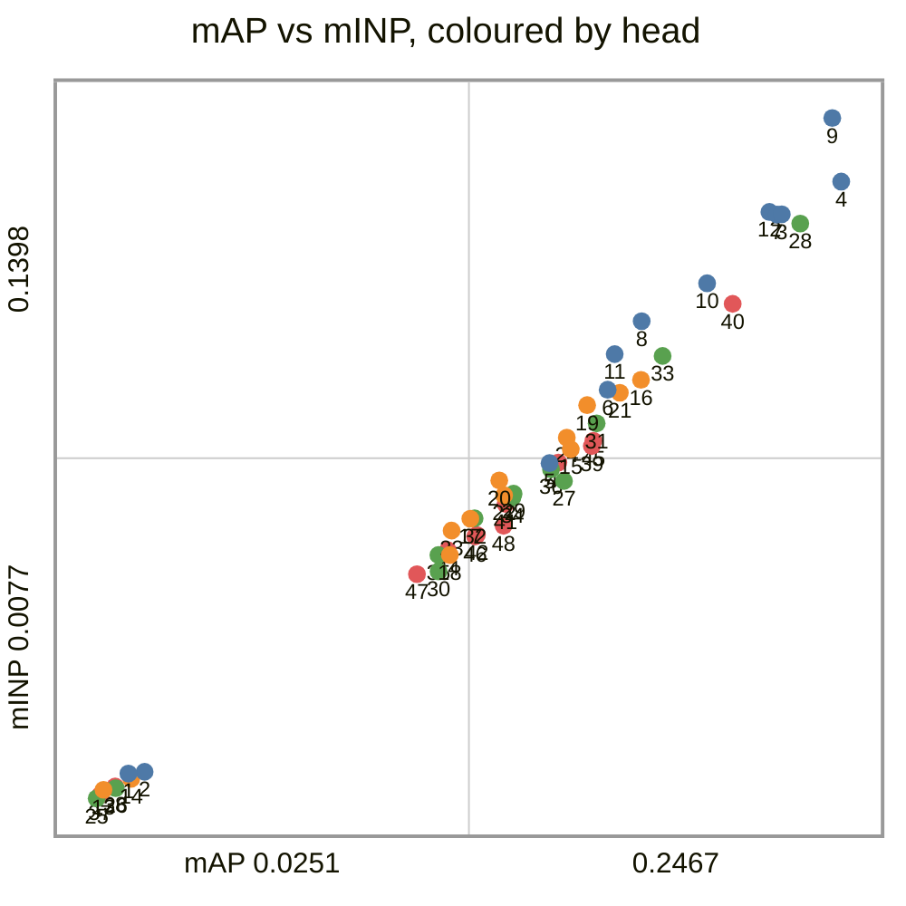
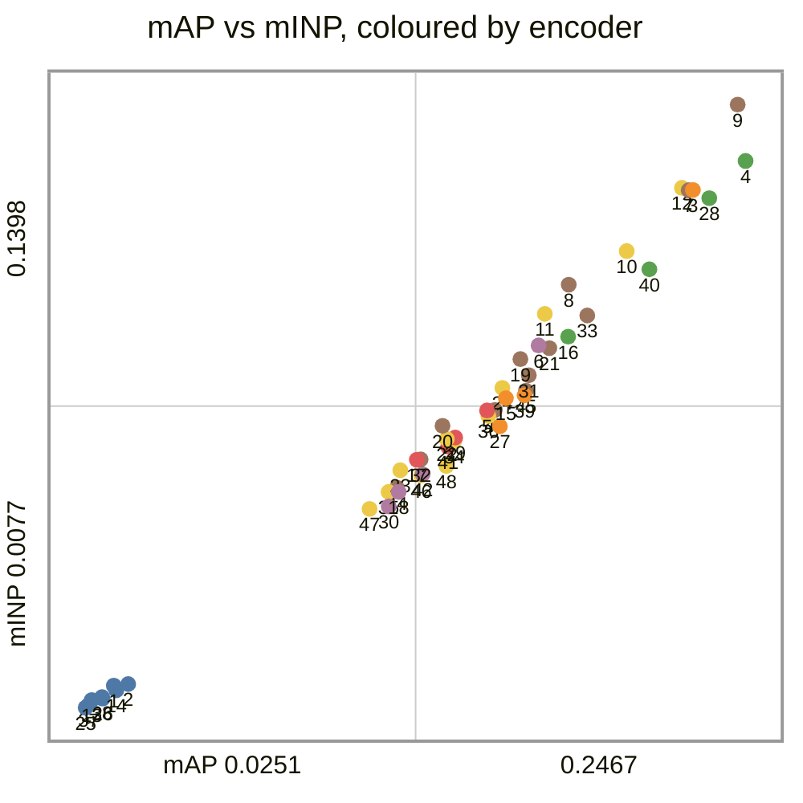
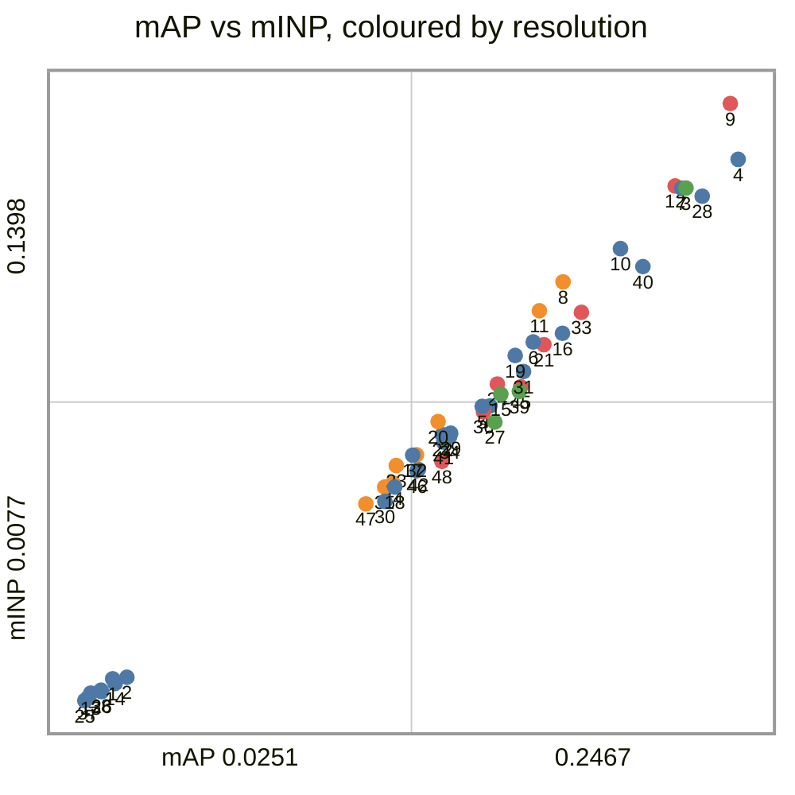

```mermaid
%%{init: {"themeVariables": {"xyChart": {"backgroundColor": "transparent", "plotColorPalette": "#4e79a7,#f28e2b,#59a14f,#e15759,#b07aa1,#9c755f,#edc948"}}, "xyChart": {"height": 1384, "width": 1215, "yAxis": {"showLabel": false}}}}%%
xychart-beta horizontal
    title "mAP, coloured by encoder"
    x-axis ["224x224 arcface vit_base_patch16_clip_224.openai crop · 3.46%", "224x224 arcface vit_base_patch16_clip_224.openai squash · 3.94%", "224x224 arcface vit_huge_plus_patch16_dinov3.lvd1689m squash · 24.67%", "224x224 arcface vit_large_patch16_dinov3.lvd1689m squash · 15.99%", "224x224 arcface vit_so400m_patch14_siglip_224.v2_webli squash · 17.72%", "224x224 arcface c-radio_v4-h squash · 22.76%", "224x224 arcface c-radio_v4-so400m squash · 20.68%", "224x224 linear vit_base_patch16_clip_224.openai crop · 2.72%", "224x224 linear vit_base_patch16_clip_224.openai squash · 3.54%", "224x224 linear vit_huge_plus_patch16_dinov3.lvd1689m squash · 18.71%", "224x224 linear vit_large_patch16_dinov3.lvd1689m squash · 13.63%", "224x224 linear vit_so400m_patch14_siglip_224.v2_webli squash · 13.03%", "224x224 linear c-radio_v4-h squash · 17.11%", "224x224 linear c-radio_v4-so400m squash · 14.64%", "224x224 none vit_base_patch16_clip_224.openai crop · 2.51%", "224x224 none vit_base_patch16_clip_224.openai squash · 3.08%", "224x224 none vit_huge_plus_patch16_dinov3.lvd1689m squash · 23.46%", "224x224 none vit_large_patch16_dinov3.lvd1689m squash · 14.92%", "224x224 none vit_so400m_patch14_siglip_224.v2_webli squash · 12.69%", "224x224 none c-radio_v4-h squash · 17.39%", "224x224 none c-radio_v4-so400m squash · 14.89%", "224x224 pca vit_base_patch16_clip_224.openai crop · 2.61%", "224x224 pca vit_base_patch16_clip_224.openai squash · 3.06%", "224x224 pca vit_huge_plus_patch16_dinov3.lvd1689m squash · 21.44%", "224x224 pca vit_large_patch16_dinov3.lvd1689m squash · 14.68%", "224x224 pca vit_so400m_patch14_siglip_224.v2_webli squash · 13.83%", "224x224 pca c-radio_v4-h squash · 16.25%", "224x224 pca c-radio_v4-so400m squash · 13.78%", "256x128 arcface c-radio_v4-h squash · 18.73%", "256x128 arcface c-radio_v4-so400m squash · 17.93%", "256x128 linear c-radio_v4-h squash · 14.50%", "256x128 linear c-radio_v4-so400m squash · 13.08%", "256x128 none c-radio_v4-h squash · 13.76%", "256x128 none c-radio_v4-so400m squash · 12.68%", "256x128 pca c-radio_v4-h squash · 12.97%", "256x128 pca c-radio_v4-so400m squash · 12.05%", "256x256 arcface vit_giantopt_patch16_siglip_256.v2_webli squash · 22.90%", "256x256 linear vit_giantopt_patch16_siglip_256.v2_webli squash · 16.62%", "256x256 none vit_giantopt_patch16_siglip_256.v2_webli squash · 16.42%", "256x256 pca vit_giantopt_patch16_siglip_256.v2_webli squash · 17.25%", "native arcface c-radio_v4-h squash · 24.41%", "native arcface c-radio_v4-so400m squash · 22.54%", "native linear c-radio_v4-h squash · 18.08%", "native linear c-radio_v4-so400m squash · 16.51%", "native none c-radio_v4-h squash · 19.36%", "native none c-radio_v4-so400m squash · 16.03%", "native pca c-radio_v4-h squash · 17.30%", "native pca c-radio_v4-so400m squash · 14.62%"]
    y-axis "mAP (%)" 0 --> 25.91
    bar [3.46, 3.94, 0.00, 0.00, 0.00, 0.00, 0.00, 2.72, 3.54, 0.00, 0.00, 0.00, 0.00, 0.00, 2.51, 3.08, 0.00, 0.00, 0.00, 0.00, 0.00, 2.61, 3.06, 0.00, 0.00, 0.00, 0.00, 0.00, 0.00, 0.00, 0.00, 0.00, 0.00, 0.00, 0.00, 0.00, 0.00, 0.00, 0.00, 0.00, 0.00, 0.00, 0.00, 0.00, 0.00, 0.00, 0.00, 0.00]
    bar [0.00, 0.00, 0.00, 0.00, 0.00, 0.00, 0.00, 0.00, 0.00, 0.00, 0.00, 0.00, 0.00, 0.00, 0.00, 0.00, 0.00, 0.00, 0.00, 0.00, 0.00, 0.00, 0.00, 0.00, 0.00, 0.00, 0.00, 0.00, 0.00, 0.00, 0.00, 0.00, 0.00, 0.00, 0.00, 0.00, 22.90, 16.62, 16.42, 17.25, 0.00, 0.00, 0.00, 0.00, 0.00, 0.00, 0.00, 0.00]
    bar [0.00, 0.00, 24.67, 0.00, 0.00, 0.00, 0.00, 0.00, 0.00, 18.71, 0.00, 0.00, 0.00, 0.00, 0.00, 0.00, 23.46, 0.00, 0.00, 0.00, 0.00, 0.00, 0.00, 21.44, 0.00, 0.00, 0.00, 0.00, 0.00, 0.00, 0.00, 0.00, 0.00, 0.00, 0.00, 0.00, 0.00, 0.00, 0.00, 0.00, 0.00, 0.00, 0.00, 0.00, 0.00, 0.00, 0.00, 0.00]
    bar [0.00, 0.00, 0.00, 15.99, 0.00, 0.00, 0.00, 0.00, 0.00, 0.00, 13.63, 0.00, 0.00, 0.00, 0.00, 0.00, 0.00, 14.92, 0.00, 0.00, 0.00, 0.00, 0.00, 0.00, 14.68, 0.00, 0.00, 0.00, 0.00, 0.00, 0.00, 0.00, 0.00, 0.00, 0.00, 0.00, 0.00, 0.00, 0.00, 0.00, 0.00, 0.00, 0.00, 0.00, 0.00, 0.00, 0.00, 0.00]
    bar [0.00, 0.00, 0.00, 0.00, 17.72, 0.00, 0.00, 0.00, 0.00, 0.00, 0.00, 13.03, 0.00, 0.00, 0.00, 0.00, 0.00, 0.00, 12.69, 0.00, 0.00, 0.00, 0.00, 0.00, 0.00, 13.83, 0.00, 0.00, 0.00, 0.00, 0.00, 0.00, 0.00, 0.00, 0.00, 0.00, 0.00, 0.00, 0.00, 0.00, 0.00, 0.00, 0.00, 0.00, 0.00, 0.00, 0.00, 0.00]
    bar [0.00, 0.00, 0.00, 0.00, 0.00, 22.76, 0.00, 0.00, 0.00, 0.00, 0.00, 0.00, 17.11, 0.00, 0.00, 0.00, 0.00, 0.00, 0.00, 17.39, 0.00, 0.00, 0.00, 0.00, 0.00, 0.00, 16.25, 0.00, 18.73, 0.00, 14.50, 0.00, 13.76, 0.00, 12.97, 0.00, 0.00, 0.00, 0.00, 0.00, 24.41, 0.00, 18.08, 0.00, 19.36, 0.00, 17.30, 0.00]
    bar [0.00, 0.00, 0.00, 0.00, 0.00, 0.00, 20.68, 0.00, 0.00, 0.00, 0.00, 0.00, 0.00, 14.64, 0.00, 0.00, 0.00, 0.00, 0.00, 0.00, 14.89, 0.00, 0.00, 0.00, 0.00, 0.00, 0.00, 13.78, 0.00, 17.93, 0.00, 13.08, 0.00, 12.68, 0.00, 12.05, 0.00, 0.00, 0.00, 0.00, 0.00, 22.54, 0.00, 16.51, 0.00, 16.03, 0.00, 14.62]
```

<!-- generated by `reidbench render`; edit the runs, not this file -->

# vrai

[← table.md](../table.md)

## vrai/train-cross-camera@1

### 🟦 arcface

|  # | encoder                                       | resolution | resize |        mAP |         R1 |         R5 |        R10 |       mINP |
|---:|-----------------------------------------------|------------|--------|-----------:|-----------:|-----------:|-----------:|-----------:|
|  1 | timm:vit_base_patch16_clip_224.openai         | 224x224    | crop   |     0.0346 |     0.0473 |     0.0925 |     0.1204 |     0.0125 |
|  2 | timm:vit_base_patch16_clip_224.openai         | 224x224    | squash |     0.0394 |     0.0520 |     0.1065 |     0.1425 |     0.0129 |
|  3 | timm:vit_giantopt_patch16_siglip_256.v2_webli | 256x256    | squash |     0.2290 |     0.2705 |     0.4321 |     0.5054 |     0.1211 |
|  4 | timm:vit_huge_plus_patch16_dinov3.lvd1689m    | 224x224    | squash | **0.2467** | **0.3072** | **0.4573** | **0.5259** |     0.1275 |
|  5 | timm:vit_large_patch16_dinov3.lvd1689m        | 224x224    | squash |     0.1599 |     0.2087 |     0.3177 |     0.3734 |     0.0728 |
|  6 | timm:vit_so400m_patch14_siglip_224.v2_webli   | 224x224    | squash |     0.1772 |     0.2155 |     0.3562 |     0.4156 |     0.0871 |
|  7 | torchhub:NVlabs/RADIO/c-radio_v4-h            | 224x224    | squash |     0.2276 |     0.2685 |     0.4083 |     0.4813 |     0.1211 |
|  8 | torchhub:NVlabs/RADIO/c-radio_v4-h            | 256x128    | squash |     0.1873 |     0.2204 |     0.3502 |     0.4184 |     0.1004 |
|  9 | torchhub:NVlabs/RADIO/c-radio_v4-h            | native     | squash |     0.2441 |     0.2828 |     0.4294 |     0.5005 | **0.1398** |
| 10 | torchhub:NVlabs/RADIO/c-radio_v4-so400m       | 224x224    | squash |     0.2068 |     0.2442 |     0.3808 |     0.4519 |     0.1077 |
| 11 | torchhub:NVlabs/RADIO/c-radio_v4-so400m       | 256x128    | squash |     0.1793 |     0.2129 |     0.3426 |     0.4099 |     0.0940 |
| 12 | torchhub:NVlabs/RADIO/c-radio_v4-so400m       | native     | squash |     0.2254 |     0.2663 |     0.4081 |     0.4746 |     0.1216 |

### 🟧 linear

|  # | encoder                                       | resolution | resize |        mAP |         R1 |         R5 |        R10 |       mINP |
|---:|-----------------------------------------------|------------|--------|-----------:|-----------:|-----------:|-----------:|-----------:|
| 13 | timm:vit_base_patch16_clip_224.openai         | 224x224    | crop   |     0.0272 |     0.0322 |     0.0797 |     0.1028 |     0.0094 |
| 14 | timm:vit_base_patch16_clip_224.openai         | 224x224    | squash |     0.0354 |     0.0473 |     0.0955 |     0.1333 |     0.0115 |
| 15 | timm:vit_giantopt_patch16_siglip_256.v2_webli | 256x256    | squash |     0.1662 |     0.2137 |     0.3520 |     0.4199 |     0.0755 |
| 16 | timm:vit_huge_plus_patch16_dinov3.lvd1689m    | 224x224    | squash | **0.1871** | **0.2355** | **0.3718** | **0.4411** | **0.0890** |
| 17 | timm:vit_large_patch16_dinov3.lvd1689m        | 224x224    | squash |     0.1363 |     0.1788 |     0.2840 |     0.3394 |     0.0620 |
| 18 | timm:vit_so400m_patch14_siglip_224.v2_webli   | 224x224    | squash |     0.1303 |     0.1725 |     0.2910 |     0.3481 |     0.0550 |
| 19 | torchhub:NVlabs/RADIO/c-radio_v4-h            | 224x224    | squash |     0.1711 |     0.2093 |     0.3375 |     0.4067 |     0.0841 |
| 20 | torchhub:NVlabs/RADIO/c-radio_v4-h            | 256x128    | squash |     0.1450 |     0.1779 |     0.2936 |     0.3535 |     0.0694 |
| 21 | torchhub:NVlabs/RADIO/c-radio_v4-h            | native     | squash |     0.1808 |     0.2272 |     0.3585 |     0.4254 |     0.0865 |
| 22 | torchhub:NVlabs/RADIO/c-radio_v4-so400m       | 224x224    | squash |     0.1464 |     0.1847 |     0.3078 |     0.3651 |     0.0666 |
| 23 | torchhub:NVlabs/RADIO/c-radio_v4-so400m       | 256x128    | squash |     0.1308 |     0.1615 |     0.2747 |     0.3351 |     0.0597 |
| 24 | torchhub:NVlabs/RADIO/c-radio_v4-so400m       | native     | squash |     0.1651 |     0.2074 |     0.3350 |     0.3999 |     0.0778 |

### 🟩 none

|  # | encoder                                       | resolution | resize |        mAP |         R1 |         R5 |        R10 |       mINP |
|---:|-----------------------------------------------|------------|--------|-----------:|-----------:|-----------:|-----------:|-----------:|
| 25 | timm:vit_base_patch16_clip_224.openai         | 224x224    | crop   |     0.0251 |     0.0349 |     0.0778 |     0.1043 |     0.0077 |
| 26 | timm:vit_base_patch16_clip_224.openai         | 224x224    | squash |     0.0308 |     0.0422 |     0.0897 |     0.1176 |     0.0097 |
| 27 | timm:vit_giantopt_patch16_siglip_256.v2_webli | 256x256    | squash |     0.1642 |     0.2168 |     0.3561 |     0.4308 |     0.0693 |
| 28 | timm:vit_huge_plus_patch16_dinov3.lvd1689m    | 224x224    | squash | **0.2346** | **0.2967** | **0.4348** | **0.5043** | **0.1193** |
| 29 | timm:vit_large_patch16_dinov3.lvd1689m        | 224x224    | squash |     0.1492 |     0.1990 |     0.3061 |     0.3556 |     0.0669 |
| 30 | timm:vit_so400m_patch14_siglip_224.v2_webli   | 224x224    | squash |     0.1269 |     0.1669 |     0.2815 |     0.3464 |     0.0518 |
| 31 | torchhub:NVlabs/RADIO/c-radio_v4-h            | 224x224    | squash |     0.1739 |     0.2152 |     0.3510 |     0.4213 |     0.0805 |
| 32 | torchhub:NVlabs/RADIO/c-radio_v4-h            | 256x128    | squash |     0.1376 |     0.1709 |     0.2850 |     0.3440 |     0.0621 |
| 33 | torchhub:NVlabs/RADIO/c-radio_v4-h            | native     | squash |     0.1936 |     0.2421 |     0.3778 |     0.4434 |     0.0936 |
| 34 | torchhub:NVlabs/RADIO/c-radio_v4-so400m       | 224x224    | squash |     0.1489 |     0.1945 |     0.3077 |     0.3712 |     0.0661 |
| 35 | torchhub:NVlabs/RADIO/c-radio_v4-so400m       | 256x128    | squash |     0.1268 |     0.1611 |     0.2745 |     0.3364 |     0.0550 |
| 36 | torchhub:NVlabs/RADIO/c-radio_v4-so400m       | native     | squash |     0.1603 |     0.2050 |     0.3304 |     0.3937 |     0.0716 |

### 🟥 pca

|  # | encoder                                       | resolution | resize |        mAP |         R1 |         R5 |        R10 |       mINP |
|---:|-----------------------------------------------|------------|--------|-----------:|-----------:|-----------:|-----------:|-----------:|
| 37 | timm:vit_base_patch16_clip_224.openai         | 224x224    | crop   |     0.0261 |     0.0348 |     0.0754 |     0.1052 |     0.0083 |
| 38 | timm:vit_base_patch16_clip_224.openai         | 224x224    | squash |     0.0306 |     0.0408 |     0.0874 |     0.1157 |     0.0100 |
| 39 | timm:vit_giantopt_patch16_siglip_256.v2_webli | 256x256    | squash |     0.1725 |     0.2199 |     0.3646 |     0.4384 |     0.0761 |
| 40 | timm:vit_huge_plus_patch16_dinov3.lvd1689m    | 224x224    | squash | **0.2144** | **0.2755** | **0.4126** | **0.4816** | **0.1037** |
| 41 | timm:vit_large_patch16_dinov3.lvd1689m        | 224x224    | squash |     0.1468 |     0.1947 |     0.3005 |     0.3524 |     0.0649 |
| 42 | timm:vit_so400m_patch14_siglip_224.v2_webli   | 224x224    | squash |     0.1383 |     0.1806 |     0.2951 |     0.3662 |     0.0589 |
| 43 | torchhub:NVlabs/RADIO/c-radio_v4-h            | 224x224    | squash |     0.1625 |     0.2063 |     0.3286 |     0.3950 |     0.0729 |
| 44 | torchhub:NVlabs/RADIO/c-radio_v4-h            | 256x128    | squash |     0.1297 |     0.1634 |     0.2755 |     0.3305 |     0.0559 |
| 45 | torchhub:NVlabs/RADIO/c-radio_v4-h            | native     | squash |     0.1730 |     0.2236 |     0.3551 |     0.4207 |     0.0771 |
| 46 | torchhub:NVlabs/RADIO/c-radio_v4-so400m       | 224x224    | squash |     0.1378 |     0.1798 |     0.2934 |     0.3542 |     0.0586 |
| 47 | torchhub:NVlabs/RADIO/c-radio_v4-so400m       | 256x128    | squash |     0.1205 |     0.1533 |     0.2604 |     0.3202 |     0.0512 |
| 48 | torchhub:NVlabs/RADIO/c-radio_v4-so400m       | native     | squash |     0.1462 |     0.1928 |     0.3167 |     0.3743 |     0.0606 |

### Every row, by encoder and resolution

```mermaid
%%{init: {"themeVariables": {"xyChart": {"backgroundColor": "transparent", "plotColorPalette": "#4e79a7,#f28e2b,#59a14f,#e15759"}}, "xyChart": {"height": 1384, "width": 1215, "yAxis": {"showLabel": false}}}}%%
xychart-beta horizontal
    title "mAP, coloured by head"
    x-axis ["vit_base_patch16_clip_224.openai 224x224 arcface crop · 3.46%", "vit_base_patch16_clip_224.openai 224x224 arcface squash · 3.94%", "vit_base_patch16_clip_224.openai 224x224 linear crop · 2.72%", "vit_base_patch16_clip_224.openai 224x224 linear squash · 3.54%", "vit_base_patch16_clip_224.openai 224x224 none crop · 2.51%", "vit_base_patch16_clip_224.openai 224x224 none squash · 3.08%", "vit_base_patch16_clip_224.openai 224x224 pca crop · 2.61%", "vit_base_patch16_clip_224.openai 224x224 pca squash · 3.06%", "vit_giantopt_patch16_siglip_256.v2_webli 256x256 arcface squash · 22.90%", "vit_giantopt_patch16_siglip_256.v2_webli 256x256 linear squash · 16.62%", "vit_giantopt_patch16_siglip_256.v2_webli 256x256 none squash · 16.42%", "vit_giantopt_patch16_siglip_256.v2_webli 256x256 pca squash · 17.25%", "vit_huge_plus_patch16_dinov3.lvd1689m 224x224 arcface squash · 24.67%", "vit_huge_plus_patch16_dinov3.lvd1689m 224x224 linear squash · 18.71%", "vit_huge_plus_patch16_dinov3.lvd1689m 224x224 none squash · 23.46%", "vit_huge_plus_patch16_dinov3.lvd1689m 224x224 pca squash · 21.44%", "vit_large_patch16_dinov3.lvd1689m 224x224 arcface squash · 15.99%", "vit_large_patch16_dinov3.lvd1689m 224x224 linear squash · 13.63%", "vit_large_patch16_dinov3.lvd1689m 224x224 none squash · 14.92%", "vit_large_patch16_dinov3.lvd1689m 224x224 pca squash · 14.68%", "vit_so400m_patch14_siglip_224.v2_webli 224x224 arcface squash · 17.72%", "vit_so400m_patch14_siglip_224.v2_webli 224x224 linear squash · 13.03%", "vit_so400m_patch14_siglip_224.v2_webli 224x224 none squash · 12.69%", "vit_so400m_patch14_siglip_224.v2_webli 224x224 pca squash · 13.83%", "c-radio_v4-h 224x224 arcface squash · 22.76%", "c-radio_v4-h 224x224 linear squash · 17.11%", "c-radio_v4-h 224x224 none squash · 17.39%", "c-radio_v4-h 224x224 pca squash · 16.25%", "c-radio_v4-h 256x128 arcface squash · 18.73%", "c-radio_v4-h 256x128 linear squash · 14.50%", "c-radio_v4-h 256x128 none squash · 13.76%", "c-radio_v4-h 256x128 pca squash · 12.97%", "c-radio_v4-h native arcface squash · 24.41%", "c-radio_v4-h native linear squash · 18.08%", "c-radio_v4-h native none squash · 19.36%", "c-radio_v4-h native pca squash · 17.30%", "c-radio_v4-so400m 224x224 arcface squash · 20.68%", "c-radio_v4-so400m 224x224 linear squash · 14.64%", "c-radio_v4-so400m 224x224 none squash · 14.89%", "c-radio_v4-so400m 224x224 pca squash · 13.78%", "c-radio_v4-so400m 256x128 arcface squash · 17.93%", "c-radio_v4-so400m 256x128 linear squash · 13.08%", "c-radio_v4-so400m 256x128 none squash · 12.68%", "c-radio_v4-so400m 256x128 pca squash · 12.05%", "c-radio_v4-so400m native arcface squash · 22.54%", "c-radio_v4-so400m native linear squash · 16.51%", "c-radio_v4-so400m native none squash · 16.03%", "c-radio_v4-so400m native pca squash · 14.62%"]
    y-axis "mAP (%)" 0 --> 25.91
    bar [3.46, 3.94, 0.00, 0.00, 0.00, 0.00, 0.00, 0.00, 22.90, 0.00, 0.00, 0.00, 24.67, 0.00, 0.00, 0.00, 15.99, 0.00, 0.00, 0.00, 17.72, 0.00, 0.00, 0.00, 22.76, 0.00, 0.00, 0.00, 18.73, 0.00, 0.00, 0.00, 24.41, 0.00, 0.00, 0.00, 20.68, 0.00, 0.00, 0.00, 17.93, 0.00, 0.00, 0.00, 22.54, 0.00, 0.00, 0.00]
    bar [0.00, 0.00, 2.72, 3.54, 0.00, 0.00, 0.00, 0.00, 0.00, 16.62, 0.00, 0.00, 0.00, 18.71, 0.00, 0.00, 0.00, 13.63, 0.00, 0.00, 0.00, 13.03, 0.00, 0.00, 0.00, 17.11, 0.00, 0.00, 0.00, 14.50, 0.00, 0.00, 0.00, 18.08, 0.00, 0.00, 0.00, 14.64, 0.00, 0.00, 0.00, 13.08, 0.00, 0.00, 0.00, 16.51, 0.00, 0.00]
    bar [0.00, 0.00, 0.00, 0.00, 2.51, 3.08, 0.00, 0.00, 0.00, 0.00, 16.42, 0.00, 0.00, 0.00, 23.46, 0.00, 0.00, 0.00, 14.92, 0.00, 0.00, 0.00, 12.69, 0.00, 0.00, 0.00, 17.39, 0.00, 0.00, 0.00, 13.76, 0.00, 0.00, 0.00, 19.36, 0.00, 0.00, 0.00, 14.89, 0.00, 0.00, 0.00, 12.68, 0.00, 0.00, 0.00, 16.03, 0.00]
    bar [0.00, 0.00, 0.00, 0.00, 0.00, 0.00, 2.61, 3.06, 0.00, 0.00, 0.00, 17.25, 0.00, 0.00, 0.00, 21.44, 0.00, 0.00, 0.00, 14.68, 0.00, 0.00, 0.00, 13.83, 0.00, 0.00, 0.00, 16.25, 0.00, 0.00, 0.00, 12.97, 0.00, 0.00, 0.00, 17.30, 0.00, 0.00, 0.00, 13.78, 0.00, 0.00, 0.00, 12.05, 0.00, 0.00, 0.00, 14.62]
```

### By head — does the probe carry it?

```mermaid
%%{init: {"themeVariables": {"xyChart": {"backgroundColor": "transparent", "plotColorPalette": "#4e79a7,#f28e2b,#59a14f,#e15759"}}, "xyChart": {"height": 1384, "width": 1215, "yAxis": {"showLabel": false}}}}%%
xychart-beta horizontal
    title "mAP, coloured by head"
    x-axis ["arcface vit_base_patch16_clip_224.openai 224x224 crop · 3.46%", "arcface vit_base_patch16_clip_224.openai 224x224 squash · 3.94%", "arcface vit_giantopt_patch16_siglip_256.v2_webli 256x256 squash · 22.90%", "arcface vit_huge_plus_patch16_dinov3.lvd1689m 224x224 squash · 24.67%", "arcface vit_large_patch16_dinov3.lvd1689m 224x224 squash · 15.99%", "arcface vit_so400m_patch14_siglip_224.v2_webli 224x224 squash · 17.72%", "arcface c-radio_v4-h 224x224 squash · 22.76%", "arcface c-radio_v4-h 256x128 squash · 18.73%", "arcface c-radio_v4-h native squash · 24.41%", "arcface c-radio_v4-so400m 224x224 squash · 20.68%", "arcface c-radio_v4-so400m 256x128 squash · 17.93%", "arcface c-radio_v4-so400m native squash · 22.54%", "linear vit_base_patch16_clip_224.openai 224x224 crop · 2.72%", "linear vit_base_patch16_clip_224.openai 224x224 squash · 3.54%", "linear vit_giantopt_patch16_siglip_256.v2_webli 256x256 squash · 16.62%", "linear vit_huge_plus_patch16_dinov3.lvd1689m 224x224 squash · 18.71%", "linear vit_large_patch16_dinov3.lvd1689m 224x224 squash · 13.63%", "linear vit_so400m_patch14_siglip_224.v2_webli 224x224 squash · 13.03%", "linear c-radio_v4-h 224x224 squash · 17.11%", "linear c-radio_v4-h 256x128 squash · 14.50%", "linear c-radio_v4-h native squash · 18.08%", "linear c-radio_v4-so400m 224x224 squash · 14.64%", "linear c-radio_v4-so400m 256x128 squash · 13.08%", "linear c-radio_v4-so400m native squash · 16.51%", "none vit_base_patch16_clip_224.openai 224x224 crop · 2.51%", "none vit_base_patch16_clip_224.openai 224x224 squash · 3.08%", "none vit_giantopt_patch16_siglip_256.v2_webli 256x256 squash · 16.42%", "none vit_huge_plus_patch16_dinov3.lvd1689m 224x224 squash · 23.46%", "none vit_large_patch16_dinov3.lvd1689m 224x224 squash · 14.92%", "none vit_so400m_patch14_siglip_224.v2_webli 224x224 squash · 12.69%", "none c-radio_v4-h 224x224 squash · 17.39%", "none c-radio_v4-h 256x128 squash · 13.76%", "none c-radio_v4-h native squash · 19.36%", "none c-radio_v4-so400m 224x224 squash · 14.89%", "none c-radio_v4-so400m 256x128 squash · 12.68%", "none c-radio_v4-so400m native squash · 16.03%", "pca vit_base_patch16_clip_224.openai 224x224 crop · 2.61%", "pca vit_base_patch16_clip_224.openai 224x224 squash · 3.06%", "pca vit_giantopt_patch16_siglip_256.v2_webli 256x256 squash · 17.25%", "pca vit_huge_plus_patch16_dinov3.lvd1689m 224x224 squash · 21.44%", "pca vit_large_patch16_dinov3.lvd1689m 224x224 squash · 14.68%", "pca vit_so400m_patch14_siglip_224.v2_webli 224x224 squash · 13.83%", "pca c-radio_v4-h 224x224 squash · 16.25%", "pca c-radio_v4-h 256x128 squash · 12.97%", "pca c-radio_v4-h native squash · 17.30%", "pca c-radio_v4-so400m 224x224 squash · 13.78%", "pca c-radio_v4-so400m 256x128 squash · 12.05%", "pca c-radio_v4-so400m native squash · 14.62%"]
    y-axis "mAP (%)" 0 --> 25.91
    bar [3.46, 3.94, 22.90, 24.67, 15.99, 17.72, 22.76, 18.73, 24.41, 20.68, 17.93, 22.54, 0.00, 0.00, 0.00, 0.00, 0.00, 0.00, 0.00, 0.00, 0.00, 0.00, 0.00, 0.00, 0.00, 0.00, 0.00, 0.00, 0.00, 0.00, 0.00, 0.00, 0.00, 0.00, 0.00, 0.00, 0.00, 0.00, 0.00, 0.00, 0.00, 0.00, 0.00, 0.00, 0.00, 0.00, 0.00, 0.00]
    bar [0.00, 0.00, 0.00, 0.00, 0.00, 0.00, 0.00, 0.00, 0.00, 0.00, 0.00, 0.00, 2.72, 3.54, 16.62, 18.71, 13.63, 13.03, 17.11, 14.50, 18.08, 14.64, 13.08, 16.51, 0.00, 0.00, 0.00, 0.00, 0.00, 0.00, 0.00, 0.00, 0.00, 0.00, 0.00, 0.00, 0.00, 0.00, 0.00, 0.00, 0.00, 0.00, 0.00, 0.00, 0.00, 0.00, 0.00, 0.00]
    bar [0.00, 0.00, 0.00, 0.00, 0.00, 0.00, 0.00, 0.00, 0.00, 0.00, 0.00, 0.00, 0.00, 0.00, 0.00, 0.00, 0.00, 0.00, 0.00, 0.00, 0.00, 0.00, 0.00, 0.00, 2.51, 3.08, 16.42, 23.46, 14.92, 12.69, 17.39, 13.76, 19.36, 14.89, 12.68, 16.03, 0.00, 0.00, 0.00, 0.00, 0.00, 0.00, 0.00, 0.00, 0.00, 0.00, 0.00, 0.00]
    bar [0.00, 0.00, 0.00, 0.00, 0.00, 0.00, 0.00, 0.00, 0.00, 0.00, 0.00, 0.00, 0.00, 0.00, 0.00, 0.00, 0.00, 0.00, 0.00, 0.00, 0.00, 0.00, 0.00, 0.00, 0.00, 0.00, 0.00, 0.00, 0.00, 0.00, 0.00, 0.00, 0.00, 0.00, 0.00, 0.00, 2.61, 3.06, 17.25, 21.44, 14.68, 13.83, 16.25, 12.97, 17.30, 13.78, 12.05, 14.62]
```

### By encoder — does the checkpoint carry it?

*Colour — encoder:* 🟦 timm:vit_base_patch16_clip_224.openai · 🟧 timm:vit_giantopt_patch16_siglip_256.v2_webli · 🟩 timm:vit_huge_plus_patch16_dinov3.lvd1689m · 🟥 timm:vit_large_patch16_dinov3.lvd1689m · 🟪 timm:vit_so400m_patch14_siglip_224.v2_webli · 🟫 torchhub:NVlabs/RADIO/c-radio_v4-h · 🟨 torchhub:NVlabs/RADIO/c-radio_v4-so400m

```mermaid
%%{init: {"themeVariables": {"xyChart": {"backgroundColor": "transparent", "plotColorPalette": "#4e79a7,#f28e2b,#59a14f,#e15759,#b07aa1,#9c755f,#edc948"}}, "xyChart": {"height": 1384, "width": 1215, "yAxis": {"showLabel": false}}}}%%
xychart-beta horizontal
    title "mAP, coloured by encoder"
    x-axis ["vit_base_patch16_clip_224.openai arcface 224x224 crop · 3.46%", "vit_base_patch16_clip_224.openai arcface 224x224 squash · 3.94%", "vit_base_patch16_clip_224.openai linear 224x224 crop · 2.72%", "vit_base_patch16_clip_224.openai linear 224x224 squash · 3.54%", "vit_base_patch16_clip_224.openai none 224x224 crop · 2.51%", "vit_base_patch16_clip_224.openai none 224x224 squash · 3.08%", "vit_base_patch16_clip_224.openai pca 224x224 crop · 2.61%", "vit_base_patch16_clip_224.openai pca 224x224 squash · 3.06%", "vit_giantopt_patch16_siglip_256.v2_webli arcface 256x256 squash · 22.90%", "vit_giantopt_patch16_siglip_256.v2_webli linear 256x256 squash · 16.62%", "vit_giantopt_patch16_siglip_256.v2_webli none 256x256 squash · 16.42%", "vit_giantopt_patch16_siglip_256.v2_webli pca 256x256 squash · 17.25%", "vit_huge_plus_patch16_dinov3.lvd1689m arcface 224x224 squash · 24.67%", "vit_huge_plus_patch16_dinov3.lvd1689m linear 224x224 squash · 18.71%", "vit_huge_plus_patch16_dinov3.lvd1689m none 224x224 squash · 23.46%", "vit_huge_plus_patch16_dinov3.lvd1689m pca 224x224 squash · 21.44%", "vit_large_patch16_dinov3.lvd1689m arcface 224x224 squash · 15.99%", "vit_large_patch16_dinov3.lvd1689m linear 224x224 squash · 13.63%", "vit_large_patch16_dinov3.lvd1689m none 224x224 squash · 14.92%", "vit_large_patch16_dinov3.lvd1689m pca 224x224 squash · 14.68%", "vit_so400m_patch14_siglip_224.v2_webli arcface 224x224 squash · 17.72%", "vit_so400m_patch14_siglip_224.v2_webli linear 224x224 squash · 13.03%", "vit_so400m_patch14_siglip_224.v2_webli none 224x224 squash · 12.69%", "vit_so400m_patch14_siglip_224.v2_webli pca 224x224 squash · 13.83%", "c-radio_v4-h arcface 224x224 squash · 22.76%", "c-radio_v4-h arcface 256x128 squash · 18.73%", "c-radio_v4-h arcface native squash · 24.41%", "c-radio_v4-h linear 224x224 squash · 17.11%", "c-radio_v4-h linear 256x128 squash · 14.50%", "c-radio_v4-h linear native squash · 18.08%", "c-radio_v4-h none 224x224 squash · 17.39%", "c-radio_v4-h none 256x128 squash · 13.76%", "c-radio_v4-h none native squash · 19.36%", "c-radio_v4-h pca 224x224 squash · 16.25%", "c-radio_v4-h pca 256x128 squash · 12.97%", "c-radio_v4-h pca native squash · 17.30%", "c-radio_v4-so400m arcface 224x224 squash · 20.68%", "c-radio_v4-so400m arcface 256x128 squash · 17.93%", "c-radio_v4-so400m arcface native squash · 22.54%", "c-radio_v4-so400m linear 224x224 squash · 14.64%", "c-radio_v4-so400m linear 256x128 squash · 13.08%", "c-radio_v4-so400m linear native squash · 16.51%", "c-radio_v4-so400m none 224x224 squash · 14.89%", "c-radio_v4-so400m none 256x128 squash · 12.68%", "c-radio_v4-so400m none native squash · 16.03%", "c-radio_v4-so400m pca 224x224 squash · 13.78%", "c-radio_v4-so400m pca 256x128 squash · 12.05%", "c-radio_v4-so400m pca native squash · 14.62%"]
    y-axis "mAP (%)" 0 --> 25.91
    bar [3.46, 3.94, 2.72, 3.54, 2.51, 3.08, 2.61, 3.06, 0.00, 0.00, 0.00, 0.00, 0.00, 0.00, 0.00, 0.00, 0.00, 0.00, 0.00, 0.00, 0.00, 0.00, 0.00, 0.00, 0.00, 0.00, 0.00, 0.00, 0.00, 0.00, 0.00, 0.00, 0.00, 0.00, 0.00, 0.00, 0.00, 0.00, 0.00, 0.00, 0.00, 0.00, 0.00, 0.00, 0.00, 0.00, 0.00, 0.00]
    bar [0.00, 0.00, 0.00, 0.00, 0.00, 0.00, 0.00, 0.00, 22.90, 16.62, 16.42, 17.25, 0.00, 0.00, 0.00, 0.00, 0.00, 0.00, 0.00, 0.00, 0.00, 0.00, 0.00, 0.00, 0.00, 0.00, 0.00, 0.00, 0.00, 0.00, 0.00, 0.00, 0.00, 0.00, 0.00, 0.00, 0.00, 0.00, 0.00, 0.00, 0.00, 0.00, 0.00, 0.00, 0.00, 0.00, 0.00, 0.00]
    bar [0.00, 0.00, 0.00, 0.00, 0.00, 0.00, 0.00, 0.00, 0.00, 0.00, 0.00, 0.00, 24.67, 18.71, 23.46, 21.44, 0.00, 0.00, 0.00, 0.00, 0.00, 0.00, 0.00, 0.00, 0.00, 0.00, 0.00, 0.00, 0.00, 0.00, 0.00, 0.00, 0.00, 0.00, 0.00, 0.00, 0.00, 0.00, 0.00, 0.00, 0.00, 0.00, 0.00, 0.00, 0.00, 0.00, 0.00, 0.00]
    bar [0.00, 0.00, 0.00, 0.00, 0.00, 0.00, 0.00, 0.00, 0.00, 0.00, 0.00, 0.00, 0.00, 0.00, 0.00, 0.00, 15.99, 13.63, 14.92, 14.68, 0.00, 0.00, 0.00, 0.00, 0.00, 0.00, 0.00, 0.00, 0.00, 0.00, 0.00, 0.00, 0.00, 0.00, 0.00, 0.00, 0.00, 0.00, 0.00, 0.00, 0.00, 0.00, 0.00, 0.00, 0.00, 0.00, 0.00, 0.00]
    bar [0.00, 0.00, 0.00, 0.00, 0.00, 0.00, 0.00, 0.00, 0.00, 0.00, 0.00, 0.00, 0.00, 0.00, 0.00, 0.00, 0.00, 0.00, 0.00, 0.00, 17.72, 13.03, 12.69, 13.83, 0.00, 0.00, 0.00, 0.00, 0.00, 0.00, 0.00, 0.00, 0.00, 0.00, 0.00, 0.00, 0.00, 0.00, 0.00, 0.00, 0.00, 0.00, 0.00, 0.00, 0.00, 0.00, 0.00, 0.00]
    bar [0.00, 0.00, 0.00, 0.00, 0.00, 0.00, 0.00, 0.00, 0.00, 0.00, 0.00, 0.00, 0.00, 0.00, 0.00, 0.00, 0.00, 0.00, 0.00, 0.00, 0.00, 0.00, 0.00, 0.00, 22.76, 18.73, 24.41, 17.11, 14.50, 18.08, 17.39, 13.76, 19.36, 16.25, 12.97, 17.30, 0.00, 0.00, 0.00, 0.00, 0.00, 0.00, 0.00, 0.00, 0.00, 0.00, 0.00, 0.00]
    bar [0.00, 0.00, 0.00, 0.00, 0.00, 0.00, 0.00, 0.00, 0.00, 0.00, 0.00, 0.00, 0.00, 0.00, 0.00, 0.00, 0.00, 0.00, 0.00, 0.00, 0.00, 0.00, 0.00, 0.00, 0.00, 0.00, 0.00, 0.00, 0.00, 0.00, 0.00, 0.00, 0.00, 0.00, 0.00, 0.00, 20.68, 17.93, 22.54, 14.64, 13.08, 16.51, 14.89, 12.68, 16.03, 13.78, 12.05, 14.62]
```

### By resolution — does the input size carry it?

*Colour — resolution:* 🟦 224x224 · 🟧 256x128 · 🟩 256x256 · 🟥 native

```mermaid
%%{init: {"themeVariables": {"xyChart": {"backgroundColor": "transparent", "plotColorPalette": "#4e79a7,#f28e2b,#59a14f,#e15759"}}, "xyChart": {"height": 1384, "width": 1215, "yAxis": {"showLabel": false}}}}%%
xychart-beta horizontal
    title "mAP, coloured by resolution"
    x-axis ["224x224 vit_base_patch16_clip_224.openai arcface crop · 3.46%", "224x224 vit_base_patch16_clip_224.openai arcface squash · 3.94%", "224x224 vit_base_patch16_clip_224.openai linear crop · 2.72%", "224x224 vit_base_patch16_clip_224.openai linear squash · 3.54%", "224x224 vit_base_patch16_clip_224.openai none crop · 2.51%", "224x224 vit_base_patch16_clip_224.openai none squash · 3.08%", "224x224 vit_base_patch16_clip_224.openai pca crop · 2.61%", "224x224 vit_base_patch16_clip_224.openai pca squash · 3.06%", "224x224 vit_huge_plus_patch16_dinov3.lvd1689m arcface squash · 24.67%", "224x224 vit_huge_plus_patch16_dinov3.lvd1689m linear squash · 18.71%", "224x224 vit_huge_plus_patch16_dinov3.lvd1689m none squash · 23.46%", "224x224 vit_huge_plus_patch16_dinov3.lvd1689m pca squash · 21.44%", "224x224 vit_large_patch16_dinov3.lvd1689m arcface squash · 15.99%", "224x224 vit_large_patch16_dinov3.lvd1689m linear squash · 13.63%", "224x224 vit_large_patch16_dinov3.lvd1689m none squash · 14.92%", "224x224 vit_large_patch16_dinov3.lvd1689m pca squash · 14.68%", "224x224 vit_so400m_patch14_siglip_224.v2_webli arcface squash · 17.72%", "224x224 vit_so400m_patch14_siglip_224.v2_webli linear squash · 13.03%", "224x224 vit_so400m_patch14_siglip_224.v2_webli none squash · 12.69%", "224x224 vit_so400m_patch14_siglip_224.v2_webli pca squash · 13.83%", "224x224 c-radio_v4-h arcface squash · 22.76%", "224x224 c-radio_v4-h linear squash · 17.11%", "224x224 c-radio_v4-h none squash · 17.39%", "224x224 c-radio_v4-h pca squash · 16.25%", "224x224 c-radio_v4-so400m arcface squash · 20.68%", "224x224 c-radio_v4-so400m linear squash · 14.64%", "224x224 c-radio_v4-so400m none squash · 14.89%", "224x224 c-radio_v4-so400m pca squash · 13.78%", "256x128 c-radio_v4-h arcface squash · 18.73%", "256x128 c-radio_v4-h linear squash · 14.50%", "256x128 c-radio_v4-h none squash · 13.76%", "256x128 c-radio_v4-h pca squash · 12.97%", "256x128 c-radio_v4-so400m arcface squash · 17.93%", "256x128 c-radio_v4-so400m linear squash · 13.08%", "256x128 c-radio_v4-so400m none squash · 12.68%", "256x128 c-radio_v4-so400m pca squash · 12.05%", "256x256 vit_giantopt_patch16_siglip_256.v2_webli arcface squash · 22.90%", "256x256 vit_giantopt_patch16_siglip_256.v2_webli linear squash · 16.62%", "256x256 vit_giantopt_patch16_siglip_256.v2_webli none squash · 16.42%", "256x256 vit_giantopt_patch16_siglip_256.v2_webli pca squash · 17.25%", "native c-radio_v4-h arcface squash · 24.41%", "native c-radio_v4-h linear squash · 18.08%", "native c-radio_v4-h none squash · 19.36%", "native c-radio_v4-h pca squash · 17.30%", "native c-radio_v4-so400m arcface squash · 22.54%", "native c-radio_v4-so400m linear squash · 16.51%", "native c-radio_v4-so400m none squash · 16.03%", "native c-radio_v4-so400m pca squash · 14.62%"]
    y-axis "mAP (%)" 0 --> 25.91
    bar [3.46, 3.94, 2.72, 3.54, 2.51, 3.08, 2.61, 3.06, 24.67, 18.71, 23.46, 21.44, 15.99, 13.63, 14.92, 14.68, 17.72, 13.03, 12.69, 13.83, 22.76, 17.11, 17.39, 16.25, 20.68, 14.64, 14.89, 13.78, 0.00, 0.00, 0.00, 0.00, 0.00, 0.00, 0.00, 0.00, 0.00, 0.00, 0.00, 0.00, 0.00, 0.00, 0.00, 0.00, 0.00, 0.00, 0.00, 0.00]
    bar [0.00, 0.00, 0.00, 0.00, 0.00, 0.00, 0.00, 0.00, 0.00, 0.00, 0.00, 0.00, 0.00, 0.00, 0.00, 0.00, 0.00, 0.00, 0.00, 0.00, 0.00, 0.00, 0.00, 0.00, 0.00, 0.00, 0.00, 0.00, 18.73, 14.50, 13.76, 12.97, 17.93, 13.08, 12.68, 12.05, 0.00, 0.00, 0.00, 0.00, 0.00, 0.00, 0.00, 0.00, 0.00, 0.00, 0.00, 0.00]
    bar [0.00, 0.00, 0.00, 0.00, 0.00, 0.00, 0.00, 0.00, 0.00, 0.00, 0.00, 0.00, 0.00, 0.00, 0.00, 0.00, 0.00, 0.00, 0.00, 0.00, 0.00, 0.00, 0.00, 0.00, 0.00, 0.00, 0.00, 0.00, 0.00, 0.00, 0.00, 0.00, 0.00, 0.00, 0.00, 0.00, 22.90, 16.62, 16.42, 17.25, 0.00, 0.00, 0.00, 0.00, 0.00, 0.00, 0.00, 0.00]
    bar [0.00, 0.00, 0.00, 0.00, 0.00, 0.00, 0.00, 0.00, 0.00, 0.00, 0.00, 0.00, 0.00, 0.00, 0.00, 0.00, 0.00, 0.00, 0.00, 0.00, 0.00, 0.00, 0.00, 0.00, 0.00, 0.00, 0.00, 0.00, 0.00, 0.00, 0.00, 0.00, 0.00, 0.00, 0.00, 0.00, 0.00, 0.00, 0.00, 0.00, 24.41, 18.08, 19.36, 17.30, 22.54, 16.51, 16.03, 14.62]
```

### Resolution, within one encoder and head

*Colour — resolution:* 🟦 224x224 · 🟧 256x128 · 🟩 256x256 · 🟥 native

```mermaid
%%{init: {"themeVariables": {"xyChart": {"backgroundColor": "transparent", "plotColorPalette": "#4e79a7,#f28e2b,#59a14f,#e15759"}}, "xyChart": {"height": 1384, "width": 1215, "yAxis": {"showLabel": false}}}}%%
xychart-beta horizontal
    title "mAP, coloured by resolution"
    x-axis ["vit_base_patch16_clip_224.openai arcface 224x224 crop · 3.46%", "vit_base_patch16_clip_224.openai arcface 224x224 squash · 3.94%", "vit_base_patch16_clip_224.openai linear 224x224 crop · 2.72%", "vit_base_patch16_clip_224.openai linear 224x224 squash · 3.54%", "vit_base_patch16_clip_224.openai none 224x224 crop · 2.51%", "vit_base_patch16_clip_224.openai none 224x224 squash · 3.08%", "vit_base_patch16_clip_224.openai pca 224x224 crop · 2.61%", "vit_base_patch16_clip_224.openai pca 224x224 squash · 3.06%", "vit_giantopt_patch16_siglip_256.v2_webli arcface 256x256 squash · 22.90%", "vit_giantopt_patch16_siglip_256.v2_webli linear 256x256 squash · 16.62%", "vit_giantopt_patch16_siglip_256.v2_webli none 256x256 squash · 16.42%", "vit_giantopt_patch16_siglip_256.v2_webli pca 256x256 squash · 17.25%", "vit_huge_plus_patch16_dinov3.lvd1689m arcface 224x224 squash · 24.67%", "vit_huge_plus_patch16_dinov3.lvd1689m linear 224x224 squash · 18.71%", "vit_huge_plus_patch16_dinov3.lvd1689m none 224x224 squash · 23.46%", "vit_huge_plus_patch16_dinov3.lvd1689m pca 224x224 squash · 21.44%", "vit_large_patch16_dinov3.lvd1689m arcface 224x224 squash · 15.99%", "vit_large_patch16_dinov3.lvd1689m linear 224x224 squash · 13.63%", "vit_large_patch16_dinov3.lvd1689m none 224x224 squash · 14.92%", "vit_large_patch16_dinov3.lvd1689m pca 224x224 squash · 14.68%", "vit_so400m_patch14_siglip_224.v2_webli arcface 224x224 squash · 17.72%", "vit_so400m_patch14_siglip_224.v2_webli linear 224x224 squash · 13.03%", "vit_so400m_patch14_siglip_224.v2_webli none 224x224 squash · 12.69%", "vit_so400m_patch14_siglip_224.v2_webli pca 224x224 squash · 13.83%", "c-radio_v4-h arcface 224x224 squash · 22.76%", "c-radio_v4-h arcface 256x128 squash · 18.73%", "c-radio_v4-h arcface native squash · 24.41%", "c-radio_v4-h linear 224x224 squash · 17.11%", "c-radio_v4-h linear 256x128 squash · 14.50%", "c-radio_v4-h linear native squash · 18.08%", "c-radio_v4-h none 224x224 squash · 17.39%", "c-radio_v4-h none 256x128 squash · 13.76%", "c-radio_v4-h none native squash · 19.36%", "c-radio_v4-h pca 224x224 squash · 16.25%", "c-radio_v4-h pca 256x128 squash · 12.97%", "c-radio_v4-h pca native squash · 17.30%", "c-radio_v4-so400m arcface 224x224 squash · 20.68%", "c-radio_v4-so400m arcface 256x128 squash · 17.93%", "c-radio_v4-so400m arcface native squash · 22.54%", "c-radio_v4-so400m linear 224x224 squash · 14.64%", "c-radio_v4-so400m linear 256x128 squash · 13.08%", "c-radio_v4-so400m linear native squash · 16.51%", "c-radio_v4-so400m none 224x224 squash · 14.89%", "c-radio_v4-so400m none 256x128 squash · 12.68%", "c-radio_v4-so400m none native squash · 16.03%", "c-radio_v4-so400m pca 224x224 squash · 13.78%", "c-radio_v4-so400m pca 256x128 squash · 12.05%", "c-radio_v4-so400m pca native squash · 14.62%"]
    y-axis "mAP (%)" 0 --> 25.91
    bar [3.46, 3.94, 2.72, 3.54, 2.51, 3.08, 2.61, 3.06, 0.00, 0.00, 0.00, 0.00, 24.67, 18.71, 23.46, 21.44, 15.99, 13.63, 14.92, 14.68, 17.72, 13.03, 12.69, 13.83, 22.76, 0.00, 0.00, 17.11, 0.00, 0.00, 17.39, 0.00, 0.00, 16.25, 0.00, 0.00, 20.68, 0.00, 0.00, 14.64, 0.00, 0.00, 14.89, 0.00, 0.00, 13.78, 0.00, 0.00]
    bar [0.00, 0.00, 0.00, 0.00, 0.00, 0.00, 0.00, 0.00, 0.00, 0.00, 0.00, 0.00, 0.00, 0.00, 0.00, 0.00, 0.00, 0.00, 0.00, 0.00, 0.00, 0.00, 0.00, 0.00, 0.00, 18.73, 0.00, 0.00, 14.50, 0.00, 0.00, 13.76, 0.00, 0.00, 12.97, 0.00, 0.00, 17.93, 0.00, 0.00, 13.08, 0.00, 0.00, 12.68, 0.00, 0.00, 12.05, 0.00]
    bar [0.00, 0.00, 0.00, 0.00, 0.00, 0.00, 0.00, 0.00, 22.90, 16.62, 16.42, 17.25, 0.00, 0.00, 0.00, 0.00, 0.00, 0.00, 0.00, 0.00, 0.00, 0.00, 0.00, 0.00, 0.00, 0.00, 0.00, 0.00, 0.00, 0.00, 0.00, 0.00, 0.00, 0.00, 0.00, 0.00, 0.00, 0.00, 0.00, 0.00, 0.00, 0.00, 0.00, 0.00, 0.00, 0.00, 0.00, 0.00]
    bar [0.00, 0.00, 0.00, 0.00, 0.00, 0.00, 0.00, 0.00, 0.00, 0.00, 0.00, 0.00, 0.00, 0.00, 0.00, 0.00, 0.00, 0.00, 0.00, 0.00, 0.00, 0.00, 0.00, 0.00, 0.00, 0.00, 24.41, 0.00, 0.00, 18.08, 0.00, 0.00, 19.36, 0.00, 0.00, 17.30, 0.00, 0.00, 22.54, 0.00, 0.00, 16.51, 0.00, 0.00, 16.03, 0.00, 0.00, 14.62]
```

### Head, within one encoder and resolution

### Encoder, within one resolution and head

*Colour — encoder:* 🟦 timm:vit_base_patch16_clip_224.openai · 🟧 timm:vit_giantopt_patch16_siglip_256.v2_webli · 🟩 timm:vit_huge_plus_patch16_dinov3.lvd1689m · 🟥 timm:vit_large_patch16_dinov3.lvd1689m · 🟪 timm:vit_so400m_patch14_siglip_224.v2_webli · 🟫 torchhub:NVlabs/RADIO/c-radio_v4-h · 🟨 torchhub:NVlabs/RADIO/c-radio_v4-so400m

