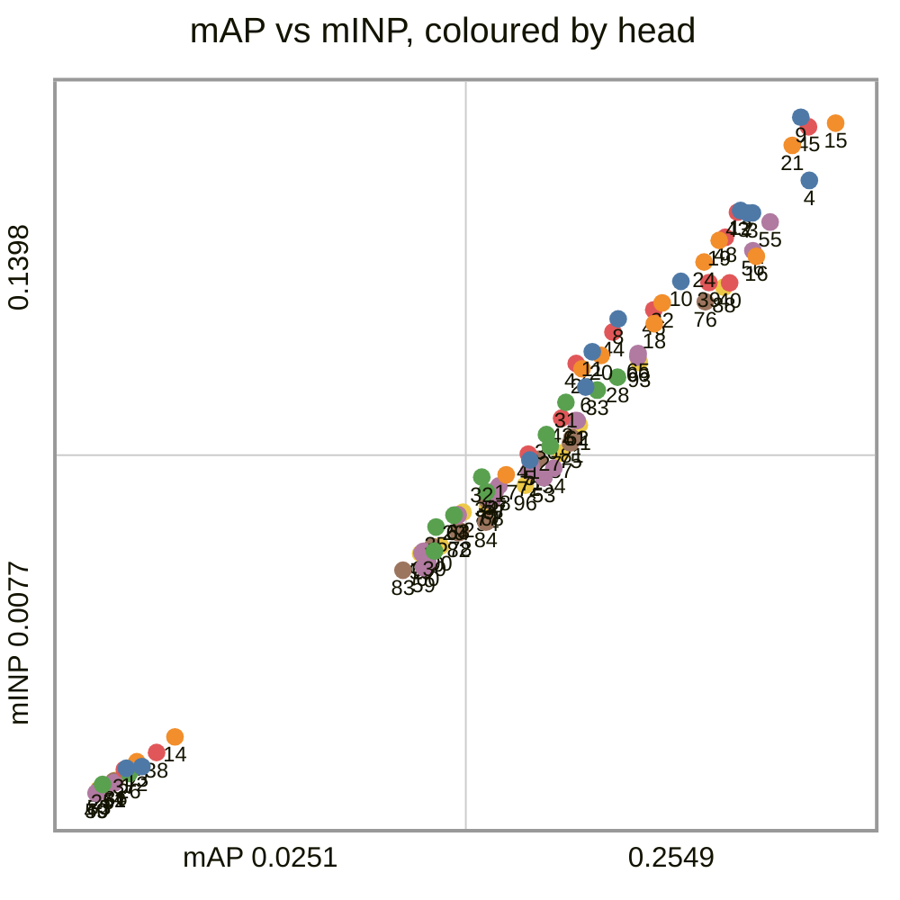
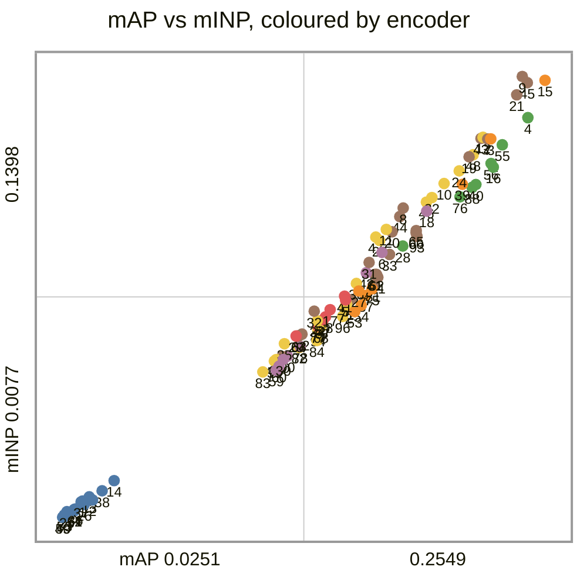
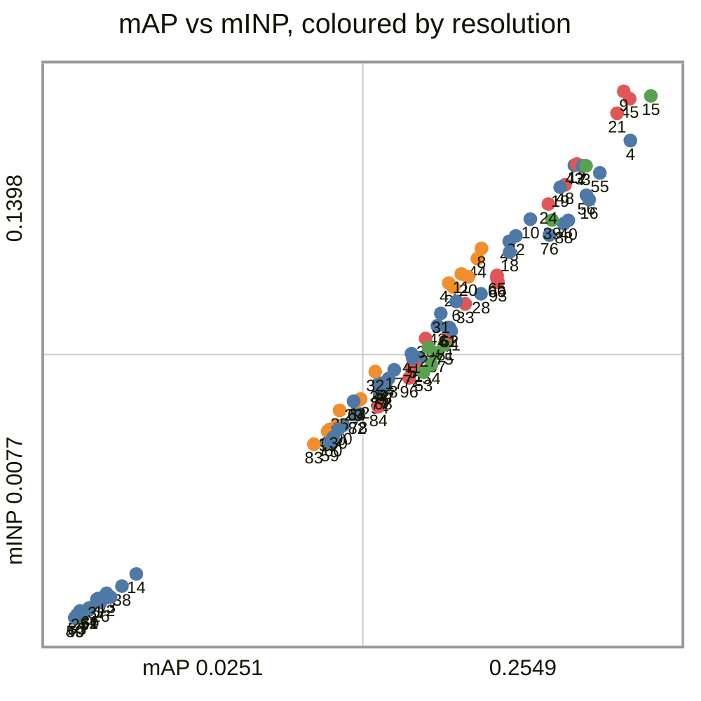

```mermaid
%%{init: {"themeVariables": {"xyChart": {"backgroundColor": "transparent", "plotColorPalette": "#4e79a7,#f28e2b,#59a14f,#e15759,#b07aa1,#9c755f,#edc948"}}, "xyChart": {"height": 1600, "width": 1320, "yAxis": {"showLabel": false}}}}%%
xychart-beta horizontal
    title "mAP, coloured by encoder"
    x-axis ["224x224 arcface vit_base_patch16_clip_224.openai crop · 3.46%", "224x224 arcface vit_base_patch16_clip_224.openai squash · 3.94%", "224x224 arcface vit_huge_plus_patch16_dinov3.lvd1689m squash · 24.67%", "224x224 arcface vit_large_patch16_dinov3.lvd1689m squash · 15.99%", "224x224 arcface vit_so400m_patch14_siglip_224.v2_webli squash · 17.72%", "224x224 arcface c-radio_v4-h squash · 22.76%", "224x224 arcface c-radio_v4-so400m squash · 20.68%", "224x224 arcface-msmt17 vit_base_patch16_clip_224.openai crop · 3.78%", "224x224 arcface-msmt17 vit_base_patch16_clip_224.openai squash · 4.97%", "224x224 arcface-msmt17 vit_huge_plus_patch16_dinov3.lvd1689m squash · 23.03%", "224x224 arcface-msmt17 vit_large_patch16_dinov3.lvd1689m squash · 15.26%", "224x224 arcface-msmt17 vit_so400m_patch14_siglip_224.v2_webli squash · 19.85%", "224x224 arcface-msmt17 c-radio_v4-h squash · 21.87%", "224x224 arcface-msmt17 c-radio_v4-so400m squash · 20.10%", "224x224 linear vit_base_patch16_clip_224.openai crop · 2.72%", "224x224 linear vit_base_patch16_clip_224.openai squash · 3.54%", "224x224 linear vit_huge_plus_patch16_dinov3.lvd1689m squash · 18.71%", "224x224 linear vit_large_patch16_dinov3.lvd1689m squash · 13.63%", "224x224 linear vit_so400m_patch14_siglip_224.v2_webli squash · 13.03%", "224x224 linear c-radio_v4-h squash · 17.11%", "224x224 linear c-radio_v4-so400m squash · 14.64%", "224x224 linear-msmt17 vit_base_patch16_clip_224.openai crop · 3.39%", "224x224 linear-msmt17 vit_base_patch16_clip_224.openai squash · 4.40%", "224x224 linear-msmt17 vit_huge_plus_patch16_dinov3.lvd1689m squash · 22.20%", "224x224 linear-msmt17 vit_large_patch16_dinov3.lvd1689m squash · 15.94%", "224x224 linear-msmt17 vit_so400m_patch14_siglip_224.v2_webli squash · 16.98%", "224x224 linear-msmt17 c-radio_v4-h squash · 22.44%", "224x224 linear-msmt17 c-radio_v4-so400m squash · 19.84%", "224x224 none vit_base_patch16_clip_224.openai crop · 2.51%", "224x224 none vit_base_patch16_clip_224.openai crop · 2.53%", "224x224 none vit_base_patch16_clip_224.openai squash · 3.08%", "224x224 none vit_base_patch16_clip_224.openai squash · 3.08%", "224x224 none vit_huge_plus_patch16_dinov3.lvd1689m squash · 23.46%", "224x224 none vit_huge_plus_patch16_dinov3.lvd1689m squash · 22.92%", "224x224 none vit_large_patch16_dinov3.lvd1689m squash · 14.92%", "224x224 none vit_large_patch16_dinov3.lvd1689m squash · 15.03%", "224x224 none vit_so400m_patch14_siglip_224.v2_webli squash · 12.69%", "224x224 none vit_so400m_patch14_siglip_224.v2_webli squash · 12.82%", "224x224 none c-radio_v4-h squash · 17.39%", "224x224 none c-radio_v4-h squash · 17.46%", "224x224 none c-radio_v4-so400m squash · 14.89%", "224x224 none c-radio_v4-so400m squash · 14.82%", "224x224 pca vit_base_patch16_clip_224.openai crop · 2.61%", "224x224 pca vit_base_patch16_clip_224.openai squash · 3.06%", "224x224 pca vit_huge_plus_patch16_dinov3.lvd1689m squash · 21.44%", "224x224 pca vit_large_patch16_dinov3.lvd1689m squash · 14.68%", "224x224 pca vit_so400m_patch14_siglip_224.v2_webli squash · 13.83%", "224x224 pca c-radio_v4-h squash · 16.25%", "224x224 pca c-radio_v4-so400m squash · 13.78%", "224x224 pca-msmt17 vit_base_patch16_clip_224.openai crop · 2.60%", "224x224 pca-msmt17 vit_base_patch16_clip_224.openai squash · 3.12%", "224x224 pca-msmt17 vit_huge_plus_patch16_dinov3.lvd1689m squash · 22.02%", "224x224 pca-msmt17 vit_large_patch16_dinov3.lvd1689m squash · 14.68%", "224x224 pca-msmt17 vit_so400m_patch14_siglip_224.v2_webli squash · 13.22%", "224x224 pca-msmt17 c-radio_v4-h squash · 17.53%", "224x224 pca-msmt17 c-radio_v4-so400m squash · 14.67%", "256x128 arcface c-radio_v4-h squash · 18.73%", "256x128 arcface c-radio_v4-so400m squash · 17.93%", "256x128 arcface-msmt17 c-radio_v4-h squash · 18.20%", "256x128 arcface-msmt17 c-radio_v4-so400m squash · 17.61%", "256x128 linear c-radio_v4-h squash · 14.50%", "256x128 linear c-radio_v4-so400m squash · 13.08%", "256x128 linear-msmt17 c-radio_v4-h squash · 18.57%", "256x128 linear-msmt17 c-radio_v4-so400m squash · 17.43%", "256x128 none c-radio_v4-h squash · 13.76%", "256x128 none c-radio_v4-h squash · 13.75%", "256x128 none c-radio_v4-so400m squash · 12.68%", "256x128 none c-radio_v4-so400m squash · 12.64%", "256x128 pca c-radio_v4-h squash · 12.97%", "256x128 pca c-radio_v4-so400m squash · 12.05%", "256x128 pca-msmt17 c-radio_v4-h squash · 13.92%", "256x128 pca-msmt17 c-radio_v4-so400m squash · 12.60%", "256x256 arcface vit_giantopt_patch16_siglip_256.v2_webli squash · 22.90%", "256x256 arcface-msmt17 vit_giantopt_patch16_siglip_256.v2_webli squash · 25.49%", "256x256 linear vit_giantopt_patch16_siglip_256.v2_webli squash · 16.62%", "256x256 linear-msmt17 vit_giantopt_patch16_siglip_256.v2_webli squash · 21.55%", "256x256 none vit_giantopt_patch16_siglip_256.v2_webli squash · 16.42%", "256x256 none vit_giantopt_patch16_siglip_256.v2_webli squash · 16.73%", "256x256 pca vit_giantopt_patch16_siglip_256.v2_webli squash · 17.25%", "256x256 pca-msmt17 vit_giantopt_patch16_siglip_256.v2_webli squash · 16.96%", "native arcface c-radio_v4-h squash · 24.41%", "native arcface c-radio_v4-so400m squash · 22.54%", "native arcface-msmt17 c-radio_v4-h squash · 24.14%", "native arcface-msmt17 c-radio_v4-so400m squash · 21.40%", "native linear c-radio_v4-h squash · 18.08%", "native linear c-radio_v4-so400m squash · 16.51%", "native linear-msmt17 c-radio_v4-h squash · 24.65%", "native linear-msmt17 c-radio_v4-so400m squash · 22.06%", "native none c-radio_v4-h squash · 19.36%", "native none c-radio_v4-h squash · 19.35%", "native none c-radio_v4-so400m squash · 16.03%", "native none c-radio_v4-so400m squash · 15.96%", "native pca c-radio_v4-h squash · 17.30%", "native pca c-radio_v4-so400m squash · 14.62%", "native pca-msmt17 c-radio_v4-h squash · 19.39%", "native pca-msmt17 c-radio_v4-so400m squash · 15.85%"]
    y-axis "mAP (%)" 0 --> 26.76
    bar [3.46, 3.94, 0.00, 0.00, 0.00, 0.00, 0.00, 3.78, 4.97, 0.00, 0.00, 0.00, 0.00, 0.00, 2.72, 3.54, 0.00, 0.00, 0.00, 0.00, 0.00, 3.39, 4.40, 0.00, 0.00, 0.00, 0.00, 0.00, 2.51, 2.53, 3.08, 3.08, 0.00, 0.00, 0.00, 0.00, 0.00, 0.00, 0.00, 0.00, 0.00, 0.00, 2.61, 3.06, 0.00, 0.00, 0.00, 0.00, 0.00, 2.60, 3.12, 0.00, 0.00, 0.00, 0.00, 0.00, 0.00, 0.00, 0.00, 0.00, 0.00, 0.00, 0.00, 0.00, 0.00, 0.00, 0.00, 0.00, 0.00, 0.00, 0.00, 0.00, 0.00, 0.00, 0.00, 0.00, 0.00, 0.00, 0.00, 0.00, 0.00, 0.00, 0.00, 0.00, 0.00, 0.00, 0.00, 0.00, 0.00, 0.00, 0.00, 0.00, 0.00, 0.00, 0.00, 0.00]
    bar [0.00, 0.00, 0.00, 0.00, 0.00, 0.00, 0.00, 0.00, 0.00, 0.00, 0.00, 0.00, 0.00, 0.00, 0.00, 0.00, 0.00, 0.00, 0.00, 0.00, 0.00, 0.00, 0.00, 0.00, 0.00, 0.00, 0.00, 0.00, 0.00, 0.00, 0.00, 0.00, 0.00, 0.00, 0.00, 0.00, 0.00, 0.00, 0.00, 0.00, 0.00, 0.00, 0.00, 0.00, 0.00, 0.00, 0.00, 0.00, 0.00, 0.00, 0.00, 0.00, 0.00, 0.00, 0.00, 0.00, 0.00, 0.00, 0.00, 0.00, 0.00, 0.00, 0.00, 0.00, 0.00, 0.00, 0.00, 0.00, 0.00, 0.00, 0.00, 0.00, 22.90, 25.49, 16.62, 21.55, 16.42, 16.73, 17.25, 16.96, 0.00, 0.00, 0.00, 0.00, 0.00, 0.00, 0.00, 0.00, 0.00, 0.00, 0.00, 0.00, 0.00, 0.00, 0.00, 0.00]
    bar [0.00, 0.00, 24.67, 0.00, 0.00, 0.00, 0.00, 0.00, 0.00, 23.03, 0.00, 0.00, 0.00, 0.00, 0.00, 0.00, 18.71, 0.00, 0.00, 0.00, 0.00, 0.00, 0.00, 22.20, 0.00, 0.00, 0.00, 0.00, 0.00, 0.00, 0.00, 0.00, 23.46, 22.92, 0.00, 0.00, 0.00, 0.00, 0.00, 0.00, 0.00, 0.00, 0.00, 0.00, 21.44, 0.00, 0.00, 0.00, 0.00, 0.00, 0.00, 22.02, 0.00, 0.00, 0.00, 0.00, 0.00, 0.00, 0.00, 0.00, 0.00, 0.00, 0.00, 0.00, 0.00, 0.00, 0.00, 0.00, 0.00, 0.00, 0.00, 0.00, 0.00, 0.00, 0.00, 0.00, 0.00, 0.00, 0.00, 0.00, 0.00, 0.00, 0.00, 0.00, 0.00, 0.00, 0.00, 0.00, 0.00, 0.00, 0.00, 0.00, 0.00, 0.00, 0.00, 0.00]
    bar [0.00, 0.00, 0.00, 15.99, 0.00, 0.00, 0.00, 0.00, 0.00, 0.00, 15.26, 0.00, 0.00, 0.00, 0.00, 0.00, 0.00, 13.63, 0.00, 0.00, 0.00, 0.00, 0.00, 0.00, 15.94, 0.00, 0.00, 0.00, 0.00, 0.00, 0.00, 0.00, 0.00, 0.00, 14.92, 15.03, 0.00, 0.00, 0.00, 0.00, 0.00, 0.00, 0.00, 0.00, 0.00, 14.68, 0.00, 0.00, 0.00, 0.00, 0.00, 0.00, 14.68, 0.00, 0.00, 0.00, 0.00, 0.00, 0.00, 0.00, 0.00, 0.00, 0.00, 0.00, 0.00, 0.00, 0.00, 0.00, 0.00, 0.00, 0.00, 0.00, 0.00, 0.00, 0.00, 0.00, 0.00, 0.00, 0.00, 0.00, 0.00, 0.00, 0.00, 0.00, 0.00, 0.00, 0.00, 0.00, 0.00, 0.00, 0.00, 0.00, 0.00, 0.00, 0.00, 0.00]
    bar [0.00, 0.00, 0.00, 0.00, 17.72, 0.00, 0.00, 0.00, 0.00, 0.00, 0.00, 19.85, 0.00, 0.00, 0.00, 0.00, 0.00, 0.00, 13.03, 0.00, 0.00, 0.00, 0.00, 0.00, 0.00, 16.98, 0.00, 0.00, 0.00, 0.00, 0.00, 0.00, 0.00, 0.00, 0.00, 0.00, 12.69, 12.82, 0.00, 0.00, 0.00, 0.00, 0.00, 0.00, 0.00, 0.00, 13.83, 0.00, 0.00, 0.00, 0.00, 0.00, 0.00, 13.22, 0.00, 0.00, 0.00, 0.00, 0.00, 0.00, 0.00, 0.00, 0.00, 0.00, 0.00, 0.00, 0.00, 0.00, 0.00, 0.00, 0.00, 0.00, 0.00, 0.00, 0.00, 0.00, 0.00, 0.00, 0.00, 0.00, 0.00, 0.00, 0.00, 0.00, 0.00, 0.00, 0.00, 0.00, 0.00, 0.00, 0.00, 0.00, 0.00, 0.00, 0.00, 0.00]
    bar [0.00, 0.00, 0.00, 0.00, 0.00, 22.76, 0.00, 0.00, 0.00, 0.00, 0.00, 0.00, 21.87, 0.00, 0.00, 0.00, 0.00, 0.00, 0.00, 17.11, 0.00, 0.00, 0.00, 0.00, 0.00, 0.00, 22.44, 0.00, 0.00, 0.00, 0.00, 0.00, 0.00, 0.00, 0.00, 0.00, 0.00, 0.00, 17.39, 17.46, 0.00, 0.00, 0.00, 0.00, 0.00, 0.00, 0.00, 16.25, 0.00, 0.00, 0.00, 0.00, 0.00, 0.00, 17.53, 0.00, 18.73, 0.00, 18.20, 0.00, 14.50, 0.00, 18.57, 0.00, 13.76, 13.75, 0.00, 0.00, 12.97, 0.00, 13.92, 0.00, 0.00, 0.00, 0.00, 0.00, 0.00, 0.00, 0.00, 0.00, 24.41, 0.00, 24.14, 0.00, 18.08, 0.00, 24.65, 0.00, 19.36, 19.35, 0.00, 0.00, 17.30, 0.00, 19.39, 0.00]
    bar [0.00, 0.00, 0.00, 0.00, 0.00, 0.00, 20.68, 0.00, 0.00, 0.00, 0.00, 0.00, 0.00, 20.10, 0.00, 0.00, 0.00, 0.00, 0.00, 0.00, 14.64, 0.00, 0.00, 0.00, 0.00, 0.00, 0.00, 19.84, 0.00, 0.00, 0.00, 0.00, 0.00, 0.00, 0.00, 0.00, 0.00, 0.00, 0.00, 0.00, 14.89, 14.82, 0.00, 0.00, 0.00, 0.00, 0.00, 0.00, 13.78, 0.00, 0.00, 0.00, 0.00, 0.00, 0.00, 14.67, 0.00, 17.93, 0.00, 17.61, 0.00, 13.08, 0.00, 17.43, 0.00, 0.00, 12.68, 12.64, 0.00, 12.05, 0.00, 12.60, 0.00, 0.00, 0.00, 0.00, 0.00, 0.00, 0.00, 0.00, 0.00, 22.54, 0.00, 21.40, 0.00, 16.51, 0.00, 22.06, 0.00, 0.00, 16.03, 15.96, 0.00, 14.62, 0.00, 15.85]
```

<!-- generated by `reidbench render`; edit the runs, not this file -->

# vrai

[← table.md](../table.md)

## vrai/train-cross-camera@1

### 🟦 arcface

|  # | encoder                                       | resolution | resize |        mAP |         R1 |         R5 |        R10 |       mINP |
|---:|-----------------------------------------------|------------|--------|-----------:|-----------:|-----------:|-----------:|-----------:|
|  1 | timm:vit_base_patch16_clip_224.openai         | 224x224    | crop   |     0.0346 |     0.0473 |     0.0925 |     0.1204 |     0.0125 |
|  2 | timm:vit_base_patch16_clip_224.openai         | 224x224    | squash |     0.0394 |     0.0520 |     0.1065 |     0.1425 |     0.0129 |
|  3 | timm:vit_giantopt_patch16_siglip_256.v2_webli | 256x256    | squash |     0.2290 |     0.2705 |     0.4321 |     0.5054 |     0.1211 |
|  4 | timm:vit_huge_plus_patch16_dinov3.lvd1689m    | 224x224    | squash | **0.2467** | **0.3072** | **0.4573** | **0.5259** |     0.1275 |
|  5 | timm:vit_large_patch16_dinov3.lvd1689m        | 224x224    | squash |     0.1599 |     0.2087 |     0.3177 |     0.3734 |     0.0728 |
|  6 | timm:vit_so400m_patch14_siglip_224.v2_webli   | 224x224    | squash |     0.1772 |     0.2155 |     0.3562 |     0.4156 |     0.0871 |
|  7 | torchhub:NVlabs/RADIO/c-radio_v4-h            | 224x224    | squash |     0.2276 |     0.2685 |     0.4083 |     0.4813 |     0.1211 |
|  8 | torchhub:NVlabs/RADIO/c-radio_v4-h            | 256x128    | squash |     0.1873 |     0.2204 |     0.3502 |     0.4184 |     0.1004 |
|  9 | torchhub:NVlabs/RADIO/c-radio_v4-h            | native     | squash |     0.2441 |     0.2828 |     0.4294 |     0.5005 | **0.1398** |
| 10 | torchhub:NVlabs/RADIO/c-radio_v4-so400m       | 224x224    | squash |     0.2068 |     0.2442 |     0.3808 |     0.4519 |     0.1077 |
| 11 | torchhub:NVlabs/RADIO/c-radio_v4-so400m       | 256x128    | squash |     0.1793 |     0.2129 |     0.3426 |     0.4099 |     0.0940 |
| 12 | torchhub:NVlabs/RADIO/c-radio_v4-so400m       | native     | squash |     0.2254 |     0.2663 |     0.4081 |     0.4746 |     0.1216 |

### 🟧 arcface-msmt17

|  # | encoder                                       | resolution | resize |        mAP |         R1 |         R5 |        R10 |       mINP |
|---:|-----------------------------------------------|------------|--------|-----------:|-----------:|-----------:|-----------:|-----------:|
| 13 | timm:vit_base_patch16_clip_224.openai         | 224x224    | crop   |     0.0378 |     0.0498 |     0.1041 |     0.1346 |     0.0138 |
| 14 | timm:vit_base_patch16_clip_224.openai         | 224x224    | squash |     0.0497 |     0.0641 |     0.1225 |     0.1587 |     0.0187 |
| 15 | timm:vit_giantopt_patch16_siglip_256.v2_webli | 256x256    | squash | **0.2549** | **0.3031** | **0.4616** | **0.5344** | **0.1387** |
| 16 | timm:vit_huge_plus_patch16_dinov3.lvd1689m    | 224x224    | squash |     0.2303 |     0.2924 |     0.4372 |     0.5148 |     0.1126 |
| 17 | timm:vit_large_patch16_dinov3.lvd1689m        | 224x224    | squash |     0.1526 |     0.1985 |     0.3010 |     0.3507 |     0.0699 |
| 18 | timm:vit_so400m_patch14_siglip_224.v2_webli   | 224x224    | squash |     0.1985 |     0.2429 |     0.3773 |     0.4475 |     0.0994 |
| 19 | torchhub:NVlabs/RADIO/c-radio_v4-h            | 224x224    | squash |     0.2187 |     0.2555 |     0.4073 |     0.4805 |     0.1157 |
| 20 | torchhub:NVlabs/RADIO/c-radio_v4-h            | 256x128    | squash |     0.1820 |     0.2163 |     0.3494 |     0.4132 |     0.0932 |
| 21 | torchhub:NVlabs/RADIO/c-radio_v4-h            | native     | squash |     0.2414 |     0.2856 |     0.4280 |     0.5010 |     0.1343 |
| 22 | torchhub:NVlabs/RADIO/c-radio_v4-so400m       | 224x224    | squash |     0.2010 |     0.2388 |     0.3688 |     0.4419 |     0.1035 |
| 23 | torchhub:NVlabs/RADIO/c-radio_v4-so400m       | 256x128    | squash |     0.1761 |     0.2098 |     0.3415 |     0.4111 |     0.0906 |
| 24 | torchhub:NVlabs/RADIO/c-radio_v4-so400m       | native     | squash |     0.2140 |     0.2550 |     0.3943 |     0.4589 |     0.1115 |

### 🟩 linear

|  # | encoder                                       | resolution | resize |        mAP |         R1 |         R5 |        R10 |       mINP |
|---:|-----------------------------------------------|------------|--------|-----------:|-----------:|-----------:|-----------:|-----------:|
| 25 | timm:vit_base_patch16_clip_224.openai         | 224x224    | crop   |     0.0272 |     0.0322 |     0.0797 |     0.1028 |     0.0094 |
| 26 | timm:vit_base_patch16_clip_224.openai         | 224x224    | squash |     0.0354 |     0.0473 |     0.0955 |     0.1333 |     0.0115 |
| 27 | timm:vit_giantopt_patch16_siglip_256.v2_webli | 256x256    | squash |     0.1662 |     0.2137 |     0.3520 |     0.4199 |     0.0755 |
| 28 | timm:vit_huge_plus_patch16_dinov3.lvd1689m    | 224x224    | squash | **0.1871** | **0.2355** | **0.3718** | **0.4411** | **0.0890** |
| 29 | timm:vit_large_patch16_dinov3.lvd1689m        | 224x224    | squash |     0.1363 |     0.1788 |     0.2840 |     0.3394 |     0.0620 |
| 30 | timm:vit_so400m_patch14_siglip_224.v2_webli   | 224x224    | squash |     0.1303 |     0.1725 |     0.2910 |     0.3481 |     0.0550 |
| 31 | torchhub:NVlabs/RADIO/c-radio_v4-h            | 224x224    | squash |     0.1711 |     0.2093 |     0.3375 |     0.4067 |     0.0841 |
| 32 | torchhub:NVlabs/RADIO/c-radio_v4-h            | 256x128    | squash |     0.1450 |     0.1779 |     0.2936 |     0.3535 |     0.0694 |
| 33 | torchhub:NVlabs/RADIO/c-radio_v4-h            | native     | squash |     0.1808 |     0.2272 |     0.3585 |     0.4254 |     0.0865 |
| 34 | torchhub:NVlabs/RADIO/c-radio_v4-so400m       | 224x224    | squash |     0.1464 |     0.1847 |     0.3078 |     0.3651 |     0.0666 |
| 35 | torchhub:NVlabs/RADIO/c-radio_v4-so400m       | 256x128    | squash |     0.1308 |     0.1615 |     0.2747 |     0.3351 |     0.0597 |
| 36 | torchhub:NVlabs/RADIO/c-radio_v4-so400m       | native     | squash |     0.1651 |     0.2074 |     0.3350 |     0.3999 |     0.0778 |

### 🟥 linear-msmt17

|  # | encoder                                       | resolution | resize |        mAP |         R1 |         R5 |        R10 |       mINP |
|---:|-----------------------------------------------|------------|--------|-----------:|-----------:|-----------:|-----------:|-----------:|
| 37 | timm:vit_base_patch16_clip_224.openai         | 224x224    | crop   |     0.0339 |     0.0451 |     0.0935 |     0.1260 |     0.0123 |
| 38 | timm:vit_base_patch16_clip_224.openai         | 224x224    | squash |     0.0440 |     0.0598 |     0.1155 |     0.1553 |     0.0156 |
| 39 | timm:vit_giantopt_patch16_siglip_256.v2_webli | 256x256    | squash |     0.2155 |     0.2636 |     0.4110 |     0.4818 |     0.1075 |
| 40 | timm:vit_huge_plus_patch16_dinov3.lvd1689m    | 224x224    | squash |     0.2220 |     0.2866 |     0.4330 |     0.5010 |     0.1074 |
| 41 | timm:vit_large_patch16_dinov3.lvd1689m        | 224x224    | squash |     0.1594 |     0.2074 |     0.3110 |     0.3704 |     0.0740 |
| 42 | timm:vit_so400m_patch14_siglip_224.v2_webli   | 224x224    | squash |     0.1698 |     0.2110 |     0.3380 |     0.4064 |     0.0810 |
| 43 | torchhub:NVlabs/RADIO/c-radio_v4-h            | 224x224    | squash |     0.2244 |     0.2644 |     0.4045 |     0.4787 |     0.1212 |
| 44 | torchhub:NVlabs/RADIO/c-radio_v4-h            | 256x128    | squash |     0.1857 |     0.2163 |     0.3483 |     0.4242 |     0.0978 |
| 45 | torchhub:NVlabs/RADIO/c-radio_v4-h            | native     | squash | **0.2465** | **0.2924** | **0.4386** | **0.5103** | **0.1379** |
| 46 | torchhub:NVlabs/RADIO/c-radio_v4-so400m       | 224x224    | squash |     0.1984 |     0.2342 |     0.3696 |     0.4495 |     0.1022 |
| 47 | torchhub:NVlabs/RADIO/c-radio_v4-so400m       | 256x128    | squash |     0.1743 |     0.2052 |     0.3385 |     0.4032 |     0.0917 |
| 48 | torchhub:NVlabs/RADIO/c-radio_v4-so400m       | native     | squash |     0.2206 |     0.2644 |     0.4027 |     0.4738 |     0.1163 |

### 🟪 none

|  # | encoder                                       | resolution | resize |        mAP |         R1 |         R5 |        R10 |       mINP |
|---:|-----------------------------------------------|------------|--------|-----------:|-----------:|-----------:|-----------:|-----------:|
| 49 | timm:vit_base_patch16_clip_224.openai         | 224x224    | crop   |     0.0251 |     0.0349 |     0.0778 |     0.1043 |     0.0077 |
| 50 | timm:vit_base_patch16_clip_224.openai         | 224x224    | crop   |     0.0253 |     0.0357 |     0.0787 |     0.1035 |     0.0077 |
| 51 | timm:vit_base_patch16_clip_224.openai         | 224x224    | squash |     0.0308 |     0.0422 |     0.0897 |     0.1176 |     0.0097 |
| 52 | timm:vit_base_patch16_clip_224.openai         | 224x224    | squash |     0.0308 |     0.0425 |     0.0908 |     0.1187 |     0.0097 |
| 53 | timm:vit_giantopt_patch16_siglip_256.v2_webli | 256x256    | squash |     0.1642 |     0.2168 |     0.3561 |     0.4308 |     0.0693 |
| 54 | timm:vit_giantopt_patch16_siglip_256.v2_webli | 256x256    | squash |     0.1673 |     0.2175 |     0.3604 |     0.4332 |     0.0712 |
| 55 | timm:vit_huge_plus_patch16_dinov3.lvd1689m    | 224x224    | squash | **0.2346** | **0.2967** | **0.4348** | **0.5043** | **0.1193** |
| 56 | timm:vit_huge_plus_patch16_dinov3.lvd1689m    | 224x224    | squash |     0.2292 |     0.2932 |     0.4299 |     0.4994 |     0.1137 |
| 57 | timm:vit_large_patch16_dinov3.lvd1689m        | 224x224    | squash |     0.1492 |     0.1990 |     0.3061 |     0.3556 |     0.0669 |
| 58 | timm:vit_large_patch16_dinov3.lvd1689m        | 224x224    | squash |     0.1503 |     0.1991 |     0.3058 |     0.3578 |     0.0677 |
| 59 | timm:vit_so400m_patch14_siglip_224.v2_webli   | 224x224    | squash |     0.1269 |     0.1669 |     0.2815 |     0.3464 |     0.0518 |
| 60 | timm:vit_so400m_patch14_siglip_224.v2_webli   | 224x224    | squash |     0.1282 |     0.1671 |     0.2832 |     0.3483 |     0.0530 |
| 61 | torchhub:NVlabs/RADIO/c-radio_v4-h            | 224x224    | squash |     0.1739 |     0.2152 |     0.3510 |     0.4213 |     0.0805 |
| 62 | torchhub:NVlabs/RADIO/c-radio_v4-h            | 224x224    | squash |     0.1746 |     0.2171 |     0.3546 |     0.4232 |     0.0805 |
| 63 | torchhub:NVlabs/RADIO/c-radio_v4-h            | 256x128    | squash |     0.1376 |     0.1709 |     0.2850 |     0.3440 |     0.0621 |
| 64 | torchhub:NVlabs/RADIO/c-radio_v4-h            | 256x128    | squash |     0.1375 |     0.1717 |     0.2832 |     0.3450 |     0.0619 |
| 65 | torchhub:NVlabs/RADIO/c-radio_v4-h            | native     | squash |     0.1936 |     0.2421 |     0.3778 |     0.4434 |     0.0936 |
| 66 | torchhub:NVlabs/RADIO/c-radio_v4-h            | native     | squash |     0.1935 |     0.2423 |     0.3797 |     0.4440 |     0.0930 |
| 67 | torchhub:NVlabs/RADIO/c-radio_v4-so400m       | 224x224    | squash |     0.1489 |     0.1945 |     0.3077 |     0.3712 |     0.0661 |
| 68 | torchhub:NVlabs/RADIO/c-radio_v4-so400m       | 224x224    | squash |     0.1482 |     0.1947 |     0.3077 |     0.3699 |     0.0648 |
| 69 | torchhub:NVlabs/RADIO/c-radio_v4-so400m       | 256x128    | squash |     0.1268 |     0.1611 |     0.2745 |     0.3364 |     0.0550 |
| 70 | torchhub:NVlabs/RADIO/c-radio_v4-so400m       | 256x128    | squash |     0.1264 |     0.1593 |     0.2744 |     0.3383 |     0.0546 |
| 71 | torchhub:NVlabs/RADIO/c-radio_v4-so400m       | native     | squash |     0.1603 |     0.2050 |     0.3304 |     0.3937 |     0.0716 |
| 72 | torchhub:NVlabs/RADIO/c-radio_v4-so400m       | native     | squash |     0.1596 |     0.2047 |     0.3318 |     0.3938 |     0.0706 |

### 🟫 pca

|  # | encoder                                       | resolution | resize |        mAP |         R1 |         R5 |        R10 |       mINP |
|---:|-----------------------------------------------|------------|--------|-----------:|-----------:|-----------:|-----------:|-----------:|
| 73 | timm:vit_base_patch16_clip_224.openai         | 224x224    | crop   |     0.0261 |     0.0348 |     0.0754 |     0.1052 |     0.0083 |
| 74 | timm:vit_base_patch16_clip_224.openai         | 224x224    | squash |     0.0306 |     0.0408 |     0.0874 |     0.1157 |     0.0100 |
| 75 | timm:vit_giantopt_patch16_siglip_256.v2_webli | 256x256    | squash |     0.1725 |     0.2199 |     0.3646 |     0.4384 |     0.0761 |
| 76 | timm:vit_huge_plus_patch16_dinov3.lvd1689m    | 224x224    | squash | **0.2144** | **0.2755** | **0.4126** | **0.4816** | **0.1037** |
| 77 | timm:vit_large_patch16_dinov3.lvd1689m        | 224x224    | squash |     0.1468 |     0.1947 |     0.3005 |     0.3524 |     0.0649 |
| 78 | timm:vit_so400m_patch14_siglip_224.v2_webli   | 224x224    | squash |     0.1383 |     0.1806 |     0.2951 |     0.3662 |     0.0589 |
| 79 | torchhub:NVlabs/RADIO/c-radio_v4-h            | 224x224    | squash |     0.1625 |     0.2063 |     0.3286 |     0.3950 |     0.0729 |
| 80 | torchhub:NVlabs/RADIO/c-radio_v4-h            | 256x128    | squash |     0.1297 |     0.1634 |     0.2755 |     0.3305 |     0.0559 |
| 81 | torchhub:NVlabs/RADIO/c-radio_v4-h            | native     | squash |     0.1730 |     0.2236 |     0.3551 |     0.4207 |     0.0771 |
| 82 | torchhub:NVlabs/RADIO/c-radio_v4-so400m       | 224x224    | squash |     0.1378 |     0.1798 |     0.2934 |     0.3542 |     0.0586 |
| 83 | torchhub:NVlabs/RADIO/c-radio_v4-so400m       | 256x128    | squash |     0.1205 |     0.1533 |     0.2604 |     0.3202 |     0.0512 |
| 84 | torchhub:NVlabs/RADIO/c-radio_v4-so400m       | native     | squash |     0.1462 |     0.1928 |     0.3167 |     0.3743 |     0.0606 |

### 🟨 pca-msmt17

|  # | encoder                                       | resolution | resize |        mAP |         R1 |         R5 |        R10 |       mINP |
|---:|-----------------------------------------------|------------|--------|-----------:|-----------:|-----------:|-----------:|-----------:|
| 85 | timm:vit_base_patch16_clip_224.openai         | 224x224    | crop   |     0.0260 |     0.0349 |     0.0762 |     0.1071 |     0.0084 |
| 86 | timm:vit_base_patch16_clip_224.openai         | 224x224    | squash |     0.0312 |     0.0425 |     0.0893 |     0.1166 |     0.0102 |
| 87 | timm:vit_giantopt_patch16_siglip_256.v2_webli | 256x256    | squash |     0.1696 |     0.2182 |     0.3619 |     0.4367 |     0.0742 |
| 88 | timm:vit_huge_plus_patch16_dinov3.lvd1689m    | 224x224    | squash | **0.2202** | **0.2821** | **0.4221** | **0.4913** | **0.1066** |
| 89 | timm:vit_large_patch16_dinov3.lvd1689m        | 224x224    | squash |     0.1468 |     0.1952 |     0.3024 |     0.3513 |     0.0650 |
| 90 | timm:vit_so400m_patch14_siglip_224.v2_webli   | 224x224    | squash |     0.1322 |     0.1709 |     0.2874 |     0.3527 |     0.0560 |
| 91 | torchhub:NVlabs/RADIO/c-radio_v4-h            | 224x224    | squash |     0.1753 |     0.2204 |     0.3510 |     0.4213 |     0.0796 |
| 92 | torchhub:NVlabs/RADIO/c-radio_v4-h            | 256x128    | squash |     0.1392 |     0.1712 |     0.2885 |     0.3497 |     0.0626 |
| 93 | torchhub:NVlabs/RADIO/c-radio_v4-h            | native     | squash |     0.1939 |     0.2458 |     0.3850 |     0.4480 |     0.0919 |
| 94 | torchhub:NVlabs/RADIO/c-radio_v4-so400m       | 224x224    | squash |     0.1467 |     0.1888 |     0.3072 |     0.3677 |     0.0638 |
| 95 | torchhub:NVlabs/RADIO/c-radio_v4-so400m       | 256x128    | squash |     0.1260 |     0.1587 |     0.2747 |     0.3383 |     0.0545 |
| 96 | torchhub:NVlabs/RADIO/c-radio_v4-so400m       | native     | squash |     0.1585 |     0.2088 |     0.3348 |     0.3962 |     0.0678 |

### Every row, by encoder and resolution

```mermaid
%%{init: {"themeVariables": {"xyChart": {"backgroundColor": "transparent", "plotColorPalette": "#4e79a7,#f28e2b,#59a14f,#e15759,#b07aa1,#9c755f,#edc948"}}, "xyChart": {"height": 1600, "width": 1320, "yAxis": {"showLabel": false}}}}%%
xychart-beta horizontal
    title "mAP, coloured by head"
    x-axis ["vit_base_patch16_clip_224.openai 224x224 arcface crop · 3.46%", "vit_base_patch16_clip_224.openai 224x224 arcface squash · 3.94%", "vit_base_patch16_clip_224.openai 224x224 arcface-msmt17 crop · 3.78%", "vit_base_patch16_clip_224.openai 224x224 arcface-msmt17 squash · 4.97%", "vit_base_patch16_clip_224.openai 224x224 linear crop · 2.72%", "vit_base_patch16_clip_224.openai 224x224 linear squash · 3.54%", "vit_base_patch16_clip_224.openai 224x224 linear-msmt17 crop · 3.39%", "vit_base_patch16_clip_224.openai 224x224 linear-msmt17 squash · 4.40%", "vit_base_patch16_clip_224.openai 224x224 none crop · 2.51%", "vit_base_patch16_clip_224.openai 224x224 none crop · 2.53%", "vit_base_patch16_clip_224.openai 224x224 none squash · 3.08%", "vit_base_patch16_clip_224.openai 224x224 none squash · 3.08%", "vit_base_patch16_clip_224.openai 224x224 pca crop · 2.61%", "vit_base_patch16_clip_224.openai 224x224 pca squash · 3.06%", "vit_base_patch16_clip_224.openai 224x224 pca-msmt17 crop · 2.60%", "vit_base_patch16_clip_224.openai 224x224 pca-msmt17 squash · 3.12%", "vit_giantopt_patch16_siglip_256.v2_webli 256x256 arcface squash · 22.90%", "vit_giantopt_patch16_siglip_256.v2_webli 256x256 arcface-msmt17 squash · 25.49%", "vit_giantopt_patch16_siglip_256.v2_webli 256x256 linear squash · 16.62%", "vit_giantopt_patch16_siglip_256.v2_webli 256x256 linear-msmt17 squash · 21.55%", "vit_giantopt_patch16_siglip_256.v2_webli 256x256 none squash · 16.42%", "vit_giantopt_patch16_siglip_256.v2_webli 256x256 none squash · 16.73%", "vit_giantopt_patch16_siglip_256.v2_webli 256x256 pca squash · 17.25%", "vit_giantopt_patch16_siglip_256.v2_webli 256x256 pca-msmt17 squash · 16.96%", "vit_huge_plus_patch16_dinov3.lvd1689m 224x224 arcface squash · 24.67%", "vit_huge_plus_patch16_dinov3.lvd1689m 224x224 arcface-msmt17 squash · 23.03%", "vit_huge_plus_patch16_dinov3.lvd1689m 224x224 linear squash · 18.71%", "vit_huge_plus_patch16_dinov3.lvd1689m 224x224 linear-msmt17 squash · 22.20%", "vit_huge_plus_patch16_dinov3.lvd1689m 224x224 none squash · 23.46%", "vit_huge_plus_patch16_dinov3.lvd1689m 224x224 none squash · 22.92%", "vit_huge_plus_patch16_dinov3.lvd1689m 224x224 pca squash · 21.44%", "vit_huge_plus_patch16_dinov3.lvd1689m 224x224 pca-msmt17 squash · 22.02%", "vit_large_patch16_dinov3.lvd1689m 224x224 arcface squash · 15.99%", "vit_large_patch16_dinov3.lvd1689m 224x224 arcface-msmt17 squash · 15.26%", "vit_large_patch16_dinov3.lvd1689m 224x224 linear squash · 13.63%", "vit_large_patch16_dinov3.lvd1689m 224x224 linear-msmt17 squash · 15.94%", "vit_large_patch16_dinov3.lvd1689m 224x224 none squash · 14.92%", "vit_large_patch16_dinov3.lvd1689m 224x224 none squash · 15.03%", "vit_large_patch16_dinov3.lvd1689m 224x224 pca squash · 14.68%", "vit_large_patch16_dinov3.lvd1689m 224x224 pca-msmt17 squash · 14.68%", "vit_so400m_patch14_siglip_224.v2_webli 224x224 arcface squash · 17.72%", "vit_so400m_patch14_siglip_224.v2_webli 224x224 arcface-msmt17 squash · 19.85%", "vit_so400m_patch14_siglip_224.v2_webli 224x224 linear squash · 13.03%", "vit_so400m_patch14_siglip_224.v2_webli 224x224 linear-msmt17 squash · 16.98%", "vit_so400m_patch14_siglip_224.v2_webli 224x224 none squash · 12.69%", "vit_so400m_patch14_siglip_224.v2_webli 224x224 none squash · 12.82%", "vit_so400m_patch14_siglip_224.v2_webli 224x224 pca squash · 13.83%", "vit_so400m_patch14_siglip_224.v2_webli 224x224 pca-msmt17 squash · 13.22%", "c-radio_v4-h 224x224 arcface squash · 22.76%", "c-radio_v4-h 224x224 arcface-msmt17 squash · 21.87%", "c-radio_v4-h 224x224 linear squash · 17.11%", "c-radio_v4-h 224x224 linear-msmt17 squash · 22.44%", "c-radio_v4-h 224x224 none squash · 17.39%", "c-radio_v4-h 224x224 none squash · 17.46%", "c-radio_v4-h 224x224 pca squash · 16.25%", "c-radio_v4-h 224x224 pca-msmt17 squash · 17.53%", "c-radio_v4-h 256x128 arcface squash · 18.73%", "c-radio_v4-h 256x128 arcface-msmt17 squash · 18.20%", "c-radio_v4-h 256x128 linear squash · 14.50%", "c-radio_v4-h 256x128 linear-msmt17 squash · 18.57%", "c-radio_v4-h 256x128 none squash · 13.76%", "c-radio_v4-h 256x128 none squash · 13.75%", "c-radio_v4-h 256x128 pca squash · 12.97%", "c-radio_v4-h 256x128 pca-msmt17 squash · 13.92%", "c-radio_v4-h native arcface squash · 24.41%", "c-radio_v4-h native arcface-msmt17 squash · 24.14%", "c-radio_v4-h native linear squash · 18.08%", "c-radio_v4-h native linear-msmt17 squash · 24.65%", "c-radio_v4-h native none squash · 19.36%", "c-radio_v4-h native none squash · 19.35%", "c-radio_v4-h native pca squash · 17.30%", "c-radio_v4-h native pca-msmt17 squash · 19.39%", "c-radio_v4-so400m 224x224 arcface squash · 20.68%", "c-radio_v4-so400m 224x224 arcface-msmt17 squash · 20.10%", "c-radio_v4-so400m 224x224 linear squash · 14.64%", "c-radio_v4-so400m 224x224 linear-msmt17 squash · 19.84%", "c-radio_v4-so400m 224x224 none squash · 14.89%", "c-radio_v4-so400m 224x224 none squash · 14.82%", "c-radio_v4-so400m 224x224 pca squash · 13.78%", "c-radio_v4-so400m 224x224 pca-msmt17 squash · 14.67%", "c-radio_v4-so400m 256x128 arcface squash · 17.93%", "c-radio_v4-so400m 256x128 arcface-msmt17 squash · 17.61%", "c-radio_v4-so400m 256x128 linear squash · 13.08%", "c-radio_v4-so400m 256x128 linear-msmt17 squash · 17.43%", "c-radio_v4-so400m 256x128 none squash · 12.68%", "c-radio_v4-so400m 256x128 none squash · 12.64%", "c-radio_v4-so400m 256x128 pca squash · 12.05%", "c-radio_v4-so400m 256x128 pca-msmt17 squash · 12.60%", "c-radio_v4-so400m native arcface squash · 22.54%", "c-radio_v4-so400m native arcface-msmt17 squash · 21.40%", "c-radio_v4-so400m native linear squash · 16.51%", "c-radio_v4-so400m native linear-msmt17 squash · 22.06%", "c-radio_v4-so400m native none squash · 16.03%", "c-radio_v4-so400m native none squash · 15.96%", "c-radio_v4-so400m native pca squash · 14.62%", "c-radio_v4-so400m native pca-msmt17 squash · 15.85%"]
    y-axis "mAP (%)" 0 --> 26.76
    bar [3.46, 3.94, 0.00, 0.00, 0.00, 0.00, 0.00, 0.00, 0.00, 0.00, 0.00, 0.00, 0.00, 0.00, 0.00, 0.00, 22.90, 0.00, 0.00, 0.00, 0.00, 0.00, 0.00, 0.00, 24.67, 0.00, 0.00, 0.00, 0.00, 0.00, 0.00, 0.00, 15.99, 0.00, 0.00, 0.00, 0.00, 0.00, 0.00, 0.00, 17.72, 0.00, 0.00, 0.00, 0.00, 0.00, 0.00, 0.00, 22.76, 0.00, 0.00, 0.00, 0.00, 0.00, 0.00, 0.00, 18.73, 0.00, 0.00, 0.00, 0.00, 0.00, 0.00, 0.00, 24.41, 0.00, 0.00, 0.00, 0.00, 0.00, 0.00, 0.00, 20.68, 0.00, 0.00, 0.00, 0.00, 0.00, 0.00, 0.00, 17.93, 0.00, 0.00, 0.00, 0.00, 0.00, 0.00, 0.00, 22.54, 0.00, 0.00, 0.00, 0.00, 0.00, 0.00, 0.00]
    bar [0.00, 0.00, 3.78, 4.97, 0.00, 0.00, 0.00, 0.00, 0.00, 0.00, 0.00, 0.00, 0.00, 0.00, 0.00, 0.00, 0.00, 25.49, 0.00, 0.00, 0.00, 0.00, 0.00, 0.00, 0.00, 23.03, 0.00, 0.00, 0.00, 0.00, 0.00, 0.00, 0.00, 15.26, 0.00, 0.00, 0.00, 0.00, 0.00, 0.00, 0.00, 19.85, 0.00, 0.00, 0.00, 0.00, 0.00, 0.00, 0.00, 21.87, 0.00, 0.00, 0.00, 0.00, 0.00, 0.00, 0.00, 18.20, 0.00, 0.00, 0.00, 0.00, 0.00, 0.00, 0.00, 24.14, 0.00, 0.00, 0.00, 0.00, 0.00, 0.00, 0.00, 20.10, 0.00, 0.00, 0.00, 0.00, 0.00, 0.00, 0.00, 17.61, 0.00, 0.00, 0.00, 0.00, 0.00, 0.00, 0.00, 21.40, 0.00, 0.00, 0.00, 0.00, 0.00, 0.00]
    bar [0.00, 0.00, 0.00, 0.00, 2.72, 3.54, 0.00, 0.00, 0.00, 0.00, 0.00, 0.00, 0.00, 0.00, 0.00, 0.00, 0.00, 0.00, 16.62, 0.00, 0.00, 0.00, 0.00, 0.00, 0.00, 0.00, 18.71, 0.00, 0.00, 0.00, 0.00, 0.00, 0.00, 0.00, 13.63, 0.00, 0.00, 0.00, 0.00, 0.00, 0.00, 0.00, 13.03, 0.00, 0.00, 0.00, 0.00, 0.00, 0.00, 0.00, 17.11, 0.00, 0.00, 0.00, 0.00, 0.00, 0.00, 0.00, 14.50, 0.00, 0.00, 0.00, 0.00, 0.00, 0.00, 0.00, 18.08, 0.00, 0.00, 0.00, 0.00, 0.00, 0.00, 0.00, 14.64, 0.00, 0.00, 0.00, 0.00, 0.00, 0.00, 0.00, 13.08, 0.00, 0.00, 0.00, 0.00, 0.00, 0.00, 0.00, 16.51, 0.00, 0.00, 0.00, 0.00, 0.00]
    bar [0.00, 0.00, 0.00, 0.00, 0.00, 0.00, 3.39, 4.40, 0.00, 0.00, 0.00, 0.00, 0.00, 0.00, 0.00, 0.00, 0.00, 0.00, 0.00, 21.55, 0.00, 0.00, 0.00, 0.00, 0.00, 0.00, 0.00, 22.20, 0.00, 0.00, 0.00, 0.00, 0.00, 0.00, 0.00, 15.94, 0.00, 0.00, 0.00, 0.00, 0.00, 0.00, 0.00, 16.98, 0.00, 0.00, 0.00, 0.00, 0.00, 0.00, 0.00, 22.44, 0.00, 0.00, 0.00, 0.00, 0.00, 0.00, 0.00, 18.57, 0.00, 0.00, 0.00, 0.00, 0.00, 0.00, 0.00, 24.65, 0.00, 0.00, 0.00, 0.00, 0.00, 0.00, 0.00, 19.84, 0.00, 0.00, 0.00, 0.00, 0.00, 0.00, 0.00, 17.43, 0.00, 0.00, 0.00, 0.00, 0.00, 0.00, 0.00, 22.06, 0.00, 0.00, 0.00, 0.00]
    bar [0.00, 0.00, 0.00, 0.00, 0.00, 0.00, 0.00, 0.00, 2.51, 2.53, 3.08, 3.08, 0.00, 0.00, 0.00, 0.00, 0.00, 0.00, 0.00, 0.00, 16.42, 16.73, 0.00, 0.00, 0.00, 0.00, 0.00, 0.00, 23.46, 22.92, 0.00, 0.00, 0.00, 0.00, 0.00, 0.00, 14.92, 15.03, 0.00, 0.00, 0.00, 0.00, 0.00, 0.00, 12.69, 12.82, 0.00, 0.00, 0.00, 0.00, 0.00, 0.00, 17.39, 17.46, 0.00, 0.00, 0.00, 0.00, 0.00, 0.00, 13.76, 13.75, 0.00, 0.00, 0.00, 0.00, 0.00, 0.00, 19.36, 19.35, 0.00, 0.00, 0.00, 0.00, 0.00, 0.00, 14.89, 14.82, 0.00, 0.00, 0.00, 0.00, 0.00, 0.00, 12.68, 12.64, 0.00, 0.00, 0.00, 0.00, 0.00, 0.00, 16.03, 15.96, 0.00, 0.00]
    bar [0.00, 0.00, 0.00, 0.00, 0.00, 0.00, 0.00, 0.00, 0.00, 0.00, 0.00, 0.00, 2.61, 3.06, 0.00, 0.00, 0.00, 0.00, 0.00, 0.00, 0.00, 0.00, 17.25, 0.00, 0.00, 0.00, 0.00, 0.00, 0.00, 0.00, 21.44, 0.00, 0.00, 0.00, 0.00, 0.00, 0.00, 0.00, 14.68, 0.00, 0.00, 0.00, 0.00, 0.00, 0.00, 0.00, 13.83, 0.00, 0.00, 0.00, 0.00, 0.00, 0.00, 0.00, 16.25, 0.00, 0.00, 0.00, 0.00, 0.00, 0.00, 0.00, 12.97, 0.00, 0.00, 0.00, 0.00, 0.00, 0.00, 0.00, 17.30, 0.00, 0.00, 0.00, 0.00, 0.00, 0.00, 0.00, 13.78, 0.00, 0.00, 0.00, 0.00, 0.00, 0.00, 0.00, 12.05, 0.00, 0.00, 0.00, 0.00, 0.00, 0.00, 0.00, 14.62, 0.00]
    bar [0.00, 0.00, 0.00, 0.00, 0.00, 0.00, 0.00, 0.00, 0.00, 0.00, 0.00, 0.00, 0.00, 0.00, 2.60, 3.12, 0.00, 0.00, 0.00, 0.00, 0.00, 0.00, 0.00, 16.96, 0.00, 0.00, 0.00, 0.00, 0.00, 0.00, 0.00, 22.02, 0.00, 0.00, 0.00, 0.00, 0.00, 0.00, 0.00, 14.68, 0.00, 0.00, 0.00, 0.00, 0.00, 0.00, 0.00, 13.22, 0.00, 0.00, 0.00, 0.00, 0.00, 0.00, 0.00, 17.53, 0.00, 0.00, 0.00, 0.00, 0.00, 0.00, 0.00, 13.92, 0.00, 0.00, 0.00, 0.00, 0.00, 0.00, 0.00, 19.39, 0.00, 0.00, 0.00, 0.00, 0.00, 0.00, 0.00, 14.67, 0.00, 0.00, 0.00, 0.00, 0.00, 0.00, 0.00, 12.60, 0.00, 0.00, 0.00, 0.00, 0.00, 0.00, 0.00, 15.85]
```

### By head — does the probe carry it?

```mermaid
%%{init: {"themeVariables": {"xyChart": {"backgroundColor": "transparent", "plotColorPalette": "#4e79a7,#f28e2b,#59a14f,#e15759,#b07aa1,#9c755f,#edc948"}}, "xyChart": {"height": 1600, "width": 1320, "yAxis": {"showLabel": false}}}}%%
xychart-beta horizontal
    title "mAP, coloured by head"
    x-axis ["arcface vit_base_patch16_clip_224.openai 224x224 crop · 3.46%", "arcface vit_base_patch16_clip_224.openai 224x224 squash · 3.94%", "arcface vit_giantopt_patch16_siglip_256.v2_webli 256x256 squash · 22.90%", "arcface vit_huge_plus_patch16_dinov3.lvd1689m 224x224 squash · 24.67%", "arcface vit_large_patch16_dinov3.lvd1689m 224x224 squash · 15.99%", "arcface vit_so400m_patch14_siglip_224.v2_webli 224x224 squash · 17.72%", "arcface c-radio_v4-h 224x224 squash · 22.76%", "arcface c-radio_v4-h 256x128 squash · 18.73%", "arcface c-radio_v4-h native squash · 24.41%", "arcface c-radio_v4-so400m 224x224 squash · 20.68%", "arcface c-radio_v4-so400m 256x128 squash · 17.93%", "arcface c-radio_v4-so400m native squash · 22.54%", "arcface-msmt17 vit_base_patch16_clip_224.openai 224x224 crop · 3.78%", "arcface-msmt17 vit_base_patch16_clip_224.openai 224x224 squash · 4.97%", "arcface-msmt17 vit_giantopt_patch16_siglip_256.v2_webli 256x256 squash · 25.49%", "arcface-msmt17 vit_huge_plus_patch16_dinov3.lvd1689m 224x224 squash · 23.03%", "arcface-msmt17 vit_large_patch16_dinov3.lvd1689m 224x224 squash · 15.26%", "arcface-msmt17 vit_so400m_patch14_siglip_224.v2_webli 224x224 squash · 19.85%", "arcface-msmt17 c-radio_v4-h 224x224 squash · 21.87%", "arcface-msmt17 c-radio_v4-h 256x128 squash · 18.20%", "arcface-msmt17 c-radio_v4-h native squash · 24.14%", "arcface-msmt17 c-radio_v4-so400m 224x224 squash · 20.10%", "arcface-msmt17 c-radio_v4-so400m 256x128 squash · 17.61%", "arcface-msmt17 c-radio_v4-so400m native squash · 21.40%", "linear vit_base_patch16_clip_224.openai 224x224 crop · 2.72%", "linear vit_base_patch16_clip_224.openai 224x224 squash · 3.54%", "linear vit_giantopt_patch16_siglip_256.v2_webli 256x256 squash · 16.62%", "linear vit_huge_plus_patch16_dinov3.lvd1689m 224x224 squash · 18.71%", "linear vit_large_patch16_dinov3.lvd1689m 224x224 squash · 13.63%", "linear vit_so400m_patch14_siglip_224.v2_webli 224x224 squash · 13.03%", "linear c-radio_v4-h 224x224 squash · 17.11%", "linear c-radio_v4-h 256x128 squash · 14.50%", "linear c-radio_v4-h native squash · 18.08%", "linear c-radio_v4-so400m 224x224 squash · 14.64%", "linear c-radio_v4-so400m 256x128 squash · 13.08%", "linear c-radio_v4-so400m native squash · 16.51%", "linear-msmt17 vit_base_patch16_clip_224.openai 224x224 crop · 3.39%", "linear-msmt17 vit_base_patch16_clip_224.openai 224x224 squash · 4.40%", "linear-msmt17 vit_giantopt_patch16_siglip_256.v2_webli 256x256 squash · 21.55%", "linear-msmt17 vit_huge_plus_patch16_dinov3.lvd1689m 224x224 squash · 22.20%", "linear-msmt17 vit_large_patch16_dinov3.lvd1689m 224x224 squash · 15.94%", "linear-msmt17 vit_so400m_patch14_siglip_224.v2_webli 224x224 squash · 16.98%", "linear-msmt17 c-radio_v4-h 224x224 squash · 22.44%", "linear-msmt17 c-radio_v4-h 256x128 squash · 18.57%", "linear-msmt17 c-radio_v4-h native squash · 24.65%", "linear-msmt17 c-radio_v4-so400m 224x224 squash · 19.84%", "linear-msmt17 c-radio_v4-so400m 256x128 squash · 17.43%", "linear-msmt17 c-radio_v4-so400m native squash · 22.06%", "none vit_base_patch16_clip_224.openai 224x224 crop · 2.51%", "none vit_base_patch16_clip_224.openai 224x224 crop · 2.53%", "none vit_base_patch16_clip_224.openai 224x224 squash · 3.08%", "none vit_base_patch16_clip_224.openai 224x224 squash · 3.08%", "none vit_giantopt_patch16_siglip_256.v2_webli 256x256 squash · 16.42%", "none vit_giantopt_patch16_siglip_256.v2_webli 256x256 squash · 16.73%", "none vit_huge_plus_patch16_dinov3.lvd1689m 224x224 squash · 23.46%", "none vit_huge_plus_patch16_dinov3.lvd1689m 224x224 squash · 22.92%", "none vit_large_patch16_dinov3.lvd1689m 224x224 squash · 14.92%", "none vit_large_patch16_dinov3.lvd1689m 224x224 squash · 15.03%", "none vit_so400m_patch14_siglip_224.v2_webli 224x224 squash · 12.69%", "none vit_so400m_patch14_siglip_224.v2_webli 224x224 squash · 12.82%", "none c-radio_v4-h 224x224 squash · 17.39%", "none c-radio_v4-h 224x224 squash · 17.46%", "none c-radio_v4-h 256x128 squash · 13.76%", "none c-radio_v4-h 256x128 squash · 13.75%", "none c-radio_v4-h native squash · 19.36%", "none c-radio_v4-h native squash · 19.35%", "none c-radio_v4-so400m 224x224 squash · 14.89%", "none c-radio_v4-so400m 224x224 squash · 14.82%", "none c-radio_v4-so400m 256x128 squash · 12.68%", "none c-radio_v4-so400m 256x128 squash · 12.64%", "none c-radio_v4-so400m native squash · 16.03%", "none c-radio_v4-so400m native squash · 15.96%", "pca vit_base_patch16_clip_224.openai 224x224 crop · 2.61%", "pca vit_base_patch16_clip_224.openai 224x224 squash · 3.06%", "pca vit_giantopt_patch16_siglip_256.v2_webli 256x256 squash · 17.25%", "pca vit_huge_plus_patch16_dinov3.lvd1689m 224x224 squash · 21.44%", "pca vit_large_patch16_dinov3.lvd1689m 224x224 squash · 14.68%", "pca vit_so400m_patch14_siglip_224.v2_webli 224x224 squash · 13.83%", "pca c-radio_v4-h 224x224 squash · 16.25%", "pca c-radio_v4-h 256x128 squash · 12.97%", "pca c-radio_v4-h native squash · 17.30%", "pca c-radio_v4-so400m 224x224 squash · 13.78%", "pca c-radio_v4-so400m 256x128 squash · 12.05%", "pca c-radio_v4-so400m native squash · 14.62%", "pca-msmt17 vit_base_patch16_clip_224.openai 224x224 crop · 2.60%", "pca-msmt17 vit_base_patch16_clip_224.openai 224x224 squash · 3.12%", "pca-msmt17 vit_giantopt_patch16_siglip_256.v2_webli 256x256 squash · 16.96%", "pca-msmt17 vit_huge_plus_patch16_dinov3.lvd1689m 224x224 squash · 22.02%", "pca-msmt17 vit_large_patch16_dinov3.lvd1689m 224x224 squash · 14.68%", "pca-msmt17 vit_so400m_patch14_siglip_224.v2_webli 224x224 squash · 13.22%", "pca-msmt17 c-radio_v4-h 224x224 squash · 17.53%", "pca-msmt17 c-radio_v4-h 256x128 squash · 13.92%", "pca-msmt17 c-radio_v4-h native squash · 19.39%", "pca-msmt17 c-radio_v4-so400m 224x224 squash · 14.67%", "pca-msmt17 c-radio_v4-so400m 256x128 squash · 12.60%", "pca-msmt17 c-radio_v4-so400m native squash · 15.85%"]
    y-axis "mAP (%)" 0 --> 26.76
    bar [3.46, 3.94, 22.90, 24.67, 15.99, 17.72, 22.76, 18.73, 24.41, 20.68, 17.93, 22.54, 0.00, 0.00, 0.00, 0.00, 0.00, 0.00, 0.00, 0.00, 0.00, 0.00, 0.00, 0.00, 0.00, 0.00, 0.00, 0.00, 0.00, 0.00, 0.00, 0.00, 0.00, 0.00, 0.00, 0.00, 0.00, 0.00, 0.00, 0.00, 0.00, 0.00, 0.00, 0.00, 0.00, 0.00, 0.00, 0.00, 0.00, 0.00, 0.00, 0.00, 0.00, 0.00, 0.00, 0.00, 0.00, 0.00, 0.00, 0.00, 0.00, 0.00, 0.00, 0.00, 0.00, 0.00, 0.00, 0.00, 0.00, 0.00, 0.00, 0.00, 0.00, 0.00, 0.00, 0.00, 0.00, 0.00, 0.00, 0.00, 0.00, 0.00, 0.00, 0.00, 0.00, 0.00, 0.00, 0.00, 0.00, 0.00, 0.00, 0.00, 0.00, 0.00, 0.00, 0.00]
    bar [0.00, 0.00, 0.00, 0.00, 0.00, 0.00, 0.00, 0.00, 0.00, 0.00, 0.00, 0.00, 3.78, 4.97, 25.49, 23.03, 15.26, 19.85, 21.87, 18.20, 24.14, 20.10, 17.61, 21.40, 0.00, 0.00, 0.00, 0.00, 0.00, 0.00, 0.00, 0.00, 0.00, 0.00, 0.00, 0.00, 0.00, 0.00, 0.00, 0.00, 0.00, 0.00, 0.00, 0.00, 0.00, 0.00, 0.00, 0.00, 0.00, 0.00, 0.00, 0.00, 0.00, 0.00, 0.00, 0.00, 0.00, 0.00, 0.00, 0.00, 0.00, 0.00, 0.00, 0.00, 0.00, 0.00, 0.00, 0.00, 0.00, 0.00, 0.00, 0.00, 0.00, 0.00, 0.00, 0.00, 0.00, 0.00, 0.00, 0.00, 0.00, 0.00, 0.00, 0.00, 0.00, 0.00, 0.00, 0.00, 0.00, 0.00, 0.00, 0.00, 0.00, 0.00, 0.00, 0.00]
    bar [0.00, 0.00, 0.00, 0.00, 0.00, 0.00, 0.00, 0.00, 0.00, 0.00, 0.00, 0.00, 0.00, 0.00, 0.00, 0.00, 0.00, 0.00, 0.00, 0.00, 0.00, 0.00, 0.00, 0.00, 2.72, 3.54, 16.62, 18.71, 13.63, 13.03, 17.11, 14.50, 18.08, 14.64, 13.08, 16.51, 0.00, 0.00, 0.00, 0.00, 0.00, 0.00, 0.00, 0.00, 0.00, 0.00, 0.00, 0.00, 0.00, 0.00, 0.00, 0.00, 0.00, 0.00, 0.00, 0.00, 0.00, 0.00, 0.00, 0.00, 0.00, 0.00, 0.00, 0.00, 0.00, 0.00, 0.00, 0.00, 0.00, 0.00, 0.00, 0.00, 0.00, 0.00, 0.00, 0.00, 0.00, 0.00, 0.00, 0.00, 0.00, 0.00, 0.00, 0.00, 0.00, 0.00, 0.00, 0.00, 0.00, 0.00, 0.00, 0.00, 0.00, 0.00, 0.00, 0.00]
    bar [0.00, 0.00, 0.00, 0.00, 0.00, 0.00, 0.00, 0.00, 0.00, 0.00, 0.00, 0.00, 0.00, 0.00, 0.00, 0.00, 0.00, 0.00, 0.00, 0.00, 0.00, 0.00, 0.00, 0.00, 0.00, 0.00, 0.00, 0.00, 0.00, 0.00, 0.00, 0.00, 0.00, 0.00, 0.00, 0.00, 3.39, 4.40, 21.55, 22.20, 15.94, 16.98, 22.44, 18.57, 24.65, 19.84, 17.43, 22.06, 0.00, 0.00, 0.00, 0.00, 0.00, 0.00, 0.00, 0.00, 0.00, 0.00, 0.00, 0.00, 0.00, 0.00, 0.00, 0.00, 0.00, 0.00, 0.00, 0.00, 0.00, 0.00, 0.00, 0.00, 0.00, 0.00, 0.00, 0.00, 0.00, 0.00, 0.00, 0.00, 0.00, 0.00, 0.00, 0.00, 0.00, 0.00, 0.00, 0.00, 0.00, 0.00, 0.00, 0.00, 0.00, 0.00, 0.00, 0.00]
    bar [0.00, 0.00, 0.00, 0.00, 0.00, 0.00, 0.00, 0.00, 0.00, 0.00, 0.00, 0.00, 0.00, 0.00, 0.00, 0.00, 0.00, 0.00, 0.00, 0.00, 0.00, 0.00, 0.00, 0.00, 0.00, 0.00, 0.00, 0.00, 0.00, 0.00, 0.00, 0.00, 0.00, 0.00, 0.00, 0.00, 0.00, 0.00, 0.00, 0.00, 0.00, 0.00, 0.00, 0.00, 0.00, 0.00, 0.00, 0.00, 2.51, 2.53, 3.08, 3.08, 16.42, 16.73, 23.46, 22.92, 14.92, 15.03, 12.69, 12.82, 17.39, 17.46, 13.76, 13.75, 19.36, 19.35, 14.89, 14.82, 12.68, 12.64, 16.03, 15.96, 0.00, 0.00, 0.00, 0.00, 0.00, 0.00, 0.00, 0.00, 0.00, 0.00, 0.00, 0.00, 0.00, 0.00, 0.00, 0.00, 0.00, 0.00, 0.00, 0.00, 0.00, 0.00, 0.00, 0.00]
    bar [0.00, 0.00, 0.00, 0.00, 0.00, 0.00, 0.00, 0.00, 0.00, 0.00, 0.00, 0.00, 0.00, 0.00, 0.00, 0.00, 0.00, 0.00, 0.00, 0.00, 0.00, 0.00, 0.00, 0.00, 0.00, 0.00, 0.00, 0.00, 0.00, 0.00, 0.00, 0.00, 0.00, 0.00, 0.00, 0.00, 0.00, 0.00, 0.00, 0.00, 0.00, 0.00, 0.00, 0.00, 0.00, 0.00, 0.00, 0.00, 0.00, 0.00, 0.00, 0.00, 0.00, 0.00, 0.00, 0.00, 0.00, 0.00, 0.00, 0.00, 0.00, 0.00, 0.00, 0.00, 0.00, 0.00, 0.00, 0.00, 0.00, 0.00, 0.00, 0.00, 2.61, 3.06, 17.25, 21.44, 14.68, 13.83, 16.25, 12.97, 17.30, 13.78, 12.05, 14.62, 0.00, 0.00, 0.00, 0.00, 0.00, 0.00, 0.00, 0.00, 0.00, 0.00, 0.00, 0.00]
    bar [0.00, 0.00, 0.00, 0.00, 0.00, 0.00, 0.00, 0.00, 0.00, 0.00, 0.00, 0.00, 0.00, 0.00, 0.00, 0.00, 0.00, 0.00, 0.00, 0.00, 0.00, 0.00, 0.00, 0.00, 0.00, 0.00, 0.00, 0.00, 0.00, 0.00, 0.00, 0.00, 0.00, 0.00, 0.00, 0.00, 0.00, 0.00, 0.00, 0.00, 0.00, 0.00, 0.00, 0.00, 0.00, 0.00, 0.00, 0.00, 0.00, 0.00, 0.00, 0.00, 0.00, 0.00, 0.00, 0.00, 0.00, 0.00, 0.00, 0.00, 0.00, 0.00, 0.00, 0.00, 0.00, 0.00, 0.00, 0.00, 0.00, 0.00, 0.00, 0.00, 0.00, 0.00, 0.00, 0.00, 0.00, 0.00, 0.00, 0.00, 0.00, 0.00, 0.00, 0.00, 2.60, 3.12, 16.96, 22.02, 14.68, 13.22, 17.53, 13.92, 19.39, 14.67, 12.60, 15.85]
```

### By encoder — does the checkpoint carry it?

*Colour — encoder:* 🟦 timm:vit_base_patch16_clip_224.openai · 🟧 timm:vit_giantopt_patch16_siglip_256.v2_webli · 🟩 timm:vit_huge_plus_patch16_dinov3.lvd1689m · 🟥 timm:vit_large_patch16_dinov3.lvd1689m · 🟪 timm:vit_so400m_patch14_siglip_224.v2_webli · 🟫 torchhub:NVlabs/RADIO/c-radio_v4-h · 🟨 torchhub:NVlabs/RADIO/c-radio_v4-so400m

```mermaid
%%{init: {"themeVariables": {"xyChart": {"backgroundColor": "transparent", "plotColorPalette": "#4e79a7,#f28e2b,#59a14f,#e15759,#b07aa1,#9c755f,#edc948"}}, "xyChart": {"height": 1600, "width": 1320, "yAxis": {"showLabel": false}}}}%%
xychart-beta horizontal
    title "mAP, coloured by encoder"
    x-axis ["vit_base_patch16_clip_224.openai arcface 224x224 crop · 3.46%", "vit_base_patch16_clip_224.openai arcface 224x224 squash · 3.94%", "vit_base_patch16_clip_224.openai arcface-msmt17 224x224 crop · 3.78%", "vit_base_patch16_clip_224.openai arcface-msmt17 224x224 squash · 4.97%", "vit_base_patch16_clip_224.openai linear 224x224 crop · 2.72%", "vit_base_patch16_clip_224.openai linear 224x224 squash · 3.54%", "vit_base_patch16_clip_224.openai linear-msmt17 224x224 crop · 3.39%", "vit_base_patch16_clip_224.openai linear-msmt17 224x224 squash · 4.40%", "vit_base_patch16_clip_224.openai none 224x224 crop · 2.51%", "vit_base_patch16_clip_224.openai none 224x224 crop · 2.53%", "vit_base_patch16_clip_224.openai none 224x224 squash · 3.08%", "vit_base_patch16_clip_224.openai none 224x224 squash · 3.08%", "vit_base_patch16_clip_224.openai pca 224x224 crop · 2.61%", "vit_base_patch16_clip_224.openai pca 224x224 squash · 3.06%", "vit_base_patch16_clip_224.openai pca-msmt17 224x224 crop · 2.60%", "vit_base_patch16_clip_224.openai pca-msmt17 224x224 squash · 3.12%", "vit_giantopt_patch16_siglip_256.v2_webli arcface 256x256 squash · 22.90%", "vit_giantopt_patch16_siglip_256.v2_webli arcface-msmt17 256x256 squash · 25.49%", "vit_giantopt_patch16_siglip_256.v2_webli linear 256x256 squash · 16.62%", "vit_giantopt_patch16_siglip_256.v2_webli linear-msmt17 256x256 squash · 21.55%", "vit_giantopt_patch16_siglip_256.v2_webli none 256x256 squash · 16.42%", "vit_giantopt_patch16_siglip_256.v2_webli none 256x256 squash · 16.73%", "vit_giantopt_patch16_siglip_256.v2_webli pca 256x256 squash · 17.25%", "vit_giantopt_patch16_siglip_256.v2_webli pca-msmt17 256x256 squash · 16.96%", "vit_huge_plus_patch16_dinov3.lvd1689m arcface 224x224 squash · 24.67%", "vit_huge_plus_patch16_dinov3.lvd1689m arcface-msmt17 224x224 squash · 23.03%", "vit_huge_plus_patch16_dinov3.lvd1689m linear 224x224 squash · 18.71%", "vit_huge_plus_patch16_dinov3.lvd1689m linear-msmt17 224x224 squash · 22.20%", "vit_huge_plus_patch16_dinov3.lvd1689m none 224x224 squash · 23.46%", "vit_huge_plus_patch16_dinov3.lvd1689m none 224x224 squash · 22.92%", "vit_huge_plus_patch16_dinov3.lvd1689m pca 224x224 squash · 21.44%", "vit_huge_plus_patch16_dinov3.lvd1689m pca-msmt17 224x224 squash · 22.02%", "vit_large_patch16_dinov3.lvd1689m arcface 224x224 squash · 15.99%", "vit_large_patch16_dinov3.lvd1689m arcface-msmt17 224x224 squash · 15.26%", "vit_large_patch16_dinov3.lvd1689m linear 224x224 squash · 13.63%", "vit_large_patch16_dinov3.lvd1689m linear-msmt17 224x224 squash · 15.94%", "vit_large_patch16_dinov3.lvd1689m none 224x224 squash · 14.92%", "vit_large_patch16_dinov3.lvd1689m none 224x224 squash · 15.03%", "vit_large_patch16_dinov3.lvd1689m pca 224x224 squash · 14.68%", "vit_large_patch16_dinov3.lvd1689m pca-msmt17 224x224 squash · 14.68%", "vit_so400m_patch14_siglip_224.v2_webli arcface 224x224 squash · 17.72%", "vit_so400m_patch14_siglip_224.v2_webli arcface-msmt17 224x224 squash · 19.85%", "vit_so400m_patch14_siglip_224.v2_webli linear 224x224 squash · 13.03%", "vit_so400m_patch14_siglip_224.v2_webli linear-msmt17 224x224 squash · 16.98%", "vit_so400m_patch14_siglip_224.v2_webli none 224x224 squash · 12.69%", "vit_so400m_patch14_siglip_224.v2_webli none 224x224 squash · 12.82%", "vit_so400m_patch14_siglip_224.v2_webli pca 224x224 squash · 13.83%", "vit_so400m_patch14_siglip_224.v2_webli pca-msmt17 224x224 squash · 13.22%", "c-radio_v4-h arcface 224x224 squash · 22.76%", "c-radio_v4-h arcface 256x128 squash · 18.73%", "c-radio_v4-h arcface native squash · 24.41%", "c-radio_v4-h arcface-msmt17 224x224 squash · 21.87%", "c-radio_v4-h arcface-msmt17 256x128 squash · 18.20%", "c-radio_v4-h arcface-msmt17 native squash · 24.14%", "c-radio_v4-h linear 224x224 squash · 17.11%", "c-radio_v4-h linear 256x128 squash · 14.50%", "c-radio_v4-h linear native squash · 18.08%", "c-radio_v4-h linear-msmt17 224x224 squash · 22.44%", "c-radio_v4-h linear-msmt17 256x128 squash · 18.57%", "c-radio_v4-h linear-msmt17 native squash · 24.65%", "c-radio_v4-h none 224x224 squash · 17.39%", "c-radio_v4-h none 224x224 squash · 17.46%", "c-radio_v4-h none 256x128 squash · 13.76%", "c-radio_v4-h none 256x128 squash · 13.75%", "c-radio_v4-h none native squash · 19.36%", "c-radio_v4-h none native squash · 19.35%", "c-radio_v4-h pca 224x224 squash · 16.25%", "c-radio_v4-h pca 256x128 squash · 12.97%", "c-radio_v4-h pca native squash · 17.30%", "c-radio_v4-h pca-msmt17 224x224 squash · 17.53%", "c-radio_v4-h pca-msmt17 256x128 squash · 13.92%", "c-radio_v4-h pca-msmt17 native squash · 19.39%", "c-radio_v4-so400m arcface 224x224 squash · 20.68%", "c-radio_v4-so400m arcface 256x128 squash · 17.93%", "c-radio_v4-so400m arcface native squash · 22.54%", "c-radio_v4-so400m arcface-msmt17 224x224 squash · 20.10%", "c-radio_v4-so400m arcface-msmt17 256x128 squash · 17.61%", "c-radio_v4-so400m arcface-msmt17 native squash · 21.40%", "c-radio_v4-so400m linear 224x224 squash · 14.64%", "c-radio_v4-so400m linear 256x128 squash · 13.08%", "c-radio_v4-so400m linear native squash · 16.51%", "c-radio_v4-so400m linear-msmt17 224x224 squash · 19.84%", "c-radio_v4-so400m linear-msmt17 256x128 squash · 17.43%", "c-radio_v4-so400m linear-msmt17 native squash · 22.06%", "c-radio_v4-so400m none 224x224 squash · 14.89%", "c-radio_v4-so400m none 224x224 squash · 14.82%", "c-radio_v4-so400m none 256x128 squash · 12.68%", "c-radio_v4-so400m none 256x128 squash · 12.64%", "c-radio_v4-so400m none native squash · 16.03%", "c-radio_v4-so400m none native squash · 15.96%", "c-radio_v4-so400m pca 224x224 squash · 13.78%", "c-radio_v4-so400m pca 256x128 squash · 12.05%", "c-radio_v4-so400m pca native squash · 14.62%", "c-radio_v4-so400m pca-msmt17 224x224 squash · 14.67%", "c-radio_v4-so400m pca-msmt17 256x128 squash · 12.60%", "c-radio_v4-so400m pca-msmt17 native squash · 15.85%"]
    y-axis "mAP (%)" 0 --> 26.76
    bar [3.46, 3.94, 3.78, 4.97, 2.72, 3.54, 3.39, 4.40, 2.51, 2.53, 3.08, 3.08, 2.61, 3.06, 2.60, 3.12, 0.00, 0.00, 0.00, 0.00, 0.00, 0.00, 0.00, 0.00, 0.00, 0.00, 0.00, 0.00, 0.00, 0.00, 0.00, 0.00, 0.00, 0.00, 0.00, 0.00, 0.00, 0.00, 0.00, 0.00, 0.00, 0.00, 0.00, 0.00, 0.00, 0.00, 0.00, 0.00, 0.00, 0.00, 0.00, 0.00, 0.00, 0.00, 0.00, 0.00, 0.00, 0.00, 0.00, 0.00, 0.00, 0.00, 0.00, 0.00, 0.00, 0.00, 0.00, 0.00, 0.00, 0.00, 0.00, 0.00, 0.00, 0.00, 0.00, 0.00, 0.00, 0.00, 0.00, 0.00, 0.00, 0.00, 0.00, 0.00, 0.00, 0.00, 0.00, 0.00, 0.00, 0.00, 0.00, 0.00, 0.00, 0.00, 0.00, 0.00]
    bar [0.00, 0.00, 0.00, 0.00, 0.00, 0.00, 0.00, 0.00, 0.00, 0.00, 0.00, 0.00, 0.00, 0.00, 0.00, 0.00, 22.90, 25.49, 16.62, 21.55, 16.42, 16.73, 17.25, 16.96, 0.00, 0.00, 0.00, 0.00, 0.00, 0.00, 0.00, 0.00, 0.00, 0.00, 0.00, 0.00, 0.00, 0.00, 0.00, 0.00, 0.00, 0.00, 0.00, 0.00, 0.00, 0.00, 0.00, 0.00, 0.00, 0.00, 0.00, 0.00, 0.00, 0.00, 0.00, 0.00, 0.00, 0.00, 0.00, 0.00, 0.00, 0.00, 0.00, 0.00, 0.00, 0.00, 0.00, 0.00, 0.00, 0.00, 0.00, 0.00, 0.00, 0.00, 0.00, 0.00, 0.00, 0.00, 0.00, 0.00, 0.00, 0.00, 0.00, 0.00, 0.00, 0.00, 0.00, 0.00, 0.00, 0.00, 0.00, 0.00, 0.00, 0.00, 0.00, 0.00]
    bar [0.00, 0.00, 0.00, 0.00, 0.00, 0.00, 0.00, 0.00, 0.00, 0.00, 0.00, 0.00, 0.00, 0.00, 0.00, 0.00, 0.00, 0.00, 0.00, 0.00, 0.00, 0.00, 0.00, 0.00, 24.67, 23.03, 18.71, 22.20, 23.46, 22.92, 21.44, 22.02, 0.00, 0.00, 0.00, 0.00, 0.00, 0.00, 0.00, 0.00, 0.00, 0.00, 0.00, 0.00, 0.00, 0.00, 0.00, 0.00, 0.00, 0.00, 0.00, 0.00, 0.00, 0.00, 0.00, 0.00, 0.00, 0.00, 0.00, 0.00, 0.00, 0.00, 0.00, 0.00, 0.00, 0.00, 0.00, 0.00, 0.00, 0.00, 0.00, 0.00, 0.00, 0.00, 0.00, 0.00, 0.00, 0.00, 0.00, 0.00, 0.00, 0.00, 0.00, 0.00, 0.00, 0.00, 0.00, 0.00, 0.00, 0.00, 0.00, 0.00, 0.00, 0.00, 0.00, 0.00]
    bar [0.00, 0.00, 0.00, 0.00, 0.00, 0.00, 0.00, 0.00, 0.00, 0.00, 0.00, 0.00, 0.00, 0.00, 0.00, 0.00, 0.00, 0.00, 0.00, 0.00, 0.00, 0.00, 0.00, 0.00, 0.00, 0.00, 0.00, 0.00, 0.00, 0.00, 0.00, 0.00, 15.99, 15.26, 13.63, 15.94, 14.92, 15.03, 14.68, 14.68, 0.00, 0.00, 0.00, 0.00, 0.00, 0.00, 0.00, 0.00, 0.00, 0.00, 0.00, 0.00, 0.00, 0.00, 0.00, 0.00, 0.00, 0.00, 0.00, 0.00, 0.00, 0.00, 0.00, 0.00, 0.00, 0.00, 0.00, 0.00, 0.00, 0.00, 0.00, 0.00, 0.00, 0.00, 0.00, 0.00, 0.00, 0.00, 0.00, 0.00, 0.00, 0.00, 0.00, 0.00, 0.00, 0.00, 0.00, 0.00, 0.00, 0.00, 0.00, 0.00, 0.00, 0.00, 0.00, 0.00]
    bar [0.00, 0.00, 0.00, 0.00, 0.00, 0.00, 0.00, 0.00, 0.00, 0.00, 0.00, 0.00, 0.00, 0.00, 0.00, 0.00, 0.00, 0.00, 0.00, 0.00, 0.00, 0.00, 0.00, 0.00, 0.00, 0.00, 0.00, 0.00, 0.00, 0.00, 0.00, 0.00, 0.00, 0.00, 0.00, 0.00, 0.00, 0.00, 0.00, 0.00, 17.72, 19.85, 13.03, 16.98, 12.69, 12.82, 13.83, 13.22, 0.00, 0.00, 0.00, 0.00, 0.00, 0.00, 0.00, 0.00, 0.00, 0.00, 0.00, 0.00, 0.00, 0.00, 0.00, 0.00, 0.00, 0.00, 0.00, 0.00, 0.00, 0.00, 0.00, 0.00, 0.00, 0.00, 0.00, 0.00, 0.00, 0.00, 0.00, 0.00, 0.00, 0.00, 0.00, 0.00, 0.00, 0.00, 0.00, 0.00, 0.00, 0.00, 0.00, 0.00, 0.00, 0.00, 0.00, 0.00]
    bar [0.00, 0.00, 0.00, 0.00, 0.00, 0.00, 0.00, 0.00, 0.00, 0.00, 0.00, 0.00, 0.00, 0.00, 0.00, 0.00, 0.00, 0.00, 0.00, 0.00, 0.00, 0.00, 0.00, 0.00, 0.00, 0.00, 0.00, 0.00, 0.00, 0.00, 0.00, 0.00, 0.00, 0.00, 0.00, 0.00, 0.00, 0.00, 0.00, 0.00, 0.00, 0.00, 0.00, 0.00, 0.00, 0.00, 0.00, 0.00, 22.76, 18.73, 24.41, 21.87, 18.20, 24.14, 17.11, 14.50, 18.08, 22.44, 18.57, 24.65, 17.39, 17.46, 13.76, 13.75, 19.36, 19.35, 16.25, 12.97, 17.30, 17.53, 13.92, 19.39, 0.00, 0.00, 0.00, 0.00, 0.00, 0.00, 0.00, 0.00, 0.00, 0.00, 0.00, 0.00, 0.00, 0.00, 0.00, 0.00, 0.00, 0.00, 0.00, 0.00, 0.00, 0.00, 0.00, 0.00]
    bar [0.00, 0.00, 0.00, 0.00, 0.00, 0.00, 0.00, 0.00, 0.00, 0.00, 0.00, 0.00, 0.00, 0.00, 0.00, 0.00, 0.00, 0.00, 0.00, 0.00, 0.00, 0.00, 0.00, 0.00, 0.00, 0.00, 0.00, 0.00, 0.00, 0.00, 0.00, 0.00, 0.00, 0.00, 0.00, 0.00, 0.00, 0.00, 0.00, 0.00, 0.00, 0.00, 0.00, 0.00, 0.00, 0.00, 0.00, 0.00, 0.00, 0.00, 0.00, 0.00, 0.00, 0.00, 0.00, 0.00, 0.00, 0.00, 0.00, 0.00, 0.00, 0.00, 0.00, 0.00, 0.00, 0.00, 0.00, 0.00, 0.00, 0.00, 0.00, 0.00, 20.68, 17.93, 22.54, 20.10, 17.61, 21.40, 14.64, 13.08, 16.51, 19.84, 17.43, 22.06, 14.89, 14.82, 12.68, 12.64, 16.03, 15.96, 13.78, 12.05, 14.62, 14.67, 12.60, 15.85]
```

### By resolution — does the input size carry it?

*Colour — resolution:* 🟦 224x224 · 🟧 256x128 · 🟩 256x256 · 🟥 native

```mermaid
%%{init: {"themeVariables": {"xyChart": {"backgroundColor": "transparent", "plotColorPalette": "#4e79a7,#f28e2b,#59a14f,#e15759"}}, "xyChart": {"height": 1600, "width": 1320, "yAxis": {"showLabel": false}}}}%%
xychart-beta horizontal
    title "mAP, coloured by resolution"
    x-axis ["224x224 vit_base_patch16_clip_224.openai arcface crop · 3.46%", "224x224 vit_base_patch16_clip_224.openai arcface squash · 3.94%", "224x224 vit_base_patch16_clip_224.openai arcface-msmt17 crop · 3.78%", "224x224 vit_base_patch16_clip_224.openai arcface-msmt17 squash · 4.97%", "224x224 vit_base_patch16_clip_224.openai linear crop · 2.72%", "224x224 vit_base_patch16_clip_224.openai linear squash · 3.54%", "224x224 vit_base_patch16_clip_224.openai linear-msmt17 crop · 3.39%", "224x224 vit_base_patch16_clip_224.openai linear-msmt17 squash · 4.40%", "224x224 vit_base_patch16_clip_224.openai none crop · 2.51%", "224x224 vit_base_patch16_clip_224.openai none crop · 2.53%", "224x224 vit_base_patch16_clip_224.openai none squash · 3.08%", "224x224 vit_base_patch16_clip_224.openai none squash · 3.08%", "224x224 vit_base_patch16_clip_224.openai pca crop · 2.61%", "224x224 vit_base_patch16_clip_224.openai pca squash · 3.06%", "224x224 vit_base_patch16_clip_224.openai pca-msmt17 crop · 2.60%", "224x224 vit_base_patch16_clip_224.openai pca-msmt17 squash · 3.12%", "224x224 vit_huge_plus_patch16_dinov3.lvd1689m arcface squash · 24.67%", "224x224 vit_huge_plus_patch16_dinov3.lvd1689m arcface-msmt17 squash · 23.03%", "224x224 vit_huge_plus_patch16_dinov3.lvd1689m linear squash · 18.71%", "224x224 vit_huge_plus_patch16_dinov3.lvd1689m linear-msmt17 squash · 22.20%", "224x224 vit_huge_plus_patch16_dinov3.lvd1689m none squash · 23.46%", "224x224 vit_huge_plus_patch16_dinov3.lvd1689m none squash · 22.92%", "224x224 vit_huge_plus_patch16_dinov3.lvd1689m pca squash · 21.44%", "224x224 vit_huge_plus_patch16_dinov3.lvd1689m pca-msmt17 squash · 22.02%", "224x224 vit_large_patch16_dinov3.lvd1689m arcface squash · 15.99%", "224x224 vit_large_patch16_dinov3.lvd1689m arcface-msmt17 squash · 15.26%", "224x224 vit_large_patch16_dinov3.lvd1689m linear squash · 13.63%", "224x224 vit_large_patch16_dinov3.lvd1689m linear-msmt17 squash · 15.94%", "224x224 vit_large_patch16_dinov3.lvd1689m none squash · 14.92%", "224x224 vit_large_patch16_dinov3.lvd1689m none squash · 15.03%", "224x224 vit_large_patch16_dinov3.lvd1689m pca squash · 14.68%", "224x224 vit_large_patch16_dinov3.lvd1689m pca-msmt17 squash · 14.68%", "224x224 vit_so400m_patch14_siglip_224.v2_webli arcface squash · 17.72%", "224x224 vit_so400m_patch14_siglip_224.v2_webli arcface-msmt17 squash · 19.85%", "224x224 vit_so400m_patch14_siglip_224.v2_webli linear squash · 13.03%", "224x224 vit_so400m_patch14_siglip_224.v2_webli linear-msmt17 squash · 16.98%", "224x224 vit_so400m_patch14_siglip_224.v2_webli none squash · 12.69%", "224x224 vit_so400m_patch14_siglip_224.v2_webli none squash · 12.82%", "224x224 vit_so400m_patch14_siglip_224.v2_webli pca squash · 13.83%", "224x224 vit_so400m_patch14_siglip_224.v2_webli pca-msmt17 squash · 13.22%", "224x224 c-radio_v4-h arcface squash · 22.76%", "224x224 c-radio_v4-h arcface-msmt17 squash · 21.87%", "224x224 c-radio_v4-h linear squash · 17.11%", "224x224 c-radio_v4-h linear-msmt17 squash · 22.44%", "224x224 c-radio_v4-h none squash · 17.39%", "224x224 c-radio_v4-h none squash · 17.46%", "224x224 c-radio_v4-h pca squash · 16.25%", "224x224 c-radio_v4-h pca-msmt17 squash · 17.53%", "224x224 c-radio_v4-so400m arcface squash · 20.68%", "224x224 c-radio_v4-so400m arcface-msmt17 squash · 20.10%", "224x224 c-radio_v4-so400m linear squash · 14.64%", "224x224 c-radio_v4-so400m linear-msmt17 squash · 19.84%", "224x224 c-radio_v4-so400m none squash · 14.89%", "224x224 c-radio_v4-so400m none squash · 14.82%", "224x224 c-radio_v4-so400m pca squash · 13.78%", "224x224 c-radio_v4-so400m pca-msmt17 squash · 14.67%", "256x128 c-radio_v4-h arcface squash · 18.73%", "256x128 c-radio_v4-h arcface-msmt17 squash · 18.20%", "256x128 c-radio_v4-h linear squash · 14.50%", "256x128 c-radio_v4-h linear-msmt17 squash · 18.57%", "256x128 c-radio_v4-h none squash · 13.76%", "256x128 c-radio_v4-h none squash · 13.75%", "256x128 c-radio_v4-h pca squash · 12.97%", "256x128 c-radio_v4-h pca-msmt17 squash · 13.92%", "256x128 c-radio_v4-so400m arcface squash · 17.93%", "256x128 c-radio_v4-so400m arcface-msmt17 squash · 17.61%", "256x128 c-radio_v4-so400m linear squash · 13.08%", "256x128 c-radio_v4-so400m linear-msmt17 squash · 17.43%", "256x128 c-radio_v4-so400m none squash · 12.68%", "256x128 c-radio_v4-so400m none squash · 12.64%", "256x128 c-radio_v4-so400m pca squash · 12.05%", "256x128 c-radio_v4-so400m pca-msmt17 squash · 12.60%", "256x256 vit_giantopt_patch16_siglip_256.v2_webli arcface squash · 22.90%", "256x256 vit_giantopt_patch16_siglip_256.v2_webli arcface-msmt17 squash · 25.49%", "256x256 vit_giantopt_patch16_siglip_256.v2_webli linear squash · 16.62%", "256x256 vit_giantopt_patch16_siglip_256.v2_webli linear-msmt17 squash · 21.55%", "256x256 vit_giantopt_patch16_siglip_256.v2_webli none squash · 16.42%", "256x256 vit_giantopt_patch16_siglip_256.v2_webli none squash · 16.73%", "256x256 vit_giantopt_patch16_siglip_256.v2_webli pca squash · 17.25%", "256x256 vit_giantopt_patch16_siglip_256.v2_webli pca-msmt17 squash · 16.96%", "native c-radio_v4-h arcface squash · 24.41%", "native c-radio_v4-h arcface-msmt17 squash · 24.14%", "native c-radio_v4-h linear squash · 18.08%", "native c-radio_v4-h linear-msmt17 squash · 24.65%", "native c-radio_v4-h none squash · 19.36%", "native c-radio_v4-h none squash · 19.35%", "native c-radio_v4-h pca squash · 17.30%", "native c-radio_v4-h pca-msmt17 squash · 19.39%", "native c-radio_v4-so400m arcface squash · 22.54%", "native c-radio_v4-so400m arcface-msmt17 squash · 21.40%", "native c-radio_v4-so400m linear squash · 16.51%", "native c-radio_v4-so400m linear-msmt17 squash · 22.06%", "native c-radio_v4-so400m none squash · 16.03%", "native c-radio_v4-so400m none squash · 15.96%", "native c-radio_v4-so400m pca squash · 14.62%", "native c-radio_v4-so400m pca-msmt17 squash · 15.85%"]
    y-axis "mAP (%)" 0 --> 26.76
    bar [3.46, 3.94, 3.78, 4.97, 2.72, 3.54, 3.39, 4.40, 2.51, 2.53, 3.08, 3.08, 2.61, 3.06, 2.60, 3.12, 24.67, 23.03, 18.71, 22.20, 23.46, 22.92, 21.44, 22.02, 15.99, 15.26, 13.63, 15.94, 14.92, 15.03, 14.68, 14.68, 17.72, 19.85, 13.03, 16.98, 12.69, 12.82, 13.83, 13.22, 22.76, 21.87, 17.11, 22.44, 17.39, 17.46, 16.25, 17.53, 20.68, 20.10, 14.64, 19.84, 14.89, 14.82, 13.78, 14.67, 0.00, 0.00, 0.00, 0.00, 0.00, 0.00, 0.00, 0.00, 0.00, 0.00, 0.00, 0.00, 0.00, 0.00, 0.00, 0.00, 0.00, 0.00, 0.00, 0.00, 0.00, 0.00, 0.00, 0.00, 0.00, 0.00, 0.00, 0.00, 0.00, 0.00, 0.00, 0.00, 0.00, 0.00, 0.00, 0.00, 0.00, 0.00, 0.00, 0.00]
    bar [0.00, 0.00, 0.00, 0.00, 0.00, 0.00, 0.00, 0.00, 0.00, 0.00, 0.00, 0.00, 0.00, 0.00, 0.00, 0.00, 0.00, 0.00, 0.00, 0.00, 0.00, 0.00, 0.00, 0.00, 0.00, 0.00, 0.00, 0.00, 0.00, 0.00, 0.00, 0.00, 0.00, 0.00, 0.00, 0.00, 0.00, 0.00, 0.00, 0.00, 0.00, 0.00, 0.00, 0.00, 0.00, 0.00, 0.00, 0.00, 0.00, 0.00, 0.00, 0.00, 0.00, 0.00, 0.00, 0.00, 18.73, 18.20, 14.50, 18.57, 13.76, 13.75, 12.97, 13.92, 17.93, 17.61, 13.08, 17.43, 12.68, 12.64, 12.05, 12.60, 0.00, 0.00, 0.00, 0.00, 0.00, 0.00, 0.00, 0.00, 0.00, 0.00, 0.00, 0.00, 0.00, 0.00, 0.00, 0.00, 0.00, 0.00, 0.00, 0.00, 0.00, 0.00, 0.00, 0.00]
    bar [0.00, 0.00, 0.00, 0.00, 0.00, 0.00, 0.00, 0.00, 0.00, 0.00, 0.00, 0.00, 0.00, 0.00, 0.00, 0.00, 0.00, 0.00, 0.00, 0.00, 0.00, 0.00, 0.00, 0.00, 0.00, 0.00, 0.00, 0.00, 0.00, 0.00, 0.00, 0.00, 0.00, 0.00, 0.00, 0.00, 0.00, 0.00, 0.00, 0.00, 0.00, 0.00, 0.00, 0.00, 0.00, 0.00, 0.00, 0.00, 0.00, 0.00, 0.00, 0.00, 0.00, 0.00, 0.00, 0.00, 0.00, 0.00, 0.00, 0.00, 0.00, 0.00, 0.00, 0.00, 0.00, 0.00, 0.00, 0.00, 0.00, 0.00, 0.00, 0.00, 22.90, 25.49, 16.62, 21.55, 16.42, 16.73, 17.25, 16.96, 0.00, 0.00, 0.00, 0.00, 0.00, 0.00, 0.00, 0.00, 0.00, 0.00, 0.00, 0.00, 0.00, 0.00, 0.00, 0.00]
    bar [0.00, 0.00, 0.00, 0.00, 0.00, 0.00, 0.00, 0.00, 0.00, 0.00, 0.00, 0.00, 0.00, 0.00, 0.00, 0.00, 0.00, 0.00, 0.00, 0.00, 0.00, 0.00, 0.00, 0.00, 0.00, 0.00, 0.00, 0.00, 0.00, 0.00, 0.00, 0.00, 0.00, 0.00, 0.00, 0.00, 0.00, 0.00, 0.00, 0.00, 0.00, 0.00, 0.00, 0.00, 0.00, 0.00, 0.00, 0.00, 0.00, 0.00, 0.00, 0.00, 0.00, 0.00, 0.00, 0.00, 0.00, 0.00, 0.00, 0.00, 0.00, 0.00, 0.00, 0.00, 0.00, 0.00, 0.00, 0.00, 0.00, 0.00, 0.00, 0.00, 0.00, 0.00, 0.00, 0.00, 0.00, 0.00, 0.00, 0.00, 24.41, 24.14, 18.08, 24.65, 19.36, 19.35, 17.30, 19.39, 22.54, 21.40, 16.51, 22.06, 16.03, 15.96, 14.62, 15.85]
```

### Resolution, within one encoder and head

*Colour — resolution:* 🟦 224x224 · 🟧 256x128 · 🟩 256x256 · 🟥 native

```mermaid
%%{init: {"themeVariables": {"xyChart": {"backgroundColor": "transparent", "plotColorPalette": "#4e79a7,#f28e2b,#59a14f,#e15759"}}, "xyChart": {"height": 1600, "width": 1320, "yAxis": {"showLabel": false}}}}%%
xychart-beta horizontal
    title "mAP, coloured by resolution"
    x-axis ["vit_base_patch16_clip_224.openai arcface 224x224 crop · 3.46%", "vit_base_patch16_clip_224.openai arcface 224x224 squash · 3.94%", "vit_base_patch16_clip_224.openai arcface-msmt17 224x224 crop · 3.78%", "vit_base_patch16_clip_224.openai arcface-msmt17 224x224 squash · 4.97%", "vit_base_patch16_clip_224.openai linear 224x224 crop · 2.72%", "vit_base_patch16_clip_224.openai linear 224x224 squash · 3.54%", "vit_base_patch16_clip_224.openai linear-msmt17 224x224 crop · 3.39%", "vit_base_patch16_clip_224.openai linear-msmt17 224x224 squash · 4.40%", "vit_base_patch16_clip_224.openai none 224x224 crop · 2.51%", "vit_base_patch16_clip_224.openai none 224x224 crop · 2.53%", "vit_base_patch16_clip_224.openai none 224x224 squash · 3.08%", "vit_base_patch16_clip_224.openai none 224x224 squash · 3.08%", "vit_base_patch16_clip_224.openai pca 224x224 crop · 2.61%", "vit_base_patch16_clip_224.openai pca 224x224 squash · 3.06%", "vit_base_patch16_clip_224.openai pca-msmt17 224x224 crop · 2.60%", "vit_base_patch16_clip_224.openai pca-msmt17 224x224 squash · 3.12%", "vit_giantopt_patch16_siglip_256.v2_webli arcface 256x256 squash · 22.90%", "vit_giantopt_patch16_siglip_256.v2_webli arcface-msmt17 256x256 squash · 25.49%", "vit_giantopt_patch16_siglip_256.v2_webli linear 256x256 squash · 16.62%", "vit_giantopt_patch16_siglip_256.v2_webli linear-msmt17 256x256 squash · 21.55%", "vit_giantopt_patch16_siglip_256.v2_webli none 256x256 squash · 16.42%", "vit_giantopt_patch16_siglip_256.v2_webli none 256x256 squash · 16.73%", "vit_giantopt_patch16_siglip_256.v2_webli pca 256x256 squash · 17.25%", "vit_giantopt_patch16_siglip_256.v2_webli pca-msmt17 256x256 squash · 16.96%", "vit_huge_plus_patch16_dinov3.lvd1689m arcface 224x224 squash · 24.67%", "vit_huge_plus_patch16_dinov3.lvd1689m arcface-msmt17 224x224 squash · 23.03%", "vit_huge_plus_patch16_dinov3.lvd1689m linear 224x224 squash · 18.71%", "vit_huge_plus_patch16_dinov3.lvd1689m linear-msmt17 224x224 squash · 22.20%", "vit_huge_plus_patch16_dinov3.lvd1689m none 224x224 squash · 23.46%", "vit_huge_plus_patch16_dinov3.lvd1689m none 224x224 squash · 22.92%", "vit_huge_plus_patch16_dinov3.lvd1689m pca 224x224 squash · 21.44%", "vit_huge_plus_patch16_dinov3.lvd1689m pca-msmt17 224x224 squash · 22.02%", "vit_large_patch16_dinov3.lvd1689m arcface 224x224 squash · 15.99%", "vit_large_patch16_dinov3.lvd1689m arcface-msmt17 224x224 squash · 15.26%", "vit_large_patch16_dinov3.lvd1689m linear 224x224 squash · 13.63%", "vit_large_patch16_dinov3.lvd1689m linear-msmt17 224x224 squash · 15.94%", "vit_large_patch16_dinov3.lvd1689m none 224x224 squash · 14.92%", "vit_large_patch16_dinov3.lvd1689m none 224x224 squash · 15.03%", "vit_large_patch16_dinov3.lvd1689m pca 224x224 squash · 14.68%", "vit_large_patch16_dinov3.lvd1689m pca-msmt17 224x224 squash · 14.68%", "vit_so400m_patch14_siglip_224.v2_webli arcface 224x224 squash · 17.72%", "vit_so400m_patch14_siglip_224.v2_webli arcface-msmt17 224x224 squash · 19.85%", "vit_so400m_patch14_siglip_224.v2_webli linear 224x224 squash · 13.03%", "vit_so400m_patch14_siglip_224.v2_webli linear-msmt17 224x224 squash · 16.98%", "vit_so400m_patch14_siglip_224.v2_webli none 224x224 squash · 12.69%", "vit_so400m_patch14_siglip_224.v2_webli none 224x224 squash · 12.82%", "vit_so400m_patch14_siglip_224.v2_webli pca 224x224 squash · 13.83%", "vit_so400m_patch14_siglip_224.v2_webli pca-msmt17 224x224 squash · 13.22%", "c-radio_v4-h arcface 224x224 squash · 22.76%", "c-radio_v4-h arcface 256x128 squash · 18.73%", "c-radio_v4-h arcface native squash · 24.41%", "c-radio_v4-h arcface-msmt17 224x224 squash · 21.87%", "c-radio_v4-h arcface-msmt17 256x128 squash · 18.20%", "c-radio_v4-h arcface-msmt17 native squash · 24.14%", "c-radio_v4-h linear 224x224 squash · 17.11%", "c-radio_v4-h linear 256x128 squash · 14.50%", "c-radio_v4-h linear native squash · 18.08%", "c-radio_v4-h linear-msmt17 224x224 squash · 22.44%", "c-radio_v4-h linear-msmt17 256x128 squash · 18.57%", "c-radio_v4-h linear-msmt17 native squash · 24.65%", "c-radio_v4-h none 224x224 squash · 17.39%", "c-radio_v4-h none 224x224 squash · 17.46%", "c-radio_v4-h none 256x128 squash · 13.76%", "c-radio_v4-h none 256x128 squash · 13.75%", "c-radio_v4-h none native squash · 19.36%", "c-radio_v4-h none native squash · 19.35%", "c-radio_v4-h pca 224x224 squash · 16.25%", "c-radio_v4-h pca 256x128 squash · 12.97%", "c-radio_v4-h pca native squash · 17.30%", "c-radio_v4-h pca-msmt17 224x224 squash · 17.53%", "c-radio_v4-h pca-msmt17 256x128 squash · 13.92%", "c-radio_v4-h pca-msmt17 native squash · 19.39%", "c-radio_v4-so400m arcface 224x224 squash · 20.68%", "c-radio_v4-so400m arcface 256x128 squash · 17.93%", "c-radio_v4-so400m arcface native squash · 22.54%", "c-radio_v4-so400m arcface-msmt17 224x224 squash · 20.10%", "c-radio_v4-so400m arcface-msmt17 256x128 squash · 17.61%", "c-radio_v4-so400m arcface-msmt17 native squash · 21.40%", "c-radio_v4-so400m linear 224x224 squash · 14.64%", "c-radio_v4-so400m linear 256x128 squash · 13.08%", "c-radio_v4-so400m linear native squash · 16.51%", "c-radio_v4-so400m linear-msmt17 224x224 squash · 19.84%", "c-radio_v4-so400m linear-msmt17 256x128 squash · 17.43%", "c-radio_v4-so400m linear-msmt17 native squash · 22.06%", "c-radio_v4-so400m none 224x224 squash · 14.89%", "c-radio_v4-so400m none 224x224 squash · 14.82%", "c-radio_v4-so400m none 256x128 squash · 12.68%", "c-radio_v4-so400m none 256x128 squash · 12.64%", "c-radio_v4-so400m none native squash · 16.03%", "c-radio_v4-so400m none native squash · 15.96%", "c-radio_v4-so400m pca 224x224 squash · 13.78%", "c-radio_v4-so400m pca 256x128 squash · 12.05%", "c-radio_v4-so400m pca native squash · 14.62%", "c-radio_v4-so400m pca-msmt17 224x224 squash · 14.67%", "c-radio_v4-so400m pca-msmt17 256x128 squash · 12.60%", "c-radio_v4-so400m pca-msmt17 native squash · 15.85%"]
    y-axis "mAP (%)" 0 --> 26.76
    bar [3.46, 3.94, 3.78, 4.97, 2.72, 3.54, 3.39, 4.40, 2.51, 2.53, 3.08, 3.08, 2.61, 3.06, 2.60, 3.12, 0.00, 0.00, 0.00, 0.00, 0.00, 0.00, 0.00, 0.00, 24.67, 23.03, 18.71, 22.20, 23.46, 22.92, 21.44, 22.02, 15.99, 15.26, 13.63, 15.94, 14.92, 15.03, 14.68, 14.68, 17.72, 19.85, 13.03, 16.98, 12.69, 12.82, 13.83, 13.22, 22.76, 0.00, 0.00, 21.87, 0.00, 0.00, 17.11, 0.00, 0.00, 22.44, 0.00, 0.00, 17.39, 17.46, 0.00, 0.00, 0.00, 0.00, 16.25, 0.00, 0.00, 17.53, 0.00, 0.00, 20.68, 0.00, 0.00, 20.10, 0.00, 0.00, 14.64, 0.00, 0.00, 19.84, 0.00, 0.00, 14.89, 14.82, 0.00, 0.00, 0.00, 0.00, 13.78, 0.00, 0.00, 14.67, 0.00, 0.00]
    bar [0.00, 0.00, 0.00, 0.00, 0.00, 0.00, 0.00, 0.00, 0.00, 0.00, 0.00, 0.00, 0.00, 0.00, 0.00, 0.00, 0.00, 0.00, 0.00, 0.00, 0.00, 0.00, 0.00, 0.00, 0.00, 0.00, 0.00, 0.00, 0.00, 0.00, 0.00, 0.00, 0.00, 0.00, 0.00, 0.00, 0.00, 0.00, 0.00, 0.00, 0.00, 0.00, 0.00, 0.00, 0.00, 0.00, 0.00, 0.00, 0.00, 18.73, 0.00, 0.00, 18.20, 0.00, 0.00, 14.50, 0.00, 0.00, 18.57, 0.00, 0.00, 0.00, 13.76, 13.75, 0.00, 0.00, 0.00, 12.97, 0.00, 0.00, 13.92, 0.00, 0.00, 17.93, 0.00, 0.00, 17.61, 0.00, 0.00, 13.08, 0.00, 0.00, 17.43, 0.00, 0.00, 0.00, 12.68, 12.64, 0.00, 0.00, 0.00, 12.05, 0.00, 0.00, 12.60, 0.00]
    bar [0.00, 0.00, 0.00, 0.00, 0.00, 0.00, 0.00, 0.00, 0.00, 0.00, 0.00, 0.00, 0.00, 0.00, 0.00, 0.00, 22.90, 25.49, 16.62, 21.55, 16.42, 16.73, 17.25, 16.96, 0.00, 0.00, 0.00, 0.00, 0.00, 0.00, 0.00, 0.00, 0.00, 0.00, 0.00, 0.00, 0.00, 0.00, 0.00, 0.00, 0.00, 0.00, 0.00, 0.00, 0.00, 0.00, 0.00, 0.00, 0.00, 0.00, 0.00, 0.00, 0.00, 0.00, 0.00, 0.00, 0.00, 0.00, 0.00, 0.00, 0.00, 0.00, 0.00, 0.00, 0.00, 0.00, 0.00, 0.00, 0.00, 0.00, 0.00, 0.00, 0.00, 0.00, 0.00, 0.00, 0.00, 0.00, 0.00, 0.00, 0.00, 0.00, 0.00, 0.00, 0.00, 0.00, 0.00, 0.00, 0.00, 0.00, 0.00, 0.00, 0.00, 0.00, 0.00, 0.00]
    bar [0.00, 0.00, 0.00, 0.00, 0.00, 0.00, 0.00, 0.00, 0.00, 0.00, 0.00, 0.00, 0.00, 0.00, 0.00, 0.00, 0.00, 0.00, 0.00, 0.00, 0.00, 0.00, 0.00, 0.00, 0.00, 0.00, 0.00, 0.00, 0.00, 0.00, 0.00, 0.00, 0.00, 0.00, 0.00, 0.00, 0.00, 0.00, 0.00, 0.00, 0.00, 0.00, 0.00, 0.00, 0.00, 0.00, 0.00, 0.00, 0.00, 0.00, 24.41, 0.00, 0.00, 24.14, 0.00, 0.00, 18.08, 0.00, 0.00, 24.65, 0.00, 0.00, 0.00, 0.00, 19.36, 19.35, 0.00, 0.00, 17.30, 0.00, 0.00, 19.39, 0.00, 0.00, 22.54, 0.00, 0.00, 21.40, 0.00, 0.00, 16.51, 0.00, 0.00, 22.06, 0.00, 0.00, 0.00, 0.00, 16.03, 15.96, 0.00, 0.00, 14.62, 0.00, 0.00, 15.85]
```

### Head, within one encoder and resolution

### Encoder, within one resolution and head

*Colour — encoder:* 🟦 timm:vit_base_patch16_clip_224.openai · 🟧 timm:vit_giantopt_patch16_siglip_256.v2_webli · 🟩 timm:vit_huge_plus_patch16_dinov3.lvd1689m · 🟥 timm:vit_large_patch16_dinov3.lvd1689m · 🟪 timm:vit_so400m_patch14_siglip_224.v2_webli · 🟫 torchhub:NVlabs/RADIO/c-radio_v4-h · 🟨 torchhub:NVlabs/RADIO/c-radio_v4-so400m

