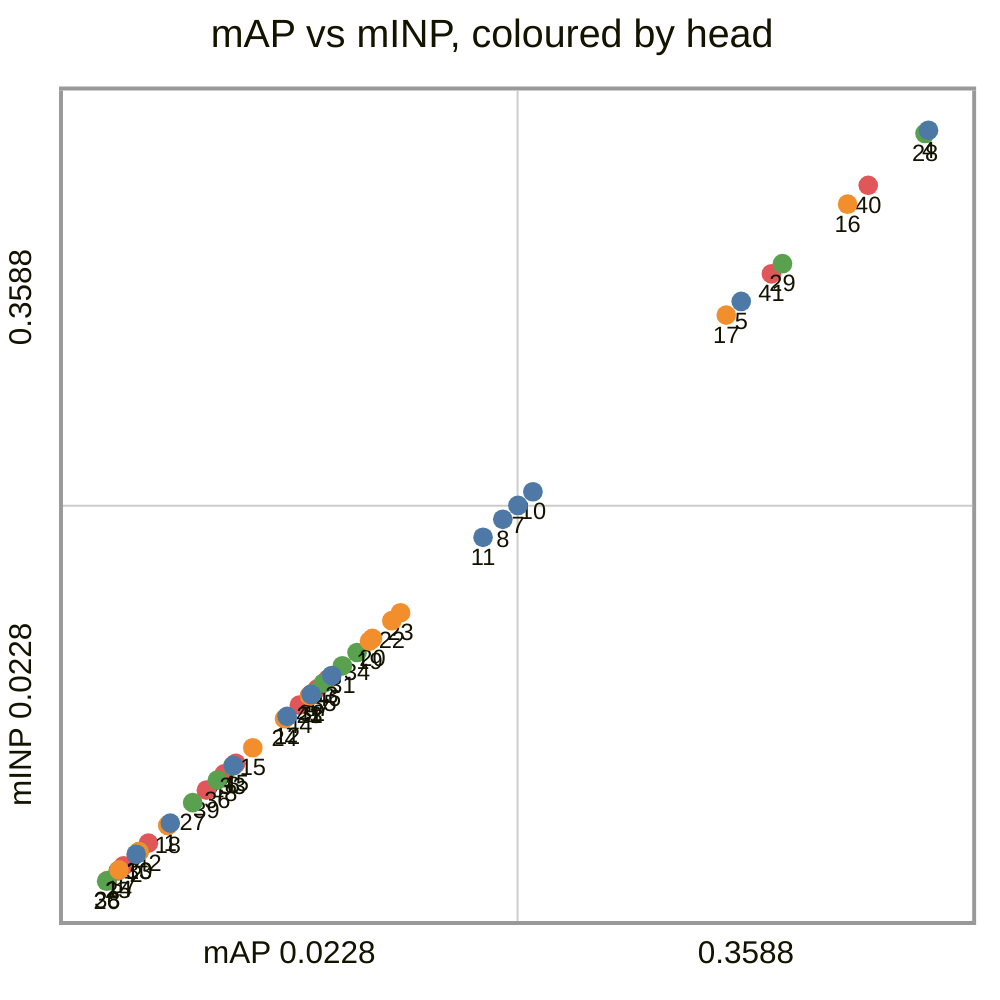
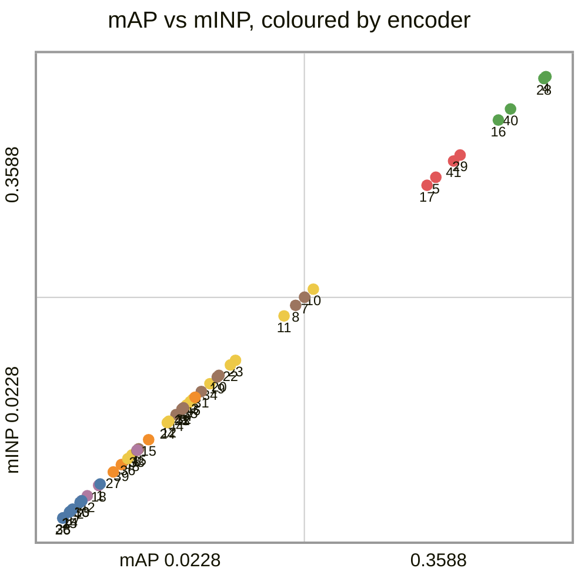
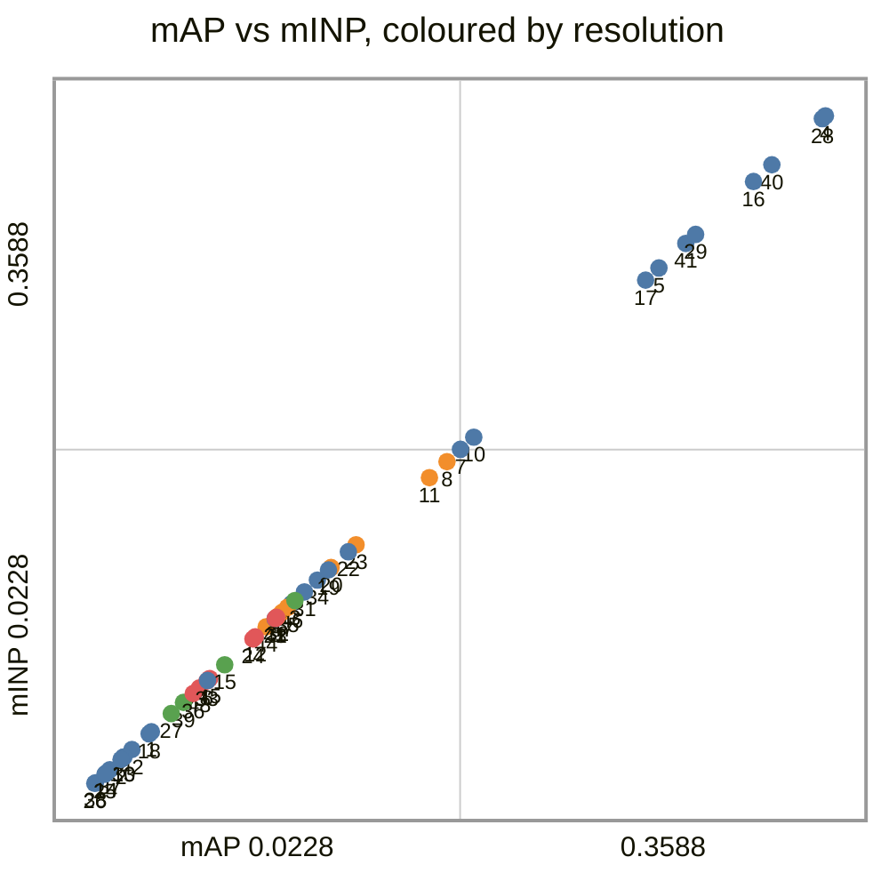

```mermaid
%%{init: {"themeVariables": {"xyChart": {"backgroundColor": "transparent", "plotColorPalette": "#4e79a7,#f28e2b,#59a14f,#e15759,#b07aa1,#9c755f,#edc948"}}, "xyChart": {"height": 1384, "width": 1215, "yAxis": {"showLabel": false}}}}%%
xychart-beta horizontal
    title "mAP, coloured by encoder"
    x-axis ["224x224 arcface vit_base_patch16_clip_224.openai crop · 4.89%", "224x224 arcface vit_base_patch16_clip_224.openai squash · 3.49%", "224x224 arcface vit_huge_plus_patch16_dinov3.lvd1689m squash · 35.88%", "224x224 arcface vit_large_patch16_dinov3.lvd1689m squash · 28.22%", "224x224 arcface vit_so400m_patch14_siglip_224.v2_webli squash · 7.46%", "224x224 arcface c-radio_v4-h squash · 19.09%", "224x224 arcface c-radio_v4-so400m squash · 19.71%", "224x224 linear vit_base_patch16_clip_224.openai crop · 3.61%", "224x224 linear vit_base_patch16_clip_224.openai squash · 2.79%", "224x224 linear vit_huge_plus_patch16_dinov3.lvd1689m squash · 32.57%", "224x224 linear vit_large_patch16_dinov3.lvd1689m squash · 27.61%", "224x224 linear vit_so400m_patch14_siglip_224.v2_webli squash · 4.78%", "224x224 linear c-radio_v4-h squash · 13.02%", "224x224 linear c-radio_v4-so400m squash · 13.94%", "224x224 none vit_base_patch16_clip_224.openai crop · 2.75%", "224x224 none vit_base_patch16_clip_224.openai squash · 2.28%", "224x224 none vit_huge_plus_patch16_dinov3.lvd1689m squash · 35.74%", "224x224 none vit_large_patch16_dinov3.lvd1689m squash · 29.91%", "224x224 none vit_so400m_patch14_siglip_224.v2_webli squash · 3.61%", "224x224 none c-radio_v4-h squash · 11.92%", "224x224 none c-radio_v4-so400m squash · 12.52%", "224x224 pca vit_base_patch16_clip_224.openai crop · 2.98%", "224x224 pca vit_base_patch16_clip_224.openai squash · 2.31%", "224x224 pca vit_huge_plus_patch16_dinov3.lvd1689m squash · 33.41%", "224x224 pca vit_large_patch16_dinov3.lvd1689m squash · 29.46%", "224x224 pca vit_so400m_patch14_siglip_224.v2_webli squash · 3.99%", "224x224 pca c-radio_v4-h squash · 10.57%", "224x224 pca c-radio_v4-so400m squash · 11.33%", "256x128 arcface c-radio_v4-h squash · 18.47%", "256x128 arcface c-radio_v4-so400m squash · 17.67%", "256x128 linear c-radio_v4-h squash · 13.14%", "256x128 linear c-radio_v4-so400m squash · 14.29%", "256x128 none c-radio_v4-h squash · 10.68%", "256x128 none c-radio_v4-so400m squash · 11.14%", "256x128 pca c-radio_v4-h squash · 10.16%", "256x128 pca c-radio_v4-so400m squash · 10.89%", "256x256 arcface vit_giantopt_patch16_siglip_256.v2_webli squash · 11.48%", "256x256 linear vit_giantopt_patch16_siglip_256.v2_webli squash · 8.25%", "256x256 none vit_giantopt_patch16_siglip_256.v2_webli squash · 5.80%", "256x256 pca vit_giantopt_patch16_siglip_256.v2_webli squash · 6.36%", "native arcface c-radio_v4-h squash · 10.64%", "native arcface c-radio_v4-so400m squash · 9.66%", "native linear c-radio_v4-h squash · 10.58%", "native linear c-radio_v4-so400m squash · 9.55%", "native none c-radio_v4-h squash · 7.43%", "native none c-radio_v4-so400m squash · 6.80%", "native pca c-radio_v4-h squash · 7.56%", "native pca c-radio_v4-so400m squash · 7.09%"]
    y-axis "mAP (%)" 0 --> 37.67
    bar [4.89, 3.49, 0.00, 0.00, 0.00, 0.00, 0.00, 3.61, 2.79, 0.00, 0.00, 0.00, 0.00, 0.00, 2.75, 2.28, 0.00, 0.00, 0.00, 0.00, 0.00, 2.98, 2.31, 0.00, 0.00, 0.00, 0.00, 0.00, 0.00, 0.00, 0.00, 0.00, 0.00, 0.00, 0.00, 0.00, 0.00, 0.00, 0.00, 0.00, 0.00, 0.00, 0.00, 0.00, 0.00, 0.00, 0.00, 0.00]
    bar [0.00, 0.00, 0.00, 0.00, 0.00, 0.00, 0.00, 0.00, 0.00, 0.00, 0.00, 0.00, 0.00, 0.00, 0.00, 0.00, 0.00, 0.00, 0.00, 0.00, 0.00, 0.00, 0.00, 0.00, 0.00, 0.00, 0.00, 0.00, 0.00, 0.00, 0.00, 0.00, 0.00, 0.00, 0.00, 0.00, 11.48, 8.25, 5.80, 6.36, 0.00, 0.00, 0.00, 0.00, 0.00, 0.00, 0.00, 0.00]
    bar [0.00, 0.00, 35.88, 0.00, 0.00, 0.00, 0.00, 0.00, 0.00, 32.57, 0.00, 0.00, 0.00, 0.00, 0.00, 0.00, 35.74, 0.00, 0.00, 0.00, 0.00, 0.00, 0.00, 33.41, 0.00, 0.00, 0.00, 0.00, 0.00, 0.00, 0.00, 0.00, 0.00, 0.00, 0.00, 0.00, 0.00, 0.00, 0.00, 0.00, 0.00, 0.00, 0.00, 0.00, 0.00, 0.00, 0.00, 0.00]
    bar [0.00, 0.00, 0.00, 28.22, 0.00, 0.00, 0.00, 0.00, 0.00, 0.00, 27.61, 0.00, 0.00, 0.00, 0.00, 0.00, 0.00, 29.91, 0.00, 0.00, 0.00, 0.00, 0.00, 0.00, 29.46, 0.00, 0.00, 0.00, 0.00, 0.00, 0.00, 0.00, 0.00, 0.00, 0.00, 0.00, 0.00, 0.00, 0.00, 0.00, 0.00, 0.00, 0.00, 0.00, 0.00, 0.00, 0.00, 0.00]
    bar [0.00, 0.00, 0.00, 0.00, 7.46, 0.00, 0.00, 0.00, 0.00, 0.00, 0.00, 4.78, 0.00, 0.00, 0.00, 0.00, 0.00, 0.00, 3.61, 0.00, 0.00, 0.00, 0.00, 0.00, 0.00, 3.99, 0.00, 0.00, 0.00, 0.00, 0.00, 0.00, 0.00, 0.00, 0.00, 0.00, 0.00, 0.00, 0.00, 0.00, 0.00, 0.00, 0.00, 0.00, 0.00, 0.00, 0.00, 0.00]
    bar [0.00, 0.00, 0.00, 0.00, 0.00, 19.09, 0.00, 0.00, 0.00, 0.00, 0.00, 0.00, 13.02, 0.00, 0.00, 0.00, 0.00, 0.00, 0.00, 11.92, 0.00, 0.00, 0.00, 0.00, 0.00, 0.00, 10.57, 0.00, 18.47, 0.00, 13.14, 0.00, 10.68, 0.00, 10.16, 0.00, 0.00, 0.00, 0.00, 0.00, 10.64, 0.00, 10.58, 0.00, 7.43, 0.00, 7.56, 0.00]
    bar [0.00, 0.00, 0.00, 0.00, 0.00, 0.00, 19.71, 0.00, 0.00, 0.00, 0.00, 0.00, 0.00, 13.94, 0.00, 0.00, 0.00, 0.00, 0.00, 0.00, 12.52, 0.00, 0.00, 0.00, 0.00, 0.00, 0.00, 11.33, 0.00, 17.67, 0.00, 14.29, 0.00, 11.14, 0.00, 10.89, 0.00, 0.00, 0.00, 0.00, 0.00, 9.66, 0.00, 9.55, 0.00, 6.80, 0.00, 7.09]
```

<!-- generated by `reidbench render`; edit the runs, not this file -->

# vric

[← table.md](../table.md)

## vric/official@1

### 🟦 arcface

|  # | encoder                                       | resolution | resize |        mAP |         R1 |         R5 |        R10 |       mINP |
|---:|-----------------------------------------------|------------|--------|-----------:|-----------:|-----------:|-----------:|-----------:|
|  1 | timm:vit_base_patch16_clip_224.openai         | 224x224    | crop   |     0.0489 |     0.0249 |     0.0601 |     0.0900 |     0.0489 |
|  2 | timm:vit_base_patch16_clip_224.openai         | 224x224    | squash |     0.0349 |     0.0171 |     0.0402 |     0.0626 |     0.0349 |
|  3 | timm:vit_giantopt_patch16_siglip_256.v2_webli | 256x256    | squash |     0.1148 |     0.0726 |     0.1466 |     0.1910 |     0.1148 |
|  4 | timm:vit_huge_plus_patch16_dinov3.lvd1689m    | 224x224    | squash | **0.3588** | **0.2629** | **0.4614** | **0.5386** | **0.3588** |
|  5 | timm:vit_large_patch16_dinov3.lvd1689m        | 224x224    | squash |     0.2822 |     0.1978 |     0.3632 |     0.4457 |     0.2822 |
|  6 | timm:vit_so400m_patch14_siglip_224.v2_webli   | 224x224    | squash |     0.0746 |     0.0420 |     0.0996 |     0.1323 |     0.0746 |
|  7 | torchhub:NVlabs/RADIO/c-radio_v4-h            | 224x224    | squash |     0.1909 |     0.1252 |     0.2440 |     0.3195 |     0.1909 |
|  8 | torchhub:NVlabs/RADIO/c-radio_v4-h            | 256x128    | squash |     0.1847 |     0.1195 |     0.2405 |     0.3191 |     0.1847 |
|  9 | torchhub:NVlabs/RADIO/c-radio_v4-h            | native     | squash |     0.1064 |     0.0662 |     0.1323 |     0.1843 |     0.1064 |
| 10 | torchhub:NVlabs/RADIO/c-radio_v4-so400m       | 224x224    | squash |     0.1971 |     0.1295 |     0.2565 |     0.3305 |     0.1971 |
| 11 | torchhub:NVlabs/RADIO/c-radio_v4-so400m       | 256x128    | squash |     0.1767 |     0.1106 |     0.2376 |     0.2999 |     0.1767 |
| 12 | torchhub:NVlabs/RADIO/c-radio_v4-so400m       | native     | squash |     0.0966 |     0.0544 |     0.1252 |     0.1700 |     0.0966 |

### 🟧 linear

|  # | encoder                                       | resolution | resize |        mAP |         R1 |         R5 |        R10 |       mINP |
|---:|-----------------------------------------------|------------|--------|-----------:|-----------:|-----------:|-----------:|-----------:|
| 13 | timm:vit_base_patch16_clip_224.openai         | 224x224    | crop   |     0.0361 |     0.0167 |     0.0434 |     0.0701 |     0.0361 |
| 14 | timm:vit_base_patch16_clip_224.openai         | 224x224    | squash |     0.0279 |     0.0128 |     0.0356 |     0.0512 |     0.0279 |
| 15 | timm:vit_giantopt_patch16_siglip_256.v2_webli | 256x256    | squash |     0.0825 |     0.0480 |     0.1032 |     0.1355 |     0.0825 |
| 16 | timm:vit_huge_plus_patch16_dinov3.lvd1689m    | 224x224    | squash | **0.3257** | **0.2323** | **0.4219** | **0.5027** | **0.3257** |
| 17 | timm:vit_large_patch16_dinov3.lvd1689m        | 224x224    | squash |     0.2761 |     0.1885 |     0.3671 |     0.4457 |     0.2761 |
| 18 | timm:vit_so400m_patch14_siglip_224.v2_webli   | 224x224    | squash |     0.0478 |     0.0267 |     0.0544 |     0.0800 |     0.0478 |
| 19 | torchhub:NVlabs/RADIO/c-radio_v4-h            | 224x224    | squash |     0.1302 |     0.0797 |     0.1676 |     0.2291 |     0.1302 |
| 20 | torchhub:NVlabs/RADIO/c-radio_v4-h            | 256x128    | squash |     0.1314 |     0.0790 |     0.1772 |     0.2263 |     0.1314 |
| 21 | torchhub:NVlabs/RADIO/c-radio_v4-h            | native     | squash |     0.1058 |     0.0608 |     0.1405 |     0.1935 |     0.1058 |
| 22 | torchhub:NVlabs/RADIO/c-radio_v4-so400m       | 224x224    | squash |     0.1394 |     0.0864 |     0.1789 |     0.2394 |     0.1394 |
| 23 | torchhub:NVlabs/RADIO/c-radio_v4-so400m       | 256x128    | squash |     0.1429 |     0.0886 |     0.1871 |     0.2465 |     0.1429 |
| 24 | torchhub:NVlabs/RADIO/c-radio_v4-so400m       | native     | squash |     0.0955 |     0.0498 |     0.1316 |     0.1839 |     0.0955 |

### 🟩 none

|  # | encoder                                       | resolution | resize |        mAP |         R1 |         R5 |        R10 |       mINP |
|---:|-----------------------------------------------|------------|--------|-----------:|-----------:|-----------:|-----------:|-----------:|
| 25 | timm:vit_base_patch16_clip_224.openai         | 224x224    | crop   |     0.0275 |     0.0135 |     0.0345 |     0.0473 |     0.0275 |
| 26 | timm:vit_base_patch16_clip_224.openai         | 224x224    | squash |     0.0228 |     0.0103 |     0.0270 |     0.0395 |     0.0228 |
| 27 | timm:vit_giantopt_patch16_siglip_256.v2_webli | 256x256    | squash |     0.0580 |     0.0338 |     0.0715 |     0.1003 |     0.0580 |
| 28 | timm:vit_huge_plus_patch16_dinov3.lvd1689m    | 224x224    | squash | **0.3574** | **0.2657** | **0.4522** | **0.5375** | **0.3574** |
| 29 | timm:vit_large_patch16_dinov3.lvd1689m        | 224x224    | squash |     0.2991 |     0.2063 |     0.3913 |     0.4803 |     0.2991 |
| 30 | timm:vit_so400m_patch14_siglip_224.v2_webli   | 224x224    | squash |     0.0361 |     0.0206 |     0.0406 |     0.0587 |     0.0361 |
| 31 | torchhub:NVlabs/RADIO/c-radio_v4-h            | 224x224    | squash |     0.1192 |     0.0800 |     0.1473 |     0.1878 |     0.1192 |
| 32 | torchhub:NVlabs/RADIO/c-radio_v4-h            | 256x128    | squash |     0.1068 |     0.0662 |     0.1366 |     0.1846 |     0.1068 |
| 33 | torchhub:NVlabs/RADIO/c-radio_v4-h            | native     | squash |     0.0743 |     0.0445 |     0.0921 |     0.1256 |     0.0743 |
| 34 | torchhub:NVlabs/RADIO/c-radio_v4-so400m       | 224x224    | squash |     0.1252 |     0.0815 |     0.1569 |     0.2078 |     0.1252 |
| 35 | torchhub:NVlabs/RADIO/c-radio_v4-so400m       | 256x128    | squash |     0.1114 |     0.0697 |     0.1434 |     0.1925 |     0.1114 |
| 36 | torchhub:NVlabs/RADIO/c-radio_v4-so400m       | native     | squash |     0.0680 |     0.0359 |     0.0936 |     0.1224 |     0.0680 |

### 🟥 pca

|  # | encoder                                       | resolution | resize |        mAP |         R1 |         R5 |        R10 |       mINP |
|---:|-----------------------------------------------|------------|--------|-----------:|-----------:|-----------:|-----------:|-----------:|
| 37 | timm:vit_base_patch16_clip_224.openai         | 224x224    | crop   |     0.0298 |     0.0149 |     0.0345 |     0.0512 |     0.0298 |
| 38 | timm:vit_base_patch16_clip_224.openai         | 224x224    | squash |     0.0231 |     0.0103 |     0.0263 |     0.0406 |     0.0231 |
| 39 | timm:vit_giantopt_patch16_siglip_256.v2_webli | 256x256    | squash |     0.0636 |     0.0359 |     0.0829 |     0.1096 |     0.0636 |
| 40 | timm:vit_huge_plus_patch16_dinov3.lvd1689m    | 224x224    | squash | **0.3341** | **0.2423** | **0.4301** | **0.5094** | **0.3341** |
| 41 | timm:vit_large_patch16_dinov3.lvd1689m        | 224x224    | squash |     0.2946 |     0.2042 |     0.3860 |     0.4703 |     0.2946 |
| 42 | timm:vit_so400m_patch14_siglip_224.v2_webli   | 224x224    | squash |     0.0399 |     0.0213 |     0.0494 |     0.0676 |     0.0399 |
| 43 | torchhub:NVlabs/RADIO/c-radio_v4-h            | 224x224    | squash |     0.1057 |     0.0672 |     0.1320 |     0.1743 |     0.1057 |
| 44 | torchhub:NVlabs/RADIO/c-radio_v4-h            | 256x128    | squash |     0.1016 |     0.0647 |     0.1284 |     0.1700 |     0.1016 |
| 45 | torchhub:NVlabs/RADIO/c-radio_v4-h            | native     | squash |     0.0756 |     0.0445 |     0.0961 |     0.1309 |     0.0756 |
| 46 | torchhub:NVlabs/RADIO/c-radio_v4-so400m       | 224x224    | squash |     0.1133 |     0.0704 |     0.1430 |     0.1946 |     0.1133 |
| 47 | torchhub:NVlabs/RADIO/c-radio_v4-so400m       | 256x128    | squash |     0.1089 |     0.0672 |     0.1423 |     0.1910 |     0.1089 |
| 48 | torchhub:NVlabs/RADIO/c-radio_v4-so400m       | native     | squash |     0.0709 |     0.0366 |     0.0978 |     0.1270 |     0.0709 |

### Every row, by encoder and resolution

```mermaid
%%{init: {"themeVariables": {"xyChart": {"backgroundColor": "transparent", "plotColorPalette": "#4e79a7,#f28e2b,#59a14f,#e15759"}}, "xyChart": {"height": 1384, "width": 1215, "yAxis": {"showLabel": false}}}}%%
xychart-beta horizontal
    title "mAP, coloured by head"
    x-axis ["vit_base_patch16_clip_224.openai 224x224 arcface crop · 4.89%", "vit_base_patch16_clip_224.openai 224x224 arcface squash · 3.49%", "vit_base_patch16_clip_224.openai 224x224 linear crop · 3.61%", "vit_base_patch16_clip_224.openai 224x224 linear squash · 2.79%", "vit_base_patch16_clip_224.openai 224x224 none crop · 2.75%", "vit_base_patch16_clip_224.openai 224x224 none squash · 2.28%", "vit_base_patch16_clip_224.openai 224x224 pca crop · 2.98%", "vit_base_patch16_clip_224.openai 224x224 pca squash · 2.31%", "vit_giantopt_patch16_siglip_256.v2_webli 256x256 arcface squash · 11.48%", "vit_giantopt_patch16_siglip_256.v2_webli 256x256 linear squash · 8.25%", "vit_giantopt_patch16_siglip_256.v2_webli 256x256 none squash · 5.80%", "vit_giantopt_patch16_siglip_256.v2_webli 256x256 pca squash · 6.36%", "vit_huge_plus_patch16_dinov3.lvd1689m 224x224 arcface squash · 35.88%", "vit_huge_plus_patch16_dinov3.lvd1689m 224x224 linear squash · 32.57%", "vit_huge_plus_patch16_dinov3.lvd1689m 224x224 none squash · 35.74%", "vit_huge_plus_patch16_dinov3.lvd1689m 224x224 pca squash · 33.41%", "vit_large_patch16_dinov3.lvd1689m 224x224 arcface squash · 28.22%", "vit_large_patch16_dinov3.lvd1689m 224x224 linear squash · 27.61%", "vit_large_patch16_dinov3.lvd1689m 224x224 none squash · 29.91%", "vit_large_patch16_dinov3.lvd1689m 224x224 pca squash · 29.46%", "vit_so400m_patch14_siglip_224.v2_webli 224x224 arcface squash · 7.46%", "vit_so400m_patch14_siglip_224.v2_webli 224x224 linear squash · 4.78%", "vit_so400m_patch14_siglip_224.v2_webli 224x224 none squash · 3.61%", "vit_so400m_patch14_siglip_224.v2_webli 224x224 pca squash · 3.99%", "c-radio_v4-h 224x224 arcface squash · 19.09%", "c-radio_v4-h 224x224 linear squash · 13.02%", "c-radio_v4-h 224x224 none squash · 11.92%", "c-radio_v4-h 224x224 pca squash · 10.57%", "c-radio_v4-h 256x128 arcface squash · 18.47%", "c-radio_v4-h 256x128 linear squash · 13.14%", "c-radio_v4-h 256x128 none squash · 10.68%", "c-radio_v4-h 256x128 pca squash · 10.16%", "c-radio_v4-h native arcface squash · 10.64%", "c-radio_v4-h native linear squash · 10.58%", "c-radio_v4-h native none squash · 7.43%", "c-radio_v4-h native pca squash · 7.56%", "c-radio_v4-so400m 224x224 arcface squash · 19.71%", "c-radio_v4-so400m 224x224 linear squash · 13.94%", "c-radio_v4-so400m 224x224 none squash · 12.52%", "c-radio_v4-so400m 224x224 pca squash · 11.33%", "c-radio_v4-so400m 256x128 arcface squash · 17.67%", "c-radio_v4-so400m 256x128 linear squash · 14.29%", "c-radio_v4-so400m 256x128 none squash · 11.14%", "c-radio_v4-so400m 256x128 pca squash · 10.89%", "c-radio_v4-so400m native arcface squash · 9.66%", "c-radio_v4-so400m native linear squash · 9.55%", "c-radio_v4-so400m native none squash · 6.80%", "c-radio_v4-so400m native pca squash · 7.09%"]
    y-axis "mAP (%)" 0 --> 37.67
    bar [4.89, 3.49, 0.00, 0.00, 0.00, 0.00, 0.00, 0.00, 11.48, 0.00, 0.00, 0.00, 35.88, 0.00, 0.00, 0.00, 28.22, 0.00, 0.00, 0.00, 7.46, 0.00, 0.00, 0.00, 19.09, 0.00, 0.00, 0.00, 18.47, 0.00, 0.00, 0.00, 10.64, 0.00, 0.00, 0.00, 19.71, 0.00, 0.00, 0.00, 17.67, 0.00, 0.00, 0.00, 9.66, 0.00, 0.00, 0.00]
    bar [0.00, 0.00, 3.61, 2.79, 0.00, 0.00, 0.00, 0.00, 0.00, 8.25, 0.00, 0.00, 0.00, 32.57, 0.00, 0.00, 0.00, 27.61, 0.00, 0.00, 0.00, 4.78, 0.00, 0.00, 0.00, 13.02, 0.00, 0.00, 0.00, 13.14, 0.00, 0.00, 0.00, 10.58, 0.00, 0.00, 0.00, 13.94, 0.00, 0.00, 0.00, 14.29, 0.00, 0.00, 0.00, 9.55, 0.00, 0.00]
    bar [0.00, 0.00, 0.00, 0.00, 2.75, 2.28, 0.00, 0.00, 0.00, 0.00, 5.80, 0.00, 0.00, 0.00, 35.74, 0.00, 0.00, 0.00, 29.91, 0.00, 0.00, 0.00, 3.61, 0.00, 0.00, 0.00, 11.92, 0.00, 0.00, 0.00, 10.68, 0.00, 0.00, 0.00, 7.43, 0.00, 0.00, 0.00, 12.52, 0.00, 0.00, 0.00, 11.14, 0.00, 0.00, 0.00, 6.80, 0.00]
    bar [0.00, 0.00, 0.00, 0.00, 0.00, 0.00, 2.98, 2.31, 0.00, 0.00, 0.00, 6.36, 0.00, 0.00, 0.00, 33.41, 0.00, 0.00, 0.00, 29.46, 0.00, 0.00, 0.00, 3.99, 0.00, 0.00, 0.00, 10.57, 0.00, 0.00, 0.00, 10.16, 0.00, 0.00, 0.00, 7.56, 0.00, 0.00, 0.00, 11.33, 0.00, 0.00, 0.00, 10.89, 0.00, 0.00, 0.00, 7.09]
```

### By head — does the probe carry it?

```mermaid
%%{init: {"themeVariables": {"xyChart": {"backgroundColor": "transparent", "plotColorPalette": "#4e79a7,#f28e2b,#59a14f,#e15759"}}, "xyChart": {"height": 1384, "width": 1215, "yAxis": {"showLabel": false}}}}%%
xychart-beta horizontal
    title "mAP, coloured by head"
    x-axis ["arcface vit_base_patch16_clip_224.openai 224x224 crop · 4.89%", "arcface vit_base_patch16_clip_224.openai 224x224 squash · 3.49%", "arcface vit_giantopt_patch16_siglip_256.v2_webli 256x256 squash · 11.48%", "arcface vit_huge_plus_patch16_dinov3.lvd1689m 224x224 squash · 35.88%", "arcface vit_large_patch16_dinov3.lvd1689m 224x224 squash · 28.22%", "arcface vit_so400m_patch14_siglip_224.v2_webli 224x224 squash · 7.46%", "arcface c-radio_v4-h 224x224 squash · 19.09%", "arcface c-radio_v4-h 256x128 squash · 18.47%", "arcface c-radio_v4-h native squash · 10.64%", "arcface c-radio_v4-so400m 224x224 squash · 19.71%", "arcface c-radio_v4-so400m 256x128 squash · 17.67%", "arcface c-radio_v4-so400m native squash · 9.66%", "linear vit_base_patch16_clip_224.openai 224x224 crop · 3.61%", "linear vit_base_patch16_clip_224.openai 224x224 squash · 2.79%", "linear vit_giantopt_patch16_siglip_256.v2_webli 256x256 squash · 8.25%", "linear vit_huge_plus_patch16_dinov3.lvd1689m 224x224 squash · 32.57%", "linear vit_large_patch16_dinov3.lvd1689m 224x224 squash · 27.61%", "linear vit_so400m_patch14_siglip_224.v2_webli 224x224 squash · 4.78%", "linear c-radio_v4-h 224x224 squash · 13.02%", "linear c-radio_v4-h 256x128 squash · 13.14%", "linear c-radio_v4-h native squash · 10.58%", "linear c-radio_v4-so400m 224x224 squash · 13.94%", "linear c-radio_v4-so400m 256x128 squash · 14.29%", "linear c-radio_v4-so400m native squash · 9.55%", "none vit_base_patch16_clip_224.openai 224x224 crop · 2.75%", "none vit_base_patch16_clip_224.openai 224x224 squash · 2.28%", "none vit_giantopt_patch16_siglip_256.v2_webli 256x256 squash · 5.80%", "none vit_huge_plus_patch16_dinov3.lvd1689m 224x224 squash · 35.74%", "none vit_large_patch16_dinov3.lvd1689m 224x224 squash · 29.91%", "none vit_so400m_patch14_siglip_224.v2_webli 224x224 squash · 3.61%", "none c-radio_v4-h 224x224 squash · 11.92%", "none c-radio_v4-h 256x128 squash · 10.68%", "none c-radio_v4-h native squash · 7.43%", "none c-radio_v4-so400m 224x224 squash · 12.52%", "none c-radio_v4-so400m 256x128 squash · 11.14%", "none c-radio_v4-so400m native squash · 6.80%", "pca vit_base_patch16_clip_224.openai 224x224 crop · 2.98%", "pca vit_base_patch16_clip_224.openai 224x224 squash · 2.31%", "pca vit_giantopt_patch16_siglip_256.v2_webli 256x256 squash · 6.36%", "pca vit_huge_plus_patch16_dinov3.lvd1689m 224x224 squash · 33.41%", "pca vit_large_patch16_dinov3.lvd1689m 224x224 squash · 29.46%", "pca vit_so400m_patch14_siglip_224.v2_webli 224x224 squash · 3.99%", "pca c-radio_v4-h 224x224 squash · 10.57%", "pca c-radio_v4-h 256x128 squash · 10.16%", "pca c-radio_v4-h native squash · 7.56%", "pca c-radio_v4-so400m 224x224 squash · 11.33%", "pca c-radio_v4-so400m 256x128 squash · 10.89%", "pca c-radio_v4-so400m native squash · 7.09%"]
    y-axis "mAP (%)" 0 --> 37.67
    bar [4.89, 3.49, 11.48, 35.88, 28.22, 7.46, 19.09, 18.47, 10.64, 19.71, 17.67, 9.66, 0.00, 0.00, 0.00, 0.00, 0.00, 0.00, 0.00, 0.00, 0.00, 0.00, 0.00, 0.00, 0.00, 0.00, 0.00, 0.00, 0.00, 0.00, 0.00, 0.00, 0.00, 0.00, 0.00, 0.00, 0.00, 0.00, 0.00, 0.00, 0.00, 0.00, 0.00, 0.00, 0.00, 0.00, 0.00, 0.00]
    bar [0.00, 0.00, 0.00, 0.00, 0.00, 0.00, 0.00, 0.00, 0.00, 0.00, 0.00, 0.00, 3.61, 2.79, 8.25, 32.57, 27.61, 4.78, 13.02, 13.14, 10.58, 13.94, 14.29, 9.55, 0.00, 0.00, 0.00, 0.00, 0.00, 0.00, 0.00, 0.00, 0.00, 0.00, 0.00, 0.00, 0.00, 0.00, 0.00, 0.00, 0.00, 0.00, 0.00, 0.00, 0.00, 0.00, 0.00, 0.00]
    bar [0.00, 0.00, 0.00, 0.00, 0.00, 0.00, 0.00, 0.00, 0.00, 0.00, 0.00, 0.00, 0.00, 0.00, 0.00, 0.00, 0.00, 0.00, 0.00, 0.00, 0.00, 0.00, 0.00, 0.00, 2.75, 2.28, 5.80, 35.74, 29.91, 3.61, 11.92, 10.68, 7.43, 12.52, 11.14, 6.80, 0.00, 0.00, 0.00, 0.00, 0.00, 0.00, 0.00, 0.00, 0.00, 0.00, 0.00, 0.00]
    bar [0.00, 0.00, 0.00, 0.00, 0.00, 0.00, 0.00, 0.00, 0.00, 0.00, 0.00, 0.00, 0.00, 0.00, 0.00, 0.00, 0.00, 0.00, 0.00, 0.00, 0.00, 0.00, 0.00, 0.00, 0.00, 0.00, 0.00, 0.00, 0.00, 0.00, 0.00, 0.00, 0.00, 0.00, 0.00, 0.00, 2.98, 2.31, 6.36, 33.41, 29.46, 3.99, 10.57, 10.16, 7.56, 11.33, 10.89, 7.09]
```

### By encoder — does the checkpoint carry it?

*Colour — encoder:* 🟦 timm:vit_base_patch16_clip_224.openai · 🟧 timm:vit_giantopt_patch16_siglip_256.v2_webli · 🟩 timm:vit_huge_plus_patch16_dinov3.lvd1689m · 🟥 timm:vit_large_patch16_dinov3.lvd1689m · 🟪 timm:vit_so400m_patch14_siglip_224.v2_webli · 🟫 torchhub:NVlabs/RADIO/c-radio_v4-h · 🟨 torchhub:NVlabs/RADIO/c-radio_v4-so400m

```mermaid
%%{init: {"themeVariables": {"xyChart": {"backgroundColor": "transparent", "plotColorPalette": "#4e79a7,#f28e2b,#59a14f,#e15759,#b07aa1,#9c755f,#edc948"}}, "xyChart": {"height": 1384, "width": 1215, "yAxis": {"showLabel": false}}}}%%
xychart-beta horizontal
    title "mAP, coloured by encoder"
    x-axis ["vit_base_patch16_clip_224.openai arcface 224x224 crop · 4.89%", "vit_base_patch16_clip_224.openai arcface 224x224 squash · 3.49%", "vit_base_patch16_clip_224.openai linear 224x224 crop · 3.61%", "vit_base_patch16_clip_224.openai linear 224x224 squash · 2.79%", "vit_base_patch16_clip_224.openai none 224x224 crop · 2.75%", "vit_base_patch16_clip_224.openai none 224x224 squash · 2.28%", "vit_base_patch16_clip_224.openai pca 224x224 crop · 2.98%", "vit_base_patch16_clip_224.openai pca 224x224 squash · 2.31%", "vit_giantopt_patch16_siglip_256.v2_webli arcface 256x256 squash · 11.48%", "vit_giantopt_patch16_siglip_256.v2_webli linear 256x256 squash · 8.25%", "vit_giantopt_patch16_siglip_256.v2_webli none 256x256 squash · 5.80%", "vit_giantopt_patch16_siglip_256.v2_webli pca 256x256 squash · 6.36%", "vit_huge_plus_patch16_dinov3.lvd1689m arcface 224x224 squash · 35.88%", "vit_huge_plus_patch16_dinov3.lvd1689m linear 224x224 squash · 32.57%", "vit_huge_plus_patch16_dinov3.lvd1689m none 224x224 squash · 35.74%", "vit_huge_plus_patch16_dinov3.lvd1689m pca 224x224 squash · 33.41%", "vit_large_patch16_dinov3.lvd1689m arcface 224x224 squash · 28.22%", "vit_large_patch16_dinov3.lvd1689m linear 224x224 squash · 27.61%", "vit_large_patch16_dinov3.lvd1689m none 224x224 squash · 29.91%", "vit_large_patch16_dinov3.lvd1689m pca 224x224 squash · 29.46%", "vit_so400m_patch14_siglip_224.v2_webli arcface 224x224 squash · 7.46%", "vit_so400m_patch14_siglip_224.v2_webli linear 224x224 squash · 4.78%", "vit_so400m_patch14_siglip_224.v2_webli none 224x224 squash · 3.61%", "vit_so400m_patch14_siglip_224.v2_webli pca 224x224 squash · 3.99%", "c-radio_v4-h arcface 224x224 squash · 19.09%", "c-radio_v4-h arcface 256x128 squash · 18.47%", "c-radio_v4-h arcface native squash · 10.64%", "c-radio_v4-h linear 224x224 squash · 13.02%", "c-radio_v4-h linear 256x128 squash · 13.14%", "c-radio_v4-h linear native squash · 10.58%", "c-radio_v4-h none 224x224 squash · 11.92%", "c-radio_v4-h none 256x128 squash · 10.68%", "c-radio_v4-h none native squash · 7.43%", "c-radio_v4-h pca 224x224 squash · 10.57%", "c-radio_v4-h pca 256x128 squash · 10.16%", "c-radio_v4-h pca native squash · 7.56%", "c-radio_v4-so400m arcface 224x224 squash · 19.71%", "c-radio_v4-so400m arcface 256x128 squash · 17.67%", "c-radio_v4-so400m arcface native squash · 9.66%", "c-radio_v4-so400m linear 224x224 squash · 13.94%", "c-radio_v4-so400m linear 256x128 squash · 14.29%", "c-radio_v4-so400m linear native squash · 9.55%", "c-radio_v4-so400m none 224x224 squash · 12.52%", "c-radio_v4-so400m none 256x128 squash · 11.14%", "c-radio_v4-so400m none native squash · 6.80%", "c-radio_v4-so400m pca 224x224 squash · 11.33%", "c-radio_v4-so400m pca 256x128 squash · 10.89%", "c-radio_v4-so400m pca native squash · 7.09%"]
    y-axis "mAP (%)" 0 --> 37.67
    bar [4.89, 3.49, 3.61, 2.79, 2.75, 2.28, 2.98, 2.31, 0.00, 0.00, 0.00, 0.00, 0.00, 0.00, 0.00, 0.00, 0.00, 0.00, 0.00, 0.00, 0.00, 0.00, 0.00, 0.00, 0.00, 0.00, 0.00, 0.00, 0.00, 0.00, 0.00, 0.00, 0.00, 0.00, 0.00, 0.00, 0.00, 0.00, 0.00, 0.00, 0.00, 0.00, 0.00, 0.00, 0.00, 0.00, 0.00, 0.00]
    bar [0.00, 0.00, 0.00, 0.00, 0.00, 0.00, 0.00, 0.00, 11.48, 8.25, 5.80, 6.36, 0.00, 0.00, 0.00, 0.00, 0.00, 0.00, 0.00, 0.00, 0.00, 0.00, 0.00, 0.00, 0.00, 0.00, 0.00, 0.00, 0.00, 0.00, 0.00, 0.00, 0.00, 0.00, 0.00, 0.00, 0.00, 0.00, 0.00, 0.00, 0.00, 0.00, 0.00, 0.00, 0.00, 0.00, 0.00, 0.00]
    bar [0.00, 0.00, 0.00, 0.00, 0.00, 0.00, 0.00, 0.00, 0.00, 0.00, 0.00, 0.00, 35.88, 32.57, 35.74, 33.41, 0.00, 0.00, 0.00, 0.00, 0.00, 0.00, 0.00, 0.00, 0.00, 0.00, 0.00, 0.00, 0.00, 0.00, 0.00, 0.00, 0.00, 0.00, 0.00, 0.00, 0.00, 0.00, 0.00, 0.00, 0.00, 0.00, 0.00, 0.00, 0.00, 0.00, 0.00, 0.00]
    bar [0.00, 0.00, 0.00, 0.00, 0.00, 0.00, 0.00, 0.00, 0.00, 0.00, 0.00, 0.00, 0.00, 0.00, 0.00, 0.00, 28.22, 27.61, 29.91, 29.46, 0.00, 0.00, 0.00, 0.00, 0.00, 0.00, 0.00, 0.00, 0.00, 0.00, 0.00, 0.00, 0.00, 0.00, 0.00, 0.00, 0.00, 0.00, 0.00, 0.00, 0.00, 0.00, 0.00, 0.00, 0.00, 0.00, 0.00, 0.00]
    bar [0.00, 0.00, 0.00, 0.00, 0.00, 0.00, 0.00, 0.00, 0.00, 0.00, 0.00, 0.00, 0.00, 0.00, 0.00, 0.00, 0.00, 0.00, 0.00, 0.00, 7.46, 4.78, 3.61, 3.99, 0.00, 0.00, 0.00, 0.00, 0.00, 0.00, 0.00, 0.00, 0.00, 0.00, 0.00, 0.00, 0.00, 0.00, 0.00, 0.00, 0.00, 0.00, 0.00, 0.00, 0.00, 0.00, 0.00, 0.00]
    bar [0.00, 0.00, 0.00, 0.00, 0.00, 0.00, 0.00, 0.00, 0.00, 0.00, 0.00, 0.00, 0.00, 0.00, 0.00, 0.00, 0.00, 0.00, 0.00, 0.00, 0.00, 0.00, 0.00, 0.00, 19.09, 18.47, 10.64, 13.02, 13.14, 10.58, 11.92, 10.68, 7.43, 10.57, 10.16, 7.56, 0.00, 0.00, 0.00, 0.00, 0.00, 0.00, 0.00, 0.00, 0.00, 0.00, 0.00, 0.00]
    bar [0.00, 0.00, 0.00, 0.00, 0.00, 0.00, 0.00, 0.00, 0.00, 0.00, 0.00, 0.00, 0.00, 0.00, 0.00, 0.00, 0.00, 0.00, 0.00, 0.00, 0.00, 0.00, 0.00, 0.00, 0.00, 0.00, 0.00, 0.00, 0.00, 0.00, 0.00, 0.00, 0.00, 0.00, 0.00, 0.00, 19.71, 17.67, 9.66, 13.94, 14.29, 9.55, 12.52, 11.14, 6.80, 11.33, 10.89, 7.09]
```

### By resolution — does the input size carry it?

*Colour — resolution:* 🟦 224x224 · 🟧 256x128 · 🟩 256x256 · 🟥 native

```mermaid
%%{init: {"themeVariables": {"xyChart": {"backgroundColor": "transparent", "plotColorPalette": "#4e79a7,#f28e2b,#59a14f,#e15759"}}, "xyChart": {"height": 1384, "width": 1215, "yAxis": {"showLabel": false}}}}%%
xychart-beta horizontal
    title "mAP, coloured by resolution"
    x-axis ["224x224 vit_base_patch16_clip_224.openai arcface crop · 4.89%", "224x224 vit_base_patch16_clip_224.openai arcface squash · 3.49%", "224x224 vit_base_patch16_clip_224.openai linear crop · 3.61%", "224x224 vit_base_patch16_clip_224.openai linear squash · 2.79%", "224x224 vit_base_patch16_clip_224.openai none crop · 2.75%", "224x224 vit_base_patch16_clip_224.openai none squash · 2.28%", "224x224 vit_base_patch16_clip_224.openai pca crop · 2.98%", "224x224 vit_base_patch16_clip_224.openai pca squash · 2.31%", "224x224 vit_huge_plus_patch16_dinov3.lvd1689m arcface squash · 35.88%", "224x224 vit_huge_plus_patch16_dinov3.lvd1689m linear squash · 32.57%", "224x224 vit_huge_plus_patch16_dinov3.lvd1689m none squash · 35.74%", "224x224 vit_huge_plus_patch16_dinov3.lvd1689m pca squash · 33.41%", "224x224 vit_large_patch16_dinov3.lvd1689m arcface squash · 28.22%", "224x224 vit_large_patch16_dinov3.lvd1689m linear squash · 27.61%", "224x224 vit_large_patch16_dinov3.lvd1689m none squash · 29.91%", "224x224 vit_large_patch16_dinov3.lvd1689m pca squash · 29.46%", "224x224 vit_so400m_patch14_siglip_224.v2_webli arcface squash · 7.46%", "224x224 vit_so400m_patch14_siglip_224.v2_webli linear squash · 4.78%", "224x224 vit_so400m_patch14_siglip_224.v2_webli none squash · 3.61%", "224x224 vit_so400m_patch14_siglip_224.v2_webli pca squash · 3.99%", "224x224 c-radio_v4-h arcface squash · 19.09%", "224x224 c-radio_v4-h linear squash · 13.02%", "224x224 c-radio_v4-h none squash · 11.92%", "224x224 c-radio_v4-h pca squash · 10.57%", "224x224 c-radio_v4-so400m arcface squash · 19.71%", "224x224 c-radio_v4-so400m linear squash · 13.94%", "224x224 c-radio_v4-so400m none squash · 12.52%", "224x224 c-radio_v4-so400m pca squash · 11.33%", "256x128 c-radio_v4-h arcface squash · 18.47%", "256x128 c-radio_v4-h linear squash · 13.14%", "256x128 c-radio_v4-h none squash · 10.68%", "256x128 c-radio_v4-h pca squash · 10.16%", "256x128 c-radio_v4-so400m arcface squash · 17.67%", "256x128 c-radio_v4-so400m linear squash · 14.29%", "256x128 c-radio_v4-so400m none squash · 11.14%", "256x128 c-radio_v4-so400m pca squash · 10.89%", "256x256 vit_giantopt_patch16_siglip_256.v2_webli arcface squash · 11.48%", "256x256 vit_giantopt_patch16_siglip_256.v2_webli linear squash · 8.25%", "256x256 vit_giantopt_patch16_siglip_256.v2_webli none squash · 5.80%", "256x256 vit_giantopt_patch16_siglip_256.v2_webli pca squash · 6.36%", "native c-radio_v4-h arcface squash · 10.64%", "native c-radio_v4-h linear squash · 10.58%", "native c-radio_v4-h none squash · 7.43%", "native c-radio_v4-h pca squash · 7.56%", "native c-radio_v4-so400m arcface squash · 9.66%", "native c-radio_v4-so400m linear squash · 9.55%", "native c-radio_v4-so400m none squash · 6.80%", "native c-radio_v4-so400m pca squash · 7.09%"]
    y-axis "mAP (%)" 0 --> 37.67
    bar [4.89, 3.49, 3.61, 2.79, 2.75, 2.28, 2.98, 2.31, 35.88, 32.57, 35.74, 33.41, 28.22, 27.61, 29.91, 29.46, 7.46, 4.78, 3.61, 3.99, 19.09, 13.02, 11.92, 10.57, 19.71, 13.94, 12.52, 11.33, 0.00, 0.00, 0.00, 0.00, 0.00, 0.00, 0.00, 0.00, 0.00, 0.00, 0.00, 0.00, 0.00, 0.00, 0.00, 0.00, 0.00, 0.00, 0.00, 0.00]
    bar [0.00, 0.00, 0.00, 0.00, 0.00, 0.00, 0.00, 0.00, 0.00, 0.00, 0.00, 0.00, 0.00, 0.00, 0.00, 0.00, 0.00, 0.00, 0.00, 0.00, 0.00, 0.00, 0.00, 0.00, 0.00, 0.00, 0.00, 0.00, 18.47, 13.14, 10.68, 10.16, 17.67, 14.29, 11.14, 10.89, 0.00, 0.00, 0.00, 0.00, 0.00, 0.00, 0.00, 0.00, 0.00, 0.00, 0.00, 0.00]
    bar [0.00, 0.00, 0.00, 0.00, 0.00, 0.00, 0.00, 0.00, 0.00, 0.00, 0.00, 0.00, 0.00, 0.00, 0.00, 0.00, 0.00, 0.00, 0.00, 0.00, 0.00, 0.00, 0.00, 0.00, 0.00, 0.00, 0.00, 0.00, 0.00, 0.00, 0.00, 0.00, 0.00, 0.00, 0.00, 0.00, 11.48, 8.25, 5.80, 6.36, 0.00, 0.00, 0.00, 0.00, 0.00, 0.00, 0.00, 0.00]
    bar [0.00, 0.00, 0.00, 0.00, 0.00, 0.00, 0.00, 0.00, 0.00, 0.00, 0.00, 0.00, 0.00, 0.00, 0.00, 0.00, 0.00, 0.00, 0.00, 0.00, 0.00, 0.00, 0.00, 0.00, 0.00, 0.00, 0.00, 0.00, 0.00, 0.00, 0.00, 0.00, 0.00, 0.00, 0.00, 0.00, 0.00, 0.00, 0.00, 0.00, 10.64, 10.58, 7.43, 7.56, 9.66, 9.55, 6.80, 7.09]
```

### Resolution, within one encoder and head

*Colour — resolution:* 🟦 224x224 · 🟧 256x128 · 🟩 256x256 · 🟥 native

```mermaid
%%{init: {"themeVariables": {"xyChart": {"backgroundColor": "transparent", "plotColorPalette": "#4e79a7,#f28e2b,#59a14f,#e15759"}}, "xyChart": {"height": 1384, "width": 1215, "yAxis": {"showLabel": false}}}}%%
xychart-beta horizontal
    title "mAP, coloured by resolution"
    x-axis ["vit_base_patch16_clip_224.openai arcface 224x224 crop · 4.89%", "vit_base_patch16_clip_224.openai arcface 224x224 squash · 3.49%", "vit_base_patch16_clip_224.openai linear 224x224 crop · 3.61%", "vit_base_patch16_clip_224.openai linear 224x224 squash · 2.79%", "vit_base_patch16_clip_224.openai none 224x224 crop · 2.75%", "vit_base_patch16_clip_224.openai none 224x224 squash · 2.28%", "vit_base_patch16_clip_224.openai pca 224x224 crop · 2.98%", "vit_base_patch16_clip_224.openai pca 224x224 squash · 2.31%", "vit_giantopt_patch16_siglip_256.v2_webli arcface 256x256 squash · 11.48%", "vit_giantopt_patch16_siglip_256.v2_webli linear 256x256 squash · 8.25%", "vit_giantopt_patch16_siglip_256.v2_webli none 256x256 squash · 5.80%", "vit_giantopt_patch16_siglip_256.v2_webli pca 256x256 squash · 6.36%", "vit_huge_plus_patch16_dinov3.lvd1689m arcface 224x224 squash · 35.88%", "vit_huge_plus_patch16_dinov3.lvd1689m linear 224x224 squash · 32.57%", "vit_huge_plus_patch16_dinov3.lvd1689m none 224x224 squash · 35.74%", "vit_huge_plus_patch16_dinov3.lvd1689m pca 224x224 squash · 33.41%", "vit_large_patch16_dinov3.lvd1689m arcface 224x224 squash · 28.22%", "vit_large_patch16_dinov3.lvd1689m linear 224x224 squash · 27.61%", "vit_large_patch16_dinov3.lvd1689m none 224x224 squash · 29.91%", "vit_large_patch16_dinov3.lvd1689m pca 224x224 squash · 29.46%", "vit_so400m_patch14_siglip_224.v2_webli arcface 224x224 squash · 7.46%", "vit_so400m_patch14_siglip_224.v2_webli linear 224x224 squash · 4.78%", "vit_so400m_patch14_siglip_224.v2_webli none 224x224 squash · 3.61%", "vit_so400m_patch14_siglip_224.v2_webli pca 224x224 squash · 3.99%", "c-radio_v4-h arcface 224x224 squash · 19.09%", "c-radio_v4-h arcface 256x128 squash · 18.47%", "c-radio_v4-h arcface native squash · 10.64%", "c-radio_v4-h linear 224x224 squash · 13.02%", "c-radio_v4-h linear 256x128 squash · 13.14%", "c-radio_v4-h linear native squash · 10.58%", "c-radio_v4-h none 224x224 squash · 11.92%", "c-radio_v4-h none 256x128 squash · 10.68%", "c-radio_v4-h none native squash · 7.43%", "c-radio_v4-h pca 224x224 squash · 10.57%", "c-radio_v4-h pca 256x128 squash · 10.16%", "c-radio_v4-h pca native squash · 7.56%", "c-radio_v4-so400m arcface 224x224 squash · 19.71%", "c-radio_v4-so400m arcface 256x128 squash · 17.67%", "c-radio_v4-so400m arcface native squash · 9.66%", "c-radio_v4-so400m linear 224x224 squash · 13.94%", "c-radio_v4-so400m linear 256x128 squash · 14.29%", "c-radio_v4-so400m linear native squash · 9.55%", "c-radio_v4-so400m none 224x224 squash · 12.52%", "c-radio_v4-so400m none 256x128 squash · 11.14%", "c-radio_v4-so400m none native squash · 6.80%", "c-radio_v4-so400m pca 224x224 squash · 11.33%", "c-radio_v4-so400m pca 256x128 squash · 10.89%", "c-radio_v4-so400m pca native squash · 7.09%"]
    y-axis "mAP (%)" 0 --> 37.67
    bar [4.89, 3.49, 3.61, 2.79, 2.75, 2.28, 2.98, 2.31, 0.00, 0.00, 0.00, 0.00, 35.88, 32.57, 35.74, 33.41, 28.22, 27.61, 29.91, 29.46, 7.46, 4.78, 3.61, 3.99, 19.09, 0.00, 0.00, 13.02, 0.00, 0.00, 11.92, 0.00, 0.00, 10.57, 0.00, 0.00, 19.71, 0.00, 0.00, 13.94, 0.00, 0.00, 12.52, 0.00, 0.00, 11.33, 0.00, 0.00]
    bar [0.00, 0.00, 0.00, 0.00, 0.00, 0.00, 0.00, 0.00, 0.00, 0.00, 0.00, 0.00, 0.00, 0.00, 0.00, 0.00, 0.00, 0.00, 0.00, 0.00, 0.00, 0.00, 0.00, 0.00, 0.00, 18.47, 0.00, 0.00, 13.14, 0.00, 0.00, 10.68, 0.00, 0.00, 10.16, 0.00, 0.00, 17.67, 0.00, 0.00, 14.29, 0.00, 0.00, 11.14, 0.00, 0.00, 10.89, 0.00]
    bar [0.00, 0.00, 0.00, 0.00, 0.00, 0.00, 0.00, 0.00, 11.48, 8.25, 5.80, 6.36, 0.00, 0.00, 0.00, 0.00, 0.00, 0.00, 0.00, 0.00, 0.00, 0.00, 0.00, 0.00, 0.00, 0.00, 0.00, 0.00, 0.00, 0.00, 0.00, 0.00, 0.00, 0.00, 0.00, 0.00, 0.00, 0.00, 0.00, 0.00, 0.00, 0.00, 0.00, 0.00, 0.00, 0.00, 0.00, 0.00]
    bar [0.00, 0.00, 0.00, 0.00, 0.00, 0.00, 0.00, 0.00, 0.00, 0.00, 0.00, 0.00, 0.00, 0.00, 0.00, 0.00, 0.00, 0.00, 0.00, 0.00, 0.00, 0.00, 0.00, 0.00, 0.00, 0.00, 10.64, 0.00, 0.00, 10.58, 0.00, 0.00, 7.43, 0.00, 0.00, 7.56, 0.00, 0.00, 9.66, 0.00, 0.00, 9.55, 0.00, 0.00, 6.80, 0.00, 0.00, 7.09]
```

### Head, within one encoder and resolution

### Encoder, within one resolution and head

*Colour — encoder:* 🟦 timm:vit_base_patch16_clip_224.openai · 🟧 timm:vit_giantopt_patch16_siglip_256.v2_webli · 🟩 timm:vit_huge_plus_patch16_dinov3.lvd1689m · 🟥 timm:vit_large_patch16_dinov3.lvd1689m · 🟪 timm:vit_so400m_patch14_siglip_224.v2_webli · 🟫 torchhub:NVlabs/RADIO/c-radio_v4-h · 🟨 torchhub:NVlabs/RADIO/c-radio_v4-so400m

