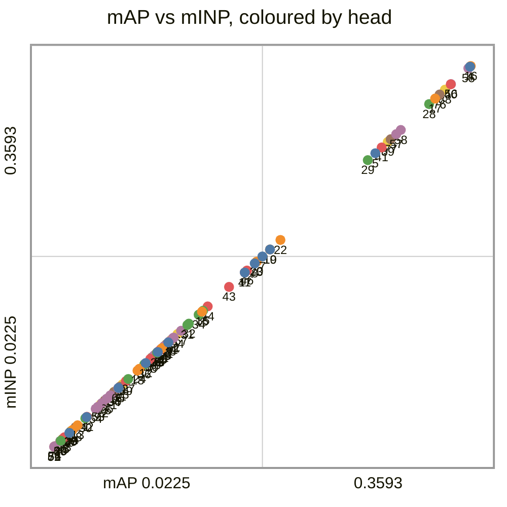
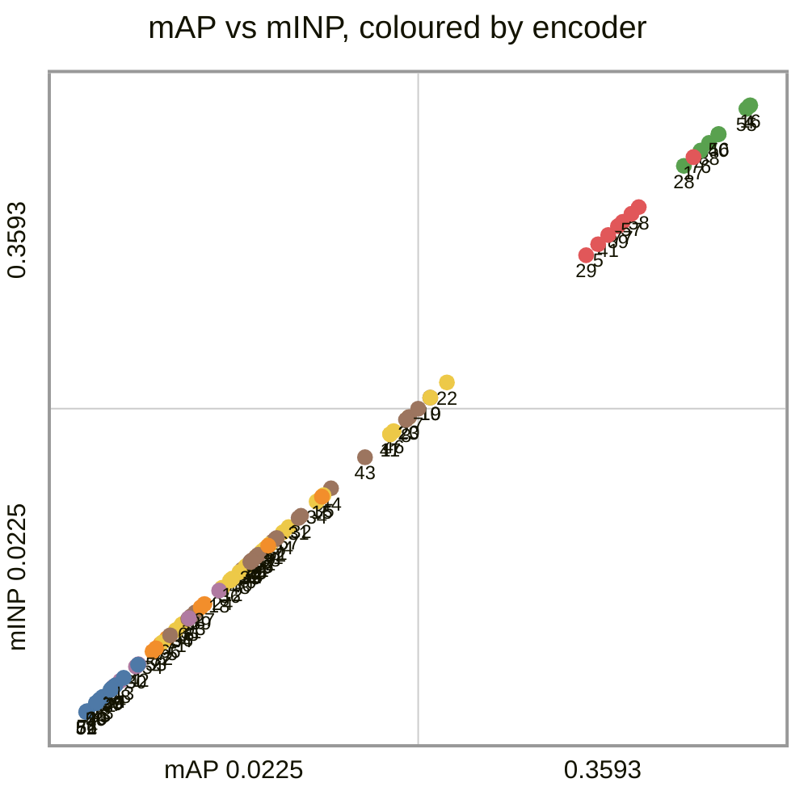
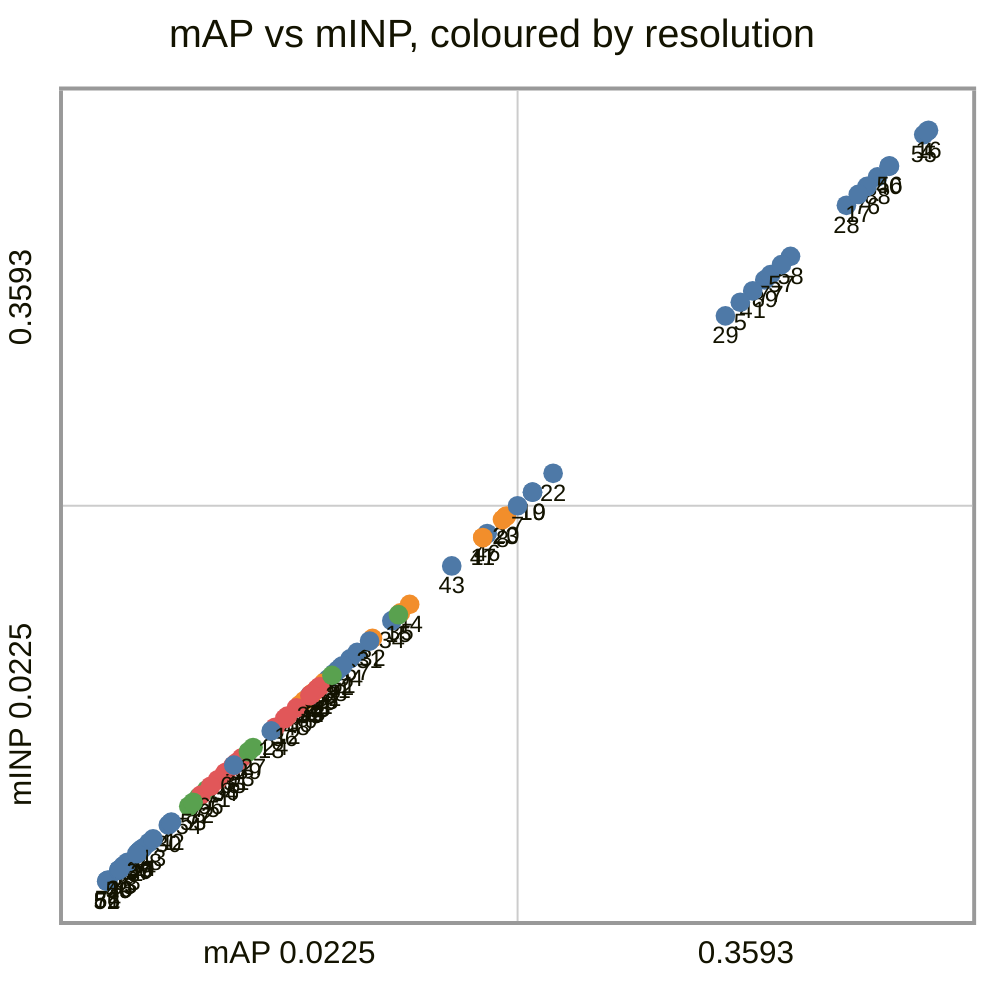

```mermaid
%%{init: {"themeVariables": {"xyChart": {"backgroundColor": "transparent", "plotColorPalette": "#4e79a7,#f28e2b,#59a14f,#e15759,#b07aa1,#9c755f,#edc948"}}, "xyChart": {"height": 1600, "width": 1320, "yAxis": {"showLabel": false}}}}%%
xychart-beta horizontal
    title "mAP, coloured by encoder"
    x-axis ["224x224 arcface vit_base_patch16_clip_224.openai crop · 4.89%", "224x224 arcface vit_base_patch16_clip_224.openai squash · 3.49%", "224x224 arcface vit_huge_plus_patch16_dinov3.lvd1689m squash · 35.88%", "224x224 arcface vit_large_patch16_dinov3.lvd1689m squash · 28.22%", "224x224 arcface vit_so400m_patch14_siglip_224.v2_webli squash · 7.46%", "224x224 arcface c-radio_v4-h squash · 19.09%", "224x224 arcface c-radio_v4-so400m squash · 19.71%", "224x224 arcface-msmt17 vit_base_patch16_clip_224.openai crop · 4.15%", "224x224 arcface-msmt17 vit_base_patch16_clip_224.openai squash · 3.74%", "224x224 arcface-msmt17 vit_huge_plus_patch16_dinov3.lvd1689m squash · 35.93%", "224x224 arcface-msmt17 vit_large_patch16_dinov3.lvd1689m squash · 33.05%", "224x224 arcface-msmt17 vit_so400m_patch14_siglip_224.v2_webli squash · 9.00%", "224x224 arcface-msmt17 c-radio_v4-h squash · 19.70%", "224x224 arcface-msmt17 c-radio_v4-so400m squash · 20.55%", "224x224 linear vit_base_patch16_clip_224.openai crop · 3.61%", "224x224 linear vit_base_patch16_clip_224.openai squash · 2.79%", "224x224 linear vit_huge_plus_patch16_dinov3.lvd1689m squash · 32.57%", "224x224 linear vit_large_patch16_dinov3.lvd1689m squash · 27.61%", "224x224 linear vit_so400m_patch14_siglip_224.v2_webli squash · 4.78%", "224x224 linear c-radio_v4-h squash · 13.02%", "224x224 linear c-radio_v4-so400m squash · 13.94%", "224x224 linear-msmt17 vit_base_patch16_clip_224.openai crop · 3.55%", "224x224 linear-msmt17 vit_base_patch16_clip_224.openai squash · 3.11%", "224x224 linear-msmt17 vit_huge_plus_patch16_dinov3.lvd1689m squash · 34.32%", "224x224 linear-msmt17 vit_large_patch16_dinov3.lvd1689m squash · 28.73%", "224x224 linear-msmt17 vit_so400m_patch14_siglip_224.v2_webli squash · 4.91%", "224x224 linear-msmt17 c-radio_v4-h squash · 16.39%", "224x224 linear-msmt17 c-radio_v4-so400m squash · 17.85%", "224x224 none vit_base_patch16_clip_224.openai crop · 2.75%", "224x224 none vit_base_patch16_clip_224.openai crop · 2.75%", "224x224 none vit_base_patch16_clip_224.openai squash · 2.28%", "224x224 none vit_base_patch16_clip_224.openai squash · 2.25%", "224x224 none vit_huge_plus_patch16_dinov3.lvd1689m squash · 35.74%", "224x224 none vit_huge_plus_patch16_dinov3.lvd1689m squash · 34.33%", "224x224 none vit_large_patch16_dinov3.lvd1689m squash · 29.91%", "224x224 none vit_large_patch16_dinov3.lvd1689m squash · 30.28%", "224x224 none vit_so400m_patch14_siglip_224.v2_webli squash · 3.61%", "224x224 none vit_so400m_patch14_siglip_224.v2_webli squash · 3.58%", "224x224 none c-radio_v4-h squash · 11.92%", "224x224 none c-radio_v4-h squash · 11.86%", "224x224 none c-radio_v4-so400m squash · 12.52%", "224x224 none c-radio_v4-so400m squash · 11.58%", "224x224 pca vit_base_patch16_clip_224.openai crop · 2.98%", "224x224 pca vit_base_patch16_clip_224.openai squash · 2.31%", "224x224 pca vit_huge_plus_patch16_dinov3.lvd1689m squash · 33.41%", "224x224 pca vit_large_patch16_dinov3.lvd1689m squash · 29.46%", "224x224 pca vit_so400m_patch14_siglip_224.v2_webli squash · 3.99%", "224x224 pca c-radio_v4-h squash · 10.57%", "224x224 pca c-radio_v4-so400m squash · 11.33%", "224x224 pca-msmt17 vit_base_patch16_clip_224.openai crop · 2.92%", "224x224 pca-msmt17 vit_base_patch16_clip_224.openai squash · 2.27%", "224x224 pca-msmt17 vit_huge_plus_patch16_dinov3.lvd1689m squash · 33.84%", "224x224 pca-msmt17 vit_large_patch16_dinov3.lvd1689m squash · 29.22%", "224x224 pca-msmt17 vit_so400m_patch14_siglip_224.v2_webli squash · 3.68%", "224x224 pca-msmt17 c-radio_v4-h squash · 11.73%", "224x224 pca-msmt17 c-radio_v4-so400m squash · 12.23%", "256x128 arcface c-radio_v4-h squash · 18.47%", "256x128 arcface c-radio_v4-so400m squash · 17.67%", "256x128 arcface-msmt17 c-radio_v4-h squash · 18.63%", "256x128 arcface-msmt17 c-radio_v4-so400m squash · 18.60%", "256x128 linear c-radio_v4-h squash · 13.14%", "256x128 linear c-radio_v4-so400m squash · 14.29%", "256x128 linear-msmt17 c-radio_v4-h squash · 14.67%", "256x128 linear-msmt17 c-radio_v4-so400m squash · 17.67%", "256x128 none c-radio_v4-h squash · 10.68%", "256x128 none c-radio_v4-h squash · 10.66%", "256x128 none c-radio_v4-so400m squash · 11.14%", "256x128 none c-radio_v4-so400m squash · 10.35%", "256x128 pca c-radio_v4-h squash · 10.16%", "256x128 pca c-radio_v4-so400m squash · 10.89%", "256x128 pca-msmt17 c-radio_v4-h squash · 10.62%", "256x128 pca-msmt17 c-radio_v4-so400m squash · 11.22%", "256x256 arcface vit_giantopt_patch16_siglip_256.v2_webli squash · 11.48%", "256x256 arcface-msmt17 vit_giantopt_patch16_siglip_256.v2_webli squash · 14.21%", "256x256 linear vit_giantopt_patch16_siglip_256.v2_webli squash · 8.25%", "256x256 linear-msmt17 vit_giantopt_patch16_siglip_256.v2_webli squash · 8.06%", "256x256 none vit_giantopt_patch16_siglip_256.v2_webli squash · 5.80%", "256x256 none vit_giantopt_patch16_siglip_256.v2_webli squash · 5.62%", "256x256 pca vit_giantopt_patch16_siglip_256.v2_webli squash · 6.36%", "256x256 pca-msmt17 vit_giantopt_patch16_siglip_256.v2_webli squash · 6.03%", "native arcface c-radio_v4-h squash · 10.64%", "native arcface c-radio_v4-so400m squash · 9.66%", "native arcface-msmt17 c-radio_v4-h squash · 10.99%", "native arcface-msmt17 c-radio_v4-so400m squash · 9.16%", "native linear c-radio_v4-h squash · 10.58%", "native linear c-radio_v4-so400m squash · 9.55%", "native linear-msmt17 c-radio_v4-h squash · 10.86%", "native linear-msmt17 c-radio_v4-so400m squash · 10.03%", "native none c-radio_v4-h squash · 7.43%", "native none c-radio_v4-h squash · 6.51%", "native none c-radio_v4-so400m squash · 6.80%", "native none c-radio_v4-so400m squash · 6.12%", "native pca c-radio_v4-h squash · 7.56%", "native pca c-radio_v4-so400m squash · 7.09%", "native pca-msmt17 c-radio_v4-h squash · 7.78%", "native pca-msmt17 c-radio_v4-so400m squash · 7.14%"]
    y-axis "mAP (%)" 0 --> 37.73
    bar [4.89, 3.49, 0.00, 0.00, 0.00, 0.00, 0.00, 4.15, 3.74, 0.00, 0.00, 0.00, 0.00, 0.00, 3.61, 2.79, 0.00, 0.00, 0.00, 0.00, 0.00, 3.55, 3.11, 0.00, 0.00, 0.00, 0.00, 0.00, 2.75, 2.75, 2.28, 2.25, 0.00, 0.00, 0.00, 0.00, 0.00, 0.00, 0.00, 0.00, 0.00, 0.00, 2.98, 2.31, 0.00, 0.00, 0.00, 0.00, 0.00, 2.92, 2.27, 0.00, 0.00, 0.00, 0.00, 0.00, 0.00, 0.00, 0.00, 0.00, 0.00, 0.00, 0.00, 0.00, 0.00, 0.00, 0.00, 0.00, 0.00, 0.00, 0.00, 0.00, 0.00, 0.00, 0.00, 0.00, 0.00, 0.00, 0.00, 0.00, 0.00, 0.00, 0.00, 0.00, 0.00, 0.00, 0.00, 0.00, 0.00, 0.00, 0.00, 0.00, 0.00, 0.00, 0.00, 0.00]
    bar [0.00, 0.00, 0.00, 0.00, 0.00, 0.00, 0.00, 0.00, 0.00, 0.00, 0.00, 0.00, 0.00, 0.00, 0.00, 0.00, 0.00, 0.00, 0.00, 0.00, 0.00, 0.00, 0.00, 0.00, 0.00, 0.00, 0.00, 0.00, 0.00, 0.00, 0.00, 0.00, 0.00, 0.00, 0.00, 0.00, 0.00, 0.00, 0.00, 0.00, 0.00, 0.00, 0.00, 0.00, 0.00, 0.00, 0.00, 0.00, 0.00, 0.00, 0.00, 0.00, 0.00, 0.00, 0.00, 0.00, 0.00, 0.00, 0.00, 0.00, 0.00, 0.00, 0.00, 0.00, 0.00, 0.00, 0.00, 0.00, 0.00, 0.00, 0.00, 0.00, 11.48, 14.21, 8.25, 8.06, 5.80, 5.62, 6.36, 6.03, 0.00, 0.00, 0.00, 0.00, 0.00, 0.00, 0.00, 0.00, 0.00, 0.00, 0.00, 0.00, 0.00, 0.00, 0.00, 0.00]
    bar [0.00, 0.00, 35.88, 0.00, 0.00, 0.00, 0.00, 0.00, 0.00, 35.93, 0.00, 0.00, 0.00, 0.00, 0.00, 0.00, 32.57, 0.00, 0.00, 0.00, 0.00, 0.00, 0.00, 34.32, 0.00, 0.00, 0.00, 0.00, 0.00, 0.00, 0.00, 0.00, 35.74, 34.33, 0.00, 0.00, 0.00, 0.00, 0.00, 0.00, 0.00, 0.00, 0.00, 0.00, 33.41, 0.00, 0.00, 0.00, 0.00, 0.00, 0.00, 33.84, 0.00, 0.00, 0.00, 0.00, 0.00, 0.00, 0.00, 0.00, 0.00, 0.00, 0.00, 0.00, 0.00, 0.00, 0.00, 0.00, 0.00, 0.00, 0.00, 0.00, 0.00, 0.00, 0.00, 0.00, 0.00, 0.00, 0.00, 0.00, 0.00, 0.00, 0.00, 0.00, 0.00, 0.00, 0.00, 0.00, 0.00, 0.00, 0.00, 0.00, 0.00, 0.00, 0.00, 0.00]
    bar [0.00, 0.00, 0.00, 28.22, 0.00, 0.00, 0.00, 0.00, 0.00, 0.00, 33.05, 0.00, 0.00, 0.00, 0.00, 0.00, 0.00, 27.61, 0.00, 0.00, 0.00, 0.00, 0.00, 0.00, 28.73, 0.00, 0.00, 0.00, 0.00, 0.00, 0.00, 0.00, 0.00, 0.00, 29.91, 30.28, 0.00, 0.00, 0.00, 0.00, 0.00, 0.00, 0.00, 0.00, 0.00, 29.46, 0.00, 0.00, 0.00, 0.00, 0.00, 0.00, 29.22, 0.00, 0.00, 0.00, 0.00, 0.00, 0.00, 0.00, 0.00, 0.00, 0.00, 0.00, 0.00, 0.00, 0.00, 0.00, 0.00, 0.00, 0.00, 0.00, 0.00, 0.00, 0.00, 0.00, 0.00, 0.00, 0.00, 0.00, 0.00, 0.00, 0.00, 0.00, 0.00, 0.00, 0.00, 0.00, 0.00, 0.00, 0.00, 0.00, 0.00, 0.00, 0.00, 0.00]
    bar [0.00, 0.00, 0.00, 0.00, 7.46, 0.00, 0.00, 0.00, 0.00, 0.00, 0.00, 9.00, 0.00, 0.00, 0.00, 0.00, 0.00, 0.00, 4.78, 0.00, 0.00, 0.00, 0.00, 0.00, 0.00, 4.91, 0.00, 0.00, 0.00, 0.00, 0.00, 0.00, 0.00, 0.00, 0.00, 0.00, 3.61, 3.58, 0.00, 0.00, 0.00, 0.00, 0.00, 0.00, 0.00, 0.00, 3.99, 0.00, 0.00, 0.00, 0.00, 0.00, 0.00, 3.68, 0.00, 0.00, 0.00, 0.00, 0.00, 0.00, 0.00, 0.00, 0.00, 0.00, 0.00, 0.00, 0.00, 0.00, 0.00, 0.00, 0.00, 0.00, 0.00, 0.00, 0.00, 0.00, 0.00, 0.00, 0.00, 0.00, 0.00, 0.00, 0.00, 0.00, 0.00, 0.00, 0.00, 0.00, 0.00, 0.00, 0.00, 0.00, 0.00, 0.00, 0.00, 0.00]
    bar [0.00, 0.00, 0.00, 0.00, 0.00, 19.09, 0.00, 0.00, 0.00, 0.00, 0.00, 0.00, 19.70, 0.00, 0.00, 0.00, 0.00, 0.00, 0.00, 13.02, 0.00, 0.00, 0.00, 0.00, 0.00, 0.00, 16.39, 0.00, 0.00, 0.00, 0.00, 0.00, 0.00, 0.00, 0.00, 0.00, 0.00, 0.00, 11.92, 11.86, 0.00, 0.00, 0.00, 0.00, 0.00, 0.00, 0.00, 10.57, 0.00, 0.00, 0.00, 0.00, 0.00, 0.00, 11.73, 0.00, 18.47, 0.00, 18.63, 0.00, 13.14, 0.00, 14.67, 0.00, 10.68, 10.66, 0.00, 0.00, 10.16, 0.00, 10.62, 0.00, 0.00, 0.00, 0.00, 0.00, 0.00, 0.00, 0.00, 0.00, 10.64, 0.00, 10.99, 0.00, 10.58, 0.00, 10.86, 0.00, 7.43, 6.51, 0.00, 0.00, 7.56, 0.00, 7.78, 0.00]
    bar [0.00, 0.00, 0.00, 0.00, 0.00, 0.00, 19.71, 0.00, 0.00, 0.00, 0.00, 0.00, 0.00, 20.55, 0.00, 0.00, 0.00, 0.00, 0.00, 0.00, 13.94, 0.00, 0.00, 0.00, 0.00, 0.00, 0.00, 17.85, 0.00, 0.00, 0.00, 0.00, 0.00, 0.00, 0.00, 0.00, 0.00, 0.00, 0.00, 0.00, 12.52, 11.58, 0.00, 0.00, 0.00, 0.00, 0.00, 0.00, 11.33, 0.00, 0.00, 0.00, 0.00, 0.00, 0.00, 12.23, 0.00, 17.67, 0.00, 18.60, 0.00, 14.29, 0.00, 17.67, 0.00, 0.00, 11.14, 10.35, 0.00, 10.89, 0.00, 11.22, 0.00, 0.00, 0.00, 0.00, 0.00, 0.00, 0.00, 0.00, 0.00, 9.66, 0.00, 9.16, 0.00, 9.55, 0.00, 10.03, 0.00, 0.00, 6.80, 6.12, 0.00, 7.09, 0.00, 7.14]
```

<!-- generated by `reidbench render`; edit the runs, not this file -->

# vric

[← table.md](../table.md)

## vric/official@1

### 🟦 arcface

|  # | encoder                                       | resolution | resize |        mAP |         R1 |         R5 |        R10 |       mINP |
|---:|-----------------------------------------------|------------|--------|-----------:|-----------:|-----------:|-----------:|-----------:|
|  1 | timm:vit_base_patch16_clip_224.openai         | 224x224    | crop   |     0.0489 |     0.0249 |     0.0601 |     0.0900 |     0.0489 |
|  2 | timm:vit_base_patch16_clip_224.openai         | 224x224    | squash |     0.0349 |     0.0171 |     0.0402 |     0.0626 |     0.0349 |
|  3 | timm:vit_giantopt_patch16_siglip_256.v2_webli | 256x256    | squash |     0.1148 |     0.0726 |     0.1466 |     0.1910 |     0.1148 |
|  4 | timm:vit_huge_plus_patch16_dinov3.lvd1689m    | 224x224    | squash | **0.3588** | **0.2629** | **0.4614** | **0.5386** | **0.3588** |
|  5 | timm:vit_large_patch16_dinov3.lvd1689m        | 224x224    | squash |     0.2822 |     0.1978 |     0.3632 |     0.4457 |     0.2822 |
|  6 | timm:vit_so400m_patch14_siglip_224.v2_webli   | 224x224    | squash |     0.0746 |     0.0420 |     0.0996 |     0.1323 |     0.0746 |
|  7 | torchhub:NVlabs/RADIO/c-radio_v4-h            | 224x224    | squash |     0.1909 |     0.1252 |     0.2440 |     0.3195 |     0.1909 |
|  8 | torchhub:NVlabs/RADIO/c-radio_v4-h            | 256x128    | squash |     0.1847 |     0.1195 |     0.2405 |     0.3191 |     0.1847 |
|  9 | torchhub:NVlabs/RADIO/c-radio_v4-h            | native     | squash |     0.1064 |     0.0662 |     0.1323 |     0.1843 |     0.1064 |
| 10 | torchhub:NVlabs/RADIO/c-radio_v4-so400m       | 224x224    | squash |     0.1971 |     0.1295 |     0.2565 |     0.3305 |     0.1971 |
| 11 | torchhub:NVlabs/RADIO/c-radio_v4-so400m       | 256x128    | squash |     0.1767 |     0.1106 |     0.2376 |     0.2999 |     0.1767 |
| 12 | torchhub:NVlabs/RADIO/c-radio_v4-so400m       | native     | squash |     0.0966 |     0.0544 |     0.1252 |     0.1700 |     0.0966 |

### 🟧 arcface-msmt17

|  # | encoder                                       | resolution | resize |        mAP |         R1 |         R5 |        R10 |       mINP |
|---:|-----------------------------------------------|------------|--------|-----------:|-----------:|-----------:|-----------:|-----------:|
| 13 | timm:vit_base_patch16_clip_224.openai         | 224x224    | crop   |     0.0415 |     0.0213 |     0.0509 |     0.0736 |     0.0415 |
| 14 | timm:vit_base_patch16_clip_224.openai         | 224x224    | squash |     0.0374 |     0.0199 |     0.0448 |     0.0658 |     0.0374 |
| 15 | timm:vit_giantopt_patch16_siglip_256.v2_webli | 256x256    | squash |     0.1421 |     0.0904 |     0.1825 |     0.2323 |     0.1421 |
| 16 | timm:vit_huge_plus_patch16_dinov3.lvd1689m    | 224x224    | squash | **0.3593** | **0.2629** | **0.4628** | **0.5471** | **0.3593** |
| 17 | timm:vit_large_patch16_dinov3.lvd1689m        | 224x224    | squash |     0.3305 |     0.2437 |     0.4258 |     0.4966 |     0.3305 |
| 18 | timm:vit_so400m_patch14_siglip_224.v2_webli   | 224x224    | squash |     0.0900 |     0.0516 |     0.1163 |     0.1523 |     0.0900 |
| 19 | torchhub:NVlabs/RADIO/c-radio_v4-h            | 224x224    | squash |     0.1970 |     0.1291 |     0.2558 |     0.3244 |     0.1970 |
| 20 | torchhub:NVlabs/RADIO/c-radio_v4-h            | 256x128    | squash |     0.1863 |     0.1217 |     0.2444 |     0.3123 |     0.1863 |
| 21 | torchhub:NVlabs/RADIO/c-radio_v4-h            | native     | squash |     0.1099 |     0.0662 |     0.1419 |     0.1939 |     0.1099 |
| 22 | torchhub:NVlabs/RADIO/c-radio_v4-so400m       | 224x224    | squash |     0.2055 |     0.1380 |     0.2622 |     0.3330 |     0.2055 |
| 23 | torchhub:NVlabs/RADIO/c-radio_v4-so400m       | 256x128    | squash |     0.1860 |     0.1217 |     0.2419 |     0.3031 |     0.1860 |
| 24 | torchhub:NVlabs/RADIO/c-radio_v4-so400m       | native     | squash |     0.0916 |     0.0519 |     0.1199 |     0.1612 |     0.0916 |

### 🟩 linear

|  # | encoder                                       | resolution | resize |        mAP |         R1 |         R5 |        R10 |       mINP |
|---:|-----------------------------------------------|------------|--------|-----------:|-----------:|-----------:|-----------:|-----------:|
| 25 | timm:vit_base_patch16_clip_224.openai         | 224x224    | crop   |     0.0361 |     0.0167 |     0.0434 |     0.0701 |     0.0361 |
| 26 | timm:vit_base_patch16_clip_224.openai         | 224x224    | squash |     0.0279 |     0.0128 |     0.0356 |     0.0512 |     0.0279 |
| 27 | timm:vit_giantopt_patch16_siglip_256.v2_webli | 256x256    | squash |     0.0825 |     0.0480 |     0.1032 |     0.1355 |     0.0825 |
| 28 | timm:vit_huge_plus_patch16_dinov3.lvd1689m    | 224x224    | squash | **0.3257** | **0.2323** | **0.4219** | **0.5027** | **0.3257** |
| 29 | timm:vit_large_patch16_dinov3.lvd1689m        | 224x224    | squash |     0.2761 |     0.1885 |     0.3671 |     0.4457 |     0.2761 |
| 30 | timm:vit_so400m_patch14_siglip_224.v2_webli   | 224x224    | squash |     0.0478 |     0.0267 |     0.0544 |     0.0800 |     0.0478 |
| 31 | torchhub:NVlabs/RADIO/c-radio_v4-h            | 224x224    | squash |     0.1302 |     0.0797 |     0.1676 |     0.2291 |     0.1302 |
| 32 | torchhub:NVlabs/RADIO/c-radio_v4-h            | 256x128    | squash |     0.1314 |     0.0790 |     0.1772 |     0.2263 |     0.1314 |
| 33 | torchhub:NVlabs/RADIO/c-radio_v4-h            | native     | squash |     0.1058 |     0.0608 |     0.1405 |     0.1935 |     0.1058 |
| 34 | torchhub:NVlabs/RADIO/c-radio_v4-so400m       | 224x224    | squash |     0.1394 |     0.0864 |     0.1789 |     0.2394 |     0.1394 |
| 35 | torchhub:NVlabs/RADIO/c-radio_v4-so400m       | 256x128    | squash |     0.1429 |     0.0886 |     0.1871 |     0.2465 |     0.1429 |
| 36 | torchhub:NVlabs/RADIO/c-radio_v4-so400m       | native     | squash |     0.0955 |     0.0498 |     0.1316 |     0.1839 |     0.0955 |

### 🟥 linear-msmt17

|  # | encoder                                       | resolution | resize |        mAP |         R1 |         R5 |        R10 |       mINP |
|---:|-----------------------------------------------|------------|--------|-----------:|-----------:|-----------:|-----------:|-----------:|
| 37 | timm:vit_base_patch16_clip_224.openai         | 224x224    | crop   |     0.0355 |     0.0174 |     0.0455 |     0.0615 |     0.0355 |
| 38 | timm:vit_base_patch16_clip_224.openai         | 224x224    | squash |     0.0311 |     0.0157 |     0.0370 |     0.0505 |     0.0311 |
| 39 | timm:vit_giantopt_patch16_siglip_256.v2_webli | 256x256    | squash |     0.0806 |     0.0470 |     0.1046 |     0.1341 |     0.0806 |
| 40 | timm:vit_huge_plus_patch16_dinov3.lvd1689m    | 224x224    | squash | **0.3432** | **0.2508** | **0.4329** | **0.5251** | **0.3432** |
| 41 | timm:vit_large_patch16_dinov3.lvd1689m        | 224x224    | squash |     0.2873 |     0.1985 |     0.3803 |     0.4621 |     0.2873 |
| 42 | timm:vit_so400m_patch14_siglip_224.v2_webli   | 224x224    | squash |     0.0491 |     0.0302 |     0.0562 |     0.0761 |     0.0491 |
| 43 | torchhub:NVlabs/RADIO/c-radio_v4-h            | 224x224    | squash |     0.1639 |     0.1039 |     0.2124 |     0.2771 |     0.1639 |
| 44 | torchhub:NVlabs/RADIO/c-radio_v4-h            | 256x128    | squash |     0.1467 |     0.0918 |     0.1885 |     0.2515 |     0.1467 |
| 45 | torchhub:NVlabs/RADIO/c-radio_v4-h            | native     | squash |     0.1086 |     0.0644 |     0.1398 |     0.1885 |     0.1086 |
| 46 | torchhub:NVlabs/RADIO/c-radio_v4-so400m       | 224x224    | squash |     0.1785 |     0.1117 |     0.2351 |     0.3006 |     0.1785 |
| 47 | torchhub:NVlabs/RADIO/c-radio_v4-so400m       | 256x128    | squash |     0.1767 |     0.1138 |     0.2302 |     0.2928 |     0.1767 |
| 48 | torchhub:NVlabs/RADIO/c-radio_v4-so400m       | native     | squash |     0.1003 |     0.0576 |     0.1309 |     0.1754 |     0.1003 |

### 🟪 none

|  # | encoder                                       | resolution | resize |        mAP |         R1 |         R5 |        R10 |       mINP |
|---:|-----------------------------------------------|------------|--------|-----------:|-----------:|-----------:|-----------:|-----------:|
| 49 | timm:vit_base_patch16_clip_224.openai         | 224x224    | crop   |     0.0275 |     0.0135 |     0.0345 |     0.0473 |     0.0275 |
| 50 | timm:vit_base_patch16_clip_224.openai         | 224x224    | crop   |     0.0275 |     0.0135 |     0.0349 |     0.0484 |     0.0275 |
| 51 | timm:vit_base_patch16_clip_224.openai         | 224x224    | squash |     0.0228 |     0.0103 |     0.0270 |     0.0395 |     0.0228 |
| 52 | timm:vit_base_patch16_clip_224.openai         | 224x224    | squash |     0.0225 |     0.0100 |     0.0270 |     0.0391 |     0.0225 |
| 53 | timm:vit_giantopt_patch16_siglip_256.v2_webli | 256x256    | squash |     0.0580 |     0.0338 |     0.0715 |     0.1003 |     0.0580 |
| 54 | timm:vit_giantopt_patch16_siglip_256.v2_webli | 256x256    | squash |     0.0562 |     0.0327 |     0.0701 |     0.0971 |     0.0562 |
| 55 | timm:vit_huge_plus_patch16_dinov3.lvd1689m    | 224x224    | squash | **0.3574** | **0.2657** | **0.4522** | **0.5375** | **0.3574** |
| 56 | timm:vit_huge_plus_patch16_dinov3.lvd1689m    | 224x224    | squash |     0.3433 |     0.2565 |     0.4322 |     0.5116 |     0.3433 |
| 57 | timm:vit_large_patch16_dinov3.lvd1689m        | 224x224    | squash |     0.2991 |     0.2063 |     0.3913 |     0.4803 |     0.2991 |
| 58 | timm:vit_large_patch16_dinov3.lvd1689m        | 224x224    | squash |     0.3028 |     0.2106 |     0.3977 |     0.4859 |     0.3028 |
| 59 | timm:vit_so400m_patch14_siglip_224.v2_webli   | 224x224    | squash |     0.0361 |     0.0206 |     0.0406 |     0.0587 |     0.0361 |
| 60 | timm:vit_so400m_patch14_siglip_224.v2_webli   | 224x224    | squash |     0.0358 |     0.0206 |     0.0395 |     0.0573 |     0.0358 |
| 61 | torchhub:NVlabs/RADIO/c-radio_v4-h            | 224x224    | squash |     0.1192 |     0.0800 |     0.1473 |     0.1878 |     0.1192 |
| 62 | torchhub:NVlabs/RADIO/c-radio_v4-h            | 224x224    | squash |     0.1186 |     0.0793 |     0.1483 |     0.1893 |     0.1186 |
| 63 | torchhub:NVlabs/RADIO/c-radio_v4-h            | 256x128    | squash |     0.1068 |     0.0662 |     0.1366 |     0.1846 |     0.1068 |
| 64 | torchhub:NVlabs/RADIO/c-radio_v4-h            | 256x128    | squash |     0.1066 |     0.0676 |     0.1348 |     0.1800 |     0.1066 |
| 65 | torchhub:NVlabs/RADIO/c-radio_v4-h            | native     | squash |     0.0743 |     0.0445 |     0.0921 |     0.1256 |     0.0743 |
| 66 | torchhub:NVlabs/RADIO/c-radio_v4-h            | native     | squash |     0.0651 |     0.0395 |     0.0783 |     0.1078 |     0.0651 |
| 67 | torchhub:NVlabs/RADIO/c-radio_v4-so400m       | 224x224    | squash |     0.1252 |     0.0815 |     0.1569 |     0.2078 |     0.1252 |
| 68 | torchhub:NVlabs/RADIO/c-radio_v4-so400m       | 224x224    | squash |     0.1158 |     0.0740 |     0.1473 |     0.1889 |     0.1158 |
| 69 | torchhub:NVlabs/RADIO/c-radio_v4-so400m       | 256x128    | squash |     0.1114 |     0.0697 |     0.1434 |     0.1925 |     0.1114 |
| 70 | torchhub:NVlabs/RADIO/c-radio_v4-so400m       | 256x128    | squash |     0.1035 |     0.0644 |     0.1348 |     0.1797 |     0.1035 |
| 71 | torchhub:NVlabs/RADIO/c-radio_v4-so400m       | native     | squash |     0.0680 |     0.0359 |     0.0936 |     0.1224 |     0.0680 |
| 72 | torchhub:NVlabs/RADIO/c-radio_v4-so400m       | native     | squash |     0.0612 |     0.0324 |     0.0836 |     0.1106 |     0.0612 |

### 🟫 pca

|  # | encoder                                       | resolution | resize |        mAP |         R1 |         R5 |        R10 |       mINP |
|---:|-----------------------------------------------|------------|--------|-----------:|-----------:|-----------:|-----------:|-----------:|
| 73 | timm:vit_base_patch16_clip_224.openai         | 224x224    | crop   |     0.0298 |     0.0149 |     0.0345 |     0.0512 |     0.0298 |
| 74 | timm:vit_base_patch16_clip_224.openai         | 224x224    | squash |     0.0231 |     0.0103 |     0.0263 |     0.0406 |     0.0231 |
| 75 | timm:vit_giantopt_patch16_siglip_256.v2_webli | 256x256    | squash |     0.0636 |     0.0359 |     0.0829 |     0.1096 |     0.0636 |
| 76 | timm:vit_huge_plus_patch16_dinov3.lvd1689m    | 224x224    | squash | **0.3341** | **0.2423** | **0.4301** | **0.5094** | **0.3341** |
| 77 | timm:vit_large_patch16_dinov3.lvd1689m        | 224x224    | squash |     0.2946 |     0.2042 |     0.3860 |     0.4703 |     0.2946 |
| 78 | timm:vit_so400m_patch14_siglip_224.v2_webli   | 224x224    | squash |     0.0399 |     0.0213 |     0.0494 |     0.0676 |     0.0399 |
| 79 | torchhub:NVlabs/RADIO/c-radio_v4-h            | 224x224    | squash |     0.1057 |     0.0672 |     0.1320 |     0.1743 |     0.1057 |
| 80 | torchhub:NVlabs/RADIO/c-radio_v4-h            | 256x128    | squash |     0.1016 |     0.0647 |     0.1284 |     0.1700 |     0.1016 |
| 81 | torchhub:NVlabs/RADIO/c-radio_v4-h            | native     | squash |     0.0756 |     0.0445 |     0.0961 |     0.1309 |     0.0756 |
| 82 | torchhub:NVlabs/RADIO/c-radio_v4-so400m       | 224x224    | squash |     0.1133 |     0.0704 |     0.1430 |     0.1946 |     0.1133 |
| 83 | torchhub:NVlabs/RADIO/c-radio_v4-so400m       | 256x128    | squash |     0.1089 |     0.0672 |     0.1423 |     0.1910 |     0.1089 |
| 84 | torchhub:NVlabs/RADIO/c-radio_v4-so400m       | native     | squash |     0.0709 |     0.0366 |     0.0978 |     0.1270 |     0.0709 |

### 🟨 pca-msmt17

|  # | encoder                                       | resolution | resize |        mAP |         R1 |         R5 |        R10 |       mINP |
|---:|-----------------------------------------------|------------|--------|-----------:|-----------:|-----------:|-----------:|-----------:|
| 85 | timm:vit_base_patch16_clip_224.openai         | 224x224    | crop   |     0.0292 |     0.0157 |     0.0334 |     0.0505 |     0.0292 |
| 86 | timm:vit_base_patch16_clip_224.openai         | 224x224    | squash |     0.0227 |     0.0110 |     0.0263 |     0.0384 |     0.0227 |
| 87 | timm:vit_giantopt_patch16_siglip_256.v2_webli | 256x256    | squash |     0.0603 |     0.0345 |     0.0783 |     0.1025 |     0.0603 |
| 88 | timm:vit_huge_plus_patch16_dinov3.lvd1689m    | 224x224    | squash | **0.3384** | **0.2487** | **0.4326** | **0.5091** | **0.3384** |
| 89 | timm:vit_large_patch16_dinov3.lvd1689m        | 224x224    | squash |     0.2922 |     0.2017 |     0.3838 |     0.4671 |     0.2922 |
| 90 | timm:vit_so400m_patch14_siglip_224.v2_webli   | 224x224    | squash |     0.0368 |     0.0210 |     0.0416 |     0.0587 |     0.0368 |
| 91 | torchhub:NVlabs/RADIO/c-radio_v4-h            | 224x224    | squash |     0.1173 |     0.0772 |     0.1455 |     0.1882 |     0.1173 |
| 92 | torchhub:NVlabs/RADIO/c-radio_v4-h            | 256x128    | squash |     0.1062 |     0.0676 |     0.1330 |     0.1736 |     0.1062 |
| 93 | torchhub:NVlabs/RADIO/c-radio_v4-h            | native     | squash |     0.0778 |     0.0470 |     0.0957 |     0.1370 |     0.0778 |
| 94 | torchhub:NVlabs/RADIO/c-radio_v4-so400m       | 224x224    | squash |     0.1223 |     0.0776 |     0.1558 |     0.2046 |     0.1223 |
| 95 | torchhub:NVlabs/RADIO/c-radio_v4-so400m       | 256x128    | squash |     0.1122 |     0.0697 |     0.1444 |     0.1960 |     0.1122 |
| 96 | torchhub:NVlabs/RADIO/c-radio_v4-so400m       | native     | squash |     0.0714 |     0.0388 |     0.0993 |     0.1242 |     0.0714 |

### Every row, by encoder and resolution

```mermaid
%%{init: {"themeVariables": {"xyChart": {"backgroundColor": "transparent", "plotColorPalette": "#4e79a7,#f28e2b,#59a14f,#e15759,#b07aa1,#9c755f,#edc948"}}, "xyChart": {"height": 1600, "width": 1320, "yAxis": {"showLabel": false}}}}%%
xychart-beta horizontal
    title "mAP, coloured by head"
    x-axis ["vit_base_patch16_clip_224.openai 224x224 arcface crop · 4.89%", "vit_base_patch16_clip_224.openai 224x224 arcface squash · 3.49%", "vit_base_patch16_clip_224.openai 224x224 arcface-msmt17 crop · 4.15%", "vit_base_patch16_clip_224.openai 224x224 arcface-msmt17 squash · 3.74%", "vit_base_patch16_clip_224.openai 224x224 linear crop · 3.61%", "vit_base_patch16_clip_224.openai 224x224 linear squash · 2.79%", "vit_base_patch16_clip_224.openai 224x224 linear-msmt17 crop · 3.55%", "vit_base_patch16_clip_224.openai 224x224 linear-msmt17 squash · 3.11%", "vit_base_patch16_clip_224.openai 224x224 none crop · 2.75%", "vit_base_patch16_clip_224.openai 224x224 none crop · 2.75%", "vit_base_patch16_clip_224.openai 224x224 none squash · 2.28%", "vit_base_patch16_clip_224.openai 224x224 none squash · 2.25%", "vit_base_patch16_clip_224.openai 224x224 pca crop · 2.98%", "vit_base_patch16_clip_224.openai 224x224 pca squash · 2.31%", "vit_base_patch16_clip_224.openai 224x224 pca-msmt17 crop · 2.92%", "vit_base_patch16_clip_224.openai 224x224 pca-msmt17 squash · 2.27%", "vit_giantopt_patch16_siglip_256.v2_webli 256x256 arcface squash · 11.48%", "vit_giantopt_patch16_siglip_256.v2_webli 256x256 arcface-msmt17 squash · 14.21%", "vit_giantopt_patch16_siglip_256.v2_webli 256x256 linear squash · 8.25%", "vit_giantopt_patch16_siglip_256.v2_webli 256x256 linear-msmt17 squash · 8.06%", "vit_giantopt_patch16_siglip_256.v2_webli 256x256 none squash · 5.80%", "vit_giantopt_patch16_siglip_256.v2_webli 256x256 none squash · 5.62%", "vit_giantopt_patch16_siglip_256.v2_webli 256x256 pca squash · 6.36%", "vit_giantopt_patch16_siglip_256.v2_webli 256x256 pca-msmt17 squash · 6.03%", "vit_huge_plus_patch16_dinov3.lvd1689m 224x224 arcface squash · 35.88%", "vit_huge_plus_patch16_dinov3.lvd1689m 224x224 arcface-msmt17 squash · 35.93%", "vit_huge_plus_patch16_dinov3.lvd1689m 224x224 linear squash · 32.57%", "vit_huge_plus_patch16_dinov3.lvd1689m 224x224 linear-msmt17 squash · 34.32%", "vit_huge_plus_patch16_dinov3.lvd1689m 224x224 none squash · 35.74%", "vit_huge_plus_patch16_dinov3.lvd1689m 224x224 none squash · 34.33%", "vit_huge_plus_patch16_dinov3.lvd1689m 224x224 pca squash · 33.41%", "vit_huge_plus_patch16_dinov3.lvd1689m 224x224 pca-msmt17 squash · 33.84%", "vit_large_patch16_dinov3.lvd1689m 224x224 arcface squash · 28.22%", "vit_large_patch16_dinov3.lvd1689m 224x224 arcface-msmt17 squash · 33.05%", "vit_large_patch16_dinov3.lvd1689m 224x224 linear squash · 27.61%", "vit_large_patch16_dinov3.lvd1689m 224x224 linear-msmt17 squash · 28.73%", "vit_large_patch16_dinov3.lvd1689m 224x224 none squash · 29.91%", "vit_large_patch16_dinov3.lvd1689m 224x224 none squash · 30.28%", "vit_large_patch16_dinov3.lvd1689m 224x224 pca squash · 29.46%", "vit_large_patch16_dinov3.lvd1689m 224x224 pca-msmt17 squash · 29.22%", "vit_so400m_patch14_siglip_224.v2_webli 224x224 arcface squash · 7.46%", "vit_so400m_patch14_siglip_224.v2_webli 224x224 arcface-msmt17 squash · 9.00%", "vit_so400m_patch14_siglip_224.v2_webli 224x224 linear squash · 4.78%", "vit_so400m_patch14_siglip_224.v2_webli 224x224 linear-msmt17 squash · 4.91%", "vit_so400m_patch14_siglip_224.v2_webli 224x224 none squash · 3.61%", "vit_so400m_patch14_siglip_224.v2_webli 224x224 none squash · 3.58%", "vit_so400m_patch14_siglip_224.v2_webli 224x224 pca squash · 3.99%", "vit_so400m_patch14_siglip_224.v2_webli 224x224 pca-msmt17 squash · 3.68%", "c-radio_v4-h 224x224 arcface squash · 19.09%", "c-radio_v4-h 224x224 arcface-msmt17 squash · 19.70%", "c-radio_v4-h 224x224 linear squash · 13.02%", "c-radio_v4-h 224x224 linear-msmt17 squash · 16.39%", "c-radio_v4-h 224x224 none squash · 11.92%", "c-radio_v4-h 224x224 none squash · 11.86%", "c-radio_v4-h 224x224 pca squash · 10.57%", "c-radio_v4-h 224x224 pca-msmt17 squash · 11.73%", "c-radio_v4-h 256x128 arcface squash · 18.47%", "c-radio_v4-h 256x128 arcface-msmt17 squash · 18.63%", "c-radio_v4-h 256x128 linear squash · 13.14%", "c-radio_v4-h 256x128 linear-msmt17 squash · 14.67%", "c-radio_v4-h 256x128 none squash · 10.68%", "c-radio_v4-h 256x128 none squash · 10.66%", "c-radio_v4-h 256x128 pca squash · 10.16%", "c-radio_v4-h 256x128 pca-msmt17 squash · 10.62%", "c-radio_v4-h native arcface squash · 10.64%", "c-radio_v4-h native arcface-msmt17 squash · 10.99%", "c-radio_v4-h native linear squash · 10.58%", "c-radio_v4-h native linear-msmt17 squash · 10.86%", "c-radio_v4-h native none squash · 7.43%", "c-radio_v4-h native none squash · 6.51%", "c-radio_v4-h native pca squash · 7.56%", "c-radio_v4-h native pca-msmt17 squash · 7.78%", "c-radio_v4-so400m 224x224 arcface squash · 19.71%", "c-radio_v4-so400m 224x224 arcface-msmt17 squash · 20.55%", "c-radio_v4-so400m 224x224 linear squash · 13.94%", "c-radio_v4-so400m 224x224 linear-msmt17 squash · 17.85%", "c-radio_v4-so400m 224x224 none squash · 12.52%", "c-radio_v4-so400m 224x224 none squash · 11.58%", "c-radio_v4-so400m 224x224 pca squash · 11.33%", "c-radio_v4-so400m 224x224 pca-msmt17 squash · 12.23%", "c-radio_v4-so400m 256x128 arcface squash · 17.67%", "c-radio_v4-so400m 256x128 arcface-msmt17 squash · 18.60%", "c-radio_v4-so400m 256x128 linear squash · 14.29%", "c-radio_v4-so400m 256x128 linear-msmt17 squash · 17.67%", "c-radio_v4-so400m 256x128 none squash · 11.14%", "c-radio_v4-so400m 256x128 none squash · 10.35%", "c-radio_v4-so400m 256x128 pca squash · 10.89%", "c-radio_v4-so400m 256x128 pca-msmt17 squash · 11.22%", "c-radio_v4-so400m native arcface squash · 9.66%", "c-radio_v4-so400m native arcface-msmt17 squash · 9.16%", "c-radio_v4-so400m native linear squash · 9.55%", "c-radio_v4-so400m native linear-msmt17 squash · 10.03%", "c-radio_v4-so400m native none squash · 6.80%", "c-radio_v4-so400m native none squash · 6.12%", "c-radio_v4-so400m native pca squash · 7.09%", "c-radio_v4-so400m native pca-msmt17 squash · 7.14%"]
    y-axis "mAP (%)" 0 --> 37.73
    bar [4.89, 3.49, 0.00, 0.00, 0.00, 0.00, 0.00, 0.00, 0.00, 0.00, 0.00, 0.00, 0.00, 0.00, 0.00, 0.00, 11.48, 0.00, 0.00, 0.00, 0.00, 0.00, 0.00, 0.00, 35.88, 0.00, 0.00, 0.00, 0.00, 0.00, 0.00, 0.00, 28.22, 0.00, 0.00, 0.00, 0.00, 0.00, 0.00, 0.00, 7.46, 0.00, 0.00, 0.00, 0.00, 0.00, 0.00, 0.00, 19.09, 0.00, 0.00, 0.00, 0.00, 0.00, 0.00, 0.00, 18.47, 0.00, 0.00, 0.00, 0.00, 0.00, 0.00, 0.00, 10.64, 0.00, 0.00, 0.00, 0.00, 0.00, 0.00, 0.00, 19.71, 0.00, 0.00, 0.00, 0.00, 0.00, 0.00, 0.00, 17.67, 0.00, 0.00, 0.00, 0.00, 0.00, 0.00, 0.00, 9.66, 0.00, 0.00, 0.00, 0.00, 0.00, 0.00, 0.00]
    bar [0.00, 0.00, 4.15, 3.74, 0.00, 0.00, 0.00, 0.00, 0.00, 0.00, 0.00, 0.00, 0.00, 0.00, 0.00, 0.00, 0.00, 14.21, 0.00, 0.00, 0.00, 0.00, 0.00, 0.00, 0.00, 35.93, 0.00, 0.00, 0.00, 0.00, 0.00, 0.00, 0.00, 33.05, 0.00, 0.00, 0.00, 0.00, 0.00, 0.00, 0.00, 9.00, 0.00, 0.00, 0.00, 0.00, 0.00, 0.00, 0.00, 19.70, 0.00, 0.00, 0.00, 0.00, 0.00, 0.00, 0.00, 18.63, 0.00, 0.00, 0.00, 0.00, 0.00, 0.00, 0.00, 10.99, 0.00, 0.00, 0.00, 0.00, 0.00, 0.00, 0.00, 20.55, 0.00, 0.00, 0.00, 0.00, 0.00, 0.00, 0.00, 18.60, 0.00, 0.00, 0.00, 0.00, 0.00, 0.00, 0.00, 9.16, 0.00, 0.00, 0.00, 0.00, 0.00, 0.00]
    bar [0.00, 0.00, 0.00, 0.00, 3.61, 2.79, 0.00, 0.00, 0.00, 0.00, 0.00, 0.00, 0.00, 0.00, 0.00, 0.00, 0.00, 0.00, 8.25, 0.00, 0.00, 0.00, 0.00, 0.00, 0.00, 0.00, 32.57, 0.00, 0.00, 0.00, 0.00, 0.00, 0.00, 0.00, 27.61, 0.00, 0.00, 0.00, 0.00, 0.00, 0.00, 0.00, 4.78, 0.00, 0.00, 0.00, 0.00, 0.00, 0.00, 0.00, 13.02, 0.00, 0.00, 0.00, 0.00, 0.00, 0.00, 0.00, 13.14, 0.00, 0.00, 0.00, 0.00, 0.00, 0.00, 0.00, 10.58, 0.00, 0.00, 0.00, 0.00, 0.00, 0.00, 0.00, 13.94, 0.00, 0.00, 0.00, 0.00, 0.00, 0.00, 0.00, 14.29, 0.00, 0.00, 0.00, 0.00, 0.00, 0.00, 0.00, 9.55, 0.00, 0.00, 0.00, 0.00, 0.00]
    bar [0.00, 0.00, 0.00, 0.00, 0.00, 0.00, 3.55, 3.11, 0.00, 0.00, 0.00, 0.00, 0.00, 0.00, 0.00, 0.00, 0.00, 0.00, 0.00, 8.06, 0.00, 0.00, 0.00, 0.00, 0.00, 0.00, 0.00, 34.32, 0.00, 0.00, 0.00, 0.00, 0.00, 0.00, 0.00, 28.73, 0.00, 0.00, 0.00, 0.00, 0.00, 0.00, 0.00, 4.91, 0.00, 0.00, 0.00, 0.00, 0.00, 0.00, 0.00, 16.39, 0.00, 0.00, 0.00, 0.00, 0.00, 0.00, 0.00, 14.67, 0.00, 0.00, 0.00, 0.00, 0.00, 0.00, 0.00, 10.86, 0.00, 0.00, 0.00, 0.00, 0.00, 0.00, 0.00, 17.85, 0.00, 0.00, 0.00, 0.00, 0.00, 0.00, 0.00, 17.67, 0.00, 0.00, 0.00, 0.00, 0.00, 0.00, 0.00, 10.03, 0.00, 0.00, 0.00, 0.00]
    bar [0.00, 0.00, 0.00, 0.00, 0.00, 0.00, 0.00, 0.00, 2.75, 2.75, 2.28, 2.25, 0.00, 0.00, 0.00, 0.00, 0.00, 0.00, 0.00, 0.00, 5.80, 5.62, 0.00, 0.00, 0.00, 0.00, 0.00, 0.00, 35.74, 34.33, 0.00, 0.00, 0.00, 0.00, 0.00, 0.00, 29.91, 30.28, 0.00, 0.00, 0.00, 0.00, 0.00, 0.00, 3.61, 3.58, 0.00, 0.00, 0.00, 0.00, 0.00, 0.00, 11.92, 11.86, 0.00, 0.00, 0.00, 0.00, 0.00, 0.00, 10.68, 10.66, 0.00, 0.00, 0.00, 0.00, 0.00, 0.00, 7.43, 6.51, 0.00, 0.00, 0.00, 0.00, 0.00, 0.00, 12.52, 11.58, 0.00, 0.00, 0.00, 0.00, 0.00, 0.00, 11.14, 10.35, 0.00, 0.00, 0.00, 0.00, 0.00, 0.00, 6.80, 6.12, 0.00, 0.00]
    bar [0.00, 0.00, 0.00, 0.00, 0.00, 0.00, 0.00, 0.00, 0.00, 0.00, 0.00, 0.00, 2.98, 2.31, 0.00, 0.00, 0.00, 0.00, 0.00, 0.00, 0.00, 0.00, 6.36, 0.00, 0.00, 0.00, 0.00, 0.00, 0.00, 0.00, 33.41, 0.00, 0.00, 0.00, 0.00, 0.00, 0.00, 0.00, 29.46, 0.00, 0.00, 0.00, 0.00, 0.00, 0.00, 0.00, 3.99, 0.00, 0.00, 0.00, 0.00, 0.00, 0.00, 0.00, 10.57, 0.00, 0.00, 0.00, 0.00, 0.00, 0.00, 0.00, 10.16, 0.00, 0.00, 0.00, 0.00, 0.00, 0.00, 0.00, 7.56, 0.00, 0.00, 0.00, 0.00, 0.00, 0.00, 0.00, 11.33, 0.00, 0.00, 0.00, 0.00, 0.00, 0.00, 0.00, 10.89, 0.00, 0.00, 0.00, 0.00, 0.00, 0.00, 0.00, 7.09, 0.00]
    bar [0.00, 0.00, 0.00, 0.00, 0.00, 0.00, 0.00, 0.00, 0.00, 0.00, 0.00, 0.00, 0.00, 0.00, 2.92, 2.27, 0.00, 0.00, 0.00, 0.00, 0.00, 0.00, 0.00, 6.03, 0.00, 0.00, 0.00, 0.00, 0.00, 0.00, 0.00, 33.84, 0.00, 0.00, 0.00, 0.00, 0.00, 0.00, 0.00, 29.22, 0.00, 0.00, 0.00, 0.00, 0.00, 0.00, 0.00, 3.68, 0.00, 0.00, 0.00, 0.00, 0.00, 0.00, 0.00, 11.73, 0.00, 0.00, 0.00, 0.00, 0.00, 0.00, 0.00, 10.62, 0.00, 0.00, 0.00, 0.00, 0.00, 0.00, 0.00, 7.78, 0.00, 0.00, 0.00, 0.00, 0.00, 0.00, 0.00, 12.23, 0.00, 0.00, 0.00, 0.00, 0.00, 0.00, 0.00, 11.22, 0.00, 0.00, 0.00, 0.00, 0.00, 0.00, 0.00, 7.14]
```

### By head — does the probe carry it?

```mermaid
%%{init: {"themeVariables": {"xyChart": {"backgroundColor": "transparent", "plotColorPalette": "#4e79a7,#f28e2b,#59a14f,#e15759,#b07aa1,#9c755f,#edc948"}}, "xyChart": {"height": 1600, "width": 1320, "yAxis": {"showLabel": false}}}}%%
xychart-beta horizontal
    title "mAP, coloured by head"
    x-axis ["arcface vit_base_patch16_clip_224.openai 224x224 crop · 4.89%", "arcface vit_base_patch16_clip_224.openai 224x224 squash · 3.49%", "arcface vit_giantopt_patch16_siglip_256.v2_webli 256x256 squash · 11.48%", "arcface vit_huge_plus_patch16_dinov3.lvd1689m 224x224 squash · 35.88%", "arcface vit_large_patch16_dinov3.lvd1689m 224x224 squash · 28.22%", "arcface vit_so400m_patch14_siglip_224.v2_webli 224x224 squash · 7.46%", "arcface c-radio_v4-h 224x224 squash · 19.09%", "arcface c-radio_v4-h 256x128 squash · 18.47%", "arcface c-radio_v4-h native squash · 10.64%", "arcface c-radio_v4-so400m 224x224 squash · 19.71%", "arcface c-radio_v4-so400m 256x128 squash · 17.67%", "arcface c-radio_v4-so400m native squash · 9.66%", "arcface-msmt17 vit_base_patch16_clip_224.openai 224x224 crop · 4.15%", "arcface-msmt17 vit_base_patch16_clip_224.openai 224x224 squash · 3.74%", "arcface-msmt17 vit_giantopt_patch16_siglip_256.v2_webli 256x256 squash · 14.21%", "arcface-msmt17 vit_huge_plus_patch16_dinov3.lvd1689m 224x224 squash · 35.93%", "arcface-msmt17 vit_large_patch16_dinov3.lvd1689m 224x224 squash · 33.05%", "arcface-msmt17 vit_so400m_patch14_siglip_224.v2_webli 224x224 squash · 9.00%", "arcface-msmt17 c-radio_v4-h 224x224 squash · 19.70%", "arcface-msmt17 c-radio_v4-h 256x128 squash · 18.63%", "arcface-msmt17 c-radio_v4-h native squash · 10.99%", "arcface-msmt17 c-radio_v4-so400m 224x224 squash · 20.55%", "arcface-msmt17 c-radio_v4-so400m 256x128 squash · 18.60%", "arcface-msmt17 c-radio_v4-so400m native squash · 9.16%", "linear vit_base_patch16_clip_224.openai 224x224 crop · 3.61%", "linear vit_base_patch16_clip_224.openai 224x224 squash · 2.79%", "linear vit_giantopt_patch16_siglip_256.v2_webli 256x256 squash · 8.25%", "linear vit_huge_plus_patch16_dinov3.lvd1689m 224x224 squash · 32.57%", "linear vit_large_patch16_dinov3.lvd1689m 224x224 squash · 27.61%", "linear vit_so400m_patch14_siglip_224.v2_webli 224x224 squash · 4.78%", "linear c-radio_v4-h 224x224 squash · 13.02%", "linear c-radio_v4-h 256x128 squash · 13.14%", "linear c-radio_v4-h native squash · 10.58%", "linear c-radio_v4-so400m 224x224 squash · 13.94%", "linear c-radio_v4-so400m 256x128 squash · 14.29%", "linear c-radio_v4-so400m native squash · 9.55%", "linear-msmt17 vit_base_patch16_clip_224.openai 224x224 crop · 3.55%", "linear-msmt17 vit_base_patch16_clip_224.openai 224x224 squash · 3.11%", "linear-msmt17 vit_giantopt_patch16_siglip_256.v2_webli 256x256 squash · 8.06%", "linear-msmt17 vit_huge_plus_patch16_dinov3.lvd1689m 224x224 squash · 34.32%", "linear-msmt17 vit_large_patch16_dinov3.lvd1689m 224x224 squash · 28.73%", "linear-msmt17 vit_so400m_patch14_siglip_224.v2_webli 224x224 squash · 4.91%", "linear-msmt17 c-radio_v4-h 224x224 squash · 16.39%", "linear-msmt17 c-radio_v4-h 256x128 squash · 14.67%", "linear-msmt17 c-radio_v4-h native squash · 10.86%", "linear-msmt17 c-radio_v4-so400m 224x224 squash · 17.85%", "linear-msmt17 c-radio_v4-so400m 256x128 squash · 17.67%", "linear-msmt17 c-radio_v4-so400m native squash · 10.03%", "none vit_base_patch16_clip_224.openai 224x224 crop · 2.75%", "none vit_base_patch16_clip_224.openai 224x224 crop · 2.75%", "none vit_base_patch16_clip_224.openai 224x224 squash · 2.28%", "none vit_base_patch16_clip_224.openai 224x224 squash · 2.25%", "none vit_giantopt_patch16_siglip_256.v2_webli 256x256 squash · 5.80%", "none vit_giantopt_patch16_siglip_256.v2_webli 256x256 squash · 5.62%", "none vit_huge_plus_patch16_dinov3.lvd1689m 224x224 squash · 35.74%", "none vit_huge_plus_patch16_dinov3.lvd1689m 224x224 squash · 34.33%", "none vit_large_patch16_dinov3.lvd1689m 224x224 squash · 29.91%", "none vit_large_patch16_dinov3.lvd1689m 224x224 squash · 30.28%", "none vit_so400m_patch14_siglip_224.v2_webli 224x224 squash · 3.61%", "none vit_so400m_patch14_siglip_224.v2_webli 224x224 squash · 3.58%", "none c-radio_v4-h 224x224 squash · 11.92%", "none c-radio_v4-h 224x224 squash · 11.86%", "none c-radio_v4-h 256x128 squash · 10.68%", "none c-radio_v4-h 256x128 squash · 10.66%", "none c-radio_v4-h native squash · 7.43%", "none c-radio_v4-h native squash · 6.51%", "none c-radio_v4-so400m 224x224 squash · 12.52%", "none c-radio_v4-so400m 224x224 squash · 11.58%", "none c-radio_v4-so400m 256x128 squash · 11.14%", "none c-radio_v4-so400m 256x128 squash · 10.35%", "none c-radio_v4-so400m native squash · 6.80%", "none c-radio_v4-so400m native squash · 6.12%", "pca vit_base_patch16_clip_224.openai 224x224 crop · 2.98%", "pca vit_base_patch16_clip_224.openai 224x224 squash · 2.31%", "pca vit_giantopt_patch16_siglip_256.v2_webli 256x256 squash · 6.36%", "pca vit_huge_plus_patch16_dinov3.lvd1689m 224x224 squash · 33.41%", "pca vit_large_patch16_dinov3.lvd1689m 224x224 squash · 29.46%", "pca vit_so400m_patch14_siglip_224.v2_webli 224x224 squash · 3.99%", "pca c-radio_v4-h 224x224 squash · 10.57%", "pca c-radio_v4-h 256x128 squash · 10.16%", "pca c-radio_v4-h native squash · 7.56%", "pca c-radio_v4-so400m 224x224 squash · 11.33%", "pca c-radio_v4-so400m 256x128 squash · 10.89%", "pca c-radio_v4-so400m native squash · 7.09%", "pca-msmt17 vit_base_patch16_clip_224.openai 224x224 crop · 2.92%", "pca-msmt17 vit_base_patch16_clip_224.openai 224x224 squash · 2.27%", "pca-msmt17 vit_giantopt_patch16_siglip_256.v2_webli 256x256 squash · 6.03%", "pca-msmt17 vit_huge_plus_patch16_dinov3.lvd1689m 224x224 squash · 33.84%", "pca-msmt17 vit_large_patch16_dinov3.lvd1689m 224x224 squash · 29.22%", "pca-msmt17 vit_so400m_patch14_siglip_224.v2_webli 224x224 squash · 3.68%", "pca-msmt17 c-radio_v4-h 224x224 squash · 11.73%", "pca-msmt17 c-radio_v4-h 256x128 squash · 10.62%", "pca-msmt17 c-radio_v4-h native squash · 7.78%", "pca-msmt17 c-radio_v4-so400m 224x224 squash · 12.23%", "pca-msmt17 c-radio_v4-so400m 256x128 squash · 11.22%", "pca-msmt17 c-radio_v4-so400m native squash · 7.14%"]
    y-axis "mAP (%)" 0 --> 37.73
    bar [4.89, 3.49, 11.48, 35.88, 28.22, 7.46, 19.09, 18.47, 10.64, 19.71, 17.67, 9.66, 0.00, 0.00, 0.00, 0.00, 0.00, 0.00, 0.00, 0.00, 0.00, 0.00, 0.00, 0.00, 0.00, 0.00, 0.00, 0.00, 0.00, 0.00, 0.00, 0.00, 0.00, 0.00, 0.00, 0.00, 0.00, 0.00, 0.00, 0.00, 0.00, 0.00, 0.00, 0.00, 0.00, 0.00, 0.00, 0.00, 0.00, 0.00, 0.00, 0.00, 0.00, 0.00, 0.00, 0.00, 0.00, 0.00, 0.00, 0.00, 0.00, 0.00, 0.00, 0.00, 0.00, 0.00, 0.00, 0.00, 0.00, 0.00, 0.00, 0.00, 0.00, 0.00, 0.00, 0.00, 0.00, 0.00, 0.00, 0.00, 0.00, 0.00, 0.00, 0.00, 0.00, 0.00, 0.00, 0.00, 0.00, 0.00, 0.00, 0.00, 0.00, 0.00, 0.00, 0.00]
    bar [0.00, 0.00, 0.00, 0.00, 0.00, 0.00, 0.00, 0.00, 0.00, 0.00, 0.00, 0.00, 4.15, 3.74, 14.21, 35.93, 33.05, 9.00, 19.70, 18.63, 10.99, 20.55, 18.60, 9.16, 0.00, 0.00, 0.00, 0.00, 0.00, 0.00, 0.00, 0.00, 0.00, 0.00, 0.00, 0.00, 0.00, 0.00, 0.00, 0.00, 0.00, 0.00, 0.00, 0.00, 0.00, 0.00, 0.00, 0.00, 0.00, 0.00, 0.00, 0.00, 0.00, 0.00, 0.00, 0.00, 0.00, 0.00, 0.00, 0.00, 0.00, 0.00, 0.00, 0.00, 0.00, 0.00, 0.00, 0.00, 0.00, 0.00, 0.00, 0.00, 0.00, 0.00, 0.00, 0.00, 0.00, 0.00, 0.00, 0.00, 0.00, 0.00, 0.00, 0.00, 0.00, 0.00, 0.00, 0.00, 0.00, 0.00, 0.00, 0.00, 0.00, 0.00, 0.00, 0.00]
    bar [0.00, 0.00, 0.00, 0.00, 0.00, 0.00, 0.00, 0.00, 0.00, 0.00, 0.00, 0.00, 0.00, 0.00, 0.00, 0.00, 0.00, 0.00, 0.00, 0.00, 0.00, 0.00, 0.00, 0.00, 3.61, 2.79, 8.25, 32.57, 27.61, 4.78, 13.02, 13.14, 10.58, 13.94, 14.29, 9.55, 0.00, 0.00, 0.00, 0.00, 0.00, 0.00, 0.00, 0.00, 0.00, 0.00, 0.00, 0.00, 0.00, 0.00, 0.00, 0.00, 0.00, 0.00, 0.00, 0.00, 0.00, 0.00, 0.00, 0.00, 0.00, 0.00, 0.00, 0.00, 0.00, 0.00, 0.00, 0.00, 0.00, 0.00, 0.00, 0.00, 0.00, 0.00, 0.00, 0.00, 0.00, 0.00, 0.00, 0.00, 0.00, 0.00, 0.00, 0.00, 0.00, 0.00, 0.00, 0.00, 0.00, 0.00, 0.00, 0.00, 0.00, 0.00, 0.00, 0.00]
    bar [0.00, 0.00, 0.00, 0.00, 0.00, 0.00, 0.00, 0.00, 0.00, 0.00, 0.00, 0.00, 0.00, 0.00, 0.00, 0.00, 0.00, 0.00, 0.00, 0.00, 0.00, 0.00, 0.00, 0.00, 0.00, 0.00, 0.00, 0.00, 0.00, 0.00, 0.00, 0.00, 0.00, 0.00, 0.00, 0.00, 3.55, 3.11, 8.06, 34.32, 28.73, 4.91, 16.39, 14.67, 10.86, 17.85, 17.67, 10.03, 0.00, 0.00, 0.00, 0.00, 0.00, 0.00, 0.00, 0.00, 0.00, 0.00, 0.00, 0.00, 0.00, 0.00, 0.00, 0.00, 0.00, 0.00, 0.00, 0.00, 0.00, 0.00, 0.00, 0.00, 0.00, 0.00, 0.00, 0.00, 0.00, 0.00, 0.00, 0.00, 0.00, 0.00, 0.00, 0.00, 0.00, 0.00, 0.00, 0.00, 0.00, 0.00, 0.00, 0.00, 0.00, 0.00, 0.00, 0.00]
    bar [0.00, 0.00, 0.00, 0.00, 0.00, 0.00, 0.00, 0.00, 0.00, 0.00, 0.00, 0.00, 0.00, 0.00, 0.00, 0.00, 0.00, 0.00, 0.00, 0.00, 0.00, 0.00, 0.00, 0.00, 0.00, 0.00, 0.00, 0.00, 0.00, 0.00, 0.00, 0.00, 0.00, 0.00, 0.00, 0.00, 0.00, 0.00, 0.00, 0.00, 0.00, 0.00, 0.00, 0.00, 0.00, 0.00, 0.00, 0.00, 2.75, 2.75, 2.28, 2.25, 5.80, 5.62, 35.74, 34.33, 29.91, 30.28, 3.61, 3.58, 11.92, 11.86, 10.68, 10.66, 7.43, 6.51, 12.52, 11.58, 11.14, 10.35, 6.80, 6.12, 0.00, 0.00, 0.00, 0.00, 0.00, 0.00, 0.00, 0.00, 0.00, 0.00, 0.00, 0.00, 0.00, 0.00, 0.00, 0.00, 0.00, 0.00, 0.00, 0.00, 0.00, 0.00, 0.00, 0.00]
    bar [0.00, 0.00, 0.00, 0.00, 0.00, 0.00, 0.00, 0.00, 0.00, 0.00, 0.00, 0.00, 0.00, 0.00, 0.00, 0.00, 0.00, 0.00, 0.00, 0.00, 0.00, 0.00, 0.00, 0.00, 0.00, 0.00, 0.00, 0.00, 0.00, 0.00, 0.00, 0.00, 0.00, 0.00, 0.00, 0.00, 0.00, 0.00, 0.00, 0.00, 0.00, 0.00, 0.00, 0.00, 0.00, 0.00, 0.00, 0.00, 0.00, 0.00, 0.00, 0.00, 0.00, 0.00, 0.00, 0.00, 0.00, 0.00, 0.00, 0.00, 0.00, 0.00, 0.00, 0.00, 0.00, 0.00, 0.00, 0.00, 0.00, 0.00, 0.00, 0.00, 2.98, 2.31, 6.36, 33.41, 29.46, 3.99, 10.57, 10.16, 7.56, 11.33, 10.89, 7.09, 0.00, 0.00, 0.00, 0.00, 0.00, 0.00, 0.00, 0.00, 0.00, 0.00, 0.00, 0.00]
    bar [0.00, 0.00, 0.00, 0.00, 0.00, 0.00, 0.00, 0.00, 0.00, 0.00, 0.00, 0.00, 0.00, 0.00, 0.00, 0.00, 0.00, 0.00, 0.00, 0.00, 0.00, 0.00, 0.00, 0.00, 0.00, 0.00, 0.00, 0.00, 0.00, 0.00, 0.00, 0.00, 0.00, 0.00, 0.00, 0.00, 0.00, 0.00, 0.00, 0.00, 0.00, 0.00, 0.00, 0.00, 0.00, 0.00, 0.00, 0.00, 0.00, 0.00, 0.00, 0.00, 0.00, 0.00, 0.00, 0.00, 0.00, 0.00, 0.00, 0.00, 0.00, 0.00, 0.00, 0.00, 0.00, 0.00, 0.00, 0.00, 0.00, 0.00, 0.00, 0.00, 0.00, 0.00, 0.00, 0.00, 0.00, 0.00, 0.00, 0.00, 0.00, 0.00, 0.00, 0.00, 2.92, 2.27, 6.03, 33.84, 29.22, 3.68, 11.73, 10.62, 7.78, 12.23, 11.22, 7.14]
```

### By encoder — does the checkpoint carry it?

*Colour — encoder:* 🟦 timm:vit_base_patch16_clip_224.openai · 🟧 timm:vit_giantopt_patch16_siglip_256.v2_webli · 🟩 timm:vit_huge_plus_patch16_dinov3.lvd1689m · 🟥 timm:vit_large_patch16_dinov3.lvd1689m · 🟪 timm:vit_so400m_patch14_siglip_224.v2_webli · 🟫 torchhub:NVlabs/RADIO/c-radio_v4-h · 🟨 torchhub:NVlabs/RADIO/c-radio_v4-so400m

```mermaid
%%{init: {"themeVariables": {"xyChart": {"backgroundColor": "transparent", "plotColorPalette": "#4e79a7,#f28e2b,#59a14f,#e15759,#b07aa1,#9c755f,#edc948"}}, "xyChart": {"height": 1600, "width": 1320, "yAxis": {"showLabel": false}}}}%%
xychart-beta horizontal
    title "mAP, coloured by encoder"
    x-axis ["vit_base_patch16_clip_224.openai arcface 224x224 crop · 4.89%", "vit_base_patch16_clip_224.openai arcface 224x224 squash · 3.49%", "vit_base_patch16_clip_224.openai arcface-msmt17 224x224 crop · 4.15%", "vit_base_patch16_clip_224.openai arcface-msmt17 224x224 squash · 3.74%", "vit_base_patch16_clip_224.openai linear 224x224 crop · 3.61%", "vit_base_patch16_clip_224.openai linear 224x224 squash · 2.79%", "vit_base_patch16_clip_224.openai linear-msmt17 224x224 crop · 3.55%", "vit_base_patch16_clip_224.openai linear-msmt17 224x224 squash · 3.11%", "vit_base_patch16_clip_224.openai none 224x224 crop · 2.75%", "vit_base_patch16_clip_224.openai none 224x224 crop · 2.75%", "vit_base_patch16_clip_224.openai none 224x224 squash · 2.28%", "vit_base_patch16_clip_224.openai none 224x224 squash · 2.25%", "vit_base_patch16_clip_224.openai pca 224x224 crop · 2.98%", "vit_base_patch16_clip_224.openai pca 224x224 squash · 2.31%", "vit_base_patch16_clip_224.openai pca-msmt17 224x224 crop · 2.92%", "vit_base_patch16_clip_224.openai pca-msmt17 224x224 squash · 2.27%", "vit_giantopt_patch16_siglip_256.v2_webli arcface 256x256 squash · 11.48%", "vit_giantopt_patch16_siglip_256.v2_webli arcface-msmt17 256x256 squash · 14.21%", "vit_giantopt_patch16_siglip_256.v2_webli linear 256x256 squash · 8.25%", "vit_giantopt_patch16_siglip_256.v2_webli linear-msmt17 256x256 squash · 8.06%", "vit_giantopt_patch16_siglip_256.v2_webli none 256x256 squash · 5.80%", "vit_giantopt_patch16_siglip_256.v2_webli none 256x256 squash · 5.62%", "vit_giantopt_patch16_siglip_256.v2_webli pca 256x256 squash · 6.36%", "vit_giantopt_patch16_siglip_256.v2_webli pca-msmt17 256x256 squash · 6.03%", "vit_huge_plus_patch16_dinov3.lvd1689m arcface 224x224 squash · 35.88%", "vit_huge_plus_patch16_dinov3.lvd1689m arcface-msmt17 224x224 squash · 35.93%", "vit_huge_plus_patch16_dinov3.lvd1689m linear 224x224 squash · 32.57%", "vit_huge_plus_patch16_dinov3.lvd1689m linear-msmt17 224x224 squash · 34.32%", "vit_huge_plus_patch16_dinov3.lvd1689m none 224x224 squash · 35.74%", "vit_huge_plus_patch16_dinov3.lvd1689m none 224x224 squash · 34.33%", "vit_huge_plus_patch16_dinov3.lvd1689m pca 224x224 squash · 33.41%", "vit_huge_plus_patch16_dinov3.lvd1689m pca-msmt17 224x224 squash · 33.84%", "vit_large_patch16_dinov3.lvd1689m arcface 224x224 squash · 28.22%", "vit_large_patch16_dinov3.lvd1689m arcface-msmt17 224x224 squash · 33.05%", "vit_large_patch16_dinov3.lvd1689m linear 224x224 squash · 27.61%", "vit_large_patch16_dinov3.lvd1689m linear-msmt17 224x224 squash · 28.73%", "vit_large_patch16_dinov3.lvd1689m none 224x224 squash · 29.91%", "vit_large_patch16_dinov3.lvd1689m none 224x224 squash · 30.28%", "vit_large_patch16_dinov3.lvd1689m pca 224x224 squash · 29.46%", "vit_large_patch16_dinov3.lvd1689m pca-msmt17 224x224 squash · 29.22%", "vit_so400m_patch14_siglip_224.v2_webli arcface 224x224 squash · 7.46%", "vit_so400m_patch14_siglip_224.v2_webli arcface-msmt17 224x224 squash · 9.00%", "vit_so400m_patch14_siglip_224.v2_webli linear 224x224 squash · 4.78%", "vit_so400m_patch14_siglip_224.v2_webli linear-msmt17 224x224 squash · 4.91%", "vit_so400m_patch14_siglip_224.v2_webli none 224x224 squash · 3.61%", "vit_so400m_patch14_siglip_224.v2_webli none 224x224 squash · 3.58%", "vit_so400m_patch14_siglip_224.v2_webli pca 224x224 squash · 3.99%", "vit_so400m_patch14_siglip_224.v2_webli pca-msmt17 224x224 squash · 3.68%", "c-radio_v4-h arcface 224x224 squash · 19.09%", "c-radio_v4-h arcface 256x128 squash · 18.47%", "c-radio_v4-h arcface native squash · 10.64%", "c-radio_v4-h arcface-msmt17 224x224 squash · 19.70%", "c-radio_v4-h arcface-msmt17 256x128 squash · 18.63%", "c-radio_v4-h arcface-msmt17 native squash · 10.99%", "c-radio_v4-h linear 224x224 squash · 13.02%", "c-radio_v4-h linear 256x128 squash · 13.14%", "c-radio_v4-h linear native squash · 10.58%", "c-radio_v4-h linear-msmt17 224x224 squash · 16.39%", "c-radio_v4-h linear-msmt17 256x128 squash · 14.67%", "c-radio_v4-h linear-msmt17 native squash · 10.86%", "c-radio_v4-h none 224x224 squash · 11.92%", "c-radio_v4-h none 224x224 squash · 11.86%", "c-radio_v4-h none 256x128 squash · 10.68%", "c-radio_v4-h none 256x128 squash · 10.66%", "c-radio_v4-h none native squash · 7.43%", "c-radio_v4-h none native squash · 6.51%", "c-radio_v4-h pca 224x224 squash · 10.57%", "c-radio_v4-h pca 256x128 squash · 10.16%", "c-radio_v4-h pca native squash · 7.56%", "c-radio_v4-h pca-msmt17 224x224 squash · 11.73%", "c-radio_v4-h pca-msmt17 256x128 squash · 10.62%", "c-radio_v4-h pca-msmt17 native squash · 7.78%", "c-radio_v4-so400m arcface 224x224 squash · 19.71%", "c-radio_v4-so400m arcface 256x128 squash · 17.67%", "c-radio_v4-so400m arcface native squash · 9.66%", "c-radio_v4-so400m arcface-msmt17 224x224 squash · 20.55%", "c-radio_v4-so400m arcface-msmt17 256x128 squash · 18.60%", "c-radio_v4-so400m arcface-msmt17 native squash · 9.16%", "c-radio_v4-so400m linear 224x224 squash · 13.94%", "c-radio_v4-so400m linear 256x128 squash · 14.29%", "c-radio_v4-so400m linear native squash · 9.55%", "c-radio_v4-so400m linear-msmt17 224x224 squash · 17.85%", "c-radio_v4-so400m linear-msmt17 256x128 squash · 17.67%", "c-radio_v4-so400m linear-msmt17 native squash · 10.03%", "c-radio_v4-so400m none 224x224 squash · 12.52%", "c-radio_v4-so400m none 224x224 squash · 11.58%", "c-radio_v4-so400m none 256x128 squash · 11.14%", "c-radio_v4-so400m none 256x128 squash · 10.35%", "c-radio_v4-so400m none native squash · 6.80%", "c-radio_v4-so400m none native squash · 6.12%", "c-radio_v4-so400m pca 224x224 squash · 11.33%", "c-radio_v4-so400m pca 256x128 squash · 10.89%", "c-radio_v4-so400m pca native squash · 7.09%", "c-radio_v4-so400m pca-msmt17 224x224 squash · 12.23%", "c-radio_v4-so400m pca-msmt17 256x128 squash · 11.22%", "c-radio_v4-so400m pca-msmt17 native squash · 7.14%"]
    y-axis "mAP (%)" 0 --> 37.73
    bar [4.89, 3.49, 4.15, 3.74, 3.61, 2.79, 3.55, 3.11, 2.75, 2.75, 2.28, 2.25, 2.98, 2.31, 2.92, 2.27, 0.00, 0.00, 0.00, 0.00, 0.00, 0.00, 0.00, 0.00, 0.00, 0.00, 0.00, 0.00, 0.00, 0.00, 0.00, 0.00, 0.00, 0.00, 0.00, 0.00, 0.00, 0.00, 0.00, 0.00, 0.00, 0.00, 0.00, 0.00, 0.00, 0.00, 0.00, 0.00, 0.00, 0.00, 0.00, 0.00, 0.00, 0.00, 0.00, 0.00, 0.00, 0.00, 0.00, 0.00, 0.00, 0.00, 0.00, 0.00, 0.00, 0.00, 0.00, 0.00, 0.00, 0.00, 0.00, 0.00, 0.00, 0.00, 0.00, 0.00, 0.00, 0.00, 0.00, 0.00, 0.00, 0.00, 0.00, 0.00, 0.00, 0.00, 0.00, 0.00, 0.00, 0.00, 0.00, 0.00, 0.00, 0.00, 0.00, 0.00]
    bar [0.00, 0.00, 0.00, 0.00, 0.00, 0.00, 0.00, 0.00, 0.00, 0.00, 0.00, 0.00, 0.00, 0.00, 0.00, 0.00, 11.48, 14.21, 8.25, 8.06, 5.80, 5.62, 6.36, 6.03, 0.00, 0.00, 0.00, 0.00, 0.00, 0.00, 0.00, 0.00, 0.00, 0.00, 0.00, 0.00, 0.00, 0.00, 0.00, 0.00, 0.00, 0.00, 0.00, 0.00, 0.00, 0.00, 0.00, 0.00, 0.00, 0.00, 0.00, 0.00, 0.00, 0.00, 0.00, 0.00, 0.00, 0.00, 0.00, 0.00, 0.00, 0.00, 0.00, 0.00, 0.00, 0.00, 0.00, 0.00, 0.00, 0.00, 0.00, 0.00, 0.00, 0.00, 0.00, 0.00, 0.00, 0.00, 0.00, 0.00, 0.00, 0.00, 0.00, 0.00, 0.00, 0.00, 0.00, 0.00, 0.00, 0.00, 0.00, 0.00, 0.00, 0.00, 0.00, 0.00]
    bar [0.00, 0.00, 0.00, 0.00, 0.00, 0.00, 0.00, 0.00, 0.00, 0.00, 0.00, 0.00, 0.00, 0.00, 0.00, 0.00, 0.00, 0.00, 0.00, 0.00, 0.00, 0.00, 0.00, 0.00, 35.88, 35.93, 32.57, 34.32, 35.74, 34.33, 33.41, 33.84, 0.00, 0.00, 0.00, 0.00, 0.00, 0.00, 0.00, 0.00, 0.00, 0.00, 0.00, 0.00, 0.00, 0.00, 0.00, 0.00, 0.00, 0.00, 0.00, 0.00, 0.00, 0.00, 0.00, 0.00, 0.00, 0.00, 0.00, 0.00, 0.00, 0.00, 0.00, 0.00, 0.00, 0.00, 0.00, 0.00, 0.00, 0.00, 0.00, 0.00, 0.00, 0.00, 0.00, 0.00, 0.00, 0.00, 0.00, 0.00, 0.00, 0.00, 0.00, 0.00, 0.00, 0.00, 0.00, 0.00, 0.00, 0.00, 0.00, 0.00, 0.00, 0.00, 0.00, 0.00]
    bar [0.00, 0.00, 0.00, 0.00, 0.00, 0.00, 0.00, 0.00, 0.00, 0.00, 0.00, 0.00, 0.00, 0.00, 0.00, 0.00, 0.00, 0.00, 0.00, 0.00, 0.00, 0.00, 0.00, 0.00, 0.00, 0.00, 0.00, 0.00, 0.00, 0.00, 0.00, 0.00, 28.22, 33.05, 27.61, 28.73, 29.91, 30.28, 29.46, 29.22, 0.00, 0.00, 0.00, 0.00, 0.00, 0.00, 0.00, 0.00, 0.00, 0.00, 0.00, 0.00, 0.00, 0.00, 0.00, 0.00, 0.00, 0.00, 0.00, 0.00, 0.00, 0.00, 0.00, 0.00, 0.00, 0.00, 0.00, 0.00, 0.00, 0.00, 0.00, 0.00, 0.00, 0.00, 0.00, 0.00, 0.00, 0.00, 0.00, 0.00, 0.00, 0.00, 0.00, 0.00, 0.00, 0.00, 0.00, 0.00, 0.00, 0.00, 0.00, 0.00, 0.00, 0.00, 0.00, 0.00]
    bar [0.00, 0.00, 0.00, 0.00, 0.00, 0.00, 0.00, 0.00, 0.00, 0.00, 0.00, 0.00, 0.00, 0.00, 0.00, 0.00, 0.00, 0.00, 0.00, 0.00, 0.00, 0.00, 0.00, 0.00, 0.00, 0.00, 0.00, 0.00, 0.00, 0.00, 0.00, 0.00, 0.00, 0.00, 0.00, 0.00, 0.00, 0.00, 0.00, 0.00, 7.46, 9.00, 4.78, 4.91, 3.61, 3.58, 3.99, 3.68, 0.00, 0.00, 0.00, 0.00, 0.00, 0.00, 0.00, 0.00, 0.00, 0.00, 0.00, 0.00, 0.00, 0.00, 0.00, 0.00, 0.00, 0.00, 0.00, 0.00, 0.00, 0.00, 0.00, 0.00, 0.00, 0.00, 0.00, 0.00, 0.00, 0.00, 0.00, 0.00, 0.00, 0.00, 0.00, 0.00, 0.00, 0.00, 0.00, 0.00, 0.00, 0.00, 0.00, 0.00, 0.00, 0.00, 0.00, 0.00]
    bar [0.00, 0.00, 0.00, 0.00, 0.00, 0.00, 0.00, 0.00, 0.00, 0.00, 0.00, 0.00, 0.00, 0.00, 0.00, 0.00, 0.00, 0.00, 0.00, 0.00, 0.00, 0.00, 0.00, 0.00, 0.00, 0.00, 0.00, 0.00, 0.00, 0.00, 0.00, 0.00, 0.00, 0.00, 0.00, 0.00, 0.00, 0.00, 0.00, 0.00, 0.00, 0.00, 0.00, 0.00, 0.00, 0.00, 0.00, 0.00, 19.09, 18.47, 10.64, 19.70, 18.63, 10.99, 13.02, 13.14, 10.58, 16.39, 14.67, 10.86, 11.92, 11.86, 10.68, 10.66, 7.43, 6.51, 10.57, 10.16, 7.56, 11.73, 10.62, 7.78, 0.00, 0.00, 0.00, 0.00, 0.00, 0.00, 0.00, 0.00, 0.00, 0.00, 0.00, 0.00, 0.00, 0.00, 0.00, 0.00, 0.00, 0.00, 0.00, 0.00, 0.00, 0.00, 0.00, 0.00]
    bar [0.00, 0.00, 0.00, 0.00, 0.00, 0.00, 0.00, 0.00, 0.00, 0.00, 0.00, 0.00, 0.00, 0.00, 0.00, 0.00, 0.00, 0.00, 0.00, 0.00, 0.00, 0.00, 0.00, 0.00, 0.00, 0.00, 0.00, 0.00, 0.00, 0.00, 0.00, 0.00, 0.00, 0.00, 0.00, 0.00, 0.00, 0.00, 0.00, 0.00, 0.00, 0.00, 0.00, 0.00, 0.00, 0.00, 0.00, 0.00, 0.00, 0.00, 0.00, 0.00, 0.00, 0.00, 0.00, 0.00, 0.00, 0.00, 0.00, 0.00, 0.00, 0.00, 0.00, 0.00, 0.00, 0.00, 0.00, 0.00, 0.00, 0.00, 0.00, 0.00, 19.71, 17.67, 9.66, 20.55, 18.60, 9.16, 13.94, 14.29, 9.55, 17.85, 17.67, 10.03, 12.52, 11.58, 11.14, 10.35, 6.80, 6.12, 11.33, 10.89, 7.09, 12.23, 11.22, 7.14]
```

### By resolution — does the input size carry it?

*Colour — resolution:* 🟦 224x224 · 🟧 256x128 · 🟩 256x256 · 🟥 native

```mermaid
%%{init: {"themeVariables": {"xyChart": {"backgroundColor": "transparent", "plotColorPalette": "#4e79a7,#f28e2b,#59a14f,#e15759"}}, "xyChart": {"height": 1600, "width": 1320, "yAxis": {"showLabel": false}}}}%%
xychart-beta horizontal
    title "mAP, coloured by resolution"
    x-axis ["224x224 vit_base_patch16_clip_224.openai arcface crop · 4.89%", "224x224 vit_base_patch16_clip_224.openai arcface squash · 3.49%", "224x224 vit_base_patch16_clip_224.openai arcface-msmt17 crop · 4.15%", "224x224 vit_base_patch16_clip_224.openai arcface-msmt17 squash · 3.74%", "224x224 vit_base_patch16_clip_224.openai linear crop · 3.61%", "224x224 vit_base_patch16_clip_224.openai linear squash · 2.79%", "224x224 vit_base_patch16_clip_224.openai linear-msmt17 crop · 3.55%", "224x224 vit_base_patch16_clip_224.openai linear-msmt17 squash · 3.11%", "224x224 vit_base_patch16_clip_224.openai none crop · 2.75%", "224x224 vit_base_patch16_clip_224.openai none crop · 2.75%", "224x224 vit_base_patch16_clip_224.openai none squash · 2.28%", "224x224 vit_base_patch16_clip_224.openai none squash · 2.25%", "224x224 vit_base_patch16_clip_224.openai pca crop · 2.98%", "224x224 vit_base_patch16_clip_224.openai pca squash · 2.31%", "224x224 vit_base_patch16_clip_224.openai pca-msmt17 crop · 2.92%", "224x224 vit_base_patch16_clip_224.openai pca-msmt17 squash · 2.27%", "224x224 vit_huge_plus_patch16_dinov3.lvd1689m arcface squash · 35.88%", "224x224 vit_huge_plus_patch16_dinov3.lvd1689m arcface-msmt17 squash · 35.93%", "224x224 vit_huge_plus_patch16_dinov3.lvd1689m linear squash · 32.57%", "224x224 vit_huge_plus_patch16_dinov3.lvd1689m linear-msmt17 squash · 34.32%", "224x224 vit_huge_plus_patch16_dinov3.lvd1689m none squash · 35.74%", "224x224 vit_huge_plus_patch16_dinov3.lvd1689m none squash · 34.33%", "224x224 vit_huge_plus_patch16_dinov3.lvd1689m pca squash · 33.41%", "224x224 vit_huge_plus_patch16_dinov3.lvd1689m pca-msmt17 squash · 33.84%", "224x224 vit_large_patch16_dinov3.lvd1689m arcface squash · 28.22%", "224x224 vit_large_patch16_dinov3.lvd1689m arcface-msmt17 squash · 33.05%", "224x224 vit_large_patch16_dinov3.lvd1689m linear squash · 27.61%", "224x224 vit_large_patch16_dinov3.lvd1689m linear-msmt17 squash · 28.73%", "224x224 vit_large_patch16_dinov3.lvd1689m none squash · 29.91%", "224x224 vit_large_patch16_dinov3.lvd1689m none squash · 30.28%", "224x224 vit_large_patch16_dinov3.lvd1689m pca squash · 29.46%", "224x224 vit_large_patch16_dinov3.lvd1689m pca-msmt17 squash · 29.22%", "224x224 vit_so400m_patch14_siglip_224.v2_webli arcface squash · 7.46%", "224x224 vit_so400m_patch14_siglip_224.v2_webli arcface-msmt17 squash · 9.00%", "224x224 vit_so400m_patch14_siglip_224.v2_webli linear squash · 4.78%", "224x224 vit_so400m_patch14_siglip_224.v2_webli linear-msmt17 squash · 4.91%", "224x224 vit_so400m_patch14_siglip_224.v2_webli none squash · 3.61%", "224x224 vit_so400m_patch14_siglip_224.v2_webli none squash · 3.58%", "224x224 vit_so400m_patch14_siglip_224.v2_webli pca squash · 3.99%", "224x224 vit_so400m_patch14_siglip_224.v2_webli pca-msmt17 squash · 3.68%", "224x224 c-radio_v4-h arcface squash · 19.09%", "224x224 c-radio_v4-h arcface-msmt17 squash · 19.70%", "224x224 c-radio_v4-h linear squash · 13.02%", "224x224 c-radio_v4-h linear-msmt17 squash · 16.39%", "224x224 c-radio_v4-h none squash · 11.92%", "224x224 c-radio_v4-h none squash · 11.86%", "224x224 c-radio_v4-h pca squash · 10.57%", "224x224 c-radio_v4-h pca-msmt17 squash · 11.73%", "224x224 c-radio_v4-so400m arcface squash · 19.71%", "224x224 c-radio_v4-so400m arcface-msmt17 squash · 20.55%", "224x224 c-radio_v4-so400m linear squash · 13.94%", "224x224 c-radio_v4-so400m linear-msmt17 squash · 17.85%", "224x224 c-radio_v4-so400m none squash · 12.52%", "224x224 c-radio_v4-so400m none squash · 11.58%", "224x224 c-radio_v4-so400m pca squash · 11.33%", "224x224 c-radio_v4-so400m pca-msmt17 squash · 12.23%", "256x128 c-radio_v4-h arcface squash · 18.47%", "256x128 c-radio_v4-h arcface-msmt17 squash · 18.63%", "256x128 c-radio_v4-h linear squash · 13.14%", "256x128 c-radio_v4-h linear-msmt17 squash · 14.67%", "256x128 c-radio_v4-h none squash · 10.68%", "256x128 c-radio_v4-h none squash · 10.66%", "256x128 c-radio_v4-h pca squash · 10.16%", "256x128 c-radio_v4-h pca-msmt17 squash · 10.62%", "256x128 c-radio_v4-so400m arcface squash · 17.67%", "256x128 c-radio_v4-so400m arcface-msmt17 squash · 18.60%", "256x128 c-radio_v4-so400m linear squash · 14.29%", "256x128 c-radio_v4-so400m linear-msmt17 squash · 17.67%", "256x128 c-radio_v4-so400m none squash · 11.14%", "256x128 c-radio_v4-so400m none squash · 10.35%", "256x128 c-radio_v4-so400m pca squash · 10.89%", "256x128 c-radio_v4-so400m pca-msmt17 squash · 11.22%", "256x256 vit_giantopt_patch16_siglip_256.v2_webli arcface squash · 11.48%", "256x256 vit_giantopt_patch16_siglip_256.v2_webli arcface-msmt17 squash · 14.21%", "256x256 vit_giantopt_patch16_siglip_256.v2_webli linear squash · 8.25%", "256x256 vit_giantopt_patch16_siglip_256.v2_webli linear-msmt17 squash · 8.06%", "256x256 vit_giantopt_patch16_siglip_256.v2_webli none squash · 5.80%", "256x256 vit_giantopt_patch16_siglip_256.v2_webli none squash · 5.62%", "256x256 vit_giantopt_patch16_siglip_256.v2_webli pca squash · 6.36%", "256x256 vit_giantopt_patch16_siglip_256.v2_webli pca-msmt17 squash · 6.03%", "native c-radio_v4-h arcface squash · 10.64%", "native c-radio_v4-h arcface-msmt17 squash · 10.99%", "native c-radio_v4-h linear squash · 10.58%", "native c-radio_v4-h linear-msmt17 squash · 10.86%", "native c-radio_v4-h none squash · 7.43%", "native c-radio_v4-h none squash · 6.51%", "native c-radio_v4-h pca squash · 7.56%", "native c-radio_v4-h pca-msmt17 squash · 7.78%", "native c-radio_v4-so400m arcface squash · 9.66%", "native c-radio_v4-so400m arcface-msmt17 squash · 9.16%", "native c-radio_v4-so400m linear squash · 9.55%", "native c-radio_v4-so400m linear-msmt17 squash · 10.03%", "native c-radio_v4-so400m none squash · 6.80%", "native c-radio_v4-so400m none squash · 6.12%", "native c-radio_v4-so400m pca squash · 7.09%", "native c-radio_v4-so400m pca-msmt17 squash · 7.14%"]
    y-axis "mAP (%)" 0 --> 37.73
    bar [4.89, 3.49, 4.15, 3.74, 3.61, 2.79, 3.55, 3.11, 2.75, 2.75, 2.28, 2.25, 2.98, 2.31, 2.92, 2.27, 35.88, 35.93, 32.57, 34.32, 35.74, 34.33, 33.41, 33.84, 28.22, 33.05, 27.61, 28.73, 29.91, 30.28, 29.46, 29.22, 7.46, 9.00, 4.78, 4.91, 3.61, 3.58, 3.99, 3.68, 19.09, 19.70, 13.02, 16.39, 11.92, 11.86, 10.57, 11.73, 19.71, 20.55, 13.94, 17.85, 12.52, 11.58, 11.33, 12.23, 0.00, 0.00, 0.00, 0.00, 0.00, 0.00, 0.00, 0.00, 0.00, 0.00, 0.00, 0.00, 0.00, 0.00, 0.00, 0.00, 0.00, 0.00, 0.00, 0.00, 0.00, 0.00, 0.00, 0.00, 0.00, 0.00, 0.00, 0.00, 0.00, 0.00, 0.00, 0.00, 0.00, 0.00, 0.00, 0.00, 0.00, 0.00, 0.00, 0.00]
    bar [0.00, 0.00, 0.00, 0.00, 0.00, 0.00, 0.00, 0.00, 0.00, 0.00, 0.00, 0.00, 0.00, 0.00, 0.00, 0.00, 0.00, 0.00, 0.00, 0.00, 0.00, 0.00, 0.00, 0.00, 0.00, 0.00, 0.00, 0.00, 0.00, 0.00, 0.00, 0.00, 0.00, 0.00, 0.00, 0.00, 0.00, 0.00, 0.00, 0.00, 0.00, 0.00, 0.00, 0.00, 0.00, 0.00, 0.00, 0.00, 0.00, 0.00, 0.00, 0.00, 0.00, 0.00, 0.00, 0.00, 18.47, 18.63, 13.14, 14.67, 10.68, 10.66, 10.16, 10.62, 17.67, 18.60, 14.29, 17.67, 11.14, 10.35, 10.89, 11.22, 0.00, 0.00, 0.00, 0.00, 0.00, 0.00, 0.00, 0.00, 0.00, 0.00, 0.00, 0.00, 0.00, 0.00, 0.00, 0.00, 0.00, 0.00, 0.00, 0.00, 0.00, 0.00, 0.00, 0.00]
    bar [0.00, 0.00, 0.00, 0.00, 0.00, 0.00, 0.00, 0.00, 0.00, 0.00, 0.00, 0.00, 0.00, 0.00, 0.00, 0.00, 0.00, 0.00, 0.00, 0.00, 0.00, 0.00, 0.00, 0.00, 0.00, 0.00, 0.00, 0.00, 0.00, 0.00, 0.00, 0.00, 0.00, 0.00, 0.00, 0.00, 0.00, 0.00, 0.00, 0.00, 0.00, 0.00, 0.00, 0.00, 0.00, 0.00, 0.00, 0.00, 0.00, 0.00, 0.00, 0.00, 0.00, 0.00, 0.00, 0.00, 0.00, 0.00, 0.00, 0.00, 0.00, 0.00, 0.00, 0.00, 0.00, 0.00, 0.00, 0.00, 0.00, 0.00, 0.00, 0.00, 11.48, 14.21, 8.25, 8.06, 5.80, 5.62, 6.36, 6.03, 0.00, 0.00, 0.00, 0.00, 0.00, 0.00, 0.00, 0.00, 0.00, 0.00, 0.00, 0.00, 0.00, 0.00, 0.00, 0.00]
    bar [0.00, 0.00, 0.00, 0.00, 0.00, 0.00, 0.00, 0.00, 0.00, 0.00, 0.00, 0.00, 0.00, 0.00, 0.00, 0.00, 0.00, 0.00, 0.00, 0.00, 0.00, 0.00, 0.00, 0.00, 0.00, 0.00, 0.00, 0.00, 0.00, 0.00, 0.00, 0.00, 0.00, 0.00, 0.00, 0.00, 0.00, 0.00, 0.00, 0.00, 0.00, 0.00, 0.00, 0.00, 0.00, 0.00, 0.00, 0.00, 0.00, 0.00, 0.00, 0.00, 0.00, 0.00, 0.00, 0.00, 0.00, 0.00, 0.00, 0.00, 0.00, 0.00, 0.00, 0.00, 0.00, 0.00, 0.00, 0.00, 0.00, 0.00, 0.00, 0.00, 0.00, 0.00, 0.00, 0.00, 0.00, 0.00, 0.00, 0.00, 10.64, 10.99, 10.58, 10.86, 7.43, 6.51, 7.56, 7.78, 9.66, 9.16, 9.55, 10.03, 6.80, 6.12, 7.09, 7.14]
```

### Resolution, within one encoder and head

*Colour — resolution:* 🟦 224x224 · 🟧 256x128 · 🟩 256x256 · 🟥 native

```mermaid
%%{init: {"themeVariables": {"xyChart": {"backgroundColor": "transparent", "plotColorPalette": "#4e79a7,#f28e2b,#59a14f,#e15759"}}, "xyChart": {"height": 1600, "width": 1320, "yAxis": {"showLabel": false}}}}%%
xychart-beta horizontal
    title "mAP, coloured by resolution"
    x-axis ["vit_base_patch16_clip_224.openai arcface 224x224 crop · 4.89%", "vit_base_patch16_clip_224.openai arcface 224x224 squash · 3.49%", "vit_base_patch16_clip_224.openai arcface-msmt17 224x224 crop · 4.15%", "vit_base_patch16_clip_224.openai arcface-msmt17 224x224 squash · 3.74%", "vit_base_patch16_clip_224.openai linear 224x224 crop · 3.61%", "vit_base_patch16_clip_224.openai linear 224x224 squash · 2.79%", "vit_base_patch16_clip_224.openai linear-msmt17 224x224 crop · 3.55%", "vit_base_patch16_clip_224.openai linear-msmt17 224x224 squash · 3.11%", "vit_base_patch16_clip_224.openai none 224x224 crop · 2.75%", "vit_base_patch16_clip_224.openai none 224x224 crop · 2.75%", "vit_base_patch16_clip_224.openai none 224x224 squash · 2.28%", "vit_base_patch16_clip_224.openai none 224x224 squash · 2.25%", "vit_base_patch16_clip_224.openai pca 224x224 crop · 2.98%", "vit_base_patch16_clip_224.openai pca 224x224 squash · 2.31%", "vit_base_patch16_clip_224.openai pca-msmt17 224x224 crop · 2.92%", "vit_base_patch16_clip_224.openai pca-msmt17 224x224 squash · 2.27%", "vit_giantopt_patch16_siglip_256.v2_webli arcface 256x256 squash · 11.48%", "vit_giantopt_patch16_siglip_256.v2_webli arcface-msmt17 256x256 squash · 14.21%", "vit_giantopt_patch16_siglip_256.v2_webli linear 256x256 squash · 8.25%", "vit_giantopt_patch16_siglip_256.v2_webli linear-msmt17 256x256 squash · 8.06%", "vit_giantopt_patch16_siglip_256.v2_webli none 256x256 squash · 5.80%", "vit_giantopt_patch16_siglip_256.v2_webli none 256x256 squash · 5.62%", "vit_giantopt_patch16_siglip_256.v2_webli pca 256x256 squash · 6.36%", "vit_giantopt_patch16_siglip_256.v2_webli pca-msmt17 256x256 squash · 6.03%", "vit_huge_plus_patch16_dinov3.lvd1689m arcface 224x224 squash · 35.88%", "vit_huge_plus_patch16_dinov3.lvd1689m arcface-msmt17 224x224 squash · 35.93%", "vit_huge_plus_patch16_dinov3.lvd1689m linear 224x224 squash · 32.57%", "vit_huge_plus_patch16_dinov3.lvd1689m linear-msmt17 224x224 squash · 34.32%", "vit_huge_plus_patch16_dinov3.lvd1689m none 224x224 squash · 35.74%", "vit_huge_plus_patch16_dinov3.lvd1689m none 224x224 squash · 34.33%", "vit_huge_plus_patch16_dinov3.lvd1689m pca 224x224 squash · 33.41%", "vit_huge_plus_patch16_dinov3.lvd1689m pca-msmt17 224x224 squash · 33.84%", "vit_large_patch16_dinov3.lvd1689m arcface 224x224 squash · 28.22%", "vit_large_patch16_dinov3.lvd1689m arcface-msmt17 224x224 squash · 33.05%", "vit_large_patch16_dinov3.lvd1689m linear 224x224 squash · 27.61%", "vit_large_patch16_dinov3.lvd1689m linear-msmt17 224x224 squash · 28.73%", "vit_large_patch16_dinov3.lvd1689m none 224x224 squash · 29.91%", "vit_large_patch16_dinov3.lvd1689m none 224x224 squash · 30.28%", "vit_large_patch16_dinov3.lvd1689m pca 224x224 squash · 29.46%", "vit_large_patch16_dinov3.lvd1689m pca-msmt17 224x224 squash · 29.22%", "vit_so400m_patch14_siglip_224.v2_webli arcface 224x224 squash · 7.46%", "vit_so400m_patch14_siglip_224.v2_webli arcface-msmt17 224x224 squash · 9.00%", "vit_so400m_patch14_siglip_224.v2_webli linear 224x224 squash · 4.78%", "vit_so400m_patch14_siglip_224.v2_webli linear-msmt17 224x224 squash · 4.91%", "vit_so400m_patch14_siglip_224.v2_webli none 224x224 squash · 3.61%", "vit_so400m_patch14_siglip_224.v2_webli none 224x224 squash · 3.58%", "vit_so400m_patch14_siglip_224.v2_webli pca 224x224 squash · 3.99%", "vit_so400m_patch14_siglip_224.v2_webli pca-msmt17 224x224 squash · 3.68%", "c-radio_v4-h arcface 224x224 squash · 19.09%", "c-radio_v4-h arcface 256x128 squash · 18.47%", "c-radio_v4-h arcface native squash · 10.64%", "c-radio_v4-h arcface-msmt17 224x224 squash · 19.70%", "c-radio_v4-h arcface-msmt17 256x128 squash · 18.63%", "c-radio_v4-h arcface-msmt17 native squash · 10.99%", "c-radio_v4-h linear 224x224 squash · 13.02%", "c-radio_v4-h linear 256x128 squash · 13.14%", "c-radio_v4-h linear native squash · 10.58%", "c-radio_v4-h linear-msmt17 224x224 squash · 16.39%", "c-radio_v4-h linear-msmt17 256x128 squash · 14.67%", "c-radio_v4-h linear-msmt17 native squash · 10.86%", "c-radio_v4-h none 224x224 squash · 11.92%", "c-radio_v4-h none 224x224 squash · 11.86%", "c-radio_v4-h none 256x128 squash · 10.68%", "c-radio_v4-h none 256x128 squash · 10.66%", "c-radio_v4-h none native squash · 7.43%", "c-radio_v4-h none native squash · 6.51%", "c-radio_v4-h pca 224x224 squash · 10.57%", "c-radio_v4-h pca 256x128 squash · 10.16%", "c-radio_v4-h pca native squash · 7.56%", "c-radio_v4-h pca-msmt17 224x224 squash · 11.73%", "c-radio_v4-h pca-msmt17 256x128 squash · 10.62%", "c-radio_v4-h pca-msmt17 native squash · 7.78%", "c-radio_v4-so400m arcface 224x224 squash · 19.71%", "c-radio_v4-so400m arcface 256x128 squash · 17.67%", "c-radio_v4-so400m arcface native squash · 9.66%", "c-radio_v4-so400m arcface-msmt17 224x224 squash · 20.55%", "c-radio_v4-so400m arcface-msmt17 256x128 squash · 18.60%", "c-radio_v4-so400m arcface-msmt17 native squash · 9.16%", "c-radio_v4-so400m linear 224x224 squash · 13.94%", "c-radio_v4-so400m linear 256x128 squash · 14.29%", "c-radio_v4-so400m linear native squash · 9.55%", "c-radio_v4-so400m linear-msmt17 224x224 squash · 17.85%", "c-radio_v4-so400m linear-msmt17 256x128 squash · 17.67%", "c-radio_v4-so400m linear-msmt17 native squash · 10.03%", "c-radio_v4-so400m none 224x224 squash · 12.52%", "c-radio_v4-so400m none 224x224 squash · 11.58%", "c-radio_v4-so400m none 256x128 squash · 11.14%", "c-radio_v4-so400m none 256x128 squash · 10.35%", "c-radio_v4-so400m none native squash · 6.80%", "c-radio_v4-so400m none native squash · 6.12%", "c-radio_v4-so400m pca 224x224 squash · 11.33%", "c-radio_v4-so400m pca 256x128 squash · 10.89%", "c-radio_v4-so400m pca native squash · 7.09%", "c-radio_v4-so400m pca-msmt17 224x224 squash · 12.23%", "c-radio_v4-so400m pca-msmt17 256x128 squash · 11.22%", "c-radio_v4-so400m pca-msmt17 native squash · 7.14%"]
    y-axis "mAP (%)" 0 --> 37.73
    bar [4.89, 3.49, 4.15, 3.74, 3.61, 2.79, 3.55, 3.11, 2.75, 2.75, 2.28, 2.25, 2.98, 2.31, 2.92, 2.27, 0.00, 0.00, 0.00, 0.00, 0.00, 0.00, 0.00, 0.00, 35.88, 35.93, 32.57, 34.32, 35.74, 34.33, 33.41, 33.84, 28.22, 33.05, 27.61, 28.73, 29.91, 30.28, 29.46, 29.22, 7.46, 9.00, 4.78, 4.91, 3.61, 3.58, 3.99, 3.68, 19.09, 0.00, 0.00, 19.70, 0.00, 0.00, 13.02, 0.00, 0.00, 16.39, 0.00, 0.00, 11.92, 11.86, 0.00, 0.00, 0.00, 0.00, 10.57, 0.00, 0.00, 11.73, 0.00, 0.00, 19.71, 0.00, 0.00, 20.55, 0.00, 0.00, 13.94, 0.00, 0.00, 17.85, 0.00, 0.00, 12.52, 11.58, 0.00, 0.00, 0.00, 0.00, 11.33, 0.00, 0.00, 12.23, 0.00, 0.00]
    bar [0.00, 0.00, 0.00, 0.00, 0.00, 0.00, 0.00, 0.00, 0.00, 0.00, 0.00, 0.00, 0.00, 0.00, 0.00, 0.00, 0.00, 0.00, 0.00, 0.00, 0.00, 0.00, 0.00, 0.00, 0.00, 0.00, 0.00, 0.00, 0.00, 0.00, 0.00, 0.00, 0.00, 0.00, 0.00, 0.00, 0.00, 0.00, 0.00, 0.00, 0.00, 0.00, 0.00, 0.00, 0.00, 0.00, 0.00, 0.00, 0.00, 18.47, 0.00, 0.00, 18.63, 0.00, 0.00, 13.14, 0.00, 0.00, 14.67, 0.00, 0.00, 0.00, 10.68, 10.66, 0.00, 0.00, 0.00, 10.16, 0.00, 0.00, 10.62, 0.00, 0.00, 17.67, 0.00, 0.00, 18.60, 0.00, 0.00, 14.29, 0.00, 0.00, 17.67, 0.00, 0.00, 0.00, 11.14, 10.35, 0.00, 0.00, 0.00, 10.89, 0.00, 0.00, 11.22, 0.00]
    bar [0.00, 0.00, 0.00, 0.00, 0.00, 0.00, 0.00, 0.00, 0.00, 0.00, 0.00, 0.00, 0.00, 0.00, 0.00, 0.00, 11.48, 14.21, 8.25, 8.06, 5.80, 5.62, 6.36, 6.03, 0.00, 0.00, 0.00, 0.00, 0.00, 0.00, 0.00, 0.00, 0.00, 0.00, 0.00, 0.00, 0.00, 0.00, 0.00, 0.00, 0.00, 0.00, 0.00, 0.00, 0.00, 0.00, 0.00, 0.00, 0.00, 0.00, 0.00, 0.00, 0.00, 0.00, 0.00, 0.00, 0.00, 0.00, 0.00, 0.00, 0.00, 0.00, 0.00, 0.00, 0.00, 0.00, 0.00, 0.00, 0.00, 0.00, 0.00, 0.00, 0.00, 0.00, 0.00, 0.00, 0.00, 0.00, 0.00, 0.00, 0.00, 0.00, 0.00, 0.00, 0.00, 0.00, 0.00, 0.00, 0.00, 0.00, 0.00, 0.00, 0.00, 0.00, 0.00, 0.00]
    bar [0.00, 0.00, 0.00, 0.00, 0.00, 0.00, 0.00, 0.00, 0.00, 0.00, 0.00, 0.00, 0.00, 0.00, 0.00, 0.00, 0.00, 0.00, 0.00, 0.00, 0.00, 0.00, 0.00, 0.00, 0.00, 0.00, 0.00, 0.00, 0.00, 0.00, 0.00, 0.00, 0.00, 0.00, 0.00, 0.00, 0.00, 0.00, 0.00, 0.00, 0.00, 0.00, 0.00, 0.00, 0.00, 0.00, 0.00, 0.00, 0.00, 0.00, 10.64, 0.00, 0.00, 10.99, 0.00, 0.00, 10.58, 0.00, 0.00, 10.86, 0.00, 0.00, 0.00, 0.00, 7.43, 6.51, 0.00, 0.00, 7.56, 0.00, 0.00, 7.78, 0.00, 0.00, 9.66, 0.00, 0.00, 9.16, 0.00, 0.00, 9.55, 0.00, 0.00, 10.03, 0.00, 0.00, 0.00, 0.00, 6.80, 6.12, 0.00, 0.00, 7.09, 0.00, 0.00, 7.14]
```

### Head, within one encoder and resolution

### Encoder, within one resolution and head

*Colour — encoder:* 🟦 timm:vit_base_patch16_clip_224.openai · 🟧 timm:vit_giantopt_patch16_siglip_256.v2_webli · 🟩 timm:vit_huge_plus_patch16_dinov3.lvd1689m · 🟥 timm:vit_large_patch16_dinov3.lvd1689m · 🟪 timm:vit_so400m_patch14_siglip_224.v2_webli · 🟫 torchhub:NVlabs/RADIO/c-radio_v4-h · 🟨 torchhub:NVlabs/RADIO/c-radio_v4-so400m

